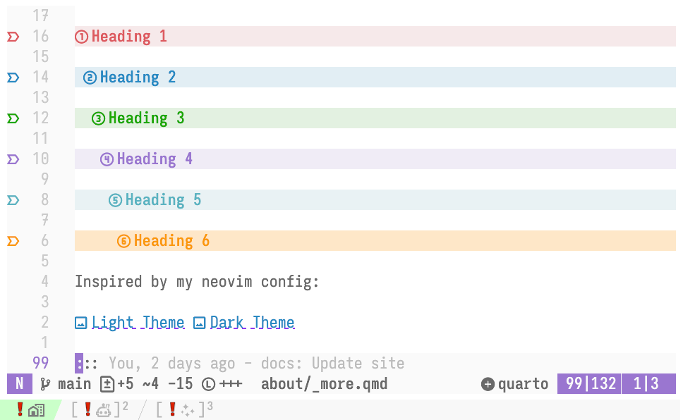
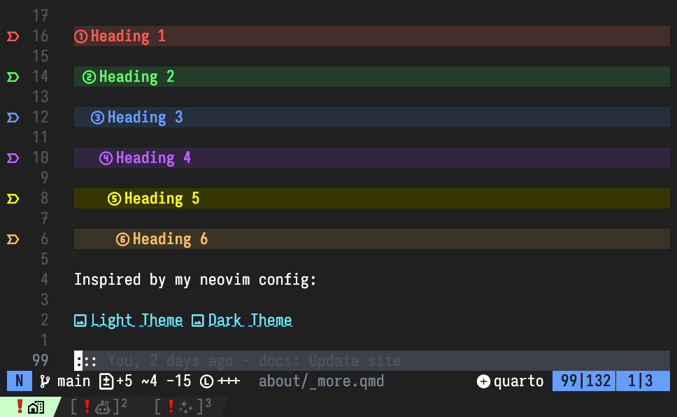

# 📰 Nice Headings
Sam Foreman
2025-06-01

<link rel="preconnect" href="https://fonts.googleapis.com">

- [Heading 1](#heading-1)
  - [Heading 2](#heading-2)
    - [Heading 3](#heading-3)

I like headings. They help organize content and make it easier to read.

Inspired by my neovim config, I wanted to recreate a similar style for
headings in my website.

(a) Light Theme

(b) Dark Theme

Figure 1: My neovim headings in light and dark themes.

I think they turned out pretty well!

# Heading 1

## Heading 2

### Heading 3

#### Heading 4

##### Heading 5

###### Heading 6
