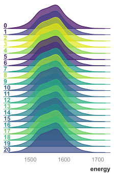
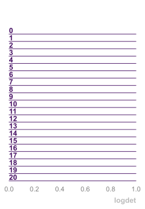
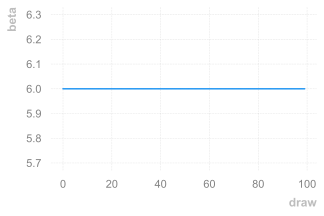
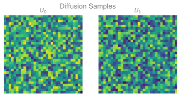
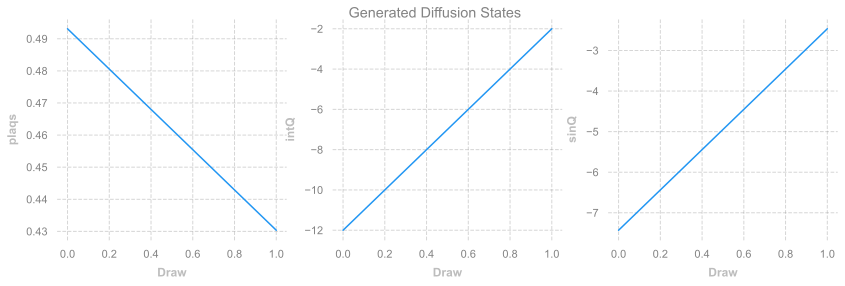
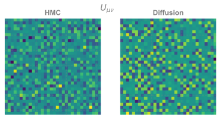
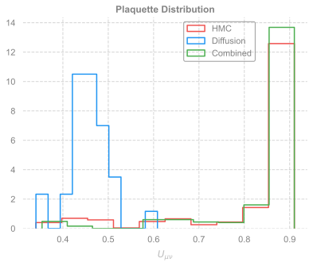

# 🎲 MCMC + Diffusion Sampling
Sam Foreman
2024-04-15

<link rel="preconnect" href="https://fonts.googleapis.com">

- [Denoising Diffusion Probabilistic
  Models](#denoising-diffusion-probabilistic-models)
- [Imports / Setup](#imports--setup)
- [2D $U(1)$](#2d-u1)
- [Train Diffusion Model](#train-diffusion-model)
- [Build Diffusion Model with UNet
  Architecure](#build-diffusion-model-with-unet-architecure)
  - [Perform initial training on HMC
    samples](#perform-initial-training-on-hmc-samples)
- [HMC Sampling with Diffusion](#hmc-sampling-with-diffusion)
- [Alternate](#alternate)

## Denoising Diffusion Probabilistic Models

## Imports / Setup

``` python
from __future__ import absolute_import, print_function, annotations, division
from dataclasses import dataclass

import sys
import os
import math
import numpy as np
import scipy
import time
from random import randrange
import matplotlib.pyplot as plt
import seaborn as sns
import numpy as np
```

``` python
from ezpz.dist import setup_torch

port = np.random.randint(5000, 6000)
print(f"Using port: {port}")

RANK = setup_torch(
    backend="DDP",
    port=f"{port}"
)
```

<div class="output cell-output cell-output-display">

<pre style="white-space:pre;overflow-x:auto;line-height:normal;">
Using port: 5561
&#10;Using DDP for distributed training
&#10;Global Rank: <span style="color: #008080; text-decoration-color: #008080; font-weight: bold">0</span> <span style="color: #800080; text-decoration-color: #800080">/</span> <span style="color: #008080; text-decoration-color: #008080; font-weight: bold">0</span>
</pre>

</div>

``` python
%matplotlib inline
import matplotlib_inline
matplotlib_inline.backend_inline.set_matplotlib_formats('svg')

from l2hmc.main import build_experiment
from l2hmc.utils.rich import get_console
from l2hmc.utils.plot_helpers import set_plot_style

import opinionated
from l2hmc.diffusion.diffusion import PureMH, MH_Diffusion
from l2hmc.utils.plot_helpers import set_plot_style

from pandas.io.formats import style
import scipy
import time
from random import randrange
from l2hmc.diffusion.diffusion import PureMH, MH_Diffusion

set_plot_style()
console = get_console()
print(console.is_jupyter)
if console.is_jupyter:
    console.is_jupyter = False
print(console.is_jupyter)
```

<div class="output cell-output cell-output-display">

<pre style="white-space:pre;overflow-x:auto;line-height:normal;">
Using device: cpu
Failed to download font: Source Sans Pro, skipping!
Failed to download font: Titillium WebRoboto Condensed, skipping!
True
False
</pre>

</div>

``` python
plt.style.use(opinionated.STYLES['opinionated_min'])
sns.set_context('notebook')
```

## 2D $U(1)$

``` python
from l2hmc.configs import dict_to_list_of_overrides

seed = np.random.randint(0, 2**32)
console.print(f"seed = {seed}")

overrides = {
    "seed": f"{seed}",
    "precision": "float32",
    "init_wandb": False,
    "init_aim": False,
    "use_wandb": False,
    "dynamics": {
        "latvolume": [32, 32],
        "nleapfrog": 10,
        "nchains": 16,
        "eps": 0.05,
    },
    "network": {
        "use_batch_norm": False,
    },
    'annealing_schedule': {
        'beta_init': 6.0,
        'beta_final': 6.0,
    },

}
OVERRIDES = dict_to_list_of_overrides(overrides)
```

<div class="output cell-output cell-output-display">

seed = 1675333995

</div>

``` python
from pathlib import Path
from l2hmc.common import get_timestamp
from enrich.console import get_theme, Console
console = Console(theme=get_theme())

OUTDIR = Path(
    'l2hmc-diffusion-2dU1'
).joinpath(get_timestamp("%Y-%m-%d"))
OUTDIR.mkdir(exist_ok=True, parents=True)
console.print(f"OUTDIR: {OUTDIR}")

date = get_timestamp('%Y-%m-%d')
PLOTS_DIR = OUTDIR.joinpath('plots')
PLOTS_DIR.mkdir(exist_ok=True, parents=True)
console.print(f"Saving figures to: {PLOTS_DIR}")
```

<div class="output cell-output cell-output-display">

<pre style="white-space:pre;overflow-x:auto;line-height:normal;">
OUTDIR: l2hmc-diffusion-2dU1/<span style="color: #2094f3; text-decoration-color: #2094f3">2023</span>-<span style="color: #2094f3; text-decoration-color: #2094f3">09</span>-<span style="color: #2094f3; text-decoration-color: #2094f3">21</span>
Saving figures to: l2hmc-diffusion-2dU1/<span style="color: #2094f3; text-decoration-color: #2094f3">2023</span>-<span style="color: #2094f3; text-decoration-color: #2094f3">09</span>-<span style="color: #2094f3; text-decoration-color: #2094f3">21</span>/plots
</pre>

</div>

``` python
#os.environ['MASTER_PORT'] = '5436'

exp = build_experiment(
    overrides=[
        *OVERRIDES,
        'framework=pytorch',
        'backend=DDP'
    ]
)
```

<div class="output cell-output cell-output-display">

<pre style="white-space:pre;overflow-x:auto;line-height:normal; margin-bottom:0;">
[09/21/23 12:23:55][INFO][dist.py:226] - Caught MASTER_PORT:5561 from environment!
[09/21/23 12:23:55][INFO][dist.py:338] - Global Rank: 0 / 0
[09/21/23 12:23:58][INFO][experiment.py:251] - Creating outputs/2023-09-21-122358/pytorch/train
[09/21/23 12:23:58][INFO][experiment.py:251] - Creating outputs/2023-09-21-122358/pytorch/eval
[09/21/23 12:23:58][INFO][experiment.py:251] - Creating outputs/2023-09-21-122358/pytorch/hmc
[09/21/23 12:23:58][INFO][dist.py:226] - Caught MASTER_PORT:5561 from environment!
[09/21/23 12:23:58][INFO][dist.py:226] - Caught MASTER_PORT:5561 from environment!
[09/21/23 12:24:06][INFO][trainer.py:441] - Looking for checkpoints in:
 /Users/samforeman/projects/saforem2/l2hmc-qcd/src/l2hmc/checkpoints/U1/2-32-32/nlf-10/xsplit-True/sepnets-True/merge-True/conv-8-16-32-64-128_5-3-3-3-2_2-2-2-2-2/net-16-16-16-16_dp-0.2_bn-False/pytorch
[09/21/23 12:24:06][WARNING][trainer.py:437] - No checkpoints found to load from
[09/21/23 12:24:06][WARNING][trainer.py:437] - Restoring global step from ckpt! self._gstep: 0
[09/21/23 12:24:06][WARNING][trainer.py:437] - Using `torch.optim.Adam` optimizer
[09/21/23 12:24:06][INFO][trainer.py:284] - num_params in model: 958628260
[09/21/23 12:24:09][WARNING][trainer.py:250] - logging with freq 50 for wandb.watch
</pre>

</div>

``` python
state = exp.trainer.dynamics.random_state(6.0)
xdim = state.x.flatten().shape[0]

dim = xdim
low_bound = (-np.pi) * np.ones(dim)
high_bound = (np.pi) * np.ones(dim)
sigma = 0.15
retrains = 10
samples_per_retrain = 100
diffusion_prob = 0.1
```

``` python
sns.set_context('notebook')

outputs = {}
outputs['hmc'] = exp.trainer.eval(
    job_type='hmc',
    beta=6.0,
    nprint=100,
    nchains=16,
    eval_steps=1000
)
#hdset = exp.save_dataset(job_type='hmc', nchains=1)
```

<div class="output cell-output cell-output-display">

<pre style="white-space:pre;overflow-x:auto;">
[09/21/23 12:24:21][WARNING][trainer.py:437] - Step size `eps` not specified for HMC! Using default: 0.1000 for generic HMC
[09/21/23 12:24:21][WARNING][trainer.py:437] - x.shape (original): torch.Size([16, 2, 32, 32])
[09/21/23 12:24:21][WARNING][trainer.py:437] - x[:nchains].shape: torch.Size([16, 2, 32, 32])
[09/21/23 12:24:21][INFO][trainer.py:1058] - eps=0.1
beta=6.0
nlog=10
table=<rich.table.Table object at 0x2e1b98520>
nprint=100
eval_steps=1000
nleapfrog=20
&#10;
[09/21/23 12:24:24][INFO][trainer.py:1188] - hstep=0 dt=0.024 beta=6.000 loss=3.410 dQsin=0.125 dQint=0.000 energy=1586.502 logprob=1586.502 logdet=0.000 acc=0.472 sumlogdet=0.000 acc_mask=0.500 plaqs=0.909 intQ=0.000 sinQ=0.051
[09/21/23 12:24:27][INFO][trainer.py:1188] - hstep=100 dt=0.026 beta=6.000 loss=2.876 dQsin=0.163 dQint=0.000 energy=1555.800 logprob=1555.800 logdet=0.000 acc=0.593 sumlogdet=0.000 acc_mask=0.688 plaqs=0.912 intQ=-0.125 sinQ=-0.159
[09/21/23 12:24:31][INFO][trainer.py:1188] - hstep=200 dt=0.025 beta=6.000 loss=4.678 dQsin=0.088 dQint=0.063 energy=1569.994 logprob=1569.994 logdet=0.000 acc=0.451 sumlogdet=0.000 acc_mask=0.250 plaqs=0.912 intQ=-0.187 sinQ=-0.149
[09/21/23 12:24:34][INFO][trainer.py:1188] - hstep=300 dt=0.024 beta=6.000 loss=14.041 dQsin=0.094 dQint=0.000 energy=1554.118 logprob=1554.118 logdet=0.000 acc=0.438 sumlogdet=0.000 acc_mask=0.438 plaqs=0.914 intQ=-0.125 sinQ=-0.114
[09/21/23 12:24:38][INFO][trainer.py:1188] - hstep=400 dt=0.024 beta=6.000 loss=-0.739 dQsin=0.199 dQint=0.000 energy=1566.516 logprob=1566.516 logdet=0.000 acc=0.509 sumlogdet=0.000 acc_mask=0.562 plaqs=0.912 intQ=-0.437 sinQ=-0.452
[09/21/23 12:24:41][INFO][trainer.py:1188] - hstep=500 dt=0.045 beta=6.000 loss=1.545 dQsin=0.100 dQint=0.000 energy=1570.837 logprob=1570.837 logdet=0.000 acc=0.448 sumlogdet=0.000 acc_mask=0.562 plaqs=0.911 intQ=0.125 sinQ=0.189
[09/21/23 12:24:45][INFO][trainer.py:1188] - hstep=600 dt=0.025 beta=6.000 loss=3.780 dQsin=0.094 dQint=0.000 energy=1568.012 logprob=1568.012 logdet=0.000 acc=0.463 sumlogdet=0.000 acc_mask=0.500 plaqs=0.913 intQ=0.438 sinQ=0.466
[09/21/23 12:24:50][INFO][trainer.py:1188] - hstep=700 dt=0.023 beta=6.000 loss=-0.902 dQsin=0.113 dQint=0.000 energy=1563.778 logprob=1563.778 logdet=0.000 acc=0.475 sumlogdet=0.000 acc_mask=0.375 plaqs=0.913 intQ=0.688 sinQ=0.628
[09/21/23 12:24:53][INFO][trainer.py:1188] - hstep=800 dt=0.024 beta=6.000 loss=11.416 dQsin=0.061 dQint=0.000 energy=1561.427 logprob=1561.427 logdet=0.000 acc=0.339 sumlogdet=0.000 acc_mask=0.438 plaqs=0.913 intQ=0.813 sinQ=0.755
[09/21/23 12:24:57][INFO][trainer.py:1188] - hstep=900 dt=0.028 beta=6.000 loss=1.114 dQsin=0.127 dQint=0.000 energy=1564.465 logprob=1564.465 logdet=0.000 acc=0.699 sumlogdet=0.000 acc_mask=0.625 plaqs=0.913 intQ=0.938 sinQ=0.893
</pre>


</div>

``` python
# %matplotlib inline
from l2hmc.common import plot_dataset
sns.set_context('notebook')
hdataset = outputs['hmc']['history'].get_dataset()
plot_dataset(hdataset, outdir=PLOTS_DIR, job_type='HMC')
```

<div class="output cell-output cell-output-display">

<pre style="white-space:pre;overflow-x:auto;line-height:normal; margin-bottom:0; margin-bottom: 0;">
[09/21/23 12:25:06][INFO][plot_helpers.py:1049] - Saving figure to: l2hmc-diffusion-2dU1/2023-09-21/plots/ridgeplots/svgs/energy_ridgeplot.svg
[09/21/23 12:25:09][INFO][plot_helpers.py:1049] - Saving figure to: l2hmc-diffusion-2dU1/2023-09-21/plots/ridgeplots/svgs/logprob_ridgeplot.svg
[09/21/23 12:25:11][INFO][plot_helpers.py:1049] - Saving figure to: l2hmc-diffusion-2dU1/2023-09-21/plots/ridgeplots/svgs/logdet_ridgeplot.svg
</pre>









</div>

``` python
import torch

initial_states = []
state_init = exp.trainer.dynamics.random_state(6.0)
x = state_init.x
beta = state_init.beta

NSAMPLES = 1000
for idx in range(NSAMPLES + int(0.1 * NSAMPLES)):
    if idx % 100 == 0:
        console.print(f"step: {idx}")
    x, metrics = exp.trainer.hmc_step((x, beta))
    if idx > int((0.1 * NSAMPLES)):
        initial_states.append(x)

initial_states = torch.stack(initial_states).squeeze()
initial_states_np = initial_states.detach().cpu().numpy()
```

<div class="output cell-output cell-output-display">

<pre style="white-space:pre;overflow-x:auto;line-height:normal;">
step: <span style="color: #2094f3; text-decoration-color: #2094f3">0</span>
step: <span style="color: #2094f3; text-decoration-color: #2094f3">100</span>
step: <span style="color: #2094f3; text-decoration-color: #2094f3">200</span>
step: <span style="color: #2094f3; text-decoration-color: #2094f3">300</span>
step: <span style="color: #2094f3; text-decoration-color: #2094f3">400</span>
step: <span style="color: #2094f3; text-decoration-color: #2094f3">500</span>
step: <span style="color: #2094f3; text-decoration-color: #2094f3">600</span>
step: <span style="color: #2094f3; text-decoration-color: #2094f3">700</span>
step: <span style="color: #2094f3; text-decoration-color: #2094f3">800</span>
step: <span style="color: #2094f3; text-decoration-color: #2094f3">900</span>
step: <span style="color: #2094f3; text-decoration-color: #2094f3">1000</span>
</pre>

</div>

``` python
initial_states_np.shape
```

<div class="output cell-output cell-output-display execute_result"
execution_count="14">

    (999, 16, 2048)

</div>

``` python
x_ = initial_states_np.reshape(-1, 16, 2, 32, 32)
tmp_ = x_[:, 0, ...]
console.print(f'{x_.shape}')
console.print(f'{tmp_.shape}')
```

<div class="output cell-output cell-output-display">

<pre style="white-space:pre;overflow-x:auto;line-height:normal;">
<span style="font-weight: bold">(</span><span style="color: #2094f3; text-decoration-color: #2094f3">999</span>, <span style="color: #2094f3; text-decoration-color: #2094f3">16</span>, <span style="color: #2094f3; text-decoration-color: #2094f3">2</span>, <span style="color: #2094f3; text-decoration-color: #2094f3">32</span>, <span style="color: #2094f3; text-decoration-color: #2094f3">32</span><span style="font-weight: bold">)</span>
<span style="font-weight: bold">(</span><span style="color: #2094f3; text-decoration-color: #2094f3">999</span>, <span style="color: #2094f3; text-decoration-color: #2094f3">2</span>, <span style="color: #2094f3; text-decoration-color: #2094f3">32</span>, <span style="color: #2094f3; text-decoration-color: #2094f3">32</span><span style="font-weight: bold">)</span>
</pre>

</div>

``` python
from l2hmc.common import savefig

#x_ = initial_states_np[:100].reshape(-1, 2, 32, 32)
tmp_ = x_[:, 0, ...]
fig, ax = plt.subplots()
sns.kdeplot(
    x=tmp_[-100:, 0].flatten(),
    y=tmp_[-100:, 1].flatten(),
    # ax=ax,
    cmap='viridis',
    # ax=axes[0],
    # cmap="Blues",
    shade=False,
    # bw_adjust=0.5,
    thresh=0
)
ax.set_xlim((-4, 4))
ax.set_ylim((-4, 4))
savefig(
    f'hmc_samples-{NSAMPLES}',
    Path(PLOTS_DIR),
    tstamp=True,
)
```

<div class="output cell-output cell-output-display">

    Saving hmc_samples-1000-2023-09-21-122840 to l2hmc-diffusion-2dU1/2023-09-21/plots

</div>

<div class="output cell-output cell-output-display">


</div>

``` python
class Diffusion:
    def __init__(
            self,
            noise_steps: int = 1000,
            beta_start: float = 1e-4,
            beta_end: float = 0.02,
            nchannels: int = 2,
            img_size: int = 256,
            device: str = "cuda"
    ):
        self.noise_steps = noise_steps
        self.beta_start = beta_start
        self.beta_end = beta_end
        self.img_size = img_size
        self.device = device
        self.nchannels = nchannels

        self.beta = self.prepare_noise_schedule().to(device)
        self.alpha = 1. - self.beta
        self.alpha_hat = torch.cumprod(self.alpha, dim=0)

    def prepare_noise_schedule(self):
        return torch.linspace(self.beta_start, self.beta_end, self.noise_steps)

    def noise_images(self, x, t):
        sqrt_alpha_hat = torch.sqrt(self.alpha_hat[t])[:, None, None, None]
        sqrt_one_minus_alpha_hat = torch.sqrt(
            1 - self.alpha_hat[t]
        )[:, None, None, None]
        eps = torch.randn_like(x)
        return sqrt_alpha_hat * x + sqrt_one_minus_alpha_hat * eps, eps

    def sample_timesteps(self, n):
        return torch.randint(low=1, high=self.noise_steps, size=(n,))

    def sample(self, model, n):
        # console.print(f"Sampling {n} new images....")
        model.eval()
        with torch.no_grad():
            x = torch.randn(
                (n, self.nchannels, self.img_size, self.img_size)
            ).to(self.device)
            sample_bar = tqdm(
                reversed(range(1, self.noise_steps)),
                position=0,
                total=self.noise_steps - 1,
                dynamic_ncols=True,
            )
            for i in sample_bar:
                t = (torch.ones(n) * i).long().to(self.device)
                predicted_noise = model(x, t)
                alpha = self.alpha[t][:, None, None, None]
                alpha_hat = self.alpha_hat[t][:, None, None, None]
                beta = self.beta[t][:, None, None, None]
                if i > 1:
                    noise = torch.randn_like(x)
                else:
                    noise = torch.zeros_like(x)
                x = (
                    (1 / torch.sqrt(alpha))
                    * (
                        x 
                        - ((1 - alpha) / (torch.sqrt(1 - alpha_hat)))
                        * predicted_noise
                    ) 
                    + (torch.sqrt(beta) * noise)
                )
        model.train()
        x = (x + np.pi) % (2 * np.pi) - np.pi
        return x
```

``` python
initial_states.shape
```

<div class="output cell-output cell-output-display execute_result"
execution_count="29">

    torch.Size([999, 16, 2048])

</div>

## Train Diffusion Model

``` python
import torchvision
import os
import random
from pathlib import Path
import torch
import torchvision
import torchvision.transforms as T
import numpy as np
from PIL import Image
#from fastdownload import FastDownload
from torch.utils.data import DataLoader

def save_images(images, path, **kwargs):
    grid = torchvision.utils.make_grid(images, **kwargs)
    ndarr = grid.permute(1, 2, 0).to('cpu').numpy()
    im = Image.fromarray(ndarr)
    im.save(path)
```

## Build Diffusion Model with UNet Architecure

``` python
from torch import nn
from torch import optim
import torch.nn.functional as F
from tqdm.auto import tqdm
from torch.utils.data import DataLoader
from torch.utils.data import TensorDataset

from l2hmc.common import savefig
from l2hmc.diffusion.modules import NoiseScheduler, UNet
from l2hmc.diffusion import ddpm

DEVICE = 'cuda' if torch.cuda.is_available() else 'cpu'

config = {
    'channels_in': 2,
    'channels_out': 2,
    'train_batch_size': 5,
    'learning_rate': 0.001,
    'num_epochs': 1,
    'noise_steps': 100,
    'beta': 6.0,
    'img_size': 32,
    'retrains': 10,
    'samples_per_retrain': 500,
    'diffusion_prob': 0.1,
}

model = UNet(c_in=2, c_out=2)

dataset = TensorDataset(initial_states.reshape(-1, 2, 32, 32))
dataloader = DataLoader(
    dataset,
    batch_size=config["train_batch_size"],
    shuffle=False,
    drop_last=True
)


optimizer = optim.AdamW(model.parameters(), lr=config['learning_rate'])
mse = nn.MSELoss()
diffusion = Diffusion(
    noise_steps=100,
    img_size=32,
    device=DEVICE,
    nchannels=2,
)
#logger = SummaryWriter(os.path.join("runs", args.run_name))
l = len(dataloader)

run_name = 'diffusion2dU1'
```

### Perform initial training on HMC samples

``` python
from torch import optim
device = 'cpu'
#dataloader = get_data(args)
#model = UNet().to(device)

sampled_images_history = []

for epoch in range(config['num_epochs']):
    console.print(f"Starting epoch {epoch}:")
    pbar = tqdm(dataloader)
    for i, images in enumerate(pbar):
        if isinstance(images, (tuple, list)) and len(images) == 1:
            images = images[0]
        t = diffusion.sample_timesteps(images.shape[0]).to(device)
        x_t, noise = diffusion.noise_images(images, t)
        predicted_noise = model(x_t, t)
        loss = mse(noise, predicted_noise)

        optimizer.zero_grad()
        loss.backward()
        optimizer.step()

        pbar.set_postfix({'epoch': epoch, 'batch': i, 'MSE': loss.item()})
    console.print(f'epoch: {epoch}, loss: {loss.item()}')
    sampled_images = diffusion.sample(model, n=images.shape[0])
    sampled_images_history.append(sampled_images)
    sns.set_context('notebook')
    #tmp = initial_states.reshape(-1, 2, 32, 32)
    fig, ax = plt.subplots(ncols=2)
    _ = ax[0].imshow(sampled_images[0, 0, :, :])
    _ = ax[1].imshow(sampled_images[0, 1, :, :])
    _ = ax[0].set_xticklabels([])
    _ = ax[1].set_xticklabels([])
    _ = ax[0].set_yticklabels([])
    _ = ax[1].set_yticklabels([])
    _ = ax[0].set_title(r"$U_{0}$", loc='center')
    _ = ax[1].set_title(r"$U_{1}$", loc='center')
    _ = fig.suptitle('Diffusion Samples', y=0.8)
    plt.show()
    savefig(fname=f'sampled_image_epoch{epoch}', outdir=PLOTS_DIR, tstamp=True)
    MODEL_FILE = OUTDIR.joinpath("models", f"unet-diffusion-epoch{epoch}.pt")
    MODEL_FILE.parent.mkdir(exist_ok=True, parents=True)
    console.print(f"Saving model checkpoint to: {MODEL_FILE}")
    torch.save(model.state_dict(), MODEL_FILE)
```

<div class="output cell-output cell-output-display">

<pre style="white-space:pre;overflow-x:auto;line-height:normal;">
Starting epoch <span style="color: #2094f3; text-decoration-color: #2094f3">0</span>:
</pre>

</div>

<div class="output cell-output cell-output-display">

``` json
{"model_id":"19b415c346b24bef8b60336d7f7bc355","version_major":2,"version_minor":0}
```

</div>

<div class="output cell-output cell-output-display">

<pre style="white-space:pre;overflow-x:auto;line-height:normal;">
epoch: <span style="color: #2094f3; text-decoration-color: #2094f3">0</span>, loss: <span style="color: #2094f3; text-decoration-color: #2094f3">0.6023472547531128</span>
</pre>

</div>

<div class="output cell-output cell-output-display">

``` json
{"model_id":"eea24504754f4cb9ab4d9925a6225c10","version_major":2,"version_minor":0}
```

</div>

<div class="output cell-output cell-output-display">



</div>

<div class="output cell-output cell-output-display">

    Saving sampled_image_epoch0-2023-09-21-124506 to l2hmc-diffusion-2dU1/2023-09-21/plots

</div>

<div class="output cell-output cell-output-display">

<pre style="white-space:pre;overflow-x:auto;line-height:normal;">
Saving model checkpoint to: l2hmc-diffusion-2dU1/<span style="color: #2094f3; text-decoration-color: #2094f3">2023</span>-<span style="color: #2094f3; text-decoration-color: #2094f3">09</span>-<span style="color: #2094f3; text-decoration-color: #2094f3">21</span>/models/unet-diffusion-epoch0.pt
</pre>

</div>

<div class="output cell-output cell-output-display">

\<Figure size 640x480 with 0 Axes\>

</div>

``` python
sns.set_context('notebook')
tmp = initial_states.reshape(-1, 2, 32, 32)
fig, ax = plt.subplots(ncols=2)
_ = ax[0].imshow(tmp[0, 0, :, :])
_ = ax[1].imshow(tmp[0, 1, :, :])
_ = ax[0].set_title(r"$U_{0}$", loc='center')
_ = ax[0].set_xticklabels([])
_ = ax[1].set_xticklabels([])
_ = ax[0].set_yticklabels([])
_ = ax[1].set_yticklabels([])
_ = ax[1].set_title(r"$U_{1}$", loc='center')
_ = fig.suptitle('HMC Samples', y=0.8)
```


``` python
sampled_images_history_ = torch.stack(sampled_images_history)
```

``` python
sampled_images_history_.shape
```

    torch.Size([1, 5, 2, 32, 32])

``` python
sns.set_context('notebook')
fig, ax = plt.subplots(ncols=2)
_ = ax[0].imshow(sampled_images_history_[0][0][0])
_ = ax[1].imshow(sampled_images_history_[0][0][1])
_ = ax[0].set_xticklabels([])
_ = ax[1].set_xticklabels([])
_ = ax[0].set_yticklabels([])
_ = ax[1].set_yticklabels([])
_ = ax[0].set_title(r"$U_{0}$", loc='center')
_ = ax[1].set_title(r"$U_{1}$", loc='center')
_ = fig.suptitle('Diffusion Samples', y=0.85)
```


``` python
for idx in range(sampled_images_history_.shape[0]):
    q = exp.trainer.lattice.charges(x=sampled_images_history_[idx])
    console.print(f'{idx}: {q}')
```

<div class="output cell-output cell-output-display">

<pre style="white-space:pre;overflow-x:auto;line-height:normal;">
<span style="color: #2094f3; text-decoration-color: #2094f3">0</span>: <span style="color: #ff00ff; text-decoration-color: #ff00ff; font-weight: bold">Charges</span><span style="font-weight: bold">(</span><span style="color: #7d8697; text-decoration-color: #7d8697">intQ</span>=<span style="color: #ff00ff; text-decoration-color: #ff00ff; font-weight: bold">tensor</span><span style="font-weight: bold">([</span> <span style="color: #2094f3; text-decoration-color: #2094f3">5.0000e+00</span>, <span style="color: #2094f3; text-decoration-color: #2094f3">-4.0000e+00</span>, <span style="color: #2094f3; text-decoration-color: #2094f3">-6.0000e+00</span>, <span style="color: #2094f3; text-decoration-color: #2094f3">-4.5535e-07</span>,  <span style="color: #2094f3; text-decoration-color: #2094f3">1.0000e+00</span><span style="font-weight: bold">])</span>, <span style="color: #7d8697; text-decoration-color: #7d8697">sinQ</span>=<span style="color: #ff00ff; text-decoration-color: #ff00ff; font-weight: bold">tensor</span><span style="font-weight: bold">([</span> <span style="color: #2094f3; text-decoration-color: #2094f3">1.6426</span>, <span style="color: #2094f3; text-decoration-color: #2094f3">-1.7244</span>, <span style="color: #2094f3; text-decoration-color: #2094f3">-4.4651</span>,  <span style="color: #2094f3; text-decoration-color: #2094f3">0.5680</span>,  <span style="color: #2094f3; text-decoration-color: #2094f3">0.7046</span><span style="font-weight: bold">]))</span>
</pre>

</div>

## HMC Sampling with Diffusion

``` python
#for retrain_iter in range(config['retrains']):
state = exp.trainer.dynamics.random_state(config['beta'])
x = state.x

histories = {}
samples = []
hmc_samples = []
diffusion_samples = []

global_step = 0
watcher = {}
update_types = []
combined_samples = {}
```

``` python
global_step
```

<div class="output cell-output cell-output-display execute_result"
execution_count="33">

    0

</div>

``` python
for retrain_iter in range(2):
    console.print(f'retrain_iter: {retrain_iter}')
    ndiff_acc = 0
    ndiff_proposed = 0
    histories[retrain_iter] = {
        'diffusion': [],
        'hmc': [],
    }
    #for idx in range(config['samples_per_retrain']):
    sbar = tqdm(range(10))
    for idx in sbar:
        t0_ = time.perf_counter()
        if idx % 100 == 0:
            console.print(f'sample idx: {idx}')
        rand = np.random.uniform()
        if (retrain_iter >= 1) and rand < diffusion_prob:
            console.print(f'rand: {rand} < {diffusion_prob}')
            # Sample from diffusion model
            x_ = diffusion.sample(model, n=x.shape[0])
            ll_ = exp.trainer.dynamics.potential_energy(x_, config['beta'])
            ll = exp.trainer.dynamics.potential_energy(x, config['beta'])
            ratio = ll_ / ll
            a = torch.min(torch.ones_like(ratio), ratio)
            u = torch.rand(a.shape)
            #u = np.random.uniform()
            #for jdx in range(u.shape[0]):
            #    if u[jdx] < a[jdx]:
            #        samples.append(x_[jdx])
            #        diffusion_samples.append(x_[jdx])
            #x = torch.where((u < a), x_, x.reshape_as(x_)).reshape_as(x)
            x = torch.where((u < a)[:, None, None, None], x_, x.reshape_as(x_))
            samples.append(x)
            diffusion_samples.append(x)
            combined_samples[global_step] = x
            watcher[global_step] = 'diffusion'
            #diffusion_samples.extend(x)
            #samples.extend(x)
            #ndiff_acc += 
            #if u < a:
            #    console.print('Accepted diffusion sample!')
            #    console.print(f'{ndiff_acc} / {ndiff_proposed}')
            #    ndiff_acc += 1
            #    x = x_
            #    diffusion_samples.append(x)
            #    samples.append(x)
        else:
            # Oherwise, HMC
            x, metrics = exp.trainer.hmc_step((x, config['beta']))
            hmc_samples.append(x)
            samples.append(x)
            combined_samples[global_step] = x
            watcher[global_step] = 'HMC'
        smetrics = {
            'idx': idx,
            'global_step': global_step,
            'dt': time.perf_counter() - t0_,
        }
        global_step += 1
        #smetrics |= {
        #    f'{k}': {torch.tensor(v).mean().item()} for k, v in metrics.items()
        #}
        sbar.set_postfix(smetrics)
    # Train loop
    dataset = TensorDataset(
        torch.stack(hmc_samples).reshape(-1, 2, 32, 32)
    )
    dataloader = DataLoader(
        dataset,
        shuffle=False,
        drop_last=True,
        batch_size=config["train_batch_size"],
    )
    pbar = tqdm(dataloader)
    for i, batch in enumerate(pbar):
        if i == 0:
            console.print('Retraining...')
        if isinstance(batch, (tuple, list)) and len(batch) == 1:
            batch, = batch
        batch = batch.reshape(-1, 2, 32, 32)
        t0 = time.time()
        t = diffusion.sample_timesteps(batch.shape[0]).to(device)
        x_t, noise = diffusion.noise_images(batch, t)
        predicted_noise = model(x_t, t)
        loss = mse(noise, predicted_noise)
        optimizer.zero_grad()
        loss.backward()
        optimizer.step()
        t1 = time.time()
        pbar.set_postfix(
            {
                'global_step': global_step,
                'retrain_iter': retrain_iter,
                'batch': i,
                'dt': t1 - t0,
                'MSE': loss.item()
            }
        )
```

<div class="output cell-output cell-output-display">

<pre style="white-space:pre;overflow-x:auto;line-height:normal;">
retrain_iter: <span style="color: #2094f3; text-decoration-color: #2094f3">0</span>

``` json
{"model_id":"17132d7ca8624fa387ee9467e4f1fa4d","version_major":2,"version_minor":0}
```

<pre style="white-space:pre;overflow-x:auto;line-height:normal;">
sample idx: <span style="color: #2094f3; text-decoration-color: #2094f3">0</span>
</pre>

``` json
{"model_id":"0ed1080fdebd4f7b9aae80db0d36b96b","version_major":2,"version_minor":0}
```

<pre style="white-space:pre;overflow-x:auto;line-height:normal;">
Retraining<span style="color: #808000; text-decoration-color: #808000">...</span>
</pre>

<pre style="white-space:pre;overflow-x:auto;line-height:normal;">
retrain_iter: <span style="color: #2094f3; text-decoration-color: #2094f3">1</span>
</pre>

``` json
{"model_id":"d0346019e21b4d2a9b624dc59e84015b","version_major":2,"version_minor":0}
```

<pre style="white-space:pre;overflow-x:auto;line-height:normal;">
sample idx: <span style="color: #2094f3; text-decoration-color: #2094f3">0</span>
</pre>

<pre style="white-space:pre;overflow-x:auto;line-height:normal;">
rand: <span style="color: #2094f3; text-decoration-color: #2094f3">0.05506106760134255</span> &lt; <span style="color: #2094f3; text-decoration-color: #2094f3">0.1</span>
</pre>

``` json
{"model_id":"c02b09d53ada46a194a47921f0ab3cba","version_major":2,"version_minor":0}
```

<pre style="white-space:pre;overflow-x:auto;line-height:normal;">
rand: <span style="color: #2094f3; text-decoration-color: #2094f3">0.07860283644524213</span> &lt; <span style="color: #2094f3; text-decoration-color: #2094f3">0.1</span>
</pre>

``` json
{"model_id":"184df3f1c9714ece9756866b2617ed02","version_major":2,"version_minor":0}
```

``` json
{"model_id":"eaa0d84229c04618b7a2bffe2a4b1739","version_major":2,"version_minor":0}
```

<pre style="white-space:pre;overflow-x:auto;line-height:normal;">
Retraining<span style="color: #808000; text-decoration-color: #808000">...</span>
</pre>

</div>

``` python
console.print('\n'.join([f"{i.shape}" for i in samples[:100]]))
```

<div class="output cell-output cell-output-display">

<pre style="white-space:pre;overflow-x:auto;line-height:normal;">
<span style="color: #ff00ff; text-decoration-color: #ff00ff; font-weight: bold">torch.Size</span><span style="font-weight: bold">([</span><span style="color: #2094f3; text-decoration-color: #2094f3">16</span>, <span style="color: #2094f3; text-decoration-color: #2094f3">2048</span><span style="font-weight: bold">])</span>
<span style="color: #ff00ff; text-decoration-color: #ff00ff; font-weight: bold">torch.Size</span><span style="font-weight: bold">([</span><span style="color: #2094f3; text-decoration-color: #2094f3">16</span>, <span style="color: #2094f3; text-decoration-color: #2094f3">2048</span><span style="font-weight: bold">])</span>
<span style="color: #ff00ff; text-decoration-color: #ff00ff; font-weight: bold">torch.Size</span><span style="font-weight: bold">([</span><span style="color: #2094f3; text-decoration-color: #2094f3">16</span>, <span style="color: #2094f3; text-decoration-color: #2094f3">2048</span><span style="font-weight: bold">])</span>
<span style="color: #ff00ff; text-decoration-color: #ff00ff; font-weight: bold">torch.Size</span><span style="font-weight: bold">([</span><span style="color: #2094f3; text-decoration-color: #2094f3">16</span>, <span style="color: #2094f3; text-decoration-color: #2094f3">2048</span><span style="font-weight: bold">])</span>
<span style="color: #ff00ff; text-decoration-color: #ff00ff; font-weight: bold">torch.Size</span><span style="font-weight: bold">([</span><span style="color: #2094f3; text-decoration-color: #2094f3">16</span>, <span style="color: #2094f3; text-decoration-color: #2094f3">2048</span><span style="font-weight: bold">])</span>
<span style="color: #ff00ff; text-decoration-color: #ff00ff; font-weight: bold">torch.Size</span><span style="font-weight: bold">([</span><span style="color: #2094f3; text-decoration-color: #2094f3">16</span>, <span style="color: #2094f3; text-decoration-color: #2094f3">2048</span><span style="font-weight: bold">])</span>
<span style="color: #ff00ff; text-decoration-color: #ff00ff; font-weight: bold">torch.Size</span><span style="font-weight: bold">([</span><span style="color: #2094f3; text-decoration-color: #2094f3">16</span>, <span style="color: #2094f3; text-decoration-color: #2094f3">2048</span><span style="font-weight: bold">])</span>
<span style="color: #ff00ff; text-decoration-color: #ff00ff; font-weight: bold">torch.Size</span><span style="font-weight: bold">([</span><span style="color: #2094f3; text-decoration-color: #2094f3">16</span>, <span style="color: #2094f3; text-decoration-color: #2094f3">2048</span><span style="font-weight: bold">])</span>
<span style="color: #ff00ff; text-decoration-color: #ff00ff; font-weight: bold">torch.Size</span><span style="font-weight: bold">([</span><span style="color: #2094f3; text-decoration-color: #2094f3">16</span>, <span style="color: #2094f3; text-decoration-color: #2094f3">2048</span><span style="font-weight: bold">])</span>
<span style="color: #ff00ff; text-decoration-color: #ff00ff; font-weight: bold">torch.Size</span><span style="font-weight: bold">([</span><span style="color: #2094f3; text-decoration-color: #2094f3">16</span>, <span style="color: #2094f3; text-decoration-color: #2094f3">2048</span><span style="font-weight: bold">])</span>
<span style="color: #ff00ff; text-decoration-color: #ff00ff; font-weight: bold">torch.Size</span><span style="font-weight: bold">([</span><span style="color: #2094f3; text-decoration-color: #2094f3">16</span>, <span style="color: #2094f3; text-decoration-color: #2094f3">2048</span><span style="font-weight: bold">])</span>
<span style="color: #ff00ff; text-decoration-color: #ff00ff; font-weight: bold">torch.Size</span><span style="font-weight: bold">([</span><span style="color: #2094f3; text-decoration-color: #2094f3">16</span>, <span style="color: #2094f3; text-decoration-color: #2094f3">2048</span><span style="font-weight: bold">])</span>
<span style="color: #ff00ff; text-decoration-color: #ff00ff; font-weight: bold">torch.Size</span><span style="font-weight: bold">([</span><span style="color: #2094f3; text-decoration-color: #2094f3">16</span>, <span style="color: #2094f3; text-decoration-color: #2094f3">2048</span><span style="font-weight: bold">])</span>
<span style="color: #ff00ff; text-decoration-color: #ff00ff; font-weight: bold">torch.Size</span><span style="font-weight: bold">([</span><span style="color: #2094f3; text-decoration-color: #2094f3">16</span>, <span style="color: #2094f3; text-decoration-color: #2094f3">2048</span><span style="font-weight: bold">])</span>
<span style="color: #ff00ff; text-decoration-color: #ff00ff; font-weight: bold">torch.Size</span><span style="font-weight: bold">([</span><span style="color: #2094f3; text-decoration-color: #2094f3">16</span>, <span style="color: #2094f3; text-decoration-color: #2094f3">2048</span><span style="font-weight: bold">])</span>
<span style="color: #ff00ff; text-decoration-color: #ff00ff; font-weight: bold">torch.Size</span><span style="font-weight: bold">([</span><span style="color: #2094f3; text-decoration-color: #2094f3">16</span>, <span style="color: #2094f3; text-decoration-color: #2094f3">2048</span><span style="font-weight: bold">])</span>
<span style="color: #ff00ff; text-decoration-color: #ff00ff; font-weight: bold">torch.Size</span><span style="font-weight: bold">([</span><span style="color: #2094f3; text-decoration-color: #2094f3">16</span>, <span style="color: #2094f3; text-decoration-color: #2094f3">2048</span><span style="font-weight: bold">])</span>
<span style="color: #ff00ff; text-decoration-color: #ff00ff; font-weight: bold">torch.Size</span><span style="font-weight: bold">([</span><span style="color: #2094f3; text-decoration-color: #2094f3">16</span>, <span style="color: #2094f3; text-decoration-color: #2094f3">2048</span><span style="font-weight: bold">])</span>
<span style="color: #ff00ff; text-decoration-color: #ff00ff; font-weight: bold">torch.Size</span><span style="font-weight: bold">([</span><span style="color: #2094f3; text-decoration-color: #2094f3">16</span>, <span style="color: #2094f3; text-decoration-color: #2094f3">2048</span><span style="font-weight: bold">])</span>
<span style="color: #ff00ff; text-decoration-color: #ff00ff; font-weight: bold">torch.Size</span><span style="font-weight: bold">([</span><span style="color: #2094f3; text-decoration-color: #2094f3">16</span>, <span style="color: #2094f3; text-decoration-color: #2094f3">2048</span><span style="font-weight: bold">])</span>
<span style="color: #ff00ff; text-decoration-color: #ff00ff; font-weight: bold">torch.Size</span><span style="font-weight: bold">([</span><span style="color: #2094f3; text-decoration-color: #2094f3">16</span>, <span style="color: #2094f3; text-decoration-color: #2094f3">2048</span><span style="font-weight: bold">])</span>
<span style="color: #ff00ff; text-decoration-color: #ff00ff; font-weight: bold">torch.Size</span><span style="font-weight: bold">([</span><span style="color: #2094f3; text-decoration-color: #2094f3">16</span>, <span style="color: #2094f3; text-decoration-color: #2094f3">2048</span><span style="font-weight: bold">])</span>
<span style="color: #ff00ff; text-decoration-color: #ff00ff; font-weight: bold">torch.Size</span><span style="font-weight: bold">([</span><span style="color: #2094f3; text-decoration-color: #2094f3">16</span>, <span style="color: #2094f3; text-decoration-color: #2094f3">2048</span><span style="font-weight: bold">])</span>
<span style="color: #ff00ff; text-decoration-color: #ff00ff; font-weight: bold">torch.Size</span><span style="font-weight: bold">([</span><span style="color: #2094f3; text-decoration-color: #2094f3">16</span>, <span style="color: #2094f3; text-decoration-color: #2094f3">2048</span><span style="font-weight: bold">])</span>
<span style="color: #ff00ff; text-decoration-color: #ff00ff; font-weight: bold">torch.Size</span><span style="font-weight: bold">([</span><span style="color: #2094f3; text-decoration-color: #2094f3">16</span>, <span style="color: #2094f3; text-decoration-color: #2094f3">2048</span><span style="font-weight: bold">])</span>
<span style="color: #ff00ff; text-decoration-color: #ff00ff; font-weight: bold">torch.Size</span><span style="font-weight: bold">([</span><span style="color: #2094f3; text-decoration-color: #2094f3">16</span>, <span style="color: #2094f3; text-decoration-color: #2094f3">2048</span><span style="font-weight: bold">])</span>
<span style="color: #ff00ff; text-decoration-color: #ff00ff; font-weight: bold">torch.Size</span><span style="font-weight: bold">([</span><span style="color: #2094f3; text-decoration-color: #2094f3">16</span>, <span style="color: #2094f3; text-decoration-color: #2094f3">2048</span><span style="font-weight: bold">])</span>
<span style="color: #ff00ff; text-decoration-color: #ff00ff; font-weight: bold">torch.Size</span><span style="font-weight: bold">([</span><span style="color: #2094f3; text-decoration-color: #2094f3">16</span>, <span style="color: #2094f3; text-decoration-color: #2094f3">2</span>, <span style="color: #2094f3; text-decoration-color: #2094f3">32</span>, <span style="color: #2094f3; text-decoration-color: #2094f3">32</span><span style="font-weight: bold">])</span>
<span style="color: #ff00ff; text-decoration-color: #ff00ff; font-weight: bold">torch.Size</span><span style="font-weight: bold">([</span><span style="color: #2094f3; text-decoration-color: #2094f3">16</span>, <span style="color: #2094f3; text-decoration-color: #2094f3">2048</span><span style="font-weight: bold">])</span>
<span style="color: #ff00ff; text-decoration-color: #ff00ff; font-weight: bold">torch.Size</span><span style="font-weight: bold">([</span><span style="color: #2094f3; text-decoration-color: #2094f3">16</span>, <span style="color: #2094f3; text-decoration-color: #2094f3">2</span>, <span style="color: #2094f3; text-decoration-color: #2094f3">32</span>, <span style="color: #2094f3; text-decoration-color: #2094f3">32</span><span style="font-weight: bold">])</span>
</pre>

</div>

``` python
samples_ = torch.stack([i.reshape(-1, 2, 32, 32) for i in samples])
samples_.shape
```

    torch.Size([30, 16, 2, 32, 32])

``` python
len(hmc_samples)
```

<div class="output cell-output cell-output-display execute_result"
execution_count="38">

    28

</div>

``` python
len(diffusion_samples)
```

    2

``` python
hmc_samples_ = torch.stack([i.reshape(-1, 2, 32, 32) for i in hmc_samples])
diffusion_samples_ = torch.stack(
    [i.reshape(-1, 2, 32, 32) for i in diffusion_samples]
)
```

``` python
hmc_samples_.shape
```

    torch.Size([28, 16, 2, 32, 32])

``` python
diffusion_samples_.shape
```

<div class="output cell-output cell-output-display execute_result"
execution_count="45">

    torch.Size([2, 16, 2, 32, 32])

</div>

``` python
samples_.shape
```

<div class="output cell-output cell-output-display execute_result"
execution_count="46">

    torch.Size([30, 16, 2, 32, 32])

</div>

``` python
def calc_plaqs(x):
    return torch.stack([
        exp.trainer.lattice.plaqs(
            x[:, idx]
        ) for idx in range(x.shape[1])
    ], -1)

def calc_intQ(x):
    return torch.stack([
        exp.trainer.lattice.int_charges(
            x[:, idx]
        ) for idx in range(x.shape[1])
    ], -1)
    
def calc_sinQ(x):
    return torch.stack([
        exp.trainer.lattice.sin_charges(
            x[:, idx]
        ) for idx in range(x.shape[1])
    ], -1)
```

``` python
samples_init_ = initial_states.reshape(-1, initial_states.shape[1], 2, 32, 32)
samples_init_.shape
```

<div class="output cell-output cell-output-display execute_result"
execution_count="64">

    torch.Size([999, 16, 2, 32, 32])

</div>

``` python
metrics_init_ = {
    'plaqs': calc_plaqs(samples_init_),
    'intQ': calc_intQ(samples_init_),
    'sinQ': calc_sinQ(samples_init_)
}
    
metrics_ = {
    'plaqs': calc_plaqs(samples_),
    'intQ': calc_intQ(samples_),
    'sinQ': calc_sinQ(samples_)
}

metrics_hmc_ = {
    'plaqs': calc_plaqs(hmc_samples_),
    'intQ': calc_intQ(hmc_samples_),
    'sinQ': calc_sinQ(hmc_samples_)
}

metrics_diffusion_ = {
    'plaqs': calc_plaqs(diffusion_samples_),
    'intQ': calc_intQ(diffusion_samples_),
    'sinQ': calc_sinQ(diffusion_samples_)
}
```

``` python
metrics_['plaqs'].shape
```

<div class="output cell-output cell-output-display execute_result"
execution_count="49">

    torch.Size([30, 16])

</div>

``` python
console.print('\n'.join([f"{k}: {v}" for k, v in watcher.items()]))
```

<div class="output cell-output cell-output-display">

<pre style="white-space:pre;overflow-x:auto;line-height:normal;">
<span style="color: #2094f3; text-decoration-color: #2094f3">0</span>: HMC
<span style="color: #2094f3; text-decoration-color: #2094f3">1</span>: HMC
<span style="color: #2094f3; text-decoration-color: #2094f3">2</span>: HMC
<span style="color: #2094f3; text-decoration-color: #2094f3">3</span>: HMC
<span style="color: #2094f3; text-decoration-color: #2094f3">4</span>: HMC
<span style="color: #2094f3; text-decoration-color: #2094f3">5</span>: HMC
<span style="color: #2094f3; text-decoration-color: #2094f3">6</span>: HMC
<span style="color: #2094f3; text-decoration-color: #2094f3">7</span>: HMC
<span style="color: #2094f3; text-decoration-color: #2094f3">8</span>: HMC
<span style="color: #2094f3; text-decoration-color: #2094f3">9</span>: HMC
<span style="color: #2094f3; text-decoration-color: #2094f3">10</span>: HMC
<span style="color: #2094f3; text-decoration-color: #2094f3">11</span>: HMC
<span style="color: #2094f3; text-decoration-color: #2094f3">12</span>: HMC
<span style="color: #2094f3; text-decoration-color: #2094f3">13</span>: HMC
<span style="color: #2094f3; text-decoration-color: #2094f3">14</span>: HMC
<span style="color: #2094f3; text-decoration-color: #2094f3">15</span>: HMC
<span style="color: #2094f3; text-decoration-color: #2094f3">16</span>: HMC
<span style="color: #2094f3; text-decoration-color: #2094f3">17</span>: HMC
<span style="color: #2094f3; text-decoration-color: #2094f3">18</span>: HMC
<span style="color: #2094f3; text-decoration-color: #2094f3">19</span>: HMC
<span style="color: #2094f3; text-decoration-color: #2094f3">20</span>: HMC
<span style="color: #2094f3; text-decoration-color: #2094f3">21</span>: HMC
<span style="color: #2094f3; text-decoration-color: #2094f3">22</span>: HMC
<span style="color: #2094f3; text-decoration-color: #2094f3">23</span>: HMC
<span style="color: #2094f3; text-decoration-color: #2094f3">24</span>: HMC
<span style="color: #2094f3; text-decoration-color: #2094f3">25</span>: HMC
<span style="color: #2094f3; text-decoration-color: #2094f3">26</span>: HMC
<span style="color: #2094f3; text-decoration-color: #2094f3">27</span>: diffusion
<span style="color: #2094f3; text-decoration-color: #2094f3">28</span>: HMC
<span style="color: #2094f3; text-decoration-color: #2094f3">29</span>: diffusion
</pre>

</div>

``` python
fig, ax = plt.subplots()

_ = ax.plot(metrics_['plaqs'][:, 0], label='Combined')
_ = ax.plot(metrics_hmc_['plaqs'][:, 0], label='HMC')
_ = ax.plot(metrics_diffusion_['plaqs'][:, 0], label='Diffusion')
#_ = ax.plot(metrics_hmc1['plaqs'], label='HMC 1')
#_ = ax.plot(metrics_diff_['plaqs'], label='Diffusion')
_ = ax.legend(loc='upper left', bbox_to_anchor=(1.05, 1.00))
```

<div class="output cell-output cell-output-display">


</div>

``` python
fig, ax = plt.subplots(ncols=3, figsize=(14, 4))
for idx, (key, val) in enumerate(metrics_init_.items()):
    _ = ax[idx].plot(val[:, 0], label='HMC (Initial Samples)')
    _ = ax[idx].set_ylabel(key, loc='center')
    _ = ax[idx].set_xlabel('Draw', loc='center')
    #_ = ax[idx].legend(loc='best', frameon=True, edgecolor="#838383")

_ = fig.suptitle(f"Initial HMC States", y=0.92)
```


``` python
fig, ax = plt.subplots(ncols=3, figsize=(14, 4))
for idx, (key, val) in enumerate(metrics_.items()):
    _ = ax[idx].plot(val[:, 0], label='Combined')
    _ = ax[idx].set_ylabel(key, loc='center')
    _ = ax[idx].set_xlabel('Draw', loc='center')
    #_ = ax[idx].legend(loc='best', frameon=True, edgecolor="#838383")

_ = fig.suptitle(f"Combined Samples", y=0.92)
```

<div class="output cell-output cell-output-display">


</div>

``` python
fig, ax = plt.subplots(ncols=3, figsize=(14, 4))
for idx, (key, val) in enumerate(metrics_hmc_.items()):
    _ = ax[idx].plot(val[:, 0], label='HMC')
    _ = ax[idx].set_ylabel(key, loc='center')
    _ = ax[idx].set_xlabel('Draw', loc='center')
_ = fig.suptitle(f"Generated HMC States", y=0.92)
```


``` python
fig, ax = plt.subplots(ncols=3, figsize=(14, 4))
for idx, (key, val) in enumerate(metrics_diffusion_.items()):
    _ = ax[idx].plot(val[:, 0], label='Diffusion')
    _ = ax[idx].set_ylabel(key, loc='center')
    _ = ax[idx].set_xlabel('Draw', loc='center')
_ = fig.suptitle(f"Generated Diffusion States", y=0.92)
```



``` python
from l2hmc.lattice.u1.pytorch.lattice import plaq_exact
plaq_exact(torch.tensor(6.0))
```

<div class="output cell-output cell-output-display execute_result"
execution_count="74">

    tensor(0.9124)

</div>

``` python
fig, ax = plt.subplots()
#_ = plt.hist(metrics_['intQ'].flatten(), color='C0', alpha=0.6, label='Combined', edgecolor='none')
_ = ax.hist(
    metrics_diffusion_['intQ'].flatten(),
    color='C0',
    alpha=0.6,
    edgecolor='none',
    label='Diffusion',
    density=True,
)
_ = ax.hist(
    metrics_hmc_['intQ'].flatten(),
    color='C1',
    alpha=0.6,
    edgecolor='none',
    label='HMC',
    density=True,
)
_ = ax.legend(loc='best', frameon=True, edgecolor='#666666')
_ = ax.set_xlabel(r"$Q$", loc='center')
_ = ax.set_title('Topological Charge ($Q$) Distribution', loc='center')
```


``` python
fig, ax = plt.subplots()
_ = plt.plot(metrics_['plaqs'][:, 0], color='C0', label='Diffusion')
_ = plt.plot(metrics_hmc_['plaqs'][:, 0], color='C1', label='HMC')
_ = ax.legend(loc='best', frameon=True, edgecolor='#666666', ncols=2)
_ = ax.set_ylabel(r"$\left\langle U_{\mu\nu}\right\rangle $", loc='center')
_ = ax.set_xlabel(f"Draw", loc='center')
```

<div class="output cell-output cell-output-display">


</div>

``` python
wloops = {
    'hmc': [
        exp.trainer.lattice.wilson_loops(i) for i in hmc_samples_
    ],
    'diffusion': [
        exp.trainer.lattice.wilson_loops(i) for i in diffusion_samples_
    ],
}

plaqs = {
    'hmc': [
        exp.trainer.lattice.plaqs(i) for i in hmc_samples_
    ],
    'diffusion': [
        exp.trainer.lattice.plaqs(i) for i in diffusion_samples_
    ],
}
```

``` python
wlhmc = torch.stack(wloops['hmc']).squeeze()
wldiff = torch.stack(wloops['diffusion']).squeeze()
```

``` python
wlhmc.shape
```

<div class="output cell-output cell-output-display execute_result"
execution_count="82">

    torch.Size([28, 16, 32, 32])

</div>

``` python
_ = plt.tight_layout()
for idx in range(2):
    fig, ax = plt.subplots(ncols=2)
    _ = ax[0].imshow(wlhmc[idx, 0])
    _ = ax[0].set_title("HMC", loc='center')
    _ = ax[1].imshow(wldiff[idx, 0])
    _ = ax[1].set_title("Diffusion", loc='center')
    _ = fig.suptitle(r"$U_{\mu\nu}$", y=0.8)
    for ax_ in ax:
        _ = ax_.set_xticklabels([])
        _ = ax_.set_yticklabels([])
```

<div class="flex-container output cell-output cell-output-display">




</div>

``` python
qhmc = metrics_hmc_['intQ']
qdiff = metrics_diffusion_['intQ']
qhmc.shape
```

<div class="output cell-output cell-output-display execute_result"
execution_count="87">

    torch.Size([28, 16])

</div>

``` python
phmc = torch.stack(plaqs['hmc']).squeeze()
pdiff = torch.stack(plaqs['diffusion']).squeeze()
phmc.shape
```

<div class="output cell-output cell-output-display execute_result"
execution_count="88">

    torch.Size([28, 16])

</div>

``` python
pdiff.shape
```

<div class="output cell-output cell-output-display execute_result"
execution_count="89">

    torch.Size([2, 16])

</div>

``` python
fig, ax = plt.subplots()

_ = ax.hist(
    metrics_['plaqs'].flatten(),
    color='C1',
    histtype='step',
    stacked=True,
    density=True,
    label='HMC',
    linewidth=1.5
)
_ = ax.hist(
    metrics_diffusion_['plaqs'].flatten(),
    color='C0',
    histtype='step',
    stacked=True,
    density=True,
    label='Diffusion',
    linewidth=1.5
)
_ = ax.hist(
    metrics_hmc_['plaqs'].flatten(),
    color='C2',
    histtype='step',
    stacked=True,
    density=True,
    label='Combined',
    linewidth=1.5
)
_ = ax.set_xlabel(r"$U_{\mu\nu}$", loc='center')
_ = ax.legend(
    loc='upper left',
    frameon=True,
    #ncols=2,
    bbox_to_anchor=(0.55, 1.00),
    edgecolor="#838383",
)
_ = ax.set_title('Plaquette Distribution', loc='center')
```

<div class="output cell-output cell-output-display cell-output cell-output-display">



</div>

``` python
fig, ax = plt.subplots()

_ = ax.hist(
    metrics_['intQ'].flatten(),
    color='C1',
    histtype='step',
    stacked=True,
    density=True,
    label='HMC',
    linewidth=1.5
)
_ = ax.hist(
    metrics_diffusion_['intQ'].flatten(),
    color='C0',
    histtype='step',
    stacked=True,
    density=True,
    label='Diffusion',
    linewidth=1.5
)
_ = ax.hist(
    metrics_hmc_['intQ'].flatten(),
    color='C2',
    histtype='step',
    stacked=True,
    density=True,
    label='Combined',
    linewidth=1.5
)
_ = ax.set_xlabel('$Q_{\mathbb{Z}}$', loc='center')
_ = ax.legend(
    loc='upper left',
    frameon=True,
    #ncols=2,
    bbox_to_anchor=(0.55, 1.00),
    edgecolor="#838383",
)
_ = ax.set_title('Charge Distribution', loc='center')
```

``` python
global_step = 0
frames = []
losses = []
print("Training model...")
for epoch in range(config["num_epochs"]):
    model.train()
    progress_bar = tqdm(total=len(dataloader))
    progress_bar.set_description(f"Epoch {epoch}")
    for step, batch in enumerate(dataloader):
        t = diffusion.sample_timesteps(images.shape[0]).to(device)

        noise = torch.randn(batch.shape)
        timesteps = torch.randint(
            0, noise_scheduler.num_timesteps, (batch.shape[0],)
        ).long()

        #noisy = noise_scheduler.add_noise(batch, noise, timesteps)
        noisy = noise_scheduler.noise_images(batch, timesteps)
        noise_pred = model(noisy, timesteps)
        loss = F.mse_loss(noise_pred, noise)
        loss.backward(loss)

        nn.utils.clip_grad_norm_(model.parameters(), 1.0)
        optimizer.step()
        optimizer.zero_grad()

        progress_bar.update(1)
        logs = {"loss": loss.detach().item(), "step": global_step}
        losses.append(loss.detach().item())
        progress_bar.set_postfix(**logs)
        global_step += 1
    progress_bar.close()

    if epoch % config["save_images_step"] == 0 or epoch == config["num_epochs"] - 1:
        # generate data with the model to later visualize the learning process
        model.eval()
        sample = torch.randn(config["eval_batch_size"], 2)
        timesteps = list(range(len(noise_scheduler)))[::-1]
        for i, t in enumerate(tqdm(timesteps)):
            t = torch.from_numpy(np.repeat(t, config["eval_batch_size"])).long()
            with torch.no_grad():
                residual = model(sample, t)
            sample = noise_scheduler.step(residual, t[0], sample)
        frames.append(sample.numpy())
```

``` python
dataset[6]
```

``` python
len(dataloader)
```

``` python
eval_batch_size = 10
num_timesteps = 50
plot_step = 5
noise_scheduler = ddpm.NoiseScheduler(num_timesteps=num_timesteps)
sample = torch.randn(eval_batch_size, 2)
timesteps = list(range(num_timesteps))[::-1]
samples = []
steps = []

retrains = 10
diffusion_prob = 0.3
samples_per_retrain = 100
```

``` python
eval_batch_size = 10
t = torch.from_numpy(np.repeat(timesteps[0], eval_batch_size)).long()
with torch.no_grad():
    residual = model(sample, t)
sample_ = noise_scheduler.step(residual, t[0], sample)
```

``` python
sample.shape
```

``` python
residual.shape
```

``` python
sample_.shape
```

``` python
diffusion_samples = []
hmc_samples = []
beta = 1.
for retrain_iter in range(retrains):
    console.print(f'retrain_iter: {retrain_iter}')
    ndiff_acc = 0
    ndiff_proposed = 0
    for idx in range(samples_per_retrain):
        console.print(f'sample idx: {idx}')
        rand = np.random.uniform()
        if rand < diffusion_prob:
            ndiff_proposed += 1
            rand_pick = randrange(len(dataloader))
            #theta_prime = dataset[rand_pick]
            t = torch.from_numpy(np.repeat(t, eval_batch_size)).long()
            with torch.no_grad():
                residual = model(sample, t)
            sample_ = noise_scheduler.step(residual, t[0], sample)
            ratio = (
                log_likelihood_2dU1(sample_, 2)
                / log_likelihood_2dU1(sample, 2)
            )
            a = min(1, ratio)
            u = np.random.uniform()
            if u < a:
                ndiff_acc += 1
                sample = sample_
                diffusion_samples.append(sample)
        else:
            sample_, metrics = exp.trainer.hmc_step((sample_, beta))
            hmc_samples.append(sample)
```

``` python
for i, t in enumerate(tqdm(timesteps)):
    t = torch.from_numpy(np.repeat(t, eval_batch_size)).long()
    with torch.no_grad():
        residual = model(sample, t)
    sample = noise_scheduler.step(residual, t[0], sample)
    if (i + 1) % plot_step == 0:
        samples.append(sample.numpy())
        steps.append(i + 1)
```

## Alternate

``` python
diffusion_ = DiffusionAlt(img_size=64, device='cpu')
```

``` python
image = torch.rand(1, 2, 64, 64)
t = diffusion_.sample_timesteps(image.shape[0]).to('cpu')
unet(image, t)
```
