# 🕸️ l2hmc-qcd Example: 4D SU(3)
Sam Foreman
2023-12-06

<link rel="preconnect" href="https://fonts.googleapis.com">
<link href="https://iosevka-webfonts.github.io/iosevka/iosevka.css" rel="stylesheet">

- [`l2hmc-qcd`](#l2hmc-qcd)
- [Setup](#setup)
- [Load config + build Experiment](#load-config--build-experiment)
- [HMC](#hmc)
- [Evaluation](#evaluation)
- [Training](#training)

## `l2hmc-qcd`

This notebook contains a minimal working example for the 4D $SU(3)$
model

Uses `torch.complex128` by default

## Setup

``` python
import lovely_tensors as lt
lt.monkey_patch()
lt.set_config(color=False)
```

``` python
%load_ext autoreload
%autoreload 2
# automatically detect and reload local changes to modules
%matplotlib inline
import matplotlib_inline
matplotlib_inline.backend_inline.set_matplotlib_formats('svg')
```

``` python
import os
from pathlib import Path
from typing import Optional

import lovely_tensors as lt
import matplotlib.pyplot as plt
import numpy as np
import torch
import yaml

import l2hmc.group.su3.pytorch.group as g
from l2hmc.utils.rich import get_console
from l2hmc.common import grab_tensor, print_dict
from l2hmc.configs import dict_to_list_of_overrides, get_experiment
from l2hmc.experiment.pytorch.experiment import Experiment, evaluate  # noqa  # noqa
from l2hmc.utils.dist import setup_torch
from l2hmc.utils.plot_helpers import set_plot_style

os.environ['COLORTERM'] = 'truecolor;'
os.environ['MASTER_PORT'] = '5433'
# os.environ['MPLBACKEND'] = 'module://matplotlib-backend-kitty'
# plt.switch_backend('module://matplotlib-backend-kitty')
console = get_console()

_ = setup_torch(precision='float64', backend='DDP', seed=4351)

set_plot_style()

from l2hmc.utils.plot_helpers import (  # noqa
    set_plot_style,
    plot_scalar,
    plot_chains,
    plot_leapfrogs
)

def savefig(fig: plt.Figure, fname: str, outdir: os.PathLike):
    pngfile = Path(outdir).joinpath(f"pngs/{fname}.png")
    svgfile = Path(outdir).joinpath(f"svgs/{fname}.svg")
    pngfile.parent.mkdir(exist_ok=True, parents=True)
    svgfile.parent.mkdir(exist_ok=True, parents=True)
    fig.savefig(svgfile, transparent=True, bbox_inches='tight')
    fig.savefig(pngfile, transparent=True, bbox_inches='tight', dpi=300)

def plot_metrics(metrics: dict, title: Optional[str] = None, **kwargs):
    outdir = Path(f"./plots-4dSU3/{title}")
    outdir.mkdir(exist_ok=True, parents=True)
    for key, val in metrics.items():
        fig, ax = plot_metric(val, name=key, **kwargs)
        if title is not None:
            ax.set_title(title)
        console.log(f"Saving {key} to {outdir}")
        savefig(fig, f"{key}", outdir=outdir)
        plt.show()

def plot_metric(
        metric: torch.Tensor,
        name: Optional[str] = None,
        **kwargs,
):
    assert len(metric) > 0
    if isinstance(metric[0], (int, float, bool, np.floating)):
        y = np.stack(metric)
        return plot_scalar(y, ylabel=name, **kwargs)
    element_shape = metric[0].shape
    if len(element_shape) == 2:
        y = grab_tensor(torch.stack(metric))
        return plot_leapfrogs(y, ylabel=name)
    if len(element_shape) == 1:
        y = grab_tensor(torch.stack(metric))
        return plot_chains(y, ylabel=name, **kwargs)
    if len(element_shape) == 0:
        y = grab_tensor(torch.stack(metric))
        return plot_scalar(y, ylabel=name, **kwargs)
    raise ValueError
```

> [!TIP]
>
> ### <span class="dim-text">`output`:</span>
>
> <div class="cell-output cell-output-display">
>
> <pre><code>[07/10/23 07:55:42][INFO][dist.py:226] - Caught MASTER_PORT:5433 from environment!
> [07/10/23 07:55:42][WARNING][dist.py:332] - Setting default dtype: float64
> [07/10/23 07:55:42][INFO][dist.py:338] - Global Rank: 0 / 0
> </code></pre>
>
> </div>

## Load config + build Experiment

``` python
from rich import print
set_plot_style()

from l2hmc.configs import CONF_DIR
su3conf = Path(f"{CONF_DIR}/su3-min.yaml")
with su3conf.open('r') as stream:
    conf = dict(yaml.safe_load(stream))
console.log(conf)
```

> [!TIP]
>
> ### <span class="dim-text">`output`:</span>
>
> <div class="cell-output cell-output-display">
>
> <pre style="white-space:pre;overflow-x:auto;line-height:normal;font-family:Menlo,'DejaVu Sans Mono',consolas,'Courier New',monospace"><span style="color: #696969; text-decoration-color: #696969">[07:55:42] </span><span style="font-weight: bold">{</span>                                                                                                       
> <span style="color: #696969; text-decoration-color: #696969">           </span>    <span style="color: #008000; text-decoration-color: #008000">'annealing_schedule'</span>: <span style="font-weight: bold">{</span><span style="color: #008000; text-decoration-color: #008000">'beta_final'</span>: <span style="color: #2094f3; text-decoration-color: #2094f3">6.0</span>, <span style="color: #008000; text-decoration-color: #008000">'beta_init'</span>: <span style="color: #2094f3; text-decoration-color: #2094f3">6.0</span><span style="font-weight: bold">}</span>,                                        
> <span style="color: #696969; text-decoration-color: #696969">           </span>    <span style="color: #008000; text-decoration-color: #008000">'backend'</span>: <span style="color: #008000; text-decoration-color: #008000">'DDP'</span>,                                                                                   
> <span style="color: #696969; text-decoration-color: #696969">           </span>    <span style="color: #008000; text-decoration-color: #008000">'conv'</span>: <span style="color: #008000; text-decoration-color: #008000">'none'</span>,                                                                                     
> <span style="color: #696969; text-decoration-color: #696969">           </span>    <span style="color: #008000; text-decoration-color: #008000">'dynamics'</span>: <span style="font-weight: bold">{</span>                                                                                       
> <span style="color: #696969; text-decoration-color: #696969">           </span>        <span style="color: #008000; text-decoration-color: #008000">'eps'</span>: <span style="color: #2094f3; text-decoration-color: #2094f3">0.001</span>,                                                                                   
> <span style="color: #696969; text-decoration-color: #696969">           </span>        <span style="color: #008000; text-decoration-color: #008000">'eps_fixed'</span>: <span style="color: #ff0000; text-decoration-color: #ff0000; font-style: italic">False</span>,                                                                             
> <span style="color: #696969; text-decoration-color: #696969">           </span>        <span style="color: #008000; text-decoration-color: #008000">'group'</span>: <span style="color: #008000; text-decoration-color: #008000">'SU3'</span>,                                                                                 
> <span style="color: #696969; text-decoration-color: #696969">           </span>        <span style="color: #008000; text-decoration-color: #008000">'latvolume'</span>: <span style="font-weight: bold">[</span><span style="color: #2094f3; text-decoration-color: #2094f3">4</span>, <span style="color: #2094f3; text-decoration-color: #2094f3">4</span>, <span style="color: #2094f3; text-decoration-color: #2094f3">4</span>, <span style="color: #2094f3; text-decoration-color: #2094f3">8</span><span style="font-weight: bold">]</span>,                                                                      
> <span style="color: #696969; text-decoration-color: #696969">           </span>        <span style="color: #008000; text-decoration-color: #008000">'nchains'</span>: <span style="color: #2094f3; text-decoration-color: #2094f3">4</span>,                                                                                   
> <span style="color: #696969; text-decoration-color: #696969">           </span>        <span style="color: #008000; text-decoration-color: #008000">'nleapfrog'</span>: <span style="color: #2094f3; text-decoration-color: #2094f3">4</span>,                                                                                 
> <span style="color: #696969; text-decoration-color: #696969">           </span>        <span style="color: #008000; text-decoration-color: #008000">'use_separate_networks'</span>: <span style="color: #ff0000; text-decoration-color: #ff0000; font-style: italic">False</span>,                                                                 
> <span style="color: #696969; text-decoration-color: #696969">           </span>        <span style="color: #008000; text-decoration-color: #008000">'use_split_xnets'</span>: <span style="color: #ff0000; text-decoration-color: #ff0000; font-style: italic">False</span>,                                                                       
> <span style="color: #696969; text-decoration-color: #696969">           </span>        <span style="color: #008000; text-decoration-color: #008000">'verbose'</span>: <span style="color: #00ff00; text-decoration-color: #00ff00; font-style: italic">True</span>                                                                                 
> <span style="color: #696969; text-decoration-color: #696969">           </span>    <span style="font-weight: bold">}</span>,                                                                                                  
> <span style="color: #696969; text-decoration-color: #696969">           </span>    <span style="color: #008000; text-decoration-color: #008000">'framework'</span>: <span style="color: #008000; text-decoration-color: #008000">'pytorch'</span>,                                                                             
> <span style="color: #696969; text-decoration-color: #696969">           </span>    <span style="color: #008000; text-decoration-color: #008000">'init_aim'</span>: <span style="color: #ff0000; text-decoration-color: #ff0000; font-style: italic">False</span>,                                                                                  
> <span style="color: #696969; text-decoration-color: #696969">           </span>    <span style="color: #008000; text-decoration-color: #008000">'init_wandb'</span>: <span style="color: #ff0000; text-decoration-color: #ff0000; font-style: italic">False</span>,                                                                                
> <span style="color: #696969; text-decoration-color: #696969">           </span>    <span style="color: #008000; text-decoration-color: #008000">'learning_rate'</span>: <span style="font-weight: bold">{</span><span style="color: #008000; text-decoration-color: #008000">'clip_norm'</span>: <span style="color: #2094f3; text-decoration-color: #2094f3">1.0</span>, <span style="color: #008000; text-decoration-color: #008000">'lr_init'</span>: <span style="color: #2094f3; text-decoration-color: #2094f3">1e-05</span><span style="font-weight: bold">}</span>,                                              
> <span style="color: #696969; text-decoration-color: #696969">           </span>    <span style="color: #008000; text-decoration-color: #008000">'loss'</span>: <span style="font-weight: bold">{</span><span style="color: #008000; text-decoration-color: #008000">'charge_weight'</span>: <span style="color: #2094f3; text-decoration-color: #2094f3">0.0</span>, <span style="color: #008000; text-decoration-color: #008000">'plaq_weight'</span>: <span style="color: #2094f3; text-decoration-color: #2094f3">0.0</span>, <span style="color: #008000; text-decoration-color: #008000">'rmse_weight'</span>: <span style="color: #2094f3; text-decoration-color: #2094f3">1.0</span>, <span style="color: #008000; text-decoration-color: #008000">'use_mixed_loss'</span>: <span style="color: #ff0000; text-decoration-color: #ff0000; font-style: italic">False</span><span style="font-weight: bold">}</span>,    
> <span style="color: #696969; text-decoration-color: #696969">           </span>    <span style="color: #008000; text-decoration-color: #008000">'net_weights'</span>: <span style="font-weight: bold">{</span><span style="color: #008000; text-decoration-color: #008000">'v'</span>: <span style="font-weight: bold">{</span><span style="color: #008000; text-decoration-color: #008000">'q'</span>: <span style="color: #2094f3; text-decoration-color: #2094f3">1.0</span>, <span style="color: #008000; text-decoration-color: #008000">'s'</span>: <span style="color: #2094f3; text-decoration-color: #2094f3">1.0</span>, <span style="color: #008000; text-decoration-color: #008000">'t'</span>: <span style="color: #2094f3; text-decoration-color: #2094f3">1.0</span><span style="font-weight: bold">}</span>, <span style="color: #008000; text-decoration-color: #008000">'x'</span>: <span style="font-weight: bold">{</span><span style="color: #008000; text-decoration-color: #008000">'q'</span>: <span style="color: #2094f3; text-decoration-color: #2094f3">0.0</span>, <span style="color: #008000; text-decoration-color: #008000">'s'</span>: <span style="color: #2094f3; text-decoration-color: #2094f3">0.0</span>, <span style="color: #008000; text-decoration-color: #008000">'t'</span>: <span style="color: #2094f3; text-decoration-color: #2094f3">0.0</span><span style="font-weight: bold">}}</span>,          
> <span style="color: #696969; text-decoration-color: #696969">           </span>    <span style="color: #008000; text-decoration-color: #008000">'network'</span>: <span style="font-weight: bold">{</span><span style="color: #008000; text-decoration-color: #008000">'activation_fn'</span>: <span style="color: #008000; text-decoration-color: #008000">'tanh'</span>, <span style="color: #008000; text-decoration-color: #008000">'dropout_prob'</span>: <span style="color: #2094f3; text-decoration-color: #2094f3">0.0</span>, <span style="color: #008000; text-decoration-color: #008000">'units'</span>: <span style="font-weight: bold">[</span><span style="color: #2094f3; text-decoration-color: #2094f3">1</span><span style="font-weight: bold">]</span>, <span style="color: #008000; text-decoration-color: #008000">'use_batch_norm'</span>: <span style="color: #ff0000; text-decoration-color: #ff0000; font-style: italic">False</span><span style="font-weight: bold">}</span>,   
> <span style="color: #696969; text-decoration-color: #696969">           </span>    <span style="color: #008000; text-decoration-color: #008000">'restore'</span>: <span style="color: #ff0000; text-decoration-color: #ff0000; font-style: italic">False</span>,                                                                                   
> <span style="color: #696969; text-decoration-color: #696969">           </span>    <span style="color: #008000; text-decoration-color: #008000">'save'</span>: <span style="color: #ff0000; text-decoration-color: #ff0000; font-style: italic">False</span>,                                                                                      
> <span style="color: #696969; text-decoration-color: #696969">           </span>    <span style="color: #008000; text-decoration-color: #008000">'steps'</span>: <span style="font-weight: bold">{</span><span style="color: #008000; text-decoration-color: #008000">'log'</span>: <span style="color: #2094f3; text-decoration-color: #2094f3">1</span>, <span style="color: #008000; text-decoration-color: #008000">'nepoch'</span>: <span style="color: #2094f3; text-decoration-color: #2094f3">10</span>, <span style="color: #008000; text-decoration-color: #008000">'nera'</span>: <span style="color: #2094f3; text-decoration-color: #2094f3">1</span>, <span style="color: #008000; text-decoration-color: #008000">'print'</span>: <span style="color: #2094f3; text-decoration-color: #2094f3">1</span>, <span style="color: #008000; text-decoration-color: #008000">'test'</span>: <span style="color: #2094f3; text-decoration-color: #2094f3">50</span><span style="font-weight: bold">}</span>,                               
> <span style="color: #696969; text-decoration-color: #696969">           </span>    <span style="color: #008000; text-decoration-color: #008000">'use_tb'</span>: <span style="color: #ff0000; text-decoration-color: #ff0000; font-style: italic">False</span>,                                                                                    
> <span style="color: #696969; text-decoration-color: #696969">           </span>    <span style="color: #008000; text-decoration-color: #008000">'use_wandb'</span>: <span style="color: #ff0000; text-decoration-color: #ff0000; font-style: italic">False</span>                                                                                  
> <span style="color: #696969; text-decoration-color: #696969">           </span><span style="font-weight: bold">}</span>                                                                                                       
> </pre>
>
> </div>

``` python
overrides = dict_to_list_of_overrides(conf)
ptExpSU3 = get_experiment(overrides=[*overrides], build_networks=True)
state = ptExpSU3.trainer.dynamics.random_state(6.0)
console.log(f"checkSU(state.x): {g.checkSU(state.x)}")
assert isinstance(state.x, torch.Tensor)
assert isinstance(state.beta, torch.Tensor)
assert isinstance(ptExpSU3, Experiment)
```

> [!TIP]
>
> ### <span class="dim-text">`output`:</span>
>
> <div class="cell-output cell-output-display">
>
>     [07/10/23 07:55:42][INFO][dist.py:226] - Caught MASTER_PORT:5433 from environment!
>     [07/10/23 07:55:42][INFO][dist.py:226] - Caught MASTER_PORT:5433 from environment!
>     [07/10/23 07:55:42][WARNING][trainer.py:436] - Using `torch.optim.Adam` optimizer
>     [07/10/23 07:55:42][INFO][trainer.py:284] - num_params in model: 401420
>     [07/10/23 07:55:42][WARNING][trainer.py:250] - logging with freq 1 for wandb.watch
>
> <pre style="white-space:pre;overflow-x:auto;line-height:normal;font-family:Menlo,'DejaVu Sans Mono',consolas,'Courier New',monospace"><span style="color: #696969; text-decoration-color: #696969">           </span><span style="color: #ff00ff; text-decoration-color: #ff00ff; font-weight: bold">checkSU</span><span style="font-weight: bold">(</span>state.x<span style="font-weight: bold">)</span>: <span style="font-weight: bold">(</span>tensor<span style="font-weight: bold">[</span><span style="color: #2094f3; text-decoration-color: #2094f3">4</span><span style="font-weight: bold">]</span> f64 x∈<span style="font-weight: bold">[</span><span style="color: #2094f3; text-decoration-color: #2094f3">2.174e-07</span>, <span style="color: #2094f3; text-decoration-color: #2094f3">3.981e-07</span><span style="font-weight: bold">]</span> <span style="color: #7d8697; text-decoration-color: #7d8697">μ</span>=<span style="color: #2094f3; text-decoration-color: #2094f3">3</span><span style="color: #2094f3; text-decoration-color: #2094f3">.044e-07</span> <span style="color: #7d8697; text-decoration-color: #7d8697">σ</span>=<span style="color: #2094f3; text-decoration-color: #2094f3">7</span><span style="color: #2094f3; text-decoration-color: #2094f3">.432e-08</span> grad SqrtBackward0    
> <span style="color: #696969; text-decoration-color: #696969">           </span><span style="font-weight: bold">[</span><span style="color: #2094f3; text-decoration-color: #2094f3">2.174e-07</span>, <span style="color: #2094f3; text-decoration-color: #2094f3">3.981e-07</span>, <span style="color: #2094f3; text-decoration-color: #2094f3">3.107e-07</span>, <span style="color: #2094f3; text-decoration-color: #2094f3">2.914e-07</span><span style="font-weight: bold">]</span>, tensor<span style="font-weight: bold">[</span><span style="color: #2094f3; text-decoration-color: #2094f3">4</span><span style="font-weight: bold">]</span> f64 x∈<span style="font-weight: bold">[</span><span style="color: #2094f3; text-decoration-color: #2094f3">4.942e-06</span>, <span style="color: #2094f3; text-decoration-color: #2094f3">1.187e-05</span><span style="font-weight: bold">]</span> <span style="color: #7d8697; text-decoration-color: #7d8697">μ</span>=<span style="color: #2094f3; text-decoration-color: #2094f3">8</span><span style="color: #2094f3; text-decoration-color: #2094f3">.282e-06</span>        
> <span style="color: #696969; text-decoration-color: #696969">           </span><span style="color: #7d8697; text-decoration-color: #7d8697">σ</span>=<span style="color: #2094f3; text-decoration-color: #2094f3">2</span><span style="color: #2094f3; text-decoration-color: #2094f3">.848e-06</span> grad SqrtBackward0 <span style="font-weight: bold">[</span><span style="color: #2094f3; text-decoration-color: #2094f3">4.942e-06</span>, <span style="color: #2094f3; text-decoration-color: #2094f3">1.187e-05</span>, <span style="color: #2094f3; text-decoration-color: #2094f3">8.531e-06</span>, <span style="color: #2094f3; text-decoration-color: #2094f3">7.784e-06</span><span style="font-weight: bold">])</span>                            
> </pre>
>
> </div>

``` python
state.x.real.plt()
```

> [!TIP]
>
> ### <span class="dim-text">`output`:</span>
>
> <div class="cell-output cell-output-display">
>
> 
>
> </div>

``` python
state.x.imag.plt()
```

> [!TIP]
>
> ### <span class="dim-text">`output`:</span>
>
> <div class="cell-output cell-output-display">
>
> 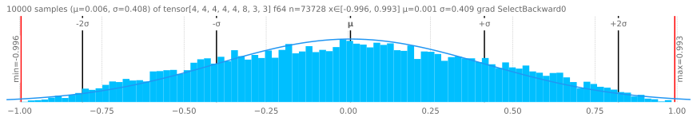
>
> </div>

## HMC

``` python
xhmc, history_hmc = evaluate(
    nsteps=50,
    exp=ptExpSU3,
    beta=state.beta,
    x=state.x,
    eps=0.1,
    nleapfrog=1,
    job_type='hmc',
    nlog=2,
    nprint=5,
    grab=True
)
xhmc = ptExpSU3.trainer.dynamics.unflatten(xhmc)
console.log(f"checkSU(x_hmc): {g.checkSU(xhmc)}")
plot_metrics(history_hmc, title='HMC', marker='.')
```

> [!TIP]
>
> ### <span class="dim-text">`output`:</span>
>
> <div class="cell-output cell-output-display">
>
>     [07/10/23 07:56:30][INFO][experiment.py:115] - Running 50 steps of hmc at beta=6.0000
>     [07/10/23 07:56:30][INFO][experiment.py:119] - STEP: 0
>     [07/10/23 07:56:30][INFO][experiment.py:119] - STEP: 1
>     [07/10/23 07:56:30][INFO][experiment.py:119] - STEP: 2
>     [07/10/23 07:56:30][INFO][experiment.py:119] - STEP: 3
>     [07/10/23 07:56:30][INFO][experiment.py:119] - STEP: 4
>     [07/10/23 07:56:30][INFO][experiment.py:119] - STEP: 5
>     [07/10/23 07:56:30][INFO][common.py:97] - energy: torch.Size([2, 4]) torch.float64 
>     [[-1455.17436446 -1652.1514185  -1517.90987068 -1455.94178323]
>      [-1459.25165577 -1657.51842424 -1524.14091372 -1460.98822723]]
>     logprob: torch.Size([2, 4]) torch.float64 
>     [[-1455.17436446 -1652.1514185  -1517.90987068 -1455.94178323]
>      [-1459.25165577 -1657.51842424 -1524.14091372 -1460.98822723]]
>     logdet: torch.Size([2, 4]) torch.float64 
>     [[0. 0. 0. 0.]
>      [0. 0. 0. 0.]]
>     acc: torch.Size([4]) torch.float64 
>     [1. 1. 1. 1.]
>     sumlogdet: torch.Size([4]) torch.float64 
>     [0. 0. 0. 0.]
>     acc_mask: torch.Size([4]) torch.float32 
>     [1. 1. 1. 1.]
>     plaqs: torch.Size([4]) torch.float64 
>     [0.07198033 0.07955383 0.07632937 0.079714  ]
>     sinQ: torch.Size([4]) torch.float64 
>     [-4.59449208e-03  6.97601890e-05 -1.36834282e-03  2.93498261e-03]
>     intQ: torch.Size([4]) torch.float64 
>     [-0.13406958  0.00203564 -0.03992893  0.08564426]
>     dQint: torch.Size([4]) torch.float64 
>     [0.01024449 0.02805506 0.01725271 0.01645253]
>     dQsin: torch.Size([4]) torch.float64 
>     [0.00035107 0.00096143 0.00059124 0.00056382]
>     loss: None None 
>     -0.008833834588589714
>     [07/10/23 07:56:30][INFO][experiment.py:119] - STEP: 6
>     [07/10/23 07:56:30][INFO][experiment.py:119] - STEP: 7
>     [07/10/23 07:56:31][INFO][experiment.py:119] - STEP: 8
>     [07/10/23 07:56:31][INFO][experiment.py:119] - STEP: 9
>     [07/10/23 07:56:31][INFO][experiment.py:119] - STEP: 10
>     [07/10/23 07:56:31][INFO][common.py:97] - energy: torch.Size([2, 4]) torch.float64 
>     [[-2774.80624156 -2851.59293222 -2661.49055236 -2425.15656787]
>      [-2779.73017905 -2856.7767309  -2666.12510868 -2429.23105695]]
>     logprob: torch.Size([2, 4]) torch.float64 
>     [[-2774.80624156 -2851.59293222 -2661.49055236 -2425.15656787]
>      [-2779.73017905 -2856.7767309  -2666.12510868 -2429.23105695]]
>     logdet: torch.Size([2, 4]) torch.float64 
>     [[0. 0. 0. 0.]
>      [0. 0. 0. 0.]]
>     acc: torch.Size([4]) torch.float64 
>     [1. 1. 1. 1.]
>     sumlogdet: torch.Size([4]) torch.float64 
>     [0. 0. 0. 0.]
>     acc_mask: torch.Size([4]) torch.float32 
>     [1. 1. 1. 1.]
>     plaqs: torch.Size([4]) torch.float64 
>     [0.13573134 0.14720937 0.14114639 0.14401027]
>     sinQ: torch.Size([4]) torch.float64 
>     [-0.00396796 -0.00146382  0.0040015   0.00239218]
>     intQ: torch.Size([4]) torch.float64 
>     [-0.11578697 -0.04271513  0.11676574  0.06980506]
>     dQint: torch.Size([4]) torch.float64 
>     [0.01591121 0.07023641 0.03053575 0.01694004]
>     dQsin: torch.Size([4]) torch.float64 
>     [0.00054527 0.00240696 0.00104644 0.00058053]
>     loss: None None 
>     -0.008887014270663943
>     [07/10/23 07:56:31][INFO][experiment.py:119] - STEP: 11
>     [07/10/23 07:56:31][INFO][experiment.py:119] - STEP: 12
>     [07/10/23 07:56:31][INFO][experiment.py:119] - STEP: 13
>     [07/10/23 07:56:31][INFO][experiment.py:119] - STEP: 14
>     [07/10/23 07:56:31][INFO][experiment.py:119] - STEP: 15
>     [07/10/23 07:56:31][INFO][common.py:97] - energy: torch.Size([2, 4]) torch.float64 
>     [[-3589.39696557 -3672.75566478 -3699.9655895  -3758.19489614]
>      [-3591.62366753 -3676.34262087 -3704.28601825 -3763.08583919]]
>     logprob: torch.Size([2, 4]) torch.float64 
>     [[-3589.39696557 -3672.75566478 -3699.9655895  -3758.19489614]
>      [-3591.62366753 -3676.34262087 -3704.28601825 -3763.08583919]]
>     logdet: torch.Size([2, 4]) torch.float64 
>     [[0. 0. 0. 0.]
>      [0. 0. 0. 0.]]
>     acc: torch.Size([4]) torch.float64 
>     [1. 1. 1. 1.]
>     sumlogdet: torch.Size([4]) torch.float64 
>     [0. 0. 0. 0.]
>     acc_mask: torch.Size([4]) torch.float32 
>     [1. 1. 1. 1.]
>     plaqs: torch.Size([4]) torch.float64 
>     [0.19442852 0.20120752 0.19236084 0.19703231]
>     sinQ: torch.Size([4]) torch.float64 
>     [-0.00550476 -0.00195778  0.00094388  0.00348485]
>     intQ: torch.Size([4]) torch.float64 
>     [-0.16063176 -0.05712905  0.027543    0.10168963]
>     dQint: torch.Size([4]) torch.float64 
>     [0.00838519 0.00298843 0.01475424 0.05713639]
>     dQsin: torch.Size([4]) torch.float64 
>     [0.00028736 0.00010241 0.00050562 0.00195803]
>     loss: None None 
>     -0.00887361562615175
>     [07/10/23 07:56:31][INFO][experiment.py:119] - STEP: 16
>     [07/10/23 07:56:31][INFO][experiment.py:119] - STEP: 17
>     [07/10/23 07:56:31][INFO][experiment.py:119] - STEP: 18
>     [07/10/23 07:56:31][INFO][experiment.py:119] - STEP: 19
>     [07/10/23 07:56:31][INFO][experiment.py:119] - STEP: 20
>     [07/10/23 07:56:31][INFO][common.py:97] - energy: torch.Size([2, 4]) torch.float64 
>     [[-4151.54650574 -4494.28752887 -4160.10384616 -4408.71292573]
>      [-4156.03583628 -4496.77600268 -4162.17053388 -4412.58171459]]
>     logprob: torch.Size([2, 4]) torch.float64 
>     [[-4151.54650574 -4494.28752887 -4160.10384616 -4408.71292573]
>      [-4156.03583628 -4496.77600268 -4162.17053388 -4412.58171459]]
>     logdet: torch.Size([2, 4]) torch.float64 
>     [[0. 0. 0. 0.]
>      [0. 0. 0. 0.]]
>     acc: torch.Size([4]) torch.float64 
>     [1. 1. 1. 1.]
>     sumlogdet: torch.Size([4]) torch.float64 
>     [0. 0. 0. 0.]
>     acc_mask: torch.Size([4]) torch.float32 
>     [1. 1. 1. 1.]
>     plaqs: torch.Size([4]) torch.float64 
>     [0.22897834 0.23997054 0.22982328 0.23599929]
>     sinQ: torch.Size([4]) torch.float64 
>     [-0.00693299 -0.00347184 -0.00120909  0.00308169]
>     intQ: torch.Size([4]) torch.float64 
>     [-0.20230825 -0.10131016 -0.03528176  0.08992527]
>     dQint: torch.Size([4]) torch.float64 
>     [0.04257003 0.05104837 0.00619903 0.00752605]
>     dQsin: torch.Size([4]) torch.float64 
>     [0.00145885 0.0017494  0.00021244 0.00025791]
>     loss: None None 
>     -0.008967695306967319
>     [07/10/23 07:56:31][INFO][experiment.py:119] - STEP: 21
>     [07/10/23 07:56:31][INFO][experiment.py:119] - STEP: 22
>     [07/10/23 07:56:31][INFO][experiment.py:119] - STEP: 23
>     [07/10/23 07:56:31][INFO][experiment.py:119] - STEP: 24
>     [07/10/23 07:56:31][INFO][experiment.py:119] - STEP: 25
>     [07/10/23 07:56:31][INFO][common.py:97] - energy: torch.Size([2, 4]) torch.float64 
>     [[-4814.63799281 -4919.94688869 -4788.79616489 -5002.9215054 ]
>      [-4817.09579284 -4921.24269566 -4790.50072208 -5005.14858853]]
>     logprob: torch.Size([2, 4]) torch.float64 
>     [[-4814.63799281 -4919.94688869 -4788.79616489 -5002.9215054 ]
>      [-4817.09579284 -4921.24269566 -4790.50072208 -5005.14858853]]
>     logdet: torch.Size([2, 4]) torch.float64 
>     [[0. 0. 0. 0.]
>      [0. 0. 0. 0.]]
>     acc: torch.Size([4]) torch.float64 
>     [1. 1. 1. 1.]
>     sumlogdet: torch.Size([4]) torch.float64 
>     [0. 0. 0. 0.]
>     acc_mask: torch.Size([4]) torch.float32 
>     [1. 1. 1. 1.]
>     plaqs: torch.Size([4]) torch.float64 
>     [0.26288089 0.27682883 0.26268439 0.26544038]
>     sinQ: torch.Size([4]) torch.float64 
>     [ 0.00063547 -0.00425824 -0.00254524  0.00551469]
>     intQ: torch.Size([4]) torch.float64 
>     [ 0.01854337 -0.12425771 -0.07427149  0.16092137]
>     dQint: torch.Size([4]) torch.float64 
>     [0.00165815 0.03643215 0.00549913 0.03666496]
>     dQsin: torch.Size([4]) torch.float64 
>     [5.68238145e-05 1.24851003e-03 1.88452222e-04 1.25648827e-03]
>     loss: None None 
>     -0.008991637304362567
>     [07/10/23 07:56:31][INFO][experiment.py:119] - STEP: 26
>     [07/10/23 07:56:31][INFO][experiment.py:119] - STEP: 27
>     [07/10/23 07:56:31][INFO][experiment.py:119] - STEP: 28
>     [07/10/23 07:56:31][INFO][experiment.py:119] - STEP: 29
>     [07/10/23 07:56:32][INFO][experiment.py:119] - STEP: 30
>     [07/10/23 07:56:32][INFO][common.py:97] - energy: torch.Size([2, 4]) torch.float64 
>     [[-5291.93327564 -5277.74230381 -5250.76164114 -5396.46879447]
>      [-5292.63668436 -5278.24552901 -5252.56634155 -5396.60232376]]
>     logprob: torch.Size([2, 4]) torch.float64 
>     [[-5291.93327564 -5277.74230381 -5250.76164114 -5396.46879447]
>      [-5292.63668436 -5278.24552901 -5252.56634155 -5396.60232376]]
>     logdet: torch.Size([2, 4]) torch.float64 
>     [[0. 0. 0. 0.]
>      [0. 0. 0. 0.]]
>     acc: torch.Size([4]) torch.float64 
>     [1. 1. 1. 1.]
>     sumlogdet: torch.Size([4]) torch.float64 
>     [0. 0. 0. 0.]
>     acc_mask: torch.Size([4]) torch.float32 
>     [1. 1. 1. 1.]
>     plaqs: torch.Size([4]) torch.float64 
>     [0.2875013  0.29490873 0.28911575 0.29292899]
>     sinQ: torch.Size([4]) torch.float64 
>     [-0.00214532 -0.00195831  0.00125583  0.00433508]
>     intQ: torch.Size([4]) torch.float64 
>     [-0.06260166 -0.05714455  0.03664583  0.1264999 ]
>     dQint: torch.Size([4]) torch.float64 
>     [0.00996321 0.01477696 0.00678131 0.0104012 ]
>     dQsin: torch.Size([4]) torch.float64 
>     [0.00034143 0.0005064  0.00023239 0.00035644]
>     loss: None None 
>     -0.009008451409977573
>     [07/10/23 07:56:32][INFO][experiment.py:119] - STEP: 31
>     [07/10/23 07:56:32][INFO][experiment.py:119] - STEP: 32
>     [07/10/23 07:56:32][INFO][experiment.py:119] - STEP: 33
>     [07/10/23 07:56:32][INFO][experiment.py:119] - STEP: 34
>     [07/10/23 07:56:32][INFO][experiment.py:119] - STEP: 35
>     [07/10/23 07:56:32][INFO][common.py:97] - energy: torch.Size([2, 4]) torch.float64 
>     [[-5677.87109891 -5799.43835247 -5783.77900075 -5966.2188758 ]
>      [-5679.3788349  -5801.05951826 -5785.90693956 -5967.61796828]]
>     logprob: torch.Size([2, 4]) torch.float64 
>     [[-5677.87109891 -5799.43835247 -5783.77900075 -5966.2188758 ]
>      [-5679.3788349  -5801.05951826 -5785.90693956 -5967.61796828]]
>     logdet: torch.Size([2, 4]) torch.float64 
>     [[0. 0. 0. 0.]
>      [0. 0. 0. 0.]]
>     acc: torch.Size([4]) torch.float64 
>     [1. 1. 1. 1.]
>     sumlogdet: torch.Size([4]) torch.float64 
>     [0. 0. 0. 0.]
>     acc_mask: torch.Size([4]) torch.float32 
>     [1. 1. 1. 1.]
>     plaqs: torch.Size([4]) torch.float64 
>     [0.30658624 0.31260177 0.31303925 0.31611992]
>     sinQ: torch.Size([4]) torch.float64 
>     [-0.00207013  0.00102852  0.00099099  0.00199912]
>     intQ: torch.Size([4]) torch.float64 
>     [-0.06040742  0.03001266  0.02891754  0.05833535]
>     dQint: torch.Size([4]) torch.float64 
>     [0.02325924 0.04047365 0.0205901  0.02235072]
>     dQsin: torch.Size([4]) torch.float64 
>     [0.00079708 0.00138701 0.00070561 0.00076595]
>     loss: None None 
>     -0.008902220811433029
>     [07/10/23 07:56:32][INFO][experiment.py:119] - STEP: 36
>     [07/10/23 07:56:32][INFO][experiment.py:119] - STEP: 37
>     [07/10/23 07:56:32][INFO][experiment.py:119] - STEP: 38
>     [07/10/23 07:56:32][INFO][experiment.py:119] - STEP: 39
>     [07/10/23 07:56:32][INFO][experiment.py:119] - STEP: 40
>     [07/10/23 07:56:32][INFO][common.py:97] - energy: torch.Size([2, 4]) torch.float64 
>     [[-6009.28484422 -6075.42435918 -6195.95087466 -6048.18856638]
>      [-6009.38784106 -6076.5575995  -6197.94839446 -6048.75106049]]
>     logprob: torch.Size([2, 4]) torch.float64 
>     [[-6009.28484422 -6075.42435918 -6195.95087466 -6048.18856638]
>      [-6009.38784106 -6076.5575995  -6197.94839446 -6048.75106049]]
>     logdet: torch.Size([2, 4]) torch.float64 
>     [[0. 0. 0. 0.]
>      [0. 0. 0. 0.]]
>     acc: torch.Size([4]) torch.float64 
>     [1. 1. 1. 1.]
>     sumlogdet: torch.Size([4]) torch.float64 
>     [0. 0. 0. 0.]
>     acc_mask: torch.Size([4]) torch.float32 
>     [1. 1. 1. 1.]
>     plaqs: torch.Size([4]) torch.float64 
>     [0.32328311 0.33136092 0.33288434 0.33155877]
>     sinQ: torch.Size([4]) torch.float64 
>     [-0.00087745 -0.00030477  0.00157488  0.00408504]
>     intQ: torch.Size([4]) torch.float64 
>     [-0.02560443 -0.00889343  0.04595583  0.11920361]
>     dQint: torch.Size([4]) torch.float64 
>     [0.05894986 0.05110851 0.00843622 0.0193832 ]
>     dQsin: torch.Size([4]) torch.float64 
>     [0.00202018 0.00175146 0.0002891  0.00066425]
>     loss: None None 
>     -0.008961126836871364
>     [07/10/23 07:56:32][INFO][experiment.py:119] - STEP: 41
>     [07/10/23 07:56:32][INFO][experiment.py:119] - STEP: 42
>     [07/10/23 07:56:32][INFO][experiment.py:119] - STEP: 43
>     [07/10/23 07:56:32][INFO][experiment.py:119] - STEP: 44
>     [07/10/23 07:56:32][INFO][experiment.py:119] - STEP: 45
>     [07/10/23 07:56:32][INFO][common.py:97] - energy: torch.Size([2, 4]) torch.float64 
>     [[-6172.38358228 -6473.29456144 -6406.68919584 -6232.45720644]
>      [-6172.72022528 -6471.1347579  -6407.01878873 -6235.0900963 ]]
>     logprob: torch.Size([2, 4]) torch.float64 
>     [[-6172.38358228 -6473.29456144 -6406.68919584 -6232.45720644]
>      [-6172.72022528 -6471.1347579  -6407.01878873 -6235.0900963 ]]
>     logdet: torch.Size([2, 4]) torch.float64 
>     [[0. 0. 0. 0.]
>      [0. 0. 0. 0.]]
>     acc: torch.Size([4]) torch.float64 
>     [1.         0.11534778 1.         1.        ]
>     sumlogdet: torch.Size([4]) torch.float64 
>     [0. 0. 0. 0.]
>     acc_mask: torch.Size([4]) torch.float32 
>     [1. 0. 1. 1.]
>     plaqs: torch.Size([4]) torch.float64 
>     [0.33577826 0.34108362 0.34569419 0.34125761]
>     sinQ: torch.Size([4]) torch.float64 
>     [ 1.19948603e-03 -1.70704191e-05  1.29880814e-03  1.15764374e-03]
>     intQ: torch.Size([4]) torch.float64 
>     [ 0.0350016  -0.00049812  0.03789987  0.03378062]
>     dQint: torch.Size([4]) torch.float64 
>     [0.03684475 0.         0.02928525 0.01172397]
>     dQsin: torch.Size([4]) torch.float64 
>     [0.00126265 0.         0.00100359 0.00040177]
>     loss: None None 
>     -0.006980147559740732
>     [07/10/23 07:56:32][INFO][experiment.py:119] - STEP: 46
>     [07/10/23 07:56:32][INFO][experiment.py:119] - STEP: 47
>     [07/10/23 07:56:32][INFO][experiment.py:119] - STEP: 48
>     [07/10/23 07:56:32][INFO][experiment.py:119] - STEP: 49
>
> <pre style="white-space:pre;overflow-x:auto;line-height:normal;font-family:Menlo,'DejaVu Sans Mono',consolas,'Courier New',monospace"><span style="color: #696969; text-decoration-color: #696969">[07:56:33] </span><span style="color: #ff00ff; text-decoration-color: #ff00ff; font-weight: bold">checkSU</span><span style="font-weight: bold">(</span>x_hmc<span style="font-weight: bold">)</span>: <span style="font-weight: bold">(</span>tensor<span style="font-weight: bold">[</span><span style="color: #2094f3; text-decoration-color: #2094f3">4</span><span style="font-weight: bold">]</span> f64 x∈<span style="font-weight: bold">[</span><span style="color: #2094f3; text-decoration-color: #2094f3">3.429e-16</span>, <span style="color: #2094f3; text-decoration-color: #2094f3">3.484e-16</span><span style="font-weight: bold">]</span> <span style="color: #7d8697; text-decoration-color: #7d8697">μ</span>=<span style="color: #2094f3; text-decoration-color: #2094f3">3</span><span style="color: #2094f3; text-decoration-color: #2094f3">.453e-16</span> <span style="color: #7d8697; text-decoration-color: #7d8697">σ</span>=<span style="color: #2094f3; text-decoration-color: #2094f3">2</span><span style="color: #2094f3; text-decoration-color: #2094f3">.351e-18</span> <span style="font-weight: bold">[</span><span style="color: #2094f3; text-decoration-color: #2094f3">3.442e-16</span>, <span style="color: #2094f3; text-decoration-color: #2094f3">3.484e-16</span>,  
> <span style="color: #696969; text-decoration-color: #696969">           </span><span style="color: #2094f3; text-decoration-color: #2094f3">3.429e-16</span>, <span style="color: #2094f3; text-decoration-color: #2094f3">3.458e-16</span><span style="font-weight: bold">]</span>, tensor<span style="font-weight: bold">[</span><span style="color: #2094f3; text-decoration-color: #2094f3">4</span><span style="font-weight: bold">]</span> f64 x∈<span style="font-weight: bold">[</span><span style="color: #2094f3; text-decoration-color: #2094f3">1.072e-15</span>, <span style="color: #2094f3; text-decoration-color: #2094f3">1.171e-15</span><span style="font-weight: bold">]</span> <span style="color: #7d8697; text-decoration-color: #7d8697">μ</span>=<span style="color: #2094f3; text-decoration-color: #2094f3">1</span><span style="color: #2094f3; text-decoration-color: #2094f3">.136e-15</span> <span style="color: #7d8697; text-decoration-color: #7d8697">σ</span>=<span style="color: #2094f3; text-decoration-color: #2094f3">4</span><span style="color: #2094f3; text-decoration-color: #2094f3">.386e-17</span> <span style="font-weight: bold">[</span><span style="color: #2094f3; text-decoration-color: #2094f3">1.143e-15</span>,       
> <span style="color: #696969; text-decoration-color: #696969">           </span><span style="color: #2094f3; text-decoration-color: #2094f3">1.157e-15</span>, <span style="color: #2094f3; text-decoration-color: #2094f3">1.072e-15</span>, <span style="color: #2094f3; text-decoration-color: #2094f3">1.171e-15</span><span style="font-weight: bold">])</span>                                                                       
> </pre>
>
> <pre style="white-space:pre;overflow-x:auto;line-height:normal;font-family:Menlo,'DejaVu Sans Mono',consolas,'Courier New',monospace"><span style="color: #696969; text-decoration-color: #696969">           </span>Saving energy to plots-4dSU3/HMC                                                                        
> </pre>
>
> 
>
> <pre style="white-space:pre;overflow-x:auto;line-height:normal;font-family:Menlo,'DejaVu Sans Mono',consolas,'Courier New',monospace"><span style="color: #696969; text-decoration-color: #696969">           </span>Saving logprob to plots-4dSU3/HMC                                                                       
> </pre>
>
> 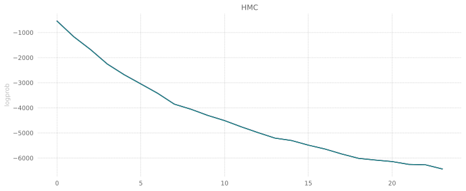
>
> <pre style="white-space:pre;overflow-x:auto;line-height:normal;font-family:Menlo,'DejaVu Sans Mono',consolas,'Courier New',monospace"><span style="color: #696969; text-decoration-color: #696969">           </span>Saving logdet to plots-4dSU3/HMC                                                                        
> </pre>
>
> 
>
> <pre style="white-space:pre;overflow-x:auto;line-height:normal;font-family:Menlo,'DejaVu Sans Mono',consolas,'Courier New',monospace"><span style="color: #696969; text-decoration-color: #696969">           </span>Saving acc to plots-4dSU3/HMC                                                                           
> </pre>
>
> 
>
> <pre style="white-space:pre;overflow-x:auto;line-height:normal;font-family:Menlo,'DejaVu Sans Mono',consolas,'Courier New',monospace"><span style="color: #696969; text-decoration-color: #696969">           </span>Saving sumlogdet to plots-4dSU3/HMC                                                                     
> </pre>
>
> 
>
> <pre style="white-space:pre;overflow-x:auto;line-height:normal;font-family:Menlo,'DejaVu Sans Mono',consolas,'Courier New',monospace"><span style="color: #696969; text-decoration-color: #696969">[07:56:34] </span>Saving acc_mask to plots-4dSU3/HMC                                                                      
> </pre>
>
> 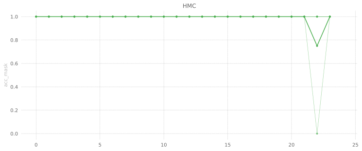
>
> <pre style="white-space:pre;overflow-x:auto;line-height:normal;font-family:Menlo,'DejaVu Sans Mono',consolas,'Courier New',monospace"><span style="color: #696969; text-decoration-color: #696969">           </span>Saving plaqs to plots-4dSU3/HMC                                                                         
> </pre>
>
> 
>
> <pre style="white-space:pre;overflow-x:auto;line-height:normal;font-family:Menlo,'DejaVu Sans Mono',consolas,'Courier New',monospace"><span style="color: #696969; text-decoration-color: #696969">           </span>Saving sinQ to plots-4dSU3/HMC                                                                          
> </pre>
>
> 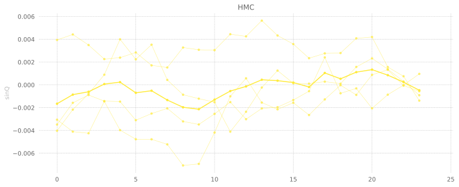
>
> <pre style="white-space:pre;overflow-x:auto;line-height:normal;font-family:Menlo,'DejaVu Sans Mono',consolas,'Courier New',monospace"><span style="color: #696969; text-decoration-color: #696969">           </span>Saving intQ to plots-4dSU3/HMC                                                                          
> </pre>
>
> 
>
> <pre style="white-space:pre;overflow-x:auto;line-height:normal;font-family:Menlo,'DejaVu Sans Mono',consolas,'Courier New',monospace"><span style="color: #696969; text-decoration-color: #696969">[07:56:35] </span>Saving dQint to plots-4dSU3/HMC                                                                         
> </pre>
>
> 
>
> <pre style="white-space:pre;overflow-x:auto;line-height:normal;font-family:Menlo,'DejaVu Sans Mono',consolas,'Courier New',monospace"><span style="color: #696969; text-decoration-color: #696969">           </span>Saving dQsin to plots-4dSU3/HMC                                                                         
> </pre>
>
> 
>
> <pre style="white-space:pre;overflow-x:auto;line-height:normal;font-family:Menlo,'DejaVu Sans Mono',consolas,'Courier New',monospace"><span style="color: #696969; text-decoration-color: #696969">           </span>Saving loss to plots-4dSU3/HMC                                                                          
> </pre>
>
> 
>
> </div>

## Evaluation

``` python
# ptExpSU3.trainer.dynamics.init_weights(
#     method='uniform',
#     min=-1e-16,
#     max=1e-16,
#     bias=True,
#     # xeps=0.001,
#     # veps=0.001,
# )
xeval, history_eval = evaluate(
    nsteps=50,
    exp=ptExpSU3,
    beta=6.0,
    x=state.x,
    job_type='eval',
    nlog=2,
    nprint=5,
    grab=True,
)
xeval = ptExpSU3.trainer.dynamics.unflatten(xeval)
console.log(f"checkSU(x_eval): {g.checkSU(xeval)}")
plot_metrics(history_eval, title='Evaluate', marker='.')
```

> [!TIP]
>
> ### <span class="dim-text">`output`:</span>
>
> <div class="cell-output cell-output-display">
>
>     [07/10/23 07:56:45][INFO][experiment.py:115] - Running 50 steps of eval at beta=6.0000
>     [07/10/23 07:56:45][INFO][experiment.py:119] - STEP: 0
>     [07/10/23 07:56:46][INFO][experiment.py:119] - STEP: 1
>     [07/10/23 07:56:46][INFO][experiment.py:119] - STEP: 2
>     [07/10/23 07:56:46][INFO][experiment.py:119] - STEP: 3
>     [07/10/23 07:56:47][INFO][experiment.py:119] - STEP: 4
>     [07/10/23 07:56:47][INFO][experiment.py:119] - STEP: 5
>     [07/10/23 07:56:48][INFO][common.py:97] - energy: torch.Size([9, 4]) torch.float64 
>     [[135.13661105 -33.63307096  67.14737865 -44.94287792]
>      [135.12019559 -33.67474968  67.13262028 -45.06121746]
>      [135.11640715 -33.7029591   67.13542667 -45.15853882]
>      [135.12597508 -33.71582603  67.15528762 -45.23443416]
>      [135.15009837 -33.71282679  67.19223232 -45.28949862]
>      [135.24409668 -33.55745988  67.28977981 -45.05889668]
>      [135.35293374 -33.38888138  67.40388327 -44.8080029 ]
>      [135.47661625 -33.20710601  67.53407019 -44.53600603]
>      [135.61403391 -33.01043184  67.68099845 -44.24220592]]
>     logprob: torch.Size([9, 4]) torch.float64 
>     [[135.13661105 -33.63307096  67.14737865 -44.94287792]
>      [135.18594798 -33.64895353  67.23191696 -44.94255748]
>      [135.25009615 -33.65006019  67.33406416 -44.92096816]
>      [135.32862172 -33.63742038  67.45280265 -44.87768554]
>      [135.42163919 -33.61092114  67.58849517 -44.81350169]
>      [135.44700618 -33.47933478  67.58664812 -44.70191131]
>      [135.48678158 -33.33680972  67.60182722 -44.56979511]
>      [135.54116027 -33.18273746  67.634192   -44.4166053 ]
>      [135.60984902 -33.01258723  67.68334133 -44.24196715]]
>     logdet: torch.Size([9, 4]) torch.float64 
>     [[ 0.00000000e+00  0.00000000e+00  0.00000000e+00  0.00000000e+00]
>      [-6.57523818e-02 -2.57961502e-02 -9.92966725e-02 -1.18659983e-01]
>      [-1.33688996e-01 -5.28989121e-02 -1.98637494e-01 -2.37570657e-01]
>      [-2.02646646e-01 -7.84056547e-02 -2.97515030e-01 -3.56748619e-01]
>      [-2.71540826e-01 -1.01905646e-01 -3.96262845e-01 -4.75996937e-01]
>      [-2.02909501e-01 -7.81251045e-02 -2.96868313e-01 -3.56985365e-01]
>      [-1.33847838e-01 -5.20716617e-02 -1.97943952e-01 -2.38207787e-01]
>      [-6.45440187e-02 -2.43685486e-02 -1.00121811e-01 -1.19400726e-01]
>      [ 4.18489492e-03  2.15538787e-03 -2.34288059e-03 -2.38771971e-04]]
>     sldf: torch.Size([9, 4]) torch.float64 
>     [[ 0.          0.          0.          0.        ]
>      [-0.06575238 -0.02579615 -0.09929667 -0.11865998]
>      [-0.133689   -0.05289891 -0.19863749 -0.23757066]
>      [-0.20264665 -0.07840565 -0.29751503 -0.35674862]
>      [-0.27154083 -0.10190565 -0.39626285 -0.47599694]
>      [ 0.          0.          0.          0.        ]
>      [ 0.          0.          0.          0.        ]
>      [ 0.          0.          0.          0.        ]
>      [ 0.          0.          0.          0.        ]]
>     sldb: torch.Size([9, 4]) torch.float64 
>     [[0.         0.         0.         0.        ]
>      [0.         0.         0.         0.        ]
>      [0.         0.         0.         0.        ]
>      [0.         0.         0.         0.        ]
>      [0.         0.         0.         0.        ]
>      [0.06863133 0.02378054 0.09939453 0.11901157]
>      [0.13769299 0.04983398 0.19831889 0.23778915]
>      [0.20699681 0.0775371  0.29614103 0.35659621]
>      [0.27572572 0.10406103 0.39391996 0.47575816]]
>     sld: torch.Size([9, 4]) torch.float64 
>     [[ 0.00000000e+00  0.00000000e+00  0.00000000e+00  0.00000000e+00]
>      [-6.57523818e-02 -2.57961502e-02 -9.92966725e-02 -1.18659983e-01]
>      [-1.33688996e-01 -5.28989121e-02 -1.98637494e-01 -2.37570657e-01]
>      [-2.02646646e-01 -7.84056547e-02 -2.97515030e-01 -3.56748619e-01]
>      [-2.71540826e-01 -1.01905646e-01 -3.96262845e-01 -4.75996937e-01]
>      [-2.02909501e-01 -7.81251045e-02 -2.96868313e-01 -3.56985365e-01]
>      [-1.33847838e-01 -5.20716617e-02 -1.97943952e-01 -2.38207787e-01]
>      [-6.45440187e-02 -2.43685486e-02 -1.00121811e-01 -1.19400726e-01]
>      [ 4.18489492e-03  2.15538787e-03 -2.34288059e-03 -2.38771971e-04]]
>     xeps: torch.Size([9]) torch.float64 
>     [0.001 0.001 0.001 0.001 0.001 0.001 0.001 0.001 0.001]
>     veps: torch.Size([9]) torch.float64 
>     [0.001 0.001 0.001 0.001 0.001 0.001 0.001 0.001 0.001]
>     acc: torch.Size([4]) torch.float64 
>     [0.6229818  0.53768428 0.58510575 0.49613324]
>     sumlogdet: torch.Size([4]) torch.float64 
>     [ 0.          0.         -0.00234288 -0.        ]
>     beta: torch.Size([]) torch.float64 
>     6.0
>     acc_mask: torch.Size([4]) torch.float32 
>     [0. 0. 1. 0.]
>     plaqs: torch.Size([4]) torch.float64 
>     [-0.00451561 -0.00117244 -0.0024079  -0.00328763]
>     sinQ: torch.Size([4]) torch.float64 
>     [-0.00482457 -0.001806   -0.00311093  0.00384917]
>     intQ: torch.Size([4]) torch.float64 
>     [-0.14078351 -0.05270007 -0.09077836  0.11232063]
>     dQint: torch.Size([4]) torch.float64 
>     [0.         0.         0.00423973 0.        ]
>     dQsin: torch.Size([4]) torch.float64 
>     [0.         0.         0.00014529 0.        ]
>     loss: None None 
>     -3.176207358041437e-05
>     [07/10/23 07:56:48][INFO][experiment.py:119] - STEP: 6
>     [07/10/23 07:56:48][INFO][experiment.py:119] - STEP: 7
>     [07/10/23 07:56:48][INFO][experiment.py:119] - STEP: 8
>     [07/10/23 07:56:49][INFO][experiment.py:119] - STEP: 9
>     [07/10/23 07:56:49][INFO][experiment.py:119] - STEP: 10
>     [07/10/23 07:56:49][INFO][common.py:97] - energy: torch.Size([9, 4]) torch.float64 
>     [[-9.56401221e+01  3.01519478e-01  1.26397106e+02 -8.75141370e+01]
>      [-9.56823640e+01  1.45612359e-01  1.26393890e+02 -8.73955597e+01]
>      [-9.57109596e+01  3.95985324e-03  1.26407219e+02 -8.72563460e+01]
>      [-9.57253138e+01 -1.23224050e-01  1.26437241e+02 -8.70966271e+01]
>      [-9.57257501e+01 -2.36135287e-01  1.26484182e+02 -8.69163051e+01]
>      [-9.56167926e+01 -1.52561289e-01  1.26698581e+02 -8.69189539e+01]
>      [-9.54921713e+01 -5.40582444e-02  1.26929478e+02 -8.69016305e+01]
>      [-9.53528175e+01  5.86356052e-02  1.27176913e+02 -8.68641859e+01]
>      [-9.52006482e+01  1.85718837e-01  1.27443679e+02 -8.68062122e+01]]
>     logprob: torch.Size([9, 4]) torch.float64 
>     [[-9.56401221e+01  3.01519478e-01  1.26397106e+02 -8.75141370e+01]
>      [-9.56248528e+01  1.73238470e-01  1.26484219e+02 -8.72781272e+01]
>      [-9.55952941e+01  5.89521523e-02  1.26590094e+02 -8.70213932e+01]
>      [-9.55488299e+01 -4.13439677e-02  1.26714724e+02 -8.67439896e+01]
>      [-9.54873081e+01 -1.27574436e-01  1.26856942e+02 -8.64458164e+01]
>      [-9.54413096e+01 -6.93640504e-02  1.26976549e+02 -8.65662029e+01]
>      [-9.53811335e+01  5.41904615e-03  1.27112514e+02 -8.66661364e+01]
>      [-9.53069725e+01  9.42762298e-02  1.27264945e+02 -8.67460576e+01]
>      [-9.52189787e+01  1.94748598e-01  1.27435612e+02 -8.68056112e+01]]
>     logdet: torch.Size([9, 4]) torch.float64 
>     [[ 0.          0.          0.          0.        ]
>      [-0.05751118 -0.02762611 -0.09032856 -0.11743246]
>      [-0.1156655  -0.0549923  -0.18287469 -0.23495288]
>      [-0.17648393 -0.08188008 -0.27748311 -0.35263751]
>      [-0.23844197 -0.10856085 -0.37275912 -0.47048872]
>      [-0.17548294 -0.08319724 -0.27796796 -0.35275104]
>      [-0.1110378  -0.05947729 -0.18303625 -0.23549409]
>      [-0.045845   -0.03564062 -0.0880325  -0.11812833]
>      [ 0.01833044 -0.00902976  0.00806685 -0.00060101]]
>     sldf: torch.Size([9, 4]) torch.float64 
>     [[ 0.          0.          0.          0.        ]
>      [-0.05751118 -0.02762611 -0.09032856 -0.11743246]
>      [-0.1156655  -0.0549923  -0.18287469 -0.23495288]
>      [-0.17648393 -0.08188008 -0.27748311 -0.35263751]
>      [-0.23844197 -0.10856085 -0.37275912 -0.47048872]
>      [ 0.          0.          0.          0.        ]
>      [ 0.          0.          0.          0.        ]
>      [ 0.          0.          0.          0.        ]
>      [ 0.          0.          0.          0.        ]]
>     sldb: torch.Size([9, 4]) torch.float64 
>     [[0.         0.         0.         0.        ]
>      [0.         0.         0.         0.        ]
>      [0.         0.         0.         0.        ]
>      [0.         0.         0.         0.        ]
>      [0.         0.         0.         0.        ]
>      [0.06295902 0.02536361 0.09479116 0.11773768]
>      [0.12740417 0.04908356 0.18972287 0.23499463]
>      [0.19259697 0.07292023 0.28472662 0.35236039]
>      [0.25677241 0.09953109 0.38082597 0.46988771]]
>     sld: torch.Size([9, 4]) torch.float64 
>     [[ 0.          0.          0.          0.        ]
>      [-0.05751118 -0.02762611 -0.09032856 -0.11743246]
>      [-0.1156655  -0.0549923  -0.18287469 -0.23495288]
>      [-0.17648393 -0.08188008 -0.27748311 -0.35263751]
>      [-0.23844197 -0.10856085 -0.37275912 -0.47048872]
>      [-0.17548294 -0.08319724 -0.27796796 -0.35275104]
>      [-0.1110378  -0.05947729 -0.18303625 -0.23549409]
>      [-0.045845   -0.03564062 -0.0880325  -0.11812833]
>      [ 0.01833044 -0.00902976  0.00806685 -0.00060101]]
>     xeps: torch.Size([9]) torch.float64 
>     [0.001 0.001 0.001 0.001 0.001 0.001 0.001 0.001 0.001]
>     veps: torch.Size([9]) torch.float64 
>     [0.001 0.001 0.001 0.001 0.001 0.001 0.001 0.001 0.001]
>     acc: torch.Size([4]) torch.float64 
>     [0.65629595 1.         0.35398312 0.49236948]
>     sumlogdet: torch.Size([4]) torch.float64 
>     [ 0.01833044 -0.00902976  0.         -0.00060101]
>     beta: torch.Size([]) torch.float64 
>     6.0
>     acc_mask: torch.Size([4]) torch.float32 
>     [1. 1. 0. 1.]
>     plaqs: torch.Size([4]) torch.float64 
>     [-0.00429017 -0.00088047 -0.0019709  -0.00261991]
>     sinQ: torch.Size([4]) torch.float64 
>     [-0.00470862 -0.00204245 -0.00337299  0.00397335]
>     intQ: torch.Size([4]) torch.float64 
>     [-0.13739976 -0.05959964 -0.09842568  0.11594435]
>     dQint: torch.Size([4]) torch.float64 
>     [0.00222099 0.0004814  0.         0.00228172]
>     dQsin: torch.Size([4]) torch.float64 
>     [7.61122078e-05 1.64974062e-05 0.00000000e+00 7.81931965e-05]
>     loss: None None 
>     -3.523570691365356e-05
>     [07/10/23 07:56:50][INFO][experiment.py:119] - STEP: 11
>     [07/10/23 07:56:50][INFO][experiment.py:119] - STEP: 12
>     [07/10/23 07:56:50][INFO][experiment.py:119] - STEP: 13
>     [07/10/23 07:56:51][INFO][experiment.py:119] - STEP: 14
>     [07/10/23 07:56:51][INFO][experiment.py:119] - STEP: 15
>     [07/10/23 07:56:52][INFO][common.py:97] - energy: torch.Size([9, 4]) torch.float64 
>     [[ 22.08327295  19.0197769  -36.65111885  35.64933259]
>      [ 22.07697097  18.93400173 -36.74012144  35.59790233]
>      [ 22.08385286  18.86262503 -36.81229751  35.56680775]
>      [ 22.1041726   18.80744513 -36.86774956  35.55670459]
>      [ 22.13787963  18.76616913 -36.9068429   35.56661673]
>      [ 22.29806806  18.85372515 -36.78646258  35.59589835]
>      [ 22.47129009  18.95604273 -36.64914559  35.64578086]
>      [ 22.6563732   19.07405443 -36.494943    35.71658607]
>      [ 22.85494135  19.20666439 -36.32391534  35.80825486]]
>     logprob: torch.Size([9, 4]) torch.float64 
>     [[ 22.08327295  19.0197769  -36.65111885  35.64933259]
>      [ 22.14386161  18.96216574 -36.64341855  35.7160735 ]
>      [ 22.21832877  18.91860861 -36.61893687  35.80324569]
>      [ 22.30723783  18.88893401 -36.57886993  35.91152916]
>      [ 22.41023902  18.8735014  -36.52280583  36.04005679]
>      [ 22.50133881  18.93349329 -36.49758254  35.95072537]
>      [ 22.60675344  19.00765238 -36.45586602  35.88193507]
>      [ 22.72712714  19.09626029 -36.39758481  35.83369873]
>      [ 22.86168418  19.19884493 -36.32274159  35.80633166]]
>     logdet: torch.Size([9, 4]) torch.float64 
>     [[ 0.          0.          0.          0.        ]
>      [-0.06689064 -0.02816401 -0.09670289 -0.11817117]
>      [-0.13447591 -0.05598358 -0.19336064 -0.23643794]
>      [-0.20306523 -0.08148888 -0.28887963 -0.35482457]
>      [-0.27235939 -0.10733227 -0.38403706 -0.47344005]
>      [-0.20327075 -0.07976814 -0.28888004 -0.35482702]
>      [-0.13546335 -0.05160965 -0.19327958 -0.23615421]
>      [-0.07075393 -0.02220586 -0.09735819 -0.11711267]
>      [-0.00674283  0.00781946 -0.00117375  0.0019232 ]]
>     sldf: torch.Size([9, 4]) torch.float64 
>     [[ 0.          0.          0.          0.        ]
>      [-0.06689064 -0.02816401 -0.09670289 -0.11817117]
>      [-0.13447591 -0.05598358 -0.19336064 -0.23643794]
>      [-0.20306523 -0.08148888 -0.28887963 -0.35482457]
>      [-0.27235939 -0.10733227 -0.38403706 -0.47344005]
>      [ 0.          0.          0.          0.        ]
>      [ 0.          0.          0.          0.        ]
>      [ 0.          0.          0.          0.        ]
>      [ 0.          0.          0.          0.        ]]
>     sldb: torch.Size([9, 4]) torch.float64 
>     [[0.         0.         0.         0.        ]
>      [0.         0.         0.         0.        ]
>      [0.         0.         0.         0.        ]
>      [0.         0.         0.         0.        ]
>      [0.         0.         0.         0.        ]
>      [0.06908864 0.02756413 0.09515702 0.11861303]
>      [0.13689604 0.05572262 0.19075749 0.23728585]
>      [0.20160546 0.08512641 0.28667887 0.35632739]
>      [0.26561656 0.11515173 0.38286331 0.47536325]]
>     sld: torch.Size([9, 4]) torch.float64 
>     [[ 0.          0.          0.          0.        ]
>      [-0.06689064 -0.02816401 -0.09670289 -0.11817117]
>      [-0.13447591 -0.05598358 -0.19336064 -0.23643794]
>      [-0.20306523 -0.08148888 -0.28887963 -0.35482457]
>      [-0.27235939 -0.10733227 -0.38403706 -0.47344005]
>      [-0.20327075 -0.07976814 -0.28888004 -0.35482702]
>      [-0.13546335 -0.05160965 -0.19327958 -0.23615421]
>      [-0.07075393 -0.02220586 -0.09735819 -0.11711267]
>      [-0.00674283  0.00781946 -0.00117375  0.0019232 ]]
>     xeps: torch.Size([9]) torch.float64 
>     [0.001 0.001 0.001 0.001 0.001 0.001 0.001 0.001 0.001]
>     veps: torch.Size([9]) torch.float64 
>     [0.001 0.001 0.001 0.001 0.001 0.001 0.001 0.001 0.001]
>     acc: torch.Size([4]) torch.float64 
>     [0.45913489 0.83604902 0.72009131 0.85470485]
>     sumlogdet: torch.Size([4]) torch.float64 
>     [-0.00674283  0.00781946 -0.00117375  0.        ]
>     beta: torch.Size([]) torch.float64 
>     6.0
>     acc_mask: torch.Size([4]) torch.float32 
>     [1. 1. 1. 0.]
>     plaqs: torch.Size([4]) torch.float64 
>     [-0.00410104  0.00011216 -0.00193722 -0.00172661]
>     sinQ: torch.Size([4]) torch.float64 
>     [-0.00468274 -0.00197849 -0.0033172   0.00396172]
>     intQ: torch.Size([4]) torch.float64 
>     [-0.13664465 -0.05773323 -0.09679748  0.11560499]
>     dQint: torch.Size([4]) torch.float64 
>     [0.00490455 0.00606124 0.00438789 0.        ]
>     dQsin: torch.Size([4]) torch.float64 
>     [0.00016808 0.00020772 0.00015037 0.        ]
>     loss: None None 
>     -4.064349363399149e-05
>     [07/10/23 07:56:52][INFO][experiment.py:119] - STEP: 16
>     [07/10/23 07:56:52][INFO][experiment.py:119] - STEP: 17
>     [07/10/23 07:56:52][INFO][experiment.py:119] - STEP: 18
>     [07/10/23 07:56:53][INFO][experiment.py:119] - STEP: 19
>     [07/10/23 07:56:53][INFO][experiment.py:119] - STEP: 20
>     [07/10/23 07:56:54][INFO][common.py:97] - energy: torch.Size([9, 4]) torch.float64 
>     [[  18.24449011  157.51395791 -208.48354391    7.94362976]
>      [  18.131001    157.57724448 -208.48275539    7.79977811]
>      [  18.03407439  157.65458278 -208.46456333    7.67616995]
>      [  17.94980559  157.74629708 -208.42972391    7.57344121]
>      [  17.87787847  157.85139826 -208.37822275    7.49172438]
>      [  17.86104423  157.84775292 -208.3583655     7.50257305]
>      [  17.86515279  157.85840203 -208.32204505    7.53279089]
>      [  17.88936298  157.8873257  -208.26938999    7.58293561]
>      [  17.93276149  157.93030545 -208.20040312    7.65313816]]
>     logprob: torch.Size([9, 4]) torch.float64 
>     [[  18.24449011  157.51395791 -208.48354391    7.94362976]
>      [  18.18665175  157.61341561 -208.38213623    7.91836792]
>      [  18.14357945  157.72687855 -208.26400887    7.91352822]
>      [  18.11376441  157.85446265 -208.13028082    7.92975756]
>      [  18.09712312  157.99621367 -207.97971005    7.96695753]
>      [  18.02461769  157.95833194 -208.05892191    7.85916573]
>      [  17.96958153  157.93478819 -208.12071791    7.77120336]
>      [  17.93172414  157.92673721 -208.16486932    7.70347135]
>      [  17.91064328  157.93285714 -208.19159752    7.65597587]]
>     logdet: torch.Size([9, 4]) torch.float64 
>     [[ 0.          0.          0.          0.        ]
>      [-0.05565075 -0.03617114 -0.10061915 -0.1185898 ]
>      [-0.10950507 -0.07229577 -0.20055447 -0.23735827]
>      [-0.16395882 -0.10816557 -0.29944309 -0.35631635]
>      [-0.21924465 -0.14481541 -0.3985127  -0.47523315]
>      [-0.16357346 -0.11057902 -0.29944359 -0.35659268]
>      [-0.10442873 -0.07638616 -0.20132714 -0.23841247]
>      [-0.04236116 -0.0394115  -0.10452067 -0.12053573]
>      [ 0.02211821 -0.0025517  -0.0088056  -0.00283771]]
>     sldf: torch.Size([9, 4]) torch.float64 
>     [[ 0.          0.          0.          0.        ]
>      [-0.05565075 -0.03617114 -0.10061915 -0.1185898 ]
>      [-0.10950507 -0.07229577 -0.20055447 -0.23735827]
>      [-0.16395882 -0.10816557 -0.29944309 -0.35631635]
>      [-0.21924465 -0.14481541 -0.3985127  -0.47523315]
>      [ 0.          0.          0.          0.        ]
>      [ 0.          0.          0.          0.        ]
>      [ 0.          0.          0.          0.        ]
>      [ 0.          0.          0.          0.        ]]
>     sldb: torch.Size([9, 4]) torch.float64 
>     [[0.         0.         0.         0.        ]
>      [0.         0.         0.         0.        ]
>      [0.         0.         0.         0.        ]
>      [0.         0.         0.         0.        ]
>      [0.         0.         0.         0.        ]
>      [0.05567119 0.03423639 0.09906911 0.11864046]
>      [0.11481592 0.06842925 0.19718556 0.23682067]
>      [0.17688349 0.10540391 0.29399203 0.35469741]
>      [0.24136286 0.14226372 0.3897071  0.47239543]]
>     sld: torch.Size([9, 4]) torch.float64 
>     [[ 0.          0.          0.          0.        ]
>      [-0.05565075 -0.03617114 -0.10061915 -0.1185898 ]
>      [-0.10950507 -0.07229577 -0.20055447 -0.23735827]
>      [-0.16395882 -0.10816557 -0.29944309 -0.35631635]
>      [-0.21924465 -0.14481541 -0.3985127  -0.47523315]
>      [-0.16357346 -0.11057902 -0.29944359 -0.35659268]
>      [-0.10442873 -0.07638616 -0.20132714 -0.23841247]
>      [-0.04236116 -0.0394115  -0.10452067 -0.12053573]
>      [ 0.02211821 -0.0025517  -0.0088056  -0.00283771]]
>     xeps: torch.Size([9]) torch.float64 
>     [0.001 0.001 0.001 0.001 0.001 0.001 0.001 0.001 0.001]
>     veps: torch.Size([9]) torch.float64 
>     [0.001 0.001 0.001 0.001 0.001 0.001 0.001 0.001 0.001]
>     acc: torch.Size([4]) torch.float64 
>     [1.         0.65777047 0.74680857 1.        ]
>     sumlogdet: torch.Size([4]) torch.float64 
>     [ 0.02211821 -0.         -0.         -0.00283771]
>     beta: torch.Size([]) torch.float64 
>     6.0
>     acc_mask: torch.Size([4]) torch.float32 
>     [1. 0. 0. 1.]
>     plaqs: torch.Size([4]) torch.float64 
>     [-0.00307229  0.00081471 -0.00146663 -0.00150205]
>     sinQ: torch.Size([4]) torch.float64 
>     [-0.00484404 -0.00162107 -0.00354424  0.00406079]
>     intQ: torch.Size([4]) torch.float64 
>     [-0.14135151 -0.04730375 -0.10342278  0.11849601]
>     dQint: torch.Size([4]) torch.float64 
>     [0.00132971 0.         0.         0.00211542]
>     dQsin: torch.Size([4]) torch.float64 
>     [4.55685873e-05 0.00000000e+00 0.00000000e+00 7.24941821e-05]
>     loss: None None 
>     -4.81144798353746e-05
>     [07/10/23 07:56:54][INFO][experiment.py:119] - STEP: 21
>     [07/10/23 07:56:54][INFO][experiment.py:119] - STEP: 22
>     [07/10/23 07:56:54][INFO][experiment.py:119] - STEP: 23
>     [07/10/23 07:56:55][INFO][experiment.py:119] - STEP: 24
>     [07/10/23 07:56:55][INFO][experiment.py:119] - STEP: 25
>     [07/10/23 07:56:55][INFO][common.py:97] - energy: torch.Size([9, 4]) torch.float64 
>     [[103.02841282  66.72029544  59.90481188 146.00124109]
>      [103.00555319  66.74978538  59.90840465 145.85528037]
>      [102.99730392  66.7937695   59.92887223 145.72930134]
>      [103.00125737  66.85207329  59.96577299 145.62408096]
>      [103.01948883  66.9247455   60.01915062 145.53920011]
>      [103.20998844  66.90147596  60.11104722 145.71750439]
>      [103.41490006  66.89165518  60.2198083  145.915704  ]
>      [103.63465314  66.89507612  60.34472098 146.1340541 ]
>      [103.86859577  66.91086793  60.48597197 146.3725016 ]]
>     logprob: torch.Size([9, 4]) torch.float64 
>     [[103.02841282  66.72029544  59.90481188 146.00124109]
>      [103.06221521  66.78220304  60.00541219 145.97179754]
>      [103.11016976  66.85855726  60.1232324  145.96242371]
>      [103.17152685  66.94940619  60.25727658 145.97369716]
>      [103.24708037  67.05444773  60.40638075 146.00512372]
>      [103.38050002  66.99928691  60.40429756 146.06712644]
>      [103.52788974  66.95744795  60.42047951 146.14933104]
>      [103.68961244  66.92731634  60.45239386 146.25190874]
>      [103.86522803  66.90645727  60.50043445 146.37474149]]
>     logdet: torch.Size([9, 4]) torch.float64 
>     [[ 0.          0.          0.          0.        ]
>      [-0.05666201 -0.03241766 -0.09700755 -0.11651717]
>      [-0.11286583 -0.06478776 -0.19436017 -0.23312237]
>      [-0.17026948 -0.0973329  -0.29150359 -0.34961621]
>      [-0.22759154 -0.12970223 -0.38723013 -0.46592362]
>      [-0.17051158 -0.09781095 -0.29325034 -0.34962204]
>      [-0.11298968 -0.06579277 -0.20067121 -0.23362704]
>      [-0.0549593  -0.03224022 -0.10767288 -0.11785464]
>      [ 0.00336773  0.00441065 -0.01446248 -0.0022399 ]]
>     sldf: torch.Size([9, 4]) torch.float64 
>     [[ 0.          0.          0.          0.        ]
>      [-0.05666201 -0.03241766 -0.09700755 -0.11651717]
>      [-0.11286583 -0.06478776 -0.19436017 -0.23312237]
>      [-0.17026948 -0.0973329  -0.29150359 -0.34961621]
>      [-0.22759154 -0.12970223 -0.38723013 -0.46592362]
>      [ 0.          0.          0.          0.        ]
>      [ 0.          0.          0.          0.        ]
>      [ 0.          0.          0.          0.        ]
>      [ 0.          0.          0.          0.        ]]
>     sldb: torch.Size([9, 4]) torch.float64 
>     [[0.         0.         0.         0.        ]
>      [0.         0.         0.         0.        ]
>      [0.         0.         0.         0.        ]
>      [0.         0.         0.         0.        ]
>      [0.         0.         0.         0.        ]
>      [0.05707996 0.03189128 0.09397978 0.11630157]
>      [0.11460186 0.06390946 0.18655891 0.23229658]
>      [0.17263224 0.09746201 0.27955724 0.34806898]
>      [0.23095927 0.13411288 0.37276764 0.46368372]]
>     sld: torch.Size([9, 4]) torch.float64 
>     [[ 0.          0.          0.          0.        ]
>      [-0.05666201 -0.03241766 -0.09700755 -0.11651717]
>      [-0.11286583 -0.06478776 -0.19436017 -0.23312237]
>      [-0.17026948 -0.0973329  -0.29150359 -0.34961621]
>      [-0.22759154 -0.12970223 -0.38723013 -0.46592362]
>      [-0.17051158 -0.09781095 -0.29325034 -0.34962204]
>      [-0.11298968 -0.06579277 -0.20067121 -0.23362704]
>      [-0.0549593  -0.03224022 -0.10767288 -0.11785464]
>      [ 0.00336773  0.00441065 -0.01446248 -0.0022399 ]]
>     xeps: torch.Size([9]) torch.float64 
>     [0.001 0.001 0.001 0.001 0.001 0.001 0.001 0.001 0.001]
>     veps: torch.Size([9]) torch.float64 
>     [0.001 0.001 0.001 0.001 0.001 0.001 0.001 0.001 0.001]
>     acc: torch.Size([4]) torch.float64 
>     [0.43308762 0.83013924 0.55121929 0.68832071]
>     sumlogdet: torch.Size([4]) torch.float64 
>     [ 0.          0.00441065 -0.01446248 -0.        ]
>     beta: torch.Size([]) torch.float64 
>     6.0
>     acc_mask: torch.Size([4]) torch.float32 
>     [0. 1. 1. 0.]
>     plaqs: torch.Size([4]) torch.float64 
>     [-0.0027481   0.00119082 -0.00158445 -0.00089441]
>     sinQ: torch.Size([4]) torch.float64 
>     [-0.00451238 -0.00182152 -0.0035942   0.00441841]
>     intQ: torch.Size([4]) torch.float64 
>     [-0.13167354 -0.05315281 -0.10488051  0.12893134]
>     dQint: torch.Size([4]) torch.float64 
>     [0.         0.0018939  0.00298696 0.        ]
>     dQsin: torch.Size([4]) torch.float64 
>     [0.00000000e+00 6.49030205e-05 1.02361421e-04 0.00000000e+00]
>     loss: None None 
>     -3.587542080169492e-05
>     [07/10/23 07:56:56][INFO][experiment.py:119] - STEP: 26
>     [07/10/23 07:56:56][INFO][experiment.py:119] - STEP: 27
>     [07/10/23 07:56:56][INFO][experiment.py:119] - STEP: 28
>     [07/10/23 07:56:57][INFO][experiment.py:119] - STEP: 29
>     [07/10/23 07:56:57][INFO][experiment.py:119] - STEP: 30
>     [07/10/23 07:56:58][INFO][common.py:97] - energy: torch.Size([9, 4]) torch.float64 
>     [[   5.44430506 -165.95958335  -15.50481522 -102.40867299]
>      [   5.43718998 -166.10277443  -15.62779543 -102.56181693]
>      [   5.44464905 -166.22901843  -15.7356583  -102.69496592]
>      [   5.46736464 -166.33990308  -15.82781492 -102.80737464]
>      [   5.50500891 -166.43443664  -15.90440405 -102.89983611]
>      [   5.46719889 -166.4180316   -15.59365182 -102.80127799]
>      [   5.44397975 -166.38658933  -15.26972746 -102.68257058]
>      [   5.43542179 -166.34041499  -14.9318252  -102.54360961]
>      [   5.44179493 -166.279924    -14.57940301 -102.38444531]]
>     logprob: torch.Size([9, 4]) torch.float64 
>     [[   5.44430506 -165.95958335  -15.50481522 -102.40867299]
>      [   5.50781019 -166.07558872  -15.54001    -102.44454202]
>      [   5.58658104 -166.17276673  -15.55915382 -102.46024532]
>      [   5.68270227 -166.25379651  -15.56265621 -102.45555478]
>      [   5.79468708 -166.31696368  -15.55021339 -102.43120679]
>      [   5.68351855 -166.33485863  -15.3277197  -102.44957194]
>      [   5.58743691 -166.3402427   -15.09050885 -102.44788906]
>      [   5.50631117 -166.33310876  -14.83848715 -102.42597688]
>      [   5.44094998 -166.31355254  -14.57136671 -102.38389437]]
>     logdet: torch.Size([9, 4]) torch.float64 
>     [[ 0.          0.          0.          0.        ]
>      [-0.07062021 -0.02718572 -0.08778543 -0.11727491]
>      [-0.14193199 -0.0562517  -0.17650448 -0.23472059]
>      [-0.21533763 -0.08610658 -0.26515871 -0.35181986]
>      [-0.28967817 -0.11747296 -0.35419066 -0.46862932]
>      [-0.21631966 -0.08317297 -0.26593212 -0.35170605]
>      [-0.14345716 -0.04634663 -0.17921861 -0.23468152]
>      [-0.07088938 -0.00730623 -0.09333805 -0.11763273]
>      [ 0.00084495  0.03362854 -0.0080363  -0.00055094]]
>     sldf: torch.Size([9, 4]) torch.float64 
>     [[ 0.          0.          0.          0.        ]
>      [-0.07062021 -0.02718572 -0.08778543 -0.11727491]
>      [-0.14193199 -0.0562517  -0.17650448 -0.23472059]
>      [-0.21533763 -0.08610658 -0.26515871 -0.35181986]
>      [-0.28967817 -0.11747296 -0.35419066 -0.46862932]
>      [ 0.          0.          0.          0.        ]
>      [ 0.          0.          0.          0.        ]
>      [ 0.          0.          0.          0.        ]
>      [ 0.          0.          0.          0.        ]]
>     sldb: torch.Size([9, 4]) torch.float64 
>     [[0.         0.         0.         0.        ]
>      [0.         0.         0.         0.        ]
>      [0.         0.         0.         0.        ]
>      [0.         0.         0.         0.        ]
>      [0.         0.         0.         0.        ]
>      [0.07335851 0.0343     0.08825854 0.11692327]
>      [0.14622101 0.07112634 0.17497205 0.23394779]
>      [0.21878879 0.11016673 0.26085261 0.35099659]
>      [0.29052312 0.1511015  0.34615436 0.46807838]]
>     sld: torch.Size([9, 4]) torch.float64 
>     [[ 0.          0.          0.          0.        ]
>      [-0.07062021 -0.02718572 -0.08778543 -0.11727491]
>      [-0.14193199 -0.0562517  -0.17650448 -0.23472059]
>      [-0.21533763 -0.08610658 -0.26515871 -0.35181986]
>      [-0.28967817 -0.11747296 -0.35419066 -0.46862932]
>      [-0.21631966 -0.08317297 -0.26593212 -0.35170605]
>      [-0.14345716 -0.04634663 -0.17921861 -0.23468152]
>      [-0.07088938 -0.00730623 -0.09333805 -0.11763273]
>      [ 0.00084495  0.03362854 -0.0080363  -0.00055094]]
>     xeps: torch.Size([9]) torch.float64 
>     [0.001 0.001 0.001 0.001 0.001 0.001 0.001 0.001 0.001]
>     veps: torch.Size([9]) torch.float64 
>     [0.001 0.001 0.001 0.001 0.001 0.001 0.001 0.001 0.001]
>     acc: torch.Size([4]) torch.float64 
>     [1.         1.         0.39319543 0.97552585]
>     sumlogdet: torch.Size([4]) torch.float64 
>     [ 0.00084495  0.03362854 -0.         -0.00055094]
>     beta: torch.Size([]) torch.float64 
>     6.0
>     acc_mask: torch.Size([4]) torch.float32 
>     [1. 1. 0. 1.]
>     plaqs: torch.Size([4]) torch.float64 
>     [-0.00267364  0.00204628 -0.00143384 -0.00045363]
>     sinQ: torch.Size([4]) torch.float64 
>     [-0.00460961 -0.00176722 -0.00379743  0.0038541 ]
>     intQ: torch.Size([4]) torch.float64 
>     [-0.13451074 -0.05156846 -0.11081098  0.11246456]
>     dQint: torch.Size([4]) torch.float64 
>     [0.00099198 0.00188247 0.         0.00811582]
>     dQsin: torch.Size([4]) torch.float64 
>     [3.39945351e-05 6.45112363e-05 0.00000000e+00 2.78124805e-04]
>     loss: None None 
>     -4.729706796001338e-05
>     [07/10/23 07:56:58][INFO][experiment.py:119] - STEP: 31
>     [07/10/23 07:56:58][INFO][experiment.py:119] - STEP: 32
>     [07/10/23 07:56:59][INFO][experiment.py:119] - STEP: 33
>     [07/10/23 07:56:59][INFO][experiment.py:119] - STEP: 34
>     [07/10/23 07:56:59][INFO][experiment.py:119] - STEP: 35
>     [07/10/23 07:57:00][INFO][common.py:97] - energy: torch.Size([9, 4]) torch.float64 
>     [[-38.24109866   5.55612112  -1.76277452 -52.84427962]
>      [-38.32994306   5.55140781  -1.64083871 -52.86777806]
>      [-38.40531362   5.56129168  -1.50469869 -52.87194866]
>      [-38.46792643   5.58535052  -1.35394915 -52.85704699]
>      [-38.51648618   5.62468415  -1.18861717 -52.82292239]
>      [-38.31153675   5.73641202  -1.11288606 -52.65606878]
>      [-38.09224637   5.8627936   -1.02476863 -52.46855894]
>      [-37.85867931   6.00371097  -0.92164249 -52.26006541]
>      [-37.6106359    6.15897688  -0.80273488 -52.03065188]]
>     logprob: torch.Size([9, 4]) torch.float64 
>     [[-38.24109866   5.55612112  -1.76277452 -52.84427962]
>      [-38.26222741   5.57653363  -1.56187095 -52.7515782 ]
>      [-38.26973224   5.61095297  -1.34509313 -52.63971354]
>      [-38.26380994   5.65981386  -1.11211757 -52.50928377]
>      [-38.2439666    5.72255661  -0.86315277 -52.35968199]
>      [-38.10907575   5.81183388  -0.87027295 -52.30873805]
>      [-37.96184935   5.91481407  -0.86351973 -52.23756461]
>      [-37.80125051   6.03101643  -0.84187415 -52.14581443]
>      [-37.62641755   6.15964415  -0.80499075 -52.03352906]]
>     logdet: torch.Size([9, 4]) torch.float64 
>     [[ 0.          0.          0.          0.        ]
>      [-0.06771565 -0.02512582 -0.07896776 -0.11619986]
>      [-0.13558138 -0.04966129 -0.15960556 -0.23223511]
>      [-0.20411649 -0.07446334 -0.24183158 -0.34776322]
>      [-0.27251958 -0.09787246 -0.3254644  -0.4632404 ]
>      [-0.202461   -0.07542186 -0.24261311 -0.34733073]
>      [-0.13039702 -0.05202047 -0.1612489  -0.23099433]
>      [-0.0574288  -0.02730546 -0.07976834 -0.11425098]
>      [ 0.01578164 -0.00066727  0.00225587  0.00287718]]
>     sldf: torch.Size([9, 4]) torch.float64 
>     [[ 0.          0.          0.          0.        ]
>      [-0.06771565 -0.02512582 -0.07896776 -0.11619986]
>      [-0.13558138 -0.04966129 -0.15960556 -0.23223511]
>      [-0.20411649 -0.07446334 -0.24183158 -0.34776322]
>      [-0.27251958 -0.09787246 -0.3254644  -0.4632404 ]
>      [ 0.          0.          0.          0.        ]
>      [ 0.          0.          0.          0.        ]
>      [ 0.          0.          0.          0.        ]
>      [ 0.          0.          0.          0.        ]]
>     sldb: torch.Size([9, 4]) torch.float64 
>     [[0.         0.         0.         0.        ]
>      [0.         0.         0.         0.        ]
>      [0.         0.         0.         0.        ]
>      [0.         0.         0.         0.        ]
>      [0.         0.         0.         0.        ]
>      [0.07005858 0.0224506  0.08285129 0.11590967]
>      [0.14212256 0.04585199 0.1642155  0.23224607]
>      [0.21509078 0.070567   0.24569606 0.34898942]
>      [0.28830122 0.09720519 0.32772027 0.46611758]]
>     sld: torch.Size([9, 4]) torch.float64 
>     [[ 0.          0.          0.          0.        ]
>      [-0.06771565 -0.02512582 -0.07896776 -0.11619986]
>      [-0.13558138 -0.04966129 -0.15960556 -0.23223511]
>      [-0.20411649 -0.07446334 -0.24183158 -0.34776322]
>      [-0.27251958 -0.09787246 -0.3254644  -0.4632404 ]
>      [-0.202461   -0.07542186 -0.24261311 -0.34733073]
>      [-0.13039702 -0.05202047 -0.1612489  -0.23099433]
>      [-0.0574288  -0.02730546 -0.07976834 -0.11425098]
>      [ 0.01578164 -0.00066727  0.00225587  0.00287718]]
>     xeps: torch.Size([9]) torch.float64 
>     [0.001 0.001 0.001 0.001 0.001 0.001 0.001 0.001 0.001]
>     veps: torch.Size([9]) torch.float64 
>     [0.001 0.001 0.001 0.001 0.001 0.001 0.001 0.001 0.001]
>     acc: torch.Size([4]) torch.float64 
>     [0.54081332 0.54688156 0.3837424  0.4445243 ]
>     sumlogdet: torch.Size([4]) torch.float64 
>     [ 0.01578164 -0.00066727  0.          0.        ]
>     beta: torch.Size([]) torch.float64 
>     6.0
>     acc_mask: torch.Size([4]) torch.float32 
>     [1. 1. 0. 0.]
>     plaqs: torch.Size([4]) torch.float64 
>     [-2.40489594e-03  2.42568817e-03 -1.22128286e-03  3.33506631e-05]
>     sinQ: torch.Size([4]) torch.float64 
>     [-0.0044297  -0.00151298 -0.00355408  0.00326773]
>     intQ: torch.Size([4]) torch.float64 
>     [-0.12926073 -0.04414946 -0.10370987  0.09535414]
>     dQint: torch.Size([4]) torch.float64 
>     [0.00126963 0.00183703 0.         0.        ]
>     dQsin: torch.Size([4]) torch.float64 
>     [4.35095927e-05 6.29539451e-05 0.00000000e+00 0.00000000e+00]
>     loss: None None 
>     -2.710630203148566e-05
>     [07/10/23 07:57:00][INFO][experiment.py:119] - STEP: 36
>     [07/10/23 07:57:01][INFO][experiment.py:119] - STEP: 37
>     [07/10/23 07:57:01][INFO][experiment.py:119] - STEP: 38
>     [07/10/23 07:57:02][INFO][experiment.py:119] - STEP: 39
>     [07/10/23 07:57:02][INFO][experiment.py:119] - STEP: 40
>     [07/10/23 07:57:02][INFO][common.py:97] - energy: torch.Size([9, 4]) torch.float64 
>     [[ 37.53083778 -61.47612458 194.49383362 -75.26659131]
>      [ 37.41314729 -61.56796393 194.42693791 -75.35635768]
>      [ 37.30997375 -61.64422221 194.37883272 -75.42621902]
>      [ 37.21778242 -61.70354439 194.3457032  -75.47606722]
>      [ 37.1380567  -61.74728792 194.32642745 -75.5059038 ]
>      [ 37.18193878 -61.7853854  194.2253633  -75.27512306]
>      [ 37.24120223 -61.80516899 194.14110165 -75.02533298]
>      [ 37.31483923 -61.80731799 194.0737638  -74.75607289]
>      [ 37.40107025 -61.7919109  194.02513639 -74.46727477]]
>     logprob: torch.Size([9, 4]) torch.float64 
>     [[ 37.53083778 -61.47612458 194.49383362 -75.26659131]
>      [ 37.48417588 -61.54316591 194.51489672 -75.23936232]
>      [ 37.45182683 -61.5952443  194.55346786 -75.19268807]
>      [ 37.43217035 -61.63209287 194.60743084 -75.1262975 ]
>      [ 37.42601492 -61.65399555 194.6764139  -75.03984482]
>      [ 37.3959529  -61.71622516 194.48553365 -74.92522514]
>      [ 37.38070855 -61.76334278 194.31072335 -74.79112617]
>      [ 37.37999823 -61.79563195 194.15223251 -74.63721938]
>      [ 37.39333859 -61.81332954 194.01100144 -74.46363194]]
>     logdet: torch.Size([9, 4]) torch.float64 
>     [[ 0.          0.          0.          0.        ]
>      [-0.07102859 -0.02479802 -0.08795881 -0.11699536]
>      [-0.14185308 -0.04897791 -0.17463513 -0.23353095]
>      [-0.21438792 -0.07145152 -0.26172765 -0.34976972]
>      [-0.28795822 -0.09329237 -0.34998644 -0.46605898]
>      [-0.21401412 -0.06916024 -0.26017036 -0.34989792]
>      [-0.13950632 -0.04182621 -0.16962171 -0.23420681]
>      [-0.06515899 -0.01168603 -0.07846871 -0.11885351]
>      [ 0.00773165  0.02141864  0.01413494 -0.00364284]]
>     sldf: torch.Size([9, 4]) torch.float64 
>     [[ 0.          0.          0.          0.        ]
>      [-0.07102859 -0.02479802 -0.08795881 -0.11699536]
>      [-0.14185308 -0.04897791 -0.17463513 -0.23353095]
>      [-0.21438792 -0.07145152 -0.26172765 -0.34976972]
>      [-0.28795822 -0.09329237 -0.34998644 -0.46605898]
>      [ 0.          0.          0.          0.        ]
>      [ 0.          0.          0.          0.        ]
>      [ 0.          0.          0.          0.        ]
>      [ 0.          0.          0.          0.        ]]
>     sldb: torch.Size([9, 4]) torch.float64 
>     [[0.         0.         0.         0.        ]
>      [0.         0.         0.         0.        ]
>      [0.         0.         0.         0.        ]
>      [0.         0.         0.         0.        ]
>      [0.         0.         0.         0.        ]
>      [0.0739441  0.02413213 0.08981609 0.11616105]
>      [0.1484519  0.05146617 0.18036474 0.23185217]
>      [0.22279923 0.08160634 0.27151774 0.34720547]
>      [0.29568987 0.11471101 0.36412139 0.46241614]]
>     sld: torch.Size([9, 4]) torch.float64 
>     [[ 0.          0.          0.          0.        ]
>      [-0.07102859 -0.02479802 -0.08795881 -0.11699536]
>      [-0.14185308 -0.04897791 -0.17463513 -0.23353095]
>      [-0.21438792 -0.07145152 -0.26172765 -0.34976972]
>      [-0.28795822 -0.09329237 -0.34998644 -0.46605898]
>      [-0.21401412 -0.06916024 -0.26017036 -0.34989792]
>      [-0.13950632 -0.04182621 -0.16962171 -0.23420681]
>      [-0.06515899 -0.01168603 -0.07846871 -0.11885351]
>      [ 0.00773165  0.02141864  0.01413494 -0.00364284]]
>     xeps: torch.Size([9]) torch.float64 
>     [0.001 0.001 0.001 0.001 0.001 0.001 0.001 0.001 0.001]
>     veps: torch.Size([9]) torch.float64 
>     [0.001 0.001 0.001 0.001 0.001 0.001 0.001 0.001 0.001]
>     acc: torch.Size([4]) torch.float64 
>     [1.        1.        1.        0.4480012]
>     sumlogdet: torch.Size([4]) torch.float64 
>     [ 0.00773165  0.02141864  0.01413494 -0.        ]
>     beta: torch.Size([]) torch.float64 
>     6.0
>     acc_mask: torch.Size([4]) torch.float32 
>     [1. 1. 1. 0.]
>     plaqs: torch.Size([4]) torch.float64 
>     [-0.00176544  0.00272047 -0.00086076  0.00036219]
>     sinQ: torch.Size([4]) torch.float64 
>     [-0.00437903 -0.00162554 -0.00408489  0.00312903]
>     intQ: torch.Size([4]) torch.float64 
>     [-0.12778234 -0.047434   -0.11919906  0.09130668]
>     dQint: torch.Size([4]) torch.float64 
>     [0.00039654 0.00091485 0.003272   0.        ]
>     dQsin: torch.Size([4]) torch.float64 
>     [1.35893336e-05 3.13513107e-05 1.12129821e-04 0.00000000e+00]
>     loss: None None 
>     -4.9186839696357544e-05
>     [07/10/23 07:57:02][INFO][experiment.py:119] - STEP: 41
>     [07/10/23 07:57:03][INFO][experiment.py:119] - STEP: 42
>     [07/10/23 07:57:03][INFO][experiment.py:119] - STEP: 43
>     [07/10/23 07:57:04][INFO][experiment.py:119] - STEP: 44
>     [07/10/23 07:57:04][INFO][experiment.py:119] - STEP: 45
>     [07/10/23 07:57:04][INFO][common.py:97] - energy: torch.Size([9, 4]) torch.float64 
>     [[ -59.62601426  -58.699203     59.46849932 -172.36747803]
>      [ -59.5591947   -58.72665761   59.54762304 -172.43679004]
>      [ -59.478034    -58.73975672   59.6428672  -172.48654935]
>      [ -59.38301564  -58.73852857   59.75374459 -172.51625033]
>      [ -59.27389385  -58.72284798   59.88025131 -172.52596124]
>      [ -59.11103216  -58.75758363   59.96074514 -172.40155126]
>      [ -58.93446541  -58.777547     60.05743232 -172.25787331]
>      [ -58.74060986  -58.78243594   60.17052679 -172.09459919]
>      [ -58.52728845  -58.7714395    60.30047494 -171.91225775]]
>     logprob: torch.Size([9, 4]) torch.float64 
>     [[ -59.62601426  -58.699203     59.46849932 -172.36747803]
>      [ -59.48467085  -58.69961143   59.63720058 -172.32092147]
>      [ -59.32967507  -58.68565043   59.82288137 -172.25539508]
>      [ -59.16351451  -58.6582891    60.02368863 -172.17018998]
>      [ -58.98479033  -58.61718232   60.23996164 -172.06529574]
>      [ -58.89165025  -58.67767335   60.22960664 -172.05530265]
>      [ -58.78459027  -58.72376757   60.23384326 -172.02592269]
>      [ -58.66232782  -58.75541252   60.2532672  -171.97623719]
>      [ -58.52427607  -58.77275329   60.28906012 -171.9071523 ]]
>     logdet: torch.Size([9, 4]) torch.float64 
>     [[ 0.          0.          0.          0.        ]
>      [-0.07452385 -0.02704618 -0.08957755 -0.11586856]
>      [-0.14835894 -0.05410629 -0.18001417 -0.23115426]
>      [-0.21950113 -0.08023947 -0.26994404 -0.34606035]
>      [-0.28910352 -0.10566565 -0.35971033 -0.46066551]
>      [-0.21938191 -0.07991027 -0.2688615  -0.34624861]
>      [-0.14987513 -0.05377943 -0.17641094 -0.23195062]
>      [-0.07828204 -0.02702341 -0.08274041 -0.118362  ]
>      [-0.00301238  0.0013138   0.01141482 -0.00510544]]
>     sldf: torch.Size([9, 4]) torch.float64 
>     [[ 0.          0.          0.          0.        ]
>      [-0.07452385 -0.02704618 -0.08957755 -0.11586856]
>      [-0.14835894 -0.05410629 -0.18001417 -0.23115426]
>      [-0.21950113 -0.08023947 -0.26994404 -0.34606035]
>      [-0.28910352 -0.10566565 -0.35971033 -0.46066551]
>      [ 0.          0.          0.          0.        ]
>      [ 0.          0.          0.          0.        ]
>      [ 0.          0.          0.          0.        ]
>      [ 0.          0.          0.          0.        ]]
>     sldb: torch.Size([9, 4]) torch.float64 
>     [[0.         0.         0.         0.        ]
>      [0.         0.         0.         0.        ]
>      [0.         0.         0.         0.        ]
>      [0.         0.         0.         0.        ]
>      [0.         0.         0.         0.        ]
>      [0.06972161 0.02575538 0.09084883 0.1144169 ]
>      [0.13922839 0.05188622 0.18329939 0.22871488]
>      [0.21082148 0.07864224 0.27696992 0.3423035 ]
>      [0.28609114 0.10697945 0.37112515 0.45556006]]
>     sld: torch.Size([9, 4]) torch.float64 
>     [[ 0.          0.          0.          0.        ]
>      [-0.07452385 -0.02704618 -0.08957755 -0.11586856]
>      [-0.14835894 -0.05410629 -0.18001417 -0.23115426]
>      [-0.21950113 -0.08023947 -0.26994404 -0.34606035]
>      [-0.28910352 -0.10566565 -0.35971033 -0.46066551]
>      [-0.21938191 -0.07991027 -0.2688615  -0.34624861]
>      [-0.14987513 -0.05377943 -0.17641094 -0.23195062]
>      [-0.07828204 -0.02702341 -0.08274041 -0.118362  ]
>      [-0.00301238  0.0013138   0.01141482 -0.00510544]]
>     xeps: torch.Size([9]) torch.float64 
>     [0.001 0.001 0.001 0.001 0.001 0.001 0.001 0.001 0.001]
>     veps: torch.Size([9]) torch.float64 
>     [0.001 0.001 0.001 0.001 0.001 0.001 0.001 0.001 0.001]
>     acc: torch.Size([4]) torch.float64 
>     [0.33229299 1.         0.44018473 0.63107805]
>     sumlogdet: torch.Size([4]) torch.float64 
>     [-0.          0.0013138   0.01141482 -0.00510544]
>     beta: torch.Size([]) torch.float64 
>     6.0
>     acc_mask: torch.Size([4]) torch.float32 
>     [0. 1. 1. 1.]
>     plaqs: torch.Size([4]) torch.float64 
>     [-0.00092452  0.00331762 -0.00037819  0.00054205]
>     sinQ: torch.Size([4]) torch.float64 
>     [-0.00458282 -0.00182782 -0.0036927   0.00349978]
>     intQ: torch.Size([4]) torch.float64 
>     [-0.13372905 -0.05333676 -0.10775497  0.10212541]
>     dQint: torch.Size([4]) torch.float64 
>     [0.         0.00644556 0.00171661 0.00336905]
>     dQsin: torch.Size([4]) torch.float64 
>     [0.00000000e+00 2.20885899e-04 5.88271294e-05 1.15455355e-04]
>     loss: None None 
>     -3.394048083099028e-05
>     [07/10/23 07:57:04][INFO][experiment.py:119] - STEP: 46
>     [07/10/23 07:57:05][INFO][experiment.py:119] - STEP: 47
>     [07/10/23 07:57:05][INFO][experiment.py:119] - STEP: 48
>     [07/10/23 07:57:06][INFO][experiment.py:119] - STEP: 49
>
> <pre style="white-space:pre;overflow-x:auto;line-height:normal;font-family:Menlo,'DejaVu Sans Mono',consolas,'Courier New',monospace"><span style="color: #696969; text-decoration-color: #696969">[07:57:06] </span><span style="color: #ff00ff; text-decoration-color: #ff00ff; font-weight: bold">checkSU</span><span style="font-weight: bold">(</span>x_eval<span style="font-weight: bold">)</span>: <span style="font-weight: bold">(</span>tensor<span style="font-weight: bold">[</span><span style="color: #2094f3; text-decoration-color: #2094f3">4</span><span style="font-weight: bold">]</span> f64 x∈<span style="font-weight: bold">[</span><span style="color: #2094f3; text-decoration-color: #2094f3">3.845e-16</span>, <span style="color: #2094f3; text-decoration-color: #2094f3">3.993e-16</span><span style="font-weight: bold">]</span> <span style="color: #7d8697; text-decoration-color: #7d8697">μ</span>=<span style="color: #2094f3; text-decoration-color: #2094f3">3</span><span style="color: #2094f3; text-decoration-color: #2094f3">.923e-16</span> <span style="color: #7d8697; text-decoration-color: #7d8697">σ</span>=<span style="color: #2094f3; text-decoration-color: #2094f3">6</span><span style="color: #2094f3; text-decoration-color: #2094f3">.436e-18</span> <span style="font-weight: bold">[</span><span style="color: #2094f3; text-decoration-color: #2094f3">3.955e-16</span>, <span style="color: #2094f3; text-decoration-color: #2094f3">3.845e-16</span>, 
> <span style="color: #696969; text-decoration-color: #696969">           </span><span style="color: #2094f3; text-decoration-color: #2094f3">3.901e-16</span>, <span style="color: #2094f3; text-decoration-color: #2094f3">3.993e-16</span><span style="font-weight: bold">]</span>, tensor<span style="font-weight: bold">[</span><span style="color: #2094f3; text-decoration-color: #2094f3">4</span><span style="font-weight: bold">]</span> f64 x∈<span style="font-weight: bold">[</span><span style="color: #2094f3; text-decoration-color: #2094f3">1.405e-15</span>, <span style="color: #2094f3; text-decoration-color: #2094f3">1.560e-15</span><span style="font-weight: bold">]</span> <span style="color: #7d8697; text-decoration-color: #7d8697">μ</span>=<span style="color: #2094f3; text-decoration-color: #2094f3">1</span><span style="color: #2094f3; text-decoration-color: #2094f3">.496e-15</span> <span style="color: #7d8697; text-decoration-color: #7d8697">σ</span>=<span style="color: #2094f3; text-decoration-color: #2094f3">6</span><span style="color: #2094f3; text-decoration-color: #2094f3">.503e-17</span> <span style="font-weight: bold">[</span><span style="color: #2094f3; text-decoration-color: #2094f3">1.560e-15</span>,       
> <span style="color: #696969; text-decoration-color: #696969">           </span><span style="color: #2094f3; text-decoration-color: #2094f3">1.405e-15</span>, <span style="color: #2094f3; text-decoration-color: #2094f3">1.511e-15</span>, <span style="color: #2094f3; text-decoration-color: #2094f3">1.507e-15</span><span style="font-weight: bold">])</span>                                                                       
> </pre>
>
> <pre style="white-space:pre;overflow-x:auto;line-height:normal;font-family:Menlo,'DejaVu Sans Mono',consolas,'Courier New',monospace"><span style="color: #696969; text-decoration-color: #696969">           </span>Saving energy to plots-4dSU3/Evaluate                                                                   
> </pre>
>
> 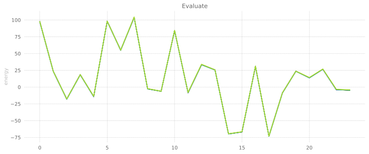
>
> <pre style="white-space:pre;overflow-x:auto;line-height:normal;font-family:Menlo,'DejaVu Sans Mono',consolas,'Courier New',monospace"><span style="color: #696969; text-decoration-color: #696969">           </span>Saving logprob to plots-4dSU3/Evaluate                                                                  
> </pre>
>
> 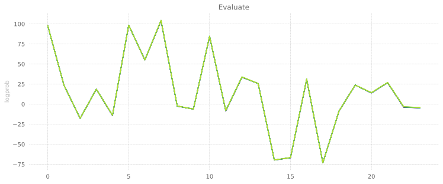
>
> <pre style="white-space:pre;overflow-x:auto;line-height:normal;font-family:Menlo,'DejaVu Sans Mono',consolas,'Courier New',monospace"><span style="color: #696969; text-decoration-color: #696969">[07:57:07] </span>Saving logdet to plots-4dSU3/Evaluate                                                                   
> </pre>
>
> 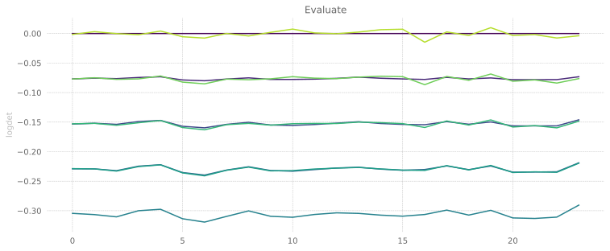
>
> <pre style="white-space:pre;overflow-x:auto;line-height:normal;font-family:Menlo,'DejaVu Sans Mono',consolas,'Courier New',monospace"><span style="color: #696969; text-decoration-color: #696969">           </span>Saving sldf to plots-4dSU3/Evaluate                                                                     
> </pre>
>
> 
>
> <pre style="white-space:pre;overflow-x:auto;line-height:normal;font-family:Menlo,'DejaVu Sans Mono',consolas,'Courier New',monospace"><span style="color: #696969; text-decoration-color: #696969">           </span>Saving sldb to plots-4dSU3/Evaluate                                                                     
> </pre>
>
> 
>
> <pre style="white-space:pre;overflow-x:auto;line-height:normal;font-family:Menlo,'DejaVu Sans Mono',consolas,'Courier New',monospace"><span style="color: #696969; text-decoration-color: #696969">           </span>Saving sld to plots-4dSU3/Evaluate                                                                      
> </pre>
>
> 
>
> <pre style="white-space:pre;overflow-x:auto;line-height:normal;font-family:Menlo,'DejaVu Sans Mono',consolas,'Courier New',monospace"><span style="color: #696969; text-decoration-color: #696969">[07:57:08] </span>Saving xeps to plots-4dSU3/Evaluate                                                                     
> </pre>
>
> 
>
> <pre style="white-space:pre;overflow-x:auto;line-height:normal;font-family:Menlo,'DejaVu Sans Mono',consolas,'Courier New',monospace"><span style="color: #696969; text-decoration-color: #696969">           </span>Saving veps to plots-4dSU3/Evaluate                                                                     
> </pre>
>
> 
>
> <pre style="white-space:pre;overflow-x:auto;line-height:normal;font-family:Menlo,'DejaVu Sans Mono',consolas,'Courier New',monospace"><span style="color: #696969; text-decoration-color: #696969">           </span>Saving acc to plots-4dSU3/Evaluate                                                                      
> </pre>
>
> 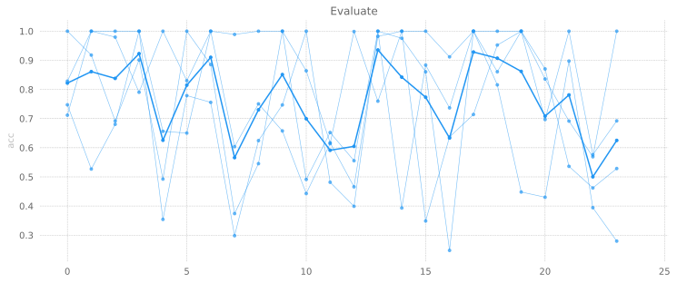
>
> <pre style="white-space:pre;overflow-x:auto;line-height:normal;font-family:Menlo,'DejaVu Sans Mono',consolas,'Courier New',monospace"><span style="color: #696969; text-decoration-color: #696969">           </span>Saving sumlogdet to plots-4dSU3/Evaluate                                                                
> </pre>
>
> 
>
> <pre style="white-space:pre;overflow-x:auto;line-height:normal;font-family:Menlo,'DejaVu Sans Mono',consolas,'Courier New',monospace"><span style="color: #696969; text-decoration-color: #696969">[07:57:09] </span>Saving beta to plots-4dSU3/Evaluate                                                                     
> </pre>
>
> 
>
> <pre style="white-space:pre;overflow-x:auto;line-height:normal;font-family:Menlo,'DejaVu Sans Mono',consolas,'Courier New',monospace"><span style="color: #696969; text-decoration-color: #696969">           </span>Saving acc_mask to plots-4dSU3/Evaluate                                                                 
> </pre>
>
> 
>
> <pre style="white-space:pre;overflow-x:auto;line-height:normal;font-family:Menlo,'DejaVu Sans Mono',consolas,'Courier New',monospace"><span style="color: #696969; text-decoration-color: #696969">           </span>Saving plaqs to plots-4dSU3/Evaluate                                                                    
> </pre>
>
> 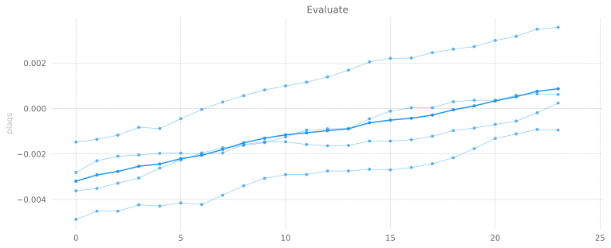
>
> <pre style="white-space:pre;overflow-x:auto;line-height:normal;font-family:Menlo,'DejaVu Sans Mono',consolas,'Courier New',monospace"><span style="color: #696969; text-decoration-color: #696969">           </span>Saving sinQ to plots-4dSU3/Evaluate                                                                     
> </pre>
>
> 
>
> <pre style="white-space:pre;overflow-x:auto;line-height:normal;font-family:Menlo,'DejaVu Sans Mono',consolas,'Courier New',monospace"><span style="color: #696969; text-decoration-color: #696969">[07:57:10] </span>Saving intQ to plots-4dSU3/Evaluate                                                                     
> </pre>
>
> 
>
> <pre style="white-space:pre;overflow-x:auto;line-height:normal;font-family:Menlo,'DejaVu Sans Mono',consolas,'Courier New',monospace"><span style="color: #696969; text-decoration-color: #696969">           </span>Saving dQint to plots-4dSU3/Evaluate                                                                    
> </pre>
>
> 
>
> <pre style="white-space:pre;overflow-x:auto;line-height:normal;font-family:Menlo,'DejaVu Sans Mono',consolas,'Courier New',monospace"><span style="color: #696969; text-decoration-color: #696969">           </span>Saving dQsin to plots-4dSU3/Evaluate                                                                    
> </pre>
>
> 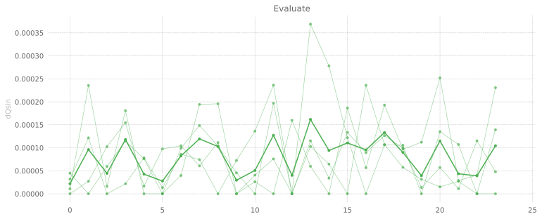
>
> <pre style="white-space:pre;overflow-x:auto;line-height:normal;font-family:Menlo,'DejaVu Sans Mono',consolas,'Courier New',monospace"><span style="color: #696969; text-decoration-color: #696969">[07:57:11] </span>Saving loss to plots-4dSU3/Evaluate                                                                     
> </pre>
>
> 
>
> </div>

## Training

``` python
history = {}
x = state.x
for step in range(50):
    console.log(f'TRAIN STEP: {step}')
    x, metrics = ptExpSU3.trainer.train_step((x, state.beta))
    if (step > 0 and step % 2 == 0):
        print_dict(metrics, grab=True)
    if (step > 0 and step % 1 == 0):
        for key, val in metrics.items():
            try:
                history[key].append(val)
            except KeyError:
                history[key] = [val]

x = ptExpSU3.trainer.dynamics.unflatten(x)
console.log(f"checkSU(x_train): {g.checkSU(x)}")
plot_metrics(history, title='train', marker='.')
```

> [!TIP]
>
> ### <span class="dim-text">`output`:</span>
>
> <div class="cell-output cell-output-display">
>
> <pre style="white-space:pre;overflow-x:auto;line-height:normal;font-family:Menlo,'DejaVu Sans Mono',consolas,'Courier New',monospace"><span style="color: #696969; text-decoration-color: #696969">[07:57:15] </span>TRAIN STEP: <span style="color: #2094f3; text-decoration-color: #2094f3">0</span>                                                                                           
> </pre>
>
> <pre style="white-space:pre;overflow-x:auto;line-height:normal;font-family:Menlo,'DejaVu Sans Mono',consolas,'Courier New',monospace"><span style="color: #696969; text-decoration-color: #696969">[07:57:16] </span>TRAIN STEP: <span style="color: #2094f3; text-decoration-color: #2094f3">1</span>                                                                                           
> </pre>
>
> <pre style="white-space:pre;overflow-x:auto;line-height:normal;font-family:Menlo,'DejaVu Sans Mono',consolas,'Courier New',monospace"><span style="color: #696969; text-decoration-color: #696969">           </span>TRAIN STEP: <span style="color: #2094f3; text-decoration-color: #2094f3">2</span>                                                                                           
> </pre>
>
>     [07/10/23 07:57:17][INFO][common.py:97] - energy: torch.Size([9, 4]) torch.float64 
>     [[ 281.36521385 -105.97415137  -69.97486138  -68.7094104 ]
>      [ 263.24054833 -109.07253574  -86.39965892  -81.32577003]
>      [ 263.1725606  -109.04339532  -86.52495783  -81.36519938]
>      [ 263.12190109 -109.00002499  -86.63542547  -81.39024754]
>      [ 263.08826659 -108.94247239  -86.72756853  -81.40051327]
>      [ 263.15071961 -108.77269274  -86.75297969  -81.33529329]
>      [ 263.23101691 -108.59060157  -86.762429    -81.25362457]
>      [ 263.32955656 -108.39687575  -86.75589511  -81.15387713]
>      [ 263.44688414 -108.19113989  -86.73311909  -81.03775212]]
>     logprob: torch.Size([9, 4]) torch.float64 
>     [[ 281.36521385 -105.97415137  -69.97486138  -68.7094104 ]
>      [ 263.34046617 -109.01072961  -86.38264168  -81.24452066]
>      [ 263.37307865 -108.92456325  -86.49242126  -81.20801101]
>      [ 263.42366401 -108.82480411  -86.58754075  -81.15657432]
>      [ 263.49344316 -108.71126581  -86.66610532  -81.09002842]
>      [ 263.45194401 -108.59723981  -86.7045229   -81.10170009]
>      [ 263.42889533 -108.46916199  -86.72820528  -81.098189  ]
>      [ 263.42369473 -108.32747357  -86.73779558  -81.07912734]
>      [ 263.43579227 -108.17161087  -86.73344347  -81.04469161]]
>     logdet: torch.Size([9, 4]) torch.float64 
>     [[ 0.00000000e+00  0.00000000e+00  0.00000000e+00  0.00000000e+00]
>      [-9.99178394e-02 -6.18061332e-02 -1.70172453e-02 -8.12493680e-02]
>      [-2.00518048e-01 -1.18832073e-01 -3.25365743e-02 -1.57188371e-01]
>      [-3.01762924e-01 -1.75220878e-01 -4.78847161e-02 -2.33673222e-01]
>      [-4.05176570e-01 -2.31206581e-01 -6.14632088e-02 -3.10484854e-01]
>      [-3.01224398e-01 -1.75452932e-01 -4.84567891e-02 -2.33593200e-01]
>      [-1.97878419e-01 -1.21439581e-01 -3.42237191e-02 -1.55435574e-01]
>      [-9.41381732e-02 -6.94021838e-02 -1.80995342e-02 -7.47497902e-02]
>      [ 1.10918724e-02 -1.95290252e-02  3.24386329e-04  6.93949633e-03]]
>     sldf: torch.Size([9, 4]) torch.float64 
>     [[ 0.          0.          0.          0.        ]
>      [-0.09991784 -0.06180613 -0.01701725 -0.08124937]
>      [-0.20051805 -0.11883207 -0.03253657 -0.15718837]
>      [-0.30176292 -0.17522088 -0.04788472 -0.23367322]
>      [-0.40517657 -0.23120658 -0.06146321 -0.31048485]
>      [ 0.          0.          0.          0.        ]
>      [ 0.          0.          0.          0.        ]
>      [ 0.          0.          0.          0.        ]
>      [ 0.          0.          0.          0.        ]]
>     sldb: torch.Size([9, 4]) torch.float64 
>     [[0.         0.         0.         0.        ]
>      [0.         0.         0.         0.        ]
>      [0.         0.         0.         0.        ]
>      [0.         0.         0.         0.        ]
>      [0.         0.         0.         0.        ]
>      [0.10395217 0.05575365 0.01300642 0.07689165]
>      [0.20729815 0.109767   0.02723949 0.15504928]
>      [0.3110384  0.1618044  0.04336367 0.23573506]
>      [0.41626844 0.21167756 0.0617876  0.31742435]]
>     sld: torch.Size([9, 4]) torch.float64 
>     [[ 0.00000000e+00  0.00000000e+00  0.00000000e+00  0.00000000e+00]
>      [-9.99178394e-02 -6.18061332e-02 -1.70172453e-02 -8.12493680e-02]
>      [-2.00518048e-01 -1.18832073e-01 -3.25365743e-02 -1.57188371e-01]
>      [-3.01762924e-01 -1.75220878e-01 -4.78847161e-02 -2.33673222e-01]
>      [-4.05176570e-01 -2.31206581e-01 -6.14632088e-02 -3.10484854e-01]
>      [-3.01224398e-01 -1.75452932e-01 -4.84567891e-02 -2.33593200e-01]
>      [-1.97878419e-01 -1.21439581e-01 -3.42237191e-02 -1.55435574e-01]
>      [-9.41381732e-02 -6.94021838e-02 -1.80995342e-02 -7.47497902e-02]
>      [ 1.10918724e-02 -1.95290252e-02  3.24386329e-04  6.93949633e-03]]
>     xeps: torch.Size([9]) torch.float64 
>     [0.001 0.001 0.001 0.001 0.001 0.001 0.001 0.001 0.001]
>     veps: torch.Size([9]) torch.float64 
>     [0.001 0.001 0.001 0.001 0.001 0.001 0.001 0.001 0.001]
>     acc: torch.Size([4]) torch.float64 
>     [1. 1. 1. 1.]
>     sumlogdet: torch.Size([4]) torch.float64 
>     [ 0.01109187 -0.01952903  0.00032439  0.0069395 ]
>     beta: torch.Size([]) torch.float64 
>     6.0
>     acc_mask: torch.Size([4]) torch.float32 
>     [1. 1. 1. 1.]
>     loss: None None 
>     -9.214976548064738e-05
>     plaqs: torch.Size([4]) torch.float64 
>     [-0.0061887   0.00500194  0.00397052  0.00286354]
>     sinQ: torch.Size([4]) torch.float64 
>     [ 0.00160074  0.00051351 -0.00282033 -0.00232394]
>     intQ: torch.Size([4]) torch.float64 
>     [ 0.0467105   0.01498444 -0.08229858 -0.06781372]
>     dQint: torch.Size([4]) torch.float64 
>     [0.00360113 0.00411262 0.00122385 0.01062494]
>     dQsin: torch.Size([4]) torch.float64 
>     [1.23408791e-04 1.40937158e-04 4.19407924e-05 3.64110788e-04]
>
> <pre style="white-space:pre;overflow-x:auto;line-height:normal;font-family:Menlo,'DejaVu Sans Mono',consolas,'Courier New',monospace"><span style="color: #696969; text-decoration-color: #696969">[07:57:17] </span>TRAIN STEP: <span style="color: #2094f3; text-decoration-color: #2094f3">3</span>                                                                                           
> </pre>
>
> <pre style="white-space:pre;overflow-x:auto;line-height:normal;font-family:Menlo,'DejaVu Sans Mono',consolas,'Courier New',monospace"><span style="color: #696969; text-decoration-color: #696969">           </span>TRAIN STEP: <span style="color: #2094f3; text-decoration-color: #2094f3">4</span>                                                                                           
> </pre>
>
>     [07/10/23 07:57:18][INFO][common.py:97] - energy: torch.Size([9, 4]) torch.float64 
>     [[ 135.11825502 -185.23125091   39.49801865  131.48643148]
>      [ 116.29012806 -187.76677412   21.57755422  118.32075786]
>      [ 116.24121464 -187.81407012   21.54918557  118.22618093]
>      [ 116.21203826 -187.84774093   21.53445154  118.14697838]
>      [ 116.20235487 -187.86847227   21.53313956  118.08177774]
>      [ 116.33755546 -187.73695847   21.5237841   118.21081333]
>      [ 116.49320029 -187.59196912   21.52970039  118.35271288]
>      [ 116.67025311 -187.43381451   21.54991672  118.5124691 ]
>      [ 116.86681924 -187.26307202   21.58393788  118.68765025]]
>     logprob: torch.Size([9, 4]) torch.float64 
>     [[ 135.11825502 -185.23125091   39.49801865  131.48643148]
>      [ 116.39238634 -187.712692     21.61699055  118.39725088]
>      [ 116.45523291 -187.70870488   21.64805552  118.37787194]
>      [ 116.53809899 -187.69063165   21.69314918  118.37350562]
>      [ 116.6405493  -187.65779592   21.75214543  118.38564832]
>      [ 116.66329968 -187.58144768   21.68175728  118.43634456]
>      [ 116.70589156 -187.49115407   21.62822818  118.50107276]
>      [ 116.76922139 -187.38620402   21.58955162  118.5821923 ]
>      [ 116.85193341 -187.26621096   21.56478423  118.67845245]]
>     logdet: torch.Size([9, 4]) torch.float64 
>     [[ 0.          0.          0.          0.        ]
>      [-0.10225828 -0.05408212 -0.03943634 -0.07649302]
>      [-0.21401826 -0.10536524 -0.09886995 -0.151691  ]
>      [-0.32606074 -0.15710928 -0.15869764 -0.22652724]
>      [-0.43819443 -0.21067635 -0.21900587 -0.30387058]
>      [-0.32574422 -0.15551078 -0.15797318 -0.22553124]
>      [-0.21269127 -0.10081506 -0.09852779 -0.14835988]
>      [-0.09896827 -0.04761049 -0.0396349  -0.0697232 ]
>      [ 0.01488583  0.00313894  0.01915366  0.00919779]]
>     sldf: torch.Size([9, 4]) torch.float64 
>     [[ 0.          0.          0.          0.        ]
>      [-0.10225828 -0.05408212 -0.03943634 -0.07649302]
>      [-0.21401826 -0.10536524 -0.09886995 -0.151691  ]
>      [-0.32606074 -0.15710928 -0.15869764 -0.22652724]
>      [-0.43819443 -0.21067635 -0.21900587 -0.30387058]
>      [ 0.          0.          0.          0.        ]
>      [ 0.          0.          0.          0.        ]
>      [ 0.          0.          0.          0.        ]
>      [ 0.          0.          0.          0.        ]]
>     sldb: torch.Size([9, 4]) torch.float64 
>     [[0.         0.         0.         0.        ]
>      [0.         0.         0.         0.        ]
>      [0.         0.         0.         0.        ]
>      [0.         0.         0.         0.        ]
>      [0.         0.         0.         0.        ]
>      [0.11245021 0.05516556 0.06103269 0.07833934]
>      [0.22550316 0.10986129 0.12047808 0.1555107 ]
>      [0.33922616 0.16306585 0.17937097 0.23414738]
>      [0.45308026 0.21381529 0.23815953 0.31306837]]
>     sld: torch.Size([9, 4]) torch.float64 
>     [[ 0.          0.          0.          0.        ]
>      [-0.10225828 -0.05408212 -0.03943634 -0.07649302]
>      [-0.21401826 -0.10536524 -0.09886995 -0.151691  ]
>      [-0.32606074 -0.15710928 -0.15869764 -0.22652724]
>      [-0.43819443 -0.21067635 -0.21900587 -0.30387058]
>      [-0.32574422 -0.15551078 -0.15797318 -0.22553124]
>      [-0.21269127 -0.10081506 -0.09852779 -0.14835988]
>      [-0.09896827 -0.04761049 -0.0396349  -0.0697232 ]
>      [ 0.01488583  0.00313894  0.01915366  0.00919779]]
>     xeps: torch.Size([9]) torch.float64 
>     [0.001 0.001 0.001 0.001 0.001 0.001 0.001 0.001 0.001]
>     veps: torch.Size([9]) torch.float64 
>     [0.001 0.001 0.001 0.001 0.001 0.001 0.001 0.001 0.001]
>     acc: torch.Size([4]) torch.float64 
>     [1. 1. 1. 1.]
>     sumlogdet: torch.Size([4]) torch.float64 
>     [0.01488583 0.00313894 0.01915366 0.00919779]
>     beta: torch.Size([]) torch.float64 
>     6.0
>     acc_mask: torch.Size([4]) torch.float32 
>     [1. 1. 1. 1.]
>     loss: None None 
>     -9.311273598207552e-05
>     plaqs: torch.Size([4]) torch.float64 
>     [-0.00625617  0.00515697  0.00406816  0.00275435]
>     sinQ: torch.Size([4]) torch.float64 
>     [ 0.00169669  0.00027787 -0.00307472 -0.00243068]
>     intQ: torch.Size([4]) torch.float64 
>     [ 0.04951016  0.00810845 -0.08972183 -0.0709284 ]
>     dQint: torch.Size([4]) torch.float64 
>     [0.0091121  0.00485531 0.00373837 0.00530226]
>     dQsin: torch.Size([4]) torch.float64 
>     [0.00031227 0.00016639 0.00012811 0.00018171]
>
> <pre style="white-space:pre;overflow-x:auto;line-height:normal;font-family:Menlo,'DejaVu Sans Mono',consolas,'Courier New',monospace"><span style="color: #696969; text-decoration-color: #696969">[07:57:18] </span>TRAIN STEP: <span style="color: #2094f3; text-decoration-color: #2094f3">5</span>                                                                                           
> </pre>
>
> <pre style="white-space:pre;overflow-x:auto;line-height:normal;font-family:Menlo,'DejaVu Sans Mono',consolas,'Courier New',monospace"><span style="color: #696969; text-decoration-color: #696969">           </span>TRAIN STEP: <span style="color: #2094f3; text-decoration-color: #2094f3">6</span>                                                                                           
> </pre>
>
>     [07/10/23 07:57:18][INFO][common.py:97] - energy: torch.Size([9, 4]) torch.float64 
>     [[ 228.01629364 -281.98565237  -20.12491938  -81.93169814]
>      [ 209.54372772 -284.81511328  -37.93562912  -94.82221044]
>      [ 209.53314206 -284.86321231  -37.98213952  -94.7657871 ]
>      [ 209.53988816 -284.89900259  -38.01533459  -94.6929395 ]
>      [ 209.56277464 -284.92278355  -38.03459123  -94.60412808]
>      [ 209.52202739 -284.81794281  -37.98911718  -94.44784165]
>      [ 209.49797583 -284.69947243  -37.9326838   -94.27544262]
>      [ 209.49108176 -284.56770054  -37.864695    -94.08767484]
>      [ 209.50091155 -284.42249184  -37.78261324  -93.88473302]]
>     logprob: torch.Size([9, 4]) torch.float64 
>     [[ 228.01629364 -281.98565237  -20.12491938  -81.93169814]
>      [ 209.64717122 -284.76978578  -37.89875392  -94.73644574]
>      [ 209.73537504 -284.77002068  -37.89616835  -94.59029472]
>      [ 209.84174293 -284.75652536  -37.88147942  -94.42815844]
>      [ 209.962672   -284.7292213   -37.85268786  -94.25053909]
>      [ 209.82588679 -284.6766064   -37.85487886  -94.18370178]
>      [ 209.70632398 -284.6116521   -37.84305335  -94.10091561]
>      [ 209.60393282 -284.53535682  -37.81768024  -94.00238516]
>      [ 209.51820993 -284.44869923  -37.7788019   -93.88832557]]
>     logdet: torch.Size([9, 4]) torch.float64 
>     [[ 0.          0.          0.          0.        ]
>      [-0.1034435  -0.0453275  -0.0368752  -0.0857647 ]
>      [-0.20223298 -0.09319163 -0.08597117 -0.17549238]
>      [-0.30185477 -0.14247724 -0.13385516 -0.26478106]
>      [-0.39989736 -0.19356225 -0.18190337 -0.35358898]
>      [-0.3038594  -0.14133641 -0.13423832 -0.26413986]
>      [-0.20834815 -0.08782033 -0.08963045 -0.174527  ]
>      [-0.11285106 -0.03234373 -0.04701475 -0.08528968]
>      [-0.01729838  0.02620739 -0.00381135  0.00359256]]
>     sldf: torch.Size([9, 4]) torch.float64 
>     [[ 0.          0.          0.          0.        ]
>      [-0.1034435  -0.0453275  -0.0368752  -0.0857647 ]
>      [-0.20223298 -0.09319163 -0.08597117 -0.17549238]
>      [-0.30185477 -0.14247724 -0.13385516 -0.26478106]
>      [-0.39989736 -0.19356225 -0.18190337 -0.35358898]
>      [ 0.          0.          0.          0.        ]
>      [ 0.          0.          0.          0.        ]
>      [ 0.          0.          0.          0.        ]
>      [ 0.          0.          0.          0.        ]]
>     sldb: torch.Size([9, 4]) torch.float64 
>     [[0.         0.         0.         0.        ]
>      [0.         0.         0.         0.        ]
>      [0.         0.         0.         0.        ]
>      [0.         0.         0.         0.        ]
>      [0.         0.         0.         0.        ]
>      [0.09603796 0.05222585 0.04766505 0.08944912]
>      [0.19154921 0.10574193 0.09227292 0.17906198]
>      [0.2870463  0.16121852 0.13488861 0.2682993 ]
>      [0.38259897 0.21976964 0.17809202 0.35718154]]
>     sld: torch.Size([9, 4]) torch.float64 
>     [[ 0.          0.          0.          0.        ]
>      [-0.1034435  -0.0453275  -0.0368752  -0.0857647 ]
>      [-0.20223298 -0.09319163 -0.08597117 -0.17549238]
>      [-0.30185477 -0.14247724 -0.13385516 -0.26478106]
>      [-0.39989736 -0.19356225 -0.18190337 -0.35358898]
>      [-0.3038594  -0.14133641 -0.13423832 -0.26413986]
>      [-0.20834815 -0.08782033 -0.08963045 -0.174527  ]
>      [-0.11285106 -0.03234373 -0.04701475 -0.08528968]
>      [-0.01729838  0.02620739 -0.00381135  0.00359256]]
>     xeps: torch.Size([9]) torch.float64 
>     [0.001 0.001 0.001 0.001 0.001 0.001 0.001 0.001 0.001]
>     veps: torch.Size([9]) torch.float64 
>     [0.001 0.001 0.001 0.001 0.001 0.001 0.001 0.001 0.001]
>     acc: torch.Size([4]) torch.float64 
>     [1. 1. 1. 1.]
>     sumlogdet: torch.Size([4]) torch.float64 
>     [-0.01729838  0.02620739 -0.00381135  0.00359256]
>     beta: torch.Size([]) torch.float64 
>     6.0
>     acc_mask: torch.Size([4]) torch.float32 
>     [1. 1. 1. 1.]
>     loss: None None 
>     -9.28664314669938e-05
>     plaqs: torch.Size([4]) torch.float64 
>     [-0.00595627  0.00563947  0.00427224  0.00266021]
>     sinQ: torch.Size([4]) torch.float64 
>     [ 0.0015684   0.000394   -0.00288902 -0.00230002]
>     intQ: torch.Size([4]) torch.float64 
>     [ 0.04576675  0.01149709 -0.08430301 -0.06711567]
>     dQint: torch.Size([4]) torch.float64 
>     [0.00569303 0.00018414 0.00430204 0.0048331 ]
>     dQsin: torch.Size([4]) torch.float64 
>     [1.95097159e-04 6.31025768e-06 1.47428747e-04 1.65627571e-04]
>
> <pre style="white-space:pre;overflow-x:auto;line-height:normal;font-family:Menlo,'DejaVu Sans Mono',consolas,'Courier New',monospace"><span style="color: #696969; text-decoration-color: #696969">           </span>TRAIN STEP: <span style="color: #2094f3; text-decoration-color: #2094f3">7</span>                                                                                           
> </pre>
>
> <pre style="white-space:pre;overflow-x:auto;line-height:normal;font-family:Menlo,'DejaVu Sans Mono',consolas,'Courier New',monospace"><span style="color: #696969; text-decoration-color: #696969">[07:57:19] </span>TRAIN STEP: <span style="color: #2094f3; text-decoration-color: #2094f3">8</span>                                                                                           
> </pre>
>
>     [07/10/23 07:57:19][INFO][common.py:97] - energy: torch.Size([9, 4]) torch.float64 
>     [[  58.07198815 -254.25276437 -172.2577486    29.085534  ]
>      [  38.58967365 -256.77756509 -189.63209473   16.9107765 ]
>      [  38.54131984 -256.74101555 -189.65157019   16.86084166]
>      [  38.51063821 -256.69100156 -189.65346392   16.82947871]
>      [  38.49779564 -256.63323532 -189.63822452   16.81279717]
>      [  38.44790192 -256.74596217 -189.52847699   16.85991159]
>      [  38.41672204 -256.84462705 -189.40387487   16.9229498 ]
>      [  38.40415924 -256.92936903 -189.26495267   17.00162406]
>      [  38.40968237 -257.00031104 -189.11191882   17.09386957]]
>     logprob: torch.Size([9, 4]) torch.float64 
>     [[  58.07198815 -254.25276437 -172.2577486    29.085534  ]
>      [  38.69108049 -256.73219519 -189.60853741   16.99823438]
>      [  38.74834371 -256.65132718 -189.60253545   17.02556407]
>      [  38.82415398 -256.55706059 -189.58177739   17.06940503]
>      [  38.91900959 -256.45221112 -189.54598199   17.12813164]
>      [  38.76089447 -256.61505054 -189.45640459   17.09995904]
>      [  38.62166943 -256.76307375 -189.35122961   17.08707163]
>      [  38.50106519 -256.89602957 -189.2319903    17.08934889]
>      [  38.39833993 -257.01404255 -189.09974009   17.1062827 ]]
>     logdet: torch.Size([9, 4]) torch.float64 
>     [[ 0.          0.          0.          0.        ]
>      [-0.10140685 -0.0453699  -0.02355732 -0.08745788]
>      [-0.20702387 -0.08968837 -0.04903474 -0.16472241]
>      [-0.31351577 -0.13394096 -0.07168653 -0.23992632]
>      [-0.42121395 -0.18102421 -0.09224252 -0.31533447]
>      [-0.31299255 -0.13091163 -0.0720724  -0.24004744]
>      [-0.20494739 -0.08155329 -0.05264525 -0.16412183]
>      [-0.09690595 -0.03333946 -0.03296237 -0.08772482]
>      [ 0.01134244  0.01373151 -0.01217873 -0.01241313]]
>     sldf: torch.Size([9, 4]) torch.float64 
>     [[ 0.          0.          0.          0.        ]
>      [-0.10140685 -0.0453699  -0.02355732 -0.08745788]
>      [-0.20702387 -0.08968837 -0.04903474 -0.16472241]
>      [-0.31351577 -0.13394096 -0.07168653 -0.23992632]
>      [-0.42121395 -0.18102421 -0.09224252 -0.31533447]
>      [ 0.          0.          0.          0.        ]
>      [ 0.          0.          0.          0.        ]
>      [ 0.          0.          0.          0.        ]
>      [ 0.          0.          0.          0.        ]]
>     sldb: torch.Size([9, 4]) torch.float64 
>     [[0.         0.         0.         0.        ]
>      [0.         0.         0.         0.        ]
>      [0.         0.         0.         0.        ]
>      [0.         0.         0.         0.        ]
>      [0.         0.         0.         0.        ]
>      [0.1082214  0.05011257 0.02017012 0.07528702]
>      [0.21626657 0.09947091 0.03959727 0.15121264]
>      [0.324308   0.14768475 0.05928015 0.22760964]
>      [0.43255639 0.19475572 0.08006379 0.30292134]]
>     sld: torch.Size([9, 4]) torch.float64 
>     [[ 0.          0.          0.          0.        ]
>      [-0.10140685 -0.0453699  -0.02355732 -0.08745788]
>      [-0.20702387 -0.08968837 -0.04903474 -0.16472241]
>      [-0.31351577 -0.13394096 -0.07168653 -0.23992632]
>      [-0.42121395 -0.18102421 -0.09224252 -0.31533447]
>      [-0.31299255 -0.13091163 -0.0720724  -0.24004744]
>      [-0.20494739 -0.08155329 -0.05264525 -0.16412183]
>      [-0.09690595 -0.03333946 -0.03296237 -0.08772482]
>      [ 0.01134244  0.01373151 -0.01217873 -0.01241313]]
>     xeps: torch.Size([9]) torch.float64 
>     [0.001 0.001 0.001 0.001 0.001 0.001 0.001 0.001 0.001]
>     veps: torch.Size([9]) torch.float64 
>     [0.001 0.001 0.001 0.001 0.001 0.001 0.001 0.001 0.001]
>     acc: torch.Size([4]) torch.float64 
>     [1. 1. 1. 1.]
>     sumlogdet: torch.Size([4]) torch.float64 
>     [ 0.01134244  0.01373151 -0.01217873 -0.01241313]
>     beta: torch.Size([]) torch.float64 
>     6.0
>     acc_mask: torch.Size([4]) torch.float32 
>     [1. 1. 1. 1.]
>     loss: None None 
>     -9.173678843041342e-05
>     plaqs: torch.Size([4]) torch.float64 
>     [-0.00589752  0.00556446  0.00453206  0.00283429]
>     sinQ: torch.Size([4]) torch.float64 
>     [ 0.0013992   0.00034847 -0.0030403  -0.00230766]
>     intQ: torch.Size([4]) torch.float64 
>     [ 0.04082942  0.01016853 -0.08871753 -0.06733875]
>     dQint: torch.Size([4]) torch.float64 
>     [0.00390699 0.00238289 0.00855818 0.00216934]
>     dQsin: torch.Size([4]) torch.float64 
>     [1.33890400e-04 8.16602253e-05 2.93284326e-04 7.43419571e-05]
>
> <pre style="white-space:pre;overflow-x:auto;line-height:normal;font-family:Menlo,'DejaVu Sans Mono',consolas,'Courier New',monospace"><span style="color: #696969; text-decoration-color: #696969">           </span>TRAIN STEP: <span style="color: #2094f3; text-decoration-color: #2094f3">9</span>                                                                                           
> </pre>
>
> <pre style="white-space:pre;overflow-x:auto;line-height:normal;font-family:Menlo,'DejaVu Sans Mono',consolas,'Courier New',monospace"><span style="color: #696969; text-decoration-color: #696969">[07:57:20] </span>TRAIN STEP: <span style="color: #2094f3; text-decoration-color: #2094f3">10</span>                                                                                          
> </pre>
>
>     [07/10/23 07:57:20][INFO][common.py:97] - energy: torch.Size([9, 4]) torch.float64 
>     [[ 165.78526004 -158.66660112 -150.84648678 -277.1795612 ]
>      [ 147.39212947 -160.8891048  -167.54447157 -290.5208167 ]
>      [ 147.17045246 -160.83928327 -167.60853844 -290.55458752]
>      [ 146.96450675 -160.77671527 -167.65852461 -290.57214886]
>      [ 146.77478032 -160.700923   -167.69478487 -290.5741648 ]
>      [ 146.98532096 -160.72826923 -167.77220345 -290.53358274]
>      [ 147.2134995  -160.74296164 -167.83705697 -290.4768103 ]
>      [ 147.45923281 -160.74258706 -167.88795065 -290.40486434]
>      [ 147.72274485 -160.72719985 -167.92486955 -290.31919424]]
>     logprob: torch.Size([9, 4]) torch.float64 
>     [[ 165.78526004 -158.66660112 -150.84648678 -277.1795612 ]
>      [ 147.49634341 -160.85234158 -167.52064545 -290.43531158]
>      [ 147.37500476 -160.76971169 -167.55289547 -290.38673672]
>      [ 147.27085091 -160.67383095 -167.570758   -290.32414945]
>      [ 147.18408477 -160.56418795 -167.57497862 -290.24798665]
>      [ 147.29124479 -160.627483   -167.68155488 -290.28472817]
>      [ 147.41620449 -160.67938552 -167.77259251 -290.30666732]
>      [ 147.55913924 -160.7151849  -167.84958544 -290.31370793]
>      [ 147.71994084 -160.73486739 -167.91182803 -290.30589063]]
>     logdet: torch.Size([9, 4]) torch.float64 
>     [[ 0.          0.          0.          0.        ]
>      [-0.10421394 -0.03676322 -0.02382612 -0.08550512]
>      [-0.20455229 -0.06957158 -0.05564296 -0.1678508 ]
>      [-0.30634415 -0.10288432 -0.08776661 -0.24799941]
>      [-0.40930446 -0.13673505 -0.11980625 -0.32617815]
>      [-0.30592382 -0.10078623 -0.09064857 -0.24885457]
>      [-0.20270499 -0.06357612 -0.06446446 -0.17014297]
>      [-0.09990643 -0.02740216 -0.03836522 -0.09115642]
>      [ 0.00280402  0.00766754 -0.01304152 -0.01330361]]
>     sldf: torch.Size([9, 4]) torch.float64 
>     [[ 0.          0.          0.          0.        ]
>      [-0.10421394 -0.03676322 -0.02382612 -0.08550512]
>      [-0.20455229 -0.06957158 -0.05564296 -0.1678508 ]
>      [-0.30634415 -0.10288432 -0.08776661 -0.24799941]
>      [-0.40930446 -0.13673505 -0.11980625 -0.32617815]
>      [ 0.          0.          0.          0.        ]
>      [ 0.          0.          0.          0.        ]
>      [ 0.          0.          0.          0.        ]
>      [ 0.          0.          0.          0.        ]]
>     sldb: torch.Size([9, 4]) torch.float64 
>     [[0.         0.         0.         0.        ]
>      [0.         0.         0.         0.        ]
>      [0.         0.         0.         0.        ]
>      [0.         0.         0.         0.        ]
>      [0.         0.         0.         0.        ]
>      [0.10338063 0.03594882 0.02915768 0.07732358]
>      [0.20659947 0.07315893 0.05534179 0.15603518]
>      [0.30939802 0.10933289 0.08144103 0.23502173]
>      [0.41210847 0.14440259 0.10676473 0.31287454]]
>     sld: torch.Size([9, 4]) torch.float64 
>     [[ 0.          0.          0.          0.        ]
>      [-0.10421394 -0.03676322 -0.02382612 -0.08550512]
>      [-0.20455229 -0.06957158 -0.05564296 -0.1678508 ]
>      [-0.30634415 -0.10288432 -0.08776661 -0.24799941]
>      [-0.40930446 -0.13673505 -0.11980625 -0.32617815]
>      [-0.30592382 -0.10078623 -0.09064857 -0.24885457]
>      [-0.20270499 -0.06357612 -0.06446446 -0.17014297]
>      [-0.09990643 -0.02740216 -0.03836522 -0.09115642]
>      [ 0.00280402  0.00766754 -0.01304152 -0.01330361]]
>     xeps: torch.Size([9]) torch.float64 
>     [0.001 0.001 0.001 0.001 0.001 0.001 0.001 0.001 0.001]
>     veps: torch.Size([9]) torch.float64 
>     [0.001 0.001 0.001 0.001 0.001 0.001 0.001 0.001 0.001]
>     acc: torch.Size([4]) torch.float64 
>     [1. 1. 1. 1.]
>     sumlogdet: torch.Size([4]) torch.float64 
>     [ 0.00280402  0.00766754 -0.01304152 -0.01330361]
>     beta: torch.Size([]) torch.float64 
>     6.0
>     acc_mask: torch.Size([4]) torch.float32 
>     [1. 1. 1. 1.]
>     loss: None None 
>     -9.176952518904433e-05
>     plaqs: torch.Size([4]) torch.float64 
>     [-0.00560066  0.00583437  0.00445981  0.00269613]
>     sinQ: torch.Size([4]) torch.float64 
>     [ 0.00164278  0.00039318 -0.0029024  -0.00230664]
>     intQ: torch.Size([4]) torch.float64 
>     [ 0.04793717  0.01147332 -0.08469338 -0.06730904]
>     dQint: torch.Size([4]) torch.float64 
>     [0.00583948 0.00029422 0.00308553 0.00448383]
>     dQsin: torch.Size([4]) torch.float64 
>     [2.00115985e-04 1.00829077e-05 1.05739392e-04 1.53658415e-04]
>
> <pre style="white-space:pre;overflow-x:auto;line-height:normal;font-family:Menlo,'DejaVu Sans Mono',consolas,'Courier New',monospace"><span style="color: #696969; text-decoration-color: #696969">           </span>TRAIN STEP: <span style="color: #2094f3; text-decoration-color: #2094f3">11</span>                                                                                          
> </pre>
>
> <pre style="white-space:pre;overflow-x:auto;line-height:normal;font-family:Menlo,'DejaVu Sans Mono',consolas,'Courier New',monospace"><span style="color: #696969; text-decoration-color: #696969">[07:57:21] </span>TRAIN STEP: <span style="color: #2094f3; text-decoration-color: #2094f3">12</span>                                                                                          
> </pre>
>
>     [07/10/23 07:57:21][INFO][common.py:97] - energy: torch.Size([9, 4]) torch.float64 
>     [[ 188.20505965  -58.29885144  -98.18029968  -54.39963063]
>      [ 170.51710167  -61.06483545 -116.01752595  -68.13930872]
>      [ 170.22367662  -61.02729971 -116.12317278  -68.35212217]
>      [ 169.94726353  -60.97502657 -116.21178215  -68.54917981]
>      [ 169.6874372   -60.90769105 -116.28237697  -68.73040709]
>      [ 169.88756791  -60.60725102 -116.19644423  -68.68839189]
>      [ 170.10515006  -60.29350582 -116.09583329  -68.63115605]
>      [ 170.33946017  -59.96648684 -115.98075856  -68.55935268]
>      [ 170.590336    -59.62290977 -115.85112333  -68.47245672]]
>     logprob: torch.Size([9, 4]) torch.float64 
>     [[ 188.20505965  -58.29885144  -98.18029968  -54.39963063]
>      [ 170.61883772  -60.99860325 -115.99267874  -68.05494583]
>      [ 170.42464918  -60.88261255 -116.07186839  -68.18439678]
>      [ 170.24744052  -60.75120359 -116.1365266   -68.29608566]
>      [ 170.08701925  -60.60473632 -116.18640188  -68.3914714 ]
>      [ 170.18679771  -60.38249412 -116.11953711  -68.43541968]
>      [ 170.30402635  -60.14605486 -116.03781314  -68.46434924]
>      [ 170.43897919  -59.8957125  -115.94174113  -68.47993056]
>      [ 170.5910721   -59.63004352 -115.83059649  -68.48065411]]
>     logdet: torch.Size([9, 4]) torch.float64 
>     [[ 0.          0.          0.          0.        ]
>      [-0.10173606 -0.06623219 -0.02484721 -0.08436289]
>      [-0.20097256 -0.14468717 -0.05130439 -0.16772539]
>      [-0.30017699 -0.22382299 -0.07525555 -0.25309416]
>      [-0.39958205 -0.30295473 -0.09597509 -0.33893569]
>      [-0.2992298  -0.22475689 -0.07690712 -0.25297222]
>      [-0.19887629 -0.14745096 -0.05802014 -0.16680681]
>      [-0.09951902 -0.07077434 -0.03901743 -0.07942211]
>      [-0.00073611  0.00713375 -0.02052685  0.00819739]]
>     sldf: torch.Size([9, 4]) torch.float64 
>     [[ 0.          0.          0.          0.        ]
>      [-0.10173606 -0.06623219 -0.02484721 -0.08436289]
>      [-0.20097256 -0.14468717 -0.05130439 -0.16772539]
>      [-0.30017699 -0.22382299 -0.07525555 -0.25309416]
>      [-0.39958205 -0.30295473 -0.09597509 -0.33893569]
>      [ 0.          0.          0.          0.        ]
>      [ 0.          0.          0.          0.        ]
>      [ 0.          0.          0.          0.        ]
>      [ 0.          0.          0.          0.        ]]
>     sldb: torch.Size([9, 4]) torch.float64 
>     [[0.         0.         0.         0.        ]
>      [0.         0.         0.         0.        ]
>      [0.         0.         0.         0.        ]
>      [0.         0.         0.         0.        ]
>      [0.         0.         0.         0.        ]
>      [0.10035224 0.07819784 0.01906797 0.08596348]
>      [0.20070576 0.15550378 0.03795495 0.17212888]
>      [0.30006303 0.2321804  0.05695766 0.25951358]
>      [0.39884594 0.31008849 0.07544825 0.34713308]]
>     sld: torch.Size([9, 4]) torch.float64 
>     [[ 0.          0.          0.          0.        ]
>      [-0.10173606 -0.06623219 -0.02484721 -0.08436289]
>      [-0.20097256 -0.14468717 -0.05130439 -0.16772539]
>      [-0.30017699 -0.22382299 -0.07525555 -0.25309416]
>      [-0.39958205 -0.30295473 -0.09597509 -0.33893569]
>      [-0.2992298  -0.22475689 -0.07690712 -0.25297222]
>      [-0.19887629 -0.14745096 -0.05802014 -0.16680681]
>      [-0.09951902 -0.07077434 -0.03901743 -0.07942211]
>      [-0.00073611  0.00713375 -0.02052685  0.00819739]]
>     xeps: torch.Size([9]) torch.float64 
>     [0.001 0.001 0.001 0.001 0.001 0.001 0.001 0.001 0.001]
>     veps: torch.Size([9]) torch.float64 
>     [0.001 0.001 0.001 0.001 0.001 0.001 0.001 0.001 0.001]
>     acc: torch.Size([4]) torch.float64 
>     [1. 1. 1. 1.]
>     sumlogdet: torch.Size([4]) torch.float64 
>     [-0.00073611  0.00713375 -0.02052685  0.00819739]
>     beta: torch.Size([]) torch.float64 
>     6.0
>     acc_mask: torch.Size([4]) torch.float32 
>     [1. 1. 1. 1.]
>     loss: None None 
>     -9.275198253756771e-05
>     plaqs: torch.Size([4]) torch.float64 
>     [-0.00565215  0.00597338  0.00471459  0.00279347]
>     sinQ: torch.Size([4]) torch.float64 
>     [ 1.64529269e-03  5.24680611e-05 -2.97667902e-03 -2.65912988e-03]
>     intQ: torch.Size([4]) torch.float64 
>     [ 0.04801046  0.00153104 -0.08686098 -0.07759474]
>     dQint: torch.Size([4]) torch.float64 
>     [0.00065245 0.00969285 0.00241307 0.0080844 ]
>     dQsin: torch.Size([4]) torch.float64 
>     [2.23591304e-05 3.32168887e-04 8.26946588e-05 2.77047880e-04]
>
> <pre style="white-space:pre;overflow-x:auto;line-height:normal;font-family:Menlo,'DejaVu Sans Mono',consolas,'Courier New',monospace"><span style="color: #696969; text-decoration-color: #696969">           </span>TRAIN STEP: <span style="color: #2094f3; text-decoration-color: #2094f3">13</span>                                                                                          
> </pre>
>
> <pre style="white-space:pre;overflow-x:auto;line-height:normal;font-family:Menlo,'DejaVu Sans Mono',consolas,'Courier New',monospace"><span style="color: #696969; text-decoration-color: #696969">[07:57:22] </span>TRAIN STEP: <span style="color: #2094f3; text-decoration-color: #2094f3">14</span>                                                                                          
> </pre>
>
>     [07/10/23 07:57:22][INFO][common.py:97] - energy: torch.Size([9, 4]) torch.float64 
>     [[269.43140031 -78.92513987  32.34792115 113.77488245]
>      [250.52566438 -83.0934488   14.569342   100.76386849]
>      [250.51054733 -83.03842171  14.48931617 100.64609339]
>      [250.51146935 -82.96954958  14.42328181 100.54350263]
>      [250.52862743 -82.88674771  14.37082778 100.4575535 ]
>      [250.58961371 -83.01337977  14.46234277 100.48350857]
>      [250.66604833 -83.12516719  14.5679644  100.52532797]
>      [250.75806246 -83.22390956  14.68536563 100.58193137]
>      [250.86680332 -83.30966923  14.81512122 100.65259476]]
>     logprob: torch.Size([9, 4]) torch.float64 
>     [[269.43140031 -78.92513987  32.34792115 113.77488245]
>      [250.61992512 -83.05632952  14.6020026  100.85210239]
>      [250.69159598 -82.96117521  14.57372486 100.81378112]
>      [250.77872241 -82.85454899  14.56012068 100.79105526]
>      [250.88195949 -82.73377657  14.55859979 100.78363819]
>      [250.8571183  -82.89666386  14.59964566 100.7307771 ]
>      [250.84671938 -83.04389711  14.65428118 100.69242974]
>      [250.85183089 -83.17870223  14.72263822 100.6694879 ]
>      [250.87622229 -83.30090252  14.80466478 100.66222142]]
>     logdet: torch.Size([9, 4]) torch.float64 
>     [[ 0.          0.          0.          0.        ]
>      [-0.09426074 -0.03711928 -0.0326606  -0.08823389]
>      [-0.18104865 -0.0772465  -0.08440869 -0.16768772]
>      [-0.26725305 -0.11500059 -0.13683887 -0.24755263]
>      [-0.35333206 -0.15297115 -0.18777202 -0.32608469]
>      [-0.26750458 -0.11671591 -0.13730289 -0.24726853]
>      [-0.18067105 -0.08127008 -0.08631679 -0.16710177]
>      [-0.09376843 -0.04520733 -0.03727259 -0.08755653]
>      [-0.00941898 -0.0087667   0.01045645 -0.00962666]]
>     sldf: torch.Size([9, 4]) torch.float64 
>     [[ 0.          0.          0.          0.        ]
>      [-0.09426074 -0.03711928 -0.0326606  -0.08823389]
>      [-0.18104865 -0.0772465  -0.08440869 -0.16768772]
>      [-0.26725305 -0.11500059 -0.13683887 -0.24755263]
>      [-0.35333206 -0.15297115 -0.18777202 -0.32608469]
>      [ 0.          0.          0.          0.        ]
>      [ 0.          0.          0.          0.        ]
>      [ 0.          0.          0.          0.        ]
>      [ 0.          0.          0.          0.        ]]
>     sldb: torch.Size([9, 4]) torch.float64 
>     [[0.         0.         0.         0.        ]
>      [0.         0.         0.         0.        ]
>      [0.         0.         0.         0.        ]
>      [0.         0.         0.         0.        ]
>      [0.         0.         0.         0.        ]
>      [0.08582748 0.03625524 0.05046912 0.07881616]
>      [0.17266101 0.07170107 0.10145523 0.15898292]
>      [0.25956363 0.10776382 0.15049943 0.23852816]
>      [0.34391308 0.14420444 0.19822846 0.31645803]]
>     sld: torch.Size([9, 4]) torch.float64 
>     [[ 0.          0.          0.          0.        ]
>      [-0.09426074 -0.03711928 -0.0326606  -0.08823389]
>      [-0.18104865 -0.0772465  -0.08440869 -0.16768772]
>      [-0.26725305 -0.11500059 -0.13683887 -0.24755263]
>      [-0.35333206 -0.15297115 -0.18777202 -0.32608469]
>      [-0.26750458 -0.11671591 -0.13730289 -0.24726853]
>      [-0.18067105 -0.08127008 -0.08631679 -0.16710177]
>      [-0.09376843 -0.04520733 -0.03727259 -0.08755653]
>      [-0.00941898 -0.0087667   0.01045645 -0.00962666]]
>     xeps: torch.Size([9]) torch.float64 
>     [0.001 0.001 0.001 0.001 0.001 0.001 0.001 0.001 0.001]
>     veps: torch.Size([9]) torch.float64 
>     [0.001 0.001 0.001 0.001 0.001 0.001 0.001 0.001 0.001]
>     acc: torch.Size([4]) torch.float64 
>     [1. 1. 1. 1.]
>     sumlogdet: torch.Size([4]) torch.float64 
>     [-0.00941898 -0.0087667   0.01045645 -0.00962666]
>     beta: torch.Size([]) torch.float64 
>     6.0
>     acc_mask: torch.Size([4]) torch.float32 
>     [1. 1. 1. 1.]
>     loss: None None 
>     -9.288034143291682e-05
>     plaqs: torch.Size([4]) torch.float64 
>     [-0.00545839  0.00615163  0.0047064   0.00285683]
>     sinQ: torch.Size([4]) torch.float64 
>     [ 0.00169113  0.00022278 -0.00285758 -0.00260122]
>     intQ: torch.Size([4]) torch.float64 
>     [ 0.04934804  0.00650095 -0.08338556 -0.07590503]
>     dQint: torch.Size([4]) torch.float64 
>     [0.00654428 0.00071274 0.00170216 0.00521421]
>     dQsin: torch.Size([4]) torch.float64 
>     [2.24269016e-04 2.44251559e-05 5.83322748e-05 1.78688118e-04]
>
> <pre style="white-space:pre;overflow-x:auto;line-height:normal;font-family:Menlo,'DejaVu Sans Mono',consolas,'Courier New',monospace"><span style="color: #696969; text-decoration-color: #696969">           </span>TRAIN STEP: <span style="color: #2094f3; text-decoration-color: #2094f3">15</span>                                                                                          
> </pre>
>
> <pre style="white-space:pre;overflow-x:auto;line-height:normal;font-family:Menlo,'DejaVu Sans Mono',consolas,'Courier New',monospace"><span style="color: #696969; text-decoration-color: #696969">[07:57:23] </span>TRAIN STEP: <span style="color: #2094f3; text-decoration-color: #2094f3">16</span>                                                                                          
> </pre>
>
>     [07/10/23 07:57:23][INFO][common.py:97] - energy: torch.Size([9, 4]) torch.float64 
>     [[ 242.09111141 -167.78069176  -86.79127201   -1.71409733]
>      [ 223.42479069 -170.8975103  -104.09194289  -15.06808349]
>      [ 223.32836168 -171.01752667 -104.26316404  -15.13329744]
>      [ 223.25220575 -171.12311605 -104.41971763  -15.18359855]
>      [ 223.19583803 -171.21411865 -104.56149024  -15.21926476]
>      [ 223.23732721 -171.07503408 -104.45847981  -15.15402874]
>      [ 223.2982538  -170.91796681 -104.34035922  -15.07306938]
>      [ 223.37934147 -170.74700095 -104.20937461  -14.97519778]
>      [ 223.48054702 -170.56258876 -104.06378562  -14.86043875]]
>     logprob: torch.Size([9, 4]) torch.float64 
>     [[ 242.09111141 -167.78069176  -86.79127201   -1.71409733]
>      [ 223.52786528 -170.83137805 -104.0718157   -14.98056815]
>      [ 223.54494286 -170.88452904 -104.2145884   -14.96318368]
>      [ 223.58203094 -170.92414762 -104.34489498  -14.93017888]
>      [ 223.63913253 -170.95000627 -104.46195817  -14.8814643 ]
>      [ 223.56698162 -170.87777937 -104.38605005  -14.90105953]
>      [ 223.51387208 -170.79101929 -104.29603278  -14.90494681]
>      [ 223.48004487 -170.6902614  -104.19119749  -14.89268621]
>      [ 223.46577315 -170.57526562 -104.07214949  -14.86422353]]
>     logdet: torch.Size([9, 4]) torch.float64 
>     [[ 0.          0.          0.          0.        ]
>      [-0.10307459 -0.06613225 -0.02012719 -0.08751534]
>      [-0.21658118 -0.13299763 -0.04857564 -0.17011376]
>      [-0.32982519 -0.19896844 -0.07482265 -0.25341967]
>      [-0.4432945  -0.26411238 -0.09953207 -0.33780046]
>      [-0.32965441 -0.19725471 -0.07242976 -0.25296921]
>      [-0.21561828 -0.12694752 -0.04432644 -0.16812257]
>      [-0.1007034  -0.05673955 -0.01817712 -0.08251156]
>      [ 0.01477387  0.01267686  0.00836387  0.00378478]]
>     sldf: torch.Size([9, 4]) torch.float64 
>     [[ 0.          0.          0.          0.        ]
>      [-0.10307459 -0.06613225 -0.02012719 -0.08751534]
>      [-0.21658118 -0.13299763 -0.04857564 -0.17011376]
>      [-0.32982519 -0.19896844 -0.07482265 -0.25341967]
>      [-0.4432945  -0.26411238 -0.09953207 -0.33780046]
>      [ 0.          0.          0.          0.        ]
>      [ 0.          0.          0.          0.        ]
>      [ 0.          0.          0.          0.        ]
>      [ 0.          0.          0.          0.        ]]
>     sldb: torch.Size([9, 4]) torch.float64 
>     [[0.         0.         0.         0.        ]
>      [0.         0.         0.         0.        ]
>      [0.         0.         0.         0.        ]
>      [0.         0.         0.         0.        ]
>      [0.         0.         0.         0.        ]
>      [0.1136401  0.06685767 0.02710231 0.08483125]
>      [0.22767622 0.13716486 0.05520562 0.1696779 ]
>      [0.34259111 0.20737283 0.08135495 0.2552889 ]
>      [0.45806837 0.27678924 0.10789594 0.34158524]]
>     sld: torch.Size([9, 4]) torch.float64 
>     [[ 0.          0.          0.          0.        ]
>      [-0.10307459 -0.06613225 -0.02012719 -0.08751534]
>      [-0.21658118 -0.13299763 -0.04857564 -0.17011376]
>      [-0.32982519 -0.19896844 -0.07482265 -0.25341967]
>      [-0.4432945  -0.26411238 -0.09953207 -0.33780046]
>      [-0.32965441 -0.19725471 -0.07242976 -0.25296921]
>      [-0.21561828 -0.12694752 -0.04432644 -0.16812257]
>      [-0.1007034  -0.05673955 -0.01817712 -0.08251156]
>      [ 0.01477387  0.01267686  0.00836387  0.00378478]]
>     xeps: torch.Size([9]) torch.float64 
>     [0.001 0.001 0.001 0.001 0.001 0.001 0.001 0.001 0.001]
>     veps: torch.Size([9]) torch.float64 
>     [0.001 0.001 0.001 0.001 0.001 0.001 0.001 0.001 0.001]
>     acc: torch.Size([4]) torch.float64 
>     [1. 1. 1. 1.]
>     sumlogdet: torch.Size([4]) torch.float64 
>     [0.01477387 0.01267686 0.00836387 0.00378478]
>     beta: torch.Size([]) torch.float64 
>     6.0
>     acc_mask: torch.Size([4]) torch.float32 
>     [1. 1. 1. 1.]
>     loss: None None 
>     -9.286711824528633e-05
>     plaqs: torch.Size([4]) torch.float64 
>     [-0.00537043  0.00654723  0.0046871   0.00286848]
>     sinQ: torch.Size([4]) torch.float64 
>     [ 0.0014679   0.00035176 -0.00312108 -0.00251439]
>     intQ: torch.Size([4]) torch.float64 
>     [ 0.04283408  0.01026443 -0.09107459 -0.07337109]
>     dQint: torch.Size([4]) torch.float64 
>     [0.00142679 0.00507351 0.00434687 0.00288916]
>     dQsin: torch.Size([4]) torch.float64 
>     [4.88952829e-05 1.73866583e-04 1.48964780e-04 9.90099206e-05]
>
> <pre style="white-space:pre;overflow-x:auto;line-height:normal;font-family:Menlo,'DejaVu Sans Mono',consolas,'Courier New',monospace"><span style="color: #696969; text-decoration-color: #696969">           </span>TRAIN STEP: <span style="color: #2094f3; text-decoration-color: #2094f3">17</span>                                                                                          
> </pre>
>
> <pre style="white-space:pre;overflow-x:auto;line-height:normal;font-family:Menlo,'DejaVu Sans Mono',consolas,'Courier New',monospace"><span style="color: #696969; text-decoration-color: #696969">[07:57:24] </span>TRAIN STEP: <span style="color: #2094f3; text-decoration-color: #2094f3">18</span>                                                                                          
> </pre>
>
>     [07/10/23 07:57:24][INFO][common.py:97] - energy: torch.Size([9, 4]) torch.float64 
>     [[  51.81364669 -276.10671185  -98.60682104  -25.36370694]
>      [  32.66548524 -279.85187586 -116.04757011  -37.27420888]
>      [  32.52539767 -279.95203661 -116.18756296  -37.35219963]
>      [  32.40266348 -280.0364063  -116.31266057  -37.41251265]
>      [  32.2975883  -280.10401611 -116.42371203  -37.45611136]
>      [  32.49407266 -279.90120261 -116.42109307  -37.38052488]
>      [  32.70561809 -279.68370345 -116.40390229  -37.28787851]
>      [  32.9320363  -279.45238646 -116.3725013   -37.17660581]
>      [  33.17450914 -279.20755491 -116.32766274  -37.04654594]]
>     logprob: torch.Size([9, 4]) torch.float64 
>     [[  51.81364669 -276.10671185  -98.60682104  -25.36370694]
>      [  32.76189104 -279.82955433 -116.02372562  -37.18231376]
>      [  32.71911899 -279.90477912 -116.13872567  -37.17473898]
>      [  32.693671   -279.96520078 -116.2393825   -37.1508859 ]
>      [  32.68587057 -280.00999821 -116.32586348  -37.11121438]
>      [  32.78485093 -279.8297702  -116.34805175  -37.1188895 ]
>      [  32.89988208 -279.63562624 -116.35767199  -37.11027228]
>      [  33.03055209 -279.42760771 -116.3539882   -37.08474785]
>      [  33.17727777 -279.20475654 -116.33262468  -37.04216334]]
>     logdet: torch.Size([9, 4]) torch.float64 
>     [[ 0.          0.          0.          0.        ]
>      [-0.0964058  -0.02232153 -0.02384449 -0.09189513]
>      [-0.19372132 -0.04725749 -0.04883729 -0.17746065]
>      [-0.29100752 -0.07120551 -0.07327806 -0.26162675]
>      [-0.38828227 -0.0940179  -0.09784855 -0.34489698]
>      [-0.29077828 -0.07143241 -0.07304131 -0.26163538]
>      [-0.19426399 -0.0480772  -0.0462303  -0.17760622]
>      [-0.09851579 -0.02477875 -0.0185131  -0.09185795]
>      [-0.00276863 -0.00279837  0.00496193 -0.0043826 ]]
>     sldf: torch.Size([9, 4]) torch.float64 
>     [[ 0.          0.          0.          0.        ]
>      [-0.0964058  -0.02232153 -0.02384449 -0.09189513]
>      [-0.19372132 -0.04725749 -0.04883729 -0.17746065]
>      [-0.29100752 -0.07120551 -0.07327806 -0.26162675]
>      [-0.38828227 -0.0940179  -0.09784855 -0.34489698]
>      [ 0.          0.          0.          0.        ]
>      [ 0.          0.          0.          0.        ]
>      [ 0.          0.          0.          0.        ]
>      [ 0.          0.          0.          0.        ]]
>     sldb: torch.Size([9, 4]) torch.float64 
>     [[0.         0.         0.         0.        ]
>      [0.         0.         0.         0.        ]
>      [0.         0.         0.         0.        ]
>      [0.         0.         0.         0.        ]
>      [0.         0.         0.         0.        ]
>      [0.09750399 0.02258548 0.02480724 0.0832616 ]
>      [0.19401828 0.04594069 0.05161825 0.16729076]
>      [0.28976648 0.06923915 0.07933545 0.25303903]
>      [0.38551364 0.09121953 0.10281049 0.34051439]]
>     sld: torch.Size([9, 4]) torch.float64 
>     [[ 0.          0.          0.          0.        ]
>      [-0.0964058  -0.02232153 -0.02384449 -0.09189513]
>      [-0.19372132 -0.04725749 -0.04883729 -0.17746065]
>      [-0.29100752 -0.07120551 -0.07327806 -0.26162675]
>      [-0.38828227 -0.0940179  -0.09784855 -0.34489698]
>      [-0.29077828 -0.07143241 -0.07304131 -0.26163538]
>      [-0.19426399 -0.0480772  -0.0462303  -0.17760622]
>      [-0.09851579 -0.02477875 -0.0185131  -0.09185795]
>      [-0.00276863 -0.00279837  0.00496193 -0.0043826 ]]
>     xeps: torch.Size([9]) torch.float64 
>     [0.001 0.001 0.001 0.001 0.001 0.001 0.001 0.001 0.001]
>     veps: torch.Size([9]) torch.float64 
>     [0.001 0.001 0.001 0.001 0.001 0.001 0.001 0.001 0.001]
>     acc: torch.Size([4]) torch.float64 
>     [1. 1. 1. 1.]
>     sumlogdet: torch.Size([4]) torch.float64 
>     [-0.00276863 -0.00279837  0.00496193 -0.0043826 ]
>     beta: torch.Size([]) torch.float64 
>     6.0
>     acc_mask: torch.Size([4]) torch.float32 
>     [1. 1. 1. 1.]
>     loss: None None 
>     -9.167386663631978e-05
>     plaqs: torch.Size([4]) torch.float64 
>     [-0.00517545  0.00667307  0.00507462  0.00313774]
>     sinQ: torch.Size([4]) torch.float64 
>     [ 0.00132024  0.00044875 -0.002744   -0.00245262]
>     intQ: torch.Size([4]) torch.float64 
>     [ 0.03852533  0.01309472 -0.08007142 -0.0715688 ]
>     dQint: torch.Size([4]) torch.float64 
>     [7.28081614e-03 6.66048468e-06 4.84043390e-03 3.36405003e-03]
>     dQsin: torch.Size([4]) torch.float64 
>     [2.49509636e-04 2.28251212e-07 1.65879055e-04 1.15284177e-04]
>
> <pre style="white-space:pre;overflow-x:auto;line-height:normal;font-family:Menlo,'DejaVu Sans Mono',consolas,'Courier New',monospace"><span style="color: #696969; text-decoration-color: #696969">           </span>TRAIN STEP: <span style="color: #2094f3; text-decoration-color: #2094f3">19</span>                                                                                          
> </pre>
>
> <pre style="white-space:pre;overflow-x:auto;line-height:normal;font-family:Menlo,'DejaVu Sans Mono',consolas,'Courier New',monospace"><span style="color: #696969; text-decoration-color: #696969">[07:57:25] </span>TRAIN STEP: <span style="color: #2094f3; text-decoration-color: #2094f3">20</span>                                                                                          
> </pre>
>
>     [07/10/23 07:57:25][INFO][common.py:97] - energy: torch.Size([9, 4]) torch.float64 
>     [[ 123.0916713  -368.39530166   33.58539175  -34.38175277]
>      [ 103.52159903 -371.9245264    16.25876955  -46.83411547]
>      [ 103.49818912 -371.99175699   16.25033885  -46.90479335]
>      [ 103.49279164 -372.04895247   16.25593112  -46.95916726]
>      [ 103.5056771  -372.0929779    16.27542596  -46.99594976]
>      [ 103.58569049 -372.03068088   16.33807126  -46.87584595]
>      [ 103.68441208 -371.95640792   16.41538247  -46.74498565]
>      [ 103.80248382 -371.86939321   16.50716943  -46.60248449]
>      [ 103.94033489 -371.76738451   16.61384277  -46.44620817]]
>     logprob: torch.Size([9, 4]) torch.float64 
>     [[ 123.0916713  -368.39530166   33.58539175  -34.38175277]
>      [ 103.62409357 -371.88212063   16.27096835  -46.74644487]
>      [ 103.71044289 -371.89183418   16.2822088   -46.73869286]
>      [ 103.81537939 -371.88864557   16.30635963  -46.71547364]
>      [ 103.93916614 -371.8720773    16.34372148  -46.6760762 ]
>      [ 103.90804543 -371.87005391   16.38865795  -46.63093433]
>      [ 103.89474182 -371.85431278   16.44826651  -46.57274808]
>      [ 103.90017294 -371.82514128   16.52183202  -46.50121273]
>      [ 103.92583081 -371.78192182   16.61100638  -46.4154334 ]]
>     logdet: torch.Size([9, 4]) torch.float64 
>     [[ 0.          0.          0.          0.        ]
>      [-0.10249453 -0.04240577 -0.0121988  -0.0876706 ]
>      [-0.21225377 -0.09992281 -0.03186996 -0.16610049]
>      [-0.32258775 -0.1603069  -0.05042851 -0.24369362]
>      [-0.43348904 -0.2209006  -0.06829553 -0.31987357]
>      [-0.32235494 -0.16062696 -0.05058669 -0.24491162]
>      [-0.21032974 -0.10209513 -0.03288404 -0.17223757]
>      [-0.09768913 -0.04425193 -0.01466259 -0.10127176]
>      [ 0.01450408  0.01453731  0.0028364  -0.03077477]]
>     sldf: torch.Size([9, 4]) torch.float64 
>     [[ 0.          0.          0.          0.        ]
>      [-0.10249453 -0.04240577 -0.0121988  -0.0876706 ]
>      [-0.21225377 -0.09992281 -0.03186996 -0.16610049]
>      [-0.32258775 -0.1603069  -0.05042851 -0.24369362]
>      [-0.43348904 -0.2209006  -0.06829553 -0.31987357]
>      [ 0.          0.          0.          0.        ]
>      [ 0.          0.          0.          0.        ]
>      [ 0.          0.          0.          0.        ]
>      [ 0.          0.          0.          0.        ]]
>     sldb: torch.Size([9, 4]) torch.float64 
>     [[0.         0.         0.         0.        ]
>      [0.         0.         0.         0.        ]
>      [0.         0.         0.         0.        ]
>      [0.         0.         0.         0.        ]
>      [0.         0.         0.         0.        ]
>      [0.11113411 0.06027364 0.01770883 0.07496195]
>      [0.2231593  0.11880547 0.03541149 0.147636  ]
>      [0.33579992 0.17664867 0.05363294 0.2186018 ]
>      [0.44799312 0.23543791 0.07113192 0.2890988 ]]
>     sld: torch.Size([9, 4]) torch.float64 
>     [[ 0.          0.          0.          0.        ]
>      [-0.10249453 -0.04240577 -0.0121988  -0.0876706 ]
>      [-0.21225377 -0.09992281 -0.03186996 -0.16610049]
>      [-0.32258775 -0.1603069  -0.05042851 -0.24369362]
>      [-0.43348904 -0.2209006  -0.06829553 -0.31987357]
>      [-0.32235494 -0.16062696 -0.05058669 -0.24491162]
>      [-0.21032974 -0.10209513 -0.03288404 -0.17223757]
>      [-0.09768913 -0.04425193 -0.01466259 -0.10127176]
>      [ 0.01450408  0.01453731  0.0028364  -0.03077477]]
>     xeps: torch.Size([9]) torch.float64 
>     [0.001 0.001 0.001 0.001 0.001 0.001 0.001 0.001 0.001]
>     veps: torch.Size([9]) torch.float64 
>     [0.001 0.001 0.001 0.001 0.001 0.001 0.001 0.001 0.001]
>     acc: torch.Size([4]) torch.float64 
>     [1. 1. 1. 1.]
>     sumlogdet: torch.Size([4]) torch.float64 
>     [ 0.01450408  0.01453731  0.0028364  -0.03077477]
>     beta: torch.Size([]) torch.float64 
>     6.0
>     acc_mask: torch.Size([4]) torch.float32 
>     [1. 1. 1. 1.]
>     loss: None None 
>     -9.258356095911575e-05
>     plaqs: torch.Size([4]) torch.float64 
>     [-0.00516376  0.00676524  0.00537446  0.00314183]
>     sinQ: torch.Size([4]) torch.float64 
>     [ 0.00137951  0.00029458 -0.00284336 -0.00246712]
>     intQ: torch.Size([4]) torch.float64 
>     [ 0.0402548   0.00859586 -0.08297054 -0.07199194]
>     dQint: torch.Size([4]) torch.float64 
>     [0.01094545 0.00412099 0.00106453 0.00203444]
>     dQsin: torch.Size([4]) torch.float64 
>     [3.75094787e-04 1.41224095e-04 3.64808917e-05 6.97190191e-05]
>
> <pre style="white-space:pre;overflow-x:auto;line-height:normal;font-family:Menlo,'DejaVu Sans Mono',consolas,'Courier New',monospace"><span style="color: #696969; text-decoration-color: #696969">           </span>TRAIN STEP: <span style="color: #2094f3; text-decoration-color: #2094f3">21</span>                                                                                          
> </pre>
>
> <pre style="white-space:pre;overflow-x:auto;line-height:normal;font-family:Menlo,'DejaVu Sans Mono',consolas,'Courier New',monospace"><span style="color: #696969; text-decoration-color: #696969">[07:57:26] </span>TRAIN STEP: <span style="color: #2094f3; text-decoration-color: #2094f3">22</span>                                                                                          
> </pre>
>
>     [07/10/23 07:57:26][INFO][common.py:97] - energy: torch.Size([9, 4]) torch.float64 
>     [[ 262.81068213 -221.53230965  -85.89856373 -124.36697529]
>      [ 244.0466881  -225.56388349 -103.67656562 -137.33725402]
>      [ 243.97921278 -225.5258324  -103.81282295 -137.34152247]
>      [ 243.9295502  -225.4739091  -103.93755735 -137.33042661]
>      [ 243.89742265 -225.40839491 -104.04975512 -137.30418556]
>      [ 244.13875959 -225.26466851 -103.9470228  -137.18562375]
>      [ 244.39817786 -225.10681087 -103.83079731 -137.05137395]
>      [ 244.67516855 -224.93451782 -103.70118309 -136.90126371]
>      [ 244.97020268 -224.74824293 -103.55778437 -136.73499005]]
>     logprob: torch.Size([9, 4]) torch.float64 
>     [[ 262.81068213 -221.53230965  -85.89856373 -124.36697529]
>      [ 244.14750674 -225.54050097 -103.65166962 -137.2466387 ]
>      [ 244.18664367 -225.48139629 -103.75803865 -137.16439118]
>      [ 244.24333905 -225.40797576 -103.85609319 -137.06719523]
>      [ 244.31720171 -225.31967898 -103.94353926 -136.95526835]
>      [ 244.45239498 -225.19812353 -103.86575155 -136.9220462 ]
>      [ 244.60599805 -225.06183681 -103.77287375 -136.87291166]
>      [ 244.77792238 -224.91099768 -103.66528316 -136.80800178]
>      [ 244.96821729 -224.74552135 -103.54270102 -136.72752315]]
>     logdet: torch.Size([9, 4]) torch.float64 
>     [[ 0.          0.          0.          0.        ]
>      [-0.10081864 -0.02338253 -0.024896   -0.09061532]
>      [-0.20743089 -0.04443612 -0.0547843  -0.17713129]
>      [-0.31378886 -0.06593334 -0.08146416 -0.26323138]
>      [-0.41977907 -0.08871593 -0.10621586 -0.34891721]
>      [-0.3136354  -0.06654498 -0.08127125 -0.26357756]
>      [-0.20782019 -0.04497407 -0.05792356 -0.17846229]
>      [-0.10275383 -0.02352013 -0.03589992 -0.09326193]
>      [ 0.00198538 -0.00272157 -0.01508335 -0.0074669 ]]
>     sldf: torch.Size([9, 4]) torch.float64 
>     [[ 0.          0.          0.          0.        ]
>      [-0.10081864 -0.02338253 -0.024896   -0.09061532]
>      [-0.20743089 -0.04443612 -0.0547843  -0.17713129]
>      [-0.31378886 -0.06593334 -0.08146416 -0.26323138]
>      [-0.41977907 -0.08871593 -0.10621586 -0.34891721]
>      [ 0.          0.          0.          0.        ]
>      [ 0.          0.          0.          0.        ]
>      [ 0.          0.          0.          0.        ]
>      [ 0.          0.          0.          0.        ]]
>     sldb: torch.Size([9, 4]) torch.float64 
>     [[0.         0.         0.         0.        ]
>      [0.         0.         0.         0.        ]
>      [0.         0.         0.         0.        ]
>      [0.         0.         0.         0.        ]
>      [0.         0.         0.         0.        ]
>      [0.10614367 0.02217095 0.02494461 0.08533966]
>      [0.21195887 0.04374187 0.0482923  0.17045493]
>      [0.31702524 0.0651958  0.07031594 0.25565528]
>      [0.42176445 0.08599436 0.09113251 0.34145031]]
>     sld: torch.Size([9, 4]) torch.float64 
>     [[ 0.          0.          0.          0.        ]
>      [-0.10081864 -0.02338253 -0.024896   -0.09061532]
>      [-0.20743089 -0.04443612 -0.0547843  -0.17713129]
>      [-0.31378886 -0.06593334 -0.08146416 -0.26323138]
>      [-0.41977907 -0.08871593 -0.10621586 -0.34891721]
>      [-0.3136354  -0.06654498 -0.08127125 -0.26357756]
>      [-0.20782019 -0.04497407 -0.05792356 -0.17846229]
>      [-0.10275383 -0.02352013 -0.03589992 -0.09326193]
>      [ 0.00198538 -0.00272157 -0.01508335 -0.0074669 ]]
>     xeps: torch.Size([9]) torch.float64 
>     [0.001 0.001 0.001 0.001 0.001 0.001 0.001 0.001 0.001]
>     veps: torch.Size([9]) torch.float64 
>     [0.001 0.001 0.001 0.001 0.001 0.001 0.001 0.001 0.001]
>     acc: torch.Size([4]) torch.float64 
>     [1. 1. 1. 1.]
>     sumlogdet: torch.Size([4]) torch.float64 
>     [ 0.00198538 -0.00272157 -0.01508335 -0.0074669 ]
>     beta: torch.Size([]) torch.float64 
>     6.0
>     acc_mask: torch.Size([4]) torch.float32 
>     [1. 1. 1. 1.]
>     loss: None None 
>     -9.203359341330946e-05
>     plaqs: torch.Size([4]) torch.float64 
>     [-0.00490634  0.00699433  0.00557357  0.00328262]
>     sinQ: torch.Size([4]) torch.float64 
>     [ 0.00137312  0.00036101 -0.0028145  -0.00263894]
>     intQ: torch.Size([4]) torch.float64 
>     [ 0.04006824  0.01053447 -0.0821286  -0.07700553]
>     dQint: torch.Size([4]) torch.float64 
>     [0.00260182 0.00359335 0.00417618 0.00081342]
>     dQsin: torch.Size([4]) torch.float64 
>     [8.91629785e-05 1.23142058e-04 1.43115374e-04 2.78753748e-05]
>
> <pre style="white-space:pre;overflow-x:auto;line-height:normal;font-family:Menlo,'DejaVu Sans Mono',consolas,'Courier New',monospace"><span style="color: #696969; text-decoration-color: #696969">           </span>TRAIN STEP: <span style="color: #2094f3; text-decoration-color: #2094f3">23</span>                                                                                          
> </pre>
>
> <pre style="white-space:pre;overflow-x:auto;line-height:normal;font-family:Menlo,'DejaVu Sans Mono',consolas,'Courier New',monospace"><span style="color: #696969; text-decoration-color: #696969">[07:57:27] </span>TRAIN STEP: <span style="color: #2094f3; text-decoration-color: #2094f3">24</span>                                                                                          
> </pre>
>
>     [07/10/23 07:57:27][INFO][common.py:97] - energy: torch.Size([9, 4]) torch.float64 
>     [[  53.29549314  -58.76586695 -244.18392685  -90.47824155]
>      [  34.57995877  -62.69294363 -262.28875795 -104.3813051 ]
>      [  34.47438861  -62.83474894 -262.34322091 -104.45432688]
>      [  34.3856592   -62.9622492  -262.38208482 -104.51525265]
>      [  34.31450599  -63.07517595 -262.40400217 -104.56176039]
>      [  34.47641167  -63.00415612 -262.27248643 -104.62725646]
>      [  34.65607385  -62.91995838 -262.12895522 -104.676091  ]
>      [  34.85403748  -62.81988525 -261.97383069 -104.70795625]
>      [  35.07040043  -62.70322397 -261.80467069 -104.72640427]]
>     logprob: torch.Size([9, 4]) torch.float64 
>     [[  53.29549314  -58.76586695 -244.18392685  -90.47824155]
>      [  34.68201044  -62.64211138 -262.267517   -104.30220296]
>      [  34.67827523  -62.71990458 -262.29424895 -104.29103486]
>      [  34.69104203  -62.78368168 -262.30681754 -104.26609628]
>      [  34.72116752  -62.83294363 -262.30487786 -104.22593336]
>      [  34.78192114  -62.82211379 -262.19717421 -104.3771953 ]
>      [  34.85994349  -62.79763485 -262.07585442 -104.51235589]
>      [  34.95536497  -62.75964481 -261.9409464  -104.63123031]
>      [  35.06841863  -62.70751068 -261.79191975 -104.73542137]]
>     logdet: torch.Size([9, 4]) torch.float64 
>     [[ 0.          0.          0.          0.        ]
>      [-0.10205166 -0.05083225 -0.02124095 -0.07910213]
>      [-0.20388662 -0.11484436 -0.04897196 -0.16329202]
>      [-0.30538284 -0.17856752 -0.07526728 -0.24915637]
>      [-0.40666153 -0.24223232 -0.09912432 -0.33582703]
>      [-0.30550947 -0.18204233 -0.07531222 -0.25006116]
>      [-0.20386965 -0.12232353 -0.0531008  -0.16373511]
>      [-0.10132749 -0.06024043 -0.03288429 -0.07672595]
>      [ 0.0019818   0.00428671 -0.01275094  0.0090171 ]]
>     sldf: torch.Size([9, 4]) torch.float64 
>     [[ 0.          0.          0.          0.        ]
>      [-0.10205166 -0.05083225 -0.02124095 -0.07910213]
>      [-0.20388662 -0.11484436 -0.04897196 -0.16329202]
>      [-0.30538284 -0.17856752 -0.07526728 -0.24915637]
>      [-0.40666153 -0.24223232 -0.09912432 -0.33582703]
>      [ 0.          0.          0.          0.        ]
>      [ 0.          0.          0.          0.        ]
>      [ 0.          0.          0.          0.        ]
>      [ 0.          0.          0.          0.        ]]
>     sldb: torch.Size([9, 4]) torch.float64 
>     [[0.         0.         0.         0.        ]
>      [0.         0.         0.         0.        ]
>      [0.         0.         0.         0.        ]
>      [0.         0.         0.         0.        ]
>      [0.         0.         0.         0.        ]
>      [0.10115205 0.06018998 0.0238121  0.08576588]
>      [0.20279188 0.11990879 0.04602352 0.17209193]
>      [0.30533404 0.18199188 0.06624003 0.25910108]
>      [0.40864333 0.24651903 0.08637338 0.34484413]]
>     sld: torch.Size([9, 4]) torch.float64 
>     [[ 0.          0.          0.          0.        ]
>      [-0.10205166 -0.05083225 -0.02124095 -0.07910213]
>      [-0.20388662 -0.11484436 -0.04897196 -0.16329202]
>      [-0.30538284 -0.17856752 -0.07526728 -0.24915637]
>      [-0.40666153 -0.24223232 -0.09912432 -0.33582703]
>      [-0.30550947 -0.18204233 -0.07531222 -0.25006116]
>      [-0.20386965 -0.12232353 -0.0531008  -0.16373511]
>      [-0.10132749 -0.06024043 -0.03288429 -0.07672595]
>      [ 0.0019818   0.00428671 -0.01275094  0.0090171 ]]
>     xeps: torch.Size([9]) torch.float64 
>     [0.001 0.001 0.001 0.001 0.001 0.001 0.001 0.001 0.001]
>     veps: torch.Size([9]) torch.float64 
>     [0.001 0.001 0.001 0.001 0.001 0.001 0.001 0.001 0.001]
>     acc: torch.Size([4]) torch.float64 
>     [1. 1. 1. 1.]
>     sumlogdet: torch.Size([4]) torch.float64 
>     [ 0.0019818   0.00428671 -0.01275094  0.0090171 ]
>     beta: torch.Size([]) torch.float64 
>     6.0
>     acc_mask: torch.Size([4]) torch.float32 
>     [1. 1. 1. 1.]
>     loss: None None 
>     -9.199918126428102e-05
>     plaqs: torch.Size([4]) torch.float64 
>     [-0.00464369  0.00702943  0.00568062  0.00344332]
>     sinQ: torch.Size([4]) torch.float64 
>     [ 0.00160992  0.0003247  -0.00290013 -0.00234132]
>     intQ: torch.Size([4]) torch.float64 
>     [ 0.04697816  0.00947497 -0.08462732 -0.06832074]
>     dQint: torch.Size([4]) torch.float64 
>     [0.00490065 0.00466015 0.00849919 0.00734464]
>     dQsin: torch.Size([4]) torch.float64 
>     [0.00016794 0.0001597  0.00029126 0.0002517 ]
>
> <pre style="white-space:pre;overflow-x:auto;line-height:normal;font-family:Menlo,'DejaVu Sans Mono',consolas,'Courier New',monospace"><span style="color: #696969; text-decoration-color: #696969">           </span>TRAIN STEP: <span style="color: #2094f3; text-decoration-color: #2094f3">25</span>                                                                                          
> </pre>
>
> <pre style="white-space:pre;overflow-x:auto;line-height:normal;font-family:Menlo,'DejaVu Sans Mono',consolas,'Courier New',monospace"><span style="color: #696969; text-decoration-color: #696969">[07:57:28] </span>TRAIN STEP: <span style="color: #2094f3; text-decoration-color: #2094f3">26</span>                                                                                          
> </pre>
>
>     [07/10/23 07:57:28][INFO][common.py:97] - energy: torch.Size([9, 4]) torch.float64 
>     [[ 145.56268985 -250.90061932   58.73238516  -73.52151453]
>      [ 126.27648138 -254.11582955   40.89072731  -87.21799879]
>      [ 126.24154442 -254.20254897   40.83512463  -87.32131832]
>      [ 126.2226123  -254.27667566   40.79727028  -87.41032588]
>      [ 126.22042926 -254.33751424   40.77621894  -87.48500866]
>      [ 126.28697941 -254.27357731   40.81122568  -87.29897074]
>      [ 126.37044421 -254.19652122   40.86115183  -87.09686641]
>      [ 126.4704619  -254.10639685   40.9265964   -86.87836757]
>      [ 126.58721126 -254.00235699   41.00782063  -86.64472854]]
>     logprob: torch.Size([9, 4]) torch.float64 
>     [[ 145.56268985 -250.90061932   58.73238516  -73.52151453]
>      [ 126.36641975 -254.092928     40.90759934  -87.1375361 ]
>      [ 126.42468866 -254.14419272   40.86953976  -87.1632774 ]
>      [ 126.50060579 -254.18180556   40.84666217  -87.17378558]
>      [ 126.59386801 -254.20585361   40.83913233  -87.16897545]
>      [ 126.56524509 -254.18121627   40.86224539  -87.06220381]
>      [ 126.55353401 -254.14693932   40.90091196  -86.94020992]
>      [ 126.55866354 -254.10066525   40.95487408  -86.80282657]
>      [ 126.58095921 -254.03758118   41.02396249  -86.65028484]]
>     logdet: torch.Size([9, 4]) torch.float64 
>     [[ 0.          0.          0.          0.        ]
>      [-0.08993836 -0.02290155 -0.01687203 -0.0804627 ]
>      [-0.18314424 -0.05835625 -0.03441513 -0.15804092]
>      [-0.27799349 -0.0948701  -0.04939189 -0.23654031]
>      [-0.37343874 -0.13166064 -0.06291339 -0.31603321]
>      [-0.27826568 -0.09236104 -0.05101971 -0.23676693]
>      [-0.1830898  -0.0495819  -0.03976013 -0.15665649]
>      [-0.08820164 -0.0057316  -0.02827768 -0.075541  ]
>      [ 0.00625205  0.03522419 -0.01614186  0.00555631]]
>     sldf: torch.Size([9, 4]) torch.float64 
>     [[ 0.          0.          0.          0.        ]
>      [-0.08993836 -0.02290155 -0.01687203 -0.0804627 ]
>      [-0.18314424 -0.05835625 -0.03441513 -0.15804092]
>      [-0.27799349 -0.0948701  -0.04939189 -0.23654031]
>      [-0.37343874 -0.13166064 -0.06291339 -0.31603321]
>      [ 0.          0.          0.          0.        ]
>      [ 0.          0.          0.          0.        ]
>      [ 0.          0.          0.          0.        ]
>      [ 0.          0.          0.          0.        ]]
>     sldb: torch.Size([9, 4]) torch.float64 
>     [[0.         0.         0.         0.        ]
>      [0.         0.         0.         0.        ]
>      [0.         0.         0.         0.        ]
>      [0.         0.         0.         0.        ]
>      [0.         0.         0.         0.        ]
>      [0.09517307 0.03929959 0.01189369 0.07926628]
>      [0.19034894 0.08207873 0.02315326 0.15937672]
>      [0.2852371  0.12592904 0.03463571 0.24049221]
>      [0.37969079 0.16688482 0.04677153 0.32158951]]
>     sld: torch.Size([9, 4]) torch.float64 
>     [[ 0.          0.          0.          0.        ]
>      [-0.08993836 -0.02290155 -0.01687203 -0.0804627 ]
>      [-0.18314424 -0.05835625 -0.03441513 -0.15804092]
>      [-0.27799349 -0.0948701  -0.04939189 -0.23654031]
>      [-0.37343874 -0.13166064 -0.06291339 -0.31603321]
>      [-0.27826568 -0.09236104 -0.05101971 -0.23676693]
>      [-0.1830898  -0.0495819  -0.03976013 -0.15665649]
>      [-0.08820164 -0.0057316  -0.02827768 -0.075541  ]
>      [ 0.00625205  0.03522419 -0.01614186  0.00555631]]
>     xeps: torch.Size([9]) torch.float64 
>     [0.001 0.001 0.001 0.001 0.001 0.001 0.001 0.001 0.001]
>     veps: torch.Size([9]) torch.float64 
>     [0.001 0.001 0.001 0.001 0.001 0.001 0.001 0.001 0.001]
>     acc: torch.Size([4]) torch.float64 
>     [1. 1. 1. 1.]
>     sumlogdet: torch.Size([4]) torch.float64 
>     [ 0.00625205  0.03522419 -0.01614186  0.00555631]
>     beta: torch.Size([]) torch.float64 
>     6.0
>     acc_mask: torch.Size([4]) torch.float32 
>     [1. 1. 1. 1.]
>     loss: None None 
>     -9.29218625393476e-05
>     plaqs: torch.Size([4]) torch.float64 
>     [-0.00441948  0.00714393  0.00583822  0.00372959]
>     sinQ: torch.Size([4]) torch.float64 
>     [ 0.00167111  0.00027887 -0.00268236 -0.00261393]
>     intQ: torch.Size([4]) torch.float64 
>     [ 0.04876376  0.00813762 -0.07827249 -0.07627567]
>     dQint: torch.Size([4]) torch.float64 
>     [0.00064774 0.00074784 0.00113602 0.00841213]
>     dQsin: torch.Size([4]) torch.float64 
>     [2.21975696e-05 2.56281275e-05 3.89306736e-05 2.88279188e-04]
>
> <pre style="white-space:pre;overflow-x:auto;line-height:normal;font-family:Menlo,'DejaVu Sans Mono',consolas,'Courier New',monospace"><span style="color: #696969; text-decoration-color: #696969">           </span>TRAIN STEP: <span style="color: #2094f3; text-decoration-color: #2094f3">27</span>                                                                                          
> </pre>
>
> <pre style="white-space:pre;overflow-x:auto;line-height:normal;font-family:Menlo,'DejaVu Sans Mono',consolas,'Courier New',monospace"><span style="color: #696969; text-decoration-color: #696969">[07:57:29] </span>TRAIN STEP: <span style="color: #2094f3; text-decoration-color: #2094f3">28</span>                                                                                          
> </pre>
>
>     [07/10/23 07:57:29][INFO][common.py:97] - energy: torch.Size([9, 4]) torch.float64 
>     [[ 171.15931665   15.3638884  -201.77147589  -93.17897621]
>      [ 151.88147376   11.79418133 -218.98901622 -106.07141897]
>      [ 151.85071746   11.78524517 -218.9201588  -106.10069885]
>      [ 151.83872619   11.78844414 -218.83784101 -106.11383911]
>      [ 151.84627233   11.80707467 -218.74149497 -106.1110771 ]
>      [ 151.9395231    11.7743522  -218.71824208 -105.92181133]
>      [ 152.05147054   11.75387696 -218.67960987 -105.71477454]
>      [ 152.18197841   11.74386838 -218.62650409 -105.49266828]
>      [ 152.33148059   11.74512414 -218.56000431 -105.25598557]]
>     logprob: torch.Size([9, 4]) torch.float64 
>     [[ 171.15931665   15.3638884  -201.77147589  -93.17897621]
>      [ 151.98643516   11.82994944 -218.9758738  -105.98897581]
>      [ 152.06660101   11.85246911 -218.88795818 -105.93663796]
>      [ 152.1655778    11.88824259 -218.78497323 -105.86945202]
>      [ 152.28377714   11.93838745 -218.6679944  -105.78800194]
>      [ 152.26684222   11.87633823 -218.66502018 -105.67750282]
>      [ 152.26917284   11.82832167 -218.64756474 -105.55123251]
>      [ 152.29036215   11.79368232 -218.61564241 -105.40984507]
>      [ 152.33036729   11.77296525 -218.56916079 -105.25359312]]
>     logdet: torch.Size([9, 4]) torch.float64 
>     [[ 0.          0.          0.          0.        ]
>      [-0.10496139 -0.03576811 -0.01314242 -0.08244316]
>      [-0.21588355 -0.06722394 -0.03220063 -0.16406089]
>      [-0.32685161 -0.09979845 -0.05286778 -0.24438709]
>      [-0.43750481 -0.13131278 -0.07350057 -0.32307516]
>      [-0.32731913 -0.10198602 -0.05322189 -0.24430852]
>      [-0.2177023  -0.07444471 -0.03204513 -0.16354203]
>      [-0.10838375 -0.04981394 -0.01086168 -0.0828232 ]
>      [ 0.0011133  -0.02784111  0.00915648 -0.00239244]]
>     sldf: torch.Size([9, 4]) torch.float64 
>     [[ 0.          0.          0.          0.        ]
>      [-0.10496139 -0.03576811 -0.01314242 -0.08244316]
>      [-0.21588355 -0.06722394 -0.03220063 -0.16406089]
>      [-0.32685161 -0.09979845 -0.05286778 -0.24438709]
>      [-0.43750481 -0.13131278 -0.07350057 -0.32307516]
>      [ 0.          0.          0.          0.        ]
>      [ 0.          0.          0.          0.        ]
>      [ 0.          0.          0.          0.        ]
>      [ 0.          0.          0.          0.        ]]
>     sldb: torch.Size([9, 4]) torch.float64 
>     [[0.         0.         0.         0.        ]
>      [0.         0.         0.         0.        ]
>      [0.         0.         0.         0.        ]
>      [0.         0.         0.         0.        ]
>      [0.         0.         0.         0.        ]
>      [0.11018568 0.02932676 0.02027868 0.07876664]
>      [0.21980251 0.05686807 0.04145544 0.15953313]
>      [0.32912106 0.08149885 0.0626389  0.24025196]
>      [0.43861811 0.10347167 0.08265705 0.32068272]]
>     sld: torch.Size([9, 4]) torch.float64 
>     [[ 0.          0.          0.          0.        ]
>      [-0.10496139 -0.03576811 -0.01314242 -0.08244316]
>      [-0.21588355 -0.06722394 -0.03220063 -0.16406089]
>      [-0.32685161 -0.09979845 -0.05286778 -0.24438709]
>      [-0.43750481 -0.13131278 -0.07350057 -0.32307516]
>      [-0.32731913 -0.10198602 -0.05322189 -0.24430852]
>      [-0.2177023  -0.07444471 -0.03204513 -0.16354203]
>      [-0.10838375 -0.04981394 -0.01086168 -0.0828232 ]
>      [ 0.0011133  -0.02784111  0.00915648 -0.00239244]]
>     xeps: torch.Size([9]) torch.float64 
>     [0.001 0.001 0.001 0.001 0.001 0.001 0.001 0.001 0.001]
>     veps: torch.Size([9]) torch.float64 
>     [0.001 0.001 0.001 0.001 0.001 0.001 0.001 0.001 0.001]
>     acc: torch.Size([4]) torch.float64 
>     [1. 1. 1. 1.]
>     sumlogdet: torch.Size([4]) torch.float64 
>     [ 0.0011133  -0.02784111  0.00915648 -0.00239244]
>     beta: torch.Size([]) torch.float64 
>     6.0
>     acc_mask: torch.Size([4]) torch.float32 
>     [1. 1. 1. 1.]
>     loss: None None 
>     -9.292362240828847e-05
>     plaqs: torch.Size([4]) torch.float64 
>     [-0.00431864  0.00723347  0.00602306  0.00394892]
>     sinQ: torch.Size([4]) torch.float64 
>     [ 0.00173084  0.0003554  -0.00279759 -0.00244461]
>     intQ: torch.Size([4]) torch.float64 
>     [ 0.05050673  0.01037071 -0.08163518 -0.07133497]
>     dQint: torch.Size([4]) torch.float64 
>     [0.00456065 0.00044    0.00186585 0.00040742]
>     dQsin: torch.Size([4]) torch.float64 
>     [1.56291176e-04 1.50785662e-05 6.39416478e-05 1.39619870e-05]
>
> <pre style="white-space:pre;overflow-x:auto;line-height:normal;font-family:Menlo,'DejaVu Sans Mono',consolas,'Courier New',monospace"><span style="color: #696969; text-decoration-color: #696969">           </span>TRAIN STEP: <span style="color: #2094f3; text-decoration-color: #2094f3">29</span>                                                                                          
> </pre>
>
> <pre style="white-space:pre;overflow-x:auto;line-height:normal;font-family:Menlo,'DejaVu Sans Mono',consolas,'Courier New',monospace"><span style="color: #696969; text-decoration-color: #696969">[07:57:30] </span>TRAIN STEP: <span style="color: #2094f3; text-decoration-color: #2094f3">30</span>                                                                                          
> </pre>
>
>     [07/10/23 07:57:30][INFO][common.py:97] - energy: torch.Size([9, 4]) torch.float64 
>     [[ 184.34203524 -103.47477517  -46.02384416  178.62854614]
>      [ 164.39374778 -106.90385803  -64.75457232  165.33959469]
>      [ 164.26513605 -106.92917044  -64.84065599  165.37948522]
>      [ 164.15602636 -106.93950103  -64.91302965  165.43531311]
>      [ 164.06680062 -106.93442205  -64.97232719  165.50844993]
>      [ 164.32277271 -106.8860604   -64.97473127  165.60670896]
>      [ 164.59922593 -106.82227902  -64.96399892  165.72146782]
>      [ 164.89629594 -106.74322528  -64.93942739  165.85356863]
>      [ 165.21408407 -106.64911548  -64.90107888  166.00337226]]
>     logprob: torch.Size([9, 4]) torch.float64 
>     [[ 184.34203524 -103.47477517  -46.02384416  178.62854614]
>      [ 164.49729319 -106.88829307  -64.7255811   165.43337029]
>      [ 164.48182743 -106.90023352  -64.7705743   165.56511887]
>      [ 164.48637093 -106.89777808  -64.80198698  165.71206936]
>      [ 164.5109001  -106.88084364  -64.81951543  165.87682369]
>      [ 164.65273741 -106.84415659  -64.86410283  165.88372877]
>      [ 164.81423185 -106.79258864  -64.89568017  165.907229  ]
>      [ 164.99581419 -106.72681573  -64.91397325  165.94707031]
>      [ 165.19745045 -106.64633033  -64.91893936  166.00303581]]
>     logdet: torch.Size([9, 4]) torch.float64 
>     [[ 0.00000000e+00  0.00000000e+00  0.00000000e+00  0.00000000e+00]
>      [-1.03545409e-01 -1.55649636e-02 -2.89912179e-02 -9.37756002e-02]
>      [-2.16691378e-01 -2.89369247e-02 -7.00816870e-02 -1.85633657e-01]
>      [-3.30344565e-01 -4.17229547e-02 -1.11042663e-01 -2.76756255e-01]
>      [-4.44099477e-01 -5.35784063e-02 -1.52811765e-01 -3.68373758e-01]
>      [-3.29964703e-01 -4.19038148e-02 -1.10628446e-01 -2.77019806e-01]
>      [-2.15005919e-01 -2.96903798e-02 -6.83187461e-02 -1.85761180e-01]
>      [-9.95182431e-02 -1.64095427e-02 -2.54541349e-02 -9.35016869e-02]
>      [ 1.66336164e-02 -2.78514421e-03  1.78604829e-02  3.36451029e-04]]
>     sldf: torch.Size([9, 4]) torch.float64 
>     [[ 0.          0.          0.          0.        ]
>      [-0.10354541 -0.01556496 -0.02899122 -0.0937756 ]
>      [-0.21669138 -0.02893692 -0.07008169 -0.18563366]
>      [-0.33034456 -0.04172295 -0.11104266 -0.27675626]
>      [-0.44409948 -0.05357841 -0.15281176 -0.36837376]
>      [ 0.          0.          0.          0.        ]
>      [ 0.          0.          0.          0.        ]
>      [ 0.          0.          0.          0.        ]
>      [ 0.          0.          0.          0.        ]]
>     sldb: torch.Size([9, 4]) torch.float64 
>     [[0.         0.         0.         0.        ]
>      [0.         0.         0.         0.        ]
>      [0.         0.         0.         0.        ]
>      [0.         0.         0.         0.        ]
>      [0.         0.         0.         0.        ]
>      [0.11413477 0.01167459 0.04218332 0.09135395]
>      [0.22909356 0.02388803 0.08449302 0.18261258]
>      [0.34458123 0.03716886 0.12735763 0.27487207]
>      [0.46073309 0.05079326 0.17067225 0.36871021]]
>     sld: torch.Size([9, 4]) torch.float64 
>     [[ 0.00000000e+00  0.00000000e+00  0.00000000e+00  0.00000000e+00]
>      [-1.03545409e-01 -1.55649636e-02 -2.89912179e-02 -9.37756002e-02]
>      [-2.16691378e-01 -2.89369247e-02 -7.00816870e-02 -1.85633657e-01]
>      [-3.30344565e-01 -4.17229547e-02 -1.11042663e-01 -2.76756255e-01]
>      [-4.44099477e-01 -5.35784063e-02 -1.52811765e-01 -3.68373758e-01]
>      [-3.29964703e-01 -4.19038148e-02 -1.10628446e-01 -2.77019806e-01]
>      [-2.15005919e-01 -2.96903798e-02 -6.83187461e-02 -1.85761180e-01]
>      [-9.95182431e-02 -1.64095427e-02 -2.54541349e-02 -9.35016869e-02]
>      [ 1.66336164e-02 -2.78514421e-03  1.78604829e-02  3.36451029e-04]]
>     xeps: torch.Size([9]) torch.float64 
>     [0.001 0.001 0.001 0.001 0.001 0.001 0.001 0.001 0.001]
>     veps: torch.Size([9]) torch.float64 
>     [0.001 0.001 0.001 0.001 0.001 0.001 0.001 0.001 0.001]
>     acc: torch.Size([4]) torch.float64 
>     [1. 1. 1. 1.]
>     sumlogdet: torch.Size([4]) torch.float64 
>     [ 0.01663362 -0.00278514  0.01786048  0.00033645]
>     beta: torch.Size([]) torch.float64 
>     6.0
>     acc_mask: torch.Size([4]) torch.float32 
>     [1. 1. 1. 1.]
>     loss: None None 
>     -9.241730249547891e-05
>     plaqs: torch.Size([4]) torch.float64 
>     [-0.00392473  0.00744468  0.00624059  0.00392888]
>     sinQ: torch.Size([4]) torch.float64 
>     [ 0.00157616  0.00043167 -0.00271804 -0.0023798 ]
>     intQ: torch.Size([4]) torch.float64 
>     [ 0.04599303  0.01259622 -0.07931388 -0.06944374]
>     dQint: torch.Size([4]) torch.float64 
>     [0.00434508 0.00624341 0.00080301 0.00256726]
>     dQsin: torch.Size([4]) torch.float64 
>     [1.48903642e-04 2.13958444e-04 2.75186210e-05 8.79785320e-05]
>
> <pre style="white-space:pre;overflow-x:auto;line-height:normal;font-family:Menlo,'DejaVu Sans Mono',consolas,'Courier New',monospace"><span style="color: #696969; text-decoration-color: #696969">           </span>TRAIN STEP: <span style="color: #2094f3; text-decoration-color: #2094f3">31</span>                                                                                          
> </pre>
>
> <pre style="white-space:pre;overflow-x:auto;line-height:normal;font-family:Menlo,'DejaVu Sans Mono',consolas,'Courier New',monospace"><span style="color: #696969; text-decoration-color: #696969">[07:57:31] </span>TRAIN STEP: <span style="color: #2094f3; text-decoration-color: #2094f3">32</span>                                                                                          
> </pre>
>
>     [07/10/23 07:57:31][INFO][common.py:97] - energy: torch.Size([9, 4]) torch.float64 
>     [[  50.52861395 -178.41428574   20.79589968   76.51722088]
>      [  30.68718719 -181.9700319     2.48696532   64.31002245]
>      [  30.56933446 -181.85597192    2.39757479   64.28251078]
>      [  30.47024408 -181.72791593    2.32202127   64.26822319]
>      [  30.39068275 -181.58547459    2.26278958   64.26821479]
>      [  30.41953563 -181.59829776    2.330283     64.40132027]
>      [  30.46732514 -181.59647438    2.41208281   64.54989607]
>      [  30.53428071 -181.58025227    2.50768149   64.71337351]
>      [  30.62024889 -181.55003025    2.61772195   64.89076471]]
>     logprob: torch.Size([9, 4]) torch.float64 
>     [[  50.52861395 -178.41428574   20.79589968   76.51722088]
>      [  30.79259493 -181.94913384    2.52072261   64.38750977]
>      [  30.78516527 -181.81811405    2.47226402   64.43159795]
>      [  30.79691782 -181.67298377    2.43749044   64.48994943]
>      [  30.82821999 -181.51333533    2.41778558   64.56256728]
>      [  30.7459287  -181.54410271    2.44612143   64.62293961]
>      [  30.68204797 -181.56005962    2.48865531   64.698162  ]
>      [  30.63676858 -181.561427      2.54493974   64.78863651]
>      [  30.61013569 -181.54824353    2.6148425    64.89438964]]
>     logdet: torch.Size([9, 4]) torch.float64 
>     [[ 0.          0.          0.          0.        ]
>      [-0.10540775 -0.02089805 -0.03375729 -0.07748732]
>      [-0.21583081 -0.03785787 -0.07468923 -0.14908717]
>      [-0.32667373 -0.05493215 -0.11546918 -0.22172624]
>      [-0.43753723 -0.07213926 -0.154996   -0.29435249]
>      [-0.32639307 -0.05419505 -0.11583844 -0.22161934]
>      [-0.21472283 -0.03641476 -0.0765725  -0.14826593]
>      [-0.10248787 -0.01882527 -0.03725825 -0.075263  ]
>      [ 0.0101132  -0.00178672  0.00287945 -0.00362494]]
>     sldf: torch.Size([9, 4]) torch.float64 
>     [[ 0.          0.          0.          0.        ]
>      [-0.10540775 -0.02089805 -0.03375729 -0.07748732]
>      [-0.21583081 -0.03785787 -0.07468923 -0.14908717]
>      [-0.32667373 -0.05493215 -0.11546918 -0.22172624]
>      [-0.43753723 -0.07213926 -0.154996   -0.29435249]
>      [ 0.          0.          0.          0.        ]
>      [ 0.          0.          0.          0.        ]
>      [ 0.          0.          0.          0.        ]
>      [ 0.          0.          0.          0.        ]]
>     sldb: torch.Size([9, 4]) torch.float64 
>     [[0.         0.         0.         0.        ]
>      [0.         0.         0.         0.        ]
>      [0.         0.         0.         0.        ]
>      [0.         0.         0.         0.        ]
>      [0.         0.         0.         0.        ]
>      [0.11114417 0.01794421 0.03915757 0.07273315]
>      [0.22281441 0.03572449 0.0784235  0.14608656]
>      [0.33504936 0.05331399 0.11773775 0.21908949]
>      [0.44765043 0.07035254 0.15787545 0.29072755]]
>     sld: torch.Size([9, 4]) torch.float64 
>     [[ 0.          0.          0.          0.        ]
>      [-0.10540775 -0.02089805 -0.03375729 -0.07748732]
>      [-0.21583081 -0.03785787 -0.07468923 -0.14908717]
>      [-0.32667373 -0.05493215 -0.11546918 -0.22172624]
>      [-0.43753723 -0.07213926 -0.154996   -0.29435249]
>      [-0.32639307 -0.05419505 -0.11583844 -0.22161934]
>      [-0.21472283 -0.03641476 -0.0765725  -0.14826593]
>      [-0.10248787 -0.01882527 -0.03725825 -0.075263  ]
>      [ 0.0101132  -0.00178672  0.00287945 -0.00362494]]
>     xeps: torch.Size([9]) torch.float64 
>     [0.001 0.001 0.001 0.001 0.001 0.001 0.001 0.001 0.001]
>     veps: torch.Size([9]) torch.float64 
>     [0.001 0.001 0.001 0.001 0.001 0.001 0.001 0.001 0.001]
>     acc: torch.Size([4]) torch.float64 
>     [1. 1. 1. 1.]
>     sumlogdet: torch.Size([4]) torch.float64 
>     [ 0.0101132  -0.00178672  0.00287945 -0.00362494]
>     beta: torch.Size([]) torch.float64 
>     6.0
>     acc_mask: torch.Size([4]) torch.float32 
>     [1. 1. 1. 1.]
>     loss: None None 
>     -9.155062018783672e-05
>     plaqs: torch.Size([4]) torch.float64 
>     [-0.00374981  0.00761301  0.00619221  0.0041061 ]
>     sinQ: torch.Size([4]) torch.float64 
>     [ 0.00154897  0.00034634 -0.0027607  -0.00228755]
>     intQ: torch.Size([4]) torch.float64 
>     [ 0.04519968  0.01010646 -0.08055862 -0.06675195]
>     dQint: torch.Size([4]) torch.float64 
>     [0.00463783 0.00145371 0.00271898 0.00451945]
>     dQsin: torch.Size([4]) torch.float64 
>     [1.58935901e-04 4.98178924e-05 9.31778366e-05 1.54879109e-04]
>
> <pre style="white-space:pre;overflow-x:auto;line-height:normal;font-family:Menlo,'DejaVu Sans Mono',consolas,'Courier New',monospace"><span style="color: #696969; text-decoration-color: #696969">           </span>TRAIN STEP: <span style="color: #2094f3; text-decoration-color: #2094f3">33</span>                                                                                          
> </pre>
>
> <pre style="white-space:pre;overflow-x:auto;line-height:normal;font-family:Menlo,'DejaVu Sans Mono',consolas,'Courier New',monospace"><span style="color: #696969; text-decoration-color: #696969">[07:57:32] </span>TRAIN STEP: <span style="color: #2094f3; text-decoration-color: #2094f3">34</span>                                                                                          
> </pre>
>
>     [07/10/23 07:57:32][INFO][common.py:97] - energy: torch.Size([9, 4]) torch.float64 
>     [[  74.92880994 -182.70511458  -39.69537499  -27.25250162]
>      [  55.79239625 -186.09473615  -57.22733036  -40.41684613]
>      [  55.67299931 -186.18214434  -57.18027841  -40.48199145]
>      [  55.5705083  -186.2533408   -57.11750375  -40.5343663 ]
>      [  55.48475137 -186.30814703  -57.03990315  -40.56818088]
>      [  55.72676428 -186.29876425  -57.01873247  -40.47357665]
>      [  55.98598735 -186.27614725  -56.98330972  -40.36414313]
>      [  56.26179828 -186.24337663  -56.93307792  -40.24023115]
>      [  56.55504835 -186.19948866  -56.86766223  -40.09930656]]
>     logprob: torch.Size([9, 4]) torch.float64 
>     [[  74.92880994 -182.70511458  -39.69537499  -27.25250162]
>      [  55.89426131 -186.04645579  -57.2091828   -40.34048656]
>      [  55.87253804 -186.07667698  -57.14775794  -40.33015975]
>      [  55.86671099 -186.09203927  -57.07307576  -40.30627388]
>      [  55.87789084 -186.09214799  -56.98304617  -40.2653189 ]
>      [  56.0221772  -186.13770233  -56.97548894  -40.24410023]
>      [  56.18357892 -186.16823336  -56.95284355  -40.20777472]
>      [  56.36188957 -186.18267865  -56.91529636  -40.15668495]
>      [  56.55740189 -186.18156121  -56.86264086  -40.08977762]]
>     logdet: torch.Size([9, 4]) torch.float64 
>     [[ 0.          0.          0.          0.        ]
>      [-0.10186505 -0.04828036 -0.01814756 -0.07635958]
>      [-0.19953872 -0.10546736 -0.03252047 -0.1518317 ]
>      [-0.29620269 -0.16130153 -0.04442799 -0.22809242]
>      [-0.39313947 -0.21599903 -0.05685698 -0.30286198]
>      [-0.29541292 -0.16106192 -0.04324352 -0.22947642]
>      [-0.19759157 -0.10791389 -0.03046616 -0.15636841]
>      [-0.10009129 -0.06069797 -0.01778156 -0.08354619]
>      [-0.00235355 -0.01792746 -0.00502137 -0.00952894]]
>     sldf: torch.Size([9, 4]) torch.float64 
>     [[ 0.          0.          0.          0.        ]
>      [-0.10186505 -0.04828036 -0.01814756 -0.07635958]
>      [-0.19953872 -0.10546736 -0.03252047 -0.1518317 ]
>      [-0.29620269 -0.16130153 -0.04442799 -0.22809242]
>      [-0.39313947 -0.21599903 -0.05685698 -0.30286198]
>      [ 0.          0.          0.          0.        ]
>      [ 0.          0.          0.          0.        ]
>      [ 0.          0.          0.          0.        ]
>      [ 0.          0.          0.          0.        ]]
>     sldb: torch.Size([9, 4]) torch.float64 
>     [[0.         0.         0.         0.        ]
>      [0.         0.         0.         0.        ]
>      [0.         0.         0.         0.        ]
>      [0.         0.         0.         0.        ]
>      [0.         0.         0.         0.        ]
>      [0.09772655 0.05493711 0.01361346 0.07338556]
>      [0.1955479  0.10808514 0.02639081 0.14649357]
>      [0.29304819 0.15530106 0.03907542 0.21931579]
>      [0.39078593 0.19807158 0.05183561 0.29333304]]
>     sld: torch.Size([9, 4]) torch.float64 
>     [[ 0.          0.          0.          0.        ]
>      [-0.10186505 -0.04828036 -0.01814756 -0.07635958]
>      [-0.19953872 -0.10546736 -0.03252047 -0.1518317 ]
>      [-0.29620269 -0.16130153 -0.04442799 -0.22809242]
>      [-0.39313947 -0.21599903 -0.05685698 -0.30286198]
>      [-0.29541292 -0.16106192 -0.04324352 -0.22947642]
>      [-0.19759157 -0.10791389 -0.03046616 -0.15636841]
>      [-0.10009129 -0.06069797 -0.01778156 -0.08354619]
>      [-0.00235355 -0.01792746 -0.00502137 -0.00952894]]
>     xeps: torch.Size([9]) torch.float64 
>     [0.001 0.001 0.001 0.001 0.001 0.001 0.001 0.001 0.001]
>     veps: torch.Size([9]) torch.float64 
>     [0.001 0.001 0.001 0.001 0.001 0.001 0.001 0.001 0.001]
>     acc: torch.Size([4]) torch.float64 
>     [1. 1. 1. 1.]
>     sumlogdet: torch.Size([4]) torch.float64 
>     [-0.00235355 -0.01792746 -0.00502137 -0.00952894]
>     beta: torch.Size([]) torch.float64 
>     6.0
>     acc_mask: torch.Size([4]) torch.float32 
>     [1. 1. 1. 1.]
>     loss: None None 
>     -9.247447757482707e-05
>     plaqs: torch.Size([4]) torch.float64 
>     [-0.00354041  0.00763568  0.00653372  0.00412247]
>     sinQ: torch.Size([4]) torch.float64 
>     [ 0.0013728   0.0003291  -0.00278975 -0.00219927]
>     intQ: torch.Size([4]) torch.float64 
>     [ 0.04005891  0.00960323 -0.08140624 -0.0641757 ]
>     dQint: torch.Size([4]) torch.float64 
>     [0.00467942 0.00249438 0.0030545  0.00207526]
>     dQsin: torch.Size([4]) torch.float64 
>     [1.60361062e-04 8.54808986e-05 1.04676151e-04 7.11178738e-05]
>
> <pre style="white-space:pre;overflow-x:auto;line-height:normal;font-family:Menlo,'DejaVu Sans Mono',consolas,'Courier New',monospace"><span style="color: #696969; text-decoration-color: #696969">           </span>TRAIN STEP: <span style="color: #2094f3; text-decoration-color: #2094f3">35</span>                                                                                          
> </pre>
>
> <pre style="white-space:pre;overflow-x:auto;line-height:normal;font-family:Menlo,'DejaVu Sans Mono',consolas,'Courier New',monospace"><span style="color: #696969; text-decoration-color: #696969">[07:57:33] </span>TRAIN STEP: <span style="color: #2094f3; text-decoration-color: #2094f3">36</span>                                                                                          
> </pre>
>
>     [07/10/23 07:57:33][INFO][common.py:97] - energy: torch.Size([9, 4]) torch.float64 
>     [[ 112.6789316  -137.6519396    37.65671306 -127.87433435]
>      [  92.48502218 -141.14225385   19.30991479 -140.16098179]
>      [  92.31094607 -141.08719399   19.31376414 -140.16379303]
>      [  92.15358912 -141.01793853   19.33327433 -140.15081693]
>      [  92.01351514 -140.93436227   19.36809026 -140.12320538]
>      [  92.05707812 -140.90245986   19.468945   -140.04413358]
>      [  92.1166652  -140.85705571   19.58659885 -139.94935126]
>      [  92.19322    -140.79827396   19.72094828 -139.83858442]
>      [  92.28646643 -140.72621824   19.87126243 -139.71186011]]
>     logprob: torch.Size([9, 4]) torch.float64 
>     [[ 112.6789316  -137.6519396    37.65671306 -127.87433435]
>      [  92.58072677 -141.10652899   19.33345276 -140.07861647]
>      [  92.49763661 -141.00212212   19.35291461 -139.99543486]
>      [  92.43223269 -140.88650419   19.38712363 -139.89656251]
>      [  92.38567723 -140.75798639   19.43627117 -139.78371247]
>      [  92.33387416 -140.77229949   19.52270199 -139.7890863 ]
>      [  92.29644736 -140.77297197   19.62780006 -139.78037698]
>      [  92.27601996 -140.76043489   19.75113299 -139.75674949]
>      [  92.27332048 -140.73462654   19.89106076 -139.7174389 ]]
>     logdet: torch.Size([9, 4]) torch.float64 
>     [[ 0.          0.          0.          0.        ]
>      [-0.0957046  -0.03572485 -0.02353797 -0.08236532]
>      [-0.18669054 -0.08507187 -0.03915047 -0.16835817]
>      [-0.27864358 -0.13143433 -0.0538493  -0.25425443]
>      [-0.3721621  -0.17637587 -0.06818091 -0.33949291]
>      [-0.27679604 -0.13016037 -0.053757   -0.25504728]
>      [-0.17978216 -0.08408374 -0.04120121 -0.16897428]
>      [-0.08279996 -0.03783907 -0.03018471 -0.08183493]
>      [ 0.01314594  0.0084083  -0.01979833  0.00557879]]
>     sldf: torch.Size([9, 4]) torch.float64 
>     [[ 0.          0.          0.          0.        ]
>      [-0.0957046  -0.03572485 -0.02353797 -0.08236532]
>      [-0.18669054 -0.08507187 -0.03915047 -0.16835817]
>      [-0.27864358 -0.13143433 -0.0538493  -0.25425443]
>      [-0.3721621  -0.17637587 -0.06818091 -0.33949291]
>      [ 0.          0.          0.          0.        ]
>      [ 0.          0.          0.          0.        ]
>      [ 0.          0.          0.          0.        ]
>      [ 0.          0.          0.          0.        ]]
>     sldb: torch.Size([9, 4]) torch.float64 
>     [[0.         0.         0.         0.        ]
>      [0.         0.         0.         0.        ]
>      [0.         0.         0.         0.        ]
>      [0.         0.         0.         0.        ]
>      [0.         0.         0.         0.        ]
>      [0.09536606 0.0462155  0.01442392 0.08444563]
>      [0.19237994 0.09229213 0.0269797  0.17051863]
>      [0.28936214 0.13853681 0.0379962  0.25765798]
>      [0.38530804 0.18478417 0.04838258 0.3450717 ]]
>     sld: torch.Size([9, 4]) torch.float64 
>     [[ 0.          0.          0.          0.        ]
>      [-0.0957046  -0.03572485 -0.02353797 -0.08236532]
>      [-0.18669054 -0.08507187 -0.03915047 -0.16835817]
>      [-0.27864358 -0.13143433 -0.0538493  -0.25425443]
>      [-0.3721621  -0.17637587 -0.06818091 -0.33949291]
>      [-0.27679604 -0.13016037 -0.053757   -0.25504728]
>      [-0.17978216 -0.08408374 -0.04120121 -0.16897428]
>      [-0.08279996 -0.03783907 -0.03018471 -0.08183493]
>      [ 0.01314594  0.0084083  -0.01979833  0.00557879]]
>     xeps: torch.Size([9]) torch.float64 
>     [0.001 0.001 0.001 0.001 0.001 0.001 0.001 0.001 0.001]
>     veps: torch.Size([9]) torch.float64 
>     [0.001 0.001 0.001 0.001 0.001 0.001 0.001 0.001 0.001]
>     acc: torch.Size([4]) torch.float64 
>     [1. 1. 1. 1.]
>     sumlogdet: torch.Size([4]) torch.float64 
>     [ 0.01314594  0.0084083  -0.01979833  0.00557879]
>     beta: torch.Size([]) torch.float64 
>     6.0
>     acc_mask: torch.Size([4]) torch.float32 
>     [1. 1. 1. 1.]
>     loss: None None 
>     -9.248725889206352e-05
>     plaqs: torch.Size([4]) torch.float64 
>     [-0.00357988  0.00777211  0.00669951  0.00430707]
>     sinQ: torch.Size([4]) torch.float64 
>     [ 0.00171328  0.00033568 -0.00260917 -0.00238742]
>     intQ: torch.Size([4]) torch.float64 
>     [ 0.04999435  0.00979537 -0.0761368  -0.06966602]
>     dQint: torch.Size([4]) torch.float64 
>     [0.00540308 0.00142743 0.00242872 0.00676989]
>     dQsin: torch.Size([4]) torch.float64 
>     [1.85160666e-04 4.89173385e-05 8.32309639e-05 2.32000474e-04]
>
> <pre style="white-space:pre;overflow-x:auto;line-height:normal;font-family:Menlo,'DejaVu Sans Mono',consolas,'Courier New',monospace"><span style="color: #696969; text-decoration-color: #696969">           </span>TRAIN STEP: <span style="color: #2094f3; text-decoration-color: #2094f3">37</span>                                                                                          
> </pre>
>
> <pre style="white-space:pre;overflow-x:auto;line-height:normal;font-family:Menlo,'DejaVu Sans Mono',consolas,'Courier New',monospace"><span style="color: #696969; text-decoration-color: #696969">[07:57:34] </span>TRAIN STEP: <span style="color: #2094f3; text-decoration-color: #2094f3">38</span>                                                                                          
> </pre>
>
>     [07/10/23 07:57:34][INFO][common.py:97] - energy: torch.Size([9, 4]) torch.float64 
>     [[  44.88891258 -203.76869411 -297.67307078 -111.9452155 ]
>      [  24.72224401 -207.45985592 -316.47312288 -124.67860952]
>      [  24.5962375  -207.45053717 -316.4805086  -124.77768652]
>      [  24.48895162 -207.42991488 -316.47232253 -124.8620405 ]
>      [  24.39992623 -207.39850667 -316.44825811 -124.93155662]
>      [  24.54442062 -207.36245976 -316.42564629 -124.80034997]
>      [  24.70779707 -207.31224841 -316.38686339 -124.65260372]
>      [  24.89045669 -207.24856859 -316.33340037 -124.48746799]
>      [  25.09195134 -207.17084009 -316.26924213 -124.30832288]]
>     logprob: torch.Size([9, 4]) torch.float64 
>     [[  44.88891258 -203.76869411 -297.67307078 -111.9452155 ]
>      [  24.82369672 -207.43635382 -316.45012639 -124.60277519]
>      [  24.8067966  -207.3947834  -316.42468676 -124.62493316]
>      [  24.80797489 -207.33856477 -316.3857758  -124.63191608]
>      [  24.82757997 -207.26767998 -316.33307999 -124.62345937]
>      [  24.86317585 -207.2735048  -316.33977392 -124.570238  ]
>      [  24.9169385  -207.26600792 -316.331626   -124.50130283]
>      [  24.98971303 -207.24698827 -316.30938657 -124.4163161 ]
>      [  25.08210632 -207.21502822 -316.27460538 -124.31645819]]
>     logdet: torch.Size([9, 4]) torch.float64 
>     [[ 0.          0.          0.          0.        ]
>      [-0.10145271 -0.0235021  -0.02299649 -0.07583434]
>      [-0.21055909 -0.05575377 -0.05582184 -0.15275336]
>      [-0.31902328 -0.09135011 -0.08654673 -0.23012442]
>      [-0.42765374 -0.13082669 -0.11517812 -0.30809725]
>      [-0.31875523 -0.08895496 -0.08587237 -0.23011197]
>      [-0.20914143 -0.04624049 -0.0552374  -0.15130089]
>      [-0.09925634 -0.00158032 -0.02401379 -0.07115189]
>      [ 0.00984501  0.04418814  0.00536325  0.00813531]]
>     sldf: torch.Size([9, 4]) torch.float64 
>     [[ 0.          0.          0.          0.        ]
>      [-0.10145271 -0.0235021  -0.02299649 -0.07583434]
>      [-0.21055909 -0.05575377 -0.05582184 -0.15275336]
>      [-0.31902328 -0.09135011 -0.08654673 -0.23012442]
>      [-0.42765374 -0.13082669 -0.11517812 -0.30809725]
>      [ 0.          0.          0.          0.        ]
>      [ 0.          0.          0.          0.        ]
>      [ 0.          0.          0.          0.        ]
>      [ 0.          0.          0.          0.        ]]
>     sldb: torch.Size([9, 4]) torch.float64 
>     [[0.         0.         0.         0.        ]
>      [0.         0.         0.         0.        ]
>      [0.         0.         0.         0.        ]
>      [0.         0.         0.         0.        ]
>      [0.         0.         0.         0.        ]
>      [0.10889852 0.04187173 0.02930575 0.07798527]
>      [0.21851231 0.0845862  0.05994072 0.15679636]
>      [0.3283974  0.12924637 0.09116432 0.23694535]
>      [0.43749876 0.17501483 0.12054137 0.31623255]]
>     sld: torch.Size([9, 4]) torch.float64 
>     [[ 0.          0.          0.          0.        ]
>      [-0.10145271 -0.0235021  -0.02299649 -0.07583434]
>      [-0.21055909 -0.05575377 -0.05582184 -0.15275336]
>      [-0.31902328 -0.09135011 -0.08654673 -0.23012442]
>      [-0.42765374 -0.13082669 -0.11517812 -0.30809725]
>      [-0.31875523 -0.08895496 -0.08587237 -0.23011197]
>      [-0.20914143 -0.04624049 -0.0552374  -0.15130089]
>      [-0.09925634 -0.00158032 -0.02401379 -0.07115189]
>      [ 0.00984501  0.04418814  0.00536325  0.00813531]]
>     xeps: torch.Size([9]) torch.float64 
>     [0.001 0.001 0.001 0.001 0.001 0.001 0.001 0.001 0.001]
>     veps: torch.Size([9]) torch.float64 
>     [0.001 0.001 0.001 0.001 0.001 0.001 0.001 0.001 0.001]
>     acc: torch.Size([4]) torch.float64 
>     [1. 1. 1. 1.]
>     sumlogdet: torch.Size([4]) torch.float64 
>     [0.00984501 0.04418814 0.00536325 0.00813531]
>     beta: torch.Size([]) torch.float64 
>     6.0
>     acc_mask: torch.Size([4]) torch.float32 
>     [1. 1. 1. 1.]
>     loss: None None 
>     -9.194705207402027e-05
>     plaqs: torch.Size([4]) torch.float64 
>     [-0.00332281  0.00789375  0.0067447   0.00430028]
>     sinQ: torch.Size([4]) torch.float64 
>     [ 0.00186687  0.00015468 -0.00251314 -0.00228563]
>     intQ: torch.Size([4]) torch.float64 
>     [ 0.05447631  0.00451359 -0.0733346  -0.06669579]
>     dQint: torch.Size([4]) torch.float64 
>     [0.00073056 0.00145581 0.00766154 0.00384   ]
>     dQsin: torch.Size([4]) torch.float64 
>     [2.50358021e-05 4.98899584e-05 2.62556895e-04 1.31594731e-04]
>
> <pre style="white-space:pre;overflow-x:auto;line-height:normal;font-family:Menlo,'DejaVu Sans Mono',consolas,'Courier New',monospace"><span style="color: #696969; text-decoration-color: #696969">           </span>TRAIN STEP: <span style="color: #2094f3; text-decoration-color: #2094f3">39</span>                                                                                          
> </pre>
>
> <pre style="white-space:pre;overflow-x:auto;line-height:normal;font-family:Menlo,'DejaVu Sans Mono',consolas,'Courier New',monospace"><span style="color: #696969; text-decoration-color: #696969">[07:57:35] </span>TRAIN STEP: <span style="color: #2094f3; text-decoration-color: #2094f3">40</span>                                                                                          
> </pre>
>
>     [07/10/23 07:57:35][INFO][common.py:97] - energy: torch.Size([9, 4]) torch.float64 
>     [[ 106.23528662 -290.17062525 -159.6201671  -189.98648922]
>      [  85.52688055 -293.9108656  -177.48515651 -202.2620761 ]
>      [  85.44024672 -294.01300049 -177.44132191 -202.12991156]
>      [  85.37026265 -294.10072964 -177.38028803 -201.98193368]
>      [  85.31699528 -294.17204307 -177.30478544 -201.81823139]
>      [  85.41639208 -294.14967811 -177.21605084 -201.77056058]
>      [  85.53433558 -294.11341036 -177.11594323 -201.70800504]
>      [  85.67081597 -294.06376415 -177.00296784 -201.6293551 ]
>      [  85.82586154 -294.00074864 -176.87646334 -201.53455858]]
>     logprob: torch.Size([9, 4]) torch.float64 
>     [[ 106.23528662 -290.17062525 -159.6201671  -189.98648922]
>      [  85.62777361 -293.89374808 -177.44790123 -202.18025038]
>      [  85.6431835  -293.97496572 -177.36083902 -201.96654809]
>      [  85.67588402 -294.04011126 -177.25894581 -201.73726089]
>      [  85.72654302 -294.08316652 -177.14315312 -201.49251313]
>      [  85.72027525 -294.09045697 -177.09408032 -201.52553054]
>      [  85.7316803  -294.08278775 -177.03225268 -201.54339144]
>      [  85.76107002 -294.06306558 -176.95709584 -201.54577551]
>      [  85.80858922 -294.03111542 -176.8681786  -201.53272987]]
>     logdet: torch.Size([9, 4]) torch.float64 
>     [[ 0.          0.          0.          0.        ]
>      [-0.10089306 -0.01711752 -0.03725528 -0.08182572]
>      [-0.20293678 -0.03803477 -0.08048289 -0.16336347]
>      [-0.30562137 -0.06061839 -0.12134221 -0.24467278]
>      [-0.40954774 -0.08887655 -0.16163232 -0.32571826]
>      [-0.30388316 -0.05922114 -0.12197052 -0.24503005]
>      [-0.19734472 -0.03062261 -0.08369055 -0.1646136 ]
>      [-0.09025406 -0.00069856 -0.045872   -0.08357959]
>      [ 0.01727232  0.03036678 -0.00828474 -0.00182871]]
>     sldf: torch.Size([9, 4]) torch.float64 
>     [[ 0.          0.          0.          0.        ]
>      [-0.10089306 -0.01711752 -0.03725528 -0.08182572]
>      [-0.20293678 -0.03803477 -0.08048289 -0.16336347]
>      [-0.30562137 -0.06061839 -0.12134221 -0.24467278]
>      [-0.40954774 -0.08887655 -0.16163232 -0.32571826]
>      [ 0.          0.          0.          0.        ]
>      [ 0.          0.          0.          0.        ]
>      [ 0.          0.          0.          0.        ]
>      [ 0.          0.          0.          0.        ]]
>     sldb: torch.Size([9, 4]) torch.float64 
>     [[0.         0.         0.         0.        ]
>      [0.         0.         0.         0.        ]
>      [0.         0.         0.         0.        ]
>      [0.         0.         0.         0.        ]
>      [0.         0.         0.         0.        ]
>      [0.10566457 0.02965541 0.0396618  0.08068821]
>      [0.21220301 0.05825393 0.07794177 0.16110465]
>      [0.31929368 0.08817798 0.11576032 0.24213867]
>      [0.42682006 0.11924332 0.15334758 0.32388955]]
>     sld: torch.Size([9, 4]) torch.float64 
>     [[ 0.          0.          0.          0.        ]
>      [-0.10089306 -0.01711752 -0.03725528 -0.08182572]
>      [-0.20293678 -0.03803477 -0.08048289 -0.16336347]
>      [-0.30562137 -0.06061839 -0.12134221 -0.24467278]
>      [-0.40954774 -0.08887655 -0.16163232 -0.32571826]
>      [-0.30388316 -0.05922114 -0.12197052 -0.24503005]
>      [-0.19734472 -0.03062261 -0.08369055 -0.1646136 ]
>      [-0.09025406 -0.00069856 -0.045872   -0.08357959]
>      [ 0.01727232  0.03036678 -0.00828474 -0.00182871]]
>     xeps: torch.Size([9]) torch.float64 
>     [0.001 0.001 0.001 0.001 0.001 0.001 0.001 0.001 0.001]
>     veps: torch.Size([9]) torch.float64 
>     [0.001 0.001 0.001 0.001 0.001 0.001 0.001 0.001 0.001]
>     acc: torch.Size([4]) torch.float64 
>     [1. 1. 1. 1.]
>     sumlogdet: torch.Size([4]) torch.float64 
>     [ 0.01727232  0.03036678 -0.00828474 -0.00182871]
>     beta: torch.Size([]) torch.float64 
>     6.0
>     acc_mask: torch.Size([4]) torch.float32 
>     [1. 1. 1. 1.]
>     loss: None None 
>     -9.17654446569214e-05
>     plaqs: torch.Size([4]) torch.float64 
>     [-0.00304076  0.00786173  0.00719686  0.00432946]
>     sinQ: torch.Size([4]) torch.float64 
>     [ 0.00173932  0.00026521 -0.00291428 -0.00230536]
>     intQ: torch.Size([4]) torch.float64 
>     [ 0.0507541   0.00773885 -0.08504023 -0.06727142]
>     dQint: torch.Size([4]) torch.float64 
>     [0.00199336 0.00863884 0.00459806 0.00080989]
>     dQsin: torch.Size([4]) torch.float64 
>     [6.83114666e-05 2.96048251e-04 1.57573049e-04 2.77545685e-05]
>
> <pre style="white-space:pre;overflow-x:auto;line-height:normal;font-family:Menlo,'DejaVu Sans Mono',consolas,'Courier New',monospace"><span style="color: #696969; text-decoration-color: #696969">           </span>TRAIN STEP: <span style="color: #2094f3; text-decoration-color: #2094f3">41</span>                                                                                          
> </pre>
>
> <pre style="white-space:pre;overflow-x:auto;line-height:normal;font-family:Menlo,'DejaVu Sans Mono',consolas,'Courier New',monospace"><span style="color: #696969; text-decoration-color: #696969">[07:57:36] </span>TRAIN STEP: <span style="color: #2094f3; text-decoration-color: #2094f3">42</span>                                                                                          
> </pre>
>
>     [07/10/23 07:57:36][INFO][common.py:97] - energy: torch.Size([9, 4]) torch.float64 
>     [[  45.08247249 -218.94467148  -40.42705107  -45.87979538]
>      [  24.88875382 -221.68344916  -57.74491095  -58.84500785]
>      [  24.72697675 -221.74890706  -57.85437104  -58.87851347]
>      [  24.58233039 -221.80001817  -57.95455121  -58.89820102]
>      [  24.45405754 -221.83648852  -58.04099729  -58.90403978]
>      [  24.6740094  -221.74836851  -57.87524269  -58.87469989]
>      [  24.90952716 -221.64615476  -57.69795089  -58.83046746]
>      [  25.16189711 -221.53004749  -57.50675058  -58.77083429]
>      [  25.43115449 -221.39974347  -57.30083285  -58.69653692]]
>     logprob: torch.Size([9, 4]) torch.float64 
>     [[  45.08247249 -218.94467148  -40.42705107  -45.87979538]
>      [  24.9834256  -221.67081513  -57.72006693  -58.76554207]
>      [  24.91149183 -221.71545445  -57.79256646  -58.72944584]
>      [  24.85490919 -221.74436731  -57.8533987   -58.6786763 ]
>      [  24.81371571 -221.75770916  -57.90064845  -58.61294603]
>      [  24.94740352 -221.69404354  -57.77196138  -58.65529608]
>      [  25.09656817 -221.61617355  -57.62947867  -58.68317078]
>      [  25.26184398 -221.52461979  -57.47290454  -58.69769633]
>      [  25.44320293 -221.41931996  -57.30269866  -58.69763577]]
>     logdet: torch.Size([9, 4]) torch.float64 
>     [[ 0.          0.          0.          0.        ]
>      [-0.09467178 -0.01263403 -0.02484402 -0.07946579]
>      [-0.18451508 -0.03345261 -0.06180458 -0.14906764]
>      [-0.2725788  -0.05565086 -0.1011525  -0.21952472]
>      [-0.35965817 -0.07877937 -0.14034884 -0.29109375]
>      [-0.27339412 -0.05432498 -0.10328132 -0.21940382]
>      [-0.187041   -0.02998121 -0.06847222 -0.14729668]
>      [-0.09994687 -0.0054277  -0.03384605 -0.07313796]
>      [-0.01204845  0.01957649  0.00186582  0.00109885]]
>     sldf: torch.Size([9, 4]) torch.float64 
>     [[ 0.          0.          0.          0.        ]
>      [-0.09467178 -0.01263403 -0.02484402 -0.07946579]
>      [-0.18451508 -0.03345261 -0.06180458 -0.14906764]
>      [-0.2725788  -0.05565086 -0.1011525  -0.21952472]
>      [-0.35965817 -0.07877937 -0.14034884 -0.29109375]
>      [ 0.          0.          0.          0.        ]
>      [ 0.          0.          0.          0.        ]
>      [ 0.          0.          0.          0.        ]
>      [ 0.          0.          0.          0.        ]]
>     sldb: torch.Size([9, 4]) torch.float64 
>     [[0.         0.         0.         0.        ]
>      [0.         0.         0.         0.        ]
>      [0.         0.         0.         0.        ]
>      [0.         0.         0.         0.        ]
>      [0.         0.         0.         0.        ]
>      [0.08626405 0.02445439 0.03706752 0.07168994]
>      [0.17261717 0.04879816 0.07187662 0.14379708]
>      [0.2597113  0.07335167 0.10650279 0.21795579]
>      [0.34760972 0.09835586 0.14221466 0.2921926 ]]
>     sld: torch.Size([9, 4]) torch.float64 
>     [[ 0.          0.          0.          0.        ]
>      [-0.09467178 -0.01263403 -0.02484402 -0.07946579]
>      [-0.18451508 -0.03345261 -0.06180458 -0.14906764]
>      [-0.2725788  -0.05565086 -0.1011525  -0.21952472]
>      [-0.35965817 -0.07877937 -0.14034884 -0.29109375]
>      [-0.27339412 -0.05432498 -0.10328132 -0.21940382]
>      [-0.187041   -0.02998121 -0.06847222 -0.14729668]
>      [-0.09994687 -0.0054277  -0.03384605 -0.07313796]
>      [-0.01204845  0.01957649  0.00186582  0.00109885]]
>     xeps: torch.Size([9]) torch.float64 
>     [0.001 0.001 0.001 0.001 0.001 0.001 0.001 0.001 0.001]
>     veps: torch.Size([9]) torch.float64 
>     [0.001 0.001 0.001 0.001 0.001 0.001 0.001 0.001 0.001]
>     acc: torch.Size([4]) torch.float64 
>     [1. 1. 1. 1.]
>     sumlogdet: torch.Size([4]) torch.float64 
>     [-0.01204845  0.01957649  0.00186582  0.00109885]
>     beta: torch.Size([]) torch.float64 
>     6.0
>     acc_mask: torch.Size([4]) torch.float32 
>     [1. 1. 1. 1.]
>     loss: None None 
>     -9.235780692896638e-05
>     plaqs: torch.Size([4]) torch.float64 
>     [-0.00284199  0.00793582  0.00717097  0.00465891]
>     sinQ: torch.Size([4]) torch.float64 
>     [ 0.0016943   0.00023331 -0.00275654 -0.00244255]
>     intQ: torch.Size([4]) torch.float64 
>     [ 0.04944038  0.00680803 -0.08043712 -0.07127484]
>     dQint: torch.Size([4]) torch.float64 
>     [0.00743408 0.0035648  0.00570171 0.00128239]
>     dQsin: torch.Size([4]) torch.float64 
>     [2.54762047e-04 1.22163862e-04 1.95394465e-04 4.39469331e-05]
>
> <pre style="white-space:pre;overflow-x:auto;line-height:normal;font-family:Menlo,'DejaVu Sans Mono',consolas,'Courier New',monospace"><span style="color: #696969; text-decoration-color: #696969">           </span>TRAIN STEP: <span style="color: #2094f3; text-decoration-color: #2094f3">43</span>                                                                                          
> </pre>
>
> <pre style="white-space:pre;overflow-x:auto;line-height:normal;font-family:Menlo,'DejaVu Sans Mono',consolas,'Courier New',monospace"><span style="color: #696969; text-decoration-color: #696969">[07:57:37] </span>TRAIN STEP: <span style="color: #2094f3; text-decoration-color: #2094f3">44</span>                                                                                          
> </pre>
>
>     [07/10/23 07:57:37][INFO][common.py:97] - energy: torch.Size([9, 4]) torch.float64 
>     [[ 120.82488687  -80.38012025 -117.15967936  -56.73565516]
>      [ 100.44898882  -83.71729572 -134.59798425  -69.69895569]
>      [ 100.43184524  -83.84781282 -134.73144051  -69.65093221]
>      [ 100.43349918  -83.96609418 -134.8506462   -69.58857939]
>      [ 100.45425475  -84.07282237 -134.95632605  -69.51176483]
>      [ 100.55769326  -84.02587068 -135.11515693  -69.52300587]
>      [ 100.68058191  -83.96676659 -135.26063242  -69.51917375]
>      [ 100.82265078  -83.89354142 -135.39055237  -69.50092255]
>      [ 100.98405095  -83.80279629 -135.50265454  -69.46834829]]
>     logprob: torch.Size([9, 4]) torch.float64 
>     [[ 120.82488687  -80.38012025 -117.15967936  -56.73565516]
>      [ 100.55466438  -83.68789026 -134.57612433  -69.61969084]
>      [ 100.64720342  -83.78541926 -134.67928772  -69.50125134]
>      [ 100.75908795  -83.8697308  -134.76893385  -69.36737332]
>      [ 100.88979462  -83.94078676 -134.84457667  -69.21946834]
>      [ 100.88324237  -83.92860548 -135.03380797  -69.30044316]
>      [ 100.89561884  -83.90316738 -135.20938141  -69.36620395]
>      [ 100.92665192  -83.86385788 -135.37009709  -69.41882816]
>      [ 100.97673539  -83.80878115 -135.5148116   -69.45886986]]
>     logdet: torch.Size([9, 4]) torch.float64 
>     [[ 0.          0.          0.          0.        ]
>      [-0.10567556 -0.02940546 -0.02185992 -0.07926485]
>      [-0.21535818 -0.06239356 -0.05215279 -0.14968088]
>      [-0.32558877 -0.09636339 -0.08171235 -0.22120607]
>      [-0.43553987 -0.13203561 -0.11174938 -0.29229649]
>      [-0.3255491  -0.0972652  -0.08134897 -0.22256271]
>      [-0.21503693 -0.0635992  -0.05125101 -0.1529698 ]
>      [-0.10400114 -0.02968355 -0.02045528 -0.0820944 ]
>      [ 0.00731556  0.00598486  0.01215706 -0.00947843]]
>     sldf: torch.Size([9, 4]) torch.float64 
>     [[ 0.          0.          0.          0.        ]
>      [-0.10567556 -0.02940546 -0.02185992 -0.07926485]
>      [-0.21535818 -0.06239356 -0.05215279 -0.14968088]
>      [-0.32558877 -0.09636339 -0.08171235 -0.22120607]
>      [-0.43553987 -0.13203561 -0.11174938 -0.29229649]
>      [ 0.          0.          0.          0.        ]
>      [ 0.          0.          0.          0.        ]
>      [ 0.          0.          0.          0.        ]
>      [ 0.          0.          0.          0.        ]]
>     sldb: torch.Size([9, 4]) torch.float64 
>     [[0.         0.         0.         0.        ]
>      [0.         0.         0.         0.        ]
>      [0.         0.         0.         0.        ]
>      [0.         0.         0.         0.        ]
>      [0.         0.         0.         0.        ]
>      [0.10999077 0.03477041 0.03040042 0.06973378]
>      [0.22050294 0.06843641 0.06049837 0.1393267 ]
>      [0.33153873 0.10235206 0.0912941  0.21020209]
>      [0.44285543 0.13802046 0.12390645 0.28281806]]
>     sld: torch.Size([9, 4]) torch.float64 
>     [[ 0.          0.          0.          0.        ]
>      [-0.10567556 -0.02940546 -0.02185992 -0.07926485]
>      [-0.21535818 -0.06239356 -0.05215279 -0.14968088]
>      [-0.32558877 -0.09636339 -0.08171235 -0.22120607]
>      [-0.43553987 -0.13203561 -0.11174938 -0.29229649]
>      [-0.3255491  -0.0972652  -0.08134897 -0.22256271]
>      [-0.21503693 -0.0635992  -0.05125101 -0.1529698 ]
>      [-0.10400114 -0.02968355 -0.02045528 -0.0820944 ]
>      [ 0.00731556  0.00598486  0.01215706 -0.00947843]]
>     xeps: torch.Size([9]) torch.float64 
>     [0.001 0.001 0.001 0.001 0.001 0.001 0.001 0.001 0.001]
>     veps: torch.Size([9]) torch.float64 
>     [0.001 0.001 0.001 0.001 0.001 0.001 0.001 0.001 0.001]
>     acc: torch.Size([4]) torch.float64 
>     [1. 1. 1. 1.]
>     sumlogdet: torch.Size([4]) torch.float64 
>     [ 0.00731556  0.00598486  0.01215706 -0.00947843]
>     beta: torch.Size([]) torch.float64 
>     6.0
>     acc_mask: torch.Size([4]) torch.float32 
>     [1. 1. 1. 1.]
>     loss: None None 
>     -9.295091598065646e-05
>     plaqs: torch.Size([4]) torch.float64 
>     [-0.00255669  0.00833024  0.00734708  0.00485666]
>     sinQ: torch.Size([4]) torch.float64 
>     [ 0.00154346  0.00020992 -0.00263622 -0.00245675]
>     intQ: torch.Size([4]) torch.float64 
>     [ 0.04503892  0.00612545 -0.07692619 -0.07168927]
>     dQint: torch.Size([4]) torch.float64 
>     [0.01355264 0.0006327  0.0003954  0.00245302]
>     dQsin: torch.Size([4]) torch.float64 
>     [4.64441511e-04 2.16821831e-05 1.35499786e-05 8.40638310e-05]
>
> <pre style="white-space:pre;overflow-x:auto;line-height:normal;font-family:Menlo,'DejaVu Sans Mono',consolas,'Courier New',monospace"><span style="color: #696969; text-decoration-color: #696969">           </span>TRAIN STEP: <span style="color: #2094f3; text-decoration-color: #2094f3">45</span>                                                                                          
> </pre>
>
> <pre style="white-space:pre;overflow-x:auto;line-height:normal;font-family:Menlo,'DejaVu Sans Mono',consolas,'Courier New',monospace"><span style="color: #696969; text-decoration-color: #696969">[07:57:38] </span>TRAIN STEP: <span style="color: #2094f3; text-decoration-color: #2094f3">46</span>                                                                                          
> </pre>
>
>     [07/10/23 07:57:38][INFO][common.py:97] - energy: torch.Size([9, 4]) torch.float64 
>     [[  10.15674593 -229.7782156  -199.41260428   -7.53168592]
>      [ -10.22709283 -232.61536672 -218.57611715  -21.60021188]
>      [ -10.31483575 -232.68137878 -218.62675399  -21.6446776 ]
>      [ -10.3851185  -232.73202897 -218.66655071  -21.67507296]
>      [ -10.43760149 -232.76664194 -218.6949896   -21.69079443]
>      [ -10.39041625 -232.76763588 -218.7120165   -21.69326403]
>      [ -10.32384235 -232.75399958 -218.71590497  -21.6800835 ]
>      [ -10.23898794 -232.72707336 -218.7065521   -21.65108882]
>      [ -10.13646712 -232.68624622 -218.68362209  -21.60739353]]
>     logprob: torch.Size([9, 4]) torch.float64 
>     [[  10.15674593 -229.7782156  -199.41260428   -7.53168592]
>      [ -10.13188797 -232.58404038 -218.53631176  -21.52838041]
>      [ -10.11906447 -232.61731533 -218.53610938  -21.50981832]
>      [ -10.08922291 -232.63614521 -218.52289796  -21.47709538]
>      [ -10.04217127 -232.64017045 -218.49665518  -21.42751084]
>      [ -10.09543195 -232.67357259 -218.56801253  -21.49694953]
>      [ -10.13024304 -232.69460456 -218.62520443  -21.54936568]
>      [ -10.14706559 -232.70117806 -218.6696094   -21.58309844]
>      [ -10.14627466 -232.69477256 -218.70164225  -21.60146162]]
>     logdet: torch.Size([9, 4]) torch.float64 
>     [[ 0.          0.          0.          0.        ]
>      [-0.09520486 -0.03132634 -0.0398054  -0.07183147]
>      [-0.19577128 -0.06406345 -0.09064461 -0.13485928]
>      [-0.29589559 -0.09588376 -0.14365275 -0.19797758]
>      [-0.39543022 -0.12647149 -0.19833442 -0.2632836 ]
>      [-0.2949843  -0.0940633  -0.14400397 -0.1963145 ]
>      [-0.19359931 -0.05939502 -0.09070054 -0.13071782]
>      [-0.09192235 -0.02589531 -0.0369427  -0.06799038]
>      [ 0.00980754  0.00852633  0.01802016 -0.00593191]]
>     sldf: torch.Size([9, 4]) torch.float64 
>     [[ 0.          0.          0.          0.        ]
>      [-0.09520486 -0.03132634 -0.0398054  -0.07183147]
>      [-0.19577128 -0.06406345 -0.09064461 -0.13485928]
>      [-0.29589559 -0.09588376 -0.14365275 -0.19797758]
>      [-0.39543022 -0.12647149 -0.19833442 -0.2632836 ]
>      [ 0.          0.          0.          0.        ]
>      [ 0.          0.          0.          0.        ]
>      [ 0.          0.          0.          0.        ]
>      [ 0.          0.          0.          0.        ]]
>     sldb: torch.Size([9, 4]) torch.float64 
>     [[0.         0.         0.         0.        ]
>      [0.         0.         0.         0.        ]
>      [0.         0.         0.         0.        ]
>      [0.         0.         0.         0.        ]
>      [0.         0.         0.         0.        ]
>      [0.10044592 0.0324082  0.05433045 0.0669691 ]
>      [0.20183091 0.06707647 0.10763388 0.13256578]
>      [0.30350787 0.10057619 0.16139172 0.19529321]
>      [0.40523776 0.13499783 0.21635457 0.25735168]]
>     sld: torch.Size([9, 4]) torch.float64 
>     [[ 0.          0.          0.          0.        ]
>      [-0.09520486 -0.03132634 -0.0398054  -0.07183147]
>      [-0.19577128 -0.06406345 -0.09064461 -0.13485928]
>      [-0.29589559 -0.09588376 -0.14365275 -0.19797758]
>      [-0.39543022 -0.12647149 -0.19833442 -0.2632836 ]
>      [-0.2949843  -0.0940633  -0.14400397 -0.1963145 ]
>      [-0.19359931 -0.05939502 -0.09070054 -0.13071782]
>      [-0.09192235 -0.02589531 -0.0369427  -0.06799038]
>      [ 0.00980754  0.00852633  0.01802016 -0.00593191]]
>     xeps: torch.Size([9]) torch.float64 
>     [0.001 0.001 0.001 0.001 0.001 0.001 0.001 0.001 0.001]
>     veps: torch.Size([9]) torch.float64 
>     [0.001 0.001 0.001 0.001 0.001 0.001 0.001 0.001 0.001]
>     acc: torch.Size([4]) torch.float64 
>     [1. 1. 1. 1.]
>     sumlogdet: torch.Size([4]) torch.float64 
>     [ 0.00980754  0.00852633  0.01802016 -0.00593191]
>     beta: torch.Size([]) torch.float64 
>     6.0
>     acc_mask: torch.Size([4]) torch.float32 
>     [1. 1. 1. 1.]
>     loss: None None 
>     -9.249904370901665e-05
>     plaqs: torch.Size([4]) torch.float64 
>     [-0.00249081  0.00863583  0.00730841  0.00507512]
>     sinQ: torch.Size([4]) torch.float64 
>     [ 0.00190839  0.00011151 -0.00263163 -0.00243161]
>     intQ: torch.Size([4]) torch.float64 
>     [ 0.05568786  0.00325387 -0.07679241 -0.07095555]
>     dQint: torch.Size([4]) torch.float64 
>     [0.00386778 0.00657023 0.00308145 0.00856097]
>     dQsin: torch.Size([4]) torch.float64 
>     [0.00013255 0.00022516 0.0001056  0.00029338]
>
> <pre style="white-space:pre;overflow-x:auto;line-height:normal;font-family:Menlo,'DejaVu Sans Mono',consolas,'Courier New',monospace"><span style="color: #696969; text-decoration-color: #696969">           </span>TRAIN STEP: <span style="color: #2094f3; text-decoration-color: #2094f3">47</span>                                                                                          
> </pre>
>
> <pre style="white-space:pre;overflow-x:auto;line-height:normal;font-family:Menlo,'DejaVu Sans Mono',consolas,'Courier New',monospace"><span style="color: #696969; text-decoration-color: #696969">[07:57:39] </span>TRAIN STEP: <span style="color: #2094f3; text-decoration-color: #2094f3">48</span>                                                                                          
> </pre>
>
>     [07/10/23 07:57:39][INFO][common.py:97] - energy: torch.Size([9, 4]) torch.float64 
>     [[   7.36263574 -110.8740819  -134.56757381 -138.70569471]
>      [ -14.02149814 -113.02669004 -153.51544871 -152.45722335]
>      [ -14.08668762 -113.05181156 -153.56075138 -152.47923199]
>      [ -14.13392908 -113.06433546 -153.58899227 -152.48700377]
>      [ -14.16258838 -113.06065644 -153.60185673 -152.47998551]
>      [ -14.0554813  -113.09346307 -153.50577637 -152.39727388]
>      [ -13.93091566 -113.1092577  -153.39433411 -152.30002726]
>      [ -13.7889218  -113.11145403 -153.26921104 -152.18820749]
>      [ -13.63012791 -113.10198911 -153.13019419 -152.06212176]]
>     logprob: torch.Size([9, 4]) torch.float64 
>     [[   7.36263574 -110.8740819  -134.56757381 -138.70569471]
>      [ -13.91661817 -112.99635708 -153.49891346 -152.37632023]
>      [ -13.88031232 -112.98328332 -153.52751651 -152.32566146]
>      [ -13.8252355  -112.95702826 -153.54035112 -152.26239636]
>      [ -13.75068682 -112.91669689 -153.53809365 -152.18323152]
>      [ -13.74708251 -112.98494292 -153.45570978 -152.1746215 ]
>      [ -13.72595966 -113.03786467 -153.35744618 -152.15229908]
>      [ -13.68718583 -113.07703105 -153.24791401 -152.11639257]
>      [ -13.63130354 -113.10312522 -153.12666469 -152.0668372 ]]
>     logdet: torch.Size([9, 4]) torch.float64 
>     [[ 0.          0.          0.          0.        ]
>      [-0.10487997 -0.03033296 -0.01653525 -0.08090312]
>      [-0.2063753  -0.06852823 -0.03323487 -0.15357053]
>      [-0.30869358 -0.1073072  -0.04864114 -0.22460741]
>      [-0.41190155 -0.14395956 -0.06376308 -0.29675398]
>      [-0.30839879 -0.10852015 -0.05006659 -0.22265237]
>      [-0.20495601 -0.07139304 -0.03688793 -0.14772817]
>      [-0.10173597 -0.03442298 -0.02129703 -0.07181491]
>      [ 0.00117563  0.00113611 -0.0035295   0.00471544]]
>     sldf: torch.Size([9, 4]) torch.float64 
>     [[ 0.          0.          0.          0.        ]
>      [-0.10487997 -0.03033296 -0.01653525 -0.08090312]
>      [-0.2063753  -0.06852823 -0.03323487 -0.15357053]
>      [-0.30869358 -0.1073072  -0.04864114 -0.22460741]
>      [-0.41190155 -0.14395956 -0.06376308 -0.29675398]
>      [ 0.          0.          0.          0.        ]
>      [ 0.          0.          0.          0.        ]
>      [ 0.          0.          0.          0.        ]
>      [ 0.          0.          0.          0.        ]]
>     sldb: torch.Size([9, 4]) torch.float64 
>     [[0.         0.         0.         0.        ]
>      [0.         0.         0.         0.        ]
>      [0.         0.         0.         0.        ]
>      [0.         0.         0.         0.        ]
>      [0.         0.         0.         0.        ]
>      [0.10350276 0.0354394  0.01369649 0.07410161]
>      [0.20694555 0.07256652 0.02687515 0.14902581]
>      [0.31016558 0.10953658 0.04246605 0.22493907]
>      [0.41307718 0.14509566 0.06023357 0.30146942]]
>     sld: torch.Size([9, 4]) torch.float64 
>     [[ 0.          0.          0.          0.        ]
>      [-0.10487997 -0.03033296 -0.01653525 -0.08090312]
>      [-0.2063753  -0.06852823 -0.03323487 -0.15357053]
>      [-0.30869358 -0.1073072  -0.04864114 -0.22460741]
>      [-0.41190155 -0.14395956 -0.06376308 -0.29675398]
>      [-0.30839879 -0.10852015 -0.05006659 -0.22265237]
>      [-0.20495601 -0.07139304 -0.03688793 -0.14772817]
>      [-0.10173597 -0.03442298 -0.02129703 -0.07181491]
>      [ 0.00117563  0.00113611 -0.0035295   0.00471544]]
>     xeps: torch.Size([9]) torch.float64 
>     [0.001 0.001 0.001 0.001 0.001 0.001 0.001 0.001 0.001]
>     veps: torch.Size([9]) torch.float64 
>     [0.001 0.001 0.001 0.001 0.001 0.001 0.001 0.001 0.001]
>     acc: torch.Size([4]) torch.float64 
>     [1. 1. 1. 1.]
>     sumlogdet: torch.Size([4]) torch.float64 
>     [ 0.00117563  0.00113611 -0.0035295   0.00471544]
>     beta: torch.Size([]) torch.float64 
>     6.0
>     acc_mask: torch.Size([4]) torch.float32 
>     [1. 1. 1. 1.]
>     loss: None None 
>     -9.236717849885805e-05
>     plaqs: torch.Size([4]) torch.float64 
>     [-0.00234236  0.00869283  0.00738453  0.00525129]
>     sinQ: torch.Size([4]) torch.float64 
>     [ 0.00163193  0.00023077 -0.00261078 -0.00241911]
>     intQ: torch.Size([4]) torch.float64 
>     [ 0.04762047  0.0067341  -0.07618373 -0.07059076]
>     dQint: torch.Size([4]) torch.float64 
>     [0.00388472 0.00230856 0.00034175 0.00356939]
>     dQsin: torch.Size([4]) torch.float64 
>     [1.33127299e-04 7.91132352e-05 1.17115752e-05 1.22320953e-04]
>
> <pre style="white-space:pre;overflow-x:auto;line-height:normal;font-family:Menlo,'DejaVu Sans Mono',consolas,'Courier New',monospace"><span style="color: #696969; text-decoration-color: #696969">           </span>TRAIN STEP: <span style="color: #2094f3; text-decoration-color: #2094f3">49</span>                                                                                          
> </pre>
>
> <pre style="white-space:pre;overflow-x:auto;line-height:normal;font-family:Menlo,'DejaVu Sans Mono',consolas,'Courier New',monospace"><span style="color: #696969; text-decoration-color: #696969">[07:57:40] </span><span style="color: #ff00ff; text-decoration-color: #ff00ff; font-weight: bold">checkSU</span><span style="font-weight: bold">(</span>x_train<span style="font-weight: bold">)</span>: <span style="font-weight: bold">(</span>tensor<span style="font-weight: bold">[</span><span style="color: #2094f3; text-decoration-color: #2094f3">4</span><span style="font-weight: bold">]</span> f64 x∈<span style="font-weight: bold">[</span><span style="color: #2094f3; text-decoration-color: #2094f3">3.858e-16</span>, <span style="color: #2094f3; text-decoration-color: #2094f3">4.047e-16</span><span style="font-weight: bold">]</span> <span style="color: #7d8697; text-decoration-color: #7d8697">μ</span>=<span style="color: #2094f3; text-decoration-color: #2094f3">3</span><span style="color: #2094f3; text-decoration-color: #2094f3">.933e-16</span> <span style="color: #7d8697; text-decoration-color: #7d8697">σ</span>=<span style="color: #2094f3; text-decoration-color: #2094f3">8</span><span style="color: #2094f3; text-decoration-color: #2094f3">.569e-18</span> <span style="font-weight: bold">[</span><span style="color: #2094f3; text-decoration-color: #2094f3">3.951e-16</span>, <span style="color: #2094f3; text-decoration-color: #2094f3">3.858e-16</span>,
> <span style="color: #696969; text-decoration-color: #696969">           </span><span style="color: #2094f3; text-decoration-color: #2094f3">3.877e-16</span>, <span style="color: #2094f3; text-decoration-color: #2094f3">4.047e-16</span><span style="font-weight: bold">]</span>, tensor<span style="font-weight: bold">[</span><span style="color: #2094f3; text-decoration-color: #2094f3">4</span><span style="font-weight: bold">]</span> f64 x∈<span style="font-weight: bold">[</span><span style="color: #2094f3; text-decoration-color: #2094f3">1.270e-15</span>, <span style="color: #2094f3; text-decoration-color: #2094f3">1.337e-15</span><span style="font-weight: bold">]</span> <span style="color: #7d8697; text-decoration-color: #7d8697">μ</span>=<span style="color: #2094f3; text-decoration-color: #2094f3">1</span><span style="color: #2094f3; text-decoration-color: #2094f3">.305e-15</span> <span style="color: #7d8697; text-decoration-color: #7d8697">σ</span>=<span style="color: #2094f3; text-decoration-color: #2094f3">2</span><span style="color: #2094f3; text-decoration-color: #2094f3">.739e-17</span> <span style="font-weight: bold">[</span><span style="color: #2094f3; text-decoration-color: #2094f3">1.303e-15</span>,       
> <span style="color: #696969; text-decoration-color: #696969">           </span><span style="color: #2094f3; text-decoration-color: #2094f3">1.337e-15</span>, <span style="color: #2094f3; text-decoration-color: #2094f3">1.270e-15</span>, <span style="color: #2094f3; text-decoration-color: #2094f3">1.310e-15</span><span style="font-weight: bold">])</span>                                                                       
> </pre>
>
> <pre style="white-space:pre;overflow-x:auto;line-height:normal;font-family:Menlo,'DejaVu Sans Mono',consolas,'Courier New',monospace"><span style="color: #696969; text-decoration-color: #696969">           </span>Saving energy to plots-4dSU3/train                                                                      
> </pre>
>
> 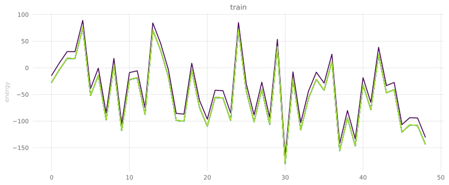
>
> <pre style="white-space:pre;overflow-x:auto;line-height:normal;font-family:Menlo,'DejaVu Sans Mono',consolas,'Courier New',monospace"><span style="color: #696969; text-decoration-color: #696969">           </span>Saving logprob to plots-4dSU3/train                                                                     
> </pre>
>
> 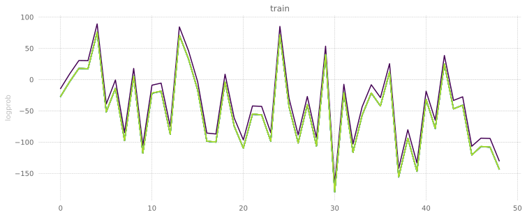
>
> <pre style="white-space:pre;overflow-x:auto;line-height:normal;font-family:Menlo,'DejaVu Sans Mono',consolas,'Courier New',monospace"><span style="color: #696969; text-decoration-color: #696969">           </span>Saving logdet to plots-4dSU3/train                                                                      
> </pre>
>
> 
>
> <pre style="white-space:pre;overflow-x:auto;line-height:normal;font-family:Menlo,'DejaVu Sans Mono',consolas,'Courier New',monospace"><span style="color: #696969; text-decoration-color: #696969">           </span>Saving sldf to plots-4dSU3/train                                                                        
> </pre>
>
> 
>
> <pre style="white-space:pre;overflow-x:auto;line-height:normal;font-family:Menlo,'DejaVu Sans Mono',consolas,'Courier New',monospace"><span style="color: #696969; text-decoration-color: #696969">[07:57:41] </span>Saving sldb to plots-4dSU3/train                                                                        
> </pre>
>
> 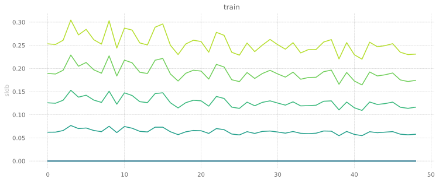
>
> <pre style="white-space:pre;overflow-x:auto;line-height:normal;font-family:Menlo,'DejaVu Sans Mono',consolas,'Courier New',monospace"><span style="color: #696969; text-decoration-color: #696969">           </span>Saving sld to plots-4dSU3/train                                                                         
> </pre>
>
> 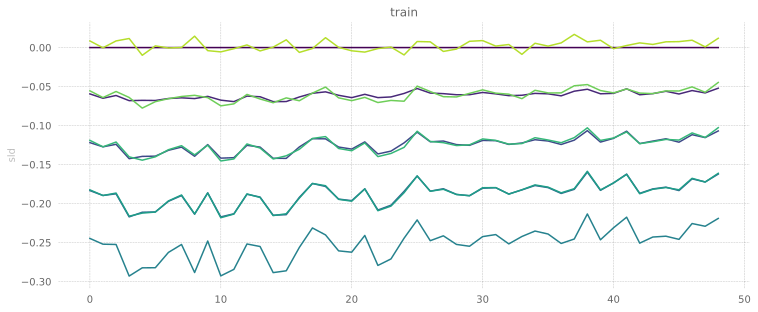
>
> <pre style="white-space:pre;overflow-x:auto;line-height:normal;font-family:Menlo,'DejaVu Sans Mono',consolas,'Courier New',monospace"><span style="color: #696969; text-decoration-color: #696969">           </span>Saving xeps to plots-4dSU3/train                                                                        
> </pre>
>
> 
>
> <pre style="white-space:pre;overflow-x:auto;line-height:normal;font-family:Menlo,'DejaVu Sans Mono',consolas,'Courier New',monospace"><span style="color: #696969; text-decoration-color: #696969">           </span>Saving veps to plots-4dSU3/train                                                                        
> </pre>
>
> 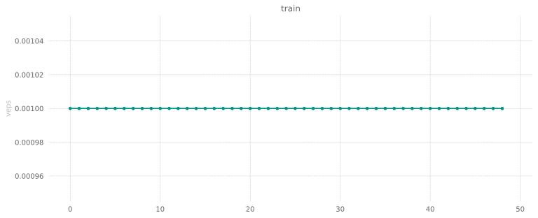
>
> <pre style="white-space:pre;overflow-x:auto;line-height:normal;font-family:Menlo,'DejaVu Sans Mono',consolas,'Courier New',monospace"><span style="color: #696969; text-decoration-color: #696969">[07:57:42] </span>Saving acc to plots-4dSU3/train                                                                         
> </pre>
>
> 
>
> <pre style="white-space:pre;overflow-x:auto;line-height:normal;font-family:Menlo,'DejaVu Sans Mono',consolas,'Courier New',monospace"><span style="color: #696969; text-decoration-color: #696969">           </span>Saving sumlogdet to plots-4dSU3/train                                                                   
> </pre>
>
> 
>
> <pre style="white-space:pre;overflow-x:auto;line-height:normal;font-family:Menlo,'DejaVu Sans Mono',consolas,'Courier New',monospace"><span style="color: #696969; text-decoration-color: #696969">           </span>Saving beta to plots-4dSU3/train                                                                        
> </pre>
>
> 
>
> <pre style="white-space:pre;overflow-x:auto;line-height:normal;font-family:Menlo,'DejaVu Sans Mono',consolas,'Courier New',monospace"><span style="color: #696969; text-decoration-color: #696969">           </span>Saving acc_mask to plots-4dSU3/train                                                                    
> </pre>
>
> 
>
> <pre style="white-space:pre;overflow-x:auto;line-height:normal;font-family:Menlo,'DejaVu Sans Mono',consolas,'Courier New',monospace"><span style="color: #696969; text-decoration-color: #696969">[07:57:43] </span>Saving loss to plots-4dSU3/train                                                                        
> </pre>
>
> 
>
> <pre style="white-space:pre;overflow-x:auto;line-height:normal;font-family:Menlo,'DejaVu Sans Mono',consolas,'Courier New',monospace"><span style="color: #696969; text-decoration-color: #696969">           </span>Saving plaqs to plots-4dSU3/train                                                                       
> </pre>
>
> 
>
> <pre style="white-space:pre;overflow-x:auto;line-height:normal;font-family:Menlo,'DejaVu Sans Mono',consolas,'Courier New',monospace"><span style="color: #696969; text-decoration-color: #696969">           </span>Saving sinQ to plots-4dSU3/train                                                                        
> </pre>
>
> 
>
> <pre style="white-space:pre;overflow-x:auto;line-height:normal;font-family:Menlo,'DejaVu Sans Mono',consolas,'Courier New',monospace"><span style="color: #696969; text-decoration-color: #696969">[07:57:44] </span>Saving intQ to plots-4dSU3/train                                                                        
> </pre>
>
> 
>
> <pre style="white-space:pre;overflow-x:auto;line-height:normal;font-family:Menlo,'DejaVu Sans Mono',consolas,'Courier New',monospace"><span style="color: #696969; text-decoration-color: #696969">           </span>Saving dQint to plots-4dSU3/train                                                                       
> </pre>
>
> 
>
> <pre style="white-space:pre;overflow-x:auto;line-height:normal;font-family:Menlo,'DejaVu Sans Mono',consolas,'Courier New',monospace"><span style="color: #696969; text-decoration-color: #696969">           </span>Saving dQsin to plots-4dSU3/train                                                                       
> </pre>
>
> 
>
> </div>

``` python
```
