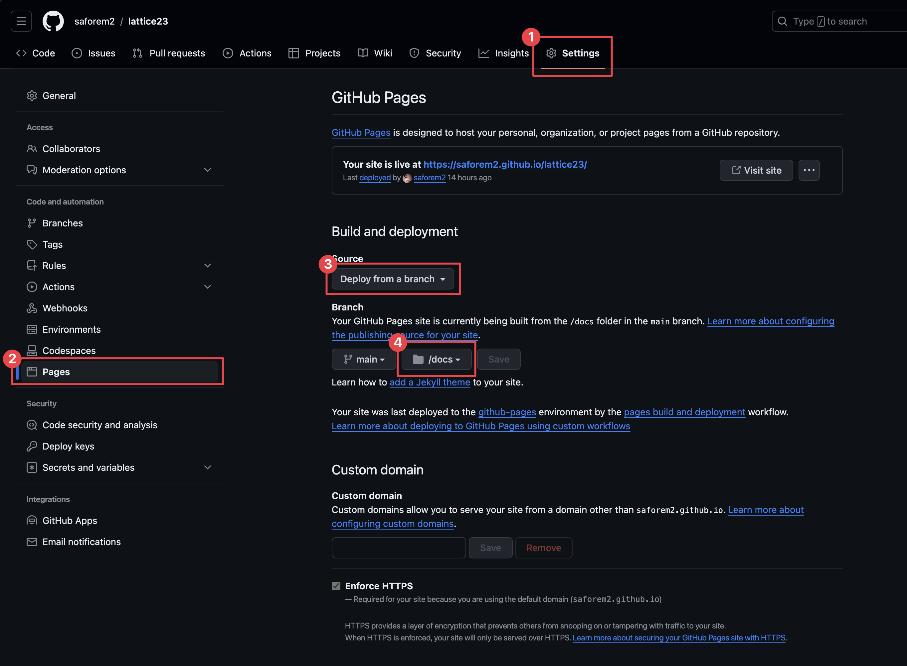

# 💅 How to Make Dope Slides
<span class="dim-text">Sam Foreman</span>
[<span class="orcid-green"></span>](https://orcid.org/0000-0002-9981-0876)
2024-07-18

- [Quarto 🤝 Reveal.js](#quarto--revealjs)
- [Getting Started](#getting-started)
  - [🎁 Install Extensions](#-install-extensions)
- [Metadata](#metadata)
- [Title Slide](#title-slide)
- [Single-Column Slides](#single-column-slides)
- [Centered Slides](#centered-slides)
- [Multi-Column Slides](#multi-column-slides)
- [💅 CSS](#-css)
- [📃 GitHub Page](#-github-page)
- [📓 References](#-references)

## Quarto 🤝 Reveal.js

So, after making a promise some time ago on [twitter
](https://twitter.com/saforem2/status/1689676452235759616?s=20)[^1], and
having many questions following my talk on [Parallel Training
Techniques](https://github.com/saforem2/parallel-training-slides:) last
week, I’m finally getting around to writing this up.

The slides are written using [Quarto](https://quarto.org/), a *flavor*
of Markdown, and uses the built-in [Quarto +
Reveal.js](https://quarto.org/docs/presentations/revealjs)
functionality.

For this post, I’ll focus on the slides I presented at last years
[Lattice
2023](https://indico.fnal.gov/event/57249/contributions/271305/), shown
below:

> [!TIP]
>
> ### 🪧 <span class="dim-text">[**MLMC: Machine Learning Monte Carlo**](https://saforem2.github.io/lattice23) @ [*Lattice 2023*](https://indico.fnal.gov/event/57249/contributions/271305/) \[07/2023\]</span>
>
> <iframe loading="lazy" allow="picture-in-picture" src="https://saforem2.github.io/lattice23/#/title-slide" title="🪧 MLMC: Machine Learning Monte Carlo" width="100%" align="center" height="500" frameborder="0" webkitallowfullscreen mozallowfullscreen allowfullscreen style="border-radius:0.25rem;border:none;align:center;">
> <p>
> Your browser does not support iframes.
> </p>
> </iframe>

> [!TIP]
>
> ### <span class="dim-text">🏃‍♂️ Follow Along…</span>
>
> Once you’ve [Installed Quarto](https://quarto.org/docs/download/), you
> can build these slides yourself by:
>
> 1.  `git clone`
>     [`saforem2/lattice23`](https://github.com/saforem2/lattice23)
> 2.  `cd lattice23 && quarto preview`
>
> This will create a `docs/` directory with the following structure:
>
> ``` bash
> 📂 docs/
> ├── 📂 assets/
> ├── 📂 css/
> ├── 📄 index.html
> ├── 📄 lattice23.md
> ├── 📄 search.json
> └── 📂 site_libs/
> ```
>
> Once you’ve created this, and the `docs/index.html` file looks how you
> want, you can add the `docs/` directory to your GitHub repo:
>
> ``` bash
> $ git add docs
> $ git commit -m 'Create site'
> $ git push
> ```
>
> Once you’ve [enabled the GitHub page](#github-page), the site will be
> automatically built and updated alongside the repo.

## Getting Started

Whenever I give a talk, my workflow is typically:

1.  Create new GitHub repo for it

2.  Hunt down the GitHub repo from my *last* talk and[^2]:

    ``` bash
    $ cp -r old_talk/{_quarto.yml,index.qmd,references.bib,css/*} new_talk/
    ```

Honestly, other than that, 90% of the work is done automatically by
[Quarto](https://quarto.org/). The remaining 10% consists of figuring
out why my css is broken (see [CSS](#css)).

The best place to start for learning to make slides with Quarto and
Reveal.js is the official documentation:

1.  [Quarto / Presentations /
    Revealjs](https://quarto.org/docs/presentations/revealjs/):
    1.  [Reveal Basics](https://quarto.org/docs/presentations/revealjs/)
    2.  [Presenting
        Slides](https://quarto.org/docs/presentations/revealjs/presenting.html)
    3.  [Advanced
        Reveal](https://quarto.org/docs/presentations/revealjs/advanced.html)
    4.  [Reveal
        Themes](https://quarto.org/docs/presentations/revealjs/themes.html)

- The slides are written in ~~markdown~~ [Quarto
  (`.qmd`)](https://quarto.org/)[^3], a
  [pandoc](https://pandoc.org/)-compliant based markup language.

- For a single slide deck, the content will be placed in `index.qmd` and
  our directory structure will look something like:

  <div class="tight-code">

  ``` bash
  📂 lattice23/
  ├── 📂 assets/            # for images, etc.
  │   └── 🖼️ thumbnail.png  # can be used as social preview image
  ├── 📂 css/
  │   ├── 📄 callouts.css
  │   ├── 📄 dark.scss
  │   └── 📄 default.css
  ├── 🛠️ _quarto.yml        # Configuration goes here
  ├── 📄 index.qmd          # Quarto document containing slides content
  └── 📜 references.bib     # BibTex references
  ```

  </div>

- Equations are rendered using `$` delimiters for inline math and `$$`
  for display math[^4].

- We can use [Divs and
  Spans](https://pandoc.org/chunkedhtml-demo/8.18-divs-and-spans.html)
  from Pandoc.

  - **`<span>`**’s: are created by wrapping text in square brackets, and
    will be treated as a `<span>` with attributes if it is followed
    immediately by attributes, e.g.:

    - Example: `[This is *some text*]{.class key="val"}`

    - idk what I’m doing really, so I mostly find myself doing things
      like `[blue   text]{style="color:#1E88E5;"}` which produces
      <span style="color:#1E88E5;">blue text</span>.

  - **`<div>`**’s: are created by wrapping text with a line consisting
    of at least three colons `:::`.

    - Example:

      ``` markdown
      ::: {#special .sidebar}
      Here is a paragraph.

      And another.
      :::
      ```

    - We can use either attributes in curly braces or a single unbraced
      word, which will be treated as a class name.

### 🎁 Install Extensions

Find the full list of available extensions at [Quarto
Extensions](https://quarto.org/docs/extensions/)

To install various icon sets used in the example slides, we can install
the following extensions:

``` bash
$ quarto install extension mcanouil/quarto-iconify      # https://icones.js.org/ [<-- Contains rest of icon sets ??]
$ quarto install extension shafayetShafee/bsicons       # bootstrap icons
$ quarto install extension schochastics/academicicons   # OrcID, Google Scholar, ...
$ quarto install extension quarto-ext/fontawesome       # Font Awesome icons
```

note that these aren’t necessary for functionality, but provide
additional icons that I like to use 🤷🏻‍♂️

## Metadata

The first section of our
[`index.qmd`](https://github.com/saforem2/lattice23/blob/main/index.qmd)
contains the YAML metadata for the Quarto document.

Explicitly, we see this consists of:

<details closed>
<summary>
Expand for <code>yaml</code>
</summary>

``` yaml
---
format:
  revealjs:
    title-block-style: none
    slide-number: c
    title-slide-style: default
    chalkboard:
      buttons: false
    auto-animate: true
    reference-location: section
    touch: true
    pause: false
    footnotes-hover: true
    citations-hover: true
    preview-links: true
    controls-tutorial: true
    controls: false
    logo: "https://raw.githubusercontent.com/saforem2/anl-job-talk/main/docs/assets/anl.svg"
    history: false
    theme: [dark, css/dark.scss]
    css: [css/default.css, css/callouts.css]
    self-contained: false
    embed-resources: false
    self-contained-math: false
    center: true
    highlight-style: "atom-one"
    default-image-extension: svg
    code-line-numbers: true
    code-overflow: scroll
    html-math-method: katex
    fig-align: center
    mermaid:
      theme: dark
  gfm:
    output-file: "lattice23.md"
---
```

</details>

The complete list of Reveal.js options are listed, with descriptions at:
[Quarto – Revealjs
Options](https://quarto.org/docs/reference/formats/presentations/revealjs.html)

## Title Slide

- Starting with the title slide[^5]:

  <div id="fig-title">

  


  Figure 1: [Title
  Slide](https://saforem2.github.io/lattice23/#/section)

  </div>

  - The full slide contents are included below:

    <details closed>
    <summary>

    Expand for <code>quarto</code>

    </summary>

    ``` markdown
    # {.title-slide .centeredslide background-iframe="https://saforem2.github.io/grid-worms-animation/" loading="lazy"}

    ::: {style="background-color: rgba(22,22,22,0.75); border-radius: 10px; text-align:center; padding: 0px; padding-left: 1.5em; padding-right: 1.5em; max-width: min-content; min-width: max-content; margin-left: auto; margin-right: auto; padding-top: 0.2em; padding-bottom: 0.2em; line-height: 1.5em!important;"}

    [MLMC: Machine Learning Monte Carlo]{.style="color:#939393; font-size:1.5em; font-weight:bold;}  
    [for Lattice Gauge Theory]{style="color:#777777; font-size:1.2em; font-weight: bold;"}
    [<br>&nbsp;]{style="padding-bottom: 0.5rem;"}  
    [](https://samforeman.me) Sam Foreman  
    [Xiao-Yong Jin, James C. Osborn]{.dim-text style="font-size:0.8em;"}  
    [[[ `saforem2/`](https://github.com/saforem2/)]{style="border-bottom: 0.5px solid #00ccff;"}`{`[[`lattice23`](https://github.com/saforem2/lattice23)]{style="border-bottom: 0.5px solid #00ccff;"}, [[`l2hmc-qcd`](https://github.com/saforem2/l2hmc-qcd)]{style="border-bottom: 0.5px solid #00ccff;"}`}`]{style="font-size:0.8em;"}

    :::

    ::: footer
    [2023-07-31 @ [Lattice 2023](https://indico.fnal.gov/event/57249/contributions/271305/)]{.dim-text style="text-align:left;'}
    :::
    ```

    </details>

  - For the background, I made a simple animation
    [`saforem2/grid-worms-animation`](https://github.com/saforem2/grid-worms-animation)
    that is hosted on GitHub pages as a simple html website

  - This static GitHub page is then used as an [IFrame
    Background](https://quarto.org/docs/presentations/revealjs/#iframe-backgrounds)
    natively in Quarto with Reveal.js

  - This is as simple as:

    ``` markdown
    # {.title-slide .centeredslide background-iframe="https://saforem2.github.io/grid-worms-animation/" loading="lazy"}
    ```

## Single-Column Slides

Other than the title slide, the remainder of the slides are all
relatively straightforward to construct.

For single-column slides, constructing the content is as simple as
writing it in Markdown:

<!-- :::: {layout="[ [50, 50] ]" layout-valign="start" style="display: flex; flex-direction: row; margin-top: -0.0em; align-items: start; overflow: scroll;"} -->
<!-- :::: {.columns} -->

<div class="panel-tabset">

## Code

``` markdown
# Overview

1. [Background: `{MCMC,HMC}`](#markov-chain-monte-carlo-mcmc)
    - [Leapfrog Integrator](#leapfrog-integrator-hmc)
    - [Issues with HMC](#sec-issues-with-hmc)
    - [Can we do better?](#sec-can-we-do-better)

2. [L2HMC: Generalizing MD](#sec-l2hmc)
    - [4D $SU(3)$ Model](#sec-su3)
    - [Results](#sec-results)
3. [References](#sec-references)
4. [Extras](#sec-extras)
```

## Slide

<div style="text-align:center;">

<div id="fig-overview">


Figure 2: [Overview
Slide](https://saforem2.github.io/lattice23/#/overview)

</div>

</div>

</div>

## Centered Slides

We can center all the text on a slide by adding the `{.centeredslide}`
class to the slide header, e.g.

<div class="panel-tabset">

## `index.qmd`

``` markdown
---
format:
  revealjs:
    theme: [style.scss]
---

# Title {.centeredslide}
```

## `style.scss`

``` scss
.centeredslide {
  text-align: center;
}
```

</div>

## Multi-Column Slides

Side-by-side content (either text or images)

<div>

</div>

- Note that we additionally have a `::: footer` element included at the
  bottom of the slide.

- The code used to generate the slide above is included below:

  <details closed>
  <summary>

  Expand for<code>quarto</code>

  </summary>

  ``` markdown
  # Markov Chain Monte Carlo (MCMC) {.centeredslide}

  :::: {.columns}

  ::: {.column width="50%"}

  ::: {.callout-note title="Goal" style="text-align:left;!important"}
  Generate **independent** samples $\{x_{i}\}$, such that[^notation]
  $$\{x_{i}\} \sim p(x) \propto e^{-S(x)}$$
  where $S(x)$ is the _action_ (or potential energy)
  :::

  - Want to calculate observables $\mathcal{O}$:  
    $\left\langle \mathcal{O}\right\rangle \propto \int \left[\mathcal{D}x\right]\hspace{4pt} {\mathcal{O}(x)\, p(x)}$

  :::

  ::: {.column width="49%"}
  
  :::

  ::::

  If these were [independent]{.style="color:#00CCFF;"}, we could approximate:
  $\left\langle\mathcal{O}\right\rangle \simeq \frac{1}{N}\sum^{N}_{n=1}\mathcal{O}(x_{n})$
  $$\sigma_{\mathcal{O}}^{2} = \frac{1}{N}\mathrm{Var}{\left[\mathcal{O} (x) \right]}\Longrightarrow
  \sigma_{\mathcal{O}} \propto \frac{1}{\sqrt{N}}$$

  [^notation]: Here, $\sim$ means "is distributed according to"

  ::: footer
  [ `saforem2/lattice23`](https://saforem2.github.io/lattice23)
  :::
  ```

  </details>

## 💅 CSS

My web developer friend laughs at me, but when something is broken /
doesn’t look right / I want it to look different, I:

1.  Pull up Chrome Tools ( ⌘ + ⌥ + I )
2.  Inspect element of interest ( ⌘ + ⇧ + C )
3.  Make changes to the CSS
4.  Save the new rule to my `.scss` file 🤷🏻‍♂️

I’m guessing this might be obvious to some people, but it took me a
while to figure out how things worked so maybe its helpful for others.

<details closed>
<summary>
Expand for <code>css</code>
</summary>
<div id="fig-css">


Figure 4: Example of selecting an element and making a change to the
CSS.

</div>
</details>

## 📃 GitHub Page

To enable your GitHub page, you can do the following:

<div id="fig-github-page">




Figure 5: Instructions for building a GitHub page using the `docs/`
directory off the `main` branch.

</div>

In this case, the repo is:

[`saforem2/lattice23`](https://github.com/saforem2/lattice23)

and the site is published at

<https://saforem2.github.io/lattice23>

## 📓 References

- [Reveal
  Themes](https://quarto.org/docs/presentations/revealjs/themes.html)
- Using [Pandoc fenced
  divs](https://thomasmock.quarto.pub/reports-presentations/#/pandoc-fenced-divs)
- [Slidecraft 101: Colors and
  Fonts](https://www.emilhvitfeldt.com/post/slidecraft-colors-fonts/)
- [Beautiful Reports and Presentations with
  Quarto](https://thomasmock.quarto.pub/reports-presentations/#/title-slide)
- [ Quarto Clean
  Theme](https://github.com/grantmcdermott/quarto-revealjs-clean)

> [!TIP]
>
> ### <span style="color: #FF5252;">❤️‍🩹 Status</span>
>
> <pre style="white-space:pre;overflow-x:auto;line-height:normal;font-family:Menlo,'DejaVu Sans Mono',consolas,'Courier New',monospace"><span style="color: #7f7f7f; text-decoration-color: #7f7f7f; font-style: italic">Last Updated</span>: <span style="color: #f06292; text-decoration-color: #f06292; font-weight: bold">07</span><span style="color: #f06292; text-decoration-color: #f06292">/</span><span style="color: #f06292; text-decoration-color: #f06292; font-weight: bold">18</span><span style="color: #f06292; text-decoration-color: #f06292">/</span><span style="color: #f06292; text-decoration-color: #f06292; font-weight: bold">2024</span> <span style="color: #7f7f7f; text-decoration-color: #7f7f7f">@</span> <span style="color: #1a8fff; text-decoration-color: #1a8fff; font-weight: bold">11:40:02</span>
> </pre>
> <p align="center">
> <a href="https://hits.seeyoufarm.com"></a>
> </p>

[^1]: And countless other people IRL

[^2]: One thing I’ve been meaning to do, is clean up all my `css/*`
    files and move them all to a single repository, but I’ll save that
    for another day.

[^3]: *An open-source scientific and technical publishing system*

[^4]: [Equations](https://quarto.org/docs/authoring/markdown-basics.html#equations)

[^5]: Quarto comes with lightbox support, so you can click on images to
    display them full screen.
