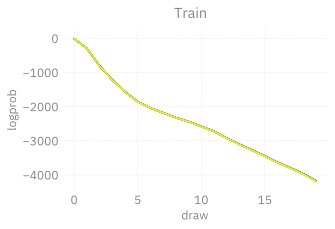
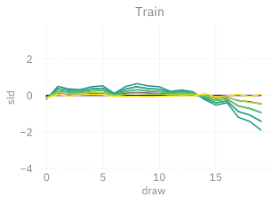

# 🔳 `l2hmc-qcd` Example: 4D SU(3)
Sam Foreman
2025-07-24

- [Load config + build Experiment](#load-config--build-experiment)
- [HMC](#hmc)
- [Training](#training)
- [Evaluation](#evaluation)

``` python
# %matplotlib inline
import matplotlib_inline
matplotlib_inline.backend_inline.set_matplotlib_formats('svg')
import os
os.environ['COLORTERM'] = 'truecolor'
import lovely_tensors as lt
lt.monkey_patch()
lt.set_config(color=False)
# automatically detect and reload local changes to modules
%load_ext autoreload
%autoreload 2
import ezpz
import numpy as np
import matplotlib.pyplot as plt
from l2hmc.utils.plot_helpers import FigAxes
import ambivalent
plt.style.use(ambivalent.STYLES['ambivalent'])
#set_plot_style()
```

<pre style="white-space:pre;overflow-x:auto;line-height:normal;font-family:Menlo,'DejaVu Sans Mono',consolas,'Courier New',monospace">Using device: cpu
</pre>

``` python
import ezpz
from pathlib import Path
from typing import Optional
from rich import print

import lovely_tensors as lt
import matplotlib.pyplot as plt
import numpy as np
import torch
import yaml

# from l2hmc.utils.dist import setup_torch
seed = np.random.randint(2 ** 32)
print(f"seed: {seed}")

_ = ezpz.setup_torch(seed=seed)
torch.set_default_dtype(torch.float64)
# _ = setup_torch(precision='float64', backend='DDP', seed=seed, port='1234')

logger = ezpz.get_logger()

import l2hmc.group.su3.pytorch.group as g
# from l2hmc.utils.rich import get_console
from l2hmc.common import grab_tensor, print_dict
from l2hmc.configs import dict_to_list_of_overrides, get_experiment
from l2hmc.experiment.pytorch.experiment import Experiment, evaluate  # noqa
```

<pre style="white-space:pre;overflow-x:auto;line-height:normal;font-family:Menlo,'DejaVu Sans Mono',consolas,'Courier New',monospace">seed: <span style="color: #008080; text-decoration-color: #008080; font-weight: bold">979520535</span>
</pre>

    Manually specifying seed=979520535
    Using [1 / 1] available "mps" devices !!

    [2025-12-31 11:21:26,289] [INFO] [real_accelerator.py:239:get_accelerator] Setting ds_accelerator to mps (auto detect)

    [rank0]:W1231 11:21:26.555000 12897 torch/distributed/elastic/multiprocessing/redirects.py:29] NOTE: Redirects are currently not supported in Windows or MacOs.

``` python
from l2hmc.utils.plot_helpers import (  # noqa
    plot_scalar,
    plot_chains,
    plot_leapfrogs
)

def savefig(fig: plt.Figure, fname: str, outdir: os.PathLike):
    pngfile = Path(outdir).joinpath(f"pngs/{fname}.png")
    svgfile = Path(outdir).joinpath(f"svgs/{fname}.svg")
    pngfile.parent.mkdir(exist_ok=True, parents=True)
    svgfile.parent.mkdir(exist_ok=True, parents=True)
    fig.savefig(svgfile, transparent=True, bbox_inches='tight')
    fig.savefig(pngfile, transparent=True, bbox_inches='tight', dpi=300)

def plot_metrics(metrics: dict, title: Optional[str] = None, **kwargs):
    outdir = Path(f"./plots-4dSU3/{title}")
    outdir.mkdir(exist_ok=True, parents=True)
    for key, val in metrics.items():
        fig, ax = plot_metric(val, name=key, **kwargs)
        if title is not None:
            ax.set_title(title)
        console.log(f"Saving {key} to {outdir}")
        savefig(fig, f"{key}", outdir=outdir)
        plt.show()

def plot_metric(
        metric: torch.Tensor,
        name: Optional[str] = None,
        **kwargs,
):
    assert len(metric) > 0
    if isinstance(metric[0], (int, float, bool, np.floating)):
        y = np.stack(metric)
        return plot_scalar(y, ylabel=name, **kwargs)
    element_shape = metric[0].shape
    if len(element_shape) == 2:
        y = grab_tensor(torch.stack(metric))
        return plot_leapfrogs(y, ylabel=name)
    if len(element_shape) == 1:
        y = grab_tensor(torch.stack(metric))
        return plot_chains(y, ylabel=name, **kwargs)
    if len(element_shape) == 0:
        y = grab_tensor(torch.stack(metric))
        return plot_scalar(y, ylabel=name, **kwargs)
    raise ValueError
```

## Load config + build Experiment

``` python
from rich import print

from l2hmc.configs import CONF_DIR
su3conf = Path(f"{CONF_DIR}/su3test.yaml")
with su3conf.open('r') as stream:
    conf = dict(yaml.safe_load(stream))
```

``` python
import json
from rich import print_json
print_json(json.dumps(conf, indent=4, sort_keys=True))
overrides = dict_to_list_of_overrides(conf)
```

<pre style="white-space:pre;overflow-x:auto;line-height:normal;font-family:Menlo,'DejaVu Sans Mono',consolas,'Courier New',monospace"><span style="font-weight: bold">{</span>
  <span style="color: #000080; text-decoration-color: #000080; font-weight: bold">"annealing_schedule"</span>: <span style="font-weight: bold">{</span>
    <span style="color: #000080; text-decoration-color: #000080; font-weight: bold">"beta_final"</span>: <span style="color: #008080; text-decoration-color: #008080; font-weight: bold">6.0</span>,
    <span style="color: #000080; text-decoration-color: #000080; font-weight: bold">"beta_init"</span>: <span style="color: #008080; text-decoration-color: #008080; font-weight: bold">6.0</span>
  <span style="font-weight: bold">}</span>,
  <span style="color: #000080; text-decoration-color: #000080; font-weight: bold">"backend"</span>: <span style="color: #008000; text-decoration-color: #008000">"DDP"</span>,
  <span style="color: #000080; text-decoration-color: #000080; font-weight: bold">"conv"</span>: <span style="color: #008000; text-decoration-color: #008000">"none"</span>,
  <span style="color: #000080; text-decoration-color: #000080; font-weight: bold">"dynamics"</span>: <span style="font-weight: bold">{</span>
    <span style="color: #000080; text-decoration-color: #000080; font-weight: bold">"eps"</span>: <span style="color: #008080; text-decoration-color: #008080; font-weight: bold">0.01</span>,
    <span style="color: #000080; text-decoration-color: #000080; font-weight: bold">"eps_fixed"</span>: <span style="color: #ff0000; text-decoration-color: #ff0000; font-style: italic">false</span>,
    <span style="color: #000080; text-decoration-color: #000080; font-weight: bold">"group"</span>: <span style="color: #008000; text-decoration-color: #008000">"SU3"</span>,
    <span style="color: #000080; text-decoration-color: #000080; font-weight: bold">"latvolume"</span>: <span style="font-weight: bold">[</span>
      <span style="color: #008080; text-decoration-color: #008080; font-weight: bold">4</span>,
      <span style="color: #008080; text-decoration-color: #008080; font-weight: bold">4</span>,
      <span style="color: #008080; text-decoration-color: #008080; font-weight: bold">4</span>,
      <span style="color: #008080; text-decoration-color: #008080; font-weight: bold">4</span>
    <span style="font-weight: bold">]</span>,
    <span style="color: #000080; text-decoration-color: #000080; font-weight: bold">"merge_directions"</span>: <span style="color: #00ff00; text-decoration-color: #00ff00; font-style: italic">true</span>,
    <span style="color: #000080; text-decoration-color: #000080; font-weight: bold">"nchains"</span>: <span style="color: #008080; text-decoration-color: #008080; font-weight: bold">8</span>,
    <span style="color: #000080; text-decoration-color: #000080; font-weight: bold">"nleapfrog"</span>: <span style="color: #008080; text-decoration-color: #008080; font-weight: bold">4</span>,
    <span style="color: #000080; text-decoration-color: #000080; font-weight: bold">"use_separate_networks"</span>: <span style="color: #ff0000; text-decoration-color: #ff0000; font-style: italic">false</span>,
    <span style="color: #000080; text-decoration-color: #000080; font-weight: bold">"use_split_xnets"</span>: <span style="color: #ff0000; text-decoration-color: #ff0000; font-style: italic">false</span>,
    <span style="color: #000080; text-decoration-color: #000080; font-weight: bold">"verbose"</span>: <span style="color: #00ff00; text-decoration-color: #00ff00; font-style: italic">true</span>
  <span style="font-weight: bold">}</span>,
  <span style="color: #000080; text-decoration-color: #000080; font-weight: bold">"framework"</span>: <span style="color: #008000; text-decoration-color: #008000">"pytorch"</span>,
  <span style="color: #000080; text-decoration-color: #000080; font-weight: bold">"init_aim"</span>: <span style="color: #ff0000; text-decoration-color: #ff0000; font-style: italic">false</span>,
  <span style="color: #000080; text-decoration-color: #000080; font-weight: bold">"init_wandb"</span>: <span style="color: #ff0000; text-decoration-color: #ff0000; font-style: italic">false</span>,
  <span style="color: #000080; text-decoration-color: #000080; font-weight: bold">"learning_rate"</span>: <span style="font-weight: bold">{</span>
    <span style="color: #000080; text-decoration-color: #000080; font-weight: bold">"clip_norm"</span>: <span style="color: #008080; text-decoration-color: #008080; font-weight: bold">1.0</span>,
    <span style="color: #000080; text-decoration-color: #000080; font-weight: bold">"lr_init"</span>: <span style="color: #008000; text-decoration-color: #008000">"1e-04"</span>
  <span style="font-weight: bold">}</span>,
  <span style="color: #000080; text-decoration-color: #000080; font-weight: bold">"loss"</span>: <span style="font-weight: bold">{</span>
    <span style="color: #000080; text-decoration-color: #000080; font-weight: bold">"aux_weight"</span>: <span style="color: #008080; text-decoration-color: #008080; font-weight: bold">0.0</span>,
    <span style="color: #000080; text-decoration-color: #000080; font-weight: bold">"charge_weight"</span>: <span style="color: #008080; text-decoration-color: #008080; font-weight: bold">0.0</span>,
    <span style="color: #000080; text-decoration-color: #000080; font-weight: bold">"plaq_weight"</span>: <span style="color: #008080; text-decoration-color: #008080; font-weight: bold">0.1</span>,
    <span style="color: #000080; text-decoration-color: #000080; font-weight: bold">"rmse_weight"</span>: <span style="color: #008080; text-decoration-color: #008080; font-weight: bold">0.1</span>,
    <span style="color: #000080; text-decoration-color: #000080; font-weight: bold">"use_mixed_loss"</span>: <span style="color: #00ff00; text-decoration-color: #00ff00; font-style: italic">true</span>
  <span style="font-weight: bold">}</span>,
  <span style="color: #000080; text-decoration-color: #000080; font-weight: bold">"net_weights"</span>: <span style="font-weight: bold">{</span>
    <span style="color: #000080; text-decoration-color: #000080; font-weight: bold">"v"</span>: <span style="font-weight: bold">{</span>
      <span style="color: #000080; text-decoration-color: #000080; font-weight: bold">"q"</span>: <span style="color: #008080; text-decoration-color: #008080; font-weight: bold">1.0</span>,
      <span style="color: #000080; text-decoration-color: #000080; font-weight: bold">"s"</span>: <span style="color: #008080; text-decoration-color: #008080; font-weight: bold">1.0</span>,
      <span style="color: #000080; text-decoration-color: #000080; font-weight: bold">"t"</span>: <span style="color: #008080; text-decoration-color: #008080; font-weight: bold">1.0</span>
    <span style="font-weight: bold">}</span>,
    <span style="color: #000080; text-decoration-color: #000080; font-weight: bold">"x"</span>: <span style="font-weight: bold">{</span>
      <span style="color: #000080; text-decoration-color: #000080; font-weight: bold">"q"</span>: <span style="color: #008080; text-decoration-color: #008080; font-weight: bold">1.0</span>,
      <span style="color: #000080; text-decoration-color: #000080; font-weight: bold">"s"</span>: <span style="color: #008080; text-decoration-color: #008080; font-weight: bold">0.0</span>,
      <span style="color: #000080; text-decoration-color: #000080; font-weight: bold">"t"</span>: <span style="color: #008080; text-decoration-color: #008080; font-weight: bold">1.0</span>
    <span style="font-weight: bold">}</span>
  <span style="font-weight: bold">}</span>,
  <span style="color: #000080; text-decoration-color: #000080; font-weight: bold">"network"</span>: <span style="font-weight: bold">{</span>
    <span style="color: #000080; text-decoration-color: #000080; font-weight: bold">"activation_fn"</span>: <span style="color: #008000; text-decoration-color: #008000">"tanh"</span>,
    <span style="color: #000080; text-decoration-color: #000080; font-weight: bold">"dropout_prob"</span>: <span style="color: #008080; text-decoration-color: #008080; font-weight: bold">0.0</span>,
    <span style="color: #000080; text-decoration-color: #000080; font-weight: bold">"units"</span>: <span style="font-weight: bold">[</span>
      <span style="color: #008080; text-decoration-color: #008080; font-weight: bold">256</span>
    <span style="font-weight: bold">]</span>,
    <span style="color: #000080; text-decoration-color: #000080; font-weight: bold">"use_batch_norm"</span>: <span style="color: #ff0000; text-decoration-color: #ff0000; font-style: italic">false</span>
  <span style="font-weight: bold">}</span>,
  <span style="color: #000080; text-decoration-color: #000080; font-weight: bold">"restore"</span>: <span style="color: #ff0000; text-decoration-color: #ff0000; font-style: italic">false</span>,
  <span style="color: #000080; text-decoration-color: #000080; font-weight: bold">"save"</span>: <span style="color: #ff0000; text-decoration-color: #ff0000; font-style: italic">false</span>,
  <span style="color: #000080; text-decoration-color: #000080; font-weight: bold">"steps"</span>: <span style="font-weight: bold">{</span>
    <span style="color: #000080; text-decoration-color: #000080; font-weight: bold">"log"</span>: <span style="color: #008080; text-decoration-color: #008080; font-weight: bold">1</span>,
    <span style="color: #000080; text-decoration-color: #000080; font-weight: bold">"nepoch"</span>: <span style="color: #008080; text-decoration-color: #008080; font-weight: bold">10</span>,
    <span style="color: #000080; text-decoration-color: #000080; font-weight: bold">"nera"</span>: <span style="color: #008080; text-decoration-color: #008080; font-weight: bold">1</span>,
    <span style="color: #000080; text-decoration-color: #000080; font-weight: bold">"print"</span>: <span style="color: #008080; text-decoration-color: #008080; font-weight: bold">1</span>,
    <span style="color: #000080; text-decoration-color: #000080; font-weight: bold">"test"</span>: <span style="color: #008080; text-decoration-color: #008080; font-weight: bold">50</span>
  <span style="font-weight: bold">}</span>,
  <span style="color: #000080; text-decoration-color: #000080; font-weight: bold">"use_tb"</span>: <span style="color: #ff0000; text-decoration-color: #ff0000; font-style: italic">false</span>,
  <span style="color: #000080; text-decoration-color: #000080; font-weight: bold">"use_wandb"</span>: <span style="color: #ff0000; text-decoration-color: #ff0000; font-style: italic">false</span>
<span style="font-weight: bold">}</span>
</pre>

``` python
ptExpSU3 = get_experiment(overrides=[*overrides], build_networks=True)

# console.print(ptExpSU3.config)
state = ptExpSU3.trainer.dynamics.random_state(6.0)
logger.info(f"checkSU(state.x): {g.checkSU(state.x)}")
logger.info(f"checkSU(state.x): {g.checkSU(g.projectSU(state.x))}")
assert isinstance(state.x, torch.Tensor)
assert isinstance(state.beta, torch.Tensor)
assert isinstance(ptExpSU3, Experiment)
```

    [2025-12-31 11:21:31,796887][I][utils/dist:229:setup_torch_DDP] Caught MASTER_PORT:54505 from environment!
    [2025-12-31 11:21:31,830180][I][utils/dist:229:setup_torch_DDP] Caught MASTER_PORT:54505 from environment!
    [2025-12-31 11:21:31,831212][W][pytorch/trainer:470:warning] Using torch.float32 on cpu!
    [2025-12-31 11:21:32,041943][W][pytorch/trainer:470:warning] Using `torch.optim.Adam` optimizer
    [2025-12-31 11:21:32,043077][I][pytorch/trainer:308:count_parameters] num_params in model: 27880456
    [2025-12-31 11:21:32,109548][W][pytorch/trainer:274:__init__] logging with freq 1 for wandb.watch
    [2025-12-31 11:21:32,123708][I][ipykernel_12897/1455121896:5:<module>] checkSU(state.x): (tensor[8] f64 x∈[1.555e-14, 1.280e-13] μ=5.128e-14 σ=4.647e-14 [1.555e-14, 2.123e-14, 1.571e-14, 4.069e-14, 1.280e-13, 1.997e-14, 4.937e-14, 1.197e-13], tensor[8] f64 x∈[3.730e-13, 4.090e-12] μ=1.462e-12 σ=1.414e-12 [3.730e-13, 5.266e-13, 4.105e-13, 1.261e-12, 4.090e-12, 4.025e-13, 1.513e-12, 3.120e-12])
    [2025-12-31 11:21:32,131367][I][ipykernel_12897/1455121896:6:<module>] checkSU(state.x): (tensor[8] f64 x∈[2.760e-16, 2.865e-16] μ=2.803e-16 σ=3.214e-18 [2.760e-16, 2.804e-16, 2.812e-16, 2.865e-16, 2.797e-16, 2.783e-16, 2.781e-16, 2.825e-16], tensor[8] f64 x∈[8.924e-16, 9.900e-16] μ=9.342e-16 σ=3.144e-17 [9.298e-16, 9.900e-16, 9.658e-16, 9.112e-16, 8.924e-16, 9.120e-16, 9.338e-16, 9.386e-16])

``` python
# from l2hmc.utils.plot_helpers import set_plot_style
# set_plot_style()

from l2hmc.common import get_timestamp
TSTAMP = get_timestamp()
OUTPUT_DIR = Path(f"./outputs/pt4dSU3/{TSTAMP}")
HMC_DIR = OUTPUT_DIR.joinpath('hmc')
EVAL_DIR = OUTPUT_DIR.joinpath('eval')
TRAIN_DIR = OUTPUT_DIR.joinpath('train')
HMC_DIR.mkdir(exist_ok=True, parents=True)
EVAL_DIR.mkdir(exist_ok=True, parents=True)
TRAIN_DIR.mkdir(exist_ok=True, parents=True)
```

``` python
ptExpSU3.trainer.print_grads_and_weights()
logger.info(ptExpSU3.config)
#console.print(ptExpSU3.config)
```

    [2025-12-31 11:21:32,255438][I][pytorch/trainer:2003:print_grads_and_weights] --------------------------------------------------------------------------------
    [2025-12-31 11:21:32,256420][I][pytorch/trainer:2004:print_grads_and_weights] GRADS:
    [2025-12-31 11:21:32,257261][I][l2hmc/common:97:print_dict] networks.xnet.input_layer.xlayer.weight: None None 
    None
    networks.xnet.input_layer.xlayer.bias: None None 
    None
    networks.xnet.input_layer.vlayer.weight: None None 
    None
    networks.xnet.input_layer.vlayer.bias: None None 
    None
    networks.xnet.scale.coeff: None None 
    None
    networks.xnet.scale.layer.weight: None None 
    None
    networks.xnet.scale.layer.bias: None None 
    None
    networks.xnet.transf.coeff: None None 
    None
    networks.xnet.transf.layer.weight: None None 
    None
    networks.xnet.transf.layer.bias: None None 
    None
    networks.xnet.transl.weight: None None 
    None
    networks.xnet.transl.bias: None None 
    None
    networks.vnet.input_layer.xlayer.weight: None None 
    None
    networks.vnet.input_layer.xlayer.bias: None None 
    None
    networks.vnet.input_layer.vlayer.weight: None None 
    None
    networks.vnet.input_layer.vlayer.bias: None None 
    None
    networks.vnet.scale.coeff: None None 
    None
    networks.vnet.scale.layer.weight: None None 
    None
    networks.vnet.scale.layer.bias: None None 
    None
    networks.vnet.transf.coeff: None None 
    None
    networks.vnet.transf.layer.weight: None None 
    None
    networks.vnet.transf.layer.bias: None None 
    None
    networks.vnet.transl.weight: None None 
    None
    networks.vnet.transl.bias: None None 
    None
    xeps.0: None None 
    None
    xeps.1: None None 
    None
    xeps.2: None None 
    None
    xeps.3: None None 
    None
    veps.0: None None 
    None
    veps.1: None None 
    None
    veps.2: None None 
    None
    veps.3: None None 
    None
    [2025-12-31 11:21:32,260291][I][pytorch/trainer:2006:print_grads_and_weights] --------------------------------------------------------------------------------
    [2025-12-31 11:21:32,260825][I][pytorch/trainer:2007:print_grads_and_weights] WEIGHTS:
    [2025-12-31 11:21:32,266638][I][l2hmc/common:97:print_dict] networks.xnet.input_layer.xlayer.weight: torch.Size([256, 18432]) torch.float64 
    [[ 5.34675944e-03  4.83692293e-03 -1.95424055e-03 ... -3.19398849e-03
      -5.18456944e-03 -4.53952094e-03]
     [-2.11885804e-03 -1.92370769e-03  2.95698048e-03 ... -5.08499583e-03
       5.75697440e-05  3.26761240e-03]
     [-6.75815378e-03  6.55236560e-03 -4.85125066e-03 ... -1.52208833e-03
      -7.36647905e-04 -2.70920219e-03]
     ...
     [ 3.86352724e-03 -5.44473292e-03  1.40281815e-03 ...  1.66045988e-03
      -4.66015396e-03  4.81116461e-03]
     [-2.21214706e-03  2.17645985e-03  5.16413433e-03 ...  2.66270520e-03
      -4.22490545e-03  1.29105152e-03]
     [ 3.40661623e-03 -6.68222571e-03  5.55093943e-03 ... -4.75621507e-03
       3.87005153e-03 -4.84463461e-03]]
    networks.xnet.input_layer.xlayer.bias: torch.Size([256]) torch.float64 
    [-6.27517033e-03  6.95361315e-03  1.04622427e-03  7.10507091e-04
      5.23612152e-03  2.78631701e-03 -3.01457626e-03 -4.28143761e-03
      4.90115525e-03  5.15937100e-03 -4.35841365e-03 -8.57890304e-04
      3.24145885e-03 -4.54073832e-03  9.09412751e-04  5.06349338e-03
      5.83832986e-03 -7.32999115e-04 -2.91927300e-03 -5.95239466e-03
     -2.83463229e-04  3.40724585e-03 -4.27246400e-03 -2.36005540e-03
     -6.01281254e-03 -9.80733306e-05 -2.83395712e-03  4.79620543e-03
      3.46183369e-03  5.38310159e-03 -5.16676674e-04 -4.46611003e-04
      3.90250701e-04 -3.91831431e-03 -2.10376615e-03 -1.90057653e-03
     -2.25908854e-03  3.32974203e-03 -6.17034798e-03 -6.28716239e-03
     -3.63978305e-03  3.79417684e-03 -6.18155245e-03  1.50761324e-03
     -5.17844886e-04 -2.53258366e-03 -3.31294943e-03 -4.99964697e-03
     -5.43108752e-03  2.30949927e-03  3.31783522e-03  5.76088082e-03
      5.93899551e-04 -8.58385733e-04  4.20150295e-03  1.91881767e-03
     -4.75033052e-03 -5.65465782e-03  2.17072536e-03  1.57062351e-03
      1.70226256e-03 -5.55621648e-03 -4.97943369e-03 -2.85564873e-03
      3.24956885e-03  2.40812993e-03  9.49304142e-05  6.25551398e-04
      3.37532221e-03 -3.71555435e-03 -3.65811248e-03 -1.90970851e-03
     -5.84055061e-03 -1.77288178e-03 -5.14462256e-03 -2.08101310e-04
     -3.64054758e-03  5.06071025e-03 -2.62913045e-03  4.39371404e-03
      6.85886168e-03  3.74021338e-04  6.05892776e-03  5.82379514e-03
      4.00962923e-03  4.78526045e-03  3.33326509e-03  4.48096790e-04
      1.03145443e-03  5.77448451e-03 -4.85016574e-03 -5.34521125e-03
     -7.19109674e-03 -3.62381072e-03  4.02300558e-03 -4.76852750e-03
     -5.75595100e-04  1.13273367e-03 -6.36804826e-03 -2.49421139e-03
      5.06406582e-03 -2.76633003e-03  4.32884018e-04 -1.37047438e-03
     -6.16607788e-03 -6.20185183e-04  5.16693342e-03  1.51241266e-03
      5.47467124e-03  1.23369684e-03 -6.57001308e-03  1.63753802e-03
     -2.43274071e-03 -4.65292918e-03 -3.72726717e-03 -5.20192488e-03
      1.78092346e-03  1.38503204e-03  6.62469027e-03  1.34443639e-03
     -4.15628290e-03  2.49724992e-03  5.30780593e-03 -2.88438700e-03
     -7.16932566e-03 -5.06165726e-04 -2.82615406e-03  4.36886967e-03
      7.18662276e-03 -6.01757620e-03  6.34840734e-03 -6.52571799e-03
      3.85476919e-03  4.59529603e-03  6.17834233e-03  6.36604273e-03
      2.20458496e-03 -4.39877634e-03 -1.67971025e-03 -3.15999310e-03
      6.23434215e-03  7.10909097e-04  2.47401101e-03 -1.16997083e-03
     -5.03368052e-03 -3.69886155e-03 -7.95058792e-04  1.98559263e-03
     -7.13431827e-03 -7.21540869e-03 -6.29473217e-03  2.03228012e-03
     -6.62637959e-03 -3.76284147e-03  6.26101085e-03 -3.44837288e-03
     -3.67713752e-03 -1.37108601e-03 -9.07445912e-04  4.72904453e-03
      1.75460750e-03  3.04283676e-03  2.73589832e-03 -6.54431213e-03
     -5.20551542e-03 -4.37575844e-03  2.24417449e-03 -3.34303622e-03
     -3.25662809e-03 -4.96289462e-03 -5.50310187e-05  5.38711783e-03
     -5.83262488e-03 -4.01208448e-03  3.18851118e-03  4.23947203e-03
      2.27066823e-03 -4.87200915e-03 -6.70260226e-03  5.60406094e-03
      6.42690689e-03  4.67194886e-03  7.16780595e-03  3.11963181e-03
     -2.64557081e-03  7.04843643e-03 -3.62632783e-03 -1.27351965e-03
     -6.13140432e-03  5.80536588e-03 -5.61190605e-03 -6.70240453e-03
     -1.60449482e-03 -1.50436324e-03 -2.07081132e-03 -2.39192222e-03
      1.89552440e-03 -1.24758879e-03 -3.63463130e-03 -6.51027626e-03
     -6.78312494e-04  5.16051779e-03  1.54800285e-03  6.42429157e-03
      5.16674219e-03  1.74328908e-03  1.74515415e-03 -7.45714487e-04
     -7.09407018e-03 -2.28495549e-03 -6.81692804e-03  5.23045719e-03
      6.05730196e-03 -6.65441992e-03  4.86871512e-04  2.57458171e-03
     -6.80560892e-03  6.33736678e-03  2.74625043e-03  4.29353152e-04
      7.29708528e-03  6.67311357e-04  6.74459102e-03 -4.35460386e-03
      6.96138850e-03  1.83322686e-03 -5.98165282e-03 -5.23273300e-03
     -2.78394758e-03  4.86379841e-03  7.12929835e-03  6.31638649e-03
      8.46263464e-04  4.97016772e-03 -1.80937716e-03 -3.78782446e-03
     -6.20744782e-03  6.95460355e-03 -5.58908030e-03 -6.55041816e-03
      1.12782294e-03 -5.78133907e-03  6.95763098e-03 -2.85119940e-03
      2.84811140e-03 -5.93072944e-03  1.68583282e-03 -7.24992565e-03
      5.68267560e-03  6.84689886e-03  4.39475857e-03 -6.97825429e-03
     -8.91775789e-04 -6.67257741e-03 -1.61668491e-03 -3.75113533e-03]
    networks.xnet.input_layer.vlayer.weight: torch.Size([256, 18432]) torch.float64 
    [[-7.12676676e-03 -7.19851121e-03  1.92262912e-03 ...  2.99740846e-03
      -6.84328585e-04 -4.82583241e-03]
     [-3.14961727e-03  3.82433539e-03 -3.95051939e-03 ... -5.88200204e-03
      -4.57862458e-03 -3.20982235e-03]
     [-4.21806104e-03 -1.25481908e-04  5.94817079e-03 ... -5.02316903e-03
       6.84295052e-03  2.60760743e-03]
     ...
     [-2.21680824e-03  1.66057820e-03 -3.77699599e-04 ... -6.31401523e-03
       5.11650858e-03  4.50395935e-03]
     [-5.39315008e-03  5.18607555e-03  1.48544059e-03 ...  7.04561156e-04
       1.51566670e-03  5.53408306e-05]
     [-3.43699633e-03  1.99222704e-03 -1.56282397e-03 ...  6.05750745e-03
      -3.89425094e-03  4.43250670e-03]]
    networks.xnet.input_layer.vlayer.bias: torch.Size([256]) torch.float64 
    [-5.81100325e-03  1.49579324e-03  4.36190909e-03 -8.49009705e-04
      3.20082334e-03  3.33662172e-04  3.72210486e-03  3.36646725e-04
     -2.79477384e-03 -6.72874945e-04 -1.64154347e-03 -4.82888035e-03
      6.90676624e-03 -3.02110972e-04  3.96760300e-03 -5.61636132e-03
     -2.39514236e-03 -3.44068001e-03  3.37968481e-03 -3.55787200e-03
     -6.41927648e-03  5.97348240e-03  1.17699203e-03  1.10076478e-03
      3.95495686e-04 -8.75149301e-04  3.81136518e-03 -6.95569471e-03
     -1.76999892e-03  1.94536865e-03  3.12176239e-03  2.26232017e-03
      5.70797122e-03  6.74257010e-03  1.58784188e-03 -6.67101797e-03
      4.92471858e-03 -1.51666511e-03  5.14992317e-03 -5.77413524e-03
      5.18351693e-04  6.05529339e-03  1.94484472e-03  6.01653944e-04
      5.76224003e-03 -6.63693330e-04  2.72043495e-04  6.09259139e-03
      2.92145615e-03 -5.67479382e-03 -5.04856939e-03 -1.85294362e-03
     -4.92016403e-03  1.15951571e-03 -5.92064524e-03 -5.83133850e-03
     -3.53630946e-06 -2.10326706e-03 -7.15203438e-03 -6.31536469e-03
     -3.31526629e-03 -9.60289769e-04  3.10126878e-03  4.15357640e-03
     -1.67780877e-03 -5.71903840e-03 -2.64063366e-03 -6.39323026e-03
      4.69715951e-03 -3.48593439e-03 -2.27659337e-03  6.04503624e-03
     -4.42486534e-03 -7.07834336e-03 -1.92655029e-03 -6.76887369e-03
      6.83783286e-03  5.93773781e-03 -4.70390414e-03  5.92430250e-03
      6.55907843e-04  5.61126817e-03  2.19508551e-03  2.27235992e-03
     -1.79687671e-03 -4.20857930e-03  4.35746392e-03 -3.87612316e-03
      1.75987200e-03  4.47860400e-03 -3.79907482e-03  1.35710791e-03
      8.34770794e-04 -6.52838672e-03 -3.49913718e-03 -1.98176737e-03
      1.06956318e-03 -7.22346031e-03 -7.32897590e-03 -2.00379517e-03
     -5.79203981e-03 -6.59006093e-03  1.85766437e-03  1.26477228e-03
      1.90984646e-03  1.85917146e-03 -6.52360021e-03 -3.44633053e-03
      6.34084601e-03  4.29533991e-03  3.01069033e-03  4.80555458e-03
      1.98523202e-03  7.18889162e-03  3.16110353e-03  3.71906731e-03
      4.11884425e-03  3.60782032e-03  4.71677219e-03 -1.75246703e-03
     -7.20258612e-03 -1.18663910e-03  3.65708063e-03  2.36139368e-03
      5.61236115e-03  6.03883927e-03  9.86989088e-04  5.39756484e-03
     -2.88809907e-03  4.92643460e-03  5.72584324e-03 -1.00072258e-04
      4.75075010e-03 -5.42301953e-03 -5.50286777e-03 -4.23181335e-03
     -5.00206290e-03  2.31179056e-03  5.77771376e-03 -2.05031885e-03
     -3.79753391e-03 -2.02208240e-03 -4.76410074e-03  4.69967661e-03
      3.95167530e-03 -3.32674278e-03  3.20301886e-03 -1.69592547e-03
     -2.47407681e-03 -4.48647311e-03 -1.33430405e-03 -3.10485161e-03
      4.08367109e-03  5.42960445e-04  4.67226126e-03 -5.60178356e-03
     -5.58829182e-03 -5.05671146e-04 -1.17512877e-03 -3.96469716e-03
     -3.89058595e-04 -6.94514186e-03  6.93620456e-03 -7.09108200e-03
      5.43657970e-03 -1.25804740e-03  3.59429964e-03  5.17882641e-03
      1.69720440e-03  3.17525736e-03  2.37069314e-03 -5.97071529e-03
      6.02570256e-03 -1.62189121e-03 -7.30589551e-03 -5.18544308e-03
     -9.05009633e-06  1.21795597e-03 -2.79942242e-03 -1.53003817e-03
     -3.16167416e-04  3.95207369e-03 -2.73971203e-03  1.46246212e-03
      2.06979796e-03  1.72376759e-03 -5.93373821e-03 -3.68944697e-03
     -3.36239942e-03  2.78614534e-03 -6.57564027e-04  1.24225566e-03
      5.73989767e-03  4.66875792e-03  4.32675953e-03 -3.21244547e-03
      3.24258732e-03 -4.62455540e-04  4.29971022e-03  1.66641612e-03
      5.52830190e-03  3.39946874e-03 -1.22460755e-03  4.15048684e-03
      2.67500142e-03  6.85066977e-03 -4.50405053e-03  2.24032132e-04
      1.71352626e-03 -1.89684044e-03  3.65866190e-03  2.65098084e-03
      2.53669151e-03 -5.01885465e-03  2.72457897e-03  7.05199284e-05
     -6.95741127e-03 -8.47785301e-04  3.46805191e-03 -2.91773376e-03
      2.80293003e-03  1.98990009e-03  7.05727061e-03  1.22565093e-03
     -3.66011984e-03 -3.94921000e-03  1.90120912e-03  7.04296850e-03
     -7.10052108e-03  3.30315363e-03  6.95394851e-03 -7.16002067e-03
      9.27390759e-04 -6.57579302e-03 -1.58868947e-03 -9.59482732e-04
     -4.87209777e-03  5.71631873e-03 -1.47150616e-03 -5.65429988e-03
     -5.17372692e-03 -4.39452613e-03 -8.02427941e-04 -1.48906408e-03
      5.83027720e-03  2.39593258e-04  6.93626532e-03  5.72961919e-03
      1.80774082e-03  2.68778953e-04 -7.24801149e-03  4.82184413e-03
      5.05562602e-03 -9.55384415e-04 -6.21657675e-03 -4.77821335e-03]
    networks.xnet.scale.coeff: torch.Size([1, 9216]) torch.float64 
    [[0. 0. 0. ... 0. 0. 0.]]
    networks.xnet.scale.layer.weight: torch.Size([9216, 256]) torch.float64 
    [[-0.02095451 -0.05686737 -0.03893118 ...  0.05419893  0.0257452
      -0.00133821]
     [-0.02743688  0.05120197  0.04050343 ... -0.02929596 -0.0450575
      -0.05065678]
     [-0.01840301 -0.0098871  -0.02471466 ...  0.03206798  0.01654802
       0.03761009]
     ...
     [-0.04001781  0.05912992 -0.04004282 ... -0.02828562 -0.04911551
       0.04216614]
     [ 0.04723775  0.04581999  0.04055526 ...  0.04715541 -0.05638147
       0.02845275]
     [-0.02562548  0.06007688  0.04966506 ...  0.01592266 -0.04651895
      -0.06127886]]
    networks.xnet.scale.layer.bias: torch.Size([9216]) torch.float64 
    [-0.00265899 -0.02646664  0.03583225 ... -0.05350547  0.01444305
     -0.0579916 ]
    networks.xnet.transf.coeff: torch.Size([1, 9216]) torch.float64 
    [[0. 0. 0. ... 0. 0. 0.]]
    networks.xnet.transf.layer.weight: torch.Size([9216, 256]) torch.float64 
    [[ 0.0392582   0.01133145 -0.00443078 ... -0.00694468 -0.04578733
      -0.00618808]
     [ 0.05615496 -0.01601937 -0.02873052 ... -0.05706579  0.0437926
      -0.00041895]
     [-0.00176936  0.03888691 -0.00353543 ...  0.02984512  0.03756995
       0.01251237]
     ...
     [ 0.01746874  0.01352125  0.01913581 ... -0.04532026  0.05886173
       0.03183112]
     [-0.05524541 -0.00450545 -0.05198179 ...  0.04711227  0.02604322
       0.04390161]
     [-0.0428873  -0.05551796 -0.0498907  ...  0.05401175 -0.03260137
      -0.00792571]]
    networks.xnet.transf.layer.bias: torch.Size([9216]) torch.float64 
    [-0.05458491 -0.01676385 -0.03765772 ...  0.02738577 -0.01892707
     -0.02420786]
    networks.xnet.transl.weight: torch.Size([9216, 256]) torch.float64 
    [[-0.00059796  0.02023506  0.04343998 ...  0.03514851 -0.01630495
      -0.00890796]
     [-0.04728036  0.03806493  0.05296336 ...  0.0266868  -0.0065818
      -0.00962656]
     [ 0.01303425  0.01736576  0.02032784 ... -0.04457304  0.04189838
       0.0209156 ]
     ...
     [ 0.06086275 -0.04484688 -0.0108063  ... -0.03753984 -0.03285609
       0.03000951]
     [ 0.03888227 -0.0288917  -0.02127442 ... -0.05098336 -0.00381459
       0.04144075]
     [-0.05571851 -0.0217138   0.01634122 ... -0.06058459  0.03315463
       0.04835562]]
    networks.xnet.transl.bias: torch.Size([9216]) torch.float64 
    [-0.03604141  0.0033956  -0.03758735 ... -0.06090733  0.04404094
      0.02962441]
    networks.vnet.input_layer.xlayer.weight: torch.Size([256, 8192]) torch.float64 
    [[ 0.01075344 -0.00442174  0.00251958 ...  0.00492397 -0.00723896
      -0.0004272 ]
     [ 0.00524415 -0.00669573 -0.00382291 ... -0.00345527  0.01067931
      -0.00826958]
     [-0.00964919 -0.0032537   0.0037563  ...  0.00434237 -0.00959642
      -0.00717453]
     ...
     [ 0.00318632  0.00599625 -0.00861887 ... -0.00693228 -0.00052612
      -0.0042748 ]
     [ 0.00234905  0.00417852 -0.00023535 ... -0.00123312  0.01029455
       0.00102762]
     [ 0.00723328  0.00198979 -0.00973361 ...  0.0109373   0.01054264
      -0.00025926]]
    networks.vnet.input_layer.xlayer.bias: torch.Size([256]) torch.float64 
    [ 3.65765368e-03  7.52889404e-04  2.19535202e-03  1.05928379e-02
     -5.27907654e-03  1.00805048e-02  7.18645468e-03 -2.34496113e-03
     -5.25810350e-03 -1.56410156e-03 -1.04346141e-02  8.78774986e-03
      6.54181545e-03  5.46104786e-03  9.17177501e-03  5.73304752e-04
      1.06093989e-02  6.63006334e-03  5.64038580e-04  2.29994404e-03
     -8.98301670e-03 -1.06577776e-02  4.88829584e-03  1.09470544e-02
      6.67523736e-03  3.50467030e-03  5.29316476e-03 -8.25598089e-03
     -4.68769576e-03  1.61229401e-03 -6.45519646e-03 -6.81931916e-03
      1.81609243e-03  6.61088290e-03 -9.73094775e-03 -5.18776063e-03
     -7.71264305e-03 -6.69103484e-03  6.88446148e-03  1.35166920e-03
     -1.06029745e-02 -4.77408173e-03 -3.51771083e-03 -1.07309300e-03
      4.33819696e-03  2.59667186e-04  7.10953085e-03  9.03992857e-03
     -3.13335464e-03 -7.16588185e-03  3.33683424e-03 -9.29690362e-03
      1.07786290e-02 -9.91258625e-03  9.25106728e-03 -3.49920262e-03
     -5.29215516e-03  4.68906735e-03  7.75554395e-03 -6.76207309e-03
     -4.11033416e-03 -7.73721478e-03  5.16251593e-03 -4.82089617e-03
     -1.93034720e-03 -3.10007273e-03  7.05905445e-03 -1.01136198e-02
     -1.67998314e-03  9.73590103e-03 -7.94840767e-03  5.57635641e-03
      1.44441754e-03  9.34376009e-03 -1.79113160e-03 -6.35718756e-03
      2.74752111e-03 -4.82123866e-03 -5.76294465e-03 -1.16578253e-03
      9.45817519e-03 -7.82745685e-03  9.84889456e-04 -9.59940125e-03
      8.61539045e-03 -5.39333035e-03  7.10928197e-03 -4.09380092e-03
     -3.20566443e-03 -9.71518230e-03 -8.10141748e-03 -2.11276775e-03
     -4.42284486e-03 -6.17518511e-03  2.67117133e-03 -2.76659962e-03
     -1.98477917e-03 -5.76560532e-04 -1.28815405e-03  5.66437776e-03
      1.13963535e-03 -2.57341364e-03 -5.03984089e-04  8.63722195e-03
     -3.48637647e-03 -1.77934224e-03  9.67531142e-03 -5.76087788e-03
      9.65725173e-03  1.07885178e-02 -1.10441093e-02 -3.96459251e-03
      6.87847760e-03 -9.98344172e-03 -1.01713041e-02  8.50036878e-03
     -3.45168590e-03  2.11342341e-04  1.05021858e-02 -8.32251691e-03
      1.43120795e-03 -9.98084361e-03  8.80358826e-03 -4.73254332e-03
     -4.95570499e-03 -1.08527411e-03  7.13057658e-03  9.77363689e-03
      4.45465081e-03  8.04331748e-04  2.80160880e-03  4.79868584e-03
      6.52720803e-03  1.04452236e-02  1.87116800e-03  1.36891441e-03
      2.85036682e-04 -2.29261846e-04 -9.37595261e-03  4.22669738e-03
     -2.47949035e-03  1.06982201e-02 -9.60002891e-03 -5.22237303e-03
     -7.64500207e-03  4.23501930e-03 -4.28808762e-03 -4.95688093e-03
      9.40643332e-03 -9.69459406e-03 -2.06042738e-03 -8.01400957e-03
     -7.16914545e-03 -5.78335860e-03  3.16830068e-03  1.85287773e-03
      3.44794088e-03 -2.53521317e-03 -2.88612026e-03  1.08717078e-02
     -1.01225795e-02 -1.16604698e-03  8.81109877e-03  8.28532830e-03
      4.70386194e-05 -6.58759441e-03 -8.23810479e-03  1.09216546e-02
     -4.74572371e-04  4.00807825e-03  4.78623025e-03  1.94947609e-03
     -9.74334295e-03 -9.46703942e-03  3.70376601e-03 -9.58514005e-03
      7.45228575e-03 -3.56091409e-03 -2.80553589e-03 -5.66674128e-03
     -7.76067314e-03  4.89830166e-04 -1.62618993e-03 -4.40534497e-03
      6.90042828e-03 -9.82408405e-03  1.85752597e-03  1.08080062e-02
      8.39088469e-03  1.09742793e-02  6.88680520e-04 -6.56556239e-03
     -1.05793976e-02 -1.99911699e-03 -1.04233774e-02 -3.71954884e-03
      5.80665833e-03  4.52455167e-03 -2.87010657e-03 -8.89923340e-04
     -1.27505611e-03  3.29680859e-03  3.79651174e-03  1.70297572e-03
     -4.82181477e-03 -7.18118341e-03 -8.05279960e-03  4.69676667e-03
     -1.07514677e-02 -2.32309866e-03 -3.67052435e-03  9.03929223e-03
     -8.69549328e-03 -8.17382828e-03 -5.21362891e-03 -9.59441144e-03
      1.65561220e-03  1.08047942e-02  1.04196070e-02 -3.11544650e-03
     -4.32341443e-04 -7.53758566e-03  8.06249460e-03 -8.43990577e-03
      1.52394709e-03  2.06682696e-03  6.05708692e-03 -7.41710497e-03
     -2.16264740e-03  6.18068046e-03 -8.20336450e-04  7.87180033e-03
      1.05388638e-02 -8.91134740e-03 -1.64535156e-03  8.41596292e-03
     -2.69686639e-03 -2.16841687e-04 -1.97642118e-03  3.65059992e-03
     -1.15008831e-03 -4.80482279e-03  5.52545117e-03  4.98287296e-03
      7.59982802e-03  4.27736245e-03 -2.95032108e-03  6.74438212e-03
     -8.56251345e-03 -6.72417714e-04  1.70828986e-03 -6.03540616e-03
     -1.33815357e-03 -8.68643801e-03  5.90444563e-03 -7.06679271e-03]
    networks.vnet.input_layer.vlayer.weight: torch.Size([256, 8192]) torch.float64 
    [[-0.00619353 -0.00650042 -0.0026522  ...  0.0068372  -0.00948694
       0.00933975]
     [ 0.00215677 -0.00293593  0.00045273 ...  0.00930159  0.00635273
       0.00558493]
     [ 0.00510718  0.01042364  0.00752281 ...  0.00594208 -0.00378113
      -0.01022276]
     ...
     [-0.00215706  0.01074776 -0.0053496  ... -0.00486494  0.00463231
      -0.01034707]
     [-0.00526721  0.0079335  -0.00405221 ... -0.00447083  0.00074141
       0.00684057]
     [-0.0049713   0.00518988  0.00185278 ... -0.00432856  0.00915126
      -0.00262938]]
    networks.vnet.input_layer.vlayer.bias: torch.Size([256]) torch.float64 
    [ 2.13762449e-03  1.96605652e-03  6.51065477e-03  3.76194401e-03
      8.96954576e-03 -7.08439098e-03 -7.25670396e-03 -5.70495530e-03
      4.06333268e-03  1.04406584e-02 -3.83235173e-03 -7.33952637e-03
     -5.29351791e-03 -5.25714481e-03  7.05018054e-03  6.26564984e-03
      2.42288302e-03 -5.73755718e-04 -4.44751325e-03  2.13604945e-03
     -9.06077714e-05  2.82506261e-03  1.09551970e-02 -2.07939099e-05
      4.28672893e-03 -8.86046965e-03 -5.97895443e-03 -4.69618426e-03
      3.88504948e-03 -7.01739313e-03 -6.04641960e-03 -1.22390387e-03
      5.38292125e-03  9.30279333e-04  2.14687790e-03  8.39711493e-03
      1.93013069e-03 -5.69972891e-03 -2.72835230e-03  8.53376442e-03
      4.05306984e-03  1.00734868e-02  1.08723202e-02  9.30718181e-03
      1.96371423e-03  1.69834729e-03  1.61681754e-03 -1.48227696e-03
     -2.02284067e-03 -2.56382307e-04 -9.66598740e-03  2.81794949e-03
      3.70924726e-03  5.45770201e-03  5.12074480e-03  7.84113339e-04
      2.82443774e-03 -2.48666504e-04 -5.57756382e-04  6.97533931e-03
     -2.23615685e-03 -7.59472457e-03  1.98532138e-03  9.72393380e-03
     -8.40848664e-03  5.73930848e-03  9.97598133e-03 -1.14453065e-03
      4.23704557e-03 -6.24509169e-03  8.09672610e-03  5.52673767e-03
     -8.99589854e-03  4.85387916e-03 -2.98114377e-03 -6.83895228e-03
     -7.80980072e-03  9.04972407e-03  1.02053264e-02  1.12930883e-03
     -1.08619014e-03  1.84711892e-03 -8.96282866e-03  9.16434581e-03
     -2.62860141e-03  2.02054714e-03 -2.26844671e-03  4.57214473e-04
      7.53049084e-03  6.04271986e-03 -5.57139345e-03  9.30955541e-03
     -8.40356786e-03  5.48084132e-03 -5.74979536e-03 -8.80177761e-03
      5.48946735e-03 -1.39039777e-03  7.84330016e-04 -5.06551205e-03
     -9.15713424e-03 -6.05675543e-03  7.15267996e-03 -7.13947212e-03
     -8.42718899e-03  1.03367836e-02  3.49810632e-03 -4.13946322e-03
     -6.61169824e-03 -1.23310170e-03 -2.37166030e-03  6.61362791e-04
     -2.24169106e-03 -1.02455843e-02  9.93754619e-03  7.08702167e-03
      4.13486853e-03 -5.56325476e-03  1.52901094e-03  6.85604576e-03
      2.24056137e-04 -5.72657622e-03  5.16448154e-03  1.25766075e-03
     -2.62160306e-03  5.31797957e-03 -8.30608530e-03  2.95403343e-03
     -7.44531041e-03 -7.76523059e-04  7.02668965e-03 -3.62130172e-03
      7.50971157e-03 -7.03695000e-03 -4.29562143e-04  1.02021298e-02
     -6.49013756e-03 -9.02747232e-03  4.73964254e-03 -1.81288304e-03
      7.25529326e-03 -8.88215620e-03  8.62196607e-03  1.06973448e-03
      1.58030096e-03  8.09352615e-03 -1.06424178e-02  8.60145779e-03
      7.78765040e-03  3.12443187e-03 -9.76149234e-03 -2.92733346e-03
     -4.94684527e-03  2.54123825e-03  3.14158538e-03  1.29850463e-03
     -7.10532065e-04 -1.75192591e-03  1.06236025e-02  1.43846255e-03
      5.73505097e-03 -6.47254084e-04 -1.38229203e-05  6.10689968e-04
      9.64015228e-03 -8.88051809e-03 -5.10172399e-04 -9.07101530e-03
     -1.06343967e-02  1.03739849e-02 -3.29581307e-03  2.30808303e-03
      6.19042182e-03 -1.01627108e-02 -5.90332461e-03  1.07983610e-02
      9.19950237e-03  1.23110613e-03 -3.21699028e-03  5.49590810e-03
      8.94747001e-03  3.44310787e-03 -9.38099103e-03  8.04877795e-03
     -4.02444667e-03  7.01264797e-03 -3.79652055e-03  9.48597155e-03
     -7.56496480e-03  1.00967279e-02 -4.17437588e-03  2.58722056e-03
      6.36675284e-03  9.32221153e-03  2.80300077e-03  5.41941176e-03
      3.34537557e-03 -5.73423342e-03 -6.67158697e-03  9.92357762e-03
     -6.93243096e-03 -2.01520317e-03  5.88531536e-03 -3.85475341e-03
      2.94204521e-03 -1.02806155e-03 -3.88829458e-03 -8.53240867e-03
      1.09355988e-02  8.25391223e-03  8.80964756e-03 -2.91565964e-03
      9.59728057e-03  7.75205289e-03 -7.38385104e-03 -3.29019614e-03
     -4.57266092e-03  3.43399890e-04  6.45364195e-03  1.39322244e-03
     -7.21065388e-03 -3.15960935e-03 -1.09171057e-02 -9.35888449e-03
     -6.55749088e-03  1.10386011e-02  3.43351264e-03 -8.20875171e-03
     -3.09228518e-03  1.76551474e-03  5.19667591e-03  1.03511356e-02
     -3.15706153e-03  1.07906224e-02 -4.48335762e-03 -8.08389191e-03
     -2.41927796e-03  1.09425138e-02  5.05842492e-04  4.76034417e-03
      8.71695420e-04 -1.03555491e-02 -1.96903837e-03 -5.88446821e-03
     -5.81500628e-03  7.83152856e-03 -1.01906154e-02  8.47155625e-03
     -3.04322853e-03 -1.51121378e-03 -8.13083116e-03 -7.11132059e-03
     -4.21085208e-03 -4.57075550e-04 -1.05307749e-05  6.18722644e-04]
    networks.vnet.scale.coeff: torch.Size([1, 9216]) torch.float64 
    [[0. 0. 0. ... 0. 0. 0.]]
    networks.vnet.scale.layer.weight: torch.Size([9216, 256]) torch.float64 
    [[-0.00761683  0.01649503 -0.03692442 ...  0.02964766 -0.00675128
      -0.04392627]
     [-0.00589     0.00963807  0.01736705 ... -0.00313597 -0.03191036
      -0.04455411]
     [ 0.04676324 -0.00047848 -0.03297401 ...  0.00322858 -0.04536244
       0.00209783]
     ...
     [-0.02007618 -0.03535818 -0.02410384 ... -0.05521103  0.01424467
       0.05748986]
     [ 0.05310956 -0.00700633 -0.02713637 ...  0.04775035  0.02916621
       0.04902634]
     [-0.01296662 -0.04693715  0.01220499 ... -0.00491532  0.01583796
      -0.04115975]]
    networks.vnet.scale.layer.bias: torch.Size([9216]) torch.float64 
    [-0.05532441  0.04261724  0.01327692 ... -0.02727258 -0.00564456
      0.05526191]
    networks.vnet.transf.coeff: torch.Size([1, 9216]) torch.float64 
    [[0. 0. 0. ... 0. 0. 0.]]
    networks.vnet.transf.layer.weight: torch.Size([9216, 256]) torch.float64 
    [[-8.06922849e-05 -4.86478073e-02 -1.74624561e-02 ...  5.14657732e-02
       1.11850013e-02 -2.96893353e-03]
     [ 5.42348063e-02 -6.03741696e-02  7.92496492e-04 ... -6.04141558e-02
       3.33679678e-02  4.60974095e-03]
     [ 3.08612215e-02  4.24380905e-02 -3.32743200e-02 ...  1.54626832e-02
       5.21812386e-02  3.67741292e-02]
     ...
     [-5.65227179e-02  8.79422558e-03  7.17933897e-03 ... -5.81218986e-02
       6.02176274e-02  6.21102000e-02]
     [ 6.00315605e-02 -3.43763009e-02 -1.19883634e-02 ... -3.51821714e-02
       3.69714337e-02 -5.36188244e-02]
     [ 1.06812561e-02  2.56660157e-02 -1.52740900e-02 ... -1.88780392e-02
       1.36668521e-02  2.64287697e-02]]
    networks.vnet.transf.layer.bias: torch.Size([9216]) torch.float64 
    [-0.04448601  0.05444971  0.05047074 ... -0.02935933 -0.0370173
     -0.03672931]
    networks.vnet.transl.weight: torch.Size([9216, 256]) torch.float64 
    [[ 0.03190299  0.03209705 -0.00548753 ... -0.01850558 -0.03685719
      -0.01781093]
     [ 0.05555422  0.01567202  0.05491162 ... -0.01233239 -0.01591408
       0.00792362]
     [ 0.03025957 -0.02511794 -0.05441319 ... -0.03709203 -0.00967987
      -0.05173925]
     ...
     [ 0.06073248  0.05392621 -0.04660168 ...  0.00607929 -0.03720785
       0.00577768]
     [ 0.00502593 -0.01161339  0.04961748 ...  0.02408661 -0.03853835
      -0.00770556]
     [-0.00473506  0.04545451 -0.05643493 ...  0.04181123 -0.03172008
      -0.05468202]]
    networks.vnet.transl.bias: torch.Size([9216]) torch.float64 
    [ 0.02885058 -0.01754039  0.02482559 ... -0.014913   -0.02643838
     -0.02004313]
    xeps.0: torch.Size([]) torch.float64 
    0.01
    xeps.1: torch.Size([]) torch.float64 
    0.01
    xeps.2: torch.Size([]) torch.float64 
    0.01
    xeps.3: torch.Size([]) torch.float64 
    0.01
    veps.0: torch.Size([]) torch.float64 
    0.01
    veps.1: torch.Size([]) torch.float64 
    0.01
    veps.2: torch.Size([]) torch.float64 
    0.01
    veps.3: torch.Size([]) torch.float64 
    0.01
    [2025-12-31 11:21:32,293773][I][pytorch/trainer:2009:print_grads_and_weights] --------------------------------------------------------------------------------
    [2025-12-31 11:21:32,294670][I][ipykernel_12897/3178487732:2:<module>] ExperimentConfig(wandb={'setup': {'id': None, 'group': None, 'config': None, 'save_code': True, 'sync_tensorboard': True, 'mode': 'online', 'resume': 'allow', 'entity': 'l2hmc-qcd', 'project': 'l2hmc-qcd', 'settings': {'start_method': 'thread'}, 'tags': ['beta_init=6.0', 'beta_final=6.0']}}, steps=Steps(nera=1, nepoch=10, test=50, log=1, print=1, extend_last_era=1), framework='pytorch', loss=LossConfig(use_mixed_loss=True, charge_weight=0.0, rmse_weight=0.1, plaq_weight=0.1, aux_weight=0.0), network=NetworkConfig(units=[256], activation_fn='tanh', dropout_prob=0.0, use_batch_norm=False), conv=ConvolutionConfig(filters=[], sizes=[], pool=[]), net_weights=NetWeights(x=NetWeight(s=0.0, t=1.0, q=1.0), v=NetWeight(s=1.0, t=1.0, q=1.0)), dynamics=DynamicsConfig(nchains=8, group='SU3', latvolume=[4, 4, 4, 4], nleapfrog=4, eps=0.01, eps_hmc=0.25, use_ncp=True, verbose=True, eps_fixed=False, use_split_xnets=False, use_separate_networks=False, merge_directions=True), learning_rate=LearningRateConfig(lr_init=0.0001, mode='auto', monitor='loss', patience=5, cooldown=0, warmup=1000, verbose=True, min_lr=1e-06, factor=0.98, min_delta=0.0001, clip_norm=1.0), annealing_schedule=AnnealingSchedule(beta_init=6.0, beta_final=6.0, dynamic=False), gradient_accumulation_steps=1, restore=False, save=False, c1=0.0, port='2345', compile=True, profile=False, init_aim=False, init_wandb=False, use_wandb=False, use_tb=False, debug_mode=False, default_mode=True, print_config=True, precision='float32', ignore_warnings=True, backend='DDP', seed=9992, ds_config_path='/Users/samforeman/projects/saforem2/l2hmc-qcd/src/l2hmc/conf/ds_config.yaml', name=None, width=200, nchains=None, compression=False)

## HMC

``` python
xhmc, history_hmc = evaluate(
    nsteps=50,
    exp=ptExpSU3,
    beta=6.0,
    x=state.x,
    eps=0.1,
    nleapfrog=8,
    job_type='hmc',
    nlog=1,
    nprint=50,
    grab=True
)
```

    [2025-12-31 11:21:32,364810][I][pytorch/experiment:117:evaluate] Running 50 steps of hmc at beta=6.0000
    [2025-12-31 11:21:32,365632][I][pytorch/experiment:121:evaluate] STEP: 0
    [2025-12-31 11:21:32,681523][I][pytorch/experiment:121:evaluate] STEP: 1
    [2025-12-31 11:21:32,975018][I][pytorch/experiment:121:evaluate] STEP: 2
    [2025-12-31 11:21:33,232529][I][pytorch/experiment:121:evaluate] STEP: 3
    [2025-12-31 11:21:33,504799][I][pytorch/experiment:121:evaluate] STEP: 4
    [2025-12-31 11:21:33,748820][I][pytorch/experiment:121:evaluate] STEP: 5
    [2025-12-31 11:21:34,042226][I][pytorch/experiment:121:evaluate] STEP: 6
    [2025-12-31 11:21:34,304752][I][pytorch/experiment:121:evaluate] STEP: 7
    [2025-12-31 11:21:34,571303][I][pytorch/experiment:121:evaluate] STEP: 8
    [2025-12-31 11:21:34,885570][I][pytorch/experiment:121:evaluate] STEP: 9
    [2025-12-31 11:21:35,182088][I][pytorch/experiment:121:evaluate] STEP: 10
    [2025-12-31 11:21:35,435679][I][pytorch/experiment:121:evaluate] STEP: 11
    [2025-12-31 11:21:35,679643][I][pytorch/experiment:121:evaluate] STEP: 12
    [2025-12-31 11:21:36,648443][I][pytorch/experiment:121:evaluate] STEP: 13
    [2025-12-31 11:21:37,338933][I][pytorch/experiment:121:evaluate] STEP: 14
    [2025-12-31 11:21:37,989594][I][pytorch/experiment:121:evaluate] STEP: 15
    [2025-12-31 11:21:38,600587][I][pytorch/experiment:121:evaluate] STEP: 16
    [2025-12-31 11:21:38,974892][I][pytorch/experiment:121:evaluate] STEP: 17
    [2025-12-31 11:21:39,268797][I][pytorch/experiment:121:evaluate] STEP: 18
    [2025-12-31 11:21:39,530796][I][pytorch/experiment:121:evaluate] STEP: 19
    [2025-12-31 11:21:39,815869][I][pytorch/experiment:121:evaluate] STEP: 20
    [2025-12-31 11:21:40,106116][I][pytorch/experiment:121:evaluate] STEP: 21
    [2025-12-31 11:21:40,373194][I][pytorch/experiment:121:evaluate] STEP: 22
    [2025-12-31 11:21:40,624504][I][pytorch/experiment:121:evaluate] STEP: 23
    [2025-12-31 11:21:40,957456][I][pytorch/experiment:121:evaluate] STEP: 24
    [2025-12-31 11:21:41,224683][I][pytorch/experiment:121:evaluate] STEP: 25
    [2025-12-31 11:21:41,456110][I][pytorch/experiment:121:evaluate] STEP: 26
    [2025-12-31 11:21:41,716311][I][pytorch/experiment:121:evaluate] STEP: 27
    [2025-12-31 11:21:42,038287][I][pytorch/experiment:121:evaluate] STEP: 28
    [2025-12-31 11:21:42,345897][I][pytorch/experiment:121:evaluate] STEP: 29
    [2025-12-31 11:21:42,589315][I][pytorch/experiment:121:evaluate] STEP: 30
    [2025-12-31 11:21:42,880247][I][pytorch/experiment:121:evaluate] STEP: 31
    [2025-12-31 11:21:43,155695][I][pytorch/experiment:121:evaluate] STEP: 32
    [2025-12-31 11:21:43,434668][I][pytorch/experiment:121:evaluate] STEP: 33
    [2025-12-31 11:21:43,671141][I][pytorch/experiment:121:evaluate] STEP: 34
    [2025-12-31 11:21:43,979022][I][pytorch/experiment:121:evaluate] STEP: 35
    [2025-12-31 11:21:44,227342][I][pytorch/experiment:121:evaluate] STEP: 36
    [2025-12-31 11:21:44,482879][I][pytorch/experiment:121:evaluate] STEP: 37
    [2025-12-31 11:21:44,766356][I][pytorch/experiment:121:evaluate] STEP: 38
    [2025-12-31 11:21:45,073938][I][pytorch/experiment:121:evaluate] STEP: 39
    [2025-12-31 11:21:45,333545][I][pytorch/experiment:121:evaluate] STEP: 40
    [2025-12-31 11:21:45,604723][I][pytorch/experiment:121:evaluate] STEP: 41
    [2025-12-31 11:21:45,974651][I][pytorch/experiment:121:evaluate] STEP: 42
    [2025-12-31 11:21:46,332444][I][pytorch/experiment:121:evaluate] STEP: 43
    [2025-12-31 11:21:46,642154][I][pytorch/experiment:121:evaluate] STEP: 44
    [2025-12-31 11:21:47,019651][I][pytorch/experiment:121:evaluate] STEP: 45
    [2025-12-31 11:21:47,270482][I][pytorch/experiment:121:evaluate] STEP: 46
    [2025-12-31 11:21:47,588011][I][pytorch/experiment:121:evaluate] STEP: 47
    [2025-12-31 11:21:47,917059][I][pytorch/experiment:121:evaluate] STEP: 48
    [2025-12-31 11:21:48,199489][I][pytorch/experiment:121:evaluate] STEP: 49

``` python
dataset_hmc = history_hmc.get_dataset()
_ = history_hmc.plot_all(title='HMC')
```


``` python
xhmc = ptExpSU3.trainer.dynamics.unflatten(xhmc)
print(f"checkSU(x_eval): {g.checkSU(xhmc)}")
print(f"checkSU(x_eval): {g.checkSU(g.projectSU(xhmc))}")
```

<pre style="white-space:pre;overflow-x:auto;line-height:normal;font-family:Menlo,'DejaVu Sans Mono',consolas,'Courier New',monospace"><span style="color: #800080; text-decoration-color: #800080; font-weight: bold">checkSU</span><span style="font-weight: bold">(</span>x_eval<span style="font-weight: bold">)</span>: <span style="font-weight: bold">(</span>tensor<span style="font-weight: bold">[</span><span style="color: #008080; text-decoration-color: #008080; font-weight: bold">8</span><span style="font-weight: bold">]</span> f64 x∈<span style="font-weight: bold">[</span><span style="color: #008080; text-decoration-color: #008080; font-weight: bold">2.502e-16</span>, <span style="color: #008080; text-decoration-color: #008080; font-weight: bold">5.331e-16</span><span style="font-weight: bold">]</span> <span style="color: #808000; text-decoration-color: #808000">μ</span>=<span style="color: #008080; text-decoration-color: #008080; font-weight: bold">4.279e-16</span> <span style="color: #808000; text-decoration-color: #808000">σ</span>=<span style="color: #008080; text-decoration-color: #008080; font-weight: bold">1.346e-16</span> <span style="font-weight: bold">[</span><span style="color: #008080; text-decoration-color: #008080; font-weight: bold">2.502e-16</span>, <span style="color: #008080; text-decoration-color: #008080; font-weight: bold">5.244e-16</span>, <span style="color: #008080; text-decoration-color: #008080; font-weight: bold">5.210e-16</span>, 
<span style="color: #008080; text-decoration-color: #008080; font-weight: bold">2.808e-16</span>, <span style="color: #008080; text-decoration-color: #008080; font-weight: bold">5.331e-16</span>, <span style="color: #008080; text-decoration-color: #008080; font-weight: bold">5.305e-16</span>, <span style="color: #008080; text-decoration-color: #008080; font-weight: bold">5.168e-16</span>, <span style="color: #008080; text-decoration-color: #008080; font-weight: bold">2.662e-16</span><span style="font-weight: bold">]</span>, tensor<span style="font-weight: bold">[</span><span style="color: #008080; text-decoration-color: #008080; font-weight: bold">8</span><span style="font-weight: bold">]</span> f64 x∈<span style="font-weight: bold">[</span><span style="color: #008080; text-decoration-color: #008080; font-weight: bold">7.632e-16</span>, <span style="color: #008080; text-decoration-color: #008080; font-weight: bold">1.578e-15</span><span style="font-weight: bold">]</span> <span style="color: #808000; text-decoration-color: #808000">μ</span>=<span style="color: #008080; text-decoration-color: #008080; font-weight: bold">1.246e-15</span> 
<span style="color: #808000; text-decoration-color: #808000">σ</span>=<span style="color: #008080; text-decoration-color: #008080; font-weight: bold">3.609e-16</span> <span style="font-weight: bold">[</span><span style="color: #008080; text-decoration-color: #008080; font-weight: bold">7.632e-16</span>, <span style="color: #008080; text-decoration-color: #008080; font-weight: bold">1.513e-15</span>, <span style="color: #008080; text-decoration-color: #008080; font-weight: bold">1.578e-15</span>, <span style="color: #008080; text-decoration-color: #008080; font-weight: bold">8.960e-16</span>, <span style="color: #008080; text-decoration-color: #008080; font-weight: bold">1.497e-15</span>, <span style="color: #008080; text-decoration-color: #008080; font-weight: bold">1.480e-15</span>, <span style="color: #008080; text-decoration-color: #008080; font-weight: bold">1.454e-15</span>, <span style="color: #008080; text-decoration-color: #008080; font-weight: bold">7.840e-16</span><span style="font-weight: bold">])</span>
</pre>

<pre style="white-space:pre;overflow-x:auto;line-height:normal;font-family:Menlo,'DejaVu Sans Mono',consolas,'Courier New',monospace"><span style="color: #800080; text-decoration-color: #800080; font-weight: bold">checkSU</span><span style="font-weight: bold">(</span>x_eval<span style="font-weight: bold">)</span>: <span style="font-weight: bold">(</span>tensor<span style="font-weight: bold">[</span><span style="color: #008080; text-decoration-color: #008080; font-weight: bold">8</span><span style="font-weight: bold">]</span> f64 x∈<span style="font-weight: bold">[</span><span style="color: #008080; text-decoration-color: #008080; font-weight: bold">2.436e-16</span>, <span style="color: #008080; text-decoration-color: #008080; font-weight: bold">3.161e-16</span><span style="font-weight: bold">]</span> <span style="color: #808000; text-decoration-color: #808000">μ</span>=<span style="color: #008080; text-decoration-color: #008080; font-weight: bold">2.897e-16</span> <span style="color: #808000; text-decoration-color: #808000">σ</span>=<span style="color: #008080; text-decoration-color: #008080; font-weight: bold">3.147e-17</span> <span style="font-weight: bold">[</span><span style="color: #008080; text-decoration-color: #008080; font-weight: bold">2.436e-16</span>, <span style="color: #008080; text-decoration-color: #008080; font-weight: bold">3.149e-16</span>, <span style="color: #008080; text-decoration-color: #008080; font-weight: bold">3.161e-16</span>, 
<span style="color: #008080; text-decoration-color: #008080; font-weight: bold">2.702e-16</span>, <span style="color: #008080; text-decoration-color: #008080; font-weight: bold">3.107e-16</span>, <span style="color: #008080; text-decoration-color: #008080; font-weight: bold">3.075e-16</span>, <span style="color: #008080; text-decoration-color: #008080; font-weight: bold">3.091e-16</span>, <span style="color: #008080; text-decoration-color: #008080; font-weight: bold">2.455e-16</span><span style="font-weight: bold">]</span>, tensor<span style="font-weight: bold">[</span><span style="color: #008080; text-decoration-color: #008080; font-weight: bold">8</span><span style="font-weight: bold">]</span> f64 x∈<span style="font-weight: bold">[</span><span style="color: #008080; text-decoration-color: #008080; font-weight: bold">7.665e-16</span>, <span style="color: #008080; text-decoration-color: #008080; font-weight: bold">9.669e-16</span><span style="font-weight: bold">]</span> <span style="color: #808000; text-decoration-color: #808000">μ</span>=<span style="color: #008080; text-decoration-color: #008080; font-weight: bold">8.918e-16</span> 
<span style="color: #808000; text-decoration-color: #808000">σ</span>=<span style="color: #008080; text-decoration-color: #008080; font-weight: bold">8.773e-17</span> <span style="font-weight: bold">[</span><span style="color: #008080; text-decoration-color: #008080; font-weight: bold">7.839e-16</span>, <span style="color: #008080; text-decoration-color: #008080; font-weight: bold">9.658e-16</span>, <span style="color: #008080; text-decoration-color: #008080; font-weight: bold">9.669e-16</span>, <span style="color: #008080; text-decoration-color: #008080; font-weight: bold">7.665e-16</span>, <span style="color: #008080; text-decoration-color: #008080; font-weight: bold">9.371e-16</span>, <span style="color: #008080; text-decoration-color: #008080; font-weight: bold">9.338e-16</span>, <span style="color: #008080; text-decoration-color: #008080; font-weight: bold">9.663e-16</span>, <span style="color: #008080; text-decoration-color: #008080; font-weight: bold">8.140e-16</span><span style="font-weight: bold">])</span>
</pre>

## Training

``` python
import time
from l2hmc.utils.history import BaseHistory, summarize_dict

history_train = BaseHistory()
x = state.x
for step in range(100):
    # log.info(f'HMC STEP: {step}')
    tic = time.perf_counter()
    x, metrics_ = ptExpSU3.trainer.train_step(
        (x, state.beta)
    )
    toc = time.perf_counter()
    metrics = {
        'train_step': step,
        'dt': toc - tic,
        **metrics_,
    }
    if step % 5 == 0:
        avgs = history_train.update(metrics)
        summary = summarize_dict(avgs)
        logger.info(summary)
```

    [2025-12-31 11:21:53,926183][I][ipykernel_12897/30352159:21:<module>] train_step=0 dt=2.476 energy=28.872 logprob=28.636 logdet=0.236 sldf=0.149 sldb=-0.154 sld=0.236 xeps=0.010 veps=0.010 acc=0.202 sumlogdet=-0.022 beta=6.000 acc_mask=0.250 loss=91.790 plaqs=-0.000 sinQ=0.001 intQ=0.019 dQint=0.006 dQsin=0.000
    [2025-12-31 11:22:04,277222][I][ipykernel_12897/30352159:21:<module>] train_step=5 dt=2.144 energy=-320.934 logprob=-321.240 logdet=0.306 sldf=0.180 sldb=-0.160 sld=0.306 xeps=0.010 veps=0.010 acc=1.000 sumlogdet=0.081 beta=6.000 acc_mask=1.000 loss=-682.159 plaqs=0.038 sinQ=0.000 intQ=0.006 dQint=0.022 dQsin=0.001
    [2025-12-31 11:22:15,931363][I][ipykernel_12897/30352159:21:<module>] train_step=10 dt=2.276 energy=-734.319 logprob=-734.432 logdet=0.113 sldf=0.082 sldb=-0.104 sld=0.113 xeps=0.011 veps=0.010 acc=1.000 sumlogdet=-0.078 beta=6.000 acc_mask=1.000 loss=-561.834 plaqs=0.084 sinQ=0.001 intQ=0.015 dQint=0.019 dQsin=0.001
    [2025-12-31 11:22:26,985074][I][ipykernel_12897/30352159:21:<module>] train_step=15 dt=2.453 energy=-1211.909 logprob=-1211.984 logdet=0.075 sldf=0.041 sldb=-0.034 sld=0.075 xeps=0.011 veps=0.010 acc=1.000 sumlogdet=0.027 beta=6.000 acc_mask=1.000 loss=-583.813 plaqs=0.128 sinQ=0.001 intQ=0.009 dQint=0.016 dQsin=0.001
    [2025-12-31 11:22:38,760535][I][ipykernel_12897/30352159:21:<module>] train_step=20 dt=2.289 energy=-1519.041 logprob=-1519.097 logdet=0.056 sldf=0.042 sldb=-0.048 sld=0.056 xeps=0.012 veps=0.010 acc=0.880 sumlogdet=-0.022 beta=6.000 acc_mask=0.875 loss=-361.916 plaqs=0.164 sinQ=-0.000 intQ=-0.001 dQint=0.024 dQsin=0.002
    [2025-12-31 11:22:50,090777][I][ipykernel_12897/30352159:21:<module>] train_step=25 dt=2.657 energy=-1783.602 logprob=-1783.604 logdet=0.002 sldf=-0.001 sldb=0.002 sld=0.002 xeps=0.012 veps=0.011 acc=0.967 sumlogdet=0.014 beta=6.000 acc_mask=1.000 loss=-463.398 plaqs=0.196 sinQ=-0.001 intQ=-0.009 dQint=0.010 dQsin=0.001
    [2025-12-31 11:23:00,910782][I][ipykernel_12897/30352159:21:<module>] train_step=30 dt=2.121 energy=-1992.581 logprob=-1992.687 logdet=0.106 sldf=0.070 sldb=-0.076 sld=0.106 xeps=0.013 veps=0.011 acc=0.907 sumlogdet=-0.029 beta=6.000 acc_mask=0.875 loss=-390.638 plaqs=0.215 sinQ=0.001 intQ=0.020 dQint=0.025 dQsin=0.002
    [2025-12-31 11:23:12,800585][I][ipykernel_12897/30352159:21:<module>] train_step=35 dt=2.863 energy=-2166.294 logprob=-2166.477 logdet=0.183 sldf=0.119 sldb=-0.127 sld=0.183 xeps=0.013 veps=0.011 acc=0.983 sumlogdet=-0.030 beta=6.000 acc_mask=1.000 loss=-419.961 plaqs=0.239 sinQ=-0.001 intQ=-0.011 dQint=0.018 dQsin=0.001
    [2025-12-31 11:23:25,106273][I][ipykernel_12897/30352159:21:<module>] train_step=40 dt=2.729 energy=-2411.163 logprob=-2411.124 logdet=-0.039 sldf=-0.044 sldb=0.084 sld=-0.039 xeps=0.013 veps=0.011 acc=0.467 sumlogdet=0.072 beta=6.000 acc_mask=0.500 loss=117.772 plaqs=0.261 sinQ=-0.001 intQ=-0.014 dQint=0.010 dQsin=0.001
    [2025-12-31 11:23:36,199067][I][ipykernel_12897/30352159:21:<module>] train_step=45 dt=2.253 energy=-2521.896 logprob=-2521.849 logdet=-0.047 sldf=-0.027 sldb=0.023 sld=-0.047 xeps=0.014 veps=0.011 acc=0.875 sumlogdet=-0.015 beta=6.000 acc_mask=0.875 loss=-110.950 plaqs=0.275 sinQ=-0.000 intQ=-0.001 dQint=0.016 dQsin=0.001
    [2025-12-31 11:23:46,263515][I][ipykernel_12897/30352159:21:<module>] train_step=50 dt=1.960 energy=-2705.348 logprob=-2705.224 logdet=-0.125 sldf=-0.090 sldb=0.114 sld=-0.125 xeps=0.014 veps=0.012 acc=0.955 sumlogdet=0.072 beta=6.000 acc_mask=0.875 loss=-304.184 plaqs=0.289 sinQ=0.000 intQ=0.000 dQint=0.012 dQsin=0.001
    [2025-12-31 11:23:57,308554][I][ipykernel_12897/30352159:21:<module>] train_step=55 dt=2.079 energy=-2851.051 logprob=-2850.890 logdet=-0.161 sldf=-0.099 sldb=0.092 sld=-0.161 xeps=0.013 veps=0.012 acc=0.883 sumlogdet=-0.051 beta=6.000 acc_mask=0.875 loss=-286.513 plaqs=0.304 sinQ=0.000 intQ=0.006 dQint=0.019 dQsin=0.001
    [2025-12-31 11:24:07,402194][I][ipykernel_12897/30352159:21:<module>] train_step=60 dt=1.962 energy=-2979.375 logprob=-2979.152 logdet=-0.223 sldf=-0.142 sldb=0.146 sld=-0.223 xeps=0.013 veps=0.013 acc=1.000 sumlogdet=0.027 beta=6.000 acc_mask=1.000 loss=-456.457 plaqs=0.322 sinQ=0.001 intQ=0.012 dQint=0.007 dQsin=0.001
    [2025-12-31 11:24:18,182804][I][ipykernel_12897/30352159:21:<module>] train_step=65 dt=1.809 energy=-3174.287 logprob=-3174.011 logdet=-0.276 sldf=-0.179 sldb=0.200 sld=-0.276 xeps=0.013 veps=0.013 acc=1.000 sumlogdet=0.063 beta=6.000 acc_mask=1.000 loss=-478.375 plaqs=0.344 sinQ=-0.000 intQ=-0.004 dQint=0.019 dQsin=0.001
    [2025-12-31 11:24:28,457927][I][ipykernel_12897/30352159:21:<module>] train_step=70 dt=1.881 energy=-3395.198 logprob=-3394.849 logdet=-0.348 sldf=-0.214 sldb=0.212 sld=-0.348 xeps=0.013 veps=0.014 acc=1.000 sumlogdet=-0.039 beta=6.000 acc_mask=1.000 loss=-399.666 plaqs=0.362 sinQ=-0.000 intQ=-0.000 dQint=0.019 dQsin=0.001
    [2025-12-31 11:24:38,221877][I][ipykernel_12897/30352159:21:<module>] train_step=75 dt=1.766 energy=-3494.564 logprob=-3494.095 logdet=-0.469 sldf=-0.292 sldb=0.290 sld=-0.469 xeps=0.013 veps=0.014 acc=1.000 sumlogdet=-0.012 beta=6.000 acc_mask=1.000 loss=-480.226 plaqs=0.381 sinQ=-0.001 intQ=-0.015 dQint=0.015 dQsin=0.001
    [2025-12-31 11:24:47,896467][I][ipykernel_12897/30352159:21:<module>] train_step=80 dt=1.986 energy=-3711.719 logprob=-3710.920 logdet=-0.799 sldf=-0.481 sldb=0.447 sld=-0.799 xeps=0.013 veps=0.015 acc=1.000 sumlogdet=-0.128 beta=6.000 acc_mask=1.000 loss=-521.006 plaqs=0.402 sinQ=-0.000 intQ=-0.002 dQint=0.015 dQsin=0.001
    [2025-12-31 11:24:58,094056][I][ipykernel_12897/30352159:21:<module>] train_step=85 dt=2.155 energy=-3878.745 logprob=-3877.647 logdet=-1.097 sldf=-0.698 sldb=0.720 sld=-1.097 xeps=0.012 veps=0.015 acc=1.000 sumlogdet=0.054 beta=6.000 acc_mask=1.000 loss=-624.681 plaqs=0.421 sinQ=-0.001 intQ=-0.011 dQint=0.013 dQsin=0.001
    [2025-12-31 11:25:08,390086][I][ipykernel_12897/30352159:21:<module>] train_step=90 dt=2.014 energy=-4033.966 logprob=-4032.690 logdet=-1.276 sldf=-0.798 sldb=0.806 sld=-1.276 xeps=0.012 veps=0.016 acc=1.000 sumlogdet=0.006 beta=6.000 acc_mask=1.000 loss=-473.295 plaqs=0.440 sinQ=0.000 intQ=0.007 dQint=0.013 dQsin=0.001
    [2025-12-31 11:25:19,868897][I][ipykernel_12897/30352159:21:<module>] train_step=95 dt=3.220 energy=-4188.433 logprob=-4186.851 logdet=-1.581 sldf=-0.977 sldb=0.967 sld=-1.581 xeps=0.012 veps=0.016 acc=1.000 sumlogdet=-0.075 beta=6.000 acc_mask=1.000 loss=-855.853 plaqs=0.457 sinQ=-0.002 intQ=-0.023 dQint=0.013 dQsin=0.001

``` python
dataset_train = history_train.get_dataset()
_ = history_train.plot_all(
    title='Train',
    num_chains=x.shape[0],
)
```








## Evaluation

``` python
# state = ptExpSU3.trainer.dynamics.random_state(6.0)
xeval, history_eval = evaluate(
    nsteps=50,
    exp=ptExpSU3,
    beta=6.0,
    # x=state.x,
    job_type='eval',
    nlog=1,
    nprint=50,
    grab=True,
)
```

    [2025-12-31 11:25:33,856738][I][pytorch/experiment:117:evaluate] Running 50 steps of eval at beta=6.0000
    [2025-12-31 11:25:33,857659][I][pytorch/experiment:121:evaluate] STEP: 0
    [2025-12-31 11:25:34,678488][I][pytorch/experiment:121:evaluate] STEP: 1
    [2025-12-31 11:25:35,427750][I][pytorch/experiment:121:evaluate] STEP: 2
    [2025-12-31 11:25:36,065972][I][pytorch/experiment:121:evaluate] STEP: 3
    [2025-12-31 11:25:36,645581][I][pytorch/experiment:121:evaluate] STEP: 4
    [2025-12-31 11:25:37,547535][I][pytorch/experiment:121:evaluate] STEP: 5
    [2025-12-31 11:25:38,426851][I][pytorch/experiment:121:evaluate] STEP: 6
    [2025-12-31 11:25:39,666662][I][pytorch/experiment:121:evaluate] STEP: 7
    [2025-12-31 11:25:40,341826][I][pytorch/experiment:121:evaluate] STEP: 8
    [2025-12-31 11:25:40,985461][I][pytorch/experiment:121:evaluate] STEP: 9
    [2025-12-31 11:25:41,645344][I][pytorch/experiment:121:evaluate] STEP: 10
    [2025-12-31 11:25:42,194912][I][pytorch/experiment:121:evaluate] STEP: 11
    [2025-12-31 11:25:42,764705][I][pytorch/experiment:121:evaluate] STEP: 12
    [2025-12-31 11:25:43,275870][I][pytorch/experiment:121:evaluate] STEP: 13
    [2025-12-31 11:25:43,851714][I][pytorch/experiment:121:evaluate] STEP: 14
    [2025-12-31 11:25:44,421339][I][pytorch/experiment:121:evaluate] STEP: 15
    [2025-12-31 11:25:44,964130][I][pytorch/experiment:121:evaluate] STEP: 16
    [2025-12-31 11:25:45,552488][I][pytorch/experiment:121:evaluate] STEP: 17
    [2025-12-31 11:25:46,164194][I][pytorch/experiment:121:evaluate] STEP: 18
    [2025-12-31 11:25:47,225381][I][pytorch/experiment:121:evaluate] STEP: 19
    [2025-12-31 11:25:47,842171][I][pytorch/experiment:121:evaluate] STEP: 20
    [2025-12-31 11:25:48,429123][I][pytorch/experiment:121:evaluate] STEP: 21
    [2025-12-31 11:25:48,960584][I][pytorch/experiment:121:evaluate] STEP: 22
    [2025-12-31 11:25:49,581181][I][pytorch/experiment:121:evaluate] STEP: 23
    [2025-12-31 11:25:50,099422][I][pytorch/experiment:121:evaluate] STEP: 24
    [2025-12-31 11:25:50,961738][I][pytorch/experiment:121:evaluate] STEP: 25
    [2025-12-31 11:25:51,545624][I][pytorch/experiment:121:evaluate] STEP: 26
    [2025-12-31 11:25:52,099838][I][pytorch/experiment:121:evaluate] STEP: 27
    [2025-12-31 11:25:52,675233][I][pytorch/experiment:121:evaluate] STEP: 28
    [2025-12-31 11:25:53,301810][I][pytorch/experiment:121:evaluate] STEP: 29
    [2025-12-31 11:25:53,875922][I][pytorch/experiment:121:evaluate] STEP: 30
    [2025-12-31 11:25:54,463485][I][pytorch/experiment:121:evaluate] STEP: 31
    [2025-12-31 11:25:54,992865][I][pytorch/experiment:121:evaluate] STEP: 32
    [2025-12-31 11:25:55,579307][I][pytorch/experiment:121:evaluate] STEP: 33
    [2025-12-31 11:25:56,034962][I][pytorch/experiment:121:evaluate] STEP: 34
    [2025-12-31 11:25:56,577969][I][pytorch/experiment:121:evaluate] STEP: 35
    [2025-12-31 11:25:57,062464][I][pytorch/experiment:121:evaluate] STEP: 36
    [2025-12-31 11:25:57,736172][I][pytorch/experiment:121:evaluate] STEP: 37
    [2025-12-31 11:25:58,244818][I][pytorch/experiment:121:evaluate] STEP: 38
    [2025-12-31 11:25:58,744849][I][pytorch/experiment:121:evaluate] STEP: 39
    [2025-12-31 11:25:59,430863][I][pytorch/experiment:121:evaluate] STEP: 40
    [2025-12-31 11:26:00,047119][I][pytorch/experiment:121:evaluate] STEP: 41
    [2025-12-31 11:26:00,781785][I][pytorch/experiment:121:evaluate] STEP: 42
    [2025-12-31 11:26:01,914011][I][pytorch/experiment:121:evaluate] STEP: 43
    [2025-12-31 11:26:02,710218][I][pytorch/experiment:121:evaluate] STEP: 44
    [2025-12-31 11:26:03,226897][I][pytorch/experiment:121:evaluate] STEP: 45
    [2025-12-31 11:26:03,716020][I][pytorch/experiment:121:evaluate] STEP: 46
    [2025-12-31 11:26:04,245102][I][pytorch/experiment:121:evaluate] STEP: 47
    [2025-12-31 11:26:04,732341][I][pytorch/experiment:121:evaluate] STEP: 48
    [2025-12-31 11:26:05,213580][I][pytorch/experiment:121:evaluate] STEP: 49

``` python
dataset_eval = history_eval.get_dataset()
_ = history_eval.plot_all(title='Eval')
```


``` python
xeval = ptExpSU3.trainer.dynamics.unflatten(xeval)
logger.info(f"checkSU(x_eval): {g.checkSU(xeval)}")
logger.info(f"checkSU(x_eval): {g.checkSU(g.projectSU(xeval))}")
```

    [2025-12-31 11:26:09,856048][I][ipykernel_12897/2193937887:2:<module>] checkSU(x_eval): (tensor[8] f64 x∈[1.386e-16, 1.523e-16] μ=1.437e-16 σ=4.820e-18 [1.401e-16, 1.386e-16, 1.523e-16, 1.436e-16, 1.473e-16, 1.470e-16, 1.416e-16, 1.390e-16], tensor[8] f64 x∈[4.900e-16, 7.789e-16] μ=6.360e-16 σ=1.034e-16 [6.312e-16, 5.391e-16, 5.597e-16, 7.129e-16, 6.306e-16, 7.453e-16, 4.900e-16, 7.789e-16])
    [2025-12-31 11:26:09,868908][I][ipykernel_12897/2193937887:3:<module>] checkSU(x_eval): (tensor[8] f64 x∈[1.351e-16, 1.500e-16] μ=1.409e-16 σ=4.762e-18 [1.420e-16, 1.388e-16, 1.392e-16, 1.500e-16, 1.351e-16, 1.446e-16, 1.413e-16, 1.365e-16], tensor[8] f64 x∈[4.802e-16, 7.133e-16] μ=6.128e-16 σ=1.057e-16 [7.131e-16, 5.905e-16, 4.802e-16, 7.133e-16, 4.960e-16, 7.133e-16, 5.094e-16, 6.869e-16])

``` python
import matplotlib.pyplot as plt
pdiff = dataset_eval.plaqs - dataset_hmc.plaqs
pdiff
import xarray as xr

fig, ax = plt.subplots(figsize=(12, 4))
(pdiff ** 2).plot(ax=ax)  #, robust=True)
ax.set_title(r"$\left|\delta U_{\mu\nu}\right|^{2}$ (HMC - Eval)")
outfile = Path(EVAL_DIR).joinpath('pdiff.svg')
#%xmode fig.savefig(outfile.as_posix(), dpi=400, bbox_inches='tight')
plt.show()
```


