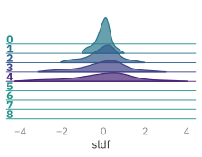
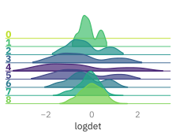

# 🔳 `l2hmc-qcd` Example: 4D SU(3)
Sam Foreman

<link rel="preconnect" href="https://fonts.googleapis.com">
<link href="https://iosevka-webfonts.github.io/iosevka/iosevka.css" rel="stylesheet">

- [Load config + build Experiment](#load-config--build-experiment)
- [HMC](#hmc)
- [Training](#training)
- [Evaluation](#evaluation)

``` python
# %matplotlib inline
import matplotlib_inline
matplotlib_inline.backend_inline.set_matplotlib_formats('svg')
import os
os.environ['COLORTERM'] = 'truecolor'
import lovely_tensors as lt
lt.monkey_patch()
lt.set_config(color=False)
# automatically detect and reload local changes to modules
%load_ext autoreload
%autoreload 2
import ezpz
import numpy as np
import matplotlib.pyplot as plt
from l2hmc.utils.plot_helpers import FigAxes
import ambivalent
plt.style.use(ambivalent.STYLES['ambivalent'])
#set_plot_style()
```

<pre style="white-space:pre;overflow-x:auto;line-height:normal;font-family:Menlo,'DejaVu Sans Mono',consolas,'Courier New',monospace">Using device: cpu
</pre>

``` python
import ezpz
from pathlib import Path
from typing import Optional
from rich import print

import lovely_tensors as lt
import matplotlib.pyplot as plt
import numpy as np
import torch
import yaml

# from l2hmc.utils.dist import setup_torch
seed = np.random.randint(2 ** 32)
print(f"seed: {seed}")

_ = ezpz.setup_torch(seed=seed)
torch.set_default_dtype(torch.float64)
# _ = setup_torch(precision='float64', backend='DDP', seed=seed, port='1234')

logger = ezpz.get_logger()

import l2hmc.group.su3.pytorch.group as g
# from l2hmc.utils.rich import get_console
from l2hmc.common import grab_tensor, print_dict
from l2hmc.configs import dict_to_list_of_overrides, get_experiment
from l2hmc.experiment.pytorch.experiment import Experiment, evaluate  # noqa
```

<pre style="white-space:pre;overflow-x:auto;line-height:normal;font-family:Menlo,'DejaVu Sans Mono',consolas,'Courier New',monospace">seed: <span style="color: #ff00ff; text-decoration-color: #ff00ff">1929415795</span>
</pre>

<pre style="white-space:pre;overflow-x:auto;line-height:normal;font-family:Menlo,'DejaVu Sans Mono',consolas,'Courier New',monospace"><span style="color: #000000; text-decoration-color: #000000">[</span><span style="color: #000000; text-decoration-color: #000000">2025-07-24 </span><span style="color: #808080; text-decoration-color: #808080">14:14:25</span><span style="color: #000000; text-decoration-color: #000000">][</span><span style="color: #008000; text-decoration-color: #008000; font-weight: bold">I</span><span style="color: #000000; text-decoration-color: #000000">][</span><span style="color: #008080; text-decoration-color: #008080; font-style: italic">ezpz</span><span style="color: #000000; text-decoration-color: #000000">/</span><span style="color: #000080; text-decoration-color: #000080">dist</span><span style="color: #0000ff; text-decoration-color: #0000ff">:</span><span style="color: #000000; text-decoration-color: #000000">558</span><span style="color: #000000; text-decoration-color: #000000">]</span><span style="color: #838383; text-decoration-color: #838383"> </span>Using <span style="color: #800080; text-decoration-color: #800080; font-weight: bold">get_torch_device_type</span><span style="color: #ffffff; text-decoration-color: #ffffff">()</span>=<span style="color: #00ff00; text-decoration-color: #00ff00; font-style: italic">'mps'</span> with <span style="color: #0000ff; text-decoration-color: #0000ff; font-style: italic">backend</span>=<span style="color: #00ff00; text-decoration-color: #00ff00; font-style: italic">'gloo'</span>
</pre>

<pre style="white-space:pre;overflow-x:auto;line-height:normal;font-family:Menlo,'DejaVu Sans Mono',consolas,'Courier New',monospace"><span style="color: #000000; text-decoration-color: #000000">[</span><span style="color: #000000; text-decoration-color: #000000">2025-07-24 </span><span style="color: #808080; text-decoration-color: #808080">14:14:25</span><span style="color: #000000; text-decoration-color: #000000">][</span><span style="color: #008000; text-decoration-color: #008000; font-weight: bold">I</span><span style="color: #000000; text-decoration-color: #000000">][</span><span style="color: #008080; text-decoration-color: #008080; font-style: italic">ezpz</span><span style="color: #000000; text-decoration-color: #000000">/</span><span style="color: #000080; text-decoration-color: #000080">dist</span><span style="color: #0000ff; text-decoration-color: #0000ff">:</span><span style="color: #000000; text-decoration-color: #000000">869</span><span style="color: #000000; text-decoration-color: #000000">]</span><span style="color: #838383; text-decoration-color: #838383"> </span>Using <span style="color: #0000ff; text-decoration-color: #0000ff; font-style: italic">device</span>=<span style="color: #00ff00; text-decoration-color: #00ff00; font-style: italic">'mps'</span> with <span style="color: #0000ff; text-decoration-color: #0000ff; font-style: italic">backend</span>=<span style="color: #00ff00; text-decoration-color: #00ff00; font-style: italic">'DDP'</span> + <span style="color: #00ff00; text-decoration-color: #00ff00; font-style: italic">'gloo'</span> for distributed training.
</pre>

<pre style="white-space:pre;overflow-x:auto;line-height:normal;font-family:Menlo,'DejaVu Sans Mono',consolas,'Courier New',monospace"><span style="color: #000000; text-decoration-color: #000000">[</span><span style="color: #000000; text-decoration-color: #000000">2025-07-24 </span><span style="color: #808080; text-decoration-color: #808080">14:14:25</span><span style="color: #000000; text-decoration-color: #000000">][</span><span style="color: #008000; text-decoration-color: #008000; font-weight: bold">I</span><span style="color: #000000; text-decoration-color: #000000">][</span><span style="color: #008080; text-decoration-color: #008080; font-style: italic">ezpz</span><span style="color: #000000; text-decoration-color: #000000">/</span><span style="color: #000080; text-decoration-color: #000080">dist</span><span style="color: #0000ff; text-decoration-color: #0000ff">:</span><span style="color: #000000; text-decoration-color: #000000">919</span><span style="color: #000000; text-decoration-color: #000000">]</span><span style="color: #838383; text-decoration-color: #838383"> </span><span style="color: #ffffff; text-decoration-color: #ffffff">[</span><span style="color: #00ff00; text-decoration-color: #00ff00; font-style: italic">'Sams-MacBook-Pro-2.local'</span><span style="color: #ffffff; text-decoration-color: #ffffff">][</span><span style="color: #ff00ff; text-decoration-color: #ff00ff">0</span>/<span style="color: #ff00ff; text-decoration-color: #ff00ff">0</span><span style="color: #ffffff; text-decoration-color: #ffffff">]</span> 
</pre>

<pre style="white-space:pre;overflow-x:auto;line-height:normal;font-family:Menlo,'DejaVu Sans Mono',consolas,'Courier New',monospace">[2025-07-24 14:14:29,550] [INFO] [real_accelerator.py:239:get_accelerator] Setting ds_accelerator to mps (auto detect)
</pre>

    [rank0]:W0724 14:14:30.461000 93591 torch/distributed/elastic/multiprocessing/redirects.py:29] NOTE: Redirects are currently not supported in Windows or MacOs.

``` python
from l2hmc.utils.plot_helpers import (  # noqa
    plot_scalar,
    plot_chains,
    plot_leapfrogs
)

def savefig(fig: plt.Figure, fname: str, outdir: os.PathLike):
    pngfile = Path(outdir).joinpath(f"pngs/{fname}.png")
    svgfile = Path(outdir).joinpath(f"svgs/{fname}.svg")
    pngfile.parent.mkdir(exist_ok=True, parents=True)
    svgfile.parent.mkdir(exist_ok=True, parents=True)
    fig.savefig(svgfile, transparent=True, bbox_inches='tight')
    fig.savefig(pngfile, transparent=True, bbox_inches='tight', dpi=300)

def plot_metrics(metrics: dict, title: Optional[str] = None, **kwargs):
    outdir = Path(f"./plots-4dSU3/{title}")
    outdir.mkdir(exist_ok=True, parents=True)
    for key, val in metrics.items():
        fig, ax = plot_metric(val, name=key, **kwargs)
        if title is not None:
            ax.set_title(title)
        console.log(f"Saving {key} to {outdir}")
        savefig(fig, f"{key}", outdir=outdir)
        plt.show()

def plot_metric(
        metric: torch.Tensor,
        name: Optional[str] = None,
        **kwargs,
):
    assert len(metric) > 0
    if isinstance(metric[0], (int, float, bool, np.floating)):
        y = np.stack(metric)
        return plot_scalar(y, ylabel=name, **kwargs)
    element_shape = metric[0].shape
    if len(element_shape) == 2:
        y = grab_tensor(torch.stack(metric))
        return plot_leapfrogs(y, ylabel=name)
    if len(element_shape) == 1:
        y = grab_tensor(torch.stack(metric))
        return plot_chains(y, ylabel=name, **kwargs)
    if len(element_shape) == 0:
        y = grab_tensor(torch.stack(metric))
        return plot_scalar(y, ylabel=name, **kwargs)
    raise ValueError
```

## Load config + build Experiment

``` python
from rich import print

from l2hmc.configs import CONF_DIR
su3conf = Path(f"{CONF_DIR}/su3test.yaml")
with su3conf.open('r') as stream:
    conf = dict(yaml.safe_load(stream))
```

``` python
import json
from rich import print_json
print_json(json.dumps(conf, indent=4, sort_keys=True))
overrides = dict_to_list_of_overrides(conf)
```

<pre style="white-space:pre;overflow-x:auto;line-height:normal;font-family:Menlo,'DejaVu Sans Mono',consolas,'Courier New',monospace"><span style="color: #ffff00; text-decoration-color: #ffff00; font-weight: bold">{</span>
  <span style="color: #0000ff; text-decoration-color: #0000ff; font-weight: bold">"annealing_schedule"</span>: <span style="color: #ffff00; text-decoration-color: #ffff00; font-weight: bold">{</span>
    <span style="color: #0000ff; text-decoration-color: #0000ff; font-weight: bold">"beta_final"</span>: <span style="color: #008080; text-decoration-color: #008080; font-weight: bold">6.0</span>,
    <span style="color: #0000ff; text-decoration-color: #0000ff; font-weight: bold">"beta_init"</span>: <span style="color: #008080; text-decoration-color: #008080; font-weight: bold">6.0</span>
  <span style="color: #ffff00; text-decoration-color: #ffff00; font-weight: bold">}</span>,
  <span style="color: #0000ff; text-decoration-color: #0000ff; font-weight: bold">"backend"</span>: <span style="color: #00ff00; text-decoration-color: #00ff00">"DDP"</span>,
  <span style="color: #0000ff; text-decoration-color: #0000ff; font-weight: bold">"conv"</span>: <span style="color: #00ff00; text-decoration-color: #00ff00">"none"</span>,
  <span style="color: #0000ff; text-decoration-color: #0000ff; font-weight: bold">"dynamics"</span>: <span style="color: #ffff00; text-decoration-color: #ffff00; font-weight: bold">{</span>
    <span style="color: #0000ff; text-decoration-color: #0000ff; font-weight: bold">"eps"</span>: <span style="color: #008080; text-decoration-color: #008080; font-weight: bold">0.01</span>,
    <span style="color: #0000ff; text-decoration-color: #0000ff; font-weight: bold">"eps_fixed"</span>: <span style="color: #ff0000; text-decoration-color: #ff0000; font-style: italic">false</span>,
    <span style="color: #0000ff; text-decoration-color: #0000ff; font-weight: bold">"group"</span>: <span style="color: #00ff00; text-decoration-color: #00ff00">"SU3"</span>,
    <span style="color: #0000ff; text-decoration-color: #0000ff; font-weight: bold">"latvolume"</span>: <span style="color: #ffff00; text-decoration-color: #ffff00; font-weight: bold">[</span>
      <span style="color: #008080; text-decoration-color: #008080; font-weight: bold">4</span>,
      <span style="color: #008080; text-decoration-color: #008080; font-weight: bold">4</span>,
      <span style="color: #008080; text-decoration-color: #008080; font-weight: bold">4</span>,
      <span style="color: #008080; text-decoration-color: #008080; font-weight: bold">4</span>
    <span style="color: #ffff00; text-decoration-color: #ffff00; font-weight: bold">]</span>,
    <span style="color: #0000ff; text-decoration-color: #0000ff; font-weight: bold">"merge_directions"</span>: <span style="color: #00ff00; text-decoration-color: #00ff00; font-style: italic">true</span>,
    <span style="color: #0000ff; text-decoration-color: #0000ff; font-weight: bold">"nchains"</span>: <span style="color: #008080; text-decoration-color: #008080; font-weight: bold">8</span>,
    <span style="color: #0000ff; text-decoration-color: #0000ff; font-weight: bold">"nleapfrog"</span>: <span style="color: #008080; text-decoration-color: #008080; font-weight: bold">4</span>,
    <span style="color: #0000ff; text-decoration-color: #0000ff; font-weight: bold">"use_separate_networks"</span>: <span style="color: #ff0000; text-decoration-color: #ff0000; font-style: italic">false</span>,
    <span style="color: #0000ff; text-decoration-color: #0000ff; font-weight: bold">"use_split_xnets"</span>: <span style="color: #ff0000; text-decoration-color: #ff0000; font-style: italic">false</span>,
    <span style="color: #0000ff; text-decoration-color: #0000ff; font-weight: bold">"verbose"</span>: <span style="color: #00ff00; text-decoration-color: #00ff00; font-style: italic">true</span>
  <span style="color: #ffff00; text-decoration-color: #ffff00; font-weight: bold">}</span>,
  <span style="color: #0000ff; text-decoration-color: #0000ff; font-weight: bold">"framework"</span>: <span style="color: #00ff00; text-decoration-color: #00ff00">"pytorch"</span>,
  <span style="color: #0000ff; text-decoration-color: #0000ff; font-weight: bold">"init_aim"</span>: <span style="color: #ff0000; text-decoration-color: #ff0000; font-style: italic">false</span>,
  <span style="color: #0000ff; text-decoration-color: #0000ff; font-weight: bold">"init_wandb"</span>: <span style="color: #ff0000; text-decoration-color: #ff0000; font-style: italic">false</span>,
  <span style="color: #0000ff; text-decoration-color: #0000ff; font-weight: bold">"learning_rate"</span>: <span style="color: #ffff00; text-decoration-color: #ffff00; font-weight: bold">{</span>
    <span style="color: #0000ff; text-decoration-color: #0000ff; font-weight: bold">"clip_norm"</span>: <span style="color: #008080; text-decoration-color: #008080; font-weight: bold">1.0</span>,
    <span style="color: #0000ff; text-decoration-color: #0000ff; font-weight: bold">"lr_init"</span>: <span style="color: #00ff00; text-decoration-color: #00ff00">"1e-04"</span>
  <span style="color: #ffff00; text-decoration-color: #ffff00; font-weight: bold">}</span>,
  <span style="color: #0000ff; text-decoration-color: #0000ff; font-weight: bold">"loss"</span>: <span style="color: #ffff00; text-decoration-color: #ffff00; font-weight: bold">{</span>
    <span style="color: #0000ff; text-decoration-color: #0000ff; font-weight: bold">"aux_weight"</span>: <span style="color: #008080; text-decoration-color: #008080; font-weight: bold">0.0</span>,
    <span style="color: #0000ff; text-decoration-color: #0000ff; font-weight: bold">"charge_weight"</span>: <span style="color: #008080; text-decoration-color: #008080; font-weight: bold">0.0</span>,
    <span style="color: #0000ff; text-decoration-color: #0000ff; font-weight: bold">"plaq_weight"</span>: <span style="color: #008080; text-decoration-color: #008080; font-weight: bold">0.1</span>,
    <span style="color: #0000ff; text-decoration-color: #0000ff; font-weight: bold">"rmse_weight"</span>: <span style="color: #008080; text-decoration-color: #008080; font-weight: bold">0.1</span>,
    <span style="color: #0000ff; text-decoration-color: #0000ff; font-weight: bold">"use_mixed_loss"</span>: <span style="color: #00ff00; text-decoration-color: #00ff00; font-style: italic">true</span>
  <span style="color: #ffff00; text-decoration-color: #ffff00; font-weight: bold">}</span>,
  <span style="color: #0000ff; text-decoration-color: #0000ff; font-weight: bold">"net_weights"</span>: <span style="color: #ffff00; text-decoration-color: #ffff00; font-weight: bold">{</span>
    <span style="color: #0000ff; text-decoration-color: #0000ff; font-weight: bold">"v"</span>: <span style="color: #ffff00; text-decoration-color: #ffff00; font-weight: bold">{</span>
      <span style="color: #0000ff; text-decoration-color: #0000ff; font-weight: bold">"q"</span>: <span style="color: #008080; text-decoration-color: #008080; font-weight: bold">1.0</span>,
      <span style="color: #0000ff; text-decoration-color: #0000ff; font-weight: bold">"s"</span>: <span style="color: #008080; text-decoration-color: #008080; font-weight: bold">1.0</span>,
      <span style="color: #0000ff; text-decoration-color: #0000ff; font-weight: bold">"t"</span>: <span style="color: #008080; text-decoration-color: #008080; font-weight: bold">1.0</span>
    <span style="color: #ffff00; text-decoration-color: #ffff00; font-weight: bold">}</span>,
    <span style="color: #0000ff; text-decoration-color: #0000ff; font-weight: bold">"x"</span>: <span style="color: #ffff00; text-decoration-color: #ffff00; font-weight: bold">{</span>
      <span style="color: #0000ff; text-decoration-color: #0000ff; font-weight: bold">"q"</span>: <span style="color: #008080; text-decoration-color: #008080; font-weight: bold">1.0</span>,
      <span style="color: #0000ff; text-decoration-color: #0000ff; font-weight: bold">"s"</span>: <span style="color: #008080; text-decoration-color: #008080; font-weight: bold">0.0</span>,
      <span style="color: #0000ff; text-decoration-color: #0000ff; font-weight: bold">"t"</span>: <span style="color: #008080; text-decoration-color: #008080; font-weight: bold">1.0</span>
    <span style="color: #ffff00; text-decoration-color: #ffff00; font-weight: bold">}</span>
  <span style="color: #ffff00; text-decoration-color: #ffff00; font-weight: bold">}</span>,
  <span style="color: #0000ff; text-decoration-color: #0000ff; font-weight: bold">"network"</span>: <span style="color: #ffff00; text-decoration-color: #ffff00; font-weight: bold">{</span>
    <span style="color: #0000ff; text-decoration-color: #0000ff; font-weight: bold">"activation_fn"</span>: <span style="color: #00ff00; text-decoration-color: #00ff00">"tanh"</span>,
    <span style="color: #0000ff; text-decoration-color: #0000ff; font-weight: bold">"dropout_prob"</span>: <span style="color: #008080; text-decoration-color: #008080; font-weight: bold">0.0</span>,
    <span style="color: #0000ff; text-decoration-color: #0000ff; font-weight: bold">"units"</span>: <span style="color: #ffff00; text-decoration-color: #ffff00; font-weight: bold">[</span>
      <span style="color: #008080; text-decoration-color: #008080; font-weight: bold">256</span>
    <span style="color: #ffff00; text-decoration-color: #ffff00; font-weight: bold">]</span>,
    <span style="color: #0000ff; text-decoration-color: #0000ff; font-weight: bold">"use_batch_norm"</span>: <span style="color: #ff0000; text-decoration-color: #ff0000; font-style: italic">false</span>
  <span style="color: #ffff00; text-decoration-color: #ffff00; font-weight: bold">}</span>,
  <span style="color: #0000ff; text-decoration-color: #0000ff; font-weight: bold">"restore"</span>: <span style="color: #ff0000; text-decoration-color: #ff0000; font-style: italic">false</span>,
  <span style="color: #0000ff; text-decoration-color: #0000ff; font-weight: bold">"save"</span>: <span style="color: #ff0000; text-decoration-color: #ff0000; font-style: italic">false</span>,
  <span style="color: #0000ff; text-decoration-color: #0000ff; font-weight: bold">"steps"</span>: <span style="color: #ffff00; text-decoration-color: #ffff00; font-weight: bold">{</span>
    <span style="color: #0000ff; text-decoration-color: #0000ff; font-weight: bold">"log"</span>: <span style="color: #008080; text-decoration-color: #008080; font-weight: bold">1</span>,
    <span style="color: #0000ff; text-decoration-color: #0000ff; font-weight: bold">"nepoch"</span>: <span style="color: #008080; text-decoration-color: #008080; font-weight: bold">10</span>,
    <span style="color: #0000ff; text-decoration-color: #0000ff; font-weight: bold">"nera"</span>: <span style="color: #008080; text-decoration-color: #008080; font-weight: bold">1</span>,
    <span style="color: #0000ff; text-decoration-color: #0000ff; font-weight: bold">"print"</span>: <span style="color: #008080; text-decoration-color: #008080; font-weight: bold">1</span>,
    <span style="color: #0000ff; text-decoration-color: #0000ff; font-weight: bold">"test"</span>: <span style="color: #008080; text-decoration-color: #008080; font-weight: bold">50</span>
  <span style="color: #ffff00; text-decoration-color: #ffff00; font-weight: bold">}</span>,
  <span style="color: #0000ff; text-decoration-color: #0000ff; font-weight: bold">"use_tb"</span>: <span style="color: #ff0000; text-decoration-color: #ff0000; font-style: italic">false</span>,
  <span style="color: #0000ff; text-decoration-color: #0000ff; font-weight: bold">"use_wandb"</span>: <span style="color: #ff0000; text-decoration-color: #ff0000; font-style: italic">false</span>
<span style="color: #ffff00; text-decoration-color: #ffff00; font-weight: bold">}</span>
</pre>

``` python
ptExpSU3 = get_experiment(overrides=[*overrides], build_networks=True)

# console.print(ptExpSU3.config)
state = ptExpSU3.trainer.dynamics.random_state(6.0)
logger.info(f"checkSU(state.x): {g.checkSU(state.x)}")
logger.info(f"checkSU(state.x): {g.checkSU(g.projectSU(state.x))}")
assert isinstance(state.x, torch.Tensor)
assert isinstance(state.beta, torch.Tensor)
assert isinstance(ptExpSU3, Experiment)
```

<pre style="white-space:pre;overflow-x:auto;line-height:normal;font-family:Menlo,'DejaVu Sans Mono',consolas,'Courier New',monospace"><span style="color: #000000; text-decoration-color: #000000">[</span><span style="color: #000000; text-decoration-color: #000000">2025-07-24 </span><span style="color: #808080; text-decoration-color: #808080">14:14:32</span><span style="color: #000000; text-decoration-color: #000000">][</span><span style="color: #008000; text-decoration-color: #008000; font-weight: bold">I</span><span style="color: #000000; text-decoration-color: #000000">][</span><span style="color: #008080; text-decoration-color: #008080; font-style: italic">utils</span><span style="color: #000000; text-decoration-color: #000000">/</span><span style="color: #000080; text-decoration-color: #000080">dist</span><span style="color: #0000ff; text-decoration-color: #0000ff">:</span><span style="color: #000000; text-decoration-color: #000000">229</span><span style="color: #0000ff; text-decoration-color: #0000ff">:</span><span style="color: #00ff00; text-decoration-color: #00ff00; font-style: italic">l2hmc.utils.dist</span><span style="color: #000000; text-decoration-color: #000000">]</span><span style="color: #838383; text-decoration-color: #838383"> </span>Caught MASTER_PORT:<span style="color: #ff00ff; text-decoration-color: #ff00ff">1234</span> from environment!
</pre>

<pre style="white-space:pre;overflow-x:auto;line-height:normal;font-family:Menlo,'DejaVu Sans Mono',consolas,'Courier New',monospace"><span style="color: #000000; text-decoration-color: #000000">[</span><span style="color: #000000; text-decoration-color: #000000">2025-07-24 </span><span style="color: #808080; text-decoration-color: #808080">14:14:32</span><span style="color: #000000; text-decoration-color: #000000">][</span><span style="color: #008000; text-decoration-color: #008000; font-weight: bold">I</span><span style="color: #000000; text-decoration-color: #000000">][</span><span style="color: #008080; text-decoration-color: #008080; font-style: italic">utils</span><span style="color: #000000; text-decoration-color: #000000">/</span><span style="color: #000080; text-decoration-color: #000080">dist</span><span style="color: #0000ff; text-decoration-color: #0000ff">:</span><span style="color: #000000; text-decoration-color: #000000">229</span><span style="color: #0000ff; text-decoration-color: #0000ff">:</span><span style="color: #00ff00; text-decoration-color: #00ff00; font-style: italic">l2hmc.utils.dist</span><span style="color: #000000; text-decoration-color: #000000">]</span><span style="color: #838383; text-decoration-color: #838383"> </span>Caught MASTER_PORT:<span style="color: #ff00ff; text-decoration-color: #ff00ff">1234</span> from environment!
</pre>

<pre style="white-space:pre;overflow-x:auto;line-height:normal;font-family:Menlo,'DejaVu Sans Mono',consolas,'Courier New',monospace"><span style="color: #000000; text-decoration-color: #000000">[</span><span style="color: #000000; text-decoration-color: #000000">2025-07-24 </span><span style="color: #808080; text-decoration-color: #808080">14:14:32</span><span style="color: #000000; text-decoration-color: #000000">][</span><span style="color: #ffff00; text-decoration-color: #ffff00">W</span><span style="color: #000000; text-decoration-color: #000000">][</span><span style="color: #008080; text-decoration-color: #008080; font-style: italic">pytorch</span><span style="color: #000000; text-decoration-color: #000000">/</span><span style="color: #000080; text-decoration-color: #000080">trainer</span><span style="color: #0000ff; text-decoration-color: #0000ff">:</span><span style="color: #000000; text-decoration-color: #000000">467</span><span style="color: #0000ff; text-decoration-color: #0000ff">:</span><span style="color: #00ff00; text-decoration-color: #00ff00; font-style: italic">l2hmc.trainers.pytorch.trainer</span><span style="color: #000000; text-decoration-color: #000000">]</span><span style="color: #838383; text-decoration-color: #838383"> </span>Using torch.float32 on cpu!
</pre>

<pre style="white-space:pre;overflow-x:auto;line-height:normal;font-family:Menlo,'DejaVu Sans Mono',consolas,'Courier New',monospace"><span style="color: #000000; text-decoration-color: #000000">[</span><span style="color: #000000; text-decoration-color: #000000">2025-07-24 </span><span style="color: #808080; text-decoration-color: #808080">14:14:32</span><span style="color: #000000; text-decoration-color: #000000">][</span><span style="color: #ffff00; text-decoration-color: #ffff00">W</span><span style="color: #000000; text-decoration-color: #000000">][</span><span style="color: #008080; text-decoration-color: #008080; font-style: italic">pytorch</span><span style="color: #000000; text-decoration-color: #000000">/</span><span style="color: #000080; text-decoration-color: #000080">trainer</span><span style="color: #0000ff; text-decoration-color: #0000ff">:</span><span style="color: #000000; text-decoration-color: #000000">467</span><span style="color: #0000ff; text-decoration-color: #0000ff">:</span><span style="color: #00ff00; text-decoration-color: #00ff00; font-style: italic">l2hmc.trainers.pytorch.trainer</span><span style="color: #000000; text-decoration-color: #000000">]</span><span style="color: #838383; text-decoration-color: #838383"> </span>Using `torch.optim.Adam` optimizer
</pre>

<pre style="white-space:pre;overflow-x:auto;line-height:normal;font-family:Menlo,'DejaVu Sans Mono',consolas,'Courier New',monospace"><span style="color: #000000; text-decoration-color: #000000">[</span><span style="color: #000000; text-decoration-color: #000000">2025-07-24 </span><span style="color: #808080; text-decoration-color: #808080">14:14:32</span><span style="color: #000000; text-decoration-color: #000000">][</span><span style="color: #008000; text-decoration-color: #008000; font-weight: bold">I</span><span style="color: #000000; text-decoration-color: #000000">][</span><span style="color: #008080; text-decoration-color: #008080; font-style: italic">pytorch</span><span style="color: #000000; text-decoration-color: #000000">/</span><span style="color: #000080; text-decoration-color: #000080">trainer</span><span style="color: #0000ff; text-decoration-color: #0000ff">:</span><span style="color: #000000; text-decoration-color: #000000">305</span><span style="color: #0000ff; text-decoration-color: #0000ff">:</span><span style="color: #00ff00; text-decoration-color: #00ff00; font-style: italic">l2hmc.trainers.pytorch.trainer</span><span style="color: #000000; text-decoration-color: #000000">]</span><span style="color: #838383; text-decoration-color: #838383"> </span>num_params in model: <span style="color: #ff00ff; text-decoration-color: #ff00ff">27880456</span>
</pre>

<pre style="white-space:pre;overflow-x:auto;line-height:normal;font-family:Menlo,'DejaVu Sans Mono',consolas,'Courier New',monospace"><span style="color: #000000; text-decoration-color: #000000">[</span><span style="color: #000000; text-decoration-color: #000000">2025-07-24 </span><span style="color: #808080; text-decoration-color: #808080">14:14:32</span><span style="color: #000000; text-decoration-color: #000000">][</span><span style="color: #ffff00; text-decoration-color: #ffff00">W</span><span style="color: #000000; text-decoration-color: #000000">][</span><span style="color: #008080; text-decoration-color: #008080; font-style: italic">pytorch</span><span style="color: #000000; text-decoration-color: #000000">/</span><span style="color: #000080; text-decoration-color: #000080">trainer</span><span style="color: #0000ff; text-decoration-color: #0000ff">:</span><span style="color: #000000; text-decoration-color: #000000">271</span><span style="color: #0000ff; text-decoration-color: #0000ff">:</span><span style="color: #00ff00; text-decoration-color: #00ff00; font-style: italic">l2hmc.trainers.pytorch.trainer</span><span style="color: #000000; text-decoration-color: #000000">]</span><span style="color: #838383; text-decoration-color: #838383"> </span>logging with freq <span style="color: #ff00ff; text-decoration-color: #ff00ff">1</span> for wandb.watch
</pre>

<pre style="white-space:pre;overflow-x:auto;line-height:normal;font-family:Menlo,'DejaVu Sans Mono',consolas,'Courier New',monospace"><span style="color: #000000; text-decoration-color: #000000">[</span><span style="color: #000000; text-decoration-color: #000000">2025-07-24 </span><span style="color: #808080; text-decoration-color: #808080">14:14:32</span><span style="color: #000000; text-decoration-color: #000000">][</span><span style="color: #008000; text-decoration-color: #008000; font-weight: bold">I</span><span style="color: #000000; text-decoration-color: #000000">][</span><span style="color: #008080; text-decoration-color: #008080; font-style: italic">ipykernel_93591</span><span style="color: #000000; text-decoration-color: #000000">/</span><span style="color: #000080; text-decoration-color: #000080">1455121896</span><span style="color: #0000ff; text-decoration-color: #0000ff">:</span><span style="color: #000000; text-decoration-color: #000000">5</span><span style="color: #0000ff; text-decoration-color: #0000ff">:</span><span style="color: #00ff00; text-decoration-color: #00ff00; font-style: italic">ezpz.log</span><span style="color: #000000; text-decoration-color: #000000">]</span><span style="color: #838383; text-decoration-color: #838383"> </span><span style="color: #800080; text-decoration-color: #800080; font-weight: bold">checkSU</span><span style="color: #ffffff; text-decoration-color: #ffffff">(</span>state.x<span style="color: #ffffff; text-decoration-color: #ffffff">)</span>: <span style="color: #ffffff; text-decoration-color: #ffffff">(</span>tensor<span style="color: #ffffff; text-decoration-color: #ffffff">[</span><span style="color: #ff00ff; text-decoration-color: #ff00ff">8</span><span style="color: #ffffff; text-decoration-color: #ffffff">]</span> f64 x∈<span style="color: #ffffff; text-decoration-color: #ffffff">[</span><span style="color: #ff00ff; text-decoration-color: #ff00ff">9.718e-15</span>, <span style="color: #ff00ff; text-decoration-color: #ff00ff">5.225e-14</span><span style="color: #ffffff; text-decoration-color: #ffffff">]</span> <span style="color: #0000ff; text-decoration-color: #0000ff; font-style: italic">μ</span>=<span style="color: #ff00ff; text-decoration-color: #ff00ff">2.400e-14</span> <span style="color: #0000ff; text-decoration-color: #0000ff; font-style: italic">σ</span>=<span style="color: #ff00ff; text-decoration-color: #ff00ff">1.608e-14</span> <span style="color: #ffffff; text-decoration-color: #ffffff">[</span><span style="color: #ff00ff; text-decoration-color: #ff00ff">2.006e-14</span>, <span style="color: #ff00ff; text-decoration-color: #ff00ff">1.956e-14</span>, <span style="color: #ff00ff; text-decoration-color: #ff00ff">1.409e-14</span>, <span style="color: #ff00ff; text-decoration-color: #ff00ff">5.225e-14</span>, <span style="color: #ff00ff; text-decoration-color: #ff00ff">1.967e-14</span>, <span style="color: #ff00ff; text-decoration-color: #ff00ff">9.718e-15</span>, <span style="color: #ff00ff; text-decoration-color: #ff00ff">4.594e-14</span>, <span style="color: #ff00ff; text-decoration-color: #ff00ff">1.074e-14</span><span style="color: #ffffff; text-decoration-color: #ffffff">]</span>, tensor<span style="color: #ffffff; text-decoration-color: #ffffff">[</span><span style="color: #ff00ff; text-decoration-color: #ff00ff">8</span><span style="color: #ffffff; text-decoration-color: #ffffff">]</span> f64 x∈<span style="color: #ffffff; text-decoration-color: #ffffff">[</span><span style="color: #ff00ff; text-decoration-color: #ff00ff">1.373e-13</span>, <span style="color: #ff00ff; text-decoration-color: #ff00ff">1.622e-12</span><span style="color: #ffffff; text-decoration-color: #ffffff">]</span> <span style="color: #0000ff; text-decoration-color: #0000ff; font-style: italic">μ</span>=<span style="color: #ff00ff; text-decoration-color: #ff00ff">6.321e-13</span> <span style="color: #0000ff; text-decoration-color: #0000ff; font-style: italic">σ</span>=<span style="color: #ff00ff; text-decoration-color: #ff00ff">5.692e-13</span> <span style="color: #ffffff; text-decoration-color: #ffffff">[</span><span style="color: #ff00ff; text-decoration-color: #ff00ff">5.238e-13</span>, <span style="color: #ff00ff; text-decoration-color: #ff00ff">5.007e-13</span>, <span style="color: #ff00ff; text-decoration-color: #ff00ff">2.374e-13</span>, <span style="color: #ff00ff; text-decoration-color: #ff00ff">1.622e-12</span>, <span style="color: #ff00ff; text-decoration-color: #ff00ff">4.329e-13</span>, <span style="color: #ff00ff; text-decoration-color: #ff00ff">1.844e-13</span>, <span style="color: #ff00ff; text-decoration-color: #ff00ff">1.418e-12</span>, <span style="color: #ff00ff; text-decoration-color: #ff00ff">1.373e-13</span><span style="color: #ffffff; text-decoration-color: #ffffff">])</span>
</pre>

<pre style="white-space:pre;overflow-x:auto;line-height:normal;font-family:Menlo,'DejaVu Sans Mono',consolas,'Courier New',monospace"><span style="color: #000000; text-decoration-color: #000000">[</span><span style="color: #000000; text-decoration-color: #000000">2025-07-24 </span><span style="color: #808080; text-decoration-color: #808080">14:14:32</span><span style="color: #000000; text-decoration-color: #000000">][</span><span style="color: #008000; text-decoration-color: #008000; font-weight: bold">I</span><span style="color: #000000; text-decoration-color: #000000">][</span><span style="color: #008080; text-decoration-color: #008080; font-style: italic">ipykernel_93591</span><span style="color: #000000; text-decoration-color: #000000">/</span><span style="color: #000080; text-decoration-color: #000080">1455121896</span><span style="color: #0000ff; text-decoration-color: #0000ff">:</span><span style="color: #000000; text-decoration-color: #000000">6</span><span style="color: #0000ff; text-decoration-color: #0000ff">:</span><span style="color: #00ff00; text-decoration-color: #00ff00; font-style: italic">ezpz.log</span><span style="color: #000000; text-decoration-color: #000000">]</span><span style="color: #838383; text-decoration-color: #838383"> </span><span style="color: #800080; text-decoration-color: #800080; font-weight: bold">checkSU</span><span style="color: #ffffff; text-decoration-color: #ffffff">(</span>state.x<span style="color: #ffffff; text-decoration-color: #ffffff">)</span>: <span style="color: #ffffff; text-decoration-color: #ffffff">(</span>tensor<span style="color: #ffffff; text-decoration-color: #ffffff">[</span><span style="color: #ff00ff; text-decoration-color: #ff00ff">8</span><span style="color: #ffffff; text-decoration-color: #ffffff">]</span> f64 x∈<span style="color: #ffffff; text-decoration-color: #ffffff">[</span><span style="color: #ff00ff; text-decoration-color: #ff00ff">2.762e-16</span>, <span style="color: #ff00ff; text-decoration-color: #ff00ff">2.931e-16</span><span style="color: #ffffff; text-decoration-color: #ffffff">]</span> <span style="color: #0000ff; text-decoration-color: #0000ff; font-style: italic">μ</span>=<span style="color: #ff00ff; text-decoration-color: #ff00ff">2.820e-16</span> <span style="color: #0000ff; text-decoration-color: #0000ff; font-style: italic">σ</span>=<span style="color: #ff00ff; text-decoration-color: #ff00ff">6.262e-18</span> <span style="color: #ffffff; text-decoration-color: #ffffff">[</span><span style="color: #ff00ff; text-decoration-color: #ff00ff">2.769e-16</span>, <span style="color: #ff00ff; text-decoration-color: #ff00ff">2.768e-16</span>, <span style="color: #ff00ff; text-decoration-color: #ff00ff">2.822e-16</span>, <span style="color: #ff00ff; text-decoration-color: #ff00ff">2.931e-16</span>, <span style="color: #ff00ff; text-decoration-color: #ff00ff">2.762e-16</span>, <span style="color: #ff00ff; text-decoration-color: #ff00ff">2.810e-16</span>, <span style="color: #ff00ff; text-decoration-color: #ff00ff">2.897e-16</span>, <span style="color: #ff00ff; text-decoration-color: #ff00ff">2.801e-16</span><span style="color: #ffffff; text-decoration-color: #ffffff">]</span>, tensor<span style="color: #ffffff; text-decoration-color: #ffffff">[</span><span style="color: #ff00ff; text-decoration-color: #ff00ff">8</span><span style="color: #ffffff; text-decoration-color: #ffffff">]</span> f64 x∈<span style="color: #ffffff; text-decoration-color: #ffffff">[</span><span style="color: #ff00ff; text-decoration-color: #ff00ff">8.362e-16</span>, <span style="color: #ff00ff; text-decoration-color: #ff00ff">9.450e-16</span><span style="color: #ffffff; text-decoration-color: #ffffff">]</span> <span style="color: #0000ff; text-decoration-color: #0000ff; font-style: italic">μ</span>=<span style="color: #ff00ff; text-decoration-color: #ff00ff">9.016e-16</span> <span style="color: #0000ff; text-decoration-color: #0000ff; font-style: italic">σ</span>=<span style="color: #ff00ff; text-decoration-color: #ff00ff">3.585e-17</span> <span style="color: #ffffff; text-decoration-color: #ffffff">[</span><span style="color: #ff00ff; text-decoration-color: #ff00ff">8.362e-16</span>, <span style="color: #ff00ff; text-decoration-color: #ff00ff">9.372e-16</span>, <span style="color: #ff00ff; text-decoration-color: #ff00ff">9.450e-16</span>, <span style="color: #ff00ff; text-decoration-color: #ff00ff">8.697e-16</span>, <span style="color: #ff00ff; text-decoration-color: #ff00ff">8.955e-16</span>, <span style="color: #ff00ff; text-decoration-color: #ff00ff">9.191e-16</span>, <span style="color: #ff00ff; text-decoration-color: #ff00ff">9.147e-16</span>, <span style="color: #ff00ff; text-decoration-color: #ff00ff">8.956e-16</span><span style="color: #ffffff; text-decoration-color: #ffffff">])</span>
</pre>

``` python
# from l2hmc.utils.plot_helpers import set_plot_style
# set_plot_style()

from l2hmc.common import get_timestamp
TSTAMP = get_timestamp()
OUTPUT_DIR = Path(f"./outputs/pt4dSU3/{TSTAMP}")
HMC_DIR = OUTPUT_DIR.joinpath('hmc')
EVAL_DIR = OUTPUT_DIR.joinpath('eval')
TRAIN_DIR = OUTPUT_DIR.joinpath('train')
HMC_DIR.mkdir(exist_ok=True, parents=True)
EVAL_DIR.mkdir(exist_ok=True, parents=True)
TRAIN_DIR.mkdir(exist_ok=True, parents=True)
```

``` python
ptExpSU3.trainer.print_grads_and_weights()
logger.info(ptExpSU3.config)
#console.print(ptExpSU3.config)
```

<pre style="white-space:pre;overflow-x:auto;line-height:normal;font-family:Menlo,'DejaVu Sans Mono',consolas,'Courier New',monospace"><span style="color: #000000; text-decoration-color: #000000">[</span><span style="color: #000000; text-decoration-color: #000000">2025-07-24 </span><span style="color: #808080; text-decoration-color: #808080">14:14:32</span><span style="color: #000000; text-decoration-color: #000000">][</span><span style="color: #008000; text-decoration-color: #008000; font-weight: bold">I</span><span style="color: #000000; text-decoration-color: #000000">][</span><span style="color: #008080; text-decoration-color: #008080; font-style: italic">pytorch</span><span style="color: #000000; text-decoration-color: #000000">/</span><span style="color: #000080; text-decoration-color: #000080">trainer</span><span style="color: #0000ff; text-decoration-color: #0000ff">:</span><span style="color: #000000; text-decoration-color: #000000">2000</span><span style="color: #0000ff; text-decoration-color: #0000ff">:</span><span style="color: #00ff00; text-decoration-color: #00ff00; font-style: italic">l2hmc.trainers.pytorch.trainer</span><span style="color: #000000; text-decoration-color: #000000">]</span><span style="color: #838383; text-decoration-color: #838383"> </span>--------------------------------------------------------------------------------
</pre>

<pre style="white-space:pre;overflow-x:auto;line-height:normal;font-family:Menlo,'DejaVu Sans Mono',consolas,'Courier New',monospace"><span style="color: #000000; text-decoration-color: #000000">[</span><span style="color: #000000; text-decoration-color: #000000">2025-07-24 </span><span style="color: #808080; text-decoration-color: #808080">14:14:32</span><span style="color: #000000; text-decoration-color: #000000">][</span><span style="color: #008000; text-decoration-color: #008000; font-weight: bold">I</span><span style="color: #000000; text-decoration-color: #000000">][</span><span style="color: #008080; text-decoration-color: #008080; font-style: italic">pytorch</span><span style="color: #000000; text-decoration-color: #000000">/</span><span style="color: #000080; text-decoration-color: #000080">trainer</span><span style="color: #0000ff; text-decoration-color: #0000ff">:</span><span style="color: #000000; text-decoration-color: #000000">2001</span><span style="color: #0000ff; text-decoration-color: #0000ff">:</span><span style="color: #00ff00; text-decoration-color: #00ff00; font-style: italic">l2hmc.trainers.pytorch.trainer</span><span style="color: #000000; text-decoration-color: #000000">]</span><span style="color: #838383; text-decoration-color: #838383"> </span>GRADS:
</pre>

<pre style="white-space:pre;overflow-x:auto;line-height:normal;font-family:Menlo,'DejaVu Sans Mono',consolas,'Courier New',monospace"><span style="color: #000000; text-decoration-color: #000000">[</span><span style="color: #000000; text-decoration-color: #000000">2025-07-24 </span><span style="color: #808080; text-decoration-color: #808080">14:14:32</span><span style="color: #000000; text-decoration-color: #000000">][</span><span style="color: #008000; text-decoration-color: #008000; font-weight: bold">I</span><span style="color: #000000; text-decoration-color: #000000">][</span><span style="color: #008080; text-decoration-color: #008080; font-style: italic">l2hmc</span><span style="color: #000000; text-decoration-color: #000000">/</span><span style="color: #000080; text-decoration-color: #000080">common</span><span style="color: #0000ff; text-decoration-color: #0000ff">:</span><span style="color: #000000; text-decoration-color: #000000">97</span><span style="color: #000000; text-decoration-color: #000000">]</span><span style="color: #838383; text-decoration-color: #838383"> </span>networks.xnet.input_layer.xlayer.weight: <span style="color: #ff00ff; text-decoration-color: #ff00ff; font-style: italic">None</span> <span style="color: #ff00ff; text-decoration-color: #ff00ff; font-style: italic">None</span> 
<span style="color: #ff00ff; text-decoration-color: #ff00ff; font-style: italic">None</span>
networks.xnet.input_layer.xlayer.bias: <span style="color: #ff00ff; text-decoration-color: #ff00ff; font-style: italic">None</span> <span style="color: #ff00ff; text-decoration-color: #ff00ff; font-style: italic">None</span> 
<span style="color: #ff00ff; text-decoration-color: #ff00ff; font-style: italic">None</span>
networks.xnet.input_layer.vlayer.weight: <span style="color: #ff00ff; text-decoration-color: #ff00ff; font-style: italic">None</span> <span style="color: #ff00ff; text-decoration-color: #ff00ff; font-style: italic">None</span> 
<span style="color: #ff00ff; text-decoration-color: #ff00ff; font-style: italic">None</span>
networks.xnet.input_layer.vlayer.bias: <span style="color: #ff00ff; text-decoration-color: #ff00ff; font-style: italic">None</span> <span style="color: #ff00ff; text-decoration-color: #ff00ff; font-style: italic">None</span> 
<span style="color: #ff00ff; text-decoration-color: #ff00ff; font-style: italic">None</span>
networks.xnet.scale.coeff: <span style="color: #ff00ff; text-decoration-color: #ff00ff; font-style: italic">None</span> <span style="color: #ff00ff; text-decoration-color: #ff00ff; font-style: italic">None</span> 
<span style="color: #ff00ff; text-decoration-color: #ff00ff; font-style: italic">None</span>
networks.xnet.scale.layer.weight: <span style="color: #ff00ff; text-decoration-color: #ff00ff; font-style: italic">None</span> <span style="color: #ff00ff; text-decoration-color: #ff00ff; font-style: italic">None</span> 
<span style="color: #ff00ff; text-decoration-color: #ff00ff; font-style: italic">None</span>
networks.xnet.scale.layer.bias: <span style="color: #ff00ff; text-decoration-color: #ff00ff; font-style: italic">None</span> <span style="color: #ff00ff; text-decoration-color: #ff00ff; font-style: italic">None</span> 
<span style="color: #ff00ff; text-decoration-color: #ff00ff; font-style: italic">None</span>
networks.xnet.transf.coeff: <span style="color: #ff00ff; text-decoration-color: #ff00ff; font-style: italic">None</span> <span style="color: #ff00ff; text-decoration-color: #ff00ff; font-style: italic">None</span> 
<span style="color: #ff00ff; text-decoration-color: #ff00ff; font-style: italic">None</span>
networks.xnet.transf.layer.weight: <span style="color: #ff00ff; text-decoration-color: #ff00ff; font-style: italic">None</span> <span style="color: #ff00ff; text-decoration-color: #ff00ff; font-style: italic">None</span> 
<span style="color: #ff00ff; text-decoration-color: #ff00ff; font-style: italic">None</span>
networks.xnet.transf.layer.bias: <span style="color: #ff00ff; text-decoration-color: #ff00ff; font-style: italic">None</span> <span style="color: #ff00ff; text-decoration-color: #ff00ff; font-style: italic">None</span> 
<span style="color: #ff00ff; text-decoration-color: #ff00ff; font-style: italic">None</span>
networks.xnet.transl.weight: <span style="color: #ff00ff; text-decoration-color: #ff00ff; font-style: italic">None</span> <span style="color: #ff00ff; text-decoration-color: #ff00ff; font-style: italic">None</span> 
<span style="color: #ff00ff; text-decoration-color: #ff00ff; font-style: italic">None</span>
networks.xnet.transl.bias: <span style="color: #ff00ff; text-decoration-color: #ff00ff; font-style: italic">None</span> <span style="color: #ff00ff; text-decoration-color: #ff00ff; font-style: italic">None</span> 
<span style="color: #ff00ff; text-decoration-color: #ff00ff; font-style: italic">None</span>
networks.vnet.input_layer.xlayer.weight: <span style="color: #ff00ff; text-decoration-color: #ff00ff; font-style: italic">None</span> <span style="color: #ff00ff; text-decoration-color: #ff00ff; font-style: italic">None</span> 
<span style="color: #ff00ff; text-decoration-color: #ff00ff; font-style: italic">None</span>
networks.vnet.input_layer.xlayer.bias: <span style="color: #ff00ff; text-decoration-color: #ff00ff; font-style: italic">None</span> <span style="color: #ff00ff; text-decoration-color: #ff00ff; font-style: italic">None</span> 
<span style="color: #ff00ff; text-decoration-color: #ff00ff; font-style: italic">None</span>
networks.vnet.input_layer.vlayer.weight: <span style="color: #ff00ff; text-decoration-color: #ff00ff; font-style: italic">None</span> <span style="color: #ff00ff; text-decoration-color: #ff00ff; font-style: italic">None</span> 
<span style="color: #ff00ff; text-decoration-color: #ff00ff; font-style: italic">None</span>
networks.vnet.input_layer.vlayer.bias: <span style="color: #ff00ff; text-decoration-color: #ff00ff; font-style: italic">None</span> <span style="color: #ff00ff; text-decoration-color: #ff00ff; font-style: italic">None</span> 
<span style="color: #ff00ff; text-decoration-color: #ff00ff; font-style: italic">None</span>
networks.vnet.scale.coeff: <span style="color: #ff00ff; text-decoration-color: #ff00ff; font-style: italic">None</span> <span style="color: #ff00ff; text-decoration-color: #ff00ff; font-style: italic">None</span> 
<span style="color: #ff00ff; text-decoration-color: #ff00ff; font-style: italic">None</span>
networks.vnet.scale.layer.weight: <span style="color: #ff00ff; text-decoration-color: #ff00ff; font-style: italic">None</span> <span style="color: #ff00ff; text-decoration-color: #ff00ff; font-style: italic">None</span> 
<span style="color: #ff00ff; text-decoration-color: #ff00ff; font-style: italic">None</span>
networks.vnet.scale.layer.bias: <span style="color: #ff00ff; text-decoration-color: #ff00ff; font-style: italic">None</span> <span style="color: #ff00ff; text-decoration-color: #ff00ff; font-style: italic">None</span> 
<span style="color: #ff00ff; text-decoration-color: #ff00ff; font-style: italic">None</span>
networks.vnet.transf.coeff: <span style="color: #ff00ff; text-decoration-color: #ff00ff; font-style: italic">None</span> <span style="color: #ff00ff; text-decoration-color: #ff00ff; font-style: italic">None</span> 
<span style="color: #ff00ff; text-decoration-color: #ff00ff; font-style: italic">None</span>
networks.vnet.transf.layer.weight: <span style="color: #ff00ff; text-decoration-color: #ff00ff; font-style: italic">None</span> <span style="color: #ff00ff; text-decoration-color: #ff00ff; font-style: italic">None</span> 
<span style="color: #ff00ff; text-decoration-color: #ff00ff; font-style: italic">None</span>
networks.vnet.transf.layer.bias: <span style="color: #ff00ff; text-decoration-color: #ff00ff; font-style: italic">None</span> <span style="color: #ff00ff; text-decoration-color: #ff00ff; font-style: italic">None</span> 
<span style="color: #ff00ff; text-decoration-color: #ff00ff; font-style: italic">None</span>
networks.vnet.transl.weight: <span style="color: #ff00ff; text-decoration-color: #ff00ff; font-style: italic">None</span> <span style="color: #ff00ff; text-decoration-color: #ff00ff; font-style: italic">None</span> 
<span style="color: #ff00ff; text-decoration-color: #ff00ff; font-style: italic">None</span>
networks.vnet.transl.bias: <span style="color: #ff00ff; text-decoration-color: #ff00ff; font-style: italic">None</span> <span style="color: #ff00ff; text-decoration-color: #ff00ff; font-style: italic">None</span> 
<span style="color: #ff00ff; text-decoration-color: #ff00ff; font-style: italic">None</span>
xeps.<span style="color: #ff00ff; text-decoration-color: #ff00ff">0</span>: <span style="color: #ff00ff; text-decoration-color: #ff00ff; font-style: italic">None</span> <span style="color: #ff00ff; text-decoration-color: #ff00ff; font-style: italic">None</span> 
<span style="color: #ff00ff; text-decoration-color: #ff00ff; font-style: italic">None</span>
xeps.<span style="color: #ff00ff; text-decoration-color: #ff00ff">1</span>: <span style="color: #ff00ff; text-decoration-color: #ff00ff; font-style: italic">None</span> <span style="color: #ff00ff; text-decoration-color: #ff00ff; font-style: italic">None</span> 
<span style="color: #ff00ff; text-decoration-color: #ff00ff; font-style: italic">None</span>
xeps.<span style="color: #ff00ff; text-decoration-color: #ff00ff">2</span>: <span style="color: #ff00ff; text-decoration-color: #ff00ff; font-style: italic">None</span> <span style="color: #ff00ff; text-decoration-color: #ff00ff; font-style: italic">None</span> 
<span style="color: #ff00ff; text-decoration-color: #ff00ff; font-style: italic">None</span>
xeps.<span style="color: #ff00ff; text-decoration-color: #ff00ff">3</span>: <span style="color: #ff00ff; text-decoration-color: #ff00ff; font-style: italic">None</span> <span style="color: #ff00ff; text-decoration-color: #ff00ff; font-style: italic">None</span> 
<span style="color: #ff00ff; text-decoration-color: #ff00ff; font-style: italic">None</span>
veps.<span style="color: #ff00ff; text-decoration-color: #ff00ff">0</span>: <span style="color: #ff00ff; text-decoration-color: #ff00ff; font-style: italic">None</span> <span style="color: #ff00ff; text-decoration-color: #ff00ff; font-style: italic">None</span> 
<span style="color: #ff00ff; text-decoration-color: #ff00ff; font-style: italic">None</span>
veps.<span style="color: #ff00ff; text-decoration-color: #ff00ff">1</span>: <span style="color: #ff00ff; text-decoration-color: #ff00ff; font-style: italic">None</span> <span style="color: #ff00ff; text-decoration-color: #ff00ff; font-style: italic">None</span> 
<span style="color: #ff00ff; text-decoration-color: #ff00ff; font-style: italic">None</span>
veps.<span style="color: #ff00ff; text-decoration-color: #ff00ff">2</span>: <span style="color: #ff00ff; text-decoration-color: #ff00ff; font-style: italic">None</span> <span style="color: #ff00ff; text-decoration-color: #ff00ff; font-style: italic">None</span> 
<span style="color: #ff00ff; text-decoration-color: #ff00ff; font-style: italic">None</span>
veps.<span style="color: #ff00ff; text-decoration-color: #ff00ff">3</span>: <span style="color: #ff00ff; text-decoration-color: #ff00ff; font-style: italic">None</span> <span style="color: #ff00ff; text-decoration-color: #ff00ff; font-style: italic">None</span> 
<span style="color: #ff00ff; text-decoration-color: #ff00ff; font-style: italic">None</span>
</pre>

<pre style="white-space:pre;overflow-x:auto;line-height:normal;font-family:Menlo,'DejaVu Sans Mono',consolas,'Courier New',monospace"><span style="color: #000000; text-decoration-color: #000000">[</span><span style="color: #000000; text-decoration-color: #000000">2025-07-24 </span><span style="color: #808080; text-decoration-color: #808080">14:14:32</span><span style="color: #000000; text-decoration-color: #000000">][</span><span style="color: #008000; text-decoration-color: #008000; font-weight: bold">I</span><span style="color: #000000; text-decoration-color: #000000">][</span><span style="color: #008080; text-decoration-color: #008080; font-style: italic">pytorch</span><span style="color: #000000; text-decoration-color: #000000">/</span><span style="color: #000080; text-decoration-color: #000080">trainer</span><span style="color: #0000ff; text-decoration-color: #0000ff">:</span><span style="color: #000000; text-decoration-color: #000000">2003</span><span style="color: #0000ff; text-decoration-color: #0000ff">:</span><span style="color: #00ff00; text-decoration-color: #00ff00; font-style: italic">l2hmc.trainers.pytorch.trainer</span><span style="color: #000000; text-decoration-color: #000000">]</span><span style="color: #838383; text-decoration-color: #838383"> </span>--------------------------------------------------------------------------------
</pre>

<pre style="white-space:pre;overflow-x:auto;line-height:normal;font-family:Menlo,'DejaVu Sans Mono',consolas,'Courier New',monospace"><span style="color: #000000; text-decoration-color: #000000">[</span><span style="color: #000000; text-decoration-color: #000000">2025-07-24 </span><span style="color: #808080; text-decoration-color: #808080">14:14:32</span><span style="color: #000000; text-decoration-color: #000000">][</span><span style="color: #008000; text-decoration-color: #008000; font-weight: bold">I</span><span style="color: #000000; text-decoration-color: #000000">][</span><span style="color: #008080; text-decoration-color: #008080; font-style: italic">pytorch</span><span style="color: #000000; text-decoration-color: #000000">/</span><span style="color: #000080; text-decoration-color: #000080">trainer</span><span style="color: #0000ff; text-decoration-color: #0000ff">:</span><span style="color: #000000; text-decoration-color: #000000">2004</span><span style="color: #0000ff; text-decoration-color: #0000ff">:</span><span style="color: #00ff00; text-decoration-color: #00ff00; font-style: italic">l2hmc.trainers.pytorch.trainer</span><span style="color: #000000; text-decoration-color: #000000">]</span><span style="color: #838383; text-decoration-color: #838383"> </span>WEIGHTS:
</pre>

<pre style="white-space:pre;overflow-x:auto;line-height:normal;font-family:Menlo,'DejaVu Sans Mono',consolas,'Courier New',monospace"><span style="color: #000000; text-decoration-color: #000000">[</span><span style="color: #000000; text-decoration-color: #000000">2025-07-24 </span><span style="color: #808080; text-decoration-color: #808080">14:14:32</span><span style="color: #000000; text-decoration-color: #000000">][</span><span style="color: #008000; text-decoration-color: #008000; font-weight: bold">I</span><span style="color: #000000; text-decoration-color: #000000">][</span><span style="color: #008080; text-decoration-color: #008080; font-style: italic">l2hmc</span><span style="color: #000000; text-decoration-color: #000000">/</span><span style="color: #000080; text-decoration-color: #000080">common</span><span style="color: #0000ff; text-decoration-color: #0000ff">:</span><span style="color: #000000; text-decoration-color: #000000">97</span><span style="color: #000000; text-decoration-color: #000000">]</span><span style="color: #838383; text-decoration-color: #838383"> </span>networks.xnet.input_layer.xlayer.weight: <span style="color: #800080; text-decoration-color: #800080; font-weight: bold">torch.Size</span><span style="color: #ffffff; text-decoration-color: #ffffff">([</span><span style="color: #ff00ff; text-decoration-color: #ff00ff">256</span>, <span style="color: #ff00ff; text-decoration-color: #ff00ff">18432</span><span style="color: #ffffff; text-decoration-color: #ffffff">])</span> torch.float64 
<span style="color: #ffffff; text-decoration-color: #ffffff">[[</span><span style="color: #ff00ff; text-decoration-color: #ff00ff">-6.18413205e-03</span>  <span style="color: #ff00ff; text-decoration-color: #ff00ff">4.69681157e-03</span> <span style="color: #ff00ff; text-decoration-color: #ff00ff">-1.16948962e-03</span> <span style="color: #ffff00; text-decoration-color: #ffff00">...</span> <span style="color: #ff00ff; text-decoration-color: #ff00ff">-6.65418967e-03</span>
  <span style="color: #ff00ff; text-decoration-color: #ff00ff">-2.76154293e-03</span>  <span style="color: #ff00ff; text-decoration-color: #ff00ff">5.42386389e-03</span><span style="color: #ffffff; text-decoration-color: #ffffff">]</span>
 <span style="color: #ffffff; text-decoration-color: #ffffff">[</span> <span style="color: #ff00ff; text-decoration-color: #ff00ff">1.67323253e-03</span>  <span style="color: #ff00ff; text-decoration-color: #ff00ff">2.49642426e-03</span>  <span style="color: #ff00ff; text-decoration-color: #ff00ff">5.99961033e-03</span> <span style="color: #ffff00; text-decoration-color: #ffff00">...</span> <span style="color: #ff00ff; text-decoration-color: #ff00ff">-4.63105322e-03</span>
   <span style="color: #ff00ff; text-decoration-color: #ff00ff">3.23157684e-03</span>  <span style="color: #ff00ff; text-decoration-color: #ff00ff">2.40909187e-03</span><span style="color: #ffffff; text-decoration-color: #ffffff">]</span>
 <span style="color: #ffffff; text-decoration-color: #ffffff">[</span><span style="color: #ff00ff; text-decoration-color: #ff00ff">-5.71466475e-03</span> <span style="color: #ff00ff; text-decoration-color: #ff00ff">-6.36648254e-03</span>  <span style="color: #ff00ff; text-decoration-color: #ff00ff">2.19659707e-03</span> <span style="color: #ffff00; text-decoration-color: #ffff00">...</span>  <span style="color: #ff00ff; text-decoration-color: #ff00ff">5.87518627e-03</span>
  <span style="color: #ff00ff; text-decoration-color: #ff00ff">-4.90599319e-03</span>  <span style="color: #ff00ff; text-decoration-color: #ff00ff">6.61898121e-03</span><span style="color: #ffffff; text-decoration-color: #ffffff">]</span>
 <span style="color: #ffff00; text-decoration-color: #ffff00">...</span>
 <span style="color: #ffffff; text-decoration-color: #ffffff">[</span> <span style="color: #ff00ff; text-decoration-color: #ff00ff">2.57826857e-03</span> <span style="color: #ff00ff; text-decoration-color: #ff00ff">-1.17996148e-03</span> <span style="color: #ff00ff; text-decoration-color: #ff00ff">-6.76104645e-04</span> <span style="color: #ffff00; text-decoration-color: #ffff00">...</span>  <span style="color: #ff00ff; text-decoration-color: #ff00ff">6.28524816e-03</span>
  <span style="color: #ff00ff; text-decoration-color: #ff00ff">-1.63618738e-03</span> <span style="color: #ff00ff; text-decoration-color: #ff00ff">-2.75833395e-03</span><span style="color: #ffffff; text-decoration-color: #ffffff">]</span>
 <span style="color: #ffffff; text-decoration-color: #ffffff">[</span> <span style="color: #ff00ff; text-decoration-color: #ff00ff">6.23757285e-03</span> <span style="color: #ff00ff; text-decoration-color: #ff00ff">-5.79452307e-03</span>  <span style="color: #ff00ff; text-decoration-color: #ff00ff">3.98714061e-03</span> <span style="color: #ffff00; text-decoration-color: #ffff00">...</span>  <span style="color: #ff00ff; text-decoration-color: #ff00ff">4.31647799e-03</span>
   <span style="color: #ff00ff; text-decoration-color: #ff00ff">4.59776842e-04</span>  <span style="color: #ff00ff; text-decoration-color: #ff00ff">3.79525043e-03</span><span style="color: #ffffff; text-decoration-color: #ffffff">]</span>
 <span style="color: #ffffff; text-decoration-color: #ffffff">[</span> <span style="color: #ff00ff; text-decoration-color: #ff00ff">1.90628859e-03</span> <span style="color: #ff00ff; text-decoration-color: #ff00ff">-6.76331734e-03</span>  <span style="color: #ff00ff; text-decoration-color: #ff00ff">4.67240531e-03</span> <span style="color: #ffff00; text-decoration-color: #ffff00">...</span> <span style="color: #ff00ff; text-decoration-color: #ff00ff">-9.53355527e-05</span>
   <span style="color: #ff00ff; text-decoration-color: #ff00ff">3.89460298e-03</span>  <span style="color: #ff00ff; text-decoration-color: #ff00ff">7.29865909e-03</span><span style="color: #ffffff; text-decoration-color: #ffffff">]]</span>
networks.xnet.input_layer.xlayer.bias: <span style="color: #800080; text-decoration-color: #800080; font-weight: bold">torch.Size</span><span style="color: #ffffff; text-decoration-color: #ffffff">([</span><span style="color: #ff00ff; text-decoration-color: #ff00ff">256</span><span style="color: #ffffff; text-decoration-color: #ffffff">])</span> torch.float64 
<span style="color: #ffffff; text-decoration-color: #ffffff">[</span> <span style="color: #ff00ff; text-decoration-color: #ff00ff">5.53140153e-03</span>  <span style="color: #ff00ff; text-decoration-color: #ff00ff">5.74790414e-03</span> <span style="color: #ff00ff; text-decoration-color: #ff00ff">-5.80363216e-03</span>  <span style="color: #ff00ff; text-decoration-color: #ff00ff">1.81779109e-03</span>
  <span style="color: #ff00ff; text-decoration-color: #ff00ff">1.13257925e-03</span> <span style="color: #ff00ff; text-decoration-color: #ff00ff">-3.96992220e-03</span> <span style="color: #ff00ff; text-decoration-color: #ff00ff">-3.62310338e-03</span>  <span style="color: #ff00ff; text-decoration-color: #ff00ff">6.59761963e-03</span>
 <span style="color: #ff00ff; text-decoration-color: #ff00ff">-4.83554147e-03</span>  <span style="color: #ff00ff; text-decoration-color: #ff00ff">4.99990890e-03</span>  <span style="color: #ff00ff; text-decoration-color: #ff00ff">2.49414735e-03</span>  <span style="color: #ff00ff; text-decoration-color: #ff00ff">3.00121961e-03</span>
 <span style="color: #ff00ff; text-decoration-color: #ff00ff">-1.81890624e-03</span>  <span style="color: #ff00ff; text-decoration-color: #ff00ff">2.06933150e-03</span>  <span style="color: #ff00ff; text-decoration-color: #ff00ff">7.18049618e-03</span>  <span style="color: #ff00ff; text-decoration-color: #ff00ff">3.83816050e-03</span>
 <span style="color: #ff00ff; text-decoration-color: #ff00ff">-2.11665081e-03</span> <span style="color: #ff00ff; text-decoration-color: #ff00ff">-1.53887744e-03</span> <span style="color: #ff00ff; text-decoration-color: #ff00ff">-6.30763952e-03</span>  <span style="color: #ff00ff; text-decoration-color: #ff00ff">3.36931443e-03</span>
 <span style="color: #ff00ff; text-decoration-color: #ff00ff">-4.03634486e-03</span>  <span style="color: #ff00ff; text-decoration-color: #ff00ff">6.86144295e-03</span> <span style="color: #ff00ff; text-decoration-color: #ff00ff">-6.73019785e-03</span>  <span style="color: #ff00ff; text-decoration-color: #ff00ff">7.33140281e-03</span>
 <span style="color: #ff00ff; text-decoration-color: #ff00ff">-4.52322345e-03</span> <span style="color: #ff00ff; text-decoration-color: #ff00ff">-6.02220148e-03</span> <span style="color: #ff00ff; text-decoration-color: #ff00ff">-5.58812329e-04</span>  <span style="color: #ff00ff; text-decoration-color: #ff00ff">7.32578917e-03</span>
  <span style="color: #ff00ff; text-decoration-color: #ff00ff">6.05421004e-03</span>  <span style="color: #ff00ff; text-decoration-color: #ff00ff">6.58289793e-03</span> <span style="color: #ff00ff; text-decoration-color: #ff00ff">-1.99494554e-03</span>  <span style="color: #ff00ff; text-decoration-color: #ff00ff">4.68326286e-03</span>
  <span style="color: #ff00ff; text-decoration-color: #ff00ff">3.40759562e-03</span>  <span style="color: #ff00ff; text-decoration-color: #ff00ff">3.66064814e-04</span>  <span style="color: #ff00ff; text-decoration-color: #ff00ff">3.12423839e-04</span> <span style="color: #ff00ff; text-decoration-color: #ff00ff">-4.71724269e-03</span>
  <span style="color: #ff00ff; text-decoration-color: #ff00ff">5.58816350e-03</span> <span style="color: #ff00ff; text-decoration-color: #ff00ff">-8.81944952e-05</span>  <span style="color: #ff00ff; text-decoration-color: #ff00ff">3.00600333e-04</span> <span style="color: #ff00ff; text-decoration-color: #ff00ff">-6.97733562e-03</span>
 <span style="color: #ff00ff; text-decoration-color: #ff00ff">-8.63099700e-06</span>  <span style="color: #ff00ff; text-decoration-color: #ff00ff">1.64925677e-03</span> <span style="color: #ff00ff; text-decoration-color: #ff00ff">-6.66582084e-03</span> <span style="color: #ff00ff; text-decoration-color: #ff00ff">-1.70855376e-03</span>
 <span style="color: #ff00ff; text-decoration-color: #ff00ff">-3.08390156e-03</span> <span style="color: #ff00ff; text-decoration-color: #ff00ff">-4.52538714e-03</span> <span style="color: #ff00ff; text-decoration-color: #ff00ff">-6.46538617e-03</span>  <span style="color: #ff00ff; text-decoration-color: #ff00ff">5.81908322e-03</span>
 <span style="color: #ff00ff; text-decoration-color: #ff00ff">-2.77319936e-03</span> <span style="color: #ff00ff; text-decoration-color: #ff00ff">-7.40136364e-04</span>  <span style="color: #ff00ff; text-decoration-color: #ff00ff">4.66271898e-03</span> <span style="color: #ff00ff; text-decoration-color: #ff00ff">-3.33586241e-04</span>
  <span style="color: #ff00ff; text-decoration-color: #ff00ff">2.30388325e-03</span> <span style="color: #ff00ff; text-decoration-color: #ff00ff">-1.12857124e-03</span>  <span style="color: #ff00ff; text-decoration-color: #ff00ff">5.87273929e-03</span> <span style="color: #ff00ff; text-decoration-color: #ff00ff">-1.43132516e-04</span>
  <span style="color: #ff00ff; text-decoration-color: #ff00ff">6.44111849e-03</span> <span style="color: #ff00ff; text-decoration-color: #ff00ff">-1.50287298e-03</span>  <span style="color: #ff00ff; text-decoration-color: #ff00ff">1.58151014e-03</span> <span style="color: #ff00ff; text-decoration-color: #ff00ff">-2.01175619e-03</span>
 <span style="color: #ff00ff; text-decoration-color: #ff00ff">-4.61701461e-03</span> <span style="color: #ff00ff; text-decoration-color: #ff00ff">-3.17320405e-03</span> <span style="color: #ff00ff; text-decoration-color: #ff00ff">-5.62542219e-03</span>  <span style="color: #ff00ff; text-decoration-color: #ff00ff">5.45321626e-03</span>
 <span style="color: #ff00ff; text-decoration-color: #ff00ff">-5.74764546e-03</span>  <span style="color: #ff00ff; text-decoration-color: #ff00ff">2.28184948e-03</span> <span style="color: #ff00ff; text-decoration-color: #ff00ff">-5.50857420e-03</span>  <span style="color: #ff00ff; text-decoration-color: #ff00ff">7.18927926e-03</span>
 <span style="color: #ff00ff; text-decoration-color: #ff00ff">-3.29898956e-03</span> <span style="color: #ff00ff; text-decoration-color: #ff00ff">-9.98273221e-04</span> <span style="color: #ff00ff; text-decoration-color: #ff00ff">-2.86828991e-03</span> <span style="color: #ff00ff; text-decoration-color: #ff00ff">-2.63421060e-04</span>
  <span style="color: #ff00ff; text-decoration-color: #ff00ff">3.76777289e-03</span> <span style="color: #ff00ff; text-decoration-color: #ff00ff">-5.15333496e-03</span>  <span style="color: #ff00ff; text-decoration-color: #ff00ff">6.19483884e-03</span>  <span style="color: #ff00ff; text-decoration-color: #ff00ff">6.76905362e-03</span>
  <span style="color: #ff00ff; text-decoration-color: #ff00ff">7.32716022e-03</span>  <span style="color: #ff00ff; text-decoration-color: #ff00ff">2.26859489e-03</span>  <span style="color: #ff00ff; text-decoration-color: #ff00ff">4.03811186e-03</span>  <span style="color: #ff00ff; text-decoration-color: #ff00ff">6.44420184e-03</span>
 <span style="color: #ff00ff; text-decoration-color: #ff00ff">-4.76213693e-03</span>  <span style="color: #ff00ff; text-decoration-color: #ff00ff">3.13483035e-04</span> <span style="color: #ff00ff; text-decoration-color: #ff00ff">-6.82790077e-03</span> <span style="color: #ff00ff; text-decoration-color: #ff00ff">-6.32713154e-03</span>
 <span style="color: #ff00ff; text-decoration-color: #ff00ff">-6.57300739e-03</span>  <span style="color: #ff00ff; text-decoration-color: #ff00ff">2.37993844e-03</span> <span style="color: #ff00ff; text-decoration-color: #ff00ff">-4.30062877e-03</span> <span style="color: #ff00ff; text-decoration-color: #ff00ff">-3.72270941e-03</span>
 <span style="color: #ff00ff; text-decoration-color: #ff00ff">-2.64381186e-03</span> <span style="color: #ff00ff; text-decoration-color: #ff00ff">-4.60258060e-04</span> <span style="color: #ff00ff; text-decoration-color: #ff00ff">-3.48581129e-03</span> <span style="color: #ff00ff; text-decoration-color: #ff00ff">-6.02841908e-04</span>
  <span style="color: #ff00ff; text-decoration-color: #ff00ff">2.16712908e-04</span> <span style="color: #ff00ff; text-decoration-color: #ff00ff">-2.10845550e-03</span>  <span style="color: #ff00ff; text-decoration-color: #ff00ff">4.81086485e-03</span> <span style="color: #ff00ff; text-decoration-color: #ff00ff">-5.14777468e-03</span>
 <span style="color: #ff00ff; text-decoration-color: #ff00ff">-5.84812240e-03</span> <span style="color: #ff00ff; text-decoration-color: #ff00ff">-5.92754632e-03</span> <span style="color: #ff00ff; text-decoration-color: #ff00ff">-3.05608790e-03</span> <span style="color: #ff00ff; text-decoration-color: #ff00ff">-3.43202999e-03</span>
 <span style="color: #ff00ff; text-decoration-color: #ff00ff">-4.45043374e-03</span>  <span style="color: #ff00ff; text-decoration-color: #ff00ff">2.58447299e-03</span> <span style="color: #ff00ff; text-decoration-color: #ff00ff">-1.60935645e-03</span> <span style="color: #ff00ff; text-decoration-color: #ff00ff">-2.22762573e-03</span>
 <span style="color: #ff00ff; text-decoration-color: #ff00ff">-6.55390928e-03</span>  <span style="color: #ff00ff; text-decoration-color: #ff00ff">6.07571053e-03</span>  <span style="color: #ff00ff; text-decoration-color: #ff00ff">1.94692080e-03</span> <span style="color: #ff00ff; text-decoration-color: #ff00ff">-2.82718169e-03</span>
  <span style="color: #ff00ff; text-decoration-color: #ff00ff">6.19199822e-03</span>  <span style="color: #ff00ff; text-decoration-color: #ff00ff">6.60258654e-03</span>  <span style="color: #ff00ff; text-decoration-color: #ff00ff">1.48970668e-03</span> <span style="color: #ff00ff; text-decoration-color: #ff00ff">-6.63921096e-03</span>
  <span style="color: #ff00ff; text-decoration-color: #ff00ff">3.92824279e-03</span> <span style="color: #ff00ff; text-decoration-color: #ff00ff">-1.77779242e-03</span> <span style="color: #ff00ff; text-decoration-color: #ff00ff">-3.99237344e-03</span> <span style="color: #ff00ff; text-decoration-color: #ff00ff">-6.89622887e-03</span>
  <span style="color: #ff00ff; text-decoration-color: #ff00ff">2.93743612e-03</span> <span style="color: #ff00ff; text-decoration-color: #ff00ff">-7.10532603e-03</span> <span style="color: #ff00ff; text-decoration-color: #ff00ff">-1.05791212e-04</span>  <span style="color: #ff00ff; text-decoration-color: #ff00ff">1.88637633e-03</span>
 <span style="color: #ff00ff; text-decoration-color: #ff00ff">-1.17534200e-03</span> <span style="color: #ff00ff; text-decoration-color: #ff00ff">-2.29409327e-03</span>  <span style="color: #ff00ff; text-decoration-color: #ff00ff">6.71540020e-03</span> <span style="color: #ff00ff; text-decoration-color: #ff00ff">-5.15173579e-03</span>
 <span style="color: #ff00ff; text-decoration-color: #ff00ff">-4.06409601e-03</span>  <span style="color: #ff00ff; text-decoration-color: #ff00ff">7.11478846e-03</span>  <span style="color: #ff00ff; text-decoration-color: #ff00ff">3.54519462e-03</span>  <span style="color: #ff00ff; text-decoration-color: #ff00ff">4.32641141e-03</span>
 <span style="color: #ff00ff; text-decoration-color: #ff00ff">-2.44343638e-03</span>  <span style="color: #ff00ff; text-decoration-color: #ff00ff">1.16340176e-03</span> <span style="color: #ff00ff; text-decoration-color: #ff00ff">-1.93177110e-03</span> <span style="color: #ff00ff; text-decoration-color: #ff00ff">-4.71447144e-05</span>
  <span style="color: #ff00ff; text-decoration-color: #ff00ff">2.65925566e-03</span>  <span style="color: #ff00ff; text-decoration-color: #ff00ff">4.42428156e-03</span>  <span style="color: #ff00ff; text-decoration-color: #ff00ff">7.20828849e-03</span>  <span style="color: #ff00ff; text-decoration-color: #ff00ff">3.06373964e-03</span>
 <span style="color: #ff00ff; text-decoration-color: #ff00ff">-4.73626930e-03</span>  <span style="color: #ff00ff; text-decoration-color: #ff00ff">2.74223568e-04</span> <span style="color: #ff00ff; text-decoration-color: #ff00ff">-1.81342840e-03</span>  <span style="color: #ff00ff; text-decoration-color: #ff00ff">1.54427094e-03</span>
 <span style="color: #ff00ff; text-decoration-color: #ff00ff">-6.68927842e-03</span>  <span style="color: #ff00ff; text-decoration-color: #ff00ff">3.27176698e-03</span> <span style="color: #ff00ff; text-decoration-color: #ff00ff">-5.52777653e-04</span>  <span style="color: #ff00ff; text-decoration-color: #ff00ff">2.56018758e-03</span>
 <span style="color: #ff00ff; text-decoration-color: #ff00ff">-5.39041697e-03</span> <span style="color: #ff00ff; text-decoration-color: #ff00ff">-2.53459535e-03</span> <span style="color: #ff00ff; text-decoration-color: #ff00ff">-5.94798148e-03</span>  <span style="color: #ff00ff; text-decoration-color: #ff00ff">4.14680046e-03</span>
 <span style="color: #ff00ff; text-decoration-color: #ff00ff">-8.01717343e-04</span> <span style="color: #ff00ff; text-decoration-color: #ff00ff">-1.51458951e-03</span> <span style="color: #ff00ff; text-decoration-color: #ff00ff">-4.96118416e-03</span>  <span style="color: #ff00ff; text-decoration-color: #ff00ff">4.93549898e-03</span>
  <span style="color: #ff00ff; text-decoration-color: #ff00ff">3.14390007e-03</span> <span style="color: #ff00ff; text-decoration-color: #ff00ff">-6.71250208e-03</span>  <span style="color: #ff00ff; text-decoration-color: #ff00ff">2.18122427e-03</span> <span style="color: #ff00ff; text-decoration-color: #ff00ff">-6.61198341e-03</span>
  <span style="color: #ff00ff; text-decoration-color: #ff00ff">1.50445041e-03</span> <span style="color: #ff00ff; text-decoration-color: #ff00ff">-7.21273230e-03</span> <span style="color: #ff00ff; text-decoration-color: #ff00ff">-3.31835252e-03</span> <span style="color: #ff00ff; text-decoration-color: #ff00ff">-7.10620790e-03</span>
 <span style="color: #ff00ff; text-decoration-color: #ff00ff">-4.01270802e-03</span>  <span style="color: #ff00ff; text-decoration-color: #ff00ff">3.20125630e-03</span> <span style="color: #ff00ff; text-decoration-color: #ff00ff">-8.12659383e-04</span> <span style="color: #ff00ff; text-decoration-color: #ff00ff">-7.68517524e-04</span>
  <span style="color: #ff00ff; text-decoration-color: #ff00ff">4.94902156e-03</span> <span style="color: #ff00ff; text-decoration-color: #ff00ff">-2.09647317e-03</span> <span style="color: #ff00ff; text-decoration-color: #ff00ff">-5.35479217e-03</span> <span style="color: #ff00ff; text-decoration-color: #ff00ff">-7.11473540e-04</span>
 <span style="color: #ff00ff; text-decoration-color: #ff00ff">-6.39718244e-03</span> <span style="color: #ff00ff; text-decoration-color: #ff00ff">-5.85857615e-03</span> <span style="color: #ff00ff; text-decoration-color: #ff00ff">-5.97220833e-03</span>  <span style="color: #ff00ff; text-decoration-color: #ff00ff">4.60850844e-03</span>
 <span style="color: #ff00ff; text-decoration-color: #ff00ff">-4.29020196e-03</span> <span style="color: #ff00ff; text-decoration-color: #ff00ff">-5.14058147e-03</span> <span style="color: #ff00ff; text-decoration-color: #ff00ff">-6.82886608e-03</span> <span style="color: #ff00ff; text-decoration-color: #ff00ff">-3.78195293e-03</span>
  <span style="color: #ff00ff; text-decoration-color: #ff00ff">2.20262250e-03</span> <span style="color: #ff00ff; text-decoration-color: #ff00ff">-8.43036305e-04</span>  <span style="color: #ff00ff; text-decoration-color: #ff00ff">2.46867801e-03</span> <span style="color: #ff00ff; text-decoration-color: #ff00ff">-7.03424087e-03</span>
  <span style="color: #ff00ff; text-decoration-color: #ff00ff">2.65231258e-03</span> <span style="color: #ff00ff; text-decoration-color: #ff00ff">-4.92083590e-03</span> <span style="color: #ff00ff; text-decoration-color: #ff00ff">-3.26958635e-03</span> <span style="color: #ff00ff; text-decoration-color: #ff00ff">-6.64060851e-03</span>
 <span style="color: #ff00ff; text-decoration-color: #ff00ff">-5.51137872e-03</span> <span style="color: #ff00ff; text-decoration-color: #ff00ff">-9.16877119e-04</span> <span style="color: #ff00ff; text-decoration-color: #ff00ff">-7.24288026e-03</span> <span style="color: #ff00ff; text-decoration-color: #ff00ff">-6.09774047e-03</span>
 <span style="color: #ff00ff; text-decoration-color: #ff00ff">-5.07719377e-03</span> <span style="color: #ff00ff; text-decoration-color: #ff00ff">-2.37109900e-03</span>  <span style="color: #ff00ff; text-decoration-color: #ff00ff">3.10707873e-03</span> <span style="color: #ff00ff; text-decoration-color: #ff00ff">-6.21185722e-03</span>
  <span style="color: #ff00ff; text-decoration-color: #ff00ff">7.03415344e-03</span> <span style="color: #ff00ff; text-decoration-color: #ff00ff">-2.41119922e-03</span> <span style="color: #ff00ff; text-decoration-color: #ff00ff">-7.16749251e-03</span>  <span style="color: #ff00ff; text-decoration-color: #ff00ff">7.15500324e-03</span>
 <span style="color: #ff00ff; text-decoration-color: #ff00ff">-3.51070747e-03</span> <span style="color: #ff00ff; text-decoration-color: #ff00ff">-5.94549827e-03</span>  <span style="color: #ff00ff; text-decoration-color: #ff00ff">1.07772790e-03</span>  <span style="color: #ff00ff; text-decoration-color: #ff00ff">1.24469968e-03</span>
 <span style="color: #ff00ff; text-decoration-color: #ff00ff">-2.74127672e-03</span> <span style="color: #ff00ff; text-decoration-color: #ff00ff">-2.49912286e-04</span>  <span style="color: #ff00ff; text-decoration-color: #ff00ff">1.19221567e-03</span> <span style="color: #ff00ff; text-decoration-color: #ff00ff">-2.07873680e-03</span>
 <span style="color: #ff00ff; text-decoration-color: #ff00ff">-6.24673237e-03</span>  <span style="color: #ff00ff; text-decoration-color: #ff00ff">2.27753288e-03</span>  <span style="color: #ff00ff; text-decoration-color: #ff00ff">3.20139045e-03</span> <span style="color: #ff00ff; text-decoration-color: #ff00ff">-3.06502839e-03</span>
  <span style="color: #ff00ff; text-decoration-color: #ff00ff">1.88217450e-03</span>  <span style="color: #ff00ff; text-decoration-color: #ff00ff">2.96370155e-03</span> <span style="color: #ff00ff; text-decoration-color: #ff00ff">-4.58890620e-03</span>  <span style="color: #ff00ff; text-decoration-color: #ff00ff">2.57914340e-03</span>
 <span style="color: #ff00ff; text-decoration-color: #ff00ff">-1.52368709e-03</span> <span style="color: #ff00ff; text-decoration-color: #ff00ff">-2.01721864e-03</span>  <span style="color: #ff00ff; text-decoration-color: #ff00ff">1.15534401e-03</span>  <span style="color: #ff00ff; text-decoration-color: #ff00ff">2.42918028e-03</span>
 <span style="color: #ff00ff; text-decoration-color: #ff00ff">-3.79300271e-03</span>  <span style="color: #ff00ff; text-decoration-color: #ff00ff">6.93170657e-03</span>  <span style="color: #ff00ff; text-decoration-color: #ff00ff">2.25339880e-03</span>  <span style="color: #ff00ff; text-decoration-color: #ff00ff">4.48695360e-03</span>
 <span style="color: #ff00ff; text-decoration-color: #ff00ff">-5.91925152e-03</span> <span style="color: #ff00ff; text-decoration-color: #ff00ff">-7.31143425e-03</span>  <span style="color: #ff00ff; text-decoration-color: #ff00ff">5.73464190e-03</span>  <span style="color: #ff00ff; text-decoration-color: #ff00ff">7.13550175e-03</span>
  <span style="color: #ff00ff; text-decoration-color: #ff00ff">5.08715157e-03</span>  <span style="color: #ff00ff; text-decoration-color: #ff00ff">3.26082865e-03</span>  <span style="color: #ff00ff; text-decoration-color: #ff00ff">1.59350464e-03</span> <span style="color: #ff00ff; text-decoration-color: #ff00ff">-2.42060874e-03</span>
 <span style="color: #ff00ff; text-decoration-color: #ff00ff">-1.80009835e-03</span>  <span style="color: #ff00ff; text-decoration-color: #ff00ff">5.03060782e-03</span>  <span style="color: #ff00ff; text-decoration-color: #ff00ff">1.90881916e-03</span> <span style="color: #ff00ff; text-decoration-color: #ff00ff">-6.36169058e-03</span>
  <span style="color: #ff00ff; text-decoration-color: #ff00ff">6.87965478e-03</span> <span style="color: #ff00ff; text-decoration-color: #ff00ff">-3.20625689e-03</span>  <span style="color: #ff00ff; text-decoration-color: #ff00ff">1.12652940e-03</span>  <span style="color: #ff00ff; text-decoration-color: #ff00ff">8.93979870e-04</span>
 <span style="color: #ff00ff; text-decoration-color: #ff00ff">-4.39057497e-03</span> <span style="color: #ff00ff; text-decoration-color: #ff00ff">-6.18426509e-03</span>  <span style="color: #ff00ff; text-decoration-color: #ff00ff">2.41698567e-03</span>  <span style="color: #ff00ff; text-decoration-color: #ff00ff">5.46300645e-03</span>
 <span style="color: #ff00ff; text-decoration-color: #ff00ff">-5.94579321e-03</span>  <span style="color: #ff00ff; text-decoration-color: #ff00ff">6.45723326e-03</span>  <span style="color: #ff00ff; text-decoration-color: #ff00ff">1.77699812e-03</span>  <span style="color: #ff00ff; text-decoration-color: #ff00ff">9.21876487e-05</span>
  <span style="color: #ff00ff; text-decoration-color: #ff00ff">5.49649396e-04</span>  <span style="color: #ff00ff; text-decoration-color: #ff00ff">5.09699776e-03</span>  <span style="color: #ff00ff; text-decoration-color: #ff00ff">2.63365984e-03</span>  <span style="color: #ff00ff; text-decoration-color: #ff00ff">5.60859805e-05</span>
 <span style="color: #ff00ff; text-decoration-color: #ff00ff">-5.58013343e-03</span>  <span style="color: #ff00ff; text-decoration-color: #ff00ff">4.07456790e-03</span>  <span style="color: #ff00ff; text-decoration-color: #ff00ff">1.59699362e-03</span> <span style="color: #ff00ff; text-decoration-color: #ff00ff">-4.20286685e-03</span>
  <span style="color: #ff00ff; text-decoration-color: #ff00ff">3.51933620e-03</span> <span style="color: #ff00ff; text-decoration-color: #ff00ff">-6.19214905e-03</span> <span style="color: #ff00ff; text-decoration-color: #ff00ff">-1.29932993e-04</span> <span style="color: #ff00ff; text-decoration-color: #ff00ff">-4.28531395e-03</span><span style="color: #ffffff; text-decoration-color: #ffffff">]</span>
networks.xnet.input_layer.vlayer.weight: <span style="color: #800080; text-decoration-color: #800080; font-weight: bold">torch.Size</span><span style="color: #ffffff; text-decoration-color: #ffffff">([</span><span style="color: #ff00ff; text-decoration-color: #ff00ff">256</span>, <span style="color: #ff00ff; text-decoration-color: #ff00ff">18432</span><span style="color: #ffffff; text-decoration-color: #ffffff">])</span> torch.float64 
<span style="color: #ffffff; text-decoration-color: #ffffff">[[</span> <span style="color: #ff00ff; text-decoration-color: #ff00ff">2.66238840e-03</span>  <span style="color: #ff00ff; text-decoration-color: #ff00ff">3.90732355e-03</span> <span style="color: #ff00ff; text-decoration-color: #ff00ff">-1.31442661e-03</span> <span style="color: #ffff00; text-decoration-color: #ffff00">...</span> <span style="color: #ff00ff; text-decoration-color: #ff00ff">-5.88368476e-03</span>
  <span style="color: #ff00ff; text-decoration-color: #ff00ff">-6.31083089e-03</span>  <span style="color: #ff00ff; text-decoration-color: #ff00ff">3.12589439e-03</span><span style="color: #ffffff; text-decoration-color: #ffffff">]</span>
 <span style="color: #ffffff; text-decoration-color: #ffffff">[</span><span style="color: #ff00ff; text-decoration-color: #ff00ff">-5.85091562e-04</span> <span style="color: #ff00ff; text-decoration-color: #ff00ff">-4.07591054e-03</span>  <span style="color: #ff00ff; text-decoration-color: #ff00ff">3.02808203e-03</span> <span style="color: #ffff00; text-decoration-color: #ffff00">...</span>  <span style="color: #ff00ff; text-decoration-color: #ff00ff">1.03793335e-03</span>
  <span style="color: #ff00ff; text-decoration-color: #ff00ff">-6.51317487e-03</span>  <span style="color: #ff00ff; text-decoration-color: #ff00ff">4.74037094e-03</span><span style="color: #ffffff; text-decoration-color: #ffffff">]</span>
 <span style="color: #ffffff; text-decoration-color: #ffffff">[</span><span style="color: #ff00ff; text-decoration-color: #ff00ff">-5.98161731e-03</span>  <span style="color: #ff00ff; text-decoration-color: #ff00ff">1.12448636e-03</span>  <span style="color: #ff00ff; text-decoration-color: #ff00ff">2.17929406e-04</span> <span style="color: #ffff00; text-decoration-color: #ffff00">...</span> <span style="color: #ff00ff; text-decoration-color: #ff00ff">-5.72860046e-03</span>
  <span style="color: #ff00ff; text-decoration-color: #ff00ff">-4.46495484e-03</span>  <span style="color: #ff00ff; text-decoration-color: #ff00ff">1.73086482e-03</span><span style="color: #ffffff; text-decoration-color: #ffffff">]</span>
 <span style="color: #ffff00; text-decoration-color: #ffff00">...</span>
 <span style="color: #ffffff; text-decoration-color: #ffffff">[</span><span style="color: #ff00ff; text-decoration-color: #ff00ff">-1.79578711e-03</span>  <span style="color: #ff00ff; text-decoration-color: #ff00ff">2.02637456e-03</span> <span style="color: #ff00ff; text-decoration-color: #ff00ff">-9.14124232e-05</span> <span style="color: #ffff00; text-decoration-color: #ffff00">...</span>  <span style="color: #ff00ff; text-decoration-color: #ff00ff">5.01820574e-03</span>
  <span style="color: #ff00ff; text-decoration-color: #ff00ff">-3.09911013e-03</span> <span style="color: #ff00ff; text-decoration-color: #ff00ff">-2.62116962e-03</span><span style="color: #ffffff; text-decoration-color: #ffffff">]</span>
 <span style="color: #ffffff; text-decoration-color: #ffffff">[</span><span style="color: #ff00ff; text-decoration-color: #ff00ff">-3.99002737e-03</span>  <span style="color: #ff00ff; text-decoration-color: #ff00ff">1.92684956e-03</span>  <span style="color: #ff00ff; text-decoration-color: #ff00ff">5.90009829e-03</span> <span style="color: #ffff00; text-decoration-color: #ffff00">...</span> <span style="color: #ff00ff; text-decoration-color: #ff00ff">-1.27188703e-03</span>
   <span style="color: #ff00ff; text-decoration-color: #ff00ff">5.96111633e-03</span>  <span style="color: #ff00ff; text-decoration-color: #ff00ff">2.62169002e-05</span><span style="color: #ffffff; text-decoration-color: #ffffff">]</span>
 <span style="color: #ffffff; text-decoration-color: #ffffff">[</span><span style="color: #ff00ff; text-decoration-color: #ff00ff">-1.20724382e-04</span> <span style="color: #ff00ff; text-decoration-color: #ff00ff">-5.56095990e-04</span> <span style="color: #ff00ff; text-decoration-color: #ff00ff">-5.22903645e-03</span> <span style="color: #ffff00; text-decoration-color: #ffff00">...</span> <span style="color: #ff00ff; text-decoration-color: #ff00ff">-5.20180689e-03</span>
  <span style="color: #ff00ff; text-decoration-color: #ff00ff">-4.62198923e-03</span>  <span style="color: #ff00ff; text-decoration-color: #ff00ff">3.70956597e-03</span><span style="color: #ffffff; text-decoration-color: #ffffff">]]</span>
networks.xnet.input_layer.vlayer.bias: <span style="color: #800080; text-decoration-color: #800080; font-weight: bold">torch.Size</span><span style="color: #ffffff; text-decoration-color: #ffffff">([</span><span style="color: #ff00ff; text-decoration-color: #ff00ff">256</span><span style="color: #ffffff; text-decoration-color: #ffffff">])</span> torch.float64 
<span style="color: #ffffff; text-decoration-color: #ffffff">[</span> <span style="color: #ff00ff; text-decoration-color: #ff00ff">4.73088775e-03</span>  <span style="color: #ff00ff; text-decoration-color: #ff00ff">3.80392713e-03</span> <span style="color: #ff00ff; text-decoration-color: #ff00ff">-1.23123728e-03</span>  <span style="color: #ff00ff; text-decoration-color: #ff00ff">1.23404563e-04</span>
 <span style="color: #ff00ff; text-decoration-color: #ff00ff">-1.87163921e-03</span>  <span style="color: #ff00ff; text-decoration-color: #ff00ff">6.60596726e-03</span>  <span style="color: #ff00ff; text-decoration-color: #ff00ff">2.27741344e-03</span> <span style="color: #ff00ff; text-decoration-color: #ff00ff">-2.86336443e-03</span>
 <span style="color: #ff00ff; text-decoration-color: #ff00ff">-5.98625380e-04</span>  <span style="color: #ff00ff; text-decoration-color: #ff00ff">5.90274739e-03</span>  <span style="color: #ff00ff; text-decoration-color: #ff00ff">3.56508576e-03</span>  <span style="color: #ff00ff; text-decoration-color: #ff00ff">9.73648256e-04</span>
 <span style="color: #ff00ff; text-decoration-color: #ff00ff">-6.30306682e-03</span>  <span style="color: #ff00ff; text-decoration-color: #ff00ff">3.46734902e-03</span>  <span style="color: #ff00ff; text-decoration-color: #ff00ff">3.81714785e-03</span>  <span style="color: #ff00ff; text-decoration-color: #ff00ff">2.50353592e-03</span>
 <span style="color: #ff00ff; text-decoration-color: #ff00ff">-3.71989021e-03</span>  <span style="color: #ff00ff; text-decoration-color: #ff00ff">4.64791548e-03</span>  <span style="color: #ff00ff; text-decoration-color: #ff00ff">4.13550064e-03</span>  <span style="color: #ff00ff; text-decoration-color: #ff00ff">5.07594358e-03</span>
 <span style="color: #ff00ff; text-decoration-color: #ff00ff">-2.51070139e-03</span> <span style="color: #ff00ff; text-decoration-color: #ff00ff">-1.41633934e-03</span>  <span style="color: #ff00ff; text-decoration-color: #ff00ff">1.76092051e-03</span>  <span style="color: #ff00ff; text-decoration-color: #ff00ff">3.34179548e-03</span>
 <span style="color: #ff00ff; text-decoration-color: #ff00ff">-5.42134633e-03</span>  <span style="color: #ff00ff; text-decoration-color: #ff00ff">1.66072978e-03</span>  <span style="color: #ff00ff; text-decoration-color: #ff00ff">7.86777494e-04</span>  <span style="color: #ff00ff; text-decoration-color: #ff00ff">6.54211066e-03</span>
  <span style="color: #ff00ff; text-decoration-color: #ff00ff">5.21662178e-03</span> <span style="color: #ff00ff; text-decoration-color: #ff00ff">-5.66998428e-03</span>  <span style="color: #ff00ff; text-decoration-color: #ff00ff">4.75708225e-03</span> <span style="color: #ff00ff; text-decoration-color: #ff00ff">-6.99787210e-03</span>
  <span style="color: #ff00ff; text-decoration-color: #ff00ff">4.28039570e-03</span> <span style="color: #ff00ff; text-decoration-color: #ff00ff">-6.22621728e-03</span>  <span style="color: #ff00ff; text-decoration-color: #ff00ff">5.99711107e-03</span> <span style="color: #ff00ff; text-decoration-color: #ff00ff">-1.68474207e-03</span>
  <span style="color: #ff00ff; text-decoration-color: #ff00ff">4.47917365e-04</span>  <span style="color: #ff00ff; text-decoration-color: #ff00ff">3.78984053e-03</span> <span style="color: #ff00ff; text-decoration-color: #ff00ff">-4.25072463e-03</span>  <span style="color: #ff00ff; text-decoration-color: #ff00ff">9.50491505e-04</span>
  <span style="color: #ff00ff; text-decoration-color: #ff00ff">2.09709227e-03</span>  <span style="color: #ff00ff; text-decoration-color: #ff00ff">3.76444103e-03</span> <span style="color: #ff00ff; text-decoration-color: #ff00ff">-7.17949055e-03</span> <span style="color: #ff00ff; text-decoration-color: #ff00ff">-6.68989527e-03</span>
 <span style="color: #ff00ff; text-decoration-color: #ff00ff">-1.54308456e-03</span> <span style="color: #ff00ff; text-decoration-color: #ff00ff">-1.27816963e-03</span> <span style="color: #ff00ff; text-decoration-color: #ff00ff">-1.44545704e-03</span>  <span style="color: #ff00ff; text-decoration-color: #ff00ff">1.74484614e-03</span>
 <span style="color: #ff00ff; text-decoration-color: #ff00ff">-6.10584040e-03</span> <span style="color: #ff00ff; text-decoration-color: #ff00ff">-1.22113162e-03</span>  <span style="color: #ff00ff; text-decoration-color: #ff00ff">2.55890272e-03</span> <span style="color: #ff00ff; text-decoration-color: #ff00ff">-6.60442580e-03</span>
 <span style="color: #ff00ff; text-decoration-color: #ff00ff">-1.19637782e-03</span> <span style="color: #ff00ff; text-decoration-color: #ff00ff">-1.75013345e-03</span>  <span style="color: #ff00ff; text-decoration-color: #ff00ff">4.29002253e-04</span> <span style="color: #ff00ff; text-decoration-color: #ff00ff">-8.90091931e-04</span>
 <span style="color: #ff00ff; text-decoration-color: #ff00ff">-6.40165510e-03</span> <span style="color: #ff00ff; text-decoration-color: #ff00ff">-3.28109601e-03</span> <span style="color: #ff00ff; text-decoration-color: #ff00ff">-8.88498229e-04</span> <span style="color: #ff00ff; text-decoration-color: #ff00ff">-6.78708733e-03</span>
 <span style="color: #ff00ff; text-decoration-color: #ff00ff">-8.37089670e-04</span>  <span style="color: #ff00ff; text-decoration-color: #ff00ff">1.45952394e-03</span>  <span style="color: #ff00ff; text-decoration-color: #ff00ff">6.63305088e-03</span> <span style="color: #ff00ff; text-decoration-color: #ff00ff">-6.79901327e-03</span>
 <span style="color: #ff00ff; text-decoration-color: #ff00ff">-1.10698765e-03</span> <span style="color: #ff00ff; text-decoration-color: #ff00ff">-6.71268491e-03</span> <span style="color: #ff00ff; text-decoration-color: #ff00ff">-3.34198377e-04</span> <span style="color: #ff00ff; text-decoration-color: #ff00ff">-5.81522558e-03</span>
 <span style="color: #ff00ff; text-decoration-color: #ff00ff">-5.97263351e-03</span>  <span style="color: #ff00ff; text-decoration-color: #ff00ff">1.32000486e-03</span>  <span style="color: #ff00ff; text-decoration-color: #ff00ff">4.98517198e-03</span>  <span style="color: #ff00ff; text-decoration-color: #ff00ff">5.49687378e-03</span>
 <span style="color: #ff00ff; text-decoration-color: #ff00ff">-4.77806423e-03</span> <span style="color: #ff00ff; text-decoration-color: #ff00ff">-6.54999360e-03</span> <span style="color: #ff00ff; text-decoration-color: #ff00ff">-2.78038969e-03</span>  <span style="color: #ff00ff; text-decoration-color: #ff00ff">6.48928422e-03</span>
 <span style="color: #ff00ff; text-decoration-color: #ff00ff">-7.33140419e-03</span>  <span style="color: #ff00ff; text-decoration-color: #ff00ff">4.36760064e-03</span> <span style="color: #ff00ff; text-decoration-color: #ff00ff">-6.66671674e-03</span>  <span style="color: #ff00ff; text-decoration-color: #ff00ff">6.63601558e-03</span>
  <span style="color: #ff00ff; text-decoration-color: #ff00ff">1.49962687e-03</span>  <span style="color: #ff00ff; text-decoration-color: #ff00ff">1.72332518e-03</span>  <span style="color: #ff00ff; text-decoration-color: #ff00ff">3.21997862e-03</span> <span style="color: #ff00ff; text-decoration-color: #ff00ff">-2.82512542e-03</span>
 <span style="color: #ff00ff; text-decoration-color: #ff00ff">-4.47252984e-03</span>  <span style="color: #ff00ff; text-decoration-color: #ff00ff">1.00185767e-03</span> <span style="color: #ff00ff; text-decoration-color: #ff00ff">-6.24219042e-03</span> <span style="color: #ff00ff; text-decoration-color: #ff00ff">-5.43323397e-04</span>
  <span style="color: #ff00ff; text-decoration-color: #ff00ff">6.18263055e-03</span>  <span style="color: #ff00ff; text-decoration-color: #ff00ff">1.73668090e-03</span> <span style="color: #ff00ff; text-decoration-color: #ff00ff">-2.44294700e-03</span> <span style="color: #ff00ff; text-decoration-color: #ff00ff">-2.06021305e-03</span>
 <span style="color: #ff00ff; text-decoration-color: #ff00ff">-1.64358139e-03</span>  <span style="color: #ff00ff; text-decoration-color: #ff00ff">6.15165016e-03</span>  <span style="color: #ff00ff; text-decoration-color: #ff00ff">4.17015462e-03</span> <span style="color: #ff00ff; text-decoration-color: #ff00ff">-3.06285433e-03</span>
 <span style="color: #ff00ff; text-decoration-color: #ff00ff">-7.31044447e-03</span>  <span style="color: #ff00ff; text-decoration-color: #ff00ff">2.28196362e-03</span> <span style="color: #ff00ff; text-decoration-color: #ff00ff">-6.66041426e-03</span> <span style="color: #ff00ff; text-decoration-color: #ff00ff">-4.86174318e-03</span>
  <span style="color: #ff00ff; text-decoration-color: #ff00ff">5.42971088e-03</span>  <span style="color: #ff00ff; text-decoration-color: #ff00ff">5.96559174e-03</span>  <span style="color: #ff00ff; text-decoration-color: #ff00ff">1.11762314e-03</span> <span style="color: #ff00ff; text-decoration-color: #ff00ff">-2.30318091e-03</span>
  <span style="color: #ff00ff; text-decoration-color: #ff00ff">7.95157054e-04</span>  <span style="color: #ff00ff; text-decoration-color: #ff00ff">3.24132662e-03</span> <span style="color: #ff00ff; text-decoration-color: #ff00ff">-8.61860592e-05</span>  <span style="color: #ff00ff; text-decoration-color: #ff00ff">2.11935966e-03</span>
 <span style="color: #ff00ff; text-decoration-color: #ff00ff">-2.42825138e-03</span>  <span style="color: #ff00ff; text-decoration-color: #ff00ff">6.56270312e-03</span> <span style="color: #ff00ff; text-decoration-color: #ff00ff">-3.11579129e-03</span>  <span style="color: #ff00ff; text-decoration-color: #ff00ff">5.61969340e-03</span>
 <span style="color: #ff00ff; text-decoration-color: #ff00ff">-1.74455210e-03</span>  <span style="color: #ff00ff; text-decoration-color: #ff00ff">3.17326850e-03</span> <span style="color: #ff00ff; text-decoration-color: #ff00ff">-5.72834927e-03</span>  <span style="color: #ff00ff; text-decoration-color: #ff00ff">3.95736218e-03</span>
 <span style="color: #ff00ff; text-decoration-color: #ff00ff">-2.59136258e-03</span>  <span style="color: #ff00ff; text-decoration-color: #ff00ff">3.51212582e-03</span> <span style="color: #ff00ff; text-decoration-color: #ff00ff">-9.50390297e-04</span> <span style="color: #ff00ff; text-decoration-color: #ff00ff">-5.92831811e-03</span>
  <span style="color: #ff00ff; text-decoration-color: #ff00ff">3.24258486e-03</span>  <span style="color: #ff00ff; text-decoration-color: #ff00ff">6.32931900e-03</span>  <span style="color: #ff00ff; text-decoration-color: #ff00ff">3.85950134e-04</span> <span style="color: #ff00ff; text-decoration-color: #ff00ff">-5.52925210e-03</span>
 <span style="color: #ff00ff; text-decoration-color: #ff00ff">-4.09605915e-03</span> <span style="color: #ff00ff; text-decoration-color: #ff00ff">-2.72825192e-03</span> <span style="color: #ff00ff; text-decoration-color: #ff00ff">-2.39392241e-03</span>  <span style="color: #ff00ff; text-decoration-color: #ff00ff">1.90298384e-03</span>
 <span style="color: #ff00ff; text-decoration-color: #ff00ff">-1.73371940e-03</span> <span style="color: #ff00ff; text-decoration-color: #ff00ff">-7.24061692e-03</span>  <span style="color: #ff00ff; text-decoration-color: #ff00ff">1.39766423e-03</span> <span style="color: #ff00ff; text-decoration-color: #ff00ff">-5.10559785e-03</span>
 <span style="color: #ff00ff; text-decoration-color: #ff00ff">-3.81638203e-03</span>  <span style="color: #ff00ff; text-decoration-color: #ff00ff">3.80757918e-03</span>  <span style="color: #ff00ff; text-decoration-color: #ff00ff">4.78370365e-04</span>  <span style="color: #ff00ff; text-decoration-color: #ff00ff">4.09574123e-03</span>
 <span style="color: #ff00ff; text-decoration-color: #ff00ff">-8.00238180e-04</span> <span style="color: #ff00ff; text-decoration-color: #ff00ff">-7.01052690e-03</span>  <span style="color: #ff00ff; text-decoration-color: #ff00ff">5.65136639e-04</span>  <span style="color: #ff00ff; text-decoration-color: #ff00ff">5.76747173e-03</span>
 <span style="color: #ff00ff; text-decoration-color: #ff00ff">-3.69540273e-03</span>  <span style="color: #ff00ff; text-decoration-color: #ff00ff">2.97328092e-04</span> <span style="color: #ff00ff; text-decoration-color: #ff00ff">-6.66380333e-03</span>  <span style="color: #ff00ff; text-decoration-color: #ff00ff">4.00704122e-03</span>
 <span style="color: #ff00ff; text-decoration-color: #ff00ff">-2.48893381e-03</span>  <span style="color: #ff00ff; text-decoration-color: #ff00ff">6.96836935e-03</span> <span style="color: #ff00ff; text-decoration-color: #ff00ff">-2.95457342e-03</span> <span style="color: #ff00ff; text-decoration-color: #ff00ff">-4.18555156e-03</span>
 <span style="color: #ff00ff; text-decoration-color: #ff00ff">-5.43451352e-03</span> <span style="color: #ff00ff; text-decoration-color: #ff00ff">-2.68136834e-03</span> <span style="color: #ff00ff; text-decoration-color: #ff00ff">-4.88107222e-03</span>  <span style="color: #ff00ff; text-decoration-color: #ff00ff">3.92184027e-05</span>
 <span style="color: #ff00ff; text-decoration-color: #ff00ff">-3.54745032e-03</span> <span style="color: #ff00ff; text-decoration-color: #ff00ff">-7.22329066e-03</span>  <span style="color: #ff00ff; text-decoration-color: #ff00ff">5.05183937e-03</span>  <span style="color: #ff00ff; text-decoration-color: #ff00ff">2.01008560e-03</span>
  <span style="color: #ff00ff; text-decoration-color: #ff00ff">3.18377140e-03</span>  <span style="color: #ff00ff; text-decoration-color: #ff00ff">7.26539389e-04</span>  <span style="color: #ff00ff; text-decoration-color: #ff00ff">5.52454106e-03</span>  <span style="color: #ff00ff; text-decoration-color: #ff00ff">5.98507267e-03</span>
  <span style="color: #ff00ff; text-decoration-color: #ff00ff">2.71224486e-03</span>  <span style="color: #ff00ff; text-decoration-color: #ff00ff">6.28565190e-03</span>  <span style="color: #ff00ff; text-decoration-color: #ff00ff">6.20732634e-03</span> <span style="color: #ff00ff; text-decoration-color: #ff00ff">-2.99918223e-03</span>
  <span style="color: #ff00ff; text-decoration-color: #ff00ff">3.04755455e-03</span> <span style="color: #ff00ff; text-decoration-color: #ff00ff">-6.23002491e-03</span> <span style="color: #ff00ff; text-decoration-color: #ff00ff">-2.72321138e-03</span> <span style="color: #ff00ff; text-decoration-color: #ff00ff">-5.55170971e-03</span>
 <span style="color: #ff00ff; text-decoration-color: #ff00ff">-6.11706441e-03</span> <span style="color: #ff00ff; text-decoration-color: #ff00ff">-1.91947903e-03</span> <span style="color: #ff00ff; text-decoration-color: #ff00ff">-2.97214161e-03</span>  <span style="color: #ff00ff; text-decoration-color: #ff00ff">7.57051311e-04</span>
 <span style="color: #ff00ff; text-decoration-color: #ff00ff">-1.30402871e-03</span>  <span style="color: #ff00ff; text-decoration-color: #ff00ff">1.05179774e-03</span>  <span style="color: #ff00ff; text-decoration-color: #ff00ff">1.95710894e-03</span> <span style="color: #ff00ff; text-decoration-color: #ff00ff">-4.70605171e-04</span>
  <span style="color: #ff00ff; text-decoration-color: #ff00ff">2.20631618e-03</span> <span style="color: #ff00ff; text-decoration-color: #ff00ff">-2.97259722e-04</span>  <span style="color: #ff00ff; text-decoration-color: #ff00ff">4.30997784e-03</span> <span style="color: #ff00ff; text-decoration-color: #ff00ff">-7.35959112e-03</span>
  <span style="color: #ff00ff; text-decoration-color: #ff00ff">4.09072109e-03</span> <span style="color: #ff00ff; text-decoration-color: #ff00ff">-7.15804549e-03</span> <span style="color: #ff00ff; text-decoration-color: #ff00ff">-4.99622131e-03</span> <span style="color: #ff00ff; text-decoration-color: #ff00ff">-3.03962044e-03</span>
 <span style="color: #ff00ff; text-decoration-color: #ff00ff">-8.01556416e-04</span>  <span style="color: #ff00ff; text-decoration-color: #ff00ff">6.82454884e-03</span>  <span style="color: #ff00ff; text-decoration-color: #ff00ff">6.90247228e-03</span>  <span style="color: #ff00ff; text-decoration-color: #ff00ff">1.98138115e-04</span>
 <span style="color: #ff00ff; text-decoration-color: #ff00ff">-7.32699939e-03</span>  <span style="color: #ff00ff; text-decoration-color: #ff00ff">6.97761893e-03</span> <span style="color: #ff00ff; text-decoration-color: #ff00ff">-5.66887647e-03</span> <span style="color: #ff00ff; text-decoration-color: #ff00ff">-6.78427502e-03</span>
 <span style="color: #ff00ff; text-decoration-color: #ff00ff">-2.00384378e-03</span> <span style="color: #ff00ff; text-decoration-color: #ff00ff">-5.69995585e-03</span> <span style="color: #ff00ff; text-decoration-color: #ff00ff">-4.54451021e-03</span> <span style="color: #ff00ff; text-decoration-color: #ff00ff">-2.56149174e-03</span>
 <span style="color: #ff00ff; text-decoration-color: #ff00ff">-6.17289921e-04</span>  <span style="color: #ff00ff; text-decoration-color: #ff00ff">6.67117182e-03</span>  <span style="color: #ff00ff; text-decoration-color: #ff00ff">2.38832460e-03</span>  <span style="color: #ff00ff; text-decoration-color: #ff00ff">4.96296411e-03</span>
 <span style="color: #ff00ff; text-decoration-color: #ff00ff">-2.74668281e-03</span> <span style="color: #ff00ff; text-decoration-color: #ff00ff">-5.93686837e-04</span>  <span style="color: #ff00ff; text-decoration-color: #ff00ff">1.15763348e-04</span> <span style="color: #ff00ff; text-decoration-color: #ff00ff">-1.05598704e-03</span>
  <span style="color: #ff00ff; text-decoration-color: #ff00ff">1.77706915e-03</span> <span style="color: #ff00ff; text-decoration-color: #ff00ff">-4.04301231e-03</span> <span style="color: #ff00ff; text-decoration-color: #ff00ff">-2.61977108e-03</span>  <span style="color: #ff00ff; text-decoration-color: #ff00ff">7.10339130e-03</span>
  <span style="color: #ff00ff; text-decoration-color: #ff00ff">5.97972837e-03</span> <span style="color: #ff00ff; text-decoration-color: #ff00ff">-5.46197853e-03</span> <span style="color: #ff00ff; text-decoration-color: #ff00ff">-3.73515535e-03</span> <span style="color: #ff00ff; text-decoration-color: #ff00ff">-7.25717275e-03</span>
  <span style="color: #ff00ff; text-decoration-color: #ff00ff">7.36101699e-03</span> <span style="color: #ff00ff; text-decoration-color: #ff00ff">-3.65656059e-03</span> <span style="color: #ff00ff; text-decoration-color: #ff00ff">-7.22549555e-03</span> <span style="color: #ff00ff; text-decoration-color: #ff00ff">-5.59526819e-03</span>
  <span style="color: #ff00ff; text-decoration-color: #ff00ff">4.55761681e-04</span>  <span style="color: #ff00ff; text-decoration-color: #ff00ff">4.35390883e-03</span>  <span style="color: #ff00ff; text-decoration-color: #ff00ff">4.22842383e-03</span>  <span style="color: #ff00ff; text-decoration-color: #ff00ff">4.89159378e-04</span>
 <span style="color: #ff00ff; text-decoration-color: #ff00ff">-3.48339690e-04</span> <span style="color: #ff00ff; text-decoration-color: #ff00ff">-4.43327444e-03</span> <span style="color: #ff00ff; text-decoration-color: #ff00ff">-2.59509682e-03</span> <span style="color: #ff00ff; text-decoration-color: #ff00ff">-4.58852524e-03</span>
 <span style="color: #ff00ff; text-decoration-color: #ff00ff">-6.52881238e-03</span>  <span style="color: #ff00ff; text-decoration-color: #ff00ff">4.97954843e-03</span> <span style="color: #ff00ff; text-decoration-color: #ff00ff">-1.12312351e-03</span>  <span style="color: #ff00ff; text-decoration-color: #ff00ff">3.69504745e-03</span>
  <span style="color: #ff00ff; text-decoration-color: #ff00ff">4.75246681e-03</span>  <span style="color: #ff00ff; text-decoration-color: #ff00ff">1.62439021e-03</span> <span style="color: #ff00ff; text-decoration-color: #ff00ff">-2.33054506e-04</span> <span style="color: #ff00ff; text-decoration-color: #ff00ff">-2.34120447e-03</span>
 <span style="color: #ff00ff; text-decoration-color: #ff00ff">-6.84292308e-03</span> <span style="color: #ff00ff; text-decoration-color: #ff00ff">-5.54065343e-03</span> <span style="color: #ff00ff; text-decoration-color: #ff00ff">-4.04480901e-03</span> <span style="color: #ff00ff; text-decoration-color: #ff00ff">-1.92005100e-03</span>
 <span style="color: #ff00ff; text-decoration-color: #ff00ff">-6.31802645e-03</span>  <span style="color: #ff00ff; text-decoration-color: #ff00ff">4.33269018e-03</span>  <span style="color: #ff00ff; text-decoration-color: #ff00ff">3.66869569e-03</span> <span style="color: #ff00ff; text-decoration-color: #ff00ff">-3.55391619e-03</span>
  <span style="color: #ff00ff; text-decoration-color: #ff00ff">7.28287051e-03</span>  <span style="color: #ff00ff; text-decoration-color: #ff00ff">4.61134107e-04</span>  <span style="color: #ff00ff; text-decoration-color: #ff00ff">5.47758656e-03</span> <span style="color: #ff00ff; text-decoration-color: #ff00ff">-5.58340562e-03</span>
 <span style="color: #ff00ff; text-decoration-color: #ff00ff">-4.06612018e-03</span> <span style="color: #ff00ff; text-decoration-color: #ff00ff">-7.15165112e-03</span> <span style="color: #ff00ff; text-decoration-color: #ff00ff">-1.04726716e-03</span> <span style="color: #ff00ff; text-decoration-color: #ff00ff">-5.18044678e-03</span>
 <span style="color: #ff00ff; text-decoration-color: #ff00ff">-5.08707586e-04</span> <span style="color: #ff00ff; text-decoration-color: #ff00ff">-2.16127526e-03</span> <span style="color: #ff00ff; text-decoration-color: #ff00ff">-4.78842360e-04</span>  <span style="color: #ff00ff; text-decoration-color: #ff00ff">6.34939151e-03</span>
  <span style="color: #ff00ff; text-decoration-color: #ff00ff">2.85592674e-03</span>  <span style="color: #ff00ff; text-decoration-color: #ff00ff">5.03743559e-04</span> <span style="color: #ff00ff; text-decoration-color: #ff00ff">-1.71861775e-03</span> <span style="color: #ff00ff; text-decoration-color: #ff00ff">-5.73114655e-04</span><span style="color: #ffffff; text-decoration-color: #ffffff">]</span>
networks.xnet.scale.coeff: <span style="color: #800080; text-decoration-color: #800080; font-weight: bold">torch.Size</span><span style="color: #ffffff; text-decoration-color: #ffffff">([</span><span style="color: #ff00ff; text-decoration-color: #ff00ff">1</span>, <span style="color: #ff00ff; text-decoration-color: #ff00ff">9216</span><span style="color: #ffffff; text-decoration-color: #ffffff">])</span> torch.float64 
<span style="color: #ffffff; text-decoration-color: #ffffff">[[</span><span style="color: #ff00ff; text-decoration-color: #ff00ff">0</span>. <span style="color: #ff00ff; text-decoration-color: #ff00ff">0</span>. <span style="color: #ff00ff; text-decoration-color: #ff00ff">0</span>. <span style="color: #ffff00; text-decoration-color: #ffff00">...</span> <span style="color: #ff00ff; text-decoration-color: #ff00ff">0</span>. <span style="color: #ff00ff; text-decoration-color: #ff00ff">0</span>. <span style="color: #ff00ff; text-decoration-color: #ff00ff">0</span>.<span style="color: #ffffff; text-decoration-color: #ffffff">]]</span>
networks.xnet.scale.layer.weight: <span style="color: #800080; text-decoration-color: #800080; font-weight: bold">torch.Size</span><span style="color: #ffffff; text-decoration-color: #ffffff">([</span><span style="color: #ff00ff; text-decoration-color: #ff00ff">9216</span>, <span style="color: #ff00ff; text-decoration-color: #ff00ff">256</span><span style="color: #ffffff; text-decoration-color: #ffffff">])</span> torch.float64 
<span style="color: #ffffff; text-decoration-color: #ffffff">[[</span> <span style="color: #ff00ff; text-decoration-color: #ff00ff">0.03640066</span> <span style="color: #ff00ff; text-decoration-color: #ff00ff">-0.02788618</span>  <span style="color: #ff00ff; text-decoration-color: #ff00ff">0.02433983</span> <span style="color: #ffff00; text-decoration-color: #ffff00">...</span>  <span style="color: #ff00ff; text-decoration-color: #ff00ff">0.00422372</span>  <span style="color: #ff00ff; text-decoration-color: #ff00ff">0.05958939</span>
   <span style="color: #ff00ff; text-decoration-color: #ff00ff">0.03626229</span><span style="color: #ffffff; text-decoration-color: #ffffff">]</span>
 <span style="color: #ffffff; text-decoration-color: #ffffff">[</span> <span style="color: #ff00ff; text-decoration-color: #ff00ff">0.05932031</span>  <span style="color: #ff00ff; text-decoration-color: #ff00ff">0.05357903</span>  <span style="color: #ff00ff; text-decoration-color: #ff00ff">0.02223413</span> <span style="color: #ffff00; text-decoration-color: #ffff00">...</span> <span style="color: #ff00ff; text-decoration-color: #ff00ff">-0.0336003</span>  <span style="color: #ff00ff; text-decoration-color: #ff00ff">-0.05695995</span>
   <span style="color: #ff00ff; text-decoration-color: #ff00ff">0.03409822</span><span style="color: #ffffff; text-decoration-color: #ffffff">]</span>
 <span style="color: #ffffff; text-decoration-color: #ffffff">[</span> <span style="color: #ff00ff; text-decoration-color: #ff00ff">0.05701502</span> <span style="color: #ff00ff; text-decoration-color: #ff00ff">-0.06101371</span> <span style="color: #ff00ff; text-decoration-color: #ff00ff">-0.03394299</span> <span style="color: #ffff00; text-decoration-color: #ffff00">...</span> <span style="color: #ff00ff; text-decoration-color: #ff00ff">-0.04432178</span> <span style="color: #ff00ff; text-decoration-color: #ff00ff">-0.01599041</span>
   <span style="color: #ff00ff; text-decoration-color: #ff00ff">0.00565374</span><span style="color: #ffffff; text-decoration-color: #ffffff">]</span>
 <span style="color: #ffff00; text-decoration-color: #ffff00">...</span>
 <span style="color: #ffffff; text-decoration-color: #ffffff">[</span> <span style="color: #ff00ff; text-decoration-color: #ff00ff">0.00770213</span>  <span style="color: #ff00ff; text-decoration-color: #ff00ff">0.04488881</span> <span style="color: #ff00ff; text-decoration-color: #ff00ff">-0.05573567</span> <span style="color: #ffff00; text-decoration-color: #ffff00">...</span>  <span style="color: #ff00ff; text-decoration-color: #ff00ff">0.04144235</span> <span style="color: #ff00ff; text-decoration-color: #ff00ff">-0.04604633</span>
   <span style="color: #ff00ff; text-decoration-color: #ff00ff">0.03706722</span><span style="color: #ffffff; text-decoration-color: #ffffff">]</span>
 <span style="color: #ffffff; text-decoration-color: #ffffff">[</span> <span style="color: #ff00ff; text-decoration-color: #ff00ff">0.00494051</span> <span style="color: #ff00ff; text-decoration-color: #ff00ff">-0.04205854</span> <span style="color: #ff00ff; text-decoration-color: #ff00ff">-0.00347442</span> <span style="color: #ffff00; text-decoration-color: #ffff00">...</span> <span style="color: #ff00ff; text-decoration-color: #ff00ff">-0.03198611</span>  <span style="color: #ff00ff; text-decoration-color: #ff00ff">0.0573485</span>
  <span style="color: #ff00ff; text-decoration-color: #ff00ff">-0.05254756</span><span style="color: #ffffff; text-decoration-color: #ffffff">]</span>
 <span style="color: #ffffff; text-decoration-color: #ffffff">[</span> <span style="color: #ff00ff; text-decoration-color: #ff00ff">0.05026173</span> <span style="color: #ff00ff; text-decoration-color: #ff00ff">-0.06083497</span>  <span style="color: #ff00ff; text-decoration-color: #ff00ff">0.05645738</span> <span style="color: #ffff00; text-decoration-color: #ffff00">...</span>  <span style="color: #ff00ff; text-decoration-color: #ff00ff">0.01498017</span>  <span style="color: #ff00ff; text-decoration-color: #ff00ff">0.06160206</span>
   <span style="color: #ff00ff; text-decoration-color: #ff00ff">0.06232679</span><span style="color: #ffffff; text-decoration-color: #ffffff">]]</span>
networks.xnet.scale.layer.bias: <span style="color: #800080; text-decoration-color: #800080; font-weight: bold">torch.Size</span><span style="color: #ffffff; text-decoration-color: #ffffff">([</span><span style="color: #ff00ff; text-decoration-color: #ff00ff">9216</span><span style="color: #ffffff; text-decoration-color: #ffffff">])</span> torch.float64 
<span style="color: #ffffff; text-decoration-color: #ffffff">[</span> <span style="color: #ff00ff; text-decoration-color: #ff00ff">0.03158919</span>  <span style="color: #ff00ff; text-decoration-color: #ff00ff">0.02298049</span>  <span style="color: #ff00ff; text-decoration-color: #ff00ff">0.05300213</span> <span style="color: #ffff00; text-decoration-color: #ffff00">...</span> <span style="color: #ff00ff; text-decoration-color: #ff00ff">-0.04117116</span> <span style="color: #ff00ff; text-decoration-color: #ff00ff">-0.00890695</span>
 <span style="color: #ff00ff; text-decoration-color: #ff00ff">-0.00712837</span><span style="color: #ffffff; text-decoration-color: #ffffff">]</span>
networks.xnet.transf.coeff: <span style="color: #800080; text-decoration-color: #800080; font-weight: bold">torch.Size</span><span style="color: #ffffff; text-decoration-color: #ffffff">([</span><span style="color: #ff00ff; text-decoration-color: #ff00ff">1</span>, <span style="color: #ff00ff; text-decoration-color: #ff00ff">9216</span><span style="color: #ffffff; text-decoration-color: #ffffff">])</span> torch.float64 
<span style="color: #ffffff; text-decoration-color: #ffffff">[[</span><span style="color: #ff00ff; text-decoration-color: #ff00ff">0</span>. <span style="color: #ff00ff; text-decoration-color: #ff00ff">0</span>. <span style="color: #ff00ff; text-decoration-color: #ff00ff">0</span>. <span style="color: #ffff00; text-decoration-color: #ffff00">...</span> <span style="color: #ff00ff; text-decoration-color: #ff00ff">0</span>. <span style="color: #ff00ff; text-decoration-color: #ff00ff">0</span>. <span style="color: #ff00ff; text-decoration-color: #ff00ff">0</span>.<span style="color: #ffffff; text-decoration-color: #ffffff">]]</span>
networks.xnet.transf.layer.weight: <span style="color: #800080; text-decoration-color: #800080; font-weight: bold">torch.Size</span><span style="color: #ffffff; text-decoration-color: #ffffff">([</span><span style="color: #ff00ff; text-decoration-color: #ff00ff">9216</span>, <span style="color: #ff00ff; text-decoration-color: #ff00ff">256</span><span style="color: #ffffff; text-decoration-color: #ffffff">])</span> torch.float64 
<span style="color: #ffffff; text-decoration-color: #ffffff">[[</span> <span style="color: #ff00ff; text-decoration-color: #ff00ff">0.03719409</span>  <span style="color: #ff00ff; text-decoration-color: #ff00ff">0.03994222</span> <span style="color: #ff00ff; text-decoration-color: #ff00ff">-0.05065544</span> <span style="color: #ffff00; text-decoration-color: #ffff00">...</span> <span style="color: #ff00ff; text-decoration-color: #ff00ff">-0.03444139</span> <span style="color: #ff00ff; text-decoration-color: #ff00ff">-0.02411881</span>
   <span style="color: #ff00ff; text-decoration-color: #ff00ff">0.04161694</span><span style="color: #ffffff; text-decoration-color: #ffffff">]</span>
 <span style="color: #ffffff; text-decoration-color: #ffffff">[</span> <span style="color: #ff00ff; text-decoration-color: #ff00ff">0.02338387</span> <span style="color: #ff00ff; text-decoration-color: #ff00ff">-0.00875057</span>  <span style="color: #ff00ff; text-decoration-color: #ff00ff">0.00400811</span> <span style="color: #ffff00; text-decoration-color: #ffff00">...</span> <span style="color: #ff00ff; text-decoration-color: #ff00ff">-0.03256581</span> <span style="color: #ff00ff; text-decoration-color: #ff00ff">-0.02987183</span>
   <span style="color: #ff00ff; text-decoration-color: #ff00ff">0.01851877</span><span style="color: #ffffff; text-decoration-color: #ffffff">]</span>
 <span style="color: #ffffff; text-decoration-color: #ffffff">[</span><span style="color: #ff00ff; text-decoration-color: #ff00ff">-0.01838139</span>  <span style="color: #ff00ff; text-decoration-color: #ff00ff">0.01208932</span> <span style="color: #ff00ff; text-decoration-color: #ff00ff">-0.01073579</span> <span style="color: #ffff00; text-decoration-color: #ffff00">...</span>  <span style="color: #ff00ff; text-decoration-color: #ff00ff">0.03412214</span> <span style="color: #ff00ff; text-decoration-color: #ff00ff">-0.00010648</span>
   <span style="color: #ff00ff; text-decoration-color: #ff00ff">0.04742333</span><span style="color: #ffffff; text-decoration-color: #ffffff">]</span>
 <span style="color: #ffff00; text-decoration-color: #ffff00">...</span>
 <span style="color: #ffffff; text-decoration-color: #ffffff">[</span><span style="color: #ff00ff; text-decoration-color: #ff00ff">-0.03210721</span>  <span style="color: #ff00ff; text-decoration-color: #ff00ff">0.02098466</span> <span style="color: #ff00ff; text-decoration-color: #ff00ff">-0.03766154</span> <span style="color: #ffff00; text-decoration-color: #ffff00">...</span> <span style="color: #ff00ff; text-decoration-color: #ff00ff">-0.0136695</span>  <span style="color: #ff00ff; text-decoration-color: #ff00ff">-0.00481769</span>
  <span style="color: #ff00ff; text-decoration-color: #ff00ff">-0.04912037</span><span style="color: #ffffff; text-decoration-color: #ffffff">]</span>
 <span style="color: #ffffff; text-decoration-color: #ffffff">[</span><span style="color: #ff00ff; text-decoration-color: #ff00ff">-0.0621909</span>   <span style="color: #ff00ff; text-decoration-color: #ff00ff">0.04095403</span> <span style="color: #ff00ff; text-decoration-color: #ff00ff">-0.01466318</span> <span style="color: #ffff00; text-decoration-color: #ffff00">...</span> <span style="color: #ff00ff; text-decoration-color: #ff00ff">-0.06146466</span> <span style="color: #ff00ff; text-decoration-color: #ff00ff">-0.0035164</span>
   <span style="color: #ff00ff; text-decoration-color: #ff00ff">0.01007569</span><span style="color: #ffffff; text-decoration-color: #ffffff">]</span>
 <span style="color: #ffffff; text-decoration-color: #ffffff">[</span> <span style="color: #ff00ff; text-decoration-color: #ff00ff">0.03964406</span> <span style="color: #ff00ff; text-decoration-color: #ff00ff">-0.02149398</span> <span style="color: #ff00ff; text-decoration-color: #ff00ff">-0.05345521</span> <span style="color: #ffff00; text-decoration-color: #ffff00">...</span> <span style="color: #ff00ff; text-decoration-color: #ff00ff">-0.00408541</span>  <span style="color: #ff00ff; text-decoration-color: #ff00ff">0.04302565</span>
   <span style="color: #ff00ff; text-decoration-color: #ff00ff">0.06139301</span><span style="color: #ffffff; text-decoration-color: #ffffff">]]</span>
networks.xnet.transf.layer.bias: <span style="color: #800080; text-decoration-color: #800080; font-weight: bold">torch.Size</span><span style="color: #ffffff; text-decoration-color: #ffffff">([</span><span style="color: #ff00ff; text-decoration-color: #ff00ff">9216</span><span style="color: #ffffff; text-decoration-color: #ffffff">])</span> torch.float64 
<span style="color: #ffffff; text-decoration-color: #ffffff">[</span> <span style="color: #ff00ff; text-decoration-color: #ff00ff">0.04920558</span>  <span style="color: #ff00ff; text-decoration-color: #ff00ff">0.01746904</span>  <span style="color: #ff00ff; text-decoration-color: #ff00ff">0.01606329</span> <span style="color: #ffff00; text-decoration-color: #ffff00">...</span> <span style="color: #ff00ff; text-decoration-color: #ff00ff">-0.05555826</span>  <span style="color: #ff00ff; text-decoration-color: #ff00ff">0.05939882</span>
 <span style="color: #ff00ff; text-decoration-color: #ff00ff">-0.01526719</span><span style="color: #ffffff; text-decoration-color: #ffffff">]</span>
networks.xnet.transl.weight: <span style="color: #800080; text-decoration-color: #800080; font-weight: bold">torch.Size</span><span style="color: #ffffff; text-decoration-color: #ffffff">([</span><span style="color: #ff00ff; text-decoration-color: #ff00ff">9216</span>, <span style="color: #ff00ff; text-decoration-color: #ff00ff">256</span><span style="color: #ffffff; text-decoration-color: #ffffff">])</span> torch.float64 
<span style="color: #ffffff; text-decoration-color: #ffffff">[[</span> <span style="color: #ff00ff; text-decoration-color: #ff00ff">0.04849574</span>  <span style="color: #ff00ff; text-decoration-color: #ff00ff">0.05736722</span> <span style="color: #ff00ff; text-decoration-color: #ff00ff">-0.01450473</span> <span style="color: #ffff00; text-decoration-color: #ffff00">...</span> <span style="color: #ff00ff; text-decoration-color: #ff00ff">-0.0294578</span>  <span style="color: #ff00ff; text-decoration-color: #ff00ff">-0.01272828</span>
   <span style="color: #ff00ff; text-decoration-color: #ff00ff">0.01262706</span><span style="color: #ffffff; text-decoration-color: #ffffff">]</span>
 <span style="color: #ffffff; text-decoration-color: #ffffff">[</span><span style="color: #ff00ff; text-decoration-color: #ff00ff">-0.04821421</span> <span style="color: #ff00ff; text-decoration-color: #ff00ff">-0.06232402</span> <span style="color: #ff00ff; text-decoration-color: #ff00ff">-0.0206158</span>  <span style="color: #ffff00; text-decoration-color: #ffff00">...</span> <span style="color: #ff00ff; text-decoration-color: #ff00ff">-0.03460879</span> <span style="color: #ff00ff; text-decoration-color: #ff00ff">-0.04660739</span>
  <span style="color: #ff00ff; text-decoration-color: #ff00ff">-0.01335774</span><span style="color: #ffffff; text-decoration-color: #ffffff">]</span>
 <span style="color: #ffffff; text-decoration-color: #ffffff">[</span><span style="color: #ff00ff; text-decoration-color: #ff00ff">-0.01839631</span> <span style="color: #ff00ff; text-decoration-color: #ff00ff">-0.01742348</span>  <span style="color: #ff00ff; text-decoration-color: #ff00ff">0.06061413</span> <span style="color: #ffff00; text-decoration-color: #ffff00">...</span>  <span style="color: #ff00ff; text-decoration-color: #ff00ff">0.03108178</span> <span style="color: #ff00ff; text-decoration-color: #ff00ff">-0.00349665</span>
  <span style="color: #ff00ff; text-decoration-color: #ff00ff">-0.00343632</span><span style="color: #ffffff; text-decoration-color: #ffffff">]</span>
 <span style="color: #ffff00; text-decoration-color: #ffff00">...</span>
 <span style="color: #ffffff; text-decoration-color: #ffffff">[</span> <span style="color: #ff00ff; text-decoration-color: #ff00ff">0.01975138</span> <span style="color: #ff00ff; text-decoration-color: #ff00ff">-0.02497897</span>  <span style="color: #ff00ff; text-decoration-color: #ff00ff">0.00443561</span> <span style="color: #ffff00; text-decoration-color: #ffff00">...</span>  <span style="color: #ff00ff; text-decoration-color: #ff00ff">0.03703044</span>  <span style="color: #ff00ff; text-decoration-color: #ff00ff">0.04922148</span>
   <span style="color: #ff00ff; text-decoration-color: #ff00ff">0.00408156</span><span style="color: #ffffff; text-decoration-color: #ffffff">]</span>
 <span style="color: #ffffff; text-decoration-color: #ffffff">[</span><span style="color: #ff00ff; text-decoration-color: #ff00ff">-0.00218202</span> <span style="color: #ff00ff; text-decoration-color: #ff00ff">-0.00761936</span>  <span style="color: #ff00ff; text-decoration-color: #ff00ff">0.06069347</span> <span style="color: #ffff00; text-decoration-color: #ffff00">...</span> <span style="color: #ff00ff; text-decoration-color: #ff00ff">-0.06246783</span> <span style="color: #ff00ff; text-decoration-color: #ff00ff">-0.02005644</span>
  <span style="color: #ff00ff; text-decoration-color: #ff00ff">-0.02097532</span><span style="color: #ffffff; text-decoration-color: #ffffff">]</span>
 <span style="color: #ffffff; text-decoration-color: #ffffff">[</span><span style="color: #ff00ff; text-decoration-color: #ff00ff">-0.05339817</span> <span style="color: #ff00ff; text-decoration-color: #ff00ff">-0.06227246</span>  <span style="color: #ff00ff; text-decoration-color: #ff00ff">0.059453</span>   <span style="color: #ffff00; text-decoration-color: #ffff00">...</span>  <span style="color: #ff00ff; text-decoration-color: #ff00ff">0.04898323</span> <span style="color: #ff00ff; text-decoration-color: #ff00ff">-0.02733564</span>
  <span style="color: #ff00ff; text-decoration-color: #ff00ff">-0.01582363</span><span style="color: #ffffff; text-decoration-color: #ffffff">]]</span>
networks.xnet.transl.bias: <span style="color: #800080; text-decoration-color: #800080; font-weight: bold">torch.Size</span><span style="color: #ffffff; text-decoration-color: #ffffff">([</span><span style="color: #ff00ff; text-decoration-color: #ff00ff">9216</span><span style="color: #ffffff; text-decoration-color: #ffffff">])</span> torch.float64 
<span style="color: #ffffff; text-decoration-color: #ffffff">[</span> <span style="color: #ff00ff; text-decoration-color: #ff00ff">0.05763396</span> <span style="color: #ff00ff; text-decoration-color: #ff00ff">-0.020908</span>    <span style="color: #ff00ff; text-decoration-color: #ff00ff">0.03068265</span> <span style="color: #ffff00; text-decoration-color: #ffff00">...</span> <span style="color: #ff00ff; text-decoration-color: #ff00ff">-0.01529573</span>  <span style="color: #ff00ff; text-decoration-color: #ff00ff">0.01763703</span>
 <span style="color: #ff00ff; text-decoration-color: #ff00ff">-0.01789962</span><span style="color: #ffffff; text-decoration-color: #ffffff">]</span>
networks.vnet.input_layer.xlayer.weight: <span style="color: #800080; text-decoration-color: #800080; font-weight: bold">torch.Size</span><span style="color: #ffffff; text-decoration-color: #ffffff">([</span><span style="color: #ff00ff; text-decoration-color: #ff00ff">256</span>, <span style="color: #ff00ff; text-decoration-color: #ff00ff">8192</span><span style="color: #ffffff; text-decoration-color: #ffffff">])</span> torch.float64 
<span style="color: #ffffff; text-decoration-color: #ffffff">[[</span><span style="color: #ff00ff; text-decoration-color: #ff00ff">-0.00773628</span>  <span style="color: #ff00ff; text-decoration-color: #ff00ff">0.00626921</span>  <span style="color: #ff00ff; text-decoration-color: #ff00ff">0.00995166</span> <span style="color: #ffff00; text-decoration-color: #ffff00">...</span>  <span style="color: #ff00ff; text-decoration-color: #ff00ff">0.00575208</span>  <span style="color: #ff00ff; text-decoration-color: #ff00ff">0.00825861</span>
   <span style="color: #ff00ff; text-decoration-color: #ff00ff">0.00027549</span><span style="color: #ffffff; text-decoration-color: #ffffff">]</span>
 <span style="color: #ffffff; text-decoration-color: #ffffff">[</span><span style="color: #ff00ff; text-decoration-color: #ff00ff">-0.00309894</span> <span style="color: #ff00ff; text-decoration-color: #ff00ff">-0.01096196</span>  <span style="color: #ff00ff; text-decoration-color: #ff00ff">0.00991954</span> <span style="color: #ffff00; text-decoration-color: #ffff00">...</span>  <span style="color: #ff00ff; text-decoration-color: #ff00ff">0.00796926</span>  <span style="color: #ff00ff; text-decoration-color: #ff00ff">0.0004684</span>
  <span style="color: #ff00ff; text-decoration-color: #ff00ff">-0.00913284</span><span style="color: #ffffff; text-decoration-color: #ffffff">]</span>
 <span style="color: #ffffff; text-decoration-color: #ffffff">[</span><span style="color: #ff00ff; text-decoration-color: #ff00ff">-0.00143431</span> <span style="color: #ff00ff; text-decoration-color: #ff00ff">-0.00488575</span>  <span style="color: #ff00ff; text-decoration-color: #ff00ff">0.00487981</span> <span style="color: #ffff00; text-decoration-color: #ffff00">...</span> <span style="color: #ff00ff; text-decoration-color: #ff00ff">-0.00075775</span>  <span style="color: #ff00ff; text-decoration-color: #ff00ff">0.00409236</span>
  <span style="color: #ff00ff; text-decoration-color: #ff00ff">-0.00750377</span><span style="color: #ffffff; text-decoration-color: #ffffff">]</span>
 <span style="color: #ffff00; text-decoration-color: #ffff00">...</span>
 <span style="color: #ffffff; text-decoration-color: #ffffff">[</span> <span style="color: #ff00ff; text-decoration-color: #ff00ff">0.00678568</span>  <span style="color: #ff00ff; text-decoration-color: #ff00ff">0.00108785</span>  <span style="color: #ff00ff; text-decoration-color: #ff00ff">0.00067665</span> <span style="color: #ffff00; text-decoration-color: #ffff00">...</span> <span style="color: #ff00ff; text-decoration-color: #ff00ff">-0.00495816</span> <span style="color: #ff00ff; text-decoration-color: #ff00ff">-0.00374914</span>
   <span style="color: #ff00ff; text-decoration-color: #ff00ff">0.00175941</span><span style="color: #ffffff; text-decoration-color: #ffffff">]</span>
 <span style="color: #ffffff; text-decoration-color: #ffffff">[</span><span style="color: #ff00ff; text-decoration-color: #ff00ff">-0.00405091</span>  <span style="color: #ff00ff; text-decoration-color: #ff00ff">0.00163873</span>  <span style="color: #ff00ff; text-decoration-color: #ff00ff">0.00259715</span> <span style="color: #ffff00; text-decoration-color: #ffff00">...</span>  <span style="color: #ff00ff; text-decoration-color: #ff00ff">0.00928014</span>  <span style="color: #ff00ff; text-decoration-color: #ff00ff">0.00958048</span>
   <span style="color: #ff00ff; text-decoration-color: #ff00ff">0.00819003</span><span style="color: #ffffff; text-decoration-color: #ffffff">]</span>
 <span style="color: #ffffff; text-decoration-color: #ffffff">[</span> <span style="color: #ff00ff; text-decoration-color: #ff00ff">0.00706599</span>  <span style="color: #ff00ff; text-decoration-color: #ff00ff">0.00928771</span> <span style="color: #ff00ff; text-decoration-color: #ff00ff">-0.01082549</span> <span style="color: #ffff00; text-decoration-color: #ffff00">...</span>  <span style="color: #ff00ff; text-decoration-color: #ff00ff">0.00443161</span>  <span style="color: #ff00ff; text-decoration-color: #ff00ff">0.00572239</span>
  <span style="color: #ff00ff; text-decoration-color: #ff00ff">-0.00860678</span><span style="color: #ffffff; text-decoration-color: #ffffff">]]</span>
networks.vnet.input_layer.xlayer.bias: <span style="color: #800080; text-decoration-color: #800080; font-weight: bold">torch.Size</span><span style="color: #ffffff; text-decoration-color: #ffffff">([</span><span style="color: #ff00ff; text-decoration-color: #ff00ff">256</span><span style="color: #ffffff; text-decoration-color: #ffffff">])</span> torch.float64 
<span style="color: #ffffff; text-decoration-color: #ffffff">[</span> <span style="color: #ff00ff; text-decoration-color: #ff00ff">1.06609401e-02</span> <span style="color: #ff00ff; text-decoration-color: #ff00ff">-6.91418360e-03</span>  <span style="color: #ff00ff; text-decoration-color: #ff00ff">8.38441656e-03</span>  <span style="color: #ff00ff; text-decoration-color: #ff00ff">7.46861830e-03</span>
 <span style="color: #ff00ff; text-decoration-color: #ff00ff">-5.44882633e-03</span>  <span style="color: #ff00ff; text-decoration-color: #ff00ff">1.06105199e-02</span>  <span style="color: #ff00ff; text-decoration-color: #ff00ff">1.06282418e-02</span> <span style="color: #ff00ff; text-decoration-color: #ff00ff">-5.41149041e-03</span>
  <span style="color: #ff00ff; text-decoration-color: #ff00ff">4.82924161e-03</span>  <span style="color: #ff00ff; text-decoration-color: #ff00ff">1.83527301e-03</span>  <span style="color: #ff00ff; text-decoration-color: #ff00ff">4.30486670e-03</span> <span style="color: #ff00ff; text-decoration-color: #ff00ff">-3.64760036e-03</span>
  <span style="color: #ff00ff; text-decoration-color: #ff00ff">8.84865329e-03</span>  <span style="color: #ff00ff; text-decoration-color: #ff00ff">7.17812511e-03</span>  <span style="color: #ff00ff; text-decoration-color: #ff00ff">6.96970784e-03</span>  <span style="color: #ff00ff; text-decoration-color: #ff00ff">5.99804082e-03</span>
  <span style="color: #ff00ff; text-decoration-color: #ff00ff">5.30865376e-03</span>  <span style="color: #ff00ff; text-decoration-color: #ff00ff">1.18072990e-03</span>  <span style="color: #ff00ff; text-decoration-color: #ff00ff">7.78016235e-03</span> <span style="color: #ff00ff; text-decoration-color: #ff00ff">-7.54474273e-03</span>
 <span style="color: #ff00ff; text-decoration-color: #ff00ff">-8.43527972e-03</span>  <span style="color: #ff00ff; text-decoration-color: #ff00ff">1.34630108e-03</span> <span style="color: #ff00ff; text-decoration-color: #ff00ff">-8.35305584e-04</span>  <span style="color: #ff00ff; text-decoration-color: #ff00ff">1.05445949e-02</span>
  <span style="color: #ff00ff; text-decoration-color: #ff00ff">8.18241161e-03</span> <span style="color: #ff00ff; text-decoration-color: #ff00ff">-1.92817936e-03</span>  <span style="color: #ff00ff; text-decoration-color: #ff00ff">4.05125347e-03</span>  <span style="color: #ff00ff; text-decoration-color: #ff00ff">3.34021650e-03</span>
  <span style="color: #ff00ff; text-decoration-color: #ff00ff">9.98239951e-03</span>  <span style="color: #ff00ff; text-decoration-color: #ff00ff">3.93411620e-03</span> <span style="color: #ff00ff; text-decoration-color: #ff00ff">-1.03927724e-02</span> <span style="color: #ff00ff; text-decoration-color: #ff00ff">-9.69863323e-03</span>
  <span style="color: #ff00ff; text-decoration-color: #ff00ff">6.85898267e-03</span> <span style="color: #ff00ff; text-decoration-color: #ff00ff">-8.63482139e-03</span> <span style="color: #ff00ff; text-decoration-color: #ff00ff">-9.25206557e-03</span>  <span style="color: #ff00ff; text-decoration-color: #ff00ff">1.75024421e-03</span>
  <span style="color: #ff00ff; text-decoration-color: #ff00ff">4.19001465e-03</span>  <span style="color: #ff00ff; text-decoration-color: #ff00ff">5.13587876e-03</span>  <span style="color: #ff00ff; text-decoration-color: #ff00ff">3.83166453e-03</span>  <span style="color: #ff00ff; text-decoration-color: #ff00ff">5.72051460e-03</span>
  <span style="color: #ff00ff; text-decoration-color: #ff00ff">8.71928330e-03</span>  <span style="color: #ff00ff; text-decoration-color: #ff00ff">1.02145862e-02</span>  <span style="color: #ff00ff; text-decoration-color: #ff00ff">8.15922203e-03</span>  <span style="color: #ff00ff; text-decoration-color: #ff00ff">2.19411687e-03</span>
 <span style="color: #ff00ff; text-decoration-color: #ff00ff">-1.05779330e-02</span> <span style="color: #ff00ff; text-decoration-color: #ff00ff">-6.96918200e-03</span>  <span style="color: #ff00ff; text-decoration-color: #ff00ff">7.54746316e-03</span> <span style="color: #ff00ff; text-decoration-color: #ff00ff">-6.61974293e-03</span>
  <span style="color: #ff00ff; text-decoration-color: #ff00ff">6.02608791e-03</span>  <span style="color: #ff00ff; text-decoration-color: #ff00ff">7.23538328e-03</span> <span style="color: #ff00ff; text-decoration-color: #ff00ff">-3.28987747e-03</span> <span style="color: #ff00ff; text-decoration-color: #ff00ff">-1.05083466e-02</span>
  <span style="color: #ff00ff; text-decoration-color: #ff00ff">8.23814071e-03</span> <span style="color: #ff00ff; text-decoration-color: #ff00ff">-5.50968587e-03</span> <span style="color: #ff00ff; text-decoration-color: #ff00ff">-9.27164892e-03</span>  <span style="color: #ff00ff; text-decoration-color: #ff00ff">2.63443082e-03</span>
 <span style="color: #ff00ff; text-decoration-color: #ff00ff">-3.27442440e-03</span> <span style="color: #ff00ff; text-decoration-color: #ff00ff">-1.08474586e-02</span>  <span style="color: #ff00ff; text-decoration-color: #ff00ff">8.44049011e-03</span> <span style="color: #ff00ff; text-decoration-color: #ff00ff">-9.75505482e-03</span>
 <span style="color: #ff00ff; text-decoration-color: #ff00ff">-4.45576625e-03</span> <span style="color: #ff00ff; text-decoration-color: #ff00ff">-1.01578638e-02</span> <span style="color: #ff00ff; text-decoration-color: #ff00ff">-2.03978550e-03</span> <span style="color: #ff00ff; text-decoration-color: #ff00ff">-6.35867898e-03</span>
 <span style="color: #ff00ff; text-decoration-color: #ff00ff">-5.65690179e-03</span>  <span style="color: #ff00ff; text-decoration-color: #ff00ff">7.19276270e-03</span>  <span style="color: #ff00ff; text-decoration-color: #ff00ff">1.02771458e-02</span> <span style="color: #ff00ff; text-decoration-color: #ff00ff">-9.46862942e-03</span>
 <span style="color: #ff00ff; text-decoration-color: #ff00ff">-3.61557312e-03</span> <span style="color: #ff00ff; text-decoration-color: #ff00ff">-1.03323615e-02</span> <span style="color: #ff00ff; text-decoration-color: #ff00ff">-1.03403156e-02</span> <span style="color: #ff00ff; text-decoration-color: #ff00ff">-6.68852279e-03</span>
  <span style="color: #ff00ff; text-decoration-color: #ff00ff">5.44213986e-03</span> <span style="color: #ff00ff; text-decoration-color: #ff00ff">-3.13709115e-03</span> <span style="color: #ff00ff; text-decoration-color: #ff00ff">-3.30190259e-03</span>  <span style="color: #ff00ff; text-decoration-color: #ff00ff">4.19420475e-03</span>
  <span style="color: #ff00ff; text-decoration-color: #ff00ff">8.46765583e-03</span> <span style="color: #ff00ff; text-decoration-color: #ff00ff">-1.33612985e-03</span> <span style="color: #ff00ff; text-decoration-color: #ff00ff">-7.78769951e-03</span> <span style="color: #ff00ff; text-decoration-color: #ff00ff">-7.94988691e-03</span>
 <span style="color: #ff00ff; text-decoration-color: #ff00ff">-4.32111008e-04</span>  <span style="color: #ff00ff; text-decoration-color: #ff00ff">9.04892526e-03</span> <span style="color: #ff00ff; text-decoration-color: #ff00ff">-4.33476081e-03</span>  <span style="color: #ff00ff; text-decoration-color: #ff00ff">9.97691766e-04</span>
  <span style="color: #ff00ff; text-decoration-color: #ff00ff">7.97246092e-03</span>  <span style="color: #ff00ff; text-decoration-color: #ff00ff">2.71846103e-03</span>  <span style="color: #ff00ff; text-decoration-color: #ff00ff">1.63135473e-03</span> <span style="color: #ff00ff; text-decoration-color: #ff00ff">-2.03568897e-03</span>
  <span style="color: #ff00ff; text-decoration-color: #ff00ff">1.87135647e-03</span> <span style="color: #ff00ff; text-decoration-color: #ff00ff">-5.04808063e-04</span>  <span style="color: #ff00ff; text-decoration-color: #ff00ff">9.86680952e-03</span>  <span style="color: #ff00ff; text-decoration-color: #ff00ff">1.10001332e-02</span>
  <span style="color: #ff00ff; text-decoration-color: #ff00ff">3.74679049e-03</span> <span style="color: #ff00ff; text-decoration-color: #ff00ff">-3.47871671e-03</span>  <span style="color: #ff00ff; text-decoration-color: #ff00ff">2.67115555e-03</span>  <span style="color: #ff00ff; text-decoration-color: #ff00ff">4.67592378e-03</span>
  <span style="color: #ff00ff; text-decoration-color: #ff00ff">5.65616331e-03</span>  <span style="color: #ff00ff; text-decoration-color: #ff00ff">6.06158150e-04</span> <span style="color: #ff00ff; text-decoration-color: #ff00ff">-2.29100515e-03</span>  <span style="color: #ff00ff; text-decoration-color: #ff00ff">1.05866926e-02</span>
  <span style="color: #ff00ff; text-decoration-color: #ff00ff">3.73197454e-03</span>  <span style="color: #ff00ff; text-decoration-color: #ff00ff">1.08791485e-02</span>  <span style="color: #ff00ff; text-decoration-color: #ff00ff">6.58755373e-03</span>  <span style="color: #ff00ff; text-decoration-color: #ff00ff">1.00231418e-02</span>
 <span style="color: #ff00ff; text-decoration-color: #ff00ff">-1.07342028e-02</span>  <span style="color: #ff00ff; text-decoration-color: #ff00ff">3.61504885e-03</span>  <span style="color: #ff00ff; text-decoration-color: #ff00ff">3.84581069e-03</span>  <span style="color: #ff00ff; text-decoration-color: #ff00ff">4.01755271e-03</span>
 <span style="color: #ff00ff; text-decoration-color: #ff00ff">-4.97641654e-04</span> <span style="color: #ff00ff; text-decoration-color: #ff00ff">-2.53284078e-03</span> <span style="color: #ff00ff; text-decoration-color: #ff00ff">-1.32005063e-03</span> <span style="color: #ff00ff; text-decoration-color: #ff00ff">-5.84539651e-03</span>
  <span style="color: #ff00ff; text-decoration-color: #ff00ff">1.01088636e-02</span> <span style="color: #ff00ff; text-decoration-color: #ff00ff">-6.00364205e-03</span>  <span style="color: #ff00ff; text-decoration-color: #ff00ff">4.39582691e-03</span> <span style="color: #ff00ff; text-decoration-color: #ff00ff">-9.91076930e-03</span>
  <span style="color: #ff00ff; text-decoration-color: #ff00ff">5.15022366e-03</span> <span style="color: #ff00ff; text-decoration-color: #ff00ff">-3.65804909e-03</span>  <span style="color: #ff00ff; text-decoration-color: #ff00ff">2.27189098e-03</span>  <span style="color: #ff00ff; text-decoration-color: #ff00ff">8.49444628e-03</span>
 <span style="color: #ff00ff; text-decoration-color: #ff00ff">-7.66331658e-03</span> <span style="color: #ff00ff; text-decoration-color: #ff00ff">-6.79560945e-03</span> <span style="color: #ff00ff; text-decoration-color: #ff00ff">-3.02265251e-04</span> <span style="color: #ff00ff; text-decoration-color: #ff00ff">-8.68830527e-04</span>
 <span style="color: #ff00ff; text-decoration-color: #ff00ff">-7.87828572e-03</span>  <span style="color: #ff00ff; text-decoration-color: #ff00ff">1.14328975e-03</span> <span style="color: #ff00ff; text-decoration-color: #ff00ff">-8.60849274e-03</span> <span style="color: #ff00ff; text-decoration-color: #ff00ff">-5.94597639e-03</span>
 <span style="color: #ff00ff; text-decoration-color: #ff00ff">-5.88207217e-03</span> <span style="color: #ff00ff; text-decoration-color: #ff00ff">-7.70820887e-03</span>  <span style="color: #ff00ff; text-decoration-color: #ff00ff">1.96649270e-03</span> <span style="color: #ff00ff; text-decoration-color: #ff00ff">-6.46699482e-03</span>
  <span style="color: #ff00ff; text-decoration-color: #ff00ff">3.47525096e-04</span>  <span style="color: #ff00ff; text-decoration-color: #ff00ff">1.52425673e-03</span> <span style="color: #ff00ff; text-decoration-color: #ff00ff">-4.64849589e-04</span>  <span style="color: #ff00ff; text-decoration-color: #ff00ff">2.27937888e-03</span>
 <span style="color: #ff00ff; text-decoration-color: #ff00ff">-2.51641000e-03</span>  <span style="color: #ff00ff; text-decoration-color: #ff00ff">6.72850063e-03</span>  <span style="color: #ff00ff; text-decoration-color: #ff00ff">9.06968434e-04</span> <span style="color: #ff00ff; text-decoration-color: #ff00ff">-3.52907233e-03</span>
 <span style="color: #ff00ff; text-decoration-color: #ff00ff">-3.66273173e-03</span>  <span style="color: #ff00ff; text-decoration-color: #ff00ff">8.19755651e-03</span> <span style="color: #ff00ff; text-decoration-color: #ff00ff">-1.23100826e-03</span> <span style="color: #ff00ff; text-decoration-color: #ff00ff">-9.31771007e-03</span>
 <span style="color: #ff00ff; text-decoration-color: #ff00ff">-1.90357206e-03</span> <span style="color: #ff00ff; text-decoration-color: #ff00ff">-9.19102696e-03</span>  <span style="color: #ff00ff; text-decoration-color: #ff00ff">9.15032933e-03</span>  <span style="color: #ff00ff; text-decoration-color: #ff00ff">3.75783678e-04</span>
 <span style="color: #ff00ff; text-decoration-color: #ff00ff">-1.27042959e-03</span>  <span style="color: #ff00ff; text-decoration-color: #ff00ff">2.89065016e-03</span> <span style="color: #ff00ff; text-decoration-color: #ff00ff">-8.58556169e-03</span> <span style="color: #ff00ff; text-decoration-color: #ff00ff">-2.91431680e-04</span>
 <span style="color: #ff00ff; text-decoration-color: #ff00ff">-2.28702976e-06</span> <span style="color: #ff00ff; text-decoration-color: #ff00ff">-7.16115118e-03</span>  <span style="color: #ff00ff; text-decoration-color: #ff00ff">5.62590708e-03</span> <span style="color: #ff00ff; text-decoration-color: #ff00ff">-2.47731657e-03</span>
 <span style="color: #ff00ff; text-decoration-color: #ff00ff">-1.01414873e-02</span>  <span style="color: #ff00ff; text-decoration-color: #ff00ff">1.59873019e-03</span>  <span style="color: #ff00ff; text-decoration-color: #ff00ff">2.64066848e-03</span> <span style="color: #ff00ff; text-decoration-color: #ff00ff">-3.27469624e-03</span>
 <span style="color: #ff00ff; text-decoration-color: #ff00ff">-1.07588394e-02</span> <span style="color: #ff00ff; text-decoration-color: #ff00ff">-1.01164811e-02</span> <span style="color: #ff00ff; text-decoration-color: #ff00ff">-5.79920236e-03</span>  <span style="color: #ff00ff; text-decoration-color: #ff00ff">9.04340108e-03</span>
  <span style="color: #ff00ff; text-decoration-color: #ff00ff">6.18489368e-04</span>  <span style="color: #ff00ff; text-decoration-color: #ff00ff">1.01497014e-02</span>  <span style="color: #ff00ff; text-decoration-color: #ff00ff">6.37317772e-03</span>  <span style="color: #ff00ff; text-decoration-color: #ff00ff">8.54030556e-03</span>
  <span style="color: #ff00ff; text-decoration-color: #ff00ff">4.71211620e-03</span>  <span style="color: #ff00ff; text-decoration-color: #ff00ff">5.99500687e-03</span> <span style="color: #ff00ff; text-decoration-color: #ff00ff">-9.64511181e-03</span>  <span style="color: #ff00ff; text-decoration-color: #ff00ff">2.33370979e-03</span>
  <span style="color: #ff00ff; text-decoration-color: #ff00ff">1.08524546e-02</span> <span style="color: #ff00ff; text-decoration-color: #ff00ff">-4.84148238e-03</span>  <span style="color: #ff00ff; text-decoration-color: #ff00ff">4.20537819e-03</span>  <span style="color: #ff00ff; text-decoration-color: #ff00ff">2.26783051e-03</span>
  <span style="color: #ff00ff; text-decoration-color: #ff00ff">8.52967665e-03</span> <span style="color: #ff00ff; text-decoration-color: #ff00ff">-3.95998178e-03</span> <span style="color: #ff00ff; text-decoration-color: #ff00ff">-8.91000634e-03</span>  <span style="color: #ff00ff; text-decoration-color: #ff00ff">3.60341418e-04</span>
  <span style="color: #ff00ff; text-decoration-color: #ff00ff">7.76942125e-03</span>  <span style="color: #ff00ff; text-decoration-color: #ff00ff">1.00745229e-03</span> <span style="color: #ff00ff; text-decoration-color: #ff00ff">-1.22427086e-03</span> <span style="color: #ff00ff; text-decoration-color: #ff00ff">-1.52817681e-03</span>
 <span style="color: #ff00ff; text-decoration-color: #ff00ff">-4.75571719e-03</span> <span style="color: #ff00ff; text-decoration-color: #ff00ff">-3.72630601e-03</span>  <span style="color: #ff00ff; text-decoration-color: #ff00ff">1.08267122e-02</span>  <span style="color: #ff00ff; text-decoration-color: #ff00ff">1.04836957e-05</span>
  <span style="color: #ff00ff; text-decoration-color: #ff00ff">6.13847713e-03</span>  <span style="color: #ff00ff; text-decoration-color: #ff00ff">5.74565044e-03</span> <span style="color: #ff00ff; text-decoration-color: #ff00ff">-2.13104144e-03</span> <span style="color: #ff00ff; text-decoration-color: #ff00ff">-8.88383388e-03</span>
 <span style="color: #ff00ff; text-decoration-color: #ff00ff">-5.35552283e-03</span>  <span style="color: #ff00ff; text-decoration-color: #ff00ff">1.05799122e-02</span>  <span style="color: #ff00ff; text-decoration-color: #ff00ff">4.67497237e-03</span> <span style="color: #ff00ff; text-decoration-color: #ff00ff">-9.88687986e-03</span>
  <span style="color: #ff00ff; text-decoration-color: #ff00ff">3.79281809e-03</span> <span style="color: #ff00ff; text-decoration-color: #ff00ff">-7.74219678e-03</span> <span style="color: #ff00ff; text-decoration-color: #ff00ff">-7.08405167e-03</span> <span style="color: #ff00ff; text-decoration-color: #ff00ff">-9.11750860e-03</span>
  <span style="color: #ff00ff; text-decoration-color: #ff00ff">4.07819790e-03</span> <span style="color: #ff00ff; text-decoration-color: #ff00ff">-7.15530159e-03</span> <span style="color: #ff00ff; text-decoration-color: #ff00ff">-2.36064021e-03</span> <span style="color: #ff00ff; text-decoration-color: #ff00ff">-6.24058941e-04</span>
  <span style="color: #ff00ff; text-decoration-color: #ff00ff">2.68165962e-03</span>  <span style="color: #ff00ff; text-decoration-color: #ff00ff">7.26483755e-04</span>  <span style="color: #ff00ff; text-decoration-color: #ff00ff">4.51536323e-03</span> <span style="color: #ff00ff; text-decoration-color: #ff00ff">-2.29993704e-03</span>
  <span style="color: #ff00ff; text-decoration-color: #ff00ff">7.96336658e-03</span> <span style="color: #ff00ff; text-decoration-color: #ff00ff">-1.98374047e-03</span>  <span style="color: #ff00ff; text-decoration-color: #ff00ff">3.33962605e-03</span> <span style="color: #ff00ff; text-decoration-color: #ff00ff">-8.96371978e-03</span>
 <span style="color: #ff00ff; text-decoration-color: #ff00ff">-7.28990888e-03</span> <span style="color: #ff00ff; text-decoration-color: #ff00ff">-1.58717106e-03</span> <span style="color: #ff00ff; text-decoration-color: #ff00ff">-6.25216338e-03</span> <span style="color: #ff00ff; text-decoration-color: #ff00ff">-8.29762369e-04</span>
  <span style="color: #ff00ff; text-decoration-color: #ff00ff">4.84940674e-03</span> <span style="color: #ff00ff; text-decoration-color: #ff00ff">-8.03748895e-03</span>  <span style="color: #ff00ff; text-decoration-color: #ff00ff">3.22404114e-04</span>  <span style="color: #ff00ff; text-decoration-color: #ff00ff">1.09476667e-03</span>
  <span style="color: #ff00ff; text-decoration-color: #ff00ff">4.28328323e-03</span> <span style="color: #ff00ff; text-decoration-color: #ff00ff">-4.76044699e-03</span>  <span style="color: #ff00ff; text-decoration-color: #ff00ff">6.15315539e-04</span> <span style="color: #ff00ff; text-decoration-color: #ff00ff">-9.63620998e-03</span>
  <span style="color: #ff00ff; text-decoration-color: #ff00ff">6.86466471e-03</span> <span style="color: #ff00ff; text-decoration-color: #ff00ff">-4.63286249e-03</span> <span style="color: #ff00ff; text-decoration-color: #ff00ff">-1.82069342e-03</span>  <span style="color: #ff00ff; text-decoration-color: #ff00ff">8.94407535e-03</span>
  <span style="color: #ff00ff; text-decoration-color: #ff00ff">9.18608232e-03</span> <span style="color: #ff00ff; text-decoration-color: #ff00ff">-8.89417170e-03</span> <span style="color: #ff00ff; text-decoration-color: #ff00ff">-5.57349259e-04</span>  <span style="color: #ff00ff; text-decoration-color: #ff00ff">9.72666291e-03</span>
  <span style="color: #ff00ff; text-decoration-color: #ff00ff">2.29448569e-03</span> <span style="color: #ff00ff; text-decoration-color: #ff00ff">-7.27424323e-03</span> <span style="color: #ff00ff; text-decoration-color: #ff00ff">-5.85242934e-03</span> <span style="color: #ff00ff; text-decoration-color: #ff00ff">-7.38969202e-03</span>
 <span style="color: #ff00ff; text-decoration-color: #ff00ff">-2.15386061e-03</span>  <span style="color: #ff00ff; text-decoration-color: #ff00ff">1.75462406e-03</span>  <span style="color: #ff00ff; text-decoration-color: #ff00ff">7.69167160e-03</span> <span style="color: #ff00ff; text-decoration-color: #ff00ff">-5.16910712e-03</span>
 <span style="color: #ff00ff; text-decoration-color: #ff00ff">-8.85264626e-04</span> <span style="color: #ff00ff; text-decoration-color: #ff00ff">-4.14287592e-03</span>  <span style="color: #ff00ff; text-decoration-color: #ff00ff">6.96243216e-03</span>  <span style="color: #ff00ff; text-decoration-color: #ff00ff">7.44538375e-03</span>
 <span style="color: #ff00ff; text-decoration-color: #ff00ff">-1.82679460e-04</span>  <span style="color: #ff00ff; text-decoration-color: #ff00ff">9.05162521e-03</span> <span style="color: #ff00ff; text-decoration-color: #ff00ff">-1.72330658e-03</span>  <span style="color: #ff00ff; text-decoration-color: #ff00ff">6.92517013e-03</span>
 <span style="color: #ff00ff; text-decoration-color: #ff00ff">-3.56450951e-03</span> <span style="color: #ff00ff; text-decoration-color: #ff00ff">-8.13901511e-03</span>  <span style="color: #ff00ff; text-decoration-color: #ff00ff">8.84771062e-03</span>  <span style="color: #ff00ff; text-decoration-color: #ff00ff">2.64292261e-03</span>
 <span style="color: #ff00ff; text-decoration-color: #ff00ff">-1.95827196e-03</span> <span style="color: #ff00ff; text-decoration-color: #ff00ff">-2.66034867e-04</span> <span style="color: #ff00ff; text-decoration-color: #ff00ff">-3.20867412e-03</span> <span style="color: #ff00ff; text-decoration-color: #ff00ff">-7.53658550e-03</span><span style="color: #ffffff; text-decoration-color: #ffffff">]</span>
networks.vnet.input_layer.vlayer.weight: <span style="color: #800080; text-decoration-color: #800080; font-weight: bold">torch.Size</span><span style="color: #ffffff; text-decoration-color: #ffffff">([</span><span style="color: #ff00ff; text-decoration-color: #ff00ff">256</span>, <span style="color: #ff00ff; text-decoration-color: #ff00ff">8192</span><span style="color: #ffffff; text-decoration-color: #ffffff">])</span> torch.float64 
<span style="color: #ffffff; text-decoration-color: #ffffff">[[</span> <span style="color: #ff00ff; text-decoration-color: #ff00ff">0.00728538</span>  <span style="color: #ff00ff; text-decoration-color: #ff00ff">0.00403149</span> <span style="color: #ff00ff; text-decoration-color: #ff00ff">-0.00549334</span> <span style="color: #ffff00; text-decoration-color: #ffff00">...</span>  <span style="color: #ff00ff; text-decoration-color: #ff00ff">0.0037124</span>   <span style="color: #ff00ff; text-decoration-color: #ff00ff">0.00721113</span>
  <span style="color: #ff00ff; text-decoration-color: #ff00ff">-0.00100466</span><span style="color: #ffffff; text-decoration-color: #ffffff">]</span>
 <span style="color: #ffffff; text-decoration-color: #ffffff">[</span><span style="color: #ff00ff; text-decoration-color: #ff00ff">-0.00539099</span> <span style="color: #ff00ff; text-decoration-color: #ff00ff">-0.00681113</span> <span style="color: #ff00ff; text-decoration-color: #ff00ff">-0.01061092</span> <span style="color: #ffff00; text-decoration-color: #ffff00">...</span>  <span style="color: #ff00ff; text-decoration-color: #ff00ff">0.00801386</span> <span style="color: #ff00ff; text-decoration-color: #ff00ff">-0.00459874</span>
   <span style="color: #ff00ff; text-decoration-color: #ff00ff">0.00292952</span><span style="color: #ffffff; text-decoration-color: #ffffff">]</span>
 <span style="color: #ffffff; text-decoration-color: #ffffff">[</span><span style="color: #ff00ff; text-decoration-color: #ff00ff">-0.00456373</span>  <span style="color: #ff00ff; text-decoration-color: #ff00ff">0.00966563</span> <span style="color: #ff00ff; text-decoration-color: #ff00ff">-0.00928911</span> <span style="color: #ffff00; text-decoration-color: #ffff00">...</span>  <span style="color: #ff00ff; text-decoration-color: #ff00ff">0.00781519</span> <span style="color: #ff00ff; text-decoration-color: #ff00ff">-0.00958591</span>
  <span style="color: #ff00ff; text-decoration-color: #ff00ff">-0.00479362</span><span style="color: #ffffff; text-decoration-color: #ffffff">]</span>
 <span style="color: #ffff00; text-decoration-color: #ffff00">...</span>
 <span style="color: #ffffff; text-decoration-color: #ffffff">[</span> <span style="color: #ff00ff; text-decoration-color: #ff00ff">0.00617259</span>  <span style="color: #ff00ff; text-decoration-color: #ff00ff">0.00020948</span> <span style="color: #ff00ff; text-decoration-color: #ff00ff">-0.00548428</span> <span style="color: #ffff00; text-decoration-color: #ffff00">...</span>  <span style="color: #ff00ff; text-decoration-color: #ff00ff">0.00800132</span> <span style="color: #ff00ff; text-decoration-color: #ff00ff">-0.00116628</span>
  <span style="color: #ff00ff; text-decoration-color: #ff00ff">-0.00611381</span><span style="color: #ffffff; text-decoration-color: #ffffff">]</span>
 <span style="color: #ffffff; text-decoration-color: #ffffff">[</span> <span style="color: #ff00ff; text-decoration-color: #ff00ff">0.00330853</span>  <span style="color: #ff00ff; text-decoration-color: #ff00ff">0.00964299</span>  <span style="color: #ff00ff; text-decoration-color: #ff00ff">0.00264304</span> <span style="color: #ffff00; text-decoration-color: #ffff00">...</span>  <span style="color: #ff00ff; text-decoration-color: #ff00ff">0.00513273</span>  <span style="color: #ff00ff; text-decoration-color: #ff00ff">0.01046563</span>
   <span style="color: #ff00ff; text-decoration-color: #ff00ff">0.00123346</span><span style="color: #ffffff; text-decoration-color: #ffffff">]</span>
 <span style="color: #ffffff; text-decoration-color: #ffffff">[</span> <span style="color: #ff00ff; text-decoration-color: #ff00ff">0.00171545</span> <span style="color: #ff00ff; text-decoration-color: #ff00ff">-0.01014365</span>  <span style="color: #ff00ff; text-decoration-color: #ff00ff">0.00658535</span> <span style="color: #ffff00; text-decoration-color: #ffff00">...</span> <span style="color: #ff00ff; text-decoration-color: #ff00ff">-0.00812086</span> <span style="color: #ff00ff; text-decoration-color: #ff00ff">-0.00167756</span>
  <span style="color: #ff00ff; text-decoration-color: #ff00ff">-0.00306281</span><span style="color: #ffffff; text-decoration-color: #ffffff">]]</span>
networks.vnet.input_layer.vlayer.bias: <span style="color: #800080; text-decoration-color: #800080; font-weight: bold">torch.Size</span><span style="color: #ffffff; text-decoration-color: #ffffff">([</span><span style="color: #ff00ff; text-decoration-color: #ff00ff">256</span><span style="color: #ffffff; text-decoration-color: #ffffff">])</span> torch.float64 
<span style="color: #ffffff; text-decoration-color: #ffffff">[</span> <span style="color: #ff00ff; text-decoration-color: #ff00ff">6.87214751e-04</span> <span style="color: #ff00ff; text-decoration-color: #ff00ff">-8.67994743e-03</span> <span style="color: #ff00ff; text-decoration-color: #ff00ff">-4.26767117e-03</span> <span style="color: #ff00ff; text-decoration-color: #ff00ff">-8.65087871e-03</span>
  <span style="color: #ff00ff; text-decoration-color: #ff00ff">2.85276013e-03</span> <span style="color: #ff00ff; text-decoration-color: #ff00ff">-6.21244831e-03</span>  <span style="color: #ff00ff; text-decoration-color: #ff00ff">5.86648628e-03</span> <span style="color: #ff00ff; text-decoration-color: #ff00ff">-9.90838616e-03</span>
 <span style="color: #ff00ff; text-decoration-color: #ff00ff">-7.68961171e-03</span> <span style="color: #ff00ff; text-decoration-color: #ff00ff">-3.05865285e-03</span>  <span style="color: #ff00ff; text-decoration-color: #ff00ff">5.88936063e-03</span>  <span style="color: #ff00ff; text-decoration-color: #ff00ff">3.08331234e-03</span>
  <span style="color: #ff00ff; text-decoration-color: #ff00ff">1.03854868e-02</span>  <span style="color: #ff00ff; text-decoration-color: #ff00ff">3.91806136e-03</span>  <span style="color: #ff00ff; text-decoration-color: #ff00ff">1.71963057e-03</span>  <span style="color: #ff00ff; text-decoration-color: #ff00ff">9.09768844e-03</span>
  <span style="color: #ff00ff; text-decoration-color: #ff00ff">4.80915308e-03</span> <span style="color: #ff00ff; text-decoration-color: #ff00ff">-7.80819563e-03</span> <span style="color: #ff00ff; text-decoration-color: #ff00ff">-1.08608635e-02</span>  <span style="color: #ff00ff; text-decoration-color: #ff00ff">9.94029214e-03</span>
  <span style="color: #ff00ff; text-decoration-color: #ff00ff">5.27223537e-03</span> <span style="color: #ff00ff; text-decoration-color: #ff00ff">-8.14919227e-03</span> <span style="color: #ff00ff; text-decoration-color: #ff00ff">-1.07011695e-02</span> <span style="color: #ff00ff; text-decoration-color: #ff00ff">-7.51911498e-03</span>
 <span style="color: #ff00ff; text-decoration-color: #ff00ff">-4.22757902e-04</span>  <span style="color: #ff00ff; text-decoration-color: #ff00ff">7.82783140e-03</span>  <span style="color: #ff00ff; text-decoration-color: #ff00ff">5.76406612e-03</span> <span style="color: #ff00ff; text-decoration-color: #ff00ff">-5.24686360e-03</span>
  <span style="color: #ff00ff; text-decoration-color: #ff00ff">5.82131581e-03</span>  <span style="color: #ff00ff; text-decoration-color: #ff00ff">9.67032275e-04</span> <span style="color: #ff00ff; text-decoration-color: #ff00ff">-6.94649216e-03</span>  <span style="color: #ff00ff; text-decoration-color: #ff00ff">5.77906570e-03</span>
 <span style="color: #ff00ff; text-decoration-color: #ff00ff">-3.30606498e-03</span>  <span style="color: #ff00ff; text-decoration-color: #ff00ff">4.56467784e-03</span> <span style="color: #ff00ff; text-decoration-color: #ff00ff">-8.93203784e-03</span> <span style="color: #ff00ff; text-decoration-color: #ff00ff">-5.90902713e-03</span>
  <span style="color: #ff00ff; text-decoration-color: #ff00ff">1.20103475e-03</span> <span style="color: #ff00ff; text-decoration-color: #ff00ff">-3.47527211e-03</span> <span style="color: #ff00ff; text-decoration-color: #ff00ff">-3.78844844e-03</span> <span style="color: #ff00ff; text-decoration-color: #ff00ff">-2.74601225e-03</span>
 <span style="color: #ff00ff; text-decoration-color: #ff00ff">-1.06107521e-02</span> <span style="color: #ff00ff; text-decoration-color: #ff00ff">-1.04490362e-02</span>  <span style="color: #ff00ff; text-decoration-color: #ff00ff">1.38007323e-04</span> <span style="color: #ff00ff; text-decoration-color: #ff00ff">-8.97514016e-03</span>
 <span style="color: #ff00ff; text-decoration-color: #ff00ff">-2.93492719e-03</span> <span style="color: #ff00ff; text-decoration-color: #ff00ff">-5.29280508e-03</span>  <span style="color: #ff00ff; text-decoration-color: #ff00ff">7.93184133e-03</span> <span style="color: #ff00ff; text-decoration-color: #ff00ff">-8.30759881e-03</span>
  <span style="color: #ff00ff; text-decoration-color: #ff00ff">8.68006517e-03</span> <span style="color: #ff00ff; text-decoration-color: #ff00ff">-5.99123334e-03</span>  <span style="color: #ff00ff; text-decoration-color: #ff00ff">2.46148079e-03</span> <span style="color: #ff00ff; text-decoration-color: #ff00ff">-9.00624473e-03</span>
  <span style="color: #ff00ff; text-decoration-color: #ff00ff">5.19888313e-04</span>  <span style="color: #ff00ff; text-decoration-color: #ff00ff">2.67178663e-03</span>  <span style="color: #ff00ff; text-decoration-color: #ff00ff">3.90016916e-03</span>  <span style="color: #ff00ff; text-decoration-color: #ff00ff">9.77724917e-03</span>
  <span style="color: #ff00ff; text-decoration-color: #ff00ff">3.18346867e-03</span>  <span style="color: #ff00ff; text-decoration-color: #ff00ff">4.57345676e-03</span>  <span style="color: #ff00ff; text-decoration-color: #ff00ff">9.96598039e-03</span>  <span style="color: #ff00ff; text-decoration-color: #ff00ff">5.84262331e-03</span>
 <span style="color: #ff00ff; text-decoration-color: #ff00ff">-2.28221979e-03</span>  <span style="color: #ff00ff; text-decoration-color: #ff00ff">4.31964391e-03</span>  <span style="color: #ff00ff; text-decoration-color: #ff00ff">6.66871735e-03</span>  <span style="color: #ff00ff; text-decoration-color: #ff00ff">9.52371998e-03</span>
 <span style="color: #ff00ff; text-decoration-color: #ff00ff">-3.01747577e-03</span>  <span style="color: #ff00ff; text-decoration-color: #ff00ff">5.02438207e-03</span> <span style="color: #ff00ff; text-decoration-color: #ff00ff">-6.72910213e-03</span>  <span style="color: #ff00ff; text-decoration-color: #ff00ff">9.36710228e-03</span>
 <span style="color: #ff00ff; text-decoration-color: #ff00ff">-7.57694633e-03</span>  <span style="color: #ff00ff; text-decoration-color: #ff00ff">7.34419307e-03</span>  <span style="color: #ff00ff; text-decoration-color: #ff00ff">1.89877164e-03</span> <span style="color: #ff00ff; text-decoration-color: #ff00ff">-9.49014964e-03</span>
  <span style="color: #ff00ff; text-decoration-color: #ff00ff">1.74796967e-03</span>  <span style="color: #ff00ff; text-decoration-color: #ff00ff">4.97508926e-03</span> <span style="color: #ff00ff; text-decoration-color: #ff00ff">-1.95671082e-03</span> <span style="color: #ff00ff; text-decoration-color: #ff00ff">-7.81425896e-03</span>
 <span style="color: #ff00ff; text-decoration-color: #ff00ff">-7.49569054e-03</span> <span style="color: #ff00ff; text-decoration-color: #ff00ff">-5.12339512e-03</span> <span style="color: #ff00ff; text-decoration-color: #ff00ff">-7.73394455e-03</span>  <span style="color: #ff00ff; text-decoration-color: #ff00ff">1.76003180e-03</span>
 <span style="color: #ff00ff; text-decoration-color: #ff00ff">-3.33302186e-03</span>  <span style="color: #ff00ff; text-decoration-color: #ff00ff">9.69869174e-03</span> <span style="color: #ff00ff; text-decoration-color: #ff00ff">-4.69348103e-03</span>  <span style="color: #ff00ff; text-decoration-color: #ff00ff">3.23769818e-03</span>
 <span style="color: #ff00ff; text-decoration-color: #ff00ff">-3.23637994e-03</span>  <span style="color: #ff00ff; text-decoration-color: #ff00ff">9.38375557e-04</span>  <span style="color: #ff00ff; text-decoration-color: #ff00ff">7.64784383e-03</span>  <span style="color: #ff00ff; text-decoration-color: #ff00ff">6.65890284e-03</span>
  <span style="color: #ff00ff; text-decoration-color: #ff00ff">3.94906045e-03</span> <span style="color: #ff00ff; text-decoration-color: #ff00ff">-3.97273635e-04</span>  <span style="color: #ff00ff; text-decoration-color: #ff00ff">6.77469826e-03</span>  <span style="color: #ff00ff; text-decoration-color: #ff00ff">1.07385543e-02</span>
  <span style="color: #ff00ff; text-decoration-color: #ff00ff">7.11282064e-03</span> <span style="color: #ff00ff; text-decoration-color: #ff00ff">-4.83742423e-03</span>  <span style="color: #ff00ff; text-decoration-color: #ff00ff">3.73056622e-03</span> <span style="color: #ff00ff; text-decoration-color: #ff00ff">-6.14895312e-03</span>
  <span style="color: #ff00ff; text-decoration-color: #ff00ff">2.76910948e-03</span> <span style="color: #ff00ff; text-decoration-color: #ff00ff">-3.07218398e-03</span> <span style="color: #ff00ff; text-decoration-color: #ff00ff">-2.32966263e-03</span> <span style="color: #ff00ff; text-decoration-color: #ff00ff">-1.02888495e-02</span>
 <span style="color: #ff00ff; text-decoration-color: #ff00ff">-3.14013614e-03</span> <span style="color: #ff00ff; text-decoration-color: #ff00ff">-5.66718085e-03</span> <span style="color: #ff00ff; text-decoration-color: #ff00ff">-6.20677740e-03</span>  <span style="color: #ff00ff; text-decoration-color: #ff00ff">1.93032173e-03</span>
 <span style="color: #ff00ff; text-decoration-color: #ff00ff">-3.43461157e-03</span>  <span style="color: #ff00ff; text-decoration-color: #ff00ff">1.01861432e-02</span> <span style="color: #ff00ff; text-decoration-color: #ff00ff">-2.53779012e-03</span> <span style="color: #ff00ff; text-decoration-color: #ff00ff">-9.54527088e-04</span>
 <span style="color: #ff00ff; text-decoration-color: #ff00ff">-8.89784362e-04</span>  <span style="color: #ff00ff; text-decoration-color: #ff00ff">4.14177681e-03</span> <span style="color: #ff00ff; text-decoration-color: #ff00ff">-1.99417721e-03</span> <span style="color: #ff00ff; text-decoration-color: #ff00ff">-7.01300913e-03</span>
 <span style="color: #ff00ff; text-decoration-color: #ff00ff">-2.75107014e-03</span> <span style="color: #ff00ff; text-decoration-color: #ff00ff">-1.06890132e-03</span> <span style="color: #ff00ff; text-decoration-color: #ff00ff">-9.72419138e-03</span>  <span style="color: #ff00ff; text-decoration-color: #ff00ff">2.87598553e-03</span>
  <span style="color: #ff00ff; text-decoration-color: #ff00ff">5.57578222e-03</span>  <span style="color: #ff00ff; text-decoration-color: #ff00ff">1.37404400e-03</span> <span style="color: #ff00ff; text-decoration-color: #ff00ff">-9.19714182e-03</span> <span style="color: #ff00ff; text-decoration-color: #ff00ff">-1.03170693e-02</span>
  <span style="color: #ff00ff; text-decoration-color: #ff00ff">6.00086836e-03</span>  <span style="color: #ff00ff; text-decoration-color: #ff00ff">6.19480145e-03</span>  <span style="color: #ff00ff; text-decoration-color: #ff00ff">5.56885241e-03</span>  <span style="color: #ff00ff; text-decoration-color: #ff00ff">2.26269818e-03</span>
 <span style="color: #ff00ff; text-decoration-color: #ff00ff">-4.03220356e-03</span>  <span style="color: #ff00ff; text-decoration-color: #ff00ff">1.07065580e-02</span> <span style="color: #ff00ff; text-decoration-color: #ff00ff">-4.93068192e-03</span>  <span style="color: #ff00ff; text-decoration-color: #ff00ff">9.42660097e-03</span>
 <span style="color: #ff00ff; text-decoration-color: #ff00ff">-5.58611024e-04</span> <span style="color: #ff00ff; text-decoration-color: #ff00ff">-9.92062066e-03</span>  <span style="color: #ff00ff; text-decoration-color: #ff00ff">8.34933167e-03</span> <span style="color: #ff00ff; text-decoration-color: #ff00ff">-7.59553474e-03</span>
  <span style="color: #ff00ff; text-decoration-color: #ff00ff">2.19962814e-03</span> <span style="color: #ff00ff; text-decoration-color: #ff00ff">-8.01786902e-03</span> <span style="color: #ff00ff; text-decoration-color: #ff00ff">-1.04475471e-02</span> <span style="color: #ff00ff; text-decoration-color: #ff00ff">-9.81810195e-03</span>
  <span style="color: #ff00ff; text-decoration-color: #ff00ff">3.80644065e-03</span>  <span style="color: #ff00ff; text-decoration-color: #ff00ff">8.05687841e-03</span> <span style="color: #ff00ff; text-decoration-color: #ff00ff">-2.62904833e-03</span>  <span style="color: #ff00ff; text-decoration-color: #ff00ff">1.12428051e-03</span>
  <span style="color: #ff00ff; text-decoration-color: #ff00ff">3.15860006e-03</span>  <span style="color: #ff00ff; text-decoration-color: #ff00ff">3.58294027e-03</span> <span style="color: #ff00ff; text-decoration-color: #ff00ff">-1.09253869e-02</span> <span style="color: #ff00ff; text-decoration-color: #ff00ff">-1.14020018e-03</span>
  <span style="color: #ff00ff; text-decoration-color: #ff00ff">2.97774482e-03</span> <span style="color: #ff00ff; text-decoration-color: #ff00ff">-8.47456311e-03</span>  <span style="color: #ff00ff; text-decoration-color: #ff00ff">1.94764517e-03</span> <span style="color: #ff00ff; text-decoration-color: #ff00ff">-7.24102040e-04</span>
  <span style="color: #ff00ff; text-decoration-color: #ff00ff">1.32901180e-03</span> <span style="color: #ff00ff; text-decoration-color: #ff00ff">-5.61897149e-03</span>  <span style="color: #ff00ff; text-decoration-color: #ff00ff">1.00971197e-02</span> <span style="color: #ff00ff; text-decoration-color: #ff00ff">-2.83999987e-03</span>
  <span style="color: #ff00ff; text-decoration-color: #ff00ff">7.52209042e-04</span>  <span style="color: #ff00ff; text-decoration-color: #ff00ff">1.00182225e-02</span>  <span style="color: #ff00ff; text-decoration-color: #ff00ff">2.31022244e-03</span>  <span style="color: #ff00ff; text-decoration-color: #ff00ff">7.05753230e-03</span>
  <span style="color: #ff00ff; text-decoration-color: #ff00ff">9.45472918e-03</span>  <span style="color: #ff00ff; text-decoration-color: #ff00ff">4.72684347e-03</span>  <span style="color: #ff00ff; text-decoration-color: #ff00ff">1.44379830e-03</span>  <span style="color: #ff00ff; text-decoration-color: #ff00ff">1.09781813e-02</span>
  <span style="color: #ff00ff; text-decoration-color: #ff00ff">1.40920821e-03</span> <span style="color: #ff00ff; text-decoration-color: #ff00ff">-4.10378321e-03</span>  <span style="color: #ff00ff; text-decoration-color: #ff00ff">9.66614099e-03</span> <span style="color: #ff00ff; text-decoration-color: #ff00ff">-1.05602835e-02</span>
  <span style="color: #ff00ff; text-decoration-color: #ff00ff">9.10464366e-03</span> <span style="color: #ff00ff; text-decoration-color: #ff00ff">-9.83627888e-03</span> <span style="color: #ff00ff; text-decoration-color: #ff00ff">-7.62555432e-03</span> <span style="color: #ff00ff; text-decoration-color: #ff00ff">-2.06230241e-03</span>
 <span style="color: #ff00ff; text-decoration-color: #ff00ff">-8.45221494e-03</span>  <span style="color: #ff00ff; text-decoration-color: #ff00ff">9.61719325e-03</span> <span style="color: #ff00ff; text-decoration-color: #ff00ff">-9.28989896e-03</span>  <span style="color: #ff00ff; text-decoration-color: #ff00ff">3.46817725e-03</span>
  <span style="color: #ff00ff; text-decoration-color: #ff00ff">1.26870841e-03</span>  <span style="color: #ff00ff; text-decoration-color: #ff00ff">5.91972118e-03</span>  <span style="color: #ff00ff; text-decoration-color: #ff00ff">1.64694408e-04</span>  <span style="color: #ff00ff; text-decoration-color: #ff00ff">1.91669728e-03</span>
  <span style="color: #ff00ff; text-decoration-color: #ff00ff">5.36179309e-03</span>  <span style="color: #ff00ff; text-decoration-color: #ff00ff">6.16184236e-03</span> <span style="color: #ff00ff; text-decoration-color: #ff00ff">-1.02100578e-02</span> <span style="color: #ff00ff; text-decoration-color: #ff00ff">-7.99856987e-03</span>
 <span style="color: #ff00ff; text-decoration-color: #ff00ff">-3.17840375e-03</span>  <span style="color: #ff00ff; text-decoration-color: #ff00ff">1.45812495e-03</span> <span style="color: #ff00ff; text-decoration-color: #ff00ff">-2.07534933e-03</span> <span style="color: #ff00ff; text-decoration-color: #ff00ff">-8.95744612e-03</span>
  <span style="color: #ff00ff; text-decoration-color: #ff00ff">7.94659668e-03</span> <span style="color: #ff00ff; text-decoration-color: #ff00ff">-2.91251863e-03</span>  <span style="color: #ff00ff; text-decoration-color: #ff00ff">7.05685127e-03</span>  <span style="color: #ff00ff; text-decoration-color: #ff00ff">2.03360504e-03</span>
 <span style="color: #ff00ff; text-decoration-color: #ff00ff">-1.03118413e-02</span> <span style="color: #ff00ff; text-decoration-color: #ff00ff">-8.19677150e-03</span>  <span style="color: #ff00ff; text-decoration-color: #ff00ff">4.64772098e-04</span>  <span style="color: #ff00ff; text-decoration-color: #ff00ff">4.32513710e-03</span>
  <span style="color: #ff00ff; text-decoration-color: #ff00ff">1.73887250e-03</span> <span style="color: #ff00ff; text-decoration-color: #ff00ff">-7.82252621e-03</span>  <span style="color: #ff00ff; text-decoration-color: #ff00ff">4.70115291e-05</span> <span style="color: #ff00ff; text-decoration-color: #ff00ff">-8.42394206e-03</span>
 <span style="color: #ff00ff; text-decoration-color: #ff00ff">-6.78875244e-03</span>  <span style="color: #ff00ff; text-decoration-color: #ff00ff">7.90209649e-03</span> <span style="color: #ff00ff; text-decoration-color: #ff00ff">-1.07350060e-02</span> <span style="color: #ff00ff; text-decoration-color: #ff00ff">-4.74709699e-03</span>
  <span style="color: #ff00ff; text-decoration-color: #ff00ff">2.85220537e-03</span> <span style="color: #ff00ff; text-decoration-color: #ff00ff">-3.22943978e-03</span> <span style="color: #ff00ff; text-decoration-color: #ff00ff">-5.39701826e-03</span>  <span style="color: #ff00ff; text-decoration-color: #ff00ff">1.87418776e-03</span>
  <span style="color: #ff00ff; text-decoration-color: #ff00ff">7.12877371e-04</span> <span style="color: #ff00ff; text-decoration-color: #ff00ff">-6.37347291e-03</span>  <span style="color: #ff00ff; text-decoration-color: #ff00ff">1.55918676e-03</span>  <span style="color: #ff00ff; text-decoration-color: #ff00ff">4.99625451e-03</span>
 <span style="color: #ff00ff; text-decoration-color: #ff00ff">-1.07263048e-02</span>  <span style="color: #ff00ff; text-decoration-color: #ff00ff">1.00546248e-02</span>  <span style="color: #ff00ff; text-decoration-color: #ff00ff">1.00035179e-02</span>  <span style="color: #ff00ff; text-decoration-color: #ff00ff">2.13612975e-03</span>
 <span style="color: #ff00ff; text-decoration-color: #ff00ff">-8.38876403e-03</span>  <span style="color: #ff00ff; text-decoration-color: #ff00ff">4.19861111e-03</span>  <span style="color: #ff00ff; text-decoration-color: #ff00ff">5.62140331e-03</span>  <span style="color: #ff00ff; text-decoration-color: #ff00ff">1.85735089e-03</span>
 <span style="color: #ff00ff; text-decoration-color: #ff00ff">-1.54339399e-03</span> <span style="color: #ff00ff; text-decoration-color: #ff00ff">-1.00589875e-03</span> <span style="color: #ff00ff; text-decoration-color: #ff00ff">-1.00983423e-02</span> <span style="color: #ff00ff; text-decoration-color: #ff00ff">-8.40526076e-03</span>
  <span style="color: #ff00ff; text-decoration-color: #ff00ff">1.09179317e-02</span> <span style="color: #ff00ff; text-decoration-color: #ff00ff">-2.01510042e-03</span> <span style="color: #ff00ff; text-decoration-color: #ff00ff">-9.81168055e-03</span> <span style="color: #ff00ff; text-decoration-color: #ff00ff">-1.96887194e-03</span>
 <span style="color: #ff00ff; text-decoration-color: #ff00ff">-8.61961464e-03</span> <span style="color: #ff00ff; text-decoration-color: #ff00ff">-7.03983629e-04</span>  <span style="color: #ff00ff; text-decoration-color: #ff00ff">8.75588346e-03</span>  <span style="color: #ff00ff; text-decoration-color: #ff00ff">7.21711221e-03</span>
  <span style="color: #ff00ff; text-decoration-color: #ff00ff">6.69535819e-03</span> <span style="color: #ff00ff; text-decoration-color: #ff00ff">-4.15663967e-03</span>  <span style="color: #ff00ff; text-decoration-color: #ff00ff">2.97881254e-03</span> <span style="color: #ff00ff; text-decoration-color: #ff00ff">-6.06197867e-03</span>
 <span style="color: #ff00ff; text-decoration-color: #ff00ff">-4.63464479e-03</span>  <span style="color: #ff00ff; text-decoration-color: #ff00ff">6.82923895e-03</span> <span style="color: #ff00ff; text-decoration-color: #ff00ff">-5.22657392e-03</span>  <span style="color: #ff00ff; text-decoration-color: #ff00ff">2.16537139e-03</span>
 <span style="color: #ff00ff; text-decoration-color: #ff00ff">-8.76772213e-03</span> <span style="color: #ff00ff; text-decoration-color: #ff00ff">-4.46664671e-03</span> <span style="color: #ff00ff; text-decoration-color: #ff00ff">-2.93744125e-03</span>  <span style="color: #ff00ff; text-decoration-color: #ff00ff">1.53484926e-03</span>
  <span style="color: #ff00ff; text-decoration-color: #ff00ff">3.95320725e-03</span>  <span style="color: #ff00ff; text-decoration-color: #ff00ff">1.86331434e-03</span> <span style="color: #ff00ff; text-decoration-color: #ff00ff">-5.14726515e-03</span>  <span style="color: #ff00ff; text-decoration-color: #ff00ff">5.70760144e-03</span>
  <span style="color: #ff00ff; text-decoration-color: #ff00ff">4.59512816e-03</span> <span style="color: #ff00ff; text-decoration-color: #ff00ff">-1.00990727e-02</span> <span style="color: #ff00ff; text-decoration-color: #ff00ff">-2.80194417e-03</span>  <span style="color: #ff00ff; text-decoration-color: #ff00ff">7.23559914e-03</span>
 <span style="color: #ff00ff; text-decoration-color: #ff00ff">-2.52942820e-04</span>  <span style="color: #ff00ff; text-decoration-color: #ff00ff">3.32147153e-03</span> <span style="color: #ff00ff; text-decoration-color: #ff00ff">-8.41263412e-03</span>  <span style="color: #ff00ff; text-decoration-color: #ff00ff">1.03086311e-02</span>
  <span style="color: #ff00ff; text-decoration-color: #ff00ff">4.37485245e-03</span>  <span style="color: #ff00ff; text-decoration-color: #ff00ff">7.60672027e-03</span>  <span style="color: #ff00ff; text-decoration-color: #ff00ff">8.21651852e-03</span> <span style="color: #ff00ff; text-decoration-color: #ff00ff">-4.99837838e-03</span><span style="color: #ffffff; text-decoration-color: #ffffff">]</span>
networks.vnet.scale.coeff: <span style="color: #800080; text-decoration-color: #800080; font-weight: bold">torch.Size</span><span style="color: #ffffff; text-decoration-color: #ffffff">([</span><span style="color: #ff00ff; text-decoration-color: #ff00ff">1</span>, <span style="color: #ff00ff; text-decoration-color: #ff00ff">9216</span><span style="color: #ffffff; text-decoration-color: #ffffff">])</span> torch.float64 
<span style="color: #ffffff; text-decoration-color: #ffffff">[[</span><span style="color: #ff00ff; text-decoration-color: #ff00ff">0</span>. <span style="color: #ff00ff; text-decoration-color: #ff00ff">0</span>. <span style="color: #ff00ff; text-decoration-color: #ff00ff">0</span>. <span style="color: #ffff00; text-decoration-color: #ffff00">...</span> <span style="color: #ff00ff; text-decoration-color: #ff00ff">0</span>. <span style="color: #ff00ff; text-decoration-color: #ff00ff">0</span>. <span style="color: #ff00ff; text-decoration-color: #ff00ff">0</span>.<span style="color: #ffffff; text-decoration-color: #ffffff">]]</span>
networks.vnet.scale.layer.weight: <span style="color: #800080; text-decoration-color: #800080; font-weight: bold">torch.Size</span><span style="color: #ffffff; text-decoration-color: #ffffff">([</span><span style="color: #ff00ff; text-decoration-color: #ff00ff">9216</span>, <span style="color: #ff00ff; text-decoration-color: #ff00ff">256</span><span style="color: #ffffff; text-decoration-color: #ffffff">])</span> torch.float64 
<span style="color: #ffffff; text-decoration-color: #ffffff">[[</span><span style="color: #ff00ff; text-decoration-color: #ff00ff">-1.31578551e-02</span> <span style="color: #ff00ff; text-decoration-color: #ff00ff">-4.18748866e-02</span> <span style="color: #ff00ff; text-decoration-color: #ff00ff">-2.28786884e-02</span> <span style="color: #ffff00; text-decoration-color: #ffff00">...</span>  <span style="color: #ff00ff; text-decoration-color: #ff00ff">7.74378250e-03</span>
  <span style="color: #ff00ff; text-decoration-color: #ff00ff">-2.62917454e-02</span> <span style="color: #ff00ff; text-decoration-color: #ff00ff">-2.76770937e-02</span><span style="color: #ffffff; text-decoration-color: #ffffff">]</span>
 <span style="color: #ffffff; text-decoration-color: #ffffff">[</span><span style="color: #ff00ff; text-decoration-color: #ff00ff">-1.30196690e-03</span>  <span style="color: #ff00ff; text-decoration-color: #ff00ff">3.75053807e-02</span>  <span style="color: #ff00ff; text-decoration-color: #ff00ff">3.63103677e-02</span> <span style="color: #ffff00; text-decoration-color: #ffff00">...</span>  <span style="color: #ff00ff; text-decoration-color: #ff00ff">2.66863743e-02</span>
  <span style="color: #ff00ff; text-decoration-color: #ff00ff">-4.92449846e-02</span>  <span style="color: #ff00ff; text-decoration-color: #ff00ff">2.08095787e-02</span><span style="color: #ffffff; text-decoration-color: #ffffff">]</span>
 <span style="color: #ffffff; text-decoration-color: #ffffff">[</span> <span style="color: #ff00ff; text-decoration-color: #ff00ff">2.35683920e-02</span>  <span style="color: #ff00ff; text-decoration-color: #ff00ff">5.42574334e-02</span> <span style="color: #ff00ff; text-decoration-color: #ff00ff">-6.03310226e-02</span> <span style="color: #ffff00; text-decoration-color: #ffff00">...</span>  <span style="color: #ff00ff; text-decoration-color: #ff00ff">2.25709125e-02</span>
  <span style="color: #ff00ff; text-decoration-color: #ff00ff">-1.91338889e-02</span> <span style="color: #ff00ff; text-decoration-color: #ff00ff">-2.77931754e-02</span><span style="color: #ffffff; text-decoration-color: #ffffff">]</span>
 <span style="color: #ffff00; text-decoration-color: #ffff00">...</span>
 <span style="color: #ffffff; text-decoration-color: #ffffff">[</span><span style="color: #ff00ff; text-decoration-color: #ff00ff">-6.11998460e-02</span> <span style="color: #ff00ff; text-decoration-color: #ff00ff">-3.28307642e-02</span>  <span style="color: #ff00ff; text-decoration-color: #ff00ff">2.13773016e-02</span> <span style="color: #ffff00; text-decoration-color: #ffff00">...</span> <span style="color: #ff00ff; text-decoration-color: #ff00ff">-1.15827648e-05</span>
   <span style="color: #ff00ff; text-decoration-color: #ff00ff">3.35097601e-02</span> <span style="color: #ff00ff; text-decoration-color: #ff00ff">-1.23286813e-02</span><span style="color: #ffffff; text-decoration-color: #ffffff">]</span>
 <span style="color: #ffffff; text-decoration-color: #ffffff">[</span><span style="color: #ff00ff; text-decoration-color: #ff00ff">-2.31750096e-02</span>  <span style="color: #ff00ff; text-decoration-color: #ff00ff">1.40069557e-02</span>  <span style="color: #ff00ff; text-decoration-color: #ff00ff">5.70548995e-02</span> <span style="color: #ffff00; text-decoration-color: #ffff00">...</span> <span style="color: #ff00ff; text-decoration-color: #ff00ff">-3.25350027e-02</span>
   <span style="color: #ff00ff; text-decoration-color: #ff00ff">1.71956125e-02</span> <span style="color: #ff00ff; text-decoration-color: #ff00ff">-2.05324545e-02</span><span style="color: #ffffff; text-decoration-color: #ffffff">]</span>
 <span style="color: #ffffff; text-decoration-color: #ffffff">[</span> <span style="color: #ff00ff; text-decoration-color: #ff00ff">3.72812717e-02</span>  <span style="color: #ff00ff; text-decoration-color: #ff00ff">1.37625944e-02</span> <span style="color: #ff00ff; text-decoration-color: #ff00ff">-5.20315928e-02</span> <span style="color: #ffff00; text-decoration-color: #ffff00">...</span>  <span style="color: #ff00ff; text-decoration-color: #ff00ff">1.89915086e-03</span>
  <span style="color: #ff00ff; text-decoration-color: #ff00ff">-3.71900048e-02</span>  <span style="color: #ff00ff; text-decoration-color: #ff00ff">2.75290938e-02</span><span style="color: #ffffff; text-decoration-color: #ffffff">]]</span>
networks.vnet.scale.layer.bias: <span style="color: #800080; text-decoration-color: #800080; font-weight: bold">torch.Size</span><span style="color: #ffffff; text-decoration-color: #ffffff">([</span><span style="color: #ff00ff; text-decoration-color: #ff00ff">9216</span><span style="color: #ffffff; text-decoration-color: #ffffff">])</span> torch.float64 
<span style="color: #ffffff; text-decoration-color: #ffffff">[</span><span style="color: #ff00ff; text-decoration-color: #ff00ff">-0.00062153</span> <span style="color: #ff00ff; text-decoration-color: #ff00ff">-0.0237316</span>   <span style="color: #ff00ff; text-decoration-color: #ff00ff">0.05922818</span> <span style="color: #ffff00; text-decoration-color: #ffff00">...</span>  <span style="color: #ff00ff; text-decoration-color: #ff00ff">0.04021808</span> <span style="color: #ff00ff; text-decoration-color: #ff00ff">-0.02601651</span>
 <span style="color: #ff00ff; text-decoration-color: #ff00ff">-0.03224519</span><span style="color: #ffffff; text-decoration-color: #ffffff">]</span>
networks.vnet.transf.coeff: <span style="color: #800080; text-decoration-color: #800080; font-weight: bold">torch.Size</span><span style="color: #ffffff; text-decoration-color: #ffffff">([</span><span style="color: #ff00ff; text-decoration-color: #ff00ff">1</span>, <span style="color: #ff00ff; text-decoration-color: #ff00ff">9216</span><span style="color: #ffffff; text-decoration-color: #ffffff">])</span> torch.float64 
<span style="color: #ffffff; text-decoration-color: #ffffff">[[</span><span style="color: #ff00ff; text-decoration-color: #ff00ff">0</span>. <span style="color: #ff00ff; text-decoration-color: #ff00ff">0</span>. <span style="color: #ff00ff; text-decoration-color: #ff00ff">0</span>. <span style="color: #ffff00; text-decoration-color: #ffff00">...</span> <span style="color: #ff00ff; text-decoration-color: #ff00ff">0</span>. <span style="color: #ff00ff; text-decoration-color: #ff00ff">0</span>. <span style="color: #ff00ff; text-decoration-color: #ff00ff">0</span>.<span style="color: #ffffff; text-decoration-color: #ffffff">]]</span>
networks.vnet.transf.layer.weight: <span style="color: #800080; text-decoration-color: #800080; font-weight: bold">torch.Size</span><span style="color: #ffffff; text-decoration-color: #ffffff">([</span><span style="color: #ff00ff; text-decoration-color: #ff00ff">9216</span>, <span style="color: #ff00ff; text-decoration-color: #ff00ff">256</span><span style="color: #ffffff; text-decoration-color: #ffffff">])</span> torch.float64 
<span style="color: #ffffff; text-decoration-color: #ffffff">[[</span><span style="color: #ff00ff; text-decoration-color: #ff00ff">-0.00810712</span>  <span style="color: #ff00ff; text-decoration-color: #ff00ff">0.04556176</span>  <span style="color: #ff00ff; text-decoration-color: #ff00ff">0.03702742</span> <span style="color: #ffff00; text-decoration-color: #ffff00">...</span> <span style="color: #ff00ff; text-decoration-color: #ff00ff">-0.02223181</span>  <span style="color: #ff00ff; text-decoration-color: #ff00ff">0.02191431</span>
   <span style="color: #ff00ff; text-decoration-color: #ff00ff">0.01427882</span><span style="color: #ffffff; text-decoration-color: #ffffff">]</span>
 <span style="color: #ffffff; text-decoration-color: #ffffff">[</span><span style="color: #ff00ff; text-decoration-color: #ff00ff">-0.00965482</span> <span style="color: #ff00ff; text-decoration-color: #ff00ff">-0.06157406</span> <span style="color: #ff00ff; text-decoration-color: #ff00ff">-0.01849404</span> <span style="color: #ffff00; text-decoration-color: #ffff00">...</span>  <span style="color: #ff00ff; text-decoration-color: #ff00ff">0.0511612</span>  <span style="color: #ff00ff; text-decoration-color: #ff00ff">-0.03098089</span>
  <span style="color: #ff00ff; text-decoration-color: #ff00ff">-0.01127229</span><span style="color: #ffffff; text-decoration-color: #ffffff">]</span>
 <span style="color: #ffffff; text-decoration-color: #ffffff">[</span> <span style="color: #ff00ff; text-decoration-color: #ff00ff">0.00558857</span>  <span style="color: #ff00ff; text-decoration-color: #ff00ff">0.05330055</span>  <span style="color: #ff00ff; text-decoration-color: #ff00ff">0.04834649</span> <span style="color: #ffff00; text-decoration-color: #ffff00">...</span>  <span style="color: #ff00ff; text-decoration-color: #ff00ff">0.0250253</span>  <span style="color: #ff00ff; text-decoration-color: #ff00ff">-0.01097818</span>
   <span style="color: #ff00ff; text-decoration-color: #ff00ff">0.02167283</span><span style="color: #ffffff; text-decoration-color: #ffffff">]</span>
 <span style="color: #ffff00; text-decoration-color: #ffff00">...</span>
 <span style="color: #ffffff; text-decoration-color: #ffffff">[</span> <span style="color: #ff00ff; text-decoration-color: #ff00ff">0.04355007</span> <span style="color: #ff00ff; text-decoration-color: #ff00ff">-0.0037577</span>   <span style="color: #ff00ff; text-decoration-color: #ff00ff">0.00306926</span> <span style="color: #ffff00; text-decoration-color: #ffff00">...</span>  <span style="color: #ff00ff; text-decoration-color: #ff00ff">0.06097934</span>  <span style="color: #ff00ff; text-decoration-color: #ff00ff">0.02936632</span>
   <span style="color: #ff00ff; text-decoration-color: #ff00ff">0.05088802</span><span style="color: #ffffff; text-decoration-color: #ffffff">]</span>
 <span style="color: #ffffff; text-decoration-color: #ffffff">[</span><span style="color: #ff00ff; text-decoration-color: #ff00ff">-0.03637409</span> <span style="color: #ff00ff; text-decoration-color: #ff00ff">-0.0440311</span>   <span style="color: #ff00ff; text-decoration-color: #ff00ff">0.04268137</span> <span style="color: #ffff00; text-decoration-color: #ffff00">...</span>  <span style="color: #ff00ff; text-decoration-color: #ff00ff">0.03181123</span> <span style="color: #ff00ff; text-decoration-color: #ff00ff">-0.04365061</span>
  <span style="color: #ff00ff; text-decoration-color: #ff00ff">-0.004282</span>  <span style="color: #ffffff; text-decoration-color: #ffffff">]</span>
 <span style="color: #ffffff; text-decoration-color: #ffffff">[</span> <span style="color: #ff00ff; text-decoration-color: #ff00ff">0.05964453</span>  <span style="color: #ff00ff; text-decoration-color: #ff00ff">0.05788985</span> <span style="color: #ff00ff; text-decoration-color: #ff00ff">-0.01657549</span> <span style="color: #ffff00; text-decoration-color: #ffff00">...</span> <span style="color: #ff00ff; text-decoration-color: #ff00ff">-0.03253645</span> <span style="color: #ff00ff; text-decoration-color: #ff00ff">-0.00979192</span>
   <span style="color: #ff00ff; text-decoration-color: #ff00ff">0.02731368</span><span style="color: #ffffff; text-decoration-color: #ffffff">]]</span>
networks.vnet.transf.layer.bias: <span style="color: #800080; text-decoration-color: #800080; font-weight: bold">torch.Size</span><span style="color: #ffffff; text-decoration-color: #ffffff">([</span><span style="color: #ff00ff; text-decoration-color: #ff00ff">9216</span><span style="color: #ffffff; text-decoration-color: #ffffff">])</span> torch.float64 
<span style="color: #ffffff; text-decoration-color: #ffffff">[</span> <span style="color: #ff00ff; text-decoration-color: #ff00ff">0.04513282</span> <span style="color: #ff00ff; text-decoration-color: #ff00ff">-0.00371349</span> <span style="color: #ff00ff; text-decoration-color: #ff00ff">-0.00752465</span> <span style="color: #ffff00; text-decoration-color: #ffff00">...</span> <span style="color: #ff00ff; text-decoration-color: #ff00ff">-0.04642816</span> <span style="color: #ff00ff; text-decoration-color: #ff00ff">-0.04518025</span>
 <span style="color: #ff00ff; text-decoration-color: #ff00ff">-0.00663031</span><span style="color: #ffffff; text-decoration-color: #ffffff">]</span>
networks.vnet.transl.weight: <span style="color: #800080; text-decoration-color: #800080; font-weight: bold">torch.Size</span><span style="color: #ffffff; text-decoration-color: #ffffff">([</span><span style="color: #ff00ff; text-decoration-color: #ff00ff">9216</span>, <span style="color: #ff00ff; text-decoration-color: #ff00ff">256</span><span style="color: #ffffff; text-decoration-color: #ffffff">])</span> torch.float64 
<span style="color: #ffffff; text-decoration-color: #ffffff">[[</span> <span style="color: #ff00ff; text-decoration-color: #ff00ff">0.0191259</span>   <span style="color: #ff00ff; text-decoration-color: #ff00ff">0.0114043</span>   <span style="color: #ff00ff; text-decoration-color: #ff00ff">0.05595429</span> <span style="color: #ffff00; text-decoration-color: #ffff00">...</span> <span style="color: #ff00ff; text-decoration-color: #ff00ff">-0.05349754</span> <span style="color: #ff00ff; text-decoration-color: #ff00ff">-0.03508139</span>
  <span style="color: #ff00ff; text-decoration-color: #ff00ff">-0.02483924</span><span style="color: #ffffff; text-decoration-color: #ffffff">]</span>
 <span style="color: #ffffff; text-decoration-color: #ffffff">[</span><span style="color: #ff00ff; text-decoration-color: #ff00ff">-0.05239472</span>  <span style="color: #ff00ff; text-decoration-color: #ff00ff">0.04041058</span> <span style="color: #ff00ff; text-decoration-color: #ff00ff">-0.02478049</span> <span style="color: #ffff00; text-decoration-color: #ffff00">...</span>  <span style="color: #ff00ff; text-decoration-color: #ff00ff">0.01252888</span>  <span style="color: #ff00ff; text-decoration-color: #ff00ff">0.00638057</span>
   <span style="color: #ff00ff; text-decoration-color: #ff00ff">0.01299464</span><span style="color: #ffffff; text-decoration-color: #ffffff">]</span>
 <span style="color: #ffffff; text-decoration-color: #ffffff">[</span><span style="color: #ff00ff; text-decoration-color: #ff00ff">-0.04237241</span> <span style="color: #ff00ff; text-decoration-color: #ff00ff">-0.0151549</span>   <span style="color: #ff00ff; text-decoration-color: #ff00ff">0.06000611</span> <span style="color: #ffff00; text-decoration-color: #ffff00">...</span>  <span style="color: #ff00ff; text-decoration-color: #ff00ff">0.04739192</span> <span style="color: #ff00ff; text-decoration-color: #ff00ff">-0.06031033</span>
   <span style="color: #ff00ff; text-decoration-color: #ff00ff">0.03880509</span><span style="color: #ffffff; text-decoration-color: #ffffff">]</span>
 <span style="color: #ffff00; text-decoration-color: #ffff00">...</span>
 <span style="color: #ffffff; text-decoration-color: #ffffff">[</span> <span style="color: #ff00ff; text-decoration-color: #ff00ff">0.01959201</span> <span style="color: #ff00ff; text-decoration-color: #ff00ff">-0.02822311</span> <span style="color: #ff00ff; text-decoration-color: #ff00ff">-0.04444556</span> <span style="color: #ffff00; text-decoration-color: #ffff00">...</span>  <span style="color: #ff00ff; text-decoration-color: #ff00ff">0.02119964</span>  <span style="color: #ff00ff; text-decoration-color: #ff00ff">0.04045511</span>
  <span style="color: #ff00ff; text-decoration-color: #ff00ff">-0.00143805</span><span style="color: #ffffff; text-decoration-color: #ffffff">]</span>
 <span style="color: #ffffff; text-decoration-color: #ffffff">[</span><span style="color: #ff00ff; text-decoration-color: #ff00ff">-0.00541594</span> <span style="color: #ff00ff; text-decoration-color: #ff00ff">-0.04745101</span>  <span style="color: #ff00ff; text-decoration-color: #ff00ff">0.05772882</span> <span style="color: #ffff00; text-decoration-color: #ffff00">...</span>  <span style="color: #ff00ff; text-decoration-color: #ff00ff">0.04117835</span> <span style="color: #ff00ff; text-decoration-color: #ff00ff">-0.05758143</span>
   <span style="color: #ff00ff; text-decoration-color: #ff00ff">0.04776824</span><span style="color: #ffffff; text-decoration-color: #ffffff">]</span>
 <span style="color: #ffffff; text-decoration-color: #ffffff">[</span><span style="color: #ff00ff; text-decoration-color: #ff00ff">-0.05824659</span>  <span style="color: #ff00ff; text-decoration-color: #ff00ff">0.00535089</span> <span style="color: #ff00ff; text-decoration-color: #ff00ff">-0.04106898</span> <span style="color: #ffff00; text-decoration-color: #ffff00">...</span>  <span style="color: #ff00ff; text-decoration-color: #ff00ff">0.02931757</span>  <span style="color: #ff00ff; text-decoration-color: #ff00ff">0.02082012</span>
   <span style="color: #ff00ff; text-decoration-color: #ff00ff">0.01323831</span><span style="color: #ffffff; text-decoration-color: #ffffff">]]</span>
networks.vnet.transl.bias: <span style="color: #800080; text-decoration-color: #800080; font-weight: bold">torch.Size</span><span style="color: #ffffff; text-decoration-color: #ffffff">([</span><span style="color: #ff00ff; text-decoration-color: #ff00ff">9216</span><span style="color: #ffffff; text-decoration-color: #ffffff">])</span> torch.float64 
<span style="color: #ffffff; text-decoration-color: #ffffff">[</span> <span style="color: #ff00ff; text-decoration-color: #ff00ff">0.03867952</span> <span style="color: #ff00ff; text-decoration-color: #ff00ff">-0.05282011</span>  <span style="color: #ff00ff; text-decoration-color: #ff00ff">0.02891247</span> <span style="color: #ffff00; text-decoration-color: #ffff00">...</span>  <span style="color: #ff00ff; text-decoration-color: #ff00ff">0.04478694</span> <span style="color: #ff00ff; text-decoration-color: #ff00ff">-0.04001229</span>
  <span style="color: #ff00ff; text-decoration-color: #ff00ff">0.04259506</span><span style="color: #ffffff; text-decoration-color: #ffffff">]</span>
xeps.<span style="color: #ff00ff; text-decoration-color: #ff00ff">0</span>: <span style="color: #800080; text-decoration-color: #800080; font-weight: bold">torch.Size</span><span style="color: #ffffff; text-decoration-color: #ffffff">([])</span> torch.float64 
<span style="color: #ff00ff; text-decoration-color: #ff00ff">0.01</span>
xeps.<span style="color: #ff00ff; text-decoration-color: #ff00ff">1</span>: <span style="color: #800080; text-decoration-color: #800080; font-weight: bold">torch.Size</span><span style="color: #ffffff; text-decoration-color: #ffffff">([])</span> torch.float64 
<span style="color: #ff00ff; text-decoration-color: #ff00ff">0.01</span>
xeps.<span style="color: #ff00ff; text-decoration-color: #ff00ff">2</span>: <span style="color: #800080; text-decoration-color: #800080; font-weight: bold">torch.Size</span><span style="color: #ffffff; text-decoration-color: #ffffff">([])</span> torch.float64 
<span style="color: #ff00ff; text-decoration-color: #ff00ff">0.01</span>
xeps.<span style="color: #ff00ff; text-decoration-color: #ff00ff">3</span>: <span style="color: #800080; text-decoration-color: #800080; font-weight: bold">torch.Size</span><span style="color: #ffffff; text-decoration-color: #ffffff">([])</span> torch.float64 
<span style="color: #ff00ff; text-decoration-color: #ff00ff">0.01</span>
veps.<span style="color: #ff00ff; text-decoration-color: #ff00ff">0</span>: <span style="color: #800080; text-decoration-color: #800080; font-weight: bold">torch.Size</span><span style="color: #ffffff; text-decoration-color: #ffffff">([])</span> torch.float64 
<span style="color: #ff00ff; text-decoration-color: #ff00ff">0.01</span>
veps.<span style="color: #ff00ff; text-decoration-color: #ff00ff">1</span>: <span style="color: #800080; text-decoration-color: #800080; font-weight: bold">torch.Size</span><span style="color: #ffffff; text-decoration-color: #ffffff">([])</span> torch.float64 
<span style="color: #ff00ff; text-decoration-color: #ff00ff">0.01</span>
veps.<span style="color: #ff00ff; text-decoration-color: #ff00ff">2</span>: <span style="color: #800080; text-decoration-color: #800080; font-weight: bold">torch.Size</span><span style="color: #ffffff; text-decoration-color: #ffffff">([])</span> torch.float64 
<span style="color: #ff00ff; text-decoration-color: #ff00ff">0.01</span>
veps.<span style="color: #ff00ff; text-decoration-color: #ff00ff">3</span>: <span style="color: #800080; text-decoration-color: #800080; font-weight: bold">torch.Size</span><span style="color: #ffffff; text-decoration-color: #ffffff">([])</span> torch.float64 
<span style="color: #ff00ff; text-decoration-color: #ff00ff">0.01</span>
</pre>

<pre style="white-space:pre;overflow-x:auto;line-height:normal;font-family:Menlo,'DejaVu Sans Mono',consolas,'Courier New',monospace"><span style="color: #000000; text-decoration-color: #000000">[</span><span style="color: #000000; text-decoration-color: #000000">2025-07-24 </span><span style="color: #808080; text-decoration-color: #808080">14:14:32</span><span style="color: #000000; text-decoration-color: #000000">][</span><span style="color: #008000; text-decoration-color: #008000; font-weight: bold">I</span><span style="color: #000000; text-decoration-color: #000000">][</span><span style="color: #008080; text-decoration-color: #008080; font-style: italic">pytorch</span><span style="color: #000000; text-decoration-color: #000000">/</span><span style="color: #000080; text-decoration-color: #000080">trainer</span><span style="color: #0000ff; text-decoration-color: #0000ff">:</span><span style="color: #000000; text-decoration-color: #000000">2006</span><span style="color: #0000ff; text-decoration-color: #0000ff">:</span><span style="color: #00ff00; text-decoration-color: #00ff00; font-style: italic">l2hmc.trainers.pytorch.trainer</span><span style="color: #000000; text-decoration-color: #000000">]</span><span style="color: #838383; text-decoration-color: #838383"> </span>--------------------------------------------------------------------------------
</pre>

<pre style="white-space:pre;overflow-x:auto;line-height:normal;font-family:Menlo,'DejaVu Sans Mono',consolas,'Courier New',monospace"><span style="color: #000000; text-decoration-color: #000000">[</span><span style="color: #000000; text-decoration-color: #000000">2025-07-24 </span><span style="color: #808080; text-decoration-color: #808080">14:14:32</span><span style="color: #000000; text-decoration-color: #000000">][</span><span style="color: #008000; text-decoration-color: #008000; font-weight: bold">I</span><span style="color: #000000; text-decoration-color: #000000">][</span><span style="color: #008080; text-decoration-color: #008080; font-style: italic">ipykernel_93591</span><span style="color: #000000; text-decoration-color: #000000">/</span><span style="color: #000080; text-decoration-color: #000080">3178487732</span><span style="color: #0000ff; text-decoration-color: #0000ff">:</span><span style="color: #000000; text-decoration-color: #000000">2</span><span style="color: #0000ff; text-decoration-color: #0000ff">:</span><span style="color: #00ff00; text-decoration-color: #00ff00; font-style: italic">ezpz.log</span><span style="color: #000000; text-decoration-color: #000000">]</span><span style="color: #838383; text-decoration-color: #838383"> </span><span style="color: #800080; text-decoration-color: #800080; font-weight: bold">ExperimentConfig</span><span style="color: #ffffff; text-decoration-color: #ffffff">(</span><span style="color: #0000ff; text-decoration-color: #0000ff; font-style: italic">wandb</span>=<span style="color: #ffffff; text-decoration-color: #ffffff">{</span><span style="color: #00ff00; text-decoration-color: #00ff00; font-style: italic">'setup'</span>: <span style="color: #ffffff; text-decoration-color: #ffffff">{</span><span style="color: #00ff00; text-decoration-color: #00ff00; font-style: italic">'id'</span>: <span style="color: #ff00ff; text-decoration-color: #ff00ff; font-style: italic">None</span>, <span style="color: #00ff00; text-decoration-color: #00ff00; font-style: italic">'group'</span>: <span style="color: #ff00ff; text-decoration-color: #ff00ff; font-style: italic">None</span>, <span style="color: #00ff00; text-decoration-color: #00ff00; font-style: italic">'config'</span>: <span style="color: #ff00ff; text-decoration-color: #ff00ff; font-style: italic">None</span>, <span style="color: #00ff00; text-decoration-color: #00ff00; font-style: italic">'save_code'</span>: <span style="color: #00ff00; text-decoration-color: #00ff00; font-style: italic">True</span>, <span style="color: #00ff00; text-decoration-color: #00ff00; font-style: italic">'sync_tensorboard'</span>: <span style="color: #00ff00; text-decoration-color: #00ff00; font-style: italic">True</span>, <span style="color: #00ff00; text-decoration-color: #00ff00; font-style: italic">'mode'</span>: <span style="color: #00ff00; text-decoration-color: #00ff00; font-style: italic">'online'</span>, <span style="color: #00ff00; text-decoration-color: #00ff00; font-style: italic">'resume'</span>: <span style="color: #00ff00; text-decoration-color: #00ff00; font-style: italic">'allow'</span>, <span style="color: #00ff00; text-decoration-color: #00ff00; font-style: italic">'entity'</span>: <span style="color: #00ff00; text-decoration-color: #00ff00; font-style: italic">'l2hmc-qcd'</span>, <span style="color: #00ff00; text-decoration-color: #00ff00; font-style: italic">'project'</span>: <span style="color: #00ff00; text-decoration-color: #00ff00; font-style: italic">'l2hmc-qcd'</span>, <span style="color: #00ff00; text-decoration-color: #00ff00; font-style: italic">'settings'</span>: <span style="color: #ffffff; text-decoration-color: #ffffff">{</span><span style="color: #00ff00; text-decoration-color: #00ff00; font-style: italic">'start_method'</span>: <span style="color: #00ff00; text-decoration-color: #00ff00; font-style: italic">'thread'</span><span style="color: #ffffff; text-decoration-color: #ffffff">}</span>, <span style="color: #00ff00; text-decoration-color: #00ff00; font-style: italic">'tags'</span>: <span style="color: #ffffff; text-decoration-color: #ffffff">[</span><span style="color: #00ff00; text-decoration-color: #00ff00; font-style: italic">'beta_init=6.0'</span>, <span style="color: #00ff00; text-decoration-color: #00ff00; font-style: italic">'beta_final=6.0'</span><span style="color: #ffffff; text-decoration-color: #ffffff">]}}</span>, <span style="color: #0000ff; text-decoration-color: #0000ff; font-style: italic">steps</span>=<span style="color: #800080; text-decoration-color: #800080; font-weight: bold">Steps</span><span style="color: #ffffff; text-decoration-color: #ffffff">(</span><span style="color: #0000ff; text-decoration-color: #0000ff; font-style: italic">nera</span>=<span style="color: #ff00ff; text-decoration-color: #ff00ff">1</span>, <span style="color: #0000ff; text-decoration-color: #0000ff; font-style: italic">nepoch</span>=<span style="color: #ff00ff; text-decoration-color: #ff00ff">10</span>, <span style="color: #0000ff; text-decoration-color: #0000ff; font-style: italic">test</span>=<span style="color: #ff00ff; text-decoration-color: #ff00ff">50</span>, <span style="color: #0000ff; text-decoration-color: #0000ff; font-style: italic">log</span>=<span style="color: #ff00ff; text-decoration-color: #ff00ff">1</span>, <span style="color: #0000ff; text-decoration-color: #0000ff; font-style: italic">print</span>=<span style="color: #ff00ff; text-decoration-color: #ff00ff">1</span>, <span style="color: #0000ff; text-decoration-color: #0000ff; font-style: italic">extend_last_era</span>=<span style="color: #ff00ff; text-decoration-color: #ff00ff">1</span><span style="color: #ffffff; text-decoration-color: #ffffff">)</span>, <span style="color: #0000ff; text-decoration-color: #0000ff; font-style: italic">framework</span>=<span style="color: #00ff00; text-decoration-color: #00ff00; font-style: italic">'pytorch'</span>, <span style="color: #0000ff; text-decoration-color: #0000ff; font-style: italic">loss</span>=<span style="color: #800080; text-decoration-color: #800080; font-weight: bold">LossConfig</span><span style="color: #ffffff; text-decoration-color: #ffffff">(</span><span style="color: #0000ff; text-decoration-color: #0000ff; font-style: italic">use_mixed_loss</span>=<span style="color: #00ff00; text-decoration-color: #00ff00; font-style: italic">True</span>, <span style="color: #0000ff; text-decoration-color: #0000ff; font-style: italic">charge_weight</span>=<span style="color: #ff00ff; text-decoration-color: #ff00ff">0.0</span>, <span style="color: #0000ff; text-decoration-color: #0000ff; font-style: italic">rmse_weight</span>=<span style="color: #ff00ff; text-decoration-color: #ff00ff">0.1</span>, <span style="color: #0000ff; text-decoration-color: #0000ff; font-style: italic">plaq_weight</span>=<span style="color: #ff00ff; text-decoration-color: #ff00ff">0.1</span>, <span style="color: #0000ff; text-decoration-color: #0000ff; font-style: italic">aux_weight</span>=<span style="color: #ff00ff; text-decoration-color: #ff00ff">0.0</span><span style="color: #ffffff; text-decoration-color: #ffffff">)</span>, <span style="color: #0000ff; text-decoration-color: #0000ff; font-style: italic">network</span>=<span style="color: #800080; text-decoration-color: #800080; font-weight: bold">NetworkConfig</span><span style="color: #ffffff; text-decoration-color: #ffffff">(</span><span style="color: #0000ff; text-decoration-color: #0000ff; font-style: italic">units</span>=<span style="color: #ffffff; text-decoration-color: #ffffff">[</span><span style="color: #ff00ff; text-decoration-color: #ff00ff">256</span><span style="color: #ffffff; text-decoration-color: #ffffff">]</span>, <span style="color: #0000ff; text-decoration-color: #0000ff; font-style: italic">activation_fn</span>=<span style="color: #00ff00; text-decoration-color: #00ff00; font-style: italic">'tanh'</span>, <span style="color: #0000ff; text-decoration-color: #0000ff; font-style: italic">dropout_prob</span>=<span style="color: #ff00ff; text-decoration-color: #ff00ff">0.0</span>, <span style="color: #0000ff; text-decoration-color: #0000ff; font-style: italic">use_batch_norm</span>=<span style="color: #ff0000; text-decoration-color: #ff0000; font-style: italic">False</span><span style="color: #ffffff; text-decoration-color: #ffffff">)</span>, <span style="color: #0000ff; text-decoration-color: #0000ff; font-style: italic">conv</span>=<span style="color: #800080; text-decoration-color: #800080; font-weight: bold">ConvolutionConfig</span><span style="color: #ffffff; text-decoration-color: #ffffff">(</span><span style="color: #0000ff; text-decoration-color: #0000ff; font-style: italic">filters</span>=<span style="color: #ffffff; text-decoration-color: #ffffff">[]</span>, <span style="color: #0000ff; text-decoration-color: #0000ff; font-style: italic">sizes</span>=<span style="color: #ffffff; text-decoration-color: #ffffff">[]</span>, <span style="color: #0000ff; text-decoration-color: #0000ff; font-style: italic">pool</span>=<span style="color: #ffffff; text-decoration-color: #ffffff">[])</span>, <span style="color: #0000ff; text-decoration-color: #0000ff; font-style: italic">net_weights</span>=<span style="color: #800080; text-decoration-color: #800080; font-weight: bold">NetWeights</span><span style="color: #ffffff; text-decoration-color: #ffffff">(</span><span style="color: #0000ff; text-decoration-color: #0000ff; font-style: italic">x</span>=<span style="color: #800080; text-decoration-color: #800080; font-weight: bold">NetWeight</span><span style="color: #ffffff; text-decoration-color: #ffffff">(</span><span style="color: #0000ff; text-decoration-color: #0000ff; font-style: italic">s</span>=<span style="color: #ff00ff; text-decoration-color: #ff00ff">0.0</span>, <span style="color: #0000ff; text-decoration-color: #0000ff; font-style: italic">t</span>=<span style="color: #ff00ff; text-decoration-color: #ff00ff">1.0</span>, <span style="color: #0000ff; text-decoration-color: #0000ff; font-style: italic">q</span>=<span style="color: #ff00ff; text-decoration-color: #ff00ff">1.0</span><span style="color: #ffffff; text-decoration-color: #ffffff">)</span>, <span style="color: #0000ff; text-decoration-color: #0000ff; font-style: italic">v</span>=<span style="color: #800080; text-decoration-color: #800080; font-weight: bold">NetWeight</span><span style="color: #ffffff; text-decoration-color: #ffffff">(</span><span style="color: #0000ff; text-decoration-color: #0000ff; font-style: italic">s</span>=<span style="color: #ff00ff; text-decoration-color: #ff00ff">1.0</span>, <span style="color: #0000ff; text-decoration-color: #0000ff; font-style: italic">t</span>=<span style="color: #ff00ff; text-decoration-color: #ff00ff">1.0</span>, <span style="color: #0000ff; text-decoration-color: #0000ff; font-style: italic">q</span>=<span style="color: #ff00ff; text-decoration-color: #ff00ff">1.0</span><span style="color: #ffffff; text-decoration-color: #ffffff">))</span>, <span style="color: #0000ff; text-decoration-color: #0000ff; font-style: italic">dynamics</span>=<span style="color: #800080; text-decoration-color: #800080; font-weight: bold">DynamicsConfig</span><span style="color: #ffffff; text-decoration-color: #ffffff">(</span><span style="color: #0000ff; text-decoration-color: #0000ff; font-style: italic">nchains</span>=<span style="color: #ff00ff; text-decoration-color: #ff00ff">8</span>, <span style="color: #0000ff; text-decoration-color: #0000ff; font-style: italic">group</span>=<span style="color: #00ff00; text-decoration-color: #00ff00; font-style: italic">'SU3'</span>, <span style="color: #0000ff; text-decoration-color: #0000ff; font-style: italic">latvolume</span>=<span style="color: #ffffff; text-decoration-color: #ffffff">[</span><span style="color: #ff00ff; text-decoration-color: #ff00ff">4</span>, <span style="color: #ff00ff; text-decoration-color: #ff00ff">4</span>, <span style="color: #ff00ff; text-decoration-color: #ff00ff">4</span>, <span style="color: #ff00ff; text-decoration-color: #ff00ff">4</span><span style="color: #ffffff; text-decoration-color: #ffffff">]</span>, <span style="color: #0000ff; text-decoration-color: #0000ff; font-style: italic">nleapfrog</span>=<span style="color: #ff00ff; text-decoration-color: #ff00ff">4</span>, <span style="color: #0000ff; text-decoration-color: #0000ff; font-style: italic">eps</span>=<span style="color: #ff00ff; text-decoration-color: #ff00ff">0.01</span>, <span style="color: #0000ff; text-decoration-color: #0000ff; font-style: italic">eps_hmc</span>=<span style="color: #ff00ff; text-decoration-color: #ff00ff">0.25</span>, <span style="color: #0000ff; text-decoration-color: #0000ff; font-style: italic">use_ncp</span>=<span style="color: #00ff00; text-decoration-color: #00ff00; font-style: italic">True</span>, <span style="color: #0000ff; text-decoration-color: #0000ff; font-style: italic">verbose</span>=<span style="color: #00ff00; text-decoration-color: #00ff00; font-style: italic">True</span>, <span style="color: #0000ff; text-decoration-color: #0000ff; font-style: italic">eps_fixed</span>=<span style="color: #ff0000; text-decoration-color: #ff0000; font-style: italic">False</span>, <span style="color: #0000ff; text-decoration-color: #0000ff; font-style: italic">use_split_xnets</span>=<span style="color: #ff0000; text-decoration-color: #ff0000; font-style: italic">False</span>, <span style="color: #0000ff; text-decoration-color: #0000ff; font-style: italic">use_separate_networks</span>=<span style="color: #ff0000; text-decoration-color: #ff0000; font-style: italic">False</span>, <span style="color: #0000ff; text-decoration-color: #0000ff; font-style: italic">merge_directions</span>=<span style="color: #00ff00; text-decoration-color: #00ff00; font-style: italic">True</span><span style="color: #ffffff; text-decoration-color: #ffffff">)</span>, <span style="color: #0000ff; text-decoration-color: #0000ff; font-style: italic">learning_rate</span>=<span style="color: #800080; text-decoration-color: #800080; font-weight: bold">LearningRateConfig</span><span style="color: #ffffff; text-decoration-color: #ffffff">(</span><span style="color: #0000ff; text-decoration-color: #0000ff; font-style: italic">lr_init</span>=<span style="color: #ff00ff; text-decoration-color: #ff00ff">0.0001</span>, <span style="color: #0000ff; text-decoration-color: #0000ff; font-style: italic">mode</span>=<span style="color: #00ff00; text-decoration-color: #00ff00; font-style: italic">'auto'</span>, <span style="color: #0000ff; text-decoration-color: #0000ff; font-style: italic">monitor</span>=<span style="color: #00ff00; text-decoration-color: #00ff00; font-style: italic">'loss'</span>, <span style="color: #0000ff; text-decoration-color: #0000ff; font-style: italic">patience</span>=<span style="color: #ff00ff; text-decoration-color: #ff00ff">5</span>, <span style="color: #0000ff; text-decoration-color: #0000ff; font-style: italic">cooldown</span>=<span style="color: #ff00ff; text-decoration-color: #ff00ff">0</span>, <span style="color: #0000ff; text-decoration-color: #0000ff; font-style: italic">warmup</span>=<span style="color: #ff00ff; text-decoration-color: #ff00ff">1000</span>, <span style="color: #0000ff; text-decoration-color: #0000ff; font-style: italic">verbose</span>=<span style="color: #00ff00; text-decoration-color: #00ff00; font-style: italic">True</span>, <span style="color: #0000ff; text-decoration-color: #0000ff; font-style: italic">min_lr</span>=<span style="color: #ff00ff; text-decoration-color: #ff00ff">1e-06</span>, <span style="color: #0000ff; text-decoration-color: #0000ff; font-style: italic">factor</span>=<span style="color: #ff00ff; text-decoration-color: #ff00ff">0.98</span>, <span style="color: #0000ff; text-decoration-color: #0000ff; font-style: italic">min_delta</span>=<span style="color: #ff00ff; text-decoration-color: #ff00ff">0.0001</span>, <span style="color: #0000ff; text-decoration-color: #0000ff; font-style: italic">clip_norm</span>=<span style="color: #ff00ff; text-decoration-color: #ff00ff">1.0</span><span style="color: #ffffff; text-decoration-color: #ffffff">)</span>, <span style="color: #0000ff; text-decoration-color: #0000ff; font-style: italic">annealing_schedule</span>=<span style="color: #800080; text-decoration-color: #800080; font-weight: bold">AnnealingSchedule</span><span style="color: #ffffff; text-decoration-color: #ffffff">(</span><span style="color: #0000ff; text-decoration-color: #0000ff; font-style: italic">beta_init</span>=<span style="color: #ff00ff; text-decoration-color: #ff00ff">6.0</span>, <span style="color: #0000ff; text-decoration-color: #0000ff; font-style: italic">beta_final</span>=<span style="color: #ff00ff; text-decoration-color: #ff00ff">6.0</span>, <span style="color: #0000ff; text-decoration-color: #0000ff; font-style: italic">dynamic</span>=<span style="color: #ff0000; text-decoration-color: #ff0000; font-style: italic">False</span><span style="color: #ffffff; text-decoration-color: #ffffff">)</span>, <span style="color: #0000ff; text-decoration-color: #0000ff; font-style: italic">gradient_accumulation_steps</span>=<span style="color: #ff00ff; text-decoration-color: #ff00ff">1</span>, <span style="color: #0000ff; text-decoration-color: #0000ff; font-style: italic">restore</span>=<span style="color: #ff0000; text-decoration-color: #ff0000; font-style: italic">False</span>, <span style="color: #0000ff; text-decoration-color: #0000ff; font-style: italic">save</span>=<span style="color: #ff0000; text-decoration-color: #ff0000; font-style: italic">False</span>, <span style="color: #0000ff; text-decoration-color: #0000ff; font-style: italic">c1</span>=<span style="color: #ff00ff; text-decoration-color: #ff00ff">0.0</span>, <span style="color: #0000ff; text-decoration-color: #0000ff; font-style: italic">port</span>=<span style="color: #00ff00; text-decoration-color: #00ff00; font-style: italic">'2345'</span>, <span style="color: #0000ff; text-decoration-color: #0000ff; font-style: italic">compile</span>=<span style="color: #00ff00; text-decoration-color: #00ff00; font-style: italic">True</span>, <span style="color: #0000ff; text-decoration-color: #0000ff; font-style: italic">profile</span>=<span style="color: #ff0000; text-decoration-color: #ff0000; font-style: italic">False</span>, <span style="color: #0000ff; text-decoration-color: #0000ff; font-style: italic">init_aim</span>=<span style="color: #ff0000; text-decoration-color: #ff0000; font-style: italic">False</span>, <span style="color: #0000ff; text-decoration-color: #0000ff; font-style: italic">init_wandb</span>=<span style="color: #ff0000; text-decoration-color: #ff0000; font-style: italic">False</span>, <span style="color: #0000ff; text-decoration-color: #0000ff; font-style: italic">use_wandb</span>=<span style="color: #ff0000; text-decoration-color: #ff0000; font-style: italic">False</span>, <span style="color: #0000ff; text-decoration-color: #0000ff; font-style: italic">use_tb</span>=<span style="color: #ff0000; text-decoration-color: #ff0000; font-style: italic">False</span>, <span style="color: #0000ff; text-decoration-color: #0000ff; font-style: italic">debug_mode</span>=<span style="color: #ff0000; text-decoration-color: #ff0000; font-style: italic">False</span>, <span style="color: #0000ff; text-decoration-color: #0000ff; font-style: italic">default_mode</span>=<span style="color: #00ff00; text-decoration-color: #00ff00; font-style: italic">True</span>, <span style="color: #0000ff; text-decoration-color: #0000ff; font-style: italic">print_config</span>=<span style="color: #00ff00; text-decoration-color: #00ff00; font-style: italic">True</span>, <span style="color: #0000ff; text-decoration-color: #0000ff; font-style: italic">precision</span>=<span style="color: #00ff00; text-decoration-color: #00ff00; font-style: italic">'float32'</span>, <span style="color: #0000ff; text-decoration-color: #0000ff; font-style: italic">ignore_warnings</span>=<span style="color: #00ff00; text-decoration-color: #00ff00; font-style: italic">True</span>, <span style="color: #0000ff; text-decoration-color: #0000ff; font-style: italic">backend</span>=<span style="color: #00ff00; text-decoration-color: #00ff00; font-style: italic">'DDP'</span>, <span style="color: #0000ff; text-decoration-color: #0000ff; font-style: italic">seed</span>=<span style="color: #ff00ff; text-decoration-color: #ff00ff">9992</span>, <span style="color: #0000ff; text-decoration-color: #0000ff; font-style: italic">ds_config_path</span>=<span style="color: #00ff00; text-decoration-color: #00ff00; font-style: italic">'/Users/samforeman/projects/saforem2/l2hmc-qcd/src/l2hmc/conf/ds_config.yaml'</span>, <span style="color: #0000ff; text-decoration-color: #0000ff; font-style: italic">name</span>=<span style="color: #ff00ff; text-decoration-color: #ff00ff; font-style: italic">None</span>, <span style="color: #0000ff; text-decoration-color: #0000ff; font-style: italic">width</span>=<span style="color: #ff00ff; text-decoration-color: #ff00ff">200</span>, <span style="color: #0000ff; text-decoration-color: #0000ff; font-style: italic">nchains</span>=<span style="color: #ff00ff; text-decoration-color: #ff00ff; font-style: italic">None</span>, <span style="color: #0000ff; text-decoration-color: #0000ff; font-style: italic">compression</span>=<span style="color: #ff0000; text-decoration-color: #ff0000; font-style: italic">False</span><span style="color: #ffffff; text-decoration-color: #ffffff">)</span>
</pre>

## HMC

``` python
xhmc, history_hmc = evaluate(
    nsteps=50,
    exp=ptExpSU3,
    beta=6.0,
    x=state.x,
    eps=0.1,
    nleapfrog=8,
    job_type='hmc',
    nlog=1,
    nprint=50,
    grab=True
)
```

<pre style="white-space:pre;overflow-x:auto;line-height:normal;font-family:Menlo,'DejaVu Sans Mono',consolas,'Courier New',monospace"><span style="color: #000000; text-decoration-color: #000000">[</span><span style="color: #000000; text-decoration-color: #000000">2025-07-24 </span><span style="color: #808080; text-decoration-color: #808080">14:14:32</span><span style="color: #000000; text-decoration-color: #000000">][</span><span style="color: #008000; text-decoration-color: #008000; font-weight: bold">I</span><span style="color: #000000; text-decoration-color: #000000">][</span><span style="color: #008080; text-decoration-color: #008080; font-style: italic">pytorch</span><span style="color: #000000; text-decoration-color: #000000">/</span><span style="color: #000080; text-decoration-color: #000080">experiment</span><span style="color: #0000ff; text-decoration-color: #0000ff">:</span><span style="color: #000000; text-decoration-color: #000000">117</span><span style="color: #0000ff; text-decoration-color: #0000ff">:</span><span style="color: #00ff00; text-decoration-color: #00ff00; font-style: italic">l2hmc.experiment.pytorch.experiment</span><span style="color: #000000; text-decoration-color: #000000">]</span><span style="color: #838383; text-decoration-color: #838383"> </span>Running <span style="color: #ff00ff; text-decoration-color: #ff00ff">50</span> steps of hmc at <span style="color: #0000ff; text-decoration-color: #0000ff; font-style: italic">beta</span>=<span style="color: #ff00ff; text-decoration-color: #ff00ff">6.0000</span>
</pre>

<pre style="white-space:pre;overflow-x:auto;line-height:normal;font-family:Menlo,'DejaVu Sans Mono',consolas,'Courier New',monospace"><span style="color: #000000; text-decoration-color: #000000">[</span><span style="color: #000000; text-decoration-color: #000000">2025-07-24 </span><span style="color: #808080; text-decoration-color: #808080">14:14:32</span><span style="color: #000000; text-decoration-color: #000000">][</span><span style="color: #008000; text-decoration-color: #008000; font-weight: bold">I</span><span style="color: #000000; text-decoration-color: #000000">][</span><span style="color: #008080; text-decoration-color: #008080; font-style: italic">pytorch</span><span style="color: #000000; text-decoration-color: #000000">/</span><span style="color: #000080; text-decoration-color: #000080">experiment</span><span style="color: #0000ff; text-decoration-color: #0000ff">:</span><span style="color: #000000; text-decoration-color: #000000">121</span><span style="color: #0000ff; text-decoration-color: #0000ff">:</span><span style="color: #00ff00; text-decoration-color: #00ff00; font-style: italic">l2hmc.experiment.pytorch.experiment</span><span style="color: #000000; text-decoration-color: #000000">]</span><span style="color: #838383; text-decoration-color: #838383"> </span>STEP: <span style="color: #ff00ff; text-decoration-color: #ff00ff">0</span>
</pre>

<pre style="white-space:pre;overflow-x:auto;line-height:normal;font-family:Menlo,'DejaVu Sans Mono',consolas,'Courier New',monospace"><span style="color: #000000; text-decoration-color: #000000">[</span><span style="color: #000000; text-decoration-color: #000000">2025-07-24 </span><span style="color: #808080; text-decoration-color: #808080">14:14:32</span><span style="color: #000000; text-decoration-color: #000000">][</span><span style="color: #008000; text-decoration-color: #008000; font-weight: bold">I</span><span style="color: #000000; text-decoration-color: #000000">][</span><span style="color: #008080; text-decoration-color: #008080; font-style: italic">pytorch</span><span style="color: #000000; text-decoration-color: #000000">/</span><span style="color: #000080; text-decoration-color: #000080">experiment</span><span style="color: #0000ff; text-decoration-color: #0000ff">:</span><span style="color: #000000; text-decoration-color: #000000">121</span><span style="color: #0000ff; text-decoration-color: #0000ff">:</span><span style="color: #00ff00; text-decoration-color: #00ff00; font-style: italic">l2hmc.experiment.pytorch.experiment</span><span style="color: #000000; text-decoration-color: #000000">]</span><span style="color: #838383; text-decoration-color: #838383"> </span>STEP: <span style="color: #ff00ff; text-decoration-color: #ff00ff">1</span>
</pre>

<pre style="white-space:pre;overflow-x:auto;line-height:normal;font-family:Menlo,'DejaVu Sans Mono',consolas,'Courier New',monospace"><span style="color: #000000; text-decoration-color: #000000">[</span><span style="color: #000000; text-decoration-color: #000000">2025-07-24 </span><span style="color: #808080; text-decoration-color: #808080">14:14:33</span><span style="color: #000000; text-decoration-color: #000000">][</span><span style="color: #008000; text-decoration-color: #008000; font-weight: bold">I</span><span style="color: #000000; text-decoration-color: #000000">][</span><span style="color: #008080; text-decoration-color: #008080; font-style: italic">pytorch</span><span style="color: #000000; text-decoration-color: #000000">/</span><span style="color: #000080; text-decoration-color: #000080">experiment</span><span style="color: #0000ff; text-decoration-color: #0000ff">:</span><span style="color: #000000; text-decoration-color: #000000">121</span><span style="color: #0000ff; text-decoration-color: #0000ff">:</span><span style="color: #00ff00; text-decoration-color: #00ff00; font-style: italic">l2hmc.experiment.pytorch.experiment</span><span style="color: #000000; text-decoration-color: #000000">]</span><span style="color: #838383; text-decoration-color: #838383"> </span>STEP: <span style="color: #ff00ff; text-decoration-color: #ff00ff">2</span>
</pre>

<pre style="white-space:pre;overflow-x:auto;line-height:normal;font-family:Menlo,'DejaVu Sans Mono',consolas,'Courier New',monospace"><span style="color: #000000; text-decoration-color: #000000">[</span><span style="color: #000000; text-decoration-color: #000000">2025-07-24 </span><span style="color: #808080; text-decoration-color: #808080">14:14:33</span><span style="color: #000000; text-decoration-color: #000000">][</span><span style="color: #008000; text-decoration-color: #008000; font-weight: bold">I</span><span style="color: #000000; text-decoration-color: #000000">][</span><span style="color: #008080; text-decoration-color: #008080; font-style: italic">pytorch</span><span style="color: #000000; text-decoration-color: #000000">/</span><span style="color: #000080; text-decoration-color: #000080">experiment</span><span style="color: #0000ff; text-decoration-color: #0000ff">:</span><span style="color: #000000; text-decoration-color: #000000">121</span><span style="color: #0000ff; text-decoration-color: #0000ff">:</span><span style="color: #00ff00; text-decoration-color: #00ff00; font-style: italic">l2hmc.experiment.pytorch.experiment</span><span style="color: #000000; text-decoration-color: #000000">]</span><span style="color: #838383; text-decoration-color: #838383"> </span>STEP: <span style="color: #ff00ff; text-decoration-color: #ff00ff">3</span>
</pre>

<pre style="white-space:pre;overflow-x:auto;line-height:normal;font-family:Menlo,'DejaVu Sans Mono',consolas,'Courier New',monospace"><span style="color: #000000; text-decoration-color: #000000">[</span><span style="color: #000000; text-decoration-color: #000000">2025-07-24 </span><span style="color: #808080; text-decoration-color: #808080">14:14:33</span><span style="color: #000000; text-decoration-color: #000000">][</span><span style="color: #008000; text-decoration-color: #008000; font-weight: bold">I</span><span style="color: #000000; text-decoration-color: #000000">][</span><span style="color: #008080; text-decoration-color: #008080; font-style: italic">pytorch</span><span style="color: #000000; text-decoration-color: #000000">/</span><span style="color: #000080; text-decoration-color: #000080">experiment</span><span style="color: #0000ff; text-decoration-color: #0000ff">:</span><span style="color: #000000; text-decoration-color: #000000">121</span><span style="color: #0000ff; text-decoration-color: #0000ff">:</span><span style="color: #00ff00; text-decoration-color: #00ff00; font-style: italic">l2hmc.experiment.pytorch.experiment</span><span style="color: #000000; text-decoration-color: #000000">]</span><span style="color: #838383; text-decoration-color: #838383"> </span>STEP: <span style="color: #ff00ff; text-decoration-color: #ff00ff">4</span>
</pre>

<pre style="white-space:pre;overflow-x:auto;line-height:normal;font-family:Menlo,'DejaVu Sans Mono',consolas,'Courier New',monospace"><span style="color: #000000; text-decoration-color: #000000">[</span><span style="color: #000000; text-decoration-color: #000000">2025-07-24 </span><span style="color: #808080; text-decoration-color: #808080">14:14:34</span><span style="color: #000000; text-decoration-color: #000000">][</span><span style="color: #008000; text-decoration-color: #008000; font-weight: bold">I</span><span style="color: #000000; text-decoration-color: #000000">][</span><span style="color: #008080; text-decoration-color: #008080; font-style: italic">pytorch</span><span style="color: #000000; text-decoration-color: #000000">/</span><span style="color: #000080; text-decoration-color: #000080">experiment</span><span style="color: #0000ff; text-decoration-color: #0000ff">:</span><span style="color: #000000; text-decoration-color: #000000">121</span><span style="color: #0000ff; text-decoration-color: #0000ff">:</span><span style="color: #00ff00; text-decoration-color: #00ff00; font-style: italic">l2hmc.experiment.pytorch.experiment</span><span style="color: #000000; text-decoration-color: #000000">]</span><span style="color: #838383; text-decoration-color: #838383"> </span>STEP: <span style="color: #ff00ff; text-decoration-color: #ff00ff">5</span>
</pre>

<pre style="white-space:pre;overflow-x:auto;line-height:normal;font-family:Menlo,'DejaVu Sans Mono',consolas,'Courier New',monospace"><span style="color: #000000; text-decoration-color: #000000">[</span><span style="color: #000000; text-decoration-color: #000000">2025-07-24 </span><span style="color: #808080; text-decoration-color: #808080">14:14:34</span><span style="color: #000000; text-decoration-color: #000000">][</span><span style="color: #008000; text-decoration-color: #008000; font-weight: bold">I</span><span style="color: #000000; text-decoration-color: #000000">][</span><span style="color: #008080; text-decoration-color: #008080; font-style: italic">pytorch</span><span style="color: #000000; text-decoration-color: #000000">/</span><span style="color: #000080; text-decoration-color: #000080">experiment</span><span style="color: #0000ff; text-decoration-color: #0000ff">:</span><span style="color: #000000; text-decoration-color: #000000">121</span><span style="color: #0000ff; text-decoration-color: #0000ff">:</span><span style="color: #00ff00; text-decoration-color: #00ff00; font-style: italic">l2hmc.experiment.pytorch.experiment</span><span style="color: #000000; text-decoration-color: #000000">]</span><span style="color: #838383; text-decoration-color: #838383"> </span>STEP: <span style="color: #ff00ff; text-decoration-color: #ff00ff">6</span>
</pre>

<pre style="white-space:pre;overflow-x:auto;line-height:normal;font-family:Menlo,'DejaVu Sans Mono',consolas,'Courier New',monospace"><span style="color: #000000; text-decoration-color: #000000">[</span><span style="color: #000000; text-decoration-color: #000000">2025-07-24 </span><span style="color: #808080; text-decoration-color: #808080">14:14:34</span><span style="color: #000000; text-decoration-color: #000000">][</span><span style="color: #008000; text-decoration-color: #008000; font-weight: bold">I</span><span style="color: #000000; text-decoration-color: #000000">][</span><span style="color: #008080; text-decoration-color: #008080; font-style: italic">pytorch</span><span style="color: #000000; text-decoration-color: #000000">/</span><span style="color: #000080; text-decoration-color: #000080">experiment</span><span style="color: #0000ff; text-decoration-color: #0000ff">:</span><span style="color: #000000; text-decoration-color: #000000">121</span><span style="color: #0000ff; text-decoration-color: #0000ff">:</span><span style="color: #00ff00; text-decoration-color: #00ff00; font-style: italic">l2hmc.experiment.pytorch.experiment</span><span style="color: #000000; text-decoration-color: #000000">]</span><span style="color: #838383; text-decoration-color: #838383"> </span>STEP: <span style="color: #ff00ff; text-decoration-color: #ff00ff">7</span>
</pre>

<pre style="white-space:pre;overflow-x:auto;line-height:normal;font-family:Menlo,'DejaVu Sans Mono',consolas,'Courier New',monospace"><span style="color: #000000; text-decoration-color: #000000">[</span><span style="color: #000000; text-decoration-color: #000000">2025-07-24 </span><span style="color: #808080; text-decoration-color: #808080">14:14:34</span><span style="color: #000000; text-decoration-color: #000000">][</span><span style="color: #008000; text-decoration-color: #008000; font-weight: bold">I</span><span style="color: #000000; text-decoration-color: #000000">][</span><span style="color: #008080; text-decoration-color: #008080; font-style: italic">pytorch</span><span style="color: #000000; text-decoration-color: #000000">/</span><span style="color: #000080; text-decoration-color: #000080">experiment</span><span style="color: #0000ff; text-decoration-color: #0000ff">:</span><span style="color: #000000; text-decoration-color: #000000">121</span><span style="color: #0000ff; text-decoration-color: #0000ff">:</span><span style="color: #00ff00; text-decoration-color: #00ff00; font-style: italic">l2hmc.experiment.pytorch.experiment</span><span style="color: #000000; text-decoration-color: #000000">]</span><span style="color: #838383; text-decoration-color: #838383"> </span>STEP: <span style="color: #ff00ff; text-decoration-color: #ff00ff">8</span>
</pre>

<pre style="white-space:pre;overflow-x:auto;line-height:normal;font-family:Menlo,'DejaVu Sans Mono',consolas,'Courier New',monospace"><span style="color: #000000; text-decoration-color: #000000">[</span><span style="color: #000000; text-decoration-color: #000000">2025-07-24 </span><span style="color: #808080; text-decoration-color: #808080">14:14:34</span><span style="color: #000000; text-decoration-color: #000000">][</span><span style="color: #008000; text-decoration-color: #008000; font-weight: bold">I</span><span style="color: #000000; text-decoration-color: #000000">][</span><span style="color: #008080; text-decoration-color: #008080; font-style: italic">pytorch</span><span style="color: #000000; text-decoration-color: #000000">/</span><span style="color: #000080; text-decoration-color: #000080">experiment</span><span style="color: #0000ff; text-decoration-color: #0000ff">:</span><span style="color: #000000; text-decoration-color: #000000">121</span><span style="color: #0000ff; text-decoration-color: #0000ff">:</span><span style="color: #00ff00; text-decoration-color: #00ff00; font-style: italic">l2hmc.experiment.pytorch.experiment</span><span style="color: #000000; text-decoration-color: #000000">]</span><span style="color: #838383; text-decoration-color: #838383"> </span>STEP: <span style="color: #ff00ff; text-decoration-color: #ff00ff">9</span>
</pre>

<pre style="white-space:pre;overflow-x:auto;line-height:normal;font-family:Menlo,'DejaVu Sans Mono',consolas,'Courier New',monospace"><span style="color: #000000; text-decoration-color: #000000">[</span><span style="color: #000000; text-decoration-color: #000000">2025-07-24 </span><span style="color: #808080; text-decoration-color: #808080">14:14:35</span><span style="color: #000000; text-decoration-color: #000000">][</span><span style="color: #008000; text-decoration-color: #008000; font-weight: bold">I</span><span style="color: #000000; text-decoration-color: #000000">][</span><span style="color: #008080; text-decoration-color: #008080; font-style: italic">pytorch</span><span style="color: #000000; text-decoration-color: #000000">/</span><span style="color: #000080; text-decoration-color: #000080">experiment</span><span style="color: #0000ff; text-decoration-color: #0000ff">:</span><span style="color: #000000; text-decoration-color: #000000">121</span><span style="color: #0000ff; text-decoration-color: #0000ff">:</span><span style="color: #00ff00; text-decoration-color: #00ff00; font-style: italic">l2hmc.experiment.pytorch.experiment</span><span style="color: #000000; text-decoration-color: #000000">]</span><span style="color: #838383; text-decoration-color: #838383"> </span>STEP: <span style="color: #ff00ff; text-decoration-color: #ff00ff">10</span>
</pre>

<pre style="white-space:pre;overflow-x:auto;line-height:normal;font-family:Menlo,'DejaVu Sans Mono',consolas,'Courier New',monospace"><span style="color: #000000; text-decoration-color: #000000">[</span><span style="color: #000000; text-decoration-color: #000000">2025-07-24 </span><span style="color: #808080; text-decoration-color: #808080">14:14:35</span><span style="color: #000000; text-decoration-color: #000000">][</span><span style="color: #008000; text-decoration-color: #008000; font-weight: bold">I</span><span style="color: #000000; text-decoration-color: #000000">][</span><span style="color: #008080; text-decoration-color: #008080; font-style: italic">pytorch</span><span style="color: #000000; text-decoration-color: #000000">/</span><span style="color: #000080; text-decoration-color: #000080">experiment</span><span style="color: #0000ff; text-decoration-color: #0000ff">:</span><span style="color: #000000; text-decoration-color: #000000">121</span><span style="color: #0000ff; text-decoration-color: #0000ff">:</span><span style="color: #00ff00; text-decoration-color: #00ff00; font-style: italic">l2hmc.experiment.pytorch.experiment</span><span style="color: #000000; text-decoration-color: #000000">]</span><span style="color: #838383; text-decoration-color: #838383"> </span>STEP: <span style="color: #ff00ff; text-decoration-color: #ff00ff">11</span>
</pre>

<pre style="white-space:pre;overflow-x:auto;line-height:normal;font-family:Menlo,'DejaVu Sans Mono',consolas,'Courier New',monospace"><span style="color: #000000; text-decoration-color: #000000">[</span><span style="color: #000000; text-decoration-color: #000000">2025-07-24 </span><span style="color: #808080; text-decoration-color: #808080">14:14:35</span><span style="color: #000000; text-decoration-color: #000000">][</span><span style="color: #008000; text-decoration-color: #008000; font-weight: bold">I</span><span style="color: #000000; text-decoration-color: #000000">][</span><span style="color: #008080; text-decoration-color: #008080; font-style: italic">pytorch</span><span style="color: #000000; text-decoration-color: #000000">/</span><span style="color: #000080; text-decoration-color: #000080">experiment</span><span style="color: #0000ff; text-decoration-color: #0000ff">:</span><span style="color: #000000; text-decoration-color: #000000">121</span><span style="color: #0000ff; text-decoration-color: #0000ff">:</span><span style="color: #00ff00; text-decoration-color: #00ff00; font-style: italic">l2hmc.experiment.pytorch.experiment</span><span style="color: #000000; text-decoration-color: #000000">]</span><span style="color: #838383; text-decoration-color: #838383"> </span>STEP: <span style="color: #ff00ff; text-decoration-color: #ff00ff">12</span>
</pre>

<pre style="white-space:pre;overflow-x:auto;line-height:normal;font-family:Menlo,'DejaVu Sans Mono',consolas,'Courier New',monospace"><span style="color: #000000; text-decoration-color: #000000">[</span><span style="color: #000000; text-decoration-color: #000000">2025-07-24 </span><span style="color: #808080; text-decoration-color: #808080">14:14:35</span><span style="color: #000000; text-decoration-color: #000000">][</span><span style="color: #008000; text-decoration-color: #008000; font-weight: bold">I</span><span style="color: #000000; text-decoration-color: #000000">][</span><span style="color: #008080; text-decoration-color: #008080; font-style: italic">pytorch</span><span style="color: #000000; text-decoration-color: #000000">/</span><span style="color: #000080; text-decoration-color: #000080">experiment</span><span style="color: #0000ff; text-decoration-color: #0000ff">:</span><span style="color: #000000; text-decoration-color: #000000">121</span><span style="color: #0000ff; text-decoration-color: #0000ff">:</span><span style="color: #00ff00; text-decoration-color: #00ff00; font-style: italic">l2hmc.experiment.pytorch.experiment</span><span style="color: #000000; text-decoration-color: #000000">]</span><span style="color: #838383; text-decoration-color: #838383"> </span>STEP: <span style="color: #ff00ff; text-decoration-color: #ff00ff">13</span>
</pre>

<pre style="white-space:pre;overflow-x:auto;line-height:normal;font-family:Menlo,'DejaVu Sans Mono',consolas,'Courier New',monospace"><span style="color: #000000; text-decoration-color: #000000">[</span><span style="color: #000000; text-decoration-color: #000000">2025-07-24 </span><span style="color: #808080; text-decoration-color: #808080">14:14:35</span><span style="color: #000000; text-decoration-color: #000000">][</span><span style="color: #008000; text-decoration-color: #008000; font-weight: bold">I</span><span style="color: #000000; text-decoration-color: #000000">][</span><span style="color: #008080; text-decoration-color: #008080; font-style: italic">pytorch</span><span style="color: #000000; text-decoration-color: #000000">/</span><span style="color: #000080; text-decoration-color: #000080">experiment</span><span style="color: #0000ff; text-decoration-color: #0000ff">:</span><span style="color: #000000; text-decoration-color: #000000">121</span><span style="color: #0000ff; text-decoration-color: #0000ff">:</span><span style="color: #00ff00; text-decoration-color: #00ff00; font-style: italic">l2hmc.experiment.pytorch.experiment</span><span style="color: #000000; text-decoration-color: #000000">]</span><span style="color: #838383; text-decoration-color: #838383"> </span>STEP: <span style="color: #ff00ff; text-decoration-color: #ff00ff">14</span>
</pre>

<pre style="white-space:pre;overflow-x:auto;line-height:normal;font-family:Menlo,'DejaVu Sans Mono',consolas,'Courier New',monospace"><span style="color: #000000; text-decoration-color: #000000">[</span><span style="color: #000000; text-decoration-color: #000000">2025-07-24 </span><span style="color: #808080; text-decoration-color: #808080">14:14:36</span><span style="color: #000000; text-decoration-color: #000000">][</span><span style="color: #008000; text-decoration-color: #008000; font-weight: bold">I</span><span style="color: #000000; text-decoration-color: #000000">][</span><span style="color: #008080; text-decoration-color: #008080; font-style: italic">pytorch</span><span style="color: #000000; text-decoration-color: #000000">/</span><span style="color: #000080; text-decoration-color: #000080">experiment</span><span style="color: #0000ff; text-decoration-color: #0000ff">:</span><span style="color: #000000; text-decoration-color: #000000">121</span><span style="color: #0000ff; text-decoration-color: #0000ff">:</span><span style="color: #00ff00; text-decoration-color: #00ff00; font-style: italic">l2hmc.experiment.pytorch.experiment</span><span style="color: #000000; text-decoration-color: #000000">]</span><span style="color: #838383; text-decoration-color: #838383"> </span>STEP: <span style="color: #ff00ff; text-decoration-color: #ff00ff">15</span>
</pre>

<pre style="white-space:pre;overflow-x:auto;line-height:normal;font-family:Menlo,'DejaVu Sans Mono',consolas,'Courier New',monospace"><span style="color: #000000; text-decoration-color: #000000">[</span><span style="color: #000000; text-decoration-color: #000000">2025-07-24 </span><span style="color: #808080; text-decoration-color: #808080">14:14:36</span><span style="color: #000000; text-decoration-color: #000000">][</span><span style="color: #008000; text-decoration-color: #008000; font-weight: bold">I</span><span style="color: #000000; text-decoration-color: #000000">][</span><span style="color: #008080; text-decoration-color: #008080; font-style: italic">pytorch</span><span style="color: #000000; text-decoration-color: #000000">/</span><span style="color: #000080; text-decoration-color: #000080">experiment</span><span style="color: #0000ff; text-decoration-color: #0000ff">:</span><span style="color: #000000; text-decoration-color: #000000">121</span><span style="color: #0000ff; text-decoration-color: #0000ff">:</span><span style="color: #00ff00; text-decoration-color: #00ff00; font-style: italic">l2hmc.experiment.pytorch.experiment</span><span style="color: #000000; text-decoration-color: #000000">]</span><span style="color: #838383; text-decoration-color: #838383"> </span>STEP: <span style="color: #ff00ff; text-decoration-color: #ff00ff">16</span>
</pre>

<pre style="white-space:pre;overflow-x:auto;line-height:normal;font-family:Menlo,'DejaVu Sans Mono',consolas,'Courier New',monospace"><span style="color: #000000; text-decoration-color: #000000">[</span><span style="color: #000000; text-decoration-color: #000000">2025-07-24 </span><span style="color: #808080; text-decoration-color: #808080">14:14:36</span><span style="color: #000000; text-decoration-color: #000000">][</span><span style="color: #008000; text-decoration-color: #008000; font-weight: bold">I</span><span style="color: #000000; text-decoration-color: #000000">][</span><span style="color: #008080; text-decoration-color: #008080; font-style: italic">pytorch</span><span style="color: #000000; text-decoration-color: #000000">/</span><span style="color: #000080; text-decoration-color: #000080">experiment</span><span style="color: #0000ff; text-decoration-color: #0000ff">:</span><span style="color: #000000; text-decoration-color: #000000">121</span><span style="color: #0000ff; text-decoration-color: #0000ff">:</span><span style="color: #00ff00; text-decoration-color: #00ff00; font-style: italic">l2hmc.experiment.pytorch.experiment</span><span style="color: #000000; text-decoration-color: #000000">]</span><span style="color: #838383; text-decoration-color: #838383"> </span>STEP: <span style="color: #ff00ff; text-decoration-color: #ff00ff">17</span>
</pre>

<pre style="white-space:pre;overflow-x:auto;line-height:normal;font-family:Menlo,'DejaVu Sans Mono',consolas,'Courier New',monospace"><span style="color: #000000; text-decoration-color: #000000">[</span><span style="color: #000000; text-decoration-color: #000000">2025-07-24 </span><span style="color: #808080; text-decoration-color: #808080">14:14:36</span><span style="color: #000000; text-decoration-color: #000000">][</span><span style="color: #008000; text-decoration-color: #008000; font-weight: bold">I</span><span style="color: #000000; text-decoration-color: #000000">][</span><span style="color: #008080; text-decoration-color: #008080; font-style: italic">pytorch</span><span style="color: #000000; text-decoration-color: #000000">/</span><span style="color: #000080; text-decoration-color: #000080">experiment</span><span style="color: #0000ff; text-decoration-color: #0000ff">:</span><span style="color: #000000; text-decoration-color: #000000">121</span><span style="color: #0000ff; text-decoration-color: #0000ff">:</span><span style="color: #00ff00; text-decoration-color: #00ff00; font-style: italic">l2hmc.experiment.pytorch.experiment</span><span style="color: #000000; text-decoration-color: #000000">]</span><span style="color: #838383; text-decoration-color: #838383"> </span>STEP: <span style="color: #ff00ff; text-decoration-color: #ff00ff">18</span>
</pre>

<pre style="white-space:pre;overflow-x:auto;line-height:normal;font-family:Menlo,'DejaVu Sans Mono',consolas,'Courier New',monospace"><span style="color: #000000; text-decoration-color: #000000">[</span><span style="color: #000000; text-decoration-color: #000000">2025-07-24 </span><span style="color: #808080; text-decoration-color: #808080">14:14:37</span><span style="color: #000000; text-decoration-color: #000000">][</span><span style="color: #008000; text-decoration-color: #008000; font-weight: bold">I</span><span style="color: #000000; text-decoration-color: #000000">][</span><span style="color: #008080; text-decoration-color: #008080; font-style: italic">pytorch</span><span style="color: #000000; text-decoration-color: #000000">/</span><span style="color: #000080; text-decoration-color: #000080">experiment</span><span style="color: #0000ff; text-decoration-color: #0000ff">:</span><span style="color: #000000; text-decoration-color: #000000">121</span><span style="color: #0000ff; text-decoration-color: #0000ff">:</span><span style="color: #00ff00; text-decoration-color: #00ff00; font-style: italic">l2hmc.experiment.pytorch.experiment</span><span style="color: #000000; text-decoration-color: #000000">]</span><span style="color: #838383; text-decoration-color: #838383"> </span>STEP: <span style="color: #ff00ff; text-decoration-color: #ff00ff">19</span>
</pre>

<pre style="white-space:pre;overflow-x:auto;line-height:normal;font-family:Menlo,'DejaVu Sans Mono',consolas,'Courier New',monospace"><span style="color: #000000; text-decoration-color: #000000">[</span><span style="color: #000000; text-decoration-color: #000000">2025-07-24 </span><span style="color: #808080; text-decoration-color: #808080">14:14:37</span><span style="color: #000000; text-decoration-color: #000000">][</span><span style="color: #008000; text-decoration-color: #008000; font-weight: bold">I</span><span style="color: #000000; text-decoration-color: #000000">][</span><span style="color: #008080; text-decoration-color: #008080; font-style: italic">pytorch</span><span style="color: #000000; text-decoration-color: #000000">/</span><span style="color: #000080; text-decoration-color: #000080">experiment</span><span style="color: #0000ff; text-decoration-color: #0000ff">:</span><span style="color: #000000; text-decoration-color: #000000">121</span><span style="color: #0000ff; text-decoration-color: #0000ff">:</span><span style="color: #00ff00; text-decoration-color: #00ff00; font-style: italic">l2hmc.experiment.pytorch.experiment</span><span style="color: #000000; text-decoration-color: #000000">]</span><span style="color: #838383; text-decoration-color: #838383"> </span>STEP: <span style="color: #ff00ff; text-decoration-color: #ff00ff">20</span>
</pre>

<pre style="white-space:pre;overflow-x:auto;line-height:normal;font-family:Menlo,'DejaVu Sans Mono',consolas,'Courier New',monospace"><span style="color: #000000; text-decoration-color: #000000">[</span><span style="color: #000000; text-decoration-color: #000000">2025-07-24 </span><span style="color: #808080; text-decoration-color: #808080">14:14:37</span><span style="color: #000000; text-decoration-color: #000000">][</span><span style="color: #008000; text-decoration-color: #008000; font-weight: bold">I</span><span style="color: #000000; text-decoration-color: #000000">][</span><span style="color: #008080; text-decoration-color: #008080; font-style: italic">pytorch</span><span style="color: #000000; text-decoration-color: #000000">/</span><span style="color: #000080; text-decoration-color: #000080">experiment</span><span style="color: #0000ff; text-decoration-color: #0000ff">:</span><span style="color: #000000; text-decoration-color: #000000">121</span><span style="color: #0000ff; text-decoration-color: #0000ff">:</span><span style="color: #00ff00; text-decoration-color: #00ff00; font-style: italic">l2hmc.experiment.pytorch.experiment</span><span style="color: #000000; text-decoration-color: #000000">]</span><span style="color: #838383; text-decoration-color: #838383"> </span>STEP: <span style="color: #ff00ff; text-decoration-color: #ff00ff">21</span>
</pre>

<pre style="white-space:pre;overflow-x:auto;line-height:normal;font-family:Menlo,'DejaVu Sans Mono',consolas,'Courier New',monospace"><span style="color: #000000; text-decoration-color: #000000">[</span><span style="color: #000000; text-decoration-color: #000000">2025-07-24 </span><span style="color: #808080; text-decoration-color: #808080">14:14:37</span><span style="color: #000000; text-decoration-color: #000000">][</span><span style="color: #008000; text-decoration-color: #008000; font-weight: bold">I</span><span style="color: #000000; text-decoration-color: #000000">][</span><span style="color: #008080; text-decoration-color: #008080; font-style: italic">pytorch</span><span style="color: #000000; text-decoration-color: #000000">/</span><span style="color: #000080; text-decoration-color: #000080">experiment</span><span style="color: #0000ff; text-decoration-color: #0000ff">:</span><span style="color: #000000; text-decoration-color: #000000">121</span><span style="color: #0000ff; text-decoration-color: #0000ff">:</span><span style="color: #00ff00; text-decoration-color: #00ff00; font-style: italic">l2hmc.experiment.pytorch.experiment</span><span style="color: #000000; text-decoration-color: #000000">]</span><span style="color: #838383; text-decoration-color: #838383"> </span>STEP: <span style="color: #ff00ff; text-decoration-color: #ff00ff">22</span>
</pre>

<pre style="white-space:pre;overflow-x:auto;line-height:normal;font-family:Menlo,'DejaVu Sans Mono',consolas,'Courier New',monospace"><span style="color: #000000; text-decoration-color: #000000">[</span><span style="color: #000000; text-decoration-color: #000000">2025-07-24 </span><span style="color: #808080; text-decoration-color: #808080">14:14:37</span><span style="color: #000000; text-decoration-color: #000000">][</span><span style="color: #008000; text-decoration-color: #008000; font-weight: bold">I</span><span style="color: #000000; text-decoration-color: #000000">][</span><span style="color: #008080; text-decoration-color: #008080; font-style: italic">pytorch</span><span style="color: #000000; text-decoration-color: #000000">/</span><span style="color: #000080; text-decoration-color: #000080">experiment</span><span style="color: #0000ff; text-decoration-color: #0000ff">:</span><span style="color: #000000; text-decoration-color: #000000">121</span><span style="color: #0000ff; text-decoration-color: #0000ff">:</span><span style="color: #00ff00; text-decoration-color: #00ff00; font-style: italic">l2hmc.experiment.pytorch.experiment</span><span style="color: #000000; text-decoration-color: #000000">]</span><span style="color: #838383; text-decoration-color: #838383"> </span>STEP: <span style="color: #ff00ff; text-decoration-color: #ff00ff">23</span>
</pre>

<pre style="white-space:pre;overflow-x:auto;line-height:normal;font-family:Menlo,'DejaVu Sans Mono',consolas,'Courier New',monospace"><span style="color: #000000; text-decoration-color: #000000">[</span><span style="color: #000000; text-decoration-color: #000000">2025-07-24 </span><span style="color: #808080; text-decoration-color: #808080">14:14:38</span><span style="color: #000000; text-decoration-color: #000000">][</span><span style="color: #008000; text-decoration-color: #008000; font-weight: bold">I</span><span style="color: #000000; text-decoration-color: #000000">][</span><span style="color: #008080; text-decoration-color: #008080; font-style: italic">pytorch</span><span style="color: #000000; text-decoration-color: #000000">/</span><span style="color: #000080; text-decoration-color: #000080">experiment</span><span style="color: #0000ff; text-decoration-color: #0000ff">:</span><span style="color: #000000; text-decoration-color: #000000">121</span><span style="color: #0000ff; text-decoration-color: #0000ff">:</span><span style="color: #00ff00; text-decoration-color: #00ff00; font-style: italic">l2hmc.experiment.pytorch.experiment</span><span style="color: #000000; text-decoration-color: #000000">]</span><span style="color: #838383; text-decoration-color: #838383"> </span>STEP: <span style="color: #ff00ff; text-decoration-color: #ff00ff">24</span>
</pre>

<pre style="white-space:pre;overflow-x:auto;line-height:normal;font-family:Menlo,'DejaVu Sans Mono',consolas,'Courier New',monospace"><span style="color: #000000; text-decoration-color: #000000">[</span><span style="color: #000000; text-decoration-color: #000000">2025-07-24 </span><span style="color: #808080; text-decoration-color: #808080">14:14:38</span><span style="color: #000000; text-decoration-color: #000000">][</span><span style="color: #008000; text-decoration-color: #008000; font-weight: bold">I</span><span style="color: #000000; text-decoration-color: #000000">][</span><span style="color: #008080; text-decoration-color: #008080; font-style: italic">pytorch</span><span style="color: #000000; text-decoration-color: #000000">/</span><span style="color: #000080; text-decoration-color: #000080">experiment</span><span style="color: #0000ff; text-decoration-color: #0000ff">:</span><span style="color: #000000; text-decoration-color: #000000">121</span><span style="color: #0000ff; text-decoration-color: #0000ff">:</span><span style="color: #00ff00; text-decoration-color: #00ff00; font-style: italic">l2hmc.experiment.pytorch.experiment</span><span style="color: #000000; text-decoration-color: #000000">]</span><span style="color: #838383; text-decoration-color: #838383"> </span>STEP: <span style="color: #ff00ff; text-decoration-color: #ff00ff">25</span>
</pre>

<pre style="white-space:pre;overflow-x:auto;line-height:normal;font-family:Menlo,'DejaVu Sans Mono',consolas,'Courier New',monospace"><span style="color: #000000; text-decoration-color: #000000">[</span><span style="color: #000000; text-decoration-color: #000000">2025-07-24 </span><span style="color: #808080; text-decoration-color: #808080">14:14:38</span><span style="color: #000000; text-decoration-color: #000000">][</span><span style="color: #008000; text-decoration-color: #008000; font-weight: bold">I</span><span style="color: #000000; text-decoration-color: #000000">][</span><span style="color: #008080; text-decoration-color: #008080; font-style: italic">pytorch</span><span style="color: #000000; text-decoration-color: #000000">/</span><span style="color: #000080; text-decoration-color: #000080">experiment</span><span style="color: #0000ff; text-decoration-color: #0000ff">:</span><span style="color: #000000; text-decoration-color: #000000">121</span><span style="color: #0000ff; text-decoration-color: #0000ff">:</span><span style="color: #00ff00; text-decoration-color: #00ff00; font-style: italic">l2hmc.experiment.pytorch.experiment</span><span style="color: #000000; text-decoration-color: #000000">]</span><span style="color: #838383; text-decoration-color: #838383"> </span>STEP: <span style="color: #ff00ff; text-decoration-color: #ff00ff">26</span>
</pre>

<pre style="white-space:pre;overflow-x:auto;line-height:normal;font-family:Menlo,'DejaVu Sans Mono',consolas,'Courier New',monospace"><span style="color: #000000; text-decoration-color: #000000">[</span><span style="color: #000000; text-decoration-color: #000000">2025-07-24 </span><span style="color: #808080; text-decoration-color: #808080">14:14:38</span><span style="color: #000000; text-decoration-color: #000000">][</span><span style="color: #008000; text-decoration-color: #008000; font-weight: bold">I</span><span style="color: #000000; text-decoration-color: #000000">][</span><span style="color: #008080; text-decoration-color: #008080; font-style: italic">pytorch</span><span style="color: #000000; text-decoration-color: #000000">/</span><span style="color: #000080; text-decoration-color: #000080">experiment</span><span style="color: #0000ff; text-decoration-color: #0000ff">:</span><span style="color: #000000; text-decoration-color: #000000">121</span><span style="color: #0000ff; text-decoration-color: #0000ff">:</span><span style="color: #00ff00; text-decoration-color: #00ff00; font-style: italic">l2hmc.experiment.pytorch.experiment</span><span style="color: #000000; text-decoration-color: #000000">]</span><span style="color: #838383; text-decoration-color: #838383"> </span>STEP: <span style="color: #ff00ff; text-decoration-color: #ff00ff">27</span>
</pre>

<pre style="white-space:pre;overflow-x:auto;line-height:normal;font-family:Menlo,'DejaVu Sans Mono',consolas,'Courier New',monospace"><span style="color: #000000; text-decoration-color: #000000">[</span><span style="color: #000000; text-decoration-color: #000000">2025-07-24 </span><span style="color: #808080; text-decoration-color: #808080">14:14:38</span><span style="color: #000000; text-decoration-color: #000000">][</span><span style="color: #008000; text-decoration-color: #008000; font-weight: bold">I</span><span style="color: #000000; text-decoration-color: #000000">][</span><span style="color: #008080; text-decoration-color: #008080; font-style: italic">pytorch</span><span style="color: #000000; text-decoration-color: #000000">/</span><span style="color: #000080; text-decoration-color: #000080">experiment</span><span style="color: #0000ff; text-decoration-color: #0000ff">:</span><span style="color: #000000; text-decoration-color: #000000">121</span><span style="color: #0000ff; text-decoration-color: #0000ff">:</span><span style="color: #00ff00; text-decoration-color: #00ff00; font-style: italic">l2hmc.experiment.pytorch.experiment</span><span style="color: #000000; text-decoration-color: #000000">]</span><span style="color: #838383; text-decoration-color: #838383"> </span>STEP: <span style="color: #ff00ff; text-decoration-color: #ff00ff">28</span>
</pre>

<pre style="white-space:pre;overflow-x:auto;line-height:normal;font-family:Menlo,'DejaVu Sans Mono',consolas,'Courier New',monospace"><span style="color: #000000; text-decoration-color: #000000">[</span><span style="color: #000000; text-decoration-color: #000000">2025-07-24 </span><span style="color: #808080; text-decoration-color: #808080">14:14:39</span><span style="color: #000000; text-decoration-color: #000000">][</span><span style="color: #008000; text-decoration-color: #008000; font-weight: bold">I</span><span style="color: #000000; text-decoration-color: #000000">][</span><span style="color: #008080; text-decoration-color: #008080; font-style: italic">pytorch</span><span style="color: #000000; text-decoration-color: #000000">/</span><span style="color: #000080; text-decoration-color: #000080">experiment</span><span style="color: #0000ff; text-decoration-color: #0000ff">:</span><span style="color: #000000; text-decoration-color: #000000">121</span><span style="color: #0000ff; text-decoration-color: #0000ff">:</span><span style="color: #00ff00; text-decoration-color: #00ff00; font-style: italic">l2hmc.experiment.pytorch.experiment</span><span style="color: #000000; text-decoration-color: #000000">]</span><span style="color: #838383; text-decoration-color: #838383"> </span>STEP: <span style="color: #ff00ff; text-decoration-color: #ff00ff">29</span>
</pre>

<pre style="white-space:pre;overflow-x:auto;line-height:normal;font-family:Menlo,'DejaVu Sans Mono',consolas,'Courier New',monospace"><span style="color: #000000; text-decoration-color: #000000">[</span><span style="color: #000000; text-decoration-color: #000000">2025-07-24 </span><span style="color: #808080; text-decoration-color: #808080">14:14:39</span><span style="color: #000000; text-decoration-color: #000000">][</span><span style="color: #008000; text-decoration-color: #008000; font-weight: bold">I</span><span style="color: #000000; text-decoration-color: #000000">][</span><span style="color: #008080; text-decoration-color: #008080; font-style: italic">pytorch</span><span style="color: #000000; text-decoration-color: #000000">/</span><span style="color: #000080; text-decoration-color: #000080">experiment</span><span style="color: #0000ff; text-decoration-color: #0000ff">:</span><span style="color: #000000; text-decoration-color: #000000">121</span><span style="color: #0000ff; text-decoration-color: #0000ff">:</span><span style="color: #00ff00; text-decoration-color: #00ff00; font-style: italic">l2hmc.experiment.pytorch.experiment</span><span style="color: #000000; text-decoration-color: #000000">]</span><span style="color: #838383; text-decoration-color: #838383"> </span>STEP: <span style="color: #ff00ff; text-decoration-color: #ff00ff">30</span>
</pre>

<pre style="white-space:pre;overflow-x:auto;line-height:normal;font-family:Menlo,'DejaVu Sans Mono',consolas,'Courier New',monospace"><span style="color: #000000; text-decoration-color: #000000">[</span><span style="color: #000000; text-decoration-color: #000000">2025-07-24 </span><span style="color: #808080; text-decoration-color: #808080">14:14:39</span><span style="color: #000000; text-decoration-color: #000000">][</span><span style="color: #008000; text-decoration-color: #008000; font-weight: bold">I</span><span style="color: #000000; text-decoration-color: #000000">][</span><span style="color: #008080; text-decoration-color: #008080; font-style: italic">pytorch</span><span style="color: #000000; text-decoration-color: #000000">/</span><span style="color: #000080; text-decoration-color: #000080">experiment</span><span style="color: #0000ff; text-decoration-color: #0000ff">:</span><span style="color: #000000; text-decoration-color: #000000">121</span><span style="color: #0000ff; text-decoration-color: #0000ff">:</span><span style="color: #00ff00; text-decoration-color: #00ff00; font-style: italic">l2hmc.experiment.pytorch.experiment</span><span style="color: #000000; text-decoration-color: #000000">]</span><span style="color: #838383; text-decoration-color: #838383"> </span>STEP: <span style="color: #ff00ff; text-decoration-color: #ff00ff">31</span>
</pre>

<pre style="white-space:pre;overflow-x:auto;line-height:normal;font-family:Menlo,'DejaVu Sans Mono',consolas,'Courier New',monospace"><span style="color: #000000; text-decoration-color: #000000">[</span><span style="color: #000000; text-decoration-color: #000000">2025-07-24 </span><span style="color: #808080; text-decoration-color: #808080">14:14:39</span><span style="color: #000000; text-decoration-color: #000000">][</span><span style="color: #008000; text-decoration-color: #008000; font-weight: bold">I</span><span style="color: #000000; text-decoration-color: #000000">][</span><span style="color: #008080; text-decoration-color: #008080; font-style: italic">pytorch</span><span style="color: #000000; text-decoration-color: #000000">/</span><span style="color: #000080; text-decoration-color: #000080">experiment</span><span style="color: #0000ff; text-decoration-color: #0000ff">:</span><span style="color: #000000; text-decoration-color: #000000">121</span><span style="color: #0000ff; text-decoration-color: #0000ff">:</span><span style="color: #00ff00; text-decoration-color: #00ff00; font-style: italic">l2hmc.experiment.pytorch.experiment</span><span style="color: #000000; text-decoration-color: #000000">]</span><span style="color: #838383; text-decoration-color: #838383"> </span>STEP: <span style="color: #ff00ff; text-decoration-color: #ff00ff">32</span>
</pre>

<pre style="white-space:pre;overflow-x:auto;line-height:normal;font-family:Menlo,'DejaVu Sans Mono',consolas,'Courier New',monospace"><span style="color: #000000; text-decoration-color: #000000">[</span><span style="color: #000000; text-decoration-color: #000000">2025-07-24 </span><span style="color: #808080; text-decoration-color: #808080">14:14:40</span><span style="color: #000000; text-decoration-color: #000000">][</span><span style="color: #008000; text-decoration-color: #008000; font-weight: bold">I</span><span style="color: #000000; text-decoration-color: #000000">][</span><span style="color: #008080; text-decoration-color: #008080; font-style: italic">pytorch</span><span style="color: #000000; text-decoration-color: #000000">/</span><span style="color: #000080; text-decoration-color: #000080">experiment</span><span style="color: #0000ff; text-decoration-color: #0000ff">:</span><span style="color: #000000; text-decoration-color: #000000">121</span><span style="color: #0000ff; text-decoration-color: #0000ff">:</span><span style="color: #00ff00; text-decoration-color: #00ff00; font-style: italic">l2hmc.experiment.pytorch.experiment</span><span style="color: #000000; text-decoration-color: #000000">]</span><span style="color: #838383; text-decoration-color: #838383"> </span>STEP: <span style="color: #ff00ff; text-decoration-color: #ff00ff">33</span>
</pre>

<pre style="white-space:pre;overflow-x:auto;line-height:normal;font-family:Menlo,'DejaVu Sans Mono',consolas,'Courier New',monospace"><span style="color: #000000; text-decoration-color: #000000">[</span><span style="color: #000000; text-decoration-color: #000000">2025-07-24 </span><span style="color: #808080; text-decoration-color: #808080">14:14:40</span><span style="color: #000000; text-decoration-color: #000000">][</span><span style="color: #008000; text-decoration-color: #008000; font-weight: bold">I</span><span style="color: #000000; text-decoration-color: #000000">][</span><span style="color: #008080; text-decoration-color: #008080; font-style: italic">pytorch</span><span style="color: #000000; text-decoration-color: #000000">/</span><span style="color: #000080; text-decoration-color: #000080">experiment</span><span style="color: #0000ff; text-decoration-color: #0000ff">:</span><span style="color: #000000; text-decoration-color: #000000">121</span><span style="color: #0000ff; text-decoration-color: #0000ff">:</span><span style="color: #00ff00; text-decoration-color: #00ff00; font-style: italic">l2hmc.experiment.pytorch.experiment</span><span style="color: #000000; text-decoration-color: #000000">]</span><span style="color: #838383; text-decoration-color: #838383"> </span>STEP: <span style="color: #ff00ff; text-decoration-color: #ff00ff">34</span>
</pre>

<pre style="white-space:pre;overflow-x:auto;line-height:normal;font-family:Menlo,'DejaVu Sans Mono',consolas,'Courier New',monospace"><span style="color: #000000; text-decoration-color: #000000">[</span><span style="color: #000000; text-decoration-color: #000000">2025-07-24 </span><span style="color: #808080; text-decoration-color: #808080">14:14:40</span><span style="color: #000000; text-decoration-color: #000000">][</span><span style="color: #008000; text-decoration-color: #008000; font-weight: bold">I</span><span style="color: #000000; text-decoration-color: #000000">][</span><span style="color: #008080; text-decoration-color: #008080; font-style: italic">pytorch</span><span style="color: #000000; text-decoration-color: #000000">/</span><span style="color: #000080; text-decoration-color: #000080">experiment</span><span style="color: #0000ff; text-decoration-color: #0000ff">:</span><span style="color: #000000; text-decoration-color: #000000">121</span><span style="color: #0000ff; text-decoration-color: #0000ff">:</span><span style="color: #00ff00; text-decoration-color: #00ff00; font-style: italic">l2hmc.experiment.pytorch.experiment</span><span style="color: #000000; text-decoration-color: #000000">]</span><span style="color: #838383; text-decoration-color: #838383"> </span>STEP: <span style="color: #ff00ff; text-decoration-color: #ff00ff">35</span>
</pre>

<pre style="white-space:pre;overflow-x:auto;line-height:normal;font-family:Menlo,'DejaVu Sans Mono',consolas,'Courier New',monospace"><span style="color: #000000; text-decoration-color: #000000">[</span><span style="color: #000000; text-decoration-color: #000000">2025-07-24 </span><span style="color: #808080; text-decoration-color: #808080">14:14:40</span><span style="color: #000000; text-decoration-color: #000000">][</span><span style="color: #008000; text-decoration-color: #008000; font-weight: bold">I</span><span style="color: #000000; text-decoration-color: #000000">][</span><span style="color: #008080; text-decoration-color: #008080; font-style: italic">pytorch</span><span style="color: #000000; text-decoration-color: #000000">/</span><span style="color: #000080; text-decoration-color: #000080">experiment</span><span style="color: #0000ff; text-decoration-color: #0000ff">:</span><span style="color: #000000; text-decoration-color: #000000">121</span><span style="color: #0000ff; text-decoration-color: #0000ff">:</span><span style="color: #00ff00; text-decoration-color: #00ff00; font-style: italic">l2hmc.experiment.pytorch.experiment</span><span style="color: #000000; text-decoration-color: #000000">]</span><span style="color: #838383; text-decoration-color: #838383"> </span>STEP: <span style="color: #ff00ff; text-decoration-color: #ff00ff">36</span>
</pre>

<pre style="white-space:pre;overflow-x:auto;line-height:normal;font-family:Menlo,'DejaVu Sans Mono',consolas,'Courier New',monospace"><span style="color: #000000; text-decoration-color: #000000">[</span><span style="color: #000000; text-decoration-color: #000000">2025-07-24 </span><span style="color: #808080; text-decoration-color: #808080">14:14:41</span><span style="color: #000000; text-decoration-color: #000000">][</span><span style="color: #008000; text-decoration-color: #008000; font-weight: bold">I</span><span style="color: #000000; text-decoration-color: #000000">][</span><span style="color: #008080; text-decoration-color: #008080; font-style: italic">pytorch</span><span style="color: #000000; text-decoration-color: #000000">/</span><span style="color: #000080; text-decoration-color: #000080">experiment</span><span style="color: #0000ff; text-decoration-color: #0000ff">:</span><span style="color: #000000; text-decoration-color: #000000">121</span><span style="color: #0000ff; text-decoration-color: #0000ff">:</span><span style="color: #00ff00; text-decoration-color: #00ff00; font-style: italic">l2hmc.experiment.pytorch.experiment</span><span style="color: #000000; text-decoration-color: #000000">]</span><span style="color: #838383; text-decoration-color: #838383"> </span>STEP: <span style="color: #ff00ff; text-decoration-color: #ff00ff">37</span>
</pre>

<pre style="white-space:pre;overflow-x:auto;line-height:normal;font-family:Menlo,'DejaVu Sans Mono',consolas,'Courier New',monospace"><span style="color: #000000; text-decoration-color: #000000">[</span><span style="color: #000000; text-decoration-color: #000000">2025-07-24 </span><span style="color: #808080; text-decoration-color: #808080">14:14:41</span><span style="color: #000000; text-decoration-color: #000000">][</span><span style="color: #008000; text-decoration-color: #008000; font-weight: bold">I</span><span style="color: #000000; text-decoration-color: #000000">][</span><span style="color: #008080; text-decoration-color: #008080; font-style: italic">pytorch</span><span style="color: #000000; text-decoration-color: #000000">/</span><span style="color: #000080; text-decoration-color: #000080">experiment</span><span style="color: #0000ff; text-decoration-color: #0000ff">:</span><span style="color: #000000; text-decoration-color: #000000">121</span><span style="color: #0000ff; text-decoration-color: #0000ff">:</span><span style="color: #00ff00; text-decoration-color: #00ff00; font-style: italic">l2hmc.experiment.pytorch.experiment</span><span style="color: #000000; text-decoration-color: #000000">]</span><span style="color: #838383; text-decoration-color: #838383"> </span>STEP: <span style="color: #ff00ff; text-decoration-color: #ff00ff">38</span>
</pre>

<pre style="white-space:pre;overflow-x:auto;line-height:normal;font-family:Menlo,'DejaVu Sans Mono',consolas,'Courier New',monospace"><span style="color: #000000; text-decoration-color: #000000">[</span><span style="color: #000000; text-decoration-color: #000000">2025-07-24 </span><span style="color: #808080; text-decoration-color: #808080">14:14:41</span><span style="color: #000000; text-decoration-color: #000000">][</span><span style="color: #008000; text-decoration-color: #008000; font-weight: bold">I</span><span style="color: #000000; text-decoration-color: #000000">][</span><span style="color: #008080; text-decoration-color: #008080; font-style: italic">pytorch</span><span style="color: #000000; text-decoration-color: #000000">/</span><span style="color: #000080; text-decoration-color: #000080">experiment</span><span style="color: #0000ff; text-decoration-color: #0000ff">:</span><span style="color: #000000; text-decoration-color: #000000">121</span><span style="color: #0000ff; text-decoration-color: #0000ff">:</span><span style="color: #00ff00; text-decoration-color: #00ff00; font-style: italic">l2hmc.experiment.pytorch.experiment</span><span style="color: #000000; text-decoration-color: #000000">]</span><span style="color: #838383; text-decoration-color: #838383"> </span>STEP: <span style="color: #ff00ff; text-decoration-color: #ff00ff">39</span>
</pre>

<pre style="white-space:pre;overflow-x:auto;line-height:normal;font-family:Menlo,'DejaVu Sans Mono',consolas,'Courier New',monospace"><span style="color: #000000; text-decoration-color: #000000">[</span><span style="color: #000000; text-decoration-color: #000000">2025-07-24 </span><span style="color: #808080; text-decoration-color: #808080">14:14:41</span><span style="color: #000000; text-decoration-color: #000000">][</span><span style="color: #008000; text-decoration-color: #008000; font-weight: bold">I</span><span style="color: #000000; text-decoration-color: #000000">][</span><span style="color: #008080; text-decoration-color: #008080; font-style: italic">pytorch</span><span style="color: #000000; text-decoration-color: #000000">/</span><span style="color: #000080; text-decoration-color: #000080">experiment</span><span style="color: #0000ff; text-decoration-color: #0000ff">:</span><span style="color: #000000; text-decoration-color: #000000">121</span><span style="color: #0000ff; text-decoration-color: #0000ff">:</span><span style="color: #00ff00; text-decoration-color: #00ff00; font-style: italic">l2hmc.experiment.pytorch.experiment</span><span style="color: #000000; text-decoration-color: #000000">]</span><span style="color: #838383; text-decoration-color: #838383"> </span>STEP: <span style="color: #ff00ff; text-decoration-color: #ff00ff">40</span>
</pre>

<pre style="white-space:pre;overflow-x:auto;line-height:normal;font-family:Menlo,'DejaVu Sans Mono',consolas,'Courier New',monospace"><span style="color: #000000; text-decoration-color: #000000">[</span><span style="color: #000000; text-decoration-color: #000000">2025-07-24 </span><span style="color: #808080; text-decoration-color: #808080">14:14:41</span><span style="color: #000000; text-decoration-color: #000000">][</span><span style="color: #008000; text-decoration-color: #008000; font-weight: bold">I</span><span style="color: #000000; text-decoration-color: #000000">][</span><span style="color: #008080; text-decoration-color: #008080; font-style: italic">pytorch</span><span style="color: #000000; text-decoration-color: #000000">/</span><span style="color: #000080; text-decoration-color: #000080">experiment</span><span style="color: #0000ff; text-decoration-color: #0000ff">:</span><span style="color: #000000; text-decoration-color: #000000">121</span><span style="color: #0000ff; text-decoration-color: #0000ff">:</span><span style="color: #00ff00; text-decoration-color: #00ff00; font-style: italic">l2hmc.experiment.pytorch.experiment</span><span style="color: #000000; text-decoration-color: #000000">]</span><span style="color: #838383; text-decoration-color: #838383"> </span>STEP: <span style="color: #ff00ff; text-decoration-color: #ff00ff">41</span>
</pre>

<pre style="white-space:pre;overflow-x:auto;line-height:normal;font-family:Menlo,'DejaVu Sans Mono',consolas,'Courier New',monospace"><span style="color: #000000; text-decoration-color: #000000">[</span><span style="color: #000000; text-decoration-color: #000000">2025-07-24 </span><span style="color: #808080; text-decoration-color: #808080">14:14:42</span><span style="color: #000000; text-decoration-color: #000000">][</span><span style="color: #008000; text-decoration-color: #008000; font-weight: bold">I</span><span style="color: #000000; text-decoration-color: #000000">][</span><span style="color: #008080; text-decoration-color: #008080; font-style: italic">pytorch</span><span style="color: #000000; text-decoration-color: #000000">/</span><span style="color: #000080; text-decoration-color: #000080">experiment</span><span style="color: #0000ff; text-decoration-color: #0000ff">:</span><span style="color: #000000; text-decoration-color: #000000">121</span><span style="color: #0000ff; text-decoration-color: #0000ff">:</span><span style="color: #00ff00; text-decoration-color: #00ff00; font-style: italic">l2hmc.experiment.pytorch.experiment</span><span style="color: #000000; text-decoration-color: #000000">]</span><span style="color: #838383; text-decoration-color: #838383"> </span>STEP: <span style="color: #ff00ff; text-decoration-color: #ff00ff">42</span>
</pre>

<pre style="white-space:pre;overflow-x:auto;line-height:normal;font-family:Menlo,'DejaVu Sans Mono',consolas,'Courier New',monospace"><span style="color: #000000; text-decoration-color: #000000">[</span><span style="color: #000000; text-decoration-color: #000000">2025-07-24 </span><span style="color: #808080; text-decoration-color: #808080">14:14:42</span><span style="color: #000000; text-decoration-color: #000000">][</span><span style="color: #008000; text-decoration-color: #008000; font-weight: bold">I</span><span style="color: #000000; text-decoration-color: #000000">][</span><span style="color: #008080; text-decoration-color: #008080; font-style: italic">pytorch</span><span style="color: #000000; text-decoration-color: #000000">/</span><span style="color: #000080; text-decoration-color: #000080">experiment</span><span style="color: #0000ff; text-decoration-color: #0000ff">:</span><span style="color: #000000; text-decoration-color: #000000">121</span><span style="color: #0000ff; text-decoration-color: #0000ff">:</span><span style="color: #00ff00; text-decoration-color: #00ff00; font-style: italic">l2hmc.experiment.pytorch.experiment</span><span style="color: #000000; text-decoration-color: #000000">]</span><span style="color: #838383; text-decoration-color: #838383"> </span>STEP: <span style="color: #ff00ff; text-decoration-color: #ff00ff">43</span>
</pre>

<pre style="white-space:pre;overflow-x:auto;line-height:normal;font-family:Menlo,'DejaVu Sans Mono',consolas,'Courier New',monospace"><span style="color: #000000; text-decoration-color: #000000">[</span><span style="color: #000000; text-decoration-color: #000000">2025-07-24 </span><span style="color: #808080; text-decoration-color: #808080">14:14:42</span><span style="color: #000000; text-decoration-color: #000000">][</span><span style="color: #008000; text-decoration-color: #008000; font-weight: bold">I</span><span style="color: #000000; text-decoration-color: #000000">][</span><span style="color: #008080; text-decoration-color: #008080; font-style: italic">pytorch</span><span style="color: #000000; text-decoration-color: #000000">/</span><span style="color: #000080; text-decoration-color: #000080">experiment</span><span style="color: #0000ff; text-decoration-color: #0000ff">:</span><span style="color: #000000; text-decoration-color: #000000">121</span><span style="color: #0000ff; text-decoration-color: #0000ff">:</span><span style="color: #00ff00; text-decoration-color: #00ff00; font-style: italic">l2hmc.experiment.pytorch.experiment</span><span style="color: #000000; text-decoration-color: #000000">]</span><span style="color: #838383; text-decoration-color: #838383"> </span>STEP: <span style="color: #ff00ff; text-decoration-color: #ff00ff">44</span>
</pre>

<pre style="white-space:pre;overflow-x:auto;line-height:normal;font-family:Menlo,'DejaVu Sans Mono',consolas,'Courier New',monospace"><span style="color: #000000; text-decoration-color: #000000">[</span><span style="color: #000000; text-decoration-color: #000000">2025-07-24 </span><span style="color: #808080; text-decoration-color: #808080">14:14:42</span><span style="color: #000000; text-decoration-color: #000000">][</span><span style="color: #008000; text-decoration-color: #008000; font-weight: bold">I</span><span style="color: #000000; text-decoration-color: #000000">][</span><span style="color: #008080; text-decoration-color: #008080; font-style: italic">pytorch</span><span style="color: #000000; text-decoration-color: #000000">/</span><span style="color: #000080; text-decoration-color: #000080">experiment</span><span style="color: #0000ff; text-decoration-color: #0000ff">:</span><span style="color: #000000; text-decoration-color: #000000">121</span><span style="color: #0000ff; text-decoration-color: #0000ff">:</span><span style="color: #00ff00; text-decoration-color: #00ff00; font-style: italic">l2hmc.experiment.pytorch.experiment</span><span style="color: #000000; text-decoration-color: #000000">]</span><span style="color: #838383; text-decoration-color: #838383"> </span>STEP: <span style="color: #ff00ff; text-decoration-color: #ff00ff">45</span>
</pre>

<pre style="white-space:pre;overflow-x:auto;line-height:normal;font-family:Menlo,'DejaVu Sans Mono',consolas,'Courier New',monospace"><span style="color: #000000; text-decoration-color: #000000">[</span><span style="color: #000000; text-decoration-color: #000000">2025-07-24 </span><span style="color: #808080; text-decoration-color: #808080">14:14:43</span><span style="color: #000000; text-decoration-color: #000000">][</span><span style="color: #008000; text-decoration-color: #008000; font-weight: bold">I</span><span style="color: #000000; text-decoration-color: #000000">][</span><span style="color: #008080; text-decoration-color: #008080; font-style: italic">pytorch</span><span style="color: #000000; text-decoration-color: #000000">/</span><span style="color: #000080; text-decoration-color: #000080">experiment</span><span style="color: #0000ff; text-decoration-color: #0000ff">:</span><span style="color: #000000; text-decoration-color: #000000">121</span><span style="color: #0000ff; text-decoration-color: #0000ff">:</span><span style="color: #00ff00; text-decoration-color: #00ff00; font-style: italic">l2hmc.experiment.pytorch.experiment</span><span style="color: #000000; text-decoration-color: #000000">]</span><span style="color: #838383; text-decoration-color: #838383"> </span>STEP: <span style="color: #ff00ff; text-decoration-color: #ff00ff">46</span>
</pre>

<pre style="white-space:pre;overflow-x:auto;line-height:normal;font-family:Menlo,'DejaVu Sans Mono',consolas,'Courier New',monospace"><span style="color: #000000; text-decoration-color: #000000">[</span><span style="color: #000000; text-decoration-color: #000000">2025-07-24 </span><span style="color: #808080; text-decoration-color: #808080">14:14:43</span><span style="color: #000000; text-decoration-color: #000000">][</span><span style="color: #008000; text-decoration-color: #008000; font-weight: bold">I</span><span style="color: #000000; text-decoration-color: #000000">][</span><span style="color: #008080; text-decoration-color: #008080; font-style: italic">pytorch</span><span style="color: #000000; text-decoration-color: #000000">/</span><span style="color: #000080; text-decoration-color: #000080">experiment</span><span style="color: #0000ff; text-decoration-color: #0000ff">:</span><span style="color: #000000; text-decoration-color: #000000">121</span><span style="color: #0000ff; text-decoration-color: #0000ff">:</span><span style="color: #00ff00; text-decoration-color: #00ff00; font-style: italic">l2hmc.experiment.pytorch.experiment</span><span style="color: #000000; text-decoration-color: #000000">]</span><span style="color: #838383; text-decoration-color: #838383"> </span>STEP: <span style="color: #ff00ff; text-decoration-color: #ff00ff">47</span>
</pre>

<pre style="white-space:pre;overflow-x:auto;line-height:normal;font-family:Menlo,'DejaVu Sans Mono',consolas,'Courier New',monospace"><span style="color: #000000; text-decoration-color: #000000">[</span><span style="color: #000000; text-decoration-color: #000000">2025-07-24 </span><span style="color: #808080; text-decoration-color: #808080">14:14:43</span><span style="color: #000000; text-decoration-color: #000000">][</span><span style="color: #008000; text-decoration-color: #008000; font-weight: bold">I</span><span style="color: #000000; text-decoration-color: #000000">][</span><span style="color: #008080; text-decoration-color: #008080; font-style: italic">pytorch</span><span style="color: #000000; text-decoration-color: #000000">/</span><span style="color: #000080; text-decoration-color: #000080">experiment</span><span style="color: #0000ff; text-decoration-color: #0000ff">:</span><span style="color: #000000; text-decoration-color: #000000">121</span><span style="color: #0000ff; text-decoration-color: #0000ff">:</span><span style="color: #00ff00; text-decoration-color: #00ff00; font-style: italic">l2hmc.experiment.pytorch.experiment</span><span style="color: #000000; text-decoration-color: #000000">]</span><span style="color: #838383; text-decoration-color: #838383"> </span>STEP: <span style="color: #ff00ff; text-decoration-color: #ff00ff">48</span>
</pre>

<pre style="white-space:pre;overflow-x:auto;line-height:normal;font-family:Menlo,'DejaVu Sans Mono',consolas,'Courier New',monospace"><span style="color: #000000; text-decoration-color: #000000">[</span><span style="color: #000000; text-decoration-color: #000000">2025-07-24 </span><span style="color: #808080; text-decoration-color: #808080">14:14:43</span><span style="color: #000000; text-decoration-color: #000000">][</span><span style="color: #008000; text-decoration-color: #008000; font-weight: bold">I</span><span style="color: #000000; text-decoration-color: #000000">][</span><span style="color: #008080; text-decoration-color: #008080; font-style: italic">pytorch</span><span style="color: #000000; text-decoration-color: #000000">/</span><span style="color: #000080; text-decoration-color: #000080">experiment</span><span style="color: #0000ff; text-decoration-color: #0000ff">:</span><span style="color: #000000; text-decoration-color: #000000">121</span><span style="color: #0000ff; text-decoration-color: #0000ff">:</span><span style="color: #00ff00; text-decoration-color: #00ff00; font-style: italic">l2hmc.experiment.pytorch.experiment</span><span style="color: #000000; text-decoration-color: #000000">]</span><span style="color: #838383; text-decoration-color: #838383"> </span>STEP: <span style="color: #ff00ff; text-decoration-color: #ff00ff">49</span>
</pre>

``` python
dataset_hmc = history_hmc.get_dataset()
_ = history_hmc.plot_all(title='HMC')
```


``` python
xhmc = ptExpSU3.trainer.dynamics.unflatten(xhmc)
print(f"checkSU(x_eval): {g.checkSU(xhmc)}")
print(f"checkSU(x_eval): {g.checkSU(g.projectSU(xhmc))}")
```

<pre style="white-space:pre;overflow-x:auto;line-height:normal;font-family:Menlo,'DejaVu Sans Mono',consolas,'Courier New',monospace"><span style="color: #800080; text-decoration-color: #800080; font-weight: bold">checkSU</span><span style="color: #ffffff; text-decoration-color: #ffffff">(</span>x_eval<span style="color: #ffffff; text-decoration-color: #ffffff">)</span>: <span style="color: #ffffff; text-decoration-color: #ffffff">(</span>tensor<span style="color: #ffffff; text-decoration-color: #ffffff">[</span><span style="color: #ff00ff; text-decoration-color: #ff00ff">8</span><span style="color: #ffffff; text-decoration-color: #ffffff">]</span> f64 x∈<span style="color: #ffffff; text-decoration-color: #ffffff">[</span><span style="color: #ff00ff; text-decoration-color: #ff00ff">2.582e-16</span>, <span style="color: #ff00ff; text-decoration-color: #ff00ff">5.637e-16</span><span style="color: #ffffff; text-decoration-color: #ffffff">]</span> <span style="color: #0000ff; text-decoration-color: #0000ff; font-style: italic">μ</span>=<span style="color: #ff00ff; text-decoration-color: #ff00ff">4.405e-16</span> <span style="color: #0000ff; text-decoration-color: #0000ff; font-style: italic">σ</span>=<span style="color: #ff00ff; text-decoration-color: #ff00ff">1.213e-16</span> <span style="color: #ffffff; text-decoration-color: #ffffff">[</span><span style="color: #ff00ff; text-decoration-color: #ff00ff">3.114e-16</span>, <span style="color: #ff00ff; text-decoration-color: #ff00ff">5.637e-16</span>, <span style="color: #ff00ff; text-decoration-color: #ff00ff">5.167e-16</span>, 
<span style="color: #ff00ff; text-decoration-color: #ff00ff">3.242e-16</span>, <span style="color: #ff00ff; text-decoration-color: #ff00ff">2.582e-16</span>, <span style="color: #ff00ff; text-decoration-color: #ff00ff">5.446e-16</span>, <span style="color: #ff00ff; text-decoration-color: #ff00ff">5.020e-16</span>, <span style="color: #ff00ff; text-decoration-color: #ff00ff">5.036e-16</span><span style="color: #ffffff; text-decoration-color: #ffffff">]</span>, tensor<span style="color: #ffffff; text-decoration-color: #ffffff">[</span><span style="color: #ff00ff; text-decoration-color: #ff00ff">8</span><span style="color: #ffffff; text-decoration-color: #ffffff">]</span> f64 x∈<span style="color: #ffffff; text-decoration-color: #ffffff">[</span><span style="color: #ff00ff; text-decoration-color: #ff00ff">8.162e-16</span>, <span style="color: #ff00ff; text-decoration-color: #ff00ff">1.966e-15</span><span style="color: #ffffff; text-decoration-color: #ffffff">]</span> <span style="color: #0000ff; text-decoration-color: #0000ff; font-style: italic">μ</span>=<span style="color: #ff00ff; text-decoration-color: #ff00ff">1.331e-15</span> 
<span style="color: #0000ff; text-decoration-color: #0000ff; font-style: italic">σ</span>=<span style="color: #ff00ff; text-decoration-color: #ff00ff">4.313e-16</span> <span style="color: #ffffff; text-decoration-color: #ffffff">[</span><span style="color: #ff00ff; text-decoration-color: #ff00ff">9.681e-16</span>, <span style="color: #ff00ff; text-decoration-color: #ff00ff">1.966e-15</span>, <span style="color: #ff00ff; text-decoration-color: #ff00ff">1.514e-15</span>, <span style="color: #ff00ff; text-decoration-color: #ff00ff">9.131e-16</span>, <span style="color: #ff00ff; text-decoration-color: #ff00ff">8.162e-16</span>, <span style="color: #ff00ff; text-decoration-color: #ff00ff">1.860e-15</span>, <span style="color: #ff00ff; text-decoration-color: #ff00ff">1.384e-15</span>, <span style="color: #ff00ff; text-decoration-color: #ff00ff">1.226e-15</span><span style="color: #ffffff; text-decoration-color: #ffffff">])</span>
</pre>

<pre style="white-space:pre;overflow-x:auto;line-height:normal;font-family:Menlo,'DejaVu Sans Mono',consolas,'Courier New',monospace"><span style="color: #800080; text-decoration-color: #800080; font-weight: bold">checkSU</span><span style="color: #ffffff; text-decoration-color: #ffffff">(</span>x_eval<span style="color: #ffffff; text-decoration-color: #ffffff">)</span>: <span style="color: #ffffff; text-decoration-color: #ffffff">(</span>tensor<span style="color: #ffffff; text-decoration-color: #ffffff">[</span><span style="color: #ff00ff; text-decoration-color: #ff00ff">8</span><span style="color: #ffffff; text-decoration-color: #ffffff">]</span> f64 x∈<span style="color: #ffffff; text-decoration-color: #ffffff">[</span><span style="color: #ff00ff; text-decoration-color: #ff00ff">2.356e-16</span>, <span style="color: #ff00ff; text-decoration-color: #ff00ff">3.316e-16</span><span style="color: #ffffff; text-decoration-color: #ffffff">]</span> <span style="color: #0000ff; text-decoration-color: #0000ff; font-style: italic">μ</span>=<span style="color: #ff00ff; text-decoration-color: #ff00ff">2.996e-16</span> <span style="color: #0000ff; text-decoration-color: #0000ff; font-style: italic">σ</span>=<span style="color: #ff00ff; text-decoration-color: #ff00ff">3.301e-17</span> <span style="color: #ffffff; text-decoration-color: #ffffff">[</span><span style="color: #ff00ff; text-decoration-color: #ff00ff">2.775e-16</span>, <span style="color: #ff00ff; text-decoration-color: #ff00ff">3.316e-16</span>, <span style="color: #ff00ff; text-decoration-color: #ff00ff">3.100e-16</span>, 
<span style="color: #ff00ff; text-decoration-color: #ff00ff">2.781e-16</span>, <span style="color: #ff00ff; text-decoration-color: #ff00ff">2.356e-16</span>, <span style="color: #ff00ff; text-decoration-color: #ff00ff">3.219e-16</span>, <span style="color: #ff00ff; text-decoration-color: #ff00ff">3.179e-16</span>, <span style="color: #ff00ff; text-decoration-color: #ff00ff">3.244e-16</span><span style="color: #ffffff; text-decoration-color: #ffffff">]</span>, tensor<span style="color: #ffffff; text-decoration-color: #ffffff">[</span><span style="color: #ff00ff; text-decoration-color: #ff00ff">8</span><span style="color: #ffffff; text-decoration-color: #ffffff">]</span> f64 x∈<span style="color: #ffffff; text-decoration-color: #ffffff">[</span><span style="color: #ff00ff; text-decoration-color: #ff00ff">7.398e-16</span>, <span style="color: #ff00ff; text-decoration-color: #ff00ff">9.930e-16</span><span style="color: #ffffff; text-decoration-color: #ffffff">]</span> <span style="color: #0000ff; text-decoration-color: #0000ff; font-style: italic">μ</span>=<span style="color: #ff00ff; text-decoration-color: #ff00ff">9.037e-16</span> 
<span style="color: #0000ff; text-decoration-color: #0000ff; font-style: italic">σ</span>=<span style="color: #ff00ff; text-decoration-color: #ff00ff">8.845e-17</span> <span style="color: #ffffff; text-decoration-color: #ffffff">[</span><span style="color: #ff00ff; text-decoration-color: #ff00ff">8.434e-16</span>, <span style="color: #ff00ff; text-decoration-color: #ff00ff">9.873e-16</span>, <span style="color: #ff00ff; text-decoration-color: #ff00ff">9.131e-16</span>, <span style="color: #ff00ff; text-decoration-color: #ff00ff">8.426e-16</span>, <span style="color: #ff00ff; text-decoration-color: #ff00ff">7.398e-16</span>, <span style="color: #ff00ff; text-decoration-color: #ff00ff">9.443e-16</span>, <span style="color: #ff00ff; text-decoration-color: #ff00ff">9.930e-16</span>, <span style="color: #ff00ff; text-decoration-color: #ff00ff">9.658e-16</span><span style="color: #ffffff; text-decoration-color: #ffffff">])</span>
</pre>

## Training

``` python
import time
from l2hmc.utils.history import BaseHistory, summarize_dict

history_train = BaseHistory()
x = state.x
for step in range(100):
    # log.info(f'HMC STEP: {step}')
    tic = time.perf_counter()
    x, metrics_ = ptExpSU3.trainer.train_step(
        (x, state.beta)
    )
    toc = time.perf_counter()
    metrics = {
        'train_step': step,
        'dt': toc - tic,
        **metrics_,
    }
    if step % 5 == 0:
        avgs = history_train.update(metrics)
        summary = summarize_dict(avgs)
        logger.info(summary)
```

<pre style="white-space:pre;overflow-x:auto;line-height:normal;font-family:Menlo,'DejaVu Sans Mono',consolas,'Courier New',monospace"><span style="color: #000000; text-decoration-color: #000000">[</span><span style="color: #000000; text-decoration-color: #000000">2025-07-24 </span><span style="color: #808080; text-decoration-color: #808080">14:14:48</span><span style="color: #000000; text-decoration-color: #000000">][</span><span style="color: #008000; text-decoration-color: #008000; font-weight: bold">I</span><span style="color: #000000; text-decoration-color: #000000">][</span><span style="color: #008080; text-decoration-color: #008080; font-style: italic">ipykernel_93591</span><span style="color: #000000; text-decoration-color: #000000">/</span><span style="color: #000080; text-decoration-color: #000080">30352159</span><span style="color: #0000ff; text-decoration-color: #0000ff">:</span><span style="color: #000000; text-decoration-color: #000000">21</span><span style="color: #0000ff; text-decoration-color: #0000ff">:</span><span style="color: #00ff00; text-decoration-color: #00ff00; font-style: italic">ezpz.log</span><span style="color: #000000; text-decoration-color: #000000">]</span><span style="color: #838383; text-decoration-color: #838383"> </span><span style="color: #0000ff; text-decoration-color: #0000ff; font-style: italic">train_step</span>=<span style="color: #ff00ff; text-decoration-color: #ff00ff">0</span> <span style="color: #0000ff; text-decoration-color: #0000ff; font-style: italic">dt</span>=<span style="color: #ff00ff; text-decoration-color: #ff00ff">1.768</span> <span style="color: #0000ff; text-decoration-color: #0000ff; font-style: italic">energy</span>=<span style="color: #ff00ff; text-decoration-color: #ff00ff">-6.102</span> <span style="color: #0000ff; text-decoration-color: #0000ff; font-style: italic">logprob</span>=<span style="color: #ff00ff; text-decoration-color: #ff00ff">-5.973</span> <span style="color: #0000ff; text-decoration-color: #0000ff; font-style: italic">logdet</span>=<span style="color: #ff00ff; text-decoration-color: #ff00ff">-0.129</span> <span style="color: #0000ff; text-decoration-color: #0000ff; font-style: italic">sldf</span>=<span style="color: #ff00ff; text-decoration-color: #ff00ff">-0.060</span> <span style="color: #0000ff; text-decoration-color: #0000ff; font-style: italic">sldb</span>=<span style="color: #ff00ff; text-decoration-color: #ff00ff">0.026</span> <span style="color: #0000ff; text-decoration-color: #0000ff; font-style: italic">sld</span>=<span style="color: #ff00ff; text-decoration-color: #ff00ff">-0.129</span> <span style="color: #0000ff; text-decoration-color: #0000ff; font-style: italic">xeps</span>=<span style="color: #ff00ff; text-decoration-color: #ff00ff">0.010</span> <span style="color: #0000ff; text-decoration-color: #0000ff; font-style: italic">veps</span>=<span style="color: #ff00ff; text-decoration-color: #ff00ff">0.010</span> <span style="color: #0000ff; text-decoration-color: #0000ff; font-style: italic">acc</span>=<span style="color: #ff00ff; text-decoration-color: #ff00ff">0.171</span> <span style="color: #0000ff; text-decoration-color: #0000ff; font-style: italic">sumlogdet</span>=<span style="color: #ff00ff; text-decoration-color: #ff00ff">-0.030</span> <span style="color: #0000ff; text-decoration-color: #0000ff; font-style: italic">beta</span>=<span style="color: #ff00ff; text-decoration-color: #ff00ff">6.000</span> <span style="color: #0000ff; text-decoration-color: #0000ff; font-style: italic">acc_mask</span>=<span style="color: #ff00ff; text-decoration-color: #ff00ff">0.250</span> <span style="color: #0000ff; text-decoration-color: #0000ff; font-style: italic">loss</span>=<span style="color: #ff00ff; text-decoration-color: #ff00ff">73.384</span> <span style="color: #0000ff; text-decoration-color: #0000ff; font-style: italic">plaqs</span>=<span style="color: #ff00ff; text-decoration-color: #ff00ff">-0.003</span> <span style="color: #0000ff; text-decoration-color: #0000ff; font-style: italic">sinQ</span>=<span style="color: #ff00ff; text-decoration-color: #ff00ff">-0.000</span> <span style="color: #0000ff; text-decoration-color: #0000ff; font-style: italic">intQ</span>=<span style="color: #ff00ff; text-decoration-color: #ff00ff">-0.004</span> <span style="color: #0000ff; text-decoration-color: #0000ff; font-style: italic">dQint</span>=<span style="color: #ff00ff; text-decoration-color: #ff00ff">0.003</span> <span style="color: #0000ff; text-decoration-color: #0000ff; font-style: italic">dQsin</span>=<span style="color: #ff00ff; text-decoration-color: #ff00ff">0.000</span>
</pre>

<pre style="white-space:pre;overflow-x:auto;line-height:normal;font-family:Menlo,'DejaVu Sans Mono',consolas,'Courier New',monospace"><span style="color: #000000; text-decoration-color: #000000">[</span><span style="color: #000000; text-decoration-color: #000000">2025-07-24 </span><span style="color: #808080; text-decoration-color: #808080">14:14:56</span><span style="color: #000000; text-decoration-color: #000000">][</span><span style="color: #008000; text-decoration-color: #008000; font-weight: bold">I</span><span style="color: #000000; text-decoration-color: #000000">][</span><span style="color: #008080; text-decoration-color: #008080; font-style: italic">ipykernel_93591</span><span style="color: #000000; text-decoration-color: #000000">/</span><span style="color: #000080; text-decoration-color: #000080">30352159</span><span style="color: #0000ff; text-decoration-color: #0000ff">:</span><span style="color: #000000; text-decoration-color: #000000">21</span><span style="color: #0000ff; text-decoration-color: #0000ff">:</span><span style="color: #00ff00; text-decoration-color: #00ff00; font-style: italic">ezpz.log</span><span style="color: #000000; text-decoration-color: #000000">]</span><span style="color: #838383; text-decoration-color: #838383"> </span><span style="color: #0000ff; text-decoration-color: #0000ff; font-style: italic">train_step</span>=<span style="color: #ff00ff; text-decoration-color: #ff00ff">5</span> <span style="color: #0000ff; text-decoration-color: #0000ff; font-style: italic">dt</span>=<span style="color: #ff00ff; text-decoration-color: #ff00ff">1.474</span> <span style="color: #0000ff; text-decoration-color: #0000ff; font-style: italic">energy</span>=<span style="color: #ff00ff; text-decoration-color: #ff00ff">-293.976</span> <span style="color: #0000ff; text-decoration-color: #0000ff; font-style: italic">logprob</span>=<span style="color: #ff00ff; text-decoration-color: #ff00ff">-294.202</span> <span style="color: #0000ff; text-decoration-color: #0000ff; font-style: italic">logdet</span>=<span style="color: #ff00ff; text-decoration-color: #ff00ff">0.226</span> <span style="color: #0000ff; text-decoration-color: #0000ff; font-style: italic">sldf</span>=<span style="color: #ff00ff; text-decoration-color: #ff00ff">0.137</span> <span style="color: #0000ff; text-decoration-color: #0000ff; font-style: italic">sldb</span>=<span style="color: #ff00ff; text-decoration-color: #ff00ff">-0.129</span> <span style="color: #0000ff; text-decoration-color: #0000ff; font-style: italic">sld</span>=<span style="color: #ff00ff; text-decoration-color: #ff00ff">0.226</span> <span style="color: #0000ff; text-decoration-color: #0000ff; font-style: italic">xeps</span>=<span style="color: #ff00ff; text-decoration-color: #ff00ff">0.011</span> <span style="color: #0000ff; text-decoration-color: #0000ff; font-style: italic">veps</span>=<span style="color: #ff00ff; text-decoration-color: #ff00ff">0.010</span> <span style="color: #0000ff; text-decoration-color: #0000ff; font-style: italic">acc</span>=<span style="color: #ff00ff; text-decoration-color: #ff00ff">1.000</span> <span style="color: #0000ff; text-decoration-color: #0000ff; font-style: italic">sumlogdet</span>=<span style="color: #ff00ff; text-decoration-color: #ff00ff">0.042</span> <span style="color: #0000ff; text-decoration-color: #0000ff; font-style: italic">beta</span>=<span style="color: #ff00ff; text-decoration-color: #ff00ff">6.000</span> <span style="color: #0000ff; text-decoration-color: #0000ff; font-style: italic">acc_mask</span>=<span style="color: #ff00ff; text-decoration-color: #ff00ff">1.000</span> <span style="color: #0000ff; text-decoration-color: #0000ff; font-style: italic">loss</span>=<span style="color: #ff00ff; text-decoration-color: #ff00ff">-599.674</span> <span style="color: #0000ff; text-decoration-color: #0000ff; font-style: italic">plaqs</span>=<span style="color: #ff00ff; text-decoration-color: #ff00ff">0.037</span> <span style="color: #0000ff; text-decoration-color: #0000ff; font-style: italic">sinQ</span>=<span style="color: #ff00ff; text-decoration-color: #ff00ff">-0.001</span> <span style="color: #0000ff; text-decoration-color: #0000ff; font-style: italic">intQ</span>=<span style="color: #ff00ff; text-decoration-color: #ff00ff">-0.020</span> <span style="color: #0000ff; text-decoration-color: #0000ff; font-style: italic">dQint</span>=<span style="color: #ff00ff; text-decoration-color: #ff00ff">0.016</span> <span style="color: #0000ff; text-decoration-color: #0000ff; font-style: italic">dQsin</span>=<span style="color: #ff00ff; text-decoration-color: #ff00ff">0.001</span>
</pre>

<pre style="white-space:pre;overflow-x:auto;line-height:normal;font-family:Menlo,'DejaVu Sans Mono',consolas,'Courier New',monospace"><span style="color: #000000; text-decoration-color: #000000">[</span><span style="color: #000000; text-decoration-color: #000000">2025-07-24 </span><span style="color: #808080; text-decoration-color: #808080">14:15:04</span><span style="color: #000000; text-decoration-color: #000000">][</span><span style="color: #008000; text-decoration-color: #008000; font-weight: bold">I</span><span style="color: #000000; text-decoration-color: #000000">][</span><span style="color: #008080; text-decoration-color: #008080; font-style: italic">ipykernel_93591</span><span style="color: #000000; text-decoration-color: #000000">/</span><span style="color: #000080; text-decoration-color: #000080">30352159</span><span style="color: #0000ff; text-decoration-color: #0000ff">:</span><span style="color: #000000; text-decoration-color: #000000">21</span><span style="color: #0000ff; text-decoration-color: #0000ff">:</span><span style="color: #00ff00; text-decoration-color: #00ff00; font-style: italic">ezpz.log</span><span style="color: #000000; text-decoration-color: #000000">]</span><span style="color: #838383; text-decoration-color: #838383"> </span><span style="color: #0000ff; text-decoration-color: #0000ff; font-style: italic">train_step</span>=<span style="color: #ff00ff; text-decoration-color: #ff00ff">10</span> <span style="color: #0000ff; text-decoration-color: #0000ff; font-style: italic">dt</span>=<span style="color: #ff00ff; text-decoration-color: #ff00ff">1.846</span> <span style="color: #0000ff; text-decoration-color: #0000ff; font-style: italic">energy</span>=<span style="color: #ff00ff; text-decoration-color: #ff00ff">-805.358</span> <span style="color: #0000ff; text-decoration-color: #0000ff; font-style: italic">logprob</span>=<span style="color: #ff00ff; text-decoration-color: #ff00ff">-805.510</span> <span style="color: #0000ff; text-decoration-color: #0000ff; font-style: italic">logdet</span>=<span style="color: #ff00ff; text-decoration-color: #ff00ff">0.151</span> <span style="color: #0000ff; text-decoration-color: #0000ff; font-style: italic">sldf</span>=<span style="color: #ff00ff; text-decoration-color: #ff00ff">0.097</span> <span style="color: #0000ff; text-decoration-color: #0000ff; font-style: italic">sldb</span>=<span style="color: #ff00ff; text-decoration-color: #ff00ff">-0.102</span> <span style="color: #0000ff; text-decoration-color: #0000ff; font-style: italic">sld</span>=<span style="color: #ff00ff; text-decoration-color: #ff00ff">0.151</span> <span style="color: #0000ff; text-decoration-color: #0000ff; font-style: italic">xeps</span>=<span style="color: #ff00ff; text-decoration-color: #ff00ff">0.011</span> <span style="color: #0000ff; text-decoration-color: #0000ff; font-style: italic">veps</span>=<span style="color: #ff00ff; text-decoration-color: #ff00ff">0.010</span> <span style="color: #0000ff; text-decoration-color: #0000ff; font-style: italic">acc</span>=<span style="color: #ff00ff; text-decoration-color: #ff00ff">0.947</span> <span style="color: #0000ff; text-decoration-color: #0000ff; font-style: italic">sumlogdet</span>=<span style="color: #ff00ff; text-decoration-color: #ff00ff">-0.028</span> <span style="color: #0000ff; text-decoration-color: #0000ff; font-style: italic">beta</span>=<span style="color: #ff00ff; text-decoration-color: #ff00ff">6.000</span> <span style="color: #0000ff; text-decoration-color: #0000ff; font-style: italic">acc_mask</span>=<span style="color: #ff00ff; text-decoration-color: #ff00ff">1.000</span> <span style="color: #0000ff; text-decoration-color: #0000ff; font-style: italic">loss</span>=<span style="color: #ff00ff; text-decoration-color: #ff00ff">-458.562</span> <span style="color: #0000ff; text-decoration-color: #0000ff; font-style: italic">plaqs</span>=<span style="color: #ff00ff; text-decoration-color: #ff00ff">0.086</span> <span style="color: #0000ff; text-decoration-color: #0000ff; font-style: italic">sinQ</span>=<span style="color: #ff00ff; text-decoration-color: #ff00ff">-0.001</span> <span style="color: #0000ff; text-decoration-color: #0000ff; font-style: italic">intQ</span>=<span style="color: #ff00ff; text-decoration-color: #ff00ff">-0.017</span> <span style="color: #0000ff; text-decoration-color: #0000ff; font-style: italic">dQint</span>=<span style="color: #ff00ff; text-decoration-color: #ff00ff">0.024</span> <span style="color: #0000ff; text-decoration-color: #0000ff; font-style: italic">dQsin</span>=<span style="color: #ff00ff; text-decoration-color: #ff00ff">0.002</span>
</pre>

<pre style="white-space:pre;overflow-x:auto;line-height:normal;font-family:Menlo,'DejaVu Sans Mono',consolas,'Courier New',monospace"><span style="color: #000000; text-decoration-color: #000000">[</span><span style="color: #000000; text-decoration-color: #000000">2025-07-24 </span><span style="color: #808080; text-decoration-color: #808080">14:15:13</span><span style="color: #000000; text-decoration-color: #000000">][</span><span style="color: #008000; text-decoration-color: #008000; font-weight: bold">I</span><span style="color: #000000; text-decoration-color: #000000">][</span><span style="color: #008080; text-decoration-color: #008080; font-style: italic">ipykernel_93591</span><span style="color: #000000; text-decoration-color: #000000">/</span><span style="color: #000080; text-decoration-color: #000080">30352159</span><span style="color: #0000ff; text-decoration-color: #0000ff">:</span><span style="color: #000000; text-decoration-color: #000000">21</span><span style="color: #0000ff; text-decoration-color: #0000ff">:</span><span style="color: #00ff00; text-decoration-color: #00ff00; font-style: italic">ezpz.log</span><span style="color: #000000; text-decoration-color: #000000">]</span><span style="color: #838383; text-decoration-color: #838383"> </span><span style="color: #0000ff; text-decoration-color: #0000ff; font-style: italic">train_step</span>=<span style="color: #ff00ff; text-decoration-color: #ff00ff">15</span> <span style="color: #0000ff; text-decoration-color: #0000ff; font-style: italic">dt</span>=<span style="color: #ff00ff; text-decoration-color: #ff00ff">1.592</span> <span style="color: #0000ff; text-decoration-color: #0000ff; font-style: italic">energy</span>=<span style="color: #ff00ff; text-decoration-color: #ff00ff">-1210.450</span> <span style="color: #0000ff; text-decoration-color: #0000ff; font-style: italic">logprob</span>=<span style="color: #ff00ff; text-decoration-color: #ff00ff">-1210.596</span> <span style="color: #0000ff; text-decoration-color: #0000ff; font-style: italic">logdet</span>=<span style="color: #ff00ff; text-decoration-color: #ff00ff">0.146</span> <span style="color: #0000ff; text-decoration-color: #0000ff; font-style: italic">sldf</span>=<span style="color: #ff00ff; text-decoration-color: #ff00ff">0.088</span> <span style="color: #0000ff; text-decoration-color: #0000ff; font-style: italic">sldb</span>=<span style="color: #ff00ff; text-decoration-color: #ff00ff">-0.085</span> <span style="color: #0000ff; text-decoration-color: #0000ff; font-style: italic">sld</span>=<span style="color: #ff00ff; text-decoration-color: #ff00ff">0.146</span> <span style="color: #0000ff; text-decoration-color: #0000ff; font-style: italic">xeps</span>=<span style="color: #ff00ff; text-decoration-color: #ff00ff">0.011</span> <span style="color: #0000ff; text-decoration-color: #0000ff; font-style: italic">veps</span>=<span style="color: #ff00ff; text-decoration-color: #ff00ff">0.010</span> <span style="color: #0000ff; text-decoration-color: #0000ff; font-style: italic">acc</span>=<span style="color: #ff00ff; text-decoration-color: #ff00ff">0.895</span> <span style="color: #0000ff; text-decoration-color: #0000ff; font-style: italic">sumlogdet</span>=<span style="color: #ff00ff; text-decoration-color: #ff00ff">0.049</span> <span style="color: #0000ff; text-decoration-color: #0000ff; font-style: italic">beta</span>=<span style="color: #ff00ff; text-decoration-color: #ff00ff">6.000</span> <span style="color: #0000ff; text-decoration-color: #0000ff; font-style: italic">acc_mask</span>=<span style="color: #ff00ff; text-decoration-color: #ff00ff">0.875</span> <span style="color: #0000ff; text-decoration-color: #0000ff; font-style: italic">loss</span>=<span style="color: #ff00ff; text-decoration-color: #ff00ff">-445.252</span> <span style="color: #0000ff; text-decoration-color: #0000ff; font-style: italic">plaqs</span>=<span style="color: #ff00ff; text-decoration-color: #ff00ff">0.131</span> <span style="color: #0000ff; text-decoration-color: #0000ff; font-style: italic">sinQ</span>=<span style="color: #ff00ff; text-decoration-color: #ff00ff">-0.001</span> <span style="color: #0000ff; text-decoration-color: #0000ff; font-style: italic">intQ</span>=<span style="color: #ff00ff; text-decoration-color: #ff00ff">-0.011</span> <span style="color: #0000ff; text-decoration-color: #0000ff; font-style: italic">dQint</span>=<span style="color: #ff00ff; text-decoration-color: #ff00ff">0.019</span> <span style="color: #0000ff; text-decoration-color: #0000ff; font-style: italic">dQsin</span>=<span style="color: #ff00ff; text-decoration-color: #ff00ff">0.001</span>
</pre>

<pre style="white-space:pre;overflow-x:auto;line-height:normal;font-family:Menlo,'DejaVu Sans Mono',consolas,'Courier New',monospace"><span style="color: #000000; text-decoration-color: #000000">[</span><span style="color: #000000; text-decoration-color: #000000">2025-07-24 </span><span style="color: #808080; text-decoration-color: #808080">14:15:22</span><span style="color: #000000; text-decoration-color: #000000">][</span><span style="color: #008000; text-decoration-color: #008000; font-weight: bold">I</span><span style="color: #000000; text-decoration-color: #000000">][</span><span style="color: #008080; text-decoration-color: #008080; font-style: italic">ipykernel_93591</span><span style="color: #000000; text-decoration-color: #000000">/</span><span style="color: #000080; text-decoration-color: #000080">30352159</span><span style="color: #0000ff; text-decoration-color: #0000ff">:</span><span style="color: #000000; text-decoration-color: #000000">21</span><span style="color: #0000ff; text-decoration-color: #0000ff">:</span><span style="color: #00ff00; text-decoration-color: #00ff00; font-style: italic">ezpz.log</span><span style="color: #000000; text-decoration-color: #000000">]</span><span style="color: #838383; text-decoration-color: #838383"> </span><span style="color: #0000ff; text-decoration-color: #0000ff; font-style: italic">train_step</span>=<span style="color: #ff00ff; text-decoration-color: #ff00ff">20</span> <span style="color: #0000ff; text-decoration-color: #0000ff; font-style: italic">dt</span>=<span style="color: #ff00ff; text-decoration-color: #ff00ff">1.641</span> <span style="color: #0000ff; text-decoration-color: #0000ff; font-style: italic">energy</span>=<span style="color: #ff00ff; text-decoration-color: #ff00ff">-1562.737</span> <span style="color: #0000ff; text-decoration-color: #0000ff; font-style: italic">logprob</span>=<span style="color: #ff00ff; text-decoration-color: #ff00ff">-1562.959</span> <span style="color: #0000ff; text-decoration-color: #0000ff; font-style: italic">logdet</span>=<span style="color: #ff00ff; text-decoration-color: #ff00ff">0.222</span> <span style="color: #0000ff; text-decoration-color: #0000ff; font-style: italic">sldf</span>=<span style="color: #ff00ff; text-decoration-color: #ff00ff">0.132</span> <span style="color: #0000ff; text-decoration-color: #0000ff; font-style: italic">sldb</span>=<span style="color: #ff00ff; text-decoration-color: #ff00ff">-0.121</span> <span style="color: #0000ff; text-decoration-color: #0000ff; font-style: italic">sld</span>=<span style="color: #ff00ff; text-decoration-color: #ff00ff">0.222</span> <span style="color: #0000ff; text-decoration-color: #0000ff; font-style: italic">xeps</span>=<span style="color: #ff00ff; text-decoration-color: #ff00ff">0.012</span> <span style="color: #0000ff; text-decoration-color: #0000ff; font-style: italic">veps</span>=<span style="color: #ff00ff; text-decoration-color: #ff00ff">0.010</span> <span style="color: #0000ff; text-decoration-color: #0000ff; font-style: italic">acc</span>=<span style="color: #ff00ff; text-decoration-color: #ff00ff">0.897</span> <span style="color: #0000ff; text-decoration-color: #0000ff; font-style: italic">sumlogdet</span>=<span style="color: #ff00ff; text-decoration-color: #ff00ff">0.036</span> <span style="color: #0000ff; text-decoration-color: #0000ff; font-style: italic">beta</span>=<span style="color: #ff00ff; text-decoration-color: #ff00ff">6.000</span> <span style="color: #0000ff; text-decoration-color: #0000ff; font-style: italic">acc_mask</span>=<span style="color: #ff00ff; text-decoration-color: #ff00ff">0.875</span> <span style="color: #0000ff; text-decoration-color: #0000ff; font-style: italic">loss</span>=<span style="color: #ff00ff; text-decoration-color: #ff00ff">-406.280</span> <span style="color: #0000ff; text-decoration-color: #0000ff; font-style: italic">plaqs</span>=<span style="color: #ff00ff; text-decoration-color: #ff00ff">0.168</span> <span style="color: #0000ff; text-decoration-color: #0000ff; font-style: italic">sinQ</span>=<span style="color: #ff00ff; text-decoration-color: #ff00ff">0.002</span> <span style="color: #0000ff; text-decoration-color: #0000ff; font-style: italic">intQ</span>=<span style="color: #ff00ff; text-decoration-color: #ff00ff">0.027</span> <span style="color: #0000ff; text-decoration-color: #0000ff; font-style: italic">dQint</span>=<span style="color: #ff00ff; text-decoration-color: #ff00ff">0.013</span> <span style="color: #0000ff; text-decoration-color: #0000ff; font-style: italic">dQsin</span>=<span style="color: #ff00ff; text-decoration-color: #ff00ff">0.001</span>
</pre>

<pre style="white-space:pre;overflow-x:auto;line-height:normal;font-family:Menlo,'DejaVu Sans Mono',consolas,'Courier New',monospace"><span style="color: #000000; text-decoration-color: #000000">[</span><span style="color: #000000; text-decoration-color: #000000">2025-07-24 </span><span style="color: #808080; text-decoration-color: #808080">14:15:30</span><span style="color: #000000; text-decoration-color: #000000">][</span><span style="color: #008000; text-decoration-color: #008000; font-weight: bold">I</span><span style="color: #000000; text-decoration-color: #000000">][</span><span style="color: #008080; text-decoration-color: #008080; font-style: italic">ipykernel_93591</span><span style="color: #000000; text-decoration-color: #000000">/</span><span style="color: #000080; text-decoration-color: #000080">30352159</span><span style="color: #0000ff; text-decoration-color: #0000ff">:</span><span style="color: #000000; text-decoration-color: #000000">21</span><span style="color: #0000ff; text-decoration-color: #0000ff">:</span><span style="color: #00ff00; text-decoration-color: #00ff00; font-style: italic">ezpz.log</span><span style="color: #000000; text-decoration-color: #000000">]</span><span style="color: #838383; text-decoration-color: #838383"> </span><span style="color: #0000ff; text-decoration-color: #0000ff; font-style: italic">train_step</span>=<span style="color: #ff00ff; text-decoration-color: #ff00ff">25</span> <span style="color: #0000ff; text-decoration-color: #0000ff; font-style: italic">dt</span>=<span style="color: #ff00ff; text-decoration-color: #ff00ff">1.664</span> <span style="color: #0000ff; text-decoration-color: #0000ff; font-style: italic">energy</span>=<span style="color: #ff00ff; text-decoration-color: #ff00ff">-1851.293</span> <span style="color: #0000ff; text-decoration-color: #0000ff; font-style: italic">logprob</span>=<span style="color: #ff00ff; text-decoration-color: #ff00ff">-1851.533</span> <span style="color: #0000ff; text-decoration-color: #0000ff; font-style: italic">logdet</span>=<span style="color: #ff00ff; text-decoration-color: #ff00ff">0.241</span> <span style="color: #0000ff; text-decoration-color: #0000ff; font-style: italic">sldf</span>=<span style="color: #ff00ff; text-decoration-color: #ff00ff">0.146</span> <span style="color: #0000ff; text-decoration-color: #0000ff; font-style: italic">sldb</span>=<span style="color: #ff00ff; text-decoration-color: #ff00ff">-0.137</span> <span style="color: #0000ff; text-decoration-color: #0000ff; font-style: italic">sld</span>=<span style="color: #ff00ff; text-decoration-color: #ff00ff">0.241</span> <span style="color: #0000ff; text-decoration-color: #0000ff; font-style: italic">xeps</span>=<span style="color: #ff00ff; text-decoration-color: #ff00ff">0.012</span> <span style="color: #0000ff; text-decoration-color: #0000ff; font-style: italic">veps</span>=<span style="color: #ff00ff; text-decoration-color: #ff00ff">0.010</span> <span style="color: #0000ff; text-decoration-color: #0000ff; font-style: italic">acc</span>=<span style="color: #ff00ff; text-decoration-color: #ff00ff">0.780</span> <span style="color: #0000ff; text-decoration-color: #0000ff; font-style: italic">sumlogdet</span>=<span style="color: #ff00ff; text-decoration-color: #ff00ff">0.053</span> <span style="color: #0000ff; text-decoration-color: #0000ff; font-style: italic">beta</span>=<span style="color: #ff00ff; text-decoration-color: #ff00ff">6.000</span> <span style="color: #0000ff; text-decoration-color: #0000ff; font-style: italic">acc_mask</span>=<span style="color: #ff00ff; text-decoration-color: #ff00ff">0.625</span> <span style="color: #0000ff; text-decoration-color: #0000ff; font-style: italic">loss</span>=<span style="color: #ff00ff; text-decoration-color: #ff00ff">-215.262</span> <span style="color: #0000ff; text-decoration-color: #0000ff; font-style: italic">plaqs</span>=<span style="color: #ff00ff; text-decoration-color: #ff00ff">0.199</span> <span style="color: #0000ff; text-decoration-color: #0000ff; font-style: italic">sinQ</span>=<span style="color: #ff00ff; text-decoration-color: #ff00ff">0.002</span> <span style="color: #0000ff; text-decoration-color: #0000ff; font-style: italic">intQ</span>=<span style="color: #ff00ff; text-decoration-color: #ff00ff">0.027</span> <span style="color: #0000ff; text-decoration-color: #0000ff; font-style: italic">dQint</span>=<span style="color: #ff00ff; text-decoration-color: #ff00ff">0.017</span> <span style="color: #0000ff; text-decoration-color: #0000ff; font-style: italic">dQsin</span>=<span style="color: #ff00ff; text-decoration-color: #ff00ff">0.001</span>
</pre>

<pre style="white-space:pre;overflow-x:auto;line-height:normal;font-family:Menlo,'DejaVu Sans Mono',consolas,'Courier New',monospace"><span style="color: #000000; text-decoration-color: #000000">[</span><span style="color: #000000; text-decoration-color: #000000">2025-07-24 </span><span style="color: #808080; text-decoration-color: #808080">14:15:40</span><span style="color: #000000; text-decoration-color: #000000">][</span><span style="color: #008000; text-decoration-color: #008000; font-weight: bold">I</span><span style="color: #000000; text-decoration-color: #000000">][</span><span style="color: #008080; text-decoration-color: #008080; font-style: italic">ipykernel_93591</span><span style="color: #000000; text-decoration-color: #000000">/</span><span style="color: #000080; text-decoration-color: #000080">30352159</span><span style="color: #0000ff; text-decoration-color: #0000ff">:</span><span style="color: #000000; text-decoration-color: #000000">21</span><span style="color: #0000ff; text-decoration-color: #0000ff">:</span><span style="color: #00ff00; text-decoration-color: #00ff00; font-style: italic">ezpz.log</span><span style="color: #000000; text-decoration-color: #000000">]</span><span style="color: #838383; text-decoration-color: #838383"> </span><span style="color: #0000ff; text-decoration-color: #0000ff; font-style: italic">train_step</span>=<span style="color: #ff00ff; text-decoration-color: #ff00ff">30</span> <span style="color: #0000ff; text-decoration-color: #0000ff; font-style: italic">dt</span>=<span style="color: #ff00ff; text-decoration-color: #ff00ff">2.972</span> <span style="color: #0000ff; text-decoration-color: #0000ff; font-style: italic">energy</span>=<span style="color: #ff00ff; text-decoration-color: #ff00ff">-2038.125</span> <span style="color: #0000ff; text-decoration-color: #0000ff; font-style: italic">logprob</span>=<span style="color: #ff00ff; text-decoration-color: #ff00ff">-2038.146</span> <span style="color: #0000ff; text-decoration-color: #0000ff; font-style: italic">logdet</span>=<span style="color: #ff00ff; text-decoration-color: #ff00ff">0.022</span> <span style="color: #0000ff; text-decoration-color: #0000ff; font-style: italic">sldf</span>=<span style="color: #ff00ff; text-decoration-color: #ff00ff">0.025</span> <span style="color: #0000ff; text-decoration-color: #0000ff; font-style: italic">sldb</span>=<span style="color: #ff00ff; text-decoration-color: #ff00ff">-0.051</span> <span style="color: #0000ff; text-decoration-color: #0000ff; font-style: italic">sld</span>=<span style="color: #ff00ff; text-decoration-color: #ff00ff">0.022</span> <span style="color: #0000ff; text-decoration-color: #0000ff; font-style: italic">xeps</span>=<span style="color: #ff00ff; text-decoration-color: #ff00ff">0.013</span> <span style="color: #0000ff; text-decoration-color: #0000ff; font-style: italic">veps</span>=<span style="color: #ff00ff; text-decoration-color: #ff00ff">0.010</span> <span style="color: #0000ff; text-decoration-color: #0000ff; font-style: italic">acc</span>=<span style="color: #ff00ff; text-decoration-color: #ff00ff">0.492</span> <span style="color: #0000ff; text-decoration-color: #0000ff; font-style: italic">sumlogdet</span>=<span style="color: #ff00ff; text-decoration-color: #ff00ff">-0.011</span> <span style="color: #0000ff; text-decoration-color: #0000ff; font-style: italic">beta</span>=<span style="color: #ff00ff; text-decoration-color: #ff00ff">6.000</span> <span style="color: #0000ff; text-decoration-color: #0000ff; font-style: italic">acc_mask</span>=<span style="color: #ff00ff; text-decoration-color: #ff00ff">0.375</span> <span style="color: #0000ff; text-decoration-color: #0000ff; font-style: italic">loss</span>=<span style="color: #ff00ff; text-decoration-color: #ff00ff">43.827</span> <span style="color: #0000ff; text-decoration-color: #0000ff; font-style: italic">plaqs</span>=<span style="color: #ff00ff; text-decoration-color: #ff00ff">0.219</span> <span style="color: #0000ff; text-decoration-color: #0000ff; font-style: italic">sinQ</span>=<span style="color: #ff00ff; text-decoration-color: #ff00ff">0.001</span> <span style="color: #0000ff; text-decoration-color: #0000ff; font-style: italic">intQ</span>=<span style="color: #ff00ff; text-decoration-color: #ff00ff">0.011</span> <span style="color: #0000ff; text-decoration-color: #0000ff; font-style: italic">dQint</span>=<span style="color: #ff00ff; text-decoration-color: #ff00ff">0.005</span> <span style="color: #0000ff; text-decoration-color: #0000ff; font-style: italic">dQsin</span>=<span style="color: #ff00ff; text-decoration-color: #ff00ff">0.000</span>
</pre>

<pre style="white-space:pre;overflow-x:auto;line-height:normal;font-family:Menlo,'DejaVu Sans Mono',consolas,'Courier New',monospace"><span style="color: #000000; text-decoration-color: #000000">[</span><span style="color: #000000; text-decoration-color: #000000">2025-07-24 </span><span style="color: #808080; text-decoration-color: #808080">14:15:50</span><span style="color: #000000; text-decoration-color: #000000">][</span><span style="color: #008000; text-decoration-color: #008000; font-weight: bold">I</span><span style="color: #000000; text-decoration-color: #000000">][</span><span style="color: #008080; text-decoration-color: #008080; font-style: italic">ipykernel_93591</span><span style="color: #000000; text-decoration-color: #000000">/</span><span style="color: #000080; text-decoration-color: #000080">30352159</span><span style="color: #0000ff; text-decoration-color: #0000ff">:</span><span style="color: #000000; text-decoration-color: #000000">21</span><span style="color: #0000ff; text-decoration-color: #0000ff">:</span><span style="color: #00ff00; text-decoration-color: #00ff00; font-style: italic">ezpz.log</span><span style="color: #000000; text-decoration-color: #000000">]</span><span style="color: #838383; text-decoration-color: #838383"> </span><span style="color: #0000ff; text-decoration-color: #0000ff; font-style: italic">train_step</span>=<span style="color: #ff00ff; text-decoration-color: #ff00ff">35</span> <span style="color: #0000ff; text-decoration-color: #0000ff; font-style: italic">dt</span>=<span style="color: #ff00ff; text-decoration-color: #ff00ff">2.294</span> <span style="color: #0000ff; text-decoration-color: #0000ff; font-style: italic">energy</span>=<span style="color: #ff00ff; text-decoration-color: #ff00ff">-2178.886</span> <span style="color: #0000ff; text-decoration-color: #0000ff; font-style: italic">logprob</span>=<span style="color: #ff00ff; text-decoration-color: #ff00ff">-2179.074</span> <span style="color: #0000ff; text-decoration-color: #0000ff; font-style: italic">logdet</span>=<span style="color: #ff00ff; text-decoration-color: #ff00ff">0.187</span> <span style="color: #0000ff; text-decoration-color: #0000ff; font-style: italic">sldf</span>=<span style="color: #ff00ff; text-decoration-color: #ff00ff">0.128</span> <span style="color: #0000ff; text-decoration-color: #0000ff; font-style: italic">sldb</span>=<span style="color: #ff00ff; text-decoration-color: #ff00ff">-0.154</span> <span style="color: #0000ff; text-decoration-color: #0000ff; font-style: italic">sld</span>=<span style="color: #ff00ff; text-decoration-color: #ff00ff">0.187</span> <span style="color: #0000ff; text-decoration-color: #0000ff; font-style: italic">xeps</span>=<span style="color: #ff00ff; text-decoration-color: #ff00ff">0.013</span> <span style="color: #0000ff; text-decoration-color: #0000ff; font-style: italic">veps</span>=<span style="color: #ff00ff; text-decoration-color: #ff00ff">0.011</span> <span style="color: #0000ff; text-decoration-color: #0000ff; font-style: italic">acc</span>=<span style="color: #ff00ff; text-decoration-color: #ff00ff">0.714</span> <span style="color: #0000ff; text-decoration-color: #0000ff; font-style: italic">sumlogdet</span>=<span style="color: #ff00ff; text-decoration-color: #ff00ff">-0.061</span> <span style="color: #0000ff; text-decoration-color: #0000ff; font-style: italic">beta</span>=<span style="color: #ff00ff; text-decoration-color: #ff00ff">6.000</span> <span style="color: #0000ff; text-decoration-color: #0000ff; font-style: italic">acc_mask</span>=<span style="color: #ff00ff; text-decoration-color: #ff00ff">0.625</span> <span style="color: #0000ff; text-decoration-color: #0000ff; font-style: italic">loss</span>=<span style="color: #ff00ff; text-decoration-color: #ff00ff">-127.867</span> <span style="color: #0000ff; text-decoration-color: #0000ff; font-style: italic">plaqs</span>=<span style="color: #ff00ff; text-decoration-color: #ff00ff">0.235</span> <span style="color: #0000ff; text-decoration-color: #0000ff; font-style: italic">sinQ</span>=<span style="color: #ff00ff; text-decoration-color: #ff00ff">0.001</span> <span style="color: #0000ff; text-decoration-color: #0000ff; font-style: italic">intQ</span>=<span style="color: #ff00ff; text-decoration-color: #ff00ff">0.015</span> <span style="color: #0000ff; text-decoration-color: #0000ff; font-style: italic">dQint</span>=<span style="color: #ff00ff; text-decoration-color: #ff00ff">0.014</span> <span style="color: #0000ff; text-decoration-color: #0000ff; font-style: italic">dQsin</span>=<span style="color: #ff00ff; text-decoration-color: #ff00ff">0.001</span>
</pre>

<pre style="white-space:pre;overflow-x:auto;line-height:normal;font-family:Menlo,'DejaVu Sans Mono',consolas,'Courier New',monospace"><span style="color: #000000; text-decoration-color: #000000">[</span><span style="color: #000000; text-decoration-color: #000000">2025-07-24 </span><span style="color: #808080; text-decoration-color: #808080">14:15:58</span><span style="color: #000000; text-decoration-color: #000000">][</span><span style="color: #008000; text-decoration-color: #008000; font-weight: bold">I</span><span style="color: #000000; text-decoration-color: #000000">][</span><span style="color: #008080; text-decoration-color: #008080; font-style: italic">ipykernel_93591</span><span style="color: #000000; text-decoration-color: #000000">/</span><span style="color: #000080; text-decoration-color: #000080">30352159</span><span style="color: #0000ff; text-decoration-color: #0000ff">:</span><span style="color: #000000; text-decoration-color: #000000">21</span><span style="color: #0000ff; text-decoration-color: #0000ff">:</span><span style="color: #00ff00; text-decoration-color: #00ff00; font-style: italic">ezpz.log</span><span style="color: #000000; text-decoration-color: #000000">]</span><span style="color: #838383; text-decoration-color: #838383"> </span><span style="color: #0000ff; text-decoration-color: #0000ff; font-style: italic">train_step</span>=<span style="color: #ff00ff; text-decoration-color: #ff00ff">40</span> <span style="color: #0000ff; text-decoration-color: #0000ff; font-style: italic">dt</span>=<span style="color: #ff00ff; text-decoration-color: #ff00ff">1.576</span> <span style="color: #0000ff; text-decoration-color: #0000ff; font-style: italic">energy</span>=<span style="color: #ff00ff; text-decoration-color: #ff00ff">-2320.599</span> <span style="color: #0000ff; text-decoration-color: #0000ff; font-style: italic">logprob</span>=<span style="color: #ff00ff; text-decoration-color: #ff00ff">-2320.865</span> <span style="color: #0000ff; text-decoration-color: #0000ff; font-style: italic">logdet</span>=<span style="color: #ff00ff; text-decoration-color: #ff00ff">0.267</span> <span style="color: #0000ff; text-decoration-color: #0000ff; font-style: italic">sldf</span>=<span style="color: #ff00ff; text-decoration-color: #ff00ff">0.175</span> <span style="color: #0000ff; text-decoration-color: #0000ff; font-style: italic">sldb</span>=<span style="color: #ff00ff; text-decoration-color: #ff00ff">-0.194</span> <span style="color: #0000ff; text-decoration-color: #0000ff; font-style: italic">sld</span>=<span style="color: #ff00ff; text-decoration-color: #ff00ff">0.267</span> <span style="color: #0000ff; text-decoration-color: #0000ff; font-style: italic">xeps</span>=<span style="color: #ff00ff; text-decoration-color: #ff00ff">0.013</span> <span style="color: #0000ff; text-decoration-color: #0000ff; font-style: italic">veps</span>=<span style="color: #ff00ff; text-decoration-color: #ff00ff">0.011</span> <span style="color: #0000ff; text-decoration-color: #0000ff; font-style: italic">acc</span>=<span style="color: #ff00ff; text-decoration-color: #ff00ff">0.779</span> <span style="color: #0000ff; text-decoration-color: #0000ff; font-style: italic">sumlogdet</span>=<span style="color: #ff00ff; text-decoration-color: #ff00ff">-0.037</span> <span style="color: #0000ff; text-decoration-color: #0000ff; font-style: italic">beta</span>=<span style="color: #ff00ff; text-decoration-color: #ff00ff">6.000</span> <span style="color: #0000ff; text-decoration-color: #0000ff; font-style: italic">acc_mask</span>=<span style="color: #ff00ff; text-decoration-color: #ff00ff">0.750</span> <span style="color: #0000ff; text-decoration-color: #0000ff; font-style: italic">loss</span>=<span style="color: #ff00ff; text-decoration-color: #ff00ff">-173.503</span> <span style="color: #0000ff; text-decoration-color: #0000ff; font-style: italic">plaqs</span>=<span style="color: #ff00ff; text-decoration-color: #ff00ff">0.248</span> <span style="color: #0000ff; text-decoration-color: #0000ff; font-style: italic">sinQ</span>=<span style="color: #ff00ff; text-decoration-color: #ff00ff">0.001</span> <span style="color: #0000ff; text-decoration-color: #0000ff; font-style: italic">intQ</span>=<span style="color: #ff00ff; text-decoration-color: #ff00ff">0.008</span> <span style="color: #0000ff; text-decoration-color: #0000ff; font-style: italic">dQint</span>=<span style="color: #ff00ff; text-decoration-color: #ff00ff">0.020</span> <span style="color: #0000ff; text-decoration-color: #0000ff; font-style: italic">dQsin</span>=<span style="color: #ff00ff; text-decoration-color: #ff00ff">0.001</span>
</pre>

<pre style="white-space:pre;overflow-x:auto;line-height:normal;font-family:Menlo,'DejaVu Sans Mono',consolas,'Courier New',monospace"><span style="color: #000000; text-decoration-color: #000000">[</span><span style="color: #000000; text-decoration-color: #000000">2025-07-24 </span><span style="color: #808080; text-decoration-color: #808080">14:16:08</span><span style="color: #000000; text-decoration-color: #000000">][</span><span style="color: #008000; text-decoration-color: #008000; font-weight: bold">I</span><span style="color: #000000; text-decoration-color: #000000">][</span><span style="color: #008080; text-decoration-color: #008080; font-style: italic">ipykernel_93591</span><span style="color: #000000; text-decoration-color: #000000">/</span><span style="color: #000080; text-decoration-color: #000080">30352159</span><span style="color: #0000ff; text-decoration-color: #0000ff">:</span><span style="color: #000000; text-decoration-color: #000000">21</span><span style="color: #0000ff; text-decoration-color: #0000ff">:</span><span style="color: #00ff00; text-decoration-color: #00ff00; font-style: italic">ezpz.log</span><span style="color: #000000; text-decoration-color: #000000">]</span><span style="color: #838383; text-decoration-color: #838383"> </span><span style="color: #0000ff; text-decoration-color: #0000ff; font-style: italic">train_step</span>=<span style="color: #ff00ff; text-decoration-color: #ff00ff">45</span> <span style="color: #0000ff; text-decoration-color: #0000ff; font-style: italic">dt</span>=<span style="color: #ff00ff; text-decoration-color: #ff00ff">2.688</span> <span style="color: #0000ff; text-decoration-color: #0000ff; font-style: italic">energy</span>=<span style="color: #ff00ff; text-decoration-color: #ff00ff">-2434.560</span> <span style="color: #0000ff; text-decoration-color: #0000ff; font-style: italic">logprob</span>=<span style="color: #ff00ff; text-decoration-color: #ff00ff">-2434.763</span> <span style="color: #0000ff; text-decoration-color: #0000ff; font-style: italic">logdet</span>=<span style="color: #ff00ff; text-decoration-color: #ff00ff">0.203</span> <span style="color: #0000ff; text-decoration-color: #0000ff; font-style: italic">sldf</span>=<span style="color: #ff00ff; text-decoration-color: #ff00ff">0.140</span> <span style="color: #0000ff; text-decoration-color: #0000ff; font-style: italic">sldb</span>=<span style="color: #ff00ff; text-decoration-color: #ff00ff">-0.167</span> <span style="color: #0000ff; text-decoration-color: #0000ff; font-style: italic">sld</span>=<span style="color: #ff00ff; text-decoration-color: #ff00ff">0.203</span> <span style="color: #0000ff; text-decoration-color: #0000ff; font-style: italic">xeps</span>=<span style="color: #ff00ff; text-decoration-color: #ff00ff">0.013</span> <span style="color: #0000ff; text-decoration-color: #0000ff; font-style: italic">veps</span>=<span style="color: #ff00ff; text-decoration-color: #ff00ff">0.011</span> <span style="color: #0000ff; text-decoration-color: #0000ff; font-style: italic">acc</span>=<span style="color: #ff00ff; text-decoration-color: #ff00ff">0.840</span> <span style="color: #0000ff; text-decoration-color: #0000ff; font-style: italic">sumlogdet</span>=<span style="color: #ff00ff; text-decoration-color: #ff00ff">-0.026</span> <span style="color: #0000ff; text-decoration-color: #0000ff; font-style: italic">beta</span>=<span style="color: #ff00ff; text-decoration-color: #ff00ff">6.000</span> <span style="color: #0000ff; text-decoration-color: #0000ff; font-style: italic">acc_mask</span>=<span style="color: #ff00ff; text-decoration-color: #ff00ff">0.750</span> <span style="color: #0000ff; text-decoration-color: #0000ff; font-style: italic">loss</span>=<span style="color: #ff00ff; text-decoration-color: #ff00ff">-206.137</span> <span style="color: #0000ff; text-decoration-color: #0000ff; font-style: italic">plaqs</span>=<span style="color: #ff00ff; text-decoration-color: #ff00ff">0.265</span> <span style="color: #0000ff; text-decoration-color: #0000ff; font-style: italic">sinQ</span>=<span style="color: #ff00ff; text-decoration-color: #ff00ff">0.002</span> <span style="color: #0000ff; text-decoration-color: #0000ff; font-style: italic">intQ</span>=<span style="color: #ff00ff; text-decoration-color: #ff00ff">0.023</span> <span style="color: #0000ff; text-decoration-color: #0000ff; font-style: italic">dQint</span>=<span style="color: #ff00ff; text-decoration-color: #ff00ff">0.020</span> <span style="color: #0000ff; text-decoration-color: #0000ff; font-style: italic">dQsin</span>=<span style="color: #ff00ff; text-decoration-color: #ff00ff">0.001</span>
</pre>

<pre style="white-space:pre;overflow-x:auto;line-height:normal;font-family:Menlo,'DejaVu Sans Mono',consolas,'Courier New',monospace"><span style="color: #000000; text-decoration-color: #000000">[</span><span style="color: #000000; text-decoration-color: #000000">2025-07-24 </span><span style="color: #808080; text-decoration-color: #808080">14:16:26</span><span style="color: #000000; text-decoration-color: #000000">][</span><span style="color: #008000; text-decoration-color: #008000; font-weight: bold">I</span><span style="color: #000000; text-decoration-color: #000000">][</span><span style="color: #008080; text-decoration-color: #008080; font-style: italic">ipykernel_93591</span><span style="color: #000000; text-decoration-color: #000000">/</span><span style="color: #000080; text-decoration-color: #000080">30352159</span><span style="color: #0000ff; text-decoration-color: #0000ff">:</span><span style="color: #000000; text-decoration-color: #000000">21</span><span style="color: #0000ff; text-decoration-color: #0000ff">:</span><span style="color: #00ff00; text-decoration-color: #00ff00; font-style: italic">ezpz.log</span><span style="color: #000000; text-decoration-color: #000000">]</span><span style="color: #838383; text-decoration-color: #838383"> </span><span style="color: #0000ff; text-decoration-color: #0000ff; font-style: italic">train_step</span>=<span style="color: #ff00ff; text-decoration-color: #ff00ff">50</span> <span style="color: #0000ff; text-decoration-color: #0000ff; font-style: italic">dt</span>=<span style="color: #ff00ff; text-decoration-color: #ff00ff">2.813</span> <span style="color: #0000ff; text-decoration-color: #0000ff; font-style: italic">energy</span>=<span style="color: #ff00ff; text-decoration-color: #ff00ff">-2578.325</span> <span style="color: #0000ff; text-decoration-color: #0000ff; font-style: italic">logprob</span>=<span style="color: #ff00ff; text-decoration-color: #ff00ff">-2578.511</span> <span style="color: #0000ff; text-decoration-color: #0000ff; font-style: italic">logdet</span>=<span style="color: #ff00ff; text-decoration-color: #ff00ff">0.187</span> <span style="color: #0000ff; text-decoration-color: #0000ff; font-style: italic">sldf</span>=<span style="color: #ff00ff; text-decoration-color: #ff00ff">0.124</span> <span style="color: #0000ff; text-decoration-color: #0000ff; font-style: italic">sldb</span>=<span style="color: #ff00ff; text-decoration-color: #ff00ff">-0.149</span> <span style="color: #0000ff; text-decoration-color: #0000ff; font-style: italic">sld</span>=<span style="color: #ff00ff; text-decoration-color: #ff00ff">0.187</span> <span style="color: #0000ff; text-decoration-color: #0000ff; font-style: italic">xeps</span>=<span style="color: #ff00ff; text-decoration-color: #ff00ff">0.013</span> <span style="color: #0000ff; text-decoration-color: #0000ff; font-style: italic">veps</span>=<span style="color: #ff00ff; text-decoration-color: #ff00ff">0.012</span> <span style="color: #0000ff; text-decoration-color: #0000ff; font-style: italic">acc</span>=<span style="color: #ff00ff; text-decoration-color: #ff00ff">0.943</span> <span style="color: #0000ff; text-decoration-color: #0000ff; font-style: italic">sumlogdet</span>=<span style="color: #ff00ff; text-decoration-color: #ff00ff">-0.061</span> <span style="color: #0000ff; text-decoration-color: #0000ff; font-style: italic">beta</span>=<span style="color: #ff00ff; text-decoration-color: #ff00ff">6.000</span> <span style="color: #0000ff; text-decoration-color: #0000ff; font-style: italic">acc_mask</span>=<span style="color: #ff00ff; text-decoration-color: #ff00ff">1.000</span> <span style="color: #0000ff; text-decoration-color: #0000ff; font-style: italic">loss</span>=<span style="color: #ff00ff; text-decoration-color: #ff00ff">-348.250</span> <span style="color: #0000ff; text-decoration-color: #0000ff; font-style: italic">plaqs</span>=<span style="color: #ff00ff; text-decoration-color: #ff00ff">0.279</span> <span style="color: #0000ff; text-decoration-color: #0000ff; font-style: italic">sinQ</span>=<span style="color: #ff00ff; text-decoration-color: #ff00ff">0.002</span> <span style="color: #0000ff; text-decoration-color: #0000ff; font-style: italic">intQ</span>=<span style="color: #ff00ff; text-decoration-color: #ff00ff">0.025</span> <span style="color: #0000ff; text-decoration-color: #0000ff; font-style: italic">dQint</span>=<span style="color: #ff00ff; text-decoration-color: #ff00ff">0.013</span> <span style="color: #0000ff; text-decoration-color: #0000ff; font-style: italic">dQsin</span>=<span style="color: #ff00ff; text-decoration-color: #ff00ff">0.001</span>
</pre>

<pre style="white-space:pre;overflow-x:auto;line-height:normal;font-family:Menlo,'DejaVu Sans Mono',consolas,'Courier New',monospace"><span style="color: #000000; text-decoration-color: #000000">[</span><span style="color: #000000; text-decoration-color: #000000">2025-07-24 </span><span style="color: #808080; text-decoration-color: #808080">14:16:39</span><span style="color: #000000; text-decoration-color: #000000">][</span><span style="color: #008000; text-decoration-color: #008000; font-weight: bold">I</span><span style="color: #000000; text-decoration-color: #000000">][</span><span style="color: #008080; text-decoration-color: #008080; font-style: italic">ipykernel_93591</span><span style="color: #000000; text-decoration-color: #000000">/</span><span style="color: #000080; text-decoration-color: #000080">30352159</span><span style="color: #0000ff; text-decoration-color: #0000ff">:</span><span style="color: #000000; text-decoration-color: #000000">21</span><span style="color: #0000ff; text-decoration-color: #0000ff">:</span><span style="color: #00ff00; text-decoration-color: #00ff00; font-style: italic">ezpz.log</span><span style="color: #000000; text-decoration-color: #000000">]</span><span style="color: #838383; text-decoration-color: #838383"> </span><span style="color: #0000ff; text-decoration-color: #0000ff; font-style: italic">train_step</span>=<span style="color: #ff00ff; text-decoration-color: #ff00ff">55</span> <span style="color: #0000ff; text-decoration-color: #0000ff; font-style: italic">dt</span>=<span style="color: #ff00ff; text-decoration-color: #ff00ff">2.224</span> <span style="color: #0000ff; text-decoration-color: #0000ff; font-style: italic">energy</span>=<span style="color: #ff00ff; text-decoration-color: #ff00ff">-2722.553</span> <span style="color: #0000ff; text-decoration-color: #0000ff; font-style: italic">logprob</span>=<span style="color: #ff00ff; text-decoration-color: #ff00ff">-2722.640</span> <span style="color: #0000ff; text-decoration-color: #0000ff; font-style: italic">logdet</span>=<span style="color: #ff00ff; text-decoration-color: #ff00ff">0.087</span> <span style="color: #0000ff; text-decoration-color: #0000ff; font-style: italic">sldf</span>=<span style="color: #ff00ff; text-decoration-color: #ff00ff">0.060</span> <span style="color: #0000ff; text-decoration-color: #0000ff; font-style: italic">sldb</span>=<span style="color: #ff00ff; text-decoration-color: #ff00ff">-0.069</span> <span style="color: #0000ff; text-decoration-color: #0000ff; font-style: italic">sld</span>=<span style="color: #ff00ff; text-decoration-color: #ff00ff">0.087</span> <span style="color: #0000ff; text-decoration-color: #0000ff; font-style: italic">xeps</span>=<span style="color: #ff00ff; text-decoration-color: #ff00ff">0.013</span> <span style="color: #0000ff; text-decoration-color: #0000ff; font-style: italic">veps</span>=<span style="color: #ff00ff; text-decoration-color: #ff00ff">0.012</span> <span style="color: #0000ff; text-decoration-color: #0000ff; font-style: italic">acc</span>=<span style="color: #ff00ff; text-decoration-color: #ff00ff">0.855</span> <span style="color: #0000ff; text-decoration-color: #0000ff; font-style: italic">sumlogdet</span>=<span style="color: #ff00ff; text-decoration-color: #ff00ff">-0.058</span> <span style="color: #0000ff; text-decoration-color: #0000ff; font-style: italic">beta</span>=<span style="color: #ff00ff; text-decoration-color: #ff00ff">6.000</span> <span style="color: #0000ff; text-decoration-color: #0000ff; font-style: italic">acc_mask</span>=<span style="color: #ff00ff; text-decoration-color: #ff00ff">0.875</span> <span style="color: #0000ff; text-decoration-color: #0000ff; font-style: italic">loss</span>=<span style="color: #ff00ff; text-decoration-color: #ff00ff">-236.541</span> <span style="color: #0000ff; text-decoration-color: #0000ff; font-style: italic">plaqs</span>=<span style="color: #ff00ff; text-decoration-color: #ff00ff">0.299</span> <span style="color: #0000ff; text-decoration-color: #0000ff; font-style: italic">sinQ</span>=<span style="color: #ff00ff; text-decoration-color: #ff00ff">0.000</span> <span style="color: #0000ff; text-decoration-color: #0000ff; font-style: italic">intQ</span>=<span style="color: #ff00ff; text-decoration-color: #ff00ff">0.003</span> <span style="color: #0000ff; text-decoration-color: #0000ff; font-style: italic">dQint</span>=<span style="color: #ff00ff; text-decoration-color: #ff00ff">0.014</span> <span style="color: #0000ff; text-decoration-color: #0000ff; font-style: italic">dQsin</span>=<span style="color: #ff00ff; text-decoration-color: #ff00ff">0.001</span>
</pre>

<pre style="white-space:pre;overflow-x:auto;line-height:normal;font-family:Menlo,'DejaVu Sans Mono',consolas,'Courier New',monospace"><span style="color: #000000; text-decoration-color: #000000">[</span><span style="color: #000000; text-decoration-color: #000000">2025-07-24 </span><span style="color: #808080; text-decoration-color: #808080">14:16:48</span><span style="color: #000000; text-decoration-color: #000000">][</span><span style="color: #008000; text-decoration-color: #008000; font-weight: bold">I</span><span style="color: #000000; text-decoration-color: #000000">][</span><span style="color: #008080; text-decoration-color: #008080; font-style: italic">ipykernel_93591</span><span style="color: #000000; text-decoration-color: #000000">/</span><span style="color: #000080; text-decoration-color: #000080">30352159</span><span style="color: #0000ff; text-decoration-color: #0000ff">:</span><span style="color: #000000; text-decoration-color: #000000">21</span><span style="color: #0000ff; text-decoration-color: #0000ff">:</span><span style="color: #00ff00; text-decoration-color: #00ff00; font-style: italic">ezpz.log</span><span style="color: #000000; text-decoration-color: #000000">]</span><span style="color: #838383; text-decoration-color: #838383"> </span><span style="color: #0000ff; text-decoration-color: #0000ff; font-style: italic">train_step</span>=<span style="color: #ff00ff; text-decoration-color: #ff00ff">60</span> <span style="color: #0000ff; text-decoration-color: #0000ff; font-style: italic">dt</span>=<span style="color: #ff00ff; text-decoration-color: #ff00ff">1.697</span> <span style="color: #0000ff; text-decoration-color: #0000ff; font-style: italic">energy</span>=<span style="color: #ff00ff; text-decoration-color: #ff00ff">-2921.205</span> <span style="color: #0000ff; text-decoration-color: #0000ff; font-style: italic">logprob</span>=<span style="color: #ff00ff; text-decoration-color: #ff00ff">-2921.337</span> <span style="color: #0000ff; text-decoration-color: #0000ff; font-style: italic">logdet</span>=<span style="color: #ff00ff; text-decoration-color: #ff00ff">0.132</span> <span style="color: #0000ff; text-decoration-color: #0000ff; font-style: italic">sldf</span>=<span style="color: #ff00ff; text-decoration-color: #ff00ff">0.084</span> <span style="color: #0000ff; text-decoration-color: #0000ff; font-style: italic">sldb</span>=<span style="color: #ff00ff; text-decoration-color: #ff00ff">-0.084</span> <span style="color: #0000ff; text-decoration-color: #0000ff; font-style: italic">sld</span>=<span style="color: #ff00ff; text-decoration-color: #ff00ff">0.132</span> <span style="color: #0000ff; text-decoration-color: #0000ff; font-style: italic">xeps</span>=<span style="color: #ff00ff; text-decoration-color: #ff00ff">0.013</span> <span style="color: #0000ff; text-decoration-color: #0000ff; font-style: italic">veps</span>=<span style="color: #ff00ff; text-decoration-color: #ff00ff">0.012</span> <span style="color: #0000ff; text-decoration-color: #0000ff; font-style: italic">acc</span>=<span style="color: #ff00ff; text-decoration-color: #ff00ff">1.000</span> <span style="color: #0000ff; text-decoration-color: #0000ff; font-style: italic">sumlogdet</span>=<span style="color: #ff00ff; text-decoration-color: #ff00ff">-0.010</span> <span style="color: #0000ff; text-decoration-color: #0000ff; font-style: italic">beta</span>=<span style="color: #ff00ff; text-decoration-color: #ff00ff">6.000</span> <span style="color: #0000ff; text-decoration-color: #0000ff; font-style: italic">acc_mask</span>=<span style="color: #ff00ff; text-decoration-color: #ff00ff">1.000</span> <span style="color: #0000ff; text-decoration-color: #0000ff; font-style: italic">loss</span>=<span style="color: #ff00ff; text-decoration-color: #ff00ff">-333.688</span> <span style="color: #0000ff; text-decoration-color: #0000ff; font-style: italic">plaqs</span>=<span style="color: #ff00ff; text-decoration-color: #ff00ff">0.317</span> <span style="color: #0000ff; text-decoration-color: #0000ff; font-style: italic">sinQ</span>=<span style="color: #ff00ff; text-decoration-color: #ff00ff">-0.000</span> <span style="color: #0000ff; text-decoration-color: #0000ff; font-style: italic">intQ</span>=<span style="color: #ff00ff; text-decoration-color: #ff00ff">-0.007</span> <span style="color: #0000ff; text-decoration-color: #0000ff; font-style: italic">dQint</span>=<span style="color: #ff00ff; text-decoration-color: #ff00ff">0.019</span> <span style="color: #0000ff; text-decoration-color: #0000ff; font-style: italic">dQsin</span>=<span style="color: #ff00ff; text-decoration-color: #ff00ff">0.001</span>
</pre>

<pre style="white-space:pre;overflow-x:auto;line-height:normal;font-family:Menlo,'DejaVu Sans Mono',consolas,'Courier New',monospace"><span style="color: #000000; text-decoration-color: #000000">[</span><span style="color: #000000; text-decoration-color: #000000">2025-07-24 </span><span style="color: #808080; text-decoration-color: #808080">14:16:57</span><span style="color: #000000; text-decoration-color: #000000">][</span><span style="color: #008000; text-decoration-color: #008000; font-weight: bold">I</span><span style="color: #000000; text-decoration-color: #000000">][</span><span style="color: #008080; text-decoration-color: #008080; font-style: italic">ipykernel_93591</span><span style="color: #000000; text-decoration-color: #000000">/</span><span style="color: #000080; text-decoration-color: #000080">30352159</span><span style="color: #0000ff; text-decoration-color: #0000ff">:</span><span style="color: #000000; text-decoration-color: #000000">21</span><span style="color: #0000ff; text-decoration-color: #0000ff">:</span><span style="color: #00ff00; text-decoration-color: #00ff00; font-style: italic">ezpz.log</span><span style="color: #000000; text-decoration-color: #000000">]</span><span style="color: #838383; text-decoration-color: #838383"> </span><span style="color: #0000ff; text-decoration-color: #0000ff; font-style: italic">train_step</span>=<span style="color: #ff00ff; text-decoration-color: #ff00ff">65</span> <span style="color: #0000ff; text-decoration-color: #0000ff; font-style: italic">dt</span>=<span style="color: #ff00ff; text-decoration-color: #ff00ff">1.575</span> <span style="color: #0000ff; text-decoration-color: #0000ff; font-style: italic">energy</span>=<span style="color: #ff00ff; text-decoration-color: #ff00ff">-3104.714</span> <span style="color: #0000ff; text-decoration-color: #0000ff; font-style: italic">logprob</span>=<span style="color: #ff00ff; text-decoration-color: #ff00ff">-3104.797</span> <span style="color: #0000ff; text-decoration-color: #0000ff; font-style: italic">logdet</span>=<span style="color: #ff00ff; text-decoration-color: #ff00ff">0.083</span> <span style="color: #0000ff; text-decoration-color: #0000ff; font-style: italic">sldf</span>=<span style="color: #ff00ff; text-decoration-color: #ff00ff">0.056</span> <span style="color: #0000ff; text-decoration-color: #0000ff; font-style: italic">sldb</span>=<span style="color: #ff00ff; text-decoration-color: #ff00ff">-0.056</span> <span style="color: #0000ff; text-decoration-color: #0000ff; font-style: italic">sld</span>=<span style="color: #ff00ff; text-decoration-color: #ff00ff">0.083</span> <span style="color: #0000ff; text-decoration-color: #0000ff; font-style: italic">xeps</span>=<span style="color: #ff00ff; text-decoration-color: #ff00ff">0.013</span> <span style="color: #0000ff; text-decoration-color: #0000ff; font-style: italic">veps</span>=<span style="color: #ff00ff; text-decoration-color: #ff00ff">0.013</span> <span style="color: #0000ff; text-decoration-color: #0000ff; font-style: italic">acc</span>=<span style="color: #ff00ff; text-decoration-color: #ff00ff">1.000</span> <span style="color: #0000ff; text-decoration-color: #0000ff; font-style: italic">sumlogdet</span>=<span style="color: #ff00ff; text-decoration-color: #ff00ff">-0.036</span> <span style="color: #0000ff; text-decoration-color: #0000ff; font-style: italic">beta</span>=<span style="color: #ff00ff; text-decoration-color: #ff00ff">6.000</span> <span style="color: #0000ff; text-decoration-color: #0000ff; font-style: italic">acc_mask</span>=<span style="color: #ff00ff; text-decoration-color: #ff00ff">1.000</span> <span style="color: #0000ff; text-decoration-color: #0000ff; font-style: italic">loss</span>=<span style="color: #ff00ff; text-decoration-color: #ff00ff">-339.116</span> <span style="color: #0000ff; text-decoration-color: #0000ff; font-style: italic">plaqs</span>=<span style="color: #ff00ff; text-decoration-color: #ff00ff">0.336</span> <span style="color: #0000ff; text-decoration-color: #0000ff; font-style: italic">sinQ</span>=<span style="color: #ff00ff; text-decoration-color: #ff00ff">0.001</span> <span style="color: #0000ff; text-decoration-color: #0000ff; font-style: italic">intQ</span>=<span style="color: #ff00ff; text-decoration-color: #ff00ff">0.011</span> <span style="color: #0000ff; text-decoration-color: #0000ff; font-style: italic">dQint</span>=<span style="color: #ff00ff; text-decoration-color: #ff00ff">0.018</span> <span style="color: #0000ff; text-decoration-color: #0000ff; font-style: italic">dQsin</span>=<span style="color: #ff00ff; text-decoration-color: #ff00ff">0.001</span>
</pre>

<pre style="white-space:pre;overflow-x:auto;line-height:normal;font-family:Menlo,'DejaVu Sans Mono',consolas,'Courier New',monospace"><span style="color: #000000; text-decoration-color: #000000">[</span><span style="color: #000000; text-decoration-color: #000000">2025-07-24 </span><span style="color: #808080; text-decoration-color: #808080">14:17:08</span><span style="color: #000000; text-decoration-color: #000000">][</span><span style="color: #008000; text-decoration-color: #008000; font-weight: bold">I</span><span style="color: #000000; text-decoration-color: #000000">][</span><span style="color: #008080; text-decoration-color: #008080; font-style: italic">ipykernel_93591</span><span style="color: #000000; text-decoration-color: #000000">/</span><span style="color: #000080; text-decoration-color: #000080">30352159</span><span style="color: #0000ff; text-decoration-color: #0000ff">:</span><span style="color: #000000; text-decoration-color: #000000">21</span><span style="color: #0000ff; text-decoration-color: #0000ff">:</span><span style="color: #00ff00; text-decoration-color: #00ff00; font-style: italic">ezpz.log</span><span style="color: #000000; text-decoration-color: #000000">]</span><span style="color: #838383; text-decoration-color: #838383"> </span><span style="color: #0000ff; text-decoration-color: #0000ff; font-style: italic">train_step</span>=<span style="color: #ff00ff; text-decoration-color: #ff00ff">70</span> <span style="color: #0000ff; text-decoration-color: #0000ff; font-style: italic">dt</span>=<span style="color: #ff00ff; text-decoration-color: #ff00ff">2.428</span> <span style="color: #0000ff; text-decoration-color: #0000ff; font-style: italic">energy</span>=<span style="color: #ff00ff; text-decoration-color: #ff00ff">-3272.998</span> <span style="color: #0000ff; text-decoration-color: #0000ff; font-style: italic">logprob</span>=<span style="color: #ff00ff; text-decoration-color: #ff00ff">-3272.932</span> <span style="color: #0000ff; text-decoration-color: #0000ff; font-style: italic">logdet</span>=<span style="color: #ff00ff; text-decoration-color: #ff00ff">-0.066</span> <span style="color: #0000ff; text-decoration-color: #0000ff; font-style: italic">sldf</span>=<span style="color: #ff00ff; text-decoration-color: #ff00ff">-0.057</span> <span style="color: #0000ff; text-decoration-color: #0000ff; font-style: italic">sldb</span>=<span style="color: #ff00ff; text-decoration-color: #ff00ff">0.091</span> <span style="color: #0000ff; text-decoration-color: #0000ff; font-style: italic">sld</span>=<span style="color: #ff00ff; text-decoration-color: #ff00ff">-0.066</span> <span style="color: #0000ff; text-decoration-color: #0000ff; font-style: italic">xeps</span>=<span style="color: #ff00ff; text-decoration-color: #ff00ff">0.013</span> <span style="color: #0000ff; text-decoration-color: #0000ff; font-style: italic">veps</span>=<span style="color: #ff00ff; text-decoration-color: #ff00ff">0.013</span> <span style="color: #0000ff; text-decoration-color: #0000ff; font-style: italic">acc</span>=<span style="color: #ff00ff; text-decoration-color: #ff00ff">1.000</span> <span style="color: #0000ff; text-decoration-color: #0000ff; font-style: italic">sumlogdet</span>=<span style="color: #ff00ff; text-decoration-color: #ff00ff">0.108</span> <span style="color: #0000ff; text-decoration-color: #0000ff; font-style: italic">beta</span>=<span style="color: #ff00ff; text-decoration-color: #ff00ff">6.000</span> <span style="color: #0000ff; text-decoration-color: #0000ff; font-style: italic">acc_mask</span>=<span style="color: #ff00ff; text-decoration-color: #ff00ff">1.000</span> <span style="color: #0000ff; text-decoration-color: #0000ff; font-style: italic">loss</span>=<span style="color: #ff00ff; text-decoration-color: #ff00ff">-437.158</span> <span style="color: #0000ff; text-decoration-color: #0000ff; font-style: italic">plaqs</span>=<span style="color: #ff00ff; text-decoration-color: #ff00ff">0.355</span> <span style="color: #0000ff; text-decoration-color: #0000ff; font-style: italic">sinQ</span>=<span style="color: #ff00ff; text-decoration-color: #ff00ff">0.001</span> <span style="color: #0000ff; text-decoration-color: #0000ff; font-style: italic">intQ</span>=<span style="color: #ff00ff; text-decoration-color: #ff00ff">0.019</span> <span style="color: #0000ff; text-decoration-color: #0000ff; font-style: italic">dQint</span>=<span style="color: #ff00ff; text-decoration-color: #ff00ff">0.012</span> <span style="color: #0000ff; text-decoration-color: #0000ff; font-style: italic">dQsin</span>=<span style="color: #ff00ff; text-decoration-color: #ff00ff">0.001</span>
</pre>

<pre style="white-space:pre;overflow-x:auto;line-height:normal;font-family:Menlo,'DejaVu Sans Mono',consolas,'Courier New',monospace"><span style="color: #000000; text-decoration-color: #000000">[</span><span style="color: #000000; text-decoration-color: #000000">2025-07-24 </span><span style="color: #808080; text-decoration-color: #808080">14:17:20</span><span style="color: #000000; text-decoration-color: #000000">][</span><span style="color: #008000; text-decoration-color: #008000; font-weight: bold">I</span><span style="color: #000000; text-decoration-color: #000000">][</span><span style="color: #008080; text-decoration-color: #008080; font-style: italic">ipykernel_93591</span><span style="color: #000000; text-decoration-color: #000000">/</span><span style="color: #000080; text-decoration-color: #000080">30352159</span><span style="color: #0000ff; text-decoration-color: #0000ff">:</span><span style="color: #000000; text-decoration-color: #000000">21</span><span style="color: #0000ff; text-decoration-color: #0000ff">:</span><span style="color: #00ff00; text-decoration-color: #00ff00; font-style: italic">ezpz.log</span><span style="color: #000000; text-decoration-color: #000000">]</span><span style="color: #838383; text-decoration-color: #838383"> </span><span style="color: #0000ff; text-decoration-color: #0000ff; font-style: italic">train_step</span>=<span style="color: #ff00ff; text-decoration-color: #ff00ff">75</span> <span style="color: #0000ff; text-decoration-color: #0000ff; font-style: italic">dt</span>=<span style="color: #ff00ff; text-decoration-color: #ff00ff">2.984</span> <span style="color: #0000ff; text-decoration-color: #0000ff; font-style: italic">energy</span>=<span style="color: #ff00ff; text-decoration-color: #ff00ff">-3446.475</span> <span style="color: #0000ff; text-decoration-color: #0000ff; font-style: italic">logprob</span>=<span style="color: #ff00ff; text-decoration-color: #ff00ff">-3446.220</span> <span style="color: #0000ff; text-decoration-color: #0000ff; font-style: italic">logdet</span>=<span style="color: #ff00ff; text-decoration-color: #ff00ff">-0.256</span> <span style="color: #0000ff; text-decoration-color: #0000ff; font-style: italic">sldf</span>=<span style="color: #ff00ff; text-decoration-color: #ff00ff">-0.149</span> <span style="color: #0000ff; text-decoration-color: #0000ff; font-style: italic">sldb</span>=<span style="color: #ff00ff; text-decoration-color: #ff00ff">0.131</span> <span style="color: #0000ff; text-decoration-color: #0000ff; font-style: italic">sld</span>=<span style="color: #ff00ff; text-decoration-color: #ff00ff">-0.256</span> <span style="color: #0000ff; text-decoration-color: #0000ff; font-style: italic">xeps</span>=<span style="color: #ff00ff; text-decoration-color: #ff00ff">0.013</span> <span style="color: #0000ff; text-decoration-color: #0000ff; font-style: italic">veps</span>=<span style="color: #ff00ff; text-decoration-color: #ff00ff">0.014</span> <span style="color: #0000ff; text-decoration-color: #0000ff; font-style: italic">acc</span>=<span style="color: #ff00ff; text-decoration-color: #ff00ff">1.000</span> <span style="color: #0000ff; text-decoration-color: #0000ff; font-style: italic">sumlogdet</span>=<span style="color: #ff00ff; text-decoration-color: #ff00ff">-0.079</span> <span style="color: #0000ff; text-decoration-color: #0000ff; font-style: italic">beta</span>=<span style="color: #ff00ff; text-decoration-color: #ff00ff">6.000</span> <span style="color: #0000ff; text-decoration-color: #0000ff; font-style: italic">acc_mask</span>=<span style="color: #ff00ff; text-decoration-color: #ff00ff">1.000</span> <span style="color: #0000ff; text-decoration-color: #0000ff; font-style: italic">loss</span>=<span style="color: #ff00ff; text-decoration-color: #ff00ff">-416.421</span> <span style="color: #0000ff; text-decoration-color: #0000ff; font-style: italic">plaqs</span>=<span style="color: #ff00ff; text-decoration-color: #ff00ff">0.374</span> <span style="color: #0000ff; text-decoration-color: #0000ff; font-style: italic">sinQ</span>=<span style="color: #ff00ff; text-decoration-color: #ff00ff">0.001</span> <span style="color: #0000ff; text-decoration-color: #0000ff; font-style: italic">intQ</span>=<span style="color: #ff00ff; text-decoration-color: #ff00ff">0.019</span> <span style="color: #0000ff; text-decoration-color: #0000ff; font-style: italic">dQint</span>=<span style="color: #ff00ff; text-decoration-color: #ff00ff">0.022</span> <span style="color: #0000ff; text-decoration-color: #0000ff; font-style: italic">dQsin</span>=<span style="color: #ff00ff; text-decoration-color: #ff00ff">0.001</span>
</pre>

<pre style="white-space:pre;overflow-x:auto;line-height:normal;font-family:Menlo,'DejaVu Sans Mono',consolas,'Courier New',monospace"><span style="color: #000000; text-decoration-color: #000000">[</span><span style="color: #000000; text-decoration-color: #000000">2025-07-24 </span><span style="color: #808080; text-decoration-color: #808080">14:17:32</span><span style="color: #000000; text-decoration-color: #000000">][</span><span style="color: #008000; text-decoration-color: #008000; font-weight: bold">I</span><span style="color: #000000; text-decoration-color: #000000">][</span><span style="color: #008080; text-decoration-color: #008080; font-style: italic">ipykernel_93591</span><span style="color: #000000; text-decoration-color: #000000">/</span><span style="color: #000080; text-decoration-color: #000080">30352159</span><span style="color: #0000ff; text-decoration-color: #0000ff">:</span><span style="color: #000000; text-decoration-color: #000000">21</span><span style="color: #0000ff; text-decoration-color: #0000ff">:</span><span style="color: #00ff00; text-decoration-color: #00ff00; font-style: italic">ezpz.log</span><span style="color: #000000; text-decoration-color: #000000">]</span><span style="color: #838383; text-decoration-color: #838383"> </span><span style="color: #0000ff; text-decoration-color: #0000ff; font-style: italic">train_step</span>=<span style="color: #ff00ff; text-decoration-color: #ff00ff">80</span> <span style="color: #0000ff; text-decoration-color: #0000ff; font-style: italic">dt</span>=<span style="color: #ff00ff; text-decoration-color: #ff00ff">1.705</span> <span style="color: #0000ff; text-decoration-color: #0000ff; font-style: italic">energy</span>=<span style="color: #ff00ff; text-decoration-color: #ff00ff">-3636.208</span> <span style="color: #0000ff; text-decoration-color: #0000ff; font-style: italic">logprob</span>=<span style="color: #ff00ff; text-decoration-color: #ff00ff">-3636.021</span> <span style="color: #0000ff; text-decoration-color: #0000ff; font-style: italic">logdet</span>=<span style="color: #ff00ff; text-decoration-color: #ff00ff">-0.187</span> <span style="color: #0000ff; text-decoration-color: #0000ff; font-style: italic">sldf</span>=<span style="color: #ff00ff; text-decoration-color: #ff00ff">-0.113</span> <span style="color: #0000ff; text-decoration-color: #0000ff; font-style: italic">sldb</span>=<span style="color: #ff00ff; text-decoration-color: #ff00ff">0.106</span> <span style="color: #0000ff; text-decoration-color: #0000ff; font-style: italic">sld</span>=<span style="color: #ff00ff; text-decoration-color: #ff00ff">-0.187</span> <span style="color: #0000ff; text-decoration-color: #0000ff; font-style: italic">xeps</span>=<span style="color: #ff00ff; text-decoration-color: #ff00ff">0.012</span> <span style="color: #0000ff; text-decoration-color: #0000ff; font-style: italic">veps</span>=<span style="color: #ff00ff; text-decoration-color: #ff00ff">0.015</span> <span style="color: #0000ff; text-decoration-color: #0000ff; font-style: italic">acc</span>=<span style="color: #ff00ff; text-decoration-color: #ff00ff">0.875</span> <span style="color: #0000ff; text-decoration-color: #0000ff; font-style: italic">sumlogdet</span>=<span style="color: #ff00ff; text-decoration-color: #ff00ff">0.034</span> <span style="color: #0000ff; text-decoration-color: #0000ff; font-style: italic">beta</span>=<span style="color: #ff00ff; text-decoration-color: #ff00ff">6.000</span> <span style="color: #0000ff; text-decoration-color: #0000ff; font-style: italic">acc_mask</span>=<span style="color: #ff00ff; text-decoration-color: #ff00ff">0.875</span> <span style="color: #0000ff; text-decoration-color: #0000ff; font-style: italic">loss</span>=<span style="color: #ff00ff; text-decoration-color: #ff00ff">-141.229</span> <span style="color: #0000ff; text-decoration-color: #0000ff; font-style: italic">plaqs</span>=<span style="color: #ff00ff; text-decoration-color: #ff00ff">0.394</span> <span style="color: #0000ff; text-decoration-color: #0000ff; font-style: italic">sinQ</span>=<span style="color: #ff00ff; text-decoration-color: #ff00ff">0.000</span> <span style="color: #0000ff; text-decoration-color: #0000ff; font-style: italic">intQ</span>=<span style="color: #ff00ff; text-decoration-color: #ff00ff">0.006</span> <span style="color: #0000ff; text-decoration-color: #0000ff; font-style: italic">dQint</span>=<span style="color: #ff00ff; text-decoration-color: #ff00ff">0.017</span> <span style="color: #0000ff; text-decoration-color: #0000ff; font-style: italic">dQsin</span>=<span style="color: #ff00ff; text-decoration-color: #ff00ff">0.001</span>
</pre>

<pre style="white-space:pre;overflow-x:auto;line-height:normal;font-family:Menlo,'DejaVu Sans Mono',consolas,'Courier New',monospace"><span style="color: #000000; text-decoration-color: #000000">[</span><span style="color: #000000; text-decoration-color: #000000">2025-07-24 </span><span style="color: #808080; text-decoration-color: #808080">14:17:45</span><span style="color: #000000; text-decoration-color: #000000">][</span><span style="color: #008000; text-decoration-color: #008000; font-weight: bold">I</span><span style="color: #000000; text-decoration-color: #000000">][</span><span style="color: #008080; text-decoration-color: #008080; font-style: italic">ipykernel_93591</span><span style="color: #000000; text-decoration-color: #000000">/</span><span style="color: #000080; text-decoration-color: #000080">30352159</span><span style="color: #0000ff; text-decoration-color: #0000ff">:</span><span style="color: #000000; text-decoration-color: #000000">21</span><span style="color: #0000ff; text-decoration-color: #0000ff">:</span><span style="color: #00ff00; text-decoration-color: #00ff00; font-style: italic">ezpz.log</span><span style="color: #000000; text-decoration-color: #000000">]</span><span style="color: #838383; text-decoration-color: #838383"> </span><span style="color: #0000ff; text-decoration-color: #0000ff; font-style: italic">train_step</span>=<span style="color: #ff00ff; text-decoration-color: #ff00ff">85</span> <span style="color: #0000ff; text-decoration-color: #0000ff; font-style: italic">dt</span>=<span style="color: #ff00ff; text-decoration-color: #ff00ff">2.746</span> <span style="color: #0000ff; text-decoration-color: #0000ff; font-style: italic">energy</span>=<span style="color: #ff00ff; text-decoration-color: #ff00ff">-3793.251</span> <span style="color: #0000ff; text-decoration-color: #0000ff; font-style: italic">logprob</span>=<span style="color: #ff00ff; text-decoration-color: #ff00ff">-3792.738</span> <span style="color: #0000ff; text-decoration-color: #0000ff; font-style: italic">logdet</span>=<span style="color: #ff00ff; text-decoration-color: #ff00ff">-0.514</span> <span style="color: #0000ff; text-decoration-color: #0000ff; font-style: italic">sldf</span>=<span style="color: #ff00ff; text-decoration-color: #ff00ff">-0.328</span> <span style="color: #0000ff; text-decoration-color: #0000ff; font-style: italic">sldb</span>=<span style="color: #ff00ff; text-decoration-color: #ff00ff">0.349</span> <span style="color: #0000ff; text-decoration-color: #0000ff; font-style: italic">sld</span>=<span style="color: #ff00ff; text-decoration-color: #ff00ff">-0.514</span> <span style="color: #0000ff; text-decoration-color: #0000ff; font-style: italic">xeps</span>=<span style="color: #ff00ff; text-decoration-color: #ff00ff">0.012</span> <span style="color: #0000ff; text-decoration-color: #0000ff; font-style: italic">veps</span>=<span style="color: #ff00ff; text-decoration-color: #ff00ff">0.015</span> <span style="color: #0000ff; text-decoration-color: #0000ff; font-style: italic">acc</span>=<span style="color: #ff00ff; text-decoration-color: #ff00ff">1.000</span> <span style="color: #0000ff; text-decoration-color: #0000ff; font-style: italic">sumlogdet</span>=<span style="color: #ff00ff; text-decoration-color: #ff00ff">0.046</span> <span style="color: #0000ff; text-decoration-color: #0000ff; font-style: italic">beta</span>=<span style="color: #ff00ff; text-decoration-color: #ff00ff">6.000</span> <span style="color: #0000ff; text-decoration-color: #0000ff; font-style: italic">acc_mask</span>=<span style="color: #ff00ff; text-decoration-color: #ff00ff">1.000</span> <span style="color: #0000ff; text-decoration-color: #0000ff; font-style: italic">loss</span>=<span style="color: #ff00ff; text-decoration-color: #ff00ff">-676.667</span> <span style="color: #0000ff; text-decoration-color: #0000ff; font-style: italic">plaqs</span>=<span style="color: #ff00ff; text-decoration-color: #ff00ff">0.411</span> <span style="color: #0000ff; text-decoration-color: #0000ff; font-style: italic">sinQ</span>=<span style="color: #ff00ff; text-decoration-color: #ff00ff">-0.000</span> <span style="color: #0000ff; text-decoration-color: #0000ff; font-style: italic">intQ</span>=<span style="color: #ff00ff; text-decoration-color: #ff00ff">-0.002</span> <span style="color: #0000ff; text-decoration-color: #0000ff; font-style: italic">dQint</span>=<span style="color: #ff00ff; text-decoration-color: #ff00ff">0.010</span> <span style="color: #0000ff; text-decoration-color: #0000ff; font-style: italic">dQsin</span>=<span style="color: #ff00ff; text-decoration-color: #ff00ff">0.001</span>
</pre>

<pre style="white-space:pre;overflow-x:auto;line-height:normal;font-family:Menlo,'DejaVu Sans Mono',consolas,'Courier New',monospace"><span style="color: #000000; text-decoration-color: #000000">[</span><span style="color: #000000; text-decoration-color: #000000">2025-07-24 </span><span style="color: #808080; text-decoration-color: #808080">14:17:54</span><span style="color: #000000; text-decoration-color: #000000">][</span><span style="color: #008000; text-decoration-color: #008000; font-weight: bold">I</span><span style="color: #000000; text-decoration-color: #000000">][</span><span style="color: #008080; text-decoration-color: #008080; font-style: italic">ipykernel_93591</span><span style="color: #000000; text-decoration-color: #000000">/</span><span style="color: #000080; text-decoration-color: #000080">30352159</span><span style="color: #0000ff; text-decoration-color: #0000ff">:</span><span style="color: #000000; text-decoration-color: #000000">21</span><span style="color: #0000ff; text-decoration-color: #0000ff">:</span><span style="color: #00ff00; text-decoration-color: #00ff00; font-style: italic">ezpz.log</span><span style="color: #000000; text-decoration-color: #000000">]</span><span style="color: #838383; text-decoration-color: #838383"> </span><span style="color: #0000ff; text-decoration-color: #0000ff; font-style: italic">train_step</span>=<span style="color: #ff00ff; text-decoration-color: #ff00ff">90</span> <span style="color: #0000ff; text-decoration-color: #0000ff; font-style: italic">dt</span>=<span style="color: #ff00ff; text-decoration-color: #ff00ff">2.387</span> <span style="color: #0000ff; text-decoration-color: #0000ff; font-style: italic">energy</span>=<span style="color: #ff00ff; text-decoration-color: #ff00ff">-3965.350</span> <span style="color: #0000ff; text-decoration-color: #0000ff; font-style: italic">logprob</span>=<span style="color: #ff00ff; text-decoration-color: #ff00ff">-3964.703</span> <span style="color: #0000ff; text-decoration-color: #0000ff; font-style: italic">logdet</span>=<span style="color: #ff00ff; text-decoration-color: #ff00ff">-0.647</span> <span style="color: #0000ff; text-decoration-color: #0000ff; font-style: italic">sldf</span>=<span style="color: #ff00ff; text-decoration-color: #ff00ff">-0.396</span> <span style="color: #0000ff; text-decoration-color: #0000ff; font-style: italic">sldb</span>=<span style="color: #ff00ff; text-decoration-color: #ff00ff">0.383</span> <span style="color: #0000ff; text-decoration-color: #0000ff; font-style: italic">sld</span>=<span style="color: #ff00ff; text-decoration-color: #ff00ff">-0.647</span> <span style="color: #0000ff; text-decoration-color: #0000ff; font-style: italic">xeps</span>=<span style="color: #ff00ff; text-decoration-color: #ff00ff">0.012</span> <span style="color: #0000ff; text-decoration-color: #0000ff; font-style: italic">veps</span>=<span style="color: #ff00ff; text-decoration-color: #ff00ff">0.015</span> <span style="color: #0000ff; text-decoration-color: #0000ff; font-style: italic">acc</span>=<span style="color: #ff00ff; text-decoration-color: #ff00ff">1.000</span> <span style="color: #0000ff; text-decoration-color: #0000ff; font-style: italic">sumlogdet</span>=<span style="color: #ff00ff; text-decoration-color: #ff00ff">-0.049</span> <span style="color: #0000ff; text-decoration-color: #0000ff; font-style: italic">beta</span>=<span style="color: #ff00ff; text-decoration-color: #ff00ff">6.000</span> <span style="color: #0000ff; text-decoration-color: #0000ff; font-style: italic">acc_mask</span>=<span style="color: #ff00ff; text-decoration-color: #ff00ff">1.000</span> <span style="color: #0000ff; text-decoration-color: #0000ff; font-style: italic">loss</span>=<span style="color: #ff00ff; text-decoration-color: #ff00ff">-637.000</span> <span style="color: #0000ff; text-decoration-color: #0000ff; font-style: italic">plaqs</span>=<span style="color: #ff00ff; text-decoration-color: #ff00ff">0.433</span> <span style="color: #0000ff; text-decoration-color: #0000ff; font-style: italic">sinQ</span>=<span style="color: #ff00ff; text-decoration-color: #ff00ff">0.001</span> <span style="color: #0000ff; text-decoration-color: #0000ff; font-style: italic">intQ</span>=<span style="color: #ff00ff; text-decoration-color: #ff00ff">0.008</span> <span style="color: #0000ff; text-decoration-color: #0000ff; font-style: italic">dQint</span>=<span style="color: #ff00ff; text-decoration-color: #ff00ff">0.011</span> <span style="color: #0000ff; text-decoration-color: #0000ff; font-style: italic">dQsin</span>=<span style="color: #ff00ff; text-decoration-color: #ff00ff">0.001</span>
</pre>

<pre style="white-space:pre;overflow-x:auto;line-height:normal;font-family:Menlo,'DejaVu Sans Mono',consolas,'Courier New',monospace"><span style="color: #000000; text-decoration-color: #000000">[</span><span style="color: #000000; text-decoration-color: #000000">2025-07-24 </span><span style="color: #808080; text-decoration-color: #808080">14:18:04</span><span style="color: #000000; text-decoration-color: #000000">][</span><span style="color: #008000; text-decoration-color: #008000; font-weight: bold">I</span><span style="color: #000000; text-decoration-color: #000000">][</span><span style="color: #008080; text-decoration-color: #008080; font-style: italic">ipykernel_93591</span><span style="color: #000000; text-decoration-color: #000000">/</span><span style="color: #000080; text-decoration-color: #000080">30352159</span><span style="color: #0000ff; text-decoration-color: #0000ff">:</span><span style="color: #000000; text-decoration-color: #000000">21</span><span style="color: #0000ff; text-decoration-color: #0000ff">:</span><span style="color: #00ff00; text-decoration-color: #00ff00; font-style: italic">ezpz.log</span><span style="color: #000000; text-decoration-color: #000000">]</span><span style="color: #838383; text-decoration-color: #838383"> </span><span style="color: #0000ff; text-decoration-color: #0000ff; font-style: italic">train_step</span>=<span style="color: #ff00ff; text-decoration-color: #ff00ff">95</span> <span style="color: #0000ff; text-decoration-color: #0000ff; font-style: italic">dt</span>=<span style="color: #ff00ff; text-decoration-color: #ff00ff">2.490</span> <span style="color: #0000ff; text-decoration-color: #0000ff; font-style: italic">energy</span>=<span style="color: #ff00ff; text-decoration-color: #ff00ff">-4169.021</span> <span style="color: #0000ff; text-decoration-color: #0000ff; font-style: italic">logprob</span>=<span style="color: #ff00ff; text-decoration-color: #ff00ff">-4168.194</span> <span style="color: #0000ff; text-decoration-color: #0000ff; font-style: italic">logdet</span>=<span style="color: #ff00ff; text-decoration-color: #ff00ff">-0.827</span> <span style="color: #0000ff; text-decoration-color: #0000ff; font-style: italic">sldf</span>=<span style="color: #ff00ff; text-decoration-color: #ff00ff">-0.524</span> <span style="color: #0000ff; text-decoration-color: #0000ff; font-style: italic">sldb</span>=<span style="color: #ff00ff; text-decoration-color: #ff00ff">0.540</span> <span style="color: #0000ff; text-decoration-color: #0000ff; font-style: italic">sld</span>=<span style="color: #ff00ff; text-decoration-color: #ff00ff">-0.827</span> <span style="color: #0000ff; text-decoration-color: #0000ff; font-style: italic">xeps</span>=<span style="color: #ff00ff; text-decoration-color: #ff00ff">0.012</span> <span style="color: #0000ff; text-decoration-color: #0000ff; font-style: italic">veps</span>=<span style="color: #ff00ff; text-decoration-color: #ff00ff">0.016</span> <span style="color: #0000ff; text-decoration-color: #0000ff; font-style: italic">acc</span>=<span style="color: #ff00ff; text-decoration-color: #ff00ff">1.000</span> <span style="color: #0000ff; text-decoration-color: #0000ff; font-style: italic">sumlogdet</span>=<span style="color: #ff00ff; text-decoration-color: #ff00ff">0.054</span> <span style="color: #0000ff; text-decoration-color: #0000ff; font-style: italic">beta</span>=<span style="color: #ff00ff; text-decoration-color: #ff00ff">6.000</span> <span style="color: #0000ff; text-decoration-color: #0000ff; font-style: italic">acc_mask</span>=<span style="color: #ff00ff; text-decoration-color: #ff00ff">1.000</span> <span style="color: #0000ff; text-decoration-color: #0000ff; font-style: italic">loss</span>=<span style="color: #ff00ff; text-decoration-color: #ff00ff">-665.409</span> <span style="color: #0000ff; text-decoration-color: #0000ff; font-style: italic">plaqs</span>=<span style="color: #ff00ff; text-decoration-color: #ff00ff">0.453</span> <span style="color: #0000ff; text-decoration-color: #0000ff; font-style: italic">sinQ</span>=<span style="color: #ff00ff; text-decoration-color: #ff00ff">-0.000</span> <span style="color: #0000ff; text-decoration-color: #0000ff; font-style: italic">intQ</span>=<span style="color: #ff00ff; text-decoration-color: #ff00ff">-0.001</span> <span style="color: #0000ff; text-decoration-color: #0000ff; font-style: italic">dQint</span>=<span style="color: #ff00ff; text-decoration-color: #ff00ff">0.014</span> <span style="color: #0000ff; text-decoration-color: #0000ff; font-style: italic">dQsin</span>=<span style="color: #ff00ff; text-decoration-color: #ff00ff">0.001</span>
</pre>

``` python
dataset_train = history_train.get_dataset()
_ = history_train.plot_all(
    title='Train',
    num_chains=x.shape[0],
)
```





## Evaluation

``` python
# state = ptExpSU3.trainer.dynamics.random_state(6.0)
xeval, history_eval = evaluate(
    nsteps=50,
    exp=ptExpSU3,
    beta=6.0,
    # x=state.x,
    job_type='eval',
    nlog=1,
    nprint=50,
    grab=True,
)
```

<pre style="white-space:pre;overflow-x:auto;line-height:normal;font-family:Menlo,'DejaVu Sans Mono',consolas,'Courier New',monospace"><span style="color: #000000; text-decoration-color: #000000">[</span><span style="color: #000000; text-decoration-color: #000000">2025-07-24 </span><span style="color: #808080; text-decoration-color: #808080">14:18:17</span><span style="color: #000000; text-decoration-color: #000000">][</span><span style="color: #008000; text-decoration-color: #008000; font-weight: bold">I</span><span style="color: #000000; text-decoration-color: #000000">][</span><span style="color: #008080; text-decoration-color: #008080; font-style: italic">pytorch</span><span style="color: #000000; text-decoration-color: #000000">/</span><span style="color: #000080; text-decoration-color: #000080">experiment</span><span style="color: #0000ff; text-decoration-color: #0000ff">:</span><span style="color: #000000; text-decoration-color: #000000">117</span><span style="color: #0000ff; text-decoration-color: #0000ff">:</span><span style="color: #00ff00; text-decoration-color: #00ff00; font-style: italic">l2hmc.experiment.pytorch.experiment</span><span style="color: #000000; text-decoration-color: #000000">]</span><span style="color: #838383; text-decoration-color: #838383"> </span>Running <span style="color: #ff00ff; text-decoration-color: #ff00ff">50</span> steps of eval at <span style="color: #0000ff; text-decoration-color: #0000ff; font-style: italic">beta</span>=<span style="color: #ff00ff; text-decoration-color: #ff00ff">6.0000</span>
</pre>

<pre style="white-space:pre;overflow-x:auto;line-height:normal;font-family:Menlo,'DejaVu Sans Mono',consolas,'Courier New',monospace"><span style="color: #000000; text-decoration-color: #000000">[</span><span style="color: #000000; text-decoration-color: #000000">2025-07-24 </span><span style="color: #808080; text-decoration-color: #808080">14:18:17</span><span style="color: #000000; text-decoration-color: #000000">][</span><span style="color: #008000; text-decoration-color: #008000; font-weight: bold">I</span><span style="color: #000000; text-decoration-color: #000000">][</span><span style="color: #008080; text-decoration-color: #008080; font-style: italic">pytorch</span><span style="color: #000000; text-decoration-color: #000000">/</span><span style="color: #000080; text-decoration-color: #000080">experiment</span><span style="color: #0000ff; text-decoration-color: #0000ff">:</span><span style="color: #000000; text-decoration-color: #000000">121</span><span style="color: #0000ff; text-decoration-color: #0000ff">:</span><span style="color: #00ff00; text-decoration-color: #00ff00; font-style: italic">l2hmc.experiment.pytorch.experiment</span><span style="color: #000000; text-decoration-color: #000000">]</span><span style="color: #838383; text-decoration-color: #838383"> </span>STEP: <span style="color: #ff00ff; text-decoration-color: #ff00ff">0</span>
</pre>

<pre style="white-space:pre;overflow-x:auto;line-height:normal;font-family:Menlo,'DejaVu Sans Mono',consolas,'Courier New',monospace"><span style="color: #000000; text-decoration-color: #000000">[</span><span style="color: #000000; text-decoration-color: #000000">2025-07-24 </span><span style="color: #808080; text-decoration-color: #808080">14:18:18</span><span style="color: #000000; text-decoration-color: #000000">][</span><span style="color: #008000; text-decoration-color: #008000; font-weight: bold">I</span><span style="color: #000000; text-decoration-color: #000000">][</span><span style="color: #008080; text-decoration-color: #008080; font-style: italic">pytorch</span><span style="color: #000000; text-decoration-color: #000000">/</span><span style="color: #000080; text-decoration-color: #000080">experiment</span><span style="color: #0000ff; text-decoration-color: #0000ff">:</span><span style="color: #000000; text-decoration-color: #000000">121</span><span style="color: #0000ff; text-decoration-color: #0000ff">:</span><span style="color: #00ff00; text-decoration-color: #00ff00; font-style: italic">l2hmc.experiment.pytorch.experiment</span><span style="color: #000000; text-decoration-color: #000000">]</span><span style="color: #838383; text-decoration-color: #838383"> </span>STEP: <span style="color: #ff00ff; text-decoration-color: #ff00ff">1</span>
</pre>

<pre style="white-space:pre;overflow-x:auto;line-height:normal;font-family:Menlo,'DejaVu Sans Mono',consolas,'Courier New',monospace"><span style="color: #000000; text-decoration-color: #000000">[</span><span style="color: #000000; text-decoration-color: #000000">2025-07-24 </span><span style="color: #808080; text-decoration-color: #808080">14:18:20</span><span style="color: #000000; text-decoration-color: #000000">][</span><span style="color: #008000; text-decoration-color: #008000; font-weight: bold">I</span><span style="color: #000000; text-decoration-color: #000000">][</span><span style="color: #008080; text-decoration-color: #008080; font-style: italic">pytorch</span><span style="color: #000000; text-decoration-color: #000000">/</span><span style="color: #000080; text-decoration-color: #000080">experiment</span><span style="color: #0000ff; text-decoration-color: #0000ff">:</span><span style="color: #000000; text-decoration-color: #000000">121</span><span style="color: #0000ff; text-decoration-color: #0000ff">:</span><span style="color: #00ff00; text-decoration-color: #00ff00; font-style: italic">l2hmc.experiment.pytorch.experiment</span><span style="color: #000000; text-decoration-color: #000000">]</span><span style="color: #838383; text-decoration-color: #838383"> </span>STEP: <span style="color: #ff00ff; text-decoration-color: #ff00ff">2</span>
</pre>

<pre style="white-space:pre;overflow-x:auto;line-height:normal;font-family:Menlo,'DejaVu Sans Mono',consolas,'Courier New',monospace"><span style="color: #000000; text-decoration-color: #000000">[</span><span style="color: #000000; text-decoration-color: #000000">2025-07-24 </span><span style="color: #808080; text-decoration-color: #808080">14:18:20</span><span style="color: #000000; text-decoration-color: #000000">][</span><span style="color: #008000; text-decoration-color: #008000; font-weight: bold">I</span><span style="color: #000000; text-decoration-color: #000000">][</span><span style="color: #008080; text-decoration-color: #008080; font-style: italic">pytorch</span><span style="color: #000000; text-decoration-color: #000000">/</span><span style="color: #000080; text-decoration-color: #000080">experiment</span><span style="color: #0000ff; text-decoration-color: #0000ff">:</span><span style="color: #000000; text-decoration-color: #000000">121</span><span style="color: #0000ff; text-decoration-color: #0000ff">:</span><span style="color: #00ff00; text-decoration-color: #00ff00; font-style: italic">l2hmc.experiment.pytorch.experiment</span><span style="color: #000000; text-decoration-color: #000000">]</span><span style="color: #838383; text-decoration-color: #838383"> </span>STEP: <span style="color: #ff00ff; text-decoration-color: #ff00ff">3</span>
</pre>

<pre style="white-space:pre;overflow-x:auto;line-height:normal;font-family:Menlo,'DejaVu Sans Mono',consolas,'Courier New',monospace"><span style="color: #000000; text-decoration-color: #000000">[</span><span style="color: #000000; text-decoration-color: #000000">2025-07-24 </span><span style="color: #808080; text-decoration-color: #808080">14:18:21</span><span style="color: #000000; text-decoration-color: #000000">][</span><span style="color: #008000; text-decoration-color: #008000; font-weight: bold">I</span><span style="color: #000000; text-decoration-color: #000000">][</span><span style="color: #008080; text-decoration-color: #008080; font-style: italic">pytorch</span><span style="color: #000000; text-decoration-color: #000000">/</span><span style="color: #000080; text-decoration-color: #000080">experiment</span><span style="color: #0000ff; text-decoration-color: #0000ff">:</span><span style="color: #000000; text-decoration-color: #000000">121</span><span style="color: #0000ff; text-decoration-color: #0000ff">:</span><span style="color: #00ff00; text-decoration-color: #00ff00; font-style: italic">l2hmc.experiment.pytorch.experiment</span><span style="color: #000000; text-decoration-color: #000000">]</span><span style="color: #838383; text-decoration-color: #838383"> </span>STEP: <span style="color: #ff00ff; text-decoration-color: #ff00ff">4</span>
</pre>

<pre style="white-space:pre;overflow-x:auto;line-height:normal;font-family:Menlo,'DejaVu Sans Mono',consolas,'Courier New',monospace"><span style="color: #000000; text-decoration-color: #000000">[</span><span style="color: #000000; text-decoration-color: #000000">2025-07-24 </span><span style="color: #808080; text-decoration-color: #808080">14:18:22</span><span style="color: #000000; text-decoration-color: #000000">][</span><span style="color: #008000; text-decoration-color: #008000; font-weight: bold">I</span><span style="color: #000000; text-decoration-color: #000000">][</span><span style="color: #008080; text-decoration-color: #008080; font-style: italic">pytorch</span><span style="color: #000000; text-decoration-color: #000000">/</span><span style="color: #000080; text-decoration-color: #000080">experiment</span><span style="color: #0000ff; text-decoration-color: #0000ff">:</span><span style="color: #000000; text-decoration-color: #000000">121</span><span style="color: #0000ff; text-decoration-color: #0000ff">:</span><span style="color: #00ff00; text-decoration-color: #00ff00; font-style: italic">l2hmc.experiment.pytorch.experiment</span><span style="color: #000000; text-decoration-color: #000000">]</span><span style="color: #838383; text-decoration-color: #838383"> </span>STEP: <span style="color: #ff00ff; text-decoration-color: #ff00ff">5</span>
</pre>

<pre style="white-space:pre;overflow-x:auto;line-height:normal;font-family:Menlo,'DejaVu Sans Mono',consolas,'Courier New',monospace"><span style="color: #000000; text-decoration-color: #000000">[</span><span style="color: #000000; text-decoration-color: #000000">2025-07-24 </span><span style="color: #808080; text-decoration-color: #808080">14:18:23</span><span style="color: #000000; text-decoration-color: #000000">][</span><span style="color: #008000; text-decoration-color: #008000; font-weight: bold">I</span><span style="color: #000000; text-decoration-color: #000000">][</span><span style="color: #008080; text-decoration-color: #008080; font-style: italic">pytorch</span><span style="color: #000000; text-decoration-color: #000000">/</span><span style="color: #000080; text-decoration-color: #000080">experiment</span><span style="color: #0000ff; text-decoration-color: #0000ff">:</span><span style="color: #000000; text-decoration-color: #000000">121</span><span style="color: #0000ff; text-decoration-color: #0000ff">:</span><span style="color: #00ff00; text-decoration-color: #00ff00; font-style: italic">l2hmc.experiment.pytorch.experiment</span><span style="color: #000000; text-decoration-color: #000000">]</span><span style="color: #838383; text-decoration-color: #838383"> </span>STEP: <span style="color: #ff00ff; text-decoration-color: #ff00ff">6</span>
</pre>

<pre style="white-space:pre;overflow-x:auto;line-height:normal;font-family:Menlo,'DejaVu Sans Mono',consolas,'Courier New',monospace"><span style="color: #000000; text-decoration-color: #000000">[</span><span style="color: #000000; text-decoration-color: #000000">2025-07-24 </span><span style="color: #808080; text-decoration-color: #808080">14:18:24</span><span style="color: #000000; text-decoration-color: #000000">][</span><span style="color: #008000; text-decoration-color: #008000; font-weight: bold">I</span><span style="color: #000000; text-decoration-color: #000000">][</span><span style="color: #008080; text-decoration-color: #008080; font-style: italic">pytorch</span><span style="color: #000000; text-decoration-color: #000000">/</span><span style="color: #000080; text-decoration-color: #000080">experiment</span><span style="color: #0000ff; text-decoration-color: #0000ff">:</span><span style="color: #000000; text-decoration-color: #000000">121</span><span style="color: #0000ff; text-decoration-color: #0000ff">:</span><span style="color: #00ff00; text-decoration-color: #00ff00; font-style: italic">l2hmc.experiment.pytorch.experiment</span><span style="color: #000000; text-decoration-color: #000000">]</span><span style="color: #838383; text-decoration-color: #838383"> </span>STEP: <span style="color: #ff00ff; text-decoration-color: #ff00ff">7</span>
</pre>

<pre style="white-space:pre;overflow-x:auto;line-height:normal;font-family:Menlo,'DejaVu Sans Mono',consolas,'Courier New',monospace"><span style="color: #000000; text-decoration-color: #000000">[</span><span style="color: #000000; text-decoration-color: #000000">2025-07-24 </span><span style="color: #808080; text-decoration-color: #808080">14:18:24</span><span style="color: #000000; text-decoration-color: #000000">][</span><span style="color: #008000; text-decoration-color: #008000; font-weight: bold">I</span><span style="color: #000000; text-decoration-color: #000000">][</span><span style="color: #008080; text-decoration-color: #008080; font-style: italic">pytorch</span><span style="color: #000000; text-decoration-color: #000000">/</span><span style="color: #000080; text-decoration-color: #000080">experiment</span><span style="color: #0000ff; text-decoration-color: #0000ff">:</span><span style="color: #000000; text-decoration-color: #000000">121</span><span style="color: #0000ff; text-decoration-color: #0000ff">:</span><span style="color: #00ff00; text-decoration-color: #00ff00; font-style: italic">l2hmc.experiment.pytorch.experiment</span><span style="color: #000000; text-decoration-color: #000000">]</span><span style="color: #838383; text-decoration-color: #838383"> </span>STEP: <span style="color: #ff00ff; text-decoration-color: #ff00ff">8</span>
</pre>

<pre style="white-space:pre;overflow-x:auto;line-height:normal;font-family:Menlo,'DejaVu Sans Mono',consolas,'Courier New',monospace"><span style="color: #000000; text-decoration-color: #000000">[</span><span style="color: #000000; text-decoration-color: #000000">2025-07-24 </span><span style="color: #808080; text-decoration-color: #808080">14:18:25</span><span style="color: #000000; text-decoration-color: #000000">][</span><span style="color: #008000; text-decoration-color: #008000; font-weight: bold">I</span><span style="color: #000000; text-decoration-color: #000000">][</span><span style="color: #008080; text-decoration-color: #008080; font-style: italic">pytorch</span><span style="color: #000000; text-decoration-color: #000000">/</span><span style="color: #000080; text-decoration-color: #000080">experiment</span><span style="color: #0000ff; text-decoration-color: #0000ff">:</span><span style="color: #000000; text-decoration-color: #000000">121</span><span style="color: #0000ff; text-decoration-color: #0000ff">:</span><span style="color: #00ff00; text-decoration-color: #00ff00; font-style: italic">l2hmc.experiment.pytorch.experiment</span><span style="color: #000000; text-decoration-color: #000000">]</span><span style="color: #838383; text-decoration-color: #838383"> </span>STEP: <span style="color: #ff00ff; text-decoration-color: #ff00ff">9</span>
</pre>

<pre style="white-space:pre;overflow-x:auto;line-height:normal;font-family:Menlo,'DejaVu Sans Mono',consolas,'Courier New',monospace"><span style="color: #000000; text-decoration-color: #000000">[</span><span style="color: #000000; text-decoration-color: #000000">2025-07-24 </span><span style="color: #808080; text-decoration-color: #808080">14:18:26</span><span style="color: #000000; text-decoration-color: #000000">][</span><span style="color: #008000; text-decoration-color: #008000; font-weight: bold">I</span><span style="color: #000000; text-decoration-color: #000000">][</span><span style="color: #008080; text-decoration-color: #008080; font-style: italic">pytorch</span><span style="color: #000000; text-decoration-color: #000000">/</span><span style="color: #000080; text-decoration-color: #000080">experiment</span><span style="color: #0000ff; text-decoration-color: #0000ff">:</span><span style="color: #000000; text-decoration-color: #000000">121</span><span style="color: #0000ff; text-decoration-color: #0000ff">:</span><span style="color: #00ff00; text-decoration-color: #00ff00; font-style: italic">l2hmc.experiment.pytorch.experiment</span><span style="color: #000000; text-decoration-color: #000000">]</span><span style="color: #838383; text-decoration-color: #838383"> </span>STEP: <span style="color: #ff00ff; text-decoration-color: #ff00ff">10</span>
</pre>

<pre style="white-space:pre;overflow-x:auto;line-height:normal;font-family:Menlo,'DejaVu Sans Mono',consolas,'Courier New',monospace"><span style="color: #000000; text-decoration-color: #000000">[</span><span style="color: #000000; text-decoration-color: #000000">2025-07-24 </span><span style="color: #808080; text-decoration-color: #808080">14:18:26</span><span style="color: #000000; text-decoration-color: #000000">][</span><span style="color: #008000; text-decoration-color: #008000; font-weight: bold">I</span><span style="color: #000000; text-decoration-color: #000000">][</span><span style="color: #008080; text-decoration-color: #008080; font-style: italic">pytorch</span><span style="color: #000000; text-decoration-color: #000000">/</span><span style="color: #000080; text-decoration-color: #000080">experiment</span><span style="color: #0000ff; text-decoration-color: #0000ff">:</span><span style="color: #000000; text-decoration-color: #000000">121</span><span style="color: #0000ff; text-decoration-color: #0000ff">:</span><span style="color: #00ff00; text-decoration-color: #00ff00; font-style: italic">l2hmc.experiment.pytorch.experiment</span><span style="color: #000000; text-decoration-color: #000000">]</span><span style="color: #838383; text-decoration-color: #838383"> </span>STEP: <span style="color: #ff00ff; text-decoration-color: #ff00ff">11</span>
</pre>

<pre style="white-space:pre;overflow-x:auto;line-height:normal;font-family:Menlo,'DejaVu Sans Mono',consolas,'Courier New',monospace"><span style="color: #000000; text-decoration-color: #000000">[</span><span style="color: #000000; text-decoration-color: #000000">2025-07-24 </span><span style="color: #808080; text-decoration-color: #808080">14:18:27</span><span style="color: #000000; text-decoration-color: #000000">][</span><span style="color: #008000; text-decoration-color: #008000; font-weight: bold">I</span><span style="color: #000000; text-decoration-color: #000000">][</span><span style="color: #008080; text-decoration-color: #008080; font-style: italic">pytorch</span><span style="color: #000000; text-decoration-color: #000000">/</span><span style="color: #000080; text-decoration-color: #000080">experiment</span><span style="color: #0000ff; text-decoration-color: #0000ff">:</span><span style="color: #000000; text-decoration-color: #000000">121</span><span style="color: #0000ff; text-decoration-color: #0000ff">:</span><span style="color: #00ff00; text-decoration-color: #00ff00; font-style: italic">l2hmc.experiment.pytorch.experiment</span><span style="color: #000000; text-decoration-color: #000000">]</span><span style="color: #838383; text-decoration-color: #838383"> </span>STEP: <span style="color: #ff00ff; text-decoration-color: #ff00ff">12</span>
</pre>

<pre style="white-space:pre;overflow-x:auto;line-height:normal;font-family:Menlo,'DejaVu Sans Mono',consolas,'Courier New',monospace"><span style="color: #000000; text-decoration-color: #000000">[</span><span style="color: #000000; text-decoration-color: #000000">2025-07-24 </span><span style="color: #808080; text-decoration-color: #808080">14:18:28</span><span style="color: #000000; text-decoration-color: #000000">][</span><span style="color: #008000; text-decoration-color: #008000; font-weight: bold">I</span><span style="color: #000000; text-decoration-color: #000000">][</span><span style="color: #008080; text-decoration-color: #008080; font-style: italic">pytorch</span><span style="color: #000000; text-decoration-color: #000000">/</span><span style="color: #000080; text-decoration-color: #000080">experiment</span><span style="color: #0000ff; text-decoration-color: #0000ff">:</span><span style="color: #000000; text-decoration-color: #000000">121</span><span style="color: #0000ff; text-decoration-color: #0000ff">:</span><span style="color: #00ff00; text-decoration-color: #00ff00; font-style: italic">l2hmc.experiment.pytorch.experiment</span><span style="color: #000000; text-decoration-color: #000000">]</span><span style="color: #838383; text-decoration-color: #838383"> </span>STEP: <span style="color: #ff00ff; text-decoration-color: #ff00ff">13</span>
</pre>

<pre style="white-space:pre;overflow-x:auto;line-height:normal;font-family:Menlo,'DejaVu Sans Mono',consolas,'Courier New',monospace"><span style="color: #000000; text-decoration-color: #000000">[</span><span style="color: #000000; text-decoration-color: #000000">2025-07-24 </span><span style="color: #808080; text-decoration-color: #808080">14:18:28</span><span style="color: #000000; text-decoration-color: #000000">][</span><span style="color: #008000; text-decoration-color: #008000; font-weight: bold">I</span><span style="color: #000000; text-decoration-color: #000000">][</span><span style="color: #008080; text-decoration-color: #008080; font-style: italic">pytorch</span><span style="color: #000000; text-decoration-color: #000000">/</span><span style="color: #000080; text-decoration-color: #000080">experiment</span><span style="color: #0000ff; text-decoration-color: #0000ff">:</span><span style="color: #000000; text-decoration-color: #000000">121</span><span style="color: #0000ff; text-decoration-color: #0000ff">:</span><span style="color: #00ff00; text-decoration-color: #00ff00; font-style: italic">l2hmc.experiment.pytorch.experiment</span><span style="color: #000000; text-decoration-color: #000000">]</span><span style="color: #838383; text-decoration-color: #838383"> </span>STEP: <span style="color: #ff00ff; text-decoration-color: #ff00ff">14</span>
</pre>

<pre style="white-space:pre;overflow-x:auto;line-height:normal;font-family:Menlo,'DejaVu Sans Mono',consolas,'Courier New',monospace"><span style="color: #000000; text-decoration-color: #000000">[</span><span style="color: #000000; text-decoration-color: #000000">2025-07-24 </span><span style="color: #808080; text-decoration-color: #808080">14:18:29</span><span style="color: #000000; text-decoration-color: #000000">][</span><span style="color: #008000; text-decoration-color: #008000; font-weight: bold">I</span><span style="color: #000000; text-decoration-color: #000000">][</span><span style="color: #008080; text-decoration-color: #008080; font-style: italic">pytorch</span><span style="color: #000000; text-decoration-color: #000000">/</span><span style="color: #000080; text-decoration-color: #000080">experiment</span><span style="color: #0000ff; text-decoration-color: #0000ff">:</span><span style="color: #000000; text-decoration-color: #000000">121</span><span style="color: #0000ff; text-decoration-color: #0000ff">:</span><span style="color: #00ff00; text-decoration-color: #00ff00; font-style: italic">l2hmc.experiment.pytorch.experiment</span><span style="color: #000000; text-decoration-color: #000000">]</span><span style="color: #838383; text-decoration-color: #838383"> </span>STEP: <span style="color: #ff00ff; text-decoration-color: #ff00ff">15</span>
</pre>

<pre style="white-space:pre;overflow-x:auto;line-height:normal;font-family:Menlo,'DejaVu Sans Mono',consolas,'Courier New',monospace"><span style="color: #000000; text-decoration-color: #000000">[</span><span style="color: #000000; text-decoration-color: #000000">2025-07-24 </span><span style="color: #808080; text-decoration-color: #808080">14:18:29</span><span style="color: #000000; text-decoration-color: #000000">][</span><span style="color: #008000; text-decoration-color: #008000; font-weight: bold">I</span><span style="color: #000000; text-decoration-color: #000000">][</span><span style="color: #008080; text-decoration-color: #008080; font-style: italic">pytorch</span><span style="color: #000000; text-decoration-color: #000000">/</span><span style="color: #000080; text-decoration-color: #000080">experiment</span><span style="color: #0000ff; text-decoration-color: #0000ff">:</span><span style="color: #000000; text-decoration-color: #000000">121</span><span style="color: #0000ff; text-decoration-color: #0000ff">:</span><span style="color: #00ff00; text-decoration-color: #00ff00; font-style: italic">l2hmc.experiment.pytorch.experiment</span><span style="color: #000000; text-decoration-color: #000000">]</span><span style="color: #838383; text-decoration-color: #838383"> </span>STEP: <span style="color: #ff00ff; text-decoration-color: #ff00ff">16</span>
</pre>

<pre style="white-space:pre;overflow-x:auto;line-height:normal;font-family:Menlo,'DejaVu Sans Mono',consolas,'Courier New',monospace"><span style="color: #000000; text-decoration-color: #000000">[</span><span style="color: #000000; text-decoration-color: #000000">2025-07-24 </span><span style="color: #808080; text-decoration-color: #808080">14:18:30</span><span style="color: #000000; text-decoration-color: #000000">][</span><span style="color: #008000; text-decoration-color: #008000; font-weight: bold">I</span><span style="color: #000000; text-decoration-color: #000000">][</span><span style="color: #008080; text-decoration-color: #008080; font-style: italic">pytorch</span><span style="color: #000000; text-decoration-color: #000000">/</span><span style="color: #000080; text-decoration-color: #000080">experiment</span><span style="color: #0000ff; text-decoration-color: #0000ff">:</span><span style="color: #000000; text-decoration-color: #000000">121</span><span style="color: #0000ff; text-decoration-color: #0000ff">:</span><span style="color: #00ff00; text-decoration-color: #00ff00; font-style: italic">l2hmc.experiment.pytorch.experiment</span><span style="color: #000000; text-decoration-color: #000000">]</span><span style="color: #838383; text-decoration-color: #838383"> </span>STEP: <span style="color: #ff00ff; text-decoration-color: #ff00ff">17</span>
</pre>

<pre style="white-space:pre;overflow-x:auto;line-height:normal;font-family:Menlo,'DejaVu Sans Mono',consolas,'Courier New',monospace"><span style="color: #000000; text-decoration-color: #000000">[</span><span style="color: #000000; text-decoration-color: #000000">2025-07-24 </span><span style="color: #808080; text-decoration-color: #808080">14:18:30</span><span style="color: #000000; text-decoration-color: #000000">][</span><span style="color: #008000; text-decoration-color: #008000; font-weight: bold">I</span><span style="color: #000000; text-decoration-color: #000000">][</span><span style="color: #008080; text-decoration-color: #008080; font-style: italic">pytorch</span><span style="color: #000000; text-decoration-color: #000000">/</span><span style="color: #000080; text-decoration-color: #000080">experiment</span><span style="color: #0000ff; text-decoration-color: #0000ff">:</span><span style="color: #000000; text-decoration-color: #000000">121</span><span style="color: #0000ff; text-decoration-color: #0000ff">:</span><span style="color: #00ff00; text-decoration-color: #00ff00; font-style: italic">l2hmc.experiment.pytorch.experiment</span><span style="color: #000000; text-decoration-color: #000000">]</span><span style="color: #838383; text-decoration-color: #838383"> </span>STEP: <span style="color: #ff00ff; text-decoration-color: #ff00ff">18</span>
</pre>

<pre style="white-space:pre;overflow-x:auto;line-height:normal;font-family:Menlo,'DejaVu Sans Mono',consolas,'Courier New',monospace"><span style="color: #000000; text-decoration-color: #000000">[</span><span style="color: #000000; text-decoration-color: #000000">2025-07-24 </span><span style="color: #808080; text-decoration-color: #808080">14:18:31</span><span style="color: #000000; text-decoration-color: #000000">][</span><span style="color: #008000; text-decoration-color: #008000; font-weight: bold">I</span><span style="color: #000000; text-decoration-color: #000000">][</span><span style="color: #008080; text-decoration-color: #008080; font-style: italic">pytorch</span><span style="color: #000000; text-decoration-color: #000000">/</span><span style="color: #000080; text-decoration-color: #000080">experiment</span><span style="color: #0000ff; text-decoration-color: #0000ff">:</span><span style="color: #000000; text-decoration-color: #000000">121</span><span style="color: #0000ff; text-decoration-color: #0000ff">:</span><span style="color: #00ff00; text-decoration-color: #00ff00; font-style: italic">l2hmc.experiment.pytorch.experiment</span><span style="color: #000000; text-decoration-color: #000000">]</span><span style="color: #838383; text-decoration-color: #838383"> </span>STEP: <span style="color: #ff00ff; text-decoration-color: #ff00ff">19</span>
</pre>

<pre style="white-space:pre;overflow-x:auto;line-height:normal;font-family:Menlo,'DejaVu Sans Mono',consolas,'Courier New',monospace"><span style="color: #000000; text-decoration-color: #000000">[</span><span style="color: #000000; text-decoration-color: #000000">2025-07-24 </span><span style="color: #808080; text-decoration-color: #808080">14:18:31</span><span style="color: #000000; text-decoration-color: #000000">][</span><span style="color: #008000; text-decoration-color: #008000; font-weight: bold">I</span><span style="color: #000000; text-decoration-color: #000000">][</span><span style="color: #008080; text-decoration-color: #008080; font-style: italic">pytorch</span><span style="color: #000000; text-decoration-color: #000000">/</span><span style="color: #000080; text-decoration-color: #000080">experiment</span><span style="color: #0000ff; text-decoration-color: #0000ff">:</span><span style="color: #000000; text-decoration-color: #000000">121</span><span style="color: #0000ff; text-decoration-color: #0000ff">:</span><span style="color: #00ff00; text-decoration-color: #00ff00; font-style: italic">l2hmc.experiment.pytorch.experiment</span><span style="color: #000000; text-decoration-color: #000000">]</span><span style="color: #838383; text-decoration-color: #838383"> </span>STEP: <span style="color: #ff00ff; text-decoration-color: #ff00ff">20</span>
</pre>

<pre style="white-space:pre;overflow-x:auto;line-height:normal;font-family:Menlo,'DejaVu Sans Mono',consolas,'Courier New',monospace"><span style="color: #000000; text-decoration-color: #000000">[</span><span style="color: #000000; text-decoration-color: #000000">2025-07-24 </span><span style="color: #808080; text-decoration-color: #808080">14:18:32</span><span style="color: #000000; text-decoration-color: #000000">][</span><span style="color: #008000; text-decoration-color: #008000; font-weight: bold">I</span><span style="color: #000000; text-decoration-color: #000000">][</span><span style="color: #008080; text-decoration-color: #008080; font-style: italic">pytorch</span><span style="color: #000000; text-decoration-color: #000000">/</span><span style="color: #000080; text-decoration-color: #000080">experiment</span><span style="color: #0000ff; text-decoration-color: #0000ff">:</span><span style="color: #000000; text-decoration-color: #000000">121</span><span style="color: #0000ff; text-decoration-color: #0000ff">:</span><span style="color: #00ff00; text-decoration-color: #00ff00; font-style: italic">l2hmc.experiment.pytorch.experiment</span><span style="color: #000000; text-decoration-color: #000000">]</span><span style="color: #838383; text-decoration-color: #838383"> </span>STEP: <span style="color: #ff00ff; text-decoration-color: #ff00ff">21</span>
</pre>

<pre style="white-space:pre;overflow-x:auto;line-height:normal;font-family:Menlo,'DejaVu Sans Mono',consolas,'Courier New',monospace"><span style="color: #000000; text-decoration-color: #000000">[</span><span style="color: #000000; text-decoration-color: #000000">2025-07-24 </span><span style="color: #808080; text-decoration-color: #808080">14:18:32</span><span style="color: #000000; text-decoration-color: #000000">][</span><span style="color: #008000; text-decoration-color: #008000; font-weight: bold">I</span><span style="color: #000000; text-decoration-color: #000000">][</span><span style="color: #008080; text-decoration-color: #008080; font-style: italic">pytorch</span><span style="color: #000000; text-decoration-color: #000000">/</span><span style="color: #000080; text-decoration-color: #000080">experiment</span><span style="color: #0000ff; text-decoration-color: #0000ff">:</span><span style="color: #000000; text-decoration-color: #000000">121</span><span style="color: #0000ff; text-decoration-color: #0000ff">:</span><span style="color: #00ff00; text-decoration-color: #00ff00; font-style: italic">l2hmc.experiment.pytorch.experiment</span><span style="color: #000000; text-decoration-color: #000000">]</span><span style="color: #838383; text-decoration-color: #838383"> </span>STEP: <span style="color: #ff00ff; text-decoration-color: #ff00ff">22</span>
</pre>

<pre style="white-space:pre;overflow-x:auto;line-height:normal;font-family:Menlo,'DejaVu Sans Mono',consolas,'Courier New',monospace"><span style="color: #000000; text-decoration-color: #000000">[</span><span style="color: #000000; text-decoration-color: #000000">2025-07-24 </span><span style="color: #808080; text-decoration-color: #808080">14:18:33</span><span style="color: #000000; text-decoration-color: #000000">][</span><span style="color: #008000; text-decoration-color: #008000; font-weight: bold">I</span><span style="color: #000000; text-decoration-color: #000000">][</span><span style="color: #008080; text-decoration-color: #008080; font-style: italic">pytorch</span><span style="color: #000000; text-decoration-color: #000000">/</span><span style="color: #000080; text-decoration-color: #000080">experiment</span><span style="color: #0000ff; text-decoration-color: #0000ff">:</span><span style="color: #000000; text-decoration-color: #000000">121</span><span style="color: #0000ff; text-decoration-color: #0000ff">:</span><span style="color: #00ff00; text-decoration-color: #00ff00; font-style: italic">l2hmc.experiment.pytorch.experiment</span><span style="color: #000000; text-decoration-color: #000000">]</span><span style="color: #838383; text-decoration-color: #838383"> </span>STEP: <span style="color: #ff00ff; text-decoration-color: #ff00ff">23</span>
</pre>

<pre style="white-space:pre;overflow-x:auto;line-height:normal;font-family:Menlo,'DejaVu Sans Mono',consolas,'Courier New',monospace"><span style="color: #000000; text-decoration-color: #000000">[</span><span style="color: #000000; text-decoration-color: #000000">2025-07-24 </span><span style="color: #808080; text-decoration-color: #808080">14:18:34</span><span style="color: #000000; text-decoration-color: #000000">][</span><span style="color: #008000; text-decoration-color: #008000; font-weight: bold">I</span><span style="color: #000000; text-decoration-color: #000000">][</span><span style="color: #008080; text-decoration-color: #008080; font-style: italic">pytorch</span><span style="color: #000000; text-decoration-color: #000000">/</span><span style="color: #000080; text-decoration-color: #000080">experiment</span><span style="color: #0000ff; text-decoration-color: #0000ff">:</span><span style="color: #000000; text-decoration-color: #000000">121</span><span style="color: #0000ff; text-decoration-color: #0000ff">:</span><span style="color: #00ff00; text-decoration-color: #00ff00; font-style: italic">l2hmc.experiment.pytorch.experiment</span><span style="color: #000000; text-decoration-color: #000000">]</span><span style="color: #838383; text-decoration-color: #838383"> </span>STEP: <span style="color: #ff00ff; text-decoration-color: #ff00ff">24</span>
</pre>

<pre style="white-space:pre;overflow-x:auto;line-height:normal;font-family:Menlo,'DejaVu Sans Mono',consolas,'Courier New',monospace"><span style="color: #000000; text-decoration-color: #000000">[</span><span style="color: #000000; text-decoration-color: #000000">2025-07-24 </span><span style="color: #808080; text-decoration-color: #808080">14:18:35</span><span style="color: #000000; text-decoration-color: #000000">][</span><span style="color: #008000; text-decoration-color: #008000; font-weight: bold">I</span><span style="color: #000000; text-decoration-color: #000000">][</span><span style="color: #008080; text-decoration-color: #008080; font-style: italic">pytorch</span><span style="color: #000000; text-decoration-color: #000000">/</span><span style="color: #000080; text-decoration-color: #000080">experiment</span><span style="color: #0000ff; text-decoration-color: #0000ff">:</span><span style="color: #000000; text-decoration-color: #000000">121</span><span style="color: #0000ff; text-decoration-color: #0000ff">:</span><span style="color: #00ff00; text-decoration-color: #00ff00; font-style: italic">l2hmc.experiment.pytorch.experiment</span><span style="color: #000000; text-decoration-color: #000000">]</span><span style="color: #838383; text-decoration-color: #838383"> </span>STEP: <span style="color: #ff00ff; text-decoration-color: #ff00ff">25</span>
</pre>

<pre style="white-space:pre;overflow-x:auto;line-height:normal;font-family:Menlo,'DejaVu Sans Mono',consolas,'Courier New',monospace"><span style="color: #000000; text-decoration-color: #000000">[</span><span style="color: #000000; text-decoration-color: #000000">2025-07-24 </span><span style="color: #808080; text-decoration-color: #808080">14:18:36</span><span style="color: #000000; text-decoration-color: #000000">][</span><span style="color: #008000; text-decoration-color: #008000; font-weight: bold">I</span><span style="color: #000000; text-decoration-color: #000000">][</span><span style="color: #008080; text-decoration-color: #008080; font-style: italic">pytorch</span><span style="color: #000000; text-decoration-color: #000000">/</span><span style="color: #000080; text-decoration-color: #000080">experiment</span><span style="color: #0000ff; text-decoration-color: #0000ff">:</span><span style="color: #000000; text-decoration-color: #000000">121</span><span style="color: #0000ff; text-decoration-color: #0000ff">:</span><span style="color: #00ff00; text-decoration-color: #00ff00; font-style: italic">l2hmc.experiment.pytorch.experiment</span><span style="color: #000000; text-decoration-color: #000000">]</span><span style="color: #838383; text-decoration-color: #838383"> </span>STEP: <span style="color: #ff00ff; text-decoration-color: #ff00ff">26</span>
</pre>

<pre style="white-space:pre;overflow-x:auto;line-height:normal;font-family:Menlo,'DejaVu Sans Mono',consolas,'Courier New',monospace"><span style="color: #000000; text-decoration-color: #000000">[</span><span style="color: #000000; text-decoration-color: #000000">2025-07-24 </span><span style="color: #808080; text-decoration-color: #808080">14:18:36</span><span style="color: #000000; text-decoration-color: #000000">][</span><span style="color: #008000; text-decoration-color: #008000; font-weight: bold">I</span><span style="color: #000000; text-decoration-color: #000000">][</span><span style="color: #008080; text-decoration-color: #008080; font-style: italic">pytorch</span><span style="color: #000000; text-decoration-color: #000000">/</span><span style="color: #000080; text-decoration-color: #000080">experiment</span><span style="color: #0000ff; text-decoration-color: #0000ff">:</span><span style="color: #000000; text-decoration-color: #000000">121</span><span style="color: #0000ff; text-decoration-color: #0000ff">:</span><span style="color: #00ff00; text-decoration-color: #00ff00; font-style: italic">l2hmc.experiment.pytorch.experiment</span><span style="color: #000000; text-decoration-color: #000000">]</span><span style="color: #838383; text-decoration-color: #838383"> </span>STEP: <span style="color: #ff00ff; text-decoration-color: #ff00ff">27</span>
</pre>

<pre style="white-space:pre;overflow-x:auto;line-height:normal;font-family:Menlo,'DejaVu Sans Mono',consolas,'Courier New',monospace"><span style="color: #000000; text-decoration-color: #000000">[</span><span style="color: #000000; text-decoration-color: #000000">2025-07-24 </span><span style="color: #808080; text-decoration-color: #808080">14:18:37</span><span style="color: #000000; text-decoration-color: #000000">][</span><span style="color: #008000; text-decoration-color: #008000; font-weight: bold">I</span><span style="color: #000000; text-decoration-color: #000000">][</span><span style="color: #008080; text-decoration-color: #008080; font-style: italic">pytorch</span><span style="color: #000000; text-decoration-color: #000000">/</span><span style="color: #000080; text-decoration-color: #000080">experiment</span><span style="color: #0000ff; text-decoration-color: #0000ff">:</span><span style="color: #000000; text-decoration-color: #000000">121</span><span style="color: #0000ff; text-decoration-color: #0000ff">:</span><span style="color: #00ff00; text-decoration-color: #00ff00; font-style: italic">l2hmc.experiment.pytorch.experiment</span><span style="color: #000000; text-decoration-color: #000000">]</span><span style="color: #838383; text-decoration-color: #838383"> </span>STEP: <span style="color: #ff00ff; text-decoration-color: #ff00ff">28</span>
</pre>

<pre style="white-space:pre;overflow-x:auto;line-height:normal;font-family:Menlo,'DejaVu Sans Mono',consolas,'Courier New',monospace"><span style="color: #000000; text-decoration-color: #000000">[</span><span style="color: #000000; text-decoration-color: #000000">2025-07-24 </span><span style="color: #808080; text-decoration-color: #808080">14:18:37</span><span style="color: #000000; text-decoration-color: #000000">][</span><span style="color: #008000; text-decoration-color: #008000; font-weight: bold">I</span><span style="color: #000000; text-decoration-color: #000000">][</span><span style="color: #008080; text-decoration-color: #008080; font-style: italic">pytorch</span><span style="color: #000000; text-decoration-color: #000000">/</span><span style="color: #000080; text-decoration-color: #000080">experiment</span><span style="color: #0000ff; text-decoration-color: #0000ff">:</span><span style="color: #000000; text-decoration-color: #000000">121</span><span style="color: #0000ff; text-decoration-color: #0000ff">:</span><span style="color: #00ff00; text-decoration-color: #00ff00; font-style: italic">l2hmc.experiment.pytorch.experiment</span><span style="color: #000000; text-decoration-color: #000000">]</span><span style="color: #838383; text-decoration-color: #838383"> </span>STEP: <span style="color: #ff00ff; text-decoration-color: #ff00ff">29</span>
</pre>

<pre style="white-space:pre;overflow-x:auto;line-height:normal;font-family:Menlo,'DejaVu Sans Mono',consolas,'Courier New',monospace"><span style="color: #000000; text-decoration-color: #000000">[</span><span style="color: #000000; text-decoration-color: #000000">2025-07-24 </span><span style="color: #808080; text-decoration-color: #808080">14:18:38</span><span style="color: #000000; text-decoration-color: #000000">][</span><span style="color: #008000; text-decoration-color: #008000; font-weight: bold">I</span><span style="color: #000000; text-decoration-color: #000000">][</span><span style="color: #008080; text-decoration-color: #008080; font-style: italic">pytorch</span><span style="color: #000000; text-decoration-color: #000000">/</span><span style="color: #000080; text-decoration-color: #000080">experiment</span><span style="color: #0000ff; text-decoration-color: #0000ff">:</span><span style="color: #000000; text-decoration-color: #000000">121</span><span style="color: #0000ff; text-decoration-color: #0000ff">:</span><span style="color: #00ff00; text-decoration-color: #00ff00; font-style: italic">l2hmc.experiment.pytorch.experiment</span><span style="color: #000000; text-decoration-color: #000000">]</span><span style="color: #838383; text-decoration-color: #838383"> </span>STEP: <span style="color: #ff00ff; text-decoration-color: #ff00ff">30</span>
</pre>

<pre style="white-space:pre;overflow-x:auto;line-height:normal;font-family:Menlo,'DejaVu Sans Mono',consolas,'Courier New',monospace"><span style="color: #000000; text-decoration-color: #000000">[</span><span style="color: #000000; text-decoration-color: #000000">2025-07-24 </span><span style="color: #808080; text-decoration-color: #808080">14:18:38</span><span style="color: #000000; text-decoration-color: #000000">][</span><span style="color: #008000; text-decoration-color: #008000; font-weight: bold">I</span><span style="color: #000000; text-decoration-color: #000000">][</span><span style="color: #008080; text-decoration-color: #008080; font-style: italic">pytorch</span><span style="color: #000000; text-decoration-color: #000000">/</span><span style="color: #000080; text-decoration-color: #000080">experiment</span><span style="color: #0000ff; text-decoration-color: #0000ff">:</span><span style="color: #000000; text-decoration-color: #000000">121</span><span style="color: #0000ff; text-decoration-color: #0000ff">:</span><span style="color: #00ff00; text-decoration-color: #00ff00; font-style: italic">l2hmc.experiment.pytorch.experiment</span><span style="color: #000000; text-decoration-color: #000000">]</span><span style="color: #838383; text-decoration-color: #838383"> </span>STEP: <span style="color: #ff00ff; text-decoration-color: #ff00ff">31</span>
</pre>

<pre style="white-space:pre;overflow-x:auto;line-height:normal;font-family:Menlo,'DejaVu Sans Mono',consolas,'Courier New',monospace"><span style="color: #000000; text-decoration-color: #000000">[</span><span style="color: #000000; text-decoration-color: #000000">2025-07-24 </span><span style="color: #808080; text-decoration-color: #808080">14:18:39</span><span style="color: #000000; text-decoration-color: #000000">][</span><span style="color: #008000; text-decoration-color: #008000; font-weight: bold">I</span><span style="color: #000000; text-decoration-color: #000000">][</span><span style="color: #008080; text-decoration-color: #008080; font-style: italic">pytorch</span><span style="color: #000000; text-decoration-color: #000000">/</span><span style="color: #000080; text-decoration-color: #000080">experiment</span><span style="color: #0000ff; text-decoration-color: #0000ff">:</span><span style="color: #000000; text-decoration-color: #000000">121</span><span style="color: #0000ff; text-decoration-color: #0000ff">:</span><span style="color: #00ff00; text-decoration-color: #00ff00; font-style: italic">l2hmc.experiment.pytorch.experiment</span><span style="color: #000000; text-decoration-color: #000000">]</span><span style="color: #838383; text-decoration-color: #838383"> </span>STEP: <span style="color: #ff00ff; text-decoration-color: #ff00ff">32</span>
</pre>

<pre style="white-space:pre;overflow-x:auto;line-height:normal;font-family:Menlo,'DejaVu Sans Mono',consolas,'Courier New',monospace"><span style="color: #000000; text-decoration-color: #000000">[</span><span style="color: #000000; text-decoration-color: #000000">2025-07-24 </span><span style="color: #808080; text-decoration-color: #808080">14:18:40</span><span style="color: #000000; text-decoration-color: #000000">][</span><span style="color: #008000; text-decoration-color: #008000; font-weight: bold">I</span><span style="color: #000000; text-decoration-color: #000000">][</span><span style="color: #008080; text-decoration-color: #008080; font-style: italic">pytorch</span><span style="color: #000000; text-decoration-color: #000000">/</span><span style="color: #000080; text-decoration-color: #000080">experiment</span><span style="color: #0000ff; text-decoration-color: #0000ff">:</span><span style="color: #000000; text-decoration-color: #000000">121</span><span style="color: #0000ff; text-decoration-color: #0000ff">:</span><span style="color: #00ff00; text-decoration-color: #00ff00; font-style: italic">l2hmc.experiment.pytorch.experiment</span><span style="color: #000000; text-decoration-color: #000000">]</span><span style="color: #838383; text-decoration-color: #838383"> </span>STEP: <span style="color: #ff00ff; text-decoration-color: #ff00ff">33</span>
</pre>

<pre style="white-space:pre;overflow-x:auto;line-height:normal;font-family:Menlo,'DejaVu Sans Mono',consolas,'Courier New',monospace"><span style="color: #000000; text-decoration-color: #000000">[</span><span style="color: #000000; text-decoration-color: #000000">2025-07-24 </span><span style="color: #808080; text-decoration-color: #808080">14:18:40</span><span style="color: #000000; text-decoration-color: #000000">][</span><span style="color: #008000; text-decoration-color: #008000; font-weight: bold">I</span><span style="color: #000000; text-decoration-color: #000000">][</span><span style="color: #008080; text-decoration-color: #008080; font-style: italic">pytorch</span><span style="color: #000000; text-decoration-color: #000000">/</span><span style="color: #000080; text-decoration-color: #000080">experiment</span><span style="color: #0000ff; text-decoration-color: #0000ff">:</span><span style="color: #000000; text-decoration-color: #000000">121</span><span style="color: #0000ff; text-decoration-color: #0000ff">:</span><span style="color: #00ff00; text-decoration-color: #00ff00; font-style: italic">l2hmc.experiment.pytorch.experiment</span><span style="color: #000000; text-decoration-color: #000000">]</span><span style="color: #838383; text-decoration-color: #838383"> </span>STEP: <span style="color: #ff00ff; text-decoration-color: #ff00ff">34</span>
</pre>

<pre style="white-space:pre;overflow-x:auto;line-height:normal;font-family:Menlo,'DejaVu Sans Mono',consolas,'Courier New',monospace"><span style="color: #000000; text-decoration-color: #000000">[</span><span style="color: #000000; text-decoration-color: #000000">2025-07-24 </span><span style="color: #808080; text-decoration-color: #808080">14:18:41</span><span style="color: #000000; text-decoration-color: #000000">][</span><span style="color: #008000; text-decoration-color: #008000; font-weight: bold">I</span><span style="color: #000000; text-decoration-color: #000000">][</span><span style="color: #008080; text-decoration-color: #008080; font-style: italic">pytorch</span><span style="color: #000000; text-decoration-color: #000000">/</span><span style="color: #000080; text-decoration-color: #000080">experiment</span><span style="color: #0000ff; text-decoration-color: #0000ff">:</span><span style="color: #000000; text-decoration-color: #000000">121</span><span style="color: #0000ff; text-decoration-color: #0000ff">:</span><span style="color: #00ff00; text-decoration-color: #00ff00; font-style: italic">l2hmc.experiment.pytorch.experiment</span><span style="color: #000000; text-decoration-color: #000000">]</span><span style="color: #838383; text-decoration-color: #838383"> </span>STEP: <span style="color: #ff00ff; text-decoration-color: #ff00ff">35</span>
</pre>

<pre style="white-space:pre;overflow-x:auto;line-height:normal;font-family:Menlo,'DejaVu Sans Mono',consolas,'Courier New',monospace"><span style="color: #000000; text-decoration-color: #000000">[</span><span style="color: #000000; text-decoration-color: #000000">2025-07-24 </span><span style="color: #808080; text-decoration-color: #808080">14:18:41</span><span style="color: #000000; text-decoration-color: #000000">][</span><span style="color: #008000; text-decoration-color: #008000; font-weight: bold">I</span><span style="color: #000000; text-decoration-color: #000000">][</span><span style="color: #008080; text-decoration-color: #008080; font-style: italic">pytorch</span><span style="color: #000000; text-decoration-color: #000000">/</span><span style="color: #000080; text-decoration-color: #000080">experiment</span><span style="color: #0000ff; text-decoration-color: #0000ff">:</span><span style="color: #000000; text-decoration-color: #000000">121</span><span style="color: #0000ff; text-decoration-color: #0000ff">:</span><span style="color: #00ff00; text-decoration-color: #00ff00; font-style: italic">l2hmc.experiment.pytorch.experiment</span><span style="color: #000000; text-decoration-color: #000000">]</span><span style="color: #838383; text-decoration-color: #838383"> </span>STEP: <span style="color: #ff00ff; text-decoration-color: #ff00ff">36</span>
</pre>

<pre style="white-space:pre;overflow-x:auto;line-height:normal;font-family:Menlo,'DejaVu Sans Mono',consolas,'Courier New',monospace"><span style="color: #000000; text-decoration-color: #000000">[</span><span style="color: #000000; text-decoration-color: #000000">2025-07-24 </span><span style="color: #808080; text-decoration-color: #808080">14:18:42</span><span style="color: #000000; text-decoration-color: #000000">][</span><span style="color: #008000; text-decoration-color: #008000; font-weight: bold">I</span><span style="color: #000000; text-decoration-color: #000000">][</span><span style="color: #008080; text-decoration-color: #008080; font-style: italic">pytorch</span><span style="color: #000000; text-decoration-color: #000000">/</span><span style="color: #000080; text-decoration-color: #000080">experiment</span><span style="color: #0000ff; text-decoration-color: #0000ff">:</span><span style="color: #000000; text-decoration-color: #000000">121</span><span style="color: #0000ff; text-decoration-color: #0000ff">:</span><span style="color: #00ff00; text-decoration-color: #00ff00; font-style: italic">l2hmc.experiment.pytorch.experiment</span><span style="color: #000000; text-decoration-color: #000000">]</span><span style="color: #838383; text-decoration-color: #838383"> </span>STEP: <span style="color: #ff00ff; text-decoration-color: #ff00ff">37</span>
</pre>

<pre style="white-space:pre;overflow-x:auto;line-height:normal;font-family:Menlo,'DejaVu Sans Mono',consolas,'Courier New',monospace"><span style="color: #000000; text-decoration-color: #000000">[</span><span style="color: #000000; text-decoration-color: #000000">2025-07-24 </span><span style="color: #808080; text-decoration-color: #808080">14:18:42</span><span style="color: #000000; text-decoration-color: #000000">][</span><span style="color: #008000; text-decoration-color: #008000; font-weight: bold">I</span><span style="color: #000000; text-decoration-color: #000000">][</span><span style="color: #008080; text-decoration-color: #008080; font-style: italic">pytorch</span><span style="color: #000000; text-decoration-color: #000000">/</span><span style="color: #000080; text-decoration-color: #000080">experiment</span><span style="color: #0000ff; text-decoration-color: #0000ff">:</span><span style="color: #000000; text-decoration-color: #000000">121</span><span style="color: #0000ff; text-decoration-color: #0000ff">:</span><span style="color: #00ff00; text-decoration-color: #00ff00; font-style: italic">l2hmc.experiment.pytorch.experiment</span><span style="color: #000000; text-decoration-color: #000000">]</span><span style="color: #838383; text-decoration-color: #838383"> </span>STEP: <span style="color: #ff00ff; text-decoration-color: #ff00ff">38</span>
</pre>

<pre style="white-space:pre;overflow-x:auto;line-height:normal;font-family:Menlo,'DejaVu Sans Mono',consolas,'Courier New',monospace"><span style="color: #000000; text-decoration-color: #000000">[</span><span style="color: #000000; text-decoration-color: #000000">2025-07-24 </span><span style="color: #808080; text-decoration-color: #808080">14:18:43</span><span style="color: #000000; text-decoration-color: #000000">][</span><span style="color: #008000; text-decoration-color: #008000; font-weight: bold">I</span><span style="color: #000000; text-decoration-color: #000000">][</span><span style="color: #008080; text-decoration-color: #008080; font-style: italic">pytorch</span><span style="color: #000000; text-decoration-color: #000000">/</span><span style="color: #000080; text-decoration-color: #000080">experiment</span><span style="color: #0000ff; text-decoration-color: #0000ff">:</span><span style="color: #000000; text-decoration-color: #000000">121</span><span style="color: #0000ff; text-decoration-color: #0000ff">:</span><span style="color: #00ff00; text-decoration-color: #00ff00; font-style: italic">l2hmc.experiment.pytorch.experiment</span><span style="color: #000000; text-decoration-color: #000000">]</span><span style="color: #838383; text-decoration-color: #838383"> </span>STEP: <span style="color: #ff00ff; text-decoration-color: #ff00ff">39</span>
</pre>

<pre style="white-space:pre;overflow-x:auto;line-height:normal;font-family:Menlo,'DejaVu Sans Mono',consolas,'Courier New',monospace"><span style="color: #000000; text-decoration-color: #000000">[</span><span style="color: #000000; text-decoration-color: #000000">2025-07-24 </span><span style="color: #808080; text-decoration-color: #808080">14:18:43</span><span style="color: #000000; text-decoration-color: #000000">][</span><span style="color: #008000; text-decoration-color: #008000; font-weight: bold">I</span><span style="color: #000000; text-decoration-color: #000000">][</span><span style="color: #008080; text-decoration-color: #008080; font-style: italic">pytorch</span><span style="color: #000000; text-decoration-color: #000000">/</span><span style="color: #000080; text-decoration-color: #000080">experiment</span><span style="color: #0000ff; text-decoration-color: #0000ff">:</span><span style="color: #000000; text-decoration-color: #000000">121</span><span style="color: #0000ff; text-decoration-color: #0000ff">:</span><span style="color: #00ff00; text-decoration-color: #00ff00; font-style: italic">l2hmc.experiment.pytorch.experiment</span><span style="color: #000000; text-decoration-color: #000000">]</span><span style="color: #838383; text-decoration-color: #838383"> </span>STEP: <span style="color: #ff00ff; text-decoration-color: #ff00ff">40</span>
</pre>

<pre style="white-space:pre;overflow-x:auto;line-height:normal;font-family:Menlo,'DejaVu Sans Mono',consolas,'Courier New',monospace"><span style="color: #000000; text-decoration-color: #000000">[</span><span style="color: #000000; text-decoration-color: #000000">2025-07-24 </span><span style="color: #808080; text-decoration-color: #808080">14:18:44</span><span style="color: #000000; text-decoration-color: #000000">][</span><span style="color: #008000; text-decoration-color: #008000; font-weight: bold">I</span><span style="color: #000000; text-decoration-color: #000000">][</span><span style="color: #008080; text-decoration-color: #008080; font-style: italic">pytorch</span><span style="color: #000000; text-decoration-color: #000000">/</span><span style="color: #000080; text-decoration-color: #000080">experiment</span><span style="color: #0000ff; text-decoration-color: #0000ff">:</span><span style="color: #000000; text-decoration-color: #000000">121</span><span style="color: #0000ff; text-decoration-color: #0000ff">:</span><span style="color: #00ff00; text-decoration-color: #00ff00; font-style: italic">l2hmc.experiment.pytorch.experiment</span><span style="color: #000000; text-decoration-color: #000000">]</span><span style="color: #838383; text-decoration-color: #838383"> </span>STEP: <span style="color: #ff00ff; text-decoration-color: #ff00ff">41</span>
</pre>

<pre style="white-space:pre;overflow-x:auto;line-height:normal;font-family:Menlo,'DejaVu Sans Mono',consolas,'Courier New',monospace"><span style="color: #000000; text-decoration-color: #000000">[</span><span style="color: #000000; text-decoration-color: #000000">2025-07-24 </span><span style="color: #808080; text-decoration-color: #808080">14:18:44</span><span style="color: #000000; text-decoration-color: #000000">][</span><span style="color: #008000; text-decoration-color: #008000; font-weight: bold">I</span><span style="color: #000000; text-decoration-color: #000000">][</span><span style="color: #008080; text-decoration-color: #008080; font-style: italic">pytorch</span><span style="color: #000000; text-decoration-color: #000000">/</span><span style="color: #000080; text-decoration-color: #000080">experiment</span><span style="color: #0000ff; text-decoration-color: #0000ff">:</span><span style="color: #000000; text-decoration-color: #000000">121</span><span style="color: #0000ff; text-decoration-color: #0000ff">:</span><span style="color: #00ff00; text-decoration-color: #00ff00; font-style: italic">l2hmc.experiment.pytorch.experiment</span><span style="color: #000000; text-decoration-color: #000000">]</span><span style="color: #838383; text-decoration-color: #838383"> </span>STEP: <span style="color: #ff00ff; text-decoration-color: #ff00ff">42</span>
</pre>

<pre style="white-space:pre;overflow-x:auto;line-height:normal;font-family:Menlo,'DejaVu Sans Mono',consolas,'Courier New',monospace"><span style="color: #000000; text-decoration-color: #000000">[</span><span style="color: #000000; text-decoration-color: #000000">2025-07-24 </span><span style="color: #808080; text-decoration-color: #808080">14:18:45</span><span style="color: #000000; text-decoration-color: #000000">][</span><span style="color: #008000; text-decoration-color: #008000; font-weight: bold">I</span><span style="color: #000000; text-decoration-color: #000000">][</span><span style="color: #008080; text-decoration-color: #008080; font-style: italic">pytorch</span><span style="color: #000000; text-decoration-color: #000000">/</span><span style="color: #000080; text-decoration-color: #000080">experiment</span><span style="color: #0000ff; text-decoration-color: #0000ff">:</span><span style="color: #000000; text-decoration-color: #000000">121</span><span style="color: #0000ff; text-decoration-color: #0000ff">:</span><span style="color: #00ff00; text-decoration-color: #00ff00; font-style: italic">l2hmc.experiment.pytorch.experiment</span><span style="color: #000000; text-decoration-color: #000000">]</span><span style="color: #838383; text-decoration-color: #838383"> </span>STEP: <span style="color: #ff00ff; text-decoration-color: #ff00ff">43</span>
</pre>

<pre style="white-space:pre;overflow-x:auto;line-height:normal;font-family:Menlo,'DejaVu Sans Mono',consolas,'Courier New',monospace"><span style="color: #000000; text-decoration-color: #000000">[</span><span style="color: #000000; text-decoration-color: #000000">2025-07-24 </span><span style="color: #808080; text-decoration-color: #808080">14:18:46</span><span style="color: #000000; text-decoration-color: #000000">][</span><span style="color: #008000; text-decoration-color: #008000; font-weight: bold">I</span><span style="color: #000000; text-decoration-color: #000000">][</span><span style="color: #008080; text-decoration-color: #008080; font-style: italic">pytorch</span><span style="color: #000000; text-decoration-color: #000000">/</span><span style="color: #000080; text-decoration-color: #000080">experiment</span><span style="color: #0000ff; text-decoration-color: #0000ff">:</span><span style="color: #000000; text-decoration-color: #000000">121</span><span style="color: #0000ff; text-decoration-color: #0000ff">:</span><span style="color: #00ff00; text-decoration-color: #00ff00; font-style: italic">l2hmc.experiment.pytorch.experiment</span><span style="color: #000000; text-decoration-color: #000000">]</span><span style="color: #838383; text-decoration-color: #838383"> </span>STEP: <span style="color: #ff00ff; text-decoration-color: #ff00ff">44</span>
</pre>

<pre style="white-space:pre;overflow-x:auto;line-height:normal;font-family:Menlo,'DejaVu Sans Mono',consolas,'Courier New',monospace"><span style="color: #000000; text-decoration-color: #000000">[</span><span style="color: #000000; text-decoration-color: #000000">2025-07-24 </span><span style="color: #808080; text-decoration-color: #808080">14:18:47</span><span style="color: #000000; text-decoration-color: #000000">][</span><span style="color: #008000; text-decoration-color: #008000; font-weight: bold">I</span><span style="color: #000000; text-decoration-color: #000000">][</span><span style="color: #008080; text-decoration-color: #008080; font-style: italic">pytorch</span><span style="color: #000000; text-decoration-color: #000000">/</span><span style="color: #000080; text-decoration-color: #000080">experiment</span><span style="color: #0000ff; text-decoration-color: #0000ff">:</span><span style="color: #000000; text-decoration-color: #000000">121</span><span style="color: #0000ff; text-decoration-color: #0000ff">:</span><span style="color: #00ff00; text-decoration-color: #00ff00; font-style: italic">l2hmc.experiment.pytorch.experiment</span><span style="color: #000000; text-decoration-color: #000000">]</span><span style="color: #838383; text-decoration-color: #838383"> </span>STEP: <span style="color: #ff00ff; text-decoration-color: #ff00ff">45</span>
</pre>

<pre style="white-space:pre;overflow-x:auto;line-height:normal;font-family:Menlo,'DejaVu Sans Mono',consolas,'Courier New',monospace"><span style="color: #000000; text-decoration-color: #000000">[</span><span style="color: #000000; text-decoration-color: #000000">2025-07-24 </span><span style="color: #808080; text-decoration-color: #808080">14:18:49</span><span style="color: #000000; text-decoration-color: #000000">][</span><span style="color: #008000; text-decoration-color: #008000; font-weight: bold">I</span><span style="color: #000000; text-decoration-color: #000000">][</span><span style="color: #008080; text-decoration-color: #008080; font-style: italic">pytorch</span><span style="color: #000000; text-decoration-color: #000000">/</span><span style="color: #000080; text-decoration-color: #000080">experiment</span><span style="color: #0000ff; text-decoration-color: #0000ff">:</span><span style="color: #000000; text-decoration-color: #000000">121</span><span style="color: #0000ff; text-decoration-color: #0000ff">:</span><span style="color: #00ff00; text-decoration-color: #00ff00; font-style: italic">l2hmc.experiment.pytorch.experiment</span><span style="color: #000000; text-decoration-color: #000000">]</span><span style="color: #838383; text-decoration-color: #838383"> </span>STEP: <span style="color: #ff00ff; text-decoration-color: #ff00ff">46</span>
</pre>

<pre style="white-space:pre;overflow-x:auto;line-height:normal;font-family:Menlo,'DejaVu Sans Mono',consolas,'Courier New',monospace"><span style="color: #000000; text-decoration-color: #000000">[</span><span style="color: #000000; text-decoration-color: #000000">2025-07-24 </span><span style="color: #808080; text-decoration-color: #808080">14:18:50</span><span style="color: #000000; text-decoration-color: #000000">][</span><span style="color: #008000; text-decoration-color: #008000; font-weight: bold">I</span><span style="color: #000000; text-decoration-color: #000000">][</span><span style="color: #008080; text-decoration-color: #008080; font-style: italic">pytorch</span><span style="color: #000000; text-decoration-color: #000000">/</span><span style="color: #000080; text-decoration-color: #000080">experiment</span><span style="color: #0000ff; text-decoration-color: #0000ff">:</span><span style="color: #000000; text-decoration-color: #000000">121</span><span style="color: #0000ff; text-decoration-color: #0000ff">:</span><span style="color: #00ff00; text-decoration-color: #00ff00; font-style: italic">l2hmc.experiment.pytorch.experiment</span><span style="color: #000000; text-decoration-color: #000000">]</span><span style="color: #838383; text-decoration-color: #838383"> </span>STEP: <span style="color: #ff00ff; text-decoration-color: #ff00ff">47</span>
</pre>

<pre style="white-space:pre;overflow-x:auto;line-height:normal;font-family:Menlo,'DejaVu Sans Mono',consolas,'Courier New',monospace"><span style="color: #000000; text-decoration-color: #000000">[</span><span style="color: #000000; text-decoration-color: #000000">2025-07-24 </span><span style="color: #808080; text-decoration-color: #808080">14:18:51</span><span style="color: #000000; text-decoration-color: #000000">][</span><span style="color: #008000; text-decoration-color: #008000; font-weight: bold">I</span><span style="color: #000000; text-decoration-color: #000000">][</span><span style="color: #008080; text-decoration-color: #008080; font-style: italic">pytorch</span><span style="color: #000000; text-decoration-color: #000000">/</span><span style="color: #000080; text-decoration-color: #000080">experiment</span><span style="color: #0000ff; text-decoration-color: #0000ff">:</span><span style="color: #000000; text-decoration-color: #000000">121</span><span style="color: #0000ff; text-decoration-color: #0000ff">:</span><span style="color: #00ff00; text-decoration-color: #00ff00; font-style: italic">l2hmc.experiment.pytorch.experiment</span><span style="color: #000000; text-decoration-color: #000000">]</span><span style="color: #838383; text-decoration-color: #838383"> </span>STEP: <span style="color: #ff00ff; text-decoration-color: #ff00ff">48</span>
</pre>

<pre style="white-space:pre;overflow-x:auto;line-height:normal;font-family:Menlo,'DejaVu Sans Mono',consolas,'Courier New',monospace"><span style="color: #000000; text-decoration-color: #000000">[</span><span style="color: #000000; text-decoration-color: #000000">2025-07-24 </span><span style="color: #808080; text-decoration-color: #808080">14:18:54</span><span style="color: #000000; text-decoration-color: #000000">][</span><span style="color: #008000; text-decoration-color: #008000; font-weight: bold">I</span><span style="color: #000000; text-decoration-color: #000000">][</span><span style="color: #008080; text-decoration-color: #008080; font-style: italic">pytorch</span><span style="color: #000000; text-decoration-color: #000000">/</span><span style="color: #000080; text-decoration-color: #000080">experiment</span><span style="color: #0000ff; text-decoration-color: #0000ff">:</span><span style="color: #000000; text-decoration-color: #000000">121</span><span style="color: #0000ff; text-decoration-color: #0000ff">:</span><span style="color: #00ff00; text-decoration-color: #00ff00; font-style: italic">l2hmc.experiment.pytorch.experiment</span><span style="color: #000000; text-decoration-color: #000000">]</span><span style="color: #838383; text-decoration-color: #838383"> </span>STEP: <span style="color: #ff00ff; text-decoration-color: #ff00ff">49</span>
</pre>

``` python
dataset_eval = history_eval.get_dataset()
_ = history_eval.plot_all(title='Eval')
```





``` python
xeval = ptExpSU3.trainer.dynamics.unflatten(xeval)
logger.info(f"checkSU(x_eval): {g.checkSU(xeval)}")
logger.info(f"checkSU(x_eval): {g.checkSU(g.projectSU(xeval))}")
```

<pre style="white-space:pre;overflow-x:auto;line-height:normal;font-family:Menlo,'DejaVu Sans Mono',consolas,'Courier New',monospace"><span style="color: #000000; text-decoration-color: #000000">[</span><span style="color: #000000; text-decoration-color: #000000">2025-07-24 </span><span style="color: #808080; text-decoration-color: #808080">14:18:59</span><span style="color: #000000; text-decoration-color: #000000">][</span><span style="color: #008000; text-decoration-color: #008000; font-weight: bold">I</span><span style="color: #000000; text-decoration-color: #000000">][</span><span style="color: #008080; text-decoration-color: #008080; font-style: italic">ipykernel_93591</span><span style="color: #000000; text-decoration-color: #000000">/</span><span style="color: #000080; text-decoration-color: #000080">2193937887</span><span style="color: #0000ff; text-decoration-color: #0000ff">:</span><span style="color: #000000; text-decoration-color: #000000">2</span><span style="color: #0000ff; text-decoration-color: #0000ff">:</span><span style="color: #00ff00; text-decoration-color: #00ff00; font-style: italic">ezpz.log</span><span style="color: #000000; text-decoration-color: #000000">]</span><span style="color: #838383; text-decoration-color: #838383"> </span><span style="color: #800080; text-decoration-color: #800080; font-weight: bold">checkSU</span><span style="color: #ffffff; text-decoration-color: #ffffff">(</span>x_eval<span style="color: #ffffff; text-decoration-color: #ffffff">)</span>: <span style="color: #ffffff; text-decoration-color: #ffffff">(</span>tensor<span style="color: #ffffff; text-decoration-color: #ffffff">[</span><span style="color: #ff00ff; text-decoration-color: #ff00ff">8</span><span style="color: #ffffff; text-decoration-color: #ffffff">]</span> f64 x∈<span style="color: #ffffff; text-decoration-color: #ffffff">[</span><span style="color: #ff00ff; text-decoration-color: #ff00ff">1.373e-16</span>, <span style="color: #ff00ff; text-decoration-color: #ff00ff">1.488e-16</span><span style="color: #ffffff; text-decoration-color: #ffffff">]</span> <span style="color: #0000ff; text-decoration-color: #0000ff; font-style: italic">μ</span>=<span style="color: #ff00ff; text-decoration-color: #ff00ff">1.418e-16</span> <span style="color: #0000ff; text-decoration-color: #0000ff; font-style: italic">σ</span>=<span style="color: #ff00ff; text-decoration-color: #ff00ff">3.459e-18</span> <span style="color: #ffffff; text-decoration-color: #ffffff">[</span><span style="color: #ff00ff; text-decoration-color: #ff00ff">1.433e-16</span>, <span style="color: #ff00ff; text-decoration-color: #ff00ff">1.373e-16</span>, <span style="color: #ff00ff; text-decoration-color: #ff00ff">1.415e-16</span>, <span style="color: #ff00ff; text-decoration-color: #ff00ff">1.405e-16</span>, <span style="color: #ff00ff; text-decoration-color: #ff00ff">1.385e-16</span>, <span style="color: #ff00ff; text-decoration-color: #ff00ff">1.488e-16</span>, <span style="color: #ff00ff; text-decoration-color: #ff00ff">1.424e-16</span>, <span style="color: #ff00ff; text-decoration-color: #ff00ff">1.418e-16</span><span style="color: #ffffff; text-decoration-color: #ffffff">]</span>, tensor<span style="color: #ffffff; text-decoration-color: #ffffff">[</span><span style="color: #ff00ff; text-decoration-color: #ff00ff">8</span><span style="color: #ffffff; text-decoration-color: #ffffff">]</span> f64 x∈<span style="color: #ffffff; text-decoration-color: #ffffff">[</span><span style="color: #ff00ff; text-decoration-color: #ff00ff">5.289e-16</span>, <span style="color: #ff00ff; text-decoration-color: #ff00ff">7.739e-16</span><span style="color: #ffffff; text-decoration-color: #ffffff">]</span> <span style="color: #0000ff; text-decoration-color: #0000ff; font-style: italic">μ</span>=<span style="color: #ff00ff; text-decoration-color: #ff00ff">7.018e-16</span> <span style="color: #0000ff; text-decoration-color: #0000ff; font-style: italic">σ</span>=<span style="color: #ff00ff; text-decoration-color: #ff00ff">7.479e-17</span> <span style="color: #ffffff; text-decoration-color: #ffffff">[</span><span style="color: #ff00ff; text-decoration-color: #ff00ff">7.448e-16</span>, <span style="color: #ff00ff; text-decoration-color: #ff00ff">7.739e-16</span>, <span style="color: #ff00ff; text-decoration-color: #ff00ff">7.128e-16</span>, <span style="color: #ff00ff; text-decoration-color: #ff00ff">7.292e-16</span>, <span style="color: #ff00ff; text-decoration-color: #ff00ff">5.289e-16</span>, <span style="color: #ff00ff; text-decoration-color: #ff00ff">7.368e-16</span>, <span style="color: #ff00ff; text-decoration-color: #ff00ff">6.938e-16</span>, <span style="color: #ff00ff; text-decoration-color: #ff00ff">6.940e-16</span><span style="color: #ffffff; text-decoration-color: #ffffff">])</span>
</pre>

<pre style="white-space:pre;overflow-x:auto;line-height:normal;font-family:Menlo,'DejaVu Sans Mono',consolas,'Courier New',monospace"><span style="color: #000000; text-decoration-color: #000000">[</span><span style="color: #000000; text-decoration-color: #000000">2025-07-24 </span><span style="color: #808080; text-decoration-color: #808080">14:18:59</span><span style="color: #000000; text-decoration-color: #000000">][</span><span style="color: #008000; text-decoration-color: #008000; font-weight: bold">I</span><span style="color: #000000; text-decoration-color: #000000">][</span><span style="color: #008080; text-decoration-color: #008080; font-style: italic">ipykernel_93591</span><span style="color: #000000; text-decoration-color: #000000">/</span><span style="color: #000080; text-decoration-color: #000080">2193937887</span><span style="color: #0000ff; text-decoration-color: #0000ff">:</span><span style="color: #000000; text-decoration-color: #000000">3</span><span style="color: #0000ff; text-decoration-color: #0000ff">:</span><span style="color: #00ff00; text-decoration-color: #00ff00; font-style: italic">ezpz.log</span><span style="color: #000000; text-decoration-color: #000000">]</span><span style="color: #838383; text-decoration-color: #838383"> </span><span style="color: #800080; text-decoration-color: #800080; font-weight: bold">checkSU</span><span style="color: #ffffff; text-decoration-color: #ffffff">(</span>x_eval<span style="color: #ffffff; text-decoration-color: #ffffff">)</span>: <span style="color: #ffffff; text-decoration-color: #ffffff">(</span>tensor<span style="color: #ffffff; text-decoration-color: #ffffff">[</span><span style="color: #ff00ff; text-decoration-color: #ff00ff">8</span><span style="color: #ffffff; text-decoration-color: #ffffff">]</span> f64 x∈<span style="color: #ffffff; text-decoration-color: #ffffff">[</span><span style="color: #ff00ff; text-decoration-color: #ff00ff">1.374e-16</span>, <span style="color: #ff00ff; text-decoration-color: #ff00ff">1.442e-16</span><span style="color: #ffffff; text-decoration-color: #ffffff">]</span> <span style="color: #0000ff; text-decoration-color: #0000ff; font-style: italic">μ</span>=<span style="color: #ff00ff; text-decoration-color: #ff00ff">1.411e-16</span> <span style="color: #0000ff; text-decoration-color: #0000ff; font-style: italic">σ</span>=<span style="color: #ff00ff; text-decoration-color: #ff00ff">2.428e-18</span> <span style="color: #ffffff; text-decoration-color: #ffffff">[</span><span style="color: #ff00ff; text-decoration-color: #ff00ff">1.440e-16</span>, <span style="color: #ff00ff; text-decoration-color: #ff00ff">1.428e-16</span>, <span style="color: #ff00ff; text-decoration-color: #ff00ff">1.410e-16</span>, <span style="color: #ff00ff; text-decoration-color: #ff00ff">1.374e-16</span>, <span style="color: #ff00ff; text-decoration-color: #ff00ff">1.408e-16</span>, <span style="color: #ff00ff; text-decoration-color: #ff00ff">1.397e-16</span>, <span style="color: #ff00ff; text-decoration-color: #ff00ff">1.390e-16</span>, <span style="color: #ff00ff; text-decoration-color: #ff00ff">1.442e-16</span><span style="color: #ffffff; text-decoration-color: #ffffff">]</span>, tensor<span style="color: #ffffff; text-decoration-color: #ffffff">[</span><span style="color: #ff00ff; text-decoration-color: #ff00ff">8</span><span style="color: #ffffff; text-decoration-color: #ffffff">]</span> f64 x∈<span style="color: #ffffff; text-decoration-color: #ffffff">[</span><span style="color: #ff00ff; text-decoration-color: #ff00ff">4.980e-16</span>, <span style="color: #ff00ff; text-decoration-color: #ff00ff">7.667e-16</span><span style="color: #ffffff; text-decoration-color: #ffffff">]</span> <span style="color: #0000ff; text-decoration-color: #0000ff; font-style: italic">μ</span>=<span style="color: #ff00ff; text-decoration-color: #ff00ff">6.430e-16</span> <span style="color: #0000ff; text-decoration-color: #0000ff; font-style: italic">σ</span>=<span style="color: #ff00ff; text-decoration-color: #ff00ff">1.053e-16</span> <span style="color: #ffffff; text-decoration-color: #ffffff">[</span><span style="color: #ff00ff; text-decoration-color: #ff00ff">7.128e-16</span>, <span style="color: #ff00ff; text-decoration-color: #ff00ff">7.128e-16</span>, <span style="color: #ff00ff; text-decoration-color: #ff00ff">5.059e-16</span>, <span style="color: #ff00ff; text-decoration-color: #ff00ff">7.667e-16</span>, <span style="color: #ff00ff; text-decoration-color: #ff00ff">6.639e-16</span>, <span style="color: #ff00ff; text-decoration-color: #ff00ff">7.203e-16</span>, <span style="color: #ff00ff; text-decoration-color: #ff00ff">4.980e-16</span>, <span style="color: #ff00ff; text-decoration-color: #ff00ff">5.633e-16</span><span style="color: #ffffff; text-decoration-color: #ffffff">])</span>
</pre>

``` python
import matplotlib.pyplot as plt
pdiff = dataset_eval.plaqs - dataset_hmc.plaqs
pdiff
import xarray as xr

fig, ax = plt.subplots(figsize=(12, 4))
(pdiff ** 2).plot(ax=ax)  #, robust=True)
ax.set_title(r"$\left|\delta U_{\mu\nu}\right|^{2}$ (HMC - Eval)")
outfile = Path(EVAL_DIR).joinpath('pdiff.svg')
#%xmode fig.savefig(outfile.as_posix(), dpi=400, bbox_inches='tight')
plt.show()
```


