# 🔳 <code>l2hmc-qcd</code> Example: 4D SU(3)
Sam Foreman
2023-12-06

- [Imports](#imports)
- [Load config + build Experiment](#load-config--build-experiment)
- [HMC](#hmc)
- [Training](#training)
- [Evaluation](#evaluation)

## Imports

``` python
# %matplotlib inline
import matplotlib_inline
matplotlib_inline.backend_inline.set_matplotlib_formats('svg')
import os
os.environ['COLORTERM'] = 'truecolor'
import lovely_tensors as lt
lt.monkey_patch()
lt.set_config(color=False)
# automatically detect and reload local changes to modules
%load_ext autoreload
%autoreload 2
import ezpz
import numpy as np
import matplotlib.pyplot as plt
from l2hmc.utils.plot_helpers import FigAxes
import ambivalent
plt.style.use(ambivalent.STYLES['ambivalent'])
#set_plot_style()
```

<details closed>

<summary>

Output:
</summary>

<div class="cell-output cell-output-display">

\[2025-04-30 15:42:06,938\] \[INFO\]
\[real_accelerator.py:222:get_accelerator\] Setting ds_accelerator to
mps (auto detect)

W0430 15:42:09.268000 24193
site-packages/torch/distributed/elastic/multiprocessing/redirects.py:29\]
NOTE: Redirects are currently not supported in Windows or MacOs.

<pre style="white-space:pre;overflow-x:auto;line-height:normal;font-family: monospace">Using device: cpu
</pre>

Failed to download font: IBM Plex Sans, skipping! Failed to download
font: IBM Plex Sans Condensed, skipping!

Failed to download font: IBM Plex Serif, skipping!

</div>

</details>

``` python
import ezpz
from pathlib import Path
from typing import Optional
from rich import print

import lovely_tensors as lt
import matplotlib.pyplot as plt
import numpy as np
import torch
import yaml

# from l2hmc.utils.dist import setup_torch
seed = np.random.randint(2 ** 32)
print(f"seed: {seed}")

_ = ezpz.setup_torch(seed=seed)
torch.set_default_dtype(torch.float64)

logger = ezpz.get_logger()

import l2hmc.group.su3.pytorch.group as g
from l2hmc.common import grab_tensor, print_dict
from l2hmc.configs import dict_to_list_of_overrides, get_experiment
from l2hmc.experiment.pytorch.experiment import Experiment, evaluate  # noqa
```

<details closed>

<summary>

Output:
</summary>

<div class="cell-output cell-output-display">

<pre style="white-space:pre;overflow-x:auto;line-height:normal;font-family: monospace">seed: <span style="color: #008080; text-decoration-color: #008080; font-weight: bold">3107208906</span>
</pre>

<pre style="white-space:pre;overflow-x:auto;line-height:normal;font-family: monospace"><span style="color: #838383; text-decoration-color: #838383">[</span><span style="color: #838383; text-decoration-color: #838383">2025-04-30 </span><span style="color: #808080; text-decoration-color: #808080">15:42:15</span><span style="color: #838383; text-decoration-color: #838383">][</span><span style="color: var(--bs-green); text-decoration-color: var(--bs-green); font-weight: bold">I</span><span style="color: #838383; text-decoration-color: #838383">][</span><span style="color: #008080; text-decoration-color: #008080; font-style: italic">ezpz</span><span style="color: #838383; text-decoration-color: #838383">/</span><span style="color: var(--bs-blue); text-decoration-color: var(--bs-blue)">dist</span><span style="color: #0000ff; text-decoration-color: #0000ff">:</span><span style="color: #838383; text-decoration-color: #838383">557</span><span style="color: #838383; text-decoration-color: #838383">]</span><span style="color: #838383; text-decoration-color: #838383"> </span>Using <span style="color: var(--bs-purple); text-decoration-color: var(--bs-purple); font-weight: bold">get_torch_device_type</span><span style="color: #cccccc; text-decoration-color: #cccccc">()</span>=<span style="color: #14AC3C; text-decoration-color: #14AC3C; font-style: italic">'mps'</span> with <span style="color: #0000ff; text-decoration-color: #0000ff; font-style: italic">backend</span>=<span style="color: #14AC3C; text-decoration-color: #14AC3C; font-style: italic">'gloo'</span>
</pre>

<pre style="white-space:pre;overflow-x:auto;line-height:normal;font-family: monospace"><span style="color: #838383; text-decoration-color: #838383">[</span><span style="color: #838383; text-decoration-color: #838383">2025-04-30 </span><span style="color: #808080; text-decoration-color: #808080">15:42:15</span><span style="color: #838383; text-decoration-color: #838383">][</span><span style="color: var(--bs-green); text-decoration-color: var(--bs-green); font-weight: bold">I</span><span style="color: #838383; text-decoration-color: #838383">][</span><span style="color: #008080; text-decoration-color: #008080; font-style: italic">ezpz</span><span style="color: #838383; text-decoration-color: #838383">/</span><span style="color: var(--bs-blue); text-decoration-color: var(--bs-blue)">dist</span><span style="color: #0000ff; text-decoration-color: #0000ff">:</span><span style="color: #838383; text-decoration-color: #838383">873</span><span style="color: #838383; text-decoration-color: #838383">]</span><span style="color: #838383; text-decoration-color: #838383"> </span>Using <span style="color: #0000ff; text-decoration-color: #0000ff; font-style: italic">device</span>=<span style="color: #14AC3C; text-decoration-color: #14AC3C; font-style: italic">'mps'</span> with <span style="color: #0000ff; text-decoration-color: #0000ff; font-style: italic">backend</span>=<span style="color: #14AC3C; text-decoration-color: #14AC3C; font-style: italic">'ddp'</span> + <span style="color: #14AC3C; text-decoration-color: #14AC3C; font-style: italic">'gloo'</span> for distributed training.
</pre>

<pre style="white-space:pre;overflow-x:auto;line-height:normal;font-family: monospace"><span style="color: #838383; text-decoration-color: #838383">[</span><span style="color: #838383; text-decoration-color: #838383">2025-04-30 </span><span style="color: #808080; text-decoration-color: #808080">15:42:15</span><span style="color: #838383; text-decoration-color: #838383">][</span><span style="color: var(--bs-green); text-decoration-color: var(--bs-green); font-weight: bold">I</span><span style="color: #838383; text-decoration-color: #838383">][</span><span style="color: #008080; text-decoration-color: #008080; font-style: italic">ezpz</span><span style="color: #838383; text-decoration-color: #838383">/</span><span style="color: var(--bs-blue); text-decoration-color: var(--bs-blue)">dist</span><span style="color: #0000ff; text-decoration-color: #0000ff">:</span><span style="color: #838383; text-decoration-color: #838383">923</span><span style="color: #838383; text-decoration-color: #838383">]</span><span style="color: #838383; text-decoration-color: #838383"> </span><span style="color: #cccccc; text-decoration-color: #cccccc">[</span><span style="color: #14AC3C; text-decoration-color: #14AC3C; font-style: italic">'Sams-MacBook-Pro-2.local'</span><span style="color: #cccccc; text-decoration-color: #cccccc">][</span><span style="color: #ff00ff; text-decoration-color: #ff00ff">0</span>/<span style="color: #ff00ff; text-decoration-color: #ff00ff">0</span><span style="color: #cccccc; text-decoration-color: #cccccc">]</span>
</pre>

</div>

</details>

``` python
from l2hmc.utils.plot_helpers import (  # noqa
    plot_scalar,
    plot_chains,
    plot_leapfrogs
)

def savefig(fig: plt.Figure, fname: str, outdir: os.PathLike):
    pngfile = Path(outdir).joinpath(f"pngs/{fname}.png")
    svgfile = Path(outdir).joinpath(f"svgs/{fname}.svg")
    pngfile.parent.mkdir(exist_ok=True, parents=True)
    svgfile.parent.mkdir(exist_ok=True, parents=True)
    fig.savefig(svgfile, transparent=True, bbox_inches='tight')
    fig.savefig(pngfile, transparent=True, bbox_inches='tight', dpi=300)

def plot_metrics(metrics: dict, title: Optional[str] = None, **kwargs):
    outdir = Path(f"./plots-4dSU3/{title}")
    outdir.mkdir(exist_ok=True, parents=True)
    for key, val in metrics.items():
        fig, ax = plot_metric(val, name=key, **kwargs)
        if title is not None:
            ax.set_title(title)
        console.log(f"Saving {key} to {outdir}")
        savefig(fig, f"{key}", outdir=outdir)
        plt.show()

def plot_metric(
    metric: torch.Tensor,
    name: Optional[str] = None,
    **kwargs,
):
    assert len(metric) > 0
    if isinstance(metric[0], (int, float, bool, np.floating)):
        y = np.stack(metric)
        return plot_scalar(y, ylabel=name, **kwargs)
    element_shape = metric[0].shape
    if len(element_shape) == 2:
        y = grab_tensor(torch.stack(metric))
        return plot_leapfrogs(y, ylabel=name)
    if len(element_shape) == 1:
        y = grab_tensor(torch.stack(metric))
        return plot_chains(y, ylabel=name, **kwargs)
    if len(element_shape) == 0:
        y = grab_tensor(torch.stack(metric))
        return plot_scalar(y, ylabel=name, **kwargs)
    raise ValueError
```

## Load config + build Experiment

``` python
from rich import print

from l2hmc.configs import CONF_DIR
su3conf = Path(f"{CONF_DIR}/su3test.yaml")
with su3conf.open('r') as stream:
    conf = dict(yaml.safe_load(stream))
```

``` python
import json
from rich import print_json
print_json(json.dumps(conf, indent=4, sort_keys=True))
overrides = dict_to_list_of_overrides(conf)
```

<details closed>

<summary>

Output:
</summary>

<div class="cell-output cell-output-display">

<pre style="white-space:pre;overflow-x:auto;line-height:normal;font-family: monospace"><span style="font-weight: bold">{</span>
  <span style="color: var(--bs-blue); text-decoration-color: var(--bs-blue); font-weight: bold">"annealing_schedule"</span>: <span style="font-weight: bold">{</span>
    <span style="color: var(--bs-blue); text-decoration-color: var(--bs-blue); font-weight: bold">"beta_final"</span>: <span style="color: #008080; text-decoration-color: #008080; font-weight: bold">6.0</span>,
    <span style="color: var(--bs-blue); text-decoration-color: var(--bs-blue); font-weight: bold">"beta_init"</span>: <span style="color: #008080; text-decoration-color: #008080; font-weight: bold">6.0</span>
  <span style="font-weight: bold">}</span>,
  <span style="color: var(--bs-blue); text-decoration-color: var(--bs-blue); font-weight: bold">"backend"</span>: <span style="color: var(--bs-green); text-decoration-color: var(--bs-green)">"DDP"</span>,
  <span style="color: var(--bs-blue); text-decoration-color: var(--bs-blue); font-weight: bold">"conv"</span>: <span style="color: var(--bs-green); text-decoration-color: var(--bs-green)">"none"</span>,
  <span style="color: var(--bs-blue); text-decoration-color: var(--bs-blue); font-weight: bold">"dynamics"</span>: <span style="font-weight: bold">{</span>
    <span style="color: var(--bs-blue); text-decoration-color: var(--bs-blue); font-weight: bold">"eps"</span>: <span style="color: #008080; text-decoration-color: #008080; font-weight: bold">0.01</span>,
    <span style="color: var(--bs-blue); text-decoration-color: var(--bs-blue); font-weight: bold">"eps_fixed"</span>: <span style="color: #ff0000; text-decoration-color: #ff0000; font-style: italic">false</span>,
    <span style="color: var(--bs-blue); text-decoration-color: var(--bs-blue); font-weight: bold">"group"</span>: <span style="color: var(--bs-green); text-decoration-color: var(--bs-green)">"SU3"</span>,
    <span style="color: var(--bs-blue); text-decoration-color: var(--bs-blue); font-weight: bold">"latvolume"</span>: <span style="font-weight: bold">[</span>
        <span style="color: #008080; text-decoration-color: #008080; font-weight: bold">4</span>,
        <span style="color: #008080; text-decoration-color: #008080; font-weight: bold">4</span>,
        <span style="color: #008080; text-decoration-color: #008080; font-weight: bold">4</span>,
        <span style="color: #008080; text-decoration-color: #008080; font-weight: bold">4</span>
    <span style="font-weight: bold">]</span>,
    <span style="color: var(--bs-blue); text-decoration-color: var(--bs-blue); font-weight: bold">"merge_directions"</span>: <span style="color: #14AC3C; text-decoration-color: #14AC3C; font-style: italic">true</span>,
    <span style="color: var(--bs-blue); text-decoration-color: var(--bs-blue); font-weight: bold">"nchains"</span>: <span style="color: #008080; text-decoration-color: #008080; font-weight: bold">8</span>,
    <span style="color: var(--bs-blue); text-decoration-color: var(--bs-blue); font-weight: bold">"nleapfrog"</span>: <span style="color: #008080; text-decoration-color: #008080; font-weight: bold">4</span>,
    <span style="color: var(--bs-blue); text-decoration-color: var(--bs-blue); font-weight: bold">"use_separate_networks"</span>: <span style="color: #ff0000; text-decoration-color: #ff0000; font-style: italic">false</span>,
    <span style="color: var(--bs-blue); text-decoration-color: var(--bs-blue); font-weight: bold">"use_split_xnets"</span>: <span style="color: #ff0000; text-decoration-color: #ff0000; font-style: italic">false</span>,
    <span style="color: var(--bs-blue); text-decoration-color: var(--bs-blue); font-weight: bold">"verbose"</span>: <span style="color: #14AC3C; text-decoration-color: #14AC3C; font-style: italic">true</span>
  <span style="font-weight: bold">}</span>,
  <span style="color: var(--bs-blue); text-decoration-color: var(--bs-blue); font-weight: bold">"framework"</span>: <span style="color: var(--bs-green); text-decoration-color: var(--bs-green)">"pytorch"</span>,
  <span style="color: var(--bs-blue); text-decoration-color: var(--bs-blue); font-weight: bold">"init_aim"</span>: <span style="color: #ff0000; text-decoration-color: #ff0000; font-style: italic">false</span>,
  <span style="color: var(--bs-blue); text-decoration-color: var(--bs-blue); font-weight: bold">"init_wandb"</span>: <span style="color: #ff0000; text-decoration-color: #ff0000; font-style: italic">false</span>,
  <span style="color: var(--bs-blue); text-decoration-color: var(--bs-blue); font-weight: bold">"learning_rate"</span>: <span style="font-weight: bold">{</span>
    <span style="color: var(--bs-blue); text-decoration-color: var(--bs-blue); font-weight: bold">"clip_norm"</span>: <span style="color: #008080; text-decoration-color: #008080; font-weight: bold">1.0</span>,
    <span style="color: var(--bs-blue); text-decoration-color: var(--bs-blue); font-weight: bold">"lr_init"</span>: <span style="color: var(--bs-green); text-decoration-color: var(--bs-green)">"1e-04"</span>
  <span style="font-weight: bold">}</span>,
  <span style="color: var(--bs-blue); text-decoration-color: var(--bs-blue); font-weight: bold">"loss"</span>: <span style="font-weight: bold">{</span>
    <span style="color: var(--bs-blue); text-decoration-color: var(--bs-blue); font-weight: bold">"aux_weight"</span>: <span style="color: #008080; text-decoration-color: #008080; font-weight: bold">0.0</span>,
    <span style="color: var(--bs-blue); text-decoration-color: var(--bs-blue); font-weight: bold">"charge_weight"</span>: <span style="color: #008080; text-decoration-color: #008080; font-weight: bold">0.0</span>,
    <span style="color: var(--bs-blue); text-decoration-color: var(--bs-blue); font-weight: bold">"plaq_weight"</span>: <span style="color: #008080; text-decoration-color: #008080; font-weight: bold">0.1</span>,
    <span style="color: var(--bs-blue); text-decoration-color: var(--bs-blue); font-weight: bold">"rmse_weight"</span>: <span style="color: #008080; text-decoration-color: #008080; font-weight: bold">0.1</span>,
    <span style="color: var(--bs-blue); text-decoration-color: var(--bs-blue); font-weight: bold">"use_mixed_loss"</span>: <span style="color: #14AC3C; text-decoration-color: #14AC3C; font-style: italic">true</span>
  <span style="font-weight: bold">}</span>,
  <span style="color: var(--bs-blue); text-decoration-color: var(--bs-blue); font-weight: bold">"net_weights"</span>: <span style="font-weight: bold">{</span>
    <span style="color: var(--bs-blue); text-decoration-color: var(--bs-blue); font-weight: bold">"v"</span>: <span style="font-weight: bold">{</span>
        <span style="color: var(--bs-blue); text-decoration-color: var(--bs-blue); font-weight: bold">"q"</span>: <span style="color: #008080; text-decoration-color: #008080; font-weight: bold">1.0</span>,
        <span style="color: var(--bs-blue); text-decoration-color: var(--bs-blue); font-weight: bold">"s"</span>: <span style="color: #008080; text-decoration-color: #008080; font-weight: bold">1.0</span>,
        <span style="color: var(--bs-blue); text-decoration-color: var(--bs-blue); font-weight: bold">"t"</span>: <span style="color: #008080; text-decoration-color: #008080; font-weight: bold">1.0</span>
    <span style="font-weight: bold">}</span>,
    <span style="color: var(--bs-blue); text-decoration-color: var(--bs-blue); font-weight: bold">"x"</span>: <span style="font-weight: bold">{</span>
        <span style="color: var(--bs-blue); text-decoration-color: var(--bs-blue); font-weight: bold">"q"</span>: <span style="color: #008080; text-decoration-color: #008080; font-weight: bold">1.0</span>,
        <span style="color: var(--bs-blue); text-decoration-color: var(--bs-blue); font-weight: bold">"s"</span>: <span style="color: #008080; text-decoration-color: #008080; font-weight: bold">0.0</span>,
        <span style="color: var(--bs-blue); text-decoration-color: var(--bs-blue); font-weight: bold">"t"</span>: <span style="color: #008080; text-decoration-color: #008080; font-weight: bold">1.0</span>
    <span style="font-weight: bold">}</span>
  <span style="font-weight: bold">}</span>,
  <span style="color: var(--bs-blue); text-decoration-color: var(--bs-blue); font-weight: bold">"network"</span>: <span style="font-weight: bold">{</span>
    <span style="color: var(--bs-blue); text-decoration-color: var(--bs-blue); font-weight: bold">"activation_fn"</span>: <span style="color: var(--bs-green); text-decoration-color: var(--bs-green)">"tanh"</span>,
    <span style="color: var(--bs-blue); text-decoration-color: var(--bs-blue); font-weight: bold">"dropout_prob"</span>: <span style="color: #008080; text-decoration-color: #008080; font-weight: bold">0.0</span>,
    <span style="color: var(--bs-blue); text-decoration-color: var(--bs-blue); font-weight: bold">"units"</span>: <span style="font-weight: bold">[</span>
        <span style="color: #008080; text-decoration-color: #008080; font-weight: bold">256</span>
    <span style="font-weight: bold">]</span>,
    <span style="color: var(--bs-blue); text-decoration-color: var(--bs-blue); font-weight: bold">"use_batch_norm"</span>: <span style="color: #ff0000; text-decoration-color: #ff0000; font-style: italic">false</span>
  <span style="font-weight: bold">}</span>,
  <span style="color: var(--bs-blue); text-decoration-color: var(--bs-blue); font-weight: bold">"restore"</span>: <span style="color: #ff0000; text-decoration-color: #ff0000; font-style: italic">false</span>,
  <span style="color: var(--bs-blue); text-decoration-color: var(--bs-blue); font-weight: bold">"save"</span>: <span style="color: #ff0000; text-decoration-color: #ff0000; font-style: italic">false</span>,
  <span style="color: var(--bs-blue); text-decoration-color: var(--bs-blue); font-weight: bold">"steps"</span>: <span style="font-weight: bold">{</span>
    <span style="color: var(--bs-blue); text-decoration-color: var(--bs-blue); font-weight: bold">"log"</span>: <span style="color: #008080; text-decoration-color: #008080; font-weight: bold">1</span>,
    <span style="color: var(--bs-blue); text-decoration-color: var(--bs-blue); font-weight: bold">"nepoch"</span>: <span style="color: #008080; text-decoration-color: #008080; font-weight: bold">10</span>,
    <span style="color: var(--bs-blue); text-decoration-color: var(--bs-blue); font-weight: bold">"nera"</span>: <span style="color: #008080; text-decoration-color: #008080; font-weight: bold">1</span>,
    <span style="color: var(--bs-blue); text-decoration-color: var(--bs-blue); font-weight: bold">"print"</span>: <span style="color: #008080; text-decoration-color: #008080; font-weight: bold">1</span>,
    <span style="color: var(--bs-blue); text-decoration-color: var(--bs-blue); font-weight: bold">"test"</span>: <span style="color: #008080; text-decoration-color: #008080; font-weight: bold">50</span>
  <span style="font-weight: bold">}</span>,
  <span style="color: var(--bs-blue); text-decoration-color: var(--bs-blue); font-weight: bold">"use_tb"</span>: <span style="color: #ff0000; text-decoration-color: #ff0000; font-style: italic">false</span>,
  <span style="color: var(--bs-blue); text-decoration-color: var(--bs-blue); font-weight: bold">"use_wandb"</span>: <span style="color: #ff0000; text-decoration-color: #ff0000; font-style: italic">false</span>
<span style="font-weight: bold">}</span>
</pre>

</div>

</details>

``` python
ptExpSU3 = get_experiment(overrides=[*overrides], build_networks=True)

# console.print(ptExpSU3.config)
state = ptExpSU3.trainer.dynamics.random_state(6.0)
logger.info(f"checkSU(state.x): {g.checkSU(state.x)}")
logger.info(f"checkSU(state.x): {g.checkSU(g.projectSU(state.x))}")
assert isinstance(state.x, torch.Tensor)
assert isinstance(state.beta, torch.Tensor)
assert isinstance(ptExpSU3, Experiment)
```

<details closed>

<summary>

Output:
</summary>

<div class="cell-output cell-output-display">

<pre style="white-space:pre;overflow-x:auto;line-height:normal;font-family: monospace"><span style="color: #838383; text-decoration-color: #838383">[</span><span style="color: #838383; text-decoration-color: #838383">2025-04-30 </span><span style="color: #808080; text-decoration-color: #808080">15:42:54</span><span style="color: #838383; text-decoration-color: #838383">][</span><span style="color: var(--bs-green); text-decoration-color: var(--bs-green); font-weight: bold">I</span><span style="color: #838383; text-decoration-color: #838383">][</span><span style="color: #008080; text-decoration-color: #008080; font-style: italic">utils</span><span style="color: #838383; text-decoration-color: #838383">/</span><span style="color: var(--bs-blue); text-decoration-color: var(--bs-blue)">dist</span><span style="color: #0000ff; text-decoration-color: #0000ff">:</span><span style="color: #838383; text-decoration-color: #838383">229</span><span style="color: #0000ff; text-decoration-color: #0000ff">:</span><span style="color: #14AC3C; text-decoration-color: #14AC3C; font-style: italic">l2hmc.utils.dist</span><span style="color: #838383; text-decoration-color: #838383">]</span><span style="color: #838383; text-decoration-color: #838383"> </span>Caught MASTER_PORT:<span style="color: #ff00ff; text-decoration-color: #ff00ff">1234</span> from environment!
</pre>

<pre style="white-space:pre;overflow-x:auto;line-height:normal;font-family: monospace"><span style="color: #838383; text-decoration-color: #838383">[</span><span style="color: #838383; text-decoration-color: #838383">2025-04-30 </span><span style="color: #808080; text-decoration-color: #808080">15:42:54</span><span style="color: #838383; text-decoration-color: #838383">][</span><span style="color: var(--bs-green); text-decoration-color: var(--bs-green); font-weight: bold">I</span><span style="color: #838383; text-decoration-color: #838383">][</span><span style="color: #008080; text-decoration-color: #008080; font-style: italic">utils</span><span style="color: #838383; text-decoration-color: #838383">/</span><span style="color: var(--bs-blue); text-decoration-color: var(--bs-blue)">dist</span><span style="color: #0000ff; text-decoration-color: #0000ff">:</span><span style="color: #838383; text-decoration-color: #838383">229</span><span style="color: #0000ff; text-decoration-color: #0000ff">:</span><span style="color: #14AC3C; text-decoration-color: #14AC3C; font-style: italic">l2hmc.utils.dist</span><span style="color: #838383; text-decoration-color: #838383">]</span><span style="color: #838383; text-decoration-color: #838383"> </span>Caught MASTER_PORT:<span style="color: #ff00ff; text-decoration-color: #ff00ff">1234</span> from environment!
</pre>

<pre style="white-space:pre;overflow-x:auto;line-height:normal;font-family: monospace"><span style="color: #838383; text-decoration-color: #838383">[</span><span style="color: #838383; text-decoration-color: #838383">2025-04-30 </span><span style="color: #808080; text-decoration-color: #808080">15:42:54</span><span style="color: #838383; text-decoration-color: #838383">][</span><span style="color: #ffff00; text-decoration-color: #ffff00">W</span><span style="color: #838383; text-decoration-color: #838383">][</span><span style="color: #008080; text-decoration-color: #008080; font-style: italic">pytorch</span><span style="color: #838383; text-decoration-color: #838383">/</span><span style="color: var(--bs-blue); text-decoration-color: var(--bs-blue)">trainer</span><span style="color: #0000ff; text-decoration-color: #0000ff">:</span><span style="color: #838383; text-decoration-color: #838383">467</span><span style="color: #0000ff; text-decoration-color: #0000ff">:</span><span style="color: #14AC3C; text-decoration-color: #14AC3C; font-style: italic">l2hmc.trainers.pytorch.trainer</span><span style="color: #838383; text-decoration-color: #838383">]</span><span style="color: #838383; text-decoration-color: #838383"> </span>Using torch.float32 on cpu!
</pre>

<pre style="white-space:pre;overflow-x:auto;line-height:normal;font-family: monospace"><span style="color: #838383; text-decoration-color: #838383">[</span><span style="color: #838383; text-decoration-color: #838383">2025-04-30 </span><span style="color: #808080; text-decoration-color: #808080">15:42:54</span><span style="color: #838383; text-decoration-color: #838383">][</span><span style="color: #ffff00; text-decoration-color: #ffff00">W</span><span style="color: #838383; text-decoration-color: #838383">][</span><span style="color: #008080; text-decoration-color: #008080; font-style: italic">pytorch</span><span style="color: #838383; text-decoration-color: #838383">/</span><span style="color: var(--bs-blue); text-decoration-color: var(--bs-blue)">trainer</span><span style="color: #0000ff; text-decoration-color: #0000ff">:</span><span style="color: #838383; text-decoration-color: #838383">467</span><span style="color: #0000ff; text-decoration-color: #0000ff">:</span><span style="color: #14AC3C; text-decoration-color: #14AC3C; font-style: italic">l2hmc.trainers.pytorch.trainer</span><span style="color: #838383; text-decoration-color: #838383">]</span><span style="color: #838383; text-decoration-color: #838383"> </span>Using `torch.optim.Adam` optimizer
</pre>

<pre style="white-space:pre;overflow-x:auto;line-height:normal;font-family: monospace"><span style="color: #838383; text-decoration-color: #838383">[</span><span style="color: #838383; text-decoration-color: #838383">2025-04-30 </span><span style="color: #808080; text-decoration-color: #808080">15:42:54</span><span style="color: #838383; text-decoration-color: #838383">][</span><span style="color: var(--bs-green); text-decoration-color: var(--bs-green); font-weight: bold">I</span><span style="color: #838383; text-decoration-color: #838383">][</span><span style="color: #008080; text-decoration-color: #008080; font-style: italic">pytorch</span><span style="color: #838383; text-decoration-color: #838383">/</span><span style="color: var(--bs-blue); text-decoration-color: var(--bs-blue)">trainer</span><span style="color: #0000ff; text-decoration-color: #0000ff">:</span><span style="color: #838383; text-decoration-color: #838383">305</span><span style="color: #0000ff; text-decoration-color: #0000ff">:</span><span style="color: #14AC3C; text-decoration-color: #14AC3C; font-style: italic">l2hmc.trainers.pytorch.trainer</span><span style="color: #838383; text-decoration-color: #838383">]</span><span style="color: #838383; text-decoration-color: #838383"> </span>num_params in model: <span style="color: #ff00ff; text-decoration-color: #ff00ff">27880456</span>
</pre>

<pre style="white-space:pre;overflow-x:auto;line-height:normal;font-family: monospace"><span style="color: #838383; text-decoration-color: #838383">[</span><span style="color: #838383; text-decoration-color: #838383">2025-04-30 </span><span style="color: #808080; text-decoration-color: #808080">15:42:55</span><span style="color: #838383; text-decoration-color: #838383">][</span><span style="color: #ffff00; text-decoration-color: #ffff00">W</span><span style="color: #838383; text-decoration-color: #838383">][</span><span style="color: #008080; text-decoration-color: #008080; font-style: italic">pytorch</span><span style="color: #838383; text-decoration-color: #838383">/</span><span style="color: var(--bs-blue); text-decoration-color: var(--bs-blue)">trainer</span><span style="color: #0000ff; text-decoration-color: #0000ff">:</span><span style="color: #838383; text-decoration-color: #838383">271</span><span style="color: #0000ff; text-decoration-color: #0000ff">:</span><span style="color: #14AC3C; text-decoration-color: #14AC3C; font-style: italic">l2hmc.trainers.pytorch.trainer</span><span style="color: #838383; text-decoration-color: #838383">]</span><span style="color: #838383; text-decoration-color: #838383"> </span>logging with freq <span style="color: #ff00ff; text-decoration-color: #ff00ff">1</span> for wandb.watch
</pre>

<pre style="white-space:pre;overflow-x:auto;line-height:normal;font-family: monospace"><span style="color: #838383; text-decoration-color: #838383">[</span><span style="color: #838383; text-decoration-color: #838383">2025-04-30 </span><span style="color: #808080; text-decoration-color: #808080">15:42:55</span><span style="color: #838383; text-decoration-color: #838383">][</span><span style="color: var(--bs-green); text-decoration-color: var(--bs-green); font-weight: bold">I</span><span style="color: #838383; text-decoration-color: #838383">][</span><span style="color: #008080; text-decoration-color: #008080; font-style: italic">ipykernel_24193</span><span style="color: #838383; text-decoration-color: #838383">/</span><span style="color: var(--bs-blue); text-decoration-color: var(--bs-blue)">1455121896</span><span style="color: #0000ff; text-decoration-color: #0000ff">:</span><span style="color: #838383; text-decoration-color: #838383">5</span><span style="color: #0000ff; text-decoration-color: #0000ff">:</span><span style="color: #14AC3C; text-decoration-color: #14AC3C; font-style: italic">ezpz.log</span><span style="color: #838383; text-decoration-color: #838383">]</span><span style="color: #838383; text-decoration-color: #838383"> </span><span style="color: var(--bs-purple); text-decoration-color: var(--bs-purple); font-weight: bold">checkSU</span><span style="color: #cccccc; text-decoration-color: #cccccc">(</span>state.x<span style="color: #cccccc; text-decoration-color: #cccccc">)</span>: <span style="color: #cccccc; text-decoration-color: #cccccc">(</span>tensor<span style="color: #cccccc; text-decoration-color: #cccccc">[</span><span style="color: #ff00ff; text-decoration-color: #ff00ff">8</span><span style="color: #cccccc; text-decoration-color: #cccccc">]</span> f64 x∈<span style="color: #cccccc; text-decoration-color: #cccccc">[</span><span style="color: #ff00ff; text-decoration-color: #ff00ff">1.374e-14</span>, <span style="color: #ff00ff; text-decoration-color: #ff00ff">2.051e-13</span><span style="color: #cccccc; text-decoration-color: #cccccc">]</span> <span style="color: #0000ff; text-decoration-color: #0000ff; font-style: italic">μ</span>=<span style="color: #ff00ff; text-decoration-color: #ff00ff">5.186e-14</span> <span style="color: #0000ff; text-decoration-color: #0000ff; font-style: italic">σ</span>=<span style="color: #ff00ff; text-decoration-color: #ff00ff">6.363e-14</span> <span style="color: #cccccc; text-decoration-color: #cccccc">[</span><span style="color: #ff00ff; text-decoration-color: #ff00ff">2.328e-14</span>, <span style="color: #ff00ff; text-decoration-color: #ff00ff">1.850e-14</span>, <span style="color: #ff00ff; text-decoration-color: #ff00ff">5.587e-14</span>, <span style="color: #ff00ff; text-decoration-color: #ff00ff">2.051e-13</span>, <span style="color: #ff00ff; text-decoration-color: #ff00ff">4.692e-14</span>, <span style="color: #ff00ff; text-decoration-color: #ff00ff">1.374e-14</span>, <span style="color: #ff00ff; text-decoration-color: #ff00ff">1.985e-14</span>, <span style="color: #ff00ff; text-decoration-color: #ff00ff">3.163e-14</span><span style="color: #cccccc; text-decoration-color: #cccccc">]</span>, tensor<span style="color: #cccccc; text-decoration-color: #cccccc">[</span><span style="color: #ff00ff; text-decoration-color: #ff00ff">8</span><span style="color: #cccccc; text-decoration-color: #cccccc">]</span> f64 x∈<span style="color: #cccccc; text-decoration-color: #cccccc">[</span><span style="color: #ff00ff; text-decoration-color: #ff00ff">2.012e-13</span>, <span style="color: #ff00ff; text-decoration-color: #ff00ff">6.500e-12</span><span style="color: #cccccc; text-decoration-color: #cccccc">]</span> <span style="color: #0000ff; text-decoration-color: #0000ff; font-style: italic">μ</span>=<span style="color: #ff00ff; text-decoration-color: #ff00ff">1.497e-12</span> <span style="color: #0000ff; text-decoration-color: #0000ff; font-style: italic">σ</span>=<span style="color: #ff00ff; text-decoration-color: #ff00ff">2.096e-12</span> <span style="color: #cccccc; text-decoration-color: #cccccc">[</span><span style="color: #ff00ff; text-decoration-color: #ff00ff">4.096e-13</span>, <span style="color: #ff00ff; text-decoration-color: #ff00ff">4.134e-13</span>, <span style="color: #ff00ff; text-decoration-color: #ff00ff">1.774e-12</span>, <span style="color: #ff00ff; text-decoration-color: #ff00ff">6.500e-12</span>, <span style="color: #ff00ff; text-decoration-color: #ff00ff">1.446e-12</span>, <span style="color: #ff00ff; text-decoration-color: #ff00ff">2.012e-13</span>, <span style="color: #ff00ff; text-decoration-color: #ff00ff">4.689e-13</span>, <span style="color: #ff00ff; text-decoration-color: #ff00ff">7.596e-13</span><span style="color: #cccccc; text-decoration-color: #cccccc">])</span>
</pre>

<pre style="white-space:pre;overflow-x:auto;line-height:normal;font-family: monospace"><span style="color: #838383; text-decoration-color: #838383">[</span><span style="color: #838383; text-decoration-color: #838383">2025-04-30 </span><span style="color: #808080; text-decoration-color: #808080">15:42:55</span><span style="color: #838383; text-decoration-color: #838383">][</span><span style="color: var(--bs-green); text-decoration-color: var(--bs-green); font-weight: bold">I</span><span style="color: #838383; text-decoration-color: #838383">][</span><span style="color: #008080; text-decoration-color: #008080; font-style: italic">ipykernel_24193</span><span style="color: #838383; text-decoration-color: #838383">/</span><span style="color: var(--bs-blue); text-decoration-color: var(--bs-blue)">1455121896</span><span style="color: #0000ff; text-decoration-color: #0000ff">:</span><span style="color: #838383; text-decoration-color: #838383">6</span><span style="color: #0000ff; text-decoration-color: #0000ff">:</span><span style="color: #14AC3C; text-decoration-color: #14AC3C; font-style: italic">ezpz.log</span><span style="color: #838383; text-decoration-color: #838383">]</span><span style="color: #838383; text-decoration-color: #838383"> </span><span style="color: var(--bs-purple); text-decoration-color: var(--bs-purple); font-weight: bold">checkSU</span><span style="color: #cccccc; text-decoration-color: #cccccc">(</span>state.x<span style="color: #cccccc; text-decoration-color: #cccccc">)</span>: <span style="color: #cccccc; text-decoration-color: #cccccc">(</span>tensor<span style="color: #cccccc; text-decoration-color: #cccccc">[</span><span style="color: #ff00ff; text-decoration-color: #ff00ff">8</span><span style="color: #cccccc; text-decoration-color: #cccccc">]</span> f64 x∈<span style="color: #cccccc; text-decoration-color: #cccccc">[</span><span style="color: #ff00ff; text-decoration-color: #ff00ff">2.705e-16</span>, <span style="color: #ff00ff; text-decoration-color: #ff00ff">2.883e-16</span><span style="color: #cccccc; text-decoration-color: #cccccc">]</span> <span style="color: #0000ff; text-decoration-color: #0000ff; font-style: italic">μ</span>=<span style="color: #ff00ff; text-decoration-color: #ff00ff">2.798e-16</span> <span style="color: #0000ff; text-decoration-color: #0000ff; font-style: italic">σ</span>=<span style="color: #ff00ff; text-decoration-color: #ff00ff">5.148e-18</span> <span style="color: #cccccc; text-decoration-color: #cccccc">[</span><span style="color: #ff00ff; text-decoration-color: #ff00ff">2.763e-16</span>, <span style="color: #ff00ff; text-decoration-color: #ff00ff">2.705e-16</span>, <span style="color: #ff00ff; text-decoration-color: #ff00ff">2.803e-16</span>, <span style="color: #ff00ff; text-decoration-color: #ff00ff">2.883e-16</span>, <span style="color: #ff00ff; text-decoration-color: #ff00ff">2.825e-16</span>, <span style="color: #ff00ff; text-decoration-color: #ff00ff">2.819e-16</span>, <span style="color: #ff00ff; text-decoration-color: #ff00ff">2.804e-16</span>, <span style="color: #ff00ff; text-decoration-color: #ff00ff">2.783e-16</span><span style="color: #cccccc; text-decoration-color: #cccccc">]</span>, tensor<span style="color: #cccccc; text-decoration-color: #cccccc">[</span><span style="color: #ff00ff; text-decoration-color: #ff00ff">8</span><span style="color: #cccccc; text-decoration-color: #cccccc">]</span> f64 x∈<span style="color: #cccccc; text-decoration-color: #cccccc">[</span><span style="color: #ff00ff; text-decoration-color: #ff00ff">8.900e-16</span>, <span style="color: #ff00ff; text-decoration-color: #ff00ff">9.337e-16</span><span style="color: #cccccc; text-decoration-color: #cccccc">]</span> <span style="color: #0000ff; text-decoration-color: #0000ff; font-style: italic">μ</span>=<span style="color: #ff00ff; text-decoration-color: #ff00ff">9.098e-16</span> <span style="color: #0000ff; text-decoration-color: #0000ff; font-style: italic">σ</span>=<span style="color: #ff00ff; text-decoration-color: #ff00ff">1.819e-17</span> <span style="color: #cccccc; text-decoration-color: #cccccc">[</span><span style="color: #ff00ff; text-decoration-color: #ff00ff">8.903e-16</span>, <span style="color: #ff00ff; text-decoration-color: #ff00ff">9.331e-16</span>, <span style="color: #ff00ff; text-decoration-color: #ff00ff">9.147e-16</span>, <span style="color: #ff00ff; text-decoration-color: #ff00ff">8.903e-16</span>, <span style="color: #ff00ff; text-decoration-color: #ff00ff">9.337e-16</span>, <span style="color: #ff00ff; text-decoration-color: #ff00ff">9.114e-16</span>, <span style="color: #ff00ff; text-decoration-color: #ff00ff">8.900e-16</span>, <span style="color: #ff00ff; text-decoration-color: #ff00ff">9.147e-16</span><span style="color: #cccccc; text-decoration-color: #cccccc">])</span>
</pre>

</div>

</details>

``` python
# from l2hmc.utils.plot_helpers import set_plot_style
# set_plot_style()

from l2hmc.common import get_timestamp
TSTAMP = get_timestamp()
OUTPUT_DIR = Path(f"./outputs/pt4dSU3/{TSTAMP}")
HMC_DIR = OUTPUT_DIR.joinpath('hmc')
EVAL_DIR = OUTPUT_DIR.joinpath('eval')
TRAIN_DIR = OUTPUT_DIR.joinpath('train')
HMC_DIR.mkdir(exist_ok=True, parents=True)
EVAL_DIR.mkdir(exist_ok=True, parents=True)
TRAIN_DIR.mkdir(exist_ok=True, parents=True)
```

``` python
ptExpSU3.trainer.print_grads_and_weights()
logger.info(ptExpSU3.config)
#console.print(ptExpSU3.config)
```

<details closed>

<summary>

Output:
</summary>

<div class="cell-output cell-output-display">

<pre style="white-space:pre;overflow-x:auto;line-height:normal;font-family: monospace"><span style="color: #838383; text-decoration-color: #838383">[</span><span style="color: #838383; text-decoration-color: #838383">2025-04-30 </span><span style="color: #808080; text-decoration-color: #808080">15:43:03</span><span style="color: #838383; text-decoration-color: #838383">][</span><span style="color: var(--bs-green); text-decoration-color: var(--bs-green); font-weight: bold">I</span><span style="color: #838383; text-decoration-color: #838383">][</span><span style="color: #008080; text-decoration-color: #008080; font-style: italic">pytorch</span><span style="color: #838383; text-decoration-color: #838383">/</span><span style="color: var(--bs-blue); text-decoration-color: var(--bs-blue)">trainer</span><span style="color: #0000ff; text-decoration-color: #0000ff">:</span><span style="color: #838383; text-decoration-color: #838383">2000</span><span style="color: #0000ff; text-decoration-color: #0000ff">:</span><span style="color: #14AC3C; text-decoration-color: #14AC3C; font-style: italic">l2hmc.trainers.pytorch.trainer</span><span style="color: #838383; text-decoration-color: #838383">]</span><span style="color: #838383; text-decoration-color: #838383"> </span>--------------------------------------------------------------------------------
</pre>

<pre style="white-space:pre;overflow-x:auto;line-height:normal;font-family: monospace"><span style="color: #838383; text-decoration-color: #838383">[</span><span style="color: #838383; text-decoration-color: #838383">2025-04-30 </span><span style="color: #808080; text-decoration-color: #808080">15:43:03</span><span style="color: #838383; text-decoration-color: #838383">][</span><span style="color: var(--bs-green); text-decoration-color: var(--bs-green); font-weight: bold">I</span><span style="color: #838383; text-decoration-color: #838383">][</span><span style="color: #008080; text-decoration-color: #008080; font-style: italic">pytorch</span><span style="color: #838383; text-decoration-color: #838383">/</span><span style="color: var(--bs-blue); text-decoration-color: var(--bs-blue)">trainer</span><span style="color: #0000ff; text-decoration-color: #0000ff">:</span><span style="color: #838383; text-decoration-color: #838383">2001</span><span style="color: #0000ff; text-decoration-color: #0000ff">:</span><span style="color: #14AC3C; text-decoration-color: #14AC3C; font-style: italic">l2hmc.trainers.pytorch.trainer</span><span style="color: #838383; text-decoration-color: #838383">]</span><span style="color: #838383; text-decoration-color: #838383"> </span>GRADS:
</pre>

<pre style="white-space:pre;overflow-x:auto;line-height:normal;font-family: monospace"><span style="color: #838383; text-decoration-color: #838383">[</span><span style="color: #838383; text-decoration-color: #838383">2025-04-30 </span><span style="color: #808080; text-decoration-color: #808080">15:43:03</span><span style="color: #838383; text-decoration-color: #838383">][</span><span style="color: var(--bs-green); text-decoration-color: var(--bs-green); font-weight: bold">I</span><span style="color: #838383; text-decoration-color: #838383">][</span><span style="color: #008080; text-decoration-color: #008080; font-style: italic">l2hmc</span><span style="color: #838383; text-decoration-color: #838383">/</span><span style="color: var(--bs-blue); text-decoration-color: var(--bs-blue)">common</span><span style="color: #0000ff; text-decoration-color: #0000ff">:</span><span style="color: #838383; text-decoration-color: #838383">97</span><span style="color: #838383; text-decoration-color: #838383">]</span><span style="color: #838383; text-decoration-color: #838383"> </span>networks.xnet.input_layer.xlayer.weight: <span style="color: #ff00ff; text-decoration-color: #ff00ff; font-style: italic">None</span> <span style="color: #ff00ff; text-decoration-color: #ff00ff; font-style: italic">None</span>
<span style="color: #ff00ff; text-decoration-color: #ff00ff; font-style: italic">None</span>
networks.xnet.input_layer.xlayer.bias: <span style="color: #ff00ff; text-decoration-color: #ff00ff; font-style: italic">None</span> <span style="color: #ff00ff; text-decoration-color: #ff00ff; font-style: italic">None</span>
<span style="color: #ff00ff; text-decoration-color: #ff00ff; font-style: italic">None</span>
networks.xnet.input_layer.vlayer.weight: <span style="color: #ff00ff; text-decoration-color: #ff00ff; font-style: italic">None</span> <span style="color: #ff00ff; text-decoration-color: #ff00ff; font-style: italic">None</span>
<span style="color: #ff00ff; text-decoration-color: #ff00ff; font-style: italic">None</span>
networks.xnet.input_layer.vlayer.bias: <span style="color: #ff00ff; text-decoration-color: #ff00ff; font-style: italic">None</span> <span style="color: #ff00ff; text-decoration-color: #ff00ff; font-style: italic">None</span>
<span style="color: #ff00ff; text-decoration-color: #ff00ff; font-style: italic">None</span>
networks.xnet.scale.coeff: <span style="color: #ff00ff; text-decoration-color: #ff00ff; font-style: italic">None</span> <span style="color: #ff00ff; text-decoration-color: #ff00ff; font-style: italic">None</span>
<span style="color: #ff00ff; text-decoration-color: #ff00ff; font-style: italic">None</span>
networks.xnet.scale.layer.weight: <span style="color: #ff00ff; text-decoration-color: #ff00ff; font-style: italic">None</span> <span style="color: #ff00ff; text-decoration-color: #ff00ff; font-style: italic">None</span>
<span style="color: #ff00ff; text-decoration-color: #ff00ff; font-style: italic">None</span>
networks.xnet.scale.layer.bias: <span style="color: #ff00ff; text-decoration-color: #ff00ff; font-style: italic">None</span> <span style="color: #ff00ff; text-decoration-color: #ff00ff; font-style: italic">None</span>
<span style="color: #ff00ff; text-decoration-color: #ff00ff; font-style: italic">None</span>
networks.xnet.transf.coeff: <span style="color: #ff00ff; text-decoration-color: #ff00ff; font-style: italic">None</span> <span style="color: #ff00ff; text-decoration-color: #ff00ff; font-style: italic">None</span>
<span style="color: #ff00ff; text-decoration-color: #ff00ff; font-style: italic">None</span>
networks.xnet.transf.layer.weight: <span style="color: #ff00ff; text-decoration-color: #ff00ff; font-style: italic">None</span> <span style="color: #ff00ff; text-decoration-color: #ff00ff; font-style: italic">None</span>
<span style="color: #ff00ff; text-decoration-color: #ff00ff; font-style: italic">None</span>
networks.xnet.transf.layer.bias: <span style="color: #ff00ff; text-decoration-color: #ff00ff; font-style: italic">None</span> <span style="color: #ff00ff; text-decoration-color: #ff00ff; font-style: italic">None</span>
<span style="color: #ff00ff; text-decoration-color: #ff00ff; font-style: italic">None</span>
networks.xnet.transl.weight: <span style="color: #ff00ff; text-decoration-color: #ff00ff; font-style: italic">None</span> <span style="color: #ff00ff; text-decoration-color: #ff00ff; font-style: italic">None</span>
<span style="color: #ff00ff; text-decoration-color: #ff00ff; font-style: italic">None</span>
networks.xnet.transl.bias: <span style="color: #ff00ff; text-decoration-color: #ff00ff; font-style: italic">None</span> <span style="color: #ff00ff; text-decoration-color: #ff00ff; font-style: italic">None</span>
<span style="color: #ff00ff; text-decoration-color: #ff00ff; font-style: italic">None</span>
networks.vnet.input_layer.xlayer.weight: <span style="color: #ff00ff; text-decoration-color: #ff00ff; font-style: italic">None</span> <span style="color: #ff00ff; text-decoration-color: #ff00ff; font-style: italic">None</span>
<span style="color: #ff00ff; text-decoration-color: #ff00ff; font-style: italic">None</span>
networks.vnet.input_layer.xlayer.bias: <span style="color: #ff00ff; text-decoration-color: #ff00ff; font-style: italic">None</span> <span style="color: #ff00ff; text-decoration-color: #ff00ff; font-style: italic">None</span>
<span style="color: #ff00ff; text-decoration-color: #ff00ff; font-style: italic">None</span>
networks.vnet.input_layer.vlayer.weight: <span style="color: #ff00ff; text-decoration-color: #ff00ff; font-style: italic">None</span> <span style="color: #ff00ff; text-decoration-color: #ff00ff; font-style: italic">None</span>
<span style="color: #ff00ff; text-decoration-color: #ff00ff; font-style: italic">None</span>
networks.vnet.input_layer.vlayer.bias: <span style="color: #ff00ff; text-decoration-color: #ff00ff; font-style: italic">None</span> <span style="color: #ff00ff; text-decoration-color: #ff00ff; font-style: italic">None</span>
<span style="color: #ff00ff; text-decoration-color: #ff00ff; font-style: italic">None</span>
networks.vnet.scale.coeff: <span style="color: #ff00ff; text-decoration-color: #ff00ff; font-style: italic">None</span> <span style="color: #ff00ff; text-decoration-color: #ff00ff; font-style: italic">None</span>
<span style="color: #ff00ff; text-decoration-color: #ff00ff; font-style: italic">None</span>
networks.vnet.scale.layer.weight: <span style="color: #ff00ff; text-decoration-color: #ff00ff; font-style: italic">None</span> <span style="color: #ff00ff; text-decoration-color: #ff00ff; font-style: italic">None</span>
<span style="color: #ff00ff; text-decoration-color: #ff00ff; font-style: italic">None</span>
networks.vnet.scale.layer.bias: <span style="color: #ff00ff; text-decoration-color: #ff00ff; font-style: italic">None</span> <span style="color: #ff00ff; text-decoration-color: #ff00ff; font-style: italic">None</span>
<span style="color: #ff00ff; text-decoration-color: #ff00ff; font-style: italic">None</span>
networks.vnet.transf.coeff: <span style="color: #ff00ff; text-decoration-color: #ff00ff; font-style: italic">None</span> <span style="color: #ff00ff; text-decoration-color: #ff00ff; font-style: italic">None</span>
<span style="color: #ff00ff; text-decoration-color: #ff00ff; font-style: italic">None</span>
networks.vnet.transf.layer.weight: <span style="color: #ff00ff; text-decoration-color: #ff00ff; font-style: italic">None</span> <span style="color: #ff00ff; text-decoration-color: #ff00ff; font-style: italic">None</span>
<span style="color: #ff00ff; text-decoration-color: #ff00ff; font-style: italic">None</span>
networks.vnet.transf.layer.bias: <span style="color: #ff00ff; text-decoration-color: #ff00ff; font-style: italic">None</span> <span style="color: #ff00ff; text-decoration-color: #ff00ff; font-style: italic">None</span>
<span style="color: #ff00ff; text-decoration-color: #ff00ff; font-style: italic">None</span>
networks.vnet.transl.weight: <span style="color: #ff00ff; text-decoration-color: #ff00ff; font-style: italic">None</span> <span style="color: #ff00ff; text-decoration-color: #ff00ff; font-style: italic">None</span>
<span style="color: #ff00ff; text-decoration-color: #ff00ff; font-style: italic">None</span>
networks.vnet.transl.bias: <span style="color: #ff00ff; text-decoration-color: #ff00ff; font-style: italic">None</span> <span style="color: #ff00ff; text-decoration-color: #ff00ff; font-style: italic">None</span>
<span style="color: #ff00ff; text-decoration-color: #ff00ff; font-style: italic">None</span>
xeps.<span style="color: #ff00ff; text-decoration-color: #ff00ff">0</span>: <span style="color: #ff00ff; text-decoration-color: #ff00ff; font-style: italic">None</span> <span style="color: #ff00ff; text-decoration-color: #ff00ff; font-style: italic">None</span>
<span style="color: #ff00ff; text-decoration-color: #ff00ff; font-style: italic">None</span>
xeps.<span style="color: #ff00ff; text-decoration-color: #ff00ff">1</span>: <span style="color: #ff00ff; text-decoration-color: #ff00ff; font-style: italic">None</span> <span style="color: #ff00ff; text-decoration-color: #ff00ff; font-style: italic">None</span>
<span style="color: #ff00ff; text-decoration-color: #ff00ff; font-style: italic">None</span>
xeps.<span style="color: #ff00ff; text-decoration-color: #ff00ff">2</span>: <span style="color: #ff00ff; text-decoration-color: #ff00ff; font-style: italic">None</span> <span style="color: #ff00ff; text-decoration-color: #ff00ff; font-style: italic">None</span>
<span style="color: #ff00ff; text-decoration-color: #ff00ff; font-style: italic">None</span>
xeps.<span style="color: #ff00ff; text-decoration-color: #ff00ff">3</span>: <span style="color: #ff00ff; text-decoration-color: #ff00ff; font-style: italic">None</span> <span style="color: #ff00ff; text-decoration-color: #ff00ff; font-style: italic">None</span>
<span style="color: #ff00ff; text-decoration-color: #ff00ff; font-style: italic">None</span>
veps.<span style="color: #ff00ff; text-decoration-color: #ff00ff">0</span>: <span style="color: #ff00ff; text-decoration-color: #ff00ff; font-style: italic">None</span> <span style="color: #ff00ff; text-decoration-color: #ff00ff; font-style: italic">None</span>
<span style="color: #ff00ff; text-decoration-color: #ff00ff; font-style: italic">None</span>
veps.<span style="color: #ff00ff; text-decoration-color: #ff00ff">1</span>: <span style="color: #ff00ff; text-decoration-color: #ff00ff; font-style: italic">None</span> <span style="color: #ff00ff; text-decoration-color: #ff00ff; font-style: italic">None</span>
<span style="color: #ff00ff; text-decoration-color: #ff00ff; font-style: italic">None</span>
veps.<span style="color: #ff00ff; text-decoration-color: #ff00ff">2</span>: <span style="color: #ff00ff; text-decoration-color: #ff00ff; font-style: italic">None</span> <span style="color: #ff00ff; text-decoration-color: #ff00ff; font-style: italic">None</span>
<span style="color: #ff00ff; text-decoration-color: #ff00ff; font-style: italic">None</span>
veps.<span style="color: #ff00ff; text-decoration-color: #ff00ff">3</span>: <span style="color: #ff00ff; text-decoration-color: #ff00ff; font-style: italic">None</span> <span style="color: #ff00ff; text-decoration-color: #ff00ff; font-style: italic">None</span>
<span style="color: #ff00ff; text-decoration-color: #ff00ff; font-style: italic">None</span>
</pre>

<pre style="white-space:pre;overflow-x:auto;line-height:normal;font-family: monospace"><span style="color: #838383; text-decoration-color: #838383">[</span><span style="color: #838383; text-decoration-color: #838383">2025-04-30 </span><span style="color: #808080; text-decoration-color: #808080">15:43:03</span><span style="color: #838383; text-decoration-color: #838383">][</span><span style="color: var(--bs-green); text-decoration-color: var(--bs-green); font-weight: bold">I</span><span style="color: #838383; text-decoration-color: #838383">][</span><span style="color: #008080; text-decoration-color: #008080; font-style: italic">pytorch</span><span style="color: #838383; text-decoration-color: #838383">/</span><span style="color: var(--bs-blue); text-decoration-color: var(--bs-blue)">trainer</span><span style="color: #0000ff; text-decoration-color: #0000ff">:</span><span style="color: #838383; text-decoration-color: #838383">2003</span><span style="color: #0000ff; text-decoration-color: #0000ff">:</span><span style="color: #14AC3C; text-decoration-color: #14AC3C; font-style: italic">l2hmc.trainers.pytorch.trainer</span><span style="color: #838383; text-decoration-color: #838383">]</span><span style="color: #838383; text-decoration-color: #838383"> </span>--------------------------------------------------------------------------------
</pre>

<pre style="white-space:pre;overflow-x:auto;line-height:normal;font-family: monospace"><span style="color: #838383; text-decoration-color: #838383">[</span><span style="color: #838383; text-decoration-color: #838383">2025-04-30 </span><span style="color: #808080; text-decoration-color: #808080">15:43:03</span><span style="color: #838383; text-decoration-color: #838383">][</span><span style="color: var(--bs-green); text-decoration-color: var(--bs-green); font-weight: bold">I</span><span style="color: #838383; text-decoration-color: #838383">][</span><span style="color: #008080; text-decoration-color: #008080; font-style: italic">pytorch</span><span style="color: #838383; text-decoration-color: #838383">/</span><span style="color: var(--bs-blue); text-decoration-color: var(--bs-blue)">trainer</span><span style="color: #0000ff; text-decoration-color: #0000ff">:</span><span style="color: #838383; text-decoration-color: #838383">2004</span><span style="color: #0000ff; text-decoration-color: #0000ff">:</span><span style="color: #14AC3C; text-decoration-color: #14AC3C; font-style: italic">l2hmc.trainers.pytorch.trainer</span><span style="color: #838383; text-decoration-color: #838383">]</span><span style="color: #838383; text-decoration-color: #838383"> </span>WEIGHTS:
</pre>

<pre style="white-space:pre;overflow-x:auto;line-height:normal;font-family: monospace"><span style="color: #838383; text-decoration-color: #838383">[</span><span style="color: #838383; text-decoration-color: #838383">2025-04-30 </span><span style="color: #808080; text-decoration-color: #808080">15:43:03</span><span style="color: #838383; text-decoration-color: #838383">][</span><span style="color: var(--bs-green); text-decoration-color: var(--bs-green); font-weight: bold">I</span><span style="color: #838383; text-decoration-color: #838383">][</span><span style="color: #008080; text-decoration-color: #008080; font-style: italic">l2hmc</span><span style="color: #838383; text-decoration-color: #838383">/</span><span style="color: var(--bs-blue); text-decoration-color: var(--bs-blue)">common</span><span style="color: #0000ff; text-decoration-color: #0000ff">:</span><span style="color: #838383; text-decoration-color: #838383">97</span><span style="color: #838383; text-decoration-color: #838383">]</span><span style="color: #838383; text-decoration-color: #838383"> </span>networks.xnet.input_layer.xlayer.weight: <span style="color: var(--bs-purple); text-decoration-color: var(--bs-purple); font-weight: bold">torch.Size</span><span style="color: #cccccc; text-decoration-color: #cccccc">([</span><span style="color: #ff00ff; text-decoration-color: #ff00ff">256</span>, <span style="color: #ff00ff; text-decoration-color: #ff00ff">18432</span><span style="color: #cccccc; text-decoration-color: #cccccc">])</span> torch.float64
<span style="color: #cccccc; text-decoration-color: #cccccc">[[</span><span style="color: #ff00ff; text-decoration-color: #ff00ff">-4.19951343e-03</span> <span style="color: #ff00ff; text-decoration-color: #ff00ff">-4.26238340e-03</span>  <span style="color: #ff00ff; text-decoration-color: #ff00ff">2.35647156e-03</span> <span style="color: #ffff00; text-decoration-color: #ffff00">...</span>  <span style="color: #ff00ff; text-decoration-color: #ff00ff">1.68137878e-03</span>
  <span style="color: #ff00ff; text-decoration-color: #ff00ff">-1.50068399e-03</span>  <span style="color: #ff00ff; text-decoration-color: #ff00ff">3.15863944e-03</span><span style="color: #cccccc; text-decoration-color: #cccccc">]</span>
 <span style="color: #cccccc; text-decoration-color: #cccccc">[</span> <span style="color: #ff00ff; text-decoration-color: #ff00ff">2.39342553e-04</span> <span style="color: #ff00ff; text-decoration-color: #ff00ff">-4.97551288e-03</span>  <span style="color: #ff00ff; text-decoration-color: #ff00ff">7.26050381e-03</span> <span style="color: #ffff00; text-decoration-color: #ffff00">...</span> <span style="color: #ff00ff; text-decoration-color: #ff00ff">-5.64728922e-03</span>
  <span style="color: #ff00ff; text-decoration-color: #ff00ff">-5.55020874e-03</span>  <span style="color: #ff00ff; text-decoration-color: #ff00ff">1.17323965e-03</span><span style="color: #cccccc; text-decoration-color: #cccccc">]</span>
 <span style="color: #cccccc; text-decoration-color: #cccccc">[</span> <span style="color: #ff00ff; text-decoration-color: #ff00ff">5.26405398e-03</span> <span style="color: #ff00ff; text-decoration-color: #ff00ff">-3.91491501e-03</span>  <span style="color: #ff00ff; text-decoration-color: #ff00ff">7.14260998e-04</span> <span style="color: #ffff00; text-decoration-color: #ffff00">...</span> <span style="color: #ff00ff; text-decoration-color: #ff00ff">-6.31723398e-03</span>
   <span style="color: #ff00ff; text-decoration-color: #ff00ff">5.23567487e-03</span>  <span style="color: #ff00ff; text-decoration-color: #ff00ff">2.05607864e-03</span><span style="color: #cccccc; text-decoration-color: #cccccc">]</span>
 <span style="color: #ffff00; text-decoration-color: #ffff00">...</span>
 <span style="color: #cccccc; text-decoration-color: #cccccc">[</span> <span style="color: #ff00ff; text-decoration-color: #ff00ff">6.68730979e-03</span> <span style="color: #ff00ff; text-decoration-color: #ff00ff">-6.91921820e-03</span>  <span style="color: #ff00ff; text-decoration-color: #ff00ff">8.95772739e-05</span> <span style="color: #ffff00; text-decoration-color: #ffff00">...</span> <span style="color: #ff00ff; text-decoration-color: #ff00ff">-4.07246778e-03</span>
  <span style="color: #ff00ff; text-decoration-color: #ff00ff">-2.29316978e-03</span> <span style="color: #ff00ff; text-decoration-color: #ff00ff">-3.43056826e-03</span><span style="color: #cccccc; text-decoration-color: #cccccc">]</span>
 <span style="color: #cccccc; text-decoration-color: #cccccc">[</span><span style="color: #ff00ff; text-decoration-color: #ff00ff">-1.77016491e-03</span> <span style="color: #ff00ff; text-decoration-color: #ff00ff">-1.95781418e-03</span> <span style="color: #ff00ff; text-decoration-color: #ff00ff">-5.01585640e-03</span> <span style="color: #ffff00; text-decoration-color: #ffff00">...</span> <span style="color: #ff00ff; text-decoration-color: #ff00ff">-6.46914302e-03</span>
   <span style="color: #ff00ff; text-decoration-color: #ff00ff">4.20147742e-03</span> <span style="color: #ff00ff; text-decoration-color: #ff00ff">-7.09234809e-03</span><span style="color: #cccccc; text-decoration-color: #cccccc">]</span>
 <span style="color: #cccccc; text-decoration-color: #cccccc">[</span><span style="color: #ff00ff; text-decoration-color: #ff00ff">-1.94973833e-03</span> <span style="color: #ff00ff; text-decoration-color: #ff00ff">-7.26403514e-03</span>  <span style="color: #ff00ff; text-decoration-color: #ff00ff">4.98051500e-04</span> <span style="color: #ffff00; text-decoration-color: #ffff00">...</span> <span style="color: #ff00ff; text-decoration-color: #ff00ff">-6.28795095e-03</span>
   <span style="color: #ff00ff; text-decoration-color: #ff00ff">6.79912449e-04</span> <span style="color: #ff00ff; text-decoration-color: #ff00ff">-9.21666063e-04</span><span style="color: #cccccc; text-decoration-color: #cccccc">]]</span>
networks.xnet.input_layer.xlayer.bias: <span style="color: var(--bs-purple); text-decoration-color: var(--bs-purple); font-weight: bold">torch.Size</span><span style="color: #cccccc; text-decoration-color: #cccccc">([</span><span style="color: #ff00ff; text-decoration-color: #ff00ff">256</span><span style="color: #cccccc; text-decoration-color: #cccccc">])</span> torch.float64
<span style="color: #cccccc; text-decoration-color: #cccccc">[</span> <span style="color: #ff00ff; text-decoration-color: #ff00ff">3.15653089e-03</span> <span style="color: #ff00ff; text-decoration-color: #ff00ff">-6.53747057e-03</span> <span style="color: #ff00ff; text-decoration-color: #ff00ff">-6.14933637e-03</span> <span style="color: #ff00ff; text-decoration-color: #ff00ff">-5.49529500e-03</span>
 <span style="color: #ff00ff; text-decoration-color: #ff00ff">-4.48003873e-03</span> <span style="color: #ff00ff; text-decoration-color: #ff00ff">-7.03491801e-03</span> <span style="color: #ff00ff; text-decoration-color: #ff00ff">-6.56321877e-03</span>  <span style="color: #ff00ff; text-decoration-color: #ff00ff">4.67182499e-03</span>
  <span style="color: #ff00ff; text-decoration-color: #ff00ff">4.36532234e-03</span> <span style="color: #ff00ff; text-decoration-color: #ff00ff">-5.36476346e-03</span> <span style="color: #ff00ff; text-decoration-color: #ff00ff">-6.09211776e-03</span> <span style="color: #ff00ff; text-decoration-color: #ff00ff">-7.10460550e-03</span>
 <span style="color: #ff00ff; text-decoration-color: #ff00ff">-6.52009109e-03</span> <span style="color: #ff00ff; text-decoration-color: #ff00ff">-6.43876671e-03</span> <span style="color: #ff00ff; text-decoration-color: #ff00ff">-1.97297283e-03</span>  <span style="color: #ff00ff; text-decoration-color: #ff00ff">5.79927976e-03</span>
 <span style="color: #ff00ff; text-decoration-color: #ff00ff">-5.49722940e-03</span>  <span style="color: #ff00ff; text-decoration-color: #ff00ff">6.75426645e-03</span>  <span style="color: #ff00ff; text-decoration-color: #ff00ff">6.06732313e-03</span>  <span style="color: #ff00ff; text-decoration-color: #ff00ff">2.56460577e-03</span>
 <span style="color: #ff00ff; text-decoration-color: #ff00ff">-5.80235106e-03</span>  <span style="color: #ff00ff; text-decoration-color: #ff00ff">1.03618414e-03</span>  <span style="color: #ff00ff; text-decoration-color: #ff00ff">6.36349657e-04</span>  <span style="color: #ff00ff; text-decoration-color: #ff00ff">1.60436063e-03</span>
 <span style="color: #ff00ff; text-decoration-color: #ff00ff">-3.06399032e-05</span> <span style="color: #ff00ff; text-decoration-color: #ff00ff">-7.50359147e-04</span>  <span style="color: #ff00ff; text-decoration-color: #ff00ff">4.36385955e-03</span>  <span style="color: #ff00ff; text-decoration-color: #ff00ff">1.00302522e-03</span>
  <span style="color: #ff00ff; text-decoration-color: #ff00ff">7.32044498e-03</span> <span style="color: #ff00ff; text-decoration-color: #ff00ff">-1.43824191e-03</span> <span style="color: #ff00ff; text-decoration-color: #ff00ff">-2.50594005e-03</span> <span style="color: #ff00ff; text-decoration-color: #ff00ff">-6.82552956e-03</span>
 <span style="color: #ff00ff; text-decoration-color: #ff00ff">-4.71028329e-03</span>  <span style="color: #ff00ff; text-decoration-color: #ff00ff">1.71534301e-03</span>  <span style="color: #ff00ff; text-decoration-color: #ff00ff">6.10709162e-03</span> <span style="color: #ff00ff; text-decoration-color: #ff00ff">-4.05667409e-03</span>
 <span style="color: #ff00ff; text-decoration-color: #ff00ff">-2.30713007e-03</span> <span style="color: #ff00ff; text-decoration-color: #ff00ff">-5.12144947e-03</span> <span style="color: #ff00ff; text-decoration-color: #ff00ff">-7.15109109e-04</span> <span style="color: #ff00ff; text-decoration-color: #ff00ff">-4.44328498e-03</span>
 <span style="color: #ff00ff; text-decoration-color: #ff00ff">-4.94695187e-04</span>  <span style="color: #ff00ff; text-decoration-color: #ff00ff">3.15081409e-03</span> <span style="color: #ff00ff; text-decoration-color: #ff00ff">-2.37185464e-03</span> <span style="color: #ff00ff; text-decoration-color: #ff00ff">-1.91157742e-03</span>
  <span style="color: #ff00ff; text-decoration-color: #ff00ff">6.91548413e-03</span>  <span style="color: #ff00ff; text-decoration-color: #ff00ff">3.81991132e-04</span> <span style="color: #ff00ff; text-decoration-color: #ff00ff">-4.31922342e-03</span> <span style="color: #ff00ff; text-decoration-color: #ff00ff">-1.98542428e-03</span>
  <span style="color: #ff00ff; text-decoration-color: #ff00ff">4.05912039e-03</span>  <span style="color: #ff00ff; text-decoration-color: #ff00ff">1.92396383e-03</span>  <span style="color: #ff00ff; text-decoration-color: #ff00ff">3.53810871e-03</span>  <span style="color: #ff00ff; text-decoration-color: #ff00ff">6.53665668e-04</span>
 <span style="color: #ff00ff; text-decoration-color: #ff00ff">-5.06483635e-04</span> <span style="color: #ff00ff; text-decoration-color: #ff00ff">-5.86019994e-03</span> <span style="color: #ff00ff; text-decoration-color: #ff00ff">-2.86685524e-03</span> <span style="color: #ff00ff; text-decoration-color: #ff00ff">-2.27205811e-03</span>
  <span style="color: #ff00ff; text-decoration-color: #ff00ff">7.25025555e-03</span> <span style="color: #ff00ff; text-decoration-color: #ff00ff">-5.94056580e-03</span> <span style="color: #ff00ff; text-decoration-color: #ff00ff">-1.54673733e-03</span>  <span style="color: #ff00ff; text-decoration-color: #ff00ff">8.73715266e-04</span>
 <span style="color: #ff00ff; text-decoration-color: #ff00ff">-4.36832096e-03</span>  <span style="color: #ff00ff; text-decoration-color: #ff00ff">4.80786903e-03</span>  <span style="color: #ff00ff; text-decoration-color: #ff00ff">1.69290306e-03</span> <span style="color: #ff00ff; text-decoration-color: #ff00ff">-1.38375220e-03</span>
  <span style="color: #ff00ff; text-decoration-color: #ff00ff">6.96793511e-03</span>  <span style="color: #ff00ff; text-decoration-color: #ff00ff">5.39967604e-03</span> <span style="color: #ff00ff; text-decoration-color: #ff00ff">-4.38277881e-03</span>  <span style="color: #ff00ff; text-decoration-color: #ff00ff">4.86837191e-03</span>
 <span style="color: #ff00ff; text-decoration-color: #ff00ff">-4.63730538e-03</span> <span style="color: #ff00ff; text-decoration-color: #ff00ff">-2.72580171e-04</span>  <span style="color: #ff00ff; text-decoration-color: #ff00ff">5.81442710e-03</span>  <span style="color: #ff00ff; text-decoration-color: #ff00ff">1.45265237e-03</span>
  <span style="color: #ff00ff; text-decoration-color: #ff00ff">5.09906755e-03</span> <span style="color: #ff00ff; text-decoration-color: #ff00ff">-5.65087549e-03</span> <span style="color: #ff00ff; text-decoration-color: #ff00ff">-1.40143350e-03</span> <span style="color: #ff00ff; text-decoration-color: #ff00ff">-6.84733200e-03</span>
  <span style="color: #ff00ff; text-decoration-color: #ff00ff">1.19933276e-03</span>  <span style="color: #ff00ff; text-decoration-color: #ff00ff">7.28487144e-03</span> <span style="color: #ff00ff; text-decoration-color: #ff00ff">-1.88899102e-03</span> <span style="color: #ff00ff; text-decoration-color: #ff00ff">-1.74111447e-03</span>
 <span style="color: #ff00ff; text-decoration-color: #ff00ff">-2.23510673e-03</span>  <span style="color: #ff00ff; text-decoration-color: #ff00ff">2.73357402e-03</span> <span style="color: #ff00ff; text-decoration-color: #ff00ff">-1.06047067e-03</span> <span style="color: #ff00ff; text-decoration-color: #ff00ff">-5.84367407e-04</span>
 <span style="color: #ff00ff; text-decoration-color: #ff00ff">-1.07953771e-03</span> <span style="color: #ff00ff; text-decoration-color: #ff00ff">-7.04448438e-03</span>  <span style="color: #ff00ff; text-decoration-color: #ff00ff">3.29054140e-03</span>  <span style="color: #ff00ff; text-decoration-color: #ff00ff">1.94660675e-04</span>
 <span style="color: #ff00ff; text-decoration-color: #ff00ff">-1.10677934e-03</span> <span style="color: #ff00ff; text-decoration-color: #ff00ff">-2.41696262e-03</span> <span style="color: #ff00ff; text-decoration-color: #ff00ff">-1.78325949e-03</span>  <span style="color: #ff00ff; text-decoration-color: #ff00ff">1.03577164e-03</span>
  <span style="color: #ff00ff; text-decoration-color: #ff00ff">7.27804628e-03</span> <span style="color: #ff00ff; text-decoration-color: #ff00ff">-5.85394151e-03</span> <span style="color: #ff00ff; text-decoration-color: #ff00ff">-4.49392971e-03</span> <span style="color: #ff00ff; text-decoration-color: #ff00ff">-6.15160667e-03</span>
 <span style="color: #ff00ff; text-decoration-color: #ff00ff">-4.20118105e-03</span>  <span style="color: #ff00ff; text-decoration-color: #ff00ff">4.69744100e-03</span> <span style="color: #ff00ff; text-decoration-color: #ff00ff">-4.00506019e-03</span> <span style="color: #ff00ff; text-decoration-color: #ff00ff">-3.18274408e-03</span>
  <span style="color: #ff00ff; text-decoration-color: #ff00ff">6.46112415e-03</span>  <span style="color: #ff00ff; text-decoration-color: #ff00ff">2.89159411e-03</span>  <span style="color: #ff00ff; text-decoration-color: #ff00ff">5.58561882e-05</span> <span style="color: #ff00ff; text-decoration-color: #ff00ff">-2.93133409e-03</span>
  <span style="color: #ff00ff; text-decoration-color: #ff00ff">8.16798907e-04</span> <span style="color: #ff00ff; text-decoration-color: #ff00ff">-6.32176171e-03</span>  <span style="color: #ff00ff; text-decoration-color: #ff00ff">5.56053897e-03</span> <span style="color: #ff00ff; text-decoration-color: #ff00ff">-6.36041217e-04</span>
 <span style="color: #ff00ff; text-decoration-color: #ff00ff">-5.79233323e-03</span>  <span style="color: #ff00ff; text-decoration-color: #ff00ff">5.06384306e-03</span> <span style="color: #ff00ff; text-decoration-color: #ff00ff">-3.84639758e-03</span>  <span style="color: #ff00ff; text-decoration-color: #ff00ff">4.87318855e-03</span>
  <span style="color: #ff00ff; text-decoration-color: #ff00ff">2.09912290e-04</span>  <span style="color: #ff00ff; text-decoration-color: #ff00ff">4.33691731e-03</span>  <span style="color: #ff00ff; text-decoration-color: #ff00ff">3.37906617e-03</span> <span style="color: #ff00ff; text-decoration-color: #ff00ff">-5.05196960e-03</span>
  <span style="color: #ff00ff; text-decoration-color: #ff00ff">1.02895130e-03</span>  <span style="color: #ff00ff; text-decoration-color: #ff00ff">4.08134740e-03</span> <span style="color: #ff00ff; text-decoration-color: #ff00ff">-1.53992986e-03</span>  <span style="color: #ff00ff; text-decoration-color: #ff00ff">2.17678400e-03</span>
 <span style="color: #ff00ff; text-decoration-color: #ff00ff">-6.35111539e-03</span> <span style="color: #ff00ff; text-decoration-color: #ff00ff">-5.66248347e-03</span> <span style="color: #ff00ff; text-decoration-color: #ff00ff">-1.10881411e-03</span> <span style="color: #ff00ff; text-decoration-color: #ff00ff">-4.16939110e-03</span>
 <span style="color: #ff00ff; text-decoration-color: #ff00ff">-2.41698897e-03</span>  <span style="color: #ff00ff; text-decoration-color: #ff00ff">7.25206709e-03</span>  <span style="color: #ff00ff; text-decoration-color: #ff00ff">3.52455892e-03</span> <span style="color: #ff00ff; text-decoration-color: #ff00ff">-2.72657199e-03</span>
 <span style="color: #ff00ff; text-decoration-color: #ff00ff">-4.46049487e-03</span>  <span style="color: #ff00ff; text-decoration-color: #ff00ff">6.27997800e-03</span>  <span style="color: #ff00ff; text-decoration-color: #ff00ff">4.12822311e-03</span> <span style="color: #ff00ff; text-decoration-color: #ff00ff">-4.29568963e-03</span>
  <span style="color: #ff00ff; text-decoration-color: #ff00ff">3.27822525e-03</span>  <span style="color: #ff00ff; text-decoration-color: #ff00ff">4.74422437e-04</span> <span style="color: #ff00ff; text-decoration-color: #ff00ff">-7.36276516e-03</span>  <span style="color: #ff00ff; text-decoration-color: #ff00ff">6.08754623e-04</span>
  <span style="color: #ff00ff; text-decoration-color: #ff00ff">5.07836316e-03</span> <span style="color: #ff00ff; text-decoration-color: #ff00ff">-2.49084412e-03</span>  <span style="color: #ff00ff; text-decoration-color: #ff00ff">6.68436632e-03</span>  <span style="color: #ff00ff; text-decoration-color: #ff00ff">1.63677606e-03</span>
 <span style="color: #ff00ff; text-decoration-color: #ff00ff">-6.40259777e-03</span> <span style="color: #ff00ff; text-decoration-color: #ff00ff">-3.89026602e-03</span>  <span style="color: #ff00ff; text-decoration-color: #ff00ff">5.53970429e-04</span> <span style="color: #ff00ff; text-decoration-color: #ff00ff">-4.87297662e-03</span>
  <span style="color: #ff00ff; text-decoration-color: #ff00ff">5.29615772e-03</span> <span style="color: #ff00ff; text-decoration-color: #ff00ff">-7.04606173e-03</span>  <span style="color: #ff00ff; text-decoration-color: #ff00ff">3.74678711e-03</span>  <span style="color: #ff00ff; text-decoration-color: #ff00ff">3.76877809e-03</span>
  <span style="color: #ff00ff; text-decoration-color: #ff00ff">4.02093817e-03</span> <span style="color: #ff00ff; text-decoration-color: #ff00ff">-4.28408453e-04</span> <span style="color: #ff00ff; text-decoration-color: #ff00ff">-5.69630100e-03</span>  <span style="color: #ff00ff; text-decoration-color: #ff00ff">7.00086373e-03</span>
 <span style="color: #ff00ff; text-decoration-color: #ff00ff">-3.02440694e-03</span>  <span style="color: #ff00ff; text-decoration-color: #ff00ff">2.58179140e-03</span>  <span style="color: #ff00ff; text-decoration-color: #ff00ff">5.33379816e-03</span> <span style="color: #ff00ff; text-decoration-color: #ff00ff">-6.61146570e-03</span>
  <span style="color: #ff00ff; text-decoration-color: #ff00ff">1.48293246e-03</span>  <span style="color: #ff00ff; text-decoration-color: #ff00ff">2.37842092e-03</span> <span style="color: #ff00ff; text-decoration-color: #ff00ff">-4.01829177e-03</span>  <span style="color: #ff00ff; text-decoration-color: #ff00ff">5.58703024e-03</span>
 <span style="color: #ff00ff; text-decoration-color: #ff00ff">-5.74216662e-04</span>  <span style="color: #ff00ff; text-decoration-color: #ff00ff">5.99784977e-03</span> <span style="color: #ff00ff; text-decoration-color: #ff00ff">-4.73664072e-03</span>  <span style="color: #ff00ff; text-decoration-color: #ff00ff">2.37927320e-03</span>
 <span style="color: #ff00ff; text-decoration-color: #ff00ff">-3.39304510e-03</span> <span style="color: #ff00ff; text-decoration-color: #ff00ff">-2.54775472e-03</span>  <span style="color: #ff00ff; text-decoration-color: #ff00ff">4.55417377e-03</span>  <span style="color: #ff00ff; text-decoration-color: #ff00ff">8.61042071e-04</span>
  <span style="color: #ff00ff; text-decoration-color: #ff00ff">5.07867546e-03</span>  <span style="color: #ff00ff; text-decoration-color: #ff00ff">5.38944149e-03</span>  <span style="color: #ff00ff; text-decoration-color: #ff00ff">8.43247180e-05</span> <span style="color: #ff00ff; text-decoration-color: #ff00ff">-3.12868764e-03</span>
 <span style="color: #ff00ff; text-decoration-color: #ff00ff">-1.34245397e-03</span>  <span style="color: #ff00ff; text-decoration-color: #ff00ff">6.48412301e-03</span>  <span style="color: #ff00ff; text-decoration-color: #ff00ff">7.15439817e-03</span>  <span style="color: #ff00ff; text-decoration-color: #ff00ff">1.66651130e-04</span>
  <span style="color: #ff00ff; text-decoration-color: #ff00ff">4.06732860e-03</span>  <span style="color: #ff00ff; text-decoration-color: #ff00ff">2.83814521e-03</span>  <span style="color: #ff00ff; text-decoration-color: #ff00ff">7.24635495e-03</span>  <span style="color: #ff00ff; text-decoration-color: #ff00ff">6.22788597e-03</span>
  <span style="color: #ff00ff; text-decoration-color: #ff00ff">4.20149888e-03</span>  <span style="color: #ff00ff; text-decoration-color: #ff00ff">6.49253302e-04</span> <span style="color: #ff00ff; text-decoration-color: #ff00ff">-3.91114083e-03</span> <span style="color: #ff00ff; text-decoration-color: #ff00ff">-3.58432497e-03</span>
 <span style="color: #ff00ff; text-decoration-color: #ff00ff">-3.86471098e-03</span>  <span style="color: #ff00ff; text-decoration-color: #ff00ff">2.81108473e-03</span>  <span style="color: #ff00ff; text-decoration-color: #ff00ff">1.78824730e-03</span>  <span style="color: #ff00ff; text-decoration-color: #ff00ff">1.68233903e-03</span>
  <span style="color: #ff00ff; text-decoration-color: #ff00ff">2.84089912e-03</span>  <span style="color: #ff00ff; text-decoration-color: #ff00ff">6.25876716e-03</span> <span style="color: #ff00ff; text-decoration-color: #ff00ff">-4.43284225e-03</span>  <span style="color: #ff00ff; text-decoration-color: #ff00ff">1.18857102e-03</span>
 <span style="color: #ff00ff; text-decoration-color: #ff00ff">-4.23199176e-03</span>  <span style="color: #ff00ff; text-decoration-color: #ff00ff">6.52209025e-03</span>  <span style="color: #ff00ff; text-decoration-color: #ff00ff">3.10487973e-04</span>  <span style="color: #ff00ff; text-decoration-color: #ff00ff">7.15578276e-03</span>
 <span style="color: #ff00ff; text-decoration-color: #ff00ff">-2.14404584e-03</span>  <span style="color: #ff00ff; text-decoration-color: #ff00ff">5.07581213e-03</span> <span style="color: #ff00ff; text-decoration-color: #ff00ff">-5.91204650e-03</span>  <span style="color: #ff00ff; text-decoration-color: #ff00ff">6.67434357e-03</span>
 <span style="color: #ff00ff; text-decoration-color: #ff00ff">-3.67739919e-04</span>  <span style="color: #ff00ff; text-decoration-color: #ff00ff">4.18005262e-04</span> <span style="color: #ff00ff; text-decoration-color: #ff00ff">-2.95130127e-04</span>  <span style="color: #ff00ff; text-decoration-color: #ff00ff">4.67975206e-03</span>
  <span style="color: #ff00ff; text-decoration-color: #ff00ff">1.59355487e-03</span>  <span style="color: #ff00ff; text-decoration-color: #ff00ff">5.93234468e-03</span> <span style="color: #ff00ff; text-decoration-color: #ff00ff">-2.09718803e-03</span>  <span style="color: #ff00ff; text-decoration-color: #ff00ff">2.76864020e-03</span>
  <span style="color: #ff00ff; text-decoration-color: #ff00ff">1.19992438e-03</span>  <span style="color: #ff00ff; text-decoration-color: #ff00ff">5.40846449e-03</span>  <span style="color: #ff00ff; text-decoration-color: #ff00ff">1.29281665e-03</span>  <span style="color: #ff00ff; text-decoration-color: #ff00ff">7.07159381e-03</span>
  <span style="color: #ff00ff; text-decoration-color: #ff00ff">1.41238172e-03</span> <span style="color: #ff00ff; text-decoration-color: #ff00ff">-5.80262790e-03</span>  <span style="color: #ff00ff; text-decoration-color: #ff00ff">3.72717315e-03</span> <span style="color: #ff00ff; text-decoration-color: #ff00ff">-4.90456269e-03</span>
 <span style="color: #ff00ff; text-decoration-color: #ff00ff">-6.72488463e-03</span> <span style="color: #ff00ff; text-decoration-color: #ff00ff">-5.56823441e-03</span> <span style="color: #ff00ff; text-decoration-color: #ff00ff">-5.23051378e-03</span> <span style="color: #ff00ff; text-decoration-color: #ff00ff">-6.76384914e-03</span>
 <span style="color: #ff00ff; text-decoration-color: #ff00ff">-3.99397980e-03</span>  <span style="color: #ff00ff; text-decoration-color: #ff00ff">3.39150096e-03</span>  <span style="color: #ff00ff; text-decoration-color: #ff00ff">2.88789147e-03</span> <span style="color: #ff00ff; text-decoration-color: #ff00ff">-5.20359136e-04</span>
  <span style="color: #ff00ff; text-decoration-color: #ff00ff">2.38952795e-03</span>  <span style="color: #ff00ff; text-decoration-color: #ff00ff">1.60403547e-03</span> <span style="color: #ff00ff; text-decoration-color: #ff00ff">-2.61388670e-03</span>  <span style="color: #ff00ff; text-decoration-color: #ff00ff">2.66299234e-03</span>
 <span style="color: #ff00ff; text-decoration-color: #ff00ff">-8.18143279e-04</span> <span style="color: #ff00ff; text-decoration-color: #ff00ff">-2.57845668e-03</span>  <span style="color: #ff00ff; text-decoration-color: #ff00ff">4.40694062e-03</span>  <span style="color: #ff00ff; text-decoration-color: #ff00ff">2.04237922e-03</span>
  <span style="color: #ff00ff; text-decoration-color: #ff00ff">5.15184399e-03</span> <span style="color: #ff00ff; text-decoration-color: #ff00ff">-3.10021599e-03</span>  <span style="color: #ff00ff; text-decoration-color: #ff00ff">6.17029479e-03</span>  <span style="color: #ff00ff; text-decoration-color: #ff00ff">7.23334944e-03</span>
  <span style="color: #ff00ff; text-decoration-color: #ff00ff">3.18039373e-03</span> <span style="color: #ff00ff; text-decoration-color: #ff00ff">-1.86054513e-03</span> <span style="color: #ff00ff; text-decoration-color: #ff00ff">-3.84445095e-03</span>  <span style="color: #ff00ff; text-decoration-color: #ff00ff">3.61909527e-03</span>
 <span style="color: #ff00ff; text-decoration-color: #ff00ff">-6.88008789e-03</span> <span style="color: #ff00ff; text-decoration-color: #ff00ff">-4.94012773e-03</span>  <span style="color: #ff00ff; text-decoration-color: #ff00ff">3.70646320e-03</span>  <span style="color: #ff00ff; text-decoration-color: #ff00ff">5.90539612e-03</span>
 <span style="color: #ff00ff; text-decoration-color: #ff00ff">-6.96513871e-03</span>  <span style="color: #ff00ff; text-decoration-color: #ff00ff">5.62814758e-03</span> <span style="color: #ff00ff; text-decoration-color: #ff00ff">-7.02268337e-03</span> <span style="color: #ff00ff; text-decoration-color: #ff00ff">-7.26117535e-03</span>
  <span style="color: #ff00ff; text-decoration-color: #ff00ff">4.51210770e-03</span> <span style="color: #ff00ff; text-decoration-color: #ff00ff">-4.71571024e-03</span> <span style="color: #ff00ff; text-decoration-color: #ff00ff">-1.22832005e-04</span> <span style="color: #ff00ff; text-decoration-color: #ff00ff">-8.83315043e-04</span>
 <span style="color: #ff00ff; text-decoration-color: #ff00ff">-9.59028740e-04</span>  <span style="color: #ff00ff; text-decoration-color: #ff00ff">6.38134499e-03</span> <span style="color: #ff00ff; text-decoration-color: #ff00ff">-2.59574649e-03</span> <span style="color: #ff00ff; text-decoration-color: #ff00ff">-1.15310570e-03</span><span style="color: #cccccc; text-decoration-color: #cccccc">]</span>
networks.xnet.input_layer.vlayer.weight: <span style="color: var(--bs-purple); text-decoration-color: var(--bs-purple); font-weight: bold">torch.Size</span><span style="color: #cccccc; text-decoration-color: #cccccc">([</span><span style="color: #ff00ff; text-decoration-color: #ff00ff">256</span>, <span style="color: #ff00ff; text-decoration-color: #ff00ff">18432</span><span style="color: #cccccc; text-decoration-color: #cccccc">])</span> torch.float64
<span style="color: #cccccc; text-decoration-color: #cccccc">[[</span> <span style="color: #ff00ff; text-decoration-color: #ff00ff">0.00463266</span> <span style="color: #ff00ff; text-decoration-color: #ff00ff">-0.00236656</span> <span style="color: #ff00ff; text-decoration-color: #ff00ff">-0.00706409</span> <span style="color: #ffff00; text-decoration-color: #ffff00">...</span> <span style="color: #ff00ff; text-decoration-color: #ff00ff">-0.00116637</span> <span style="color: #ff00ff; text-decoration-color: #ff00ff">-0.0052418</span>
  <span style="color: #ff00ff; text-decoration-color: #ff00ff">-0.00603106</span><span style="color: #cccccc; text-decoration-color: #cccccc">]</span>
 <span style="color: #cccccc; text-decoration-color: #cccccc">[</span><span style="color: #ff00ff; text-decoration-color: #ff00ff">-0.0070495</span>  <span style="color: #ff00ff; text-decoration-color: #ff00ff">-0.00672454</span> <span style="color: #ff00ff; text-decoration-color: #ff00ff">-0.00573184</span> <span style="color: #ffff00; text-decoration-color: #ffff00">...</span> <span style="color: #ff00ff; text-decoration-color: #ff00ff">-0.0050628</span>   <span style="color: #ff00ff; text-decoration-color: #ff00ff">0.00602185</span>
  <span style="color: #ff00ff; text-decoration-color: #ff00ff">-0.00735768</span><span style="color: #cccccc; text-decoration-color: #cccccc">]</span>
 <span style="color: #cccccc; text-decoration-color: #cccccc">[</span> <span style="color: #ff00ff; text-decoration-color: #ff00ff">0.00696305</span> <span style="color: #ff00ff; text-decoration-color: #ff00ff">-0.00561956</span> <span style="color: #ff00ff; text-decoration-color: #ff00ff">-0.00690782</span> <span style="color: #ffff00; text-decoration-color: #ffff00">...</span>  <span style="color: #ff00ff; text-decoration-color: #ff00ff">0.0012015</span>   <span style="color: #ff00ff; text-decoration-color: #ff00ff">0.00509584</span>
   <span style="color: #ff00ff; text-decoration-color: #ff00ff">0.00545731</span><span style="color: #cccccc; text-decoration-color: #cccccc">]</span>
 <span style="color: #ffff00; text-decoration-color: #ffff00">...</span>
 <span style="color: #cccccc; text-decoration-color: #cccccc">[</span><span style="color: #ff00ff; text-decoration-color: #ff00ff">-0.00098264</span>  <span style="color: #ff00ff; text-decoration-color: #ff00ff">0.00689178</span> <span style="color: #ff00ff; text-decoration-color: #ff00ff">-0.00444889</span> <span style="color: #ffff00; text-decoration-color: #ffff00">...</span> <span style="color: #ff00ff; text-decoration-color: #ff00ff">-0.0024313</span>   <span style="color: #ff00ff; text-decoration-color: #ff00ff">0.0057689</span>
   <span style="color: #ff00ff; text-decoration-color: #ff00ff">0.00241326</span><span style="color: #cccccc; text-decoration-color: #cccccc">]</span>
 <span style="color: #cccccc; text-decoration-color: #cccccc">[</span><span style="color: #ff00ff; text-decoration-color: #ff00ff">-0.00321381</span> <span style="color: #ff00ff; text-decoration-color: #ff00ff">-0.00520019</span> <span style="color: #ff00ff; text-decoration-color: #ff00ff">-0.00651976</span> <span style="color: #ffff00; text-decoration-color: #ffff00">...</span> <span style="color: #ff00ff; text-decoration-color: #ff00ff">-0.00382101</span> <span style="color: #ff00ff; text-decoration-color: #ff00ff">-0.00310216</span>
  <span style="color: #ff00ff; text-decoration-color: #ff00ff">-0.00372552</span><span style="color: #cccccc; text-decoration-color: #cccccc">]</span>
 <span style="color: #cccccc; text-decoration-color: #cccccc">[</span><span style="color: #ff00ff; text-decoration-color: #ff00ff">-0.00202929</span>  <span style="color: #ff00ff; text-decoration-color: #ff00ff">0.00629375</span>  <span style="color: #ff00ff; text-decoration-color: #ff00ff">0.00024414</span> <span style="color: #ffff00; text-decoration-color: #ffff00">...</span> <span style="color: #ff00ff; text-decoration-color: #ff00ff">-0.00602879</span>  <span style="color: #ff00ff; text-decoration-color: #ff00ff">0.0022714</span>
  <span style="color: #ff00ff; text-decoration-color: #ff00ff">-0.00331077</span><span style="color: #cccccc; text-decoration-color: #cccccc">]]</span>
networks.xnet.input_layer.vlayer.bias: <span style="color: var(--bs-purple); text-decoration-color: var(--bs-purple); font-weight: bold">torch.Size</span><span style="color: #cccccc; text-decoration-color: #cccccc">([</span><span style="color: #ff00ff; text-decoration-color: #ff00ff">256</span><span style="color: #cccccc; text-decoration-color: #cccccc">])</span> torch.float64
<span style="color: #cccccc; text-decoration-color: #cccccc">[</span> <span style="color: #ff00ff; text-decoration-color: #ff00ff">7.13954968e-03</span>  <span style="color: #ff00ff; text-decoration-color: #ff00ff">2.33497538e-03</span> <span style="color: #ff00ff; text-decoration-color: #ff00ff">-1.57597373e-03</span> <span style="color: #ff00ff; text-decoration-color: #ff00ff">-2.46922688e-03</span>
  <span style="color: #ff00ff; text-decoration-color: #ff00ff">1.36409845e-03</span> <span style="color: #ff00ff; text-decoration-color: #ff00ff">-3.54782344e-03</span>  <span style="color: #ff00ff; text-decoration-color: #ff00ff">6.88996067e-03</span>  <span style="color: #ff00ff; text-decoration-color: #ff00ff">1.10860886e-03</span>
  <span style="color: #ff00ff; text-decoration-color: #ff00ff">1.38812383e-03</span> <span style="color: #ff00ff; text-decoration-color: #ff00ff">-7.19016211e-03</span>  <span style="color: #ff00ff; text-decoration-color: #ff00ff">1.45510027e-03</span>  <span style="color: #ff00ff; text-decoration-color: #ff00ff">3.02318547e-03</span>
 <span style="color: #ff00ff; text-decoration-color: #ff00ff">-7.32138405e-03</span> <span style="color: #ff00ff; text-decoration-color: #ff00ff">-8.43571075e-04</span>  <span style="color: #ff00ff; text-decoration-color: #ff00ff">4.28112049e-03</span>  <span style="color: #ff00ff; text-decoration-color: #ff00ff">2.40885560e-03</span>
  <span style="color: #ff00ff; text-decoration-color: #ff00ff">7.18076241e-03</span>  <span style="color: #ff00ff; text-decoration-color: #ff00ff">1.56188999e-03</span>  <span style="color: #ff00ff; text-decoration-color: #ff00ff">7.62330334e-04</span>  <span style="color: #ff00ff; text-decoration-color: #ff00ff">6.74154006e-04</span>
  <span style="color: #ff00ff; text-decoration-color: #ff00ff">3.15126920e-03</span>  <span style="color: #ff00ff; text-decoration-color: #ff00ff">5.91587112e-03</span> <span style="color: #ff00ff; text-decoration-color: #ff00ff">-4.05739295e-03</span> <span style="color: #ff00ff; text-decoration-color: #ff00ff">-5.78828923e-03</span>
  <span style="color: #ff00ff; text-decoration-color: #ff00ff">1.94070617e-04</span> <span style="color: #ff00ff; text-decoration-color: #ff00ff">-4.62861933e-03</span> <span style="color: #ff00ff; text-decoration-color: #ff00ff">-3.08415149e-04</span>  <span style="color: #ff00ff; text-decoration-color: #ff00ff">3.08347898e-04</span>
 <span style="color: #ff00ff; text-decoration-color: #ff00ff">-1.03532907e-03</span>  <span style="color: #ff00ff; text-decoration-color: #ff00ff">1.76321011e-03</span>  <span style="color: #ff00ff; text-decoration-color: #ff00ff">1.00590336e-03</span>  <span style="color: #ff00ff; text-decoration-color: #ff00ff">5.19000988e-03</span>
 <span style="color: #ff00ff; text-decoration-color: #ff00ff">-6.80118548e-03</span> <span style="color: #ff00ff; text-decoration-color: #ff00ff">-3.83583844e-03</span>  <span style="color: #ff00ff; text-decoration-color: #ff00ff">2.23868496e-03</span> <span style="color: #ff00ff; text-decoration-color: #ff00ff">-3.56978474e-03</span>
  <span style="color: #ff00ff; text-decoration-color: #ff00ff">4.79782172e-03</span> <span style="color: #ff00ff; text-decoration-color: #ff00ff">-2.77326189e-03</span>  <span style="color: #ff00ff; text-decoration-color: #ff00ff">7.04744644e-03</span>  <span style="color: #ff00ff; text-decoration-color: #ff00ff">3.53315120e-03</span>
 <span style="color: #ff00ff; text-decoration-color: #ff00ff">-3.15971697e-03</span> <span style="color: #ff00ff; text-decoration-color: #ff00ff">-3.91518415e-03</span> <span style="color: #ff00ff; text-decoration-color: #ff00ff">-1.13455609e-03</span> <span style="color: #ff00ff; text-decoration-color: #ff00ff">-9.63908149e-04</span>
  <span style="color: #ff00ff; text-decoration-color: #ff00ff">2.64954937e-03</span>  <span style="color: #ff00ff; text-decoration-color: #ff00ff">5.46426969e-03</span>  <span style="color: #ff00ff; text-decoration-color: #ff00ff">4.37747118e-03</span>  <span style="color: #ff00ff; text-decoration-color: #ff00ff">3.15638766e-03</span>
 <span style="color: #ff00ff; text-decoration-color: #ff00ff">-1.92890249e-03</span>  <span style="color: #ff00ff; text-decoration-color: #ff00ff">5.45232414e-03</span>  <span style="color: #ff00ff; text-decoration-color: #ff00ff">3.35068143e-03</span>  <span style="color: #ff00ff; text-decoration-color: #ff00ff">4.33478276e-04</span>
 <span style="color: #ff00ff; text-decoration-color: #ff00ff">-4.31518024e-03</span> <span style="color: #ff00ff; text-decoration-color: #ff00ff">-6.72472428e-03</span>  <span style="color: #ff00ff; text-decoration-color: #ff00ff">4.54341573e-03</span> <span style="color: #ff00ff; text-decoration-color: #ff00ff">-2.88636991e-03</span>
  <span style="color: #ff00ff; text-decoration-color: #ff00ff">3.70153548e-03</span> <span style="color: #ff00ff; text-decoration-color: #ff00ff">-6.86245384e-03</span>  <span style="color: #ff00ff; text-decoration-color: #ff00ff">4.75460380e-03</span>  <span style="color: #ff00ff; text-decoration-color: #ff00ff">6.41603726e-03</span>
 <span style="color: #ff00ff; text-decoration-color: #ff00ff">-6.26087807e-03</span>  <span style="color: #ff00ff; text-decoration-color: #ff00ff">3.02317812e-03</span>  <span style="color: #ff00ff; text-decoration-color: #ff00ff">5.73602283e-03</span> <span style="color: #ff00ff; text-decoration-color: #ff00ff">-4.28468460e-04</span>
  <span style="color: #ff00ff; text-decoration-color: #ff00ff">6.01001762e-03</span> <span style="color: #ff00ff; text-decoration-color: #ff00ff">-1.69198965e-03</span>  <span style="color: #ff00ff; text-decoration-color: #ff00ff">5.43279470e-03</span>  <span style="color: #ff00ff; text-decoration-color: #ff00ff">5.62699022e-03</span>
 <span style="color: #ff00ff; text-decoration-color: #ff00ff">-2.88454197e-03</span> <span style="color: #ff00ff; text-decoration-color: #ff00ff">-3.30683965e-03</span>  <span style="color: #ff00ff; text-decoration-color: #ff00ff">4.35496712e-03</span>  <span style="color: #ff00ff; text-decoration-color: #ff00ff">6.48480591e-03</span>
 <span style="color: #ff00ff; text-decoration-color: #ff00ff">-5.20145666e-03</span> <span style="color: #ff00ff; text-decoration-color: #ff00ff">-3.04176444e-03</span> <span style="color: #ff00ff; text-decoration-color: #ff00ff">-4.21770568e-03</span> <span style="color: #ff00ff; text-decoration-color: #ff00ff">-3.28701122e-03</span>
  <span style="color: #ff00ff; text-decoration-color: #ff00ff">5.91868810e-03</span>  <span style="color: #ff00ff; text-decoration-color: #ff00ff">6.96211411e-03</span>  <span style="color: #ff00ff; text-decoration-color: #ff00ff">4.04241174e-03</span> <span style="color: #ff00ff; text-decoration-color: #ff00ff">-4.78452628e-03</span>
  <span style="color: #ff00ff; text-decoration-color: #ff00ff">6.74957958e-03</span>  <span style="color: #ff00ff; text-decoration-color: #ff00ff">6.22083070e-03</span> <span style="color: #ff00ff; text-decoration-color: #ff00ff">-3.88811704e-04</span>  <span style="color: #ff00ff; text-decoration-color: #ff00ff">1.82479643e-03</span>
  <span style="color: #ff00ff; text-decoration-color: #ff00ff">5.20908605e-03</span>  <span style="color: #ff00ff; text-decoration-color: #ff00ff">2.60155604e-03</span>  <span style="color: #ff00ff; text-decoration-color: #ff00ff">6.63469193e-03</span>  <span style="color: #ff00ff; text-decoration-color: #ff00ff">8.44931789e-04</span>
 <span style="color: #ff00ff; text-decoration-color: #ff00ff">-8.29745518e-04</span>  <span style="color: #ff00ff; text-decoration-color: #ff00ff">3.60376697e-03</span>  <span style="color: #ff00ff; text-decoration-color: #ff00ff">9.97494182e-04</span>  <span style="color: #ff00ff; text-decoration-color: #ff00ff">3.64541569e-03</span>
 <span style="color: #ff00ff; text-decoration-color: #ff00ff">-6.90072487e-03</span>  <span style="color: #ff00ff; text-decoration-color: #ff00ff">3.80146210e-03</span> <span style="color: #ff00ff; text-decoration-color: #ff00ff">-5.36299117e-03</span> <span style="color: #ff00ff; text-decoration-color: #ff00ff">-6.35306719e-03</span>
  <span style="color: #ff00ff; text-decoration-color: #ff00ff">1.03268753e-03</span>  <span style="color: #ff00ff; text-decoration-color: #ff00ff">3.54132643e-03</span> <span style="color: #ff00ff; text-decoration-color: #ff00ff">-4.01312104e-03</span>  <span style="color: #ff00ff; text-decoration-color: #ff00ff">2.90626746e-03</span>
  <span style="color: #ff00ff; text-decoration-color: #ff00ff">1.29579833e-03</span>  <span style="color: #ff00ff; text-decoration-color: #ff00ff">5.81664084e-03</span>  <span style="color: #ff00ff; text-decoration-color: #ff00ff">2.46191290e-03</span>  <span style="color: #ff00ff; text-decoration-color: #ff00ff">5.72887267e-03</span>
  <span style="color: #ff00ff; text-decoration-color: #ff00ff">5.45967242e-03</span>  <span style="color: #ff00ff; text-decoration-color: #ff00ff">4.87193795e-03</span>  <span style="color: #ff00ff; text-decoration-color: #ff00ff">6.61741538e-03</span> <span style="color: #ff00ff; text-decoration-color: #ff00ff">-3.24694377e-03</span>
 <span style="color: #ff00ff; text-decoration-color: #ff00ff">-3.05439571e-03</span> <span style="color: #ff00ff; text-decoration-color: #ff00ff">-4.30007078e-03</span> <span style="color: #ff00ff; text-decoration-color: #ff00ff">-4.81643057e-03</span>  <span style="color: #ff00ff; text-decoration-color: #ff00ff">5.23719897e-03</span>
 <span style="color: #ff00ff; text-decoration-color: #ff00ff">-2.92609792e-03</span>  <span style="color: #ff00ff; text-decoration-color: #ff00ff">3.11786964e-03</span>  <span style="color: #ff00ff; text-decoration-color: #ff00ff">5.06377992e-03</span>  <span style="color: #ff00ff; text-decoration-color: #ff00ff">6.93156574e-04</span>
 <span style="color: #ff00ff; text-decoration-color: #ff00ff">-6.34295901e-03</span> <span style="color: #ff00ff; text-decoration-color: #ff00ff">-5.20360405e-03</span>  <span style="color: #ff00ff; text-decoration-color: #ff00ff">6.53520633e-03</span> <span style="color: #ff00ff; text-decoration-color: #ff00ff">-2.19878290e-03</span>
 <span style="color: #ff00ff; text-decoration-color: #ff00ff">-4.23761225e-03</span> <span style="color: #ff00ff; text-decoration-color: #ff00ff">-4.46902040e-03</span>  <span style="color: #ff00ff; text-decoration-color: #ff00ff">3.49561972e-03</span> <span style="color: #ff00ff; text-decoration-color: #ff00ff">-3.77943695e-03</span>
 <span style="color: #ff00ff; text-decoration-color: #ff00ff">-1.19474523e-03</span> <span style="color: #ff00ff; text-decoration-color: #ff00ff">-5.53529271e-03</span> <span style="color: #ff00ff; text-decoration-color: #ff00ff">-5.21859423e-03</span>  <span style="color: #ff00ff; text-decoration-color: #ff00ff">5.27612485e-04</span>
 <span style="color: #ff00ff; text-decoration-color: #ff00ff">-3.22711340e-03</span>  <span style="color: #ff00ff; text-decoration-color: #ff00ff">1.97883571e-03</span> <span style="color: #ff00ff; text-decoration-color: #ff00ff">-1.37254251e-03</span> <span style="color: #ff00ff; text-decoration-color: #ff00ff">-4.60044753e-03</span>
 <span style="color: #ff00ff; text-decoration-color: #ff00ff">-5.11436754e-03</span> <span style="color: #ff00ff; text-decoration-color: #ff00ff">-4.77549801e-03</span> <span style="color: #ff00ff; text-decoration-color: #ff00ff">-3.34637898e-03</span> <span style="color: #ff00ff; text-decoration-color: #ff00ff">-6.94803859e-03</span>
  <span style="color: #ff00ff; text-decoration-color: #ff00ff">2.89079417e-03</span> <span style="color: #ff00ff; text-decoration-color: #ff00ff">-7.18483197e-03</span> <span style="color: #ff00ff; text-decoration-color: #ff00ff">-9.93689973e-05</span> <span style="color: #ff00ff; text-decoration-color: #ff00ff">-4.96657772e-03</span>
  <span style="color: #ff00ff; text-decoration-color: #ff00ff">6.76707823e-03</span> <span style="color: #ff00ff; text-decoration-color: #ff00ff">-4.62419960e-03</span>  <span style="color: #ff00ff; text-decoration-color: #ff00ff">5.78926771e-03</span> <span style="color: #ff00ff; text-decoration-color: #ff00ff">-5.18438170e-03</span>
 <span style="color: #ff00ff; text-decoration-color: #ff00ff">-2.05662931e-03</span>  <span style="color: #ff00ff; text-decoration-color: #ff00ff">3.27891351e-04</span> <span style="color: #ff00ff; text-decoration-color: #ff00ff">-8.57164219e-04</span> <span style="color: #ff00ff; text-decoration-color: #ff00ff">-4.31960935e-03</span>
 <span style="color: #ff00ff; text-decoration-color: #ff00ff">-4.55563453e-03</span>  <span style="color: #ff00ff; text-decoration-color: #ff00ff">7.15334687e-03</span>  <span style="color: #ff00ff; text-decoration-color: #ff00ff">1.82591525e-03</span>  <span style="color: #ff00ff; text-decoration-color: #ff00ff">7.99936920e-05</span>
  <span style="color: #ff00ff; text-decoration-color: #ff00ff">2.45142075e-03</span>  <span style="color: #ff00ff; text-decoration-color: #ff00ff">5.73190392e-03</span> <span style="color: #ff00ff; text-decoration-color: #ff00ff">-1.54055161e-03</span> <span style="color: #ff00ff; text-decoration-color: #ff00ff">-1.51643201e-03</span>
 <span style="color: #ff00ff; text-decoration-color: #ff00ff">-7.22129499e-03</span> <span style="color: #ff00ff; text-decoration-color: #ff00ff">-5.17472970e-04</span> <span style="color: #ff00ff; text-decoration-color: #ff00ff">-8.08219555e-04</span> <span style="color: #ff00ff; text-decoration-color: #ff00ff">-6.38394953e-03</span>
  <span style="color: #ff00ff; text-decoration-color: #ff00ff">5.06663481e-03</span> <span style="color: #ff00ff; text-decoration-color: #ff00ff">-5.11019352e-03</span>  <span style="color: #ff00ff; text-decoration-color: #ff00ff">3.69304729e-03</span>  <span style="color: #ff00ff; text-decoration-color: #ff00ff">1.81648701e-03</span>
 <span style="color: #ff00ff; text-decoration-color: #ff00ff">-8.70826108e-04</span>  <span style="color: #ff00ff; text-decoration-color: #ff00ff">5.90869986e-03</span>  <span style="color: #ff00ff; text-decoration-color: #ff00ff">2.05946655e-03</span> <span style="color: #ff00ff; text-decoration-color: #ff00ff">-4.32638973e-03</span>
 <span style="color: #ff00ff; text-decoration-color: #ff00ff">-2.48755354e-03</span>  <span style="color: #ff00ff; text-decoration-color: #ff00ff">1.63676471e-03</span> <span style="color: #ff00ff; text-decoration-color: #ff00ff">-7.25196707e-03</span>  <span style="color: #ff00ff; text-decoration-color: #ff00ff">4.79333334e-03</span>
  <span style="color: #ff00ff; text-decoration-color: #ff00ff">4.19589915e-03</span>  <span style="color: #ff00ff; text-decoration-color: #ff00ff">6.51303768e-04</span>  <span style="color: #ff00ff; text-decoration-color: #ff00ff">2.76840533e-03</span> <span style="color: #ff00ff; text-decoration-color: #ff00ff">-2.50836736e-03</span>
 <span style="color: #ff00ff; text-decoration-color: #ff00ff">-6.46075359e-03</span>  <span style="color: #ff00ff; text-decoration-color: #ff00ff">1.25353015e-03</span>  <span style="color: #ff00ff; text-decoration-color: #ff00ff">1.33234235e-03</span> <span style="color: #ff00ff; text-decoration-color: #ff00ff">-2.13799161e-04</span>
 <span style="color: #ff00ff; text-decoration-color: #ff00ff">-2.87122657e-04</span> <span style="color: #ff00ff; text-decoration-color: #ff00ff">-4.04575035e-03</span> <span style="color: #ff00ff; text-decoration-color: #ff00ff">-5.93910528e-03</span>  <span style="color: #ff00ff; text-decoration-color: #ff00ff">1.06039907e-03</span>
  <span style="color: #ff00ff; text-decoration-color: #ff00ff">5.28653467e-04</span> <span style="color: #ff00ff; text-decoration-color: #ff00ff">-5.54096450e-03</span> <span style="color: #ff00ff; text-decoration-color: #ff00ff">-6.83464033e-03</span> <span style="color: #ff00ff; text-decoration-color: #ff00ff">-6.89233810e-03</span>
 <span style="color: #ff00ff; text-decoration-color: #ff00ff">-3.02152888e-03</span>  <span style="color: #ff00ff; text-decoration-color: #ff00ff">1.23447448e-03</span>  <span style="color: #ff00ff; text-decoration-color: #ff00ff">2.23110257e-03</span> <span style="color: #ff00ff; text-decoration-color: #ff00ff">-5.61453445e-03</span>
 <span style="color: #ff00ff; text-decoration-color: #ff00ff">-5.80583301e-03</span> <span style="color: #ff00ff; text-decoration-color: #ff00ff">-6.01375088e-04</span>  <span style="color: #ff00ff; text-decoration-color: #ff00ff">5.93332855e-03</span>  <span style="color: #ff00ff; text-decoration-color: #ff00ff">7.31844717e-03</span>
 <span style="color: #ff00ff; text-decoration-color: #ff00ff">-4.38679230e-03</span> <span style="color: #ff00ff; text-decoration-color: #ff00ff">-2.48353842e-03</span> <span style="color: #ff00ff; text-decoration-color: #ff00ff">-4.45933690e-03</span> <span style="color: #ff00ff; text-decoration-color: #ff00ff">-4.31983253e-03</span>
  <span style="color: #ff00ff; text-decoration-color: #ff00ff">6.04181330e-03</span> <span style="color: #ff00ff; text-decoration-color: #ff00ff">-2.29214770e-03</span> <span style="color: #ff00ff; text-decoration-color: #ff00ff">-2.65686023e-03</span>  <span style="color: #ff00ff; text-decoration-color: #ff00ff">1.07060705e-03</span>
  <span style="color: #ff00ff; text-decoration-color: #ff00ff">3.17073542e-04</span>  <span style="color: #ff00ff; text-decoration-color: #ff00ff">6.97229815e-03</span> <span style="color: #ff00ff; text-decoration-color: #ff00ff">-2.62600050e-03</span>  <span style="color: #ff00ff; text-decoration-color: #ff00ff">3.63202727e-03</span>
  <span style="color: #ff00ff; text-decoration-color: #ff00ff">3.41508028e-03</span> <span style="color: #ff00ff; text-decoration-color: #ff00ff">-6.49521498e-03</span> <span style="color: #ff00ff; text-decoration-color: #ff00ff">-9.85550166e-04</span>  <span style="color: #ff00ff; text-decoration-color: #ff00ff">4.92309670e-03</span>
 <span style="color: #ff00ff; text-decoration-color: #ff00ff">-4.84045929e-03</span> <span style="color: #ff00ff; text-decoration-color: #ff00ff">-6.10941181e-03</span> <span style="color: #ff00ff; text-decoration-color: #ff00ff">-6.26433188e-03</span>  <span style="color: #ff00ff; text-decoration-color: #ff00ff">1.96075852e-04</span>
  <span style="color: #ff00ff; text-decoration-color: #ff00ff">1.70661732e-03</span>  <span style="color: #ff00ff; text-decoration-color: #ff00ff">4.63002121e-03</span> <span style="color: #ff00ff; text-decoration-color: #ff00ff">-3.52289210e-03</span>  <span style="color: #ff00ff; text-decoration-color: #ff00ff">2.43618431e-03</span>
 <span style="color: #ff00ff; text-decoration-color: #ff00ff">-2.64042274e-03</span> <span style="color: #ff00ff; text-decoration-color: #ff00ff">-5.41311502e-03</span> <span style="color: #ff00ff; text-decoration-color: #ff00ff">-7.33775376e-03</span> <span style="color: #ff00ff; text-decoration-color: #ff00ff">-7.14481501e-04</span>
 <span style="color: #ff00ff; text-decoration-color: #ff00ff">-6.46917530e-03</span> <span style="color: #ff00ff; text-decoration-color: #ff00ff">-5.40453482e-03</span>  <span style="color: #ff00ff; text-decoration-color: #ff00ff">7.22469128e-03</span>  <span style="color: #ff00ff; text-decoration-color: #ff00ff">2.06925380e-03</span>
  <span style="color: #ff00ff; text-decoration-color: #ff00ff">1.81981272e-03</span> <span style="color: #ff00ff; text-decoration-color: #ff00ff">-9.21539612e-04</span>  <span style="color: #ff00ff; text-decoration-color: #ff00ff">5.48254267e-03</span> <span style="color: #ff00ff; text-decoration-color: #ff00ff">-5.33146979e-03</span>
 <span style="color: #ff00ff; text-decoration-color: #ff00ff">-3.48952775e-04</span>  <span style="color: #ff00ff; text-decoration-color: #ff00ff">3.75635835e-03</span> <span style="color: #ff00ff; text-decoration-color: #ff00ff">-6.01750009e-03</span>  <span style="color: #ff00ff; text-decoration-color: #ff00ff">3.11628044e-03</span>
 <span style="color: #ff00ff; text-decoration-color: #ff00ff">-6.52624412e-03</span>  <span style="color: #ff00ff; text-decoration-color: #ff00ff">3.47105111e-03</span> <span style="color: #ff00ff; text-decoration-color: #ff00ff">-1.11631997e-03</span> <span style="color: #ff00ff; text-decoration-color: #ff00ff">-3.85723350e-03</span>
 <span style="color: #ff00ff; text-decoration-color: #ff00ff">-4.40994989e-03</span>  <span style="color: #ff00ff; text-decoration-color: #ff00ff">1.17136573e-03</span> <span style="color: #ff00ff; text-decoration-color: #ff00ff">-3.24804979e-03</span> <span style="color: #ff00ff; text-decoration-color: #ff00ff">-2.00483200e-03</span>
  <span style="color: #ff00ff; text-decoration-color: #ff00ff">5.87188180e-04</span>  <span style="color: #ff00ff; text-decoration-color: #ff00ff">5.16416785e-03</span>  <span style="color: #ff00ff; text-decoration-color: #ff00ff">2.25585266e-03</span>  <span style="color: #ff00ff; text-decoration-color: #ff00ff">3.65669899e-04</span>
  <span style="color: #ff00ff; text-decoration-color: #ff00ff">5.02527363e-04</span>  <span style="color: #ff00ff; text-decoration-color: #ff00ff">1.09367410e-03</span> <span style="color: #ff00ff; text-decoration-color: #ff00ff">-2.92367173e-03</span>  <span style="color: #ff00ff; text-decoration-color: #ff00ff">4.60333182e-03</span>
  <span style="color: #ff00ff; text-decoration-color: #ff00ff">2.98082391e-03</span>  <span style="color: #ff00ff; text-decoration-color: #ff00ff">6.09591745e-03</span> <span style="color: #ff00ff; text-decoration-color: #ff00ff">-2.61550086e-04</span> <span style="color: #ff00ff; text-decoration-color: #ff00ff">-3.48777157e-03</span><span style="color: #cccccc; text-decoration-color: #cccccc">]</span>
networks.xnet.scale.coeff: <span style="color: var(--bs-purple); text-decoration-color: var(--bs-purple); font-weight: bold">torch.Size</span><span style="color: #cccccc; text-decoration-color: #cccccc">([</span><span style="color: #ff00ff; text-decoration-color: #ff00ff">1</span>, <span style="color: #ff00ff; text-decoration-color: #ff00ff">9216</span><span style="color: #cccccc; text-decoration-color: #cccccc">])</span> torch.float64
<span style="color: #cccccc; text-decoration-color: #cccccc">[[</span><span style="color: #ff00ff; text-decoration-color: #ff00ff">0</span>. <span style="color: #ff00ff; text-decoration-color: #ff00ff">0</span>. <span style="color: #ff00ff; text-decoration-color: #ff00ff">0</span>. <span style="color: #ffff00; text-decoration-color: #ffff00">...</span> <span style="color: #ff00ff; text-decoration-color: #ff00ff">0</span>. <span style="color: #ff00ff; text-decoration-color: #ff00ff">0</span>. <span style="color: #ff00ff; text-decoration-color: #ff00ff">0</span>.<span style="color: #cccccc; text-decoration-color: #cccccc">]]</span>
networks.xnet.scale.layer.weight: <span style="color: var(--bs-purple); text-decoration-color: var(--bs-purple); font-weight: bold">torch.Size</span><span style="color: #cccccc; text-decoration-color: #cccccc">([</span><span style="color: #ff00ff; text-decoration-color: #ff00ff">9216</span>, <span style="color: #ff00ff; text-decoration-color: #ff00ff">256</span><span style="color: #cccccc; text-decoration-color: #cccccc">])</span> torch.float64
<span style="color: #cccccc; text-decoration-color: #cccccc">[[</span><span style="color: #ff00ff; text-decoration-color: #ff00ff">-0.0314128</span>   <span style="color: #ff00ff; text-decoration-color: #ff00ff">0.02457701</span> <span style="color: #ff00ff; text-decoration-color: #ff00ff">-0.01737903</span> <span style="color: #ffff00; text-decoration-color: #ffff00">...</span>  <span style="color: #ff00ff; text-decoration-color: #ff00ff">0.05324728</span>  <span style="color: #ff00ff; text-decoration-color: #ff00ff">0.02920562</span>
  <span style="color: #ff00ff; text-decoration-color: #ff00ff">-0.01480562</span><span style="color: #cccccc; text-decoration-color: #cccccc">]</span>
 <span style="color: #cccccc; text-decoration-color: #cccccc">[</span> <span style="color: #ff00ff; text-decoration-color: #ff00ff">0.04872326</span>  <span style="color: #ff00ff; text-decoration-color: #ff00ff">0.04276607</span> <span style="color: #ff00ff; text-decoration-color: #ff00ff">-0.03822993</span> <span style="color: #ffff00; text-decoration-color: #ffff00">...</span>  <span style="color: #ff00ff; text-decoration-color: #ff00ff">0.04910911</span> <span style="color: #ff00ff; text-decoration-color: #ff00ff">-0.00361292</span>
  <span style="color: #ff00ff; text-decoration-color: #ff00ff">-0.0327975</span> <span style="color: #cccccc; text-decoration-color: #cccccc">]</span>
 <span style="color: #cccccc; text-decoration-color: #cccccc">[</span><span style="color: #ff00ff; text-decoration-color: #ff00ff">-0.007368</span>    <span style="color: #ff00ff; text-decoration-color: #ff00ff">0.04980131</span> <span style="color: #ff00ff; text-decoration-color: #ff00ff">-0.03215754</span> <span style="color: #ffff00; text-decoration-color: #ffff00">...</span> <span style="color: #ff00ff; text-decoration-color: #ff00ff">-0.00088707</span>  <span style="color: #ff00ff; text-decoration-color: #ff00ff">0.04168787</span>
   <span style="color: #ff00ff; text-decoration-color: #ff00ff">0.01848812</span><span style="color: #cccccc; text-decoration-color: #cccccc">]</span>
 <span style="color: #ffff00; text-decoration-color: #ffff00">...</span>
 <span style="color: #cccccc; text-decoration-color: #cccccc">[</span><span style="color: #ff00ff; text-decoration-color: #ff00ff">-0.02830753</span> <span style="color: #ff00ff; text-decoration-color: #ff00ff">-0.05883997</span>  <span style="color: #ff00ff; text-decoration-color: #ff00ff">0.00450329</span> <span style="color: #ffff00; text-decoration-color: #ffff00">...</span>  <span style="color: #ff00ff; text-decoration-color: #ff00ff">0.05939779</span>  <span style="color: #ff00ff; text-decoration-color: #ff00ff">0.03053409</span>
  <span style="color: #ff00ff; text-decoration-color: #ff00ff">-0.00791589</span><span style="color: #cccccc; text-decoration-color: #cccccc">]</span>
 <span style="color: #cccccc; text-decoration-color: #cccccc">[</span><span style="color: #ff00ff; text-decoration-color: #ff00ff">-0.03962345</span> <span style="color: #ff00ff; text-decoration-color: #ff00ff">-0.01745788</span> <span style="color: #ff00ff; text-decoration-color: #ff00ff">-0.00161624</span> <span style="color: #ffff00; text-decoration-color: #ffff00">...</span>  <span style="color: #ff00ff; text-decoration-color: #ff00ff">0.03181425</span> <span style="color: #ff00ff; text-decoration-color: #ff00ff">-0.04709787</span>
   <span style="color: #ff00ff; text-decoration-color: #ff00ff">0.04662044</span><span style="color: #cccccc; text-decoration-color: #cccccc">]</span>
 <span style="color: #cccccc; text-decoration-color: #cccccc">[</span><span style="color: #ff00ff; text-decoration-color: #ff00ff">-0.05086516</span>  <span style="color: #ff00ff; text-decoration-color: #ff00ff">0.01152248</span> <span style="color: #ff00ff; text-decoration-color: #ff00ff">-0.02808823</span> <span style="color: #ffff00; text-decoration-color: #ffff00">...</span>  <span style="color: #ff00ff; text-decoration-color: #ff00ff">0.05979598</span>  <span style="color: #ff00ff; text-decoration-color: #ff00ff">0.0187143</span>
   <span style="color: #ff00ff; text-decoration-color: #ff00ff">0.02237458</span><span style="color: #cccccc; text-decoration-color: #cccccc">]]</span>
networks.xnet.scale.layer.bias: <span style="color: var(--bs-purple); text-decoration-color: var(--bs-purple); font-weight: bold">torch.Size</span><span style="color: #cccccc; text-decoration-color: #cccccc">([</span><span style="color: #ff00ff; text-decoration-color: #ff00ff">9216</span><span style="color: #cccccc; text-decoration-color: #cccccc">])</span> torch.float64
<span style="color: #cccccc; text-decoration-color: #cccccc">[</span> <span style="color: #ff00ff; text-decoration-color: #ff00ff">0.05768892</span> <span style="color: #ff00ff; text-decoration-color: #ff00ff">-0.05574379</span> <span style="color: #ff00ff; text-decoration-color: #ff00ff">-0.02721741</span> <span style="color: #ffff00; text-decoration-color: #ffff00">...</span>  <span style="color: #ff00ff; text-decoration-color: #ff00ff">0.0429844</span>  <span style="color: #ff00ff; text-decoration-color: #ff00ff">-0.0245669</span>
  <span style="color: #ff00ff; text-decoration-color: #ff00ff">0.01514744</span><span style="color: #cccccc; text-decoration-color: #cccccc">]</span>
networks.xnet.transf.coeff: <span style="color: var(--bs-purple); text-decoration-color: var(--bs-purple); font-weight: bold">torch.Size</span><span style="color: #cccccc; text-decoration-color: #cccccc">([</span><span style="color: #ff00ff; text-decoration-color: #ff00ff">1</span>, <span style="color: #ff00ff; text-decoration-color: #ff00ff">9216</span><span style="color: #cccccc; text-decoration-color: #cccccc">])</span> torch.float64
<span style="color: #cccccc; text-decoration-color: #cccccc">[[</span><span style="color: #ff00ff; text-decoration-color: #ff00ff">0</span>. <span style="color: #ff00ff; text-decoration-color: #ff00ff">0</span>. <span style="color: #ff00ff; text-decoration-color: #ff00ff">0</span>. <span style="color: #ffff00; text-decoration-color: #ffff00">...</span> <span style="color: #ff00ff; text-decoration-color: #ff00ff">0</span>. <span style="color: #ff00ff; text-decoration-color: #ff00ff">0</span>. <span style="color: #ff00ff; text-decoration-color: #ff00ff">0</span>.<span style="color: #cccccc; text-decoration-color: #cccccc">]]</span>
networks.xnet.transf.layer.weight: <span style="color: var(--bs-purple); text-decoration-color: var(--bs-purple); font-weight: bold">torch.Size</span><span style="color: #cccccc; text-decoration-color: #cccccc">([</span><span style="color: #ff00ff; text-decoration-color: #ff00ff">9216</span>, <span style="color: #ff00ff; text-decoration-color: #ff00ff">256</span><span style="color: #cccccc; text-decoration-color: #cccccc">])</span> torch.float64
<span style="color: #cccccc; text-decoration-color: #cccccc">[[</span><span style="color: #ff00ff; text-decoration-color: #ff00ff">-5.48741770e-02</span>  <span style="color: #ff00ff; text-decoration-color: #ff00ff">5.88052983e-02</span> <span style="color: #ff00ff; text-decoration-color: #ff00ff">-4.66361299e-02</span> <span style="color: #ffff00; text-decoration-color: #ffff00">...</span>  <span style="color: #ff00ff; text-decoration-color: #ff00ff">4.88506894e-03</span>
   <span style="color: #ff00ff; text-decoration-color: #ff00ff">4.86617921e-03</span> <span style="color: #ff00ff; text-decoration-color: #ff00ff">-4.32845085e-02</span><span style="color: #cccccc; text-decoration-color: #cccccc">]</span>
 <span style="color: #cccccc; text-decoration-color: #cccccc">[</span> <span style="color: #ff00ff; text-decoration-color: #ff00ff">1.52577676e-02</span> <span style="color: #ff00ff; text-decoration-color: #ff00ff">-3.61066089e-02</span> <span style="color: #ff00ff; text-decoration-color: #ff00ff">-2.71776527e-02</span> <span style="color: #ffff00; text-decoration-color: #ffff00">...</span> <span style="color: #ff00ff; text-decoration-color: #ff00ff">-3.64660092e-02</span>
  <span style="color: #ff00ff; text-decoration-color: #ff00ff">-2.36572372e-02</span>  <span style="color: #ff00ff; text-decoration-color: #ff00ff">3.22652308e-02</span><span style="color: #cccccc; text-decoration-color: #cccccc">]</span>
 <span style="color: #cccccc; text-decoration-color: #cccccc">[</span><span style="color: #ff00ff; text-decoration-color: #ff00ff">-1.60658234e-02</span>  <span style="color: #ff00ff; text-decoration-color: #ff00ff">1.18504295e-02</span>  <span style="color: #ff00ff; text-decoration-color: #ff00ff">5.53077906e-02</span> <span style="color: #ffff00; text-decoration-color: #ffff00">...</span>  <span style="color: #ff00ff; text-decoration-color: #ff00ff">2.12042919e-03</span>
  <span style="color: #ff00ff; text-decoration-color: #ff00ff">-3.51854507e-02</span> <span style="color: #ff00ff; text-decoration-color: #ff00ff">-2.75998519e-02</span><span style="color: #cccccc; text-decoration-color: #cccccc">]</span>
 <span style="color: #ffff00; text-decoration-color: #ffff00">...</span>
 <span style="color: #cccccc; text-decoration-color: #cccccc">[</span> <span style="color: #ff00ff; text-decoration-color: #ff00ff">5.39795249e-02</span>  <span style="color: #ff00ff; text-decoration-color: #ff00ff">5.57953445e-02</span> <span style="color: #ff00ff; text-decoration-color: #ff00ff">-5.10586758e-02</span> <span style="color: #ffff00; text-decoration-color: #ffff00">...</span>  <span style="color: #ff00ff; text-decoration-color: #ff00ff">1.91429723e-02</span>
   <span style="color: #ff00ff; text-decoration-color: #ff00ff">7.08082998e-05</span> <span style="color: #ff00ff; text-decoration-color: #ff00ff">-5.18016647e-02</span><span style="color: #cccccc; text-decoration-color: #cccccc">]</span>
 <span style="color: #cccccc; text-decoration-color: #cccccc">[</span> <span style="color: #ff00ff; text-decoration-color: #ff00ff">5.80865506e-03</span> <span style="color: #ff00ff; text-decoration-color: #ff00ff">-6.10658241e-02</span>  <span style="color: #ff00ff; text-decoration-color: #ff00ff">2.19656541e-02</span> <span style="color: #ffff00; text-decoration-color: #ffff00">...</span>  <span style="color: #ff00ff; text-decoration-color: #ff00ff">3.99923136e-02</span>
  <span style="color: #ff00ff; text-decoration-color: #ff00ff">-2.62750389e-02</span> <span style="color: #ff00ff; text-decoration-color: #ff00ff">-4.53906247e-02</span><span style="color: #cccccc; text-decoration-color: #cccccc">]</span>
 <span style="color: #cccccc; text-decoration-color: #cccccc">[</span><span style="color: #ff00ff; text-decoration-color: #ff00ff">-4.22715684e-02</span>  <span style="color: #ff00ff; text-decoration-color: #ff00ff">2.91019650e-02</span> <span style="color: #ff00ff; text-decoration-color: #ff00ff">-2.99350749e-02</span> <span style="color: #ffff00; text-decoration-color: #ffff00">...</span>  <span style="color: #ff00ff; text-decoration-color: #ff00ff">5.93449722e-03</span>
  <span style="color: #ff00ff; text-decoration-color: #ff00ff">-2.18851812e-02</span> <span style="color: #ff00ff; text-decoration-color: #ff00ff">-3.72887999e-02</span><span style="color: #cccccc; text-decoration-color: #cccccc">]]</span>
networks.xnet.transf.layer.bias: <span style="color: var(--bs-purple); text-decoration-color: var(--bs-purple); font-weight: bold">torch.Size</span><span style="color: #cccccc; text-decoration-color: #cccccc">([</span><span style="color: #ff00ff; text-decoration-color: #ff00ff">9216</span><span style="color: #cccccc; text-decoration-color: #cccccc">])</span> torch.float64
<span style="color: #cccccc; text-decoration-color: #cccccc">[</span> <span style="color: #ff00ff; text-decoration-color: #ff00ff">0.0160626</span>   <span style="color: #ff00ff; text-decoration-color: #ff00ff">0.03637902</span> <span style="color: #ff00ff; text-decoration-color: #ff00ff">-0.04792599</span> <span style="color: #ffff00; text-decoration-color: #ffff00">...</span> <span style="color: #ff00ff; text-decoration-color: #ff00ff">-0.02090929</span>  <span style="color: #ff00ff; text-decoration-color: #ff00ff">0.03092064</span>
 <span style="color: #ff00ff; text-decoration-color: #ff00ff">-0.02681802</span><span style="color: #cccccc; text-decoration-color: #cccccc">]</span>
networks.xnet.transl.weight: <span style="color: var(--bs-purple); text-decoration-color: var(--bs-purple); font-weight: bold">torch.Size</span><span style="color: #cccccc; text-decoration-color: #cccccc">([</span><span style="color: #ff00ff; text-decoration-color: #ff00ff">9216</span>, <span style="color: #ff00ff; text-decoration-color: #ff00ff">256</span><span style="color: #cccccc; text-decoration-color: #cccccc">])</span> torch.float64
<span style="color: #cccccc; text-decoration-color: #cccccc">[[</span> <span style="color: #ff00ff; text-decoration-color: #ff00ff">0.0597546</span>   <span style="color: #ff00ff; text-decoration-color: #ff00ff">0.04724709</span>  <span style="color: #ff00ff; text-decoration-color: #ff00ff">0.00974501</span> <span style="color: #ffff00; text-decoration-color: #ffff00">...</span>  <span style="color: #ff00ff; text-decoration-color: #ff00ff">0.03109464</span>  <span style="color: #ff00ff; text-decoration-color: #ff00ff">0.05561356</span>
  <span style="color: #ff00ff; text-decoration-color: #ff00ff">-0.06129477</span><span style="color: #cccccc; text-decoration-color: #cccccc">]</span>
 <span style="color: #cccccc; text-decoration-color: #cccccc">[</span><span style="color: #ff00ff; text-decoration-color: #ff00ff">-0.00993569</span>  <span style="color: #ff00ff; text-decoration-color: #ff00ff">0.01303274</span>  <span style="color: #ff00ff; text-decoration-color: #ff00ff">0.03429567</span> <span style="color: #ffff00; text-decoration-color: #ffff00">...</span> <span style="color: #ff00ff; text-decoration-color: #ff00ff">-0.0537229</span>   <span style="color: #ff00ff; text-decoration-color: #ff00ff">0.02269541</span>
   <span style="color: #ff00ff; text-decoration-color: #ff00ff">0.0060408</span> <span style="color: #cccccc; text-decoration-color: #cccccc">]</span>
 <span style="color: #cccccc; text-decoration-color: #cccccc">[</span><span style="color: #ff00ff; text-decoration-color: #ff00ff">-0.03242319</span>  <span style="color: #ff00ff; text-decoration-color: #ff00ff">0.05091612</span> <span style="color: #ff00ff; text-decoration-color: #ff00ff">-0.04957046</span> <span style="color: #ffff00; text-decoration-color: #ffff00">...</span>  <span style="color: #ff00ff; text-decoration-color: #ff00ff">0.02764103</span>  <span style="color: #ff00ff; text-decoration-color: #ff00ff">0.0523916</span>
   <span style="color: #ff00ff; text-decoration-color: #ff00ff">0.00046056</span><span style="color: #cccccc; text-decoration-color: #cccccc">]</span>
 <span style="color: #ffff00; text-decoration-color: #ffff00">...</span>
 <span style="color: #cccccc; text-decoration-color: #cccccc">[</span><span style="color: #ff00ff; text-decoration-color: #ff00ff">-0.02372713</span>  <span style="color: #ff00ff; text-decoration-color: #ff00ff">0.02379183</span>  <span style="color: #ff00ff; text-decoration-color: #ff00ff">0.04659715</span> <span style="color: #ffff00; text-decoration-color: #ffff00">...</span> <span style="color: #ff00ff; text-decoration-color: #ff00ff">-0.02335574</span>  <span style="color: #ff00ff; text-decoration-color: #ff00ff">0.00308037</span>
   <span style="color: #ff00ff; text-decoration-color: #ff00ff">0.0329444</span> <span style="color: #cccccc; text-decoration-color: #cccccc">]</span>
 <span style="color: #cccccc; text-decoration-color: #cccccc">[</span> <span style="color: #ff00ff; text-decoration-color: #ff00ff">0.04570751</span> <span style="color: #ff00ff; text-decoration-color: #ff00ff">-0.01026316</span> <span style="color: #ff00ff; text-decoration-color: #ff00ff">-0.02490364</span> <span style="color: #ffff00; text-decoration-color: #ffff00">...</span>  <span style="color: #ff00ff; text-decoration-color: #ff00ff">0.06235519</span> <span style="color: #ff00ff; text-decoration-color: #ff00ff">-0.0481135</span>
   <span style="color: #ff00ff; text-decoration-color: #ff00ff">0.04846663</span><span style="color: #cccccc; text-decoration-color: #cccccc">]</span>
 <span style="color: #cccccc; text-decoration-color: #cccccc">[</span><span style="color: #ff00ff; text-decoration-color: #ff00ff">-0.01367436</span>  <span style="color: #ff00ff; text-decoration-color: #ff00ff">0.02093689</span>  <span style="color: #ff00ff; text-decoration-color: #ff00ff">0.00793577</span> <span style="color: #ffff00; text-decoration-color: #ffff00">...</span> <span style="color: #ff00ff; text-decoration-color: #ff00ff">-0.03375852</span>  <span style="color: #ff00ff; text-decoration-color: #ff00ff">0.03164459</span>
  <span style="color: #ff00ff; text-decoration-color: #ff00ff">-0.0471489</span> <span style="color: #cccccc; text-decoration-color: #cccccc">]]</span>
networks.xnet.transl.bias: <span style="color: var(--bs-purple); text-decoration-color: var(--bs-purple); font-weight: bold">torch.Size</span><span style="color: #cccccc; text-decoration-color: #cccccc">([</span><span style="color: #ff00ff; text-decoration-color: #ff00ff">9216</span><span style="color: #cccccc; text-decoration-color: #cccccc">])</span> torch.float64
<span style="color: #cccccc; text-decoration-color: #cccccc">[</span><span style="color: #ff00ff; text-decoration-color: #ff00ff">-0.05460216</span> <span style="color: #ff00ff; text-decoration-color: #ff00ff">-0.00158335</span>  <span style="color: #ff00ff; text-decoration-color: #ff00ff">0.00726456</span> <span style="color: #ffff00; text-decoration-color: #ffff00">...</span> <span style="color: #ff00ff; text-decoration-color: #ff00ff">-0.00648457</span> <span style="color: #ff00ff; text-decoration-color: #ff00ff">-0.03945205</span>
  <span style="color: #ff00ff; text-decoration-color: #ff00ff">0.03027343</span><span style="color: #cccccc; text-decoration-color: #cccccc">]</span>
networks.vnet.input_layer.xlayer.weight: <span style="color: var(--bs-purple); text-decoration-color: var(--bs-purple); font-weight: bold">torch.Size</span><span style="color: #cccccc; text-decoration-color: #cccccc">([</span><span style="color: #ff00ff; text-decoration-color: #ff00ff">256</span>, <span style="color: #ff00ff; text-decoration-color: #ff00ff">8192</span><span style="color: #cccccc; text-decoration-color: #cccccc">])</span> torch.float64
<span style="color: #cccccc; text-decoration-color: #cccccc">[[</span> <span style="color: #ff00ff; text-decoration-color: #ff00ff">9.16479776e-03</span> <span style="color: #ff00ff; text-decoration-color: #ff00ff">-5.02985351e-03</span> <span style="color: #ff00ff; text-decoration-color: #ff00ff">-1.02646308e-02</span> <span style="color: #ffff00; text-decoration-color: #ffff00">...</span> <span style="color: #ff00ff; text-decoration-color: #ff00ff">-5.54809175e-03</span>
   <span style="color: #ff00ff; text-decoration-color: #ff00ff">2.49656214e-03</span>  <span style="color: #ff00ff; text-decoration-color: #ff00ff">5.17212957e-03</span><span style="color: #cccccc; text-decoration-color: #cccccc">]</span>
 <span style="color: #cccccc; text-decoration-color: #cccccc">[</span><span style="color: #ff00ff; text-decoration-color: #ff00ff">-1.10012665e-02</span>  <span style="color: #ff00ff; text-decoration-color: #ff00ff">1.43435235e-03</span>  <span style="color: #ff00ff; text-decoration-color: #ff00ff">2.52587170e-03</span> <span style="color: #ffff00; text-decoration-color: #ffff00">...</span>  <span style="color: #ff00ff; text-decoration-color: #ff00ff">2.85077495e-03</span>
   <span style="color: #ff00ff; text-decoration-color: #ff00ff">7.27665005e-03</span>  <span style="color: #ff00ff; text-decoration-color: #ff00ff">1.25115602e-04</span><span style="color: #cccccc; text-decoration-color: #cccccc">]</span>
 <span style="color: #cccccc; text-decoration-color: #cccccc">[</span><span style="color: #ff00ff; text-decoration-color: #ff00ff">-4.05602443e-03</span>  <span style="color: #ff00ff; text-decoration-color: #ff00ff">5.24941517e-05</span>  <span style="color: #ff00ff; text-decoration-color: #ff00ff">2.08143842e-03</span> <span style="color: #ffff00; text-decoration-color: #ffff00">...</span> <span style="color: #ff00ff; text-decoration-color: #ff00ff">-8.23178343e-03</span>
  <span style="color: #ff00ff; text-decoration-color: #ff00ff">-1.25323771e-03</span>  <span style="color: #ff00ff; text-decoration-color: #ff00ff">1.87069762e-03</span><span style="color: #cccccc; text-decoration-color: #cccccc">]</span>
 <span style="color: #ffff00; text-decoration-color: #ffff00">...</span>
 <span style="color: #cccccc; text-decoration-color: #cccccc">[</span> <span style="color: #ff00ff; text-decoration-color: #ff00ff">1.65006943e-03</span>  <span style="color: #ff00ff; text-decoration-color: #ff00ff">5.20871048e-03</span> <span style="color: #ff00ff; text-decoration-color: #ff00ff">-1.00319636e-02</span> <span style="color: #ffff00; text-decoration-color: #ffff00">...</span> <span style="color: #ff00ff; text-decoration-color: #ff00ff">-8.65131086e-04</span>
  <span style="color: #ff00ff; text-decoration-color: #ff00ff">-3.36906845e-03</span>  <span style="color: #ff00ff; text-decoration-color: #ff00ff">9.64724941e-03</span><span style="color: #cccccc; text-decoration-color: #cccccc">]</span>
 <span style="color: #cccccc; text-decoration-color: #cccccc">[</span><span style="color: #ff00ff; text-decoration-color: #ff00ff">-4.45201502e-03</span> <span style="color: #ff00ff; text-decoration-color: #ff00ff">-7.09414820e-03</span>  <span style="color: #ff00ff; text-decoration-color: #ff00ff">1.06516265e-02</span> <span style="color: #ffff00; text-decoration-color: #ffff00">...</span> <span style="color: #ff00ff; text-decoration-color: #ff00ff">-1.70374089e-03</span>
   <span style="color: #ff00ff; text-decoration-color: #ff00ff">5.39770888e-03</span>  <span style="color: #ff00ff; text-decoration-color: #ff00ff">1.16063326e-03</span><span style="color: #cccccc; text-decoration-color: #cccccc">]</span>
 <span style="color: #cccccc; text-decoration-color: #cccccc">[</span><span style="color: #ff00ff; text-decoration-color: #ff00ff">-2.58663111e-03</span> <span style="color: #ff00ff; text-decoration-color: #ff00ff">-7.89414569e-03</span> <span style="color: #ff00ff; text-decoration-color: #ff00ff">-3.60060986e-03</span> <span style="color: #ffff00; text-decoration-color: #ffff00">...</span>  <span style="color: #ff00ff; text-decoration-color: #ff00ff">2.35312618e-03</span>
   <span style="color: #ff00ff; text-decoration-color: #ff00ff">3.82747698e-03</span>  <span style="color: #ff00ff; text-decoration-color: #ff00ff">6.42668906e-03</span><span style="color: #cccccc; text-decoration-color: #cccccc">]]</span>
networks.vnet.input_layer.xlayer.bias: <span style="color: var(--bs-purple); text-decoration-color: var(--bs-purple); font-weight: bold">torch.Size</span><span style="color: #cccccc; text-decoration-color: #cccccc">([</span><span style="color: #ff00ff; text-decoration-color: #ff00ff">256</span><span style="color: #cccccc; text-decoration-color: #cccccc">])</span> torch.float64
<span style="color: #cccccc; text-decoration-color: #cccccc">[</span> <span style="color: #ff00ff; text-decoration-color: #ff00ff">7.19072073e-03</span>  <span style="color: #ff00ff; text-decoration-color: #ff00ff">8.54899036e-03</span> <span style="color: #ff00ff; text-decoration-color: #ff00ff">-2.74573756e-04</span> <span style="color: #ff00ff; text-decoration-color: #ff00ff">-1.00589086e-02</span>
 <span style="color: #ff00ff; text-decoration-color: #ff00ff">-1.01545971e-02</span> <span style="color: #ff00ff; text-decoration-color: #ff00ff">-4.92664753e-03</span>  <span style="color: #ff00ff; text-decoration-color: #ff00ff">3.33148504e-03</span> <span style="color: #ff00ff; text-decoration-color: #ff00ff">-9.15564118e-03</span>
 <span style="color: #ff00ff; text-decoration-color: #ff00ff">-2.42099720e-03</span>  <span style="color: #ff00ff; text-decoration-color: #ff00ff">2.73065021e-03</span>  <span style="color: #ff00ff; text-decoration-color: #ff00ff">9.08042100e-03</span>  <span style="color: #ff00ff; text-decoration-color: #ff00ff">5.53534517e-03</span>
 <span style="color: #ff00ff; text-decoration-color: #ff00ff">-7.83710822e-03</span> <span style="color: #ff00ff; text-decoration-color: #ff00ff">-7.49573676e-03</span>  <span style="color: #ff00ff; text-decoration-color: #ff00ff">6.42186908e-03</span>  <span style="color: #ff00ff; text-decoration-color: #ff00ff">8.03173418e-03</span>
 <span style="color: #ff00ff; text-decoration-color: #ff00ff">-5.40192935e-03</span>  <span style="color: #ff00ff; text-decoration-color: #ff00ff">6.03333723e-03</span>  <span style="color: #ff00ff; text-decoration-color: #ff00ff">7.86975860e-03</span>  <span style="color: #ff00ff; text-decoration-color: #ff00ff">9.10750021e-03</span>
  <span style="color: #ff00ff; text-decoration-color: #ff00ff">7.69085484e-03</span>  <span style="color: #ff00ff; text-decoration-color: #ff00ff">5.75742039e-03</span>  <span style="color: #ff00ff; text-decoration-color: #ff00ff">5.05968312e-03</span> <span style="color: #ff00ff; text-decoration-color: #ff00ff">-1.08030831e-02</span>
  <span style="color: #ff00ff; text-decoration-color: #ff00ff">3.19505866e-03</span>  <span style="color: #ff00ff; text-decoration-color: #ff00ff">4.33518487e-03</span> <span style="color: #ff00ff; text-decoration-color: #ff00ff">-8.13443321e-03</span>  <span style="color: #ff00ff; text-decoration-color: #ff00ff">3.26326675e-03</span>
 <span style="color: #ff00ff; text-decoration-color: #ff00ff">-2.42816999e-04</span> <span style="color: #ff00ff; text-decoration-color: #ff00ff">-4.49394122e-03</span> <span style="color: #ff00ff; text-decoration-color: #ff00ff">-5.71015658e-03</span>  <span style="color: #ff00ff; text-decoration-color: #ff00ff">1.04592739e-02</span>
  <span style="color: #ff00ff; text-decoration-color: #ff00ff">8.85128136e-03</span>  <span style="color: #ff00ff; text-decoration-color: #ff00ff">9.48734877e-03</span>  <span style="color: #ff00ff; text-decoration-color: #ff00ff">9.57133407e-04</span> <span style="color: #ff00ff; text-decoration-color: #ff00ff">-4.04794034e-03</span>
 <span style="color: #ff00ff; text-decoration-color: #ff00ff">-5.37902552e-04</span>  <span style="color: #ff00ff; text-decoration-color: #ff00ff">6.59268074e-03</span> <span style="color: #ff00ff; text-decoration-color: #ff00ff">-8.24567402e-03</span> <span style="color: #ff00ff; text-decoration-color: #ff00ff">-9.85347305e-03</span>
 <span style="color: #ff00ff; text-decoration-color: #ff00ff">-3.42285874e-03</span> <span style="color: #ff00ff; text-decoration-color: #ff00ff">-6.53992756e-03</span>  <span style="color: #ff00ff; text-decoration-color: #ff00ff">1.22830194e-03</span>  <span style="color: #ff00ff; text-decoration-color: #ff00ff">7.85893246e-03</span>
 <span style="color: #ff00ff; text-decoration-color: #ff00ff">-5.83300876e-03</span>  <span style="color: #ff00ff; text-decoration-color: #ff00ff">9.63272175e-03</span>  <span style="color: #ff00ff; text-decoration-color: #ff00ff">1.00944380e-02</span> <span style="color: #ff00ff; text-decoration-color: #ff00ff">-8.23972365e-03</span>
  <span style="color: #ff00ff; text-decoration-color: #ff00ff">6.38082055e-03</span> <span style="color: #ff00ff; text-decoration-color: #ff00ff">-8.30738685e-03</span> <span style="color: #ff00ff; text-decoration-color: #ff00ff">-1.28466574e-03</span> <span style="color: #ff00ff; text-decoration-color: #ff00ff">-5.92072715e-03</span>
 <span style="color: #ff00ff; text-decoration-color: #ff00ff">-9.94081339e-04</span> <span style="color: #ff00ff; text-decoration-color: #ff00ff">-5.04786137e-03</span> <span style="color: #ff00ff; text-decoration-color: #ff00ff">-4.81081172e-03</span>  <span style="color: #ff00ff; text-decoration-color: #ff00ff">7.90118625e-03</span>
  <span style="color: #ff00ff; text-decoration-color: #ff00ff">1.71037484e-03</span>  <span style="color: #ff00ff; text-decoration-color: #ff00ff">4.65126599e-03</span>  <span style="color: #ff00ff; text-decoration-color: #ff00ff">3.37058664e-03</span> <span style="color: #ff00ff; text-decoration-color: #ff00ff">-4.20112172e-03</span>
  <span style="color: #ff00ff; text-decoration-color: #ff00ff">3.59920358e-03</span>  <span style="color: #ff00ff; text-decoration-color: #ff00ff">7.24500793e-03</span> <span style="color: #ff00ff; text-decoration-color: #ff00ff">-3.96064082e-03</span>  <span style="color: #ff00ff; text-decoration-color: #ff00ff">7.38878616e-03</span>
 <span style="color: #ff00ff; text-decoration-color: #ff00ff">-4.49233823e-03</span>  <span style="color: #ff00ff; text-decoration-color: #ff00ff">1.05992911e-02</span>  <span style="color: #ff00ff; text-decoration-color: #ff00ff">6.25592970e-04</span> <span style="color: #ff00ff; text-decoration-color: #ff00ff">-1.42090120e-03</span>
  <span style="color: #ff00ff; text-decoration-color: #ff00ff">9.97637162e-03</span> <span style="color: #ff00ff; text-decoration-color: #ff00ff">-5.69488534e-03</span>  <span style="color: #ff00ff; text-decoration-color: #ff00ff">8.76500682e-04</span> <span style="color: #ff00ff; text-decoration-color: #ff00ff">-1.01360952e-02</span>
 <span style="color: #ff00ff; text-decoration-color: #ff00ff">-2.37918758e-03</span>  <span style="color: #ff00ff; text-decoration-color: #ff00ff">9.16485953e-03</span> <span style="color: #ff00ff; text-decoration-color: #ff00ff">-5.39184741e-04</span> <span style="color: #ff00ff; text-decoration-color: #ff00ff">-9.55458902e-03</span>
  <span style="color: #ff00ff; text-decoration-color: #ff00ff">2.15706793e-03</span>  <span style="color: #ff00ff; text-decoration-color: #ff00ff">6.87956224e-03</span>  <span style="color: #ff00ff; text-decoration-color: #ff00ff">9.80659942e-03</span>  <span style="color: #ff00ff; text-decoration-color: #ff00ff">1.44044538e-03</span>
 <span style="color: #ff00ff; text-decoration-color: #ff00ff">-1.47955633e-03</span> <span style="color: #ff00ff; text-decoration-color: #ff00ff">-6.09390842e-03</span>  <span style="color: #ff00ff; text-decoration-color: #ff00ff">3.60479523e-03</span> <span style="color: #ff00ff; text-decoration-color: #ff00ff">-6.82449391e-03</span>
  <span style="color: #ff00ff; text-decoration-color: #ff00ff">5.40907839e-03</span>  <span style="color: #ff00ff; text-decoration-color: #ff00ff">1.01111670e-03</span> <span style="color: #ff00ff; text-decoration-color: #ff00ff">-6.58945581e-03</span>  <span style="color: #ff00ff; text-decoration-color: #ff00ff">2.83824036e-04</span>
  <span style="color: #ff00ff; text-decoration-color: #ff00ff">8.00948478e-03</span>  <span style="color: #ff00ff; text-decoration-color: #ff00ff">9.06618547e-03</span>  <span style="color: #ff00ff; text-decoration-color: #ff00ff">2.53404918e-03</span> <span style="color: #ff00ff; text-decoration-color: #ff00ff">-2.60766025e-03</span>
  <span style="color: #ff00ff; text-decoration-color: #ff00ff">8.65071755e-03</span>  <span style="color: #ff00ff; text-decoration-color: #ff00ff">4.25651017e-04</span>  <span style="color: #ff00ff; text-decoration-color: #ff00ff">5.35529727e-03</span>  <span style="color: #ff00ff; text-decoration-color: #ff00ff">1.99133934e-03</span>
  <span style="color: #ff00ff; text-decoration-color: #ff00ff">2.17451416e-03</span>  <span style="color: #ff00ff; text-decoration-color: #ff00ff">5.14984483e-03</span> <span style="color: #ff00ff; text-decoration-color: #ff00ff">-4.56392209e-03</span>  <span style="color: #ff00ff; text-decoration-color: #ff00ff">2.18987254e-03</span>
  <span style="color: #ff00ff; text-decoration-color: #ff00ff">2.15989875e-03</span>  <span style="color: #ff00ff; text-decoration-color: #ff00ff">2.69606540e-04</span>  <span style="color: #ff00ff; text-decoration-color: #ff00ff">3.48712402e-03</span>  <span style="color: #ff00ff; text-decoration-color: #ff00ff">1.87305008e-04</span>
 <span style="color: #ff00ff; text-decoration-color: #ff00ff">-3.78771696e-03</span> <span style="color: #ff00ff; text-decoration-color: #ff00ff">-1.00614225e-03</span>  <span style="color: #ff00ff; text-decoration-color: #ff00ff">3.22000781e-03</span>  <span style="color: #ff00ff; text-decoration-color: #ff00ff">1.19988308e-04</span>
  <span style="color: #ff00ff; text-decoration-color: #ff00ff">2.42807845e-03</span>  <span style="color: #ff00ff; text-decoration-color: #ff00ff">7.89254160e-03</span>  <span style="color: #ff00ff; text-decoration-color: #ff00ff">9.15674794e-03</span>  <span style="color: #ff00ff; text-decoration-color: #ff00ff">5.91687571e-03</span>
  <span style="color: #ff00ff; text-decoration-color: #ff00ff">1.07615647e-02</span>  <span style="color: #ff00ff; text-decoration-color: #ff00ff">1.00567930e-03</span> <span style="color: #ff00ff; text-decoration-color: #ff00ff">-7.01280272e-03</span>  <span style="color: #ff00ff; text-decoration-color: #ff00ff">2.52361863e-03</span>
 <span style="color: #ff00ff; text-decoration-color: #ff00ff">-2.47741325e-03</span> <span style="color: #ff00ff; text-decoration-color: #ff00ff">-1.00704911e-02</span> <span style="color: #ff00ff; text-decoration-color: #ff00ff">-7.94936428e-03</span>  <span style="color: #ff00ff; text-decoration-color: #ff00ff">9.14483937e-03</span>
  <span style="color: #ff00ff; text-decoration-color: #ff00ff">6.37746665e-03</span>  <span style="color: #ff00ff; text-decoration-color: #ff00ff">7.03343740e-03</span>  <span style="color: #ff00ff; text-decoration-color: #ff00ff">5.14637055e-03</span> <span style="color: #ff00ff; text-decoration-color: #ff00ff">-5.11663552e-03</span>
 <span style="color: #ff00ff; text-decoration-color: #ff00ff">-8.00740179e-03</span>  <span style="color: #ff00ff; text-decoration-color: #ff00ff">8.83483394e-03</span>  <span style="color: #ff00ff; text-decoration-color: #ff00ff">6.53089076e-03</span>  <span style="color: #ff00ff; text-decoration-color: #ff00ff">9.00223946e-03</span>
  <span style="color: #ff00ff; text-decoration-color: #ff00ff">3.97538834e-03</span>  <span style="color: #ff00ff; text-decoration-color: #ff00ff">6.24483879e-03</span>  <span style="color: #ff00ff; text-decoration-color: #ff00ff">7.31143293e-03</span> <span style="color: #ff00ff; text-decoration-color: #ff00ff">-1.00182043e-02</span>
 <span style="color: #ff00ff; text-decoration-color: #ff00ff">-9.54410363e-03</span> <span style="color: #ff00ff; text-decoration-color: #ff00ff">-5.58611888e-03</span> <span style="color: #ff00ff; text-decoration-color: #ff00ff">-2.97078564e-03</span> <span style="color: #ff00ff; text-decoration-color: #ff00ff">-4.44242630e-03</span>
 <span style="color: #ff00ff; text-decoration-color: #ff00ff">-1.97398918e-03</span>  <span style="color: #ff00ff; text-decoration-color: #ff00ff">2.85262394e-03</span> <span style="color: #ff00ff; text-decoration-color: #ff00ff">-2.06799186e-05</span> <span style="color: #ff00ff; text-decoration-color: #ff00ff">-6.70357733e-03</span>
 <span style="color: #ff00ff; text-decoration-color: #ff00ff">-2.88790893e-03</span>  <span style="color: #ff00ff; text-decoration-color: #ff00ff">2.64525844e-03</span> <span style="color: #ff00ff; text-decoration-color: #ff00ff">-4.77558126e-03</span>  <span style="color: #ff00ff; text-decoration-color: #ff00ff">2.39335661e-03</span>
 <span style="color: #ff00ff; text-decoration-color: #ff00ff">-2.24044925e-03</span> <span style="color: #ff00ff; text-decoration-color: #ff00ff">-4.06998727e-03</span>  <span style="color: #ff00ff; text-decoration-color: #ff00ff">1.06852282e-02</span> <span style="color: #ff00ff; text-decoration-color: #ff00ff">-4.68211211e-03</span>
 <span style="color: #ff00ff; text-decoration-color: #ff00ff">-2.39275674e-05</span>  <span style="color: #ff00ff; text-decoration-color: #ff00ff">1.78237780e-03</span>  <span style="color: #ff00ff; text-decoration-color: #ff00ff">7.35727064e-03</span>  <span style="color: #ff00ff; text-decoration-color: #ff00ff">3.83212756e-03</span>
  <span style="color: #ff00ff; text-decoration-color: #ff00ff">1.05362754e-02</span> <span style="color: #ff00ff; text-decoration-color: #ff00ff">-1.04227983e-02</span>  <span style="color: #ff00ff; text-decoration-color: #ff00ff">5.49080533e-03</span> <span style="color: #ff00ff; text-decoration-color: #ff00ff">-4.21863781e-03</span>
 <span style="color: #ff00ff; text-decoration-color: #ff00ff">-8.09427094e-03</span>  <span style="color: #ff00ff; text-decoration-color: #ff00ff">4.07019125e-03</span> <span style="color: #ff00ff; text-decoration-color: #ff00ff">-2.45255795e-03</span> <span style="color: #ff00ff; text-decoration-color: #ff00ff">-2.53837092e-03</span>
 <span style="color: #ff00ff; text-decoration-color: #ff00ff">-8.00514087e-03</span>  <span style="color: #ff00ff; text-decoration-color: #ff00ff">8.73080505e-03</span> <span style="color: #ff00ff; text-decoration-color: #ff00ff">-8.95351911e-04</span>  <span style="color: #ff00ff; text-decoration-color: #ff00ff">5.55943184e-03</span>
  <span style="color: #ff00ff; text-decoration-color: #ff00ff">1.05709522e-02</span>  <span style="color: #ff00ff; text-decoration-color: #ff00ff">1.08791111e-02</span> <span style="color: #ff00ff; text-decoration-color: #ff00ff">-1.27190779e-03</span> <span style="color: #ff00ff; text-decoration-color: #ff00ff">-6.14560145e-03</span>
  <span style="color: #ff00ff; text-decoration-color: #ff00ff">3.24457839e-03</span>  <span style="color: #ff00ff; text-decoration-color: #ff00ff">5.82486941e-03</span>  <span style="color: #ff00ff; text-decoration-color: #ff00ff">8.54307159e-03</span>  <span style="color: #ff00ff; text-decoration-color: #ff00ff">1.00030933e-02</span>
 <span style="color: #ff00ff; text-decoration-color: #ff00ff">-1.72313442e-03</span> <span style="color: #ff00ff; text-decoration-color: #ff00ff">-8.25437185e-03</span> <span style="color: #ff00ff; text-decoration-color: #ff00ff">-1.09750088e-02</span>  <span style="color: #ff00ff; text-decoration-color: #ff00ff">1.56909026e-03</span>
  <span style="color: #ff00ff; text-decoration-color: #ff00ff">1.03776179e-02</span>  <span style="color: #ff00ff; text-decoration-color: #ff00ff">6.30748559e-03</span> <span style="color: #ff00ff; text-decoration-color: #ff00ff">-6.85598815e-03</span> <span style="color: #ff00ff; text-decoration-color: #ff00ff">-1.12541891e-03</span>
  <span style="color: #ff00ff; text-decoration-color: #ff00ff">9.08712741e-03</span>  <span style="color: #ff00ff; text-decoration-color: #ff00ff">8.86892888e-03</span> <span style="color: #ff00ff; text-decoration-color: #ff00ff">-6.65631585e-03</span>  <span style="color: #ff00ff; text-decoration-color: #ff00ff">4.50625609e-03</span>
  <span style="color: #ff00ff; text-decoration-color: #ff00ff">6.52531325e-03</span> <span style="color: #ff00ff; text-decoration-color: #ff00ff">-7.26732740e-03</span>  <span style="color: #ff00ff; text-decoration-color: #ff00ff">1.06536875e-03</span> <span style="color: #ff00ff; text-decoration-color: #ff00ff">-4.89295777e-03</span>
  <span style="color: #ff00ff; text-decoration-color: #ff00ff">8.56154583e-03</span> <span style="color: #ff00ff; text-decoration-color: #ff00ff">-1.37062236e-03</span>  <span style="color: #ff00ff; text-decoration-color: #ff00ff">7.88639999e-03</span>  <span style="color: #ff00ff; text-decoration-color: #ff00ff">4.09090142e-03</span>
  <span style="color: #ff00ff; text-decoration-color: #ff00ff">2.70268365e-03</span>  <span style="color: #ff00ff; text-decoration-color: #ff00ff">2.09226824e-03</span> <span style="color: #ff00ff; text-decoration-color: #ff00ff">-8.10420964e-03</span> <span style="color: #ff00ff; text-decoration-color: #ff00ff">-5.58339073e-03</span>
 <span style="color: #ff00ff; text-decoration-color: #ff00ff">-1.20819768e-03</span>  <span style="color: #ff00ff; text-decoration-color: #ff00ff">7.11240267e-03</span>  <span style="color: #ff00ff; text-decoration-color: #ff00ff">9.43157146e-03</span> <span style="color: #ff00ff; text-decoration-color: #ff00ff">-3.08990524e-03</span>
  <span style="color: #ff00ff; text-decoration-color: #ff00ff">8.97867491e-03</span>  <span style="color: #ff00ff; text-decoration-color: #ff00ff">3.34746366e-03</span>  <span style="color: #ff00ff; text-decoration-color: #ff00ff">1.09295356e-02</span> <span style="color: #ff00ff; text-decoration-color: #ff00ff">-8.33854547e-03</span>
  <span style="color: #ff00ff; text-decoration-color: #ff00ff">8.38929734e-04</span> <span style="color: #ff00ff; text-decoration-color: #ff00ff">-3.84791235e-03</span> <span style="color: #ff00ff; text-decoration-color: #ff00ff">-4.82723130e-03</span> <span style="color: #ff00ff; text-decoration-color: #ff00ff">-3.57815038e-03</span>
 <span style="color: #ff00ff; text-decoration-color: #ff00ff">-9.57405736e-03</span> <span style="color: #ff00ff; text-decoration-color: #ff00ff">-1.26486527e-03</span>  <span style="color: #ff00ff; text-decoration-color: #ff00ff">1.80339331e-04</span> <span style="color: #ff00ff; text-decoration-color: #ff00ff">-9.96310653e-03</span>
 <span style="color: #ff00ff; text-decoration-color: #ff00ff">-5.69077756e-03</span>  <span style="color: #ff00ff; text-decoration-color: #ff00ff">1.02989043e-02</span>  <span style="color: #ff00ff; text-decoration-color: #ff00ff">7.48580783e-03</span> <span style="color: #ff00ff; text-decoration-color: #ff00ff">-7.39925761e-03</span>
  <span style="color: #ff00ff; text-decoration-color: #ff00ff">1.63322755e-03</span>  <span style="color: #ff00ff; text-decoration-color: #ff00ff">8.09922551e-03</span>  <span style="color: #ff00ff; text-decoration-color: #ff00ff">2.04141394e-03</span> <span style="color: #ff00ff; text-decoration-color: #ff00ff">-2.41658959e-03</span>
 <span style="color: #ff00ff; text-decoration-color: #ff00ff">-3.70372619e-04</span>  <span style="color: #ff00ff; text-decoration-color: #ff00ff">9.03762479e-03</span> <span style="color: #ff00ff; text-decoration-color: #ff00ff">-4.80271241e-03</span> <span style="color: #ff00ff; text-decoration-color: #ff00ff">-7.08458501e-03</span>
 <span style="color: #ff00ff; text-decoration-color: #ff00ff">-5.17033153e-03</span> <span style="color: #ff00ff; text-decoration-color: #ff00ff">-5.79945109e-03</span>  <span style="color: #ff00ff; text-decoration-color: #ff00ff">1.24089517e-03</span> <span style="color: #ff00ff; text-decoration-color: #ff00ff">-3.33699629e-03</span>
  <span style="color: #ff00ff; text-decoration-color: #ff00ff">3.73987379e-03</span>  <span style="color: #ff00ff; text-decoration-color: #ff00ff">9.65713624e-03</span> <span style="color: #ff00ff; text-decoration-color: #ff00ff">-4.10453665e-03</span>  <span style="color: #ff00ff; text-decoration-color: #ff00ff">4.65230530e-03</span>
  <span style="color: #ff00ff; text-decoration-color: #ff00ff">9.41206321e-03</span>  <span style="color: #ff00ff; text-decoration-color: #ff00ff">1.98615070e-03</span>  <span style="color: #ff00ff; text-decoration-color: #ff00ff">1.89076444e-04</span> <span style="color: #ff00ff; text-decoration-color: #ff00ff">-1.09669487e-02</span>
 <span style="color: #ff00ff; text-decoration-color: #ff00ff">-1.05897327e-02</span> <span style="color: #ff00ff; text-decoration-color: #ff00ff">-6.85746166e-03</span>  <span style="color: #ff00ff; text-decoration-color: #ff00ff">9.04909639e-03</span>  <span style="color: #ff00ff; text-decoration-color: #ff00ff">3.74210626e-03</span>
  <span style="color: #ff00ff; text-decoration-color: #ff00ff">7.73146379e-03</span> <span style="color: #ff00ff; text-decoration-color: #ff00ff">-5.16318588e-03</span> <span style="color: #ff00ff; text-decoration-color: #ff00ff">-2.38919870e-03</span> <span style="color: #ff00ff; text-decoration-color: #ff00ff">-8.10861969e-03</span>
 <span style="color: #ff00ff; text-decoration-color: #ff00ff">-2.64679669e-03</span> <span style="color: #ff00ff; text-decoration-color: #ff00ff">-2.54794893e-03</span> <span style="color: #ff00ff; text-decoration-color: #ff00ff">-5.72662559e-03</span>  <span style="color: #ff00ff; text-decoration-color: #ff00ff">2.21213630e-03</span>
 <span style="color: #ff00ff; text-decoration-color: #ff00ff">-3.11922885e-03</span> <span style="color: #ff00ff; text-decoration-color: #ff00ff">-8.05962367e-03</span> <span style="color: #ff00ff; text-decoration-color: #ff00ff">-5.62810358e-03</span> <span style="color: #ff00ff; text-decoration-color: #ff00ff">-4.50267728e-03</span>
  <span style="color: #ff00ff; text-decoration-color: #ff00ff">6.65414399e-03</span>  <span style="color: #ff00ff; text-decoration-color: #ff00ff">6.62929741e-03</span>  <span style="color: #ff00ff; text-decoration-color: #ff00ff">4.13247675e-04</span>  <span style="color: #ff00ff; text-decoration-color: #ff00ff">1.00713824e-02</span><span style="color: #cccccc; text-decoration-color: #cccccc">]</span>
networks.vnet.input_layer.vlayer.weight: <span style="color: var(--bs-purple); text-decoration-color: var(--bs-purple); font-weight: bold">torch.Size</span><span style="color: #cccccc; text-decoration-color: #cccccc">([</span><span style="color: #ff00ff; text-decoration-color: #ff00ff">256</span>, <span style="color: #ff00ff; text-decoration-color: #ff00ff">8192</span><span style="color: #cccccc; text-decoration-color: #cccccc">])</span> torch.float64
<span style="color: #cccccc; text-decoration-color: #cccccc">[[</span><span style="color: #ff00ff; text-decoration-color: #ff00ff">-1.14911505e-04</span>  <span style="color: #ff00ff; text-decoration-color: #ff00ff">1.02167470e-03</span>  <span style="color: #ff00ff; text-decoration-color: #ff00ff">1.40021033e-03</span> <span style="color: #ffff00; text-decoration-color: #ffff00">...</span>  <span style="color: #ff00ff; text-decoration-color: #ff00ff">1.24707499e-03</span>
   <span style="color: #ff00ff; text-decoration-color: #ff00ff">7.39021474e-03</span> <span style="color: #ff00ff; text-decoration-color: #ff00ff">-7.66842841e-05</span><span style="color: #cccccc; text-decoration-color: #cccccc">]</span>
 <span style="color: #cccccc; text-decoration-color: #cccccc">[</span> <span style="color: #ff00ff; text-decoration-color: #ff00ff">1.94857639e-03</span> <span style="color: #ff00ff; text-decoration-color: #ff00ff">-1.01153101e-02</span>  <span style="color: #ff00ff; text-decoration-color: #ff00ff">5.93229540e-03</span> <span style="color: #ffff00; text-decoration-color: #ffff00">...</span> <span style="color: #ff00ff; text-decoration-color: #ff00ff">-7.92573245e-04</span>
  <span style="color: #ff00ff; text-decoration-color: #ff00ff">-4.16384139e-03</span> <span style="color: #ff00ff; text-decoration-color: #ff00ff">-2.18078512e-03</span><span style="color: #cccccc; text-decoration-color: #cccccc">]</span>
 <span style="color: #cccccc; text-decoration-color: #cccccc">[</span> <span style="color: #ff00ff; text-decoration-color: #ff00ff">6.67728377e-04</span>  <span style="color: #ff00ff; text-decoration-color: #ff00ff">2.17963982e-03</span>  <span style="color: #ff00ff; text-decoration-color: #ff00ff">5.26611412e-03</span> <span style="color: #ffff00; text-decoration-color: #ffff00">...</span>  <span style="color: #ff00ff; text-decoration-color: #ff00ff">9.58798745e-03</span>
   <span style="color: #ff00ff; text-decoration-color: #ff00ff">2.09696865e-03</span> <span style="color: #ff00ff; text-decoration-color: #ff00ff">-9.27834153e-03</span><span style="color: #cccccc; text-decoration-color: #cccccc">]</span>
 <span style="color: #ffff00; text-decoration-color: #ffff00">...</span>
 <span style="color: #cccccc; text-decoration-color: #cccccc">[</span> <span style="color: #ff00ff; text-decoration-color: #ff00ff">6.47180548e-03</span> <span style="color: #ff00ff; text-decoration-color: #ff00ff">-1.07005036e-02</span>  <span style="color: #ff00ff; text-decoration-color: #ff00ff">3.93737006e-03</span> <span style="color: #ffff00; text-decoration-color: #ffff00">...</span> <span style="color: #ff00ff; text-decoration-color: #ff00ff">-5.18451888e-04</span>
  <span style="color: #ff00ff; text-decoration-color: #ff00ff">-6.75962666e-03</span>  <span style="color: #ff00ff; text-decoration-color: #ff00ff">3.20640579e-03</span><span style="color: #cccccc; text-decoration-color: #cccccc">]</span>
 <span style="color: #cccccc; text-decoration-color: #cccccc">[</span> <span style="color: #ff00ff; text-decoration-color: #ff00ff">4.78800955e-03</span>  <span style="color: #ff00ff; text-decoration-color: #ff00ff">9.73209930e-03</span> <span style="color: #ff00ff; text-decoration-color: #ff00ff">-8.75317563e-03</span> <span style="color: #ffff00; text-decoration-color: #ffff00">...</span> <span style="color: #ff00ff; text-decoration-color: #ff00ff">-1.81879817e-03</span>
   <span style="color: #ff00ff; text-decoration-color: #ff00ff">4.40209660e-03</span> <span style="color: #ff00ff; text-decoration-color: #ff00ff">-3.12276728e-03</span><span style="color: #cccccc; text-decoration-color: #cccccc">]</span>
 <span style="color: #cccccc; text-decoration-color: #cccccc">[</span><span style="color: #ff00ff; text-decoration-color: #ff00ff">-8.81313864e-03</span> <span style="color: #ff00ff; text-decoration-color: #ff00ff">-3.99257134e-03</span>  <span style="color: #ff00ff; text-decoration-color: #ff00ff">8.84710606e-03</span> <span style="color: #ffff00; text-decoration-color: #ffff00">...</span> <span style="color: #ff00ff; text-decoration-color: #ff00ff">-6.06736885e-03</span>
  <span style="color: #ff00ff; text-decoration-color: #ff00ff">-7.77339244e-04</span>  <span style="color: #ff00ff; text-decoration-color: #ff00ff">7.38524802e-03</span><span style="color: #cccccc; text-decoration-color: #cccccc">]]</span>
networks.vnet.input_layer.vlayer.bias: <span style="color: var(--bs-purple); text-decoration-color: var(--bs-purple); font-weight: bold">torch.Size</span><span style="color: #cccccc; text-decoration-color: #cccccc">([</span><span style="color: #ff00ff; text-decoration-color: #ff00ff">256</span><span style="color: #cccccc; text-decoration-color: #cccccc">])</span> torch.float64
<span style="color: #cccccc; text-decoration-color: #cccccc">[</span><span style="color: #ff00ff; text-decoration-color: #ff00ff">-8.62724045e-03</span>  <span style="color: #ff00ff; text-decoration-color: #ff00ff">1.42222980e-03</span> <span style="color: #ff00ff; text-decoration-color: #ff00ff">-6.96917869e-03</span> <span style="color: #ff00ff; text-decoration-color: #ff00ff">-5.58672282e-03</span>
 <span style="color: #ff00ff; text-decoration-color: #ff00ff">-1.08436920e-02</span>  <span style="color: #ff00ff; text-decoration-color: #ff00ff">1.92805181e-03</span>  <span style="color: #ff00ff; text-decoration-color: #ff00ff">9.85077112e-03</span> <span style="color: #ff00ff; text-decoration-color: #ff00ff">-3.70476600e-03</span>
 <span style="color: #ff00ff; text-decoration-color: #ff00ff">-1.09324801e-02</span> <span style="color: #ff00ff; text-decoration-color: #ff00ff">-3.16374460e-03</span>  <span style="color: #ff00ff; text-decoration-color: #ff00ff">1.03695714e-02</span>  <span style="color: #ff00ff; text-decoration-color: #ff00ff">5.06699318e-05</span>
 <span style="color: #ff00ff; text-decoration-color: #ff00ff">-4.99672326e-04</span> <span style="color: #ff00ff; text-decoration-color: #ff00ff">-1.99306211e-03</span> <span style="color: #ff00ff; text-decoration-color: #ff00ff">-2.84156206e-03</span>  <span style="color: #ff00ff; text-decoration-color: #ff00ff">4.66317161e-03</span>
 <span style="color: #ff00ff; text-decoration-color: #ff00ff">-3.03587761e-03</span>  <span style="color: #ff00ff; text-decoration-color: #ff00ff">7.51455137e-03</span> <span style="color: #ff00ff; text-decoration-color: #ff00ff">-2.33996069e-03</span>  <span style="color: #ff00ff; text-decoration-color: #ff00ff">2.59240772e-05</span>
  <span style="color: #ff00ff; text-decoration-color: #ff00ff">7.89245214e-03</span> <span style="color: #ff00ff; text-decoration-color: #ff00ff">-8.62472647e-04</span>  <span style="color: #ff00ff; text-decoration-color: #ff00ff">1.73067098e-03</span>  <span style="color: #ff00ff; text-decoration-color: #ff00ff">3.98049967e-03</span>
  <span style="color: #ff00ff; text-decoration-color: #ff00ff">1.73062241e-03</span>  <span style="color: #ff00ff; text-decoration-color: #ff00ff">6.62573647e-03</span>  <span style="color: #ff00ff; text-decoration-color: #ff00ff">7.40045855e-03</span>  <span style="color: #ff00ff; text-decoration-color: #ff00ff">2.67644125e-03</span>
 <span style="color: #ff00ff; text-decoration-color: #ff00ff">-9.08800186e-03</span>  <span style="color: #ff00ff; text-decoration-color: #ff00ff">5.89813445e-03</span>  <span style="color: #ff00ff; text-decoration-color: #ff00ff">8.16554978e-03</span>  <span style="color: #ff00ff; text-decoration-color: #ff00ff">6.63839573e-03</span>
 <span style="color: #ff00ff; text-decoration-color: #ff00ff">-9.42590336e-03</span> <span style="color: #ff00ff; text-decoration-color: #ff00ff">-4.87546360e-04</span> <span style="color: #ff00ff; text-decoration-color: #ff00ff">-3.67365451e-03</span> <span style="color: #ff00ff; text-decoration-color: #ff00ff">-7.04534530e-03</span>
  <span style="color: #ff00ff; text-decoration-color: #ff00ff">4.69672830e-03</span>  <span style="color: #ff00ff; text-decoration-color: #ff00ff">2.60295575e-03</span> <span style="color: #ff00ff; text-decoration-color: #ff00ff">-5.76011135e-03</span> <span style="color: #ff00ff; text-decoration-color: #ff00ff">-6.28032865e-03</span>
  <span style="color: #ff00ff; text-decoration-color: #ff00ff">1.91679316e-03</span>  <span style="color: #ff00ff; text-decoration-color: #ff00ff">2.98078939e-03</span>  <span style="color: #ff00ff; text-decoration-color: #ff00ff">3.62183797e-03</span> <span style="color: #ff00ff; text-decoration-color: #ff00ff">-3.00271988e-03</span>
  <span style="color: #ff00ff; text-decoration-color: #ff00ff">1.63915131e-03</span>  <span style="color: #ff00ff; text-decoration-color: #ff00ff">2.34721714e-03</span>  <span style="color: #ff00ff; text-decoration-color: #ff00ff">6.65671087e-03</span> <span style="color: #ff00ff; text-decoration-color: #ff00ff">-2.31834993e-03</span>
 <span style="color: #ff00ff; text-decoration-color: #ff00ff">-9.18060747e-03</span> <span style="color: #ff00ff; text-decoration-color: #ff00ff">-9.18534600e-03</span> <span style="color: #ff00ff; text-decoration-color: #ff00ff">-2.52645532e-03</span> <span style="color: #ff00ff; text-decoration-color: #ff00ff">-5.11630776e-03</span>
 <span style="color: #ff00ff; text-decoration-color: #ff00ff">-1.44994545e-03</span> <span style="color: #ff00ff; text-decoration-color: #ff00ff">-1.03017183e-02</span> <span style="color: #ff00ff; text-decoration-color: #ff00ff">-9.78218895e-03</span> <span style="color: #ff00ff; text-decoration-color: #ff00ff">-1.01023624e-02</span>
  <span style="color: #ff00ff; text-decoration-color: #ff00ff">1.18473846e-03</span>  <span style="color: #ff00ff; text-decoration-color: #ff00ff">1.06675516e-02</span> <span style="color: #ff00ff; text-decoration-color: #ff00ff">-4.46746439e-03</span> <span style="color: #ff00ff; text-decoration-color: #ff00ff">-8.31554290e-03</span>
  <span style="color: #ff00ff; text-decoration-color: #ff00ff">3.62939942e-03</span> <span style="color: #ff00ff; text-decoration-color: #ff00ff">-2.85054999e-03</span>  <span style="color: #ff00ff; text-decoration-color: #ff00ff">3.50449313e-04</span>  <span style="color: #ff00ff; text-decoration-color: #ff00ff">5.88476446e-03</span>
 <span style="color: #ff00ff; text-decoration-color: #ff00ff">-7.41086950e-04</span> <span style="color: #ff00ff; text-decoration-color: #ff00ff">-1.88300384e-03</span> <span style="color: #ff00ff; text-decoration-color: #ff00ff">-9.95598461e-03</span> <span style="color: #ff00ff; text-decoration-color: #ff00ff">-3.86232625e-03</span>
  <span style="color: #ff00ff; text-decoration-color: #ff00ff">8.51256252e-03</span> <span style="color: #ff00ff; text-decoration-color: #ff00ff">-4.71688463e-03</span>  <span style="color: #ff00ff; text-decoration-color: #ff00ff">5.85945792e-03</span> <span style="color: #ff00ff; text-decoration-color: #ff00ff">-4.08366811e-03</span>
  <span style="color: #ff00ff; text-decoration-color: #ff00ff">3.74353387e-03</span> <span style="color: #ff00ff; text-decoration-color: #ff00ff">-7.63856755e-03</span>  <span style="color: #ff00ff; text-decoration-color: #ff00ff">6.01017018e-03</span> <span style="color: #ff00ff; text-decoration-color: #ff00ff">-2.08397059e-04</span>
 <span style="color: #ff00ff; text-decoration-color: #ff00ff">-5.98487160e-03</span> <span style="color: #ff00ff; text-decoration-color: #ff00ff">-2.90322952e-03</span> <span style="color: #ff00ff; text-decoration-color: #ff00ff">-1.70036238e-03</span> <span style="color: #ff00ff; text-decoration-color: #ff00ff">-9.92108061e-03</span>
 <span style="color: #ff00ff; text-decoration-color: #ff00ff">-2.22982220e-03</span>  <span style="color: #ff00ff; text-decoration-color: #ff00ff">4.83112948e-03</span> <span style="color: #ff00ff; text-decoration-color: #ff00ff">-2.99896346e-03</span>  <span style="color: #ff00ff; text-decoration-color: #ff00ff">3.67172178e-03</span>
 <span style="color: #ff00ff; text-decoration-color: #ff00ff">-6.98774964e-04</span> <span style="color: #ff00ff; text-decoration-color: #ff00ff">-8.77047812e-03</span>  <span style="color: #ff00ff; text-decoration-color: #ff00ff">1.62358117e-03</span> <span style="color: #ff00ff; text-decoration-color: #ff00ff">-1.78590660e-03</span>
  <span style="color: #ff00ff; text-decoration-color: #ff00ff">5.38471356e-03</span> <span style="color: #ff00ff; text-decoration-color: #ff00ff">-3.43516886e-03</span>  <span style="color: #ff00ff; text-decoration-color: #ff00ff">8.14706400e-03</span> <span style="color: #ff00ff; text-decoration-color: #ff00ff">-5.83946133e-03</span>
 <span style="color: #ff00ff; text-decoration-color: #ff00ff">-3.43393746e-03</span>  <span style="color: #ff00ff; text-decoration-color: #ff00ff">7.73027246e-03</span>  <span style="color: #ff00ff; text-decoration-color: #ff00ff">6.63517574e-04</span> <span style="color: #ff00ff; text-decoration-color: #ff00ff">-1.97393104e-03</span>
 <span style="color: #ff00ff; text-decoration-color: #ff00ff">-6.85942244e-03</span>  <span style="color: #ff00ff; text-decoration-color: #ff00ff">9.00629517e-03</span>  <span style="color: #ff00ff; text-decoration-color: #ff00ff">7.97936788e-03</span> <span style="color: #ff00ff; text-decoration-color: #ff00ff">-9.46204611e-03</span>
 <span style="color: #ff00ff; text-decoration-color: #ff00ff">-9.91962740e-04</span> <span style="color: #ff00ff; text-decoration-color: #ff00ff">-1.10322243e-02</span>  <span style="color: #ff00ff; text-decoration-color: #ff00ff">2.51705047e-03</span>  <span style="color: #ff00ff; text-decoration-color: #ff00ff">9.34333540e-03</span>
 <span style="color: #ff00ff; text-decoration-color: #ff00ff">-2.04383936e-03</span> <span style="color: #ff00ff; text-decoration-color: #ff00ff">-3.20343216e-03</span>  <span style="color: #ff00ff; text-decoration-color: #ff00ff">9.29710695e-03</span> <span style="color: #ff00ff; text-decoration-color: #ff00ff">-3.91017821e-03</span>
  <span style="color: #ff00ff; text-decoration-color: #ff00ff">6.39077050e-03</span>  <span style="color: #ff00ff; text-decoration-color: #ff00ff">6.43472117e-03</span>  <span style="color: #ff00ff; text-decoration-color: #ff00ff">9.74522830e-03</span> <span style="color: #ff00ff; text-decoration-color: #ff00ff">-6.93840319e-03</span>
 <span style="color: #ff00ff; text-decoration-color: #ff00ff">-2.08547302e-03</span>  <span style="color: #ff00ff; text-decoration-color: #ff00ff">1.38644474e-03</span>  <span style="color: #ff00ff; text-decoration-color: #ff00ff">9.37315176e-03</span>  <span style="color: #ff00ff; text-decoration-color: #ff00ff">4.56605920e-03</span>
 <span style="color: #ff00ff; text-decoration-color: #ff00ff">-7.89351592e-03</span>  <span style="color: #ff00ff; text-decoration-color: #ff00ff">9.38851564e-03</span>  <span style="color: #ff00ff; text-decoration-color: #ff00ff">5.63796455e-03</span> <span style="color: #ff00ff; text-decoration-color: #ff00ff">-9.00095278e-03</span>
  <span style="color: #ff00ff; text-decoration-color: #ff00ff">5.18531879e-03</span>  <span style="color: #ff00ff; text-decoration-color: #ff00ff">5.30712437e-03</span> <span style="color: #ff00ff; text-decoration-color: #ff00ff">-8.30732223e-03</span> <span style="color: #ff00ff; text-decoration-color: #ff00ff">-7.40450098e-03</span>
 <span style="color: #ff00ff; text-decoration-color: #ff00ff">-8.20939741e-03</span> <span style="color: #ff00ff; text-decoration-color: #ff00ff">-2.84902854e-03</span> <span style="color: #ff00ff; text-decoration-color: #ff00ff">-4.78296110e-03</span>  <span style="color: #ff00ff; text-decoration-color: #ff00ff">4.23491318e-03</span>
 <span style="color: #ff00ff; text-decoration-color: #ff00ff">-6.74215327e-04</span>  <span style="color: #ff00ff; text-decoration-color: #ff00ff">7.31200359e-03</span>  <span style="color: #ff00ff; text-decoration-color: #ff00ff">5.35229365e-03</span>  <span style="color: #ff00ff; text-decoration-color: #ff00ff">5.08346832e-03</span>
  <span style="color: #ff00ff; text-decoration-color: #ff00ff">4.55305812e-04</span> <span style="color: #ff00ff; text-decoration-color: #ff00ff">-9.43407806e-03</span> <span style="color: #ff00ff; text-decoration-color: #ff00ff">-3.95355860e-03</span>  <span style="color: #ff00ff; text-decoration-color: #ff00ff">4.08208203e-03</span>
  <span style="color: #ff00ff; text-decoration-color: #ff00ff">9.17557942e-03</span> <span style="color: #ff00ff; text-decoration-color: #ff00ff">-5.82235799e-03</span> <span style="color: #ff00ff; text-decoration-color: #ff00ff">-2.40188538e-03</span>  <span style="color: #ff00ff; text-decoration-color: #ff00ff">5.86607196e-03</span>
  <span style="color: #ff00ff; text-decoration-color: #ff00ff">9.26253560e-04</span>  <span style="color: #ff00ff; text-decoration-color: #ff00ff">3.60195632e-04</span>  <span style="color: #ff00ff; text-decoration-color: #ff00ff">5.37108378e-03</span>  <span style="color: #ff00ff; text-decoration-color: #ff00ff">9.55347231e-03</span>
  <span style="color: #ff00ff; text-decoration-color: #ff00ff">2.21315472e-03</span>  <span style="color: #ff00ff; text-decoration-color: #ff00ff">2.83197797e-03</span>  <span style="color: #ff00ff; text-decoration-color: #ff00ff">2.42350609e-03</span>  <span style="color: #ff00ff; text-decoration-color: #ff00ff">4.04436381e-03</span>
  <span style="color: #ff00ff; text-decoration-color: #ff00ff">5.66261568e-03</span>  <span style="color: #ff00ff; text-decoration-color: #ff00ff">9.10928763e-03</span> <span style="color: #ff00ff; text-decoration-color: #ff00ff">-9.95752380e-03</span>  <span style="color: #ff00ff; text-decoration-color: #ff00ff">9.69473082e-03</span>
 <span style="color: #ff00ff; text-decoration-color: #ff00ff">-7.39153944e-04</span>  <span style="color: #ff00ff; text-decoration-color: #ff00ff">3.66869476e-03</span> <span style="color: #ff00ff; text-decoration-color: #ff00ff">-1.01362383e-02</span>  <span style="color: #ff00ff; text-decoration-color: #ff00ff">9.56476828e-03</span>
 <span style="color: #ff00ff; text-decoration-color: #ff00ff">-2.82710541e-04</span>  <span style="color: #ff00ff; text-decoration-color: #ff00ff">7.12206993e-03</span> <span style="color: #ff00ff; text-decoration-color: #ff00ff">-5.87929074e-04</span> <span style="color: #ff00ff; text-decoration-color: #ff00ff">-7.01050166e-03</span>
 <span style="color: #ff00ff; text-decoration-color: #ff00ff">-4.23527215e-03</span> <span style="color: #ff00ff; text-decoration-color: #ff00ff">-8.87308949e-03</span> <span style="color: #ff00ff; text-decoration-color: #ff00ff">-1.39642809e-04</span>  <span style="color: #ff00ff; text-decoration-color: #ff00ff">9.37101367e-03</span>
  <span style="color: #ff00ff; text-decoration-color: #ff00ff">9.67923506e-05</span>  <span style="color: #ff00ff; text-decoration-color: #ff00ff">1.99839363e-03</span> <span style="color: #ff00ff; text-decoration-color: #ff00ff">-8.40962420e-03</span>  <span style="color: #ff00ff; text-decoration-color: #ff00ff">8.90230844e-03</span>
 <span style="color: #ff00ff; text-decoration-color: #ff00ff">-1.01463100e-02</span> <span style="color: #ff00ff; text-decoration-color: #ff00ff">-1.92307743e-03</span>  <span style="color: #ff00ff; text-decoration-color: #ff00ff">4.56673532e-03</span> <span style="color: #ff00ff; text-decoration-color: #ff00ff">-6.56275075e-03</span>
  <span style="color: #ff00ff; text-decoration-color: #ff00ff">9.59734817e-04</span>  <span style="color: #ff00ff; text-decoration-color: #ff00ff">1.02384073e-02</span> <span style="color: #ff00ff; text-decoration-color: #ff00ff">-5.02270952e-03</span>  <span style="color: #ff00ff; text-decoration-color: #ff00ff">8.87749118e-03</span>
 <span style="color: #ff00ff; text-decoration-color: #ff00ff">-1.08131623e-02</span> <span style="color: #ff00ff; text-decoration-color: #ff00ff">-4.46696784e-03</span>  <span style="color: #ff00ff; text-decoration-color: #ff00ff">5.71411620e-04</span> <span style="color: #ff00ff; text-decoration-color: #ff00ff">-8.43994833e-03</span>
  <span style="color: #ff00ff; text-decoration-color: #ff00ff">4.43985783e-03</span>  <span style="color: #ff00ff; text-decoration-color: #ff00ff">1.97354673e-03</span> <span style="color: #ff00ff; text-decoration-color: #ff00ff">-1.01913055e-02</span> <span style="color: #ff00ff; text-decoration-color: #ff00ff">-4.17295006e-03</span>
 <span style="color: #ff00ff; text-decoration-color: #ff00ff">-4.20001283e-03</span> <span style="color: #ff00ff; text-decoration-color: #ff00ff">-4.55569830e-03</span> <span style="color: #ff00ff; text-decoration-color: #ff00ff">-4.80213356e-03</span>  <span style="color: #ff00ff; text-decoration-color: #ff00ff">4.86272493e-03</span>
  <span style="color: #ff00ff; text-decoration-color: #ff00ff">4.45352684e-03</span> <span style="color: #ff00ff; text-decoration-color: #ff00ff">-2.98058407e-04</span> <span style="color: #ff00ff; text-decoration-color: #ff00ff">-2.77590550e-04</span>  <span style="color: #ff00ff; text-decoration-color: #ff00ff">7.66098638e-03</span>
  <span style="color: #ff00ff; text-decoration-color: #ff00ff">5.67088367e-03</span> <span style="color: #ff00ff; text-decoration-color: #ff00ff">-1.01337152e-02</span> <span style="color: #ff00ff; text-decoration-color: #ff00ff">-8.72584257e-03</span> <span style="color: #ff00ff; text-decoration-color: #ff00ff">-6.31807112e-03</span>
  <span style="color: #ff00ff; text-decoration-color: #ff00ff">1.36405857e-03</span>  <span style="color: #ff00ff; text-decoration-color: #ff00ff">2.23078281e-03</span> <span style="color: #ff00ff; text-decoration-color: #ff00ff">-7.77014046e-03</span> <span style="color: #ff00ff; text-decoration-color: #ff00ff">-5.62621277e-03</span>
  <span style="color: #ff00ff; text-decoration-color: #ff00ff">1.21089554e-03</span> <span style="color: #ff00ff; text-decoration-color: #ff00ff">-8.25528093e-03</span> <span style="color: #ff00ff; text-decoration-color: #ff00ff">-4.31437392e-03</span>  <span style="color: #ff00ff; text-decoration-color: #ff00ff">6.83876641e-03</span>
 <span style="color: #ff00ff; text-decoration-color: #ff00ff">-2.20724004e-03</span> <span style="color: #ff00ff; text-decoration-color: #ff00ff">-6.96057323e-03</span>  <span style="color: #ff00ff; text-decoration-color: #ff00ff">1.10153134e-02</span>  <span style="color: #ff00ff; text-decoration-color: #ff00ff">9.20152266e-03</span>
 <span style="color: #ff00ff; text-decoration-color: #ff00ff">-5.46451809e-04</span>  <span style="color: #ff00ff; text-decoration-color: #ff00ff">3.95414653e-03</span> <span style="color: #ff00ff; text-decoration-color: #ff00ff">-6.12336496e-03</span> <span style="color: #ff00ff; text-decoration-color: #ff00ff">-1.01812970e-02</span>
  <span style="color: #ff00ff; text-decoration-color: #ff00ff">2.58442604e-03</span>  <span style="color: #ff00ff; text-decoration-color: #ff00ff">3.99579709e-03</span>  <span style="color: #ff00ff; text-decoration-color: #ff00ff">2.15366084e-03</span>  <span style="color: #ff00ff; text-decoration-color: #ff00ff">3.09138548e-03</span>
 <span style="color: #ff00ff; text-decoration-color: #ff00ff">-1.98773575e-03</span>  <span style="color: #ff00ff; text-decoration-color: #ff00ff">9.45093202e-03</span>  <span style="color: #ff00ff; text-decoration-color: #ff00ff">4.53305893e-03</span> <span style="color: #ff00ff; text-decoration-color: #ff00ff">-4.35642434e-03</span>
 <span style="color: #ff00ff; text-decoration-color: #ff00ff">-9.85531045e-04</span> <span style="color: #ff00ff; text-decoration-color: #ff00ff">-2.68568653e-03</span> <span style="color: #ff00ff; text-decoration-color: #ff00ff">-1.70380022e-03</span> <span style="color: #ff00ff; text-decoration-color: #ff00ff">-5.19579726e-03</span>
 <span style="color: #ff00ff; text-decoration-color: #ff00ff">-1.04297413e-02</span>  <span style="color: #ff00ff; text-decoration-color: #ff00ff">5.08077444e-03</span>  <span style="color: #ff00ff; text-decoration-color: #ff00ff">8.74058023e-03</span>  <span style="color: #ff00ff; text-decoration-color: #ff00ff">6.00930085e-03</span>
  <span style="color: #ff00ff; text-decoration-color: #ff00ff">1.54289208e-03</span>  <span style="color: #ff00ff; text-decoration-color: #ff00ff">6.84188667e-03</span> <span style="color: #ff00ff; text-decoration-color: #ff00ff">-9.08237877e-03</span>  <span style="color: #ff00ff; text-decoration-color: #ff00ff">4.24600744e-03</span>
  <span style="color: #ff00ff; text-decoration-color: #ff00ff">9.33722584e-06</span> <span style="color: #ff00ff; text-decoration-color: #ff00ff">-3.77439462e-03</span>  <span style="color: #ff00ff; text-decoration-color: #ff00ff">8.54248635e-03</span> <span style="color: #ff00ff; text-decoration-color: #ff00ff">-7.56578027e-03</span>
 <span style="color: #ff00ff; text-decoration-color: #ff00ff">-6.76504009e-03</span> <span style="color: #ff00ff; text-decoration-color: #ff00ff">-5.90847587e-03</span>  <span style="color: #ff00ff; text-decoration-color: #ff00ff">4.09332418e-03</span>  <span style="color: #ff00ff; text-decoration-color: #ff00ff">3.55476762e-03</span>
  <span style="color: #ff00ff; text-decoration-color: #ff00ff">5.98836902e-04</span> <span style="color: #ff00ff; text-decoration-color: #ff00ff">-7.42746846e-03</span>  <span style="color: #ff00ff; text-decoration-color: #ff00ff">9.41937684e-03</span>  <span style="color: #ff00ff; text-decoration-color: #ff00ff">5.74515692e-03</span>
  <span style="color: #ff00ff; text-decoration-color: #ff00ff">9.33460074e-03</span>  <span style="color: #ff00ff; text-decoration-color: #ff00ff">1.01823407e-02</span>  <span style="color: #ff00ff; text-decoration-color: #ff00ff">4.62239994e-03</span>  <span style="color: #ff00ff; text-decoration-color: #ff00ff">4.47014706e-04</span>
 <span style="color: #ff00ff; text-decoration-color: #ff00ff">-1.10312440e-02</span> <span style="color: #ff00ff; text-decoration-color: #ff00ff">-1.09556414e-02</span>  <span style="color: #ff00ff; text-decoration-color: #ff00ff">1.00085173e-02</span>  <span style="color: #ff00ff; text-decoration-color: #ff00ff">7.71189410e-03</span>
 <span style="color: #ff00ff; text-decoration-color: #ff00ff">-8.37871661e-03</span>  <span style="color: #ff00ff; text-decoration-color: #ff00ff">1.06354341e-03</span>  <span style="color: #ff00ff; text-decoration-color: #ff00ff">1.81342397e-03</span>  <span style="color: #ff00ff; text-decoration-color: #ff00ff">1.59670919e-03</span><span style="color: #cccccc; text-decoration-color: #cccccc">]</span>
networks.vnet.scale.coeff: <span style="color: var(--bs-purple); text-decoration-color: var(--bs-purple); font-weight: bold">torch.Size</span><span style="color: #cccccc; text-decoration-color: #cccccc">([</span><span style="color: #ff00ff; text-decoration-color: #ff00ff">1</span>, <span style="color: #ff00ff; text-decoration-color: #ff00ff">9216</span><span style="color: #cccccc; text-decoration-color: #cccccc">])</span> torch.float64
<span style="color: #cccccc; text-decoration-color: #cccccc">[[</span><span style="color: #ff00ff; text-decoration-color: #ff00ff">0</span>. <span style="color: #ff00ff; text-decoration-color: #ff00ff">0</span>. <span style="color: #ff00ff; text-decoration-color: #ff00ff">0</span>. <span style="color: #ffff00; text-decoration-color: #ffff00">...</span> <span style="color: #ff00ff; text-decoration-color: #ff00ff">0</span>. <span style="color: #ff00ff; text-decoration-color: #ff00ff">0</span>. <span style="color: #ff00ff; text-decoration-color: #ff00ff">0</span>.<span style="color: #cccccc; text-decoration-color: #cccccc">]]</span>
networks.vnet.scale.layer.weight: <span style="color: var(--bs-purple); text-decoration-color: var(--bs-purple); font-weight: bold">torch.Size</span><span style="color: #cccccc; text-decoration-color: #cccccc">([</span><span style="color: #ff00ff; text-decoration-color: #ff00ff">9216</span>, <span style="color: #ff00ff; text-decoration-color: #ff00ff">256</span><span style="color: #cccccc; text-decoration-color: #cccccc">])</span> torch.float64
<span style="color: #cccccc; text-decoration-color: #cccccc">[[</span><span style="color: #ff00ff; text-decoration-color: #ff00ff">-0.00228215</span> <span style="color: #ff00ff; text-decoration-color: #ff00ff">-0.03766236</span>  <span style="color: #ff00ff; text-decoration-color: #ff00ff">0.00310601</span> <span style="color: #ffff00; text-decoration-color: #ffff00">...</span>  <span style="color: #ff00ff; text-decoration-color: #ff00ff">0.03574621</span> <span style="color: #ff00ff; text-decoration-color: #ff00ff">-0.03147162</span>
   <span style="color: #ff00ff; text-decoration-color: #ff00ff">0.05768579</span><span style="color: #cccccc; text-decoration-color: #cccccc">]</span>
 <span style="color: #cccccc; text-decoration-color: #cccccc">[</span> <span style="color: #ff00ff; text-decoration-color: #ff00ff">0.04740894</span>  <span style="color: #ff00ff; text-decoration-color: #ff00ff">0.05251629</span>  <span style="color: #ff00ff; text-decoration-color: #ff00ff">0.05302966</span> <span style="color: #ffff00; text-decoration-color: #ffff00">...</span>  <span style="color: #ff00ff; text-decoration-color: #ff00ff">0.03484848</span> <span style="color: #ff00ff; text-decoration-color: #ff00ff">-0.02955205</span>
   <span style="color: #ff00ff; text-decoration-color: #ff00ff">0.06163016</span><span style="color: #cccccc; text-decoration-color: #cccccc">]</span>
 <span style="color: #cccccc; text-decoration-color: #cccccc">[</span> <span style="color: #ff00ff; text-decoration-color: #ff00ff">0.01222568</span>  <span style="color: #ff00ff; text-decoration-color: #ff00ff">0.00514609</span> <span style="color: #ff00ff; text-decoration-color: #ff00ff">-0.0334526</span>  <span style="color: #ffff00; text-decoration-color: #ffff00">...</span>  <span style="color: #ff00ff; text-decoration-color: #ff00ff">0.01297469</span> <span style="color: #ff00ff; text-decoration-color: #ff00ff">-0.02803657</span>
   <span style="color: #ff00ff; text-decoration-color: #ff00ff">0.06087524</span><span style="color: #cccccc; text-decoration-color: #cccccc">]</span>
 <span style="color: #ffff00; text-decoration-color: #ffff00">...</span>
 <span style="color: #cccccc; text-decoration-color: #cccccc">[</span> <span style="color: #ff00ff; text-decoration-color: #ff00ff">0.05592883</span> <span style="color: #ff00ff; text-decoration-color: #ff00ff">-0.0102075</span>  <span style="color: #ff00ff; text-decoration-color: #ff00ff">-0.05230017</span> <span style="color: #ffff00; text-decoration-color: #ffff00">...</span> <span style="color: #ff00ff; text-decoration-color: #ff00ff">-0.00338015</span> <span style="color: #ff00ff; text-decoration-color: #ff00ff">-0.00971749</span>
  <span style="color: #ff00ff; text-decoration-color: #ff00ff">-0.02981181</span><span style="color: #cccccc; text-decoration-color: #cccccc">]</span>
 <span style="color: #cccccc; text-decoration-color: #cccccc">[</span><span style="color: #ff00ff; text-decoration-color: #ff00ff">-0.04028498</span>  <span style="color: #ff00ff; text-decoration-color: #ff00ff">0.04087614</span>  <span style="color: #ff00ff; text-decoration-color: #ff00ff">0.04200986</span> <span style="color: #ffff00; text-decoration-color: #ffff00">...</span> <span style="color: #ff00ff; text-decoration-color: #ff00ff">-0.02805969</span>  <span style="color: #ff00ff; text-decoration-color: #ff00ff">0.03686787</span>
   <span style="color: #ff00ff; text-decoration-color: #ff00ff">0.04125376</span><span style="color: #cccccc; text-decoration-color: #cccccc">]</span>
 <span style="color: #cccccc; text-decoration-color: #cccccc">[</span> <span style="color: #ff00ff; text-decoration-color: #ff00ff">0.00587553</span>  <span style="color: #ff00ff; text-decoration-color: #ff00ff">0.01966032</span> <span style="color: #ff00ff; text-decoration-color: #ff00ff">-0.00264878</span> <span style="color: #ffff00; text-decoration-color: #ffff00">...</span>  <span style="color: #ff00ff; text-decoration-color: #ff00ff">0.04938714</span>  <span style="color: #ff00ff; text-decoration-color: #ff00ff">0.054406</span>
  <span style="color: #ff00ff; text-decoration-color: #ff00ff">-0.00516837</span><span style="color: #cccccc; text-decoration-color: #cccccc">]]</span>
networks.vnet.scale.layer.bias: <span style="color: var(--bs-purple); text-decoration-color: var(--bs-purple); font-weight: bold">torch.Size</span><span style="color: #cccccc; text-decoration-color: #cccccc">([</span><span style="color: #ff00ff; text-decoration-color: #ff00ff">9216</span><span style="color: #cccccc; text-decoration-color: #cccccc">])</span> torch.float64
<span style="color: #cccccc; text-decoration-color: #cccccc">[</span> <span style="color: #ff00ff; text-decoration-color: #ff00ff">0.00492612</span>  <span style="color: #ff00ff; text-decoration-color: #ff00ff">0.05642332</span>  <span style="color: #ff00ff; text-decoration-color: #ff00ff">0.01745884</span> <span style="color: #ffff00; text-decoration-color: #ffff00">...</span>  <span style="color: #ff00ff; text-decoration-color: #ff00ff">0.05758128</span>  <span style="color: #ff00ff; text-decoration-color: #ff00ff">0.03186792</span>
 <span style="color: #ff00ff; text-decoration-color: #ff00ff">-0.00131235</span><span style="color: #cccccc; text-decoration-color: #cccccc">]</span>
networks.vnet.transf.coeff: <span style="color: var(--bs-purple); text-decoration-color: var(--bs-purple); font-weight: bold">torch.Size</span><span style="color: #cccccc; text-decoration-color: #cccccc">([</span><span style="color: #ff00ff; text-decoration-color: #ff00ff">1</span>, <span style="color: #ff00ff; text-decoration-color: #ff00ff">9216</span><span style="color: #cccccc; text-decoration-color: #cccccc">])</span> torch.float64
<span style="color: #cccccc; text-decoration-color: #cccccc">[[</span><span style="color: #ff00ff; text-decoration-color: #ff00ff">0</span>. <span style="color: #ff00ff; text-decoration-color: #ff00ff">0</span>. <span style="color: #ff00ff; text-decoration-color: #ff00ff">0</span>. <span style="color: #ffff00; text-decoration-color: #ffff00">...</span> <span style="color: #ff00ff; text-decoration-color: #ff00ff">0</span>. <span style="color: #ff00ff; text-decoration-color: #ff00ff">0</span>. <span style="color: #ff00ff; text-decoration-color: #ff00ff">0</span>.<span style="color: #cccccc; text-decoration-color: #cccccc">]]</span>
networks.vnet.transf.layer.weight: <span style="color: var(--bs-purple); text-decoration-color: var(--bs-purple); font-weight: bold">torch.Size</span><span style="color: #cccccc; text-decoration-color: #cccccc">([</span><span style="color: #ff00ff; text-decoration-color: #ff00ff">9216</span>, <span style="color: #ff00ff; text-decoration-color: #ff00ff">256</span><span style="color: #cccccc; text-decoration-color: #cccccc">])</span> torch.float64
<span style="color: #cccccc; text-decoration-color: #cccccc">[[</span><span style="color: #ff00ff; text-decoration-color: #ff00ff">-0.04669794</span> <span style="color: #ff00ff; text-decoration-color: #ff00ff">-0.02162502</span> <span style="color: #ff00ff; text-decoration-color: #ff00ff">-0.05433034</span> <span style="color: #ffff00; text-decoration-color: #ffff00">...</span>  <span style="color: #ff00ff; text-decoration-color: #ff00ff">0.05776646</span> <span style="color: #ff00ff; text-decoration-color: #ff00ff">-0.04041847</span>
  <span style="color: #ff00ff; text-decoration-color: #ff00ff">-0.03207429</span><span style="color: #cccccc; text-decoration-color: #cccccc">]</span>
 <span style="color: #cccccc; text-decoration-color: #cccccc">[</span> <span style="color: #ff00ff; text-decoration-color: #ff00ff">0.01005234</span> <span style="color: #ff00ff; text-decoration-color: #ff00ff">-0.04020476</span> <span style="color: #ff00ff; text-decoration-color: #ff00ff">-0.04877582</span> <span style="color: #ffff00; text-decoration-color: #ffff00">...</span>  <span style="color: #ff00ff; text-decoration-color: #ff00ff">0.05317922</span>  <span style="color: #ff00ff; text-decoration-color: #ff00ff">0.01688223</span>
   <span style="color: #ff00ff; text-decoration-color: #ff00ff">0.00213256</span><span style="color: #cccccc; text-decoration-color: #cccccc">]</span>
 <span style="color: #cccccc; text-decoration-color: #cccccc">[</span><span style="color: #ff00ff; text-decoration-color: #ff00ff">-0.05261319</span>  <span style="color: #ff00ff; text-decoration-color: #ff00ff">0.0362059</span>  <span style="color: #ff00ff; text-decoration-color: #ff00ff">-0.04666302</span> <span style="color: #ffff00; text-decoration-color: #ffff00">...</span> <span style="color: #ff00ff; text-decoration-color: #ff00ff">-0.02129076</span> <span style="color: #ff00ff; text-decoration-color: #ff00ff">-0.03451092</span>
  <span style="color: #ff00ff; text-decoration-color: #ff00ff">-0.01450992</span><span style="color: #cccccc; text-decoration-color: #cccccc">]</span>
 <span style="color: #ffff00; text-decoration-color: #ffff00">...</span>
 <span style="color: #cccccc; text-decoration-color: #cccccc">[</span> <span style="color: #ff00ff; text-decoration-color: #ff00ff">0.00717067</span>  <span style="color: #ff00ff; text-decoration-color: #ff00ff">0.04310912</span>  <span style="color: #ff00ff; text-decoration-color: #ff00ff">0.04005595</span> <span style="color: #ffff00; text-decoration-color: #ffff00">...</span> <span style="color: #ff00ff; text-decoration-color: #ff00ff">-0.01275533</span> <span style="color: #ff00ff; text-decoration-color: #ff00ff">-0.0141606</span>
  <span style="color: #ff00ff; text-decoration-color: #ff00ff">-0.04939128</span><span style="color: #cccccc; text-decoration-color: #cccccc">]</span>
 <span style="color: #cccccc; text-decoration-color: #cccccc">[</span><span style="color: #ff00ff; text-decoration-color: #ff00ff">-0.02057675</span> <span style="color: #ff00ff; text-decoration-color: #ff00ff">-0.04490391</span> <span style="color: #ff00ff; text-decoration-color: #ff00ff">-0.0232821</span>  <span style="color: #ffff00; text-decoration-color: #ffff00">...</span>  <span style="color: #ff00ff; text-decoration-color: #ff00ff">0.02815117</span> <span style="color: #ff00ff; text-decoration-color: #ff00ff">-0.03451967</span>
  <span style="color: #ff00ff; text-decoration-color: #ff00ff">-0.03208819</span><span style="color: #cccccc; text-decoration-color: #cccccc">]</span>
 <span style="color: #cccccc; text-decoration-color: #cccccc">[</span> <span style="color: #ff00ff; text-decoration-color: #ff00ff">0.04748397</span> <span style="color: #ff00ff; text-decoration-color: #ff00ff">-0.05835794</span> <span style="color: #ff00ff; text-decoration-color: #ff00ff">-0.04562179</span> <span style="color: #ffff00; text-decoration-color: #ffff00">...</span>  <span style="color: #ff00ff; text-decoration-color: #ff00ff">0.02394428</span>  <span style="color: #ff00ff; text-decoration-color: #ff00ff">0.00509771</span>
   <span style="color: #ff00ff; text-decoration-color: #ff00ff">0.01316225</span><span style="color: #cccccc; text-decoration-color: #cccccc">]]</span>
networks.vnet.transf.layer.bias: <span style="color: var(--bs-purple); text-decoration-color: var(--bs-purple); font-weight: bold">torch.Size</span><span style="color: #cccccc; text-decoration-color: #cccccc">([</span><span style="color: #ff00ff; text-decoration-color: #ff00ff">9216</span><span style="color: #cccccc; text-decoration-color: #cccccc">])</span> torch.float64
<span style="color: #cccccc; text-decoration-color: #cccccc">[</span> <span style="color: #ff00ff; text-decoration-color: #ff00ff">0.00330597</span>  <span style="color: #ff00ff; text-decoration-color: #ff00ff">0.02071309</span>  <span style="color: #ff00ff; text-decoration-color: #ff00ff">0.00124246</span> <span style="color: #ffff00; text-decoration-color: #ffff00">...</span>  <span style="color: #ff00ff; text-decoration-color: #ff00ff">0.03318861</span> <span style="color: #ff00ff; text-decoration-color: #ff00ff">-0.03303616</span>
 <span style="color: #ff00ff; text-decoration-color: #ff00ff">-0.04279837</span><span style="color: #cccccc; text-decoration-color: #cccccc">]</span>
networks.vnet.transl.weight: <span style="color: var(--bs-purple); text-decoration-color: var(--bs-purple); font-weight: bold">torch.Size</span><span style="color: #cccccc; text-decoration-color: #cccccc">([</span><span style="color: #ff00ff; text-decoration-color: #ff00ff">9216</span>, <span style="color: #ff00ff; text-decoration-color: #ff00ff">256</span><span style="color: #cccccc; text-decoration-color: #cccccc">])</span> torch.float64
<span style="color: #cccccc; text-decoration-color: #cccccc">[[</span> <span style="color: #ff00ff; text-decoration-color: #ff00ff">0.00344245</span> <span style="color: #ff00ff; text-decoration-color: #ff00ff">-0.04238582</span> <span style="color: #ff00ff; text-decoration-color: #ff00ff">-0.04490574</span> <span style="color: #ffff00; text-decoration-color: #ffff00">...</span> <span style="color: #ff00ff; text-decoration-color: #ff00ff">-0.02783231</span> <span style="color: #ff00ff; text-decoration-color: #ff00ff">-0.04849146</span>
   <span style="color: #ff00ff; text-decoration-color: #ff00ff">0.01404108</span><span style="color: #cccccc; text-decoration-color: #cccccc">]</span>
 <span style="color: #cccccc; text-decoration-color: #cccccc">[</span> <span style="color: #ff00ff; text-decoration-color: #ff00ff">0.02450462</span>  <span style="color: #ff00ff; text-decoration-color: #ff00ff">0.04666956</span>  <span style="color: #ff00ff; text-decoration-color: #ff00ff">0.03030368</span> <span style="color: #ffff00; text-decoration-color: #ffff00">...</span>  <span style="color: #ff00ff; text-decoration-color: #ff00ff">0.04106765</span> <span style="color: #ff00ff; text-decoration-color: #ff00ff">-0.00071757</span>
   <span style="color: #ff00ff; text-decoration-color: #ff00ff">0.00888672</span><span style="color: #cccccc; text-decoration-color: #cccccc">]</span>
 <span style="color: #cccccc; text-decoration-color: #cccccc">[</span><span style="color: #ff00ff; text-decoration-color: #ff00ff">-0.00462819</span> <span style="color: #ff00ff; text-decoration-color: #ff00ff">-0.04935891</span> <span style="color: #ff00ff; text-decoration-color: #ff00ff">-0.008225</span>   <span style="color: #ffff00; text-decoration-color: #ffff00">...</span>  <span style="color: #ff00ff; text-decoration-color: #ff00ff">0.00929701</span> <span style="color: #ff00ff; text-decoration-color: #ff00ff">-0.01122217</span>
   <span style="color: #ff00ff; text-decoration-color: #ff00ff">0.01513675</span><span style="color: #cccccc; text-decoration-color: #cccccc">]</span>
 <span style="color: #ffff00; text-decoration-color: #ffff00">...</span>
 <span style="color: #cccccc; text-decoration-color: #cccccc">[</span> <span style="color: #ff00ff; text-decoration-color: #ff00ff">0.05063408</span>  <span style="color: #ff00ff; text-decoration-color: #ff00ff">0.00755534</span> <span style="color: #ff00ff; text-decoration-color: #ff00ff">-0.00132726</span> <span style="color: #ffff00; text-decoration-color: #ffff00">...</span> <span style="color: #ff00ff; text-decoration-color: #ff00ff">-0.00643975</span>  <span style="color: #ff00ff; text-decoration-color: #ff00ff">0.02790855</span>
   <span style="color: #ff00ff; text-decoration-color: #ff00ff">0.01580877</span><span style="color: #cccccc; text-decoration-color: #cccccc">]</span>
 <span style="color: #cccccc; text-decoration-color: #cccccc">[</span> <span style="color: #ff00ff; text-decoration-color: #ff00ff">0.01441602</span> <span style="color: #ff00ff; text-decoration-color: #ff00ff">-0.00605052</span>  <span style="color: #ff00ff; text-decoration-color: #ff00ff">0.05652107</span> <span style="color: #ffff00; text-decoration-color: #ffff00">...</span>  <span style="color: #ff00ff; text-decoration-color: #ff00ff">0.01595805</span> <span style="color: #ff00ff; text-decoration-color: #ff00ff">-0.03783348</span>
   <span style="color: #ff00ff; text-decoration-color: #ff00ff">0.0410961</span> <span style="color: #cccccc; text-decoration-color: #cccccc">]</span>
 <span style="color: #cccccc; text-decoration-color: #cccccc">[</span> <span style="color: #ff00ff; text-decoration-color: #ff00ff">0.00295196</span> <span style="color: #ff00ff; text-decoration-color: #ff00ff">-0.03321374</span>  <span style="color: #ff00ff; text-decoration-color: #ff00ff">0.05530547</span> <span style="color: #ffff00; text-decoration-color: #ffff00">...</span>  <span style="color: #ff00ff; text-decoration-color: #ff00ff">0.02630581</span>  <span style="color: #ff00ff; text-decoration-color: #ff00ff">0.04170922</span>
  <span style="color: #ff00ff; text-decoration-color: #ff00ff">-0.04991051</span><span style="color: #cccccc; text-decoration-color: #cccccc">]]</span>
networks.vnet.transl.bias: <span style="color: var(--bs-purple); text-decoration-color: var(--bs-purple); font-weight: bold">torch.Size</span><span style="color: #cccccc; text-decoration-color: #cccccc">([</span><span style="color: #ff00ff; text-decoration-color: #ff00ff">9216</span><span style="color: #cccccc; text-decoration-color: #cccccc">])</span> torch.float64
<span style="color: #cccccc; text-decoration-color: #cccccc">[</span> <span style="color: #ff00ff; text-decoration-color: #ff00ff">0.04973598</span> <span style="color: #ff00ff; text-decoration-color: #ff00ff">-0.01250011</span> <span style="color: #ff00ff; text-decoration-color: #ff00ff">-0.00308125</span> <span style="color: #ffff00; text-decoration-color: #ffff00">...</span>  <span style="color: #ff00ff; text-decoration-color: #ff00ff">0.04882267</span>  <span style="color: #ff00ff; text-decoration-color: #ff00ff">0.00540407</span>
 <span style="color: #ff00ff; text-decoration-color: #ff00ff">-0.03680365</span><span style="color: #cccccc; text-decoration-color: #cccccc">]</span>
xeps.<span style="color: #ff00ff; text-decoration-color: #ff00ff">0</span>: <span style="color: var(--bs-purple); text-decoration-color: var(--bs-purple); font-weight: bold">torch.Size</span><span style="color: #cccccc; text-decoration-color: #cccccc">([])</span> torch.float64
<span style="color: #ff00ff; text-decoration-color: #ff00ff">0.01</span>
xeps.<span style="color: #ff00ff; text-decoration-color: #ff00ff">1</span>: <span style="color: var(--bs-purple); text-decoration-color: var(--bs-purple); font-weight: bold">torch.Size</span><span style="color: #cccccc; text-decoration-color: #cccccc">([])</span> torch.float64
<span style="color: #ff00ff; text-decoration-color: #ff00ff">0.01</span>
xeps.<span style="color: #ff00ff; text-decoration-color: #ff00ff">2</span>: <span style="color: var(--bs-purple); text-decoration-color: var(--bs-purple); font-weight: bold">torch.Size</span><span style="color: #cccccc; text-decoration-color: #cccccc">([])</span> torch.float64
<span style="color: #ff00ff; text-decoration-color: #ff00ff">0.01</span>
xeps.<span style="color: #ff00ff; text-decoration-color: #ff00ff">3</span>: <span style="color: var(--bs-purple); text-decoration-color: var(--bs-purple); font-weight: bold">torch.Size</span><span style="color: #cccccc; text-decoration-color: #cccccc">([])</span> torch.float64
<span style="color: #ff00ff; text-decoration-color: #ff00ff">0.01</span>
veps.<span style="color: #ff00ff; text-decoration-color: #ff00ff">0</span>: <span style="color: var(--bs-purple); text-decoration-color: var(--bs-purple); font-weight: bold">torch.Size</span><span style="color: #cccccc; text-decoration-color: #cccccc">([])</span> torch.float64
<span style="color: #ff00ff; text-decoration-color: #ff00ff">0.01</span>
veps.<span style="color: #ff00ff; text-decoration-color: #ff00ff">1</span>: <span style="color: var(--bs-purple); text-decoration-color: var(--bs-purple); font-weight: bold">torch.Size</span><span style="color: #cccccc; text-decoration-color: #cccccc">([])</span> torch.float64
<span style="color: #ff00ff; text-decoration-color: #ff00ff">0.01</span>
veps.<span style="color: #ff00ff; text-decoration-color: #ff00ff">2</span>: <span style="color: var(--bs-purple); text-decoration-color: var(--bs-purple); font-weight: bold">torch.Size</span><span style="color: #cccccc; text-decoration-color: #cccccc">([])</span> torch.float64
<span style="color: #ff00ff; text-decoration-color: #ff00ff">0.01</span>
veps.<span style="color: #ff00ff; text-decoration-color: #ff00ff">3</span>: <span style="color: var(--bs-purple); text-decoration-color: var(--bs-purple); font-weight: bold">torch.Size</span><span style="color: #cccccc; text-decoration-color: #cccccc">([])</span> torch.float64
<span style="color: #ff00ff; text-decoration-color: #ff00ff">0.01</span>
</pre>

<pre style="white-space:pre;overflow-x:auto;line-height:normal;font-family: monospace"><span style="color: #838383; text-decoration-color: #838383">[</span><span style="color: #838383; text-decoration-color: #838383">2025-04-30 </span><span style="color: #808080; text-decoration-color: #808080">15:43:03</span><span style="color: #838383; text-decoration-color: #838383">][</span><span style="color: var(--bs-green); text-decoration-color: var(--bs-green); font-weight: bold">I</span><span style="color: #838383; text-decoration-color: #838383">][</span><span style="color: #008080; text-decoration-color: #008080; font-style: italic">pytorch</span><span style="color: #838383; text-decoration-color: #838383">/</span><span style="color: var(--bs-blue); text-decoration-color: var(--bs-blue)">trainer</span><span style="color: #0000ff; text-decoration-color: #0000ff">:</span><span style="color: #838383; text-decoration-color: #838383">2006</span><span style="color: #0000ff; text-decoration-color: #0000ff">:</span><span style="color: #14AC3C; text-decoration-color: #14AC3C; font-style: italic">l2hmc.trainers.pytorch.trainer</span><span style="color: #838383; text-decoration-color: #838383">]</span><span style="color: #838383; text-decoration-color: #838383"> </span>--------------------------------------------------------------------------------
</pre>

<pre style="white-space:pre;overflow-x:auto;line-height:normal;font-family: monospace"><span style="color: #838383; text-decoration-color: #838383">[</span><span style="color: #838383; text-decoration-color: #838383">2025-04-30 </span><span style="color: #808080; text-decoration-color: #808080">15:43:03</span><span style="color: #838383; text-decoration-color: #838383">][</span><span style="color: var(--bs-green); text-decoration-color: var(--bs-green); font-weight: bold">I</span><span style="color: #838383; text-decoration-color: #838383">][</span><span style="color: #008080; text-decoration-color: #008080; font-style: italic">ipykernel_24193</span><span style="color: #838383; text-decoration-color: #838383">/</span><span style="color: var(--bs-blue); text-decoration-color: var(--bs-blue)">3178487732</span><span style="color: #0000ff; text-decoration-color: #0000ff">:</span><span style="color: #838383; text-decoration-color: #838383">2</span><span style="color: #0000ff; text-decoration-color: #0000ff">:</span><span style="color: #14AC3C; text-decoration-color: #14AC3C; font-style: italic">ezpz.log</span><span style="color: #838383; text-decoration-color: #838383">]</span><span style="color: #838383; text-decoration-color: #838383"> </span><span style="color: var(--bs-purple); text-decoration-color: var(--bs-purple); font-weight: bold">ExperimentConfig</span><span style="color: #cccccc; text-decoration-color: #cccccc">(</span><span style="color: #0000ff; text-decoration-color: #0000ff; font-style: italic">wandb</span>=<span style="color: #cccccc; text-decoration-color: #cccccc">{</span><span style="color: #14AC3C; text-decoration-color: #14AC3C; font-style: italic">'setup'</span>: <span style="color: #cccccc; text-decoration-color: #cccccc">{</span><span style="color: #14AC3C; text-decoration-color: #14AC3C; font-style: italic">'id'</span>: <span style="color: #ff00ff; text-decoration-color: #ff00ff; font-style: italic">None</span>, <span style="color: #14AC3C; text-decoration-color: #14AC3C; font-style: italic">'group'</span>: <span style="color: #ff00ff; text-decoration-color: #ff00ff; font-style: italic">None</span>, <span style="color: #14AC3C; text-decoration-color: #14AC3C; font-style: italic">'config'</span>: <span style="color: #ff00ff; text-decoration-color: #ff00ff; font-style: italic">None</span>, <span style="color: #14AC3C; text-decoration-color: #14AC3C; font-style: italic">'save_code'</span>: <span style="color: #14AC3C; text-decoration-color: #14AC3C; font-style: italic">True</span>, <span style="color: #14AC3C; text-decoration-color: #14AC3C; font-style: italic">'sync_tensorboard'</span>: <span style="color: #14AC3C; text-decoration-color: #14AC3C; font-style: italic">True</span>, <span style="color: #14AC3C; text-decoration-color: #14AC3C; font-style: italic">'mode'</span>: <span style="color: #14AC3C; text-decoration-color: #14AC3C; font-style: italic">'online'</span>, <span style="color: #14AC3C; text-decoration-color: #14AC3C; font-style: italic">'resume'</span>: <span style="color: #14AC3C; text-decoration-color: #14AC3C; font-style: italic">'allow'</span>, <span style="color: #14AC3C; text-decoration-color: #14AC3C; font-style: italic">'entity'</span>: <span style="color: #14AC3C; text-decoration-color: #14AC3C; font-style: italic">'l2hmc-qcd'</span>, <span style="color: #14AC3C; text-decoration-color: #14AC3C; font-style: italic">'project'</span>: <span style="color: #14AC3C; text-decoration-color: #14AC3C; font-style: italic">'l2hmc-qcd'</span>, <span style="color: #14AC3C; text-decoration-color: #14AC3C; font-style: italic">'settings'</span>: <span style="color: #cccccc; text-decoration-color: #cccccc">{</span><span style="color: #14AC3C; text-decoration-color: #14AC3C; font-style: italic">'start_method'</span>: <span style="color: #14AC3C; text-decoration-color: #14AC3C; font-style: italic">'thread'</span><span style="color: #cccccc; text-decoration-color: #cccccc">}</span>, <span style="color: #14AC3C; text-decoration-color: #14AC3C; font-style: italic">'tags'</span>: <span style="color: #cccccc; text-decoration-color: #cccccc">[</span><span style="color: #14AC3C; text-decoration-color: #14AC3C; font-style: italic">'beta_init=6.0'</span>, <span style="color: #14AC3C; text-decoration-color: #14AC3C; font-style: italic">'beta_final=6.0'</span><span style="color: #cccccc; text-decoration-color: #cccccc">]}}</span>, <span style="color: #0000ff; text-decoration-color: #0000ff; font-style: italic">steps</span>=<span style="color: var(--bs-purple); text-decoration-color: var(--bs-purple); font-weight: bold">Steps</span><span style="color: #cccccc; text-decoration-color: #cccccc">(</span><span style="color: #0000ff; text-decoration-color: #0000ff; font-style: italic">nera</span>=<span style="color: #ff00ff; text-decoration-color: #ff00ff">1</span>, <span style="color: #0000ff; text-decoration-color: #0000ff; font-style: italic">nepoch</span>=<span style="color: #ff00ff; text-decoration-color: #ff00ff">10</span>, <span style="color: #0000ff; text-decoration-color: #0000ff; font-style: italic">test</span>=<span style="color: #ff00ff; text-decoration-color: #ff00ff">50</span>, <span style="color: #0000ff; text-decoration-color: #0000ff; font-style: italic">log</span>=<span style="color: #ff00ff; text-decoration-color: #ff00ff">1</span>, <span style="color: #0000ff; text-decoration-color: #0000ff; font-style: italic">print</span>=<span style="color: #ff00ff; text-decoration-color: #ff00ff">1</span>, <span style="color: #0000ff; text-decoration-color: #0000ff; font-style: italic">extend_last_era</span>=<span style="color: #ff00ff; text-decoration-color: #ff00ff">1</span><span style="color: #cccccc; text-decoration-color: #cccccc">)</span>, <span style="color: #0000ff; text-decoration-color: #0000ff; font-style: italic">framework</span>=<span style="color: #14AC3C; text-decoration-color: #14AC3C; font-style: italic">'pytorch'</span>, <span style="color: #0000ff; text-decoration-color: #0000ff; font-style: italic">loss</span>=<span style="color: var(--bs-purple); text-decoration-color: var(--bs-purple); font-weight: bold">LossConfig</span><span style="color: #cccccc; text-decoration-color: #cccccc">(</span><span style="color: #0000ff; text-decoration-color: #0000ff; font-style: italic">use_mixed_loss</span>=<span style="color: #14AC3C; text-decoration-color: #14AC3C; font-style: italic">True</span>, <span style="color: #0000ff; text-decoration-color: #0000ff; font-style: italic">charge_weight</span>=<span style="color: #ff00ff; text-decoration-color: #ff00ff">0.0</span>, <span style="color: #0000ff; text-decoration-color: #0000ff; font-style: italic">rmse_weight</span>=<span style="color: #ff00ff; text-decoration-color: #ff00ff">0.1</span>, <span style="color: #0000ff; text-decoration-color: #0000ff; font-style: italic">plaq_weight</span>=<span style="color: #ff00ff; text-decoration-color: #ff00ff">0.1</span>, <span style="color: #0000ff; text-decoration-color: #0000ff; font-style: italic">aux_weight</span>=<span style="color: #ff00ff; text-decoration-color: #ff00ff">0.0</span><span style="color: #cccccc; text-decoration-color: #cccccc">)</span>, <span style="color: #0000ff; text-decoration-color: #0000ff; font-style: italic">network</span>=<span style="color: var(--bs-purple); text-decoration-color: var(--bs-purple); font-weight: bold">NetworkConfig</span><span style="color: #cccccc; text-decoration-color: #cccccc">(</span><span style="color: #0000ff; text-decoration-color: #0000ff; font-style: italic">units</span>=<span style="color: #cccccc; text-decoration-color: #cccccc">[</span><span style="color: #ff00ff; text-decoration-color: #ff00ff">256</span><span style="color: #cccccc; text-decoration-color: #cccccc">]</span>, <span style="color: #0000ff; text-decoration-color: #0000ff; font-style: italic">activation_fn</span>=<span style="color: #14AC3C; text-decoration-color: #14AC3C; font-style: italic">'tanh'</span>, <span style="color: #0000ff; text-decoration-color: #0000ff; font-style: italic">dropout_prob</span>=<span style="color: #ff00ff; text-decoration-color: #ff00ff">0.0</span>, <span style="color: #0000ff; text-decoration-color: #0000ff; font-style: italic">use_batch_norm</span>=<span style="color: #ff0000; text-decoration-color: #ff0000; font-style: italic">False</span><span style="color: #cccccc; text-decoration-color: #cccccc">)</span>, <span style="color: #0000ff; text-decoration-color: #0000ff; font-style: italic">conv</span>=<span style="color: var(--bs-purple); text-decoration-color: var(--bs-purple); font-weight: bold">ConvolutionConfig</span><span style="color: #cccccc; text-decoration-color: #cccccc">(</span><span style="color: #0000ff; text-decoration-color: #0000ff; font-style: italic">filters</span>=<span style="color: #cccccc; text-decoration-color: #cccccc">[]</span>, <span style="color: #0000ff; text-decoration-color: #0000ff; font-style: italic">sizes</span>=<span style="color: #cccccc; text-decoration-color: #cccccc">[]</span>, <span style="color: #0000ff; text-decoration-color: #0000ff; font-style: italic">pool</span>=<span style="color: #cccccc; text-decoration-color: #cccccc">[])</span>, <span style="color: #0000ff; text-decoration-color: #0000ff; font-style: italic">net_weights</span>=<span style="color: var(--bs-purple); text-decoration-color: var(--bs-purple); font-weight: bold">NetWeights</span><span style="color: #cccccc; text-decoration-color: #cccccc">(</span><span style="color: #0000ff; text-decoration-color: #0000ff; font-style: italic">x</span>=<span style="color: var(--bs-purple); text-decoration-color: var(--bs-purple); font-weight: bold">NetWeight</span><span style="color: #cccccc; text-decoration-color: #cccccc">(</span><span style="color: #0000ff; text-decoration-color: #0000ff; font-style: italic">s</span>=<span style="color: #ff00ff; text-decoration-color: #ff00ff">0.0</span>, <span style="color: #0000ff; text-decoration-color: #0000ff; font-style: italic">t</span>=<span style="color: #ff00ff; text-decoration-color: #ff00ff">1.0</span>, <span style="color: #0000ff; text-decoration-color: #0000ff; font-style: italic">q</span>=<span style="color: #ff00ff; text-decoration-color: #ff00ff">1.0</span><span style="color: #cccccc; text-decoration-color: #cccccc">)</span>, <span style="color: #0000ff; text-decoration-color: #0000ff; font-style: italic">v</span>=<span style="color: var(--bs-purple); text-decoration-color: var(--bs-purple); font-weight: bold">NetWeight</span><span style="color: #cccccc; text-decoration-color: #cccccc">(</span><span style="color: #0000ff; text-decoration-color: #0000ff; font-style: italic">s</span>=<span style="color: #ff00ff; text-decoration-color: #ff00ff">1.0</span>, <span style="color: #0000ff; text-decoration-color: #0000ff; font-style: italic">t</span>=<span style="color: #ff00ff; text-decoration-color: #ff00ff">1.0</span>, <span style="color: #0000ff; text-decoration-color: #0000ff; font-style: italic">q</span>=<span style="color: #ff00ff; text-decoration-color: #ff00ff">1.0</span><span style="color: #cccccc; text-decoration-color: #cccccc">))</span>, <span style="color: #0000ff; text-decoration-color: #0000ff; font-style: italic">dynamics</span>=<span style="color: var(--bs-purple); text-decoration-color: var(--bs-purple); font-weight: bold">DynamicsConfig</span><span style="color: #cccccc; text-decoration-color: #cccccc">(</span><span style="color: #0000ff; text-decoration-color: #0000ff; font-style: italic">nchains</span>=<span style="color: #ff00ff; text-decoration-color: #ff00ff">8</span>, <span style="color: #0000ff; text-decoration-color: #0000ff; font-style: italic">group</span>=<span style="color: #14AC3C; text-decoration-color: #14AC3C; font-style: italic">'SU3'</span>, <span style="color: #0000ff; text-decoration-color: #0000ff; font-style: italic">latvolume</span>=<span style="color: #cccccc; text-decoration-color: #cccccc">[</span><span style="color: #ff00ff; text-decoration-color: #ff00ff">4</span>, <span style="color: #ff00ff; text-decoration-color: #ff00ff">4</span>, <span style="color: #ff00ff; text-decoration-color: #ff00ff">4</span>, <span style="color: #ff00ff; text-decoration-color: #ff00ff">4</span><span style="color: #cccccc; text-decoration-color: #cccccc">]</span>, <span style="color: #0000ff; text-decoration-color: #0000ff; font-style: italic">nleapfrog</span>=<span style="color: #ff00ff; text-decoration-color: #ff00ff">4</span>, <span style="color: #0000ff; text-decoration-color: #0000ff; font-style: italic">eps</span>=<span style="color: #ff00ff; text-decoration-color: #ff00ff">0.01</span>, <span style="color: #0000ff; text-decoration-color: #0000ff; font-style: italic">eps_hmc</span>=<span style="color: #ff00ff; text-decoration-color: #ff00ff">0.25</span>, <span style="color: #0000ff; text-decoration-color: #0000ff; font-style: italic">use_ncp</span>=<span style="color: #14AC3C; text-decoration-color: #14AC3C; font-style: italic">True</span>, <span style="color: #0000ff; text-decoration-color: #0000ff; font-style: italic">verbose</span>=<span style="color: #14AC3C; text-decoration-color: #14AC3C; font-style: italic">True</span>, <span style="color: #0000ff; text-decoration-color: #0000ff; font-style: italic">eps_fixed</span>=<span style="color: #ff0000; text-decoration-color: #ff0000; font-style: italic">False</span>, <span style="color: #0000ff; text-decoration-color: #0000ff; font-style: italic">use_split_xnets</span>=<span style="color: #ff0000; text-decoration-color: #ff0000; font-style: italic">False</span>, <span style="color: #0000ff; text-decoration-color: #0000ff; font-style: italic">use_separate_networks</span>=<span style="color: #ff0000; text-decoration-color: #ff0000; font-style: italic">False</span>, <span style="color: #0000ff; text-decoration-color: #0000ff; font-style: italic">merge_directions</span>=<span style="color: #14AC3C; text-decoration-color: #14AC3C; font-style: italic">True</span><span style="color: #cccccc; text-decoration-color: #cccccc">)</span>, <span style="color: #0000ff; text-decoration-color: #0000ff; font-style: italic">learning_rate</span>=<span style="color: var(--bs-purple); text-decoration-color: var(--bs-purple); font-weight: bold">LearningRateConfig</span><span style="color: #cccccc; text-decoration-color: #cccccc">(</span><span style="color: #0000ff; text-decoration-color: #0000ff; font-style: italic">lr_init</span>=<span style="color: #ff00ff; text-decoration-color: #ff00ff">0.0001</span>, <span style="color: #0000ff; text-decoration-color: #0000ff; font-style: italic">mode</span>=<span style="color: #14AC3C; text-decoration-color: #14AC3C; font-style: italic">'auto'</span>, <span style="color: #0000ff; text-decoration-color: #0000ff; font-style: italic">monitor</span>=<span style="color: #14AC3C; text-decoration-color: #14AC3C; font-style: italic">'loss'</span>, <span style="color: #0000ff; text-decoration-color: #0000ff; font-style: italic">patience</span>=<span style="color: #ff00ff; text-decoration-color: #ff00ff">5</span>, <span style="color: #0000ff; text-decoration-color: #0000ff; font-style: italic">cooldown</span>=<span style="color: #ff00ff; text-decoration-color: #ff00ff">0</span>, <span style="color: #0000ff; text-decoration-color: #0000ff; font-style: italic">warmup</span>=<span style="color: #ff00ff; text-decoration-color: #ff00ff">1000</span>, <span style="color: #0000ff; text-decoration-color: #0000ff; font-style: italic">verbose</span>=<span style="color: #14AC3C; text-decoration-color: #14AC3C; font-style: italic">True</span>, <span style="color: #0000ff; text-decoration-color: #0000ff; font-style: italic">min_lr</span>=<span style="color: #ff00ff; text-decoration-color: #ff00ff">1e-06</span>, <span style="color: #0000ff; text-decoration-color: #0000ff; font-style: italic">factor</span>=<span style="color: #ff00ff; text-decoration-color: #ff00ff">0.98</span>, <span style="color: #0000ff; text-decoration-color: #0000ff; font-style: italic">min_delta</span>=<span style="color: #ff00ff; text-decoration-color: #ff00ff">0.0001</span>, <span style="color: #0000ff; text-decoration-color: #0000ff; font-style: italic">clip_norm</span>=<span style="color: #ff00ff; text-decoration-color: #ff00ff">1.0</span><span style="color: #cccccc; text-decoration-color: #cccccc">)</span>, <span style="color: #0000ff; text-decoration-color: #0000ff; font-style: italic">annealing_schedule</span>=<span style="color: var(--bs-purple); text-decoration-color: var(--bs-purple); font-weight: bold">AnnealingSchedule</span><span style="color: #cccccc; text-decoration-color: #cccccc">(</span><span style="color: #0000ff; text-decoration-color: #0000ff; font-style: italic">beta_init</span>=<span style="color: #ff00ff; text-decoration-color: #ff00ff">6.0</span>, <span style="color: #0000ff; text-decoration-color: #0000ff; font-style: italic">beta_final</span>=<span style="color: #ff00ff; text-decoration-color: #ff00ff">6.0</span>, <span style="color: #0000ff; text-decoration-color: #0000ff; font-style: italic">dynamic</span>=<span style="color: #ff0000; text-decoration-color: #ff0000; font-style: italic">False</span><span style="color: #cccccc; text-decoration-color: #cccccc">)</span>, <span style="color: #0000ff; text-decoration-color: #0000ff; font-style: italic">gradient_accumulation_steps</span>=<span style="color: #ff00ff; text-decoration-color: #ff00ff">1</span>, <span style="color: #0000ff; text-decoration-color: #0000ff; font-style: italic">restore</span>=<span style="color: #ff0000; text-decoration-color: #ff0000; font-style: italic">False</span>, <span style="color: #0000ff; text-decoration-color: #0000ff; font-style: italic">save</span>=<span style="color: #ff0000; text-decoration-color: #ff0000; font-style: italic">False</span>, <span style="color: #0000ff; text-decoration-color: #0000ff; font-style: italic">c1</span>=<span style="color: #ff00ff; text-decoration-color: #ff00ff">0.0</span>, <span style="color: #0000ff; text-decoration-color: #0000ff; font-style: italic">port</span>=<span style="color: #14AC3C; text-decoration-color: #14AC3C; font-style: italic">'2345'</span>, <span style="color: #0000ff; text-decoration-color: #0000ff; font-style: italic">compile</span>=<span style="color: #14AC3C; text-decoration-color: #14AC3C; font-style: italic">True</span>, <span style="color: #0000ff; text-decoration-color: #0000ff; font-style: italic">profile</span>=<span style="color: #ff0000; text-decoration-color: #ff0000; font-style: italic">False</span>, <span style="color: #0000ff; text-decoration-color: #0000ff; font-style: italic">init_aim</span>=<span style="color: #ff0000; text-decoration-color: #ff0000; font-style: italic">False</span>, <span style="color: #0000ff; text-decoration-color: #0000ff; font-style: italic">init_wandb</span>=<span style="color: #ff0000; text-decoration-color: #ff0000; font-style: italic">False</span>, <span style="color: #0000ff; text-decoration-color: #0000ff; font-style: italic">use_wandb</span>=<span style="color: #ff0000; text-decoration-color: #ff0000; font-style: italic">False</span>, <span style="color: #0000ff; text-decoration-color: #0000ff; font-style: italic">use_tb</span>=<span style="color: #ff0000; text-decoration-color: #ff0000; font-style: italic">False</span>, <span style="color: #0000ff; text-decoration-color: #0000ff; font-style: italic">debug_mode</span>=<span style="color: #ff0000; text-decoration-color: #ff0000; font-style: italic">False</span>, <span style="color: #0000ff; text-decoration-color: #0000ff; font-style: italic">default_mode</span>=<span style="color: #14AC3C; text-decoration-color: #14AC3C; font-style: italic">True</span>, <span style="color: #0000ff; text-decoration-color: #0000ff; font-style: italic">print_config</span>=<span style="color: #14AC3C; text-decoration-color: #14AC3C; font-style: italic">True</span>, <span style="color: #0000ff; text-decoration-color: #0000ff; font-style: italic">precision</span>=<span style="color: #14AC3C; text-decoration-color: #14AC3C; font-style: italic">'float32'</span>, <span style="color: #0000ff; text-decoration-color: #0000ff; font-style: italic">ignore_warnings</span>=<span style="color: #14AC3C; text-decoration-color: #14AC3C; font-style: italic">True</span>, <span style="color: #0000ff; text-decoration-color: #0000ff; font-style: italic">backend</span>=<span style="color: #14AC3C; text-decoration-color: #14AC3C; font-style: italic">'DDP'</span>, <span style="color: #0000ff; text-decoration-color: #0000ff; font-style: italic">seed</span>=<span style="color: #ff00ff; text-decoration-color: #ff00ff">9992</span>, <span style="color: #0000ff; text-decoration-color: #0000ff; font-style: italic">ds_config_path</span>=<span style="color: #14AC3C; text-decoration-color: #14AC3C; font-style: italic">'/Users/samforeman/projects/saforem2/l2hmc-qcd/src/l2hmc/conf/ds_config.yaml'</span>, <span style="color: #0000ff; text-decoration-color: #0000ff; font-style: italic">name</span>=<span style="color: #ff00ff; text-decoration-color: #ff00ff; font-style: italic">None</span>, <span style="color: #0000ff; text-decoration-color: #0000ff; font-style: italic">width</span>=<span style="color: #ff00ff; text-decoration-color: #ff00ff">200</span>, <span style="color: #0000ff; text-decoration-color: #0000ff; font-style: italic">nchains</span>=<span style="color: #ff00ff; text-decoration-color: #ff00ff; font-style: italic">None</span>, <span style="color: #0000ff; text-decoration-color: #0000ff; font-style: italic">compression</span>=<span style="color: #ff0000; text-decoration-color: #ff0000; font-style: italic">False</span><span style="color: #cccccc; text-decoration-color: #cccccc">)</span>
</pre>

</div>

</details>

## HMC

``` python
xhmc, history_hmc = evaluate(
    nsteps=50,
    exp=ptExpSU3,
    beta=6.0,
    x=state.x,
    eps=0.1,
    nleapfrog=8,
    job_type='hmc',
    nlog=1,
    nprint=50,
    grab=True
)
```

<details closed>

<summary>

Output:
</summary>

<div class="cell-output cell-output-display">

<pre style="white-space:pre;overflow-x:auto;line-height:normal;font-family: monospace"><span style="color: #838383; text-decoration-color: #838383">[</span><span style="color: #838383; text-decoration-color: #838383">2025-04-30 </span><span style="color: #808080; text-decoration-color: #808080">15:43:31</span><span style="color: #838383; text-decoration-color: #838383">][</span><span style="color: var(--bs-green); text-decoration-color: var(--bs-green); font-weight: bold">I</span><span style="color: #838383; text-decoration-color: #838383">][</span><span style="color: #008080; text-decoration-color: #008080; font-style: italic">pytorch</span><span style="color: #838383; text-decoration-color: #838383">/</span><span style="color: var(--bs-blue); text-decoration-color: var(--bs-blue)">experiment</span><span style="color: #0000ff; text-decoration-color: #0000ff">:</span><span style="color: #838383; text-decoration-color: #838383">117</span><span style="color: #0000ff; text-decoration-color: #0000ff">:</span><span style="color: #14AC3C; text-decoration-color: #14AC3C; font-style: italic">l2hmc.experiment.pytorch.experiment</span><span style="color: #838383; text-decoration-color: #838383">]</span><span style="color: #838383; text-decoration-color: #838383"> </span>Running <span style="color: #ff00ff; text-decoration-color: #ff00ff">50</span> steps of hmc at <span style="color: #0000ff; text-decoration-color: #0000ff; font-style: italic">beta</span>=<span style="color: #ff00ff; text-decoration-color: #ff00ff">6.0000</span>
</pre>

<pre style="white-space:pre;overflow-x:auto;line-height:normal;font-family: monospace"><span style="color: #838383; text-decoration-color: #838383">[</span><span style="color: #838383; text-decoration-color: #838383">2025-04-30 </span><span style="color: #808080; text-decoration-color: #808080">15:43:31</span><span style="color: #838383; text-decoration-color: #838383">][</span><span style="color: var(--bs-green); text-decoration-color: var(--bs-green); font-weight: bold">I</span><span style="color: #838383; text-decoration-color: #838383">][</span><span style="color: #008080; text-decoration-color: #008080; font-style: italic">pytorch</span><span style="color: #838383; text-decoration-color: #838383">/</span><span style="color: var(--bs-blue); text-decoration-color: var(--bs-blue)">experiment</span><span style="color: #0000ff; text-decoration-color: #0000ff">:</span><span style="color: #838383; text-decoration-color: #838383">121</span><span style="color: #0000ff; text-decoration-color: #0000ff">:</span><span style="color: #14AC3C; text-decoration-color: #14AC3C; font-style: italic">l2hmc.experiment.pytorch.experiment</span><span style="color: #838383; text-decoration-color: #838383">]</span><span style="color: #838383; text-decoration-color: #838383"> </span>STEP: <span style="color: #ff00ff; text-decoration-color: #ff00ff">0</span>
</pre>

<pre style="white-space:pre;overflow-x:auto;line-height:normal;font-family: monospace"><span style="color: #838383; text-decoration-color: #838383">[</span><span style="color: #838383; text-decoration-color: #838383">2025-04-30 </span><span style="color: #808080; text-decoration-color: #808080">15:43:31</span><span style="color: #838383; text-decoration-color: #838383">][</span><span style="color: var(--bs-green); text-decoration-color: var(--bs-green); font-weight: bold">I</span><span style="color: #838383; text-decoration-color: #838383">][</span><span style="color: #008080; text-decoration-color: #008080; font-style: italic">pytorch</span><span style="color: #838383; text-decoration-color: #838383">/</span><span style="color: var(--bs-blue); text-decoration-color: var(--bs-blue)">experiment</span><span style="color: #0000ff; text-decoration-color: #0000ff">:</span><span style="color: #838383; text-decoration-color: #838383">121</span><span style="color: #0000ff; text-decoration-color: #0000ff">:</span><span style="color: #14AC3C; text-decoration-color: #14AC3C; font-style: italic">l2hmc.experiment.pytorch.experiment</span><span style="color: #838383; text-decoration-color: #838383">]</span><span style="color: #838383; text-decoration-color: #838383"> </span>STEP: <span style="color: #ff00ff; text-decoration-color: #ff00ff">1</span>
</pre>

<pre style="white-space:pre;overflow-x:auto;line-height:normal;font-family: monospace"><span style="color: #838383; text-decoration-color: #838383">[</span><span style="color: #838383; text-decoration-color: #838383">2025-04-30 </span><span style="color: #808080; text-decoration-color: #808080">15:43:31</span><span style="color: #838383; text-decoration-color: #838383">][</span><span style="color: var(--bs-green); text-decoration-color: var(--bs-green); font-weight: bold">I</span><span style="color: #838383; text-decoration-color: #838383">][</span><span style="color: #008080; text-decoration-color: #008080; font-style: italic">pytorch</span><span style="color: #838383; text-decoration-color: #838383">/</span><span style="color: var(--bs-blue); text-decoration-color: var(--bs-blue)">experiment</span><span style="color: #0000ff; text-decoration-color: #0000ff">:</span><span style="color: #838383; text-decoration-color: #838383">121</span><span style="color: #0000ff; text-decoration-color: #0000ff">:</span><span style="color: #14AC3C; text-decoration-color: #14AC3C; font-style: italic">l2hmc.experiment.pytorch.experiment</span><span style="color: #838383; text-decoration-color: #838383">]</span><span style="color: #838383; text-decoration-color: #838383"> </span>STEP: <span style="color: #ff00ff; text-decoration-color: #ff00ff">2</span>
</pre>

<pre style="white-space:pre;overflow-x:auto;line-height:normal;font-family: monospace"><span style="color: #838383; text-decoration-color: #838383">[</span><span style="color: #838383; text-decoration-color: #838383">2025-04-30 </span><span style="color: #808080; text-decoration-color: #808080">15:43:32</span><span style="color: #838383; text-decoration-color: #838383">][</span><span style="color: var(--bs-green); text-decoration-color: var(--bs-green); font-weight: bold">I</span><span style="color: #838383; text-decoration-color: #838383">][</span><span style="color: #008080; text-decoration-color: #008080; font-style: italic">pytorch</span><span style="color: #838383; text-decoration-color: #838383">/</span><span style="color: var(--bs-blue); text-decoration-color: var(--bs-blue)">experiment</span><span style="color: #0000ff; text-decoration-color: #0000ff">:</span><span style="color: #838383; text-decoration-color: #838383">121</span><span style="color: #0000ff; text-decoration-color: #0000ff">:</span><span style="color: #14AC3C; text-decoration-color: #14AC3C; font-style: italic">l2hmc.experiment.pytorch.experiment</span><span style="color: #838383; text-decoration-color: #838383">]</span><span style="color: #838383; text-decoration-color: #838383"> </span>STEP: <span style="color: #ff00ff; text-decoration-color: #ff00ff">3</span>
</pre>

<pre style="white-space:pre;overflow-x:auto;line-height:normal;font-family: monospace"><span style="color: #838383; text-decoration-color: #838383">[</span><span style="color: #838383; text-decoration-color: #838383">2025-04-30 </span><span style="color: #808080; text-decoration-color: #808080">15:43:32</span><span style="color: #838383; text-decoration-color: #838383">][</span><span style="color: var(--bs-green); text-decoration-color: var(--bs-green); font-weight: bold">I</span><span style="color: #838383; text-decoration-color: #838383">][</span><span style="color: #008080; text-decoration-color: #008080; font-style: italic">pytorch</span><span style="color: #838383; text-decoration-color: #838383">/</span><span style="color: var(--bs-blue); text-decoration-color: var(--bs-blue)">experiment</span><span style="color: #0000ff; text-decoration-color: #0000ff">:</span><span style="color: #838383; text-decoration-color: #838383">121</span><span style="color: #0000ff; text-decoration-color: #0000ff">:</span><span style="color: #14AC3C; text-decoration-color: #14AC3C; font-style: italic">l2hmc.experiment.pytorch.experiment</span><span style="color: #838383; text-decoration-color: #838383">]</span><span style="color: #838383; text-decoration-color: #838383"> </span>STEP: <span style="color: #ff00ff; text-decoration-color: #ff00ff">4</span>
</pre>

<pre style="white-space:pre;overflow-x:auto;line-height:normal;font-family: monospace"><span style="color: #838383; text-decoration-color: #838383">[</span><span style="color: #838383; text-decoration-color: #838383">2025-04-30 </span><span style="color: #808080; text-decoration-color: #808080">15:43:32</span><span style="color: #838383; text-decoration-color: #838383">][</span><span style="color: var(--bs-green); text-decoration-color: var(--bs-green); font-weight: bold">I</span><span style="color: #838383; text-decoration-color: #838383">][</span><span style="color: #008080; text-decoration-color: #008080; font-style: italic">pytorch</span><span style="color: #838383; text-decoration-color: #838383">/</span><span style="color: var(--bs-blue); text-decoration-color: var(--bs-blue)">experiment</span><span style="color: #0000ff; text-decoration-color: #0000ff">:</span><span style="color: #838383; text-decoration-color: #838383">121</span><span style="color: #0000ff; text-decoration-color: #0000ff">:</span><span style="color: #14AC3C; text-decoration-color: #14AC3C; font-style: italic">l2hmc.experiment.pytorch.experiment</span><span style="color: #838383; text-decoration-color: #838383">]</span><span style="color: #838383; text-decoration-color: #838383"> </span>STEP: <span style="color: #ff00ff; text-decoration-color: #ff00ff">5</span>
</pre>

<pre style="white-space:pre;overflow-x:auto;line-height:normal;font-family: monospace"><span style="color: #838383; text-decoration-color: #838383">[</span><span style="color: #838383; text-decoration-color: #838383">2025-04-30 </span><span style="color: #808080; text-decoration-color: #808080">15:43:32</span><span style="color: #838383; text-decoration-color: #838383">][</span><span style="color: var(--bs-green); text-decoration-color: var(--bs-green); font-weight: bold">I</span><span style="color: #838383; text-decoration-color: #838383">][</span><span style="color: #008080; text-decoration-color: #008080; font-style: italic">pytorch</span><span style="color: #838383; text-decoration-color: #838383">/</span><span style="color: var(--bs-blue); text-decoration-color: var(--bs-blue)">experiment</span><span style="color: #0000ff; text-decoration-color: #0000ff">:</span><span style="color: #838383; text-decoration-color: #838383">121</span><span style="color: #0000ff; text-decoration-color: #0000ff">:</span><span style="color: #14AC3C; text-decoration-color: #14AC3C; font-style: italic">l2hmc.experiment.pytorch.experiment</span><span style="color: #838383; text-decoration-color: #838383">]</span><span style="color: #838383; text-decoration-color: #838383"> </span>STEP: <span style="color: #ff00ff; text-decoration-color: #ff00ff">6</span>
</pre>

<pre style="white-space:pre;overflow-x:auto;line-height:normal;font-family: monospace"><span style="color: #838383; text-decoration-color: #838383">[</span><span style="color: #838383; text-decoration-color: #838383">2025-04-30 </span><span style="color: #808080; text-decoration-color: #808080">15:43:33</span><span style="color: #838383; text-decoration-color: #838383">][</span><span style="color: var(--bs-green); text-decoration-color: var(--bs-green); font-weight: bold">I</span><span style="color: #838383; text-decoration-color: #838383">][</span><span style="color: #008080; text-decoration-color: #008080; font-style: italic">pytorch</span><span style="color: #838383; text-decoration-color: #838383">/</span><span style="color: var(--bs-blue); text-decoration-color: var(--bs-blue)">experiment</span><span style="color: #0000ff; text-decoration-color: #0000ff">:</span><span style="color: #838383; text-decoration-color: #838383">121</span><span style="color: #0000ff; text-decoration-color: #0000ff">:</span><span style="color: #14AC3C; text-decoration-color: #14AC3C; font-style: italic">l2hmc.experiment.pytorch.experiment</span><span style="color: #838383; text-decoration-color: #838383">]</span><span style="color: #838383; text-decoration-color: #838383"> </span>STEP: <span style="color: #ff00ff; text-decoration-color: #ff00ff">7</span>
</pre>

<pre style="white-space:pre;overflow-x:auto;line-height:normal;font-family: monospace"><span style="color: #838383; text-decoration-color: #838383">[</span><span style="color: #838383; text-decoration-color: #838383">2025-04-30 </span><span style="color: #808080; text-decoration-color: #808080">15:43:33</span><span style="color: #838383; text-decoration-color: #838383">][</span><span style="color: var(--bs-green); text-decoration-color: var(--bs-green); font-weight: bold">I</span><span style="color: #838383; text-decoration-color: #838383">][</span><span style="color: #008080; text-decoration-color: #008080; font-style: italic">pytorch</span><span style="color: #838383; text-decoration-color: #838383">/</span><span style="color: var(--bs-blue); text-decoration-color: var(--bs-blue)">experiment</span><span style="color: #0000ff; text-decoration-color: #0000ff">:</span><span style="color: #838383; text-decoration-color: #838383">121</span><span style="color: #0000ff; text-decoration-color: #0000ff">:</span><span style="color: #14AC3C; text-decoration-color: #14AC3C; font-style: italic">l2hmc.experiment.pytorch.experiment</span><span style="color: #838383; text-decoration-color: #838383">]</span><span style="color: #838383; text-decoration-color: #838383"> </span>STEP: <span style="color: #ff00ff; text-decoration-color: #ff00ff">8</span>
</pre>

<pre style="white-space:pre;overflow-x:auto;line-height:normal;font-family: monospace"><span style="color: #838383; text-decoration-color: #838383">[</span><span style="color: #838383; text-decoration-color: #838383">2025-04-30 </span><span style="color: #808080; text-decoration-color: #808080">15:43:33</span><span style="color: #838383; text-decoration-color: #838383">][</span><span style="color: var(--bs-green); text-decoration-color: var(--bs-green); font-weight: bold">I</span><span style="color: #838383; text-decoration-color: #838383">][</span><span style="color: #008080; text-decoration-color: #008080; font-style: italic">pytorch</span><span style="color: #838383; text-decoration-color: #838383">/</span><span style="color: var(--bs-blue); text-decoration-color: var(--bs-blue)">experiment</span><span style="color: #0000ff; text-decoration-color: #0000ff">:</span><span style="color: #838383; text-decoration-color: #838383">121</span><span style="color: #0000ff; text-decoration-color: #0000ff">:</span><span style="color: #14AC3C; text-decoration-color: #14AC3C; font-style: italic">l2hmc.experiment.pytorch.experiment</span><span style="color: #838383; text-decoration-color: #838383">]</span><span style="color: #838383; text-decoration-color: #838383"> </span>STEP: <span style="color: #ff00ff; text-decoration-color: #ff00ff">9</span>
</pre>

<pre style="white-space:pre;overflow-x:auto;line-height:normal;font-family: monospace"><span style="color: #838383; text-decoration-color: #838383">[</span><span style="color: #838383; text-decoration-color: #838383">2025-04-30 </span><span style="color: #808080; text-decoration-color: #808080">15:43:33</span><span style="color: #838383; text-decoration-color: #838383">][</span><span style="color: var(--bs-green); text-decoration-color: var(--bs-green); font-weight: bold">I</span><span style="color: #838383; text-decoration-color: #838383">][</span><span style="color: #008080; text-decoration-color: #008080; font-style: italic">pytorch</span><span style="color: #838383; text-decoration-color: #838383">/</span><span style="color: var(--bs-blue); text-decoration-color: var(--bs-blue)">experiment</span><span style="color: #0000ff; text-decoration-color: #0000ff">:</span><span style="color: #838383; text-decoration-color: #838383">121</span><span style="color: #0000ff; text-decoration-color: #0000ff">:</span><span style="color: #14AC3C; text-decoration-color: #14AC3C; font-style: italic">l2hmc.experiment.pytorch.experiment</span><span style="color: #838383; text-decoration-color: #838383">]</span><span style="color: #838383; text-decoration-color: #838383"> </span>STEP: <span style="color: #ff00ff; text-decoration-color: #ff00ff">10</span>
</pre>

<pre style="white-space:pre;overflow-x:auto;line-height:normal;font-family: monospace"><span style="color: #838383; text-decoration-color: #838383">[</span><span style="color: #838383; text-decoration-color: #838383">2025-04-30 </span><span style="color: #808080; text-decoration-color: #808080">15:43:34</span><span style="color: #838383; text-decoration-color: #838383">][</span><span style="color: var(--bs-green); text-decoration-color: var(--bs-green); font-weight: bold">I</span><span style="color: #838383; text-decoration-color: #838383">][</span><span style="color: #008080; text-decoration-color: #008080; font-style: italic">pytorch</span><span style="color: #838383; text-decoration-color: #838383">/</span><span style="color: var(--bs-blue); text-decoration-color: var(--bs-blue)">experiment</span><span style="color: #0000ff; text-decoration-color: #0000ff">:</span><span style="color: #838383; text-decoration-color: #838383">121</span><span style="color: #0000ff; text-decoration-color: #0000ff">:</span><span style="color: #14AC3C; text-decoration-color: #14AC3C; font-style: italic">l2hmc.experiment.pytorch.experiment</span><span style="color: #838383; text-decoration-color: #838383">]</span><span style="color: #838383; text-decoration-color: #838383"> </span>STEP: <span style="color: #ff00ff; text-decoration-color: #ff00ff">11</span>
</pre>

<pre style="white-space:pre;overflow-x:auto;line-height:normal;font-family: monospace"><span style="color: #838383; text-decoration-color: #838383">[</span><span style="color: #838383; text-decoration-color: #838383">2025-04-30 </span><span style="color: #808080; text-decoration-color: #808080">15:43:34</span><span style="color: #838383; text-decoration-color: #838383">][</span><span style="color: var(--bs-green); text-decoration-color: var(--bs-green); font-weight: bold">I</span><span style="color: #838383; text-decoration-color: #838383">][</span><span style="color: #008080; text-decoration-color: #008080; font-style: italic">pytorch</span><span style="color: #838383; text-decoration-color: #838383">/</span><span style="color: var(--bs-blue); text-decoration-color: var(--bs-blue)">experiment</span><span style="color: #0000ff; text-decoration-color: #0000ff">:</span><span style="color: #838383; text-decoration-color: #838383">121</span><span style="color: #0000ff; text-decoration-color: #0000ff">:</span><span style="color: #14AC3C; text-decoration-color: #14AC3C; font-style: italic">l2hmc.experiment.pytorch.experiment</span><span style="color: #838383; text-decoration-color: #838383">]</span><span style="color: #838383; text-decoration-color: #838383"> </span>STEP: <span style="color: #ff00ff; text-decoration-color: #ff00ff">12</span>
</pre>

<pre style="white-space:pre;overflow-x:auto;line-height:normal;font-family: monospace"><span style="color: #838383; text-decoration-color: #838383">[</span><span style="color: #838383; text-decoration-color: #838383">2025-04-30 </span><span style="color: #808080; text-decoration-color: #808080">15:43:34</span><span style="color: #838383; text-decoration-color: #838383">][</span><span style="color: var(--bs-green); text-decoration-color: var(--bs-green); font-weight: bold">I</span><span style="color: #838383; text-decoration-color: #838383">][</span><span style="color: #008080; text-decoration-color: #008080; font-style: italic">pytorch</span><span style="color: #838383; text-decoration-color: #838383">/</span><span style="color: var(--bs-blue); text-decoration-color: var(--bs-blue)">experiment</span><span style="color: #0000ff; text-decoration-color: #0000ff">:</span><span style="color: #838383; text-decoration-color: #838383">121</span><span style="color: #0000ff; text-decoration-color: #0000ff">:</span><span style="color: #14AC3C; text-decoration-color: #14AC3C; font-style: italic">l2hmc.experiment.pytorch.experiment</span><span style="color: #838383; text-decoration-color: #838383">]</span><span style="color: #838383; text-decoration-color: #838383"> </span>STEP: <span style="color: #ff00ff; text-decoration-color: #ff00ff">13</span>
</pre>

<pre style="white-space:pre;overflow-x:auto;line-height:normal;font-family: monospace"><span style="color: #838383; text-decoration-color: #838383">[</span><span style="color: #838383; text-decoration-color: #838383">2025-04-30 </span><span style="color: #808080; text-decoration-color: #808080">15:43:34</span><span style="color: #838383; text-decoration-color: #838383">][</span><span style="color: var(--bs-green); text-decoration-color: var(--bs-green); font-weight: bold">I</span><span style="color: #838383; text-decoration-color: #838383">][</span><span style="color: #008080; text-decoration-color: #008080; font-style: italic">pytorch</span><span style="color: #838383; text-decoration-color: #838383">/</span><span style="color: var(--bs-blue); text-decoration-color: var(--bs-blue)">experiment</span><span style="color: #0000ff; text-decoration-color: #0000ff">:</span><span style="color: #838383; text-decoration-color: #838383">121</span><span style="color: #0000ff; text-decoration-color: #0000ff">:</span><span style="color: #14AC3C; text-decoration-color: #14AC3C; font-style: italic">l2hmc.experiment.pytorch.experiment</span><span style="color: #838383; text-decoration-color: #838383">]</span><span style="color: #838383; text-decoration-color: #838383"> </span>STEP: <span style="color: #ff00ff; text-decoration-color: #ff00ff">14</span>
</pre>

<pre style="white-space:pre;overflow-x:auto;line-height:normal;font-family: monospace"><span style="color: #838383; text-decoration-color: #838383">[</span><span style="color: #838383; text-decoration-color: #838383">2025-04-30 </span><span style="color: #808080; text-decoration-color: #808080">15:43:34</span><span style="color: #838383; text-decoration-color: #838383">][</span><span style="color: var(--bs-green); text-decoration-color: var(--bs-green); font-weight: bold">I</span><span style="color: #838383; text-decoration-color: #838383">][</span><span style="color: #008080; text-decoration-color: #008080; font-style: italic">pytorch</span><span style="color: #838383; text-decoration-color: #838383">/</span><span style="color: var(--bs-blue); text-decoration-color: var(--bs-blue)">experiment</span><span style="color: #0000ff; text-decoration-color: #0000ff">:</span><span style="color: #838383; text-decoration-color: #838383">121</span><span style="color: #0000ff; text-decoration-color: #0000ff">:</span><span style="color: #14AC3C; text-decoration-color: #14AC3C; font-style: italic">l2hmc.experiment.pytorch.experiment</span><span style="color: #838383; text-decoration-color: #838383">]</span><span style="color: #838383; text-decoration-color: #838383"> </span>STEP: <span style="color: #ff00ff; text-decoration-color: #ff00ff">15</span>
</pre>

<pre style="white-space:pre;overflow-x:auto;line-height:normal;font-family: monospace"><span style="color: #838383; text-decoration-color: #838383">[</span><span style="color: #838383; text-decoration-color: #838383">2025-04-30 </span><span style="color: #808080; text-decoration-color: #808080">15:43:35</span><span style="color: #838383; text-decoration-color: #838383">][</span><span style="color: var(--bs-green); text-decoration-color: var(--bs-green); font-weight: bold">I</span><span style="color: #838383; text-decoration-color: #838383">][</span><span style="color: #008080; text-decoration-color: #008080; font-style: italic">pytorch</span><span style="color: #838383; text-decoration-color: #838383">/</span><span style="color: var(--bs-blue); text-decoration-color: var(--bs-blue)">experiment</span><span style="color: #0000ff; text-decoration-color: #0000ff">:</span><span style="color: #838383; text-decoration-color: #838383">121</span><span style="color: #0000ff; text-decoration-color: #0000ff">:</span><span style="color: #14AC3C; text-decoration-color: #14AC3C; font-style: italic">l2hmc.experiment.pytorch.experiment</span><span style="color: #838383; text-decoration-color: #838383">]</span><span style="color: #838383; text-decoration-color: #838383"> </span>STEP: <span style="color: #ff00ff; text-decoration-color: #ff00ff">16</span>
</pre>

<pre style="white-space:pre;overflow-x:auto;line-height:normal;font-family: monospace"><span style="color: #838383; text-decoration-color: #838383">[</span><span style="color: #838383; text-decoration-color: #838383">2025-04-30 </span><span style="color: #808080; text-decoration-color: #808080">15:43:35</span><span style="color: #838383; text-decoration-color: #838383">][</span><span style="color: var(--bs-green); text-decoration-color: var(--bs-green); font-weight: bold">I</span><span style="color: #838383; text-decoration-color: #838383">][</span><span style="color: #008080; text-decoration-color: #008080; font-style: italic">pytorch</span><span style="color: #838383; text-decoration-color: #838383">/</span><span style="color: var(--bs-blue); text-decoration-color: var(--bs-blue)">experiment</span><span style="color: #0000ff; text-decoration-color: #0000ff">:</span><span style="color: #838383; text-decoration-color: #838383">121</span><span style="color: #0000ff; text-decoration-color: #0000ff">:</span><span style="color: #14AC3C; text-decoration-color: #14AC3C; font-style: italic">l2hmc.experiment.pytorch.experiment</span><span style="color: #838383; text-decoration-color: #838383">]</span><span style="color: #838383; text-decoration-color: #838383"> </span>STEP: <span style="color: #ff00ff; text-decoration-color: #ff00ff">17</span>
</pre>

<pre style="white-space:pre;overflow-x:auto;line-height:normal;font-family: monospace"><span style="color: #838383; text-decoration-color: #838383">[</span><span style="color: #838383; text-decoration-color: #838383">2025-04-30 </span><span style="color: #808080; text-decoration-color: #808080">15:43:35</span><span style="color: #838383; text-decoration-color: #838383">][</span><span style="color: var(--bs-green); text-decoration-color: var(--bs-green); font-weight: bold">I</span><span style="color: #838383; text-decoration-color: #838383">][</span><span style="color: #008080; text-decoration-color: #008080; font-style: italic">pytorch</span><span style="color: #838383; text-decoration-color: #838383">/</span><span style="color: var(--bs-blue); text-decoration-color: var(--bs-blue)">experiment</span><span style="color: #0000ff; text-decoration-color: #0000ff">:</span><span style="color: #838383; text-decoration-color: #838383">121</span><span style="color: #0000ff; text-decoration-color: #0000ff">:</span><span style="color: #14AC3C; text-decoration-color: #14AC3C; font-style: italic">l2hmc.experiment.pytorch.experiment</span><span style="color: #838383; text-decoration-color: #838383">]</span><span style="color: #838383; text-decoration-color: #838383"> </span>STEP: <span style="color: #ff00ff; text-decoration-color: #ff00ff">18</span>
</pre>

<pre style="white-space:pre;overflow-x:auto;line-height:normal;font-family: monospace"><span style="color: #838383; text-decoration-color: #838383">[</span><span style="color: #838383; text-decoration-color: #838383">2025-04-30 </span><span style="color: #808080; text-decoration-color: #808080">15:43:35</span><span style="color: #838383; text-decoration-color: #838383">][</span><span style="color: var(--bs-green); text-decoration-color: var(--bs-green); font-weight: bold">I</span><span style="color: #838383; text-decoration-color: #838383">][</span><span style="color: #008080; text-decoration-color: #008080; font-style: italic">pytorch</span><span style="color: #838383; text-decoration-color: #838383">/</span><span style="color: var(--bs-blue); text-decoration-color: var(--bs-blue)">experiment</span><span style="color: #0000ff; text-decoration-color: #0000ff">:</span><span style="color: #838383; text-decoration-color: #838383">121</span><span style="color: #0000ff; text-decoration-color: #0000ff">:</span><span style="color: #14AC3C; text-decoration-color: #14AC3C; font-style: italic">l2hmc.experiment.pytorch.experiment</span><span style="color: #838383; text-decoration-color: #838383">]</span><span style="color: #838383; text-decoration-color: #838383"> </span>STEP: <span style="color: #ff00ff; text-decoration-color: #ff00ff">19</span>
</pre>

<pre style="white-space:pre;overflow-x:auto;line-height:normal;font-family: monospace"><span style="color: #838383; text-decoration-color: #838383">[</span><span style="color: #838383; text-decoration-color: #838383">2025-04-30 </span><span style="color: #808080; text-decoration-color: #808080">15:43:36</span><span style="color: #838383; text-decoration-color: #838383">][</span><span style="color: var(--bs-green); text-decoration-color: var(--bs-green); font-weight: bold">I</span><span style="color: #838383; text-decoration-color: #838383">][</span><span style="color: #008080; text-decoration-color: #008080; font-style: italic">pytorch</span><span style="color: #838383; text-decoration-color: #838383">/</span><span style="color: var(--bs-blue); text-decoration-color: var(--bs-blue)">experiment</span><span style="color: #0000ff; text-decoration-color: #0000ff">:</span><span style="color: #838383; text-decoration-color: #838383">121</span><span style="color: #0000ff; text-decoration-color: #0000ff">:</span><span style="color: #14AC3C; text-decoration-color: #14AC3C; font-style: italic">l2hmc.experiment.pytorch.experiment</span><span style="color: #838383; text-decoration-color: #838383">]</span><span style="color: #838383; text-decoration-color: #838383"> </span>STEP: <span style="color: #ff00ff; text-decoration-color: #ff00ff">20</span>
</pre>

<pre style="white-space:pre;overflow-x:auto;line-height:normal;font-family: monospace"><span style="color: #838383; text-decoration-color: #838383">[</span><span style="color: #838383; text-decoration-color: #838383">2025-04-30 </span><span style="color: #808080; text-decoration-color: #808080">15:43:36</span><span style="color: #838383; text-decoration-color: #838383">][</span><span style="color: var(--bs-green); text-decoration-color: var(--bs-green); font-weight: bold">I</span><span style="color: #838383; text-decoration-color: #838383">][</span><span style="color: #008080; text-decoration-color: #008080; font-style: italic">pytorch</span><span style="color: #838383; text-decoration-color: #838383">/</span><span style="color: var(--bs-blue); text-decoration-color: var(--bs-blue)">experiment</span><span style="color: #0000ff; text-decoration-color: #0000ff">:</span><span style="color: #838383; text-decoration-color: #838383">121</span><span style="color: #0000ff; text-decoration-color: #0000ff">:</span><span style="color: #14AC3C; text-decoration-color: #14AC3C; font-style: italic">l2hmc.experiment.pytorch.experiment</span><span style="color: #838383; text-decoration-color: #838383">]</span><span style="color: #838383; text-decoration-color: #838383"> </span>STEP: <span style="color: #ff00ff; text-decoration-color: #ff00ff">21</span>
</pre>

<pre style="white-space:pre;overflow-x:auto;line-height:normal;font-family: monospace"><span style="color: #838383; text-decoration-color: #838383">[</span><span style="color: #838383; text-decoration-color: #838383">2025-04-30 </span><span style="color: #808080; text-decoration-color: #808080">15:43:36</span><span style="color: #838383; text-decoration-color: #838383">][</span><span style="color: var(--bs-green); text-decoration-color: var(--bs-green); font-weight: bold">I</span><span style="color: #838383; text-decoration-color: #838383">][</span><span style="color: #008080; text-decoration-color: #008080; font-style: italic">pytorch</span><span style="color: #838383; text-decoration-color: #838383">/</span><span style="color: var(--bs-blue); text-decoration-color: var(--bs-blue)">experiment</span><span style="color: #0000ff; text-decoration-color: #0000ff">:</span><span style="color: #838383; text-decoration-color: #838383">121</span><span style="color: #0000ff; text-decoration-color: #0000ff">:</span><span style="color: #14AC3C; text-decoration-color: #14AC3C; font-style: italic">l2hmc.experiment.pytorch.experiment</span><span style="color: #838383; text-decoration-color: #838383">]</span><span style="color: #838383; text-decoration-color: #838383"> </span>STEP: <span style="color: #ff00ff; text-decoration-color: #ff00ff">22</span>
</pre>

<pre style="white-space:pre;overflow-x:auto;line-height:normal;font-family: monospace"><span style="color: #838383; text-decoration-color: #838383">[</span><span style="color: #838383; text-decoration-color: #838383">2025-04-30 </span><span style="color: #808080; text-decoration-color: #808080">15:43:36</span><span style="color: #838383; text-decoration-color: #838383">][</span><span style="color: var(--bs-green); text-decoration-color: var(--bs-green); font-weight: bold">I</span><span style="color: #838383; text-decoration-color: #838383">][</span><span style="color: #008080; text-decoration-color: #008080; font-style: italic">pytorch</span><span style="color: #838383; text-decoration-color: #838383">/</span><span style="color: var(--bs-blue); text-decoration-color: var(--bs-blue)">experiment</span><span style="color: #0000ff; text-decoration-color: #0000ff">:</span><span style="color: #838383; text-decoration-color: #838383">121</span><span style="color: #0000ff; text-decoration-color: #0000ff">:</span><span style="color: #14AC3C; text-decoration-color: #14AC3C; font-style: italic">l2hmc.experiment.pytorch.experiment</span><span style="color: #838383; text-decoration-color: #838383">]</span><span style="color: #838383; text-decoration-color: #838383"> </span>STEP: <span style="color: #ff00ff; text-decoration-color: #ff00ff">23</span>
</pre>

<pre style="white-space:pre;overflow-x:auto;line-height:normal;font-family: monospace"><span style="color: #838383; text-decoration-color: #838383">[</span><span style="color: #838383; text-decoration-color: #838383">2025-04-30 </span><span style="color: #808080; text-decoration-color: #808080">15:43:37</span><span style="color: #838383; text-decoration-color: #838383">][</span><span style="color: var(--bs-green); text-decoration-color: var(--bs-green); font-weight: bold">I</span><span style="color: #838383; text-decoration-color: #838383">][</span><span style="color: #008080; text-decoration-color: #008080; font-style: italic">pytorch</span><span style="color: #838383; text-decoration-color: #838383">/</span><span style="color: var(--bs-blue); text-decoration-color: var(--bs-blue)">experiment</span><span style="color: #0000ff; text-decoration-color: #0000ff">:</span><span style="color: #838383; text-decoration-color: #838383">121</span><span style="color: #0000ff; text-decoration-color: #0000ff">:</span><span style="color: #14AC3C; text-decoration-color: #14AC3C; font-style: italic">l2hmc.experiment.pytorch.experiment</span><span style="color: #838383; text-decoration-color: #838383">]</span><span style="color: #838383; text-decoration-color: #838383"> </span>STEP: <span style="color: #ff00ff; text-decoration-color: #ff00ff">24</span>
</pre>

<pre style="white-space:pre;overflow-x:auto;line-height:normal;font-family: monospace"><span style="color: #838383; text-decoration-color: #838383">[</span><span style="color: #838383; text-decoration-color: #838383">2025-04-30 </span><span style="color: #808080; text-decoration-color: #808080">15:43:37</span><span style="color: #838383; text-decoration-color: #838383">][</span><span style="color: var(--bs-green); text-decoration-color: var(--bs-green); font-weight: bold">I</span><span style="color: #838383; text-decoration-color: #838383">][</span><span style="color: #008080; text-decoration-color: #008080; font-style: italic">pytorch</span><span style="color: #838383; text-decoration-color: #838383">/</span><span style="color: var(--bs-blue); text-decoration-color: var(--bs-blue)">experiment</span><span style="color: #0000ff; text-decoration-color: #0000ff">:</span><span style="color: #838383; text-decoration-color: #838383">121</span><span style="color: #0000ff; text-decoration-color: #0000ff">:</span><span style="color: #14AC3C; text-decoration-color: #14AC3C; font-style: italic">l2hmc.experiment.pytorch.experiment</span><span style="color: #838383; text-decoration-color: #838383">]</span><span style="color: #838383; text-decoration-color: #838383"> </span>STEP: <span style="color: #ff00ff; text-decoration-color: #ff00ff">25</span>
</pre>

<pre style="white-space:pre;overflow-x:auto;line-height:normal;font-family: monospace"><span style="color: #838383; text-decoration-color: #838383">[</span><span style="color: #838383; text-decoration-color: #838383">2025-04-30 </span><span style="color: #808080; text-decoration-color: #808080">15:43:37</span><span style="color: #838383; text-decoration-color: #838383">][</span><span style="color: var(--bs-green); text-decoration-color: var(--bs-green); font-weight: bold">I</span><span style="color: #838383; text-decoration-color: #838383">][</span><span style="color: #008080; text-decoration-color: #008080; font-style: italic">pytorch</span><span style="color: #838383; text-decoration-color: #838383">/</span><span style="color: var(--bs-blue); text-decoration-color: var(--bs-blue)">experiment</span><span style="color: #0000ff; text-decoration-color: #0000ff">:</span><span style="color: #838383; text-decoration-color: #838383">121</span><span style="color: #0000ff; text-decoration-color: #0000ff">:</span><span style="color: #14AC3C; text-decoration-color: #14AC3C; font-style: italic">l2hmc.experiment.pytorch.experiment</span><span style="color: #838383; text-decoration-color: #838383">]</span><span style="color: #838383; text-decoration-color: #838383"> </span>STEP: <span style="color: #ff00ff; text-decoration-color: #ff00ff">26</span>
</pre>

<pre style="white-space:pre;overflow-x:auto;line-height:normal;font-family: monospace"><span style="color: #838383; text-decoration-color: #838383">[</span><span style="color: #838383; text-decoration-color: #838383">2025-04-30 </span><span style="color: #808080; text-decoration-color: #808080">15:43:37</span><span style="color: #838383; text-decoration-color: #838383">][</span><span style="color: var(--bs-green); text-decoration-color: var(--bs-green); font-weight: bold">I</span><span style="color: #838383; text-decoration-color: #838383">][</span><span style="color: #008080; text-decoration-color: #008080; font-style: italic">pytorch</span><span style="color: #838383; text-decoration-color: #838383">/</span><span style="color: var(--bs-blue); text-decoration-color: var(--bs-blue)">experiment</span><span style="color: #0000ff; text-decoration-color: #0000ff">:</span><span style="color: #838383; text-decoration-color: #838383">121</span><span style="color: #0000ff; text-decoration-color: #0000ff">:</span><span style="color: #14AC3C; text-decoration-color: #14AC3C; font-style: italic">l2hmc.experiment.pytorch.experiment</span><span style="color: #838383; text-decoration-color: #838383">]</span><span style="color: #838383; text-decoration-color: #838383"> </span>STEP: <span style="color: #ff00ff; text-decoration-color: #ff00ff">27</span>
</pre>

<pre style="white-space:pre;overflow-x:auto;line-height:normal;font-family: monospace"><span style="color: #838383; text-decoration-color: #838383">[</span><span style="color: #838383; text-decoration-color: #838383">2025-04-30 </span><span style="color: #808080; text-decoration-color: #808080">15:43:38</span><span style="color: #838383; text-decoration-color: #838383">][</span><span style="color: var(--bs-green); text-decoration-color: var(--bs-green); font-weight: bold">I</span><span style="color: #838383; text-decoration-color: #838383">][</span><span style="color: #008080; text-decoration-color: #008080; font-style: italic">pytorch</span><span style="color: #838383; text-decoration-color: #838383">/</span><span style="color: var(--bs-blue); text-decoration-color: var(--bs-blue)">experiment</span><span style="color: #0000ff; text-decoration-color: #0000ff">:</span><span style="color: #838383; text-decoration-color: #838383">121</span><span style="color: #0000ff; text-decoration-color: #0000ff">:</span><span style="color: #14AC3C; text-decoration-color: #14AC3C; font-style: italic">l2hmc.experiment.pytorch.experiment</span><span style="color: #838383; text-decoration-color: #838383">]</span><span style="color: #838383; text-decoration-color: #838383"> </span>STEP: <span style="color: #ff00ff; text-decoration-color: #ff00ff">28</span>
</pre>

<pre style="white-space:pre;overflow-x:auto;line-height:normal;font-family: monospace"><span style="color: #838383; text-decoration-color: #838383">[</span><span style="color: #838383; text-decoration-color: #838383">2025-04-30 </span><span style="color: #808080; text-decoration-color: #808080">15:43:38</span><span style="color: #838383; text-decoration-color: #838383">][</span><span style="color: var(--bs-green); text-decoration-color: var(--bs-green); font-weight: bold">I</span><span style="color: #838383; text-decoration-color: #838383">][</span><span style="color: #008080; text-decoration-color: #008080; font-style: italic">pytorch</span><span style="color: #838383; text-decoration-color: #838383">/</span><span style="color: var(--bs-blue); text-decoration-color: var(--bs-blue)">experiment</span><span style="color: #0000ff; text-decoration-color: #0000ff">:</span><span style="color: #838383; text-decoration-color: #838383">121</span><span style="color: #0000ff; text-decoration-color: #0000ff">:</span><span style="color: #14AC3C; text-decoration-color: #14AC3C; font-style: italic">l2hmc.experiment.pytorch.experiment</span><span style="color: #838383; text-decoration-color: #838383">]</span><span style="color: #838383; text-decoration-color: #838383"> </span>STEP: <span style="color: #ff00ff; text-decoration-color: #ff00ff">29</span>
</pre>

<pre style="white-space:pre;overflow-x:auto;line-height:normal;font-family: monospace"><span style="color: #838383; text-decoration-color: #838383">[</span><span style="color: #838383; text-decoration-color: #838383">2025-04-30 </span><span style="color: #808080; text-decoration-color: #808080">15:43:38</span><span style="color: #838383; text-decoration-color: #838383">][</span><span style="color: var(--bs-green); text-decoration-color: var(--bs-green); font-weight: bold">I</span><span style="color: #838383; text-decoration-color: #838383">][</span><span style="color: #008080; text-decoration-color: #008080; font-style: italic">pytorch</span><span style="color: #838383; text-decoration-color: #838383">/</span><span style="color: var(--bs-blue); text-decoration-color: var(--bs-blue)">experiment</span><span style="color: #0000ff; text-decoration-color: #0000ff">:</span><span style="color: #838383; text-decoration-color: #838383">121</span><span style="color: #0000ff; text-decoration-color: #0000ff">:</span><span style="color: #14AC3C; text-decoration-color: #14AC3C; font-style: italic">l2hmc.experiment.pytorch.experiment</span><span style="color: #838383; text-decoration-color: #838383">]</span><span style="color: #838383; text-decoration-color: #838383"> </span>STEP: <span style="color: #ff00ff; text-decoration-color: #ff00ff">30</span>
</pre>

<pre style="white-space:pre;overflow-x:auto;line-height:normal;font-family: monospace"><span style="color: #838383; text-decoration-color: #838383">[</span><span style="color: #838383; text-decoration-color: #838383">2025-04-30 </span><span style="color: #808080; text-decoration-color: #808080">15:43:38</span><span style="color: #838383; text-decoration-color: #838383">][</span><span style="color: var(--bs-green); text-decoration-color: var(--bs-green); font-weight: bold">I</span><span style="color: #838383; text-decoration-color: #838383">][</span><span style="color: #008080; text-decoration-color: #008080; font-style: italic">pytorch</span><span style="color: #838383; text-decoration-color: #838383">/</span><span style="color: var(--bs-blue); text-decoration-color: var(--bs-blue)">experiment</span><span style="color: #0000ff; text-decoration-color: #0000ff">:</span><span style="color: #838383; text-decoration-color: #838383">121</span><span style="color: #0000ff; text-decoration-color: #0000ff">:</span><span style="color: #14AC3C; text-decoration-color: #14AC3C; font-style: italic">l2hmc.experiment.pytorch.experiment</span><span style="color: #838383; text-decoration-color: #838383">]</span><span style="color: #838383; text-decoration-color: #838383"> </span>STEP: <span style="color: #ff00ff; text-decoration-color: #ff00ff">31</span>
</pre>

<pre style="white-space:pre;overflow-x:auto;line-height:normal;font-family: monospace"><span style="color: #838383; text-decoration-color: #838383">[</span><span style="color: #838383; text-decoration-color: #838383">2025-04-30 </span><span style="color: #808080; text-decoration-color: #808080">15:43:39</span><span style="color: #838383; text-decoration-color: #838383">][</span><span style="color: var(--bs-green); text-decoration-color: var(--bs-green); font-weight: bold">I</span><span style="color: #838383; text-decoration-color: #838383">][</span><span style="color: #008080; text-decoration-color: #008080; font-style: italic">pytorch</span><span style="color: #838383; text-decoration-color: #838383">/</span><span style="color: var(--bs-blue); text-decoration-color: var(--bs-blue)">experiment</span><span style="color: #0000ff; text-decoration-color: #0000ff">:</span><span style="color: #838383; text-decoration-color: #838383">121</span><span style="color: #0000ff; text-decoration-color: #0000ff">:</span><span style="color: #14AC3C; text-decoration-color: #14AC3C; font-style: italic">l2hmc.experiment.pytorch.experiment</span><span style="color: #838383; text-decoration-color: #838383">]</span><span style="color: #838383; text-decoration-color: #838383"> </span>STEP: <span style="color: #ff00ff; text-decoration-color: #ff00ff">32</span>
</pre>

<pre style="white-space:pre;overflow-x:auto;line-height:normal;font-family: monospace"><span style="color: #838383; text-decoration-color: #838383">[</span><span style="color: #838383; text-decoration-color: #838383">2025-04-30 </span><span style="color: #808080; text-decoration-color: #808080">15:43:39</span><span style="color: #838383; text-decoration-color: #838383">][</span><span style="color: var(--bs-green); text-decoration-color: var(--bs-green); font-weight: bold">I</span><span style="color: #838383; text-decoration-color: #838383">][</span><span style="color: #008080; text-decoration-color: #008080; font-style: italic">pytorch</span><span style="color: #838383; text-decoration-color: #838383">/</span><span style="color: var(--bs-blue); text-decoration-color: var(--bs-blue)">experiment</span><span style="color: #0000ff; text-decoration-color: #0000ff">:</span><span style="color: #838383; text-decoration-color: #838383">121</span><span style="color: #0000ff; text-decoration-color: #0000ff">:</span><span style="color: #14AC3C; text-decoration-color: #14AC3C; font-style: italic">l2hmc.experiment.pytorch.experiment</span><span style="color: #838383; text-decoration-color: #838383">]</span><span style="color: #838383; text-decoration-color: #838383"> </span>STEP: <span style="color: #ff00ff; text-decoration-color: #ff00ff">33</span>
</pre>

<pre style="white-space:pre;overflow-x:auto;line-height:normal;font-family: monospace"><span style="color: #838383; text-decoration-color: #838383">[</span><span style="color: #838383; text-decoration-color: #838383">2025-04-30 </span><span style="color: #808080; text-decoration-color: #808080">15:43:39</span><span style="color: #838383; text-decoration-color: #838383">][</span><span style="color: var(--bs-green); text-decoration-color: var(--bs-green); font-weight: bold">I</span><span style="color: #838383; text-decoration-color: #838383">][</span><span style="color: #008080; text-decoration-color: #008080; font-style: italic">pytorch</span><span style="color: #838383; text-decoration-color: #838383">/</span><span style="color: var(--bs-blue); text-decoration-color: var(--bs-blue)">experiment</span><span style="color: #0000ff; text-decoration-color: #0000ff">:</span><span style="color: #838383; text-decoration-color: #838383">121</span><span style="color: #0000ff; text-decoration-color: #0000ff">:</span><span style="color: #14AC3C; text-decoration-color: #14AC3C; font-style: italic">l2hmc.experiment.pytorch.experiment</span><span style="color: #838383; text-decoration-color: #838383">]</span><span style="color: #838383; text-decoration-color: #838383"> </span>STEP: <span style="color: #ff00ff; text-decoration-color: #ff00ff">34</span>
</pre>

<pre style="white-space:pre;overflow-x:auto;line-height:normal;font-family: monospace"><span style="color: #838383; text-decoration-color: #838383">[</span><span style="color: #838383; text-decoration-color: #838383">2025-04-30 </span><span style="color: #808080; text-decoration-color: #808080">15:43:39</span><span style="color: #838383; text-decoration-color: #838383">][</span><span style="color: var(--bs-green); text-decoration-color: var(--bs-green); font-weight: bold">I</span><span style="color: #838383; text-decoration-color: #838383">][</span><span style="color: #008080; text-decoration-color: #008080; font-style: italic">pytorch</span><span style="color: #838383; text-decoration-color: #838383">/</span><span style="color: var(--bs-blue); text-decoration-color: var(--bs-blue)">experiment</span><span style="color: #0000ff; text-decoration-color: #0000ff">:</span><span style="color: #838383; text-decoration-color: #838383">121</span><span style="color: #0000ff; text-decoration-color: #0000ff">:</span><span style="color: #14AC3C; text-decoration-color: #14AC3C; font-style: italic">l2hmc.experiment.pytorch.experiment</span><span style="color: #838383; text-decoration-color: #838383">]</span><span style="color: #838383; text-decoration-color: #838383"> </span>STEP: <span style="color: #ff00ff; text-decoration-color: #ff00ff">35</span>
</pre>

<pre style="white-space:pre;overflow-x:auto;line-height:normal;font-family: monospace"><span style="color: #838383; text-decoration-color: #838383">[</span><span style="color: #838383; text-decoration-color: #838383">2025-04-30 </span><span style="color: #808080; text-decoration-color: #808080">15:43:40</span><span style="color: #838383; text-decoration-color: #838383">][</span><span style="color: var(--bs-green); text-decoration-color: var(--bs-green); font-weight: bold">I</span><span style="color: #838383; text-decoration-color: #838383">][</span><span style="color: #008080; text-decoration-color: #008080; font-style: italic">pytorch</span><span style="color: #838383; text-decoration-color: #838383">/</span><span style="color: var(--bs-blue); text-decoration-color: var(--bs-blue)">experiment</span><span style="color: #0000ff; text-decoration-color: #0000ff">:</span><span style="color: #838383; text-decoration-color: #838383">121</span><span style="color: #0000ff; text-decoration-color: #0000ff">:</span><span style="color: #14AC3C; text-decoration-color: #14AC3C; font-style: italic">l2hmc.experiment.pytorch.experiment</span><span style="color: #838383; text-decoration-color: #838383">]</span><span style="color: #838383; text-decoration-color: #838383"> </span>STEP: <span style="color: #ff00ff; text-decoration-color: #ff00ff">36</span>
</pre>

<pre style="white-space:pre;overflow-x:auto;line-height:normal;font-family: monospace"><span style="color: #838383; text-decoration-color: #838383">[</span><span style="color: #838383; text-decoration-color: #838383">2025-04-30 </span><span style="color: #808080; text-decoration-color: #808080">15:43:40</span><span style="color: #838383; text-decoration-color: #838383">][</span><span style="color: var(--bs-green); text-decoration-color: var(--bs-green); font-weight: bold">I</span><span style="color: #838383; text-decoration-color: #838383">][</span><span style="color: #008080; text-decoration-color: #008080; font-style: italic">pytorch</span><span style="color: #838383; text-decoration-color: #838383">/</span><span style="color: var(--bs-blue); text-decoration-color: var(--bs-blue)">experiment</span><span style="color: #0000ff; text-decoration-color: #0000ff">:</span><span style="color: #838383; text-decoration-color: #838383">121</span><span style="color: #0000ff; text-decoration-color: #0000ff">:</span><span style="color: #14AC3C; text-decoration-color: #14AC3C; font-style: italic">l2hmc.experiment.pytorch.experiment</span><span style="color: #838383; text-decoration-color: #838383">]</span><span style="color: #838383; text-decoration-color: #838383"> </span>STEP: <span style="color: #ff00ff; text-decoration-color: #ff00ff">37</span>
</pre>

<pre style="white-space:pre;overflow-x:auto;line-height:normal;font-family: monospace"><span style="color: #838383; text-decoration-color: #838383">[</span><span style="color: #838383; text-decoration-color: #838383">2025-04-30 </span><span style="color: #808080; text-decoration-color: #808080">15:43:40</span><span style="color: #838383; text-decoration-color: #838383">][</span><span style="color: var(--bs-green); text-decoration-color: var(--bs-green); font-weight: bold">I</span><span style="color: #838383; text-decoration-color: #838383">][</span><span style="color: #008080; text-decoration-color: #008080; font-style: italic">pytorch</span><span style="color: #838383; text-decoration-color: #838383">/</span><span style="color: var(--bs-blue); text-decoration-color: var(--bs-blue)">experiment</span><span style="color: #0000ff; text-decoration-color: #0000ff">:</span><span style="color: #838383; text-decoration-color: #838383">121</span><span style="color: #0000ff; text-decoration-color: #0000ff">:</span><span style="color: #14AC3C; text-decoration-color: #14AC3C; font-style: italic">l2hmc.experiment.pytorch.experiment</span><span style="color: #838383; text-decoration-color: #838383">]</span><span style="color: #838383; text-decoration-color: #838383"> </span>STEP: <span style="color: #ff00ff; text-decoration-color: #ff00ff">38</span>
</pre>

<pre style="white-space:pre;overflow-x:auto;line-height:normal;font-family: monospace"><span style="color: #838383; text-decoration-color: #838383">[</span><span style="color: #838383; text-decoration-color: #838383">2025-04-30 </span><span style="color: #808080; text-decoration-color: #808080">15:43:40</span><span style="color: #838383; text-decoration-color: #838383">][</span><span style="color: var(--bs-green); text-decoration-color: var(--bs-green); font-weight: bold">I</span><span style="color: #838383; text-decoration-color: #838383">][</span><span style="color: #008080; text-decoration-color: #008080; font-style: italic">pytorch</span><span style="color: #838383; text-decoration-color: #838383">/</span><span style="color: var(--bs-blue); text-decoration-color: var(--bs-blue)">experiment</span><span style="color: #0000ff; text-decoration-color: #0000ff">:</span><span style="color: #838383; text-decoration-color: #838383">121</span><span style="color: #0000ff; text-decoration-color: #0000ff">:</span><span style="color: #14AC3C; text-decoration-color: #14AC3C; font-style: italic">l2hmc.experiment.pytorch.experiment</span><span style="color: #838383; text-decoration-color: #838383">]</span><span style="color: #838383; text-decoration-color: #838383"> </span>STEP: <span style="color: #ff00ff; text-decoration-color: #ff00ff">39</span>
</pre>

<pre style="white-space:pre;overflow-x:auto;line-height:normal;font-family: monospace"><span style="color: #838383; text-decoration-color: #838383">[</span><span style="color: #838383; text-decoration-color: #838383">2025-04-30 </span><span style="color: #808080; text-decoration-color: #808080">15:43:41</span><span style="color: #838383; text-decoration-color: #838383">][</span><span style="color: var(--bs-green); text-decoration-color: var(--bs-green); font-weight: bold">I</span><span style="color: #838383; text-decoration-color: #838383">][</span><span style="color: #008080; text-decoration-color: #008080; font-style: italic">pytorch</span><span style="color: #838383; text-decoration-color: #838383">/</span><span style="color: var(--bs-blue); text-decoration-color: var(--bs-blue)">experiment</span><span style="color: #0000ff; text-decoration-color: #0000ff">:</span><span style="color: #838383; text-decoration-color: #838383">121</span><span style="color: #0000ff; text-decoration-color: #0000ff">:</span><span style="color: #14AC3C; text-decoration-color: #14AC3C; font-style: italic">l2hmc.experiment.pytorch.experiment</span><span style="color: #838383; text-decoration-color: #838383">]</span><span style="color: #838383; text-decoration-color: #838383"> </span>STEP: <span style="color: #ff00ff; text-decoration-color: #ff00ff">40</span>
</pre>

<pre style="white-space:pre;overflow-x:auto;line-height:normal;font-family: monospace"><span style="color: #838383; text-decoration-color: #838383">[</span><span style="color: #838383; text-decoration-color: #838383">2025-04-30 </span><span style="color: #808080; text-decoration-color: #808080">15:43:41</span><span style="color: #838383; text-decoration-color: #838383">][</span><span style="color: var(--bs-green); text-decoration-color: var(--bs-green); font-weight: bold">I</span><span style="color: #838383; text-decoration-color: #838383">][</span><span style="color: #008080; text-decoration-color: #008080; font-style: italic">pytorch</span><span style="color: #838383; text-decoration-color: #838383">/</span><span style="color: var(--bs-blue); text-decoration-color: var(--bs-blue)">experiment</span><span style="color: #0000ff; text-decoration-color: #0000ff">:</span><span style="color: #838383; text-decoration-color: #838383">121</span><span style="color: #0000ff; text-decoration-color: #0000ff">:</span><span style="color: #14AC3C; text-decoration-color: #14AC3C; font-style: italic">l2hmc.experiment.pytorch.experiment</span><span style="color: #838383; text-decoration-color: #838383">]</span><span style="color: #838383; text-decoration-color: #838383"> </span>STEP: <span style="color: #ff00ff; text-decoration-color: #ff00ff">41</span>
</pre>

<pre style="white-space:pre;overflow-x:auto;line-height:normal;font-family: monospace"><span style="color: #838383; text-decoration-color: #838383">[</span><span style="color: #838383; text-decoration-color: #838383">2025-04-30 </span><span style="color: #808080; text-decoration-color: #808080">15:43:41</span><span style="color: #838383; text-decoration-color: #838383">][</span><span style="color: var(--bs-green); text-decoration-color: var(--bs-green); font-weight: bold">I</span><span style="color: #838383; text-decoration-color: #838383">][</span><span style="color: #008080; text-decoration-color: #008080; font-style: italic">pytorch</span><span style="color: #838383; text-decoration-color: #838383">/</span><span style="color: var(--bs-blue); text-decoration-color: var(--bs-blue)">experiment</span><span style="color: #0000ff; text-decoration-color: #0000ff">:</span><span style="color: #838383; text-decoration-color: #838383">121</span><span style="color: #0000ff; text-decoration-color: #0000ff">:</span><span style="color: #14AC3C; text-decoration-color: #14AC3C; font-style: italic">l2hmc.experiment.pytorch.experiment</span><span style="color: #838383; text-decoration-color: #838383">]</span><span style="color: #838383; text-decoration-color: #838383"> </span>STEP: <span style="color: #ff00ff; text-decoration-color: #ff00ff">42</span>
</pre>

<pre style="white-space:pre;overflow-x:auto;line-height:normal;font-family: monospace"><span style="color: #838383; text-decoration-color: #838383">[</span><span style="color: #838383; text-decoration-color: #838383">2025-04-30 </span><span style="color: #808080; text-decoration-color: #808080">15:43:41</span><span style="color: #838383; text-decoration-color: #838383">][</span><span style="color: var(--bs-green); text-decoration-color: var(--bs-green); font-weight: bold">I</span><span style="color: #838383; text-decoration-color: #838383">][</span><span style="color: #008080; text-decoration-color: #008080; font-style: italic">pytorch</span><span style="color: #838383; text-decoration-color: #838383">/</span><span style="color: var(--bs-blue); text-decoration-color: var(--bs-blue)">experiment</span><span style="color: #0000ff; text-decoration-color: #0000ff">:</span><span style="color: #838383; text-decoration-color: #838383">121</span><span style="color: #0000ff; text-decoration-color: #0000ff">:</span><span style="color: #14AC3C; text-decoration-color: #14AC3C; font-style: italic">l2hmc.experiment.pytorch.experiment</span><span style="color: #838383; text-decoration-color: #838383">]</span><span style="color: #838383; text-decoration-color: #838383"> </span>STEP: <span style="color: #ff00ff; text-decoration-color: #ff00ff">43</span>
</pre>

<pre style="white-space:pre;overflow-x:auto;line-height:normal;font-family: monospace"><span style="color: #838383; text-decoration-color: #838383">[</span><span style="color: #838383; text-decoration-color: #838383">2025-04-30 </span><span style="color: #808080; text-decoration-color: #808080">15:43:42</span><span style="color: #838383; text-decoration-color: #838383">][</span><span style="color: var(--bs-green); text-decoration-color: var(--bs-green); font-weight: bold">I</span><span style="color: #838383; text-decoration-color: #838383">][</span><span style="color: #008080; text-decoration-color: #008080; font-style: italic">pytorch</span><span style="color: #838383; text-decoration-color: #838383">/</span><span style="color: var(--bs-blue); text-decoration-color: var(--bs-blue)">experiment</span><span style="color: #0000ff; text-decoration-color: #0000ff">:</span><span style="color: #838383; text-decoration-color: #838383">121</span><span style="color: #0000ff; text-decoration-color: #0000ff">:</span><span style="color: #14AC3C; text-decoration-color: #14AC3C; font-style: italic">l2hmc.experiment.pytorch.experiment</span><span style="color: #838383; text-decoration-color: #838383">]</span><span style="color: #838383; text-decoration-color: #838383"> </span>STEP: <span style="color: #ff00ff; text-decoration-color: #ff00ff">44</span>
</pre>

<pre style="white-space:pre;overflow-x:auto;line-height:normal;font-family: monospace"><span style="color: #838383; text-decoration-color: #838383">[</span><span style="color: #838383; text-decoration-color: #838383">2025-04-30 </span><span style="color: #808080; text-decoration-color: #808080">15:43:42</span><span style="color: #838383; text-decoration-color: #838383">][</span><span style="color: var(--bs-green); text-decoration-color: var(--bs-green); font-weight: bold">I</span><span style="color: #838383; text-decoration-color: #838383">][</span><span style="color: #008080; text-decoration-color: #008080; font-style: italic">pytorch</span><span style="color: #838383; text-decoration-color: #838383">/</span><span style="color: var(--bs-blue); text-decoration-color: var(--bs-blue)">experiment</span><span style="color: #0000ff; text-decoration-color: #0000ff">:</span><span style="color: #838383; text-decoration-color: #838383">121</span><span style="color: #0000ff; text-decoration-color: #0000ff">:</span><span style="color: #14AC3C; text-decoration-color: #14AC3C; font-style: italic">l2hmc.experiment.pytorch.experiment</span><span style="color: #838383; text-decoration-color: #838383">]</span><span style="color: #838383; text-decoration-color: #838383"> </span>STEP: <span style="color: #ff00ff; text-decoration-color: #ff00ff">45</span>
</pre>

<pre style="white-space:pre;overflow-x:auto;line-height:normal;font-family: monospace"><span style="color: #838383; text-decoration-color: #838383">[</span><span style="color: #838383; text-decoration-color: #838383">2025-04-30 </span><span style="color: #808080; text-decoration-color: #808080">15:43:42</span><span style="color: #838383; text-decoration-color: #838383">][</span><span style="color: var(--bs-green); text-decoration-color: var(--bs-green); font-weight: bold">I</span><span style="color: #838383; text-decoration-color: #838383">][</span><span style="color: #008080; text-decoration-color: #008080; font-style: italic">pytorch</span><span style="color: #838383; text-decoration-color: #838383">/</span><span style="color: var(--bs-blue); text-decoration-color: var(--bs-blue)">experiment</span><span style="color: #0000ff; text-decoration-color: #0000ff">:</span><span style="color: #838383; text-decoration-color: #838383">121</span><span style="color: #0000ff; text-decoration-color: #0000ff">:</span><span style="color: #14AC3C; text-decoration-color: #14AC3C; font-style: italic">l2hmc.experiment.pytorch.experiment</span><span style="color: #838383; text-decoration-color: #838383">]</span><span style="color: #838383; text-decoration-color: #838383"> </span>STEP: <span style="color: #ff00ff; text-decoration-color: #ff00ff">46</span>
</pre>

<pre style="white-space:pre;overflow-x:auto;line-height:normal;font-family: monospace"><span style="color: #838383; text-decoration-color: #838383">[</span><span style="color: #838383; text-decoration-color: #838383">2025-04-30 </span><span style="color: #808080; text-decoration-color: #808080">15:43:42</span><span style="color: #838383; text-decoration-color: #838383">][</span><span style="color: var(--bs-green); text-decoration-color: var(--bs-green); font-weight: bold">I</span><span style="color: #838383; text-decoration-color: #838383">][</span><span style="color: #008080; text-decoration-color: #008080; font-style: italic">pytorch</span><span style="color: #838383; text-decoration-color: #838383">/</span><span style="color: var(--bs-blue); text-decoration-color: var(--bs-blue)">experiment</span><span style="color: #0000ff; text-decoration-color: #0000ff">:</span><span style="color: #838383; text-decoration-color: #838383">121</span><span style="color: #0000ff; text-decoration-color: #0000ff">:</span><span style="color: #14AC3C; text-decoration-color: #14AC3C; font-style: italic">l2hmc.experiment.pytorch.experiment</span><span style="color: #838383; text-decoration-color: #838383">]</span><span style="color: #838383; text-decoration-color: #838383"> </span>STEP: <span style="color: #ff00ff; text-decoration-color: #ff00ff">47</span>
</pre>

<pre style="white-space:pre;overflow-x:auto;line-height:normal;font-family: monospace"><span style="color: #838383; text-decoration-color: #838383">[</span><span style="color: #838383; text-decoration-color: #838383">2025-04-30 </span><span style="color: #808080; text-decoration-color: #808080">15:43:43</span><span style="color: #838383; text-decoration-color: #838383">][</span><span style="color: var(--bs-green); text-decoration-color: var(--bs-green); font-weight: bold">I</span><span style="color: #838383; text-decoration-color: #838383">][</span><span style="color: #008080; text-decoration-color: #008080; font-style: italic">pytorch</span><span style="color: #838383; text-decoration-color: #838383">/</span><span style="color: var(--bs-blue); text-decoration-color: var(--bs-blue)">experiment</span><span style="color: #0000ff; text-decoration-color: #0000ff">:</span><span style="color: #838383; text-decoration-color: #838383">121</span><span style="color: #0000ff; text-decoration-color: #0000ff">:</span><span style="color: #14AC3C; text-decoration-color: #14AC3C; font-style: italic">l2hmc.experiment.pytorch.experiment</span><span style="color: #838383; text-decoration-color: #838383">]</span><span style="color: #838383; text-decoration-color: #838383"> </span>STEP: <span style="color: #ff00ff; text-decoration-color: #ff00ff">48</span>
</pre>

<pre style="white-space:pre;overflow-x:auto;line-height:normal;font-family: monospace"><span style="color: #838383; text-decoration-color: #838383">[</span><span style="color: #838383; text-decoration-color: #838383">2025-04-30 </span><span style="color: #808080; text-decoration-color: #808080">15:43:43</span><span style="color: #838383; text-decoration-color: #838383">][</span><span style="color: var(--bs-green); text-decoration-color: var(--bs-green); font-weight: bold">I</span><span style="color: #838383; text-decoration-color: #838383">][</span><span style="color: #008080; text-decoration-color: #008080; font-style: italic">pytorch</span><span style="color: #838383; text-decoration-color: #838383">/</span><span style="color: var(--bs-blue); text-decoration-color: var(--bs-blue)">experiment</span><span style="color: #0000ff; text-decoration-color: #0000ff">:</span><span style="color: #838383; text-decoration-color: #838383">121</span><span style="color: #0000ff; text-decoration-color: #0000ff">:</span><span style="color: #14AC3C; text-decoration-color: #14AC3C; font-style: italic">l2hmc.experiment.pytorch.experiment</span><span style="color: #838383; text-decoration-color: #838383">]</span><span style="color: #838383; text-decoration-color: #838383"> </span>STEP: <span style="color: #ff00ff; text-decoration-color: #ff00ff">49</span>
</pre>

</div>

</details>

``` python
dataset_hmc = history_hmc.get_dataset()
_ = history_hmc.plot_all(title='HMC')
```

<details closed>

<summary>

Output:
</summary>

<div class="cell-output cell-output-display">


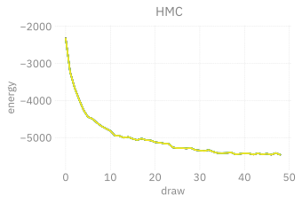


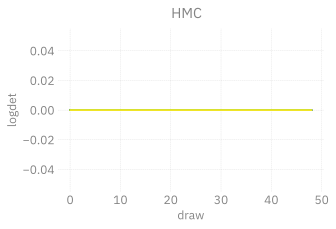


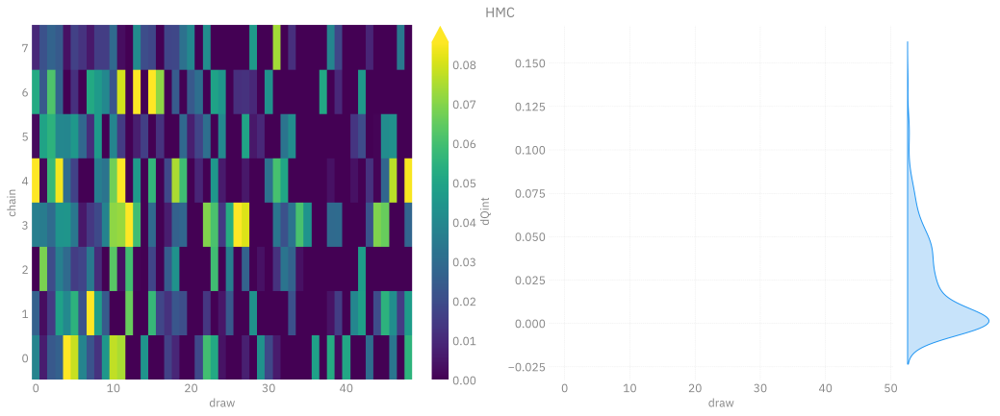


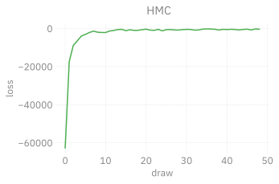

</div>

</details>

``` python
xhmc = ptExpSU3.trainer.dynamics.unflatten(xhmc)
print(f"checkSU(x_eval): {g.checkSU(xhmc)}")
print(f"checkSU(x_eval): {g.checkSU(g.projectSU(xhmc))}")
```

<details closed>

<summary>

Output:
</summary>

<div class="cell-output cell-output-display">

<pre style="white-space:pre;overflow-x:auto;line-height:normal;font-family: monospace"><span style="color: var(--bs-purple); text-decoration-color: var(--bs-purple); font-weight: bold">checkSU</span><span style="font-weight: bold">(</span>x_eval<span style="font-weight: bold">)</span>: <span style="font-weight: bold">(</span>tensor<span style="font-weight: bold">[</span><span style="color: #008080; text-decoration-color: #008080; font-weight: bold">8</span><span style="font-weight: bold">]</span> f64 x∈<span style="font-weight: bold">[</span><span style="color: #008080; text-decoration-color: #008080; font-weight: bold">2.314e-16</span>, <span style="color: #008080; text-decoration-color: #008080; font-weight: bold">5.581e-16</span><span style="font-weight: bold">]</span> <span style="color: #808000; text-decoration-color: #808000">μ</span>=<span style="color: #008080; text-decoration-color: #008080; font-weight: bold">3.985e-16</span> <span style="color: #808000; text-decoration-color: #808000">σ</span>=<span style="color: #008080; text-decoration-color: #008080; font-weight: bold">1.437e-16</span> <span style="font-weight: bold">[</span><span style="color: #008080; text-decoration-color: #008080; font-weight: bold">5.220e-16</span>, <span style="color: #008080; text-decoration-color: #008080; font-weight: bold">5.581e-16</span>, <span style="color: #008080; text-decoration-color: #008080; font-weight: bold">2.338e-16</span>,
<span style="color: #008080; text-decoration-color: #008080; font-weight: bold">5.152e-16</span>, <span style="color: #008080; text-decoration-color: #008080; font-weight: bold">5.239e-16</span>, <span style="color: #008080; text-decoration-color: #008080; font-weight: bold">2.825e-16</span>, <span style="color: #008080; text-decoration-color: #008080; font-weight: bold">2.314e-16</span>, <span style="color: #008080; text-decoration-color: #008080; font-weight: bold">3.214e-16</span><span style="font-weight: bold">]</span>, tensor<span style="font-weight: bold">[</span><span style="color: #008080; text-decoration-color: #008080; font-weight: bold">8</span><span style="font-weight: bold">]</span> f64 x∈<span style="font-weight: bold">[</span><span style="color: #008080; text-decoration-color: #008080; font-weight: bold">6.633e-16</span>, <span style="color: #008080; text-decoration-color: #008080; font-weight: bold">1.660e-15</span><span style="font-weight: bold">]</span> <span style="color: #808000; text-decoration-color: #808000">μ</span>=<span style="color: #008080; text-decoration-color: #008080; font-weight: bold">1.198e-15</span>
<span style="color: #808000; text-decoration-color: #808000">σ</span>=<span style="color: #008080; text-decoration-color: #008080; font-weight: bold">3.983e-16</span> <span style="font-weight: bold">[</span><span style="color: #008080; text-decoration-color: #008080; font-weight: bold">1.438e-15</span>, <span style="color: #008080; text-decoration-color: #008080; font-weight: bold">1.657e-15</span>, <span style="color: #008080; text-decoration-color: #008080; font-weight: bold">6.633e-16</span>, <span style="color: #008080; text-decoration-color: #008080; font-weight: bold">1.660e-15</span>, <span style="color: #008080; text-decoration-color: #008080; font-weight: bold">1.449e-15</span>, <span style="color: #008080; text-decoration-color: #008080; font-weight: bold">8.822e-16</span>, <span style="color: #008080; text-decoration-color: #008080; font-weight: bold">8.161e-16</span>, <span style="color: #008080; text-decoration-color: #008080; font-weight: bold">1.014e-15</span><span style="font-weight: bold">])</span>
</pre>

<pre style="white-space:pre;overflow-x:auto;line-height:normal;font-family: monospace"><span style="color: var(--bs-purple); text-decoration-color: var(--bs-purple); font-weight: bold">checkSU</span><span style="font-weight: bold">(</span>x_eval<span style="font-weight: bold">)</span>: <span style="font-weight: bold">(</span>tensor<span style="font-weight: bold">[</span><span style="color: #008080; text-decoration-color: #008080; font-weight: bold">8</span><span style="font-weight: bold">]</span> f64 x∈<span style="font-weight: bold">[</span><span style="color: #008080; text-decoration-color: #008080; font-weight: bold">2.099e-16</span>, <span style="color: #008080; text-decoration-color: #008080; font-weight: bold">3.202e-16</span><span style="font-weight: bold">]</span> <span style="color: #808000; text-decoration-color: #808000">μ</span>=<span style="color: #008080; text-decoration-color: #008080; font-weight: bold">2.785e-16</span> <span style="color: #808000; text-decoration-color: #808000">σ</span>=<span style="color: #008080; text-decoration-color: #008080; font-weight: bold">4.123e-17</span> <span style="font-weight: bold">[</span><span style="color: #008080; text-decoration-color: #008080; font-weight: bold">3.078e-16</span>, <span style="color: #008080; text-decoration-color: #008080; font-weight: bold">3.202e-16</span>, <span style="color: #008080; text-decoration-color: #008080; font-weight: bold">2.099e-16</span>,
<span style="color: #008080; text-decoration-color: #008080; font-weight: bold">3.114e-16</span>, <span style="color: #008080; text-decoration-color: #008080; font-weight: bold">3.049e-16</span>, <span style="color: #008080; text-decoration-color: #008080; font-weight: bold">2.593e-16</span>, <span style="color: #008080; text-decoration-color: #008080; font-weight: bold">2.294e-16</span>, <span style="color: #008080; text-decoration-color: #008080; font-weight: bold">2.850e-16</span><span style="font-weight: bold">]</span>, tensor<span style="font-weight: bold">[</span><span style="color: #008080; text-decoration-color: #008080; font-weight: bold">8</span><span style="font-weight: bold">]</span> f64 x∈<span style="font-weight: bold">[</span><span style="color: #008080; text-decoration-color: #008080; font-weight: bold">7.639e-16</span>, <span style="color: #008080; text-decoration-color: #008080; font-weight: bold">9.703e-16</span><span style="font-weight: bold">]</span> <span style="color: #808000; text-decoration-color: #808000">μ</span>=<span style="color: #008080; text-decoration-color: #008080; font-weight: bold">8.714e-16</span>
<span style="color: #808000; text-decoration-color: #808000">σ</span>=<span style="color: #008080; text-decoration-color: #008080; font-weight: bold">8.022e-17</span> <span style="font-weight: bold">[</span><span style="color: #008080; text-decoration-color: #008080; font-weight: bold">9.119e-16</span>, <span style="color: #008080; text-decoration-color: #008080; font-weight: bold">9.703e-16</span>, <span style="color: #008080; text-decoration-color: #008080; font-weight: bold">7.805e-16</span>, <span style="color: #008080; text-decoration-color: #008080; font-weight: bold">9.469e-16</span>, <span style="color: #008080; text-decoration-color: #008080; font-weight: bold">9.134e-16</span>, <span style="color: #008080; text-decoration-color: #008080; font-weight: bold">7.639e-16</span>, <span style="color: #008080; text-decoration-color: #008080; font-weight: bold">7.940e-16</span>, <span style="color: #008080; text-decoration-color: #008080; font-weight: bold">8.903e-16</span><span style="font-weight: bold">])</span>
</pre>

</div>

</details>

## Training

``` python
import time
from l2hmc.utils.history import BaseHistory, summarize_dict

history_train = BaseHistory()
x = state.x
for step in range(100):
# log.info(f'HMC STEP: {step}')
tic = time.perf_counter()
x, metrics_ = ptExpSU3.trainer.train_step(
    (x, state.beta)
)
toc = time.perf_counter()
metrics = {
    'train_step': step,
    'dt': toc - tic,
    **metrics_,
}
if step % 5 == 0:
    avgs = history_train.update(metrics)
    summary = summarize_dict(avgs)
    logger.info(summary)
```

<details closed>

<summary>

Output:
</summary>

<div class="cell-output cell-output-display">

<pre style="white-space:pre;overflow-x:auto;line-height:normal;font-family: monospace"><span style="color: #838383; text-decoration-color: #838383">[</span><span style="color: #838383; text-decoration-color: #838383">2025-04-30 </span><span style="color: #808080; text-decoration-color: #808080">15:45:44</span><span style="color: #838383; text-decoration-color: #838383">][</span><span style="color: var(--bs-green); text-decoration-color: var(--bs-green); font-weight: bold">I</span><span style="color: #838383; text-decoration-color: #838383">][</span><span style="color: #008080; text-decoration-color: #008080; font-style: italic">ipykernel_24193</span><span style="color: #838383; text-decoration-color: #838383">/</span><span style="color: var(--bs-blue); text-decoration-color: var(--bs-blue)">30352159</span><span style="color: #0000ff; text-decoration-color: #0000ff">:</span><span style="color: #838383; text-decoration-color: #838383">21</span><span style="color: #0000ff; text-decoration-color: #0000ff">:</span><span style="color: #14AC3C; text-decoration-color: #14AC3C; font-style: italic">ezpz.log</span><span style="color: #838383; text-decoration-color: #838383">]</span><span style="color: #838383; text-decoration-color: #838383"> </span><span style="color: #0000ff; text-decoration-color: #0000ff; font-style: italic">train_step</span>=<span style="color: #ff00ff; text-decoration-color: #ff00ff">0</span> <span style="color: #0000ff; text-decoration-color: #0000ff; font-style: italic">dt</span>=<span style="color: #ff00ff; text-decoration-color: #ff00ff">1.577</span> <span style="color: #0000ff; text-decoration-color: #0000ff; font-style: italic">energy</span>=<span style="color: #ff00ff; text-decoration-color: #ff00ff">33.403</span> <span style="color: #0000ff; text-decoration-color: #0000ff; font-style: italic">logprob</span>=<span style="color: #ff00ff; text-decoration-color: #ff00ff">33.488</span> <span style="color: #0000ff; text-decoration-color: #0000ff; font-style: italic">logdet</span>=<span style="color: #ff00ff; text-decoration-color: #ff00ff">-0.085</span> <span style="color: #0000ff; text-decoration-color: #0000ff; font-style: italic">sldf</span>=<span style="color: #ff00ff; text-decoration-color: #ff00ff">-0.065</span> <span style="color: #0000ff; text-decoration-color: #0000ff; font-style: italic">sldb</span>=<span style="color: #ff00ff; text-decoration-color: #ff00ff">0.086</span> <span style="color: #0000ff; text-decoration-color: #0000ff; font-style: italic">sld</span>=<span style="color: #ff00ff; text-decoration-color: #ff00ff">-0.085</span> <span style="color: #0000ff; text-decoration-color: #0000ff; font-style: italic">xeps</span>=<span style="color: #ff00ff; text-decoration-color: #ff00ff">0.010</span> <span style="color: #0000ff; text-decoration-color: #0000ff; font-style: italic">veps</span>=<span style="color: #ff00ff; text-decoration-color: #ff00ff">0.010</span> <span style="color: #0000ff; text-decoration-color: #0000ff; font-style: italic">acc</span>=<span style="color: #ff00ff; text-decoration-color: #ff00ff">0.131</span> <span style="color: #0000ff; text-decoration-color: #0000ff; font-style: italic">sumlogdet</span>=<span style="color: #ff00ff; text-decoration-color: #ff00ff">0.000</span> <span style="color: #0000ff; text-decoration-color: #0000ff; font-style: italic">beta</span>=<span style="color: #ff00ff; text-decoration-color: #ff00ff">6.000</span> <span style="color: #0000ff; text-decoration-color: #0000ff; font-style: italic">acc_mask</span>=<span style="color: #ff00ff; text-decoration-color: #ff00ff">0.000</span> <span style="color: #0000ff; text-decoration-color: #0000ff; font-style: italic">loss</span>=<span style="color: #ff00ff; text-decoration-color: #ff00ff">88.118</span> <span style="color: #0000ff; text-decoration-color: #0000ff; font-style: italic">plaqs</span>=<span style="color: #ff00ff; text-decoration-color: #ff00ff">-0.004</span> <span style="color: #0000ff; text-decoration-color: #0000ff; font-style: italic">sinQ</span>=<span style="color: #ff00ff; text-decoration-color: #ff00ff">-0.002</span> <span style="color: #0000ff; text-decoration-color: #0000ff; font-style: italic">intQ</span>=<span style="color: #ff00ff; text-decoration-color: #ff00ff">-0.026</span> <span style="color: #0000ff; text-decoration-color: #0000ff; font-style: italic">dQint</span>=<span style="color: #ff00ff; text-decoration-color: #ff00ff">0.000</span> <span style="color: #0000ff; text-decoration-color: #0000ff; font-style: italic">dQsin</span>=<span style="color: #ff00ff; text-decoration-color: #ff00ff">0.000</span>
</pre>

<pre style="white-space:pre;overflow-x:auto;line-height:normal;font-family: monospace"><span style="color: #838383; text-decoration-color: #838383">[</span><span style="color: #838383; text-decoration-color: #838383">2025-04-30 </span><span style="color: #808080; text-decoration-color: #808080">15:45:51</span><span style="color: #838383; text-decoration-color: #838383">][</span><span style="color: var(--bs-green); text-decoration-color: var(--bs-green); font-weight: bold">I</span><span style="color: #838383; text-decoration-color: #838383">][</span><span style="color: #008080; text-decoration-color: #008080; font-style: italic">ipykernel_24193</span><span style="color: #838383; text-decoration-color: #838383">/</span><span style="color: var(--bs-blue); text-decoration-color: var(--bs-blue)">30352159</span><span style="color: #0000ff; text-decoration-color: #0000ff">:</span><span style="color: #838383; text-decoration-color: #838383">21</span><span style="color: #0000ff; text-decoration-color: #0000ff">:</span><span style="color: #14AC3C; text-decoration-color: #14AC3C; font-style: italic">ezpz.log</span><span style="color: #838383; text-decoration-color: #838383">]</span><span style="color: #838383; text-decoration-color: #838383"> </span><span style="color: #0000ff; text-decoration-color: #0000ff; font-style: italic">train_step</span>=<span style="color: #ff00ff; text-decoration-color: #ff00ff">5</span> <span style="color: #0000ff; text-decoration-color: #0000ff; font-style: italic">dt</span>=<span style="color: #ff00ff; text-decoration-color: #ff00ff">1.256</span> <span style="color: #0000ff; text-decoration-color: #0000ff; font-style: italic">energy</span>=<span style="color: #ff00ff; text-decoration-color: #ff00ff">-372.669</span> <span style="color: #0000ff; text-decoration-color: #0000ff; font-style: italic">logprob</span>=<span style="color: #ff00ff; text-decoration-color: #ff00ff">-372.955</span> <span style="color: #0000ff; text-decoration-color: #0000ff; font-style: italic">logdet</span>=<span style="color: #ff00ff; text-decoration-color: #ff00ff">0.285</span> <span style="color: #0000ff; text-decoration-color: #0000ff; font-style: italic">sldf</span>=<span style="color: #ff00ff; text-decoration-color: #ff00ff">0.191</span> <span style="color: #0000ff; text-decoration-color: #0000ff; font-style: italic">sldb</span>=<span style="color: #ff00ff; text-decoration-color: #ff00ff">-0.217</span> <span style="color: #0000ff; text-decoration-color: #0000ff; font-style: italic">sld</span>=<span style="color: #ff00ff; text-decoration-color: #ff00ff">0.285</span> <span style="color: #0000ff; text-decoration-color: #0000ff; font-style: italic">xeps</span>=<span style="color: #ff00ff; text-decoration-color: #ff00ff">0.010</span> <span style="color: #0000ff; text-decoration-color: #0000ff; font-style: italic">veps</span>=<span style="color: #ff00ff; text-decoration-color: #ff00ff">0.010</span> <span style="color: #0000ff; text-decoration-color: #0000ff; font-style: italic">acc</span>=<span style="color: #ff00ff; text-decoration-color: #ff00ff">1.000</span> <span style="color: #0000ff; text-decoration-color: #0000ff; font-style: italic">sumlogdet</span>=<span style="color: #ff00ff; text-decoration-color: #ff00ff">-0.091</span> <span style="color: #0000ff; text-decoration-color: #0000ff; font-style: italic">beta</span>=<span style="color: #ff00ff; text-decoration-color: #ff00ff">6.000</span> <span style="color: #0000ff; text-decoration-color: #0000ff; font-style: italic">acc_mask</span>=<span style="color: #ff00ff; text-decoration-color: #ff00ff">1.000</span> <span style="color: #0000ff; text-decoration-color: #0000ff; font-style: italic">loss</span>=<span style="color: #ff00ff; text-decoration-color: #ff00ff">-647.866</span> <span style="color: #0000ff; text-decoration-color: #0000ff; font-style: italic">plaqs</span>=<span style="color: #ff00ff; text-decoration-color: #ff00ff">0.038</span> <span style="color: #0000ff; text-decoration-color: #0000ff; font-style: italic">sinQ</span>=<span style="color: #ff00ff; text-decoration-color: #ff00ff">-0.002</span> <span style="color: #0000ff; text-decoration-color: #0000ff; font-style: italic">intQ</span>=<span style="color: #ff00ff; text-decoration-color: #ff00ff">-0.034</span> <span style="color: #0000ff; text-decoration-color: #0000ff; font-style: italic">dQint</span>=<span style="color: #ff00ff; text-decoration-color: #ff00ff">0.009</span> <span style="color: #0000ff; text-decoration-color: #0000ff; font-style: italic">dQsin</span>=<span style="color: #ff00ff; text-decoration-color: #ff00ff">0.001</span>
</pre>

<pre style="white-space:pre;overflow-x:auto;line-height:normal;font-family: monospace"><span style="color: #838383; text-decoration-color: #838383">[</span><span style="color: #838383; text-decoration-color: #838383">2025-04-30 </span><span style="color: #808080; text-decoration-color: #808080">15:45:58</span><span style="color: #838383; text-decoration-color: #838383">][</span><span style="color: var(--bs-green); text-decoration-color: var(--bs-green); font-weight: bold">I</span><span style="color: #838383; text-decoration-color: #838383">][</span><span style="color: #008080; text-decoration-color: #008080; font-style: italic">ipykernel_24193</span><span style="color: #838383; text-decoration-color: #838383">/</span><span style="color: var(--bs-blue); text-decoration-color: var(--bs-blue)">30352159</span><span style="color: #0000ff; text-decoration-color: #0000ff">:</span><span style="color: #838383; text-decoration-color: #838383">21</span><span style="color: #0000ff; text-decoration-color: #0000ff">:</span><span style="color: #14AC3C; text-decoration-color: #14AC3C; font-style: italic">ezpz.log</span><span style="color: #838383; text-decoration-color: #838383">]</span><span style="color: #838383; text-decoration-color: #838383"> </span><span style="color: #0000ff; text-decoration-color: #0000ff; font-style: italic">train_step</span>=<span style="color: #ff00ff; text-decoration-color: #ff00ff">10</span> <span style="color: #0000ff; text-decoration-color: #0000ff; font-style: italic">dt</span>=<span style="color: #ff00ff; text-decoration-color: #ff00ff">1.308</span> <span style="color: #0000ff; text-decoration-color: #0000ff; font-style: italic">energy</span>=<span style="color: #ff00ff; text-decoration-color: #ff00ff">-780.851</span> <span style="color: #0000ff; text-decoration-color: #0000ff; font-style: italic">logprob</span>=<span style="color: #ff00ff; text-decoration-color: #ff00ff">-781.247</span> <span style="color: #0000ff; text-decoration-color: #0000ff; font-style: italic">logdet</span>=<span style="color: #ff00ff; text-decoration-color: #ff00ff">0.396</span> <span style="color: #0000ff; text-decoration-color: #0000ff; font-style: italic">sldf</span>=<span style="color: #ff00ff; text-decoration-color: #ff00ff">0.254</span> <span style="color: #0000ff; text-decoration-color: #0000ff; font-style: italic">sldb</span>=<span style="color: #ff00ff; text-decoration-color: #ff00ff">-0.276</span> <span style="color: #0000ff; text-decoration-color: #0000ff; font-style: italic">sld</span>=<span style="color: #ff00ff; text-decoration-color: #ff00ff">0.396</span> <span style="color: #0000ff; text-decoration-color: #0000ff; font-style: italic">xeps</span>=<span style="color: #ff00ff; text-decoration-color: #ff00ff">0.011</span> <span style="color: #0000ff; text-decoration-color: #0000ff; font-style: italic">veps</span>=<span style="color: #ff00ff; text-decoration-color: #ff00ff">0.010</span> <span style="color: #0000ff; text-decoration-color: #0000ff; font-style: italic">acc</span>=<span style="color: #ff00ff; text-decoration-color: #ff00ff">0.952</span> <span style="color: #0000ff; text-decoration-color: #0000ff; font-style: italic">sumlogdet</span>=<span style="color: #ff00ff; text-decoration-color: #ff00ff">-0.044</span> <span style="color: #0000ff; text-decoration-color: #0000ff; font-style: italic">beta</span>=<span style="color: #ff00ff; text-decoration-color: #ff00ff">6.000</span> <span style="color: #0000ff; text-decoration-color: #0000ff; font-style: italic">acc_mask</span>=<span style="color: #ff00ff; text-decoration-color: #ff00ff">1.000</span> <span style="color: #0000ff; text-decoration-color: #0000ff; font-style: italic">loss</span>=<span style="color: #ff00ff; text-decoration-color: #ff00ff">-538.541</span> <span style="color: #0000ff; text-decoration-color: #0000ff; font-style: italic">plaqs</span>=<span style="color: #ff00ff; text-decoration-color: #ff00ff">0.088</span> <span style="color: #0000ff; text-decoration-color: #0000ff; font-style: italic">sinQ</span>=<span style="color: #ff00ff; text-decoration-color: #ff00ff">-0.002</span> <span style="color: #0000ff; text-decoration-color: #0000ff; font-style: italic">intQ</span>=<span style="color: #ff00ff; text-decoration-color: #ff00ff">-0.036</span> <span style="color: #0000ff; text-decoration-color: #0000ff; font-style: italic">dQint</span>=<span style="color: #ff00ff; text-decoration-color: #ff00ff">0.017</span> <span style="color: #0000ff; text-decoration-color: #0000ff; font-style: italic">dQsin</span>=<span style="color: #ff00ff; text-decoration-color: #ff00ff">0.001</span>
</pre>

<pre style="white-space:pre;overflow-x:auto;line-height:normal;font-family: monospace"><span style="color: #838383; text-decoration-color: #838383">[</span><span style="color: #838383; text-decoration-color: #838383">2025-04-30 </span><span style="color: #808080; text-decoration-color: #808080">15:46:05</span><span style="color: #838383; text-decoration-color: #838383">][</span><span style="color: var(--bs-green); text-decoration-color: var(--bs-green); font-weight: bold">I</span><span style="color: #838383; text-decoration-color: #838383">][</span><span style="color: #008080; text-decoration-color: #008080; font-style: italic">ipykernel_24193</span><span style="color: #838383; text-decoration-color: #838383">/</span><span style="color: var(--bs-blue); text-decoration-color: var(--bs-blue)">30352159</span><span style="color: #0000ff; text-decoration-color: #0000ff">:</span><span style="color: #838383; text-decoration-color: #838383">21</span><span style="color: #0000ff; text-decoration-color: #0000ff">:</span><span style="color: #14AC3C; text-decoration-color: #14AC3C; font-style: italic">ezpz.log</span><span style="color: #838383; text-decoration-color: #838383">]</span><span style="color: #838383; text-decoration-color: #838383"> </span><span style="color: #0000ff; text-decoration-color: #0000ff; font-style: italic">train_step</span>=<span style="color: #ff00ff; text-decoration-color: #ff00ff">15</span> <span style="color: #0000ff; text-decoration-color: #0000ff; font-style: italic">dt</span>=<span style="color: #ff00ff; text-decoration-color: #ff00ff">1.487</span> <span style="color: #0000ff; text-decoration-color: #0000ff; font-style: italic">energy</span>=<span style="color: #ff00ff; text-decoration-color: #ff00ff">-1234.642</span> <span style="color: #0000ff; text-decoration-color: #0000ff; font-style: italic">logprob</span>=<span style="color: #ff00ff; text-decoration-color: #ff00ff">-1235.128</span> <span style="color: #0000ff; text-decoration-color: #0000ff; font-style: italic">logdet</span>=<span style="color: #ff00ff; text-decoration-color: #ff00ff">0.486</span> <span style="color: #0000ff; text-decoration-color: #0000ff; font-style: italic">sldf</span>=<span style="color: #ff00ff; text-decoration-color: #ff00ff">0.303</span> <span style="color: #0000ff; text-decoration-color: #0000ff; font-style: italic">sldb</span>=<span style="color: #ff00ff; text-decoration-color: #ff00ff">-0.298</span> <span style="color: #0000ff; text-decoration-color: #0000ff; font-style: italic">sld</span>=<span style="color: #ff00ff; text-decoration-color: #ff00ff">0.486</span> <span style="color: #0000ff; text-decoration-color: #0000ff; font-style: italic">xeps</span>=<span style="color: #ff00ff; text-decoration-color: #ff00ff">0.011</span> <span style="color: #0000ff; text-decoration-color: #0000ff; font-style: italic">veps</span>=<span style="color: #ff00ff; text-decoration-color: #ff00ff">0.010</span> <span style="color: #0000ff; text-decoration-color: #0000ff; font-style: italic">acc</span>=<span style="color: #ff00ff; text-decoration-color: #ff00ff">1.000</span> <span style="color: #0000ff; text-decoration-color: #0000ff; font-style: italic">sumlogdet</span>=<span style="color: #ff00ff; text-decoration-color: #ff00ff">0.011</span> <span style="color: #0000ff; text-decoration-color: #0000ff; font-style: italic">beta</span>=<span style="color: #ff00ff; text-decoration-color: #ff00ff">6.000</span> <span style="color: #0000ff; text-decoration-color: #0000ff; font-style: italic">acc_mask</span>=<span style="color: #ff00ff; text-decoration-color: #ff00ff">1.000</span> <span style="color: #0000ff; text-decoration-color: #0000ff; font-style: italic">loss</span>=<span style="color: #ff00ff; text-decoration-color: #ff00ff">-617.539</span> <span style="color: #0000ff; text-decoration-color: #0000ff; font-style: italic">plaqs</span>=<span style="color: #ff00ff; text-decoration-color: #ff00ff">0.134</span> <span style="color: #0000ff; text-decoration-color: #0000ff; font-style: italic">sinQ</span>=<span style="color: #ff00ff; text-decoration-color: #ff00ff">-0.003</span> <span style="color: #0000ff; text-decoration-color: #0000ff; font-style: italic">intQ</span>=<span style="color: #ff00ff; text-decoration-color: #ff00ff">-0.038</span> <span style="color: #0000ff; text-decoration-color: #0000ff; font-style: italic">dQint</span>=<span style="color: #ff00ff; text-decoration-color: #ff00ff">0.022</span> <span style="color: #0000ff; text-decoration-color: #0000ff; font-style: italic">dQsin</span>=<span style="color: #ff00ff; text-decoration-color: #ff00ff">0.002</span>
</pre>

<pre style="white-space:pre;overflow-x:auto;line-height:normal;font-family: monospace"><span style="color: #838383; text-decoration-color: #838383">[</span><span style="color: #838383; text-decoration-color: #838383">2025-04-30 </span><span style="color: #808080; text-decoration-color: #808080">15:46:13</span><span style="color: #838383; text-decoration-color: #838383">][</span><span style="color: var(--bs-green); text-decoration-color: var(--bs-green); font-weight: bold">I</span><span style="color: #838383; text-decoration-color: #838383">][</span><span style="color: #008080; text-decoration-color: #008080; font-style: italic">ipykernel_24193</span><span style="color: #838383; text-decoration-color: #838383">/</span><span style="color: var(--bs-blue); text-decoration-color: var(--bs-blue)">30352159</span><span style="color: #0000ff; text-decoration-color: #0000ff">:</span><span style="color: #838383; text-decoration-color: #838383">21</span><span style="color: #0000ff; text-decoration-color: #0000ff">:</span><span style="color: #14AC3C; text-decoration-color: #14AC3C; font-style: italic">ezpz.log</span><span style="color: #838383; text-decoration-color: #838383">]</span><span style="color: #838383; text-decoration-color: #838383"> </span><span style="color: #0000ff; text-decoration-color: #0000ff; font-style: italic">train_step</span>=<span style="color: #ff00ff; text-decoration-color: #ff00ff">20</span> <span style="color: #0000ff; text-decoration-color: #0000ff; font-style: italic">dt</span>=<span style="color: #ff00ff; text-decoration-color: #ff00ff">1.424</span> <span style="color: #0000ff; text-decoration-color: #0000ff; font-style: italic">energy</span>=<span style="color: #ff00ff; text-decoration-color: #ff00ff">-1559.334</span> <span style="color: #0000ff; text-decoration-color: #0000ff; font-style: italic">logprob</span>=<span style="color: #ff00ff; text-decoration-color: #ff00ff">-1559.934</span> <span style="color: #0000ff; text-decoration-color: #0000ff; font-style: italic">logdet</span>=<span style="color: #ff00ff; text-decoration-color: #ff00ff">0.600</span> <span style="color: #0000ff; text-decoration-color: #0000ff; font-style: italic">sldf</span>=<span style="color: #ff00ff; text-decoration-color: #ff00ff">0.370</span> <span style="color: #0000ff; text-decoration-color: #0000ff; font-style: italic">sldb</span>=<span style="color: #ff00ff; text-decoration-color: #ff00ff">-0.363</span> <span style="color: #0000ff; text-decoration-color: #0000ff; font-style: italic">sld</span>=<span style="color: #ff00ff; text-decoration-color: #ff00ff">0.600</span> <span style="color: #0000ff; text-decoration-color: #0000ff; font-style: italic">xeps</span>=<span style="color: #ff00ff; text-decoration-color: #ff00ff">0.012</span> <span style="color: #0000ff; text-decoration-color: #0000ff; font-style: italic">veps</span>=<span style="color: #ff00ff; text-decoration-color: #ff00ff">0.010</span> <span style="color: #0000ff; text-decoration-color: #0000ff; font-style: italic">acc</span>=<span style="color: #ff00ff; text-decoration-color: #ff00ff">1.000</span> <span style="color: #0000ff; text-decoration-color: #0000ff; font-style: italic">sumlogdet</span>=<span style="color: #ff00ff; text-decoration-color: #ff00ff">0.029</span> <span style="color: #0000ff; text-decoration-color: #0000ff; font-style: italic">beta</span>=<span style="color: #ff00ff; text-decoration-color: #ff00ff">6.000</span> <span style="color: #0000ff; text-decoration-color: #0000ff; font-style: italic">acc_mask</span>=<span style="color: #ff00ff; text-decoration-color: #ff00ff">1.000</span> <span style="color: #0000ff; text-decoration-color: #0000ff; font-style: italic">loss</span>=<span style="color: #ff00ff; text-decoration-color: #ff00ff">-450.278</span> <span style="color: #0000ff; text-decoration-color: #0000ff; font-style: italic">plaqs</span>=<span style="color: #ff00ff; text-decoration-color: #ff00ff">0.169</span> <span style="color: #0000ff; text-decoration-color: #0000ff; font-style: italic">sinQ</span>=<span style="color: #ff00ff; text-decoration-color: #ff00ff">0.000</span> <span style="color: #0000ff; text-decoration-color: #0000ff; font-style: italic">intQ</span>=<span style="color: #ff00ff; text-decoration-color: #ff00ff">0.005</span> <span style="color: #0000ff; text-decoration-color: #0000ff; font-style: italic">dQint</span>=<span style="color: #ff00ff; text-decoration-color: #ff00ff">0.016</span> <span style="color: #0000ff; text-decoration-color: #0000ff; font-style: italic">dQsin</span>=<span style="color: #ff00ff; text-decoration-color: #ff00ff">0.001</span>
</pre>

<pre style="white-space:pre;overflow-x:auto;line-height:normal;font-family: monospace"><span style="color: #838383; text-decoration-color: #838383">[</span><span style="color: #838383; text-decoration-color: #838383">2025-04-30 </span><span style="color: #808080; text-decoration-color: #808080">15:46:20</span><span style="color: #838383; text-decoration-color: #838383">][</span><span style="color: var(--bs-green); text-decoration-color: var(--bs-green); font-weight: bold">I</span><span style="color: #838383; text-decoration-color: #838383">][</span><span style="color: #008080; text-decoration-color: #008080; font-style: italic">ipykernel_24193</span><span style="color: #838383; text-decoration-color: #838383">/</span><span style="color: var(--bs-blue); text-decoration-color: var(--bs-blue)">30352159</span><span style="color: #0000ff; text-decoration-color: #0000ff">:</span><span style="color: #838383; text-decoration-color: #838383">21</span><span style="color: #0000ff; text-decoration-color: #0000ff">:</span><span style="color: #14AC3C; text-decoration-color: #14AC3C; font-style: italic">ezpz.log</span><span style="color: #838383; text-decoration-color: #838383">]</span><span style="color: #838383; text-decoration-color: #838383"> </span><span style="color: #0000ff; text-decoration-color: #0000ff; font-style: italic">train_step</span>=<span style="color: #ff00ff; text-decoration-color: #ff00ff">25</span> <span style="color: #0000ff; text-decoration-color: #0000ff; font-style: italic">dt</span>=<span style="color: #ff00ff; text-decoration-color: #ff00ff">1.611</span> <span style="color: #0000ff; text-decoration-color: #0000ff; font-style: italic">energy</span>=<span style="color: #ff00ff; text-decoration-color: #ff00ff">-1901.485</span> <span style="color: #0000ff; text-decoration-color: #0000ff; font-style: italic">logprob</span>=<span style="color: #ff00ff; text-decoration-color: #ff00ff">-1902.100</span> <span style="color: #0000ff; text-decoration-color: #0000ff; font-style: italic">logdet</span>=<span style="color: #ff00ff; text-decoration-color: #ff00ff">0.615</span> <span style="color: #0000ff; text-decoration-color: #0000ff; font-style: italic">sldf</span>=<span style="color: #ff00ff; text-decoration-color: #ff00ff">0.383</span> <span style="color: #0000ff; text-decoration-color: #0000ff; font-style: italic">sldb</span>=<span style="color: #ff00ff; text-decoration-color: #ff00ff">-0.382</span> <span style="color: #0000ff; text-decoration-color: #0000ff; font-style: italic">sld</span>=<span style="color: #ff00ff; text-decoration-color: #ff00ff">0.615</span> <span style="color: #0000ff; text-decoration-color: #0000ff; font-style: italic">xeps</span>=<span style="color: #ff00ff; text-decoration-color: #ff00ff">0.012</span> <span style="color: #0000ff; text-decoration-color: #0000ff; font-style: italic">veps</span>=<span style="color: #ff00ff; text-decoration-color: #ff00ff">0.010</span> <span style="color: #0000ff; text-decoration-color: #0000ff; font-style: italic">acc</span>=<span style="color: #ff00ff; text-decoration-color: #ff00ff">0.766</span> <span style="color: #0000ff; text-decoration-color: #0000ff; font-style: italic">sumlogdet</span>=<span style="color: #ff00ff; text-decoration-color: #ff00ff">0.082</span> <span style="color: #0000ff; text-decoration-color: #0000ff; font-style: italic">beta</span>=<span style="color: #ff00ff; text-decoration-color: #ff00ff">6.000</span> <span style="color: #0000ff; text-decoration-color: #0000ff; font-style: italic">acc_mask</span>=<span style="color: #ff00ff; text-decoration-color: #ff00ff">0.625</span> <span style="color: #0000ff; text-decoration-color: #0000ff; font-style: italic">loss</span>=<span style="color: #ff00ff; text-decoration-color: #ff00ff">-306.696</span> <span style="color: #0000ff; text-decoration-color: #0000ff; font-style: italic">plaqs</span>=<span style="color: #ff00ff; text-decoration-color: #ff00ff">0.203</span> <span style="color: #0000ff; text-decoration-color: #0000ff; font-style: italic">sinQ</span>=<span style="color: #ff00ff; text-decoration-color: #ff00ff">-0.001</span> <span style="color: #0000ff; text-decoration-color: #0000ff; font-style: italic">intQ</span>=<span style="color: #ff00ff; text-decoration-color: #ff00ff">-0.018</span> <span style="color: #0000ff; text-decoration-color: #0000ff; font-style: italic">dQint</span>=<span style="color: #ff00ff; text-decoration-color: #ff00ff">0.013</span> <span style="color: #0000ff; text-decoration-color: #0000ff; font-style: italic">dQsin</span>=<span style="color: #ff00ff; text-decoration-color: #ff00ff">0.001</span>
</pre>

<pre style="white-space:pre;overflow-x:auto;line-height:normal;font-family: monospace"><span style="color: #838383; text-decoration-color: #838383">[</span><span style="color: #838383; text-decoration-color: #838383">2025-04-30 </span><span style="color: #808080; text-decoration-color: #808080">15:46:28</span><span style="color: #838383; text-decoration-color: #838383">][</span><span style="color: var(--bs-green); text-decoration-color: var(--bs-green); font-weight: bold">I</span><span style="color: #838383; text-decoration-color: #838383">][</span><span style="color: #008080; text-decoration-color: #008080; font-style: italic">ipykernel_24193</span><span style="color: #838383; text-decoration-color: #838383">/</span><span style="color: var(--bs-blue); text-decoration-color: var(--bs-blue)">30352159</span><span style="color: #0000ff; text-decoration-color: #0000ff">:</span><span style="color: #838383; text-decoration-color: #838383">21</span><span style="color: #0000ff; text-decoration-color: #0000ff">:</span><span style="color: #14AC3C; text-decoration-color: #14AC3C; font-style: italic">ezpz.log</span><span style="color: #838383; text-decoration-color: #838383">]</span><span style="color: #838383; text-decoration-color: #838383"> </span><span style="color: #0000ff; text-decoration-color: #0000ff; font-style: italic">train_step</span>=<span style="color: #ff00ff; text-decoration-color: #ff00ff">30</span> <span style="color: #0000ff; text-decoration-color: #0000ff; font-style: italic">dt</span>=<span style="color: #ff00ff; text-decoration-color: #ff00ff">1.358</span> <span style="color: #0000ff; text-decoration-color: #0000ff; font-style: italic">energy</span>=<span style="color: #ff00ff; text-decoration-color: #ff00ff">-2024.281</span> <span style="color: #0000ff; text-decoration-color: #0000ff; font-style: italic">logprob</span>=<span style="color: #ff00ff; text-decoration-color: #ff00ff">-2025.102</span> <span style="color: #0000ff; text-decoration-color: #0000ff; font-style: italic">logdet</span>=<span style="color: #ff00ff; text-decoration-color: #ff00ff">0.821</span> <span style="color: #0000ff; text-decoration-color: #0000ff; font-style: italic">sldf</span>=<span style="color: #ff00ff; text-decoration-color: #ff00ff">0.522</span> <span style="color: #0000ff; text-decoration-color: #0000ff; font-style: italic">sldb</span>=<span style="color: #ff00ff; text-decoration-color: #ff00ff">-0.530</span> <span style="color: #0000ff; text-decoration-color: #0000ff; font-style: italic">sld</span>=<span style="color: #ff00ff; text-decoration-color: #ff00ff">0.821</span> <span style="color: #0000ff; text-decoration-color: #0000ff; font-style: italic">xeps</span>=<span style="color: #ff00ff; text-decoration-color: #ff00ff">0.013</span> <span style="color: #0000ff; text-decoration-color: #0000ff; font-style: italic">veps</span>=<span style="color: #ff00ff; text-decoration-color: #ff00ff">0.010</span> <span style="color: #0000ff; text-decoration-color: #0000ff; font-style: italic">acc</span>=<span style="color: #ff00ff; text-decoration-color: #ff00ff">0.751</span> <span style="color: #0000ff; text-decoration-color: #0000ff; font-style: italic">sumlogdet</span>=<span style="color: #ff00ff; text-decoration-color: #ff00ff">-0.083</span> <span style="color: #0000ff; text-decoration-color: #0000ff; font-style: italic">beta</span>=<span style="color: #ff00ff; text-decoration-color: #ff00ff">6.000</span> <span style="color: #0000ff; text-decoration-color: #0000ff; font-style: italic">acc_mask</span>=<span style="color: #ff00ff; text-decoration-color: #ff00ff">0.750</span> <span style="color: #0000ff; text-decoration-color: #0000ff; font-style: italic">loss</span>=<span style="color: #ff00ff; text-decoration-color: #ff00ff">-136.896</span> <span style="color: #0000ff; text-decoration-color: #0000ff; font-style: italic">plaqs</span>=<span style="color: #ff00ff; text-decoration-color: #ff00ff">0.224</span> <span style="color: #0000ff; text-decoration-color: #0000ff; font-style: italic">sinQ</span>=<span style="color: #ff00ff; text-decoration-color: #ff00ff">0.001</span> <span style="color: #0000ff; text-decoration-color: #0000ff; font-style: italic">intQ</span>=<span style="color: #ff00ff; text-decoration-color: #ff00ff">0.016</span> <span style="color: #0000ff; text-decoration-color: #0000ff; font-style: italic">dQint</span>=<span style="color: #ff00ff; text-decoration-color: #ff00ff">0.012</span> <span style="color: #0000ff; text-decoration-color: #0000ff; font-style: italic">dQsin</span>=<span style="color: #ff00ff; text-decoration-color: #ff00ff">0.001</span>
</pre>

<pre style="white-space:pre;overflow-x:auto;line-height:normal;font-family: monospace"><span style="color: #838383; text-decoration-color: #838383">[</span><span style="color: #838383; text-decoration-color: #838383">2025-04-30 </span><span style="color: #808080; text-decoration-color: #808080">15:46:36</span><span style="color: #838383; text-decoration-color: #838383">][</span><span style="color: var(--bs-green); text-decoration-color: var(--bs-green); font-weight: bold">I</span><span style="color: #838383; text-decoration-color: #838383">][</span><span style="color: #008080; text-decoration-color: #008080; font-style: italic">ipykernel_24193</span><span style="color: #838383; text-decoration-color: #838383">/</span><span style="color: var(--bs-blue); text-decoration-color: var(--bs-blue)">30352159</span><span style="color: #0000ff; text-decoration-color: #0000ff">:</span><span style="color: #838383; text-decoration-color: #838383">21</span><span style="color: #0000ff; text-decoration-color: #0000ff">:</span><span style="color: #14AC3C; text-decoration-color: #14AC3C; font-style: italic">ezpz.log</span><span style="color: #838383; text-decoration-color: #838383">]</span><span style="color: #838383; text-decoration-color: #838383"> </span><span style="color: #0000ff; text-decoration-color: #0000ff; font-style: italic">train_step</span>=<span style="color: #ff00ff; text-decoration-color: #ff00ff">35</span> <span style="color: #0000ff; text-decoration-color: #0000ff; font-style: italic">dt</span>=<span style="color: #ff00ff; text-decoration-color: #ff00ff">1.532</span> <span style="color: #0000ff; text-decoration-color: #0000ff; font-style: italic">energy</span>=<span style="color: #ff00ff; text-decoration-color: #ff00ff">-2218.666</span> <span style="color: #0000ff; text-decoration-color: #0000ff; font-style: italic">logprob</span>=<span style="color: #ff00ff; text-decoration-color: #ff00ff">-2219.663</span> <span style="color: #0000ff; text-decoration-color: #0000ff; font-style: italic">logdet</span>=<span style="color: #ff00ff; text-decoration-color: #ff00ff">0.997</span> <span style="color: #0000ff; text-decoration-color: #0000ff; font-style: italic">sldf</span>=<span style="color: #ff00ff; text-decoration-color: #ff00ff">0.624</span> <span style="color: #0000ff; text-decoration-color: #0000ff; font-style: italic">sldb</span>=<span style="color: #ff00ff; text-decoration-color: #ff00ff">-0.624</span> <span style="color: #0000ff; text-decoration-color: #0000ff; font-style: italic">sld</span>=<span style="color: #ff00ff; text-decoration-color: #ff00ff">0.997</span> <span style="color: #0000ff; text-decoration-color: #0000ff; font-style: italic">xeps</span>=<span style="color: #ff00ff; text-decoration-color: #ff00ff">0.013</span> <span style="color: #0000ff; text-decoration-color: #0000ff; font-style: italic">veps</span>=<span style="color: #ff00ff; text-decoration-color: #ff00ff">0.011</span> <span style="color: #0000ff; text-decoration-color: #0000ff; font-style: italic">acc</span>=<span style="color: #ff00ff; text-decoration-color: #ff00ff">0.673</span> <span style="color: #0000ff; text-decoration-color: #0000ff; font-style: italic">sumlogdet</span>=<span style="color: #ff00ff; text-decoration-color: #ff00ff">0.001</span> <span style="color: #0000ff; text-decoration-color: #0000ff; font-style: italic">beta</span>=<span style="color: #ff00ff; text-decoration-color: #ff00ff">6.000</span> <span style="color: #0000ff; text-decoration-color: #0000ff; font-style: italic">acc_mask</span>=<span style="color: #ff00ff; text-decoration-color: #ff00ff">0.625</span> <span style="color: #0000ff; text-decoration-color: #0000ff; font-style: italic">loss</span>=<span style="color: #ff00ff; text-decoration-color: #ff00ff">-26.350</span> <span style="color: #0000ff; text-decoration-color: #0000ff; font-style: italic">plaqs</span>=<span style="color: #ff00ff; text-decoration-color: #ff00ff">0.242</span> <span style="color: #0000ff; text-decoration-color: #0000ff; font-style: italic">sinQ</span>=<span style="color: #ff00ff; text-decoration-color: #ff00ff">0.002</span> <span style="color: #0000ff; text-decoration-color: #0000ff; font-style: italic">intQ</span>=<span style="color: #ff00ff; text-decoration-color: #ff00ff">0.033</span> <span style="color: #0000ff; text-decoration-color: #0000ff; font-style: italic">dQint</span>=<span style="color: #ff00ff; text-decoration-color: #ff00ff">0.012</span> <span style="color: #0000ff; text-decoration-color: #0000ff; font-style: italic">dQsin</span>=<span style="color: #ff00ff; text-decoration-color: #ff00ff">0.001</span>
</pre>

<pre style="white-space:pre;overflow-x:auto;line-height:normal;font-family: monospace"><span style="color: #838383; text-decoration-color: #838383">[</span><span style="color: #838383; text-decoration-color: #838383">2025-04-30 </span><span style="color: #808080; text-decoration-color: #808080">15:46:44</span><span style="color: #838383; text-decoration-color: #838383">][</span><span style="color: var(--bs-green); text-decoration-color: var(--bs-green); font-weight: bold">I</span><span style="color: #838383; text-decoration-color: #838383">][</span><span style="color: #008080; text-decoration-color: #008080; font-style: italic">ipykernel_24193</span><span style="color: #838383; text-decoration-color: #838383">/</span><span style="color: var(--bs-blue); text-decoration-color: var(--bs-blue)">30352159</span><span style="color: #0000ff; text-decoration-color: #0000ff">:</span><span style="color: #838383; text-decoration-color: #838383">21</span><span style="color: #0000ff; text-decoration-color: #0000ff">:</span><span style="color: #14AC3C; text-decoration-color: #14AC3C; font-style: italic">ezpz.log</span><span style="color: #838383; text-decoration-color: #838383">]</span><span style="color: #838383; text-decoration-color: #838383"> </span><span style="color: #0000ff; text-decoration-color: #0000ff; font-style: italic">train_step</span>=<span style="color: #ff00ff; text-decoration-color: #ff00ff">40</span> <span style="color: #0000ff; text-decoration-color: #0000ff; font-style: italic">dt</span>=<span style="color: #ff00ff; text-decoration-color: #ff00ff">1.553</span> <span style="color: #0000ff; text-decoration-color: #0000ff; font-style: italic">energy</span>=<span style="color: #ff00ff; text-decoration-color: #ff00ff">-2388.089</span> <span style="color: #0000ff; text-decoration-color: #0000ff; font-style: italic">logprob</span>=<span style="color: #ff00ff; text-decoration-color: #ff00ff">-2389.183</span> <span style="color: #0000ff; text-decoration-color: #0000ff; font-style: italic">logdet</span>=<span style="color: #ff00ff; text-decoration-color: #ff00ff">1.093</span> <span style="color: #0000ff; text-decoration-color: #0000ff; font-style: italic">sldf</span>=<span style="color: #ff00ff; text-decoration-color: #ff00ff">0.706</span> <span style="color: #0000ff; text-decoration-color: #0000ff; font-style: italic">sldb</span>=<span style="color: #ff00ff; text-decoration-color: #ff00ff">-0.754</span> <span style="color: #0000ff; text-decoration-color: #0000ff; font-style: italic">sld</span>=<span style="color: #ff00ff; text-decoration-color: #ff00ff">1.093</span> <span style="color: #0000ff; text-decoration-color: #0000ff; font-style: italic">xeps</span>=<span style="color: #ff00ff; text-decoration-color: #ff00ff">0.013</span> <span style="color: #0000ff; text-decoration-color: #0000ff; font-style: italic">veps</span>=<span style="color: #ff00ff; text-decoration-color: #ff00ff">0.011</span> <span style="color: #0000ff; text-decoration-color: #0000ff; font-style: italic">acc</span>=<span style="color: #ff00ff; text-decoration-color: #ff00ff">0.386</span> <span style="color: #0000ff; text-decoration-color: #0000ff; font-style: italic">sumlogdet</span>=<span style="color: #ff00ff; text-decoration-color: #ff00ff">-0.040</span> <span style="color: #0000ff; text-decoration-color: #0000ff; font-style: italic">beta</span>=<span style="color: #ff00ff; text-decoration-color: #ff00ff">6.000</span> <span style="color: #0000ff; text-decoration-color: #0000ff; font-style: italic">acc_mask</span>=<span style="color: #ff00ff; text-decoration-color: #ff00ff">0.375</span> <span style="color: #0000ff; text-decoration-color: #0000ff; font-style: italic">loss</span>=<span style="color: #ff00ff; text-decoration-color: #ff00ff">239.300</span> <span style="color: #0000ff; text-decoration-color: #0000ff; font-style: italic">plaqs</span>=<span style="color: #ff00ff; text-decoration-color: #ff00ff">0.259</span> <span style="color: #0000ff; text-decoration-color: #0000ff; font-style: italic">sinQ</span>=<span style="color: #ff00ff; text-decoration-color: #ff00ff">0.002</span> <span style="color: #0000ff; text-decoration-color: #0000ff; font-style: italic">intQ</span>=<span style="color: #ff00ff; text-decoration-color: #ff00ff">0.029</span> <span style="color: #0000ff; text-decoration-color: #0000ff; font-style: italic">dQint</span>=<span style="color: #ff00ff; text-decoration-color: #ff00ff">0.012</span> <span style="color: #0000ff; text-decoration-color: #0000ff; font-style: italic">dQsin</span>=<span style="color: #ff00ff; text-decoration-color: #ff00ff">0.001</span>
</pre>

<pre style="white-space:pre;overflow-x:auto;line-height:normal;font-family: monospace"><span style="color: #838383; text-decoration-color: #838383">[</span><span style="color: #838383; text-decoration-color: #838383">2025-04-30 </span><span style="color: #808080; text-decoration-color: #808080">15:46:52</span><span style="color: #838383; text-decoration-color: #838383">][</span><span style="color: var(--bs-green); text-decoration-color: var(--bs-green); font-weight: bold">I</span><span style="color: #838383; text-decoration-color: #838383">][</span><span style="color: #008080; text-decoration-color: #008080; font-style: italic">ipykernel_24193</span><span style="color: #838383; text-decoration-color: #838383">/</span><span style="color: var(--bs-blue); text-decoration-color: var(--bs-blue)">30352159</span><span style="color: #0000ff; text-decoration-color: #0000ff">:</span><span style="color: #838383; text-decoration-color: #838383">21</span><span style="color: #0000ff; text-decoration-color: #0000ff">:</span><span style="color: #14AC3C; text-decoration-color: #14AC3C; font-style: italic">ezpz.log</span><span style="color: #838383; text-decoration-color: #838383">]</span><span style="color: #838383; text-decoration-color: #838383"> </span><span style="color: #0000ff; text-decoration-color: #0000ff; font-style: italic">train_step</span>=<span style="color: #ff00ff; text-decoration-color: #ff00ff">45</span> <span style="color: #0000ff; text-decoration-color: #0000ff; font-style: italic">dt</span>=<span style="color: #ff00ff; text-decoration-color: #ff00ff">1.609</span> <span style="color: #0000ff; text-decoration-color: #0000ff; font-style: italic">energy</span>=<span style="color: #ff00ff; text-decoration-color: #ff00ff">-2497.524</span> <span style="color: #0000ff; text-decoration-color: #0000ff; font-style: italic">logprob</span>=<span style="color: #ff00ff; text-decoration-color: #ff00ff">-2498.931</span> <span style="color: #0000ff; text-decoration-color: #0000ff; font-style: italic">logdet</span>=<span style="color: #ff00ff; text-decoration-color: #ff00ff">1.408</span> <span style="color: #0000ff; text-decoration-color: #0000ff; font-style: italic">sldf</span>=<span style="color: #ff00ff; text-decoration-color: #ff00ff">0.886</span> <span style="color: #0000ff; text-decoration-color: #0000ff; font-style: italic">sldb</span>=<span style="color: #ff00ff; text-decoration-color: #ff00ff">-0.906</span> <span style="color: #0000ff; text-decoration-color: #0000ff; font-style: italic">sld</span>=<span style="color: #ff00ff; text-decoration-color: #ff00ff">1.408</span> <span style="color: #0000ff; text-decoration-color: #0000ff; font-style: italic">xeps</span>=<span style="color: #ff00ff; text-decoration-color: #ff00ff">0.013</span> <span style="color: #0000ff; text-decoration-color: #0000ff; font-style: italic">veps</span>=<span style="color: #ff00ff; text-decoration-color: #ff00ff">0.011</span> <span style="color: #0000ff; text-decoration-color: #0000ff; font-style: italic">acc</span>=<span style="color: #ff00ff; text-decoration-color: #ff00ff">0.414</span> <span style="color: #0000ff; text-decoration-color: #0000ff; font-style: italic">sumlogdet</span>=<span style="color: #ff00ff; text-decoration-color: #ff00ff">0.014</span> <span style="color: #0000ff; text-decoration-color: #0000ff; font-style: italic">beta</span>=<span style="color: #ff00ff; text-decoration-color: #ff00ff">6.000</span> <span style="color: #0000ff; text-decoration-color: #0000ff; font-style: italic">acc_mask</span>=<span style="color: #ff00ff; text-decoration-color: #ff00ff">0.375</span> <span style="color: #0000ff; text-decoration-color: #0000ff; font-style: italic">loss</span>=<span style="color: #ff00ff; text-decoration-color: #ff00ff">76.319</span> <span style="color: #0000ff; text-decoration-color: #0000ff; font-style: italic">plaqs</span>=<span style="color: #ff00ff; text-decoration-color: #ff00ff">0.274</span> <span style="color: #0000ff; text-decoration-color: #0000ff; font-style: italic">sinQ</span>=<span style="color: #ff00ff; text-decoration-color: #ff00ff">0.002</span> <span style="color: #0000ff; text-decoration-color: #0000ff; font-style: italic">intQ</span>=<span style="color: #ff00ff; text-decoration-color: #ff00ff">0.026</span> <span style="color: #0000ff; text-decoration-color: #0000ff; font-style: italic">dQint</span>=<span style="color: #ff00ff; text-decoration-color: #ff00ff">0.003</span> <span style="color: #0000ff; text-decoration-color: #0000ff; font-style: italic">dQsin</span>=<span style="color: #ff00ff; text-decoration-color: #ff00ff">0.000</span>
</pre>

<pre style="white-space:pre;overflow-x:auto;line-height:normal;font-family: monospace"><span style="color: #838383; text-decoration-color: #838383">[</span><span style="color: #838383; text-decoration-color: #838383">2025-04-30 </span><span style="color: #808080; text-decoration-color: #808080">15:46:59</span><span style="color: #838383; text-decoration-color: #838383">][</span><span style="color: var(--bs-green); text-decoration-color: var(--bs-green); font-weight: bold">I</span><span style="color: #838383; text-decoration-color: #838383">][</span><span style="color: #008080; text-decoration-color: #008080; font-style: italic">ipykernel_24193</span><span style="color: #838383; text-decoration-color: #838383">/</span><span style="color: var(--bs-blue); text-decoration-color: var(--bs-blue)">30352159</span><span style="color: #0000ff; text-decoration-color: #0000ff">:</span><span style="color: #838383; text-decoration-color: #838383">21</span><span style="color: #0000ff; text-decoration-color: #0000ff">:</span><span style="color: #14AC3C; text-decoration-color: #14AC3C; font-style: italic">ezpz.log</span><span style="color: #838383; text-decoration-color: #838383">]</span><span style="color: #838383; text-decoration-color: #838383"> </span><span style="color: #0000ff; text-decoration-color: #0000ff; font-style: italic">train_step</span>=<span style="color: #ff00ff; text-decoration-color: #ff00ff">50</span> <span style="color: #0000ff; text-decoration-color: #0000ff; font-style: italic">dt</span>=<span style="color: #ff00ff; text-decoration-color: #ff00ff">1.623</span> <span style="color: #0000ff; text-decoration-color: #0000ff; font-style: italic">energy</span>=<span style="color: #ff00ff; text-decoration-color: #ff00ff">-2696.907</span> <span style="color: #0000ff; text-decoration-color: #0000ff; font-style: italic">logprob</span>=<span style="color: #ff00ff; text-decoration-color: #ff00ff">-2698.606</span> <span style="color: #0000ff; text-decoration-color: #0000ff; font-style: italic">logdet</span>=<span style="color: #ff00ff; text-decoration-color: #ff00ff">1.699</span> <span style="color: #0000ff; text-decoration-color: #0000ff; font-style: italic">sldf</span>=<span style="color: #ff00ff; text-decoration-color: #ff00ff">1.064</span> <span style="color: #0000ff; text-decoration-color: #0000ff; font-style: italic">sldb</span>=<span style="color: #ff00ff; text-decoration-color: #ff00ff">-1.083</span> <span style="color: #0000ff; text-decoration-color: #0000ff; font-style: italic">sld</span>=<span style="color: #ff00ff; text-decoration-color: #ff00ff">1.699</span> <span style="color: #0000ff; text-decoration-color: #0000ff; font-style: italic">xeps</span>=<span style="color: #ff00ff; text-decoration-color: #ff00ff">0.013</span> <span style="color: #0000ff; text-decoration-color: #0000ff; font-style: italic">veps</span>=<span style="color: #ff00ff; text-decoration-color: #ff00ff">0.012</span> <span style="color: #0000ff; text-decoration-color: #0000ff; font-style: italic">acc</span>=<span style="color: #ff00ff; text-decoration-color: #ff00ff">0.665</span> <span style="color: #0000ff; text-decoration-color: #0000ff; font-style: italic">sumlogdet</span>=<span style="color: #ff00ff; text-decoration-color: #ff00ff">0.006</span> <span style="color: #0000ff; text-decoration-color: #0000ff; font-style: italic">beta</span>=<span style="color: #ff00ff; text-decoration-color: #ff00ff">6.000</span> <span style="color: #0000ff; text-decoration-color: #0000ff; font-style: italic">acc_mask</span>=<span style="color: #ff00ff; text-decoration-color: #ff00ff">0.750</span> <span style="color: #0000ff; text-decoration-color: #0000ff; font-style: italic">loss</span>=<span style="color: #ff00ff; text-decoration-color: #ff00ff">-231.184</span> <span style="color: #0000ff; text-decoration-color: #0000ff; font-style: italic">plaqs</span>=<span style="color: #ff00ff; text-decoration-color: #ff00ff">0.293</span> <span style="color: #0000ff; text-decoration-color: #0000ff; font-style: italic">sinQ</span>=<span style="color: #ff00ff; text-decoration-color: #ff00ff">0.002</span> <span style="color: #0000ff; text-decoration-color: #0000ff; font-style: italic">intQ</span>=<span style="color: #ff00ff; text-decoration-color: #ff00ff">0.036</span> <span style="color: #0000ff; text-decoration-color: #0000ff; font-style: italic">dQint</span>=<span style="color: #ff00ff; text-decoration-color: #ff00ff">0.013</span> <span style="color: #0000ff; text-decoration-color: #0000ff; font-style: italic">dQsin</span>=<span style="color: #ff00ff; text-decoration-color: #ff00ff">0.001</span>
</pre>

<pre style="white-space:pre;overflow-x:auto;line-height:normal;font-family: monospace"><span style="color: #838383; text-decoration-color: #838383">[</span><span style="color: #838383; text-decoration-color: #838383">2025-04-30 </span><span style="color: #808080; text-decoration-color: #808080">15:47:07</span><span style="color: #838383; text-decoration-color: #838383">][</span><span style="color: var(--bs-green); text-decoration-color: var(--bs-green); font-weight: bold">I</span><span style="color: #838383; text-decoration-color: #838383">][</span><span style="color: #008080; text-decoration-color: #008080; font-style: italic">ipykernel_24193</span><span style="color: #838383; text-decoration-color: #838383">/</span><span style="color: var(--bs-blue); text-decoration-color: var(--bs-blue)">30352159</span><span style="color: #0000ff; text-decoration-color: #0000ff">:</span><span style="color: #838383; text-decoration-color: #838383">21</span><span style="color: #0000ff; text-decoration-color: #0000ff">:</span><span style="color: #14AC3C; text-decoration-color: #14AC3C; font-style: italic">ezpz.log</span><span style="color: #838383; text-decoration-color: #838383">]</span><span style="color: #838383; text-decoration-color: #838383"> </span><span style="color: #0000ff; text-decoration-color: #0000ff; font-style: italic">train_step</span>=<span style="color: #ff00ff; text-decoration-color: #ff00ff">55</span> <span style="color: #0000ff; text-decoration-color: #0000ff; font-style: italic">dt</span>=<span style="color: #ff00ff; text-decoration-color: #ff00ff">1.554</span> <span style="color: #0000ff; text-decoration-color: #0000ff; font-style: italic">energy</span>=<span style="color: #ff00ff; text-decoration-color: #ff00ff">-2865.825</span> <span style="color: #0000ff; text-decoration-color: #0000ff; font-style: italic">logprob</span>=<span style="color: #ff00ff; text-decoration-color: #ff00ff">-2867.770</span> <span style="color: #0000ff; text-decoration-color: #0000ff; font-style: italic">logdet</span>=<span style="color: #ff00ff; text-decoration-color: #ff00ff">1.945</span> <span style="color: #0000ff; text-decoration-color: #0000ff; font-style: italic">sldf</span>=<span style="color: #ff00ff; text-decoration-color: #ff00ff">1.209</span> <span style="color: #0000ff; text-decoration-color: #0000ff; font-style: italic">sldb</span>=<span style="color: #ff00ff; text-decoration-color: #ff00ff">-1.215</span> <span style="color: #0000ff; text-decoration-color: #0000ff; font-style: italic">sld</span>=<span style="color: #ff00ff; text-decoration-color: #ff00ff">1.945</span> <span style="color: #0000ff; text-decoration-color: #0000ff; font-style: italic">xeps</span>=<span style="color: #ff00ff; text-decoration-color: #ff00ff">0.013</span> <span style="color: #0000ff; text-decoration-color: #0000ff; font-style: italic">veps</span>=<span style="color: #ff00ff; text-decoration-color: #ff00ff">0.012</span> <span style="color: #0000ff; text-decoration-color: #0000ff; font-style: italic">acc</span>=<span style="color: #ff00ff; text-decoration-color: #ff00ff">0.770</span> <span style="color: #0000ff; text-decoration-color: #0000ff; font-style: italic">sumlogdet</span>=<span style="color: #ff00ff; text-decoration-color: #ff00ff">0.153</span> <span style="color: #0000ff; text-decoration-color: #0000ff; font-style: italic">beta</span>=<span style="color: #ff00ff; text-decoration-color: #ff00ff">6.000</span> <span style="color: #0000ff; text-decoration-color: #0000ff; font-style: italic">acc_mask</span>=<span style="color: #ff00ff; text-decoration-color: #ff00ff">0.750</span> <span style="color: #0000ff; text-decoration-color: #0000ff; font-style: italic">loss</span>=<span style="color: #ff00ff; text-decoration-color: #ff00ff">-210.427</span> <span style="color: #0000ff; text-decoration-color: #0000ff; font-style: italic">plaqs</span>=<span style="color: #ff00ff; text-decoration-color: #ff00ff">0.311</span> <span style="color: #0000ff; text-decoration-color: #0000ff; font-style: italic">sinQ</span>=<span style="color: #ff00ff; text-decoration-color: #ff00ff">0.003</span> <span style="color: #0000ff; text-decoration-color: #0000ff; font-style: italic">intQ</span>=<span style="color: #ff00ff; text-decoration-color: #ff00ff">0.041</span> <span style="color: #0000ff; text-decoration-color: #0000ff; font-style: italic">dQint</span>=<span style="color: #ff00ff; text-decoration-color: #ff00ff">0.016</span> <span style="color: #0000ff; text-decoration-color: #0000ff; font-style: italic">dQsin</span>=<span style="color: #ff00ff; text-decoration-color: #ff00ff">0.001</span>
</pre>

<pre style="white-space:pre;overflow-x:auto;line-height:normal;font-family: monospace"><span style="color: #838383; text-decoration-color: #838383">[</span><span style="color: #838383; text-decoration-color: #838383">2025-04-30 </span><span style="color: #808080; text-decoration-color: #808080">15:47:15</span><span style="color: #838383; text-decoration-color: #838383">][</span><span style="color: var(--bs-green); text-decoration-color: var(--bs-green); font-weight: bold">I</span><span style="color: #838383; text-decoration-color: #838383">][</span><span style="color: #008080; text-decoration-color: #008080; font-style: italic">ipykernel_24193</span><span style="color: #838383; text-decoration-color: #838383">/</span><span style="color: var(--bs-blue); text-decoration-color: var(--bs-blue)">30352159</span><span style="color: #0000ff; text-decoration-color: #0000ff">:</span><span style="color: #838383; text-decoration-color: #838383">21</span><span style="color: #0000ff; text-decoration-color: #0000ff">:</span><span style="color: #14AC3C; text-decoration-color: #14AC3C; font-style: italic">ezpz.log</span><span style="color: #838383; text-decoration-color: #838383">]</span><span style="color: #838383; text-decoration-color: #838383"> </span><span style="color: #0000ff; text-decoration-color: #0000ff; font-style: italic">train_step</span>=<span style="color: #ff00ff; text-decoration-color: #ff00ff">60</span> <span style="color: #0000ff; text-decoration-color: #0000ff; font-style: italic">dt</span>=<span style="color: #ff00ff; text-decoration-color: #ff00ff">1.709</span> <span style="color: #0000ff; text-decoration-color: #0000ff; font-style: italic">energy</span>=<span style="color: #ff00ff; text-decoration-color: #ff00ff">-2985.928</span> <span style="color: #0000ff; text-decoration-color: #0000ff; font-style: italic">logprob</span>=<span style="color: #ff00ff; text-decoration-color: #ff00ff">-2987.915</span> <span style="color: #0000ff; text-decoration-color: #0000ff; font-style: italic">logdet</span>=<span style="color: #ff00ff; text-decoration-color: #ff00ff">1.987</span> <span style="color: #0000ff; text-decoration-color: #0000ff; font-style: italic">sldf</span>=<span style="color: #ff00ff; text-decoration-color: #ff00ff">1.251</span> <span style="color: #0000ff; text-decoration-color: #0000ff; font-style: italic">sldb</span>=<span style="color: #ff00ff; text-decoration-color: #ff00ff">-1.296</span> <span style="color: #0000ff; text-decoration-color: #0000ff; font-style: italic">sld</span>=<span style="color: #ff00ff; text-decoration-color: #ff00ff">1.987</span> <span style="color: #0000ff; text-decoration-color: #0000ff; font-style: italic">xeps</span>=<span style="color: #ff00ff; text-decoration-color: #ff00ff">0.013</span> <span style="color: #0000ff; text-decoration-color: #0000ff; font-style: italic">veps</span>=<span style="color: #ff00ff; text-decoration-color: #ff00ff">0.012</span> <span style="color: #0000ff; text-decoration-color: #0000ff; font-style: italic">acc</span>=<span style="color: #ff00ff; text-decoration-color: #ff00ff">1.000</span> <span style="color: #0000ff; text-decoration-color: #0000ff; font-style: italic">sumlogdet</span>=<span style="color: #ff00ff; text-decoration-color: #ff00ff">-0.029</span> <span style="color: #0000ff; text-decoration-color: #0000ff; font-style: italic">beta</span>=<span style="color: #ff00ff; text-decoration-color: #ff00ff">6.000</span> <span style="color: #0000ff; text-decoration-color: #0000ff; font-style: italic">acc_mask</span>=<span style="color: #ff00ff; text-decoration-color: #ff00ff">1.000</span> <span style="color: #0000ff; text-decoration-color: #0000ff; font-style: italic">loss</span>=<span style="color: #ff00ff; text-decoration-color: #ff00ff">-278.412</span> <span style="color: #0000ff; text-decoration-color: #0000ff; font-style: italic">plaqs</span>=<span style="color: #ff00ff; text-decoration-color: #ff00ff">0.323</span> <span style="color: #0000ff; text-decoration-color: #0000ff; font-style: italic">sinQ</span>=<span style="color: #ff00ff; text-decoration-color: #ff00ff">0.003</span> <span style="color: #0000ff; text-decoration-color: #0000ff; font-style: italic">intQ</span>=<span style="color: #ff00ff; text-decoration-color: #ff00ff">0.043</span> <span style="color: #0000ff; text-decoration-color: #0000ff; font-style: italic">dQint</span>=<span style="color: #ff00ff; text-decoration-color: #ff00ff">0.010</span> <span style="color: #0000ff; text-decoration-color: #0000ff; font-style: italic">dQsin</span>=<span style="color: #ff00ff; text-decoration-color: #ff00ff">0.001</span>
</pre>

<pre style="white-space:pre;overflow-x:auto;line-height:normal;font-family: monospace"><span style="color: #838383; text-decoration-color: #838383">[</span><span style="color: #838383; text-decoration-color: #838383">2025-04-30 </span><span style="color: #808080; text-decoration-color: #808080">15:47:23</span><span style="color: #838383; text-decoration-color: #838383">][</span><span style="color: var(--bs-green); text-decoration-color: var(--bs-green); font-weight: bold">I</span><span style="color: #838383; text-decoration-color: #838383">][</span><span style="color: #008080; text-decoration-color: #008080; font-style: italic">ipykernel_24193</span><span style="color: #838383; text-decoration-color: #838383">/</span><span style="color: var(--bs-blue); text-decoration-color: var(--bs-blue)">30352159</span><span style="color: #0000ff; text-decoration-color: #0000ff">:</span><span style="color: #838383; text-decoration-color: #838383">21</span><span style="color: #0000ff; text-decoration-color: #0000ff">:</span><span style="color: #14AC3C; text-decoration-color: #14AC3C; font-style: italic">ezpz.log</span><span style="color: #838383; text-decoration-color: #838383">]</span><span style="color: #838383; text-decoration-color: #838383"> </span><span style="color: #0000ff; text-decoration-color: #0000ff; font-style: italic">train_step</span>=<span style="color: #ff00ff; text-decoration-color: #ff00ff">65</span> <span style="color: #0000ff; text-decoration-color: #0000ff; font-style: italic">dt</span>=<span style="color: #ff00ff; text-decoration-color: #ff00ff">1.557</span> <span style="color: #0000ff; text-decoration-color: #0000ff; font-style: italic">energy</span>=<span style="color: #ff00ff; text-decoration-color: #ff00ff">-3155.115</span> <span style="color: #0000ff; text-decoration-color: #0000ff; font-style: italic">logprob</span>=<span style="color: #ff00ff; text-decoration-color: #ff00ff">-3157.112</span> <span style="color: #0000ff; text-decoration-color: #0000ff; font-style: italic">logdet</span>=<span style="color: #ff00ff; text-decoration-color: #ff00ff">1.997</span> <span style="color: #0000ff; text-decoration-color: #0000ff; font-style: italic">sldf</span>=<span style="color: #ff00ff; text-decoration-color: #ff00ff">1.252</span> <span style="color: #0000ff; text-decoration-color: #0000ff; font-style: italic">sldb</span>=<span style="color: #ff00ff; text-decoration-color: #ff00ff">-1.281</span> <span style="color: #0000ff; text-decoration-color: #0000ff; font-style: italic">sld</span>=<span style="color: #ff00ff; text-decoration-color: #ff00ff">1.997</span> <span style="color: #0000ff; text-decoration-color: #0000ff; font-style: italic">xeps</span>=<span style="color: #ff00ff; text-decoration-color: #ff00ff">0.013</span> <span style="color: #0000ff; text-decoration-color: #0000ff; font-style: italic">veps</span>=<span style="color: #ff00ff; text-decoration-color: #ff00ff">0.013</span> <span style="color: #0000ff; text-decoration-color: #0000ff; font-style: italic">acc</span>=<span style="color: #ff00ff; text-decoration-color: #ff00ff">1.000</span> <span style="color: #0000ff; text-decoration-color: #0000ff; font-style: italic">sumlogdet</span>=<span style="color: #ff00ff; text-decoration-color: #ff00ff">0.006</span> <span style="color: #0000ff; text-decoration-color: #0000ff; font-style: italic">beta</span>=<span style="color: #ff00ff; text-decoration-color: #ff00ff">6.000</span> <span style="color: #0000ff; text-decoration-color: #0000ff; font-style: italic">acc_mask</span>=<span style="color: #ff00ff; text-decoration-color: #ff00ff">1.000</span> <span style="color: #0000ff; text-decoration-color: #0000ff; font-style: italic">loss</span>=<span style="color: #ff00ff; text-decoration-color: #ff00ff">-363.215</span> <span style="color: #0000ff; text-decoration-color: #0000ff; font-style: italic">plaqs</span>=<span style="color: #ff00ff; text-decoration-color: #ff00ff">0.342</span> <span style="color: #0000ff; text-decoration-color: #0000ff; font-style: italic">sinQ</span>=<span style="color: #ff00ff; text-decoration-color: #ff00ff">0.002</span> <span style="color: #0000ff; text-decoration-color: #0000ff; font-style: italic">intQ</span>=<span style="color: #ff00ff; text-decoration-color: #ff00ff">0.025</span> <span style="color: #0000ff; text-decoration-color: #0000ff; font-style: italic">dQint</span>=<span style="color: #ff00ff; text-decoration-color: #ff00ff">0.021</span> <span style="color: #0000ff; text-decoration-color: #0000ff; font-style: italic">dQsin</span>=<span style="color: #ff00ff; text-decoration-color: #ff00ff">0.001</span>
</pre>

<pre style="white-space:pre;overflow-x:auto;line-height:normal;font-family: monospace"><span style="color: #838383; text-decoration-color: #838383">[</span><span style="color: #838383; text-decoration-color: #838383">2025-04-30 </span><span style="color: #808080; text-decoration-color: #808080">15:47:30</span><span style="color: #838383; text-decoration-color: #838383">][</span><span style="color: var(--bs-green); text-decoration-color: var(--bs-green); font-weight: bold">I</span><span style="color: #838383; text-decoration-color: #838383">][</span><span style="color: #008080; text-decoration-color: #008080; font-style: italic">ipykernel_24193</span><span style="color: #838383; text-decoration-color: #838383">/</span><span style="color: var(--bs-blue); text-decoration-color: var(--bs-blue)">30352159</span><span style="color: #0000ff; text-decoration-color: #0000ff">:</span><span style="color: #838383; text-decoration-color: #838383">21</span><span style="color: #0000ff; text-decoration-color: #0000ff">:</span><span style="color: #14AC3C; text-decoration-color: #14AC3C; font-style: italic">ezpz.log</span><span style="color: #838383; text-decoration-color: #838383">]</span><span style="color: #838383; text-decoration-color: #838383"> </span><span style="color: #0000ff; text-decoration-color: #0000ff; font-style: italic">train_step</span>=<span style="color: #ff00ff; text-decoration-color: #ff00ff">70</span> <span style="color: #0000ff; text-decoration-color: #0000ff; font-style: italic">dt</span>=<span style="color: #ff00ff; text-decoration-color: #ff00ff">1.474</span> <span style="color: #0000ff; text-decoration-color: #0000ff; font-style: italic">energy</span>=<span style="color: #ff00ff; text-decoration-color: #ff00ff">-3309.328</span> <span style="color: #0000ff; text-decoration-color: #0000ff; font-style: italic">logprob</span>=<span style="color: #ff00ff; text-decoration-color: #ff00ff">-3311.369</span> <span style="color: #0000ff; text-decoration-color: #0000ff; font-style: italic">logdet</span>=<span style="color: #ff00ff; text-decoration-color: #ff00ff">2.041</span> <span style="color: #0000ff; text-decoration-color: #0000ff; font-style: italic">sldf</span>=<span style="color: #ff00ff; text-decoration-color: #ff00ff">1.279</span> <span style="color: #0000ff; text-decoration-color: #0000ff; font-style: italic">sldb</span>=<span style="color: #ff00ff; text-decoration-color: #ff00ff">-1.318</span> <span style="color: #0000ff; text-decoration-color: #0000ff; font-style: italic">sld</span>=<span style="color: #ff00ff; text-decoration-color: #ff00ff">2.041</span> <span style="color: #0000ff; text-decoration-color: #0000ff; font-style: italic">xeps</span>=<span style="color: #ff00ff; text-decoration-color: #ff00ff">0.013</span> <span style="color: #0000ff; text-decoration-color: #0000ff; font-style: italic">veps</span>=<span style="color: #ff00ff; text-decoration-color: #ff00ff">0.013</span> <span style="color: #0000ff; text-decoration-color: #0000ff; font-style: italic">acc</span>=<span style="color: #ff00ff; text-decoration-color: #ff00ff">1.000</span> <span style="color: #0000ff; text-decoration-color: #0000ff; font-style: italic">sumlogdet</span>=<span style="color: #ff00ff; text-decoration-color: #ff00ff">-0.011</span> <span style="color: #0000ff; text-decoration-color: #0000ff; font-style: italic">beta</span>=<span style="color: #ff00ff; text-decoration-color: #ff00ff">6.000</span> <span style="color: #0000ff; text-decoration-color: #0000ff; font-style: italic">acc_mask</span>=<span style="color: #ff00ff; text-decoration-color: #ff00ff">1.000</span> <span style="color: #0000ff; text-decoration-color: #0000ff; font-style: italic">loss</span>=<span style="color: #ff00ff; text-decoration-color: #ff00ff">-374.258</span> <span style="color: #0000ff; text-decoration-color: #0000ff; font-style: italic">plaqs</span>=<span style="color: #ff00ff; text-decoration-color: #ff00ff">0.360</span> <span style="color: #0000ff; text-decoration-color: #0000ff; font-style: italic">sinQ</span>=<span style="color: #ff00ff; text-decoration-color: #ff00ff">-0.000</span> <span style="color: #0000ff; text-decoration-color: #0000ff; font-style: italic">intQ</span>=<span style="color: #ff00ff; text-decoration-color: #ff00ff">-0.003</span> <span style="color: #0000ff; text-decoration-color: #0000ff; font-style: italic">dQint</span>=<span style="color: #ff00ff; text-decoration-color: #ff00ff">0.018</span> <span style="color: #0000ff; text-decoration-color: #0000ff; font-style: italic">dQsin</span>=<span style="color: #ff00ff; text-decoration-color: #ff00ff">0.001</span>
</pre>

<pre style="white-space:pre;overflow-x:auto;line-height:normal;font-family: monospace"><span style="color: #838383; text-decoration-color: #838383">[</span><span style="color: #838383; text-decoration-color: #838383">2025-04-30 </span><span style="color: #808080; text-decoration-color: #808080">15:47:37</span><span style="color: #838383; text-decoration-color: #838383">][</span><span style="color: var(--bs-green); text-decoration-color: var(--bs-green); font-weight: bold">I</span><span style="color: #838383; text-decoration-color: #838383">][</span><span style="color: #008080; text-decoration-color: #008080; font-style: italic">ipykernel_24193</span><span style="color: #838383; text-decoration-color: #838383">/</span><span style="color: var(--bs-blue); text-decoration-color: var(--bs-blue)">30352159</span><span style="color: #0000ff; text-decoration-color: #0000ff">:</span><span style="color: #838383; text-decoration-color: #838383">21</span><span style="color: #0000ff; text-decoration-color: #0000ff">:</span><span style="color: #14AC3C; text-decoration-color: #14AC3C; font-style: italic">ezpz.log</span><span style="color: #838383; text-decoration-color: #838383">]</span><span style="color: #838383; text-decoration-color: #838383"> </span><span style="color: #0000ff; text-decoration-color: #0000ff; font-style: italic">train_step</span>=<span style="color: #ff00ff; text-decoration-color: #ff00ff">75</span> <span style="color: #0000ff; text-decoration-color: #0000ff; font-style: italic">dt</span>=<span style="color: #ff00ff; text-decoration-color: #ff00ff">1.599</span> <span style="color: #0000ff; text-decoration-color: #0000ff; font-style: italic">energy</span>=<span style="color: #ff00ff; text-decoration-color: #ff00ff">-3493.874</span> <span style="color: #0000ff; text-decoration-color: #0000ff; font-style: italic">logprob</span>=<span style="color: #ff00ff; text-decoration-color: #ff00ff">-3496.069</span> <span style="color: #0000ff; text-decoration-color: #0000ff; font-style: italic">logdet</span>=<span style="color: #ff00ff; text-decoration-color: #ff00ff">2.195</span> <span style="color: #0000ff; text-decoration-color: #0000ff; font-style: italic">sldf</span>=<span style="color: #ff00ff; text-decoration-color: #ff00ff">1.355</span> <span style="color: #0000ff; text-decoration-color: #0000ff; font-style: italic">sldb</span>=<span style="color: #ff00ff; text-decoration-color: #ff00ff">-1.349</span> <span style="color: #0000ff; text-decoration-color: #0000ff; font-style: italic">sld</span>=<span style="color: #ff00ff; text-decoration-color: #ff00ff">2.195</span> <span style="color: #0000ff; text-decoration-color: #0000ff; font-style: italic">xeps</span>=<span style="color: #ff00ff; text-decoration-color: #ff00ff">0.013</span> <span style="color: #0000ff; text-decoration-color: #0000ff; font-style: italic">veps</span>=<span style="color: #ff00ff; text-decoration-color: #ff00ff">0.014</span> <span style="color: #0000ff; text-decoration-color: #0000ff; font-style: italic">acc</span>=<span style="color: #ff00ff; text-decoration-color: #ff00ff">1.000</span> <span style="color: #0000ff; text-decoration-color: #0000ff; font-style: italic">sumlogdet</span>=<span style="color: #ff00ff; text-decoration-color: #ff00ff">0.130</span> <span style="color: #0000ff; text-decoration-color: #0000ff; font-style: italic">beta</span>=<span style="color: #ff00ff; text-decoration-color: #ff00ff">6.000</span> <span style="color: #0000ff; text-decoration-color: #0000ff; font-style: italic">acc_mask</span>=<span style="color: #ff00ff; text-decoration-color: #ff00ff">1.000</span> <span style="color: #0000ff; text-decoration-color: #0000ff; font-style: italic">loss</span>=<span style="color: #ff00ff; text-decoration-color: #ff00ff">-380.764</span> <span style="color: #0000ff; text-decoration-color: #0000ff; font-style: italic">plaqs</span>=<span style="color: #ff00ff; text-decoration-color: #ff00ff">0.378</span> <span style="color: #0000ff; text-decoration-color: #0000ff; font-style: italic">sinQ</span>=<span style="color: #ff00ff; text-decoration-color: #ff00ff">0.001</span> <span style="color: #0000ff; text-decoration-color: #0000ff; font-style: italic">intQ</span>=<span style="color: #ff00ff; text-decoration-color: #ff00ff">0.022</span> <span style="color: #0000ff; text-decoration-color: #0000ff; font-style: italic">dQint</span>=<span style="color: #ff00ff; text-decoration-color: #ff00ff">0.011</span> <span style="color: #0000ff; text-decoration-color: #0000ff; font-style: italic">dQsin</span>=<span style="color: #ff00ff; text-decoration-color: #ff00ff">0.001</span>
</pre>

<pre style="white-space:pre;overflow-x:auto;line-height:normal;font-family: monospace"><span style="color: #838383; text-decoration-color: #838383">[</span><span style="color: #838383; text-decoration-color: #838383">2025-04-30 </span><span style="color: #808080; text-decoration-color: #808080">15:47:45</span><span style="color: #838383; text-decoration-color: #838383">][</span><span style="color: var(--bs-green); text-decoration-color: var(--bs-green); font-weight: bold">I</span><span style="color: #838383; text-decoration-color: #838383">][</span><span style="color: #008080; text-decoration-color: #008080; font-style: italic">ipykernel_24193</span><span style="color: #838383; text-decoration-color: #838383">/</span><span style="color: var(--bs-blue); text-decoration-color: var(--bs-blue)">30352159</span><span style="color: #0000ff; text-decoration-color: #0000ff">:</span><span style="color: #838383; text-decoration-color: #838383">21</span><span style="color: #0000ff; text-decoration-color: #0000ff">:</span><span style="color: #14AC3C; text-decoration-color: #14AC3C; font-style: italic">ezpz.log</span><span style="color: #838383; text-decoration-color: #838383">]</span><span style="color: #838383; text-decoration-color: #838383"> </span><span style="color: #0000ff; text-decoration-color: #0000ff; font-style: italic">train_step</span>=<span style="color: #ff00ff; text-decoration-color: #ff00ff">80</span> <span style="color: #0000ff; text-decoration-color: #0000ff; font-style: italic">dt</span>=<span style="color: #ff00ff; text-decoration-color: #ff00ff">1.682</span> <span style="color: #0000ff; text-decoration-color: #0000ff; font-style: italic">energy</span>=<span style="color: #ff00ff; text-decoration-color: #ff00ff">-3625.884</span> <span style="color: #0000ff; text-decoration-color: #0000ff; font-style: italic">logprob</span>=<span style="color: #ff00ff; text-decoration-color: #ff00ff">-3627.857</span> <span style="color: #0000ff; text-decoration-color: #0000ff; font-style: italic">logdet</span>=<span style="color: #ff00ff; text-decoration-color: #ff00ff">1.973</span> <span style="color: #0000ff; text-decoration-color: #0000ff; font-style: italic">sldf</span>=<span style="color: #ff00ff; text-decoration-color: #ff00ff">1.234</span> <span style="color: #0000ff; text-decoration-color: #0000ff; font-style: italic">sldb</span>=<span style="color: #ff00ff; text-decoration-color: #ff00ff">-1.251</span> <span style="color: #0000ff; text-decoration-color: #0000ff; font-style: italic">sld</span>=<span style="color: #ff00ff; text-decoration-color: #ff00ff">1.973</span> <span style="color: #0000ff; text-decoration-color: #0000ff; font-style: italic">xeps</span>=<span style="color: #ff00ff; text-decoration-color: #ff00ff">0.013</span> <span style="color: #0000ff; text-decoration-color: #0000ff; font-style: italic">veps</span>=<span style="color: #ff00ff; text-decoration-color: #ff00ff">0.015</span> <span style="color: #0000ff; text-decoration-color: #0000ff; font-style: italic">acc</span>=<span style="color: #ff00ff; text-decoration-color: #ff00ff">1.000</span> <span style="color: #0000ff; text-decoration-color: #0000ff; font-style: italic">sumlogdet</span>=<span style="color: #ff00ff; text-decoration-color: #ff00ff">0.019</span> <span style="color: #0000ff; text-decoration-color: #0000ff; font-style: italic">beta</span>=<span style="color: #ff00ff; text-decoration-color: #ff00ff">6.000</span> <span style="color: #0000ff; text-decoration-color: #0000ff; font-style: italic">acc_mask</span>=<span style="color: #ff00ff; text-decoration-color: #ff00ff">1.000</span> <span style="color: #0000ff; text-decoration-color: #0000ff; font-style: italic">loss</span>=<span style="color: #ff00ff; text-decoration-color: #ff00ff">-442.163</span> <span style="color: #0000ff; text-decoration-color: #0000ff; font-style: italic">plaqs</span>=<span style="color: #ff00ff; text-decoration-color: #ff00ff">0.396</span> <span style="color: #0000ff; text-decoration-color: #0000ff; font-style: italic">sinQ</span>=<span style="color: #ff00ff; text-decoration-color: #ff00ff">-0.000</span> <span style="color: #0000ff; text-decoration-color: #0000ff; font-style: italic">intQ</span>=<span style="color: #ff00ff; text-decoration-color: #ff00ff">-0.003</span> <span style="color: #0000ff; text-decoration-color: #0000ff; font-style: italic">dQint</span>=<span style="color: #ff00ff; text-decoration-color: #ff00ff">0.020</span> <span style="color: #0000ff; text-decoration-color: #0000ff; font-style: italic">dQsin</span>=<span style="color: #ff00ff; text-decoration-color: #ff00ff">0.001</span>
</pre>

<pre style="white-space:pre;overflow-x:auto;line-height:normal;font-family: monospace"><span style="color: #838383; text-decoration-color: #838383">[</span><span style="color: #838383; text-decoration-color: #838383">2025-04-30 </span><span style="color: #808080; text-decoration-color: #808080">15:47:53</span><span style="color: #838383; text-decoration-color: #838383">][</span><span style="color: var(--bs-green); text-decoration-color: var(--bs-green); font-weight: bold">I</span><span style="color: #838383; text-decoration-color: #838383">][</span><span style="color: #008080; text-decoration-color: #008080; font-style: italic">ipykernel_24193</span><span style="color: #838383; text-decoration-color: #838383">/</span><span style="color: var(--bs-blue); text-decoration-color: var(--bs-blue)">30352159</span><span style="color: #0000ff; text-decoration-color: #0000ff">:</span><span style="color: #838383; text-decoration-color: #838383">21</span><span style="color: #0000ff; text-decoration-color: #0000ff">:</span><span style="color: #14AC3C; text-decoration-color: #14AC3C; font-style: italic">ezpz.log</span><span style="color: #838383; text-decoration-color: #838383">]</span><span style="color: #838383; text-decoration-color: #838383"> </span><span style="color: #0000ff; text-decoration-color: #0000ff; font-style: italic">train_step</span>=<span style="color: #ff00ff; text-decoration-color: #ff00ff">85</span> <span style="color: #0000ff; text-decoration-color: #0000ff; font-style: italic">dt</span>=<span style="color: #ff00ff; text-decoration-color: #ff00ff">1.588</span> <span style="color: #0000ff; text-decoration-color: #0000ff; font-style: italic">energy</span>=<span style="color: #ff00ff; text-decoration-color: #ff00ff">-3841.913</span> <span style="color: #0000ff; text-decoration-color: #0000ff; font-style: italic">logprob</span>=<span style="color: #ff00ff; text-decoration-color: #ff00ff">-3843.908</span> <span style="color: #0000ff; text-decoration-color: #0000ff; font-style: italic">logdet</span>=<span style="color: #ff00ff; text-decoration-color: #ff00ff">1.995</span> <span style="color: #0000ff; text-decoration-color: #0000ff; font-style: italic">sldf</span>=<span style="color: #ff00ff; text-decoration-color: #ff00ff">1.230</span> <span style="color: #0000ff; text-decoration-color: #0000ff; font-style: italic">sldb</span>=<span style="color: #ff00ff; text-decoration-color: #ff00ff">-1.213</span> <span style="color: #0000ff; text-decoration-color: #0000ff; font-style: italic">sld</span>=<span style="color: #ff00ff; text-decoration-color: #ff00ff">1.995</span> <span style="color: #0000ff; text-decoration-color: #0000ff; font-style: italic">xeps</span>=<span style="color: #ff00ff; text-decoration-color: #ff00ff">0.012</span> <span style="color: #0000ff; text-decoration-color: #0000ff; font-style: italic">veps</span>=<span style="color: #ff00ff; text-decoration-color: #ff00ff">0.015</span> <span style="color: #0000ff; text-decoration-color: #0000ff; font-style: italic">acc</span>=<span style="color: #ff00ff; text-decoration-color: #ff00ff">1.000</span> <span style="color: #0000ff; text-decoration-color: #0000ff; font-style: italic">sumlogdet</span>=<span style="color: #ff00ff; text-decoration-color: #ff00ff">0.146</span> <span style="color: #0000ff; text-decoration-color: #0000ff; font-style: italic">beta</span>=<span style="color: #ff00ff; text-decoration-color: #ff00ff">6.000</span> <span style="color: #0000ff; text-decoration-color: #0000ff; font-style: italic">acc_mask</span>=<span style="color: #ff00ff; text-decoration-color: #ff00ff">1.000</span> <span style="color: #0000ff; text-decoration-color: #0000ff; font-style: italic">loss</span>=<span style="color: #ff00ff; text-decoration-color: #ff00ff">-556.948</span> <span style="color: #0000ff; text-decoration-color: #0000ff; font-style: italic">plaqs</span>=<span style="color: #ff00ff; text-decoration-color: #ff00ff">0.416</span> <span style="color: #0000ff; text-decoration-color: #0000ff; font-style: italic">sinQ</span>=<span style="color: #ff00ff; text-decoration-color: #ff00ff">0.000</span> <span style="color: #0000ff; text-decoration-color: #0000ff; font-style: italic">intQ</span>=<span style="color: #ff00ff; text-decoration-color: #ff00ff">0.004</span> <span style="color: #0000ff; text-decoration-color: #0000ff; font-style: italic">dQint</span>=<span style="color: #ff00ff; text-decoration-color: #ff00ff">0.008</span> <span style="color: #0000ff; text-decoration-color: #0000ff; font-style: italic">dQsin</span>=<span style="color: #ff00ff; text-decoration-color: #ff00ff">0.001</span>
</pre>

<pre style="white-space:pre;overflow-x:auto;line-height:normal;font-family: monospace"><span style="color: #838383; text-decoration-color: #838383">[</span><span style="color: #838383; text-decoration-color: #838383">2025-04-30 </span><span style="color: #808080; text-decoration-color: #808080">15:48:01</span><span style="color: #838383; text-decoration-color: #838383">][</span><span style="color: var(--bs-green); text-decoration-color: var(--bs-green); font-weight: bold">I</span><span style="color: #838383; text-decoration-color: #838383">][</span><span style="color: #008080; text-decoration-color: #008080; font-style: italic">ipykernel_24193</span><span style="color: #838383; text-decoration-color: #838383">/</span><span style="color: var(--bs-blue); text-decoration-color: var(--bs-blue)">30352159</span><span style="color: #0000ff; text-decoration-color: #0000ff">:</span><span style="color: #838383; text-decoration-color: #838383">21</span><span style="color: #0000ff; text-decoration-color: #0000ff">:</span><span style="color: #14AC3C; text-decoration-color: #14AC3C; font-style: italic">ezpz.log</span><span style="color: #838383; text-decoration-color: #838383">]</span><span style="color: #838383; text-decoration-color: #838383"> </span><span style="color: #0000ff; text-decoration-color: #0000ff; font-style: italic">train_step</span>=<span style="color: #ff00ff; text-decoration-color: #ff00ff">90</span> <span style="color: #0000ff; text-decoration-color: #0000ff; font-style: italic">dt</span>=<span style="color: #ff00ff; text-decoration-color: #ff00ff">1.512</span> <span style="color: #0000ff; text-decoration-color: #0000ff; font-style: italic">energy</span>=<span style="color: #ff00ff; text-decoration-color: #ff00ff">-4034.155</span> <span style="color: #0000ff; text-decoration-color: #0000ff; font-style: italic">logprob</span>=<span style="color: #ff00ff; text-decoration-color: #ff00ff">-4035.872</span> <span style="color: #0000ff; text-decoration-color: #0000ff; font-style: italic">logdet</span>=<span style="color: #ff00ff; text-decoration-color: #ff00ff">1.718</span> <span style="color: #0000ff; text-decoration-color: #0000ff; font-style: italic">sldf</span>=<span style="color: #ff00ff; text-decoration-color: #ff00ff">1.085</span> <span style="color: #0000ff; text-decoration-color: #0000ff; font-style: italic">sldb</span>=<span style="color: #ff00ff; text-decoration-color: #ff00ff">-1.128</span> <span style="color: #0000ff; text-decoration-color: #0000ff; font-style: italic">sld</span>=<span style="color: #ff00ff; text-decoration-color: #ff00ff">1.718</span> <span style="color: #0000ff; text-decoration-color: #0000ff; font-style: italic">xeps</span>=<span style="color: #ff00ff; text-decoration-color: #ff00ff">0.012</span> <span style="color: #0000ff; text-decoration-color: #0000ff; font-style: italic">veps</span>=<span style="color: #ff00ff; text-decoration-color: #ff00ff">0.016</span> <span style="color: #0000ff; text-decoration-color: #0000ff; font-style: italic">acc</span>=<span style="color: #ff00ff; text-decoration-color: #ff00ff">1.000</span> <span style="color: #0000ff; text-decoration-color: #0000ff; font-style: italic">sumlogdet</span>=<span style="color: #ff00ff; text-decoration-color: #ff00ff">-0.056</span> <span style="color: #0000ff; text-decoration-color: #0000ff; font-style: italic">beta</span>=<span style="color: #ff00ff; text-decoration-color: #ff00ff">6.000</span> <span style="color: #0000ff; text-decoration-color: #0000ff; font-style: italic">acc_mask</span>=<span style="color: #ff00ff; text-decoration-color: #ff00ff">1.000</span> <span style="color: #0000ff; text-decoration-color: #0000ff; font-style: italic">loss</span>=<span style="color: #ff00ff; text-decoration-color: #ff00ff">-518.971</span> <span style="color: #0000ff; text-decoration-color: #0000ff; font-style: italic">plaqs</span>=<span style="color: #ff00ff; text-decoration-color: #ff00ff">0.435</span> <span style="color: #0000ff; text-decoration-color: #0000ff; font-style: italic">sinQ</span>=<span style="color: #ff00ff; text-decoration-color: #ff00ff">-0.000</span> <span style="color: #0000ff; text-decoration-color: #0000ff; font-style: italic">intQ</span>=<span style="color: #ff00ff; text-decoration-color: #ff00ff">-0.001</span> <span style="color: #0000ff; text-decoration-color: #0000ff; font-style: italic">dQint</span>=<span style="color: #ff00ff; text-decoration-color: #ff00ff">0.016</span> <span style="color: #0000ff; text-decoration-color: #0000ff; font-style: italic">dQsin</span>=<span style="color: #ff00ff; text-decoration-color: #ff00ff">0.001</span>
</pre>

<pre style="white-space:pre;overflow-x:auto;line-height:normal;font-family: monospace"><span style="color: #838383; text-decoration-color: #838383">[</span><span style="color: #838383; text-decoration-color: #838383">2025-04-30 </span><span style="color: #808080; text-decoration-color: #808080">15:48:09</span><span style="color: #838383; text-decoration-color: #838383">][</span><span style="color: var(--bs-green); text-decoration-color: var(--bs-green); font-weight: bold">I</span><span style="color: #838383; text-decoration-color: #838383">][</span><span style="color: #008080; text-decoration-color: #008080; font-style: italic">ipykernel_24193</span><span style="color: #838383; text-decoration-color: #838383">/</span><span style="color: var(--bs-blue); text-decoration-color: var(--bs-blue)">30352159</span><span style="color: #0000ff; text-decoration-color: #0000ff">:</span><span style="color: #838383; text-decoration-color: #838383">21</span><span style="color: #0000ff; text-decoration-color: #0000ff">:</span><span style="color: #14AC3C; text-decoration-color: #14AC3C; font-style: italic">ezpz.log</span><span style="color: #838383; text-decoration-color: #838383">]</span><span style="color: #838383; text-decoration-color: #838383"> </span><span style="color: #0000ff; text-decoration-color: #0000ff; font-style: italic">train_step</span>=<span style="color: #ff00ff; text-decoration-color: #ff00ff">95</span> <span style="color: #0000ff; text-decoration-color: #0000ff; font-style: italic">dt</span>=<span style="color: #ff00ff; text-decoration-color: #ff00ff">1.604</span> <span style="color: #0000ff; text-decoration-color: #0000ff; font-style: italic">energy</span>=<span style="color: #ff00ff; text-decoration-color: #ff00ff">-4136.090</span> <span style="color: #0000ff; text-decoration-color: #0000ff; font-style: italic">logprob</span>=<span style="color: #ff00ff; text-decoration-color: #ff00ff">-4137.796</span> <span style="color: #0000ff; text-decoration-color: #0000ff; font-style: italic">logdet</span>=<span style="color: #ff00ff; text-decoration-color: #ff00ff">1.707</span> <span style="color: #0000ff; text-decoration-color: #0000ff; font-style: italic">sldf</span>=<span style="color: #ff00ff; text-decoration-color: #ff00ff">1.071</span> <span style="color: #0000ff; text-decoration-color: #0000ff; font-style: italic">sldb</span>=<span style="color: #ff00ff; text-decoration-color: #ff00ff">-1.091</span> <span style="color: #0000ff; text-decoration-color: #0000ff; font-style: italic">sld</span>=<span style="color: #ff00ff; text-decoration-color: #ff00ff">1.707</span> <span style="color: #0000ff; text-decoration-color: #0000ff; font-style: italic">xeps</span>=<span style="color: #ff00ff; text-decoration-color: #ff00ff">0.012</span> <span style="color: #0000ff; text-decoration-color: #0000ff; font-style: italic">veps</span>=<span style="color: #ff00ff; text-decoration-color: #ff00ff">0.016</span> <span style="color: #0000ff; text-decoration-color: #0000ff; font-style: italic">acc</span>=<span style="color: #ff00ff; text-decoration-color: #ff00ff">1.000</span> <span style="color: #0000ff; text-decoration-color: #0000ff; font-style: italic">sumlogdet</span>=<span style="color: #ff00ff; text-decoration-color: #ff00ff">-0.034</span> <span style="color: #0000ff; text-decoration-color: #0000ff; font-style: italic">beta</span>=<span style="color: #ff00ff; text-decoration-color: #ff00ff">6.000</span> <span style="color: #0000ff; text-decoration-color: #0000ff; font-style: italic">acc_mask</span>=<span style="color: #ff00ff; text-decoration-color: #ff00ff">1.000</span> <span style="color: #0000ff; text-decoration-color: #0000ff; font-style: italic">loss</span>=<span style="color: #ff00ff; text-decoration-color: #ff00ff">-613.025</span> <span style="color: #0000ff; text-decoration-color: #0000ff; font-style: italic">plaqs</span>=<span style="color: #ff00ff; text-decoration-color: #ff00ff">0.455</span> <span style="color: #0000ff; text-decoration-color: #0000ff; font-style: italic">sinQ</span>=<span style="color: #ff00ff; text-decoration-color: #ff00ff">-0.001</span> <span style="color: #0000ff; text-decoration-color: #0000ff; font-style: italic">intQ</span>=<span style="color: #ff00ff; text-decoration-color: #ff00ff">-0.008</span> <span style="color: #0000ff; text-decoration-color: #0000ff; font-style: italic">dQint</span>=<span style="color: #ff00ff; text-decoration-color: #ff00ff">0.012</span> <span style="color: #0000ff; text-decoration-color: #0000ff; font-style: italic">dQsin</span>=<span style="color: #ff00ff; text-decoration-color: #ff00ff">0.001</span>
</pre>

</div>

</details>

``` python
dataset_train = history_train.get_dataset()
_ = history_train.plot_all(
    title='Train',
    num_chains=x.shape[0],
)
```

<details closed>

<summary>

Output:
</summary>

<div class="cell-output cell-output-display">


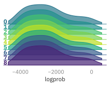

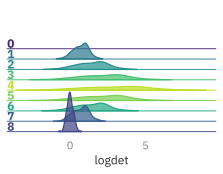


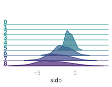

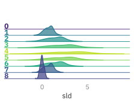

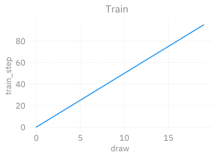


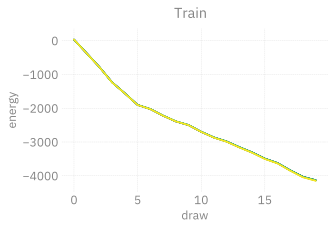


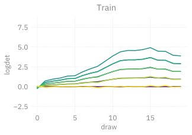

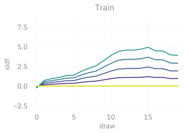

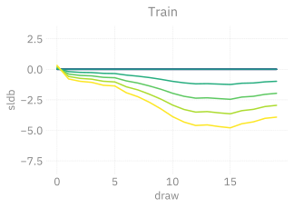

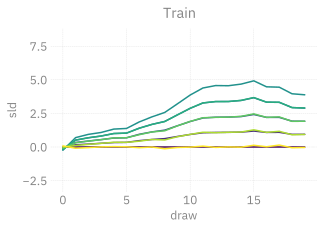


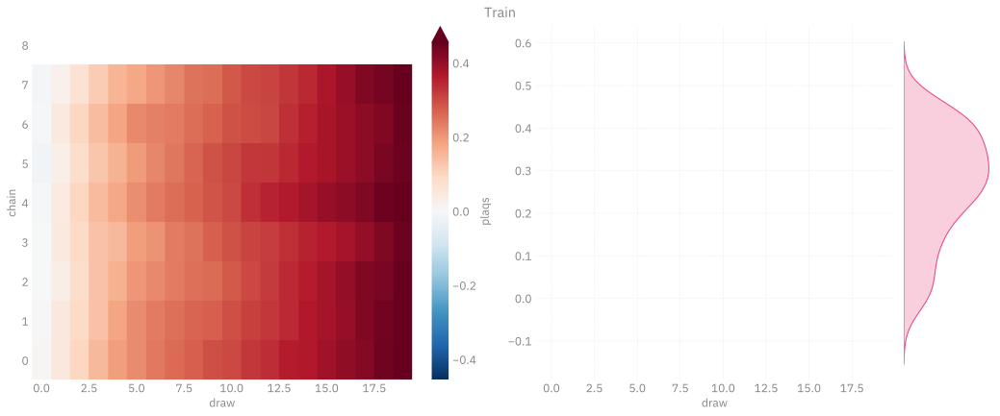

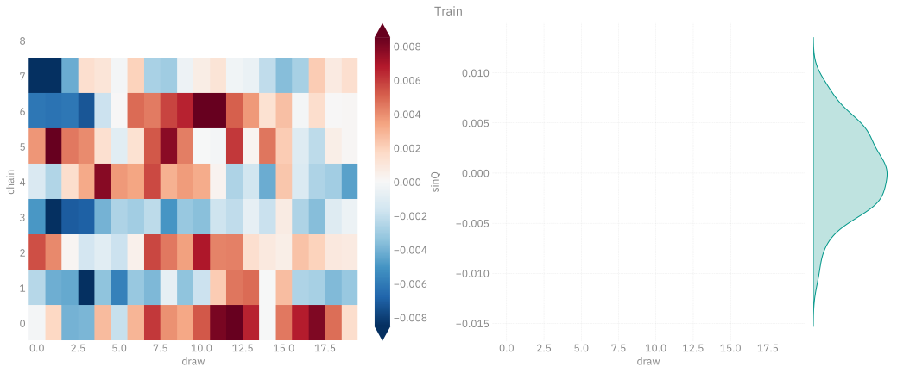


</div>

</details>

## Evaluation

``` python
# state = ptExpSU3.trainer.dynamics.random_state(6.0)
xeval, history_eval = evaluate(
    nsteps=50,
    exp=ptExpSU3,
    beta=6.0,
# x=state.x,
    job_type='eval',
    nlog=1,
    nprint=50,
    grab=True,
)
```

<details closed>

<summary>

Output:
</summary>

<div class="cell-output cell-output-display">

<pre style="white-space:pre;overflow-x:auto;line-height:normal;font-family: monospace"><span style="color: #838383; text-decoration-color: #838383">[</span><span style="color: #838383; text-decoration-color: #838383">2025-04-30 </span><span style="color: #808080; text-decoration-color: #808080">15:56:12</span><span style="color: #838383; text-decoration-color: #838383">][</span><span style="color: var(--bs-green); text-decoration-color: var(--bs-green); font-weight: bold">I</span><span style="color: #838383; text-decoration-color: #838383">][</span><span style="color: #008080; text-decoration-color: #008080; font-style: italic">pytorch</span><span style="color: #838383; text-decoration-color: #838383">/</span><span style="color: var(--bs-blue); text-decoration-color: var(--bs-blue)">experiment</span><span style="color: #0000ff; text-decoration-color: #0000ff">:</span><span style="color: #838383; text-decoration-color: #838383">117</span><span style="color: #0000ff; text-decoration-color: #0000ff">:</span><span style="color: #14AC3C; text-decoration-color: #14AC3C; font-style: italic">l2hmc.experiment.pytorch.experiment</span><span style="color: #838383; text-decoration-color: #838383">]</span><span style="color: #838383; text-decoration-color: #838383"> </span>Running <span style="color: #ff00ff; text-decoration-color: #ff00ff">50</span> steps of eval at <span style="color: #0000ff; text-decoration-color: #0000ff; font-style: italic">beta</span>=<span style="color: #ff00ff; text-decoration-color: #ff00ff">6.0000</span>
</pre>

<pre style="white-space:pre;overflow-x:auto;line-height:normal;font-family: monospace"><span style="color: #838383; text-decoration-color: #838383">[</span><span style="color: #838383; text-decoration-color: #838383">2025-04-30 </span><span style="color: #808080; text-decoration-color: #808080">15:56:12</span><span style="color: #838383; text-decoration-color: #838383">][</span><span style="color: var(--bs-green); text-decoration-color: var(--bs-green); font-weight: bold">I</span><span style="color: #838383; text-decoration-color: #838383">][</span><span style="color: #008080; text-decoration-color: #008080; font-style: italic">pytorch</span><span style="color: #838383; text-decoration-color: #838383">/</span><span style="color: var(--bs-blue); text-decoration-color: var(--bs-blue)">experiment</span><span style="color: #0000ff; text-decoration-color: #0000ff">:</span><span style="color: #838383; text-decoration-color: #838383">121</span><span style="color: #0000ff; text-decoration-color: #0000ff">:</span><span style="color: #14AC3C; text-decoration-color: #14AC3C; font-style: italic">l2hmc.experiment.pytorch.experiment</span><span style="color: #838383; text-decoration-color: #838383">]</span><span style="color: #838383; text-decoration-color: #838383"> </span>STEP: <span style="color: #ff00ff; text-decoration-color: #ff00ff">0</span>
</pre>

<pre style="white-space:pre;overflow-x:auto;line-height:normal;font-family: monospace"><span style="color: #838383; text-decoration-color: #838383">[</span><span style="color: #838383; text-decoration-color: #838383">2025-04-30 </span><span style="color: #808080; text-decoration-color: #808080">15:56:12</span><span style="color: #838383; text-decoration-color: #838383">][</span><span style="color: var(--bs-green); text-decoration-color: var(--bs-green); font-weight: bold">I</span><span style="color: #838383; text-decoration-color: #838383">][</span><span style="color: #008080; text-decoration-color: #008080; font-style: italic">pytorch</span><span style="color: #838383; text-decoration-color: #838383">/</span><span style="color: var(--bs-blue); text-decoration-color: var(--bs-blue)">experiment</span><span style="color: #0000ff; text-decoration-color: #0000ff">:</span><span style="color: #838383; text-decoration-color: #838383">121</span><span style="color: #0000ff; text-decoration-color: #0000ff">:</span><span style="color: #14AC3C; text-decoration-color: #14AC3C; font-style: italic">l2hmc.experiment.pytorch.experiment</span><span style="color: #838383; text-decoration-color: #838383">]</span><span style="color: #838383; text-decoration-color: #838383"> </span>STEP: <span style="color: #ff00ff; text-decoration-color: #ff00ff">1</span>
</pre>

<pre style="white-space:pre;overflow-x:auto;line-height:normal;font-family: monospace"><span style="color: #838383; text-decoration-color: #838383">[</span><span style="color: #838383; text-decoration-color: #838383">2025-04-30 </span><span style="color: #808080; text-decoration-color: #808080">15:56:13</span><span style="color: #838383; text-decoration-color: #838383">][</span><span style="color: var(--bs-green); text-decoration-color: var(--bs-green); font-weight: bold">I</span><span style="color: #838383; text-decoration-color: #838383">][</span><span style="color: #008080; text-decoration-color: #008080; font-style: italic">pytorch</span><span style="color: #838383; text-decoration-color: #838383">/</span><span style="color: var(--bs-blue); text-decoration-color: var(--bs-blue)">experiment</span><span style="color: #0000ff; text-decoration-color: #0000ff">:</span><span style="color: #838383; text-decoration-color: #838383">121</span><span style="color: #0000ff; text-decoration-color: #0000ff">:</span><span style="color: #14AC3C; text-decoration-color: #14AC3C; font-style: italic">l2hmc.experiment.pytorch.experiment</span><span style="color: #838383; text-decoration-color: #838383">]</span><span style="color: #838383; text-decoration-color: #838383"> </span>STEP: <span style="color: #ff00ff; text-decoration-color: #ff00ff">2</span>
</pre>

<pre style="white-space:pre;overflow-x:auto;line-height:normal;font-family: monospace"><span style="color: #838383; text-decoration-color: #838383">[</span><span style="color: #838383; text-decoration-color: #838383">2025-04-30 </span><span style="color: #808080; text-decoration-color: #808080">15:56:14</span><span style="color: #838383; text-decoration-color: #838383">][</span><span style="color: var(--bs-green); text-decoration-color: var(--bs-green); font-weight: bold">I</span><span style="color: #838383; text-decoration-color: #838383">][</span><span style="color: #008080; text-decoration-color: #008080; font-style: italic">pytorch</span><span style="color: #838383; text-decoration-color: #838383">/</span><span style="color: var(--bs-blue); text-decoration-color: var(--bs-blue)">experiment</span><span style="color: #0000ff; text-decoration-color: #0000ff">:</span><span style="color: #838383; text-decoration-color: #838383">121</span><span style="color: #0000ff; text-decoration-color: #0000ff">:</span><span style="color: #14AC3C; text-decoration-color: #14AC3C; font-style: italic">l2hmc.experiment.pytorch.experiment</span><span style="color: #838383; text-decoration-color: #838383">]</span><span style="color: #838383; text-decoration-color: #838383"> </span>STEP: <span style="color: #ff00ff; text-decoration-color: #ff00ff">3</span>
</pre>

<pre style="white-space:pre;overflow-x:auto;line-height:normal;font-family: monospace"><span style="color: #838383; text-decoration-color: #838383">[</span><span style="color: #838383; text-decoration-color: #838383">2025-04-30 </span><span style="color: #808080; text-decoration-color: #808080">15:56:14</span><span style="color: #838383; text-decoration-color: #838383">][</span><span style="color: var(--bs-green); text-decoration-color: var(--bs-green); font-weight: bold">I</span><span style="color: #838383; text-decoration-color: #838383">][</span><span style="color: #008080; text-decoration-color: #008080; font-style: italic">pytorch</span><span style="color: #838383; text-decoration-color: #838383">/</span><span style="color: var(--bs-blue); text-decoration-color: var(--bs-blue)">experiment</span><span style="color: #0000ff; text-decoration-color: #0000ff">:</span><span style="color: #838383; text-decoration-color: #838383">121</span><span style="color: #0000ff; text-decoration-color: #0000ff">:</span><span style="color: #14AC3C; text-decoration-color: #14AC3C; font-style: italic">l2hmc.experiment.pytorch.experiment</span><span style="color: #838383; text-decoration-color: #838383">]</span><span style="color: #838383; text-decoration-color: #838383"> </span>STEP: <span style="color: #ff00ff; text-decoration-color: #ff00ff">4</span>
</pre>

<pre style="white-space:pre;overflow-x:auto;line-height:normal;font-family: monospace"><span style="color: #838383; text-decoration-color: #838383">[</span><span style="color: #838383; text-decoration-color: #838383">2025-04-30 </span><span style="color: #808080; text-decoration-color: #808080">15:56:15</span><span style="color: #838383; text-decoration-color: #838383">][</span><span style="color: var(--bs-green); text-decoration-color: var(--bs-green); font-weight: bold">I</span><span style="color: #838383; text-decoration-color: #838383">][</span><span style="color: #008080; text-decoration-color: #008080; font-style: italic">pytorch</span><span style="color: #838383; text-decoration-color: #838383">/</span><span style="color: var(--bs-blue); text-decoration-color: var(--bs-blue)">experiment</span><span style="color: #0000ff; text-decoration-color: #0000ff">:</span><span style="color: #838383; text-decoration-color: #838383">121</span><span style="color: #0000ff; text-decoration-color: #0000ff">:</span><span style="color: #14AC3C; text-decoration-color: #14AC3C; font-style: italic">l2hmc.experiment.pytorch.experiment</span><span style="color: #838383; text-decoration-color: #838383">]</span><span style="color: #838383; text-decoration-color: #838383"> </span>STEP: <span style="color: #ff00ff; text-decoration-color: #ff00ff">5</span>
</pre>

<pre style="white-space:pre;overflow-x:auto;line-height:normal;font-family: monospace"><span style="color: #838383; text-decoration-color: #838383">[</span><span style="color: #838383; text-decoration-color: #838383">2025-04-30 </span><span style="color: #808080; text-decoration-color: #808080">15:56:15</span><span style="color: #838383; text-decoration-color: #838383">][</span><span style="color: var(--bs-green); text-decoration-color: var(--bs-green); font-weight: bold">I</span><span style="color: #838383; text-decoration-color: #838383">][</span><span style="color: #008080; text-decoration-color: #008080; font-style: italic">pytorch</span><span style="color: #838383; text-decoration-color: #838383">/</span><span style="color: var(--bs-blue); text-decoration-color: var(--bs-blue)">experiment</span><span style="color: #0000ff; text-decoration-color: #0000ff">:</span><span style="color: #838383; text-decoration-color: #838383">121</span><span style="color: #0000ff; text-decoration-color: #0000ff">:</span><span style="color: #14AC3C; text-decoration-color: #14AC3C; font-style: italic">l2hmc.experiment.pytorch.experiment</span><span style="color: #838383; text-decoration-color: #838383">]</span><span style="color: #838383; text-decoration-color: #838383"> </span>STEP: <span style="color: #ff00ff; text-decoration-color: #ff00ff">6</span>
</pre>

<pre style="white-space:pre;overflow-x:auto;line-height:normal;font-family: monospace"><span style="color: #838383; text-decoration-color: #838383">[</span><span style="color: #838383; text-decoration-color: #838383">2025-04-30 </span><span style="color: #808080; text-decoration-color: #808080">15:56:16</span><span style="color: #838383; text-decoration-color: #838383">][</span><span style="color: var(--bs-green); text-decoration-color: var(--bs-green); font-weight: bold">I</span><span style="color: #838383; text-decoration-color: #838383">][</span><span style="color: #008080; text-decoration-color: #008080; font-style: italic">pytorch</span><span style="color: #838383; text-decoration-color: #838383">/</span><span style="color: var(--bs-blue); text-decoration-color: var(--bs-blue)">experiment</span><span style="color: #0000ff; text-decoration-color: #0000ff">:</span><span style="color: #838383; text-decoration-color: #838383">121</span><span style="color: #0000ff; text-decoration-color: #0000ff">:</span><span style="color: #14AC3C; text-decoration-color: #14AC3C; font-style: italic">l2hmc.experiment.pytorch.experiment</span><span style="color: #838383; text-decoration-color: #838383">]</span><span style="color: #838383; text-decoration-color: #838383"> </span>STEP: <span style="color: #ff00ff; text-decoration-color: #ff00ff">7</span>
</pre>

<pre style="white-space:pre;overflow-x:auto;line-height:normal;font-family: monospace"><span style="color: #838383; text-decoration-color: #838383">[</span><span style="color: #838383; text-decoration-color: #838383">2025-04-30 </span><span style="color: #808080; text-decoration-color: #808080">15:56:16</span><span style="color: #838383; text-decoration-color: #838383">][</span><span style="color: var(--bs-green); text-decoration-color: var(--bs-green); font-weight: bold">I</span><span style="color: #838383; text-decoration-color: #838383">][</span><span style="color: #008080; text-decoration-color: #008080; font-style: italic">pytorch</span><span style="color: #838383; text-decoration-color: #838383">/</span><span style="color: var(--bs-blue); text-decoration-color: var(--bs-blue)">experiment</span><span style="color: #0000ff; text-decoration-color: #0000ff">:</span><span style="color: #838383; text-decoration-color: #838383">121</span><span style="color: #0000ff; text-decoration-color: #0000ff">:</span><span style="color: #14AC3C; text-decoration-color: #14AC3C; font-style: italic">l2hmc.experiment.pytorch.experiment</span><span style="color: #838383; text-decoration-color: #838383">]</span><span style="color: #838383; text-decoration-color: #838383"> </span>STEP: <span style="color: #ff00ff; text-decoration-color: #ff00ff">8</span>
</pre>

<pre style="white-space:pre;overflow-x:auto;line-height:normal;font-family: monospace"><span style="color: #838383; text-decoration-color: #838383">[</span><span style="color: #838383; text-decoration-color: #838383">2025-04-30 </span><span style="color: #808080; text-decoration-color: #808080">15:56:17</span><span style="color: #838383; text-decoration-color: #838383">][</span><span style="color: var(--bs-green); text-decoration-color: var(--bs-green); font-weight: bold">I</span><span style="color: #838383; text-decoration-color: #838383">][</span><span style="color: #008080; text-decoration-color: #008080; font-style: italic">pytorch</span><span style="color: #838383; text-decoration-color: #838383">/</span><span style="color: var(--bs-blue); text-decoration-color: var(--bs-blue)">experiment</span><span style="color: #0000ff; text-decoration-color: #0000ff">:</span><span style="color: #838383; text-decoration-color: #838383">121</span><span style="color: #0000ff; text-decoration-color: #0000ff">:</span><span style="color: #14AC3C; text-decoration-color: #14AC3C; font-style: italic">l2hmc.experiment.pytorch.experiment</span><span style="color: #838383; text-decoration-color: #838383">]</span><span style="color: #838383; text-decoration-color: #838383"> </span>STEP: <span style="color: #ff00ff; text-decoration-color: #ff00ff">9</span>
</pre>

<pre style="white-space:pre;overflow-x:auto;line-height:normal;font-family: monospace"><span style="color: #838383; text-decoration-color: #838383">[</span><span style="color: #838383; text-decoration-color: #838383">2025-04-30 </span><span style="color: #808080; text-decoration-color: #808080">15:56:17</span><span style="color: #838383; text-decoration-color: #838383">][</span><span style="color: var(--bs-green); text-decoration-color: var(--bs-green); font-weight: bold">I</span><span style="color: #838383; text-decoration-color: #838383">][</span><span style="color: #008080; text-decoration-color: #008080; font-style: italic">pytorch</span><span style="color: #838383; text-decoration-color: #838383">/</span><span style="color: var(--bs-blue); text-decoration-color: var(--bs-blue)">experiment</span><span style="color: #0000ff; text-decoration-color: #0000ff">:</span><span style="color: #838383; text-decoration-color: #838383">121</span><span style="color: #0000ff; text-decoration-color: #0000ff">:</span><span style="color: #14AC3C; text-decoration-color: #14AC3C; font-style: italic">l2hmc.experiment.pytorch.experiment</span><span style="color: #838383; text-decoration-color: #838383">]</span><span style="color: #838383; text-decoration-color: #838383"> </span>STEP: <span style="color: #ff00ff; text-decoration-color: #ff00ff">10</span>
</pre>

<pre style="white-space:pre;overflow-x:auto;line-height:normal;font-family: monospace"><span style="color: #838383; text-decoration-color: #838383">[</span><span style="color: #838383; text-decoration-color: #838383">2025-04-30 </span><span style="color: #808080; text-decoration-color: #808080">15:56:18</span><span style="color: #838383; text-decoration-color: #838383">][</span><span style="color: var(--bs-green); text-decoration-color: var(--bs-green); font-weight: bold">I</span><span style="color: #838383; text-decoration-color: #838383">][</span><span style="color: #008080; text-decoration-color: #008080; font-style: italic">pytorch</span><span style="color: #838383; text-decoration-color: #838383">/</span><span style="color: var(--bs-blue); text-decoration-color: var(--bs-blue)">experiment</span><span style="color: #0000ff; text-decoration-color: #0000ff">:</span><span style="color: #838383; text-decoration-color: #838383">121</span><span style="color: #0000ff; text-decoration-color: #0000ff">:</span><span style="color: #14AC3C; text-decoration-color: #14AC3C; font-style: italic">l2hmc.experiment.pytorch.experiment</span><span style="color: #838383; text-decoration-color: #838383">]</span><span style="color: #838383; text-decoration-color: #838383"> </span>STEP: <span style="color: #ff00ff; text-decoration-color: #ff00ff">11</span>
</pre>

<pre style="white-space:pre;overflow-x:auto;line-height:normal;font-family: monospace"><span style="color: #838383; text-decoration-color: #838383">[</span><span style="color: #838383; text-decoration-color: #838383">2025-04-30 </span><span style="color: #808080; text-decoration-color: #808080">15:56:18</span><span style="color: #838383; text-decoration-color: #838383">][</span><span style="color: var(--bs-green); text-decoration-color: var(--bs-green); font-weight: bold">I</span><span style="color: #838383; text-decoration-color: #838383">][</span><span style="color: #008080; text-decoration-color: #008080; font-style: italic">pytorch</span><span style="color: #838383; text-decoration-color: #838383">/</span><span style="color: var(--bs-blue); text-decoration-color: var(--bs-blue)">experiment</span><span style="color: #0000ff; text-decoration-color: #0000ff">:</span><span style="color: #838383; text-decoration-color: #838383">121</span><span style="color: #0000ff; text-decoration-color: #0000ff">:</span><span style="color: #14AC3C; text-decoration-color: #14AC3C; font-style: italic">l2hmc.experiment.pytorch.experiment</span><span style="color: #838383; text-decoration-color: #838383">]</span><span style="color: #838383; text-decoration-color: #838383"> </span>STEP: <span style="color: #ff00ff; text-decoration-color: #ff00ff">12</span>
</pre>

<pre style="white-space:pre;overflow-x:auto;line-height:normal;font-family: monospace"><span style="color: #838383; text-decoration-color: #838383">[</span><span style="color: #838383; text-decoration-color: #838383">2025-04-30 </span><span style="color: #808080; text-decoration-color: #808080">15:56:19</span><span style="color: #838383; text-decoration-color: #838383">][</span><span style="color: var(--bs-green); text-decoration-color: var(--bs-green); font-weight: bold">I</span><span style="color: #838383; text-decoration-color: #838383">][</span><span style="color: #008080; text-decoration-color: #008080; font-style: italic">pytorch</span><span style="color: #838383; text-decoration-color: #838383">/</span><span style="color: var(--bs-blue); text-decoration-color: var(--bs-blue)">experiment</span><span style="color: #0000ff; text-decoration-color: #0000ff">:</span><span style="color: #838383; text-decoration-color: #838383">121</span><span style="color: #0000ff; text-decoration-color: #0000ff">:</span><span style="color: #14AC3C; text-decoration-color: #14AC3C; font-style: italic">l2hmc.experiment.pytorch.experiment</span><span style="color: #838383; text-decoration-color: #838383">]</span><span style="color: #838383; text-decoration-color: #838383"> </span>STEP: <span style="color: #ff00ff; text-decoration-color: #ff00ff">13</span>
</pre>

<pre style="white-space:pre;overflow-x:auto;line-height:normal;font-family: monospace"><span style="color: #838383; text-decoration-color: #838383">[</span><span style="color: #838383; text-decoration-color: #838383">2025-04-30 </span><span style="color: #808080; text-decoration-color: #808080">15:56:19</span><span style="color: #838383; text-decoration-color: #838383">][</span><span style="color: var(--bs-green); text-decoration-color: var(--bs-green); font-weight: bold">I</span><span style="color: #838383; text-decoration-color: #838383">][</span><span style="color: #008080; text-decoration-color: #008080; font-style: italic">pytorch</span><span style="color: #838383; text-decoration-color: #838383">/</span><span style="color: var(--bs-blue); text-decoration-color: var(--bs-blue)">experiment</span><span style="color: #0000ff; text-decoration-color: #0000ff">:</span><span style="color: #838383; text-decoration-color: #838383">121</span><span style="color: #0000ff; text-decoration-color: #0000ff">:</span><span style="color: #14AC3C; text-decoration-color: #14AC3C; font-style: italic">l2hmc.experiment.pytorch.experiment</span><span style="color: #838383; text-decoration-color: #838383">]</span><span style="color: #838383; text-decoration-color: #838383"> </span>STEP: <span style="color: #ff00ff; text-decoration-color: #ff00ff">14</span>
</pre>

<pre style="white-space:pre;overflow-x:auto;line-height:normal;font-family: monospace"><span style="color: #838383; text-decoration-color: #838383">[</span><span style="color: #838383; text-decoration-color: #838383">2025-04-30 </span><span style="color: #808080; text-decoration-color: #808080">15:56:20</span><span style="color: #838383; text-decoration-color: #838383">][</span><span style="color: var(--bs-green); text-decoration-color: var(--bs-green); font-weight: bold">I</span><span style="color: #838383; text-decoration-color: #838383">][</span><span style="color: #008080; text-decoration-color: #008080; font-style: italic">pytorch</span><span style="color: #838383; text-decoration-color: #838383">/</span><span style="color: var(--bs-blue); text-decoration-color: var(--bs-blue)">experiment</span><span style="color: #0000ff; text-decoration-color: #0000ff">:</span><span style="color: #838383; text-decoration-color: #838383">121</span><span style="color: #0000ff; text-decoration-color: #0000ff">:</span><span style="color: #14AC3C; text-decoration-color: #14AC3C; font-style: italic">l2hmc.experiment.pytorch.experiment</span><span style="color: #838383; text-decoration-color: #838383">]</span><span style="color: #838383; text-decoration-color: #838383"> </span>STEP: <span style="color: #ff00ff; text-decoration-color: #ff00ff">15</span>
</pre>

<pre style="white-space:pre;overflow-x:auto;line-height:normal;font-family: monospace"><span style="color: #838383; text-decoration-color: #838383">[</span><span style="color: #838383; text-decoration-color: #838383">2025-04-30 </span><span style="color: #808080; text-decoration-color: #808080">15:56:20</span><span style="color: #838383; text-decoration-color: #838383">][</span><span style="color: var(--bs-green); text-decoration-color: var(--bs-green); font-weight: bold">I</span><span style="color: #838383; text-decoration-color: #838383">][</span><span style="color: #008080; text-decoration-color: #008080; font-style: italic">pytorch</span><span style="color: #838383; text-decoration-color: #838383">/</span><span style="color: var(--bs-blue); text-decoration-color: var(--bs-blue)">experiment</span><span style="color: #0000ff; text-decoration-color: #0000ff">:</span><span style="color: #838383; text-decoration-color: #838383">121</span><span style="color: #0000ff; text-decoration-color: #0000ff">:</span><span style="color: #14AC3C; text-decoration-color: #14AC3C; font-style: italic">l2hmc.experiment.pytorch.experiment</span><span style="color: #838383; text-decoration-color: #838383">]</span><span style="color: #838383; text-decoration-color: #838383"> </span>STEP: <span style="color: #ff00ff; text-decoration-color: #ff00ff">16</span>
</pre>

<pre style="white-space:pre;overflow-x:auto;line-height:normal;font-family: monospace"><span style="color: #838383; text-decoration-color: #838383">[</span><span style="color: #838383; text-decoration-color: #838383">2025-04-30 </span><span style="color: #808080; text-decoration-color: #808080">15:56:21</span><span style="color: #838383; text-decoration-color: #838383">][</span><span style="color: var(--bs-green); text-decoration-color: var(--bs-green); font-weight: bold">I</span><span style="color: #838383; text-decoration-color: #838383">][</span><span style="color: #008080; text-decoration-color: #008080; font-style: italic">pytorch</span><span style="color: #838383; text-decoration-color: #838383">/</span><span style="color: var(--bs-blue); text-decoration-color: var(--bs-blue)">experiment</span><span style="color: #0000ff; text-decoration-color: #0000ff">:</span><span style="color: #838383; text-decoration-color: #838383">121</span><span style="color: #0000ff; text-decoration-color: #0000ff">:</span><span style="color: #14AC3C; text-decoration-color: #14AC3C; font-style: italic">l2hmc.experiment.pytorch.experiment</span><span style="color: #838383; text-decoration-color: #838383">]</span><span style="color: #838383; text-decoration-color: #838383"> </span>STEP: <span style="color: #ff00ff; text-decoration-color: #ff00ff">17</span>
</pre>

<pre style="white-space:pre;overflow-x:auto;line-height:normal;font-family: monospace"><span style="color: #838383; text-decoration-color: #838383">[</span><span style="color: #838383; text-decoration-color: #838383">2025-04-30 </span><span style="color: #808080; text-decoration-color: #808080">15:56:21</span><span style="color: #838383; text-decoration-color: #838383">][</span><span style="color: var(--bs-green); text-decoration-color: var(--bs-green); font-weight: bold">I</span><span style="color: #838383; text-decoration-color: #838383">][</span><span style="color: #008080; text-decoration-color: #008080; font-style: italic">pytorch</span><span style="color: #838383; text-decoration-color: #838383">/</span><span style="color: var(--bs-blue); text-decoration-color: var(--bs-blue)">experiment</span><span style="color: #0000ff; text-decoration-color: #0000ff">:</span><span style="color: #838383; text-decoration-color: #838383">121</span><span style="color: #0000ff; text-decoration-color: #0000ff">:</span><span style="color: #14AC3C; text-decoration-color: #14AC3C; font-style: italic">l2hmc.experiment.pytorch.experiment</span><span style="color: #838383; text-decoration-color: #838383">]</span><span style="color: #838383; text-decoration-color: #838383"> </span>STEP: <span style="color: #ff00ff; text-decoration-color: #ff00ff">18</span>
</pre>

<pre style="white-space:pre;overflow-x:auto;line-height:normal;font-family: monospace"><span style="color: #838383; text-decoration-color: #838383">[</span><span style="color: #838383; text-decoration-color: #838383">2025-04-30 </span><span style="color: #808080; text-decoration-color: #808080">15:56:22</span><span style="color: #838383; text-decoration-color: #838383">][</span><span style="color: var(--bs-green); text-decoration-color: var(--bs-green); font-weight: bold">I</span><span style="color: #838383; text-decoration-color: #838383">][</span><span style="color: #008080; text-decoration-color: #008080; font-style: italic">pytorch</span><span style="color: #838383; text-decoration-color: #838383">/</span><span style="color: var(--bs-blue); text-decoration-color: var(--bs-blue)">experiment</span><span style="color: #0000ff; text-decoration-color: #0000ff">:</span><span style="color: #838383; text-decoration-color: #838383">121</span><span style="color: #0000ff; text-decoration-color: #0000ff">:</span><span style="color: #14AC3C; text-decoration-color: #14AC3C; font-style: italic">l2hmc.experiment.pytorch.experiment</span><span style="color: #838383; text-decoration-color: #838383">]</span><span style="color: #838383; text-decoration-color: #838383"> </span>STEP: <span style="color: #ff00ff; text-decoration-color: #ff00ff">19</span>
</pre>

<pre style="white-space:pre;overflow-x:auto;line-height:normal;font-family: monospace"><span style="color: #838383; text-decoration-color: #838383">[</span><span style="color: #838383; text-decoration-color: #838383">2025-04-30 </span><span style="color: #808080; text-decoration-color: #808080">15:56:22</span><span style="color: #838383; text-decoration-color: #838383">][</span><span style="color: var(--bs-green); text-decoration-color: var(--bs-green); font-weight: bold">I</span><span style="color: #838383; text-decoration-color: #838383">][</span><span style="color: #008080; text-decoration-color: #008080; font-style: italic">pytorch</span><span style="color: #838383; text-decoration-color: #838383">/</span><span style="color: var(--bs-blue); text-decoration-color: var(--bs-blue)">experiment</span><span style="color: #0000ff; text-decoration-color: #0000ff">:</span><span style="color: #838383; text-decoration-color: #838383">121</span><span style="color: #0000ff; text-decoration-color: #0000ff">:</span><span style="color: #14AC3C; text-decoration-color: #14AC3C; font-style: italic">l2hmc.experiment.pytorch.experiment</span><span style="color: #838383; text-decoration-color: #838383">]</span><span style="color: #838383; text-decoration-color: #838383"> </span>STEP: <span style="color: #ff00ff; text-decoration-color: #ff00ff">20</span>
</pre>

<pre style="white-space:pre;overflow-x:auto;line-height:normal;font-family: monospace"><span style="color: #838383; text-decoration-color: #838383">[</span><span style="color: #838383; text-decoration-color: #838383">2025-04-30 </span><span style="color: #808080; text-decoration-color: #808080">15:56:23</span><span style="color: #838383; text-decoration-color: #838383">][</span><span style="color: var(--bs-green); text-decoration-color: var(--bs-green); font-weight: bold">I</span><span style="color: #838383; text-decoration-color: #838383">][</span><span style="color: #008080; text-decoration-color: #008080; font-style: italic">pytorch</span><span style="color: #838383; text-decoration-color: #838383">/</span><span style="color: var(--bs-blue); text-decoration-color: var(--bs-blue)">experiment</span><span style="color: #0000ff; text-decoration-color: #0000ff">:</span><span style="color: #838383; text-decoration-color: #838383">121</span><span style="color: #0000ff; text-decoration-color: #0000ff">:</span><span style="color: #14AC3C; text-decoration-color: #14AC3C; font-style: italic">l2hmc.experiment.pytorch.experiment</span><span style="color: #838383; text-decoration-color: #838383">]</span><span style="color: #838383; text-decoration-color: #838383"> </span>STEP: <span style="color: #ff00ff; text-decoration-color: #ff00ff">21</span>
</pre>

<pre style="white-space:pre;overflow-x:auto;line-height:normal;font-family: monospace"><span style="color: #838383; text-decoration-color: #838383">[</span><span style="color: #838383; text-decoration-color: #838383">2025-04-30 </span><span style="color: #808080; text-decoration-color: #808080">15:56:23</span><span style="color: #838383; text-decoration-color: #838383">][</span><span style="color: var(--bs-green); text-decoration-color: var(--bs-green); font-weight: bold">I</span><span style="color: #838383; text-decoration-color: #838383">][</span><span style="color: #008080; text-decoration-color: #008080; font-style: italic">pytorch</span><span style="color: #838383; text-decoration-color: #838383">/</span><span style="color: var(--bs-blue); text-decoration-color: var(--bs-blue)">experiment</span><span style="color: #0000ff; text-decoration-color: #0000ff">:</span><span style="color: #838383; text-decoration-color: #838383">121</span><span style="color: #0000ff; text-decoration-color: #0000ff">:</span><span style="color: #14AC3C; text-decoration-color: #14AC3C; font-style: italic">l2hmc.experiment.pytorch.experiment</span><span style="color: #838383; text-decoration-color: #838383">]</span><span style="color: #838383; text-decoration-color: #838383"> </span>STEP: <span style="color: #ff00ff; text-decoration-color: #ff00ff">22</span>
</pre>

<pre style="white-space:pre;overflow-x:auto;line-height:normal;font-family: monospace"><span style="color: #838383; text-decoration-color: #838383">[</span><span style="color: #838383; text-decoration-color: #838383">2025-04-30 </span><span style="color: #808080; text-decoration-color: #808080">15:56:24</span><span style="color: #838383; text-decoration-color: #838383">][</span><span style="color: var(--bs-green); text-decoration-color: var(--bs-green); font-weight: bold">I</span><span style="color: #838383; text-decoration-color: #838383">][</span><span style="color: #008080; text-decoration-color: #008080; font-style: italic">pytorch</span><span style="color: #838383; text-decoration-color: #838383">/</span><span style="color: var(--bs-blue); text-decoration-color: var(--bs-blue)">experiment</span><span style="color: #0000ff; text-decoration-color: #0000ff">:</span><span style="color: #838383; text-decoration-color: #838383">121</span><span style="color: #0000ff; text-decoration-color: #0000ff">:</span><span style="color: #14AC3C; text-decoration-color: #14AC3C; font-style: italic">l2hmc.experiment.pytorch.experiment</span><span style="color: #838383; text-decoration-color: #838383">]</span><span style="color: #838383; text-decoration-color: #838383"> </span>STEP: <span style="color: #ff00ff; text-decoration-color: #ff00ff">23</span>
</pre>

<pre style="white-space:pre;overflow-x:auto;line-height:normal;font-family: monospace"><span style="color: #838383; text-decoration-color: #838383">[</span><span style="color: #838383; text-decoration-color: #838383">2025-04-30 </span><span style="color: #808080; text-decoration-color: #808080">15:56:24</span><span style="color: #838383; text-decoration-color: #838383">][</span><span style="color: var(--bs-green); text-decoration-color: var(--bs-green); font-weight: bold">I</span><span style="color: #838383; text-decoration-color: #838383">][</span><span style="color: #008080; text-decoration-color: #008080; font-style: italic">pytorch</span><span style="color: #838383; text-decoration-color: #838383">/</span><span style="color: var(--bs-blue); text-decoration-color: var(--bs-blue)">experiment</span><span style="color: #0000ff; text-decoration-color: #0000ff">:</span><span style="color: #838383; text-decoration-color: #838383">121</span><span style="color: #0000ff; text-decoration-color: #0000ff">:</span><span style="color: #14AC3C; text-decoration-color: #14AC3C; font-style: italic">l2hmc.experiment.pytorch.experiment</span><span style="color: #838383; text-decoration-color: #838383">]</span><span style="color: #838383; text-decoration-color: #838383"> </span>STEP: <span style="color: #ff00ff; text-decoration-color: #ff00ff">24</span>
</pre>

<pre style="white-space:pre;overflow-x:auto;line-height:normal;font-family: monospace"><span style="color: #838383; text-decoration-color: #838383">[</span><span style="color: #838383; text-decoration-color: #838383">2025-04-30 </span><span style="color: #808080; text-decoration-color: #808080">15:56:24</span><span style="color: #838383; text-decoration-color: #838383">][</span><span style="color: var(--bs-green); text-decoration-color: var(--bs-green); font-weight: bold">I</span><span style="color: #838383; text-decoration-color: #838383">][</span><span style="color: #008080; text-decoration-color: #008080; font-style: italic">pytorch</span><span style="color: #838383; text-decoration-color: #838383">/</span><span style="color: var(--bs-blue); text-decoration-color: var(--bs-blue)">experiment</span><span style="color: #0000ff; text-decoration-color: #0000ff">:</span><span style="color: #838383; text-decoration-color: #838383">121</span><span style="color: #0000ff; text-decoration-color: #0000ff">:</span><span style="color: #14AC3C; text-decoration-color: #14AC3C; font-style: italic">l2hmc.experiment.pytorch.experiment</span><span style="color: #838383; text-decoration-color: #838383">]</span><span style="color: #838383; text-decoration-color: #838383"> </span>STEP: <span style="color: #ff00ff; text-decoration-color: #ff00ff">25</span>
</pre>

<pre style="white-space:pre;overflow-x:auto;line-height:normal;font-family: monospace"><span style="color: #838383; text-decoration-color: #838383">[</span><span style="color: #838383; text-decoration-color: #838383">2025-04-30 </span><span style="color: #808080; text-decoration-color: #808080">15:56:25</span><span style="color: #838383; text-decoration-color: #838383">][</span><span style="color: var(--bs-green); text-decoration-color: var(--bs-green); font-weight: bold">I</span><span style="color: #838383; text-decoration-color: #838383">][</span><span style="color: #008080; text-decoration-color: #008080; font-style: italic">pytorch</span><span style="color: #838383; text-decoration-color: #838383">/</span><span style="color: var(--bs-blue); text-decoration-color: var(--bs-blue)">experiment</span><span style="color: #0000ff; text-decoration-color: #0000ff">:</span><span style="color: #838383; text-decoration-color: #838383">121</span><span style="color: #0000ff; text-decoration-color: #0000ff">:</span><span style="color: #14AC3C; text-decoration-color: #14AC3C; font-style: italic">l2hmc.experiment.pytorch.experiment</span><span style="color: #838383; text-decoration-color: #838383">]</span><span style="color: #838383; text-decoration-color: #838383"> </span>STEP: <span style="color: #ff00ff; text-decoration-color: #ff00ff">26</span>
</pre>

<pre style="white-space:pre;overflow-x:auto;line-height:normal;font-family: monospace"><span style="color: #838383; text-decoration-color: #838383">[</span><span style="color: #838383; text-decoration-color: #838383">2025-04-30 </span><span style="color: #808080; text-decoration-color: #808080">15:56:25</span><span style="color: #838383; text-decoration-color: #838383">][</span><span style="color: var(--bs-green); text-decoration-color: var(--bs-green); font-weight: bold">I</span><span style="color: #838383; text-decoration-color: #838383">][</span><span style="color: #008080; text-decoration-color: #008080; font-style: italic">pytorch</span><span style="color: #838383; text-decoration-color: #838383">/</span><span style="color: var(--bs-blue); text-decoration-color: var(--bs-blue)">experiment</span><span style="color: #0000ff; text-decoration-color: #0000ff">:</span><span style="color: #838383; text-decoration-color: #838383">121</span><span style="color: #0000ff; text-decoration-color: #0000ff">:</span><span style="color: #14AC3C; text-decoration-color: #14AC3C; font-style: italic">l2hmc.experiment.pytorch.experiment</span><span style="color: #838383; text-decoration-color: #838383">]</span><span style="color: #838383; text-decoration-color: #838383"> </span>STEP: <span style="color: #ff00ff; text-decoration-color: #ff00ff">27</span>
</pre>

<pre style="white-space:pre;overflow-x:auto;line-height:normal;font-family: monospace"><span style="color: #838383; text-decoration-color: #838383">[</span><span style="color: #838383; text-decoration-color: #838383">2025-04-30 </span><span style="color: #808080; text-decoration-color: #808080">15:56:26</span><span style="color: #838383; text-decoration-color: #838383">][</span><span style="color: var(--bs-green); text-decoration-color: var(--bs-green); font-weight: bold">I</span><span style="color: #838383; text-decoration-color: #838383">][</span><span style="color: #008080; text-decoration-color: #008080; font-style: italic">pytorch</span><span style="color: #838383; text-decoration-color: #838383">/</span><span style="color: var(--bs-blue); text-decoration-color: var(--bs-blue)">experiment</span><span style="color: #0000ff; text-decoration-color: #0000ff">:</span><span style="color: #838383; text-decoration-color: #838383">121</span><span style="color: #0000ff; text-decoration-color: #0000ff">:</span><span style="color: #14AC3C; text-decoration-color: #14AC3C; font-style: italic">l2hmc.experiment.pytorch.experiment</span><span style="color: #838383; text-decoration-color: #838383">]</span><span style="color: #838383; text-decoration-color: #838383"> </span>STEP: <span style="color: #ff00ff; text-decoration-color: #ff00ff">28</span>
</pre>

<pre style="white-space:pre;overflow-x:auto;line-height:normal;font-family: monospace"><span style="color: #838383; text-decoration-color: #838383">[</span><span style="color: #838383; text-decoration-color: #838383">2025-04-30 </span><span style="color: #808080; text-decoration-color: #808080">15:56:26</span><span style="color: #838383; text-decoration-color: #838383">][</span><span style="color: var(--bs-green); text-decoration-color: var(--bs-green); font-weight: bold">I</span><span style="color: #838383; text-decoration-color: #838383">][</span><span style="color: #008080; text-decoration-color: #008080; font-style: italic">pytorch</span><span style="color: #838383; text-decoration-color: #838383">/</span><span style="color: var(--bs-blue); text-decoration-color: var(--bs-blue)">experiment</span><span style="color: #0000ff; text-decoration-color: #0000ff">:</span><span style="color: #838383; text-decoration-color: #838383">121</span><span style="color: #0000ff; text-decoration-color: #0000ff">:</span><span style="color: #14AC3C; text-decoration-color: #14AC3C; font-style: italic">l2hmc.experiment.pytorch.experiment</span><span style="color: #838383; text-decoration-color: #838383">]</span><span style="color: #838383; text-decoration-color: #838383"> </span>STEP: <span style="color: #ff00ff; text-decoration-color: #ff00ff">29</span>
</pre>

<pre style="white-space:pre;overflow-x:auto;line-height:normal;font-family: monospace"><span style="color: #838383; text-decoration-color: #838383">[</span><span style="color: #838383; text-decoration-color: #838383">2025-04-30 </span><span style="color: #808080; text-decoration-color: #808080">15:56:27</span><span style="color: #838383; text-decoration-color: #838383">][</span><span style="color: var(--bs-green); text-decoration-color: var(--bs-green); font-weight: bold">I</span><span style="color: #838383; text-decoration-color: #838383">][</span><span style="color: #008080; text-decoration-color: #008080; font-style: italic">pytorch</span><span style="color: #838383; text-decoration-color: #838383">/</span><span style="color: var(--bs-blue); text-decoration-color: var(--bs-blue)">experiment</span><span style="color: #0000ff; text-decoration-color: #0000ff">:</span><span style="color: #838383; text-decoration-color: #838383">121</span><span style="color: #0000ff; text-decoration-color: #0000ff">:</span><span style="color: #14AC3C; text-decoration-color: #14AC3C; font-style: italic">l2hmc.experiment.pytorch.experiment</span><span style="color: #838383; text-decoration-color: #838383">]</span><span style="color: #838383; text-decoration-color: #838383"> </span>STEP: <span style="color: #ff00ff; text-decoration-color: #ff00ff">30</span>
</pre>

<pre style="white-space:pre;overflow-x:auto;line-height:normal;font-family: monospace"><span style="color: #838383; text-decoration-color: #838383">[</span><span style="color: #838383; text-decoration-color: #838383">2025-04-30 </span><span style="color: #808080; text-decoration-color: #808080">15:56:27</span><span style="color: #838383; text-decoration-color: #838383">][</span><span style="color: var(--bs-green); text-decoration-color: var(--bs-green); font-weight: bold">I</span><span style="color: #838383; text-decoration-color: #838383">][</span><span style="color: #008080; text-decoration-color: #008080; font-style: italic">pytorch</span><span style="color: #838383; text-decoration-color: #838383">/</span><span style="color: var(--bs-blue); text-decoration-color: var(--bs-blue)">experiment</span><span style="color: #0000ff; text-decoration-color: #0000ff">:</span><span style="color: #838383; text-decoration-color: #838383">121</span><span style="color: #0000ff; text-decoration-color: #0000ff">:</span><span style="color: #14AC3C; text-decoration-color: #14AC3C; font-style: italic">l2hmc.experiment.pytorch.experiment</span><span style="color: #838383; text-decoration-color: #838383">]</span><span style="color: #838383; text-decoration-color: #838383"> </span>STEP: <span style="color: #ff00ff; text-decoration-color: #ff00ff">31</span>
</pre>

<pre style="white-space:pre;overflow-x:auto;line-height:normal;font-family: monospace"><span style="color: #838383; text-decoration-color: #838383">[</span><span style="color: #838383; text-decoration-color: #838383">2025-04-30 </span><span style="color: #808080; text-decoration-color: #808080">15:56:28</span><span style="color: #838383; text-decoration-color: #838383">][</span><span style="color: var(--bs-green); text-decoration-color: var(--bs-green); font-weight: bold">I</span><span style="color: #838383; text-decoration-color: #838383">][</span><span style="color: #008080; text-decoration-color: #008080; font-style: italic">pytorch</span><span style="color: #838383; text-decoration-color: #838383">/</span><span style="color: var(--bs-blue); text-decoration-color: var(--bs-blue)">experiment</span><span style="color: #0000ff; text-decoration-color: #0000ff">:</span><span style="color: #838383; text-decoration-color: #838383">121</span><span style="color: #0000ff; text-decoration-color: #0000ff">:</span><span style="color: #14AC3C; text-decoration-color: #14AC3C; font-style: italic">l2hmc.experiment.pytorch.experiment</span><span style="color: #838383; text-decoration-color: #838383">]</span><span style="color: #838383; text-decoration-color: #838383"> </span>STEP: <span style="color: #ff00ff; text-decoration-color: #ff00ff">32</span>
</pre>

<pre style="white-space:pre;overflow-x:auto;line-height:normal;font-family: monospace"><span style="color: #838383; text-decoration-color: #838383">[</span><span style="color: #838383; text-decoration-color: #838383">2025-04-30 </span><span style="color: #808080; text-decoration-color: #808080">15:56:28</span><span style="color: #838383; text-decoration-color: #838383">][</span><span style="color: var(--bs-green); text-decoration-color: var(--bs-green); font-weight: bold">I</span><span style="color: #838383; text-decoration-color: #838383">][</span><span style="color: #008080; text-decoration-color: #008080; font-style: italic">pytorch</span><span style="color: #838383; text-decoration-color: #838383">/</span><span style="color: var(--bs-blue); text-decoration-color: var(--bs-blue)">experiment</span><span style="color: #0000ff; text-decoration-color: #0000ff">:</span><span style="color: #838383; text-decoration-color: #838383">121</span><span style="color: #0000ff; text-decoration-color: #0000ff">:</span><span style="color: #14AC3C; text-decoration-color: #14AC3C; font-style: italic">l2hmc.experiment.pytorch.experiment</span><span style="color: #838383; text-decoration-color: #838383">]</span><span style="color: #838383; text-decoration-color: #838383"> </span>STEP: <span style="color: #ff00ff; text-decoration-color: #ff00ff">33</span>
</pre>

<pre style="white-space:pre;overflow-x:auto;line-height:normal;font-family: monospace"><span style="color: #838383; text-decoration-color: #838383">[</span><span style="color: #838383; text-decoration-color: #838383">2025-04-30 </span><span style="color: #808080; text-decoration-color: #808080">15:56:29</span><span style="color: #838383; text-decoration-color: #838383">][</span><span style="color: var(--bs-green); text-decoration-color: var(--bs-green); font-weight: bold">I</span><span style="color: #838383; text-decoration-color: #838383">][</span><span style="color: #008080; text-decoration-color: #008080; font-style: italic">pytorch</span><span style="color: #838383; text-decoration-color: #838383">/</span><span style="color: var(--bs-blue); text-decoration-color: var(--bs-blue)">experiment</span><span style="color: #0000ff; text-decoration-color: #0000ff">:</span><span style="color: #838383; text-decoration-color: #838383">121</span><span style="color: #0000ff; text-decoration-color: #0000ff">:</span><span style="color: #14AC3C; text-decoration-color: #14AC3C; font-style: italic">l2hmc.experiment.pytorch.experiment</span><span style="color: #838383; text-decoration-color: #838383">]</span><span style="color: #838383; text-decoration-color: #838383"> </span>STEP: <span style="color: #ff00ff; text-decoration-color: #ff00ff">34</span>
</pre>

<pre style="white-space:pre;overflow-x:auto;line-height:normal;font-family: monospace"><span style="color: #838383; text-decoration-color: #838383">[</span><span style="color: #838383; text-decoration-color: #838383">2025-04-30 </span><span style="color: #808080; text-decoration-color: #808080">15:56:29</span><span style="color: #838383; text-decoration-color: #838383">][</span><span style="color: var(--bs-green); text-decoration-color: var(--bs-green); font-weight: bold">I</span><span style="color: #838383; text-decoration-color: #838383">][</span><span style="color: #008080; text-decoration-color: #008080; font-style: italic">pytorch</span><span style="color: #838383; text-decoration-color: #838383">/</span><span style="color: var(--bs-blue); text-decoration-color: var(--bs-blue)">experiment</span><span style="color: #0000ff; text-decoration-color: #0000ff">:</span><span style="color: #838383; text-decoration-color: #838383">121</span><span style="color: #0000ff; text-decoration-color: #0000ff">:</span><span style="color: #14AC3C; text-decoration-color: #14AC3C; font-style: italic">l2hmc.experiment.pytorch.experiment</span><span style="color: #838383; text-decoration-color: #838383">]</span><span style="color: #838383; text-decoration-color: #838383"> </span>STEP: <span style="color: #ff00ff; text-decoration-color: #ff00ff">35</span>
</pre>

<pre style="white-space:pre;overflow-x:auto;line-height:normal;font-family: monospace"><span style="color: #838383; text-decoration-color: #838383">[</span><span style="color: #838383; text-decoration-color: #838383">2025-04-30 </span><span style="color: #808080; text-decoration-color: #808080">15:56:29</span><span style="color: #838383; text-decoration-color: #838383">][</span><span style="color: var(--bs-green); text-decoration-color: var(--bs-green); font-weight: bold">I</span><span style="color: #838383; text-decoration-color: #838383">][</span><span style="color: #008080; text-decoration-color: #008080; font-style: italic">pytorch</span><span style="color: #838383; text-decoration-color: #838383">/</span><span style="color: var(--bs-blue); text-decoration-color: var(--bs-blue)">experiment</span><span style="color: #0000ff; text-decoration-color: #0000ff">:</span><span style="color: #838383; text-decoration-color: #838383">121</span><span style="color: #0000ff; text-decoration-color: #0000ff">:</span><span style="color: #14AC3C; text-decoration-color: #14AC3C; font-style: italic">l2hmc.experiment.pytorch.experiment</span><span style="color: #838383; text-decoration-color: #838383">]</span><span style="color: #838383; text-decoration-color: #838383"> </span>STEP: <span style="color: #ff00ff; text-decoration-color: #ff00ff">36</span>
</pre>

<pre style="white-space:pre;overflow-x:auto;line-height:normal;font-family: monospace"><span style="color: #838383; text-decoration-color: #838383">[</span><span style="color: #838383; text-decoration-color: #838383">2025-04-30 </span><span style="color: #808080; text-decoration-color: #808080">15:56:30</span><span style="color: #838383; text-decoration-color: #838383">][</span><span style="color: var(--bs-green); text-decoration-color: var(--bs-green); font-weight: bold">I</span><span style="color: #838383; text-decoration-color: #838383">][</span><span style="color: #008080; text-decoration-color: #008080; font-style: italic">pytorch</span><span style="color: #838383; text-decoration-color: #838383">/</span><span style="color: var(--bs-blue); text-decoration-color: var(--bs-blue)">experiment</span><span style="color: #0000ff; text-decoration-color: #0000ff">:</span><span style="color: #838383; text-decoration-color: #838383">121</span><span style="color: #0000ff; text-decoration-color: #0000ff">:</span><span style="color: #14AC3C; text-decoration-color: #14AC3C; font-style: italic">l2hmc.experiment.pytorch.experiment</span><span style="color: #838383; text-decoration-color: #838383">]</span><span style="color: #838383; text-decoration-color: #838383"> </span>STEP: <span style="color: #ff00ff; text-decoration-color: #ff00ff">37</span>
</pre>

<pre style="white-space:pre;overflow-x:auto;line-height:normal;font-family: monospace"><span style="color: #838383; text-decoration-color: #838383">[</span><span style="color: #838383; text-decoration-color: #838383">2025-04-30 </span><span style="color: #808080; text-decoration-color: #808080">15:56:30</span><span style="color: #838383; text-decoration-color: #838383">][</span><span style="color: var(--bs-green); text-decoration-color: var(--bs-green); font-weight: bold">I</span><span style="color: #838383; text-decoration-color: #838383">][</span><span style="color: #008080; text-decoration-color: #008080; font-style: italic">pytorch</span><span style="color: #838383; text-decoration-color: #838383">/</span><span style="color: var(--bs-blue); text-decoration-color: var(--bs-blue)">experiment</span><span style="color: #0000ff; text-decoration-color: #0000ff">:</span><span style="color: #838383; text-decoration-color: #838383">121</span><span style="color: #0000ff; text-decoration-color: #0000ff">:</span><span style="color: #14AC3C; text-decoration-color: #14AC3C; font-style: italic">l2hmc.experiment.pytorch.experiment</span><span style="color: #838383; text-decoration-color: #838383">]</span><span style="color: #838383; text-decoration-color: #838383"> </span>STEP: <span style="color: #ff00ff; text-decoration-color: #ff00ff">38</span>
</pre>

<pre style="white-space:pre;overflow-x:auto;line-height:normal;font-family: monospace"><span style="color: #838383; text-decoration-color: #838383">[</span><span style="color: #838383; text-decoration-color: #838383">2025-04-30 </span><span style="color: #808080; text-decoration-color: #808080">15:56:31</span><span style="color: #838383; text-decoration-color: #838383">][</span><span style="color: var(--bs-green); text-decoration-color: var(--bs-green); font-weight: bold">I</span><span style="color: #838383; text-decoration-color: #838383">][</span><span style="color: #008080; text-decoration-color: #008080; font-style: italic">pytorch</span><span style="color: #838383; text-decoration-color: #838383">/</span><span style="color: var(--bs-blue); text-decoration-color: var(--bs-blue)">experiment</span><span style="color: #0000ff; text-decoration-color: #0000ff">:</span><span style="color: #838383; text-decoration-color: #838383">121</span><span style="color: #0000ff; text-decoration-color: #0000ff">:</span><span style="color: #14AC3C; text-decoration-color: #14AC3C; font-style: italic">l2hmc.experiment.pytorch.experiment</span><span style="color: #838383; text-decoration-color: #838383">]</span><span style="color: #838383; text-decoration-color: #838383"> </span>STEP: <span style="color: #ff00ff; text-decoration-color: #ff00ff">39</span>
</pre>

<pre style="white-space:pre;overflow-x:auto;line-height:normal;font-family: monospace"><span style="color: #838383; text-decoration-color: #838383">[</span><span style="color: #838383; text-decoration-color: #838383">2025-04-30 </span><span style="color: #808080; text-decoration-color: #808080">15:56:32</span><span style="color: #838383; text-decoration-color: #838383">][</span><span style="color: var(--bs-green); text-decoration-color: var(--bs-green); font-weight: bold">I</span><span style="color: #838383; text-decoration-color: #838383">][</span><span style="color: #008080; text-decoration-color: #008080; font-style: italic">pytorch</span><span style="color: #838383; text-decoration-color: #838383">/</span><span style="color: var(--bs-blue); text-decoration-color: var(--bs-blue)">experiment</span><span style="color: #0000ff; text-decoration-color: #0000ff">:</span><span style="color: #838383; text-decoration-color: #838383">121</span><span style="color: #0000ff; text-decoration-color: #0000ff">:</span><span style="color: #14AC3C; text-decoration-color: #14AC3C; font-style: italic">l2hmc.experiment.pytorch.experiment</span><span style="color: #838383; text-decoration-color: #838383">]</span><span style="color: #838383; text-decoration-color: #838383"> </span>STEP: <span style="color: #ff00ff; text-decoration-color: #ff00ff">40</span>
</pre>

<pre style="white-space:pre;overflow-x:auto;line-height:normal;font-family: monospace"><span style="color: #838383; text-decoration-color: #838383">[</span><span style="color: #838383; text-decoration-color: #838383">2025-04-30 </span><span style="color: #808080; text-decoration-color: #808080">15:56:32</span><span style="color: #838383; text-decoration-color: #838383">][</span><span style="color: var(--bs-green); text-decoration-color: var(--bs-green); font-weight: bold">I</span><span style="color: #838383; text-decoration-color: #838383">][</span><span style="color: #008080; text-decoration-color: #008080; font-style: italic">pytorch</span><span style="color: #838383; text-decoration-color: #838383">/</span><span style="color: var(--bs-blue); text-decoration-color: var(--bs-blue)">experiment</span><span style="color: #0000ff; text-decoration-color: #0000ff">:</span><span style="color: #838383; text-decoration-color: #838383">121</span><span style="color: #0000ff; text-decoration-color: #0000ff">:</span><span style="color: #14AC3C; text-decoration-color: #14AC3C; font-style: italic">l2hmc.experiment.pytorch.experiment</span><span style="color: #838383; text-decoration-color: #838383">]</span><span style="color: #838383; text-decoration-color: #838383"> </span>STEP: <span style="color: #ff00ff; text-decoration-color: #ff00ff">41</span>
</pre>

<pre style="white-space:pre;overflow-x:auto;line-height:normal;font-family: monospace"><span style="color: #838383; text-decoration-color: #838383">[</span><span style="color: #838383; text-decoration-color: #838383">2025-04-30 </span><span style="color: #808080; text-decoration-color: #808080">15:56:33</span><span style="color: #838383; text-decoration-color: #838383">][</span><span style="color: var(--bs-green); text-decoration-color: var(--bs-green); font-weight: bold">I</span><span style="color: #838383; text-decoration-color: #838383">][</span><span style="color: #008080; text-decoration-color: #008080; font-style: italic">pytorch</span><span style="color: #838383; text-decoration-color: #838383">/</span><span style="color: var(--bs-blue); text-decoration-color: var(--bs-blue)">experiment</span><span style="color: #0000ff; text-decoration-color: #0000ff">:</span><span style="color: #838383; text-decoration-color: #838383">121</span><span style="color: #0000ff; text-decoration-color: #0000ff">:</span><span style="color: #14AC3C; text-decoration-color: #14AC3C; font-style: italic">l2hmc.experiment.pytorch.experiment</span><span style="color: #838383; text-decoration-color: #838383">]</span><span style="color: #838383; text-decoration-color: #838383"> </span>STEP: <span style="color: #ff00ff; text-decoration-color: #ff00ff">42</span>
</pre>

<pre style="white-space:pre;overflow-x:auto;line-height:normal;font-family: monospace"><span style="color: #838383; text-decoration-color: #838383">[</span><span style="color: #838383; text-decoration-color: #838383">2025-04-30 </span><span style="color: #808080; text-decoration-color: #808080">15:56:33</span><span style="color: #838383; text-decoration-color: #838383">][</span><span style="color: var(--bs-green); text-decoration-color: var(--bs-green); font-weight: bold">I</span><span style="color: #838383; text-decoration-color: #838383">][</span><span style="color: #008080; text-decoration-color: #008080; font-style: italic">pytorch</span><span style="color: #838383; text-decoration-color: #838383">/</span><span style="color: var(--bs-blue); text-decoration-color: var(--bs-blue)">experiment</span><span style="color: #0000ff; text-decoration-color: #0000ff">:</span><span style="color: #838383; text-decoration-color: #838383">121</span><span style="color: #0000ff; text-decoration-color: #0000ff">:</span><span style="color: #14AC3C; text-decoration-color: #14AC3C; font-style: italic">l2hmc.experiment.pytorch.experiment</span><span style="color: #838383; text-decoration-color: #838383">]</span><span style="color: #838383; text-decoration-color: #838383"> </span>STEP: <span style="color: #ff00ff; text-decoration-color: #ff00ff">43</span>
</pre>

<pre style="white-space:pre;overflow-x:auto;line-height:normal;font-family: monospace"><span style="color: #838383; text-decoration-color: #838383">[</span><span style="color: #838383; text-decoration-color: #838383">2025-04-30 </span><span style="color: #808080; text-decoration-color: #808080">15:56:34</span><span style="color: #838383; text-decoration-color: #838383">][</span><span style="color: var(--bs-green); text-decoration-color: var(--bs-green); font-weight: bold">I</span><span style="color: #838383; text-decoration-color: #838383">][</span><span style="color: #008080; text-decoration-color: #008080; font-style: italic">pytorch</span><span style="color: #838383; text-decoration-color: #838383">/</span><span style="color: var(--bs-blue); text-decoration-color: var(--bs-blue)">experiment</span><span style="color: #0000ff; text-decoration-color: #0000ff">:</span><span style="color: #838383; text-decoration-color: #838383">121</span><span style="color: #0000ff; text-decoration-color: #0000ff">:</span><span style="color: #14AC3C; text-decoration-color: #14AC3C; font-style: italic">l2hmc.experiment.pytorch.experiment</span><span style="color: #838383; text-decoration-color: #838383">]</span><span style="color: #838383; text-decoration-color: #838383"> </span>STEP: <span style="color: #ff00ff; text-decoration-color: #ff00ff">44</span>
</pre>

<pre style="white-space:pre;overflow-x:auto;line-height:normal;font-family: monospace"><span style="color: #838383; text-decoration-color: #838383">[</span><span style="color: #838383; text-decoration-color: #838383">2025-04-30 </span><span style="color: #808080; text-decoration-color: #808080">15:56:34</span><span style="color: #838383; text-decoration-color: #838383">][</span><span style="color: var(--bs-green); text-decoration-color: var(--bs-green); font-weight: bold">I</span><span style="color: #838383; text-decoration-color: #838383">][</span><span style="color: #008080; text-decoration-color: #008080; font-style: italic">pytorch</span><span style="color: #838383; text-decoration-color: #838383">/</span><span style="color: var(--bs-blue); text-decoration-color: var(--bs-blue)">experiment</span><span style="color: #0000ff; text-decoration-color: #0000ff">:</span><span style="color: #838383; text-decoration-color: #838383">121</span><span style="color: #0000ff; text-decoration-color: #0000ff">:</span><span style="color: #14AC3C; text-decoration-color: #14AC3C; font-style: italic">l2hmc.experiment.pytorch.experiment</span><span style="color: #838383; text-decoration-color: #838383">]</span><span style="color: #838383; text-decoration-color: #838383"> </span>STEP: <span style="color: #ff00ff; text-decoration-color: #ff00ff">45</span>
</pre>

<pre style="white-space:pre;overflow-x:auto;line-height:normal;font-family: monospace"><span style="color: #838383; text-decoration-color: #838383">[</span><span style="color: #838383; text-decoration-color: #838383">2025-04-30 </span><span style="color: #808080; text-decoration-color: #808080">15:56:35</span><span style="color: #838383; text-decoration-color: #838383">][</span><span style="color: var(--bs-green); text-decoration-color: var(--bs-green); font-weight: bold">I</span><span style="color: #838383; text-decoration-color: #838383">][</span><span style="color: #008080; text-decoration-color: #008080; font-style: italic">pytorch</span><span style="color: #838383; text-decoration-color: #838383">/</span><span style="color: var(--bs-blue); text-decoration-color: var(--bs-blue)">experiment</span><span style="color: #0000ff; text-decoration-color: #0000ff">:</span><span style="color: #838383; text-decoration-color: #838383">121</span><span style="color: #0000ff; text-decoration-color: #0000ff">:</span><span style="color: #14AC3C; text-decoration-color: #14AC3C; font-style: italic">l2hmc.experiment.pytorch.experiment</span><span style="color: #838383; text-decoration-color: #838383">]</span><span style="color: #838383; text-decoration-color: #838383"> </span>STEP: <span style="color: #ff00ff; text-decoration-color: #ff00ff">46</span>
</pre>

<pre style="white-space:pre;overflow-x:auto;line-height:normal;font-family: monospace"><span style="color: #838383; text-decoration-color: #838383">[</span><span style="color: #838383; text-decoration-color: #838383">2025-04-30 </span><span style="color: #808080; text-decoration-color: #808080">15:56:35</span><span style="color: #838383; text-decoration-color: #838383">][</span><span style="color: var(--bs-green); text-decoration-color: var(--bs-green); font-weight: bold">I</span><span style="color: #838383; text-decoration-color: #838383">][</span><span style="color: #008080; text-decoration-color: #008080; font-style: italic">pytorch</span><span style="color: #838383; text-decoration-color: #838383">/</span><span style="color: var(--bs-blue); text-decoration-color: var(--bs-blue)">experiment</span><span style="color: #0000ff; text-decoration-color: #0000ff">:</span><span style="color: #838383; text-decoration-color: #838383">121</span><span style="color: #0000ff; text-decoration-color: #0000ff">:</span><span style="color: #14AC3C; text-decoration-color: #14AC3C; font-style: italic">l2hmc.experiment.pytorch.experiment</span><span style="color: #838383; text-decoration-color: #838383">]</span><span style="color: #838383; text-decoration-color: #838383"> </span>STEP: <span style="color: #ff00ff; text-decoration-color: #ff00ff">47</span>
</pre>

<pre style="white-space:pre;overflow-x:auto;line-height:normal;font-family: monospace"><span style="color: #838383; text-decoration-color: #838383">[</span><span style="color: #838383; text-decoration-color: #838383">2025-04-30 </span><span style="color: #808080; text-decoration-color: #808080">15:56:36</span><span style="color: #838383; text-decoration-color: #838383">][</span><span style="color: var(--bs-green); text-decoration-color: var(--bs-green); font-weight: bold">I</span><span style="color: #838383; text-decoration-color: #838383">][</span><span style="color: #008080; text-decoration-color: #008080; font-style: italic">pytorch</span><span style="color: #838383; text-decoration-color: #838383">/</span><span style="color: var(--bs-blue); text-decoration-color: var(--bs-blue)">experiment</span><span style="color: #0000ff; text-decoration-color: #0000ff">:</span><span style="color: #838383; text-decoration-color: #838383">121</span><span style="color: #0000ff; text-decoration-color: #0000ff">:</span><span style="color: #14AC3C; text-decoration-color: #14AC3C; font-style: italic">l2hmc.experiment.pytorch.experiment</span><span style="color: #838383; text-decoration-color: #838383">]</span><span style="color: #838383; text-decoration-color: #838383"> </span>STEP: <span style="color: #ff00ff; text-decoration-color: #ff00ff">48</span>
</pre>

<pre style="white-space:pre;overflow-x:auto;line-height:normal;font-family: monospace"><span style="color: #838383; text-decoration-color: #838383">[</span><span style="color: #838383; text-decoration-color: #838383">2025-04-30 </span><span style="color: #808080; text-decoration-color: #808080">15:56:36</span><span style="color: #838383; text-decoration-color: #838383">][</span><span style="color: var(--bs-green); text-decoration-color: var(--bs-green); font-weight: bold">I</span><span style="color: #838383; text-decoration-color: #838383">][</span><span style="color: #008080; text-decoration-color: #008080; font-style: italic">pytorch</span><span style="color: #838383; text-decoration-color: #838383">/</span><span style="color: var(--bs-blue); text-decoration-color: var(--bs-blue)">experiment</span><span style="color: #0000ff; text-decoration-color: #0000ff">:</span><span style="color: #838383; text-decoration-color: #838383">121</span><span style="color: #0000ff; text-decoration-color: #0000ff">:</span><span style="color: #14AC3C; text-decoration-color: #14AC3C; font-style: italic">l2hmc.experiment.pytorch.experiment</span><span style="color: #838383; text-decoration-color: #838383">]</span><span style="color: #838383; text-decoration-color: #838383"> </span>STEP: <span style="color: #ff00ff; text-decoration-color: #ff00ff">49</span>
</pre>

</div>

</details>

``` python
dataset_eval = history_eval.get_dataset()
_ = history_eval.plot_all(title='Eval')
```

<details closed>

<summary>

Output:
</summary>

<div class="cell-output cell-output-display">

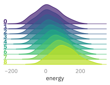


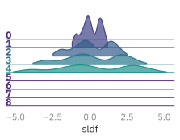


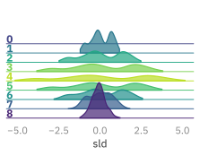


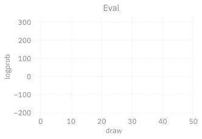


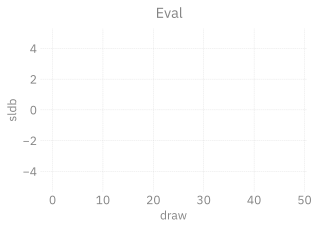


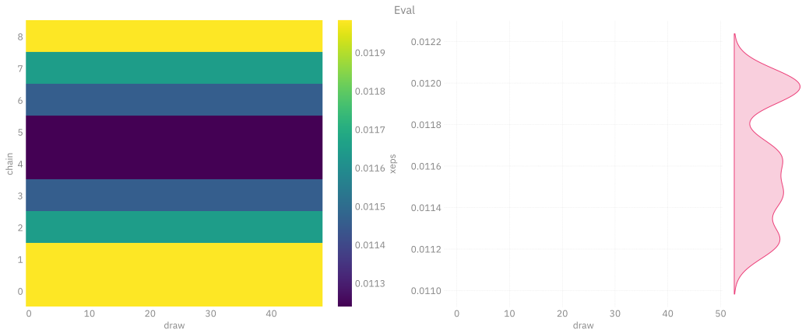


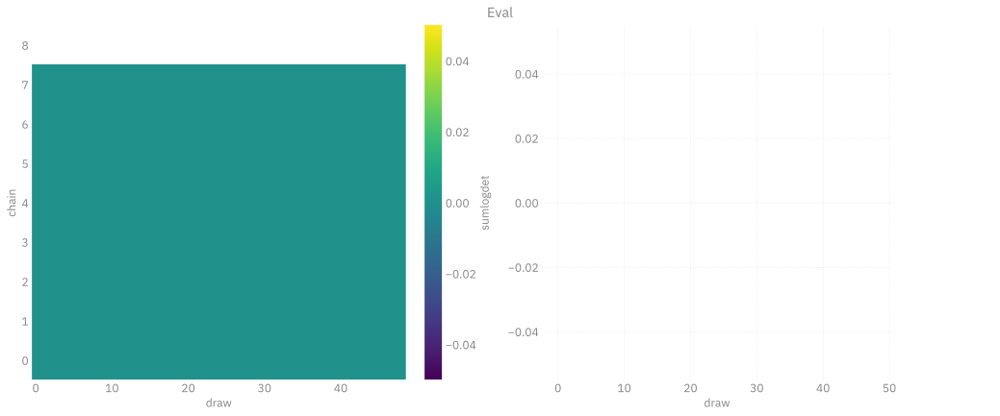

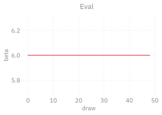


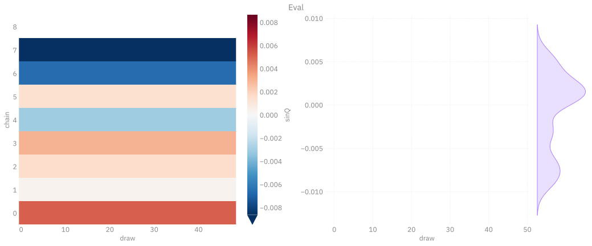

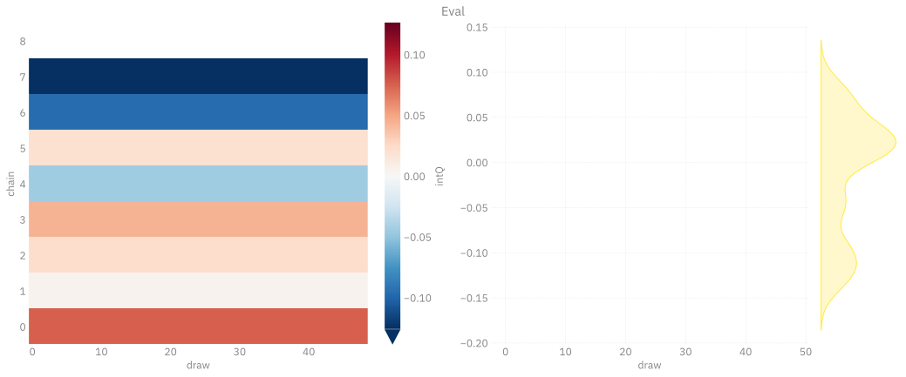


</div>

</details>

``` python
xeval = ptExpSU3.trainer.dynamics.unflatten(xeval)
logger.info(f"checkSU(x_eval): {g.checkSU(xeval)}")
logger.info(f"checkSU(x_eval): {g.checkSU(g.projectSU(xeval))}")
```

<details closed>

<summary>

Output:
</summary>

<div class="cell-output cell-output-display">

<pre style="white-space:pre;overflow-x:auto;line-height:normal;font-family: monospace"><span style="color: #838383; text-decoration-color: #838383">[</span><span style="color: #838383; text-decoration-color: #838383">2025-04-30 </span><span style="color: #808080; text-decoration-color: #808080">16:08:39</span><span style="color: #838383; text-decoration-color: #838383">][</span><span style="color: var(--bs-green); text-decoration-color: var(--bs-green); font-weight: bold">I</span><span style="color: #838383; text-decoration-color: #838383">][</span><span style="color: #008080; text-decoration-color: #008080; font-style: italic">ipykernel_24193</span><span style="color: #838383; text-decoration-color: #838383">/</span><span style="color: var(--bs-blue); text-decoration-color: var(--bs-blue)">2193937887</span><span style="color: #0000ff; text-decoration-color: #0000ff">:</span><span style="color: #838383; text-decoration-color: #838383">2</span><span style="color: #0000ff; text-decoration-color: #0000ff">:</span><span style="color: #14AC3C; text-decoration-color: #14AC3C; font-style: italic">ezpz.log</span><span style="color: #838383; text-decoration-color: #838383">]</span><span style="color: #838383; text-decoration-color: #838383"> </span><span style="color: var(--bs-purple); text-decoration-color: var(--bs-purple); font-weight: bold">checkSU</span><span style="color: #cccccc; text-decoration-color: #cccccc">(</span>x_eval<span style="color: #cccccc; text-decoration-color: #cccccc">)</span>: <span style="color: #cccccc; text-decoration-color: #cccccc">(</span>tensor<span style="color: #cccccc; text-decoration-color: #cccccc">[</span><span style="color: #ff00ff; text-decoration-color: #ff00ff">8</span><span style="color: #cccccc; text-decoration-color: #cccccc">]</span> f64 x∈<span style="color: #cccccc; text-decoration-color: #cccccc">[</span><span style="color: #ff00ff; text-decoration-color: #ff00ff">1.387e-16</span>, <span style="color: #ff00ff; text-decoration-color: #ff00ff">1.458e-16</span><span style="color: #cccccc; text-decoration-color: #cccccc">]</span> <span style="color: #0000ff; text-decoration-color: #0000ff; font-style: italic">μ</span>=<span style="color: #ff00ff; text-decoration-color: #ff00ff">1.433e-16</span> <span style="color: #0000ff; text-decoration-color: #0000ff; font-style: italic">σ</span>=<span style="color: #ff00ff; text-decoration-color: #ff00ff">2.311e-18</span> <span style="color: #cccccc; text-decoration-color: #cccccc">[</span><span style="color: #ff00ff; text-decoration-color: #ff00ff">1.425e-16</span>, <span style="color: #ff00ff; text-decoration-color: #ff00ff">1.457e-16</span>, <span style="color: #ff00ff; text-decoration-color: #ff00ff">1.387e-16</span>, <span style="color: #ff00ff; text-decoration-color: #ff00ff">1.458e-16</span>, <span style="color: #ff00ff; text-decoration-color: #ff00ff">1.436e-16</span>, <span style="color: #ff00ff; text-decoration-color: #ff00ff">1.422e-16</span>, <span style="color: #ff00ff; text-decoration-color: #ff00ff">1.432e-16</span>, <span style="color: #ff00ff; text-decoration-color: #ff00ff">1.447e-16</span><span style="color: #cccccc; text-decoration-color: #cccccc">]</span>, tensor<span style="color: #cccccc; text-decoration-color: #cccccc">[</span><span style="color: #ff00ff; text-decoration-color: #ff00ff">8</span><span style="color: #cccccc; text-decoration-color: #cccccc">]</span> f64 x∈<span style="color: #cccccc; text-decoration-color: #cccccc">[</span><span style="color: #ff00ff; text-decoration-color: #ff00ff">5.173e-16</span>, <span style="color: #ff00ff; text-decoration-color: #ff00ff">7.840e-16</span><span style="color: #cccccc; text-decoration-color: #cccccc">]</span> <span style="color: #0000ff; text-decoration-color: #0000ff; font-style: italic">μ</span>=<span style="color: #ff00ff; text-decoration-color: #ff00ff">6.551e-16</span> <span style="color: #0000ff; text-decoration-color: #0000ff; font-style: italic">σ</span>=<span style="color: #ff00ff; text-decoration-color: #ff00ff">1.029e-16</span> <span style="color: #cccccc; text-decoration-color: #cccccc">[</span><span style="color: #ff00ff; text-decoration-color: #ff00ff">7.840e-16</span>, <span style="color: #ff00ff; text-decoration-color: #ff00ff">6.628e-16</span>, <span style="color: #ff00ff; text-decoration-color: #ff00ff">5.173e-16</span>, <span style="color: #ff00ff; text-decoration-color: #ff00ff">6.288e-16</span>, <span style="color: #ff00ff; text-decoration-color: #ff00ff">6.088e-16</span>, <span style="color: #ff00ff; text-decoration-color: #ff00ff">7.452e-16</span>, <span style="color: #ff00ff; text-decoration-color: #ff00ff">5.299e-16</span>, <span style="color: #ff00ff; text-decoration-color: #ff00ff">7.638e-16</span><span style="color: #cccccc; text-decoration-color: #cccccc">])</span>
</pre>

<pre style="white-space:pre;overflow-x:auto;line-height:normal;font-family: monospace"><span style="color: #838383; text-decoration-color: #838383">[</span><span style="color: #838383; text-decoration-color: #838383">2025-04-30 </span><span style="color: #808080; text-decoration-color: #808080">16:08:39</span><span style="color: #838383; text-decoration-color: #838383">][</span><span style="color: var(--bs-green); text-decoration-color: var(--bs-green); font-weight: bold">I</span><span style="color: #838383; text-decoration-color: #838383">][</span><span style="color: #008080; text-decoration-color: #008080; font-style: italic">ipykernel_24193</span><span style="color: #838383; text-decoration-color: #838383">/</span><span style="color: var(--bs-blue); text-decoration-color: var(--bs-blue)">2193937887</span><span style="color: #0000ff; text-decoration-color: #0000ff">:</span><span style="color: #838383; text-decoration-color: #838383">3</span><span style="color: #0000ff; text-decoration-color: #0000ff">:</span><span style="color: #14AC3C; text-decoration-color: #14AC3C; font-style: italic">ezpz.log</span><span style="color: #838383; text-decoration-color: #838383">]</span><span style="color: #838383; text-decoration-color: #838383"> </span><span style="color: var(--bs-purple); text-decoration-color: var(--bs-purple); font-weight: bold">checkSU</span><span style="color: #cccccc; text-decoration-color: #cccccc">(</span>x_eval<span style="color: #cccccc; text-decoration-color: #cccccc">)</span>: <span style="color: #cccccc; text-decoration-color: #cccccc">(</span>tensor<span style="color: #cccccc; text-decoration-color: #cccccc">[</span><span style="color: #ff00ff; text-decoration-color: #ff00ff">8</span><span style="color: #cccccc; text-decoration-color: #cccccc">]</span> f64 x∈<span style="color: #cccccc; text-decoration-color: #cccccc">[</span><span style="color: #ff00ff; text-decoration-color: #ff00ff">1.352e-16</span>, <span style="color: #ff00ff; text-decoration-color: #ff00ff">1.451e-16</span><span style="color: #cccccc; text-decoration-color: #cccccc">]</span> <span style="color: #0000ff; text-decoration-color: #0000ff; font-style: italic">μ</span>=<span style="color: #ff00ff; text-decoration-color: #ff00ff">1.409e-16</span> <span style="color: #0000ff; text-decoration-color: #0000ff; font-style: italic">σ</span>=<span style="color: #ff00ff; text-decoration-color: #ff00ff">3.802e-18</span> <span style="color: #cccccc; text-decoration-color: #cccccc">[</span><span style="color: #ff00ff; text-decoration-color: #ff00ff">1.451e-16</span>, <span style="color: #ff00ff; text-decoration-color: #ff00ff">1.352e-16</span>, <span style="color: #ff00ff; text-decoration-color: #ff00ff">1.431e-16</span>, <span style="color: #ff00ff; text-decoration-color: #ff00ff">1.416e-16</span>, <span style="color: #ff00ff; text-decoration-color: #ff00ff">1.366e-16</span>, <span style="color: #ff00ff; text-decoration-color: #ff00ff">1.445e-16</span>, <span style="color: #ff00ff; text-decoration-color: #ff00ff">1.378e-16</span>, <span style="color: #ff00ff; text-decoration-color: #ff00ff">1.430e-16</span><span style="color: #cccccc; text-decoration-color: #cccccc">]</span>, tensor<span style="color: #cccccc; text-decoration-color: #cccccc">[</span><span style="color: #ff00ff; text-decoration-color: #ff00ff">8</span><span style="color: #cccccc; text-decoration-color: #cccccc">]</span> f64 x∈<span style="color: #cccccc; text-decoration-color: #cccccc">[</span><span style="color: #ff00ff; text-decoration-color: #ff00ff">4.654e-16</span>, <span style="color: #ff00ff; text-decoration-color: #ff00ff">7.451e-16</span><span style="color: #cccccc; text-decoration-color: #cccccc">]</span> <span style="color: #0000ff; text-decoration-color: #0000ff; font-style: italic">μ</span>=<span style="color: #ff00ff; text-decoration-color: #ff00ff">5.900e-16</span> <span style="color: #0000ff; text-decoration-color: #0000ff; font-style: italic">σ</span>=<span style="color: #ff00ff; text-decoration-color: #ff00ff">9.667e-17</span> <span style="color: #cccccc; text-decoration-color: #cccccc">[</span><span style="color: #ff00ff; text-decoration-color: #ff00ff">7.451e-16</span>, <span style="color: #ff00ff; text-decoration-color: #ff00ff">6.309e-16</span>, <span style="color: #ff00ff; text-decoration-color: #ff00ff">4.961e-16</span>, <span style="color: #ff00ff; text-decoration-color: #ff00ff">6.874e-16</span>, <span style="color: #ff00ff; text-decoration-color: #ff00ff">4.654e-16</span>, <span style="color: #ff00ff; text-decoration-color: #ff00ff">6.100e-16</span>, <span style="color: #ff00ff; text-decoration-color: #ff00ff">5.204e-16</span>, <span style="color: #ff00ff; text-decoration-color: #ff00ff">5.651e-16</span><span style="color: #cccccc; text-decoration-color: #cccccc">])</span>
</pre>

</div>

</details>

``` python
import matplotlib.pyplot as plt
pdiff = dataset_eval.plaqs - dataset_hmc.plaqs
pdiff
import xarray as xr

fig, ax = plt.subplots(figsize=(12, 4))
(pdiff ** 2).plot(ax=ax)  #, robust=True)
ax.set_title(r"$\left|\delta U_{\mu\nu}\right|^{2}$ (HMC - Eval)")
outfile = Path(EVAL_DIR).joinpath('pdiff.svg')
#%xmode fig.savefig(outfile.as_posix(), dpi=400, bbox_inches='tight')
plt.show()
```

<details closed>

<summary>

Output:
</summary>

<div class="cell-output cell-output-display">


</div>

</details>
