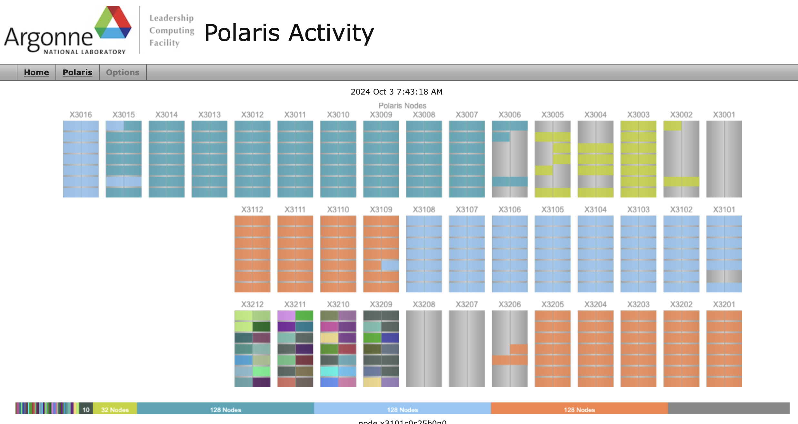

# Shared Resources
Sam Foreman
2025-07-15

<link rel="preconnect" href="https://fonts.googleapis.com">

- [Polaris Activity Webpage](#polaris-activity-webpage)

Supercomputers contain many computer *nodes* and not every application
will use ALL of them. Therefore, we use programs called *schedulers*
that allow users to schedule a *job* based on how many nodes they need
for a specified time.

A *job* is defined by a user and requires these parameters to be
defined:

run-time  
How long will this *job* run? 5 minutes? 60 minutes? 6 hours?

number-of-nodes  
How many compute *nodes* does the application need to run? 5 nodes? 100
nodes? 1000 nodes?

## Polaris Activity Webpage

- We have a page that shows all the current activity on Polaris. The top
  of the page shows a graphical representation of all nodes. Colors
  indicate a *job* running on that *node*. Below the graphic there is a
  table that lists *running* and *queued* jobs.

  - *running* refers to jobs running right now on comptuer nodes. If you
    hover on a colored node in the graphic, it will highlight all the
    nodes used by the same job AND the job in the *running* table below.
  - *queued* jobs are waiting for an opening in which to run.

- [📊 **Live Status of Jobs on
  Polaris**](https://status.alcf.anl.gov/#/polaris)

  
