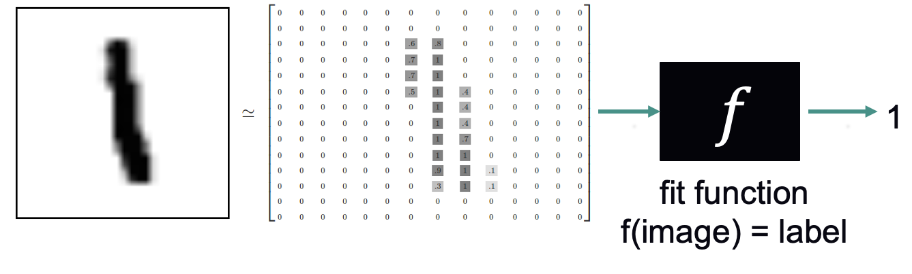

# Introduction to Neural Networks
Sam Foreman
2025-07-15

<link rel="preconnect" href="https://fonts.googleapis.com">

- [**References:**](#references)

This tutorial covers the basics of neural networks (aka “deep
learning”), which is a technique within machine learning that tends to
outperform other techniques when dealing with a large amount of data.

- 🎯 **Goals**:
  - Introduce deep learning fundamentals through hands-on activities
  - Provide the necessary background for the rest of the project
- 📖 **Definitions**:
  - *Artificial intelligence* (AI) is a set of approaches to solving
    complex problems by imitating the brain’s ability to learn.
  - *Machine learning* (ML) is the field of study that gives computers
    the ability to learn without being explicitly programmed
    (i.e. learning patterns instead of writing down rules.) Arguably,
    machine learning is now a subfield of AI.
- 🤔 **Recap**: Last week, we learned about using linear regression to
  predict the sale price of a house. We fit a function to the dataset:
  - Input: above ground square feet
  - Output: sale price
  - Function type: linear
  - Loss function: mean squared error
  - Optimization algorithm: stochastic gradient descent

  This week, we’ll work on a “classification” problem, which means that
  we have a category label for each data point, and we fit a function
  that can categorize inputs.

The [MNIST dataset](http://yann.lecun.com/exdb/mnist/) contains
thousands of examples of handwritten numbers, with each digit labeled
0-9.

Figure 1: MNIST Data Sample

We’ll start with the MNIST problem in this notebook:

[📓 Fitting MNIST with a multi-layer perceptron
(MLP)](../01-neural-networks/1-mnist/index.qmd)

Next week, we’ll learn about other types of neural networks.

## **References:**

- Here are some recommendations for further reading:
  - [tensorflow.org tutorials](https://www.tensorflow.org/tutorials)
  - [keras.io tutorials](https://keras.io/examples/)
  - [CS231n: Convolutional Neural Networks for Visual
    Recognition](http://cs231n.stanford.edu/)
  - [Deep Learning Specialization, Andrew
    Ng](https://www.coursera.org/specializations/deep-learning?utm_source=deeplearningai&utm_medium=institutions&utm_campaign=WebsiteCoursesDLSTopButton)
  - [PyTorch Challenge,
    Udacity](https://www.udacity.com/facebook-pytorch-scholarship)
  - [Deep Learning with
    Python](https://www.amazon.com/Deep-Learning-Python-Francois-Chollet/dp/1617294438)
  - [Keras Blog](https://blog.keras.io/)
  - [Hands-on ML
    book](https://www.oreilly.com/library/view/hands-on-machine-learning/9781492032632/)
    with [notebooks](https://github.com/ageron/handson-ml2).
