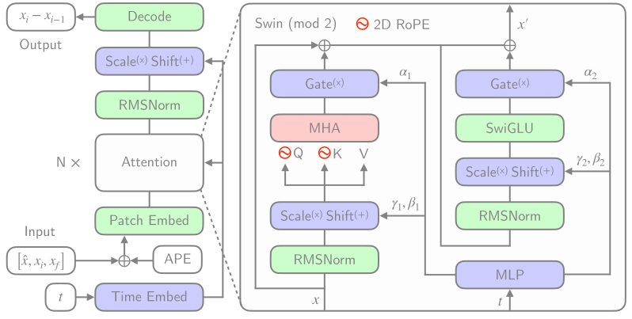
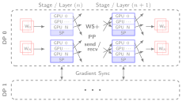

# AERIS: Argonne Earth Systems Model
Sam Foreman
2025-10-08

- [🌎 AERIS](#earth_americas-aeris)
- [High-Level Overview of AERIS](#high-level-overview-of-aeris)
- [Model Overview](#model-overview)
- [Windowed Self-Attention](#windowed-self-attention)
- [Model Architecture: Details](#model-architecture-details)
- [Limitations of Deterministic
  Models](#limitations-of-deterministic-models)
- [Transitioning to a Probabilistic
  Model](#transitioning-to-a-probabilistic-model)
- [Training at Scale](#training-at-scale)
- [Sequence-Window-Pipeline Parallelism
  `SWiPe`](#sequence-window-pipeline-parallelism-swipe)
- [Aurora](#aurora)
- [AERIS: Scaling Results](#aeris-scaling-results)
- [Hurricane Laura](#hurricane-laura)
- [Seasonal Forecast Stability](#seasonal-forecast-stability)
- [References](#references)

## 🌎 AERIS

Figure 1: [arXiv:2509.13523](https://arxiv.org/abs/2509.13523)

## High-Level Overview of AERIS

Figure 2: Rollout of AERIS model, specific humidity at 700m.

Table 1: Overview of AERIS model and training setup

|           Property | Description      |
|-------------------:|:-----------------|
|             Domain | Global           |
|         Resolution | 0.25° & 1.4°     |
|      Training Data | ERA5 (1979–2018) |
| Model Architecture | Swin Transformer |
|        Speedup[^1] | O(10k–100k)      |

## Model Overview

Table 2: Variables used in AERIS training and prediction

|   Variable   | Description                   |
|:------------:|:------------------------------|
|    `t2m`     | 2m Temperature                |
| `X` `u`(`v`) | $u$ ($v$) wind component @ Xm |
|     `q`      | Specific Humidity             |
|     `z`      | Geopotential                  |
|    `msl`     | Mean Sea Level Pressure       |
|    `sst`     | Sea Surface Temperature       |
|    `lsm`     | Land-sea mask                 |

- **Dataset**: ECMWF Reanalysis v5 (ERA5)
- **Variables**: Surface and pressure levels
- **Usage**: Medium-range weather forecasting
- **Partition**:
  - Train: 1979–2018[^2]
  - Val: 2019
  - Test: 2020
- **Data Size**: 100GB at 5.6° to 31TB at 0.25°

## Windowed Self-Attention

- **Benefits for weather modeling**:
  - Shifted windows capture both local patterns and long-range context
  - Constant scale, windowed self-attention provides high-resolution
    forecasts
  - Designed (currently) for fixed, 2D grids
- **Inspiration from SOTA LLMs**:
  - `RMSNorm`, `SwiGLU`, 2D `RoPE`

Figure 3: Windowed Self-Attention

## Model Architecture: Details

Figure 4: Model Architecture

## Limitations of Deterministic Models

- 
  **Transformers**:
  - *Deterministic*
  - Single input → single forecast

- 
  **Diffusion**:
  - *Probabilistic*
  - Single input → ***ensemble of forecasts***
  - Captures uncertainty and variability in weather predictions
  - Enables ensemble forecasting for better risk assessment

## Transitioning to a Probabilistic Model

Figure 5: Reverse diffusion with the
input condition, individual sampling
steps $t_{0} \rightarrow t_{64}$, the next time step
estimate and the
target output.

## Training at Scale

- 

## Sequence-Window-Pipeline Parallelism `SWiPe`

- `SWiPe` is a **novel parallelism strategy** for Swin-based
  Transformers
- Hybrid 3D Parallelism strategy, combining:
  - Sequence parallelism (`SP`)
  - Window parallelism (`WP`)
  - Pipeline parallelism (`PP`)

Figure 6

Figure 7: `SWiPe` Communication Patterns

## Aurora

Table 3: Aurora[^3] Specs

| Property | Value   |
|---------:|:--------|
|    Racks | 166     |
|    Nodes | 10,624  |
| XPUs[^4] | 127,488 |
|     CPUs | 21,248  |
|     NICs | 84,992  |
|      HBM | 8 PB    |
|    DDR5c | 10 PB   |

Figure 8: Aurora: [Fact
Sheet](https://www.alcf.anl.gov/sites/default/files/2024-07/Aurora_FactSheet_2024.pdf).

## AERIS: Scaling Results

Figure 9: AERIS: Scaling Results

- **10 EFLOPs** (sustained) @
  **120,960 GPUs**
- See (Hatanpää et al. (2025)) for additional details
- [arXiv:2509.13523](https://arxiv.org/abs/2509.13523)

## Hurricane Laura

Figure 10: Hurricane Laura tracks (top) and intensity (bottom).
Initialized 7(a), 5(b) and 3(c) days prior to 2020-08-28T00z.

## Seasonal Forecast Stability

Figure 11: S2S Stability: (a) Spring barrier El Niño with realistic
ensemble spread in the ocean; (b) qualitatively sharp fields of SST and
Q700 predicted 90 days in the future from the
closest ensemble member to the ERA5
in (a); and (c) stable Hovmöller diagrams of U850 anomalies (climatology
removed; m/s), averaged between 10°S and 10°N, for a 90-day rollout.

## References

Hatanpää, Väinö, Eugene Ku, Jason Stock, Murali Emani, Sam Foreman,
Chunyong Jung, Sandeep Madireddy, et al. 2025. “AERIS: Argonne Earth
Systems Model for Reliable and Skillful Predictions.”
<https://arxiv.org/abs/2509.13523>.

[^1]: Relative to PDE-based models, e.g.:
    [GFS](https://www.ncdc.noaa.gov/data-access/model-data/model-datasets/global-forcast-system-gfs)

[^2]: ~ 14,000 days of data

[^3]: 🏆 [Aurora Supercomputer Ranks Fastest for
    AI](https://www.intel.com/content/www/us/en/newsroom/news/intel-powered-aurora-supercomputer-breaks-exascale-barrier.html)

[^4]: Each node has 6 Intel Data Center GPU Max 1550 (code-named “Ponte
    Vecchio”) tiles, with 2 XPUs per tile.
