# Training Foundation Models on Supercomputers
Sam Foreman
2025-10-15

- [🌐 Distributed Training](#globe_with_meridians-distributed-training)
  - [🚀 Scaling: Overview](#rocket-scaling-overview)
  - [🐢 Training on a Single
    Device](#turtle-training-on-a-single-device)
  - [🕸️ Parallelism Strategies](#spider_web-parallelism-strategies)
  - [👬 Training on Multiple GPUs: Data
    Parallelism](#two_men_holding_hands-training-on-multiple-gpus-data-parallelism)
  - [▶️ Data Parallel: Forward
    Pass](#arrow_forward-data-parallel-forward-pass)
  - [◀️ Data Parallel: Backward
    Pass](#arrow_backward-data-parallel-backward-pass)
  - [🔄 Collective
    Communication](#arrows_counterclockwise-collective-communication)
  - [Reduce](#reduce)
  - [🐣 Getting Started: In
    Practice](#hatching_chick-getting-started-in-practice)
  - [📝 Plan of Attack](#pencil-plan-of-attack)
  - [🚀 Going Beyond Data
    Parallelism](#rocket-going-beyond-data-parallelism)
  - [Going beyond Data Parallelism: DeepSpeed +
    `ZeRO`](#going-beyond-data-parallelism-b58fc729-690b-4000-b19f-365a4093b2ff7b7b3c2069636f6e696679206c6f676f73206d6963726f736f66742d69636f6e203e7d7d-deepspeed--zero)
  - [🕸️ Additional Parallelism
    Strategies](#spider_web-additional-parallelism-strategies)
  - [Pipeline Parallelism (PP)](#pipeline-parallelism-pp)
  - [Tensor Parallel (TP)](#tensor-parallel-tp)
  - [Tensor Parallel (TP)](#tensor-parallel-tp-1)
  - [Tensor (/ Model) Parallel Training:
    Example](#tensor--model-parallel-training-example)
  - [🏗️ Aurora](#building_construction-aurora)
- [🌌 AuroraGPT (2024–)](#milky_way-auroragpt-2024)
  - [🧪 AuroraGPT: Open Science Foundation
    Model](#test_tube-auroragpt-open-science-foundation-model)
  - [🧰 AuroraGPT: Toolbox](#toolbox-auroragpt-toolbox)
  - [🏋️ Challenges: In Practice](#weight_lifting-challenges-in-practice)
  - [💾 AuroraGPT: Training](#floppy_disk-auroragpt-training)
  - [🍹 AuroraGPT: Blending Data,
    Efficiently](#tropical_drink-auroragpt-blending-data-efficiently)
  - [📉 Loss Curve: Training AuroraGPT-7B on 2T
    Tokens](#chart_with_downwards_trend-loss-curve-training-auroragpt-7b-on-2t-tokens)
  - [✨ Features](#sparkles-features)
  - [✨ Features (even more!)](#sparkles-features-even-more)
- [🧬 MProt-DPO](#dna-mprot-dpo)
  - [🧬 Scaling Results (2024)](#dna-scaling-results-2024)
  - [🧬 MProt-DPO: Scaling Results](#dna-mprot-dpo-scaling-results)
  - [🚂 Loooooooooong Sequence
    Lengths](#steam_locomotive-loooooooooong-sequence-lengths)
- [🌎 AERIS (2025)](#earth_americas-aeris-2025)
  - [👀 High-Level Overview of
    AERIS](#eyes-high-level-overview-of-aeris)
  - [➕ Contributions](#heavy_plus_sign-contributions)
  - [⚠️ Issues with the Deterministic
    Approach](#warning-issues-with-the-deterministic-approach)
  - [🎲 Transitioning to a Probabilistic
    Model](#game_die-transitioning-to-a-probabilistic-model)
  - [🌀 Sequence-Window-Pipeline Parallelism
    `SWiPe`](#cyclone-sequence-window-pipeline-parallelism-swipe)
  - [🚀 AERIS: Scaling Results](#rocket-aeris-scaling-results)
  - [🌪️ Hurricane Laura](#tornado-hurricane-laura)
- [📓 References](#notebook-references)
- [❤️ Acknowledgements](#heart-acknowledgements)

## 🌐 Distributed Training

### 🚀 Scaling: Overview

- ✅ **Goal**:
  - Minimize: Cost (i.e. amount of
    time spent training)
  - Maximize: Performance

  > [!NOTE]
  >
  > ### 📑 Note
  >
  > See [🤗 Performance and
  > Scalability](https://huggingface.co/docs/transformers/v4.46.0/performance)
  > for more details

In this talk, we will explore the intricacies of training foundation
models on supercomputers. We will discuss the architecture of these
models, the computational requirements, and the strategies employed to
optimize training processes. Attendees will gain insights into the
latest advancements in hardware and software that facilitate efficient
model training at scale.

### 🐢 Training on a Single Device

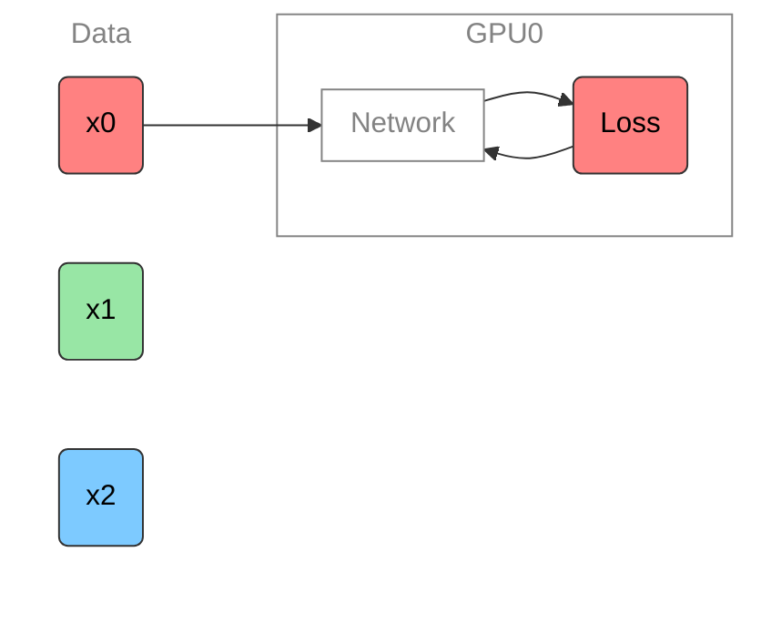
``` mermaid
flowchart LR
    subgraph G0["`GPU0`"]
        subgraph N0["`Network`"]
        end
        L0("`Loss`")
    end
    subgraph D["`Data`"]
        x("`x0`")
        x1("`x1`")
        x2("`x2`")
    end
    x --> N0
    N0 --> L0
    L0 --> N0
classDef block fill:#CCCCCC02,stroke:#838383,stroke-width:1px,color:#838383
classDef eblock fill:#CCCCCC02,stroke:#838383,stroke-width:0px,color:#838383
classDef red fill:#ff8181,stroke:#333,stroke-width:1px,color:#000
classDef green fill:#98E6A5,stroke:#333,stroke-width:1px,color:#000
classDef blue fill:#7DCAFF,stroke:#333,stroke-width:1px,color:#000
classDef grey fill:#cccccc,stroke:#333,stroke-width:1px,color:#000
class x,L0 red
class x1 green
class x2 blue
class x3 grey
class N0,G0,n0 block
class D eblock
```

Figure 1: **SLOW** !! model size limited by GPU memory

### 🕸️ Parallelism Strategies

- **Data Parallelism**
  - Split *data* across workers
  - Easiest to implement
  - *No changes to model*

- **Model Parallelism**
  - Split *model* across workers
- **Hybrid Parallelism**
  - Combine data + model parallelism
  - More complex to implement
  - Requires changes to model

### 👬 Training on Multiple GPUs: Data Parallelism

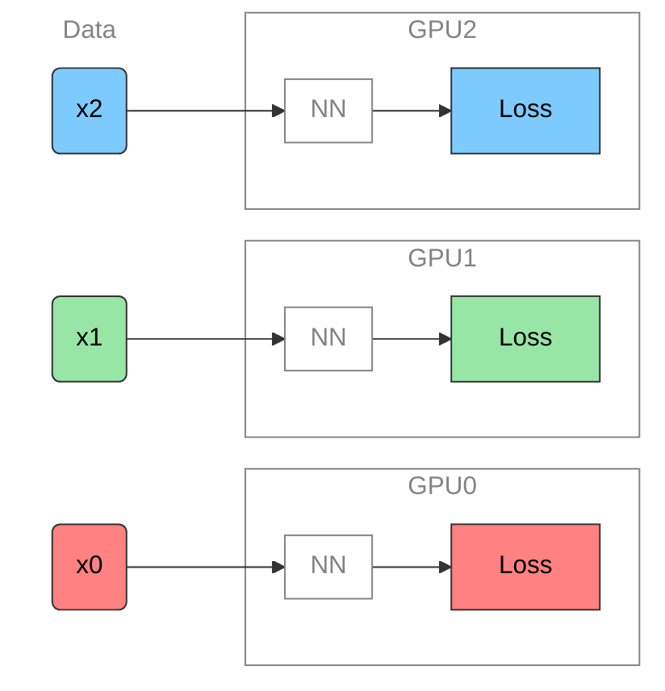
``` mermaid
flowchart LR
    subgraph D["`Data`"]
        direction TB
        x2("`x2`")
        x1("`x1`")
        x("`x0`")
    end
    direction LR
    subgraph G0["`GPU0`"]
        direction LR
        subgraph N0["`NN`"]
        end
        %%y0("`y₀`")
        L0["`Loss`"]
    end
    subgraph G1["`GPU1`"]
        direction LR
        subgraph N1["`NN`"]
        end
        L1["`Loss`"]
    end
    subgraph G2["`GPU2`"]
        direction LR
        subgraph N2["`NN`"]
        end
        L2["`Loss`"]
    end
    x --> N0
    x1 --> N1
    x2 --> N2
    N0 --> L0
    N1 --> L1
    N2 --> L2
classDef block fill:#CCCCCC02,stroke:#838383,stroke-width:1px,color:#838383
classDef eblock fill:#CCCCCC02,stroke:#838383,stroke-width:0px,color:#838383
classDef text fill:#CCCCCC02,stroke:#838383,stroke-width:0px,color:#838383
classDef grey fill:#cccccc,stroke:#333,stroke-width:1px,color:#000
classDef red fill:#ff8181,stroke:#333,stroke-width:1px,color:#000
classDef orange fill:#FFC47F,stroke:#333,stroke-width:1px,color:#000
classDef yellow fill:#FFFF7F,stroke:#333,stroke-width:1px,color:#000
classDef green fill:#98E6A5,stroke:#333,stroke-width:1px,color:#000
classDef blue fill:#7DCAFF,stroke:#333,stroke-width:1px,color:#000
classDef purple fill:#FFCBE6,stroke:#333,stroke-width:1px,color:#000
classDef eblock fill:#CCCCCC02,stroke:#838383,stroke-width:0px,color:#838383
class x,y0,L0 red
class x1,L1 green
class x2,L2 blue
class x3,ar grey
class N0,N1,N2,G0,G1,G2,GU block
class D eblock
class AR block
class bc text
```

Figure 2: Each GPU receives **unique** data at each step

- See [🤗 Methods and tools for efficient training on a single
  GPU](https://huggingface.co/docs/transformers/v4.46.0/perf_train_gpu_one)

### ▶️ Data Parallel: Forward Pass

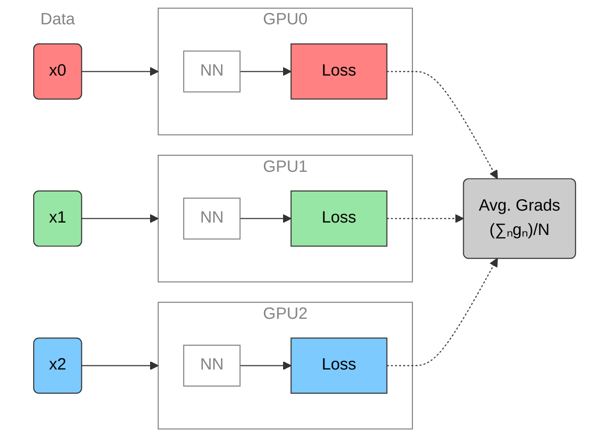
``` mermaid
flowchart LR
    subgraph D["`Data`"]
        direction TB
        x("`x0`")
        x1("`x1`")
        x2("`x2`")
    end
    direction LR
    subgraph G0["`GPU0`"]
        direction LR
        subgraph N0["`NN`"]
        end
        L0["`Loss`"]
    end
    subgraph G1["`GPU1`"]
        direction LR
        subgraph N1["`NN`"]
        end
        L1["`Loss`"]
    end
    subgraph G2["`GPU2`"]
        direction LR
        subgraph N2["`NN`"]
        end
        L2["`Loss`"]
    end
    ar("`Avg. Grads<br>(∑ₙgₙ)/N`")
    x --> G0
    x1 --> G1
    x2 --> G2
    N0 --> L0
    N1 --> L1
    N2 --> L2
    L0 -.-> ar
    L1 -.-> ar
    L2 -.-> ar
classDef eblock fill:#CCCCCC02,stroke:#838383,stroke-width:0px,color:#838383
classDef block fill:#CCCCCC02,stroke:#838383,stroke-width:1px,color:#838383
classDef grey fill:#cccccc,stroke:#333,stroke-width:1px,color:#000
classDef red fill:#ff8181,stroke:#333,stroke-width:1px,color:#000
classDef orange fill:#FFC47F,stroke:#333,stroke-width:1px,color:#000
classDef yellow fill:#FFFF7F,stroke:#333,stroke-width:1px,color:#000
classDef green fill:#98E6A5,stroke:#333,stroke-width:1px,color:#000
classDef blue fill:#7DCAFF,stroke:#333,stroke-width:1px,color:#000
classDef purple fill:#FFCBE6,stroke:#333,stroke-width:1px,color:#000
classDef text fill:#CCCCCC02,stroke:#838383,stroke-width:0px,color:#838383
class x,y0,L0 red
class x1,L1 green
class x2,L2 blue
class x3,ar grey
class N0,N1,N2,G0,G1,G2,GU block
class D eblock
class AR block
class bc text
```

Figure 3: Average gradients across all GPUs

### ◀️ Data Parallel: Backward Pass

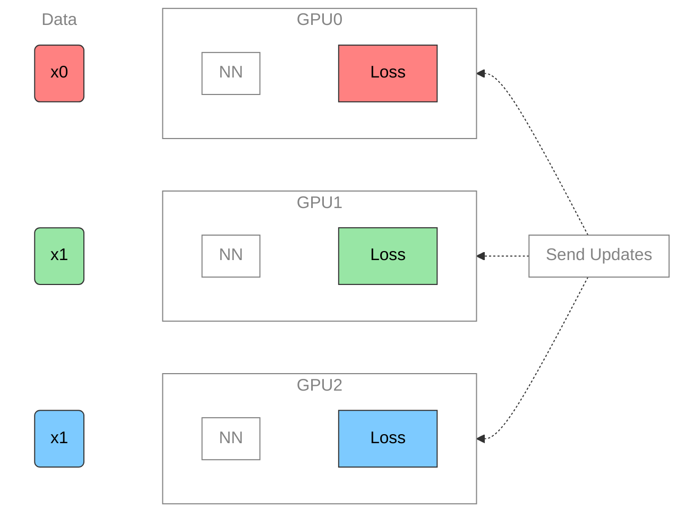
``` mermaid
flowchart RL
    subgraph D["`Data`"]
        direction TB
        x("`x0`")
        x1("`x1`")
        x2("`x1`")
    end
    subgraph G0["`GPU0`"]
        direction RL
        subgraph N0["`NN`"]
        end
        L0["`Loss`"]
    end
    subgraph G1["`GPU1`"]
        direction RL
        subgraph N1["`NN`"]
        end
        L1["`Loss`"]
    end
    subgraph G2["`GPU2`"]
        direction RL
        subgraph N2["`NN`"]
        end
        L2["`Loss`"]
    end
    subgraph BC["`Send Updates`"]
        direction TB
    end
    BC -.-> G0
    BC -.-> G1
    BC -.-> G2
    L0 ~~~ N0
    L1 ~~~ N1
    L2 ~~~ N2
    G0 ~~~ x
    G1 ~~~ x1
    G2 ~~~ x2
classDef grey fill:#cccccc,stroke:#333,stroke-width:1px,color:#000
classDef eblock fill:#CCCCCC02,stroke:#838383,stroke-width:0px,color:#838383
classDef block fill:#CCCCCC02,stroke:#838383,stroke-width:1px,color:#838383
classDef red fill:#ff8181,stroke:#333,stroke-width:1px,color:#000
classDef orange fill:#FFC47F,stroke:#333,stroke-width:1px,color:#000
classDef yellow fill:#FFFF7F,stroke:#333,stroke-width:1px,color:#000
classDef green fill:#98E6A5,stroke:#333,stroke-width:1px,color:#000
classDef blue fill:#7DCAFF,stroke:#333,stroke-width:1px,color:#000
classDef purple fill:#FFCBE6,stroke:#333,stroke-width:1px,color:#000
classDef text fill:#CCCCCC02,stroke:#838383,stroke-width:0px,color:#838383
class x,y0,L0 red
class x1,L1 green
class x2,L2 blue
class x3,ar grey
class N0,N1,N2,G0,G1,G2,GU block
class BC block
class bc text
class D eblock
```

Figure 4: Send global updates back to each GPU. See: [PyTorch /
Distributed Data
Parallel](https://pytorch.org/tutorials/intermediate/ddp_tutorial.html)

### 🔄 Collective Communication

- **Broadcast**: Send data from one node to all other nodes
- **Reduce**: Aggregate data from all nodes to one node
  - **AllReduce**: Aggregate data from all nodes to all nodes
- **Gather**: Collect data from all nodes to one node
  - **AllGather**: Collect data from all nodes to all nodes
- **Scatter**: Distribute data from one node to all other nodes

### Reduce

- Perform a *reduction* on data across ranks, send to individual

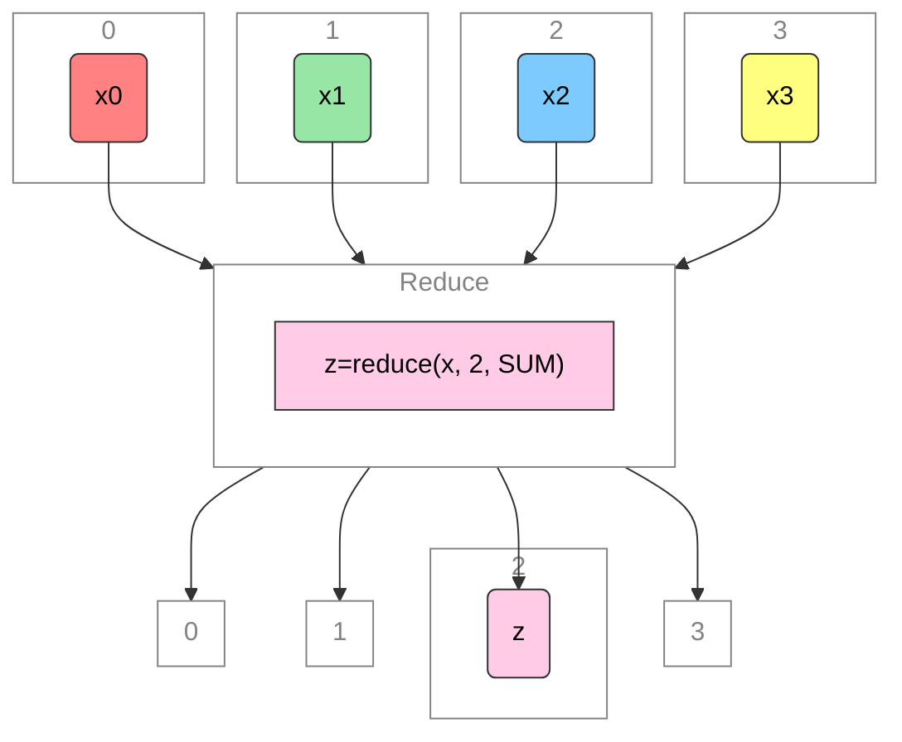
``` mermaid
flowchart TD
  subgraph R0["`0`"]
    x0("`x0`")
  end
  subgraph R1["`1`"]
    x1("`x1`")
  end
  subgraph R2["`2`"]
    x2("`x2`")
  end
  subgraph R3["`3`"]
    x3("`x3`")
  end
  subgraph AR["`Reduce`"]
    xp["`z=reduce(x, 2, SUM)`"]
  end
  subgraph AR3["`3`"]
  end
  subgraph AR2["`2`"]
    xp2("`z`")
  end
  subgraph AR1["`1`"]
  end
  subgraph AR0["`0`"]
  end
  x0 --> AR
  x1 --> AR
  x2 --> AR
  x3 --> AR
  AR --> AR3
  AR --> xp2
  AR --> AR1
  AR --> AR0
classDef block fill:#CCCCCC02,stroke:#838383,stroke-width:1px,color:#838383
classDef red fill:#ff8181,stroke:#333,stroke-width:1px,color:#000
classDef orange fill:#FFC47F,stroke:#333,stroke-width:1px,color:#000
classDef green fill:#98E6A5,stroke:#333,stroke-width:1px,color:#000
classDef yellow fill:#FFFF7F,stroke:#333,stroke-width:1px,color:#000
classDef blue fill:#7DCAFF,stroke:#333,stroke-width:1px,color:#000
classDef purple fill:#FFCBE6,stroke:#333,stroke-width:1px,color:#000
classDef pink fill:#E599F7,stroke:#333,stroke-width:1px,color:#000
class R0,R1,R2,R3,AR,AR0,AR1,AR2,AR3 block
class xp,xp2 purple
class x0 red
class x1 green
class x2 blue
class x3 yellow
```

Figure 5: Reduce operation: one rank receives the reduction of input
values across ranks

### 🐣 Getting Started: In Practice

- 📦 **Distributed Training Frameworks**:
  - 🍋 [saforem2 / `ezpz`](https://github.com/saforem2/ezpz)
  - 🤖 [Megatron-LM](https://github.com/NVIDIA/Megatron-LM)
  - 🤗 [Accelerate](https://huggingface.co/docs/accelerate/index)
  - 🔥 PyTorch
    - [DDP](https://docs.pytorch.org/tutorials/intermediate/ddp_tutorial.html)
      /
      [FSDP](https://docs.pytorch.org/tutorials/intermediate/FSDP_tutorial.html)
- 🚀 [DeepSpeed](https://www.deepspeed.ai/)
  - [ZeRO Offloading](https://www.deepspeed.ai/tutorials/zero/)
  - [Megatron-DeepSpeed](https://github.com/argonne-lcf/Megatron-DeepSpeed)

- 🧠 **Memory Management**:
  - FSDP vs. ZeRO
  - Activation Checkpointing
  - Mixed Precision Training
  - Gradient Accumulation
  - Offloading to CPU/NVMe

> [!IMPORTANT]
>
> ### 🔄 Keeping things in Sync
>
> **Computation stalls during communication !!**
>
> Keeping the communication to computation ratio small is important for
> effective scaling.

### 📝 Plan of Attack

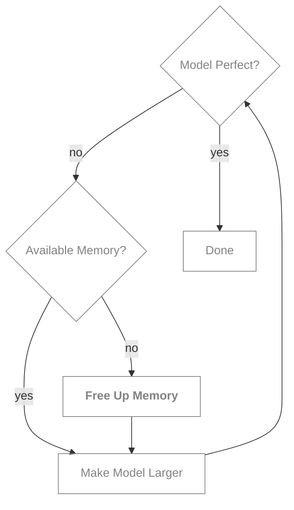
``` mermaid
flowchart TB
    A{"Model Perfect?"}
    A -- no --> M{"Available Memory?"}
    A -- yes --> AD["Done"]
    M -- yes --> MY["Make Model Larger"]
    M -- no --> ZMP["<b>Free Up Memory</b>"]
    MY --> A
    ZMP --> MY
    A:::block
    M:::block
    AD:::block
    MY:::block
    ZMP:::sblock
    classDef text fill:#CCCCCC02,stroke:#838383,stroke-width:0px,color:#838383
    classDef sblock fill:#CCCCCC02,stroke:#838383,stroke-width:1px,color:#838383,white-space:collapse
    classDef block fill:#CCCCCC02,stroke:#838383,stroke-width:1px,color:#838383
```

Figure 6: General strategy for scaling model training

### 🚀 Going Beyond Data Parallelism

- ✅ Useful when model fits on single GPU:
  - ultimately **limited by GPU memory**
  - model performance limited by size
- ⚠️ When model does not fit on a single GPU:
  - Offloading (can only get you so far…):
    -  [DeepSpeed + `ZeRO`](https://www.deepspeed.ai/tutorials/zero/)
    - 🔥 [PyTorch +
      `FSDP`](https://pytorch.org/blog/introducing-pytorch-fully-sharded-data-parallel-api/)
  - Otherwise, resort to [model parallelism
    strategies](#additional-parallelism-strategies)

### Going beyond Data Parallelism:  DeepSpeed + `ZeRO`

- Depending on the `ZeRO` stage (1, 2, 3), we can offload:
  1.  **Stage 1**: optimizer states $\left(P_{\mathrm{os}}\right)$
  2.  **Stage 2**: gradients + opt. states
      $\left(P_{\mathrm{os}+\mathrm{g}}\right)$
  3.  **Stage 3**: model params + grads + opt. states
      $\left(P_{\mathrm{os}+\mathrm{g}+\mathrm{p}}\right)$

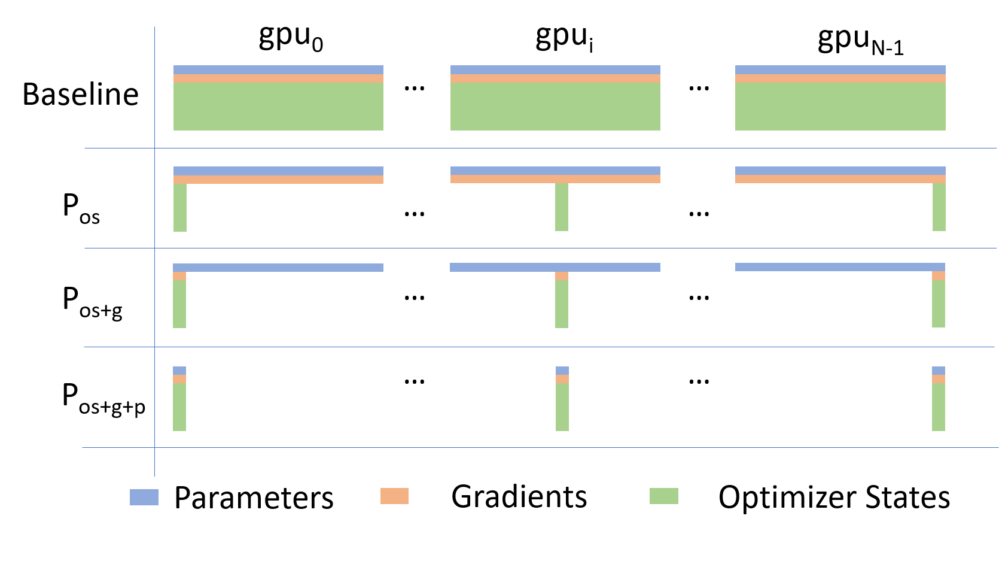

Figure 7: [DeepSpeed](deepspeed.ai) +
[`ZeRO`](https://www.deepspeed.ai/tutorials/zero-offload/)

### 🕸️ Additional Parallelism Strategies

- **Tensor (/ Model) Parallelism** (`TP`):
  - 🤗 [Tensor
    Parallelism](https://huggingface.co/docs/text-generation-inference/en/conceptual/tensor_parallelism)
  - 🔥 [Large Scale Transformer model training with Tensor Parallel
    (TP)](https://pytorch.org/tutorials/intermediate/TP_tutorial.html)
- **Pipeline Parallelism** (`PP`):
  - 🔥
    [PyTorch](https://pytorch.org/docs/main/distributed.pipelining.html),
    [DeepSpeed](https://deepspeed.readthedocs.io/en/latest/pipeline.html)
- **Sequence Parallelism** (`SP`):
  -  [DeepSpeed
    Ulysses](https://github.com/microsoft/DeepSpeed/blob/master/blogs/deepspeed-ulysses/README.md)
  - [Megatron / Context
    Parallelism](https://docs.nvidia.com/megatron-core/developer-guide/latest/api-guide/context_parallel.html)
  - [Unified Sequence Parallel
    (USP)](https://arxiv.org/abs/2405.07719v3)
    - 
      [feifeibear/`long-context-attention`](https://github.com/feifeibear/long-context-attention)
- [x]
  [argonne-lcf/`Megatron-DeepSpeed`](https://github.com/argonne-lcf/Megatron-DeepSpeed)
  - Supports 4D Parallelism (`DP` + `TP` + `PP` + `SP`)

### Pipeline Parallelism (PP)

- Model is split up **vertically** (layer-level) across multiple GPUs
- Each GPU:
  - has a portion of the full model
  - processes *in parallel* different stages of the pipeline (on a small
    chunk of the batch)
- See:
  - 🔥 [PyTorch / Pipeline
    Parallelism](https://pytorch.org/docs/main/distributed.pipelining.html)
  -  [DeepSpeed / Pipeline
    Parallelism](https://deepspeed.readthedocs.io/en/latest/pipeline.html)

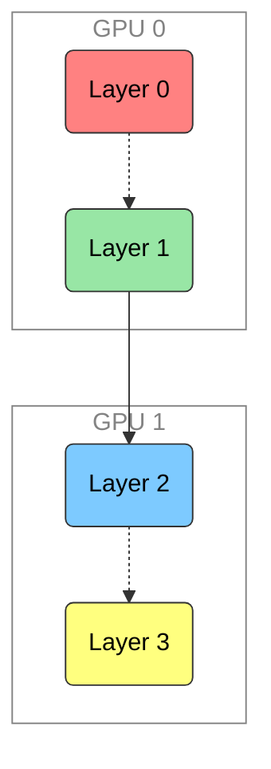
``` mermaid
flowchart TB
    subgraph G0["`GPU 0`"]
        direction LR
        a0("`Layer 0`")
        b0("`Layer 1`")
    end
    subgraph G1["`GPU 1`"]
        direction LR
        a1("`Layer 2`")
        b1("`Layer 3`")
    end
    a0 -.-> b0
    b0 --> a1
    a1 -.-> b1
classDef block fill:#CCCCCC02,stroke:#838383,stroke-width:1px,color:#838383
classDef red fill:#ff8181,stroke:#333,stroke-width:1px,color:#000
classDef orange fill:#FFC47F,stroke:#333,stroke-width:1px,color:#000
classDef yellow fill:#FFFF7F,stroke:#333,stroke-width:1px,color:#000
classDef green fill:#98E6A5,stroke:#333,stroke-width:1px,color:#000
classDef blue fill:#7DCAFF,stroke:#333,stroke-width:1px,color:#000
classDef purple fill:#FFCBE6,stroke:#333,stroke-width:1px,color:#000
class G0,G1 block
class a0 red
class b0 green
class a1 blue
class b1 yellow
```

Figure 8: Pipeline Parallelism

### Tensor Parallel (TP)

### Tensor Parallel (TP)

- Split up network over multiple workers
- Each receives disjoint subset
- All communication associated with subsets are distributed
- Communication whenever dataflow between two subsets
- Typically **more complicated** to implement than data parallel
  training
- Suitable when the model is too large to fit onto a single device (CPU
  / GPU)

### Tensor (/ Model) Parallel Training: Example

Want to compute:
$y = \sum_{i} x_{i} W_{i} = x_0 * W_0 + x_1 * W_1 + x_2 * W_2$  
where each GPU has only its portion of the full weights as shown below

1.  Compute: $y_{0} = x_{0} * W_{0}\rightarrow$ `GPU1`
2.  Compute: $y_{1} = y_{0} + x_{1} * W_{1}\rightarrow$ `GPU2`
3.  Compute: $y = y_{1} + x_{2} * W_{2} = \sum_{i} x_{i} W_{i}$ ✅

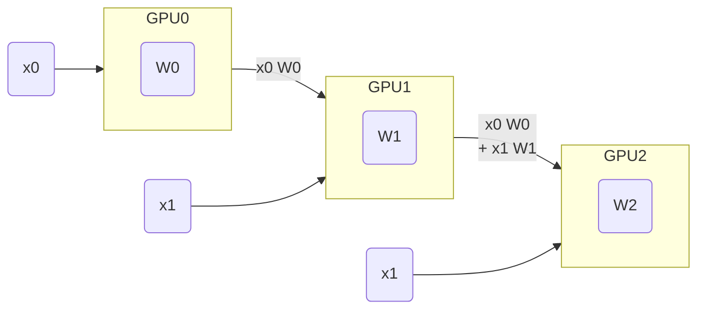
``` mermaid
flowchart LR
    subgraph X0["`GPU0`"]
        direction LR
        a("`W0`")
    end
    subgraph X1["`GPU1`"]
        direction LR
        b("`W1`")
    end
    subgraph X2["`GPU2`"]
        direction LR
        c("`W2`")
    end
  t0("`x0`")-->X0
  X0 -->|"`x0 W0`"|X1
  X1 -->|"`x0 W0 <br>+ x1 W1`"|X2
  t1("`x1`") --> X1
  t2("`x1`") --> X2
```

Figure 11

🔭
AI-for-Science  
[source](https://x.com/tenderizzation/status/1944591320796090606)
([@tenderizzation](https://twitter.com/tenderizzation))  
  

ChatGPT: [explain this
image](https://chatgpt.com/share/688ab77e-9ca0-800a-8ab0-a293e06b3cce)

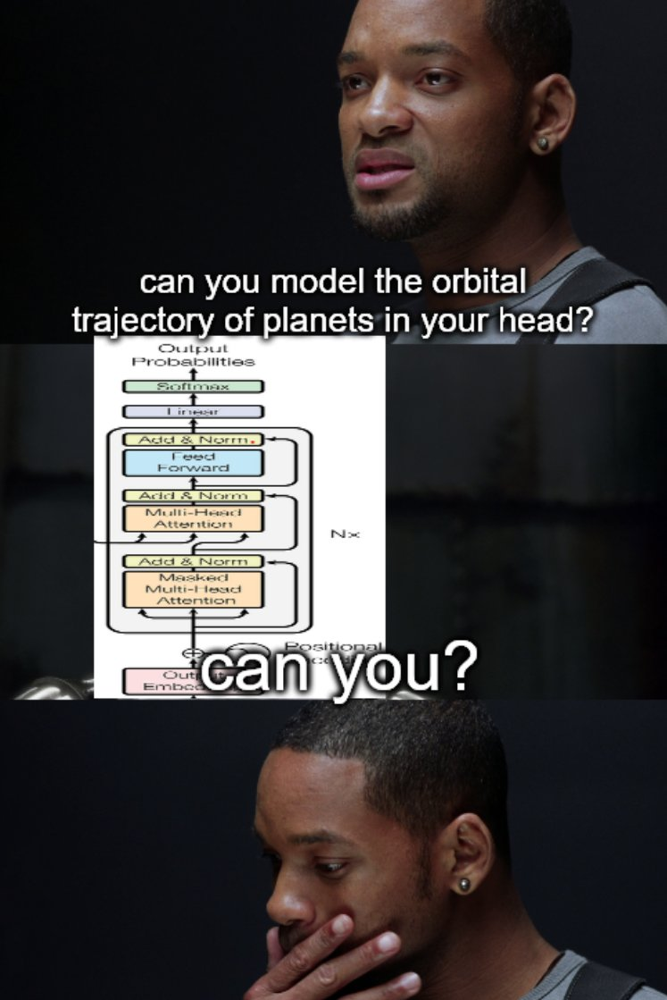

### 🏗️ Aurora

Table 1: Aurora[^1] Specs

| Property | Value   |
|---------:|:--------|
|    Racks | 166     |
|    Nodes | 10,624  |
| XPUs[^2] | 127,488 |
|     CPUs | 21,248  |
|     NICs | 84,992  |
|      HBM | 8 PB    |
|    DDR5c | 10 PB   |

Figure 12: Aurora: [Fact
Sheet](https://www.alcf.anl.gov/sites/default/files/2024-07/Aurora_FactSheet_2024.pdf).

## 🌌 AuroraGPT (2024–)

[**AuroraGPT**](https://auroragpt.anl.gov): *General purpose scientific
LLM* Broadly trained on a general corpora plus scientific {papers,
texts, data}

- **Explore pathways** towards a “Scientific Assistant” model
- **Build with international partners** (RIKEN, BSC, others)
- **Multilingual** English, 日本語, French, German, Spanish
- **Multimodal**: images, tables, equations, proofs, time series,
  graphs, fields, sequences, etc

Figure 13: Image from [Hannibal046 /
`Awesome-LLM`](https://github.com/Hannibal046/Awesome-LLM)

### 🧪 AuroraGPT: Open Science Foundation Model

Figure 14: High-level overview of AuroraGPT project

### 🧰 AuroraGPT: Toolbox

- **Datasets and data pipelines** (how do we deal with scientific data?)
- **Software infrastructure and workflows** (scalable, robust,
  extensible)
- **Evaluation of state-of-the-art LLM Models** (how do they perform on
  scientific tasks?)

> [!NOTE]
>
> ### 🚂 Training
>
> [argonne-lcf/Megatron-DeepSpeed](https://github.com/argonne-lcf/Megatron-DeepSpeed)  
> Large Model Training: Any Scale, Any
> Accelerator

> [!IMPORTANT]
>
> ### 🏃‍♂️ Running
>
> [argonne-lcf/inference-endpoints](https://github.com/argonne-lcf/inference-endpoints)  
> Inference endpoints for LLMs, hosted @
> ALCF

### 🏋️ Challenges: In Practice

This is *incredibly* difficult in practice, due in part to:

- Brand new {hardware, architecture, software}
- Lack of native support in existing frameworks (though getting better!)
- General system stability  
  +10k Nodes
  $\left(\times \frac{12\,\,\mathrm{XPU}}{1\,\,\mathrm{Node}}\right)\Rightarrow$
  +**100k** XPUs
  - network performance
  - file system stability (impacted by *other users* !)
  - *many* unexpected difficulties occur at increasingly large scales
- Combinatorial explosion of possible configurations and experiments
  - {hyperparameters, architectures, tokenizers, learning rates, …}

### 💾 AuroraGPT: Training

- To train a fixed model on trillions of tokens requires:
  1.  **Aggregating** data from multiple different *corpora*  
      (e.g. ArXiv, Reddit, StackExchange, GitHub, Wikipedia, etc.)
  2.  **Sampling** *each training batch* according to a fixed
      distribution across corpora
  3.  **Building** indices that map batches of tokens into these files
      (indexing)

  

  The original implementation was *slow*:

  - Designed to run *serially* on a **single device**
  - **Major bottleneck** when debugging data pipeline at scale

  

### 🍹 AuroraGPT: Blending Data, Efficiently

- 🐢 Original implementation:
  - **Slow** (serial, single device)
  - ~ 1 hr/2T tokens
- 🐇 New implementation:
  - **Fast!** (distributed, asynchronous)
  - ~ **2 min**/2T tokens  
    (**30x** faster !!)

Figure 15: Time spent preparing 2T tokens

### 📉 Loss Curve: Training AuroraGPT-7B on 2T Tokens

### ✨ Features

- 🕸️ **Parallelism**:
  - {data, tensor, pipeline, sequence, …}
- ♻️ **Checkpoint Converters**:
  - Megatron ⇄ 🤗 HF ⇄ ZeRO ⇄ Universal
- 🔀 **DeepSpeed Integration**:
  - ZeRO Offloading
  - Activation checkpointing
  - AutoTP (*WIP*)
  - ability to leverage features from DeepSpeed community

### ✨ Features (even more!)

- 🧗 **Optimizers**[^3]:
  - Support for *many* different optimizers:
    - Distributed Shampoo, Muon, Adopt, Sophia, Lamb, GaLORE,
      ScheduleFree, …
  - See [full
    list](https://github.com/argonne-lcf/Megatron-DeepSpeed/blob/e3b0398d2f2d3f8ec543e99373ca14bd18a1e4f8/megatron/arguments.py#L1477-L1502)
  - Large batch training
- 📊 **Experiment Tracking**:
  - Automatic experiment and metric tracking with Weights & Biases

## 🧬 MProt-DPO

- Finalist: SC’24 [ACM Gordon Bell
  Prize](https://sc24.supercomputing.org/2024/10/presenting-the-finalists-for-the-2024-gordon-bell-prize/)
  - [MProt-DPO: Breaking the ExaFLOPS Barrier for Multimodal Protein
    Design Workflows with Direct Preference
    Optimization](https://www.researchgate.net/profile/Carla-Mann-3/publication/387390653_MProt-DPO_Breaking_the_ExaFLOPS_Barrier_for_Multimodal_Protein_Design_Workflows_with_Direct_Preference_Optimization/links/67a0f736645ef274a46243f1/MProt-DPO-Breaking-the-ExaFLOPS-Barrier-for-Multimodal-Protein-Design-Workflows-with-Direct-Preference-Optimization.pdf)
    1)  
- One of the first protein design toolkits that integrates:
  - Text, (protein/gene) sequence, structure/conformational sampling
    modalities to build aligned representations for protein
    sequence-function mapping

### 🧬 Scaling Results (2024)

Figure 16: Scaling results for `3.5B` model across ~38,400 GPUs

- ~ 4 EFLOPS @ Aurora

- 38,400 XPUs  
  = 3200 \[node\] x 12 \[XPU / node\]

- 🎖️ [Gordon Bell
  Finalist](https://sc24.supercomputing.org/2024/10/presenting-the-finalists-for-the-2024-gordon-bell-prize/):

  - [MProt-DPO: Breaking the ExaFLOPS Barrier for Multimodal Protein
    Design Workflows](https://dl.acm.org/doi/10.1109/SC41406.2024.00013)
    (1)

This novel work presents a scalable, multimodal workflow for protein
design that trains an LLM to generate protein sequences, computationally
evaluates the generated sequences, and then exploits them to fine-tune
the model.

Direct Preference Optimization steers the LLM toward the generation of
preferred sequences, and enhanced workflow technology enables its
efficient execution. A 3.5B and a 7B model demonstrate scalability and
exceptional mixed precision performance of the full workflow on ALPS,
Aurora, Frontier, Leonardo and PDX.

### 🧬 MProt-DPO: Scaling Results

Figure 17: `3.5B` model

Figure 18: `7B` model

### 🚂 Loooooooooong Sequence Lengths

- Working with [
  Microsoft/DeepSpeed](https://github.com/microsoft/DeepSpeed) team to
  enable longer sequence lengths (context windows) for LLMs
  - See my [blog
    post](https://samforeman.me/posts/auroragpt/long-sequences/) for
    additional details

Figure 19: Maximum (achievable) `SEQ_LEN` for both `25B` and `33B`
models (See: Song et al. (2023))

[ `scaling4science`](https://github.com/saforem2/scaling4science)  
[
`Megatron-DS-Benchmarking`](https://github.com/saforem2/Megatron-DS-Benchmarking)

## 🌎 AERIS (2025)

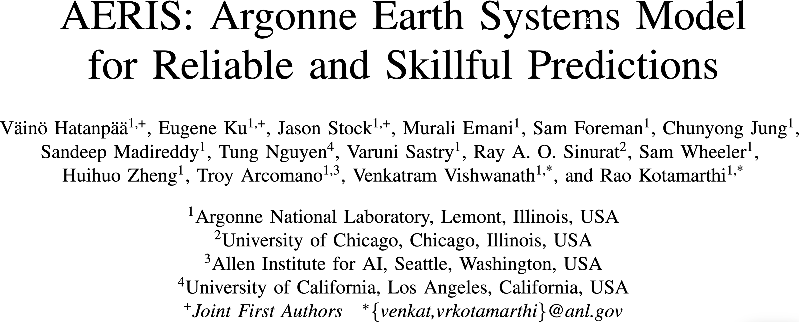

Figure 20: [arXiv:2509.13523](https://arxiv.org/abs/2509.13523)

> We demonstrate a significant advancement in AI weather and climate
> modeling with AERIS by efficient scaling of window-based transformer
> models. We have performed global medium-range forecasts with
> performance competitive with GenCast and surpassing the IFS ENS model,
> with longer, 90- day rollouts showing our ability to learn atmospheric
> dynamics on seasonal scales without collapsing, becoming the first
> diffusion-based model that can work across forecast scales from 6
> hours all the way to 3 months with remarkably accurate out of
> distribution predictions of extreme events.

### 👀 High-Level Overview of AERIS

Figure 21: Rollout of AERIS model, specific humidity at 700m.

Table 2: Overview of AERIS model and training setup

|           Property | Description      |
|-------------------:|:-----------------|
|             Domain | Global           |
|         Resolution | 0.25° & 1.4°     |
|      Training Data | ERA5 (1979–2018) |
| Model Architecture | Swin Transformer |
|        Speedup[^4] | O(10k–100k)      |

### ➕ Contributions

> [!CAUTION]
>
> ### ☔ AERIS
>
> *First
> billion-parameter diffusion model for weather + climate*
>
> - Operates at the pixel level (1 × 1 patch size), guided by physical
>   priors
> - Medium-range forecast skill:
>   - **Surpasses IFS ENS, competitive with GenCast[^5]**
>   - Uniquely stable on seasonal scales to 90 days

> [!NOTE]
>
> ### 🌀 SWiPe
>
> *A novel 3D
> (sequence-window-pipeline) parallelism strategy for training
> transformers across high-resolution inputs*
>
> - Enables scalable small-batch training on large supercomputers[^6]
>   - **10.21 ExaFLOPS**
>   - @ 121,000 Intel XPUs (Aurora)

### ⚠️ Issues with the Deterministic Approach

- 
  **Transformers**:
  - *Deterministic*
  - Single input → single forecast

- 
  **Diffusion**:
  - *Probabilistic*
  - Single input → ***ensemble of forecasts***
  - Captures uncertainty and variability in weather predictions
  - Enables ensemble forecasting for better risk assessment

### 🎲 Transitioning to a Probabilistic Model

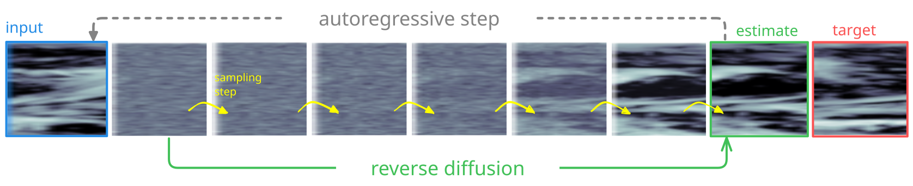

Figure 22: Reverse diffusion with the
input condition, individual sampling
steps $t_{0} \rightarrow t_{64}$, the next time step
estimate and the
target output.

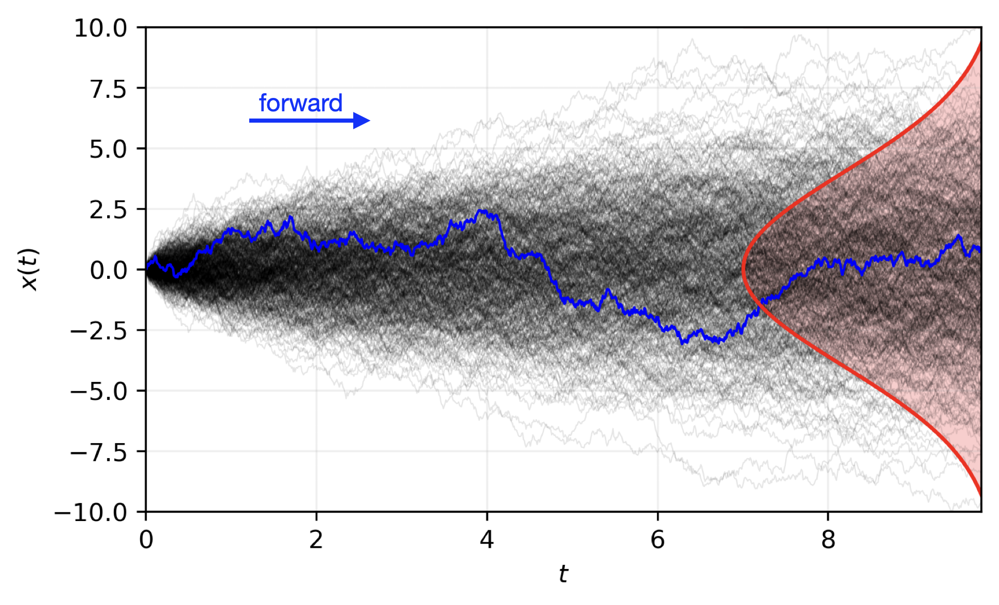

### 🌀 Sequence-Window-Pipeline Parallelism `SWiPe`

- `SWiPe` is a **novel parallelism strategy** for Swin-based
  Transformers
- Hybrid 3D Parallelism strategy, combining:
  - Sequence parallelism (`SP`)
  - Window parallelism (`WP`)
  - Pipeline parallelism (`PP`)

Figure 23

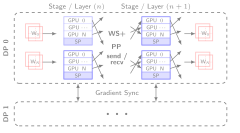

Figure 24: `SWiPe` Communication Patterns

### 🚀 AERIS: Scaling Results

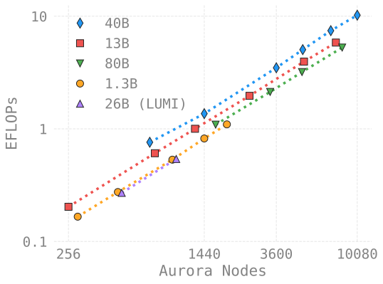

Figure 25: AERIS: Scaling Results

- **10 EFLOPs** (sustained) @
  **120,960 GPUs**
- See (Hatanpää et al. (2025)) for additional details
- [arXiv:2509.13523](https://arxiv.org/abs/2509.13523)

### 🌪️ Hurricane Laura

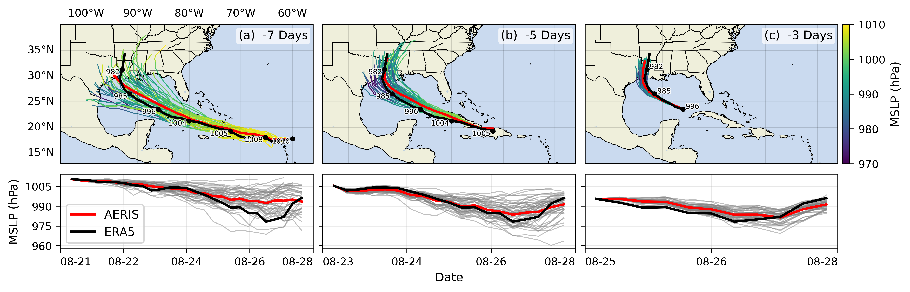

Figure 26: Hurricane Laura tracks (top) and intensity (bottom).
Initialized 7(a), 5(b) and 3(c) days prior to 2020-08-28T00z.

## 📓 References

Hatanpää, Väinö, Eugene Ku, Jason Stock, et al. 2025. *AERIS: Argonne
Earth Systems Model for Reliable and Skillful Predictions*.
<https://arxiv.org/abs/2509.13523>.

Price, Ilan, Alvaro Sanchez-Gonzalez, Ferran Alet, et al. 2024.
*GenCast: Diffusion-Based Ensemble Forecasting for Medium-Range
Weather*. <https://arxiv.org/abs/2312.15796>.

Song, Shuaiwen Leon, Bonnie Kruft, Minjia Zhang, et al. 2023.
*DeepSpeed4Science Initiative: Enabling Large-Scale Scientific Discovery
Through Sophisticated AI System Technologies*.
<https://arxiv.org/abs/2310.04610>.

## ❤️ Acknowledgements

> This research used resources of the Argonne Leadership Computing
> Facility, which is a DOE Office of Science User Facility supported
> under Contract DE-AC02-06CH11357.

[^1]: 🏆 [Aurora Supercomputer Ranks Fastest for
    AI](https://www.intel.com/content/www/us/en/newsroom/news/intel-powered-aurora-supercomputer-breaks-exascale-barrier.html)

[^2]: Each node has 6 Intel Data Center GPU Max 1550 (code-named “Ponte
    Vecchio”) tiles, with 2 XPUs per tile.

[^3]: Implemented by Marieme Ngom

[^4]: Relative to PDE-based models, e.g.:
    [GFS](https://www.ncdc.noaa.gov/data-access/model-data/model-datasets/global-forcast-system-gfs)

[^5]: [GenCast: A Generative Model for Medium-Range Global Weather
    Forecasting](https://arxiv.org/html/2312.15796v1) (Price et al.
    (2024))

[^6]: Demonstrated on up to 120,960 GPUs on Aurora and 8,064 GPUs on
    LUMI.
