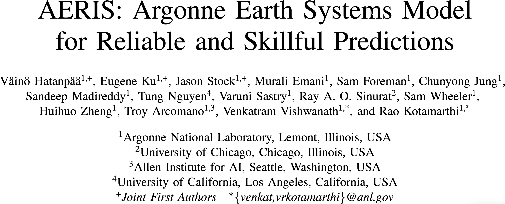

# Training Foundation Models on Supercomputers
Sam Foreman
2025-10-24

- [🧑🏻‍💻 About Me](#adultcomputer-about-me)
- [Argonne Leadership Computing Facility
  (ALCF)](#argonne-leadership-computing-facility-alcf)
  - [🏗️ Aurora](#building_construction-aurora)
  - [🤖 ALCF AI Testbed](#robot-alcf-ai-testbed)
- [🌌 AuroraGPT (2024–)](#milky_way-auroragpt-2024)
  - [🧪 AuroraGPT: Open Science Foundation
    Model](#test_tube-auroragpt-open-science-foundation-model)
  - [🧰 AuroraGPT: Toolbox](#toolbox-auroragpt-toolbox)
  - [👥 Team Leads](#busts_in_silhouette-team-leads)
  - [🤝 Teams](#handshake-teams)
  - [🏋️ Challenges: In Practice](#weight_lifting-challenges-in-practice)
  - [💾 AuroraGPT: Training](#floppy_disk-auroragpt-training)
  - [🍹 AuroraGPT: Blending Data,
    Efficiently](#tropical_drink-auroragpt-blending-data-efficiently)
  - [📉 Training AuroraGPT-7B on 2T
    Tokens](#chart_with_downwards_trend-training-auroragpt-7b-on-2t-tokens)
  - [📉 Training AuroraGPT-2B on 7T
    Tokens](#chart_with_downwards_trend-training-auroragpt-2b-on-7t-tokens)
  - [✨ Features](#sparkles-features)
  - [✨ Features (even more!)](#sparkles-features-even-more)
- [🧬 MProt-DPO](#dna-mprot-dpo)
  - [🧬 Scaling Results (2024)](#dna-scaling-results-2024)
  - [🧬 MProt-DPO: Scaling Results](#dna-mprot-dpo-scaling-results)
  - [🚂 Loooooooooong Sequence
    Lengths](#steam_locomotive-loooooooooong-sequence-lengths)
- [🌎 AERIS (2025)](#earth_americas-aeris-2025)
  - [👀 High-Level Overview of
    AERIS](#eyes-high-level-overview-of-aeris)
  - [➕ Contributions](#heavy_plus_sign-contributions)
  - [⚠️ Issues with the Deterministic
    Approach](#warning-issues-with-the-deterministic-approach)
  - [🎲 Transitioning to a Probabilistic
    Model](#game_die-transitioning-to-a-probabilistic-model)
  - [🌀 Sequence-Window-Pipeline Parallelism
    `SWiPe`](#cyclone-sequence-window-pipeline-parallelism-swipe)
  - [🚀 AERIS: Scaling Results](#rocket-aeris-scaling-results)
  - [🌪️ Hurricane Laura](#tornado-hurricane-laura)
- [📓 References](#notebook-references)
- [❤️ Acknowledgements](#heart-acknowledgements)
- [Extras](#extras)

## 🧑🏻‍💻 About Me

- 🏡 [samforeman.me](https://samforeman.me)
- UIUC (2015):
  - Engineering Physics + Applied Mathematics
- University of Iowa (2015–2019):
  - PhD. Physics[^1]
- ANL (2019–2022): Postdoctoral Researcher
- ANL (2022–Present): Assistant Computational Scientist
  - Member of the [AI/ML
    Group](https://www.alcf.anl.gov/about/people/group/506) at ALCF

Current Research:

- [AuroraGPT](https://auroragpt.anl.gov): Foundation Models for Science
- [AERIS](https://arxiv.org/abs/2509.13523): Argonne’s Earth System
  Model
  - Finalist for the [2025 ACM Gordon Bell Prize in Climate
    Modeling](https://awards.acm.org/bell-climate)
- [MProt-DPO](https://www.researchgate.net/publication/387390653_MProt-DPO_Breaking_the_ExaFLOPS_Barrier_for_Multimodal_Protein_Design_Workflows_with_Direct_Preference_Optimization):
  Multimodal Protein Design
  - Finalist for the [ACM Gordon Bell Prize
    2024](https://sc24.supercomputing.org/2024/10/presenting-the-finalists-for-the-2024-gordon-bell-prize/)
- [GenSLMs](https://www.biorxiv.org/content/10.1101/2022.10.10.511571v2):
  Genome Scale Language Models.
  - Winner of the [ACM Gordon Bell Special Prize for HPC-Based COVID-19
    Research](https://www.acm.org/media-center/2022/november/gordon-bell-special-prize-covid-research-2022)

## Argonne Leadership Computing Facility (ALCF)

> The ALCF enables breakthroughs in science and engineering by providing
> supercomputing resources and expertise to the research community.  
> –[*alcf.anl.gov*](https://alcf.anl.gov)

Images from [The Computer That Will Change Everything – Chicago
Magazine](https://www.chicagomag.com/chicago-magazine/february-2023/the-computer-that-will-change-everything/)

### 🏗️ Aurora

Table 1: Aurora[^2] Specs

| Property | Value   |
|---------:|:--------|
|    Racks | 166     |
|    Nodes | 10,624  |
| XPUs[^3] | 127,488 |
|     CPUs | 21,248  |
|     NICs | 84,992  |
|      HBM | 8 PB    |
|    DDR5c | 10 PB   |

Figure 1: Aurora: [Fact
Sheet](https://www.alcf.anl.gov/sites/default/files/2024-07/Aurora_FactSheet_2024.pdf).

### 🤖 ALCF AI Testbed

- ALCF AI Testbed Systems are in production and [available for
  allocations](https://accounts.alcf.anl.gov/#/allocationRequests) to
  the research community
- Significant improvement in time-to-solution and energy-efficiency for
  diverse AI for science applications.
- [NAIRR Pilot](https://nairrpilot.org/)

Up to **25**$\times$ improvement for genomic foundation models with
**6.5**$\times$ energy efficiency

Figure 2: **SambaNova SN-30**: 2nd Gen, 8 nodes with 64 AI Accelerators

Figure 3: **Graphcore Bow**: generation accelerators: Pod-64
configuration with 64 accelerators

Figure 4: **Cerebras**: 2x CS-2 WSE with Memory-X and Swarm-X
technologies

Figure 5: **GroqRack**: 9 nodes, 8 GroqChip v1.5 Tensor streaming
processors accelerators per node

🔭
AI-for-Science  
[source](https://x.com/tenderizzation/status/1944591320796090606)
([@tenderizzation](https://twitter.com/tenderizzation))  
  

ChatGPT: [explain this
image](https://chatgpt.com/share/688ab77e-9ca0-800a-8ab0-a293e06b3cce)

## 🌌 AuroraGPT (2024–)

[**AuroraGPT**](https://auroragpt.anl.gov): *General purpose scientific
LLM* Broadly trained on a general corpora plus scientific {papers,
texts, data}

- **Explore pathways** towards a “Scientific Assistant” model
- **Build with international partners** (RIKEN, BSC, others)
- **Multimodal**: images, tables, equations, proofs, time series,
  graphs, fields, sequences, etc

Figure 6: Image from [Hannibal046 /
`Awesome-LLM`](https://github.com/Hannibal046/Awesome-LLM)

### 🧪 AuroraGPT: Open Science Foundation Model

Figure 7: High-level overview of AuroraGPT project

### 🧰 AuroraGPT: Toolbox

- **Datasets and data pipelines** (how do we deal with scientific data?)
- **Software infrastructure and workflows** (scalable, robust,
  extensible)
- **Evaluation of state-of-the-art LLM Models** (how do they perform on
  scientific tasks?)

> [!NOTE]
>
> ### 🚂 Training
>
> [argonne-lcf/Megatron-DeepSpeed](https://github.com/argonne-lcf/Megatron-DeepSpeed)  
> Large Model Training: Any Scale, Any
> Accelerator

> [!IMPORTANT]
>
> ### 🏃‍♂️ Running
>
> [argonne-lcf/inference-endpoints](https://github.com/argonne-lcf/inference-endpoints)  
> Inference endpoints for LLMs, hosted @
> ALCF

### 👥 Team Leads

**Planning**

**Data**

**Training**

**Evaluation**

**Post**

**Inference**

**Comms**

**Distribution**

### 🤝 Teams

- **Planning**
- **Data Prep**
  - Accumulate 20+ T tokens of high-quality scientific text and
    structured data
- **Models
  / Training**[^4]
  - Train (entirely from scratch) a series of models on publicly
    available data
- **Evaluation**
  - Skills, trustworthiness, safety, robustness, privacy, machine ethics

- **Post-Training**
  - Fine-tuning, alignment
- **Inference**
  - Model serving, API development / public-facing web services
- **Distribution**
  - Licensing, generating and distributing artifacts for public
    consumption
- **Communication**

### 🏋️ Challenges: In Practice

This is *incredibly* difficult in practice, due in part to:

- Brand new {hardware, architecture, software}
- Lack of native support in existing frameworks (though getting better!)
- General system stability  
  +10k Nodes
  $\left(\times \frac{12\,\,\mathrm{XPU}}{1\,\,\mathrm{Node}}\right)\Rightarrow$
  +**100k** XPUs
  - network performance
  - file system stability (impacted by *other users* !)
  - *many* unexpected difficulties occur at increasingly large scales
- Combinatorial explosion of possible configurations and experiments
  - {hyperparameters, architectures, tokenizers, learning rates, …}

### 💾 AuroraGPT: Training

- To train a fixed model on trillions of tokens requires:
  1.  **Aggregating** data from multiple different *corpora*  
      (e.g. ArXiv, Reddit, StackExchange, GitHub, Wikipedia, etc.)
  2.  **Sampling** *each training batch* according to a fixed
      distribution across corpora
  3.  **Building** indices that map batches of tokens into these files
      (indexing)

  

  The original implementation was *slow*:

  - Designed to run *serially* on a **single device**
  - **Major bottleneck** when debugging data pipeline at scale

  

### 🍹 AuroraGPT: Blending Data, Efficiently

- 🐢 Original implementation:
  - **Slow** (serial, single device)
  - ~ 1 hr/2T tokens
- 🐇 New implementation:
  - **Fast!** (distributed, asynchronous)
  - ~ **2 min**/2T tokens  
    (**30x** faster !!)

Figure 8: Time spent preparing 2T tokens

### 📉 Training AuroraGPT-7B on 2T Tokens

### 📉 Training AuroraGPT-2B on 7T Tokens

Figure 9: (**new**) Loss vs number of consumed training tokens for
AuroraGPT-2B on 256 (blue) and 520 nodes (grey) of Aurora. Both runs
show stability through 7T tokens.

### ✨ Features

[argonne-lcf/Megatron-DeepSpeed](https://github.com/argonne-lcf/Megatron-DeepSpeed)

- 🕸️ **Parallelism**:
  - {data, tensor, pipeline, sequence, …}
- ♻️ **Checkpoint Converters**:
  - Megatron ⇄ 🤗 HF ⇄ ZeRO ⇄ Universal
- 🔀 **DeepSpeed Integration**:
  - ZeRO Offloading
  - Activation checkpointing
  - AutoTP (*WIP*)
  - ability to leverage features from DeepSpeed community

### ✨ Features (even more!)

- 🧗 **Optimizers**[^5]:
  - Support for *many* different optimizers:
    - Distributed Shampoo, Muon, Adopt, Sophia, Lamb, GaLORE,
      ScheduleFree, …
  - See [full
    list](https://github.com/argonne-lcf/Megatron-DeepSpeed/blob/e3b0398d2f2d3f8ec543e99373ca14bd18a1e4f8/megatron/arguments.py#L1477-L1502)
  - Large batch training
- 📊 **Experiment Tracking**:
  - Automatic experiment and metric tracking with Weights & Biases

## 🧬 MProt-DPO

- Finalist: SC’24 [ACM Gordon Bell
  Prize](https://sc24.supercomputing.org/2024/10/presenting-the-finalists-for-the-2024-gordon-bell-prize/)
  - [MProt-DPO: Breaking the ExaFLOPS Barrier for Multimodal Protein
    Design Workflows with Direct Preference
    Optimization](https://www.researchgate.net/profile/Carla-Mann-3/publication/387390653_MProt-DPO_Breaking_the_ExaFLOPS_Barrier_for_Multimodal_Protein_Design_Workflows_with_Direct_Preference_Optimization/links/67a0f736645ef274a46243f1/MProt-DPO-Breaking-the-ExaFLOPS-Barrier-for-Multimodal-Protein-Design-Workflows-with-Direct-Preference-Optimization.pdf)
    (Dharuman et al. (2024))
- One of the first protein design toolkits that integrates:
  - Text, (protein/gene) sequence, structure/conformational sampling
    modalities to build aligned representations for protein
    sequence-function mapping

### 🧬 Scaling Results (2024)

Figure 10: Scaling results for `3.5B` model across ~38,400 GPUs

- ~ 4 EFLOPS @ Aurora

- 38,400 XPUs  
  = 3200 \[node\] x 12 \[XPU / node\]

- 🎖️ [Gordon Bell
  Finalist](https://sc24.supercomputing.org/2024/10/presenting-the-finalists-for-the-2024-gordon-bell-prize/):

  - [MProt-DPO: Breaking the ExaFLOPS Barrier for Multimodal Protein
    Design Workflows](https://dl.acm.org/doi/10.1109/SC41406.2024.00013)
    (Dharuman et al. (2024))

This novel work presents a scalable, multimodal workflow for protein
design that trains an LLM to generate protein sequences, computationally
evaluates the generated sequences, and then exploits them to fine-tune
the model.

Direct Preference Optimization steers the LLM toward the generation of
preferred sequences, and enhanced workflow technology enables its
efficient execution. A 3.5B and a 7B model demonstrate scalability and
exceptional mixed precision performance of the full workflow on ALPS,
Aurora, Frontier, Leonardo and PDX.

### 🧬 MProt-DPO: Scaling Results

Figure 11: `3.5B` model

Figure 12: `7B` model

### 🚂 Loooooooooong Sequence Lengths

- Working with [
  Microsoft/DeepSpeed](https://github.com/microsoft/DeepSpeed) team to
  enable longer sequence lengths (context windows) for LLMs
  - See my [blog
    post](https://samforeman.me/posts/auroragpt/long-sequences/) for
    additional details

Figure 13: Maximum (achievable) `SEQ_LEN` for both `25B` and `33B`
models (See: Song et al. (2023))

[ `scaling4science`](https://github.com/saforem2/scaling4science)  
[
`Megatron-DS-Benchmarking`](https://github.com/saforem2/Megatron-DS-Benchmarking)

## 🌎 AERIS (2025)

Figure 14: [arXiv:2509.13523](https://arxiv.org/abs/2509.13523)

> We demonstrate a significant advancement in AI weather and climate
> modeling with AERIS by efficient scaling of window-based transformer
> models. We have performed global medium-range forecasts with
> performance competitive with GenCast and surpassing the IFS ENS model,
> with longer, 90- day rollouts showing our ability to learn atmospheric
> dynamics on seasonal scales without collapsing, becoming the first
> diffusion-based model that can work across forecast scales from 6
> hours all the way to 3 months with remarkably accurate out of
> distribution predictions of extreme events.

### 👀 High-Level Overview of AERIS

Figure 15: Rollout of AERIS model, specific humidity at 700m.

Table 2: Overview of AERIS model and training setup

|           Property | Description      |
|-------------------:|:-----------------|
|             Domain | Global           |
|         Resolution | 0.25° & 1.4°     |
|      Training Data | ERA5 (1979–2018) |
| Model Architecture | Swin Transformer |
|        Speedup[^6] | O(10k–100k)      |

### ➕ Contributions

> [!CAUTION]
>
> ### ☔ AERIS
>
> *First
> billion-parameter diffusion model for weather + climate*
>
> - Operates at the pixel level (1 × 1 patch size), guided by physical
>   priors
> - Medium-range forecast skill:
>   - **Surpasses IFS ENS, competitive with GenCast[^7]**
>   - Uniquely stable on seasonal scales to 90 days

> [!NOTE]
>
> ### 🌀 SWiPe
>
> *A novel 3D
> (sequence-window-pipeline) parallelism strategy for training
> transformers across high-resolution inputs*
>
> - Enables scalable small-batch training on large supercomputers[^8]
>   - **10.21 ExaFLOPS**
>   - @ 121,000 Intel XPUs (Aurora)

### ⚠️ Issues with the Deterministic Approach

- 
  **Transformers**:
  - *Deterministic*
  - Single input → single forecast

- 
  **Diffusion**:
  - *Probabilistic*
  - Single input → ***ensemble of forecasts***
  - Captures uncertainty and variability in weather predictions
  - Enables ensemble forecasting for better risk assessment

### 🎲 Transitioning to a Probabilistic Model

Figure 16: Reverse diffusion with the
input condition, individual sampling
steps $t_{0} \rightarrow t_{64}$, the next time step
estimate and the
target output.

### 🌀 Sequence-Window-Pipeline Parallelism `SWiPe`

- `SWiPe` is a **novel parallelism strategy** for Swin-based
  Transformers
- Hybrid 3D Parallelism strategy, combining:
  - Sequence parallelism (`SP`)
  - Window parallelism (`WP`)
  - Pipeline parallelism (`PP`)

Figure 17

Figure 18: `SWiPe` Communication Patterns

### 🚀 AERIS: Scaling Results

Figure 19: AERIS: Scaling Results

- **10 EFLOPs** (sustained) @
  **120,960 GPUs**
- See (Hatanpää et al. (2025)) for additional details
- [arXiv:2509.13523](https://arxiv.org/abs/2509.13523)

### 🌪️ Hurricane Laura

Figure 20: Hurricane Laura tracks (top) and intensity (bottom).
Initialized 7(a), 5(b) and 3(c) days prior to 2020-08-28T00z.

## 📓 References

Dharuman, Gautham, Kyle Hippe, Alexander Brace, Sam Foreman, Väinö
Hatanpää, Varuni K. Sastry, Huihuo Zheng, et al. 2024. “MProt-DPO:
Breaking the ExaFLOPS Barrier for Multimodal Protein Design Workflows
with Direct Preference Optimization.” In *Proceedings of the
International Conference for High Performance Computing, Networking,
Storage, and Analysis*. SC ’24. Atlanta, GA, USA: IEEE Press.
<https://doi.org/10.1109/SC41406.2024.00013>.

Hatanpää, Väinö, Eugene Ku, Jason Stock, Murali Emani, Sam Foreman,
Chunyong Jung, Sandeep Madireddy, et al. 2025. “AERIS: Argonne Earth
Systems Model for Reliable and Skillful Predictions.”
<https://arxiv.org/abs/2509.13523>.

Price, Ilan, Alvaro Sanchez-Gonzalez, Ferran Alet, Tom R. Andersson,
Andrew El-Kadi, Dominic Masters, Timo Ewalds, et al. 2024. “GenCast:
Diffusion-Based Ensemble Forecasting for Medium-Range Weather.”
<https://arxiv.org/abs/2312.15796>.

Song, Shuaiwen Leon, Bonnie Kruft, Minjia Zhang, Conglong Li, Shiyang
Chen, Chengming Zhang, Masahiro Tanaka, et al. 2023. “DeepSpeed4Science
Initiative: Enabling Large-Scale Scientific Discovery Through
Sophisticated AI System Technologies.”
<https://arxiv.org/abs/2310.04610>.

## ❤️ Acknowledgements

> This research used resources of the Argonne Leadership Computing
> Facility, which is a DOE Office of Science User Facility supported
> under Contract DE-AC02-06CH11357.

## Extras

[^1]: [A Machine Learning Approach to Lattice Gauge
    Theory](https://www.researchgate.net/publication/337499051_Learning_better_physics_a_machine_learning_approach_to_lattice_gauge_theory)

[^2]: 🏆 [Aurora Supercomputer Ranks Fastest for
    AI](https://www.intel.com/content/www/us/en/newsroom/news/intel-powered-aurora-supercomputer-breaks-exascale-barrier.html)

[^3]: Each node has 6 Intel Data Center GPU Max 1550 (code-named “Ponte
    Vecchio”) tiles, with 2 XPUs per tile.

[^4]: Co-led by: Venkat Vishwanath, Sam Foreman

[^5]: Implemented by Marieme Ngom

[^6]: Relative to PDE-based models, e.g.:
    [GFS](https://www.ncdc.noaa.gov/data-access/model-data/model-datasets/global-forcast-system-gfs)

[^7]: [GenCast: A Generative Model for Medium-Range Global Weather
    Forecasting](https://arxiv.org/html/2312.15796v1) (Price et al.
    (2024))

[^8]: Demonstrated on up to 120,960 GPUs on Aurora and 8,064 GPUs on
    LUMI.
