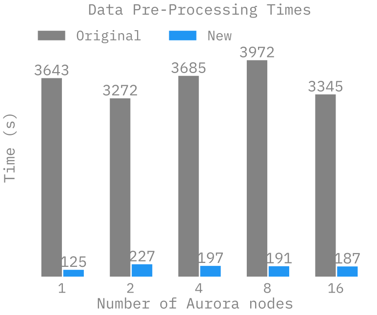
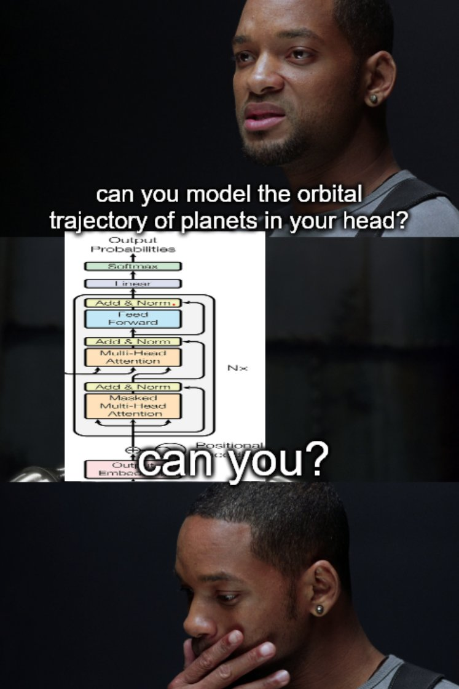

# AuroraGPT
[Sam Foreman](https://samforeman.me)
2025-07-31

<link rel="preconnect" href="https://fonts.googleapis.com">
<link href="https://iosevka-webfonts.github.io/iosevka/iosevka.css" rel="stylesheet">

- [🎯 AuroraGPT: Goals](#dart-auroragpt-goals)
- [🧪 AuroraGPT: Open Science Foundation
  Model](#test_tube-auroragpt-open-science-foundation-model)
- [🧰 AuroraGPT: Toolbox](#toolbox-auroragpt-toolbox)
- [🌌 Aurora](#milky_way-aurora)
- [🤝 Teams](#handshake-teams)
- [🎯 Goals](#dart-goals)
- [🏋️ Challenges: In Practice](#weight_lifting-challenges-in-practice)
- [💾 Training: 2T Tokens](#floppy_disk-training-2t-tokens)
- [🍹 Blending Data,
  Efficiently](#tropical_drink-blending-data-efficiently)
- [📉 Loss Curve: Training AuroraGPT-7B on 2T
  Tokens](#chart_with_downwards_trend-loss-curve-training-auroragpt-7b-on-2t-tokens)
- [✨ Features](#sparkles-features)
- [✨ Features (even more!)](#sparkles-features-even-more)
- [🤔 Evaluating Models on Scientific
  Applications](#thinking-evaluating-models-on-scientific-applications)
- [⚖️ Evaluating FM Skills for Science:
  Criteria](#balance_scale-evaluating-fm-skills-for-science-criteria)
- [🧬 MProt-DPO: Scaling Results](#dna-mprot-dpo-scaling-results)
- [🧬 MProt-DPO: Scaling Results](#dna-mprot-dpo-scaling-results-1)
- [🚂 Loooooooooong Sequence
  Lengths](#steam_locomotive-loooooooooong-sequence-lengths)
- [📓 References](#notebook-references)
- [❤️ Thank you!](#heart-thank-you)
- [📑 Bibliography](#bookmark_tabs-bibliography)

## 🎯 AuroraGPT: Goals

[**AuroraGPT**](https://auroragpt.anl.gov): *General purpose scientific
LLM* Broadly trained on a general corpora plus scientific {papers,
texts, data}

- **Explore pathways** towards a “Scientific Assistant” model
- **Build with international partners** (RIKEN, BSC, others)
- **Multilingual** English, 日本語, French, German, Spanish
- **Multimodal**: images, tables, equations, proofs, time series,
  graphs, fields, sequences, etc

Figure 1: Image from [Hannibal046 /
`Awesome-LLM`](https://github.com/Hannibal046/Awesome-LLM)

- Here to talk about AuroraGPT, Argonne’s internal effort to build a
  general purpose scientific LLM, broadly trained on a general corpora
  of text + scientific {papers, text, data}

- As part of this effort, we plan to…

  - Explore pathways, build with international partners, multi-{lingual,
    modal}

- Rough timeline of the project and deliverables:

  - 202{3,4}: text-only models, plan to release a series of {7B, 70B,
    1T} models
  - 202{4,5}: Basic multi-modal models
  - 202{5,6}: Advanced scientific multimodal models
  - 

- AuroraGPT: Exascale Pre-Training of Large Language Models on Diverse
  Accelerators \>
  [argonne-lcf/Megatron-DeepSpeed](https://github.com/argonne-lcf/Megatron-DeepSpeed)
  \> Large Model Training: any scale, any accelerator

- Thoughts:

  - yeah okay so I’ll probably try and include then like:
    - [x] {tensor, pipeline, sequence}-parallelism
    - [x] DeepSpeed integration (ZeRO offloading, activation
      checkpointing, …)
    - [x] Robust mechanisms for automatic experiment {configuration,
      tracking, …}
    - [x] Support for modern (and experimental!) optimizers
    - [x] Large batch training

- Goals

- Issues with existing models

- AuroraGPT

  - Project Details
  - Teams, Ongoing Efforts
  - Scientific Evaluations

- Scaling Results

  - MProt-DPO
  - ~~aeris~~ (??)

## 🧪 AuroraGPT: Open Science Foundation Model

Figure 2: High-level overview of AuroraGPT project

- AuroraGPT will be a publicly distributed, open source foundation model
  for open science
- Is being trained on:
  - Scientific / engineering structured data
  - General text, media, news, etc.
  - Large amounts of low to medium quality data
  - Much less high quality data (that is publicly available for use)
- This data is then cleaned, processed, de-duplicated and used for the
  initial pre-training phase of the model
- The vast majority of the overall compute is spent during this initial
  pre-training phase
  - This is the group I help to lead and will be talking a bit about
    today
- The initial pre-training phase is currently underway
  - Eventually, given a bit of time, effort and magic, the model will be
    ready for fine-tuning and additional training for a variety of
    downstream tasks
- The pretrained model will then be handed off for additional
  fine-tuning on a variety of downstream tasks
  - Scientific discovery
  - Accelerate scientific tasks
  - Digital twins
  - Inverse design
  - Code optimization
  - Accelerated simulations
  - Autonomous experiments
  - Co-design
- Becoming increasingly clear that LLMs have the potential to
  drastically accelerate computational science
  - We’ve seen this already for {GenSLMs, Weather / Climate / Earth
    Systems Modeling, Particle Physics, etc.}

## 🧰 AuroraGPT: Toolbox

- **Datasets and data pipelines** (how do we deal with scientific data?)
- **Software infrastructure and workflows** (scalable, robust,
  extensible)
- **Evaluation of state-of-the-art LLM Models** (how do they perform on
  scientific tasks?)

> [!NOTE]
>
> ### 🚂 Training
>
> [argonne-lcf/Megatron-DeepSpeed](https://github.com/argonne-lcf/Megatron-DeepSpeed)  
> Large Model Training: Any Scale, Any
> Acclerator

> [!IMPORTANT]
>
> ### 🏃‍♂️ Running
>
> [argonne-lcf/inference-endpoints](https://github.com/argonne-lcf/inference-endpoints)  
> Inference endpoints for LLMs, hosted @
> ALCF

## 🌌 Aurora

Table 1: Aurora Specs

|       |        |
|------:|:-------|
| Racks | 166    |
| Nodes | 10,624 |
|  CPUs | 21,248 |
|  GPUs | 63,744 |
|  NICs | 84,992 |
|   HBM | 8 PB   |
| DDR5c | 10 PB  |

Figure 3: Aurora[^1]: [Fact
Sheet](https://www.alcf.anl.gov/sites/default/files/2024-07/Aurora_FactSheet_2024.pdf).

## 🤝 Teams

- **Planning**
- **Data**
  - Aggregate existing data and generate new (synthetic) data
- **Models
  / Training**[^2]
  - Pre-train a series of models on publicly available data
- **Post-Training**
  - Fine-tuning, alignment, reinforcement learning

- **Evaluation**
  - Skills, trustworthiness, safety, robustness, privacy, machine ethics
- **Inference**
  - Model serving, API development / public-facing web services
- **Distribution**
  - Licensing, generating and distributing artifacts for public
    consumption
- **Communication**

generating curating / aggregating cleaning / understanding new data for
training including: MCQ’s + scientific narratives new scientific data
modalities (gene sequences, geospatial data, …)

### 🍎 Training LLMs

- Want to **minimize** *cost* of training
  - ~~**Maximize** *throughput*~~ (?)
    - Data parallelism takes us only so far (McCandlish et al. 2018)…
- *Possible* directions:
  - Large batch training (?)
    - new (second order?) optimizers
  - Better tokenization schemes (no tokenizers ?)
    - Better data (?)
  - Alternative architecture(s) (?)
    - Diffusion / flow-matching
    - Sub-quadratic attention (state space models, …)

[argonne-lcf/Megatron-DeepSpeed](https://github.com/argonne-lcf/Megatron-DeepSpeed)

## 🎯 Goals

We *need* our implementation[^3] to be:

- 💯 **Correct**
  - Consistent across systems
  - Requires being able to run *the same code* on multiple different
    machines
  - Independent of hardware and communication library (e.g. `CUDA`,
    `ROCm`, `XPU`, `CPU`, `MPS`, …)
- 🚀 **Scalable**
  - Performant across thousands of GPUs
  - Highly configurable and extensible
  - Parallelizable across (tensor, pipeline, sequence) dimension(s)
  - *Robust against {hardware, network, filesystem, transient}
    failures*[^4]

## 🏋️ Challenges: In Practice

This is *incredibly* difficult in practice, due in part to:

- Brand new {hardware, architecture, software}
- Lack of native support in existing frameworks (though getting better!)
- General system stability  
  +10k Nodes
  $\left(\times \frac{12\,\,\mathrm{XPU}}{1\,\,\mathrm{Node}}\right)\Rightarrow$
  +**100k** XPUs
  - network performance
  - file system stability (impacted by *other users* !)
  - *many* unexpected difficulties occur at increasingly large scales
- Combinatorial explosion of possible configurations and experiments
  - {hyperparameters, architectures, tokenizers, learning rates, …}

## 💾 Training: 2T Tokens

- To train a fixed model on trillions of tokens requires:
  1.  **Aggregating** data from multiple different *corpora*  
      (e.g. ArXiv, Reddit, StackExchange, GitHub, Wikipedia, etc.)
  2.  **Sampling** *each training batch* according to a fixed
      distribution across corpora
  3.  **Building** indices that map batches of tokens into these files
      (indexing)

  

  The original implementation was *slow*:

  - Designed to run *serially* on a **single device**
  - **Major bottleneck** when debugging data pipeline at scale

  

## 🍹 Blending Data, Efficiently

- 🐢 Original implementation:
  - **Slow** (serial, single device)
  - ~ 1 hr/2T tokens
- 🐇 New implementation:
  - **Fast!** (distributed, asynchronous)
  - ~ **2 min**/2T tokens  
    (**30x** faster !!)

Figure 4: Time spent preparing 2T tokens

## 📉 Loss Curve: Training AuroraGPT-7B on 2T Tokens

## ✨ Features

- 🕸️ **Parallelism**:
  - {data, tensor, pipeline, sequence, …}
- ♻️ **Checkpoint Converters**:
  - Megatron ⇄ 🤗 HF ⇄ ZeRO ⇄ Universal
- 🔀 **DeepSpeed Integration**:
  - ZeRO Offloading
  - Activation checkpointing
  - AutoTP (*WIP*)
  - ability to leverage features from DeepSpeed community

## ✨ Features (even more!)

- 🧗 **Optimizers**[^5]:
  - Support for *many* different optimizers:
    - Distributed Shampoo, Muon, Adopt, Sophia, Lamb, GaLORE,
      ScheduleFree, …
  - See [full
    list](https://github.com/argonne-lcf/Megatron-DeepSpeed/blob/e3b0398d2f2d3f8ec543e99373ca14bd18a1e4f8/megatron/arguments.py#L1477-L1502)
  - Large batch training
- 📊 **Experiment Tracking**:
  - Automatic experiment and metric tracking with Weights & Biases

🔭 LLMs for
Science  
[source](https://x.com/tenderizzation/status/1944591320796090606)
([@tenderizzation](https://twitter.com/tenderizzation))  
ChatGPT: [explain this
image](https://chatgpt.com/share/688ab77e-9ca0-800a-8ab0-a293e06b3cce)

## 🤔 Evaluating Models on Scientific Applications

- What to measure?
  - **Knowledge Extraction, Retrieval, Distillation, Synthesis**: LLM is
    provided a question or instruction and a truthful answer is expected
  - **Text Grounded**: Answers are expected to be fully grounded on
    peer-reviewed references to support responses
  - **Reasoning**: LLMs are expected to solve deductive (prove a theory
    or hypothesis from formal logic and observations), inductive
    (validate / explain observations from theories) problems
  - **Creativity**: A creative answer is expected from a question or
    instruction
    - thoughtful dialogue, coding, etc.

## ⚖️ Evaluating FM Skills for Science: Criteria

- Criteria for all of the above:
  - **Correctness** of facts
  - **Accuracy** of solutions and inferences
  - **Reliability** consistently good in quality or performance
  - **Speed** how fast to produce a response
  - **\# shots** how many examples are needed for good quality
    - Extent of *prompt engineering*

## 🧬 MProt-DPO: Scaling Results

Figure 5: Scaling results for `3.5B` model across ~38,400 GPUs

- ~ 4 EFLOPS @ Aurora

- 38,400 XPUs  
  = 3200 \[node\] x 12 \[XPU / node\]

- 🔔 Gordon Bell Finalist[^6]:

  - [MProt-DPO: Breaking the ExaFLOPS Barrier for Multimodal Protein
    Design Workflows](https://dl.acm.org/doi/10.1109/SC41406.2024.00013)

## 🧬 MProt-DPO: Scaling Results

Figure 6: `3.5B` model

Figure 7: `7B` model

## 🚂 Loooooooooong Sequence Lengths

- Working with [
  Microsoft/DeepSpeed](https://github.com/microsoft/DeepSpeed) team to
  enable longer sequence lengths (context windows) for LLMs
  - See my [blog
    post](https://samforeman.me/posts/auroragpt/long-sequences/) for
    additional details

Figure 8: Maximum (achievable) `SEQ_LEN` for both `25B` and `33B` models
(See: Song et al. (2023))

[ `scaling4science`](https://github.com/saforem2/scaling4science)  
[
`Megatron-DS-Benchmarking`](https://github.com/saforem2/Megatron-DS-Benchmarking)

## 📓 References

-  [argonne-lcf /
  `Megatron-DeepSpeed`](https://github.com/argonne-lcf/Megatron-DeepSpeed)  
  For the largest of large language
  models.
-  [saforem2 / `ezpz`](https://github.com/saforem2/ezpz)  
  Distributed training, ezpz. 🍋
- 📊 See my other slides at
  [samforeman.me/talks](https://samforeman.me/talks):
  - [LLMs from Scratch](https://saforem2.github.io/llm-workshop-talk)
  - [Creating Small(~ish) LLMs](https://saforem2.github.io/LLM-tutorial)
  - [Parallel Training
    Techniques](https://saforem2.github.io/parallel-training-slides)
  - [LLMs on
    Polaris](https://samforeman.me/talks/llms-on-polaris/#/title-slide)
  - [Training LLMs at Scale](https://samforeman.me/talks/llms-at-scale/)

- 👀 See also:
  - [New international consortium for generative AI models for
    science](https://www.anl.gov/article/new-international-consortium-formed-to-create-trustworthy-and-reliable-generative-ai-models-for)
  - [PyTorch Distributed
    Overview](https://pytorch.org/tutorials/beginner/dist_overview.html)
  - [🤗 Efficient Training on Multiple
    GPUs](https://huggingface.co/docs/transformers/en/perf_train_gpu_many)
  - [Getting Started -
    DeepSpeed](https://www.deepspeed.ai/getting-started/)
  - 🕸️ [Quality Measures for Dynamic Graph Generative
    Models](https://openreview.net/forum?id=8bjspmAMBk)  
    (Hosseini et al. 2025)

## ❤️ Thank you!

- Organizers

- Feel free to reach out!

  <split even>

  [<i class="fas fa-home"></i>](https://samforeman.me)
  [<i class="far fa-paper-plane"></i>](mailto:///foremans@anl.gov)
  [<i class="fab fa-twitter"></i>](https://www.twitter.com/saforem2)

  </split>

> [!NOTE]
>
> ### 🙏 Acknowledgements
>
> This research used resources of the Argonne Leadership Computing
> Facility, which is a DOE Office of Science User Facility supported
> under Contract DE-AC02-06CH11357.

## 📑 Bibliography

- Refs:
  - Wei et al. (2022)
  - Animations from [The Illustrated
    Transformer](http://jalammar.github.io/illustrated-transformer/)

Dharuman, Gautham, Kyle Hippe, Alexander Brace, Sam Foreman, Väinö
Hatanpää, Varuni K. Sastry, Huihuo Zheng, et al. 2024. “MProt-DPO:
Breaking the ExaFLOPS Barrier for Multimodal Protein Design Workflows
with Direct Preference Optimization.” In *Proceedings of the
International Conference for High Performance Computing, Networking,
Storage, and Analysis*. SC ’24. Atlanta, GA, USA: IEEE Press.
<https://doi.org/10.1109/SC41406.2024.00013>.

Hosseini, Ryien, Filippo Simini, Venkatram Vishwanath, Rebecca Willett,
and Henry Hoffmann. 2025. “Quality Measures for Dynamic Graph Generative
Models.” In *The Thirteenth International Conference on Learning
Representations*. <https://openreview.net/forum?id=8bjspmAMBk>.

McCandlish, Sam, Jared Kaplan, Dario Amodei, and OpenAI Dota Team. 2018.
“An Empirical Model of Large-Batch Training.”
<https://arxiv.org/abs/1812.06162>.

Song, Shuaiwen Leon, Bonnie Kruft, Minjia Zhang, Conglong Li, Shiyang
Chen, Chengming Zhang, Masahiro Tanaka, et al. 2023. “DeepSpeed4Science
Initiative: Enabling Large-Scale Scientific Discovery Through
Sophisticated AI System Technologies.”
<https://arxiv.org/abs/2310.04610>.

Wei, Jason, Yi Tay, Rishi Bommasani, Colin Raffel, Barret Zoph,
Sebastian Borgeaud, Dani Yogatama, et al. 2022. “Emergent Abilities of
Large Language Models.” <https://arxiv.org/abs/2206.07682>.

[^1]:

    🏆 [Aurora Supercomputer Ranks Fastest for
    AI](https://www.intel.com/content/www/us/en/newsroom/news/intel-powered-aurora-supercomputer-breaks-exascale-barrier.html)

[^2]: **Sam Foreman** (co-lead), Varuni Sastry, Marieme Ngom, …

[^3]:

    [argonne-lcf/Megatron-DeepSpeed](https://github.com/argonne-lcf/Megatron-DeepSpeed)

[^4]:

    *Very much a WIP*

[^5]: Implemented by Marieme Ngom

[^6]: (Dharuman et al. 2024)
