# Parallel Training Methods
Sam Foreman
2024-11-05

<link rel="preconnect" href="https://fonts.googleapis.com">

- [👀 Overview](#eyes-overview)
- [📑 Outline](#bookmark_tabs-outline)
- [🚀 Scaling: Overview](#rocket-scaling-overview)
- [🐢 Training on a Single Device](#turtle-training-on-a-single-device)
- [🏎️ Training on Multiple GPUs: Data
  Parallelism](#racing_car-training-on-multiple-gpus-data-parallelism)
  - [Data Parallel: Forward Pass](#data-parallel-forward-pass)
  - [Data Parallel: Backward Pass](#data-parallel-backward-pass)
  - [Data Parallel: Full Setup](#data-parallel-full-setup)
  - [Data Parallel: Training](#data-parallel-training)
- [🗣️ Communication](#speaking_head-communication)
  - [AllReduce](#allreduce)
  - [Reduce](#reduce)
  - [Broadcast](#broadcast)
  - [AllGather](#allgather)
  - [Scatter](#scatter)
- [Why Distributed Training?](#why-distributed-training)
  - [Why Distributed Training?
    Speedup!](#why-distributed-training-speedup)
  - [Dealing with Data](#dealing-with-data)
  - [Broadcast Initial State](#broadcast-initial-state)
  - [Best Practices](#best-practices)
  - [Going Beyond Data Parallelism](#going-beyond-data-parallelism)
  - [Going beyond Data Parallelism: DeepSpeed +
    `ZeRO`](#going-beyond-data-parallelism----deepspeed--zero)
  - [Fully Sharded Data Parallel: 🔥 PyTorch +
    `FSDP`](#fully-sharded-data-parallel-fire-pytorch--fsdp)
- [🕸️ Additional Parallelism
  Strategies](#spider_web-additional-parallelism-strategies)
  - [Pipeline Parallelism (PP)](#pipeline-parallelism-pp)
  - [Tensor Parallel (TP)](#tensor-parallel-tp)
  - [Tensor Parallel (TP)](#tensor-parallel-tp-1)
- [Tensor (/ Model) Parallel Training:
  Example](#tensor--model-parallel-training-example)
  - [Tensor (Model)
    Parallelism](#tensor-model-parallelismefficient-large-scale)
  - [Tensor Parallelism](#tensor-parallelism)
  - [3D Parallelism](#3d-parallelism)
  - [Deciding on a Parallelism
    Strategy](#deciding-on-a-parallelism-strategy)
- [🦙 Large Language Models](#llama-large-language-models)
  - [🔮 Emergent Abilities](#crystal_ball-emergent-abilities)
  - [🚂 Training LLMs](#steam_locomotive-training-llms)
  - [♻️ Life-Cycle of the LLM](#recycle-life-cycle-of-the-llm)
  - [🎀 Life-Cycle of the LLM](#ribbon-life-cycle-of-the-llm)
  - [⏩ Forward Pass](#fast_forward-forward-pass)
  - [💬 Generating Text](#speech_balloon-generating-text)
- [👋 Hands On](#wave-hands-on)
  - [🧑‍💻 Hands On: Getting
    Started](#technologist-hands-on-getting-started)
  - [📦 Install {`ezpz`, `wordplay`}](#package-install-ezpz-wordplay)
  - [ `ezpz`: Example \[video\]](#---ezpz-example-video)
  - [Install `wordplay`
    🎮💬](#install-wordplay-video_gamespeech_balloon)
  - [Prepare Data](#prepare-data)
  - [Launch Training (DDP)](#launch-training-ddp)
  - [Training: Example Output](#training-example-output)
  - [ `wordplay`: Example \[video\]](#---wordplay-example-video)
- [❤️ Thank you!](#heart-thank-you)
- [📓 References](#notebook-references)

## 👀 Overview

- 📊 Slides @
  [samforeman.me/talks/ai-for-science-2024/slides](https://samforeman.me/talks/ai-for-science-2024/slides)
  - 📄 HTML version:
    [samforeman.me/talks/ai-for-science-2024](https://samforeman.me/talks/ai-for-science-2024)
- 
  [argonne-lcf/`ai-science-training-series`](https://github.com/argonne-lcf/ai-science-training-series)
  - [Series
    Page](https://www.alcf.anl.gov/alcf-ai-science-training-series)

## 📑 Outline

1.  [Scaling: Overview](#scaling-overview)
2.  [Data Parallel Training](#data-parallel-training)
    1.  [Communication](#communication)
    2.  [Why Distributed Training?](#why-distributed-training)
3.  [Beyond Data Parallelism](#going-beyond-data-parallelism)
    1.  [Additional Parallelism
        Strategies](#additional-parallelism-strategies)
4.  [Large Language Models](#large-language-models)
5.  [Hands On](#hands-on)

## 🚀 Scaling: Overview

- ✅ **Goal**:
  - Minimize: <span class="highlight-red">Cost</span> (i.e. amount of
    time spent training)
  - Maximize: <span class="highlight-blue">Performance</span>

  > [!NOTE]
  >
  > #### 📑 Note
  >
  > See [🤗 Performance and
  > Scalability](https://huggingface.co/docs/transformers/v4.46.0/performance)
  > for more details

## 🐢 Training on a Single Device

- See [🤗 Methods and tools for efficient training on a single
  GPU](https://huggingface.co/docs/transformers/v4.46.0/perf_train_gpu_one)

<div id="fig-single-gpu-1">


Figure 1: **SLOW** !! model size limited by GPU memory

</div>

## 🏎️ Training on Multiple GPUs: Data Parallelism

``` mermaid
flowchart LR
    subgraph D["`Data`"]
        direction TB
        x("`x₀`")
        x1("`x₁`")
        x2("`x₂`")
    end
    direction LR
    subgraph G0["`GPU0`"]
        direction LR
        subgraph N0["`NN`"]
        end
        %%y0("`y₀`")
        L0["`Loss`"]
    end
    subgraph G1["`GPU1`"]
        direction LR
        subgraph N1["`NN`"]
        end
        L1["`Loss`"]
    end
    subgraph G2["`GPU2`"]
        direction LR
        subgraph N2["`NN`"]
        end
        L2["`Loss`"]
    end
    x --> G0
    x1 --> G1
    x2 --> G2
    N0 --> L0
    N1 --> L1
    N2 --> L2
classDef block fill:#CCCCCC02,stroke:#838383,stroke-width:1px,color:#838383
classDef text fill:#CCCCCC02,stroke:#838383,stroke-width:0px,color:#838383
classDef grey fill:#cccccc,stroke:#333,stroke-width:1px,color:#000
classDef red fill:#ff8181,stroke:#333,stroke-width:1px,color:#000
classDef orange fill:#FFC47F,stroke:#333,stroke-width:1px,color:#000
classDef yellow fill:#FFFF7F,stroke:#333,stroke-width:1px,color:#000
classDef green fill:#98E6A5,stroke:#333,stroke-width:1px,color:#000
classDef blue fill:#7DCAFF,stroke:#333,stroke-width:1px,color:#000
classDef purple fill:#FFCBE6,stroke:#333,stroke-width:1px,color:#000
class x,y0,L0 red
class x1,L1 green
class x2,L2 blue
class x3,ar grey
class D,N0,N1,N2,G0,G1,G2,GU block
class AR block
class bc text
```

<div id="fig-ddp-training-mermaid">



Figure 2: Each GPU receives **unique** data at each step

</div>

### Data Parallel: Forward Pass

``` mermaid
flowchart LR
    subgraph D["`Data`"]
        direction TB
        %%xp("`xₙ₊₁`")
        x("`x₀`")
        x1("`x₁`")
        x2("`x₂`")
    end
    direction LR
    subgraph G0["`GPU0`"]
        direction LR
        subgraph N0["`NN`"]
        end
        %%y0("`y₀`")
        L0["`Loss`"]
    end
    subgraph G1["`GPU1`"]
        direction LR
        subgraph N1["`NN`"]
        end
        L1["`Loss`"]
    end
    subgraph G2["`GPU2`"]
        direction LR
        subgraph N2["`NN`"]
        end
        L2["`Loss`"]
    end
    subgraph AR["`Average Grads`"]
        direction TB
        ar("`(1/n) ∑ gₙ`")
    end
    x --> G0
    x1 --> G1
    x2 --> G2
    N0 --> L0
    N1 --> L1
    N2 --> L2
    G0 -.-> AR
    G1 -.-> AR
    G2 -.-> AR
classDef block fill:#CCCCCC02,stroke:#838383,stroke-width:1px,color:#838383
classDef grey fill:#cccccc,stroke:#333,stroke-width:1px,color:#000
classDef red fill:#ff8181,stroke:#333,stroke-width:1px,color:#000
classDef orange fill:#FFC47F,stroke:#333,stroke-width:1px,color:#000
classDef yellow fill:#FFFF7F,stroke:#333,stroke-width:1px,color:#000
classDef green fill:#98E6A5,stroke:#333,stroke-width:1px,color:#000
classDef blue fill:#7DCAFF,stroke:#333,stroke-width:1px,color:#000
classDef purple fill:#FFCBE6,stroke:#333,stroke-width:1px,color:#000
classDef text fill:#CCCCCC02,stroke:#838383,stroke-width:0px,color:#838383
class x,y0,L0 red
class x1,L1 green
class x2,L2 blue
class x3,ar grey
class D,N0,N1,N2,G0,G1,G2,GU block
class AR block
class bc text
```

<div id="fig-ddp-training-mermaid-allreduce">



Figure 3: Average gradients across all GPUs

</div>

### Data Parallel: Backward Pass

``` mermaid
flowchart RL
    subgraph D["`Data`"]
        direction TB
        x("`x₀`")
        x1("`x₁`")
        x2("`x₂`")
    end
    subgraph G0["`GPU0`"]
        direction RL
        subgraph N0["`NN`"]
        end
        L0["`Loss`"]
    end
    subgraph G1["`GPU1`"]
        direction RL
        subgraph N1["`NN`"]
        end
        L1["`Loss`"]
    end
    subgraph G2["`GPU2`"]
        direction RL
        subgraph N2["`NN`"]
        end
        L2["`Loss`"]
    end
    subgraph BC["`Send Updates`"]
        direction TB
    end
    BC -.-> G0
    BC -.-> G1
    BC -.-> G2
    L0 ~~~ N0
    L1 ~~~ N1
    L2 ~~~ N2
    G0 ~~~ x
    G1 ~~~ x1
    G2 ~~~ x2
classDef grey fill:#cccccc,stroke:#333,stroke-width:1px,color:#000
classDef block fill:#CCCCCC02,stroke:#838383,stroke-width:1px,color:#838383
classDef red fill:#ff8181,stroke:#333,stroke-width:1px,color:#000
classDef orange fill:#FFC47F,stroke:#333,stroke-width:1px,color:#000
classDef yellow fill:#FFFF7F,stroke:#333,stroke-width:1px,color:#000
classDef green fill:#98E6A5,stroke:#333,stroke-width:1px,color:#000
classDef blue fill:#7DCAFF,stroke:#333,stroke-width:1px,color:#000
classDef purple fill:#FFCBE6,stroke:#333,stroke-width:1px,color:#000
classDef text fill:#CCCCCC02,stroke:#838383,stroke-width:0px,color:#838383
class x,y0,L0 red
class x1,L1 green
class x2,L2 blue
class x3,ar grey
class D,N0,N1,N2,G0,G1,G2,GU block
class BC block
class bc text
```

<div id="fig-ddp-backward-mermaid">



Figure 4: Send global updates back to each GPU

</div>

### Data Parallel: Full Setup

``` mermaid
flowchart LR
    subgraph D["`Data`"]
        direction TB
        x("`x₀`")
        x1("`x₁`")
        x2("`x₂`")
    end
    direction LR
    subgraph G0["`GPU0`"]
        direction LR
        subgraph N0["`NN`"]
        end
        L0["`L0`"]
    end
    subgraph G1["`GPU1`"]
        direction LR
        subgraph N1["`NN`"]
        end
        L1["`L1`"]
    end
    subgraph G2["`GPU2`"]
        direction LR
        subgraph N2["`NN`"]
        end
        L2["`L2`"]
    end
    subgraph AR["`Average Grads`"]
        direction TB
        ar("`(1/n) ∑ gₙ`")
        bc("`Update Weights`")
        ar --> bc
    end
    x --> G0
    x1 --> G1
    x2 --> G2
    N0 --> L0
    N1 --> L1
    N2 --> L2
    G0 <-.-> AR
    G1 <-.-> AR
    G2 <-.-> AR
classDef block fill:#CCCCCC02,stroke:#838383,stroke-width:1px,color:#838383
classDef grey fill:#cccccc,stroke:#333,stroke-width:1px,color:#000
classDef red fill:#ff8181,stroke:#333,stroke-width:1px,color:#000
classDef orange fill:#FFC47F,stroke:#333,stroke-width:1px,color:#000
classDef yellow fill:#FFFF7F,stroke:#333,stroke-width:1px,color:#000
classDef green fill:#98E6A5,stroke:#333,stroke-width:1px,color:#000
classDef blue fill:#7DCAFF,stroke:#333,stroke-width:1px,color:#000
classDef purple fill:#FFCBE6,stroke:#333,stroke-width:1px,color:#000
classDef text fill:#CCCCCC02,stroke:#838383,stroke-width:0px,color:#838383
class x,y0,L0 red
class x1,L1 green
class x2,L2 blue
class x3,ar grey
class D,N0,N1,N2,G0,G1,G2,GU block
class AR block
class bc text
```

<div id="fig-ddp-training">



Figure 5: See: [PyTorch / Distributed Data
Parallel](https://pytorch.org/tutorials/intermediate/ddp_tutorial.html)

</div>

### Data Parallel: Training

- Each GPU:
  - has **identical copy** of model
  - works on a **unique** subset of data
- Easy to get started (minor modifications to code):
  -  [saforem2/`ezpz`](https://github.com/saforem2/ezpz)
  - 🔥 [PyTorch / `DDP`](https://pytorch.org/docs/stable/notes/ddp.html)
  - 🤗 [HF /
    `Accelerate`](https://huggingface.co/docs/transformers/accelerate)
  -  [Microsoft / `DeepSpeed`](https://www.deepspeed.ai/)
- Requires **global** communication
  - every rank *must participate* (collective communication) !!

## 🗣️ Communication

- Need mechanism(s) for communicating across GPUs:
  - [`mpi4py`](https://mpi4py.readthedocs.io/en/stable/tutorial.html)
  - [`torch.distributed`](https://pytorch.org/docs/stable/distributed.html)
- Collective Communication:
  - [Nvidia Collective Communications Library
    (NCCL)](https://developer.nvidia.com/nccl)
  - [Intel oneAPI Collective Communications Library
    (oneCCL)](https://www.intel.com/content/www/us/en/developer/tools/oneapi/oneccl.html#gs.gouznn)

  > [!WARNING]
  >
  > #### ⌛ Timeouts
  >
  > - Collective operations have to be called for each `rank` to form a
  >   complete collective operation.
  >   - Failure to do so will result in other ranks waiting
  >     **indefinitely**

### AllReduce

Perform *reductions* on data (e.g. `sum`, `min`, `max`) across ranks,
send result back to everyone.

``` mermaid
flowchart TD
  subgraph R0["`Rank 0`"]
    x0("`x0`")
  end
  subgraph R1["`Rank 1`"]
    x1("`x1`")
  end
  subgraph R2["`Rank 2`"]
    x2("`x2`")
  end
  subgraph R3["`Rank 3`"]
    x3("`x3`")
  end
  subgraph AR["`Allreduce`"]
    xp["`x' = ∑ xₙ `"]
  end
  subgraph AR3["`Rank 3`"]
    xp3("`x'`")
  end
  subgraph AR2["`Rank 2`"]
    xp2("`x'`")
  end
  subgraph AR1["`Rank 1`"]
    xp1("`x'`")
  end
  subgraph AR0["`Rank 0`"]
    xp0("`x'`")
  end
  x0 --> AR
  x1 --> AR
  x2 --> AR
  x3 --> AR
  AR --> xp0
  AR --> xp1
  AR --> xp2
  AR --> xp3
classDef block fill:#CCCCCC02,stroke:#838383,stroke-width:1px,color:#838383
classDef red fill:#ff8181,stroke:#333,stroke-width:1px,color:#000
classDef orange fill:#FFC47F,stroke:#333,stroke-width:1px,color:#000
classDef yellow fill:#FFFF7F,stroke:#333,stroke-width:1px,color:#000
classDef green fill:#98E6A5,stroke:#333,stroke-width:1px,color:#000
classDef pink fill:#E599F7,stroke:#333,stroke-width:1px,color:#000
classDef blue fill:#7DCAFF,stroke:#333,stroke-width:1px,color:#000
classDef purple fill:#FFCBE6,stroke:#333,stroke-width:1px,color:#000
class R0,R1,R2,R3,AR,AR0,AR1,AR2,AR3 block
class xp,xp0,xp1,xp2,xp3, purple
class x0, red
class x1, green
class x2, blue
class x3, yellow
```

<div id="fig-all-reduce-mermaid">



Figure 6: All-Reduce operation: each rank receives the reduction of
input values across ranks.

</div>

### Reduce

- Perform a *reduction* on data across ranks, send to individual

<div id="fig-reduce-mermaid">


Figure 7: Reduce operation: one rank receives the reduction of input
values across ranks

</div>

### Broadcast

<div id="fig-broadcast-mermaid">


Figure 8: `broadcast` (send) a tensor <code>$x$</code> from one rank to
all ranks

</div>

### AllGather

<div id="fig-allgather-mermaid">


Figure 9: Gathers tensors from the whole group in a list.

</div>

### Scatter

<div id="fig-scatter-mermaid">


Figure 10: Scatters a list of tensors to the whole group

</div>

## Why Distributed Training?

- `N` workers each processing unique batch[^1] of data:
  - \[`micro_batch_size = 1`\] $\times$ \[`N` GPUs\] $\rightarrow$
    \[<b><code>global_batch_size = N</code></b>\]
- Improved gradient estimators
  - Smooth loss landscape
  - Less iterations needed for same number of epochs
    - common to scale learning rate `lr *= sqrt(N)`
- See: [Large Batch Training of Convolutional
  Networks](https://arxiv.org/abs/1708.03888)

### Why Distributed Training? Speedup!

<div id="tbl-recent-progress">

Table 1: Recent progress

| Year | Author | GPU | Batch Size | \# GPU | TIME (s) | ACC |
|:--:|:--:|:--:|:--:|:--:|:--:|:--:|
| 2016 | He | P100 | 256 | <span class="red-bg">8</span> | <span class="red-bg">104,400</span> | 75.30% |
| 2019 | Yamazaki | V100 | 81,920 | <span class="blue-bg">2048</span> | <span class="blue-bg">72</span> | 75.08% |

</div>

### Dealing with Data

- At each training step, we want to ensure that **each worker receives
  unique data**
- This can be done in one of two ways:
  1.  Manually partition data (ahead of time)
      - Assign **unique subsets** to each worker
      - Each worker can only see their local portion of the data
      - Most common approach
  2.  From each worker, randomly select a mini-batch
      - Each worker can see the full dataset
      - ⚠️ When randomly selecting, it is important that each worker
        uses different seeds to ensure they receive unique data

### Broadcast Initial State

- At the start of training (or when loading from a checkpoint), we want
  all of our workers to be initialized consistently
  - **Broadcast** the model and optimizer states from `rank() == 0`
    worker

<div id="fig-broadcast">


Figure 11: To ensure all workers have the same copies, we load on
`RANK==0` and `broadcast`

</div>

### Best Practices

> [!IMPORTANT]
>
> #### ⏰ Keeping things in Sync
>
> **Computation stalls during communication !!**
>
> Keeping the communication to computation ratio small is important for
> effective scaling.

<div class="flex-container">

<div class="column" style="width:50%;">

- Use parallel IO whenever possible
  - Feed each rank from different files
  - Use MPI IO to have each rank read its own batch from a file
  - Use several ranks to read data, MPI to scatter to remaining ranks
    - Most practical in big *at-scale* training

</div>

<div class="column" style="width:50%;">

- Take advantage of data storage
  - Use [striping on
    lustre](https://wiki.lustre.org/Configuring_Lustre_File_Striping)
- Use the right optimizations for Aurora, Polaris, etc.
- Preload data when possible
  - Offloading to a GPU frees CPU cycles for loading the next batch of
    data
    - **minimize IO latency this way**

</div>

</div>

### Going Beyond Data Parallelism

- ✅ Useful when model fits on single GPU:
  - ultimately **limited by GPU memory**
  - model performance limited by size
- ⚠️ When model does not fit on a single GPU:
  - Offloading (can only get you so far…):
    -  [DeepSpeed + `ZeRO`](https://www.deepspeed.ai/tutorials/zero/)
    - 🔥 [PyTorch +
      `FSDP`](https://pytorch.org/blog/introducing-pytorch-fully-sharded-data-parallel-api/)
  - Otherwise, resort to [model parallelism
    strategies](#additional-parallelism-strategies)

### Going beyond Data Parallelism:  DeepSpeed + `ZeRO`

- Depending on the `ZeRO` stage (1, 2, 3), we can offload:
  1.  **Stage 1**: optimizer states $\left(P_{\mathrm{os}}\right)$
  2.  **Stage 2**: gradients + opt. states
      $\left(P_{\mathrm{os}+\mathrm{g}}\right)$
  3.  **Stage 3**: model params + grads + opt. states
      $\left(P_{\mathrm{os}+\mathrm{g}+\mathrm{p}}\right)$

<div id="fig-zero">


Figure 12: [DeepSpeed](deepspeed.ai) +
[`ZeRO`](https://www.deepspeed.ai/tutorials/zero-offload/)

</div>

### Fully Sharded Data Parallel: 🔥 PyTorch + `FSDP`

- Instead of maintaining per-GPU copy of `{params, grads, opt_states}`,
  FSDP shards (distributes) these across data-parallel workers
  - can optionally offload the sharded model params to CPU
- [Introducing PyTorch Fully Sharded Data Parallel (FSDP) API \|
  PyTorch](https://pytorch.org/blog/introducing-pytorch-fully-sharded-data-parallel-api/)

<div id="fig-fsdp">


Figure 13: FSDP Workflow.
[Source](https://pytorch.org/blog/introducing-pytorch-fully-sharded-data-parallel-api/)

</div>

## 🕸️ Additional Parallelism Strategies

- **Tensor (/ Model) Parallelism** (`TP`):
  - 🤗 [Tensor
    Parallelism](https://huggingface.co/docs/text-generation-inference/en/conceptual/tensor_parallelism)
  - 🔥 [Large Scale Transformer model training with Tensor Parallel
    (TP)](https://pytorch.org/tutorials/intermediate/TP_tutorial.html)
- **Pipeline Parallelism** (`PP`):
  - 🔥
    [PyTorch](https://pytorch.org/docs/main/distributed.pipelining.html),
    [DeepSpeed](https://deepspeed.readthedocs.io/en/latest/pipeline.html)
- **Sequence Parallelism** (`SP`):
  -  [DeepSpeed
    Ulysses](https://github.com/microsoft/DeepSpeed/blob/master/blogs/deepspeed-ulysses/README.md)
  - [Megatron / Context
    Parallelism](https://docs.nvidia.com/megatron-core/developer-guide/latest/api-guide/context_parallel.html)
  - [Unified Sequence Parallel
    (USP)](https://arxiv.org/abs/2405.07719v3)
    - 
      [feifeibear/`long-context-attention`](https://github.com/feifeibear/long-context-attention)
- [x]
  [argonne-lcf/`Megatron-DeepSpeed`](https://github.com/argonne-lcf/Megatron-DeepSpeed)
  - Supports 4D Parallelism (`DP` + `TP` + `PP` + `SP`)

### Pipeline Parallelism (PP)

<div class="flex-container" style="place-content: end space-evenly;">

<div class="column" style="width:60%;">

- Model is split up **vertically** (layer-level) across multiple GPUs
- Each GPU:
  - has a portion of the full model
  - processes *in parallel* different stages of the pipeline (on a small
    chunk of the batch)
- See:
  - 🔥 [PyTorch / Pipeline
    Parallelism](https://pytorch.org/docs/main/distributed.pipelining.html)
  -  [DeepSpeed / Pipeline
    Parallelism](https://deepspeed.readthedocs.io/en/latest/pipeline.html)

</div>

<div class="column" style="width:40%;">

<div id="fig-pipeline-parallelism">


Figure 14: Pipeline Parallelism

</div>

</div>

</div>

### Tensor Parallel (TP)

<div>

</div>

### Tensor Parallel (TP)

<div>

</div>

## Tensor (/ Model) Parallel Training: Example

Want to compute:
$y = \sum_{i} x_{i} W_{i} = x_0 * W_0 + x_1 * W_1 + x_2 * W_2$  
where each GPU only has only its portion of the full weights as shown
below

1.  Compute: $y_{0} = x_{0} * W_{0}\rightarrow$ `GPU1`
2.  Compute: $y_{1} = y_{0} + x_{1} * W_{1}\rightarrow$ `GPU2`
3.  Compute: $y = y_{1} + x_{2} * W_{2} = \sum_{i} x_{i} W_{i}$ ✅

``` mermaid
flowchart LR
    subgraph X0["`GPU0`"]
        direction LR
        a("`W0`")
    end
    subgraph X1["`GPU1`"]
        direction LR
        b("`W1`")
    end
    subgraph X2["`GPU2`"]
        direction LR
        c("`W2`")
    end
  t0("`x₀`")-->X0
  X0 -->|"`x₀ W₀`"|X1
  X1 -->|"`x₀ W₀ <br>+ x₁ W₁`"|X2
  t1("`x₁`") --> X1
  t2("`x₂`") --> X2
```

<div id="fig-tensor-parallel-example">



Figure 17

</div>

### Tensor (Model) Parallelism[^2]

- In **Tensor Paralleism** each GPU processes only a slice of a tensor
  and only aggregates the full tensor for operations that require the
  whole thing.
  - The main building block of any transformer is a fully connected
    `nn.Linear` followed by a nonlinear activation GeLU.
    - `Y = GeLU(XA)`, where X and Y are the input and output vectors,
      and A is the weight matrix.
  - If we look at the computation in matrix form, it’s easy to see how
    the matrix multiplication can be split between multiple GPUs:

### Tensor Parallelism

<div id="fig-parallel-gemm">


Figure 18: Tensor Parallel GEMM. This information is based on (the much
more in-depth) [TP
Overview](https://github.com/huggingface/transformers/issues/10321#issuecomment-783543530)
by [@anton-l](https://github.com/anton-l)

</div>

### 3D Parallelism

- `DP` + `TP` + `PP` (3D) Parallelism

<div id="fig-3dparallel">


Figure 19: Figure taken from [3D parallelism: Scaling to
trillion-parameter
models](https://www.microsoft.com/en-us/research/blog/deepspeed-extreme-scale-model-training-for-everyone/)

</div>

### Deciding on a Parallelism Strategy

<div class="panel-tabset">

#### Single GPU

- Model fits onto a single GPU:
  - Normal use
- Model **DOES NOT** fit on a single GPU:
  - `ZeRO` + Offload CPU (or, optionally, `NVMe`)
- Largest layer **DOES NOT** fit on a single GPU:
  - `ZeRO` + Enable [Memory Centric Tiling
    (MCT)](https://deepspeed.readthedocs.io/en/latest/zero3.html#memory-centric-tiling)
    - MCT Allows running of arbitrarily large layers by automatically
      splitting them and executing them sequentially.

#### Single Node / Multi-GPU

<div class="flex-container">

<div class="column">

- Model fits onto a single GPU
  - [`DDP`](https://pytorch.org/docs/stable/notes/ddp.html)
  - [`ZeRO`](https://deepspeed.readthedocs.io/en/latest/zero3.html)

</div>

<div class="column">

- Model **DOES NOT** fit onto a single GPU
  1.  [Pipeline Parallelism
      (`PP`)](https://www.deepspeed.ai/tutorials/pipeline/)
  2.  [`ZeRO`](https://deepspeed.readthedocs.io/en/latest/zero3.html)
  3.  [Tensor Parallelism
      (`TP`)](https://pytorch.org/docs/stable/distributed.tensor.parallel.html)

</div>

</div>

- With sufficiently fast connectivity between nodes, these three
  strategies should be comparable.

  - Otherwise, `PP` $>$ `ZeRO` $\simeq$ `TP`.

#### Multi-Node / Multi-GPU

- When you have fast inter-node connectivity:

  - `ZeRO` (virtually **NO** modifications)
  - `PP` + `ZeRO` + `TP` + `DP` (less communication, at the cost of
    **MAJOR** modifications)
    - when you have slow inter-node connectivity and still low on GPU
      memory:

      ``` bash
      DP + PP + TP + ZeRO-1
      ```
  - **NOTE**: `TP` is almost *always* used within a single node, e.g.  
    `TP <= GPUS_PER_NODE`

</div>

## 🦙 Large Language Models

<div id="fig-llms">


Figure 20: Large Language Models have (LLM)s have taken the ~~NLP
community~~ **world** by storm[^3].

</div>

### 🔮 Emergent Abilities

<div id="fig-emergent-abilities">


Figure 21: See Wei et al. (2022), Yao et al. (2023)

</div>

### 🚂 Training LLMs

<div>

</div>

### ♻️ Life-Cycle of the LLM

<div class="flex-container">

<div class="column" style="width: 40%;">

1.  Data collection + preprocessing
2.  **Pre-training**
    - Architecture decisions, model size, etc.
3.  Supervised Fine-Tuning
    - Instruction Tuning
    - Alignment
4.  Deploy (+ monitor, re-evaluate, etc.)

</div>

<div class="column" style="width:50%;">

<div id="fig-pretrain-two">


Figure 22: **Pre-training**: Virtually *all of the compute* used during
pre-training[^4].

</div>

</div>

</div>

### 🎀 Life-Cycle of the LLM

<div class="flex-container">

<div class="column" style="width: 50%;">

1.  Data collection + preprocessing
2.  Pre-training
    - Architecture decisions, model size, etc.
3.  **Supervised Fine-Tuning**
    - Instruction Tuning
    - Alignment
4.  Deploy (+ monitor, re-evaluate, etc.)

</div>

<div class="column" style="width:50%;">

<div id="fig-finetune-lifecycle">


Figure 23: **Fine-tuning**: Fine-tuning actually updates the model’s
weights to make the model better at a certain task[^5].

</div>

</div>

</div>

### ⏩ Forward Pass

<div id="fig-hf-assisted-generation">


Figure 24: Language Model trained for causal language modeling[^6].

</div>

### 💬 Generating Text

<div id="fig-generating-text">


Figure 25: Language Model trained for causal language modeling[^7].

</div>

## 👋 Hands On

[ai-science-training-series /
06_parallel_training](https://github.com/argonne-lcf/ai-science-training-series/tree/main/06_parallel_training#hands-on)

### 🧑‍💻 Hands On: Getting Started

1.  🌱 Clone Repo(s):

    -  [saforem2/`wordplay`](https://github.com/saforem2/wordplay)

      ``` bash
      git clone https://github.com/saforem2/wordplay
      cd wordplay
      ```

    -  [saforem2/`ezpz`](https://github.com/saforem2/ezpz)

      ``` bash
      git clone https://github.com/saforem2/ezpz deps/ezpz
      ```

2.  🐍 Setup Python:

    ``` bash
    export PBS_O_WORKDIR=$(pwd) && source deps/ezpz/src/ezpz/bin/utils.sh
    ezpz_setup_python
    ezpz_setup_job
    ```

### 📦 Install {`ezpz`, `wordplay`}

1.  Install Python packages:

    1.   [saforem2/`ezpz`](https://github.com/saforem2/ezpz):

        ``` bash
        python3 -m pip install -e "./deps/ezpz" --require-virtualenv
        ```

    2.   [saforem2/`wordplay`](https://github.com/saforem2/ezpz):

        ``` bash
        # from inside `wordplay/`
        python3 -m pip install -e . --require-virtualenv
        ```

2.  Test distributed setup:

    ``` bash
    mpirun -n "${NGPUS}" python3 -m ezpz.test_dist
    ```

    See: 🍋
    [`ezpz/test_dist.py`](https://github.com/saforem2/ezpz/blob/main/src/ezpz/test_dist.py)

###  [`ezpz`](https://github.com/saforem2/ezpz): Example \[[video](https://asciinema.org/a/668460)\]

<div id="fig-ezpz-asciinema">

<script src="https://asciinema.org/a/668460.js" id="asciicast-668460" async="true"></script>

Figure 26: Example: using [🍋
`ezpz.test_dist`](https://github.com/saforem2/ezpz/blob/main/src/ezpz/test_dist.py)
to train a small model using DDP

</div>

### Install [`wordplay` 🎮💬](https://github.com/saforem2/wordplay)

<div id="fig-nanoGPT">


Figure 27: The simplest, fastest repository for training / finetuning
GPT based models. Figure from
[karpathy/`nanoGPT`](https://github.com/karpathy/nanoGPT)

</div>

### Prepare Data

``` bash
$ python3 wordplay/data/shakespeare_char/prepare.py
Using HF_DATASETS_CACHE=/home/foremans/tmp/polaris-talk/2024-07-17-073327/wordplay/data/shakespeare_char/.cache/huggingface
length of dataset in characters: 1,115,394
all the unique characters:
 !$&\',-.3:;?ABCDEFGHIJKLMNOPQRSTUVWXYZabcdefghijklmnopqrstuvwxyz
vocab size: 65
train has 1,003,854 tokens
val has 111,540 tokens
```

### Launch Training (DDP)

``` bash
launch python3 -m wordplay \
    train.backend=DDP \
    train.eval_interval=100 \
    data=shakespeare \
    train.dtype=bf16 \
    model.batch_size=64 \
    model.block_size=1024 \
    train.max_iters=1000 \
    train.log_interval=10 \
    train.compile=false \
    | tee wordplay-gpt2-DDP.log
```

### Training: Example Output

``` bash
$ launch python3 -m wordplay \
    train.backend=DDP \
    train.eval_interval=100 \
    data=shakespeare \
    train.dtype=bf16 \
    model.batch_size=64 \
    model.block_size=1024 \
    train.max_iters=1000 \
    train.log_interval=10 \
    train.compile=false \
    | tee wordplay-gpt2-DDP.log
[2024-07-17 07:42:11.746540][INFO][__init__:156] - Setting logging level to 'INFO' on 'RANK == 0'
[2024-07-17 07:42:11.748763][INFO][__init__:157] - Setting logging level to 'CRITICAL' on all others 'RANK != 0'
[2024-07-17 07:42:11.749453][INFO][__init__:160] - To disable this behavior, and log from ALL ranks (not recommended), set: 'export LOG_FROM_ALL_RANKS=1'  in your environment, and re-run.
[2024-07-17 07:42:11.772718][INFO][configs:81] - Setting HF_DATASETS_CACHE to /home/foremans/tmp/polaris-talk/2024-07-17-073327/wordplay/.cache/huggingface/datasets
[2024-07-17 07:42:15.341532][INFO][dist:358] - [device='cuda'][rank=2/3][local_rank=2/3][node=0/0]
[2024-07-17 07:42:15.342381][INFO][dist:358] - [device='cuda'][rank=1/3][local_rank=1/3][node=0/0]
[2024-07-17 07:42:15.342430][INFO][dist:358] - [device='cuda'][rank=3/3][local_rank=3/3][node=0/0]
[2024-07-17 07:42:15.348657][INFO][dist:95] -

[dist_info]:
  • DEVICE=cuda
  • DEVICE_ID=cuda:0
  • DISTRIBUTED_BACKEND=nccl
  • GPUS_PER_NODE=4
  • HOSTS=['x3101c0s13b0n0.hsn.cm.polaris.alcf.anl.gov']
  • HOSTFILE=/var/spool/pbs/aux/2024084.polaris-pbs-01.hsn.cm.polaris.alcf.anl.gov
  • HOSTNAME=x3101c0s13b0n0.hsn.cm.polaris.alcf.anl.gov
  • LOCAL_RANK=0
  • MACHINE=Polaris
  • NUM_NODES=1
  • NGPUS=4
  • NGPUS_AVAILABLE=4
  • NODE_ID=0
  • RANK=0
  • SCHEDULER=PBS
  • WORLD_SIZE_TOTAL=4
  • WORLD_SIZE_IN_USE=4
  • LAUNCH_CMD=mpiexec --verbose --envall -n 4 -ppn 4 --hostfile /var/spool/pbs/aux/2024084.polaris-pbs-01.hsn.cm.polaris.alcf.anl.gov --cpu-bind depth -d 16

[2024-07-17 07:42:15.351446][INFO][dist:725] - [0/4] Using device='cuda' with backend='DDP' + 'nccl' for distributed training.
[2024-07-17 07:42:15.356169][INFO][dist:358] - [device='cuda'][rank=0/3][local_rank=0/3][node=0/0]
[2024-07-17 07:42:15.356692][WARNING][dist:364] - Using [4 / 4] available "cuda" devices !!
[2024-07-17 07:42:15.359571][INFO][configs:317] - Loading val from /home/foremans/tmp/polaris-talk/2024-07-17-073327/wordplay/data/shakespeare_char/val.bin
[2024-07-17 07:42:15.360138][INFO][configs:317] - Loading train from /home/foremans/tmp/polaris-talk/2024-07-17-073327/wordplay/data/shakespeare_char/train.bin
[2024-07-17 07:42:15.361154][INFO][configs:442] - Tokens per iteration: 262,144
[2024-07-17 07:42:15.361574][INFO][configs:465] - Using self.ptdtype=torch.float16 on self.device_type='cuda'
[2024-07-17 07:42:15.362002][INFO][configs:471] - Initializing a new model from scratch
[2024-07-17 07:42:15.362529][INFO][dist:874] - Setting up wandb from rank: 0
[2024-07-17 07:42:15.362896][INFO][dist:875] - Using: WB PROJECT: WordPlay
[2024-07-17 07:42:16.451786][INFO][dist:905] - W&B RUN: [still-frog-17](https://wandb.ai/aurora_gpt/WordPlay/runs/6by9vpcj)
[2024-07-17 07:42:16.464106][INFO][dist:312] - Updating wandb.run: still-frog-17 config with "DIST_INFO"
[2024-07-17 07:42:16.469424][INFO][dist:938] - Running on machine='Polaris'
[2024-07-17 07:42:16.471151][WARNING][__main__:89] - {
    "train": {
        "framework": "pytorch",
        "backend": "DDP",
        "device": null,
        "seed": null,
        "port": null,
        "ds_config_path": null,
        "precision": null,
        "ngpus": null,
        "use_wandb": true,
        "eval_interval": 100,
        "log_interval": 10,
        "eval_iters": 200,
        "eval_only": false,
        "always_save_checkpoint": false,
        "init_from": "scratch",
        "wandb_project": "WordPlay",
        "max_iters": 1000,
        "warmup_iters": 100,
        "dtype": "bf16",
        "compile": false
    },
    "model": {
        "n_layer": 12,
        "n_head": 12,
        "n_embd": 768,
        "batch_size": 64,
        "block_size": 1024,
        "activation": "gelu",
        "dropout": 0.0,
        "bias": false,
        "vocab_size": 65
    },
    "data": {
        "dataset": "shakespeare_char",
        "out_dir": "out-shakespeare-char",
        "root_path": null
    },
    "optimizer": {
        "gas": 1,
        "name": "AdamW",
        "learning_rate": 0.0006,
        "weight_decay": 0.1,
        "beta1": 0.9,
        "beta2": 0.95,
        "grad_clip": 1.0,
        "decay_lr": true,
        "lr_decay_iters": 600000,
        "min_lr": 6e-05
    }
}
[2024-07-17 07:42:16.474305][WARNING][__main__:90] - Output dir: /home/foremans/tmp/polaris-talk/outputs/runs/pytorch/DDP/2024-07-17/07-42-13
[2024-07-17 07:42:16.474922][INFO][trainer:246] - Initializing a new model from scratch
[2024-07-17 07:42:17.258904][INFO][model:255] - number of parameters: 85.00M
[2024-07-17 07:42:17.290004][INFO][trainer:264] - Model size: num_params=85003776
[2024-07-17 07:42:17.292626][INFO][model:445] - num decayed parameter tensors: 50, with 85,771,008 parameters
[2024-07-17 07:42:17.293296][INFO][model:449] - num non-decayed parameter tensors: 25, with 19,200 parameters
[2024-07-17 07:42:17.515324][CRITICAL][trainer:316] - "devid='cuda:1'"
[2024-07-17 07:42:17.515340][CRITICAL][trainer:316] - "devid='cuda:2'"
[2024-07-17 07:42:17.515465][CRITICAL][trainer:316] - "devid='cuda:3'"
[2024-07-17 07:42:18.431814][INFO][model:465] - using fused AdamW: True
[2024-07-17 07:42:18.432620][CRITICAL][trainer:316] - "devid='cuda:0'"
[2024-07-17 07:42:19.951020][INFO][trainer:356] - • self.model=GPT(
  (transformer): ModuleDict(
    (wte): Embedding(65, 768)
    (wpe): Embedding(1024, 768)
    (drop): Dropout(p=0.0, inplace=False)
    (h): ModuleList(
      (0-11): 12 x Block(
        (ln_1): LayerNorm()
        (attn): CausalSelfAttention(
          (c_attn): Linear(in_features=768, out_features=2304, bias=False)
          (c_proj): Linear(in_features=768, out_features=768, bias=False)
          (attn_dropout): Dropout(p=0.0, inplace=False)
          (resid_dropout): Dropout(p=0.0, inplace=False)
        )
        (ln_2): LayerNorm()
        (mlp): MLP(
          (c_fc): Linear(in_features=768, out_features=3072, bias=False)
          (act_fn): GELU(approximate='none')
          (c_proj): Linear(in_features=3072, out_features=768, bias=False)
          (dropout): Dropout(p=0.0, inplace=False)
        )
      )
    )
    (ln_f): LayerNorm()
  )
  (lm_head): Linear(in_features=768, out_features=65, bias=False)
)
[2024-07-17 07:42:19.955340][INFO][trainer:357] - • self.grad_scaler=<torch.cuda.amp.grad_scaler.GradScaler object at 0x145a38f0f090>
[2024-07-17 07:42:19.956897][INFO][trainer:358] - • self.model_engine=DistributedDataParallel(
  (module): GPT(
    (transformer): ModuleDict(
      (wte): Embedding(65, 768)
      (wpe): Embedding(1024, 768)
      (drop): Dropout(p=0.0, inplace=False)
      (h): ModuleList(
        (0-11): 12 x Block(
          (ln_1): LayerNorm()
          (attn): CausalSelfAttention(
            (c_attn): Linear(in_features=768, out_features=2304, bias=False)
            (c_proj): Linear(in_features=768, out_features=768, bias=False)
            (attn_dropout): Dropout(p=0.0, inplace=False)
            (resid_dropout): Dropout(p=0.0, inplace=False)
          )
          (ln_2): LayerNorm()
          (mlp): MLP(
            (c_fc): Linear(in_features=768, out_features=3072, bias=False)
            (act_fn): GELU(approximate='none')
            (c_proj): Linear(in_features=3072, out_features=768, bias=False)
            (dropout): Dropout(p=0.0, inplace=False)
          )
        )
      )
      (ln_f): LayerNorm()
    )
    (lm_head): Linear(in_features=768, out_features=65, bias=False)
  )
)
[2024-07-17 07:42:19.961066][INFO][trainer:359] - • self.optimizer=AdamW (
Parameter Group 0
    amsgrad: False
    betas: (0.9, 0.95)
    capturable: False
    differentiable: False
    eps: 1e-08
    foreach: None
    fused: True
    lr: 0.0006
    maximize: False
    weight_decay: 0.1

Parameter Group 1
    amsgrad: False
    betas: (0.9, 0.95)
    capturable: False
    differentiable: False
    eps: 1e-08
    foreach: None
    fused: True
    lr: 0.0006
    maximize: False
    weight_decay: 0.0
)
[2024-07-17 07:42:19.988827][INFO][trainer:802] - Startup time: 6.7125
                Training Legend
┏━━━━━━━━━━━━━┳━━━━━━━━━━━━━━━━━━━━━━━━━━━━━━━━┓
┃    abbr     ┃ desc                           ┃
┡━━━━━━━━━━━━━╇━━━━━━━━━━━━━━━━━━━━━━━━━━━━━━━━┩
│    step     │ Current training iteration     │
│    loss     │ Loss value                     │
│     dt      │ Elapsed time per training step │
│     dtf     │ Elapsed time per forward step  │
│     dtb     │ Elapsed time per backward step │
│     sps     │ Samples per second             │
│ sps_per_gpu │ Samples per second (per GPU)   │
│     tps     │ Tokens per second              │
│ tps_per_gpu │ Tokens per second (per GPU)    │
│     mfu     │ Model flops utilization        │
│ train_loss  │ Training loss value            │
│  val_loss   │ Validation loss value          │
└─────────────┴────────────────────────────────┘
[2024-07-17 07:42:21.451865][INFO][trainer:820] - ['prompt']: 'What is an LLM?'
[2024-07-17 07:42:21.452667][INFO][trainer:824] - ['response']:
What is an LLM?eelEl\'$nltPwBSWal,;PWw bbu\'HiyP\'FWwF &AhW:ygrn kk-\'\'KFlMwnlEfflkc,elpWaWtgml$Pgglhllw lglhFllzczPAFHpeAAPPSltgkrWPPhlEMgcrN ggPWt-WPSSzHSkkrzzk.FFrtSSkgMll&gFXr,hghaueaVPW-pHFF-gg,,,FF,,kbApgg gg\'aWWzzkk\'a\'CggHl$bGeA,FFk,,SF;UF,,aZ ;gglee$,k.US&kg:S,,zVzzc
[2024-07-17 07:43:01.573073][INFO][trainer:885] - step=10 loss=3.154310 dt=0.282833 dtf=0.005247 dtb=0.011417 sps=14.142633 sps_per_gpu=3.535658 tps=926851.609409 tps_per_gpu=231712.902352 mfu=46.288281 train_loss=4.125778 val_loss=4.128809
[2024-07-17 07:43:04.402750][INFO][trainer:885] - step=20 loss=2.660851 dt=0.306263 dtf=0.005233 dtb=0.011419 sps=13.060678 sps_per_gpu=3.265170 tps=855944.613638 tps_per_gpu=213986.153409 mfu=45.934162 train_loss=4.125778 val_loss=4.128809
[2024-07-17 07:43:07.237507][INFO][trainer:885] - step=30 loss=2.543283 dt=0.283021 dtf=0.005238 dtb=0.011245 sps=14.133211 sps_per_gpu=3.533303 tps=926234.088226 tps_per_gpu=231558.522057 mfu=45.966490 train_loss=4.125778 val_loss=4.128809
[2024-07-17 07:43:10.077248][INFO][trainer:885] - step=40 loss=2.503963 dt=0.285001 dtf=0.005213 dtb=0.011471 sps=14.035061 sps_per_gpu=3.508765 tps=919801.749941 tps_per_gpu=229950.437485 mfu=45.963461 train_loss=4.125778 val_loss=4.128809
[2024-07-17 07:43:12.917039][INFO][trainer:885] - step=50 loss=2.477469 dt=0.283532 dtf=0.005166 dtb=0.011294 sps=14.107763 sps_per_gpu=3.526941 tps=924566.380009 tps_per_gpu=231141.595002 mfu=45.984530 train_loss=4.125778 val_loss=4.128809
[2024-07-17 07:43:15.760749][INFO][trainer:885] - step=60 loss=2.471083 dt=0.284630 dtf=0.005140 dtb=0.011224 sps=14.053326 sps_per_gpu=3.513332 tps=920998.786204 tps_per_gpu=230249.696551 mfu=45.985675 train_loss=4.125778 val_loss=4.128809
[2024-07-17 07:43:18.602785][INFO][trainer:885] - step=70 loss=2.458894 dt=0.283926 dtf=0.005219 dtb=0.010383 sps=14.088155 sps_per_gpu=3.522039 tps=923281.352698 tps_per_gpu=230820.338174 mfu=45.998106 train_loss=4.125778 val_loss=4.128809
[2024-07-17 07:43:21.451433][INFO][trainer:885] - step=80 loss=2.489088 dt=0.285537 dtf=0.005183 dtb=0.011373 sps=14.008683 sps_per_gpu=3.502171 tps=918073.060430 tps_per_gpu=229518.265108 mfu=45.983282 train_loss=4.125778 val_loss=4.128809
[2024-07-17 07:43:24.302241][INFO][trainer:885] - step=90 loss=2.471990 dt=0.300767 dtf=0.005445 dtb=0.010290 sps=13.299337 sps_per_gpu=3.324834 tps=871585.359388 tps_per_gpu=217896.339847 mfu=45.737774 train_loss=4.125778 val_loss=4.128809
[2024-07-17 07:43:27.153275][INFO][trainer:885] - step=100 loss=2.445556 dt=0.285869 dtf=0.005182 dtb=0.011251 sps=13.992403 sps_per_gpu=3.498101 tps=917006.151328 tps_per_gpu=229251.537832 mfu=45.743655 train_loss=4.125778 val_loss=4.128809
[2024-07-17 07:43:28.182553][INFO][trainer:820] - ['prompt']: 'What is an LLM?'
[2024-07-17 07:43:28.183179][INFO][trainer:824] - ['response']:

What is an LLM?

Goupay my winghimithell bls ger t bon sinthard ht omind be,
And lereind h py balithand frd oforondof wimon me hageas thinero mand,
Thacanes,
An frift ghik med d herthecke ntore thack couthen ale, t thit ang d m t h chy me fache ag, wit my hathan glat ng
[2024-07-17 07:44:06.025837][INFO][trainer:760] - Saving checkpoint to: /home/foremans/tmp/polaris-talk/outputs/runs/pytorch/DDP/2024-07-17/07-42-13
[2024-07-17 07:44:06.026607][INFO][trainer:761] - Saving model to: /home/foremans/tmp/polaris-talk/outputs/runs/pytorch/DDP/2024-07-17/07-42-13/model.pth
[2024-07-17 07:44:07.682968][INFO][configs:141] - Appending /home/foremans/tmp/polaris-talk/outputs/runs/pytorch/DDP/2024-07-17/07-42-13 to /home/foremans/tmp/polaris-talk/2024-07-17-073327/wordplay/src/ckpts/checkpoints.log
[2024-07-17 07:44:10.519506][INFO][trainer:885] - step=110 loss=2.433923 dt=0.285038 dtf=0.005757 dtb=0.011762 sps=14.033209 sps_per_gpu=3.508302 tps=919680.367894 tps_per_gpu=229920.091974 mfu=45.762304 train_loss=2.439494 val_loss=2.478951
[2024-07-17 07:44:13.362148][INFO][trainer:885] - step=120 loss=2.429014 dt=0.284445 dtf=0.005222 dtb=0.011486 sps=14.062460 sps_per_gpu=3.515615 tps=921597.361532 tps_per_gpu=230399.340383 mfu=45.788661 train_loss=2.439494 val_loss=2.478951
[2024-07-17 07:44:16.210694][INFO][trainer:885] - step=130 loss=2.402059 dt=0.285559 dtf=0.005199 dtb=0.011765 sps=14.007633 sps_per_gpu=3.501908 tps=918004.211586 tps_per_gpu=229501.052897 mfu=45.794438 train_loss=2.439494 val_loss=2.478951
[2024-07-17 07:44:19.061546][INFO][trainer:885] - step=140 loss=2.374062 dt=0.285476 dtf=0.005239 dtb=0.011453 sps=14.011662 sps_per_gpu=3.502916 tps=918268.297093 tps_per_gpu=229567.074273 mfu=45.800956 train_loss=2.439494 val_loss=2.478951
[2024-07-17 07:44:21.917283][INFO][trainer:885] - step=150 loss=2.365385 dt=0.285846 dtf=0.005125 dtb=0.011320 sps=13.993568 sps_per_gpu=3.498392 tps=917082.475791 tps_per_gpu=229270.618948 mfu=45.800900 train_loss=2.439494 val_loss=2.478951
[2024-07-17 07:44:24.771924][INFO][trainer:885] - step=160 loss=2.317337 dt=0.280788 dtf=0.005173 dtb=0.011249 sps=14.245602 sps_per_gpu=3.561401 tps=933599.792506 tps_per_gpu=233399.948127 mfu=45.883340 train_loss=2.439494 val_loss=2.478951
[2024-07-17 07:44:27.626812][INFO][trainer:885] - step=170 loss=2.256231 dt=0.284973 dtf=0.005141 dtb=0.011299 sps=14.036416 sps_per_gpu=3.509104 tps=919890.544506 tps_per_gpu=229972.636126 mfu=45.889069 train_loss=2.439494 val_loss=2.478951
[2024-07-17 07:44:30.480952][INFO][trainer:885] - step=180 loss=2.216419 dt=0.286555 dtf=0.005180 dtb=0.011402 sps=13.958906 sps_per_gpu=3.489726 tps=914810.852170 tps_per_gpu=228702.713043 mfu=45.868857 train_loss=2.439494 val_loss=2.478951
[2024-07-17 07:44:33.337342][INFO][trainer:885] - step=190 loss=2.145123 dt=0.291456 dtf=0.005409 dtb=0.019347 sps=13.724205 sps_per_gpu=3.431051 tps=899429.467247 tps_per_gpu=224857.366812 mfu=45.773849 train_loss=2.439494 val_loss=2.478951
[2024-07-17 07:44:36.194584][INFO][trainer:885] - step=200 loss=2.068149 dt=0.285703 dtf=0.005153 dtb=0.011286 sps=14.000555 sps_per_gpu=3.500139 tps=917540.393411 tps_per_gpu=229385.098353 mfu=45.778791 train_loss=2.439494 val_loss=2.478951
[2024-07-17 07:44:37.224149][INFO][trainer:820] - ['prompt']: 'What is an LLM?'
[2024-07-17 07:44:37.224745][INFO][trainer:824] - ['response']:

What is an LLM?

LORTESS LA:
No, sighappat selace? don downd sourciceans note cancen up sof liond
This and my man, werame, of re thee
Thise not will I on land brond sul me a fingore?

FLER:
Tisint your not nare lame o igen,-to brorst.

SamERS:
Sin:
I\'l hell she lor hen w
[2024-07-17 07:45:14.409129][INFO][trainer:760] - Saving checkpoint to: /home/foremans/tmp/polaris-talk/outputs/runs/pytorch/DDP/2024-07-17/07-42-13
[2024-07-17 07:45:14.409820][INFO][trainer:761] - Saving model to: /home/foremans/tmp/polaris-talk/outputs/runs/pytorch/DDP/2024-07-17/07-42-13/model.pth
[2024-07-17 07:45:16.366935][INFO][configs:141] - Appending /home/foremans/tmp/polaris-talk/outputs/runs/pytorch/DDP/2024-07-17/07-42-13 to /home/foremans/tmp/polaris-talk/2024-07-17-073327/wordplay/src/ckpts/checkpoints.log
[2024-07-17 07:45:19.245061][INFO][trainer:885] - step=210 loss=1.982169 dt=0.283305 dtf=0.005223 dtb=0.011284 sps=14.119042 sps_per_gpu=3.529760 tps=925305.515083 tps_per_gpu=231326.378771 mfu=45.822019 train_loss=2.045786 val_loss=2.148510
[2024-07-17 07:45:22.092430][INFO][trainer:885] - step=220 loss=1.897731 dt=0.284759 dtf=0.005217 dtb=0.011187 sps=14.046945 sps_per_gpu=3.511736 tps=920580.608106 tps_per_gpu=230145.152026 mfu=45.837327 train_loss=2.045786 val_loss=2.148510
[2024-07-17 07:45:24.942639][INFO][trainer:885] - step=230 loss=1.817213 dt=0.285266 dtf=0.005208 dtb=0.011446 sps=14.022003 sps_per_gpu=3.505501 tps=918945.985503 tps_per_gpu=229736.496376 mfu=45.842940 train_loss=2.045786 val_loss=2.148510
[2024-07-17 07:45:27.797910][INFO][trainer:885] - step=240 loss=1.779287 dt=0.285465 dtf=0.005189 dtb=0.011220 sps=14.012250 sps_per_gpu=3.503062 tps=918306.793546 tps_per_gpu=229576.698387 mfu=45.844800 train_loss=2.045786 val_loss=2.148510
[2024-07-17 07:45:30.653597][INFO][trainer:885] - step=250 loss=1.704220 dt=0.289284 dtf=0.005471 dtb=0.010346 sps=13.827253 sps_per_gpu=3.456813 tps=906182.836379 tps_per_gpu=226545.709095 mfu=45.785926 train_loss=2.045786 val_loss=2.148510
[2024-07-17 07:45:33.512769][INFO][trainer:885] - step=260 loss=1.671318 dt=0.287679 dtf=0.005125 dtb=0.011250 sps=13.904380 sps_per_gpu=3.476095 tps=911237.442617 tps_per_gpu=227809.360654 mfu=45.758182 train_loss=2.045786 val_loss=2.148510
[2024-07-17 07:45:36.373461][INFO][trainer:885] - step=270 loss=1.650952 dt=0.298661 dtf=0.005118 dtb=0.011520 sps=13.393107 sps_per_gpu=3.348277 tps=877730.651421 tps_per_gpu=219432.662855 mfu=45.565875 train_loss=2.045786 val_loss=2.148510
[2024-07-17 07:45:39.236930][INFO][trainer:885] - step=280 loss=1.573242 dt=0.285970 dtf=0.005171 dtb=0.011290 sps=13.987477 sps_per_gpu=3.496869 tps=916683.279847 tps_per_gpu=229170.819962 mfu=45.587333 train_loss=2.045786 val_loss=2.148510
[2024-07-17 07:45:42.100605][INFO][trainer:885] - step=290 loss=1.533265 dt=0.286487 dtf=0.005432 dtb=0.011288 sps=13.962259 sps_per_gpu=3.490565 tps=915030.617828 tps_per_gpu=228757.654457 mfu=45.598392 train_loss=2.045786 val_loss=2.148510
[2024-07-17 07:45:44.964424][INFO][trainer:885] - step=300 loss=1.492064 dt=0.288480 dtf=0.005355 dtb=0.011480 sps=13.865774 sps_per_gpu=3.466443 tps=908707.340870 tps_per_gpu=227176.835218 mfu=45.576766 train_loss=2.045786 val_loss=2.148510
[2024-07-17 07:45:45.995833][INFO][trainer:820] - ['prompt']: 'What is an LLM?'
[2024-07-17 07:45:45.996497][INFO][trainer:824] - ['response']:

What is an LLM?

RICHMORD:
Char stire? how in those are name the range hone.

GLOUCESTER:
Nay, in lond's time the palt are worder more
That wilt in the purpose be a pey
And thou thine onter hands, and the which broth.

ELBOWINCA:
At lie my lord with the me an arms be a s
[2024-07-17 07:46:23.549987][INFO][trainer:760] - Saving checkpoint to: /home/foremans/tmp/polaris-talk/outputs/runs/pytorch/DDP/2024-07-17/07-42-13
[2024-07-17 07:46:23.550696][INFO][trainer:761] - Saving model to: /home/foremans/tmp/polaris-talk/outputs/runs/pytorch/DDP/2024-07-17/07-42-13/model.pth
[2024-07-17 07:46:25.496559][INFO][configs:141] - Appending /home/foremans/tmp/polaris-talk/outputs/runs/pytorch/DDP/2024-07-17/07-42-13 to /home/foremans/tmp/polaris-talk/2024-07-17-073327/wordplay/src/ckpts/checkpoints.log
[2024-07-17 07:46:28.374854][INFO][trainer:885] - step=310 loss=1.444200 dt=0.299907 dtf=0.005333 dtb=0.010637 sps=13.337481 sps_per_gpu=3.334370 tps=874085.133345 tps_per_gpu=218521.283336 mfu=45.384395 train_loss=1.495372 val_loss=1.713714
[2024-07-17 07:46:31.223079][INFO][trainer:885] - step=320 loss=1.429350 dt=0.285238 dtf=0.005245 dtb=0.011485 sps=14.023353 sps_per_gpu=3.505838 tps=919034.479880 tps_per_gpu=229758.619970 mfu=45.435743 train_loss=1.495372 val_loss=1.713714
[2024-07-17 07:46:34.074957][INFO][trainer:885] - step=330 loss=1.362220 dt=0.285027 dtf=0.005165 dtb=0.011407 sps=14.033736 sps_per_gpu=3.508434 tps=919714.904826 tps_per_gpu=229928.726207 mfu=45.485355 train_loss=1.495372 val_loss=1.713714
[2024-07-17 07:46:36.929464][INFO][trainer:885] - step=340 loss=1.350888 dt=0.284436 dtf=0.005199 dtb=0.011287 sps=14.062893 sps_per_gpu=3.515723 tps=921625.744709 tps_per_gpu=230406.436177 mfu=45.539549 train_loss=1.495372 val_loss=1.713714
```

###  [`wordplay`](https://github.com/saforem2/wordplay): Example \[[video](https://asciinema.org/a/668462)\]

<div id="fig-wordplay-asciinema">

<script src="https://asciinema.org/a/668462.js" id="asciicast-668462" async="true"></script>

Figure 28: Training a LLM to talk like Shakespeare using
[saforem2/`wordplay` 🎮💬](https://github.com/saforem2/wordplay)

</div>

## ❤️ Thank you!

- Organizers

- Feel free to reach out!

  <split even>

  [<i class="fas fa-home"></i>](https://samforeman.me)
  [<i class="far fa-paper-plane"></i>](mailto:foremans@anl.gov)
  [<i class="fab fa-twitter"></i>](https://www.twitter.com/saforem2)

  </split>

> [!NOTE]
>
> #### Acknowledgements
>
> This research used resources of the Argonne Leadership Computing
> Facility, which is a DOE Office of Science User Facility supported
> under Contract DE-AC02-06CH11357

## 📓 References

- Title slide (Tetris animation) from:
  [emilhvitfeldt/quarto-iframe-examples](https://github.com/emilhvitfeldt/quarto-iframe-examples)

<div id="refs" class="references csl-bib-body hanging-indent"
entry-spacing="0">

<div id="ref-wei2022emergentabilitieslargelanguage" class="csl-entry">

Wei, Jason, Yi Tay, Rishi Bommasani, Colin Raffel, Barret Zoph,
Sebastian Borgeaud, Dani Yogatama, et al. 2022. “Emergent Abilities of
Large Language Models.” <https://arxiv.org/abs/2206.07682>.

</div>

<div id="ref-yao2023tree" class="csl-entry">

Yao, Shunyu, Dian Yu, Jeffrey Zhao, Izhak Shafran, Thomas L. Griffiths,
Yuan Cao, and Karthik Narasimhan. 2023. “Tree of Thoughts: Deliberate
Problem Solving with Large Language Models.”
<https://arxiv.org/abs/2305.10601>.

</div>

</div>

[^1]: `micro_batch_size` = batch_size **per** GPU

[^2]: [Efficient Large-Scale Language Model Training on GPU
    Clusters](https://arxiv.org/abs/2104.04473)

[^3]: Source: [
    `Hannibal046/Awesome-LLM`](https://github.com/Hannibal046/Awesome-LLM)

[^4]: Figure from [The Illustrated
    Transformer](http://jalammar.github.io/illustrated-transformer/)

[^5]: Figure from [The Illustrated
    Transformer](http://jalammar.github.io/illustrated-transformer/)

[^6]: Video from: [🤗 Generation with
    LLMs](https://huggingface.co/docs/transformers/main/en/llm_tutorial)

[^7]: Video from: [🤗 Generation with
    LLMs](https://huggingface.co/docs/transformers/main/en/llm_tutorial)
