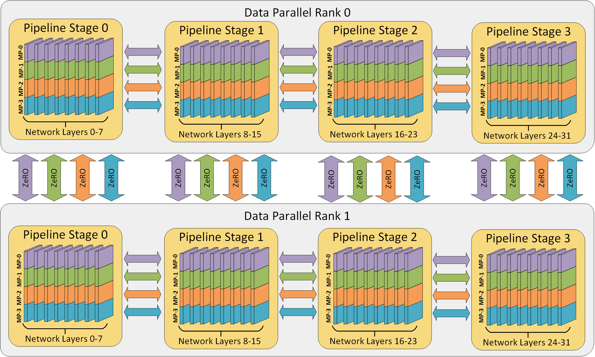

# Deep Learning and Foundation Models at Scale
Sam Foreman
2024-10-29

<link rel="preconnect" href="https://fonts.googleapis.com">
<link href="https://iosevka-webfonts.github.io/iosevka/iosevka.css" rel="stylesheet">

- [Overview](#overview)
- [🚀 Scaling: Overview](#rocket-scaling-overview)
  - [Single GPU](#single-gpu)
  - [Data Parallel Training](#data-parallel-training)
  - [Data Parallel Training](#data-parallel-training-1)
  - [Communication](#communication)
  - [AllReduce](#allreduce)
  - [Reduce](#reduce)
  - [Broadcast](#broadcast)
  - [AllGather](#allgather)
  - [Scatter](#scatter)
  - [Why Distributed Training?](#why-distributed-training)
- [Why Distributed Training?
  Speedup!](#why-distributed-training-speedup)
  - [Dealing with Data](#dealing-with-data)
  - [Broadcast Initial State](#broadcast-initial-state)
  - [Best Practices](#best-practices)
  - [Data Parallelism](#data-parallelism)
  - [Going beyond Data Parallelism:
    ZeRO](#going-beyond-data-parallelism----zero)
  - [Fully Sharded Data Parallel
    (FSDP)](#fully-sharded-data-parallel-fsdp)
  - [Pipeline Parallel (PP)](#pipeline-parallel-pp)
  - [Tensor Parallel (TP)](#tensor-parallel-tp)
  - [Model Parallel Training](#model-parallel-training)
  - [Tensor (/ Model) Parallel Training:
    Example](#tensor--model-parallel-training-example)
  - [Tensor (Model)
    Parallelism](#tensor-model-parallelismefficient-large-scale)
  - [Tensor Parallelism](#tensor-parallelism)
  - [3D Parallelism](#3d-parallelism)
  - [Deciding on a Parallelism
    Strategy](#deciding-on-a-parallelism-strategy)
- [Large Language Models](#large-language-models)
  - [Emergent Abilities](#emergent-abilities)
  - [Training LLMs](#training-llms)
  - [Life-Cycle of the LLM](#life-cycle-of-the-llm)
  - [Life-Cycle of the LLM](#life-cycle-of-the-llm-1)
  - [Forward Pass](#forward-pass)
  - [Generating Text](#generating-text)
  - [Assistant Models](#assistant-models)
- [Hands On](#hands-on)
  - [🌱 Clone Repositories](#seedling-clone-repositories)
  - [🐍 Setup Python](#snake-setup-python)
  - [Setup Job](#setup-job)
  - [📦 Install `{ezpz, wordplay}`](#package-install-ezpz-wordplay)
  - [🚀 Launch `ezpz.test_dist`](#rocket-launch-ezpztest_dist)
  - [PyInstrument Profile](#pyinstrument-profile)
  - [🍋 `ezpz`: Example \[video\]](#lemon-ezpz-example-video)
  - [Install `wordplay`
    🎮💬](#install-wordplay-video_gamespeech_balloon)
  - [Prepare Data](#prepare-data)
  - [Launch Training (DDP)](#launch-training-ddp)
  - [`wordplay`: Example \[video\]](#wordplay-example-video)
- [❤️ Thank you!](#heart-thank-you)
- [References](#references)

## Overview

- [ALCF Hands-on HPC
  Workshop](https://www.alcf.anl.gov/events/2024-alcf-hands-hpc-workshop)
  - 
    [`argonne-lcf/ALCF_Hands_on_HPC_Workshop`](https://github.com/argonne-lcf/ALCF_Hands_on_HPC_Workshop)
- Slides @
  [samforeman.me/talks/alcf-hpc-workshop-2024/slides](https://samforeman.me/talks/alcf-hpc-workshop-2024/slides)
  - HTML Version:
    [samforeman.me/talks/alcf-hpc-workshop-2024](https://samforeman.me/talks/alcf-hpc-workshop-2024)

## 🚀 Scaling: Overview

- ✅ **Goal**:
  - Minimize: <span class="highlight-red">Cost</span> (i.e. amount of
    time spent training)
  - Maximize: <span class="highlight-blue">Performance</span>

  > [!NOTE]
  >
  > See [🤗 Performance and
  > Scalability](https://huggingface.co/docs/transformers/v4.46.0/performance)
  > for more details

### Single GPU

See [🤗 Methods and tools for efficient training on a single
GPU](https://huggingface.co/docs/transformers/v4.46.0/perf_train_gpu_one)

<div id="fig-single-gpu">


Figure 1: **SLOW** !! model size limited by GPU memory

</div>

### Data Parallel Training

<div>

</div>

### Data Parallel Training

<div>

</div>

### Communication

- Need mechanism(s) for communicating across GPUs:
  - [`torch.distributed`](https://pytorch.org/docs/stable/distributed.html)
  - [`mpi4py`](https://mpi4py.readthedocs.io/en/stable/tutorial.html)
- Collective Communication:
  - [Nvidia Collective Communications Library
    (NCCL)](https://developer.nvidia.com/nccl)
  - [Intel oneAPI Collective Communications Library
    (oneCCL)](https://www.intel.com/content/www/us/en/developer/tools/oneapi/oneccl.html#gs.gouznn)

  > [!WARNING]
  >
  > ### ⌛ Timeouts
  >
  > - Collective operations have to be called for each `rank` to form a
  >   complete collective operation.
  >   - Failure to do so will result in other ranks waiting
  >     **indefinitely**

### AllReduce

Perform *reductions* on data (e.g. `sum`, `min`, `max`) across ranks,
send result back to everyone.

<div id="fig-all-reduce">


Figure 4: All-Reduce operation: each rank receives the reduction of
input values across ranks.

</div>

<div class="footer">

</div>

### Reduce

- Perform a *reduction* on data across ranks, send to individual

<div id="fig-reduce">


Figure 5: Reduce operation: one rank receives the reduction of input
values across ranks

</div>

### Broadcast

<div id="fig-broadcast">


Figure 6: `broadcast` (*send*) a tensor <code>$x$</code> from one rank
to all ranks

</div>

### AllGather

<div id="fig-allgather">


Figure 7: Gathers tensors from the whole group in a list.

</div>

### Scatter

<div id="fig-scatter">


Figure 8: Scatters a list of tensors to the whole group

</div>

### Why Distributed Training?

- `N` workers each processing unique batch[^1] of data:
  - \[`micro_batch_size = 1`\] $\times$ \[`N` GPUs\] $\rightarrow$
    \[<b><code>global_batch_size = N</code></b>\]
- Smooth loss landscape
- Improved gradient estimators
- Less iterations needed for same number of epochs
  - May need to train for more epochs if another change is not made
  - e.g. scaling learning rate `lr *= sqrt(N)`
- See: [Large Batch Training of Convolutional
  Networks](https://arxiv.org/abs/1708.03888)

## Why Distributed Training? Speedup!

<div id="tbl-recent-progress">

Table 1: Recent progress

| Year | Author | GPU | Batch Size | \# GPU | TIME (s) | ACC |
|:--:|:--:|:--:|:--:|:--:|:--:|:--:|
| 2016 | He | P100 | 256 | <span class="red-bg">8</span> | <span class="red-bg">104,400</span> | 75.30% |
| 2019 | Yamazaki | V100 | 81,920 | <span class="blue-bg">2048</span> | <span class="blue-bg">72</span> | 75.08% |

</div>

### Dealing with Data

- At each training step, we want to ensure that **each worker receives
  unique data**
- This can be done in one of two ways:
  1.  Manually partition data (ahead of time)
      - Assign **unique subsets** to each worker
      - Each worker can only see their local portion of the data
      - Most common approach
  2.  From each worker, randomly select a mini-batch
      - Each worker can see the full dataset
      - ⚠️ When randomly selecting, it is important that each worker
        uses different seeds to ensure they receive unique data

### Broadcast Initial State

- At the start of training (or when loading from a checkpoint), we want
  all of our workers to be initialized consistently
  - **Broadcast** the model and optimizer states from `rank() == 0`
    worker

<div id="fig-broadcast">


Figure 9: To ensure all workers have the same copies, we load on
`RANK==0` and `broadcast`

</div>

### Best Practices

<div class="flex-container">

<div class="column" style="width:50%;">

- Use parallel IO whenever possible
  - Feed each rank from different files
  - Use MPI IO to have each rank read its own batch from a file
  - Use several ranks to read data, MPI to scatter to remaining ranks
    - Most practical in big *at-scale* training

</div>

<div class="column" style="width:50%;">

- Take advantage of data storage
  - Use [striping on
    lustre](https://wiki.lustre.org/Configuring_Lustre_File_Striping)
- Use the right optimizations for Aurora, Polaris, etc.
- Preload data when possible
  - Offloading to a GPU frees CPU cycles for loading the next batch of
    data
    - **minimize IO latency this way**
- Communication Bottleneck

</div>

</div>

> [!IMPORTANT]
>
> ### ⏰ Keeping things in Sync
>
> **Computation stalls during communication !!**
>
> Keeping the communication to computation ratio small is important for
> effective scaling.

### Data Parallelism

- Useful when model fits on single GPU
  - ultimately limited by GPU memory
- When model does not fit on a single GPU:
  -  `DeepSpeed` + [`ZeRO`](https://www.deepspeed.ai/tutorials/zero/)
  - [PyTorch +
    FSDP](https://pytorch.org/blog/introducing-pytorch-fully-sharded-data-parallel-api/)

### Going beyond Data Parallelism:  ZeRO

- Depending on the `ZeRO` stage (1, 2, 3), we can offload:
  1.  **Stage 1**: optimizer states
  2.  **Stage 2**: gradients + opt. states
  3.  **Stage 3**: model params + grads + opt. states

<div id="fig-zero">


Figure 10: [DeepSpeed](deepspeed.ai) +
[`ZeRO`](https://www.deepspeed.ai/tutorials/zero-offload/)

</div>

### Fully Sharded Data Parallel (FSDP)

- Instead of maintaining per-GPU copy of `{params, grads, opt_states}`,
  FSDP shards (distributes) these across data-parallel workers
  - can optionally offload the sharded model params to CPU
- [Introducing PyTorch Fully Sharded Data Parallel (FSDP) API \|
  PyTorch](https://pytorch.org/blog/introducing-pytorch-fully-sharded-data-parallel-api/)

<div id="fig-fsdp">


Figure 11: FSDP Workflow.
[Source](https://pytorch.org/blog/introducing-pytorch-fully-sharded-data-parallel-api/)

</div>

### Pipeline Parallel (PP)

<div class="flex-container" style="place-content: end space-evenly;">

<div class="column" style="width:35%;">

- Model is split up vertically (layer-level) across multiple GPUs
- Each GPU:
  - has a portion of the full model
  - processes *in parallel* different stages of the pipeline (on a small
    chunk of the batch)

</div>

<div class="column" style="width:55%;">

<div id="fig-pipeline-parallelism">



Figure 12: [Pipeline
Parallelism](https://www.deepspeed.ai/tutorials/pipeline/)

</div>

</div>

</div>

### Tensor Parallel (TP)

<div>

</div>

### Model Parallel Training

<div class="flex-container">

<div class="column" style="width:60%;">

- Split up network over multiple workers
  - Each receives disjoint subset
  - All communication associated with subsets are distributed
- Communication whenever dataflow between two subsets
- Typically **more complicated** to implement than data parallel
  training
- Suitable when the model is too large to fit onto a single device (CPU
  / GPU)
- 
  [`argonne-lcf/Megatron-DeepSpeed`](https://github.com/argonne-lcf/Megatron-DeepSpeed)
- 🤗 [`huggingface/nanotron`](https://github.com/huggingface/nanotron)

</div>

<div class="column" style="width:40%;">

<div id="fig-model-parallel-1">


Figure 14

</div>

</div>

</div>

### Tensor (/ Model) Parallel Training: Example

Want to compute:
$y = \sum_{i} x_{i} W_{i} = x_0 * W_0 + x_1 * W_1 + x_2 * W_2$  
where each GPU only has only its portion of the full weights as shown
below

1.  Compute: $y_{0} = x_{0} * W_{0}\rightarrow$ `GPU1`
2.  Compute: $y_{1} = y_{0} + x_{1} * W_{1}\rightarrow$ `GPU2`
3.  Compute: $y = y_{1} + x_{2} * W_{2} = \sum_{i} x_{i} W_{i}$ ✅

``` mermaid
flowchart LR
    subgraph X0["`GPU0`"]
        direction LR
        a("`W₀`")
    end
    subgraph X1["`GPU1`"]
        direction LR
        b("`W₁`")
    end
    subgraph X2["`GPU2`"]
        direction LR
        c("`W₂`")
    end
  t0("`x₀`")-->X0
  X0 -->|"`x₀ W₀`"|X1
  X1 -->|"`x₀ W₀ <br>+ x₁ W₁`"|X2
  t1("`x₁`") --> X1
  t2("`x₂`") --> X2
```

<div id="fig-tensor-parallel-example">



Figure 15

</div>

<div class="footer">

</div>

### Tensor (Model) Parallelism[^2]

- In **Tensor Paralleism** each GPU processes only a slice of a tensor
  and only aggregates the full tensor for operations that require the
  whole thing.
  - The main building block of any transformer is a fully connected
    `nn.Linear` followed by a nonlinear activation GeLU.
    - `Y = GeLU(XA)`, where X and Y are the input and output vectors,
      and A is the weight matrix.
  - If we look at the computation in matrix form, it’s easy to see how
    the matrix multiplication can be split between multiple GPUs:

### Tensor Parallelism

<div id="fig-parallel-gemm">


Figure 16: Tensor Parallel GEMM. This information is based on (the much
more in-depth) [TP
Overview](https://github.com/huggingface/transformers/issues/10321#issuecomment-783543530)
by [@anton-l](https://github.com/anton-l)

</div>

### 3D Parallelism

- `DP` + `TP` + `PP` (3D) Parallelism

<div id="fig-3dparallel">


Figure 17: Figure taken from [3D parallelism: Scaling to
trillion-parameter
models](https://www.microsoft.com/en-us/research/blog/deepspeed-extreme-scale-model-training-for-everyone/)

</div>

### Deciding on a Parallelism Strategy

<div class="panel-tabset">

#### Single GPU

- Model fits onto a single GPU:
  - Normal use
- Model **DOES NOT** fit on a single GPU:
  - `ZeRO` + Offload CPU (or, optionally, `NVMe`)
- Largest layer **DOES NOT** fit on a single GPU:
  - `ZeRO` + Enable [Memory Centric Tiling
    (MCT)](https://deepspeed.readthedocs.io/en/latest/zero3.html#memory-centric-tiling)
    - MCT Allows running of arbitrarily large layers by automatically
      splitting them and executing them sequentially.

#### Single Node / Multi-GPU

<div class="flex-container">

<div class="column">

- Model fits onto a single GPU
  - [`DDP`](https://pytorch.org/docs/stable/notes/ddp.html)
  - [`ZeRO`](https://deepspeed.readthedocs.io/en/latest/zero3.html)

</div>

<div class="column">

- Model **DOES NOT** fit onto a single GPU
  1.  [Pipeline Parallelism
      (`PP`)](https://www.deepspeed.ai/tutorials/pipeline/)
  2.  [`ZeRO`](https://deepspeed.readthedocs.io/en/latest/zero3.html)
  3.  [Tensor Parallelism
      (`TP`)](https://pytorch.org/docs/stable/distributed.tensor.parallel.html)

</div>

</div>

- With sufficiently fast connectivity between nodes, these three
  strategies should be comparable.

  - Otherwise, `PP` $>$ `ZeRO` $\simeq$ `TP`.

#### Multi-Node / Multi-GPU

- When you have fast inter-node connectivity:

  - `ZeRO` (virtually **NO** modifications)
  - `PP` + `ZeRO` + `TP` + `DP` (less communication, at the cost of
    **MAJOR** modifications)
    - when you have slow inter-node connectivity and still low on GPU
      memory:

      ``` bash
      DP + PP + TP + ZeRO-1
      ```
  - **NOTE**: `TP` is almost *always* used within a single node, e.g.  
    `TP <= GPUS_PER_NODE`

</div>

## Large Language Models

<div id="fig-llms">


Figure 18: Large Language Models have (LLM)s have taken the ~~NLP
community~~ **world** by storm[^3].

</div>

### Emergent Abilities

<div id="fig-emergent-abilities">


Figure 19: [Emergent abilities of Large Language
Models](https://arxiv.org/abs/2206.07682) Yao et al. (2023)

</div>

### Training LLMs

<div class="flex-container"
style="align-items: flex-end; width:90%; text-align:center;">

<div class="column" style="width: 60%;">

<div id="fig-evolution">


Figure 20: Visualization from Yang et al. (2023)

</div>

</div>

<div class="column" style="width:40%;">

<div id="fig-it-hungers">


Figure 21: It’s hungry! Wei et al. (2022)

</div>

</div>

</div>

### Life-Cycle of the LLM

<div class="flex-container">

<div class="column" style="width: 40%;">

1.  Data collection + preprocessing
2.  **Pre-training**
    - Architecture decisions, model size, etc.
3.  Supervised Fine-Tuning
    - Instruction Tuning
    - Alignment
4.  Deploy (+ monitor, re-evaluate, etc.)

</div>

<div class="column" style="width:50%;">

<div id="fig-pretrain-two">


Figure 22: **Pre-training**: Virtually *all of the compute* used during
pre-training[^4].

</div>

</div>

</div>

### Life-Cycle of the LLM

<div class="flex-container">

<div class="column" style="width: 50%;">

1.  Data collection + preprocessing
2.  Pre-training
    - Architecture decisions, model size, etc.
3.  **Supervised Fine-Tuning**
    - Instruction Tuning
    - Alignment
4.  Deploy (+ monitor, re-evaluate, etc.)

</div>

<div class="column" style="width:50%;">

<div id="fig-finetune-lifecycle">


Figure 23: **Fine-tuning**: Fine-tuning actually updates the model’s
weights to make the model better at a certain task[^5].

</div>

</div>

</div>

### Forward Pass

<div id="fig-hf-assisted-generation">


Figure 24: Language Model trained for causal language modeling[^6].

</div>

### Generating Text

<div id="fig-generating-text">


Figure 25: Language Model trained for causal language modeling[^7].

</div>

### Assistant Models

<div id="fig-assistant-models">

<span class="preview-image"
style="text-align:center; margin-left:auto; margin-right: auto;"></span>

Figure 26

</div>

## Hands On

[ALCF_Hands_on_HPC_Workshop /
ml-at-scale](https://github.com/argonne-lcf/ALCF_Hands_on_HPC_Workshop/tree/master/ml-at-scale#hands-on)

### 🌱 Clone Repositories

1.   [`saforem2/wordplay/`](https://github.com/saforem2/wordplay)

    ``` bash
    git clone https://github.com/saforem2/wordplay
    cd wordplay
    ```

2.   [`saforem2/ezpz/`](https://github.com/saforem2/ezpz)

    ``` bash
    git clone https://github.com/saforem2/ezpz deps/ezpz
    ```

### 🐍 Setup Python

``` bash
$ export PBS_O_WORKDIR=$(pwd) && source deps/ezpz/src/ezpz/bin/utils.sh
Using WORKING_DIR: /eagle/argonne_tpc/foremans/tmp/2024-10-26-094746

$ ezpz_setup_python
No conda_prefix OR virtual_env found in environment...
Setting up conda...

Lmod is automatically replacing "nvhpc/23.9" with "gcc-native/12.3".


Lmod is automatically replacing "PrgEnv-nvhpc/8.5.0" with "PrgEnv-gnu/8.5.0".


Due to MODULEPATH changes, the following have been reloaded:
  1) cray-mpich/8.1.28

Found conda at: /soft/applications/conda/2024-04-29/mconda3
No VIRTUAL_ENV found in environment!
    - Trying to setup from /soft/applications/conda/2024-04-29/mconda3
    - Using VENV_DIR=/eagle/argonne_tpc/foremans/tmp/2024-10-26-094746/venvs/2024-04-29

    - Creating a new virtual env on top of 2024-04-29 in /eagle/argonne_tpc/foremans/tmp/2024-10-26-094746/venvs/2024-04-29
[python] Using /eagle/argonne_tpc/foremans/tmp/2024-10-26-094746/venvs/2024-04-29/bin/python3
```

### Setup Job

``` bash
$ ezpz_setup_job
[🍋 ezpz/bin/utils.sh]
    • USER=foremans
    • MACHINE=polaris
    • HOST=x3205c0s25b0n0
    • TSTAMP=2024-10-26-094841


[ezpz_get_pbs_env]: Caught 0 arguments
    • hostfile: /var/spool/pbs/aux/3061463.polaris-pbs-01.hsn.cm.polaris.alcf.anl.gov
    • jobenv_file: /home/foremans/.pbsenv

[ezpz_setup_host_pbs]
    • Using hostfile: /var/spool/pbs/aux/3061463.polaris-pbs-01.hsn.cm.polaris.alcf.anl.gov
    • Found in environment:
        • HOSTFILE: /var/spool/pbs/aux/3061463.polaris-pbs-01.hsn.cm.polaris.alcf.anl.gov
        • Writing PBS vars to: /home/foremans/.pbsenv

[ezpz_save_pbs_env]
    • Setting:
        • HOSTFILE: /var/spool/pbs/aux/3061463.polaris-pbs-01.hsn.cm.polaris.alcf.anl.gov
        • JOBENV_FILE: /home/foremans/.pbsenv

[HOSTS]
    • [host:0] - x3205c0s25b0n0.hsn.cm.polaris.alcf.anl.gov
    • [host:1] - x3205c0s25b1n0.hsn.cm.polaris.alcf.anl.gov

[DIST INFO]
    • NGPUS=8
    • NHOSTS=2
    • NGPU_PER_HOST=4
    • HOSTFILE=/var/spool/pbs/aux/3061463.polaris-pbs-01.hsn.cm.polaris.alcf.anl.gov
    • DIST_LAUNCH=mpiexec --verbose --envall -n 8 -ppn 4 --hostfile /var/spool/pbs/aux/3061463.polaris-pbs-01.hsn.cm.polaris.alcf.anl.gov --cpu-bind depth -d 8

[LAUNCH]:
    • To launch across all available GPUs, use: launch

      launch = mpiexec --verbose --envall -n 8 -ppn 4 --hostfile /var/spool/pbs/aux/3061463.polaris-pbs-01.hsn.cm.polaris.alcf.anl.gov --cpu-bind depth -d 8
```

### 📦 Install `{ezpz, wordplay}`

1.  [`saforem2/ezpz`](https://github.com/saforem2/ezpz):

    ``` bash
    python3 -m pip install -e "./deps/ezpz" --require-virtualenv
    ```

2.  [`saforem2/wordplay`](https://github.com/saforem2/ezpz):

    ``` bash
    # from inside `wordplay/`
    python3 -m pip install -e . --require-virtualenv
    ```

### 🚀 Launch [`ezpz.test_dist`](https://github.com/saforem2/ezpz/blob/main/src/ezpz/test_dist.py)

``` bash
$ unset NCCL_COLLNET_ENABLE NCCL_CROSS_NIC NCCL_NET NCCL_NET_GDR_LEVEL

$ which launch
launch: aliased to mpiexec --verbose --envall -n 4 -ppn 4 --hostfile /var/spool/pbs/aux/2024084.polaris-pbs-01.hsn.cm.polaris.alcf.anl.gov --cpu-bind depth -d 16

$ which python3
/home/foremans/tmp/polaris-talk/2024-07-17-073327/venvs/2024-04-29/bin/python3

$ launch python3 -m ezpz.test_dist
Connected to tcp://x3101c0s13b0n0.hsn.cm.polaris.alcf.anl.gov:7919
Found executable /home/foremans/tmp/polaris-talk/2024-07-17-073327/venvs/2024-04-29/bin/python3
Launching application cff755ee-557e-4df2-a987-db85a8b7dbe7
[2024-07-17 07:35:30.304306][INFO][__init__:156] - Setting logging level to 'INFO' on 'RANK == 0'
[2024-07-17 07:35:30.307036][INFO][__init__:157] - Setting logging level to 'CRITICAL' on all others 'RANK != 0'
[2024-07-17 07:35:30.307494][INFO][__init__:160] - To disable this behavior, and log from ALL ranks (not recommended), set: 'export LOG_FROM_ALL_RANKS=1'  in your environment, and re-run.
[2024-07-17 07:35:32.116037][INFO][dist:358] - [device='cuda'][rank=2/3][local_rank=2/3][node=0/0]
[2024-07-17 07:35:32.116089][INFO][dist:358] - [device='cuda'][rank=3/3][local_rank=3/3][node=0/0]
[2024-07-17 07:35:32.116940][INFO][dist:358] - [device='cuda'][rank=1/3][local_rank=1/3][node=0/0]
[2024-07-17 07:35:32.122726][INFO][dist:95] -
[dist_info]:
  • DEVICE=cuda
  • DEVICE_ID=cuda:0
  • DISTRIBUTED_BACKEND=nccl
  • GPUS_PER_NODE=4
  • HOSTS=['x3101c0s13b0n0.hsn.cm.polaris.alcf.anl.gov']
  • HOSTFILE=/var/spool/pbs/aux/2024084.polaris-pbs-01.hsn.cm.polaris.alcf.anl.gov
  • HOSTNAME=x3101c0s13b0n0.hsn.cm.polaris.alcf.anl.gov
  • LOCAL_RANK=0
  • MACHINE=Polaris
  • NUM_NODES=1
  • NGPUS=4
  • NGPUS_AVAILABLE=4
  • NODE_ID=0
  • RANK=0
  • SCHEDULER=PBS
  • WORLD_SIZE_TOTAL=4
  • WORLD_SIZE_IN_USE=4
  • LAUNCH_CMD=mpiexec --verbose --envall -n 4 -ppn 4 --hostfile /var/spool/pbs/aux/2024084.polaris-pbs-01.hsn.cm.polaris.alcf.anl.gov --cpu-bind depth -d 16
[2024-07-17 07:35:32.124800][INFO][dist:725] - [0/4] Using device='cuda' with backend='DDP' + 'nccl' for distributed training.
[2024-07-17 07:35:32.129169][INFO][dist:358] - [device='cuda'][rank=0/3][local_rank=0/3][node=0/0]
[2024-07-17 07:35:32.129674][WARNING][dist:364] - Using [4 / 4] available "cuda" devices !!
[2024-07-17 07:35:32.130219][INFO][dist:874] - Setting up wandb from rank: 0
[2024-07-17 07:35:32.130638][INFO][dist:875] - Using: WB PROJECT: ezpz.test_dist
wandb: Using wandb-core as the SDK backend. Please refer to https://wandb.me/wandb-core for more information.
wandb: Currently logged in as: foremans (aurora_gpt). Use `wandb login --relogin` to force relogin
wandb: Tracking run with wandb version 0.17.4
wandb: Run data is saved locally in /home/foremans/tmp/polaris-talk/2024-07-17-073327/wandb/run-20240717_073532-p49rzxtv
wandb: Run `wandb offline` to turn off syncing.
wandb: Syncing run vibrant-river-284
wandb: ⭐️ View project at https://wandb.ai/aurora_gpt/ezpz.test_dist
wandb: 🚀 View run at https://wandb.ai/aurora_gpt/ezpz.test_dist/runs/p49rzxtv
[2024-07-17 07:35:33.171085][INFO][dist:905] - W&B RUN: [vibrant-river-284](https://wandb.ai/aurora_gpt/ezpz.test_dist/runs/p49rzxtv)
[2024-07-17 07:35:33.182307][INFO][dist:312] - Updating wandb.run: vibrant-river-284 config with "DIST_INFO"
[2024-07-17 07:35:33.186499][INFO][dist:938] - Running on machine='Polaris'
[2024-07-17 07:35:33.187790][INFO][dist:95] -
[timers_import]:
  • os=1.082196831703186e-06
  • logging=4.507601261138916e-07
  • typing=2.9457733035087585e-06
  • pathlib=1.3122335076332092e-06
  • ezpz=6.109476089477539e-07
  • torch=2.9457733035087585e-06
  • torch_ddp=2.314336597919464e-06
  • wandb=1.842435449361801e-05
  • total=3.0086375772953033e-05

[2024-07-17 07:35:33.188979][INFO][dist:95] -

[CONFIG]:
  • warmup=0
  • log_freq=1
  • batch_size=64
  • input_size=128
  • output_size=128
  • dtype=torch.float32
  • device=cuda
  • world_size=4
  • train_iters=100

[2024-07-17 07:35:34.761945][INFO][test_dist:183] - model=Network(
  (layers): Sequential(
    (0): Linear(in_features=128, out_features=1024, bias=True)
    (1): Linear(in_features=1024, out_features=512, bias=True)
    (2): Linear(in_features=512, out_features=256, bias=True)
    (3): Linear(in_features=256, out_features=128, bias=True)
    (4): Linear(in_features=128, out_features=128, bias=True)
  )
)
[2024-07-17 07:35:36.943300][INFO][test_dist:274] - iter=1, loss=2152.41, sps=1.697e+04, dt=0.00377066, dtf=0.001003, dtb=0.002768
[2024-07-17 07:35:36.948048][INFO][test_dist:274] - iter=2, loss=1577.24, sps=3.611e+04, dt=0.00177221, dtf=0.0005256, dtb=0.001247
[2024-07-17 07:35:36.952085][INFO][test_dist:274] - iter=3, loss=1201.25, sps=3.59e+04, dt=0.00178271, dtf=0.0004875, dtb=0.001295
[2024-07-17 07:35:36.956071][INFO][test_dist:274] - iter=4, loss=1034.03, sps=3.704e+04, dt=0.0017279, dtf=0.0005082, dtb=0.00122
[2024-07-17 07:35:36.959944][INFO][test_dist:274] - iter=5, loss=875.796, sps=3.825e+04, dt=0.00167313, dtf=0.0005121, dtb=0.001161
[2024-07-17 07:35:36.963806][INFO][test_dist:274] - iter=6, loss=817.544, sps=3.804e+04, dt=0.00168248, dtf=0.0004651, dtb=0.001217
[2024-07-17 07:35:36.967806][INFO][test_dist:274] - iter=7, loss=734.838, sps=3.536e+04, dt=0.0018099, dtf=0.0004969, dtb=0.001313
[2024-07-17 07:35:36.971741][INFO][test_dist:274] - iter=8, loss=741.583, sps=3.682e+04, dt=0.00173809, dtf=0.0004537, dtb=0.001284
[2024-07-17 07:35:36.975672][INFO][test_dist:274] - iter=9, loss=738.157, sps=3.717e+04, dt=0.0017217, dtf=0.0004635, dtb=0.001258
[2024-07-17 07:35:36.979537][INFO][test_dist:274] - iter=10, loss=727.255, sps=3.857e+04, dt=0.00165911, dtf=0.0004897, dtb=0.001169
[2024-07-17 07:35:36.983367][INFO][test_dist:274] - iter=11, loss=715.534, sps=3.979e+04, dt=0.00160845, dtf=0.0004246, dtb=0.001184
[2024-07-17 07:35:36.987262][INFO][test_dist:274] - iter=12, loss=693.96, sps=3.791e+04, dt=0.00168827, dtf=0.0004543, dtb=0.001234
[2024-07-17 07:35:36.991156][INFO][test_dist:274] - iter=13, loss=693.518, sps=3.815e+04, dt=0.00167748, dtf=0.0004182, dtb=0.001259
[2024-07-17 07:35:36.994942][INFO][test_dist:274] - iter=14, loss=675.289, sps=4.003e+04, dt=0.00159879, dtf=0.0004048, dtb=0.001194
[2024-07-17 07:35:36.999681][INFO][test_dist:274] - iter=15, loss=677.706, sps=4.062e+04, dt=0.0015755, dtf=0.0004248, dtb=0.001151
[2024-07-17 07:35:37.003599][INFO][test_dist:274] - iter=16, loss=671.639, sps=3.754e+04, dt=0.00170499, dtf=0.000416, dtb=0.001289
[2024-07-17 07:35:37.007565][INFO][test_dist:274] - iter=17, loss=652.219, sps=3.704e+04, dt=0.00172777, dtf=0.0004208, dtb=0.001307
[2024-07-17 07:35:37.011753][INFO][test_dist:274] - iter=18, loss=633.308, sps=3.191e+04, dt=0.00200554, dtf=0.0004193, dtb=0.001586
[2024-07-17 07:35:37.015595][INFO][test_dist:274] - iter=19, loss=635.459, sps=3.845e+04, dt=0.0016645, dtf=0.0004236, dtb=0.001241
[2024-07-17 07:35:37.019356][INFO][test_dist:274] - iter=20, loss=626.979, sps=4.033e+04, dt=0.00158685, dtf=0.0004225, dtb=0.001164
[2024-07-17 07:35:37.023081][INFO][test_dist:274] - iter=21, loss=612.352, sps=4.105e+04, dt=0.00155914, dtf=0.0004169, dtb=0.001142
[2024-07-17 07:35:37.026861][INFO][test_dist:274] - iter=22, loss=609.89, sps=4.004e+04, dt=0.00159827, dtf=0.0004155, dtb=0.001183
[2024-07-17 07:35:37.030555][INFO][test_dist:274] - iter=23, loss=602.673, sps=4.258e+04, dt=0.00150295, dtf=0.0004166, dtb=0.001086
[2024-07-17 07:35:37.034382][INFO][test_dist:274] - iter=24, loss=613.106, sps=3.918e+04, dt=0.00163367, dtf=0.0004164, dtb=0.001217
[2024-07-17 07:35:37.038129][INFO][test_dist:274] - iter=25, loss=644.755, sps=4.173e+04, dt=0.00153368, dtf=0.0004175, dtb=0.001116
[2024-07-17 07:35:37.041943][INFO][test_dist:274] - iter=26, loss=789.106, sps=4.049e+04, dt=0.00158053, dtf=0.0004397, dtb=0.001141
[2024-07-17 07:35:37.045705][INFO][test_dist:274] - iter=27, loss=691.36, sps=4.166e+04, dt=0.00153641, dtf=0.0004157, dtb=0.001121
[2024-07-17 07:35:37.049496][INFO][test_dist:274] - iter=28, loss=657.228, sps=4.018e+04, dt=0.00159288, dtf=0.0004209, dtb=0.001172
[2024-07-17 07:35:37.053229][INFO][test_dist:274] - iter=29, loss=633.212, sps=4.19e+04, dt=0.0015274, dtf=0.0004288, dtb=0.001099
[2024-07-17 07:35:37.057013][INFO][test_dist:274] - iter=30, loss=640.29, sps=4.012e+04, dt=0.00159538, dtf=0.0004144, dtb=0.001181
[2024-07-17 07:35:37.060722][INFO][test_dist:274] - iter=31, loss=604.287, sps=4.21e+04, dt=0.00152018, dtf=0.000398, dtb=0.001122
[2024-07-17 07:35:37.064489][INFO][test_dist:274] - iter=32, loss=640.15, sps=4.079e+04, dt=0.00156912, dtf=0.0004007, dtb=0.001168
[2024-07-17 07:35:37.068206][INFO][test_dist:274] - iter=33, loss=585.789, sps=4.238e+04, dt=0.00151007, dtf=0.0004199, dtb=0.00109
[2024-07-17 07:35:37.071974][INFO][test_dist:274] - iter=34, loss=591.99, sps=4.053e+04, dt=0.00157917, dtf=0.000434, dtb=0.001145
[2024-07-17 07:35:37.075702][INFO][test_dist:274] - iter=35, loss=618.223, sps=4.168e+04, dt=0.00153538, dtf=0.0004152, dtb=0.00112
[2024-07-17 07:35:37.079496][INFO][test_dist:274] - iter=36, loss=572.365, sps=3.998e+04, dt=0.0016008, dtf=0.0004108, dtb=0.00119
[2024-07-17 07:35:37.083250][INFO][test_dist:274] - iter=37, loss=573.749, sps=4.276e+04, dt=0.00149675, dtf=0.0004123, dtb=0.001084
[2024-07-17 07:35:37.086969][INFO][test_dist:274] - iter=38, loss=580.662, sps=4.136e+04, dt=0.00154751, dtf=0.0004129, dtb=0.001135
[2024-07-17 07:35:37.090636][INFO][test_dist:274] - iter=39, loss=568.836, sps=4.311e+04, dt=0.0014847, dtf=0.000409, dtb=0.001076
[2024-07-17 07:35:37.094396][INFO][test_dist:274] - iter=40, loss=551.294, sps=4.145e+04, dt=0.00154388, dtf=0.0004118, dtb=0.001132
[2024-07-17 07:35:37.098103][INFO][test_dist:274] - iter=41, loss=573.647, sps=4.352e+04, dt=0.00147048, dtf=0.0003977, dtb=0.001073
[2024-07-17 07:35:37.101867][INFO][test_dist:274] - iter=42, loss=545.584, sps=4.257e+04, dt=0.00150354, dtf=0.000433, dtb=0.001071
[2024-07-17 07:35:37.105639][INFO][test_dist:274] - iter=43, loss=544.877, sps=4.322e+04, dt=0.00148085, dtf=0.0004117, dtb=0.001069
[2024-07-17 07:35:37.109471][INFO][test_dist:274] - iter=44, loss=559.886, sps=4.028e+04, dt=0.00158879, dtf=0.0004254, dtb=0.001163
[2024-07-17 07:35:37.113186][INFO][test_dist:274] - iter=45, loss=534.895, sps=4.311e+04, dt=0.00148444, dtf=0.0004153, dtb=0.001069
[2024-07-17 07:35:37.116972][INFO][test_dist:274] - iter=46, loss=536.457, sps=4.099e+04, dt=0.00156151, dtf=0.0004113, dtb=0.00115
[2024-07-17 07:35:37.120710][INFO][test_dist:274] - iter=47, loss=548.508, sps=4.183e+04, dt=0.00152993, dtf=0.0004151, dtb=0.001115
[2024-07-17 07:35:37.124552][INFO][test_dist:274] - iter=48, loss=532.186, sps=4.051e+04, dt=0.0015798, dtf=0.0004379, dtb=0.001142
[2024-07-17 07:35:37.128266][INFO][test_dist:274] - iter=49, loss=519.254, sps=4.272e+04, dt=0.0014981, dtf=0.0004164, dtb=0.001082
[2024-07-17 07:35:37.131975][INFO][test_dist:274] - iter=50, loss=535.535, sps=4.16e+04, dt=0.00153862, dtf=0.0004304, dtb=0.001108
[2024-07-17 07:35:37.135717][INFO][test_dist:274] - iter=51, loss=520.722, sps=4.136e+04, dt=0.00154757, dtf=0.0004158, dtb=0.001132
[2024-07-17 07:35:37.139451][INFO][test_dist:274] - iter=52, loss=513.063, sps=4.147e+04, dt=0.00154317, dtf=0.0004138, dtb=0.001129
[2024-07-17 07:35:37.143231][INFO][test_dist:274] - iter=53, loss=514.546, sps=4.038e+04, dt=0.0015848, dtf=0.0004149, dtb=0.00117
[2024-07-17 07:35:37.146971][INFO][test_dist:274] - iter=54, loss=506.488, sps=4.137e+04, dt=0.00154701, dtf=0.0004132, dtb=0.001134
[2024-07-17 07:35:37.150659][INFO][test_dist:274] - iter=55, loss=503.01, sps=4.319e+04, dt=0.0014817, dtf=0.000415, dtb=0.001067
[2024-07-17 07:35:37.154441][INFO][test_dist:274] - iter=56, loss=506.116, sps=4.06e+04, dt=0.00157637, dtf=0.0004211, dtb=0.001155
[2024-07-17 07:35:37.158180][INFO][test_dist:274] - iter=57, loss=485.523, sps=4.287e+04, dt=0.00149301, dtf=0.000414, dtb=0.001079
[2024-07-17 07:35:37.161931][INFO][test_dist:274] - iter=58, loss=489.076, sps=4.185e+04, dt=0.00152915, dtf=0.0004162, dtb=0.001113
[2024-07-17 07:35:37.165759][INFO][test_dist:274] - iter=59, loss=484.844, sps=4.134e+04, dt=0.00154802, dtf=0.0004119, dtb=0.001136
[2024-07-17 07:35:37.169483][INFO][test_dist:274] - iter=60, loss=496.104, sps=4.209e+04, dt=0.00152069, dtf=0.0003993, dtb=0.001121
[2024-07-17 07:35:37.173190][INFO][test_dist:274] - iter=61, loss=467.599, sps=4.221e+04, dt=0.00151621, dtf=0.0004142, dtb=0.001102
[2024-07-17 07:35:37.176950][INFO][test_dist:274] - iter=62, loss=480.055, sps=4.187e+04, dt=0.00152868, dtf=0.0004138, dtb=0.001115
[2024-07-17 07:35:37.181194][INFO][test_dist:274] - iter=63, loss=483.146, sps=3.656e+04, dt=0.00175062, dtf=0.0006253, dtb=0.001125
[2024-07-17 07:35:37.185018][INFO][test_dist:274] - iter=64, loss=479.273, sps=4.099e+04, dt=0.00156151, dtf=0.0004447, dtb=0.001117
[2024-07-17 07:35:37.188752][INFO][test_dist:274] - iter=65, loss=464.753, sps=4.189e+04, dt=0.00152781, dtf=0.0004161, dtb=0.001112
[2024-07-17 07:35:37.192464][INFO][test_dist:274] - iter=66, loss=462.583, sps=4.188e+04, dt=0.00152824, dtf=0.0004138, dtb=0.001114
[2024-07-17 07:35:37.196126][INFO][test_dist:274] - iter=67, loss=461.665, sps=4.272e+04, dt=0.00149801, dtf=0.0004293, dtb=0.001069
[2024-07-17 07:35:37.199838][INFO][test_dist:274] - iter=68, loss=465.25, sps=4.118e+04, dt=0.00155412, dtf=0.0004298, dtb=0.001124
[2024-07-17 07:35:37.203602][INFO][test_dist:274] - iter=69, loss=460.897, sps=4.01e+04, dt=0.00159593, dtf=0.0004131, dtb=0.001183
[2024-07-17 07:35:37.207372][INFO][test_dist:274] - iter=70, loss=456.136, sps=4.106e+04, dt=0.00155887, dtf=0.00041, dtb=0.001149
[2024-07-17 07:35:37.211089][INFO][test_dist:274] - iter=71, loss=447.565, sps=4.158e+04, dt=0.00153923, dtf=0.0004113, dtb=0.001128
[2024-07-17 07:35:37.214861][INFO][test_dist:274] - iter=72, loss=444.733, sps=4.05e+04, dt=0.00158026, dtf=0.0004127, dtb=0.001168
[2024-07-17 07:35:37.218601][INFO][test_dist:274] - iter=73, loss=459.152, sps=4.123e+04, dt=0.00155234, dtf=0.0004201, dtb=0.001132
[2024-07-17 07:35:37.222334][INFO][test_dist:274] - iter=74, loss=444.6, sps=4.226e+04, dt=0.00151444, dtf=0.0004371, dtb=0.001077
[2024-07-17 07:35:37.226042][INFO][test_dist:274] - iter=75, loss=439.884, sps=4.29e+04, dt=0.001492, dtf=0.0004154, dtb=0.001077
[2024-07-17 07:35:37.229838][INFO][test_dist:274] - iter=76, loss=438.578, sps=4.086e+04, dt=0.00156632, dtf=0.0004418, dtb=0.001125
[2024-07-17 07:35:37.233560][INFO][test_dist:274] - iter=77, loss=431.993, sps=4.327e+04, dt=0.00147909, dtf=0.0004096, dtb=0.00107
[2024-07-17 07:35:37.237367][INFO][test_dist:274] - iter=78, loss=422.338, sps=4.057e+04, dt=0.00157754, dtf=0.0004468, dtb=0.001131
[2024-07-17 07:35:37.241117][INFO][test_dist:274] - iter=79, loss=427.973, sps=4.288e+04, dt=0.00149254, dtf=0.000415, dtb=0.001077
[2024-07-17 07:35:37.244895][INFO][test_dist:274] - iter=80, loss=418.703, sps=4.06e+04, dt=0.00157617, dtf=0.0004137, dtb=0.001162
[2024-07-17 07:35:37.248740][INFO][test_dist:274] - iter=81, loss=427.645, sps=4.031e+04, dt=0.00158766, dtf=0.000415, dtb=0.001173
[2024-07-17 07:35:37.252447][INFO][test_dist:274] - iter=82, loss=417.629, sps=4.227e+04, dt=0.00151406, dtf=0.0004149, dtb=0.001099
[2024-07-17 07:35:37.256190][INFO][test_dist:274] - iter=83, loss=411.667, sps=4.189e+04, dt=0.00152778, dtf=0.0004357, dtb=0.001092
[2024-07-17 07:35:37.259935][INFO][test_dist:274] - iter=84, loss=409.366, sps=4.144e+04, dt=0.0015445, dtf=0.0004575, dtb=0.001087
[2024-07-17 07:35:37.263677][INFO][test_dist:274] - iter=85, loss=409.511, sps=4.232e+04, dt=0.00151228, dtf=0.0004035, dtb=0.001109
[2024-07-17 07:35:37.267463][INFO][test_dist:274] - iter=86, loss=409.593, sps=4.101e+04, dt=0.00156049, dtf=0.0004028, dtb=0.001158
[2024-07-17 07:35:37.271174][INFO][test_dist:274] - iter=87, loss=408.794, sps=4.3e+04, dt=0.00148828, dtf=0.0004006, dtb=0.001088
[2024-07-17 07:35:37.274926][INFO][test_dist:274] - iter=88, loss=403.151, sps=4.091e+04, dt=0.00156441, dtf=0.000415, dtb=0.001149
[2024-07-17 07:35:37.278633][INFO][test_dist:274] - iter=89, loss=402.182, sps=4.26e+04, dt=0.00150243, dtf=0.0004147, dtb=0.001088
[2024-07-17 07:35:37.282372][INFO][test_dist:274] - iter=90, loss=387.829, sps=4.216e+04, dt=0.00151793, dtf=0.0004411, dtb=0.001077
[2024-07-17 07:35:37.286102][INFO][test_dist:274] - iter=91, loss=393.108, sps=4.308e+04, dt=0.00148558, dtf=0.0004167, dtb=0.001069
[2024-07-17 07:35:37.289904][INFO][test_dist:274] - iter=92, loss=389.039, sps=4.103e+04, dt=0.00155996, dtf=0.0004359, dtb=0.001124
[2024-07-17 07:35:37.293618][INFO][test_dist:274] - iter=93, loss=383.54, sps=4.322e+04, dt=0.00148092, dtf=0.0004147, dtb=0.001066
[2024-07-17 07:35:37.297401][INFO][test_dist:274] - iter=94, loss=384.459, sps=4.1e+04, dt=0.00156106, dtf=0.0004164, dtb=0.001145
[2024-07-17 07:35:37.301172][INFO][test_dist:274] - iter=95, loss=376.397, sps=4.191e+04, dt=0.0015272, dtf=0.0004129, dtb=0.001114
[2024-07-17 07:35:37.304924][INFO][test_dist:274] - iter=96, loss=389.544, sps=4.091e+04, dt=0.00156433, dtf=0.0004139, dtb=0.00115
[2024-07-17 07:35:37.308641][INFO][test_dist:274] - iter=97, loss=365.041, sps=4.343e+04, dt=0.00147362, dtf=0.0004165, dtb=0.001057
[2024-07-17 07:35:37.312398][INFO][test_dist:274] - iter=98, loss=358.427, sps=4.134e+04, dt=0.00154796, dtf=0.0004143, dtb=0.001134
[2024-07-17 07:35:37.561881][INFO][test_dist:274] - iter=99, loss=375.596, sps=258.9, dt=0.247161, dtf=0.1969, dtb=0.05026

                            train/dt [2024-07-17-073537]
     ┌─────────────────────────────────────────────────────────────────────────┐
0.247┤                                                                        ▝│
     │                                                                         │
     │                                                                         │
0.206┤                                                                         │
     │                                                                         │
     │                                                                         │
0.165┤                                                                         │
     │                                                                         │
0.124┤                                                                         │
     │                                                                         │
     │                                                                         │
0.083┤                                                                         │
     │                                                                         │
     │                                                                         │
0.042┤                                                                         │
     │                                                                         │
     │                                                                         │
0.001┤▄▗▖▄▗▖▄▗▖▄▗▖▄▗▖▄▗▖▄▖▄▗▖▄▗▖▄▗▖▄▗▖▄▗▖▄▗▄▗▖▄▗▖▄▗▖▄▗▖▄▗▖▄▗▄▗▖▄▗▖▄▗▖▄▗▖▄▗▖▄▗▖▖│
     └┬─────────────────┬─────────────────┬─────────────────┬─────────────────┬┘
     1.0              25.5              50.0              74.5             99.0
train/dt                                iter
[2024-07-17 07:35:37.589287][INFO][plot:156] - Appending plot to: /home/foremans/tmp/polaris-talk/2024-07-17-073327/test-dist-plots/train/dt.txt
text saved in /home/foremans/tmp/polaris-talk/2024-07-17-073327/test-dist-plots/train/dt.txt
                            train/dtf [2024-07-17-073537]
     ┌─────────────────────────────────────────────────────────────────────────┐
0.197┤                                                                        ▝│
     │                                                                         │
     │                                                                         │
0.164┤                                                                         │
     │                                                                         │
     │                                                                         │
0.131┤                                                                         │
     │                                                                         │
0.099┤                                                                         │
     │                                                                         │
     │                                                                         │
0.066┤                                                                         │
     │                                                                         │
     │                                                                         │
0.033┤                                                                         │
     │                                                                         │
     │                                                                         │
0.000┤▄▗▖▄▗▖▄▗▖▄▗▖▄▗▖▄▗▖▄▖▄▗▖▄▗▖▄▗▖▄▗▖▄▗▖▄▗▄▗▖▄▗▖▄▗▖▄▗▖▄▗▖▄▗▄▗▖▄▗▖▄▗▖▄▗▖▄▗▖▄▗▖▖│
     └┬─────────────────┬─────────────────┬─────────────────┬─────────────────┬┘
     1.0              25.5              50.0              74.5             99.0
train/dtf                               iter
[2024-07-17 07:35:37.603242][INFO][plot:156] - Appending plot to: /home/foremans/tmp/polaris-talk/2024-07-17-073327/test-dist-plots/train/dtf.txt
text saved in /home/foremans/tmp/polaris-talk/2024-07-17-073327/test-dist-plots/train/dtf.txt
                             train/dtb [2024-07-17-073537]
      ┌────────────────────────────────────────────────────────────────────────┐
0.0503┤                                                                       ▝│
      │                                                                        │
      │                                                                        │
0.0421┤                                                                        │
      │                                                                        │
      │                                                                        │
0.0339┤                                                                        │
      │                                                                        │
0.0257┤                                                                        │
      │                                                                        │
      │                                                                        │
0.0175┤                                                                        │
      │                                                                        │
      │                                                                        │
0.0093┤                                                                        │
      │                                                                        │
      │                                                                        │
0.0011┤▚▗▖▄▗▖▄▗▖▄▖▄▗▖▄▗▖▄▖▄▗▖▄▗▖▄▗▄▗▖▄▗▖▄▗▖▄▖▄▗▖▄▗▖▄▖▄▗▖▄▗▖▄▗▄▗▖▄▗▖▄▗▄▗▖▄▗▖▄▗▖▖│
      └┬─────────────────┬─────────────────┬────────────────┬─────────────────┬┘
      1.0              25.5              50.0             74.5             99.0
train/dtb                                iter
[2024-07-17 07:35:37.615896][INFO][plot:156] - Appending plot to: /home/foremans/tmp/polaris-talk/2024-07-17-073327/test-dist-plots/train/dtb.txt
text saved in /home/foremans/tmp/polaris-talk/2024-07-17-073327/test-dist-plots/train/dtb.txt
                            train/loss [2024-07-17-073537]
      ┌────────────────────────────────────────────────────────────────────────┐
2152.4┤▘                                                                       │
      │                                                                        │
      │                                                                        │
1853.4┤                                                                        │
      │                                                                        │
      │▗                                                                       │
1554.4┤                                                                        │
      │                                                                        │
1255.4┤                                                                        │
      │ ▗                                                                      │
      │                                                                        │
 956.4┤  ▘                                                                     │
      │   ▖                                                                    │
      │   ▝              ▖                                                     │
 657.4┤    ▝▘▀▝▘▚▖▄     ▗ ▄                                                    │
      │            ▝▘▀▝▘▘  ▝▘▀▗▘▚▗▄▗▖▄▗ ▗                                      │
      │                                ▘▘▝▘▀▘▀▝▘▞▗▘▄▖▄▗▖▄▗▖▄▗▄                 │
 358.4┤                                                       ▝▘▀▝▘▀▝▀▝▘▀▝▖▚▝▖▄│
      └┬─────────────────┬─────────────────┬────────────────┬─────────────────┬┘
      1.0              25.5              50.0             74.5             99.0
train/loss                               iter
[2024-07-17 07:35:37.655339][INFO][plot:156] - Appending plot to: /home/foremans/tmp/polaris-talk/2024-07-17-073327/test-dist-plots/train/loss.txt
text saved in /home/foremans/tmp/polaris-talk/2024-07-17-073327/test-dist-plots/train/loss.txt
                           train/iter [2024-07-17-073537]
    ┌──────────────────────────────────────────────────────────────────────────┐
99.0┤                                                                      ▗▗▖▀│
    │                                                                   ▄▝▘▘   │
    │                                                              ▗▖▞▝▘       │
82.7┤                                                          ▄▗▘▀            │
    │                                                      ▖▄▝▘                │
    │                                                 ▗▗▖▀▝                    │
66.3┤                                              ▄▝▘▘                        │
    │                                         ▗▖▞▝▘                            │
50.0┤                                     ▄▗▘▀                                 │
    │                                 ▖▄▝▘                                     │
    │                            ▗▗▖▀▝                                         │
33.7┤                         ▄▝▘▘                                             │
    │                    ▗▖▞▝▘                                                 │
    │                ▄▗▘▀                                                      │
17.3┤            ▖▄▝▘                                                          │
    │       ▗▗▖▀▝                                                              │
    │    ▄▝▘▘                                                                  │
 1.0┤▖▞▝▘                                                                      │
    └┬─────────────────┬──────────────────┬─────────────────┬─────────────────┬┘
    1.0              25.5               50.0              74.5             99.0
train/iter                              iter
[2024-07-17 07:35:37.669214][INFO][plot:156] - Appending plot to: /home/foremans/tmp/polaris-talk/2024-07-17-073327/test-dist-plots/train/iter.txt
text saved in /home/foremans/tmp/polaris-talk/2024-07-17-073327/test-dist-plots/train/iter.txt
                             train/sps [2024-07-17-073537]
       ┌───────────────────────────────────────────────────────────────────────┐
43523.3┤                ▖▗  ▖▗ ▖▗ ▖▝ ▚▘▝ ▖▗    ▘▗▖▗▖▖ ▖▄    ▗▖▝ ▖ ▗▖▗ ▘▗▞ ▘▗ ▘ │
       │       ▖ ▗▘  ▗▝▖  ▀▗ ▖▝▝ ▖▝ ▘  ▖▝ ▘▝▀▗▘▝ ▝   ▝  ▘▞▝▘▘ ▘▝ ▚ ▝ ▘▝  ▝ ▘▝ ▘│
       │  ▖▀ ▖▞ ▞  ▄ ▘  ▝                                                      │
36312.5┤▝▝  ▗                                       ▝                          │
       │            ▖                                                          │
       │                                                                       │
29101.8┤                                                                       │
       │                                                                       │
21891.1┤                                                                       │
       │                                                                       │
       │▖                                                                      │
14680.4┤                                                                       │
       │                                                                       │
       │                                                                       │
 7469.7┤                                                                       │
       │                                                                       │
       │                                                                       │
  258.9┤                                                                      ▗│
       └┬─────────────────┬────────────────┬─────────────────┬────────────────┬┘
       1.0              25.5             50.0              74.5            99.0
train/sps                                iter
[2024-07-17 07:35:37.681268][INFO][plot:156] - Appending plot to: /home/foremans/tmp/polaris-talk/2024-07-17-073327/test-dist-plots/train/sps.txt
text saved in /home/foremans/tmp/polaris-talk/2024-07-17-073327/test-dist-plots/train/sps.txt
```

### PyInstrument Profile

``` bash
Recorded: 07:35:34  Samples:  2227
Duration: 2.948     CPU time: 5.441
PyInstrument: v4.6.2
Program: /home/foremans/tmp/polaris-talk/2024-07-17-073327/ezpz/src/ezpz/test_dist.py
2.948 <module>  ezpz/test_dist.py:1
└─ 2.946 main  ezpz/test_dist.py:217
   ├─ 2.043 build_model_and_optimizer  ezpz/test_dist.py:171
   │  └─ 2.011 Adam.__init__  torch/optim/adam.py:15
   │        [129 frames hidden]  torch, wandb, transformers, jax, func...
   ├─ 0.326 _forward_step  ezpz/test_dist.py:231
   │  ├─ 0.279 DistributedDataParallel._wrapped_call_impl  torch/nn/modules/module.py:1528
   │  │     [13 frames hidden]  torch, wandb, <built-in>
   │  │        0.273 Network._call_impl  torch/nn/modules/module.py:1534
   │  │        └─ 0.076 Network.forward  ezpz/test_dist.py:164
   │  │           └─ 0.076 Sequential._wrapped_call_impl  torch/nn/modules/module.py:1528
   │  │                 [7 frames hidden]  torch, <built-in>
   │  └─ 0.046 calc_loss  ezpz/test_dist.py:168
   ├─ 0.254 _backward_step  ezpz/test_dist.py:236
   │  ├─ 0.177 Tensor.backward  torch/_tensor.py:466
   │  │     [4 frames hidden]  torch, <built-in>
   │  └─ 0.077 wrapper  torch/optim/optimizer.py:374
   │        [5 frames hidden]  torch
   ├─ 0.119 tplot_dict  ezpz/plot.py:136
   │  └─ 0.069 show  plotext/_core.py:292
   │        [5 frames hidden]  plotext
   ├─ 0.102 Logger.info  logging/__init__.py:1479
   │     [6 frames hidden]  logging, rich
   │        0.102 RichHandler.emit  rich/logging.py:126
   │        └─ 0.100 Console.print  ezpz/log/console.py:79
   │           └─ 0.100 Console.print  rich/console.py:1624
   │                 [5 frames hidden]  rich
   └─ 0.099 Run.wrapper  wandb/sdk/wandb_run.py:418
         [13 frames hidden]  wandb, json
[2024-07-17 07:35:37.876629][INFO][profile:115] - Saving pyinstrument profile output to: /home/foremans/tmp/polaris-talk/2024-07-17-073327/ezpz_pyinstrument_profiles
[2024-07-17 07:35:37.877255][INFO][profile:123] - PyInstrument profile saved (as html) to:  /home/foremans/tmp/polaris-talk/2024-07-17-073327/ezpz_pyinstrument_profiles/pyinstrument-profile-2024-07-17-073537.html
[2024-07-17 07:35:37.877936][INFO][profile:131] - PyInstrument profile saved (as text) to:  /home/foremans/tmp/polaris-talk/2024-07-17-073327/ezpz_pyinstrument_profiles/pyinstrument-profile-2024-07-17-073537.txt
[2024-07-17 07:35:38.391628][INFO][profile:143] - Finished with pyinstrument profiler. Took: 2.94768s
[2024-07-17 07:35:38.392519][INFO][test_dist:318] - [0] runtime=8.075730s
wandb: 🚀 View run vibrant-river-284 at: https://wandb.ai/aurora_gpt/ezpz.test_dist/runs/p49rzxtv
wandb: Find logs at: wandb/run-20240717_073532-p49rzxtv/logs
Application cff755ee resources: utime=25s stime=23s maxrss=1434396KB inblock=32 oublock=4320 minflt=670179 majflt=864 nvcsw=195893 nivcsw=1331214
```

### 🍋 [`ezpz`](https://github.com/saforem2/ezpz): Example \[[video](https://asciinema.org/a/668460)\]

<div id="fig-ezpz-asciinema">

<script src="https://asciinema.org/a/668460.js" id="asciicast-668460" async="true"></script>

Figure 27: Example: using [🍋
`ezpz.test_dist`](https://github.com/saforem2/ezpz/blob/main/src/ezpz/test_dist.py)
to train a small model using DDP

</div>

### Install [`wordplay` 🎮💬](https://github.com/saforem2/wordplay)

<div id="fig-nanoGPT">


Figure 28: The simplest, fastest repository for training / finetuning
GPT based models.

</div>

### Prepare Data

``` bash
$ python3 wordplay/data/shakespeare_char/prepare.py
Using HF_DATASETS_CACHE=/home/foremans/tmp/polaris-talk/2024-07-17-073327/wordplay/data/shakespeare_char/.cache/huggingface
length of dataset in characters: 1,115,394
all the unique characters:
 !$&\',-.3:;?ABCDEFGHIJKLMNOPQRSTUVWXYZabcdefghijklmnopqrstuvwxyz
vocab size: 65
train has 1,003,854 tokens
val has 111,540 tokens
```

### Launch Training (DDP)

``` bash
$ launch python3 -m wordplay \
    train.backend=DDP \
    train.eval_interval=100 \
    data=shakespeare \
    train.dtype=bf16 \
    model.batch_size=64 \
    model.block_size=1024 \
    train.max_iters=1000 \
    train.log_interval=10 \
    train.compile=false \
    | tee wordplay-gpt2-DDP.log

[2024-07-17 07:42:11.746540][INFO][__init__:156] - Setting logging level to 'INFO' on 'RANK == 0'
[2024-07-17 07:42:11.748763][INFO][__init__:157] - Setting logging level to 'CRITICAL' on all others 'RANK != 0'
[2024-07-17 07:42:11.749453][INFO][__init__:160] - To disable this behavior, and log from ALL ranks (not recommended), set: 'export LOG_FROM_ALL_RANKS=1'  in your environment, and re-run.
[2024-07-17 07:42:11.772718][INFO][configs:81] - Setting HF_DATASETS_CACHE to /home/foremans/tmp/polaris-talk/2024-07-17-073327/wordplay/.cache/huggingface/datasets
[2024-07-17 07:42:15.341532][INFO][dist:358] - [device='cuda'][rank=2/3][local_rank=2/3][node=0/0]
[2024-07-17 07:42:15.342381][INFO][dist:358] - [device='cuda'][rank=1/3][local_rank=1/3][node=0/0]
[2024-07-17 07:42:15.342430][INFO][dist:358] - [device='cuda'][rank=3/3][local_rank=3/3][node=0/0]
[2024-07-17 07:42:15.348657][INFO][dist:95] -

[dist_info]:
  • DEVICE=cuda
  • DEVICE_ID=cuda:0
  • DISTRIBUTED_BACKEND=nccl
  • GPUS_PER_NODE=4
  • HOSTS=['x3101c0s13b0n0.hsn.cm.polaris.alcf.anl.gov']
  • HOSTFILE=/var/spool/pbs/aux/2024084.polaris-pbs-01.hsn.cm.polaris.alcf.anl.gov
  • HOSTNAME=x3101c0s13b0n0.hsn.cm.polaris.alcf.anl.gov
  • LOCAL_RANK=0
  • MACHINE=Polaris
  • NUM_NODES=1
  • NGPUS=4
  • NGPUS_AVAILABLE=4
  • NODE_ID=0
  • RANK=0
  • SCHEDULER=PBS
  • WORLD_SIZE_TOTAL=4
  • WORLD_SIZE_IN_USE=4
  • LAUNCH_CMD=mpiexec --verbose --envall -n 4 -ppn 4 --hostfile /var/spool/pbs/aux/2024084.polaris-pbs-01.hsn.cm.polaris.alcf.anl.gov --cpu-bind depth -d 16

[2024-07-17 07:42:15.351446][INFO][dist:725] - [0/4] Using device='cuda' with backend='DDP' + 'nccl' for distributed training.
[2024-07-17 07:42:15.356169][INFO][dist:358] - [device='cuda'][rank=0/3][local_rank=0/3][node=0/0]
[2024-07-17 07:42:15.356692][WARNING][dist:364] - Using [4 / 4] available "cuda" devices !!
[2024-07-17 07:42:15.359571][INFO][configs:317] - Loading val from /home/foremans/tmp/polaris-talk/2024-07-17-073327/wordplay/data/shakespeare_char/val.bin
[2024-07-17 07:42:15.360138][INFO][configs:317] - Loading train from /home/foremans/tmp/polaris-talk/2024-07-17-073327/wordplay/data/shakespeare_char/train.bin
[2024-07-17 07:42:15.361154][INFO][configs:442] - Tokens per iteration: 262,144
[2024-07-17 07:42:15.361574][INFO][configs:465] - Using self.ptdtype=torch.float16 on self.device_type='cuda'
[2024-07-17 07:42:15.362002][INFO][configs:471] - Initializing a new model from scratch
[2024-07-17 07:42:15.362529][INFO][dist:874] - Setting up wandb from rank: 0
[2024-07-17 07:42:15.362896][INFO][dist:875] - Using: WB PROJECT: WordPlay
[2024-07-17 07:42:16.451786][INFO][dist:905] - W&B RUN: [still-frog-17](https://wandb.ai/aurora_gpt/WordPlay/runs/6by9vpcj)
[2024-07-17 07:42:16.464106][INFO][dist:312] - Updating wandb.run: still-frog-17 config with "DIST_INFO"
[2024-07-17 07:42:16.469424][INFO][dist:938] - Running on machine='Polaris'
[2024-07-17 07:42:16.471151][WARNING][__main__:89] - {
    "train": {
        "framework": "pytorch",
        "backend": "DDP",
        "device": null,
        "seed": null,
        "port": null,
        "ds_config_path": null,
        "precision": null,
        "ngpus": null,
        "use_wandb": true,
        "eval_interval": 100,
        "log_interval": 10,
        "eval_iters": 200,
        "eval_only": false,
        "always_save_checkpoint": false,
        "init_from": "scratch",
        "wandb_project": "WordPlay",
        "max_iters": 1000,
        "warmup_iters": 100,
        "dtype": "bf16",
        "compile": false
    },
    "model": {
        "n_layer": 12,
        "n_head": 12,
        "n_embd": 768,
        "batch_size": 64,
        "block_size": 1024,
        "activation": "gelu",
        "dropout": 0.0,
        "bias": false,
        "vocab_size": 65
    },
    "data": {
        "dataset": "shakespeare_char",
        "out_dir": "out-shakespeare-char",
        "root_path": null
    },
    "optimizer": {
        "gas": 1,
        "name": "AdamW",
        "learning_rate": 0.0006,
        "weight_decay": 0.1,
        "beta1": 0.9,
        "beta2": 0.95,
        "grad_clip": 1.0,
        "decay_lr": true,
        "lr_decay_iters": 600000,
        "min_lr": 6e-05
    }
}
[2024-07-17 07:42:16.474305][WARNING][__main__:90] - Output dir: /home/foremans/tmp/polaris-talk/outputs/runs/pytorch/DDP/2024-07-17/07-42-13
[2024-07-17 07:42:16.474922][INFO][trainer:246] - Initializing a new model from scratch
[2024-07-17 07:42:17.258904][INFO][model:255] - number of parameters: 85.00M
[2024-07-17 07:42:17.290004][INFO][trainer:264] - Model size: num_params=85003776
[2024-07-17 07:42:17.292626][INFO][model:445] - num decayed parameter tensors: 50, with 85,771,008 parameters
[2024-07-17 07:42:17.293296][INFO][model:449] - num non-decayed parameter tensors: 25, with 19,200 parameters
[2024-07-17 07:42:17.515324][CRITICAL][trainer:316] - "devid='cuda:1'"
[2024-07-17 07:42:17.515340][CRITICAL][trainer:316] - "devid='cuda:2'"
[2024-07-17 07:42:17.515465][CRITICAL][trainer:316] - "devid='cuda:3'"
[2024-07-17 07:42:18.431814][INFO][model:465] - using fused AdamW: True
[2024-07-17 07:42:18.432620][CRITICAL][trainer:316] - "devid='cuda:0'"
[2024-07-17 07:42:19.951020][INFO][trainer:356] - • self.model=GPT(
  (transformer): ModuleDict(
    (wte): Embedding(65, 768)
    (wpe): Embedding(1024, 768)
    (drop): Dropout(p=0.0, inplace=False)
    (h): ModuleList(
      (0-11): 12 x Block(
        (ln_1): LayerNorm()
        (attn): CausalSelfAttention(
          (c_attn): Linear(in_features=768, out_features=2304, bias=False)
          (c_proj): Linear(in_features=768, out_features=768, bias=False)
          (attn_dropout): Dropout(p=0.0, inplace=False)
          (resid_dropout): Dropout(p=0.0, inplace=False)
        )
        (ln_2): LayerNorm()
        (mlp): MLP(
          (c_fc): Linear(in_features=768, out_features=3072, bias=False)
          (act_fn): GELU(approximate='none')
          (c_proj): Linear(in_features=3072, out_features=768, bias=False)
          (dropout): Dropout(p=0.0, inplace=False)
        )
      )
    )
    (ln_f): LayerNorm()
  )
  (lm_head): Linear(in_features=768, out_features=65, bias=False)
)
[2024-07-17 07:42:19.955340][INFO][trainer:357] - • self.grad_scaler=<torch.cuda.amp.grad_scaler.GradScaler object at 0x145a38f0f090>
[2024-07-17 07:42:19.956897][INFO][trainer:358] - • self.model_engine=DistributedDataParallel(
  (module): GPT(
    (transformer): ModuleDict(
      (wte): Embedding(65, 768)
      (wpe): Embedding(1024, 768)
      (drop): Dropout(p=0.0, inplace=False)
      (h): ModuleList(
        (0-11): 12 x Block(
          (ln_1): LayerNorm()
          (attn): CausalSelfAttention(
            (c_attn): Linear(in_features=768, out_features=2304, bias=False)
            (c_proj): Linear(in_features=768, out_features=768, bias=False)
            (attn_dropout): Dropout(p=0.0, inplace=False)
            (resid_dropout): Dropout(p=0.0, inplace=False)
          )
          (ln_2): LayerNorm()
          (mlp): MLP(
            (c_fc): Linear(in_features=768, out_features=3072, bias=False)
            (act_fn): GELU(approximate='none')
            (c_proj): Linear(in_features=3072, out_features=768, bias=False)
            (dropout): Dropout(p=0.0, inplace=False)
          )
        )
      )
      (ln_f): LayerNorm()
    )
    (lm_head): Linear(in_features=768, out_features=65, bias=False)
  )
)
[2024-07-17 07:42:19.961066][INFO][trainer:359] - • self.optimizer=AdamW (
Parameter Group 0
    amsgrad: False
    betas: (0.9, 0.95)
    capturable: False
    differentiable: False
    eps: 1e-08
    foreach: None
    fused: True
    lr: 0.0006
    maximize: False
    weight_decay: 0.1

Parameter Group 1
    amsgrad: False
    betas: (0.9, 0.95)
    capturable: False
    differentiable: False
    eps: 1e-08
    foreach: None
    fused: True
    lr: 0.0006
    maximize: False
    weight_decay: 0.0
)
[2024-07-17 07:42:19.988827][INFO][trainer:802] - Startup time: 6.7125
                Training Legend
┏━━━━━━━━━━━━━┳━━━━━━━━━━━━━━━━━━━━━━━━━━━━━━━━┓
┃    abbr     ┃ desc                           ┃
┡━━━━━━━━━━━━━╇━━━━━━━━━━━━━━━━━━━━━━━━━━━━━━━━┩
│    step     │ Current training iteration     │
│    loss     │ Loss value                     │
│     dt      │ Elapsed time per training step │
│     dtf     │ Elapsed time per forward step  │
│     dtb     │ Elapsed time per backward step │
│     sps     │ Samples per second             │
│ sps_per_gpu │ Samples per second (per GPU)   │
│     tps     │ Tokens per second              │
│ tps_per_gpu │ Tokens per second (per GPU)    │
│     mfu     │ Model flops utilization        │
│ train_loss  │ Training loss value            │
│  val_loss   │ Validation loss value          │
└─────────────┴────────────────────────────────┘
[2024-07-17 07:42:21.451865][INFO][trainer:820] - ['prompt']: 'What is an LLM?'
[2024-07-17 07:42:21.452667][INFO][trainer:824] - ['response']:
What is an LLM?eelEl\'$nltPwBSWal,;PWw bbu\'HiyP\'FWwF &AhW:ygrn kk-\'\'KFlMwnlEfflkc,elpWaWtgml$Pgglhllw lglhFllzczPAFHpeAAPPSltgkrWPPhlEMgcrN ggPWt-WPSSzHSkkrzzk.FFrtSSkgMll&gFXr,hghaueaVPW-pHFF-gg,,,FF,,kbApgg gg\'aWWzzkk\'a\'CggHl$bGeA,FFk,,SF;UF,,aZ ;gglee$,k.US&kg:S,,zVzzc
[2024-07-17 07:43:01.573073][INFO][trainer:885] - step=10 loss=3.154310 dt=0.282833 dtf=0.005247 dtb=0.011417 sps=14.142633 sps_per_gpu=3.535658 tps=926851.609409 tps_per_gpu=231712.902352 mfu=46.288281 train_loss=4.125778 val_loss=4.128809
[2024-07-17 07:43:04.402750][INFO][trainer:885] - step=20 loss=2.660851 dt=0.306263 dtf=0.005233 dtb=0.011419 sps=13.060678 sps_per_gpu=3.265170 tps=855944.613638 tps_per_gpu=213986.153409 mfu=45.934162 train_loss=4.125778 val_loss=4.128809
[2024-07-17 07:43:07.237507][INFO][trainer:885] - step=30 loss=2.543283 dt=0.283021 dtf=0.005238 dtb=0.011245 sps=14.133211 sps_per_gpu=3.533303 tps=926234.088226 tps_per_gpu=231558.522057 mfu=45.966490 train_loss=4.125778 val_loss=4.128809
[2024-07-17 07:43:10.077248][INFO][trainer:885] - step=40 loss=2.503963 dt=0.285001 dtf=0.005213 dtb=0.011471 sps=14.035061 sps_per_gpu=3.508765 tps=919801.749941 tps_per_gpu=229950.437485 mfu=45.963461 train_loss=4.125778 val_loss=4.128809
[2024-07-17 07:43:12.917039][INFO][trainer:885] - step=50 loss=2.477469 dt=0.283532 dtf=0.005166 dtb=0.011294 sps=14.107763 sps_per_gpu=3.526941 tps=924566.380009 tps_per_gpu=231141.595002 mfu=45.984530 train_loss=4.125778 val_loss=4.128809
[2024-07-17 07:43:15.760749][INFO][trainer:885] - step=60 loss=2.471083 dt=0.284630 dtf=0.005140 dtb=0.011224 sps=14.053326 sps_per_gpu=3.513332 tps=920998.786204 tps_per_gpu=230249.696551 mfu=45.985675 train_loss=4.125778 val_loss=4.128809
[2024-07-17 07:43:18.602785][INFO][trainer:885] - step=70 loss=2.458894 dt=0.283926 dtf=0.005219 dtb=0.010383 sps=14.088155 sps_per_gpu=3.522039 tps=923281.352698 tps_per_gpu=230820.338174 mfu=45.998106 train_loss=4.125778 val_loss=4.128809
[2024-07-17 07:43:21.451433][INFO][trainer:885] - step=80 loss=2.489088 dt=0.285537 dtf=0.005183 dtb=0.011373 sps=14.008683 sps_per_gpu=3.502171 tps=918073.060430 tps_per_gpu=229518.265108 mfu=45.983282 train_loss=4.125778 val_loss=4.128809
[2024-07-17 07:43:24.302241][INFO][trainer:885] - step=90 loss=2.471990 dt=0.300767 dtf=0.005445 dtb=0.010290 sps=13.299337 sps_per_gpu=3.324834 tps=871585.359388 tps_per_gpu=217896.339847 mfu=45.737774 train_loss=4.125778 val_loss=4.128809
[2024-07-17 07:43:27.153275][INFO][trainer:885] - step=100 loss=2.445556 dt=0.285869 dtf=0.005182 dtb=0.011251 sps=13.992403 sps_per_gpu=3.498101 tps=917006.151328 tps_per_gpu=229251.537832 mfu=45.743655 train_loss=4.125778 val_loss=4.128809
[2024-07-17 07:43:28.182553][INFO][trainer:820] - ['prompt']: 'What is an LLM?'
[2024-07-17 07:43:28.183179][INFO][trainer:824] - ['response']:

What is an LLM?

Goupay my winghimithell bls ger t bon sinthard ht omind be,
And lereind h py balithand frd oforondof wimon me hageas thinero mand,
Thacanes,
An frift ghik med d herthecke ntore thack couthen ale, t thit ang d m t h chy me fache ag, wit my hathan glat ng
[2024-07-17 07:44:06.025837][INFO][trainer:760] - Saving checkpoint to: /home/foremans/tmp/polaris-talk/outputs/runs/pytorch/DDP/2024-07-17/07-42-13
[2024-07-17 07:44:06.026607][INFO][trainer:761] - Saving model to: /home/foremans/tmp/polaris-talk/outputs/runs/pytorch/DDP/2024-07-17/07-42-13/model.pth
[2024-07-17 07:44:07.682968][INFO][configs:141] - Appending /home/foremans/tmp/polaris-talk/outputs/runs/pytorch/DDP/2024-07-17/07-42-13 to /home/foremans/tmp/polaris-talk/2024-07-17-073327/wordplay/src/ckpts/checkpoints.log
[2024-07-17 07:44:10.519506][INFO][trainer:885] - step=110 loss=2.433923 dt=0.285038 dtf=0.005757 dtb=0.011762 sps=14.033209 sps_per_gpu=3.508302 tps=919680.367894 tps_per_gpu=229920.091974 mfu=45.762304 train_loss=2.439494 val_loss=2.478951
[2024-07-17 07:44:13.362148][INFO][trainer:885] - step=120 loss=2.429014 dt=0.284445 dtf=0.005222 dtb=0.011486 sps=14.062460 sps_per_gpu=3.515615 tps=921597.361532 tps_per_gpu=230399.340383 mfu=45.788661 train_loss=2.439494 val_loss=2.478951
[2024-07-17 07:44:16.210694][INFO][trainer:885] - step=130 loss=2.402059 dt=0.285559 dtf=0.005199 dtb=0.011765 sps=14.007633 sps_per_gpu=3.501908 tps=918004.211586 tps_per_gpu=229501.052897 mfu=45.794438 train_loss=2.439494 val_loss=2.478951
[2024-07-17 07:44:19.061546][INFO][trainer:885] - step=140 loss=2.374062 dt=0.285476 dtf=0.005239 dtb=0.011453 sps=14.011662 sps_per_gpu=3.502916 tps=918268.297093 tps_per_gpu=229567.074273 mfu=45.800956 train_loss=2.439494 val_loss=2.478951
[2024-07-17 07:44:21.917283][INFO][trainer:885] - step=150 loss=2.365385 dt=0.285846 dtf=0.005125 dtb=0.011320 sps=13.993568 sps_per_gpu=3.498392 tps=917082.475791 tps_per_gpu=229270.618948 mfu=45.800900 train_loss=2.439494 val_loss=2.478951
[2024-07-17 07:44:24.771924][INFO][trainer:885] - step=160 loss=2.317337 dt=0.280788 dtf=0.005173 dtb=0.011249 sps=14.245602 sps_per_gpu=3.561401 tps=933599.792506 tps_per_gpu=233399.948127 mfu=45.883340 train_loss=2.439494 val_loss=2.478951
[2024-07-17 07:44:27.626812][INFO][trainer:885] - step=170 loss=2.256231 dt=0.284973 dtf=0.005141 dtb=0.011299 sps=14.036416 sps_per_gpu=3.509104 tps=919890.544506 tps_per_gpu=229972.636126 mfu=45.889069 train_loss=2.439494 val_loss=2.478951
[2024-07-17 07:44:30.480952][INFO][trainer:885] - step=180 loss=2.216419 dt=0.286555 dtf=0.005180 dtb=0.011402 sps=13.958906 sps_per_gpu=3.489726 tps=914810.852170 tps_per_gpu=228702.713043 mfu=45.868857 train_loss=2.439494 val_loss=2.478951
[2024-07-17 07:44:33.337342][INFO][trainer:885] - step=190 loss=2.145123 dt=0.291456 dtf=0.005409 dtb=0.019347 sps=13.724205 sps_per_gpu=3.431051 tps=899429.467247 tps_per_gpu=224857.366812 mfu=45.773849 train_loss=2.439494 val_loss=2.478951
[2024-07-17 07:44:36.194584][INFO][trainer:885] - step=200 loss=2.068149 dt=0.285703 dtf=0.005153 dtb=0.011286 sps=14.000555 sps_per_gpu=3.500139 tps=917540.393411 tps_per_gpu=229385.098353 mfu=45.778791 train_loss=2.439494 val_loss=2.478951
[2024-07-17 07:44:37.224149][INFO][trainer:820] - ['prompt']: 'What is an LLM?'
[2024-07-17 07:44:37.224745][INFO][trainer:824] - ['response']:

What is an LLM?

LORTESS LA:
No, sighappat selace? don downd sourciceans note cancen up sof liond
This and my man, werame, of re thee
Thise not will I on land brond sul me a fingore?

FLER:
Tisint your not nare lame o igen,-to brorst.

SamERS:
Sin:
I\'l hell she lor hen w
[2024-07-17 07:45:14.409129][INFO][trainer:760] - Saving checkpoint to: /home/foremans/tmp/polaris-talk/outputs/runs/pytorch/DDP/2024-07-17/07-42-13
[2024-07-17 07:45:14.409820][INFO][trainer:761] - Saving model to: /home/foremans/tmp/polaris-talk/outputs/runs/pytorch/DDP/2024-07-17/07-42-13/model.pth
[2024-07-17 07:45:16.366935][INFO][configs:141] - Appending /home/foremans/tmp/polaris-talk/outputs/runs/pytorch/DDP/2024-07-17/07-42-13 to /home/foremans/tmp/polaris-talk/2024-07-17-073327/wordplay/src/ckpts/checkpoints.log
[2024-07-17 07:45:19.245061][INFO][trainer:885] - step=210 loss=1.982169 dt=0.283305 dtf=0.005223 dtb=0.011284 sps=14.119042 sps_per_gpu=3.529760 tps=925305.515083 tps_per_gpu=231326.378771 mfu=45.822019 train_loss=2.045786 val_loss=2.148510
[2024-07-17 07:45:22.092430][INFO][trainer:885] - step=220 loss=1.897731 dt=0.284759 dtf=0.005217 dtb=0.011187 sps=14.046945 sps_per_gpu=3.511736 tps=920580.608106 tps_per_gpu=230145.152026 mfu=45.837327 train_loss=2.045786 val_loss=2.148510
[2024-07-17 07:45:24.942639][INFO][trainer:885] - step=230 loss=1.817213 dt=0.285266 dtf=0.005208 dtb=0.011446 sps=14.022003 sps_per_gpu=3.505501 tps=918945.985503 tps_per_gpu=229736.496376 mfu=45.842940 train_loss=2.045786 val_loss=2.148510
[2024-07-17 07:45:27.797910][INFO][trainer:885] - step=240 loss=1.779287 dt=0.285465 dtf=0.005189 dtb=0.011220 sps=14.012250 sps_per_gpu=3.503062 tps=918306.793546 tps_per_gpu=229576.698387 mfu=45.844800 train_loss=2.045786 val_loss=2.148510
[2024-07-17 07:45:30.653597][INFO][trainer:885] - step=250 loss=1.704220 dt=0.289284 dtf=0.005471 dtb=0.010346 sps=13.827253 sps_per_gpu=3.456813 tps=906182.836379 tps_per_gpu=226545.709095 mfu=45.785926 train_loss=2.045786 val_loss=2.148510
[2024-07-17 07:45:33.512769][INFO][trainer:885] - step=260 loss=1.671318 dt=0.287679 dtf=0.005125 dtb=0.011250 sps=13.904380 sps_per_gpu=3.476095 tps=911237.442617 tps_per_gpu=227809.360654 mfu=45.758182 train_loss=2.045786 val_loss=2.148510
[2024-07-17 07:45:36.373461][INFO][trainer:885] - step=270 loss=1.650952 dt=0.298661 dtf=0.005118 dtb=0.011520 sps=13.393107 sps_per_gpu=3.348277 tps=877730.651421 tps_per_gpu=219432.662855 mfu=45.565875 train_loss=2.045786 val_loss=2.148510
[2024-07-17 07:45:39.236930][INFO][trainer:885] - step=280 loss=1.573242 dt=0.285970 dtf=0.005171 dtb=0.011290 sps=13.987477 sps_per_gpu=3.496869 tps=916683.279847 tps_per_gpu=229170.819962 mfu=45.587333 train_loss=2.045786 val_loss=2.148510
[2024-07-17 07:45:42.100605][INFO][trainer:885] - step=290 loss=1.533265 dt=0.286487 dtf=0.005432 dtb=0.011288 sps=13.962259 sps_per_gpu=3.490565 tps=915030.617828 tps_per_gpu=228757.654457 mfu=45.598392 train_loss=2.045786 val_loss=2.148510
[2024-07-17 07:45:44.964424][INFO][trainer:885] - step=300 loss=1.492064 dt=0.288480 dtf=0.005355 dtb=0.011480 sps=13.865774 sps_per_gpu=3.466443 tps=908707.340870 tps_per_gpu=227176.835218 mfu=45.576766 train_loss=2.045786 val_loss=2.148510
[2024-07-17 07:45:45.995833][INFO][trainer:820] - ['prompt']: 'What is an LLM?'
[2024-07-17 07:45:45.996497][INFO][trainer:824] - ['response']:

What is an LLM?

RICHMORD:
Char stire? how in those are name the range hone.

GLOUCESTER:
Nay, in lond's time the palt are worder more
That wilt in the purpose be a pey
And thou thine onter hands, and the which broth.

ELBOWINCA:
At lie my lord with the me an arms be a s
[2024-07-17 07:46:23.549987][INFO][trainer:760] - Saving checkpoint to: /home/foremans/tmp/polaris-talk/outputs/runs/pytorch/DDP/2024-07-17/07-42-13
[2024-07-17 07:46:23.550696][INFO][trainer:761] - Saving model to: /home/foremans/tmp/polaris-talk/outputs/runs/pytorch/DDP/2024-07-17/07-42-13/model.pth
[2024-07-17 07:46:25.496559][INFO][configs:141] - Appending /home/foremans/tmp/polaris-talk/outputs/runs/pytorch/DDP/2024-07-17/07-42-13 to /home/foremans/tmp/polaris-talk/2024-07-17-073327/wordplay/src/ckpts/checkpoints.log
[2024-07-17 07:46:28.374854][INFO][trainer:885] - step=310 loss=1.444200 dt=0.299907 dtf=0.005333 dtb=0.010637 sps=13.337481 sps_per_gpu=3.334370 tps=874085.133345 tps_per_gpu=218521.283336 mfu=45.384395 train_loss=1.495372 val_loss=1.713714
[2024-07-17 07:46:31.223079][INFO][trainer:885] - step=320 loss=1.429350 dt=0.285238 dtf=0.005245 dtb=0.011485 sps=14.023353 sps_per_gpu=3.505838 tps=919034.479880 tps_per_gpu=229758.619970 mfu=45.435743 train_loss=1.495372 val_loss=1.713714
[2024-07-17 07:46:34.074957][INFO][trainer:885] - step=330 loss=1.362220 dt=0.285027 dtf=0.005165 dtb=0.011407 sps=14.033736 sps_per_gpu=3.508434 tps=919714.904826 tps_per_gpu=229928.726207 mfu=45.485355 train_loss=1.495372 val_loss=1.713714
[2024-07-17 07:46:36.929464][INFO][trainer:885] - step=340 loss=1.350888 dt=0.284436 dtf=0.005199 dtb=0.011287 sps=14.062893 sps_per_gpu=3.515723 tps=921625.744709 tps_per_gpu=230406.436177 mfu=45.539549 train_loss=1.495372 val_loss=1.713714
```

### [`wordplay`](https://github.com/saforem2/wordplay): Example \[[video](https://asciinema.org/a/668462)\]

<div id="fig-wordplay-asciinema">

<script src="https://asciinema.org/a/668462.js" id="asciicast-668462" async="true"></script>

Figure 29: Example: Training a LLM to talk like Shakespeare using
[`saforem2/wordplay` 🎮💬](https://github.com/saforem2/wordplay)

</div>

## ❤️ Thank you!

- Organizers

- Feel free to reach out!

  <split even>

  [<i class="fas fa-home"></i>](https://samforeman.me)
  [<i class="far fa-paper-plane"></i>](mailto:///foremans@anl.gov)
  [<i class="fab fa-twitter"></i>](https://www.twitter.com/saforem2)

  </split>

> [!NOTE]
>
> ### 🙏 Acknowledgements
>
> This research used resources of the Argonne Leadership Computing
> Facility, which is a DOE Office of Science User Facility supported
> under Contract DE-AC02-06CH11357.

## References

<div id="refs" class="references csl-bib-body hanging-indent"
entry-spacing="0">

<div id="ref-wei2022emergentabilitieslargelanguage" class="csl-entry">

Wei, Jason, Yi Tay, Rishi Bommasani, Colin Raffel, Barret Zoph,
Sebastian Borgeaud, Dani Yogatama, et al. 2022. “Emergent Abilities of
Large Language Models.” <https://arxiv.org/abs/2206.07682>.

</div>

<div id="ref-yang2023harnessing" class="csl-entry">

Yang, Jingfeng, Hongye Jin, Ruixiang Tang, Xiaotian Han, Qizhang Feng,
Haoming Jiang, Bing Yin, and Xia Hu. 2023. “Harnessing the Power of LLMs
in Practice: A Survey on ChatGPT and Beyond.”
<https://arxiv.org/abs/2304.13712>.

</div>

<div id="ref-yao2023tree" class="csl-entry">

Yao, Shunyu, Dian Yu, Jeffrey Zhao, Izhak Shafran, Thomas L. Griffiths,
Yuan Cao, and Karthik Narasimhan. 2023. “Tree of Thoughts: Deliberate
Problem Solving with Large Language Models.”
<https://arxiv.org/abs/2305.10601>.

</div>

</div>

[^1]: `micro_batch_size` = batch_size **per** GPU

[^2]: [Efficient Large-Scale Language Model Training on GPU
    Clusters](https://arxiv.org/abs/2104.04473)

[^3]: Source: [
    `Hannibal046/Awesome-LLM`](https://github.com/Hannibal046/Awesome-LLM)

[^4]: Figure from [The Illustrated
    Transformer](http://jalammar.github.io/illustrated-transformer/)

[^5]: Figure from [The Illustrated
    Transformer](http://jalammar.github.io/illustrated-transformer/)

[^6]: Video from: [🤗 Generation with
    LLMs](https://huggingface.co/docs/transformers/main/en/llm_tutorial)

[^7]: Video from: [🤗 Generation with
    LLMs](https://huggingface.co/docs/transformers/main/en/llm_tutorial)
