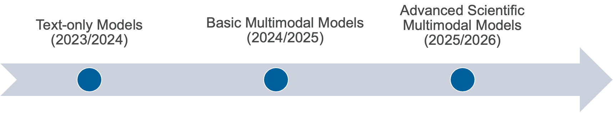
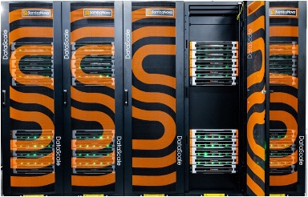
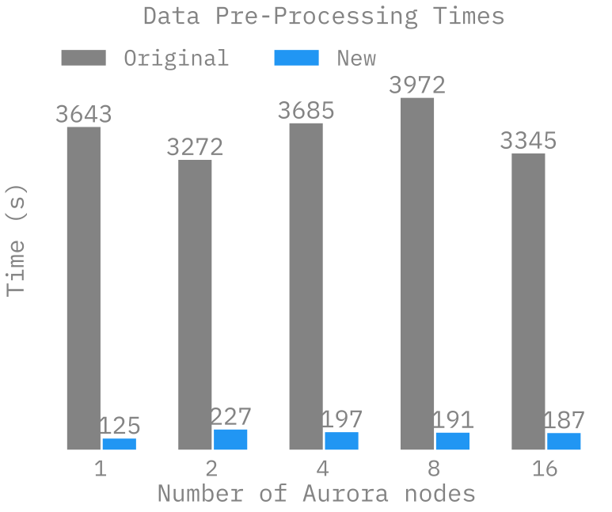

# AuroraGPT: Foundation Models for Science
Sam Foreman
2025-02-12

<link rel="preconnect" href="https://fonts.googleapis.com">

- [🎯 AuroraGPT: Goals](#dart-auroragpt-goals)
- [🦙 Issues with “Publicly Available”
  LLMs](#llama-issues-with-publicly-available-llms)
- [🧪 AuroraGPT: Open Science Foundation
  Model](#test_tube-auroragpt-open-science-foundation-model)
- [📊 AuroraGPT: Outcomes](#bar_chart-auroragpt-outcomes)
- [📚 What do we hope to get?](#books-what-do-we-hope-to-get)
- [🌌 Aurora](#milky_way-aurora)
- [🤖 ALCF AI Testbed](#robot-alcf-ai-testbed)
- [👥 Team Leads](#busts_in_silhouette-team-leads)
- [🤝 Teams](#handshake-teams)
- [📚 Data](#books-data)
- [⏱️ Dataset Processing](#stopwatch-dataset-processing)
  - [🚀 Accelerating Dataset Processing:
    Results](#rocket-accelerating-dataset-processing-results)
- [🦜 Model Training](#parrot-model-training)
- [🤔 Evaluating FM Skills for
  Science](#thinking-evaluating-fm-skills-for-science)
  - [⚖️ Evaluating FM Skills for Science:
    Criteria](#balance_scale-evaluating-fm-skills-for-science-criteria)
- [🧬 MProt-DPO: Scaling Results](#dna-mprot-dpo-scaling-results)
- [📓 References](#notebook-references)
- [❤️ Thank you!](#heart-thank-you)
- [📑 Bibliography](#bookmark_tabs-bibliography)
- [🎁 Extras](#gift-extras)
  - [🧬 MProt-DPO: Scaling Results](#dna-mprot-dpo-scaling-results-1)
  - [🚂 Loooooooooong Sequence
    Lengths](#steam_locomotive-loooooooooong-sequence-lengths)
  - [♻️ Life Cycle of the LLM](#recycle-life-cycle-of-the-llm)
  - [🍎 Training LLMs](#apple-training-llms)

## 🎯 AuroraGPT: Goals

[**AuroraGPT**](https://auroragpt.anl.gov): *General purpose scientific
LLM*  
Broadly trained on a general corpora plus scientific {papers, texts,
data}

- **Explore pathways** towards a “Scientific Assistant” model
- **Build with international partners** (RIKEN, BSC, others)
- **Multilingual** English, 日本語, French, German, Spanish
- **Multimodal**: images, tables, equations, proofs, time series,
  graphs, fields, sequences, etc

Figure 1: Image from [Hannibal046 /
`Awesome-LLM`](https://github.com/Hannibal046/Awesome-LLM)

Figure 2: Credit to the entire AuroraGPT team for slides.

- Here to talk about AuroraGPT, Argonne’s internal effort to build a
  general purpose scientific LLM, broadly trained on a general corpora
  of text + scientific {papers, text, data}
- As part of this effort, we plan to…
  - Explore pathways, build with international partners, multi-{lingual,
    modal}
- Rough timeline of the project and deliverables:
  - 202{3,4}: text-only models, plan to release a series of {7B, 70B,
    1T} models
  - 202{4,5}: Basic multi-modal models
  - 202{5,6}: Advanced scientific multimodal models

## 🦙 Issues with “Publicly Available” LLMs

- **Trust** and **Safety**:
  - Skepticisim about deployment in critical infrastructure
  - Correctness and reliability of model outputs
- **Transparency**:
  - Data governance, what was used for pre-training? fine-tuning?
    - **generally unknown**
  - What is *open source*?
    - Model weights?
    - Pre-training {code, logs, metrics} ?

- Why are we doing this?
- What is the issue with current LLMs?
  - **Trust and safety**
    - Hallucinations, false confidence
    - Can this be reliably mitigated?
    - Scaling up inference compute seems to help
      - reasoning models, TTT, etc.
  - **Transparency**
    - Different frontier labs have different definitions of “open
      source”
    - e.g. Llama no longer releases base models
      - Libgen ??
    - AllenAI institute, olmo models good example

## 🧪 AuroraGPT: Open Science Foundation Model

Figure 3: High-level overview of AuroraGPT project

- AuroraGPT will be a publicly distributed, open source foundation model
  for open science
- Is being trained on:
  - Scientific / engineering structured data
  - General text, media, news, etc.
  - Large amounts of low to medium quality data
  - Much less high quality data (that is publicly available for use)
- This data is then cleaned, processed, de-duplicated and used for the
  initial pre-training phase of the model
- The vast majority of the overall compute is spent during this initial
  pre-training phase
  - This is the group I help to lead and will be talking a bit about
    today
- The initial pre-training phase is currently underway
  - Eventually, given a bit of time, effort and magic, the model will be
    ready for fine-tuning and additional training for a variety of
    downstream tasks
- The pretrained model will then be handed off for additional
  fine-tuning on a variety of downstream tasks
  - Scientific discovery
  - Accelerate scientific tasks
  - Digital twins
  - Inverse design
  - Code optimization
  - Accelerated simulations
  - Autonomous experiments
  - Co-design
- Becoming increasingly clear that LLMs have the potential to
  drastically accelerate computational science
  - We’ve seen this already for {GenSLMs, Weather / Climate / Earth
    Systems Modeling, Particle Physics, etc.}

## 📊 AuroraGPT: Outcomes

- **Datasets and data pipelines** for preparing science training data

- **Software infrastructure and workflows** to train, evaluate and
  deploy LLMs at scale for scientific resarch purposes

  - 
    [argonne-lcf/Megatron-DeepSpeed](https://github.com/argonne-lcf/Megatron-DeepSpeed)  
    End-to-end training and inference, on *any*
    GPU cluster
  - 
    [argonne-lcf/inference-endpoints](https://github.com/argonne-lcf/inference-endpoints)[^1]  
    Inference endpoints for LLMs, hosted @
    ALCF

<!-- -->

- **Evaluation of state-of-the-art LLM Models**:
  - Determine where they fall short in deep scientific tasks
  - Where deep data may have an impact

## 📚 What do we hope to get?

- **Assessment of the approach** of augmenting web training data with
  two forms of data specific to science:
  - Full text scientific papers
  - Structured scientific datasets (suitably mapped to narrative form)
- **Research grade artifacts** (**models**) for scientific community for
  adaptation for downstream uses[^2]
- **Promotion of responsible AI** best practices where we can figure
  them out
- **International Collaborations** around the long term goal of *AGI for
  science*

- Deliverables:
  - datasets, pipelines
  - software infrastructure, workflows to interface with science
    applications
  - checkpoints, models, logs, workbook, insights, etc.
- Hope to understand:
  - How different state-of-the-art models perform at different
    scientific tasks
  - where deep data may have an impact
  - feasibility of generically augmenting text with scientific
    structured data
- Huge undertaking that will require large international collaborations
  around long term goal of AGI for science
- Extra points:
  - Well known that LLMs are good for non-consequential tasks
  - Known to “hallucinate” and create false information
  - Can this be mitigated reliably ??

## 🌌 Aurora

Table 1: Aurora Specs

|       |        |
|------:|:-------|
| Racks | 166    |
| Nodes | 10,624 |
|  CPUs | 21,248 |
|  GPUs | 63,744 |
|  NICs | 84,992 |
|   HBM | 8 PB   |
| DDR5c | 10 PB  |

Figure 4: Aurora: [Fact
Sheet](https://www.alcf.anl.gov/sites/default/files/2024-07/Aurora_FactSheet_2024.pdf).

🏆 [Fastest AI system in the
world](https://www.intel.com/content/www/us/en/newsroom/news/intel-powered-aurora-supercomputer-breaks-exascale-barrier.html)

## 🤖 ALCF AI Testbed

- ALCF AI Testbed Systems are in production and [available for
  allocations](https://accounts.alcf.anl.gov/#/allocationRequests) to
  the research community
- Significant improvement in time-to-solution and energy-efficiency for
  diverse AI for science applications.
- [NAIRR Pilot](https://nairrpilot.org/)

Up to $≈$ **25**$\times$ throughput improvement for genomic FMs with
**6.5**$\times$ energy efficiency

Figure 5: **SambaNova SN-30** 2nd Gen, 8 nodes with 64 AI Accelerators

Figure 6: **Graphcore Bow**: Pod-64 configuration with 64 accelerators

Figure 7: **Cerebras**: 2x CS-2 WSE with Memory-X and Swarm-X
technologies

Figure 8: **GroqRack**: 9 nodes, 8 GroqChip v1.5 Tensor streaming
processors accelerators per node

## 👥 Team Leads

**Planning**

**Data**

**Training**

**Evaluation**

**Post**

**Inference**

**Comms**

**Distribution**

## 🤝 Teams

- **Planning**
- **Data Prep**
  - Accumulate 20+ T tokens of high-quality scientific text and
    structured data
- **Models
  / Training**[^3]
  - Train (entirely from scratch) a series of models on publicly
    available data
- **Evaluation**
  - Skills, trustworthiness, safety, robustness, privacy, machine ethics

- **Post-Training**
  - Fine-tuning, alignment
- **Inference**
  - Model serving, API development / public-facing web services
- **Distribution**
  - Licensing, generating and distributing artifacts for public
    consumption
- **Communication**

## 📚 Data

✅ **Goal**: Assemble a large corpus of documents (general and
scientific) to train and fine-tune AuroraGPT models

- **Challenges**: Avoid / detect contamination with benchmarks
  - Respect copyright (ACM Digital Library), privacy, and ethical
    considerations
- **Performance Challenges**: *High throughput* data processing
  - Converting PDF $\rightarrow$ text (math formula, figures)
  - Convert science information (data) into text (narratives)
  - De-duplication (syntactic and semantic) of scientific documents (to
    avoid memorization, bias)
- **Quantity**: Considering 20+ Trillion tokens $\rightarrow$ $\approx$
  100M papers
- **Domains**: All (long-term) scientific domains, starting with:
  - Material science, Physics, Biology, Computer Science, Climate
    Science

## ⏱️ Dataset Processing

- To train a fixed model on trillions of tokens requires:
  1.  **Aggregating** data from multiple different *corpora*  
      (e.g. ArXiv, Reddit, StackExchange, GitHub, Wikipedia, etc.)
  2.  **Sampling** *each training batch* according to a fixed
      distribution across corpora
  3.  **Building** indices that map batches of tokens into these files
      (indexing)

  

  The original implementation was *slow*:

  - Designed to run *serially* on a **single device**
  - **Major bottleneck** when debugging data pipeline at scale

  

### 🚀 Accelerating Dataset Processing: Results

- Original implementation:
  - **Slow**!
  - 🐌 ~ 1 hr/2T tokens
- [x] Fix:
  - Wrote *asynchronous*, **distributed** implementation
  - *significantly* improves performance (**30x** !!)
  - 🏎️💨 ~ **2 min**/2T tokens

Figure 9: Time spent preparing 2T tokens

## 🦜 Model Training

✅ **Goals**

- Want training runs at scale to be:
  - efficient
  - stable
  - reproducible
- This requires:
  - robust data pipelines / file IO
  - effectively overlapping compute with communication
  - stability across {network, filesystem, machine}
- 3D / Multi-dimensional Parallelism strategies
- Large batch training
- Second order optimizers
- Sub-quadratic attention
- State space models
- *Highly optimized GPU kernels*

❌ **Challenges**

- *Looong time* to train, can be:
  - weeks (even months) of continuous training
  - order of magnitude longer than typical NN training jobs
- Stability issues:
  - failures are expensive (but inevitable)
  - stragglers common at scale
- Individual jobs are:
  - **fragile**
  - only as good as the worst rank
  - one hang or bad worker can crash job
  - network / filesystem / other-user(s) dependent
- Cost / benefits of different collective communication algorithms
  - depend on optimized / efficient implementations
- Network performance
- *Highly optimized GPU kernels*

[argonne-lcf /
Megatron-DeepSpeed](https://github.com/argonne-lcf/Megatron-DeepSpeed)

## 🤔 Evaluating FM Skills for Science

- What to measure?
  - **Knowledge Extraction, Retrieval, Distillation, Synthesis**: LLM is
    provided a question or instruction and a truthful answer is expected
  - **Text Grounded**: Answers are expected to be fully grounded on
    peer-reviewed references to support responses
  - **Reasoning**: LLMs are expected to solve deductive (prove a theory
    or hypothesis from formal logic and observations), inductive
    (validate / explain observations from theories) problems
  - **Creativity**: A creative answer is expected from a question or
    instruction
    - thoughtful dialogue, coding, etc.

### ⚖️ Evaluating FM Skills for Science: Criteria

- Criteria for all of the above:
  - **Correctness** of facts
  - **Accuracy** of solutions and inferences
  - **Reliability** consistently good in quality or performance
  - **Speed** how fast to produce a response
  - **\# shots** how many examples are needed for good quality
    - Extent of *prompt engineering*

## 🧬 MProt-DPO: Scaling Results

Figure 10: Scaling results for `3.5B` Model

## 📓 References

-  [argonne-lcf /
  `Megatron-DeepSpeed`](https://github.com/argonne-lcf/Megatron-DeepSpeed)  
  For the largest of large language
  models.
-  [saforem2 / `ezpz`](https://github.com/saforem2/ezpz)  
  Distributed training, ezpz. 🍋
- 📊 See my other slides at
  [samforeman.me/talks](https://samforeman.me/talks):
  - [LLMs from Scratch](https://saforem2.github.io/llm-workshop-talk)
  - [Creating Small(~ish) LLMs](https://saforem2.github.io/LLM-tutorial)
  - [Parallel Training
    Techniques](https://saforem2.github.io/parallel-training-slides)
  - [LLMs on
    Polaris](https://samforeman.me/talks/llms-on-polaris/#/title-slide)
  - [Training LLMs at Scale](https://samforeman.me/talks/llms-at-scale/)

- 👀 See also:
  - [New international consortium for generative AI models for
    science](https://www.anl.gov/article/new-international-consortium-formed-to-create-trustworthy-and-reliable-generative-ai-models-for)
  - [PyTorch Distributed
    Overview](https://pytorch.org/tutorials/beginner/dist_overview.html)
  - [🤗 Efficient Training on Multiple
    GPUs](https://huggingface.co/docs/transformers/en/perf_train_gpu_many)
  - [Getting Started -
    DeepSpeed](https://www.deepspeed.ai/getting-started/)
  - 🕸️ [Quality Measures for Dynamic Graph Generative
    Models](https://openreview.net/forum?id=8bjspmAMBk)  
    (Hosseini et al. 2025)

## ❤️ Thank you!

- Organizers

- Feel free to reach out!

  <split even>

  [<i class="fas fa-home"></i>](https://samforeman.me)
  [<i class="far fa-paper-plane"></i>](mailto:///foremans@anl.gov)
  [<i class="fab fa-twitter"></i>](https://www.twitter.com/saforem2)

  </split>

> [!NOTE]
>
> ### 🙏 Acknowledgements
>
> This research used resources of the Argonne Leadership Computing
> Facility, which is a DOE Office of Science User Facility supported
> under Contract DE-AC02-06CH11357.

## 📑 Bibliography

- Refs:
  - Wei et al. (2022)
  - Animations from [The Illustrated
    Transformer](http://jalammar.github.io/illustrated-transformer/)

Dharuman, Gautham, Kyle Hippe, Alexander Brace, Sam Foreman, Väinö
Hatanpää, Varuni K. Sastry, Huihuo Zheng, et al. 2024. “MProt-DPO:
Breaking the ExaFLOPS Barrier for Multimodal Protein Design Workflows
with Direct Preference Optimization.” In *Proceedings of the
International Conference for High Performance Computing, Networking,
Storage, and Analysis*. SC ’24. Atlanta, GA, USA: IEEE Press.
<https://doi.org/10.1109/SC41406.2024.00013>.

Hosseini, Ryien, Filippo Simini, Venkatram Vishwanath, Rebecca Willett,
and Henry Hoffmann. 2025. “Quality Measures for Dynamic Graph Generative
Models.” In *The Thirteenth International Conference on Learning
Representations*. <https://openreview.net/forum?id=8bjspmAMBk>.

Song, Shuaiwen Leon, Bonnie Kruft, Minjia Zhang, Conglong Li, Shiyang
Chen, Chengming Zhang, Masahiro Tanaka, et al. 2023. “DeepSpeed4Science
Initiative: Enabling Large-Scale Scientific Discovery Through
Sophisticated AI System Technologies.”
<https://arxiv.org/abs/2310.04610>.

Wei, Jason, Yi Tay, Rishi Bommasani, Colin Raffel, Barret Zoph,
Sebastian Borgeaud, Dani Yogatama, et al. 2022. “Emergent Abilities of
Large Language Models.” <https://arxiv.org/abs/2206.07682>.

Yang, Jingfeng, Hongye Jin, Ruixiang Tang, Xiaotian Han, Qizhang Feng,
Haoming Jiang, Bing Yin, and Xia Hu. 2023. “Harnessing the Power of LLMs
in Practice: A Survey on ChatGPT and Beyond.”
<https://arxiv.org/abs/2304.13712>.

## 🎁 Extras

### 🧬 MProt-DPO: Scaling Results

Figure 11: `3.5B` model

Figure 12: `7B` model

### 🚂 Loooooooooong Sequence Lengths

- Working with [
  Microsoft/DeepSpeed](https://github.com/microsoft/DeepSpeed) team to
  enable longer sequence lengths (context windows) for LLMs
  - See my [blog
    post](https://samforeman.me/posts/auroragpt/long-sequences/) for
    additional details

Figure 13: Maximum (achievable) `SEQ_LEN` for both `25B` and `33B`
models (See: Song et al. (2023))

[ `scaling4science`](https://github.com/saforem2/scaling4science)  
[
`Megatron-DS-Benchmarking`](https://github.com/saforem2/Megatron-DS-Benchmarking)

### ♻️ Life Cycle of the LLM

### 📝 Pre-training

Figure 14: **Pre-training**: Virtually all of the compute used during
pretraining phase

### 🎀 Fine-Tuning

Figure 15: **Fine-tuning**: Fine-tuning actually updates the model’s
weights to make the model better at a certain task.

### 🍎 Training LLMs

Figure 16: It’s hungry!

Figure 17: Visualization from Yang et al. (2023)

[^1]: Relies *heavily* on [Globus](https://globus.org) (next talk!)

[^2]:

    🔔 Gordon Bell Finalist:
    [MProt-DPO](https://dl.acm.org/doi/10.1109/SC41406.2024.00013)
    (Dharuman et al. 2024)

[^3]: Co-led by: Venkat Vishwanath, **Sam Foreman**
