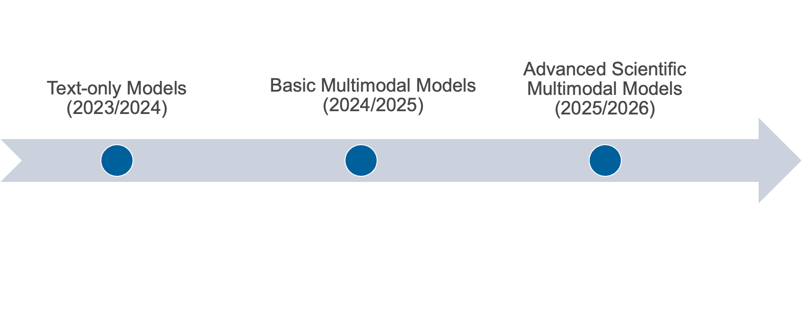

# AuroraGPT
[Sam Foreman](https://samforeman.me)
[<span class="orcid-green"></span>](https://orcid.org/0000-0002-9981-0876)
2024-09-04

## AuroraGPT Goals

<!-- ::: {.flex-container style="flex-direction: column;"} -->

<div class="flex-container"
style="flex-direction: column; justify-content: space-around;">

<div class="flex-container"
style="flex-direction: row; justify-content: space-around; align-items:center;">

<div class="col1">

<div class="blue-card" style="margin-bottom: 0.5em;">

**AuroraGPT**: *General purpose scientific LLM*  
Broadly trained on a general corpora plus scientific {papers, texts,
data}

</div>

- **Explore pathways** towards a “Scientific Assistant” model
- **Build with international partners** (RIKEN, BSC, others)
- **Multilingual** English, 日本語, French, German, Spanish
- **Multimodal**: images, tables, equations, proofs, time series,
  graphs, fields, sequences , etc

<!-- - Model sizes: `7B` initially, {`70B`, ~ `1T`} to follow -->
<!-- -  [`Megatron-DeepSpeed`](https://github.com/argonne-lcf/Megatron-DeepSpeed) -->
<!--     - ✅ {Intel, NVIDIA, AMD} -->

</div>

<div class="col2" style="width:75%;">

[](https://github.com/Hannibal046/Awesome-LLM/raw/main/resources/)

</div>

</div>



</div>

<span class="center">**Credit to the entire AuroraGPT team for
slides**</span>

<!-- ::: -->
<!--
- Being trained on:
&#10;  :::: {.flex-container style="flex-direction:row; justify-content: space-around;"}
&#10;  ::: {.flex-container style="flex-direction:column;"}
&#10;   🇺🇸English  
   🇯🇵日本語  
   🇫🇷French  
   🇩🇪Deutsch  
   🇪🇸Español[^bsc]  
   🇮🇹Italian  
&#10;  :::
&#10;  ::: {.flex-container style="flex-direction:column;"}
&#10;  🧪 scientific text  
  🖼️ images  
  📊 tables  
  ➕ equations  
  📖 proofs
&#10;  :::
&#10;  ::: {.flex-container style="flex-direction:column;"}
&#10;  📆 structured data  
  ⛓️ sequences  
  ⏰ time-series  
  🕸️ graphs  
  🌀 fields
&#10;  :::
&#10;  ::::
&#10;[^riken]:|
    [Argonne and RIKEN sign a MOU in support of AI for science](https://www.anl.gov/article/argonne-and-riken-sign-a-memorandum-of-understanding-in-support-of-ai-for-science)
&#10;[^bsc]:|
    Collaborations with Barcelona Supercomputing Center
&#10;-->

## AuroraGPT: Open Science Foundation Models

<div id="fig-project-goals">


Figure 1

</div>

## AuroraGPT Outcomes

- **Datasets and data pipelines** for preparing science training data
- **Software infrastructure and workflows** to train, evaluate and
  deploy LLMs at scale for scientific resarch purposes
- **Evaluation of state-of-the-art LLM Models** to determine where they
  fall short in deep scientific tasks and where deep data may have an
  impact
- **Assessment of the approach** of augmenting web training data with
  two forms of data specific to science
  - Full text scientific papers
  - Structured scientific datasets (suitably mapped to narrative form)
- **Research grade artifacts** (**models**) for scientific community for
  adaptation for downstream uses
- **Promotion of responsible AI** best practices where we can figure
  them out
- **International Collaborations** around the long term foal of *AGI for
  science*

## Aurora

<div class="flex-container">

<!--
::: {.blue-card style="width:30%;"}
&#10;166 Racks  
10,624 Nodes  
21,248 CPUs  
63,744 GPUs  
84,992 NICs  
8 PB HBM  
10 PB DDR5c
&#10;:::
-->
<div id="tbl-aurora">

Table 1: Aurora Specs

| <!-- --> | <!-- --> |
|----------|:--------:|
| Racks    |   166    |
| Nodes    |  10,624  |
| CPUs     |  21,248  |
| GPUs     |  63,744  |
| NICs     |  84,992  |
| HBM      |   8 PB   |
| DDR5c    |  10 PB   |
| <!-- --> | <!-- --> |

</div>
<div id="fig-aurora">


Figure 2: [Aurora Fact
Sheet](https://www.alcf.anl.gov/sites/default/files/2024-07/Aurora_FactSheet_2024.pdf)

</div>

</div>

<div style="width:40%; text-align: center; margin-left: auto; margin-right: auto;">


<!-- [Aurora Fact Sheet](https://www.alcf.anl.gov/sites/default/files/2024-07/Aurora_FactSheet_2024.pdf) -->

</div>

<!-- [^aurora]:| -->
<!--     [The Computer That Will Change Everything – Chicago Magazine](https://www.chicagomag.com/chicago-magazine/february-2023/the-computer-that-will-change-everything/) -->

## ALCF AI Testbed

ALCF AI Testbed Systems are in production and [available for
allocations](https://accounts.alcf.anl.gov/#/allocationRequests) to the
research community[^1]

<div class="flex-container" style="height: -webkit-fill-available;">

<div id="fig-sambanova">


Figure 3: SambaNova SN-30: 2nd Gen, 8 nodes with 64 AI Accelerators

</div>
<div id="fig-graphcore">


Figure 4: Graphcore Bow generation accelerators: Pod-64 configuration
with 64 accelerators

</div>
<div id="fig-cerebras">


Figure 5: Cerebras, 2x CS-2 WSE with Memory-X and Swarm-X technologies

</div>
<div id="fig-groq">


Figure 6: GroqRack - nine nodes, with eight GroqChip v1.5 Tensor
streaming processors accelerators per node

</div>

</div>

## Team Leads

<div style="font-size: 70%;">

<div class="flex-container" style="text-align: center;">

**Planning**

  
Rick Stevens[^2]

  
Ian Foster

  
Rinku Gupta

  
Mike Papka

  
Arvind Ramanathan

  
Fangfang Xia

</div>

<div class="flex-container" style="text-align: center;">

<div class="col2">

**Data**

  
Ian Foster

  
Robert Underwood

</div>

<div class="col2">

**Models / Training**

  
Venkat Vishwanath

  
<span style="color: #ff1a8f; background-color: oklch(from #ff1a8f calc(l * 1.15) c h / 0.1);">Sam
Foreman</span>

</div>

<div class="col2">

**Evaluation**

  
Franck Cappello

  
Sandeep Madireddy

  
Bo Li

</div>

<div class="col2">

**Post**

  
Eliu Huerta

  
Azton Wells

</div>

<div class="col2">

**Inference**

  
Rajeev Thakur

</div>

<div class="col2">

**Comms**

  
Charlie Catlett

  
David Martin

</div>

<div class="col2">

**Distribution**

  
Brad Ullrich

</div>

</div>

</div>

## Teams

<div class="flex-container">

<div class="col1">

- **Planning**
- **Data Prep**
  - Accumulate 20+ T tokens of high-quality scientific text and
    structured data
- <span style="background: oklch(from #ff1a8f calc(l * 1.15) c h / 0.1); border: 1px solid #ff1a8f; border-radius: 0.25px;">**Models
  / Training**</span>[^3]
  - Train (entirely from scratch) a series of models on publicly
    available data
- **Evaluation**
  - Skills, trustworthiness, safety, robustness, privacy, machine ethics

</div>

<div class="col2">

- **Post-Training**
  - Fine-tuning, alignment
- **Inference**
  - Model serving, API development / public-facing web services
- **Distribution**
  - Licensing, generating and distributing artifacts for public
    consumption
- **Communication**

</div>

</div>

## Model Training

<div class="flex-container scrollable"
style="text-align: left; width: 100%; justify-content: space-around; line-height: 1em;">

<div class="col1" width="48%"
style="background: oklch(from #03BD00 calc(l * 1.15) c h / 0.1); border: 1px solid #03BD00; border-radius: 0.25em; padding: 3pt 8pt; margin-left: 5pt; margin-right: 5pt;">

✅ <span style="color: #03BD00;">**Goals**</span>

- Want training runs at scale to be
  - efficient
  - stable
  - reproducible
- This requires
  - robust data pipelines / file IO
  - effectively overlapping compute with communication
  - stability across {network, filesystem, machine}
- For larger models
  - 3D Parallelism
  - multi-dimensional parallelism strategies
- *Highly optimized GPU kernels*

<!--
- State space models
- Large batch training
- Sub-quadratic attention
- Second order optimizers
-->

</div>

<div class="col2" width="48%"
style="background: oklch(from #E90102 calc(l * 1.15) c h / 0.1); border: 1px solid #E90102; border-radius: 0.25em; padding: 3pt 8pt; margin-left: 5pt; margin-right: 5pt;">

❌ <span style="color: #E90102;">**Difficulties**</span>

- *Looong time* to train

- Stability issues

  - failures are **expensive** (and unavoidable)
  - stragglers common at scale

- Individual jobs are:

  - **fragile**
  - only as good as the worst rank
  - one hang or bad worker can crash job
  - network / filesystem / other-user(s) dependent

- Cost / benefits of different collective communication algorithms

  - depend on optimized / efficient implementations

- Network performance

- *Highly optimized GPU kernels*

</div>

</div>

<div class="notes">

- Since training takes ~ weeks, want to be sure we’re using the time
  wisely
- This is difficult due to issues beyond our control
- What can we do?

</div>

## Accelerating Dataset Processing at Scale for Training

<div class="flex-container"
style="font-size: 70%; flex-direction: column;">

<div class="col1">

- To train a fixed model on trillions of tokens requires:
  - Aggregating data from multiple different *corpora* (e.g. Reddit,
    StackExchange, GitHub, etc.)
  - Sampling *each training batch* according to a fixed distribution
    across corpora
  - Building indices that map batches of tokens into these files
    (indexing)
    <!-- - Build a set of indices that map training iterations to batches of tokens (and their location on the filesystem) -->
- The original implementation was slow, and designed to run on a single
  device
  - Major bottleneck when debugging data pipeline at scale
- [x] Completely re-wrote an asynchronous, distributed implementation
  that *significantly* improves performance

</div>

<div class="flex-container center"
style="text-align:center; font-size: 75%; width: 88%; margin-left: auto; margin-right: auto;">


</div>

</div>

<!--
## Training at Scale {background-color="white"}
&#10;::: {.flex-container}
&#10;::: {.col1}
- 3D Parallelism
- Highly optimized GPU kernels
- Network performance
- Cost / benefits of different collective communication algorithms
    - depend on optimized / efficient implementations
:::
&#10;::: {.col2}
- Large batch training
- Second order optimizers
- State space models
- Sub-quadratic attention (?)
:::
&#10;:::
-->

## References

<div class="flex-container">

<div class="col1">

- 🏡 [samforeman.me](https://samforeman.me):
  - 🦜 [Talks](https://samforeman.me/talks/):
    - [HPC User Forum](https://samforeman.me/talks/hpc-user-forum/)
      \[[slides](https://samforeman.me/talks/hpc-user-forum/slides.html)\]
- See my other slides on:
  - [LLMs from Scratch](https://saforem2.github.io/llm-workshop-talk)
  - [Creating Small(~ish) LLMs](https://saforem2.github.io/LLM-tutorial)
  - [Parallel Training
    Techniques](https://saforem2.github.io/parallel-training-slides)
  - [LLMs on
    Polaris](https://samforeman.me/talks/llms-on-polaris/#/title-slide)
  - [Training LLMs at Scale](https://samforeman.me/talks/llms-at-scale/)

</div>

<!-- ## 📓 References {background-color="white"} -->

<div class="col2">

- [🏎️
  `argonne-lcf/Megatron-DeepSpeed`](https://github.com/argonne-lcf/Megatron-DeepSpeed)  
  <span class="dim-text">For the largest of large language
  models.</span>
- [🍋 `saforem2/ezpz`](https://github.com/saforem2/ezpz)  
  <span class="dim-text">Distributed training, ezpz.</span>
- 👀 See also:
  - [New international consortium for generative AI models for
    science](https://www.anl.gov/article/new-international-consortium-formed-to-create-trustworthy-and-reliable-generative-ai-models-for)
  - [PyTorch Distributed
    Overview](https://pytorch.org/tutorials/beginner/dist_overview.html)
  - [Distributed Data Parallel — PyTorch master
    documentation](https://pytorch.org/docs/master/notes/ddp.html)
  - [🤗 Efficient Training on Multiple
    GPUs](https://huggingface.co/docs/transformers/en/perf_train_gpu_many)
  - [Getting Started -
    DeepSpeed](https://www.deepspeed.ai/getting-started/)

</div>

</div>

### ❤️ Thank you!

- Organizers

- Feel free to reach out!

  <split even>

  [<i class="fas fa-home"></i>](https://samforeman.me)
  [<i class="far fa-paper-plane"></i>](mailto:///foremans@anl.gov)
  [<i class="fab fa-twitter"></i>](https://www.twitter.com/saforem2)

  </split>

> [!NOTE]
>
> ### 🙏 Acknowledgements
>
> This research used resources of the Argonne Leadership Computing
> Facility, which is a DOE Office of Science User Facility supported
> under Contract DE-AC02-06CH11357.

### 📑 Bibliography

- Refs:
  - Wei et al. (2022)
  - Animations from [The Illustrated
    Transformer](http://jalammar.github.io/illustrated-transformer/)

<div id="refs" class="references csl-bib-body hanging-indent"
entry-spacing="0">

<div id="ref-song2023ds4sci" class="csl-entry">

Song, Shuaiwen Leon, Bonnie Kruft, Minjia Zhang, Conglong Li, Shiyang
Chen, Chengming Zhang, Masahiro Tanaka, et al. 2023. “DeepSpeed4Science
Initiative: Enabling Large-Scale Scientific Discovery Through
Sophisticated AI System Technologies.”
<https://arxiv.org/abs/2310.04610>.

</div>

<div id="ref-wei2022emergentabilitieslargelanguage" class="csl-entry">

Wei, Jason, Yi Tay, Rishi Bommasani, Colin Raffel, Barret Zoph,
Sebastian Borgeaud, Dani Yogatama, et al. 2022. “Emergent Abilities of
Large Language Models.” <https://arxiv.org/abs/2206.07682>.

</div>

<div id="ref-yang2023harnessing" class="csl-entry">

Yang, Jingfeng, Hongye Jin, Ruixiang Tang, Xiaotian Han, Qizhang Feng,
Haoming Jiang, Bing Yin, and Xia Hu. 2023. “Harnessing the Power of LLMs
in Practice: A Survey on ChatGPT and Beyond.”
<https://arxiv.org/abs/2304.13712>.

</div>

</div>

## 🎁 Extras

### 🔍 Details

- Llama Style Architecture:
  - [
    `argonne-lcf/Megatron-DeepSpeed`](https://github.com/argonne-lcf/Megatron-DeepSpeed)
- Performant training implementations of AuroraGPT architecture on
  - {Aurora, Polaris, Cerebras, SambaNova}
- Workflow to capture:
  - loss curves
  - snapshots, checkpoints
  - scaling / performance data
- Training runs for AuroraGPT-7B <span class="dim-text">(ongoing)</span>
  - Baseline (Dolma) @ {Aurora, Polaris} <span class="dim-text">(twins
    for debugging)</span>
  - Baseline + Science @ Aurora
- Trained raw models 📮 delivered to post-pretraining team
  - AuroraGPT-7B-A, AuroraGPT-7B-P, AuroraGPT-7B-S  
    (A=`Aurora`, P=`Polaris`, S=`Science`)

### 🤔 Why?

- **For Science!**
- Data-{sets, pipelines} for {preparing, aggregating, parsing,
  analyzing} scientific data
- Infrastructure to {train, eval, deploy} LLMs for science
  - Comparative analysis across: {models, tasks, languages, contexts, …}
- Augment text data from the web with:
  - full text papers
  - structured scientific data[^4]
- Safety-driven, publicly-visible, open-source approach:
  - Distribution of research grade artifacts (models, checkpoints, etc.)
  - International collaborations on AGI for science

### ♻️ Life Cycle of the LLM

<div class="panel-tabset" style="text-align:center">

#### 📝 Pre-training

<div id="fig-pretraining">


Figure 7: **Pre-training**: Virtually all of the compute used during
pretraining phase

</div>

#### 🎀 Fine-Tuning

<div id="fig-fine-tuning">


Figure 8: **Fine-tuning**: Fine-tuning actually updates the model’s
weights to make the model better at a certain task.

</div>

</div>

### 🍎 Training LLMs

<div class="flex-container" style="align-items: flex-end;">

<div class="col1" style="width:33%;">

<div id="fig-it-hungers">


Figure 9: It’s hungry!

</div>

</div>

<div class="col2" style="width:60%;">

<div id="fig-evolution">


Figure 10: Visualization from Yang et al. (2023)

</div>

</div>

</div>

### 🚂 Loooooooooong Sequence Lengths

<div class="flex-container"
style="text-align: center; align-items: center;">


<span class="dim-text"
style="font-size: 2.0em; padding-left: 15pt;"></span>


</div>

<!-- - Working with [ Microsoft -->
<!-- DeepSpeed](https://github.com/microsoft/DeepSpeed) team to enable longer -->
<!-- sequence lengths (context windows) for LLMs -->
<div id="fig-long-seq">

<div class="flex-container">


</div>

Figure 11: Maximum (achievable) `SEQ_LEN` for both `25B` and `33B`
models (See: Song et al. (2023))

</div>

<div class="aside">

[ `scaling4science`](https://github.com/saforem2/scaling4science)  
[
`Megatron-DS-Benchmarking`](https://github.com/saforem2/Megatron-DS-Benchmarking)

</div>

### 💾 Evaluating Checkpoints

``` python
from typing import Optional
import os
from pathlib import Path

from transformers import LlamaForCausalLM, AutoTokenizer

tokenizer = AutoTokenizer.from_pretrained("meta-llama/Llama-2-7B-hf")

def load_model(ckpt_dir) -> LlamaForCausalLM:
    return LlamaForCausalLM.from_pretrained(ckpt_dir)

def eval_model(model, max_length: int, prompt: str) -> str:
    return (
        tokenizer.batch_decode(
            model.generate(
                **tokenizer(prompt, return_tensors="pt"),
                 max_length=max_length,
            ),
            clean_up_tokenization_spaces=True,
            skip_special_tokens=True,
        )[0]
    )

def load_and_eval_model_from_checkpoint(
        step: int,
        max_length: int = 64,
        prompt: Optional[str] = None,
        ckpt_root: Optional[os.PathLike | Path | str] = None,
) -> str:
    print(f"Loading model from checkpoint at global step: {step}")
    prompt = "What is it like in there?" if prompt is None else prompt
    ckpt_root = Path("checkpoints") if ckpt_root is None else Path(ckpt_root)
    ckpt_dir = ckpt_root.joinpath(f"global_step{step}")
    return (
        eval_model(
            model=load_model(ckpt_dir.as_posix())
            max_length=max_length,
            prompt=prompt,
        )
    )
```

### Model Evaluations

<div class="panel-tabset">

#### 7000

Tokens: 88B

``` python
>>> print(load_checkpoint(7000))
Loading model from checkpoint at global step: 7000
"What is it like in there?"
"""
I'm not sure if it's a good idea to use a different name for the same thing,
but I'm sure it's a good idea to use a different name for the same thing.
I'm not sure if it's a good idea to use a different name for the same thing,
but I'm sure it's a good idea to use a different name for the same thing.
I'm not sure if it's a good idea to use a different name for the same thing,
but I'm sure it
"""
```

#### 12000

Tokens: 150B

``` python
>>> print(load_checkpoint(12000))
Loading model from checkpoint at global step: 12000
"What is it like in there?"
"""
What is it like in there?
The people are very friendly and helpful.
What is it like in there?
The people are very friendly and helpful.
What is it like in there?
The people are very friendly and helpful.
What is it like in there?
The people are very friendly and helpful.
What is it like in there?
The people are very friendly and helpful.
What is it like in there?
"""
```

#### 17000

Tokens: 215B

``` python
>>> print(load_checkpoint(17000))
Loading model from checkpoint at global step: 17000
"What is it like in there?"
"""
I’m not sure what to expect. I’m not sure what to expect from the people I’m
with. I’m not sure what to expect from the people I’m with. I’m not sure what
to expect from the people I’m with. I’m not sure what to expect from the people
I’m with.
I’m not sure what to expect from the people I’m with.
I’m not sure what to expect from the people I’m with.
I’m not sure what to expect from the people
"""
```

#### 22000

Tokens: 277B

``` python
>>> print(load_checkpoint(22000))
Loading model from checkpoint at global step: 22000
"What is it like in there?"
"""
I’m a 20 year old guy from the UK. I’m a student at the University of
Manchester, studying Computer Science. I’m a big fan of the band, The Beatles,
and I’m a huge fan of the movie, The Wizard of Oz. I’m a huge fan of the band,
The Beatles, and I’m a huge fan of the movie, The Wizard of Oz.
I’m a big fan of the band, The Beatles, and I’m a huge fan of the movie
"""
```

#### 32000

Tokens: 400B

``` python
>>> print(load_checkpoint(32000))
Loading model from checkpoint at global step: 32000
"What is it like in there?"
"""
I've been to the US and I've been to Canada.
In the US, it's a lot like the US.
In Canada, it's a lot like the US.
In the US, it's a lot like the US.
In Canada, it's a lot like the US.
In the US, it's a lot like the US.
In Canada, it's a lot like the US.
In the US, it's
"""
```

#### 40000

Tokens: 503B

``` python
>>> print(load_checkpoint(40000))
Loading model from checkpoint at global step: 40000
"What is it like in there?"
"""
The first thing you notice when you enter the room is the size. It’s huge. It’s
like a football field. It’s a lot of space.
The second thing you notice is the light. It’s bright. It’s bright.
The third thing you notice is the sound. It’s loud. It’s loud.
The fourth thing you notice is the smell. It’s a lot of smells. It’s a lot of smells.
The fifth thing you notice is the temperature. It’s hot.
"""
```

</div>

[^1]: https://nairrpilot.org

[^2]: Lead

[^3]: Co-led by: Venkat Vishwanath, Sam Foreman

[^4]: Can be much more difficult than text (or even image) data
